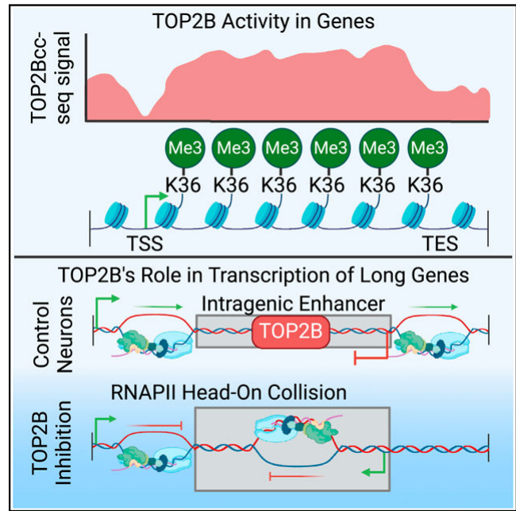

## Question

# Gene Research for Functional Annotation

## ⚠️ CRITICAL: Gene/Protein Identification Context

**BEFORE YOU BEGIN RESEARCH:** You MUST verify you are researching the CORRECT gene/protein. Gene symbols can be ambiguous, especially for less well-characterized genes from non-model organisms.

### Target Gene/Protein Identity (from UniProt):
- **UniProt Accession:** Q02880
- **Protein Description:** RecName: Full=DNA topoisomerase 2-beta; EC=5.6.2.2 {ECO:0000255|PROSITE-ProRule:PRU00995, ECO:0000269|PubMed:10684600}; AltName: Full=DNA topoisomerase II, beta isozyme;
- **Gene Information:** Name=TOP2B;
- **Organism (full):** Homo sapiens (Human).
- **Protein Family:** Belongs to the type II topoisomerase family. .
- **Key Domains:** DNA_Topoisomerase_II. (IPR050634); DTHCT. (IPR012542); HATPase_C_sf. (IPR036890); Ribosomal_Su5_D2-typ_SF. (IPR020568); Ribsml_uS5_D2-typ_fold_subgr. (IPR014721)

### MANDATORY VERIFICATION STEPS:

1. **Check if the gene symbol "TOP2B" matches the protein description above**
2. **Verify the organism is correct:** Homo sapiens (Human).
3. **Check if protein family/domains align with what you find in literature**
4. **If you find literature for a DIFFERENT gene with the same or similar symbol, STOP**

### If Gene Symbol is Ambiguous or You Cannot Find Relevant Literature:

**DO NOT PROCEED WITH RESEARCH ON A DIFFERENT GENE.** Instead:
- State clearly: "The gene symbol 'TOP2B' is ambiguous or literature is limited for this specific protein"
- Explain what you found (e.g., "Found extensive literature on a different gene with the same symbol in a different organism")
- Describe the protein based ONLY on the UniProt information provided above
- Suggest that the protein function can be inferred from domain/family information

### Research Target:

Please provide a comprehensive research report on the gene **TOP2B** (gene ID: TOP2B, UniProt: Q02880) in human.

The research report should be a detailed narrative explaining the function, biological processes, and localization of the gene product. Citations should be given for all claims.

You should prioritize authoritative reviews and primary scientific literature when conducting research. You can supplement
this with annotations you find in gene/protein databases, but these can be outdated or inaccurate.

We are specifically interested in the primary function of the gene - for enzymes, what reaction is catalyzed, and what is the substrate specificity? For transporters, what is the substrate? For structural proteins or adapters, what is the broader structural role? For signaling molecules, what is the role in the pathway.

We are interested in where in or outside the cell the gene product carries out its function.

We are also interested in the signaling or biochemical pathways in which the gene functions. We are less interested in broad pleiotropic effects, except where these elucidate the precise role.

Include evidence where possible. We are interested in both experimental evidence as well as inference from structure, evolution, or bioinformatic analysis. Precise studies should be prioritized over high-throughput, where available.

## Output

Question: You are an expert researcher providing comprehensive, well-cited information.

Provide detailed information focusing on:
1. Key concepts and definitions with current understanding
2. Recent developments and latest research (prioritize 2023-2024 sources)
3. Current applications and real-world implementations
4. Expert opinions and analysis from authoritative sources
5. Relevant statistics and data from recent studies

Format as a comprehensive research report with proper citations. Include URLs and publication dates where available.
Always prioritize recent, authoritative sources and provide specific citations for all major claims.

# Gene Research for Functional Annotation

## ⚠️ CRITICAL: Gene/Protein Identification Context

**BEFORE YOU BEGIN RESEARCH:** You MUST verify you are researching the CORRECT gene/protein. Gene symbols can be ambiguous, especially for less well-characterized genes from non-model organisms.

### Target Gene/Protein Identity (from UniProt):
- **UniProt Accession:** Q02880
- **Protein Description:** RecName: Full=DNA topoisomerase 2-beta; EC=5.6.2.2 {ECO:0000255|PROSITE-ProRule:PRU00995, ECO:0000269|PubMed:10684600}; AltName: Full=DNA topoisomerase II, beta isozyme;
- **Gene Information:** Name=TOP2B;
- **Organism (full):** Homo sapiens (Human).
- **Protein Family:** Belongs to the type II topoisomerase family. .
- **Key Domains:** DNA_Topoisomerase_II. (IPR050634); DTHCT. (IPR012542); HATPase_C_sf. (IPR036890); Ribosomal_Su5_D2-typ_SF. (IPR020568); Ribsml_uS5_D2-typ_fold_subgr. (IPR014721)

### MANDATORY VERIFICATION STEPS:

1. **Check if the gene symbol "TOP2B" matches the protein description above**
2. **Verify the organism is correct:** Homo sapiens (Human).
3. **Check if protein family/domains align with what you find in literature**
4. **If you find literature for a DIFFERENT gene with the same or similar symbol, STOP**

### If Gene Symbol is Ambiguous or You Cannot Find Relevant Literature:

**DO NOT PROCEED WITH RESEARCH ON A DIFFERENT GENE.** Instead:
- State clearly: "The gene symbol 'TOP2B' is ambiguous or literature is limited for this specific protein"
- Explain what you found (e.g., "Found extensive literature on a different gene with the same symbol in a different organism")
- Describe the protein based ONLY on the UniProt information provided above
- Suggest that the protein function can be inferred from domain/family information

### Research Target:

Please provide a comprehensive research report on the gene **TOP2B** (gene ID: TOP2B, UniProt: Q02880) in human.

The research report should be a detailed narrative explaining the function, biological processes, and localization of the gene product. Citations should be given for all claims.

You should prioritize authoritative reviews and primary scientific literature when conducting research. You can supplement
this with annotations you find in gene/protein databases, but these can be outdated or inaccurate.

We are specifically interested in the primary function of the gene - for enzymes, what reaction is catalyzed, and what is the substrate specificity? For transporters, what is the substrate? For structural proteins or adapters, what is the broader structural role? For signaling molecules, what is the role in the pathway.

We are interested in where in or outside the cell the gene product carries out its function.

We are also interested in the signaling or biochemical pathways in which the gene functions. We are less interested in broad pleiotropic effects, except where these elucidate the precise role.

Include evidence where possible. We are interested in both experimental evidence as well as inference from structure, evolution, or bioinformatic analysis. Precise studies should be prioritized over high-throughput, where available.

# Research Report: Human TOP2B (UniProt Q02880) — Functional Annotation and Current Evidence

## 0. Target verification (gene/protein identity)
The research target is **human TOP2B** (UniProt **Q02880**), **DNA topoisomerase II beta (EC 5.6.2.2)**, a **type II DNA topoisomerase**. The retrieved literature explicitly describes **human TOP2B** as a nuclear enzyme that uses **ATP-dependent strand passage** via transient, enzyme-linked **double-strand breaks (DSBs)**, matching the UniProt description and the type II topoisomerase family/domain expectations (ling2022acomprehensivestructural pages 1-4, ling2022acomprehensivestructural pages 4-5).

## 1. Key concepts, definitions, and current understanding

### 1.1 What TOP2B is (core definition)
**DNA topoisomerase IIβ (TOP2B)** is a type II topoisomerase that **changes DNA topology** by an **ATP-dependent strand-passage reaction**. Mechanistically, one duplex DNA segment (“**G-DNA**”, gate) is **transiently cleaved** to create an enzyme-bridged break, and a second duplex (“**T-DNA**”, transported) is passed through; the G-DNA is then religated, and ATP hydrolysis resets the enzyme cycle (ling2022acomprehensivestructural pages 1-4, ling2022acomprehensivestructural pages 4-5).

### 1.2 Catalytic reaction and substrate specificity
**Substrate:** duplex DNA; **co-substrate/energy source:** ATP. TOP2B couples DNA cleavage/religation and DNA transport to ATP binding/hydrolysis (ling2022acomprehensivestructural pages 1-4, ling2022acomprehensivestructural pages 4-5, ling2022acomprehensivestructural pages 14-15).

Key biochemical/structural points relevant for functional annotation:
- TOP2B “**modulates DNA topology using energy from ATP hydrolysis**” (ling2022acomprehensivestructural pages 1-4).
- Strand passage requires ATP hydrolysis, though cleavage can occur without ATP (ling2022acomprehensivestructural pages 1-4).
- The N-terminal ATPase domain has a Bergerat/GHKL fold; **E103** acts as a catalytic base for ATP hydrolysis (E103A abolishes ATP hydrolysis) (ling2022acomprehensivestructural pages 4-5, ling2022acomprehensivestructural pages 14-15).
- Reported ATPase kinetic parameters (construct-dependent): e.g., **Km ~0.115 mM** for ATP for a 45–444 ATPase-domain construct (ling2022acomprehensivestructural pages 12-14).

### 1.3 Functional meaning of “TOP2B cleavage complexes”
During catalysis, TOP2B forms covalent, enzyme-linked DNA cleavage intermediates (“TOP2Bcc”). These can be **trapped by topoisomerase poisons** (e.g., etoposide) and are biologically important because processing of trapped cleavage complexes can yield DNA damage signals and DSBs (segev2024mappingcatalyticallyengaged pages 1-3, segev2024mappingcatalyticallyengaged pages 3-5).

## 2. Biological roles and pathways (mechanism-first functional annotation)

### 2.1 Primary cellular role: resolving transcription-associated torsional stress and shaping transcriptional programs
Current evidence supports TOP2B as a major regulator of **transcription-associated topology**. In neurons, TOP2B helps resolve torsional stress generated by transcription and is linked to regulated gene-expression programs, including immediate early/stress response transcription (segev2024mappingcatalyticallyengaged pages 1-3, segev2024mappingcatalyticallyengaged pages 3-5).

A 2024 Cell Reports study provides genome-scale evidence by mapping *catalytically engaged* TOP2B in neurons via etoposide-trapped covalent complexes (**TOP2Bcc-seq**) (segev2024mappingcatalyticallyengaged pages 3-5):
- Experimental trapping condition: **etoposide 50 μM for 30 min** (segev2024mappingcatalyticallyengaged pages 3-5).
- Genome-wide called peaks: **n = 35,505** (segev2024mappingcatalyticallyengaged pages 3-5).
- Agreement with occupancy mapping: TOP2Bcc-seq correlated with prior TOP2B ChIP-seq (**Spearman 0.64**) but shows distinct distribution emphasizing catalytic engagement rather than mere binding (segev2024mappingcatalyticallyengaged pages 3-5).
- Distribution: TOP2B catalytic engagement is relatively **depleted at promoters/TSSs** and enriched across **gene bodies** and active chromatin/transcription states (segev2024mappingcatalyticallyengaged pages 3-5).

These results support a model where TOP2B’s *catalytic* function is frequently deployed within transcribed regions to manage topological constraints rather than being limited to promoter-localized binding (segev2024mappingcatalyticallyengaged pages 3-5).

### 2.2 TOP2B-mediated DSBs as regulated transcriptional features in neurons
In post-mitotic neurons, multiple lines of evidence connect TOP2B activity to **regulated DSB formation** used for transcriptional responses (segev2024mappingcatalyticallyengaged pages 1-3, roberts2024adaptiveandmaladaptive pages 4-5). A 2024 review synthesizing the field notes that neuronal stimulation can increase TOP2B association/activation at immediate early genes, with a reported **five-fold increase** in IEG-bound TOP2B upon NMDA stimulation in cited work; the same review also describes calcineurin-dependent regulation (Ca2+ influx → calcineurin → TOP2B dephosphorylation) of activity-induced breaks (roberts2024adaptiveandmaladaptive pages 4-5).

In the 2024 neuronal TOP2Bcc mapping study, processing of etoposide-stabilized TOP2Bcc produced DNA break signaling (γH2AX near sites), supporting that TOP2B catalytic engagement can be associated with DNA damage responses when cleavage complexes are stabilized/processed (segev2024mappingcatalyticallyengaged pages 3-5).

### 2.3 Chromatin/genome-organization connections
TOP2B catalytic engagement and/or binding has been reported to occur in open chromatin and at architectural protein sites (CTCF/cohesin) in neurons, suggesting possible roles at the interface of transcription and genome organization (segev2024mappingcatalyticallyengaged pages 1-3, segev2024mappingcatalyticallyengaged pages 21-22). The 2024 mapping study reports TOP2B activity correlates with **chromosomal compartment organization** and nucleosome configuration (segev2024mappingcatalyticallyengaged pages 3-5).

## 3. Subcellular localization
TOP2B is primarily a **nuclear enzyme**. Structural work on human TOP2B states that the **C-terminal domain contains nuclear localization signals** and many phosphorylation sites, consistent with nuclear chromatin-associated function (ling2022acomprehensivestructural pages 1-4).

## 4. Recent developments and latest research (prioritizing 2023–2024)

### 4.1 2024: High-resolution mapping of catalytically engaged TOP2B in neurons
A key 2024 advance is the ability to distinguish **occupancy** from **catalytic engagement** by mapping trapped TOP2B cleavage complexes genome-wide (TOP2Bcc-seq). Quantitative metrics (etoposide condition, peak counts, correlation with ChIP-seq) and distributional conclusions (depletion at TSS/promoters, enrichment in gene bodies/active transcription states) provide actionable functional-annotation evidence (segev2024mappingcatalyticallyengaged pages 3-5).

A representative visual schematic and workflow figure from the Segev et al. 2024 paper was retrieved (segev2024mappingcatalyticallyengaged media a5cd6a98, segev2024mappingcatalyticallyengaged media f7fb478a, segev2024mappingcatalyticallyengaged media 0a9d03ba, segev2024mappingcatalyticallyengaged media b23724f1).

### 4.2 2024: Adaptive vs maladaptive DNA breaks in Alzheimer’s disease (AD) and TOP2B expression changes
A 2024 study of human frontal cortex nuclei (AD vs non-demented controls) used CUT&RUN targeting poly(ADP-ribose) (PAR) to map DNA break-associated signal, reporting a striking global increase in PAR peaks but loss at nervous-system genes:
- Sample size: **AD n = 3**, **ND n = 3** male donors (age 78–91) (zhang2024lossofadaptive pages 1-2).
- Global change: **AD brains contained 19.9× more PAR peaks** than non-demented brains (zhang2024lossofadaptive pages 1-2).
- Yet adaptive breaks at nervous-system genes were “profoundly lost” and gene expression downregulated, consistent with the model that activity-dependent breaks support transcription of neuronal genes (zhang2024lossofadaptive pages 1-2).

This work also reports **reduced TOP2B** in AD brains at the protein/cell-count level:
- TOP2B-positive cells by IHC quantification (3 ND vs 3 AD): **82.4 ± 7.0 (ND)** vs **21.7 ± 9.3 (AD)**, *p* < 0.05 (zhang2024lossofadaptive pages 9-13).
- The authors interpret this as consistent with reduced TOP2B-linked adaptive DSB physiology in AD, while acknowledging causal direction is not yet established (zhang2024lossofadaptive pages 9-13).

A complementary 2024 review frames these findings as part of a broader concept: neuronal activity–induced “adaptive” breaks versus pathological “maladaptive” break accumulation, and notes limitations of proxy markers (γH2AX, PAR) compared to direct break mapping (roberts2024adaptiveandmaladaptive pages 7-8).

## 5. Current applications and real-world implementations

### 5.1 Cardio-oncology: anthracycline cardiotoxicity implicates TOP2B
A major real-world relevance of TOP2B is its connection to **anthracycline cardiotoxicity** (doxorubicin class). A 2024 review summarizes the evolution of mechanisms and provides dose-risk statistics for late cardiotoxicity/heart failure, while highlighting Top2β involvement and the role of dexrazoxane in revealing it:
- Cumulative doxorubicin thresholds and risks: ~**5%** cardiomyopathy/CHF at **400 mg/m²**, and elevated incidence at higher cumulative doses; the review also cites **>35%** incidence of dilated cardiomyopathy at **650 mg/m²** and notes thresholds ~550 mg/m² (or 450 mg/m² with additional risks) (szponar2024evolutionoftheories pages 1-2).

### 5.2 Human iPSC-cardiomyocyte assays for TOP2-inhibitor cardiotoxicity profiling (2024)
A 2024 PLOS Genetics study provides a quantitative, human-cell-based framework to profile TOP2 inhibitor (TOP2i) responses in cardiomyocytes (iPSC-CMs) and references TOP2B’s mechanistic importance:
- Six iPSC-CM donor lines (healthy females, ages 21–32); median purity 97% (range 63–100%) (matthews2024anthracyclinesinducecardiotoxicity pages 3-5).
- Dose–response viability assays: **0.01–50 μM** for 48 h (matthews2024anthracyclinesinducecardiotoxicity pages 3-5).
- Median LD50 (μM): **DOX 14.02**, **DNR 0.98**, **EPI 3.79**, **MTX 0.98** (matthews2024anthracyclinesinducecardiotoxicity pages 3-5).
- Clinically motivated transcriptomic dose: **0.5 μM** for deeper characterization (matthews2024anthracyclinesinducecardiotoxicity pages 3-5).
- Differentially expressed genes (DEGs):
  - 3 h: DOX 19; EPI 210; DNR 532; MTX 75; TRZ 0 (matthews2024anthracyclinesinducecardiotoxicity pages 5-7)
  - 24 h: DOX 6,645; EPI 6,328; DNR 7,017; MTX 1,115; TRZ 0 (matthews2024anthracyclinesinducecardiotoxicity pages 5-7)
- The paper notes that TOP2B is essential for cardiotoxicity in mouse models and that disruption of TOP2B in iPSC-CMs can reduce doxorubicin sensitivity (reported as background/interpretive context) (matthews2024anthracyclinesinducecardiotoxicity pages 2-3).

These data illustrate how TOP2B-centered mechanisms are being operationalized into translational assay systems for drug safety and cardiotoxicity-risk biology (matthews2024anthracyclinesinducecardiotoxicity pages 5-7, matthews2024anthracyclinesinducecardiotoxicity pages 2-3, matthews2024anthracyclinesinducecardiotoxicity pages 3-5).

## 6. Expert opinions and analysis (authoritative synthesis)

### 6.1 Mechanistic consensus: TOP2B links transcriptional topology management to regulated DNA break physiology
Recent authoritative synthesis emphasizes that TOP2B is not merely a “DNA damage enzyme” but rather a topology enzyme whose normal catalytic cycle uses transient cleavage intermediates; in specialized contexts (notably neurons), these breaks can be co-opted into regulated transcription programs (segev2024mappingcatalyticallyengaged pages 1-3, roberts2024adaptiveandmaladaptive pages 4-5).

### 6.2 Disease-context interpretation: “adaptive breaks lost despite net break gain” in AD
An expert-level interpretive point emerging from 2024 evidence is that AD brains may show **more** global DNA-break signal while simultaneously losing the *specific, regulated* break landscape at nervous-system genes that supports neuronal gene expression. The 19.9× global PAR peak increase alongside “profound” loss at nervous-system genes illustrates this dissociation (zhang2024lossofadaptive pages 1-2). The reported reduction in TOP2B-positive cells provides a plausible mechanistic link but is not yet proven causal (zhang2024lossofadaptive pages 9-13).

## 7. Statistics and recent data (selected highlights)

Key quantitative findings from recent studies are summarized below and in the evidence table artifact.

- Neuronal TOP2Bcc mapping (2024): etoposide 50 μM/30 min; **35,505 peaks**; correlation with TOP2B ChIP-seq **Spearman 0.64** (segev2024mappingcatalyticallyengaged pages 3-5).
- AD brain adaptive break mapping (2024): **19.9×** more PAR peaks in AD globally; TOP2B-positive cells **82.4 ± 7.0 (ND) vs 21.7 ± 9.3 (AD)**; PAR+ cells **74.4 ± 10.5% (AD) vs 16.8 ± 6.9% (ND)** (zhang2024lossofadaptive pages 1-2, zhang2024lossofadaptive pages 9-13, zhang2024lossofadaptive pages 2-5).
- iPSC-CM TOP2 inhibitor cardiotoxicity profiling (2024): median LD50s (μM) DOX 14.02; DNR 0.98; EPI 3.79; MTX 0.98; DEGs at 24 h up to ~7,017 (DNR) under 0.5 μM exposure (matthews2024anthracyclinesinducecardiotoxicity pages 3-5, matthews2024anthracyclinesinducecardiotoxicity pages 5-7).
- Clinical cardio-oncology dose–risk statistics summarized in recent reviews: e.g., CHF/cardiomyopathy rates **5% at 400 mg/m²**, **26% at 550 mg/m²**, **48% at 700 mg/m²** in cited clinical contexts (matthews2024anthracyclinesinducecardiotoxicity pages 2-3).

## Evidence summary table
| Topic | System / study | Key quantitative findings | Core interpretation |
|---|---|---|---|
| Enzymatic reaction & domains | Human TOP2B structural/biochemical analysis | ATP-dependent strand passage: one DNA duplex (G-DNA) is transiently cleaved and a second duplex (T-DNA) is passed through the break; ATP binding/hydrolysis occurs in the N-terminal ATPase/GHKL domain; E103 is essential for ATP hydrolysis; ATPase-domain kinetics reported for ATP with Km 0.1150 mM (45–444 construct) vs 0.2670 mM and 0.1957 mM (longer constructs); CTD contains nuclear localization signals and many phosphorylation sites (ling2022acomprehensivestructural pages 1-4, ling2022acomprehensivestructural pages 4-5, ling2022acomprehensivestructural pages 14-15, ling2022acomprehensivestructural pages 12-14) | TOP2B is a nuclear type II topoisomerase whose primary substrate is duplex DNA and whose core biochemical function is ATP-coupled double-strand break/religation-mediated DNA strand passage to resolve topological stress (ling2022acomprehensivestructural pages 1-4, ling2022acomprehensivestructural pages 4-5, ling2022acomprehensivestructural pages 14-15) |
| 2024 neuronal TOP2Bcc-seq | Cultured cortical neurons; Segev et al., 2024 | Etoposide trapping: 50 μM for 30 min; TOP2Bcc-seq peaks called genome-wide: n = 35,505; correlation with prior TOP2B ChIP-seq: Spearman = 0.64; peaks relatively depleted at promoters/TSSs and enriched in gene bodies/active chromatin (segev2024mappingcatalyticallyengaged pages 3-5) | Catalytically engaged TOP2B in neurons concentrates at active gene bodies and chromatin states linked to transcription, supporting a role in managing transcription-associated torsional stress and context-specific DSB formation (segev2024mappingcatalyticallyengaged pages 1-3, segev2024mappingcatalyticallyengaged pages 3-5) |
| 2024 AD adaptive DNA-break study | Human frontal cortex nuclei; Zhang et al., 2024 | CUT&RUN sample size: AD n = 3, ND n = 3 males; AD brains had 19.9× more PAR peaks globally than ND brains; PAR-positive cells by IHC: 74.4 ± 10.5% in AD vs 16.8 ± 6.9% in ND; TOP2B-positive cells: 21.7 ± 9.3 in AD vs 82.4 ± 7.0 in ND (p < 0.05) (zhang2024lossofadaptive pages 1-2, zhang2024lossofadaptive pages 2-5, zhang2024lossofadaptive pages 9-13) | AD shows a paradoxical pattern of globally increased DNA-break signal but loss of adaptive breaks at nervous-system genes, accompanied by markedly reduced TOP2B-positive cells, consistent with impaired TOP2B-linked neuronal break physiology (zhang2024lossofadaptive pages 9-13, zhang2024lossofadaptive pages 1-2) |
| 2024 anthracycline cardiotoxicity / iPSC-CMs | Six healthy female donor iPSC-cardiomyocyte lines; Matthews et al., 2024 | Dose-response range: 0.01–50 μM for 48 h; selected transcriptomic dose: 0.5 μM; median LD50 (μM): DOX 14.02, DNR 0.98, EPI 3.79, MTX 0.98; RNA-seq samples: 72; expressed genes analyzed: 14,084; DE genes at 3 h: DOX 19, EPI 210, DNR 532, MTX 75, TRZ 0; DE genes at 24 h: DOX 6,645, EPI 6,328, DNR 7,017, MTX 1,115, TRZ 0; TOP2B reported as essential for cardiotoxicity in mice, and TOP2i significantly decreased TOP2B and TOP2A mRNA in the model (matthews2024anthracyclinesinducecardiotoxicity pages 3-5, matthews2024anthracyclinesinducecardiotoxicity pages 5-7, matthews2024anthracyclinesinducecardiotoxicity pages 2-3, matthews2024anthracyclinesinducecardiotoxicity pages 20-21, matthews2024anthracyclinesinducecardiotoxicity pages 21-23) | Anthracycline/TOP2 inhibitors trigger broad shared cardiomyocyte transcriptional responses at clinically relevant submicromolar exposure, with TOP2B implicated mechanistically in cardiotoxicity while the magnitude of transcriptional disruption varies by drug (matthews2024anthracyclinesinducecardiotoxicity pages 5-7, matthews2024anthracyclinesinducecardiotoxicity pages 2-3, matthews2024anthracyclinesinducecardiotoxicity pages 3-5) |

*Table: This table condenses the main mechanistic and 2024 quantitative findings relevant to human TOP2B, spanning enzymology, neuronal genomic mapping, Alzheimer’s disease brain DNA-break physiology, and cardiotoxicity-related iPSC-cardiomyocyte data. It is useful as a rapid evidence summary for functional annotation and disease-context interpretation.*

## Primary sources (URLs and publication dates)
- Segev A, Heady L, Crewe M, Madabhushi R. *Mapping catalytically engaged TOP2B in neurons reveals the principles of topoisomerase action within the genome.* **Cell Reports**. **Feb 2024**. https://doi.org/10.1016/j.celrep.2024.113809 (segev2024mappingcatalyticallyengaged pages 3-5, segev2024mappingcatalyticallyengaged media a5cd6a98)
- Zhang X, Haeri M, Swerdlow RH, Wang N. *Loss of Adaptive DNA Breaks in Alzheimer’s Disease Brains.* **Journal of Alzheimer’s Disease**. **Jan 2024**. https://doi.org/10.3233/jad-231303 (zhang2024lossofadaptive pages 1-2, zhang2024lossofadaptive pages 9-13)
- Roberts A, Swerdlow RH, Wang N. *Adaptive and Maladaptive DNA Breaks in Neuronal Physiology and Alzheimer’s Disease.* **International Journal of Molecular Sciences**. **Jul 2024**. https://doi.org/10.3390/ijms25147774 (roberts2024adaptiveandmaladaptive pages 4-5, roberts2024adaptiveandmaladaptive pages 7-8)
- Matthews ER, Johnson OD, Horn KJ, et al. *Anthracyclines induce cardiotoxicity through a shared gene expression response signature.* **PLOS Genetics**. **Feb 2024**. https://doi.org/10.1371/journal.pgen.1011164 (matthews2024anthracyclinesinducecardiotoxicity pages 3-5, matthews2024anthracyclinesinducecardiotoxicity pages 5-7, matthews2024anthracyclinesinducecardiotoxicity pages 2-3)
- Szponar J, Ciechanski E, Ciechanska M, et al. *Evolution of Theories on Doxorubicin-Induced Late Cardiotoxicity-Role of Topoisomerase.* **International Journal of Molecular Sciences**. **Dec 2024**. https://doi.org/10.3390/ijms252413567 (szponar2024evolutionoftheories pages 1-2)
- Ling EM, Baslé A, Cowell IG, et al. *A comprehensive structural analysis of the ATPase domain of human DNA topoisomerase II beta…* **Structure**. **Aug 2022**. https://doi.org/10.1016/j.str.2022.05.009 (ling2022acomprehensivestructural pages 1-4, ling2022acomprehensivestructural pages 12-14)

## Notes and limitations
- While the report prioritizes 2024 sources for biological roles and disease connections, detailed structural enzymology in the retrieved set came from a high-quality 2022 structural paper; newer structural studies may exist but were not retrieved in the current tool run (ling2022acomprehensivestructural pages 1-4).
- Some neuron-centric mechanistic claims in reviews rely on earlier primary literature (not fully retrieved here) and are therefore cited as review synthesis rather than direct re-analysis.

References

1. (ling2022acomprehensivestructural pages 1-4): Elise M. Ling, Arnaud Baslé, Ian G. Cowell, Bert van den Berg, Tim R. Blower, and Caroline A. Austin. A comprehensive structural analysis of the atpase domain of human dna topoisomerase ii beta bound to amppnp, adp, and the bisdioxopiperazine, icrf193. Structure, 30:1129-1145.e3, Aug 2022. URL: https://doi.org/10.1016/j.str.2022.05.009, doi:10.1016/j.str.2022.05.009. This article has 24 citations and is from a domain leading peer-reviewed journal.

2. (ling2022acomprehensivestructural pages 4-5): Elise M. Ling, Arnaud Baslé, Ian G. Cowell, Bert van den Berg, Tim R. Blower, and Caroline A. Austin. A comprehensive structural analysis of the atpase domain of human dna topoisomerase ii beta bound to amppnp, adp, and the bisdioxopiperazine, icrf193. Structure, 30:1129-1145.e3, Aug 2022. URL: https://doi.org/10.1016/j.str.2022.05.009, doi:10.1016/j.str.2022.05.009. This article has 24 citations and is from a domain leading peer-reviewed journal.

3. (ling2022acomprehensivestructural pages 14-15): Elise M. Ling, Arnaud Baslé, Ian G. Cowell, Bert van den Berg, Tim R. Blower, and Caroline A. Austin. A comprehensive structural analysis of the atpase domain of human dna topoisomerase ii beta bound to amppnp, adp, and the bisdioxopiperazine, icrf193. Structure, 30:1129-1145.e3, Aug 2022. URL: https://doi.org/10.1016/j.str.2022.05.009, doi:10.1016/j.str.2022.05.009. This article has 24 citations and is from a domain leading peer-reviewed journal.

4. (ling2022acomprehensivestructural pages 12-14): Elise M. Ling, Arnaud Baslé, Ian G. Cowell, Bert van den Berg, Tim R. Blower, and Caroline A. Austin. A comprehensive structural analysis of the atpase domain of human dna topoisomerase ii beta bound to amppnp, adp, and the bisdioxopiperazine, icrf193. Structure, 30:1129-1145.e3, Aug 2022. URL: https://doi.org/10.1016/j.str.2022.05.009, doi:10.1016/j.str.2022.05.009. This article has 24 citations and is from a domain leading peer-reviewed journal.

5. (segev2024mappingcatalyticallyengaged pages 1-3): Amir Segev, Lance Heady, Morgan Crewe, and Ram Madabhushi. Mapping catalytically engaged top2b in neurons reveals the principles of topoisomerase action within the genome. Cell reports, 43:113809-113809, Feb 2024. URL: https://doi.org/10.1016/j.celrep.2024.113809, doi:10.1016/j.celrep.2024.113809. This article has 10 citations and is from a highest quality peer-reviewed journal.

6. (segev2024mappingcatalyticallyengaged pages 3-5): Amir Segev, Lance Heady, Morgan Crewe, and Ram Madabhushi. Mapping catalytically engaged top2b in neurons reveals the principles of topoisomerase action within the genome. Cell reports, 43:113809-113809, Feb 2024. URL: https://doi.org/10.1016/j.celrep.2024.113809, doi:10.1016/j.celrep.2024.113809. This article has 10 citations and is from a highest quality peer-reviewed journal.

7. (roberts2024adaptiveandmaladaptive pages 4-5): Anysja Roberts, Russell H. Swerdlow, and Ning Wang. Adaptive and maladaptive dna breaks in neuronal physiology and alzheimer’s disease. International Journal of Molecular Sciences, 25:7774, Jul 2024. URL: https://doi.org/10.3390/ijms25147774, doi:10.3390/ijms25147774. This article has 4 citations.

8. (segev2024mappingcatalyticallyengaged pages 21-22): Amir Segev, Lance Heady, Morgan Crewe, and Ram Madabhushi. Mapping catalytically engaged top2b in neurons reveals the principles of topoisomerase action within the genome. Cell reports, 43:113809-113809, Feb 2024. URL: https://doi.org/10.1016/j.celrep.2024.113809, doi:10.1016/j.celrep.2024.113809. This article has 10 citations and is from a highest quality peer-reviewed journal.

9. (segev2024mappingcatalyticallyengaged media a5cd6a98): Amir Segev, Lance Heady, Morgan Crewe, and Ram Madabhushi. Mapping catalytically engaged top2b in neurons reveals the principles of topoisomerase action within the genome. Cell reports, 43:113809-113809, Feb 2024. URL: https://doi.org/10.1016/j.celrep.2024.113809, doi:10.1016/j.celrep.2024.113809. This article has 10 citations and is from a highest quality peer-reviewed journal.

10. (segev2024mappingcatalyticallyengaged media f7fb478a): Amir Segev, Lance Heady, Morgan Crewe, and Ram Madabhushi. Mapping catalytically engaged top2b in neurons reveals the principles of topoisomerase action within the genome. Cell reports, 43:113809-113809, Feb 2024. URL: https://doi.org/10.1016/j.celrep.2024.113809, doi:10.1016/j.celrep.2024.113809. This article has 10 citations and is from a highest quality peer-reviewed journal.

11. (segev2024mappingcatalyticallyengaged media 0a9d03ba): Amir Segev, Lance Heady, Morgan Crewe, and Ram Madabhushi. Mapping catalytically engaged top2b in neurons reveals the principles of topoisomerase action within the genome. Cell reports, 43:113809-113809, Feb 2024. URL: https://doi.org/10.1016/j.celrep.2024.113809, doi:10.1016/j.celrep.2024.113809. This article has 10 citations and is from a highest quality peer-reviewed journal.

12. (segev2024mappingcatalyticallyengaged media b23724f1): Amir Segev, Lance Heady, Morgan Crewe, and Ram Madabhushi. Mapping catalytically engaged top2b in neurons reveals the principles of topoisomerase action within the genome. Cell reports, 43:113809-113809, Feb 2024. URL: https://doi.org/10.1016/j.celrep.2024.113809, doi:10.1016/j.celrep.2024.113809. This article has 10 citations and is from a highest quality peer-reviewed journal.

13. (zhang2024lossofadaptive pages 1-2): Xiaoyu Zhang, Mohammad Haeri, Russell H. Swerdlow, and Ning Wang. Loss of adaptive dna breaks in alzheimer’s disease brains. Journal of Alzheimer's Disease, 97:1861-1875, Jan 2024. URL: https://doi.org/10.3233/jad-231303, doi:10.3233/jad-231303. This article has 7 citations and is from a peer-reviewed journal.

14. (zhang2024lossofadaptive pages 9-13): Xiaoyu Zhang, Mohammad Haeri, Russell H. Swerdlow, and Ning Wang. Loss of adaptive dna breaks in alzheimer’s disease brains. Journal of Alzheimer's Disease, 97:1861-1875, Jan 2024. URL: https://doi.org/10.3233/jad-231303, doi:10.3233/jad-231303. This article has 7 citations and is from a peer-reviewed journal.

15. (roberts2024adaptiveandmaladaptive pages 7-8): Anysja Roberts, Russell H. Swerdlow, and Ning Wang. Adaptive and maladaptive dna breaks in neuronal physiology and alzheimer’s disease. International Journal of Molecular Sciences, 25:7774, Jul 2024. URL: https://doi.org/10.3390/ijms25147774, doi:10.3390/ijms25147774. This article has 4 citations.

16. (szponar2024evolutionoftheories pages 1-2): Jaroslaw Szponar, Erwin Ciechanski, Magda Ciechanska, Jaroslaw Dudka, and Sławomir Mandziuk. Evolution of theories on doxorubicin-induced late cardiotoxicity-role of topoisomerase. International Journal of Molecular Sciences, 25:13567, Dec 2024. URL: https://doi.org/10.3390/ijms252413567, doi:10.3390/ijms252413567. This article has 23 citations.

17. (matthews2024anthracyclinesinducecardiotoxicity pages 3-5): E. Renee Matthews, Omar D. Johnson, Kandace J. Horn, José A. Gutiérrez, Simon R. Powell, and Michelle C. Ward. Anthracyclines induce cardiotoxicity through a shared gene expression response signature. PLOS Genetics, 20:e1011164, Feb 2024. URL: https://doi.org/10.1371/journal.pgen.1011164, doi:10.1371/journal.pgen.1011164. This article has 14 citations and is from a domain leading peer-reviewed journal.

18. (matthews2024anthracyclinesinducecardiotoxicity pages 5-7): E. Renee Matthews, Omar D. Johnson, Kandace J. Horn, José A. Gutiérrez, Simon R. Powell, and Michelle C. Ward. Anthracyclines induce cardiotoxicity through a shared gene expression response signature. PLOS Genetics, 20:e1011164, Feb 2024. URL: https://doi.org/10.1371/journal.pgen.1011164, doi:10.1371/journal.pgen.1011164. This article has 14 citations and is from a domain leading peer-reviewed journal.

19. (matthews2024anthracyclinesinducecardiotoxicity pages 2-3): E. Renee Matthews, Omar D. Johnson, Kandace J. Horn, José A. Gutiérrez, Simon R. Powell, and Michelle C. Ward. Anthracyclines induce cardiotoxicity through a shared gene expression response signature. PLOS Genetics, 20:e1011164, Feb 2024. URL: https://doi.org/10.1371/journal.pgen.1011164, doi:10.1371/journal.pgen.1011164. This article has 14 citations and is from a domain leading peer-reviewed journal.

20. (zhang2024lossofadaptive pages 2-5): Xiaoyu Zhang, Mohammad Haeri, Russell H. Swerdlow, and Ning Wang. Loss of adaptive dna breaks in alzheimer’s disease brains. Journal of Alzheimer's Disease, 97:1861-1875, Jan 2024. URL: https://doi.org/10.3233/jad-231303, doi:10.3233/jad-231303. This article has 7 citations and is from a peer-reviewed journal.

21. (matthews2024anthracyclinesinducecardiotoxicity pages 20-21): E. Renee Matthews, Omar D. Johnson, Kandace J. Horn, José A. Gutiérrez, Simon R. Powell, and Michelle C. Ward. Anthracyclines induce cardiotoxicity through a shared gene expression response signature. PLOS Genetics, 20:e1011164, Feb 2024. URL: https://doi.org/10.1371/journal.pgen.1011164, doi:10.1371/journal.pgen.1011164. This article has 14 citations and is from a domain leading peer-reviewed journal.

22. (matthews2024anthracyclinesinducecardiotoxicity pages 21-23): E. Renee Matthews, Omar D. Johnson, Kandace J. Horn, José A. Gutiérrez, Simon R. Powell, and Michelle C. Ward. Anthracyclines induce cardiotoxicity through a shared gene expression response signature. PLOS Genetics, 20:e1011164, Feb 2024. URL: https://doi.org/10.1371/journal.pgen.1011164, doi:10.1371/journal.pgen.1011164. This article has 14 citations and is from a domain leading peer-reviewed journal.

## Artifacts

- [Edison artifact artifact-00](TOP2B-deep-research-falcon_artifacts/artifact-00.md)

## Citations

1. ling2022acomprehensivestructural pages 1-4
2. ling2022acomprehensivestructural pages 12-14
3. segev2024mappingcatalyticallyengaged pages 3-5
4. roberts2024adaptiveandmaladaptive pages 4-5
5. zhang2024lossofadaptive pages 1-2
6. zhang2024lossofadaptive pages 9-13
7. roberts2024adaptiveandmaladaptive pages 7-8
8. szponar2024evolutionoftheories pages 1-2
9. matthews2024anthracyclinesinducecardiotoxicity pages 3-5
10. matthews2024anthracyclinesinducecardiotoxicity pages 5-7
11. matthews2024anthracyclinesinducecardiotoxicity pages 2-3
12. ling2022acomprehensivestructural pages 4-5
13. ling2022acomprehensivestructural pages 14-15
14. segev2024mappingcatalyticallyengaged pages 1-3
15. segev2024mappingcatalyticallyengaged pages 21-22
16. zhang2024lossofadaptive pages 2-5
17. matthews2024anthracyclinesinducecardiotoxicity pages 20-21
18. matthews2024anthracyclinesinducecardiotoxicity pages 21-23
19. https://doi.org/10.1016/j.celrep.2024.113809
20. https://doi.org/10.3233/jad-231303
21. https://doi.org/10.3390/ijms25147774
22. https://doi.org/10.1371/journal.pgen.1011164
23. https://doi.org/10.3390/ijms252413567
24. https://doi.org/10.1016/j.str.2022.05.009
25. https://doi.org/10.1016/j.str.2022.05.009,
26. https://doi.org/10.1016/j.celrep.2024.113809,
27. https://doi.org/10.3390/ijms25147774,
28. https://doi.org/10.3233/jad-231303,
29. https://doi.org/10.3390/ijms252413567,
30. https://doi.org/10.1371/journal.pgen.1011164,