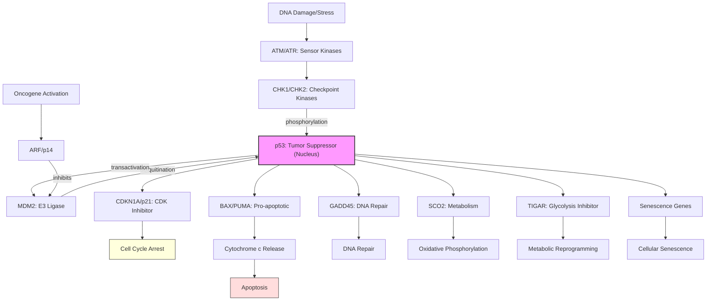

# Pathway Summary for TP53

## Overview
TP53 encodes the tumor suppressor p53, a master transcriptional regulator that acts as the "guardian of the genome." It coordinates cellular responses to diverse stress signals including DNA damage, oxidative stress, hypoxia, and metabolic stress by regulating cell fate decisions through transcriptional control of genes involved in cell cycle arrest, apoptosis, senescence, DNA repair, and metabolism [UniProt:P04637]. TP53 is the most frequently mutated gene in human cancers (~50%), underlining its critical role in preventing malignant transformation.

## Core Signaling Pathways

### DNA Damage Response Pathway
p53 is activated by DNA damage through ATM/ATR-CHK1/CHK2 signaling cascades. These kinases phosphorylate p53, stabilizing it and preventing MDM2-mediated degradation. Activated p53 induces cell cycle arrest (via CDKN1A/p21), DNA repair genes, or apoptosis depending on damage severity [PMID:15710329].

### Apoptotic Signaling Pathways
p53 triggers apoptosis through both intrinsic and extrinsic pathways:
- **Intrinsic pathway**: Transactivates pro-apoptotic genes (BAX, PUMA, NOXA) leading to mitochondrial outer membrane permeabilization and cytochrome c release [UniProt:P04637]
- **Extrinsic pathway**: Upregulates death receptors (FAS) and their ligands
- **Direct mitochondrial pathway**: p53 can directly interact with BCL2 family proteins at mitochondria

### Cell Cycle Checkpoint Control
p53 enforces cell cycle checkpoints through:
- **G1/S checkpoint**: Induces CDKN1A (p21) which inhibits cyclin-CDK complexes
- **G2/M checkpoint**: Regulates GADD45A and 14-3-3σ
- **Spindle checkpoint**: Controls mitotic progression

### Metabolic Stress Response
p53 regulates cellular metabolism through:
- **Glycolysis inhibition**: Represses glucose transporters and glycolytic enzymes
- **Oxidative phosphorylation**: Promotes mitochondrial respiration via SCO2
- **Lipid metabolism**: Regulates fatty acid oxidation
- **Autophagy**: Context-dependent regulation of autophagy and mitophagy [UniProt:P04637]

## Pathway Diagram

## Upstream Regulators
- **ATM/ATR**: DNA damage sensor kinases that phosphorylate p53
- **CHK1/CHK2**: Checkpoint kinases that stabilize p53
- **MDM2/MDM4**: Primary negative regulators via ubiquitination
- **ARF/p14**: Oncogene-induced activator that inhibits MDM2
- **SIRT1**: Deacetylase that modulates p53 activity

## Downstream Targets and Effects

### Cell Cycle Arrest
- **CDKN1A (p21)**: Universal CDK inhibitor
- **GADD45A**: G2/M checkpoint control
- **14-3-3σ**: Sequesters cyclin B-CDC2 complexes

### Apoptosis
- **BAX, BAK**: Mitochondrial pore formation
- **PUMA, NOXA**: BH3-only proteins
- **FAS**: Death receptor
- **APAF1**: Apoptosome component

### DNA Repair
- **GADD45**: Nucleotide excision repair
- **XPC, DDB2**: DNA damage recognition
- **POLK**: Translesion synthesis

### Metabolism
- **TIGAR**: Reduces glycolysis
- **SCO2**: Promotes oxidative phosphorylation
- **GLS2**: Glutaminolysis
- **DRAM**: Autophagy regulation

## Clinical Significance

### Cancer
- **Most frequently mutated gene** in human cancers (~50%)
- **Li-Fraumeni syndrome**: Germline TP53 mutations
- **Therapeutic target**: p53 reactivation strategies, MDM2 inhibitors

### Biomarker Applications
- **Prognostic marker**: TP53 mutation status correlates with poor prognosis
- **Predictive marker**: Response to certain chemotherapies
- **Therapeutic selection**: Guides treatment decisions

## Regulatory Mechanisms

### Post-translational Modifications
- **Phosphorylation**: Multiple sites regulate stability and activity
- **Acetylation**: Enhances DNA binding and transcriptional activity [PMID:17996705]
- **Ubiquitination**: MDM2-mediated degradation
- **Methylation**: Fine-tunes activity
- **SUMOylation**: Modulates function

### Protein-Protein Interactions
- **MDM2/MDM4**: Negative regulation
- **p300/CBP**: Coactivators and acetyltransferases
- **ASPP family**: Apoptotic selectivity
- **iASPP**: Inhibitor of apoptotic function

## Context-Dependent Functions
p53 responses vary based on:
1. **Stress type**: DNA damage vs. metabolic stress
2. **Stress severity**: Mild (arrest/repair) vs. severe (apoptosis)
3. **Cell type**: Tissue-specific responses
4. **Cellular context**: Proliferation state, differentiation status
5. **p53 levels**: Pulsatile vs. sustained activation

## Integration with Other Pathways
- **NF-κB pathway**: Cross-talk in inflammation and survival
- **mTOR pathway**: Nutrient sensing and growth control
- **Hippo pathway**: Organ size and stem cell regulation
- **Wnt pathway**: Development and stem cell maintenance
- **TGF-β pathway**: Growth inhibition and EMT