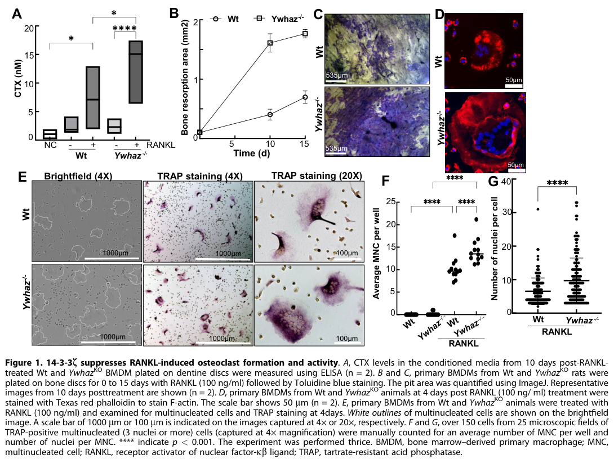

## Question

# Gene Research for Functional Annotation

## ⚠️ CRITICAL: Gene/Protein Identification Context

**BEFORE YOU BEGIN RESEARCH:** You MUST verify you are researching the CORRECT gene/protein. Gene symbols can be ambiguous, especially for less well-characterized genes from non-model organisms.

### Target Gene/Protein Identity (from UniProt):
- **UniProt Accession:** Q9Y4K3
- **Protein Description:** RecName: Full=TNF receptor-associated factor 6; EC=2.3.2.27 {ECO:0000269|PubMed:17135271, ECO:0000269|PubMed:19713527, ECO:0000269|PubMed:23514740, ECO:0000269|PubMed:27746020}; AltName: Full=E3 ubiquitin-protein ligase TRAF6; AltName: Full=Interleukin-1 signal transducer; AltName: Full=RING finger protein 85; AltName: Full=RING-type E3 ubiquitin transferase TRAF6 {ECO:0000305};
- **Gene Information:** Name=TRAF6; Synonyms=RNF85;
- **Organism (full):** Homo sapiens (Human).
- **Protein Family:** Belongs to the TNF receptor-associated factor family. A
- **Key Domains:** MATH/TRAF_dom. (IPR002083); TNF_rcpt-assoc_TRAF_met. (IPR012227); TRAF-like. (IPR008974); TRAF1-6_MATH_dom. (IPR049342); TRAF6_MATH. (IPR037309)

### MANDATORY VERIFICATION STEPS:

1. **Check if the gene symbol "TRAF6" matches the protein description above**
2. **Verify the organism is correct:** Homo sapiens (Human).
3. **Check if protein family/domains align with what you find in literature**
4. **If you find literature for a DIFFERENT gene with the same or similar symbol, STOP**

### If Gene Symbol is Ambiguous or You Cannot Find Relevant Literature:

**DO NOT PROCEED WITH RESEARCH ON A DIFFERENT GENE.** Instead:
- State clearly: "The gene symbol 'TRAF6' is ambiguous or literature is limited for this specific protein"
- Explain what you found (e.g., "Found extensive literature on a different gene with the same symbol in a different organism")
- Describe the protein based ONLY on the UniProt information provided above
- Suggest that the protein function can be inferred from domain/family information

### Research Target:

Please provide a comprehensive research report on the gene **TRAF6** (gene ID: TRAF6, UniProt: Q9Y4K3) in human.

The research report should be a detailed narrative explaining the function, biological processes, and localization of the gene product. Citations should be given for all claims.

You should prioritize authoritative reviews and primary scientific literature when conducting research. You can supplement
this with annotations you find in gene/protein databases, but these can be outdated or inaccurate.

We are specifically interested in the primary function of the gene - for enzymes, what reaction is catalyzed, and what is the substrate specificity? For transporters, what is the substrate? For structural proteins or adapters, what is the broader structural role? For signaling molecules, what is the role in the pathway.

We are interested in where in or outside the cell the gene product carries out its function.

We are also interested in the signaling or biochemical pathways in which the gene functions. We are less interested in broad pleiotropic effects, except where these elucidate the precise role.

Include evidence where possible. We are interested in both experimental evidence as well as inference from structure, evolution, or bioinformatic analysis. Precise studies should be prioritized over high-throughput, where available.

## Output

Question: You are an expert researcher providing comprehensive, well-cited information.

Provide detailed information focusing on:
1. Key concepts and definitions with current understanding
2. Recent developments and latest research (prioritize 2023-2024 sources)
3. Current applications and real-world implementations
4. Expert opinions and analysis from authoritative sources
5. Relevant statistics and data from recent studies

Format as a comprehensive research report with proper citations. Include URLs and publication dates where available.
Always prioritize recent, authoritative sources and provide specific citations for all major claims.

# Gene Research for Functional Annotation

## ⚠️ CRITICAL: Gene/Protein Identification Context

**BEFORE YOU BEGIN RESEARCH:** You MUST verify you are researching the CORRECT gene/protein. Gene symbols can be ambiguous, especially for less well-characterized genes from non-model organisms.

### Target Gene/Protein Identity (from UniProt):
- **UniProt Accession:** Q9Y4K3
- **Protein Description:** RecName: Full=TNF receptor-associated factor 6; EC=2.3.2.27 {ECO:0000269|PubMed:17135271, ECO:0000269|PubMed:19713527, ECO:0000269|PubMed:23514740, ECO:0000269|PubMed:27746020}; AltName: Full=E3 ubiquitin-protein ligase TRAF6; AltName: Full=Interleukin-1 signal transducer; AltName: Full=RING finger protein 85; AltName: Full=RING-type E3 ubiquitin transferase TRAF6 {ECO:0000305};
- **Gene Information:** Name=TRAF6; Synonyms=RNF85;
- **Organism (full):** Homo sapiens (Human).
- **Protein Family:** Belongs to the TNF receptor-associated factor family. A
- **Key Domains:** MATH/TRAF_dom. (IPR002083); TNF_rcpt-assoc_TRAF_met. (IPR012227); TRAF-like. (IPR008974); TRAF1-6_MATH_dom. (IPR049342); TRAF6_MATH. (IPR037309)

### MANDATORY VERIFICATION STEPS:

1. **Check if the gene symbol "TRAF6" matches the protein description above**
2. **Verify the organism is correct:** Homo sapiens (Human).
3. **Check if protein family/domains align with what you find in literature**
4. **If you find literature for a DIFFERENT gene with the same or similar symbol, STOP**

### If Gene Symbol is Ambiguous or You Cannot Find Relevant Literature:

**DO NOT PROCEED WITH RESEARCH ON A DIFFERENT GENE.** Instead:
- State clearly: "The gene symbol 'TRAF6' is ambiguous or literature is limited for this specific protein"
- Explain what you found (e.g., "Found extensive literature on a different gene with the same symbol in a different organism")
- Describe the protein based ONLY on the UniProt information provided above
- Suggest that the protein function can be inferred from domain/family information

### Research Target:

Please provide a comprehensive research report on the gene **TRAF6** (gene ID: TRAF6, UniProt: Q9Y4K3) in human.

The research report should be a detailed narrative explaining the function, biological processes, and localization of the gene product. Citations should be given for all claims.

You should prioritize authoritative reviews and primary scientific literature when conducting research. You can supplement
this with annotations you find in gene/protein databases, but these can be outdated or inaccurate.

We are specifically interested in the primary function of the gene - for enzymes, what reaction is catalyzed, and what is the substrate specificity? For transporters, what is the substrate? For structural proteins or adapters, what is the broader structural role? For signaling molecules, what is the role in the pathway.

We are interested in where in or outside the cell the gene product carries out its function.

We are also interested in the signaling or biochemical pathways in which the gene functions. We are less interested in broad pleiotropic effects, except where these elucidate the precise role.

Include evidence where possible. We are interested in both experimental evidence as well as inference from structure, evolution, or bioinformatic analysis. Precise studies should be prioritized over high-throughput, where available.

## Research report: Human **TRAF6** (UniProt **Q9Y4K3**) functional annotation (2023–2024 emphasis)

### 1) Target verification and core definitions (current understanding)
**TRAF6 (TNF receptor-associated factor 6)** is a human TRAF-family cytosolic signaling adaptor that also functions as a **RING-type E3 ubiquitin ligase** (EC 2.3.2.27). Recent literature consistently describes a conserved multi-domain architecture with **N-terminal RING** and multiple **zinc fingers**, a **coiled-coil/TRAF-N** region, and a **C-terminal TRAF-C/MATH (TRAF) domain** responsible for receptor/adaptor binding (li2024tumornecrosisfactor pages 2-4, wu2024traf6inhibitorsfrom pages 1-2). In this family, the trimeric TRAF-C domain can act as a “cap” and the TRAF-N coiled-coil as a “stalk,” providing an interaction platform that positions the N-terminal RING/zinc-finger catalytic region for ubiquitin-chain assembly and signaling complex formation (yang2025tnfreceptorassociatedfactors pages 7-8).

Functionally, TRAF6 is best understood as a **signal-proximal ubiquitin ligase/scaffold** that converts receptor stimulation into **polyubiquitin-based signaling scaffolds** which recruit and activate downstream kinases (e.g., TAK1 and IKK) to drive **NF-κB** and **MAPK** activation (li2024tumornecrosisfactor pages 2-4, li2024tumornecrosisfactor pages 1-2).

### 2) Biochemical function: enzymatic reaction, partners, and specificity
#### 2.1 Enzymatic activity (what reaction is catalyzed?)
TRAF6 catalyzes ubiquitin transfer in the canonical E1–E2–E3 cascade as an **E3 ligase**, promoting formation of polyubiquitin chains that serve primarily as **non-degradative signaling scaffolds**, rather than proteasomal degradation signals (li2024tumornecrosisfactor pages 1-2, li2024tumornecrosisfactor pages 2-4).

#### 2.2 E2 partners (substrate/chain-forming specificity)
The most consistently supported E2 complex for TRAF6 is **Ubc13/UBE2N–Uev1A/UBE2V1**, which is directly linked to TRAF6-mediated assembly of **K63-linked polyubiquitin chains** (li2024tumornecrosisfactor pages 2-4, wu2024traf6inhibitorsfrom pages 1-2). A 2024 inhibitor-discovery study notes a defined TRAF6–Ubc13 interaction surface, highlighting TRAF6 residues **Gln54, Asp57, Ile72, Leu74** as contributing to E2 engagement (wu2024traf6inhibitorsfrom pages 1-2).

#### 2.3 Ubiquitin linkage specificity and representative substrates
Recent review-level synthesis emphasizes that TRAF6 preferentially supports **K63-linked polyubiquitination**, distinguishing it from K48-linked chains that more commonly target proteins for proteasomal degradation (li2024tumornecrosisfactor pages 2-4, li2024tumornecrosisfactor pages 1-2). Representative TRAF6-linked K63-modified signaling substrates/adaptors cited in 2024 review pages include **IKKγ/NEMO, TAK1, IRAK1, and TRAF6 itself** (li2024tumornecrosisfactor pages 2-4). The same review corpus notes that TRAF6 can participate in **K48-linked** ubiquitination in selected contexts, indicating that TRAF6 signaling can be coupled to regulated proteostasis depending on cellular conditions (li2024tumornecrosisfactor pages 11-13).

### 3) Cellular localization and where TRAF6 acts
Across recent primary studies, TRAF6 is described/observed as a **cytosolic adaptor** that associates with the **cytoplasmic tails of transmembrane receptors** and with inducible cytosolic signaling assemblies (ayyasamy20241433ζsuppressesrankl pages 1-2). Two 2024 mechanistic papers broaden this view:

* **Receptor-proximal complexes (RANK):** TRAF6 binds receptor cytoplasmic domains such as **RANK** in RANKL signaling to coordinate downstream activation of MAPKs/AKT and NF-κB/NFATc1 programs that drive osteoclastogenesis (ayyasamy20241433ζsuppressesrankl pages 1-2).
* **Membraneless signaling condensates:** In response to ADP-heptose and other inflammatory stimuli, TRAF6 can form **cytosolic liquid-like condensates** (LLPS) with dynamic exchange properties (20–60% FRAP recovery in ~5 min), which are proposed to function as “microreactors” concentrating ubiquitin machinery and downstream effectors (li2024adphepinducedliquidphase pages 4-5, li2024adphepinducedliquidphase pages 9-12).

### 4) Pathways and biological processes (primary signaling roles)
#### 4.1 Canonical innate immune signaling: TLR/IL-1R → TRAF6 → TAK1/IKK
A central, repeatedly cited role is TRAF6 in **TLR/IL-1 receptor family signaling**, where TRAF6 is recruited downstream of receptor-proximal adaptors/kinases to promote TAK1 and IKK activation, leading to NF-κB and MAPK transcriptional programs (li2024tumornecrosisfactor pages 2-4).

#### 4.2 Bone remodeling and osteoclastogenesis: RANKL/RANK → TRAF6
TRAF6 is essential in **RANKL–RANK signaling**, acting as a key adaptor/E3 ligase required for osteoclastogenic downstream cascades (MAPK, PI3K/AKT, IκB phosphorylation) and NF-κB activation (ayyasamy20241433ζsuppressesrankl pages 1-2). This pathway-level role is also emphasized in bone-disease-focused synthesis (yang2025tnfreceptorassociatedfactors pages 7-8).

#### 4.3 CD40/TRAF6 axis and viral mimicry (EBV LMP1)
A major 2024 development is the high-resolution demonstration that EBV **LMP1** uses a **direct TRAF6-binding motif** (CTAR2 region) to drive NF-κB/JNK/p38/IRF7 signaling and lymphoma cell survival (giehler2024epsteinbarrvirusdrivenb pages 1-3). Importantly, structural/functional analyses indicate the **LMP1–TRAF6 interface differs from CD40–TRAF6**, implying that certain inhibitors could potentially exploit viral-specific binding geometries (giehler2024epsteinbarrvirusdrivenb pages 7-9).

### 5) Recent developments (prioritizing 2023–2024 primary research)
#### 5.1 14-3-3ζ destabilizes TRAF6 to suppress RANKL signaling (JBC, July 2024)
Ayyasamy et al. (2024-07; https://doi.org/10.1016/j.jbc.2024.107487) show that **14-3-3ζ** binds TRAF6 (interaction increases rapidly after RANKL stimulation), reduces the **RANK–TRAF6 interaction**, and promotes **TRAF6 ubiquitination and proteasome-dependent degradation**, dampening downstream RANKL signaling (ayyasamy20241433ζsuppressesrankl pages 4-5, ayyasamy20241433ζsuppressesrankl pages 5-7). Mechanistic support includes proteasome inhibitor blockade of TRAF6 loss (MG132/lactacystin conditions) and TRAF6 immunoprecipitation followed by ubiquitin detection (ayyasamy20241433ζsuppressesrankl pages 5-7, ayyasamy20241433ζsuppressesrankl pages 7-8). Functionally, 14-3-3ζ deficiency increases osteoclastogenesis and resorption readouts (e.g., CTX ELISA and dentine pit formation assays are described), while 14-3-3ζ re-expression suppresses osteoclastogenic transcription factors (p65/NFATc1) and MAPK/AKT phosphorylation (ayyasamy20241433ζsuppressesrankl pages 1-2, ayyasamy20241433ζsuppressesrankl pages 4-5).

Evidence from the article’s figures directly illustrates: (i) suppression of osteoclast formation/resorption phenotypes (ayyasamy20241433ζsuppressesrankl media 5629ff81), (ii) increased 14-3-3ζ–TRAF6 interaction and reduced RANK–TRAF6 association (ayyasamy20241433ζsuppressesrankl media 5d4d160c), and (iii) enhanced TRAF6 ubiquitination and proteasomal degradation linked to signaling suppression (ayyasamy20241433ζsuppressesrankl media 0ea8acbf).

#### 5.2 TRAF6 phase separation organizes K63 ubiquitin synthesis (Research, January 2024)
Li et al. (2024-01; https://doi.org/10.34133/research.0315) report that during ALPK1/TIFA-dependent sensing of bacterial ADP-heptose, TRAF6 undergoes stimulus-dependent **LLPS** and is recruited into **TIFA condensates**. Within these condensates, TRAF6 markedly amplifies **K63-linked polyubiquitin synthesis** when reconstituted with E1 and the **Ubc13/Uev1A** E2 complex, enriching ubiquitin machinery (Ub, Ubc13/Uev1A) and downstream effectors (e.g., NEMO/TAK1/TABs) to accelerate pathway activation (li2024adphepinducedliquidphase pages 2-4, li2024adphepinducedliquidphase pages 5-7). Quantitative details include: ~**6–7 puncta per cell** after 10 μM ADP-LD-Hep stimulation and a reported NF-κB activation **IC50 ≈ 2.3 μM** for ADP-LD-Hep activation (li2024adphepinducedliquidphase pages 2-4, li2024adphepinducedliquidphase pages 7-9).

Mechanistically, these results support a current expert view that TRAF6 signaling output is not only determined by enzyme identity (E2 pairing and linkage type), but also by **higher-order mesoscale organization** (condensates that retain long K63 chains and concentrate enzymatic components) (li2024adphepinducedliquidphase pages 7-9).

#### 5.3 EBV LMP1–TRAF6 interface mapped at residue/motif level (Nature Communications, January 2024)
Giehler et al. (2024-01; https://doi.org/10.1038/s41467-023-44455-w) establish a direct protein–protein interaction between EBV LMP1 CTAR2 and TRAF6. The critical LMP1 TRAF6-binding motif is **P379VQLSY** (PVQxxY), and mutational analysis identified **P379, V380, Q381, Y384** as essential for binding in quantitative AlphaScreen PPI assays (giehler2024epsteinbarrvirusdrivenb pages 1-3, giehler2024epsteinbarrvirusdrivenb pages 3-4). Structural/biophysical mapping includes NMR HSQC perturbations with the LMP1 peptide and modeling based on the RANK–TRAF6 template, implicating TRAF6 interface residues including **F471/Y473** as critical binding determinants (giehler2024epsteinbarrvirusdrivenb pages 7-9).

Therapeutic implication demonstrated experimentally: a **RANK-derived TRAF6 inhibitor peptide** blocks TRAF6–LMP1 binding with **IC50 = 177 nM** and reduces viability/proliferation of EBV-transformed lymphoblastoid cells when delivered as a cell-penetrating peptide (tested at **100 μM for 4 days**) (giehler2024epsteinbarrvirusdrivenb pages 9-10, giehler2024epsteinbarrvirusdrivenb pages 10-12).

### 6) Current applications and real-world implementations
#### 6.1 Therapeutic targeting strategies (mostly preclinical as of 2024)
* **Direct TRAF6 inhibition (small-molecule discovery):** Wu et al. (2024-06; https://doi.org/10.3390/md22060260) performed an EGCG-based pharmacophore search of **52,765** marine compounds and a docking funnel (405 docked → 6 selected → 2 optimized candidates), proposing **CMNPD9212-16** and **CMNPD12791-8** as potential TRAF6 binders with favorable in silico ADMET and MD stability (wu2024traf6inhibitorsfrom pages 1-2). This represents a realistic pipeline for early-stage TRAF6 inhibitor identification, but remains computational/preclinical.
* **Interface-targeted PPI inhibitors:** The LMP1–TRAF6 work provides a validated biochemical assay (AlphaScreen) and a demonstration that peptide disruption can impair EBV-transformed cell survival, supporting the feasibility of developing **PPI-directed inhibitors** against TRAF6 recruitment modules (giehler2024epsteinbarrvirusdrivenb pages 9-10, giehler2024epsteinbarrvirusdrivenb pages 12-13).
* **Indirect pathway modulation and stability control:** The 14-3-3ζ study supports a strategy of modulating **TRAF6 stability** to down-tune RANKL-driven osteoclastogenesis (ayyasamy20241433ζsuppressesrankl pages 5-7).

A clinical trials tool search for the literal phrase “TRAF6 inhibitor” did not retrieve clearly relevant interventional trials, implying that **TRAF6-directed therapeutics are not yet widely represented as explicit clinical interventions** under that label in the indexed registry results available to this workflow (OpenTargets Search: -TRAF6).

#### 6.2 Disease association evidence (database-backed)
Open Targets evidence links TRAF6 to multiple disease areas with association scores and evidence counts, including **severe acute respiratory syndrome**, **ovarian neoplasm**, **vertebral column disorder**, **renal osteodystrophy**, and **autosomal dominant hypohidrotic ectodermal dysplasia** (OpenTargets Search: -TRAF6). These associations support prioritization of TRAF6 as a mechanistically plausible node in inflammatory, neoplastic, and bone-related disease processes, but require disease-specific causal validation beyond association.

### 7) Representative statistics and data highlights (recent studies)
* **Virtual screening pipeline scale (2024):** 52,765 compounds screened; 405 docked; 6 prioritized for refinement; 2 final candidates (wu2024traf6inhibitorsfrom pages 1-2).
* **Condensate biology readouts (2024):** ~6–7 puncta/cell (ADP-LD-Hep 10 μM); NF-κB activation IC50 ≈ 2.3 μM; in vitro ubiquitination mixture explicitly reconstituted with TRAF6/E1/Ubc13/Uev1A/Ub/ATP (li2024adphepinducedliquidphase pages 2-4, li2024adphepinducedliquidphase pages 7-9, li2024adphepinducedliquidphase pages 15-16).
* **PPI inhibition potency (2024):** LMP1–TRAF6 disruption by a RANK-derived peptide IC50 = 177 nM; cell-penetrating peptide tested at 100 μM for 4 days in viability/proliferation assays (giehler2024epsteinbarrvirusdrivenb pages 9-10, giehler2024epsteinbarrvirusdrivenb pages 10-12).
* **Proteostasis regulation conditions (2024):** MG132/lactacystin conditions block RANKL-associated TRAF6 loss; osteoclast scoring criteria include TRAP+ cells with ≥3 nuclei (ayyasamy20241433ζsuppressesrankl pages 5-7, ayyasamy20241433ζsuppressesrankl pages 8-9).

### 8) Expert synthesis and functional annotation summary
TRAF6 should be annotated as a **cytosolic receptor-proximal E3 ubiquitin ligase/adaptor** whose primary biochemical output is **Ubc13/Uev1A-dependent K63 polyubiquitin chain assembly**, enabling recruitment/activation of TAK1/IKK and MAPK modules to drive inflammatory and differentiation programs (li2024tumornecrosisfactor pages 2-4, li2024adphepinducedliquidphase pages 7-9). Current 2024 mechanistic advances emphasize that TRAF6 signaling strength and specificity are controlled by (i) **regulated degradation/turnover** (e.g., 14-3-3ζ-driven ubiquitination and proteasomal degradation in RANKL signaling) and (ii) **higher-order organization** into inducible **condensates** that spatially concentrate ubiquitination enzymes and effectors (ayyasamy20241433ζsuppressesrankl pages 5-7, li2024adphepinducedliquidphase pages 7-9). Therapeutic strategies in 2024 are predominantly **preclinical**, spanning computational small-molecule identification, and targeted disruption of TRAF6 recruitment interfaces (notably virus-specific LMP1–TRAF6 engagement) (wu2024traf6inhibitorsfrom pages 1-2, giehler2024epsteinbarrvirusdrivenb pages 9-10).

### Evidence summary table
The following table compiles identity, biochemical function, pathways, localization, 2023–2024 advances, and translational angles in a compact format.

| Aspect | Key points | Best recent sources with year and URL |
|---|---|---|
| Identity/domains | • Human **TRAF6 / TNF receptor-associated factor 6** matches UniProt Q9Y4K3 context • TRAF-family adaptor and **E3 ubiquitin ligase** • Domain architecture: **N-terminal RING**, multiple **zinc fingers**, **coiled-coil/TRAF-N**, **C-terminal TRAF-C/MATH** receptor-binding domain • TRAF-C recognizes receptor motifs; trimeric TRAF-C and stalk-like TRAF-N are emphasized in recent structural summaries (li2024tumornecrosisfactor pages 2-4, yang2025tnfreceptorassociatedfactors pages 7-8, li2024tumornecrosisfactor pages 1-2, wu2024traf6inhibitorsfrom pages 1-2) | Li et al., 2024, *Journal of Cancer* — https://doi.org/10.7150/jca.90059 ; Yang et al., 2025, *Frontiers in Physiology* — https://doi.org/10.3389/fphys.2025.1527814 ; Wu et al., 2024, *Marine Drugs* — https://doi.org/10.3390/md22060260 |
| Enzymatic activity | • TRAF6 functions as a **RING-type E3 ubiquitin ligase** and signaling scaffold • Works with E1/E2 enzymes to assemble signaling-active ubiquitin chains • Central output is activation of **TAK1/IKK → NF-κB** and **MAPK** signaling • Recent reviews also note TRAF6 can participate in both non-degradative signaling and degradative ubiquitin control depending on chain type/context (li2024tumornecrosisfactor pages 11-13, li2024tumornecrosisfactor pages 2-4, li2024tumornecrosisfactor pages 1-2, wu2024traf6inhibitorsfrom pages 1-2) | Li et al., 2024 — https://doi.org/10.7150/jca.90059 ; Wu et al., 2024 — https://doi.org/10.3390/md22060260 |
| Key E2 partners | • Best-supported E2 complex is **Ubc13/UBE2N–Uev1A/UBE2V1** • This partnership is specifically linked to TRAF6-catalyzed **K63-linked polyubiquitination** • A recent inhibitor-development paper highlights a defined TRAF6–Ubc13 interaction surface including **Gln54, Asp57, Ile72, Leu74** on TRAF6 • Ubc13/Uev1A is also used in in vitro condensate reconstitution assays for TRAF6-driven ubiquitin-chain synthesis (li2024tumornecrosisfactor pages 2-4, wu2024traf6inhibitorsfrom pages 1-2, li2024adphepinducedliquidphase pages 2-4, li2024adphepinducedliquidphase pages 5-7) | Li et al., 2024 — https://doi.org/10.7150/jca.90059 ; Wu et al., 2024 — https://doi.org/10.3390/md22060260 ; Li et al., 2024, *Research* — https://doi.org/10.34133/research.0315 |
| Ubiquitin linkage specificity | • **K63-linked chains** are the canonical TRAF6 signaling output and act as scaffolds rather than degradation tags • Representative K63-modified targets mentioned in recent review pages include **IKKγ/NEMO, TAK1, IRAK1, and TRAF6 itself** • Recent reviews also note TRAF6 can participate in **K48-linked** ubiquitination in some contexts, supporting proteasomal degradation/regulatory turnover • LLPS work links TRAF6 condensates to synthesis/retention of **long K63 polyUb chains** (li2024tumornecrosisfactor pages 2-4, li2024tumornecrosisfactor pages 1-2, li2024adphepinducedliquidphase pages 2-4, li2024adphepinducedliquidphase pages 7-9, li2024adphepinducedliquidphase pages 5-7) | Li et al., 2024 — https://doi.org/10.7150/jca.90059 ; Li et al., 2024, *Research* — https://doi.org/10.34133/research.0315 |
| Representative substrates | • Recent review pages list **IKKγ/NEMO, TAK1, IRAK1, and TRAF6 itself** as representative K63-ubiquitinated targets/substrates in TRAF6 signaling • TRAF6 is also described as binding **p62** to ubiquitinate **mTOR**, linking it to growth/autophagy regulation • In disease-focused primary work, TRAF6 directly engages receptor/adaptor complexes such as **RANK** and **TIFA**, and viral protein **LMP1** recruits TRAF6 as a critical host effector • Evidence base is strongest for receptor-proximal signaling substrates/adaptors rather than a single exclusive substrate class (li2024tumornecrosisfactor pages 11-13, li2024tumornecrosisfactor pages 2-4, ayyasamy20241433ζsuppressesrankl pages 1-2, giehler2024epsteinbarrvirusdrivenb pages 1-3) | Li et al., 2024 — https://doi.org/10.7150/jca.90059 ; Ayyasamy et al., 2024, *JBC* — https://doi.org/10.1016/j.jbc.2024.107487 ; Giehler et al., 2024, *Nature Communications* — https://doi.org/10.1038/s41467-023-44455-w |
| Core pathways | • Major pathways in recent evidence: **TLR/IL-1R–MyD88–IRAK–TRAF6–TAK1–NF-κB/MAPK** • **RANK/RANKL–TRAF6** is central for osteoclastogenesis and bone remodeling • Additional pathways in recent review/primary papers include **CD40/TRAF6-related signaling**, **IL-17R via Act1**, **TCR via CARMA1–BCL10–MALT1**, **TLR7/8/9–MYD88–IRF7**, and **ALPK1–TIFA–TRAF6** innate sensing • In EBV biology, **LMP1–TRAF6** drives NF-κB/JNK/p38/IRF7 signaling and lymphoma survival (li2024tumornecrosisfactor pages 2-4, ayyasamy20241433ζsuppressesrankl pages 1-2, giehler2024epsteinbarrvirusdrivenb pages 1-3, li2024adphepinducedliquidphase pages 1-2) | Li et al., 2024 — https://doi.org/10.7150/jca.90059 ; Ayyasamy et al., 2024 — https://doi.org/10.1016/j.jbc.2024.107487 ; Giehler et al., 2024 — https://doi.org/10.1038/s41467-023-44455-w ; Li et al., 2024 — https://doi.org/10.34133/research.0315 |
| Localization/complexes | • TRAF6 is a **cytosolic adaptor/E3** that assembles on **cytoplasmic tails of transmembrane receptors** and receptor-proximal signaling complexes • Recent primary data show dynamic association with **RANK**, **TIFA condensates**, and **viral LMP1 CTAR2** complexes • ADP-heptose studies show TRAF6 forms **cytosolic membraneless droplets/condensates** with dynamic exchange • Complex partners include **TAK1/TAB1/2, NEMO**, Ubc13/Uev1A, and receptor scaffolds (ayyasamy20241433ζsuppressesrankl pages 1-2, giehler2024epsteinbarrvirusdrivenb pages 1-3, li2024adphepinducedliquidphase pages 7-9, li2024adphepinducedliquidphase pages 4-5) | Ayyasamy et al., 2024 — https://doi.org/10.1016/j.jbc.2024.107487 ; Giehler et al., 2024 — https://doi.org/10.1038/s41467-023-44455-w ; Li et al., 2024 — https://doi.org/10.34133/research.0315 |
| 2023-2024 mechanistic advances | • **2024 JBC:** 14-3-3ζ binds TRAF6, increases after RANKL, promotes **TRAF6 ubiquitination and proteasomal degradation**, weakens RANK–TRAF6 interaction, and suppresses osteoclastogenic signaling • **2024 Research:** TRAF6 undergoes **LLPS/condensation** in TIFA microreactors that enrich ubiquitin machinery and favor long **K63 polyUb** synthesis • **2024 Nat Commun:** EBV **LMP1 directly binds TRAF6** through a CTAR2 motif (**P379VQLSY**), with key interface residues defined biochemically/structurally • These studies move TRAF6 biology from linear pathway maps toward regulated **PPI interfaces, condensates, and degradative control** (ayyasamy20241433ζsuppressesrankl pages 4-5, ayyasamy20241433ζsuppressesrankl pages 5-7, li2024adphepinducedliquidphase pages 2-4, li2024adphepinducedliquidphase pages 7-9, giehler2024epsteinbarrvirusdrivenb pages 7-9, giehler2024epsteinbarrvirusdrivenb pages 3-4, giehler2024epsteinbarrvirusdrivenb pages 9-10) | Ayyasamy et al., 2024 — https://doi.org/10.1016/j.jbc.2024.107487 ; Li et al., 2024 — https://doi.org/10.34133/research.0315 ; Giehler et al., 2024 — https://doi.org/10.1038/s41467-023-44455-w |
| Therapeutic targeting approaches | • **Small-molecule discovery:** virtual screening of **52,765 marine compounds** yielded candidate TRAF6 binders **CMNPD9212-16** and **CMNPD12791-8** with favorable in silico ADMET/MD profiles • **PPI targeting:** EBV study validated peptide disruption of **LMP1–TRAF6**; a RANK-derived inhibitor peptide blocked binding and reduced viability of EBV-transformed B cells • **Pathway modulation in bone disease:** recent work supports targeting **RANK–TRAF6** signaling or promoting TRAF6 degradation/stability control • No directly relevant TRAF6-targeted interventional clinical trials were retrieved in the tool search, so current implementation remains largely **preclinical** (wu2024traf6inhibitorsfrom pages 1-2, giehler2024epsteinbarrvirusdrivenb pages 10-12, giehler2024epsteinbarrvirusdrivenb pages 9-10) | Wu et al., 2024 — https://doi.org/10.3390/md22060260 ; Giehler et al., 2024 — https://doi.org/10.1038/s41467-023-44455-w |
| Quantitative/statistical data | • Marine-drug screen: **52,765 compounds** screened; **405** docked; **6** advanced; **2** prioritized hits (CMNPD9212-16, CMNPD12791-8) (wu2024traf6inhibitorsfrom pages 1-2) • TIFA/TRAF6 condensate study: ADP-LD-Hep produced about **6–7 puncta per cell**; NF-κB activation **IC50 ≈ 2.3 μM**; in vitro reconstitution used **TRAF6 20 μM, Ubc13 1 μM, Uev1A 1 μM, Ub 50 μM, E1 0.1 μM, ATP 2 mM** (li2024adphepinducedliquidphase pages 2-4, li2024adphepinducedliquidphase pages 7-9, li2024adphepinducedliquidphase pages 15-16) • 14-3-3ζ study: proteasome inhibitors **MG132/lactacystin at 10 nM** blocked TRAF6 loss; RANKL stimulation increased 14-3-3ζ–TRAF6 interaction and osteoclast assays used **TRAP+ cells with ≥3 nuclei** as scoring criterion (ayyasamy20241433ζsuppressesrankl pages 7-8, ayyasamy20241433ζsuppressesrankl pages 5-7, ayyasamy20241433ζsuppressesrankl pages 8-9) • LMP1–TRAF6 study: RANK-derived inhibitor peptide blocked binding with **IC50 177 nM**; cell-penetrating peptide tested at **100 μM for 4 days** reduced LCL proliferation (giehler2024epsteinbarrvirusdrivenb pages 10-12, giehler2024epsteinbarrvirusdrivenb pages 9-10) | Wu et al., 2024 — https://doi.org/10.3390/md22060260 ; Li et al., 2024 — https://doi.org/10.34133/research.0315 ; Ayyasamy et al., 2024 — https://doi.org/10.1016/j.jbc.2024.107487 ; Giehler et al., 2024 — https://doi.org/10.1038/s41467-023-44455-w |

*Table: This table summarizes the most evidence-supported features of human TRAF6 (UniProt Q9Y4K3), including its domain architecture, E3 ligase activity, pathway roles, recent mechanistic advances, and preclinical targeting strategies. It is designed as a compact reference for functional annotation grounded only in the gathered evidence.*

References

1. (li2024tumornecrosisfactor pages 2-4): Tingting Li, Zhe Lei, Lin Wei, Kai Yang, Jinhong Shen, and Lin Hu. Tumor necrosis factor receptor-associated factor 6 and human cancer: a systematic review of mechanistic insights, functional roles, and therapeutic potential. Journal of Cancer, 15:560-576, Jan 2024. URL: https://doi.org/10.7150/jca.90059, doi:10.7150/jca.90059. This article has 14 citations and is from a peer-reviewed journal.

2. (wu2024traf6inhibitorsfrom pages 1-2): Xuexuan Wu, Saiyi Zhong, Nan Zhou, and Lianxiang Luo. Traf6 inhibitors from marine compound library: pharmacophore, virtual screening, fragment replacement, admet, and molecular dynamics. Marine Drugs, 22:260, Jun 2024. URL: https://doi.org/10.3390/md22060260, doi:10.3390/md22060260. This article has 1 citations.

3. (yang2025tnfreceptorassociatedfactors pages 7-8): Xicheng Yang, LiLi Zhao, and YinQuan Pang. Tnf receptor-associated factors: promising targets of natural products for the treatment of osteoporosis. Frontiers in Physiology, May 2025. URL: https://doi.org/10.3389/fphys.2025.1527814, doi:10.3389/fphys.2025.1527814. This article has 3 citations.

4. (li2024tumornecrosisfactor pages 1-2): Tingting Li, Zhe Lei, Lin Wei, Kai Yang, Jinhong Shen, and Lin Hu. Tumor necrosis factor receptor-associated factor 6 and human cancer: a systematic review of mechanistic insights, functional roles, and therapeutic potential. Journal of Cancer, 15:560-576, Jan 2024. URL: https://doi.org/10.7150/jca.90059, doi:10.7150/jca.90059. This article has 14 citations and is from a peer-reviewed journal.

5. (li2024tumornecrosisfactor pages 11-13): Tingting Li, Zhe Lei, Lin Wei, Kai Yang, Jinhong Shen, and Lin Hu. Tumor necrosis factor receptor-associated factor 6 and human cancer: a systematic review of mechanistic insights, functional roles, and therapeutic potential. Journal of Cancer, 15:560-576, Jan 2024. URL: https://doi.org/10.7150/jca.90059, doi:10.7150/jca.90059. This article has 14 citations and is from a peer-reviewed journal.

6. (ayyasamy20241433ζsuppressesrankl pages 1-2): R. Ayyasamy, S. Fan, P. Czernik, B. Lecka-Czernik, S. Chattopadhyay, and R. Chakravarti. 14-3-3ζ suppresses rankl signaling by destabilizing traf6. Journal of Biological Chemistry, 300:107487, Jul 2024. URL: https://doi.org/10.1016/j.jbc.2024.107487, doi:10.1016/j.jbc.2024.107487. This article has 8 citations and is from a domain leading peer-reviewed journal.

7. (li2024adphepinducedliquidphase pages 4-5): Liping Li, Jia Wang, Xincheng Zhong, Yaoyao Jiang, Gaofeng Pei, Xikang Yang, Kaixiang Zhang, Siqi Shen, Xue Jin, Gaoge Sun, Chaofei Su, Shuzhen Chen, and Hang Yin. Adp-hep-induced liquid phase condensation of tifa-traf6 activates alpk1/tifa-dependent innate immune responses. Research, Jan 2024. URL: https://doi.org/10.34133/research.0315, doi:10.34133/research.0315. This article has 12 citations and is from a peer-reviewed journal.

8. (li2024adphepinducedliquidphase pages 9-12): Liping Li, Jia Wang, Xincheng Zhong, Yaoyao Jiang, Gaofeng Pei, Xikang Yang, Kaixiang Zhang, Siqi Shen, Xue Jin, Gaoge Sun, Chaofei Su, Shuzhen Chen, and Hang Yin. Adp-hep-induced liquid phase condensation of tifa-traf6 activates alpk1/tifa-dependent innate immune responses. Research, Jan 2024. URL: https://doi.org/10.34133/research.0315, doi:10.34133/research.0315. This article has 12 citations and is from a peer-reviewed journal.

9. (giehler2024epsteinbarrvirusdrivenb pages 1-3): Fabian Giehler, Michael S. Ostertag, Thomas Sommermann, Daniel Weidl, Kai R. Sterz, Helmut Kutz, Andreas Moosmann, Stephan M. Feller, Arie Geerlof, Brigitte Biesinger, Grzegorz M. Popowicz, Johannes Kirchmair, and Arnd Kieser. Epstein-barr virus-driven b cell lymphoma mediated by a direct lmp1-traf6 complex. Nature Communications, Jan 2024. URL: https://doi.org/10.1038/s41467-023-44455-w, doi:10.1038/s41467-023-44455-w. This article has 29 citations and is from a highest quality peer-reviewed journal.

10. (giehler2024epsteinbarrvirusdrivenb pages 7-9): Fabian Giehler, Michael S. Ostertag, Thomas Sommermann, Daniel Weidl, Kai R. Sterz, Helmut Kutz, Andreas Moosmann, Stephan M. Feller, Arie Geerlof, Brigitte Biesinger, Grzegorz M. Popowicz, Johannes Kirchmair, and Arnd Kieser. Epstein-barr virus-driven b cell lymphoma mediated by a direct lmp1-traf6 complex. Nature Communications, Jan 2024. URL: https://doi.org/10.1038/s41467-023-44455-w, doi:10.1038/s41467-023-44455-w. This article has 29 citations and is from a highest quality peer-reviewed journal.

11. (ayyasamy20241433ζsuppressesrankl pages 4-5): R. Ayyasamy, S. Fan, P. Czernik, B. Lecka-Czernik, S. Chattopadhyay, and R. Chakravarti. 14-3-3ζ suppresses rankl signaling by destabilizing traf6. Journal of Biological Chemistry, 300:107487, Jul 2024. URL: https://doi.org/10.1016/j.jbc.2024.107487, doi:10.1016/j.jbc.2024.107487. This article has 8 citations and is from a domain leading peer-reviewed journal.

12. (ayyasamy20241433ζsuppressesrankl pages 5-7): R. Ayyasamy, S. Fan, P. Czernik, B. Lecka-Czernik, S. Chattopadhyay, and R. Chakravarti. 14-3-3ζ suppresses rankl signaling by destabilizing traf6. Journal of Biological Chemistry, 300:107487, Jul 2024. URL: https://doi.org/10.1016/j.jbc.2024.107487, doi:10.1016/j.jbc.2024.107487. This article has 8 citations and is from a domain leading peer-reviewed journal.

13. (ayyasamy20241433ζsuppressesrankl pages 7-8): R. Ayyasamy, S. Fan, P. Czernik, B. Lecka-Czernik, S. Chattopadhyay, and R. Chakravarti. 14-3-3ζ suppresses rankl signaling by destabilizing traf6. Journal of Biological Chemistry, 300:107487, Jul 2024. URL: https://doi.org/10.1016/j.jbc.2024.107487, doi:10.1016/j.jbc.2024.107487. This article has 8 citations and is from a domain leading peer-reviewed journal.

14. (ayyasamy20241433ζsuppressesrankl media 5629ff81): R. Ayyasamy, S. Fan, P. Czernik, B. Lecka-Czernik, S. Chattopadhyay, and R. Chakravarti. 14-3-3ζ suppresses rankl signaling by destabilizing traf6. Journal of Biological Chemistry, 300:107487, Jul 2024. URL: https://doi.org/10.1016/j.jbc.2024.107487, doi:10.1016/j.jbc.2024.107487. This article has 8 citations and is from a domain leading peer-reviewed journal.

15. (ayyasamy20241433ζsuppressesrankl media 5d4d160c): R. Ayyasamy, S. Fan, P. Czernik, B. Lecka-Czernik, S. Chattopadhyay, and R. Chakravarti. 14-3-3ζ suppresses rankl signaling by destabilizing traf6. Journal of Biological Chemistry, 300:107487, Jul 2024. URL: https://doi.org/10.1016/j.jbc.2024.107487, doi:10.1016/j.jbc.2024.107487. This article has 8 citations and is from a domain leading peer-reviewed journal.

16. (ayyasamy20241433ζsuppressesrankl media 0ea8acbf): R. Ayyasamy, S. Fan, P. Czernik, B. Lecka-Czernik, S. Chattopadhyay, and R. Chakravarti. 14-3-3ζ suppresses rankl signaling by destabilizing traf6. Journal of Biological Chemistry, 300:107487, Jul 2024. URL: https://doi.org/10.1016/j.jbc.2024.107487, doi:10.1016/j.jbc.2024.107487. This article has 8 citations and is from a domain leading peer-reviewed journal.

17. (li2024adphepinducedliquidphase pages 2-4): Liping Li, Jia Wang, Xincheng Zhong, Yaoyao Jiang, Gaofeng Pei, Xikang Yang, Kaixiang Zhang, Siqi Shen, Xue Jin, Gaoge Sun, Chaofei Su, Shuzhen Chen, and Hang Yin. Adp-hep-induced liquid phase condensation of tifa-traf6 activates alpk1/tifa-dependent innate immune responses. Research, Jan 2024. URL: https://doi.org/10.34133/research.0315, doi:10.34133/research.0315. This article has 12 citations and is from a peer-reviewed journal.

18. (li2024adphepinducedliquidphase pages 5-7): Liping Li, Jia Wang, Xincheng Zhong, Yaoyao Jiang, Gaofeng Pei, Xikang Yang, Kaixiang Zhang, Siqi Shen, Xue Jin, Gaoge Sun, Chaofei Su, Shuzhen Chen, and Hang Yin. Adp-hep-induced liquid phase condensation of tifa-traf6 activates alpk1/tifa-dependent innate immune responses. Research, Jan 2024. URL: https://doi.org/10.34133/research.0315, doi:10.34133/research.0315. This article has 12 citations and is from a peer-reviewed journal.

19. (li2024adphepinducedliquidphase pages 7-9): Liping Li, Jia Wang, Xincheng Zhong, Yaoyao Jiang, Gaofeng Pei, Xikang Yang, Kaixiang Zhang, Siqi Shen, Xue Jin, Gaoge Sun, Chaofei Su, Shuzhen Chen, and Hang Yin. Adp-hep-induced liquid phase condensation of tifa-traf6 activates alpk1/tifa-dependent innate immune responses. Research, Jan 2024. URL: https://doi.org/10.34133/research.0315, doi:10.34133/research.0315. This article has 12 citations and is from a peer-reviewed journal.

20. (giehler2024epsteinbarrvirusdrivenb pages 3-4): Fabian Giehler, Michael S. Ostertag, Thomas Sommermann, Daniel Weidl, Kai R. Sterz, Helmut Kutz, Andreas Moosmann, Stephan M. Feller, Arie Geerlof, Brigitte Biesinger, Grzegorz M. Popowicz, Johannes Kirchmair, and Arnd Kieser. Epstein-barr virus-driven b cell lymphoma mediated by a direct lmp1-traf6 complex. Nature Communications, Jan 2024. URL: https://doi.org/10.1038/s41467-023-44455-w, doi:10.1038/s41467-023-44455-w. This article has 29 citations and is from a highest quality peer-reviewed journal.

21. (giehler2024epsteinbarrvirusdrivenb pages 9-10): Fabian Giehler, Michael S. Ostertag, Thomas Sommermann, Daniel Weidl, Kai R. Sterz, Helmut Kutz, Andreas Moosmann, Stephan M. Feller, Arie Geerlof, Brigitte Biesinger, Grzegorz M. Popowicz, Johannes Kirchmair, and Arnd Kieser. Epstein-barr virus-driven b cell lymphoma mediated by a direct lmp1-traf6 complex. Nature Communications, Jan 2024. URL: https://doi.org/10.1038/s41467-023-44455-w, doi:10.1038/s41467-023-44455-w. This article has 29 citations and is from a highest quality peer-reviewed journal.

22. (giehler2024epsteinbarrvirusdrivenb pages 10-12): Fabian Giehler, Michael S. Ostertag, Thomas Sommermann, Daniel Weidl, Kai R. Sterz, Helmut Kutz, Andreas Moosmann, Stephan M. Feller, Arie Geerlof, Brigitte Biesinger, Grzegorz M. Popowicz, Johannes Kirchmair, and Arnd Kieser. Epstein-barr virus-driven b cell lymphoma mediated by a direct lmp1-traf6 complex. Nature Communications, Jan 2024. URL: https://doi.org/10.1038/s41467-023-44455-w, doi:10.1038/s41467-023-44455-w. This article has 29 citations and is from a highest quality peer-reviewed journal.

23. (giehler2024epsteinbarrvirusdrivenb pages 12-13): Fabian Giehler, Michael S. Ostertag, Thomas Sommermann, Daniel Weidl, Kai R. Sterz, Helmut Kutz, Andreas Moosmann, Stephan M. Feller, Arie Geerlof, Brigitte Biesinger, Grzegorz M. Popowicz, Johannes Kirchmair, and Arnd Kieser. Epstein-barr virus-driven b cell lymphoma mediated by a direct lmp1-traf6 complex. Nature Communications, Jan 2024. URL: https://doi.org/10.1038/s41467-023-44455-w, doi:10.1038/s41467-023-44455-w. This article has 29 citations and is from a highest quality peer-reviewed journal.

24. (OpenTargets Search: -TRAF6): Open Targets Query (-TRAF6, 12 results). Buniello, A. et al. (2025). Open Targets Platform: facilitating therapeutic hypotheses building in drug discovery. Nucleic Acids Research.

25. (li2024adphepinducedliquidphase pages 15-16): Liping Li, Jia Wang, Xincheng Zhong, Yaoyao Jiang, Gaofeng Pei, Xikang Yang, Kaixiang Zhang, Siqi Shen, Xue Jin, Gaoge Sun, Chaofei Su, Shuzhen Chen, and Hang Yin. Adp-hep-induced liquid phase condensation of tifa-traf6 activates alpk1/tifa-dependent innate immune responses. Research, Jan 2024. URL: https://doi.org/10.34133/research.0315, doi:10.34133/research.0315. This article has 12 citations and is from a peer-reviewed journal.

26. (ayyasamy20241433ζsuppressesrankl pages 8-9): R. Ayyasamy, S. Fan, P. Czernik, B. Lecka-Czernik, S. Chattopadhyay, and R. Chakravarti. 14-3-3ζ suppresses rankl signaling by destabilizing traf6. Journal of Biological Chemistry, 300:107487, Jul 2024. URL: https://doi.org/10.1016/j.jbc.2024.107487, doi:10.1016/j.jbc.2024.107487. This article has 8 citations and is from a domain leading peer-reviewed journal.

27. (li2024adphepinducedliquidphase pages 1-2): Liping Li, Jia Wang, Xincheng Zhong, Yaoyao Jiang, Gaofeng Pei, Xikang Yang, Kaixiang Zhang, Siqi Shen, Xue Jin, Gaoge Sun, Chaofei Su, Shuzhen Chen, and Hang Yin. Adp-hep-induced liquid phase condensation of tifa-traf6 activates alpk1/tifa-dependent innate immune responses. Research, Jan 2024. URL: https://doi.org/10.34133/research.0315, doi:10.34133/research.0315. This article has 12 citations and is from a peer-reviewed journal.

## Artifacts

- [Edison artifact artifact-00](TRAF6-deep-research-falcon_artifacts/artifact-00.md)

## Citations

1. yang2025tnfreceptorassociatedfactors pages 7-8
2. li2024tumornecrosisfactor pages 2-4
3. li2024tumornecrosisfactor pages 11-13
4. giehler2024epsteinbarrvirusdrivenb pages 1-3
5. giehler2024epsteinbarrvirusdrivenb pages 7-9
6. li2024adphepinducedliquidphase pages 7-9
7. li2024tumornecrosisfactor pages 1-2
8. li2024adphepinducedliquidphase pages 4-5
9. li2024adphepinducedliquidphase pages 9-12
10. li2024adphepinducedliquidphase pages 2-4
11. li2024adphepinducedliquidphase pages 5-7
12. giehler2024epsteinbarrvirusdrivenb pages 3-4
13. giehler2024epsteinbarrvirusdrivenb pages 9-10
14. giehler2024epsteinbarrvirusdrivenb pages 10-12
15. giehler2024epsteinbarrvirusdrivenb pages 12-13
16. li2024adphepinducedliquidphase pages 15-16
17. li2024adphepinducedliquidphase pages 1-2
18. https://doi.org/10.1016/j.jbc.2024.107487
19. https://doi.org/10.34133/research.0315
20. https://doi.org/10.1038/s41467-023-44455-w
21. https://doi.org/10.3390/md22060260
22. https://doi.org/10.7150/jca.90059
23. https://doi.org/10.3389/fphys.2025.1527814
24. https://doi.org/10.7150/jca.90059,
25. https://doi.org/10.3390/md22060260,
26. https://doi.org/10.3389/fphys.2025.1527814,
27. https://doi.org/10.1016/j.jbc.2024.107487,
28. https://doi.org/10.34133/research.0315,
29. https://doi.org/10.1038/s41467-023-44455-w,