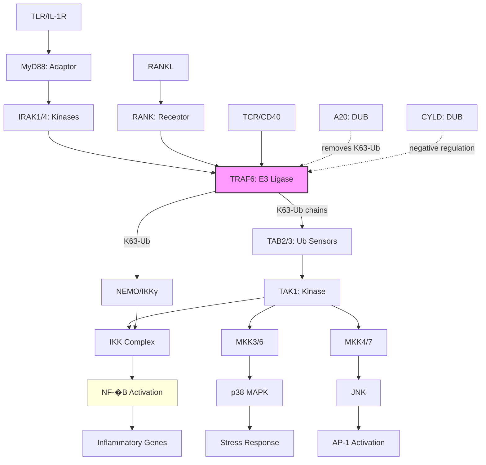

# Pathway Summary for TRAF6

## Overview
TRAF6 (TNF Receptor-Associated Factor 6) is a critical E3 ubiquitin ligase and signal transduction adaptor that synthesizes K63-linked polyubiquitin chains for non-degradative signaling. It serves as a central hub connecting multiple immune signaling pathways including Toll-like receptors (TLRs), interleukin-1 receptor (IL-1R), TNF receptor superfamily, and T cell receptor (TCR) signaling. Unlike degradative K48-linked ubiquitination, TRAF6-mediated K63-linked chains serve as scaffolds for signal complex assembly.

## Core Signaling Pathways

### TLR/IL-1R Signaling Pathway
TRAF6 is recruited to TLR/IL-1R complexes via MyD88 and IRAK proteins. Upon activation, TRAF6 synthesizes K63-linked polyubiquitin chains that recruit TAB2/TAB3-TAK1 complex, leading to activation of NF-�B and MAPK pathways essential for inflammatory responses.

### NF-�B Activation Pathway
TRAF6 activates NF-�B through multiple mechanisms:
- K63-ubiquitination of NEMO/IKK� facilitating IKK complex activation
- Self-ubiquitination creating docking sites for signaling complexes
- Activation of TAK1 which phosphorylates IKK�

### RANKL/RANK Signaling
In osteoclast differentiation, RANKL binding to RANK recruits TRAF6, which activates NF-�B, MAPK, and NFATc1 pathways essential for osteoclastogenesis and bone remodeling.

## Pathway Diagram

## Upstream Activators
- **Pattern recognition receptors**: TLRs recognizing PAMPs
- **Cytokine receptors**: IL-1R, IL-17R, IL-18R
- **TNF receptor superfamily**: RANK, CD40, BAFFR
- **Antigen receptors**: TCR, BCR
- **Growth factor receptors**: TGF-� receptor

## Downstream Effects

### NF-�B Target Genes
- **Inflammatory cytokines**: IL-6, TNF-�, IL-1�
- **Chemokines**: IL-8, MCP-1, RANTES
- **Adhesion molecules**: ICAM-1, VCAM-1, E-selectin
- **Anti-apoptotic proteins**: BCL-xL, c-IAP1/2

### MAPK-Dependent Responses
- **AP-1 activation**: via JNK pathway
- **Inflammatory mediators**: via p38 MAPK
- **Cell survival and proliferation**: via ERK pathway

## Molecular Mechanisms

### E3 Ligase Activity
- **RING domain**: Catalyzes ubiquitin transfer
- **K63-linked chains**: Non-degradative signaling scaffolds
- **Auto-ubiquitination**: Self-modification for activation
- **Substrate specificity**: NEMO, TAK1, self

### Protein Interactions
- **TRAF domain**: Receptor binding
- **Zinc fingers**: Protein-protein interactions
- **Coiled-coil**: Oligomerization

## Clinical Significance

### Disease Associations
- **Osteopetrosis**: TRAF6 deficiency impairs osteoclastogenesis
- **Inflammatory diseases**: Dysregulated TRAF6 in arthritis, IBD
- **Cancer**: Overexpression in various malignancies
- **Immunodeficiency**: Rare TRAF6 mutations

### Therapeutic Targets
- **TRAF6 inhibitors**: Anti-inflammatory therapy
- **Ubiquitination modulators**: Cancer treatment
- **Pathway-specific targeting**: Selective immunomodulation

## Regulatory Mechanisms

### Negative Regulation
- **A20 (TNFAIP3)**: Deubiquitinase removing K63 chains
- **CYLD**: DUB specifically cleaving K63-linked chains
- **USP4**: Deubiquitinates TRAF6
- **miR-146a**: Post-transcriptional suppression

### Positive Regulation
- **Pellino proteins**: E3 ligases enhancing TRAF6 activity
- **TRIM proteins**: Facilitate TRAF6 function
- **Phosphorylation**: Enhances ligase activity

## Tissue-Specific Functions
- **Immune cells**: Inflammatory signaling, T cell activation
- **Bone**: Osteoclast differentiation and function
- **Nervous system**: Neuroinflammation, microglial activation
- **Epithelial cells**: Barrier defense, wound healing

## Cross-pathway Integration
TRAF6 integrates signals from:
1. **Innate immunity**: TLR signaling
2. **Adaptive immunity**: TCR/BCR signaling
3. **Bone metabolism**: RANK/RANKL axis
4. **Cell survival**: PI3K/AKT pathway
5. **Autophagy**: Beclin-1 ubiquitination