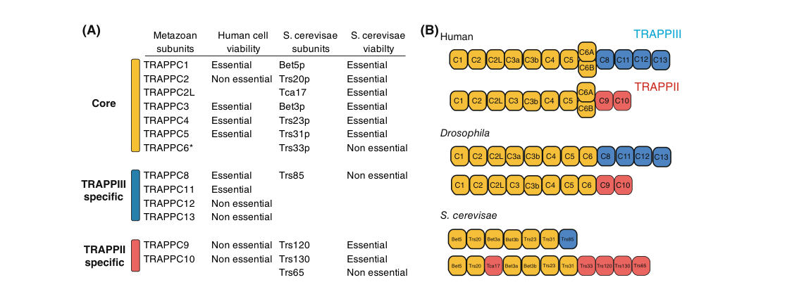

## Question

# Gene Research for Functional Annotation

## ⚠️ CRITICAL: Gene/Protein Identification Context

**BEFORE YOU BEGIN RESEARCH:** You MUST verify you are researching the CORRECT gene/protein. Gene symbols can be ambiguous, especially for less well-characterized genes from non-model organisms.

### Target Gene/Protein Identity (from UniProt):
- **UniProt Accession:** Q7Z392
- **Protein Description:** RecName: Full=Trafficking protein particle complex subunit 11;
- **Gene Information:** Name=TRAPPC11; Synonyms=C4orf41;
- **Organism (full):** Homo sapiens (Human).
- **Protein Family:** Belongs to the TRAPPC11 family. .
- **Key Domains:** TPC11. (IPR021773); TRAPPC11_C. (IPR025876); Foie-gras_1 (PF11817); Gryzun-like (PF12742)

### MANDATORY VERIFICATION STEPS:

1. **Check if the gene symbol "TRAPPC11" matches the protein description above**
2. **Verify the organism is correct:** Homo sapiens (Human).
3. **Check if protein family/domains align with what you find in literature**
4. **If you find literature for a DIFFERENT gene with the same or similar symbol, STOP**

### If Gene Symbol is Ambiguous or You Cannot Find Relevant Literature:

**DO NOT PROCEED WITH RESEARCH ON A DIFFERENT GENE.** Instead:
- State clearly: "The gene symbol 'TRAPPC11' is ambiguous or literature is limited for this specific protein"
- Explain what you found (e.g., "Found extensive literature on a different gene with the same symbol in a different organism")
- Describe the protein based ONLY on the UniProt information provided above
- Suggest that the protein function can be inferred from domain/family information

### Research Target:

Please provide a comprehensive research report on the gene **TRAPPC11** (gene ID: TRAPPC11, UniProt: Q7Z392) in human.

The research report should be a detailed narrative explaining the function, biological processes, and localization of the gene product. Citations should be given for all claims.

You should prioritize authoritative reviews and primary scientific literature when conducting research. You can supplement
this with annotations you find in gene/protein databases, but these can be outdated or inaccurate.

We are specifically interested in the primary function of the gene - for enzymes, what reaction is catalyzed, and what is the substrate specificity? For transporters, what is the substrate? For structural proteins or adapters, what is the broader structural role? For signaling molecules, what is the role in the pathway.

We are interested in where in or outside the cell the gene product carries out its function.

We are also interested in the signaling or biochemical pathways in which the gene functions. We are less interested in broad pleiotropic effects, except where these elucidate the precise role.

Include evidence where possible. We are interested in both experimental evidence as well as inference from structure, evolution, or bioinformatic analysis. Precise studies should be prioritized over high-throughput, where available.

## Output

Question: You are an expert researcher providing comprehensive, well-cited information.

Provide detailed information focusing on:
1. Key concepts and definitions with current understanding
2. Recent developments and latest research (prioritize 2023-2024 sources)
3. Current applications and real-world implementations
4. Expert opinions and analysis from authoritative sources
5. Relevant statistics and data from recent studies

Format as a comprehensive research report with proper citations. Include URLs and publication dates where available.
Always prioritize recent, authoritative sources and provide specific citations for all major claims.

# Gene Research for Functional Annotation

## ⚠️ CRITICAL: Gene/Protein Identification Context

**BEFORE YOU BEGIN RESEARCH:** You MUST verify you are researching the CORRECT gene/protein. Gene symbols can be ambiguous, especially for less well-characterized genes from non-model organisms.

### Target Gene/Protein Identity (from UniProt):
- **UniProt Accession:** Q7Z392
- **Protein Description:** RecName: Full=Trafficking protein particle complex subunit 11;
- **Gene Information:** Name=TRAPPC11; Synonyms=C4orf41;
- **Organism (full):** Homo sapiens (Human).
- **Protein Family:** Belongs to the TRAPPC11 family. .
- **Key Domains:** TPC11. (IPR021773); TRAPPC11_C. (IPR025876); Foie-gras_1 (PF11817); Gryzun-like (PF12742)

### MANDATORY VERIFICATION STEPS:

1. **Check if the gene symbol "TRAPPC11" matches the protein description above**
2. **Verify the organism is correct:** Homo sapiens (Human).
3. **Check if protein family/domains align with what you find in literature**
4. **If you find literature for a DIFFERENT gene with the same or similar symbol, STOP**

### If Gene Symbol is Ambiguous or You Cannot Find Relevant Literature:

**DO NOT PROCEED WITH RESEARCH ON A DIFFERENT GENE.** Instead:
- State clearly: "The gene symbol 'TRAPPC11' is ambiguous or literature is limited for this specific protein"
- Explain what you found (e.g., "Found extensive literature on a different gene with the same symbol in a different organism")
- Describe the protein based ONLY on the UniProt information provided above
- Suggest that the protein function can be inferred from domain/family information

### Research Target:

Please provide a comprehensive research report on the gene **TRAPPC11** (gene ID: TRAPPC11, UniProt: Q7Z392) in human.

The research report should be a detailed narrative explaining the function, biological processes, and localization of the gene product. Citations should be given for all claims.

You should prioritize authoritative reviews and primary scientific literature when conducting research. You can supplement
this with annotations you find in gene/protein databases, but these can be outdated or inaccurate.

We are specifically interested in the primary function of the gene - for enzymes, what reaction is catalyzed, and what is the substrate specificity? For transporters, what is the substrate? For structural proteins or adapters, what is the broader structural role? For signaling molecules, what is the role in the pathway.

We are interested in where in or outside the cell the gene product carries out its function.

We are also interested in the signaling or biochemical pathways in which the gene functions. We are less interested in broad pleiotropic effects, except where these elucidate the precise role.

Include evidence where possible. We are interested in both experimental evidence as well as inference from structure, evolution, or bioinformatic analysis. Precise studies should be prioritized over high-throughput, where available.

## Research Report: Human **TRAPPC11** (UniProt **Q7Z392**; gene **TRAPPC11**; synonym **C4orf41**)—functional annotation

### 1) Identity verification and key definitions (current understanding)
**Gene/protein identity.** Primary proteomic purification of the mammalian TRAPP complex identified the human gene **C4orf41** as a bona fide TRAPP component and designated it **TRAPPC11** (Trafficking protein particle complex subunit 11). This work placed TRAPPC11 functionally in the **early secretory pathway**, specifically ER-to-Golgi trafficking at/near the ERGIC. Publication date: **2011-06**. URL: https://doi.org/10.1091/mbc.e10-11-0873 (scrivens2011c4orf41andttc15 pages 1-2, scrivens2011c4orf41andttc15 pages 2-3).

**TRAPP complexes (concept).** TRAPP (TRAnsport Protein Particle) complexes are **multisubunit Rab GTPase guanine-nucleotide exchange factors (GEFs)** and tethering-related assemblies that organize vesicle trafficking. In metazoans, there are two major TRAPP complexes: 
- **TRAPPII**, which preferentially activates **Rab11** 
- **TRAPPIII**, which preferentially activates **Rab1** 
Publication date: **2023-12**. URL: https://doi.org/10.1002/1873-3468.14553 (Figure summarizes composition and Rab specificity) (galindo2023thetrappcomplexes media bb790abc).

**Where TRAPPC11 fits.** Recent synthesis/reviews place **TRAPPC11** as a **TRAPPIII-associated subunit** (metazoan-specific; no yeast homologue), contributing to TRAPPIII architecture and function. Publication date: **2023-12**. URL: https://doi.org/10.1016/j.jacbts.2023.03.011 (papaioannou2023biochemicalstructureand pages 4-5).

### 2) Molecular function, pathways, and subcellular localization (evidence-based)
#### 2.1 Primary cellular role: early secretory pathway trafficking (ER → ERGIC → Golgi)
**Loss-of-function phenotypes.** RNAi depletion of TRAPPC11 causes (i) **Golgi fragmentation** and (ii) **arrest of anterograde cargo trafficking at an early step**—VSV-G cargo fails to reach the Golgi efficiently and accumulates in BFA-resistant puncta colocalizing with ERGIC markers, consistent with a block at ER exit sites/peripheral ERGIC. Publication date: **2011-06**. URL: https://doi.org/10.1091/mbc.e10-11-0873 (scrivens2011c4orf41andttc15 pages 6-7).

**Patient-cell trafficking defects.** Patient-derived fibroblasts with bi-allelic TRAPPC11 variants show **delayed ER-to-Golgi transport and/or delayed exit from the Golgi**, supporting a conserved requirement for TRAPPC11 in secretory trafficking. Publication date: **2019-10**. URL: https://doi.org/10.1038/s41598-019-50415-6 (milev2019characterizationofthree pages 1-2).

**Localization context (functional compartment).** Across studies, the functional readouts consistently implicate TRAPPC11 activity at the **ER–Golgi interface (ERGIC/Golgi)** rather than at the plasma membrane or nucleus, consistent with a TRAPP complex subunit operating on secretory pathway membranes (scrivens2011c4orf41andttc15 pages 6-7, milev2019characterizationofthree pages 1-2).

#### 2.2 Complex membership and Rab pathway assignment (Rab1-centric TRAPPIII)
**Consensus composition and Rab specificity (2023).** A 2023 FEBS Letters review provides a consolidated metazoan TRAPP model in which **TRAPPC11 is TRAPPIII-specific**, and illustrates that **TRAPPIII activates Rab1** while **TRAPPII activates Rab11** (with shared core subunits). Publication date: **2023-12**. URL: https://doi.org/10.1002/1873-3468.14553 (figure evidence) (galindo2023thetrappcomplexes media bb790abc).

**Structural/assembly role.** A 2023 review focused on TRAPP complexes (with cryo-EM-informed models) describes TRAPPC11 as a **metazoan TRAPPIII-associated subunit** that **binds TRAPPC2L** and occupies a position where its C-terminal region meets TRAPPC8 at an outer “vertex” that also includes TRAPPC12/13—consistent with a **scaffolding/assembly** role rather than an enzymatic catalytic role. Publication date: **2023-12**. URL: https://doi.org/10.1016/j.jacbts.2023.03.011 (papaioannou2023biochemicalstructureand pages 4-5).

#### 2.3 Glycosylation: TRAPPC11-linked hypoglycosylation in disease and models
**Dystroglycan hypoglycosylation (disease-relevant).** A 2024 TRAPPopathies review summarizes that TRAPPC11 variants are associated with **protein hypoglycosylation**, including **severe hypoglycosylation of α-dystroglycan** in affected tissues (muscle/brain), and that TRAPPC11 depletion causes hypoglycosylation phenotypes in human cells and vertebrate models. Publication date: **2024-12**. URL: https://doi.org/10.3390/ijms252413329 (hall2024trappopathiesseveremultisystem pages 12-14).

**Mechanistic interpretation.** The most supported mechanistic interpretation from available evidence is that TRAPPC11-dependent secretory pathway organization and Golgi/ERGIC integrity are required for normal maturation/processing of glycoproteins (including glycosylation-dependent epitopes such as α-dystroglycan), though tissue-specificity is reported (e.g., fibroblasts can show less severe α-dystroglycan labeling changes than muscle). (hall2024trappopathiesseveremultisystem pages 12-14).

#### 2.4 Autophagy: role in autophagosome maturation/sealing
**Patient-cell autophagic flux phenotypes.** In patient fibroblasts, TRAPPC11 variants can cause **defective starvation-induced autophagic flux** with failure to clear LC3-II and reduced LC3–LAMP1 colocalization; a protease-protection assay supported accumulation of **unsealed isolation membranes**, consistent with a block in autophagosome completion. Publication date: **2019-10**. URL: https://doi.org/10.1038/s41598-019-50415-6 (milev2019characterizationofthree pages 10-11).

**Mechanistic placement (2023).** A 2023 synthesis places TRAPPC11 function downstream of isolation membrane initiation, where TRAPPC11 contributes to recruiting factors (e.g., ATG2, WIPI4/WDR45) required for **sealing** to form mature autophagosomes. (almousa2023insightintotrappii pages 28-32).

### 3) Recent developments (prioritizing 2023–2024)
#### 3.1 Updated TRAPP complex models (composition, Rab specificity, and membrane context)
- **Metazoan TRAPP composition clarified with structure-informed schematics.** A 2023 FEBS Letters review provides a figure consolidating TRAPPII vs TRAPPIII composition and explicitly places **TRAPPC11 in TRAPPIII** with **Rab1** specificity (TRAPPII→Rab11). Publication date: **2023-12**. URL: https://doi.org/10.1002/1873-3468.14553 (galindo2023thetrappcomplexes media bb790abc).
- **Assembly/architecture emphasis.** A 2023 JACC: Basic to Translational Science review (cardiac-focused) uses structural interpretations to highlight how TRAPPC11 contributes to TRAPPIII architecture via TRAPPC2L binding and positioning with TRAPPC8/12/13, emphasizing that peripheral subunits shape specificity and membrane-contextual function. Publication date: **2023-12**. URL: https://doi.org/10.1016/j.jacbts.2023.03.011 (papaioannou2023biochemicalstructureand pages 4-5).

#### 3.2 2023 cohort expansion and quantitative phenotyping of TRAPPC11 disease
A 2023 Journal of Medical Genetics cohort study reported **25 Roma individuals** homozygous for a founder TRAPPC11 splice variant (**c.1287+5G>A**), substantially expanding systematic phenotyping. Publication date: **2023-05**. URL: https://doi.org/10.1136/jmg-2022-109132 (justel2023expandingthephenotypic pages 2-3).

Key quantitative findings from this cohort include:
- **Global psychomotor delay:** 96% (24/25)
- **Motor delay as presenting feature:** 84% (21/25)
- **Intellectual disability in individuals >4 years:** 100% (23/23), with reported severity distribution (severe/moderate/mild categories)
These data support TRAPPC11 deficiency as a neurodevelopmental + myopathic disorder with frequent microcephaly and susceptibility to infection-triggered decompensation described as “pseudometabolic crises.” (justel2023expandingthephenotypic pages 2-3).

#### 3.3 2024 review-level consolidation: variant landscape and cellular readouts
A 2024 International Journal of Molecular Sciences review consolidates clinical genetics and experimental cell biology across TRAPPopathies and notes that **ClinVar lists >60 pathogenic/likely pathogenic autosomal-recessive TRAPPC11 variants**, highlighting the growing diagnostic landscape and allelic heterogeneity. Publication date: **2024-12**. URL: https://doi.org/10.3390/ijms252413329 (hall2024trappopathiesseveremultisystem pages 12-14).

### 4) Current applications and real-world implementations
#### 4.1 Diagnostic genetics for TRAPPC11-related disorders
**Clinical implementation.** TRAPPC11 is implicated in autosomal-recessive limb-girdle muscular dystrophy subtype **LGMD R18** (also referred to historically as LGMD2S) and TRAPPC11-related congenital disorder of glycosylation phenotypes; modern clinical practice commonly uses **NGS gene panels / WES** for suspected muscular dystrophy and neurodevelopmental disorders.

Evidence for real-world sequencing cohorts:
- In a 2023 Turkish referral cohort of **256** individuals with neurological presentations, one case carried a homozygous TRAPPC11 p.(Gly980Arg) variant and presented with muscular dystrophy, cataract, neuromotor retardation, and microcephaly. Publication date: **2023-09**. URL: https://doi.org/10.26650/jchild.2023.1294229 (aslanger2023clinicalradiologicaland pages 1-2).

#### 4.2 Cellular assays as functional implementation (research and variant interpretation)
**Patient fibroblast assays as a functional readout.** Multiple studies and reviews emphasize use of patient fibroblasts to measure:
- **VSV-G-ts045-GFP trafficking kinetics** (ER-to-Golgi and Golgi exit delay)
- **Golgi morphology (fragmentation/dispersal)**
- **glycosylation markers (including α-dystroglycan hypoglycosylation in muscle)**
- **autophagy flux assays (LC3-II, LC3/LAMP1 colocalization, protease protection)**
These represent “real-world” experimental implementations used to connect genotype to mechanism and support variant pathogenicity interpretation. (hall2024trappopathiesseveremultisystem pages 12-14, milev2019characterizationofthree pages 10-11, scrivens2011c4orf41andttc15 pages 6-7).

### 5) Expert synthesis and analysis (authoritative interpretations)
**Primary functional role (most supported).** Across primary cell biology and disease-cell phenotyping, TRAPPC11 most strongly supports a **scaffolding/assembly role within TRAPPIII at the ER–Golgi interface**, impacting:
1) **early anterograde secretory trafficking** (ER/ERGIC → Golgi) and Golgi integrity, and
2) downstream consequences for **glycoprotein maturation/glycosylation** and **autophagosome maturation**.
This interpretation is directly supported by early mechanistic cell biology (RNAi + cargo trafficking arrest) and reinforced by patient fibroblast phenotypes (trafficking delay, Golgi dispersal, glycosylation and autophagy readouts) as consolidated in 2024 review literature. (scrivens2011c4orf41andttc15 pages 6-7, milev2019characterizationofthree pages 1-2, hall2024trappopathiesseveremultisystem pages 12-14).

**Not an enzyme with a defined substrate reaction.** The evidence indicates TRAPPC11 is not primarily a catalytic enzyme; rather, it is a **complex subunit** whose “substrate specificity” is best conceptualized at the pathway level (i.e., regulating **Rab1-associated trafficking** via TRAPPIII organization and membrane-context function). (papaioannou2023biochemicalstructureand pages 4-5, galindo2023thetrappcomplexes media bb790abc).

**Domain/family note.** The provided UniProt/domain context (TPC11/TRAPPC11_C/Foie-gras/Gryzun-like) is consistent with disease and variant analyses emphasizing functional importance of the **C-terminal region** and regions including a “foie gras” domain deletion variant; patient variant characterization supports the C-terminus as critical for cellular phenotypes. Publication date: **2019-10**. URL: https://doi.org/10.1038/s41598-019-50415-6 (milev2019characterizationofthree pages 1-2, milev2019characterizationofthree pages 10-11).

---

## Visual evidence (TRAPP model including TRAPPC11)
A 2023 figure summarizing **metazoan TRAPP complex composition** and **Rab specificity** explicitly places **TRAPPC11 in TRAPPIII** and depicts **TRAPPIII→Rab1** vs **TRAPPII→Rab11**. Publication date: **2023-12**. URL: https://doi.org/10.1002/1873-3468.14553 (galindo2023thetrappcomplexes media bb790abc).

---

## Summary table (evidence-based functional annotation)
| Function/Process | Evidence type (review/primary, assay) | Key findings | Subcellular location/compartment | Key interaction/complex context (TRAPPII/TRAPPIII, Rab1/Rab11) | Citations (pqac IDs) |
|---|---|---|---|---|---|
| Gene/protein identity and complex membership | Primary; tandem-affinity purification/proteomics and interaction mapping | Human C4orf41 is TRAPPC11, a bona fide mammalian TRAPP subunit; recovered with known TRAPP baits and implicated in early secretory trafficking | TRAPP-associated membranes of the early secretory pathway | TRAPP complex component; later literature places it in metazoan TRAPPIII | (scrivens2011c4orf41andttc15 pages 1-2, scrivens2011c4orf41andttc15 pages 2-3, papaioannou2023biochemicalstructureand pages 4-5) |
| Early ER-to-Golgi trafficking | Primary; RNAi depletion, VSV-G transport assay, fluorescence microscopy, BFA perturbation | TRAPPC11 depletion causes cargo arrest before/at ERGIC and Golgi fragmentation; VSV-G fails to efficiently reach/pass through Golgi | ER exit sites, ERGIC, Golgi | TRAPP-mediated early secretory pathway function; TRAPPIII-associated in later models | (scrivens2011c4orf41andttc15 pages 1-2, scrivens2011c4orf41andttc15 pages 6-7, hall2024trappopathiesseveremultisystem pages 12-14) |
| Golgi organization/integrity | Primary and review; patient fibroblast imaging, immunoblot | Loss or mutation of TRAPPC11 leads to Golgi dispersal/fragmentation and reduced full-length TRAPPC11 protein | Golgi apparatus | Loss of interaction with TRAPP core, especially TRAPPC2, is reported for disease variants | (hall2024trappopathiesseveremultisystem pages 12-14, maeda2025disease‐associatedfactorsat pages 8-9) |
| Rab GEF pathway assignment | Reviews/structural synthesis; cryo-EM-informed models | In metazoans, TRAPPC11 is assigned to TRAPPIII, the complex that activates Rab1; TRAPPII activates Rab11 | Membrane-associated TRAPP complexes on secretory/autophagy membranes | TRAPPIII-specific subunit; Rab1 pathway, contrasted with TRAPPII/Rab11 | (almousa2023insightintotrappii pages 28-32, papaioannou2023biochemicalstructureand pages 4-5, almousa2023insightintotrappii pages 24-28, galindo2023thetrappcomplexes media bb790abc) |
| TRAPPIII architecture/assembly | Structural review; cryo-EM/density-map interpretation | TRAPPC11 is metazoan-specific, binds TRAPPC2L, and its C-terminal region meets TRAPPC8 at the outer TRAPPIII architecture vertex with TRAPPC12/13 | TRAPPIII complex scaffold at membrane surface | TRAPPIII assembly with TRAPPC8/12/13; contributes to Rab1-specific complex organization | (papaioannou2023biochemicalstructureand pages 4-5, galindo2023thetrappcomplexes media bb790abc) |
| Protein glycosylation | Primary and review; patient biopsies/fibroblasts, immunoblot, glycosylation markers | TRAPPC11 deficiency causes protein hypoglycosylation; severe α-dystroglycan hypoglycosylation is seen in affected muscle/brain, with altered N-glycosylation markers in cells | ER/Golgi glycoprotein processing pathway | Function extends beyond generic trafficking; may include TRAPP-independent effects on N-linked glycosylation/LLO homeostasis | (hall2024trappopathiesseveremultisystem pages 12-14, milev2019characterizationofthree pages 10-11, almousa2023insightintotrappii pages 28-32) |
| Autophagy/autophagosome maturation | Primary and review; LC3-II flux, LC3-LAMP1 colocalization, protease-protection assay | TRAPPC11 acts upstream of autophagosome sealing; deficiency reduces autophagic flux and yields unsealed isolation membranes in some patient cells | Isolation membrane/autophagosome, lysosome-related compartments | TRAPPIII-associated autophagy role; recruits/acts with autophagy machinery downstream of initiation | (milev2019characterizationofthree pages 1-2, milev2019characterizationofthree pages 10-11, almousa2023insightintotrappii pages 28-32, hall2024trappopathiesseveremultisystem pages 12-14) |
| Lysosomal/autophagic marker changes | Review of primary patient-cell work; LAMP1 localization/levels | Altered LAMP1 localization and reduced LAMP1 levels in patient fibroblasts support lysosomal/autophagic perturbation | Lysosome/autolysosome-related compartments | Downstream consequence of TRAPPC11 dysfunction within TRAPPIII-linked trafficking/autophagy networks | (hall2024trappopathiesseveremultisystem pages 12-14) |
| Functional importance of C-terminus/domains | Primary; variant analysis in patient cells | Variants affecting the foie gras region or extreme carboxy terminus impair trafficking, glycosylation, and in some cases autophagy, indicating the C-terminus is critical for function | TRAPPIII structural subunit with functionally important C-terminal region | Supports structural role within TRAPPIII rather than enzyme catalysis | (milev2019characterizationofthree pages 1-2, milev2019characterizationofthree pages 10-11) |
| Disease-relevant cellular role | Review and primary human genetics/cell biology | TRAPPC11 variants cause multisystem “TRAPPopathy” with consistent muscle involvement and cellular defects in trafficking, Golgi maintenance, glycosylation, and autophagy | Highest functional readout in muscle, fibroblasts, liver-related pathways | Autosomal-recessive TRAPPC11 deficiency; ClinVar lists >60 pathogenic/likely pathogenic variants | (hall2024trappopathiesseveremultisystem pages 12-14) |

*Table: This table summarizes the experimentally supported functional annotation of human TRAPPC11 (UniProt Q7Z392), including trafficking, Golgi, glycosylation, and autophagy roles. It also captures the current consensus that TRAPPC11 is a metazoan TRAPPIII subunit linked to Rab1 rather than Rab11 biology.*

### Key takeaways
- **TRAPPC11 (C4orf41; UniProt Q7Z392) is a bona fide TRAPP subunit** required for efficient **ER-to-Golgi trafficking** and maintaining **Golgi/ERGIC organization** (scrivens2011c4orf41andttc15 pages 6-7, scrivens2011c4orf41andttc15 pages 1-2).
- Current 2023–2024 synthesis places TRAPPC11 as **TRAPPIII-associated**, supporting **Rab1 pathway** function and TRAPPIII architecture (galindo2023thetrappcomplexes media bb790abc, papaioannou2023biochemicalstructureand pages 4-5).
- In humans, bi-allelic TRAPPC11 variants cause multisystem disease (LGMD R18 / TRAPPC11-CDG spectrum) with quantifiable neurodevelopmental and myopathic phenotypes; a 2023 cohort of **25** founder homozygotes provides robust statistics on developmental delay and intellectual disability (justel2023expandingthephenotypic pages 2-3).
- Mechanistic cellular consequences include **glycosylation defects** (e.g., α-dystroglycan hypoglycosylation in tissues) and **autophagy maturation defects** in some variant contexts (hall2024trappopathiesseveremultisystem pages 12-14, milev2019characterizationofthree pages 10-11).

References

1. (scrivens2011c4orf41andttc15 pages 1-2): P. James Scrivens, Baraa Noueihed, Nassim Shahrzad, Sokunthear Hul, Stephanie Brunet, and Michael Sacher. C4orf41 and ttc-15 are mammalian trapp components with a role at an early stage in er-to-golgi trafficking. Molecular Biology of the Cell, 22:2083-2093, Jun 2011. URL: https://doi.org/10.1091/mbc.e10-11-0873, doi:10.1091/mbc.e10-11-0873. This article has 150 citations and is from a domain leading peer-reviewed journal.

2. (scrivens2011c4orf41andttc15 pages 2-3): P. James Scrivens, Baraa Noueihed, Nassim Shahrzad, Sokunthear Hul, Stephanie Brunet, and Michael Sacher. C4orf41 and ttc-15 are mammalian trapp components with a role at an early stage in er-to-golgi trafficking. Molecular Biology of the Cell, 22:2083-2093, Jun 2011. URL: https://doi.org/10.1091/mbc.e10-11-0873, doi:10.1091/mbc.e10-11-0873. This article has 150 citations and is from a domain leading peer-reviewed journal.

3. (galindo2023thetrappcomplexes media bb790abc): Antonio Galindo and Sean Munro. The <scp>trapp</scp> complexes: oligomeric exchange factors that activate the small <scp>gtpases</scp> rab1 and rab11. FEBS Letters, 597:734-749, Dec 2023. URL: https://doi.org/10.1002/1873-3468.14553, doi:10.1002/1873-3468.14553. This article has 24 citations and is from a peer-reviewed journal.

4. (papaioannou2023biochemicalstructureand pages 4-5): Peter Papaioannou, Michael J. Wallace, Nipun Malhotra, Peter J. Mohler, and Mona El Refaey. Biochemical structure and function of trapp complexes in the cardiac system. Dec 2023. URL: https://doi.org/10.1016/j.jacbts.2023.03.011, doi:10.1016/j.jacbts.2023.03.011. This article has 10 citations.

5. (scrivens2011c4orf41andttc15 pages 6-7): P. James Scrivens, Baraa Noueihed, Nassim Shahrzad, Sokunthear Hul, Stephanie Brunet, and Michael Sacher. C4orf41 and ttc-15 are mammalian trapp components with a role at an early stage in er-to-golgi trafficking. Molecular Biology of the Cell, 22:2083-2093, Jun 2011. URL: https://doi.org/10.1091/mbc.e10-11-0873, doi:10.1091/mbc.e10-11-0873. This article has 150 citations and is from a domain leading peer-reviewed journal.

6. (milev2019characterizationofthree pages 1-2): Miroslav P. Milev, Daniela Stanga, Anne Schänzer, Andrés Nascimento, Djenann Saint-Dic, Carlos Ortez, Daniel Natera-de Benito, Desiré González Barrios, Jaume Colomer, Carmen Badosa, Cristina Jou, Pia Gallano, Lidia Gonzalez-Quereda, Ana Töpf, Katherine Johnson, Volker Straub, Andreas Hahn, Michael Sacher, and Cecilia Jimenez-Mallebrera. Characterization of three trappc11 variants suggests a critical role for the extreme carboxy terminus of the protein. Scientific Reports, Oct 2019. URL: https://doi.org/10.1038/s41598-019-50415-6, doi:10.1038/s41598-019-50415-6. This article has 19 citations and is from a peer-reviewed journal.

7. (hall2024trappopathiesseveremultisystem pages 12-14): Riley Hall, Vallari Sawant, Jinchao Gu, Tim Sikora, Ben Rollo, Silvia Velasco, Jinkuk Kim, Nava Segev, John Christodoulou, and Nicole J. Van Bergen. Trappopathies: severe multisystem disorders caused by variants in genes of the transport protein particle (trapp) complexes. Dec 2024. URL: https://doi.org/10.3390/ijms252413329, doi:10.3390/ijms252413329. This article has 7 citations.

8. (milev2019characterizationofthree pages 10-11): Miroslav P. Milev, Daniela Stanga, Anne Schänzer, Andrés Nascimento, Djenann Saint-Dic, Carlos Ortez, Daniel Natera-de Benito, Desiré González Barrios, Jaume Colomer, Carmen Badosa, Cristina Jou, Pia Gallano, Lidia Gonzalez-Quereda, Ana Töpf, Katherine Johnson, Volker Straub, Andreas Hahn, Michael Sacher, and Cecilia Jimenez-Mallebrera. Characterization of three trappc11 variants suggests a critical role for the extreme carboxy terminus of the protein. Scientific Reports, Oct 2019. URL: https://doi.org/10.1038/s41598-019-50415-6, doi:10.1038/s41598-019-50415-6. This article has 19 citations and is from a peer-reviewed journal.

9. (almousa2023insightintotrappii pages 28-32): H Almousa. Insight into trappii assembly and function through characterization of naturally occurring trapp gene variants. Unknown journal, 2023.

10. (justel2023expandingthephenotypic pages 2-3): Maria Justel, Cristina Jou, Andrea Sariego-Jamardo, Natalia Alexandra Juliá-Palacios, Carlos Ortez, Maria Luisa Poch, Antonio Hedrera-Fernandez, Hilario Gomez-Martin, Anna Codina, Jana Dominguez-Carral, Jordi Muxart, Aurelio Hernández-Laín, Sara Vila-Bedmar, Miren Zulaica, Ramon Cancho-Candela, Margarita del Carmen Castro, Alberto de la Osa-Langreo, Alfonso Peña-Valenceja, Elena Marcos-Vadillo, Pablo Prieto-Matos, Samuel Ignacio Pascual-Pascual, Adolfo López de Munain, Ana Camacho, Berta Estevez-Arias, Uliana Musokhranova, Mireia Olivella, Alfonso Oyarzábal, Cecilia Jimenez-Mallebrera, Cristina Domínguez-González, Andrés Nascimento, Àngels García-Cazorla, and Daniel Natera-de Benito. Expanding the phenotypic spectrum of trappc11-related muscular dystrophy: 25 roma individuals carrying a founder variant. Journal of Medical Genetics, 60:965-973, May 2023. URL: https://doi.org/10.1136/jmg-2022-109132, doi:10.1136/jmg-2022-109132. This article has 12 citations and is from a domain leading peer-reviewed journal.

11. (aslanger2023clinicalradiologicaland pages 1-2): Ayça Aslanger, Esma Sengenç, Emrah Yücesan, Beyza Göncü, Akın İşcan, and Gözde Yeşil Sayın. Clinical, radiological, and molecular findings in cases with trappopathies. Çocuk Dergisi / Journal of Child, 23:1-7, Sep 2023. URL: https://doi.org/10.26650/jchild.2023.1294229, doi:10.26650/jchild.2023.1294229. This article has 0 citations.

12. (maeda2025disease‐associatedfactorsat pages 8-9): Miharu Maeda, Masashi Arakawa, and Kota Saito. Disease‐associated factors at the endoplasmic reticulum–golgi interface. Traffic (Copenhagen, Denmark), Jan 2025. URL: https://doi.org/10.1111/tra.70001, doi:10.1111/tra.70001. This article has 2 citations.

13. (almousa2023insightintotrappii pages 24-28): H Almousa. Insight into trappii assembly and function through characterization of naturally occurring trapp gene variants. Unknown journal, 2023.

## Artifacts

- [Edison artifact artifact-00](TRAPPC11-deep-research-falcon_artifacts/artifact-00.md)

## Citations

1. papaioannou2023biochemicalstructureand pages 4-5
2. milev2019characterizationofthree pages 1-2
3. hall2024trappopathiesseveremultisystem pages 12-14
4. milev2019characterizationofthree pages 10-11
5. almousa2023insightintotrappii pages 28-32
6. justel2023expandingthephenotypic pages 2-3
7. aslanger2023clinicalradiologicaland pages 1-2
8. almousa2023insightintotrappii pages 24-28
9. https://doi.org/10.1091/mbc.e10-11-0873
10. https://doi.org/10.1002/1873-3468.14553
11. https://doi.org/10.1016/j.jacbts.2023.03.011
12. https://doi.org/10.1038/s41598-019-50415-6
13. https://doi.org/10.3390/ijms252413329
14. https://doi.org/10.1136/jmg-2022-109132
15. https://doi.org/10.26650/jchild.2023.1294229
16. https://doi.org/10.1091/mbc.e10-11-0873,
17. https://doi.org/10.1002/1873-3468.14553,
18. https://doi.org/10.1016/j.jacbts.2023.03.011,
19. https://doi.org/10.1038/s41598-019-50415-6,
20. https://doi.org/10.3390/ijms252413329,
21. https://doi.org/10.1136/jmg-2022-109132,
22. https://doi.org/10.26650/jchild.2023.1294229,
23. https://doi.org/10.1111/tra.70001,