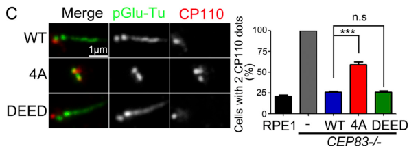

## Question

# Gene Research for Functional Annotation

## ⚠️ CRITICAL: Gene/Protein Identification Context

**BEFORE YOU BEGIN RESEARCH:** You MUST verify you are researching the CORRECT gene/protein. Gene symbols can be ambiguous, especially for less well-characterized genes from non-model organisms.

### Target Gene/Protein Identity (from UniProt):
- **UniProt Accession:** Q6IQ55
- **Protein Description:** RecName: Full=Tau-tubulin kinase 2; EC=2.7.11.1;
- **Gene Information:** Name=TTBK2; Synonyms=KIAA0847;
- **Organism (full):** Homo sapiens (Human).
- **Protein Family:** Belongs to the protein kinase superfamily. CK1 Ser/Thr
- **Key Domains:** CK1_Ser-Thr_kinase-like. (IPR050235); Kinase-like_dom_sf. (IPR011009); Prot_kinase_dom. (IPR000719); Protein_kinase_ATP_BS. (IPR017441); TTBK2_STKc. (IPR047915)

### MANDATORY VERIFICATION STEPS:

1. **Check if the gene symbol "TTBK2" matches the protein description above**
2. **Verify the organism is correct:** Homo sapiens (Human).
3. **Check if protein family/domains align with what you find in literature**
4. **If you find literature for a DIFFERENT gene with the same or similar symbol, STOP**

### If Gene Symbol is Ambiguous or You Cannot Find Relevant Literature:

**DO NOT PROCEED WITH RESEARCH ON A DIFFERENT GENE.** Instead:
- State clearly: "The gene symbol 'TTBK2' is ambiguous or literature is limited for this specific protein"
- Explain what you found (e.g., "Found extensive literature on a different gene with the same symbol in a different organism")
- Describe the protein based ONLY on the UniProt information provided above
- Suggest that the protein function can be inferred from domain/family information

### Research Target:

Please provide a comprehensive research report on the gene **TTBK2** (gene ID: TTBK2, UniProt: Q6IQ55) in human.

The research report should be a detailed narrative explaining the function, biological processes, and localization of the gene product. Citations should be given for all claims.

You should prioritize authoritative reviews and primary scientific literature when conducting research. You can supplement
this with annotations you find in gene/protein databases, but these can be outdated or inaccurate.

We are specifically interested in the primary function of the gene - for enzymes, what reaction is catalyzed, and what is the substrate specificity? For transporters, what is the substrate? For structural proteins or adapters, what is the broader structural role? For signaling molecules, what is the role in the pathway.

We are interested in where in or outside the cell the gene product carries out its function.

We are also interested in the signaling or biochemical pathways in which the gene functions. We are less interested in broad pleiotropic effects, except where these elucidate the precise role.

Include evidence where possible. We are interested in both experimental evidence as well as inference from structure, evolution, or bioinformatic analysis. Precise studies should be prioritized over high-throughput, where available.

## Output

Question: You are an expert researcher providing comprehensive, well-cited information.

Provide detailed information focusing on:
1. Key concepts and definitions with current understanding
2. Recent developments and latest research (prioritize 2023-2024 sources)
3. Current applications and real-world implementations
4. Expert opinions and analysis from authoritative sources
5. Relevant statistics and data from recent studies

Format as a comprehensive research report with proper citations. Include URLs and publication dates where available.
Always prioritize recent, authoritative sources and provide specific citations for all major claims.

# Gene Research for Functional Annotation

## ⚠️ CRITICAL: Gene/Protein Identification Context

**BEFORE YOU BEGIN RESEARCH:** You MUST verify you are researching the CORRECT gene/protein. Gene symbols can be ambiguous, especially for less well-characterized genes from non-model organisms.

### Target Gene/Protein Identity (from UniProt):
- **UniProt Accession:** Q6IQ55
- **Protein Description:** RecName: Full=Tau-tubulin kinase 2; EC=2.7.11.1;
- **Gene Information:** Name=TTBK2; Synonyms=KIAA0847;
- **Organism (full):** Homo sapiens (Human).
- **Protein Family:** Belongs to the protein kinase superfamily. CK1 Ser/Thr
- **Key Domains:** CK1_Ser-Thr_kinase-like. (IPR050235); Kinase-like_dom_sf. (IPR011009); Prot_kinase_dom. (IPR000719); Protein_kinase_ATP_BS. (IPR017441); TTBK2_STKc. (IPR047915)

### MANDATORY VERIFICATION STEPS:

1. **Check if the gene symbol "TTBK2" matches the protein description above**
2. **Verify the organism is correct:** Homo sapiens (Human).
3. **Check if protein family/domains align with what you find in literature**
4. **If you find literature for a DIFFERENT gene with the same or similar symbol, STOP**

### If Gene Symbol is Ambiguous or You Cannot Find Relevant Literature:

**DO NOT PROCEED WITH RESEARCH ON A DIFFERENT GENE.** Instead:
- State clearly: "The gene symbol 'TTBK2' is ambiguous or literature is limited for this specific protein"
- Explain what you found (e.g., "Found extensive literature on a different gene with the same symbol in a different organism")
- Describe the protein based ONLY on the UniProt information provided above
- Suggest that the protein function can be inferred from domain/family information

### Research Target:

Please provide a comprehensive research report on the gene **TTBK2** (gene ID: TTBK2, UniProt: Q6IQ55) in human.

The research report should be a detailed narrative explaining the function, biological processes, and localization of the gene product. Citations should be given for all claims.

You should prioritize authoritative reviews and primary scientific literature when conducting research. You can supplement
this with annotations you find in gene/protein databases, but these can be outdated or inaccurate.

We are specifically interested in the primary function of the gene - for enzymes, what reaction is catalyzed, and what is the substrate specificity? For transporters, what is the substrate? For structural proteins or adapters, what is the broader structural role? For signaling molecules, what is the role in the pathway.

We are interested in where in or outside the cell the gene product carries out its function.

We are also interested in the signaling or biochemical pathways in which the gene functions. We are less interested in broad pleiotropic effects, except where these elucidate the precise role.

Include evidence where possible. We are interested in both experimental evidence as well as inference from structure, evolution, or bioinformatic analysis. Precise studies should be prioritized over high-throughput, where available.

# Human TTBK2 (UniProt Q6IQ55): functional annotation research report

**Identity check.** The target is human **TTBK2**, tau-tubulin kinase 2, also designated **KIAA0847** in the supplied UniProt record. A human-cell phosphoproteomic study explicitly identifies the canonical TTBK2 sequence as **Q6IQ55**. TTBK2 is a CK1-related serine/threonine protein kinase with an N-terminal catalytic domain and a long, functionally important noncatalytic C-terminal region. It is **not TTBK1**: their kinase domains are highly similar, but their remaining sequences and experimentally observed activities differ. The kinase-domain and ATP-binding annotations supplied with the accession are consistent with this literature. (bernatik2020phosphorylationofmultiple pages 10-13, bouskila2011ttbk2kinasesubstrate pages 1-2, liao2015ttbk2atau pages 1-2)

## Principal biochemical function and location

**TTBK2 transfers the terminal phosphate of ATP to serine or threonine residues on protein substrates**, generating ADP and a phosphorylated protein. Its best-established physiological role is to control **primary-cilium assembly and maintenance at the distal appendages of the mother centriole**, which becomes the ciliary basal body. It is an intracellular kinase, not a secreted protein or membrane transporter. In human retinal epithelial cells, the distal-appendage protein **CEP164 recruits TTBK2**; CEP164 depletion prevents TTBK2 recruitment, whereas redirecting TTBK2 to appendages can restore cilium formation. Superresolution microscopy further shows that, during serum-starvation-induced ciliogenesis, TTBK2 shifts from the appendage periphery toward its CEP83-containing root. (cajanek2014cep164triggersciliogenesis pages 8-8, cajanek2014cep164triggersciliogenesis pages 2-3, lo2019phosphorylationofcep83 pages 1-2)

The mechanistic sequence is more informative than the protein’s historical name. CEP164 positions TTBK2 at the mother centriole; TTBK2 phosphorylates appendage and cap-associated proteins; these events enable ciliary-vesicle docking, removal of the inhibitory **CP110–CEP97 cap**, recruitment or retention of intraflagellar-transport (IFT) machinery, and growth of the microtubule axoneme. **CP110 removal is a TTBK2-dependent outcome, not evidence that CP110 itself is a confirmed direct TTBK2 substrate.** Ciliary-vesicle docking generally precedes CP110 removal, although individual recruitment and membrane-trafficking events are not necessarily governed by one universal linear timetable. TTBK2 loss can allow early initiation events while preventing axoneme extension. (cajanek2014cep164triggersciliogenesis pages 8-8, bernatik2020phosphorylationofmultiple pages 1-5, bernatik2020phosphorylationofmultiple pages 19-21, lo2019phosphorylationofcep83 pages 8-10)

The following evidence map separates biochemically supported phosphorylation from downstream effects. The cropped **Figure 7** panels in Lo and colleagues’ study illustrate the effects of CEP83 phosphosite mutants on vesicle docking and CP110 removal, alongside the authors’ proposed mechanism. (lo2019phosphorylationofcep83 media 98032bbe, lo2019phosphorylationofcep83 media a0a97781, lo2019phosphorylationofcep83 pages 8-10)

| Substrate / regulator | Specific biochemical event and cellular site | Biological outcome | Evidence status | Source (year; DOI) |
|---|---|---|---|---|
| **CEP164** | Its N-terminal WW domain recruits TTBK2 to distal appendages of the mother centriole; TTBK2 then phosphorylates CEP164 at multiple sites, including T1309, S1317, S1346, S1347 and S1443. | Positions active TTBK2 at the nascent ciliary base, enabling IFT recruitment, CP110-cap removal and progression toward axoneme extension. | Human-cell depletion/rescue, interaction and phosphoproteomic evidence; CEP164 is the most extensively modified ciliary substrate identified. (cajanek2014cep164triggersciliogenesis pages 8-8, bernatik2020phosphorylationofmultiple pages 36-39, bernatik2020phosphorylationofmultiple pages 19-21) | Čajánek & Nigg (2014), [10.1073/pnas.1401777111](https://doi.org/10.1073/pnas.1401777111); Bernatik et al. (2020), [10.1091/mbc.e19-06-0334](https://doi.org/10.1091/mbc.e19-06-0334) |
| **CEP83** | Direct TTBK2 phosphorylation at **S29, T292, T527 and S698** after CEP164-dependent recruitment; occurs near the root of mother-centriole distal appendages. | Promotes ciliary-vesicle docking, subsequent CP110 removal, transition-zone assembly and cilium initiation; phosphodead CEP83-4A is defective, whereas phosphomimetic CEP83-DEED rescues/promotes ciliogenesis. (lo2019phosphorylationofcep83 pages 4-6, lo2019phosphorylationofcep83 pages 6-8, lo2019phosphorylationofcep83 pages 8-10) | Purified-protein kinase assays, phosphosite MS, phosphospecific antibodies and human-cell phosphodead/phosphomimetic rescue experiments. | Lo et al. (2019), [10.1083/jcb.201811142](https://doi.org/10.1083/jcb.201811142) |
| **CEP97 / MPP9** | CEP97 is a reported TTBK2 substrate; MPP9 is phosphorylated at **S629 and S636** at the distal mother-centriole cap. | MPP9 phosphorylation promotes its proteasomal degradation and facilitates removal of the **CP110–CEP97 cap**, permitting axoneme extension. CP110 is a downstream cap component, not an established direct TTBK2 substrate. (bernatik2020phosphorylationofmultiple pages 19-21, bernatik2020phosphorylationofmultiple pages 1-5, lo2019phosphorylationofcep83 pages 8-10) | Prior substrate studies synthesized in a phosphoproteomic primary study and recent review; direct necessity is strongest for MPP9 phosphorylation, while the relevant CEP97 phosphosite is not specified here. | Bernatik et al. (2020), [10.1091/mbc.e19-06-0334](https://doi.org/10.1091/mbc.e19-06-0334); Felício & Santos (2024), [10.1007/s12311-023-01540-6](https://doi.org/10.1007/s12311-023-01540-6) |
| **CEP89, CCDC92, Rabin8 and DVL3** | TTBK2 directly phosphorylates these distal-appendage- or ciliogenesis-associated proteins, predominantly at multiple S/T residues in intrinsically disordered regions. | Supports a model of coordinated multisite control of distal-appendage organization, vesicle trafficking and ciliogenesis; individual phosphosites have not all been proven necessary in vivo. (bernatik2020phosphorylationofmultiple pages 1-5, bernatik2020phosphorylationofmultiple pages 10-13) | Biochemical kinase assays and MS in human-cell-derived proteins; functional necessity remains incompletely established for each candidate. | Bernatik et al. (2020), [10.1091/mbc.e19-06-0334](https://doi.org/10.1091/mbc.e19-06-0334) |
| **EB1/EB3–KIF2A module** | C-terminal SxIP-mediated interaction associates TTBK2 with EB1/EB3 at growing microtubule plus ends; TTBK2 phosphorylates KIF2A at **S135**. | Reduces KIF2A microtubule binding and depolymerase activity, thereby restraining microtubule shrinkage and supporting microtubule stability. (felicio2024spinocerebellarataxiatype pages 4-6, bernatik2020phosphorylationofmultiple pages 1-5) | In-vitro phosphorylation and cellular microtubule-dynamics evidence, summarized in the 2024 SCA11 review. | Felício & Santos (2024), [10.1007/s12311-023-01540-6](https://doi.org/10.1007/s12311-023-01540-6) |
| **HUWE1** | Centrosomal HECT E3 ligase physically associates with and polyubiquitinates the TTBK2 C-terminal region, promoting proteasomal degradation; exact ubiquitinated lysines remain unidentified. | Lowers centrosomal TTBK2 and promotes primary-cilium disassembly; the HUWE1–TTBK2 axis regulates SHH-responsive cerebellar granule-progenitor proliferation and affects SHH-medulloblastoma growth in preclinical models. (lin2024regulationofprimary pages 12-12, lin2024regulationofprimary pages 5-6, lin2024regulationofprimary pages 6-9) | Co-immunoprecipitation, cellular ubiquitination, inhibitor/knockdown studies and mouse-progenitor/tumor-cell perturbations; not clinical efficacy evidence. | Lin et al. (2024), [10.1038/s41418-024-01325-2](https://doi.org/10.1038/s41418-024-01325-2) |
| **TTBK1 versus TTBK2 at neuronal tau S422** | Although both isoforms can phosphorylate tau in overexpression systems, neuronal **tau S422** phosphorylation is driven principally by TTBK1, not TTBK2. | Prevents misannotation of pathological tau-S422 signaling as a primary TTBK2 function; TTBK2’s best-established core role is cilium initiation and maintenance. (bao2021mechanismsofregulation pages 12-13, bao2021mechanismsofregulation pages 1-2, bao2021mechanismsofregulation pages 5-7) | Isoform-specific knockdown, overexpression, immunoblotting and MS; TTBK1 knockdown reduced neuronal S422 phosphorylation, whereas TTBK2 knockdown did not. | Bao et al. (2021), [10.1007/s10571-020-00875-6](https://doi.org/10.1007/s10571-020-00875-6) |

*Table: A compact evidence map distinguishing direct TTBK2 substrates and regulators from downstream ciliary effects and incompletely validated candidates. It also highlights the important TTBK1—not TTBK2—nuance for neuronal tau-S422 phosphorylation.*

**Substrate specificity requires a qualification.** An earlier synthetic-peptide assay found that a truncated TTBK2 preparation favored a *priming phosphotyrosine two residues after* the phosphorylated serine/threonine. However, mapping substrates with full-length kinase in human-cell-based experiments did **not** find this to be a dominant motif among verified ciliary targets. Instead, some sites resemble CK1-type phosphoserine/phosphothreonine-primed motifs, with additional enrichment for leucine at +1 or glutamate at +3 in subsets of targets. Thus, no single short peptide sequence adequately defines TTBK2’s physiological substrates: localization, partner binding and multisite phosphorylation also matter. A 2020 study assigned **45 TTBK2-induced serine/threonine sites** across six examined proteins in its in-vitro dataset; that is a result of a targeted screen, **not** a count of all physiological TTBK2 substrates. (bouskila2011ttbk2kinasesubstrate pages 1-2, bernatik2020phosphorylationofmultiple pages 19-21, bernatik2020phosphorylationofmultiple pages 10-13)

Among the strongest substrate-level results, purified TTBK2 directly phosphorylates **CEP83 at S29, T292, T527 and S698**. In human cells, replacing these four residues with nonphosphorylatable alanines impairs ciliary-vesicle docking and ciliation despite preservation of measured appendage assembly and TTBK2/IFT88 recruitment; a phosphomimetic CEP83 variant restores or promotes ciliation. Phosphorylation of **CEP164** is also strongly supported by kinase assays, multiple mapped sites, and the finding that wild-type—but not kinase-dead—TTBK2 restores CEP164 modification and ciliation in TTBK2-knockout cells. Other reported substrates include **MPP9** and **CEP97**, which participate in cap removal, and biochemically phosphorylated **CEP89, CCDC92, Rabin8 and DVL3**; the necessity of every individual site on these latter proteins *in vivo* has not been established. (lo2019phosphorylationofcep83 pages 4-6, lo2019phosphorylationofcep83 pages 6-8, lo2019phosphorylationofcep83 pages 8-10, bernatik2020phosphorylationofmultiple pages 36-39, bernatik2020phosphorylationofmultiple pages 10-13)

## Cilium maintenance and associated signaling

TTBK2 remains relevant **after** a cilium has formed. In a 2023 conditional-deletion study of **mouse embryonic fibroblasts**, removal of Ttbk2 after assembly caused ciliary breakage, reduced axonemal tubulin polyglutamylation, changes in centriolar-satellite composition, and loss of basal-body IFT-protein pools. Ciliated-cell frequency at **48 hours** was **29.66% ± 2.662%** in Ttbk2-deleted cultures versus **70.00% ± 3.46%** in controls; at **72 hours**, it was **10.989% ± 2.549%** versus **71.299% ± 3.213%**. These are model-specific measurements, not estimates of human tissue ciliation. The work establishes a postassembly requirement but does not prove that TTBK2 directly phosphorylates tubulin to cause the observed polyglutamylation change. [Nguyen and Goetz, *Molecular Biology of the Cell*, published January 2023; https://doi.org/10.1091/mbc.e22-08-0373.] (nguyen2023ttbk2controlscilium pages 1-2, nguyen2023ttbk2controlscilium pages 3-5, nguyen2023ttbk2controlscilium pages 5-8)

A **2024** study added an abundance-control mechanism: the centrosomal E3 ligase **HUWE1** associates with TTBK2 and promotes its ubiquitination and degradation. HUWE1 inhibition or depletion raises TTBK2 abundance and favors cilium persistence in the investigated models; the precise ubiquitinated lysines remain unidentified. In cerebellar granule-neuron progenitor models, TTBK2-supported cilia sustain responsiveness to **Sonic Hedgehog (SHH)** signaling, assessed in part through **Gli1** and proliferation measurements. TTBK2 depletion also impaired growth and colony formation in investigated **SHH-medulloblastoma cell models**. This is evidence for a cilium-dependent pathway and a *preclinical* target hypothesis, not evidence that TTBK2 directly phosphorylates SHH-pathway receptors or that its inhibition treats patients. [Lin and colleagues, *Cell Death & Differentiation*, published online June 2024; https://doi.org/10.1038/s41418-024-01325-2.] (lin2024regulationofprimary pages 5-6, lin2024regulationofprimary pages 9-12, lin2024regulationofprimary pages 12-12)

In another experimentally defined pathway, pathogenic **LRRK2** phosphorylates **Rab10**; phosphorylated Rab10 acting with **RILPL1** prevents TTBK2 recruitment to the mother centriole and consequently blocks CP110 release. The direction matters: **LRRK2 acts upstream of TTBK2 here; Rab10 should not be annotated as a TTBK2 substrate on this evidence.** [Sobu and colleagues, *PNAS*, March 2021; https://doi.org/10.1073/pnas.2005894118.] (sobu2021pathogeniclrrk2regulates pages 1-2)

Outside the basal body, TTBK2 has been reported at **EB1/EB3-marked growing microtubule plus ends**, where phosphorylation of the depolymerase **KIF2A at S135** reduces KIF2A-associated microtubule destabilization. Tau and TDP-43 are also reported kinase substrates, but these observations should not displace the stronger functional annotation centered on ciliogenesis. In particular, isoform-specific neuronal experiments indicate that **TTBK1, rather than TTBK2, is the principal kinase for tau S422 phosphorylation** in the systems tested. A crystal structure of the **ADP-bound TTBK2 catalytic domain** supports the kinase assignment, while distinct regulatory sequences and autophosphorylation help explain why TTBK1 and TTBK2 cannot be treated as functionally interchangeable. (felicio2024spinocerebellarataxiatype pages 4-6, bernatik2020phosphorylationofmultiple pages 1-5, bao2021mechanismsofregulation pages 5-7, bao2021mechanismsofregulation pages 1-2)

## Human disease relevance and practical interpretation

**TTBK2 variants cause spinocerebellar ataxia type 11 (SCA11)**, a rare autosomal-dominant disorder characterized chiefly by progressive cerebellar ataxia. The familial pathogenic variants emphasized in a review published online **March 2023** and in print **2024** were predominantly frameshifts producing C-terminally truncated protein. The reviewers stress that whether disease reflects haploinsufficiency, dominant interference with full-length TTBK2, defective cilia, additional neuronal substrates, or a combination remains unresolved; SCA11 is **not** straightforwardly equivalent to a classic multisystem ciliopathy. [Felício and Santos, *The Cerebellum*, 2024; https://doi.org/10.1007/s12311-023-01540-6.] (felicio2024spinocerebellarataxiatype pages 1-2)

One **2024** family study of **c.3290T>C, p.Val1097Ala** reported reduced CEP164 association and cilium formation without a measured loss of kinase activity or protein abundance. Its pedigree comprised **26 people across three generations, 10 affected**. This offers a plausible localization-based mechanism for that variant in experimental cells, but one family and transfection-based assays do not establish that all TTBK2 missense variants are pathogenic or operate identically. [Luo and colleagues, *Translational Neuroscience*, accepted September 2024; https://doi.org/10.1515/tnsci-2022-0353.] (luo2024ttbk2t3290cmutation pages 1-2, felicio2024spinocerebellarataxiatype pages 1-2)

**Current implementation is principally research and genetic interpretation**, rather than an established TTBK2-directed treatment: pathogenic-variant evaluation, ciliation/CP110/IFT assays, and tests of the HUWE1–TTBK2 or SHH-related mechanisms. Pharmacological conclusions demand particular care because TTBK1 and TTBK2 share a highly similar catalytic domain. A **March 2024** review reports that investigated kinase inhibitors commonly inhibit **both** isoforms; for example, reported biochemical inhibitory concentrations for **BMS1** were approximately **120 nM for TTBK1 and 170 nM for TTBK2**, not TTBK2 selectivity. Kinase-inhibition effects should therefore be interpreted with orthogonal genetic or target-engagement controls, particularly when proposing cancer intervention in a protein needed for normal cilium biology. [Flax and colleagues, *Frontiers in Molecular Biosciences*, March 2024; https://doi.org/10.3389/fmolb.2024.1352781.] (flax2024illuminationofunderstudied pages 11-12, lin2024regulationofprimary pages 12-12)

**Functional-annotation conclusion:** The most defensible primary assignment for **human TTBK2/Q6IQ55** is **a CEP164-recruited, CK1-related serine/threonine kinase acting at mother-centriole distal appendages to phosphorylate ciliogenesis factors—particularly CEP83 and CEP164—and enable primary-cilium initiation and subsequent stability**. Its additional microtubule-plus-end and neuronal-substrate activities are relevant, but their contribution to human SCA11 relative to ciliary dysfunction remains an open mechanistic question. (cajanek2014cep164triggersciliogenesis pages 8-8, lo2019phosphorylationofcep83 pages 4-6, bernatik2020phosphorylationofmultiple pages 19-21, nguyen2023ttbk2controlscilium pages 1-2, felicio2024spinocerebellarataxiatype pages 1-2)

References

1. (bernatik2020phosphorylationofmultiple pages 10-13): Ondrej Bernatik, Petra Pejskova, David Vyslouzil, Katerina Hanakova, Zbynek Zdrahal, and Lukas Cajanek. Phosphorylation of multiple proteins involved in ciliogenesis by tau tubulin kinase 2. May 2020. URL: https://doi.org/10.1091/mbc.e19-06-0334, doi:10.1091/mbc.e19-06-0334. This article has 58 citations and is from a domain leading peer-reviewed journal.

2. (bouskila2011ttbk2kinasesubstrate pages 1-2): Michale Bouskila, Noor Esoof, Laurie Gay, Emily H. Fang, Maria Deak, Michael J. Begley, Lewis C. Cantley, Alan Prescott, Kate G. Storey, and Dario R. Alessi. Ttbk2 kinase substrate specificity and the impact of spinocerebellar-ataxia-causing mutations on expression, activity, localization and development. The Biochemical journal, 437 1:157-67, Jul 2011. URL: https://doi.org/10.1042/bj20110276, doi:10.1042/bj20110276. This article has 73 citations.

3. (liao2015ttbk2atau pages 1-2): Jung-Chi Liao, T. Tony Yang, Rueyhung Roc Weng, Ching-Te Kuo, and Chih-Wei Chang. Ttbk2: a tau protein kinase beyond tau phosphorylation. BioMed Research International, 2015:1-10, Apr 2015. URL: https://doi.org/10.1155/2015/575170, doi:10.1155/2015/575170. This article has 54 citations.

4. (cajanek2014cep164triggersciliogenesis pages 8-8): Lukáš Čajánek and Erich A. Nigg. Cep164 triggers ciliogenesis by recruiting tau tubulin kinase 2 to the mother centriole. Proceedings of the National Academy of Sciences, 111:E2841-E2850, Jun 2014. URL: https://doi.org/10.1073/pnas.1401777111, doi:10.1073/pnas.1401777111. This article has 242 citations and is from a highest quality peer-reviewed journal.

5. (cajanek2014cep164triggersciliogenesis pages 2-3): Lukáš Čajánek and Erich A. Nigg. Cep164 triggers ciliogenesis by recruiting tau tubulin kinase 2 to the mother centriole. Proceedings of the National Academy of Sciences, 111:E2841-E2850, Jun 2014. URL: https://doi.org/10.1073/pnas.1401777111, doi:10.1073/pnas.1401777111. This article has 242 citations and is from a highest quality peer-reviewed journal.

6. (lo2019phosphorylationofcep83 pages 1-2): Chien-Hui Lo, I-Hsuan Lin, T. Tony Yang, Yen-Chun Huang, Barbara E. Tanos, Po-Chun Chou, Chih-Wei Chang, Yeou-Guang Tsay, Jung-Chi Liao, and Won-Jing Wang. Phosphorylation of cep83 by ttbk2 is necessary for cilia initiation. The Journal of Cell Biology, 218:3489-3505, Aug 2019. URL: https://doi.org/10.1083/jcb.201811142, doi:10.1083/jcb.201811142. This article has 86 citations.

7. (bernatik2020phosphorylationofmultiple pages 1-5): Ondrej Bernatik, Petra Pejskova, David Vyslouzil, Katerina Hanakova, Zbynek Zdrahal, and Lukas Cajanek. Phosphorylation of multiple proteins involved in ciliogenesis by tau tubulin kinase 2. May 2020. URL: https://doi.org/10.1091/mbc.e19-06-0334, doi:10.1091/mbc.e19-06-0334. This article has 58 citations and is from a domain leading peer-reviewed journal.

8. (bernatik2020phosphorylationofmultiple pages 19-21): Ondrej Bernatik, Petra Pejskova, David Vyslouzil, Katerina Hanakova, Zbynek Zdrahal, and Lukas Cajanek. Phosphorylation of multiple proteins involved in ciliogenesis by tau tubulin kinase 2. May 2020. URL: https://doi.org/10.1091/mbc.e19-06-0334, doi:10.1091/mbc.e19-06-0334. This article has 58 citations and is from a domain leading peer-reviewed journal.

9. (lo2019phosphorylationofcep83 pages 8-10): Chien-Hui Lo, I-Hsuan Lin, T. Tony Yang, Yen-Chun Huang, Barbara E. Tanos, Po-Chun Chou, Chih-Wei Chang, Yeou-Guang Tsay, Jung-Chi Liao, and Won-Jing Wang. Phosphorylation of cep83 by ttbk2 is necessary for cilia initiation. The Journal of Cell Biology, 218:3489-3505, Aug 2019. URL: https://doi.org/10.1083/jcb.201811142, doi:10.1083/jcb.201811142. This article has 86 citations.

10. (lo2019phosphorylationofcep83 media 98032bbe): Chien-Hui Lo, I-Hsuan Lin, T. Tony Yang, Yen-Chun Huang, Barbara E. Tanos, Po-Chun Chou, Chih-Wei Chang, Yeou-Guang Tsay, Jung-Chi Liao, and Won-Jing Wang. Phosphorylation of cep83 by ttbk2 is necessary for cilia initiation. The Journal of Cell Biology, 218:3489-3505, Aug 2019. URL: https://doi.org/10.1083/jcb.201811142, doi:10.1083/jcb.201811142. This article has 86 citations.

11. (lo2019phosphorylationofcep83 media a0a97781): Chien-Hui Lo, I-Hsuan Lin, T. Tony Yang, Yen-Chun Huang, Barbara E. Tanos, Po-Chun Chou, Chih-Wei Chang, Yeou-Guang Tsay, Jung-Chi Liao, and Won-Jing Wang. Phosphorylation of cep83 by ttbk2 is necessary for cilia initiation. The Journal of Cell Biology, 218:3489-3505, Aug 2019. URL: https://doi.org/10.1083/jcb.201811142, doi:10.1083/jcb.201811142. This article has 86 citations.

12. (bernatik2020phosphorylationofmultiple pages 36-39): Ondrej Bernatik, Petra Pejskova, David Vyslouzil, Katerina Hanakova, Zbynek Zdrahal, and Lukas Cajanek. Phosphorylation of multiple proteins involved in ciliogenesis by tau tubulin kinase 2. May 2020. URL: https://doi.org/10.1091/mbc.e19-06-0334, doi:10.1091/mbc.e19-06-0334. This article has 58 citations and is from a domain leading peer-reviewed journal.

13. (lo2019phosphorylationofcep83 pages 4-6): Chien-Hui Lo, I-Hsuan Lin, T. Tony Yang, Yen-Chun Huang, Barbara E. Tanos, Po-Chun Chou, Chih-Wei Chang, Yeou-Guang Tsay, Jung-Chi Liao, and Won-Jing Wang. Phosphorylation of cep83 by ttbk2 is necessary for cilia initiation. The Journal of Cell Biology, 218:3489-3505, Aug 2019. URL: https://doi.org/10.1083/jcb.201811142, doi:10.1083/jcb.201811142. This article has 86 citations.

14. (lo2019phosphorylationofcep83 pages 6-8): Chien-Hui Lo, I-Hsuan Lin, T. Tony Yang, Yen-Chun Huang, Barbara E. Tanos, Po-Chun Chou, Chih-Wei Chang, Yeou-Guang Tsay, Jung-Chi Liao, and Won-Jing Wang. Phosphorylation of cep83 by ttbk2 is necessary for cilia initiation. The Journal of Cell Biology, 218:3489-3505, Aug 2019. URL: https://doi.org/10.1083/jcb.201811142, doi:10.1083/jcb.201811142. This article has 86 citations.

15. (felicio2024spinocerebellarataxiatype pages 4-6): Daniela Felício and Mariana Santos. Spinocerebellar ataxia type 11 (sca11): ttbk2 variants, functions and associated disease mechanisms. Cerebellum (London, England), 23:678-687, Mar 2024. URL: https://doi.org/10.1007/s12311-023-01540-6, doi:10.1007/s12311-023-01540-6. This article has 4 citations.

16. (lin2024regulationofprimary pages 12-12): I-Hsuan Lin, Yue-Ru Li, Chia-Hsiang Chang, Yu-Wen Cheng, Yu-Ting Wang, Yu-Shuen Tsai, Pei-Yi Lin, Chien-Han Kao, Ting-Yu Su, Chih-Sin Hsu, Chien-Yi Tung, Pang-Hung Hsu, Olivier Ayrault, Bon-chu Chung, Jin-Wu Tsai, and Won-Jing Wang. Regulation of primary cilia disassembly through huwe1-mediated ttbk2 degradation plays a crucial role in cerebellar development and medulloblastoma growth. Cell Death and Differentiation, 31:1349-1361, Jun 2024. URL: https://doi.org/10.1038/s41418-024-01325-2, doi:10.1038/s41418-024-01325-2. This article has 16 citations and is from a domain leading peer-reviewed journal.

17. (lin2024regulationofprimary pages 5-6): I-Hsuan Lin, Yue-Ru Li, Chia-Hsiang Chang, Yu-Wen Cheng, Yu-Ting Wang, Yu-Shuen Tsai, Pei-Yi Lin, Chien-Han Kao, Ting-Yu Su, Chih-Sin Hsu, Chien-Yi Tung, Pang-Hung Hsu, Olivier Ayrault, Bon-chu Chung, Jin-Wu Tsai, and Won-Jing Wang. Regulation of primary cilia disassembly through huwe1-mediated ttbk2 degradation plays a crucial role in cerebellar development and medulloblastoma growth. Cell Death and Differentiation, 31:1349-1361, Jun 2024. URL: https://doi.org/10.1038/s41418-024-01325-2, doi:10.1038/s41418-024-01325-2. This article has 16 citations and is from a domain leading peer-reviewed journal.

18. (lin2024regulationofprimary pages 6-9): I-Hsuan Lin, Yue-Ru Li, Chia-Hsiang Chang, Yu-Wen Cheng, Yu-Ting Wang, Yu-Shuen Tsai, Pei-Yi Lin, Chien-Han Kao, Ting-Yu Su, Chih-Sin Hsu, Chien-Yi Tung, Pang-Hung Hsu, Olivier Ayrault, Bon-chu Chung, Jin-Wu Tsai, and Won-Jing Wang. Regulation of primary cilia disassembly through huwe1-mediated ttbk2 degradation plays a crucial role in cerebellar development and medulloblastoma growth. Cell Death and Differentiation, 31:1349-1361, Jun 2024. URL: https://doi.org/10.1038/s41418-024-01325-2, doi:10.1038/s41418-024-01325-2. This article has 16 citations and is from a domain leading peer-reviewed journal.

19. (bao2021mechanismsofregulation pages 12-13): Channa Bao, Bekim Bajrami, Douglas J. Marcotte, Jayanth V. Chodaparambil, Hannah M. Kerns, Jaclyn Henderson, Ru Wei, Benbo Gao, and Gregory M. Dillon. Mechanisms of regulation and diverse activities of tau-tubulin kinase (ttbk) isoforms. Cellular and Molecular Neurobiology, 41:669-685, May 2021. URL: https://doi.org/10.1007/s10571-020-00875-6, doi:10.1007/s10571-020-00875-6. This article has 26 citations and is from a peer-reviewed journal.

20. (bao2021mechanismsofregulation pages 1-2): Channa Bao, Bekim Bajrami, Douglas J. Marcotte, Jayanth V. Chodaparambil, Hannah M. Kerns, Jaclyn Henderson, Ru Wei, Benbo Gao, and Gregory M. Dillon. Mechanisms of regulation and diverse activities of tau-tubulin kinase (ttbk) isoforms. Cellular and Molecular Neurobiology, 41:669-685, May 2021. URL: https://doi.org/10.1007/s10571-020-00875-6, doi:10.1007/s10571-020-00875-6. This article has 26 citations and is from a peer-reviewed journal.

21. (bao2021mechanismsofregulation pages 5-7): Channa Bao, Bekim Bajrami, Douglas J. Marcotte, Jayanth V. Chodaparambil, Hannah M. Kerns, Jaclyn Henderson, Ru Wei, Benbo Gao, and Gregory M. Dillon. Mechanisms of regulation and diverse activities of tau-tubulin kinase (ttbk) isoforms. Cellular and Molecular Neurobiology, 41:669-685, May 2021. URL: https://doi.org/10.1007/s10571-020-00875-6, doi:10.1007/s10571-020-00875-6. This article has 26 citations and is from a peer-reviewed journal.

22. (nguyen2023ttbk2controlscilium pages 1-2): Abraham Nguyen and Sarah C. Goetz. Ttbk2 controls cilium stability by regulating distinct modules of centrosomal proteins. Jan 2023. URL: https://doi.org/10.1091/mbc.e22-08-0373, doi:10.1091/mbc.e22-08-0373. This article has 16 citations and is from a domain leading peer-reviewed journal.

23. (nguyen2023ttbk2controlscilium pages 3-5): Abraham Nguyen and Sarah C. Goetz. Ttbk2 controls cilium stability by regulating distinct modules of centrosomal proteins. Jan 2023. URL: https://doi.org/10.1091/mbc.e22-08-0373, doi:10.1091/mbc.e22-08-0373. This article has 16 citations and is from a domain leading peer-reviewed journal.

24. (nguyen2023ttbk2controlscilium pages 5-8): Abraham Nguyen and Sarah C. Goetz. Ttbk2 controls cilium stability by regulating distinct modules of centrosomal proteins. Jan 2023. URL: https://doi.org/10.1091/mbc.e22-08-0373, doi:10.1091/mbc.e22-08-0373. This article has 16 citations and is from a domain leading peer-reviewed journal.

25. (lin2024regulationofprimary pages 9-12): I-Hsuan Lin, Yue-Ru Li, Chia-Hsiang Chang, Yu-Wen Cheng, Yu-Ting Wang, Yu-Shuen Tsai, Pei-Yi Lin, Chien-Han Kao, Ting-Yu Su, Chih-Sin Hsu, Chien-Yi Tung, Pang-Hung Hsu, Olivier Ayrault, Bon-chu Chung, Jin-Wu Tsai, and Won-Jing Wang. Regulation of primary cilia disassembly through huwe1-mediated ttbk2 degradation plays a crucial role in cerebellar development and medulloblastoma growth. Cell Death and Differentiation, 31:1349-1361, Jun 2024. URL: https://doi.org/10.1038/s41418-024-01325-2, doi:10.1038/s41418-024-01325-2. This article has 16 citations and is from a domain leading peer-reviewed journal.

26. (sobu2021pathogeniclrrk2regulates pages 1-2): Yuriko Sobu, Paulina S. Wawro, Herschel S. Dhekne, Wondwossen M. Yeshaw, and Suzanne R. Pfeffer. Pathogenic lrrk2 regulates ciliation probability upstream of tau tubulin kinase 2 via rab10 and rilpl1 proteins. Proceedings of the National Academy of Sciences of the United States of America, Mar 2021. URL: https://doi.org/10.1073/pnas.2005894118, doi:10.1073/pnas.2005894118. This article has 81 citations and is from a highest quality peer-reviewed journal.

27. (felicio2024spinocerebellarataxiatype pages 1-2): Daniela Felício and Mariana Santos. Spinocerebellar ataxia type 11 (sca11): ttbk2 variants, functions and associated disease mechanisms. Cerebellum (London, England), 23:678-687, Mar 2024. URL: https://doi.org/10.1007/s12311-023-01540-6, doi:10.1007/s12311-023-01540-6. This article has 4 citations.

28. (luo2024ttbk2t3290cmutation pages 1-2): Ruiqing Luo, Xiaoxia Zeng, Ping Li, Shuai Hu, and Xueliang Qi. Ttbk2 t3290c mutation in spinocerebellar ataxia 11 interferes with ciliogenesis. Translational Neuroscience, Jan 2024. URL: https://doi.org/10.1515/tnsci-2022-0353, doi:10.1515/tnsci-2022-0353. This article has 0 citations and is from a peer-reviewed journal.

29. (flax2024illuminationofunderstudied pages 11-12): Raymond G. Flax, Peter Rosston, Cecilia Rocha, Brian Anderson, Jacob L. Capener, Thomas M. Durcan, David H. Drewry, Panagiotis Prinos, and Alison D. Axtman. Illumination of understudied ciliary kinases. Frontiers in Molecular Biosciences, Mar 2024. URL: https://doi.org/10.3389/fmolb.2024.1352781, doi:10.3389/fmolb.2024.1352781. This article has 12 citations.

## Artifacts

- [Edison artifact artifact-00](TTBK2-deep-research-falcon_artifacts/artifact-00.md)

## Citations

1. felicio2024spinocerebellarataxiatype pages 1-2
2. bernatik2020phosphorylationofmultiple pages 10-13
3. bernatik2020phosphorylationofmultiple pages 1-5
4. bernatik2020phosphorylationofmultiple pages 19-21
5. bernatik2020phosphorylationofmultiple pages 36-39
6. felicio2024spinocerebellarataxiatype pages 4-6
7. lin2024regulationofprimary pages 12-12
8. lin2024regulationofprimary pages 5-6
9. lin2024regulationofprimary pages 6-9
10. bao2021mechanismsofregulation pages 12-13
11. bao2021mechanismsofregulation pages 1-2
12. bao2021mechanismsofregulation pages 5-7
13. lin2024regulationofprimary pages 9-12
14. flax2024illuminationofunderstudied pages 11-12
15. 10.1073/pnas.1401777111
16. 10.1091/mbc.e19-06-0334
17. 10.1083/jcb.201811142
18. 10.1007/s12311-023-01540-6
19. 10.1038/s41418-024-01325-2
20. 10.1007/s10571-020-00875-6
21. Nguyen and Goetz, *Molecular Biology of the Cell*, published January 2023; https://doi.org/10.1091/mbc.e22-08-0373.
22. Lin and colleagues, *Cell Death & Differentiation*, published online June 2024; https://doi.org/10.1038/s41418-024-01325-2.
23. Sobu and colleagues, *PNAS*, March 2021; https://doi.org/10.1073/pnas.2005894118.
24. Felício and Santos, *The Cerebellum*, 2024; https://doi.org/10.1007/s12311-023-01540-6.
25. Luo and colleagues, *Translational Neuroscience*, accepted September 2024; https://doi.org/10.1515/tnsci-2022-0353.
26. Flax and colleagues, *Frontiers in Molecular Biosciences*, March 2024; https://doi.org/10.3389/fmolb.2024.1352781.
27. https://doi.org/10.1073/pnas.1401777111
28. https://doi.org/10.1091/mbc.e19-06-0334
29. https://doi.org/10.1083/jcb.201811142
30. https://doi.org/10.1007/s12311-023-01540-6
31. https://doi.org/10.1038/s41418-024-01325-2
32. https://doi.org/10.1007/s10571-020-00875-6
33. https://doi.org/10.1091/mbc.e22-08-0373.]
34. https://doi.org/10.1038/s41418-024-01325-2.]
35. https://doi.org/10.1073/pnas.2005894118.]
36. https://doi.org/10.1007/s12311-023-01540-6.]
37. https://doi.org/10.1515/tnsci-2022-0353.]
38. https://doi.org/10.3389/fmolb.2024.1352781.]
39. https://doi.org/10.1091/mbc.e19-06-0334,
40. https://doi.org/10.1042/bj20110276,
41. https://doi.org/10.1155/2015/575170,
42. https://doi.org/10.1073/pnas.1401777111,
43. https://doi.org/10.1083/jcb.201811142,
44. https://doi.org/10.1007/s12311-023-01540-6,
45. https://doi.org/10.1038/s41418-024-01325-2,
46. https://doi.org/10.1007/s10571-020-00875-6,
47. https://doi.org/10.1091/mbc.e22-08-0373,
48. https://doi.org/10.1073/pnas.2005894118,
49. https://doi.org/10.1515/tnsci-2022-0353,
50. https://doi.org/10.3389/fmolb.2024.1352781,