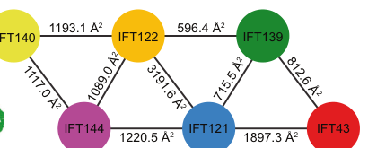

## Question

# Gene Research for Functional Annotation

## ⚠️ CRITICAL: Gene/Protein Identification Context

**BEFORE YOU BEGIN RESEARCH:** You MUST verify you are researching the CORRECT gene/protein. Gene symbols can be ambiguous, especially for less well-characterized genes from non-model organisms.

### Target Gene/Protein Identity (from UniProt):
- **UniProt Accession:** Q7Z4L5
- **Protein Description:** RecName: Full=Tetratricopeptide repeat protein 21B {ECO:0000305}; Short=TPR repeat protein 21B; AltName: Full=Intraflagellar transport 139 homolog {ECO:0000305};
- **Gene Information:** Name=TTC21B {ECO:0000312|HGNC:HGNC:25660}; Synonyms=IFT139 {ECO:0000303|PubMed:25860617, ECO:0000303|PubMed:27932497}, KIAA1992; ORFNames=Nbla10696;
- **Organism (full):** Homo sapiens (Human).
- **Protein Family:** Belongs to the TTC21 family. .
- **Key Domains:** ARM_TT21_2nd. (IPR056832); ARM_TT21_4th. (IPR056836); ARM_TT21_5th. (IPR056835); ARM_TT21_C. (IPR056834); ARM_TT21_N. (IPR056833)

### MANDATORY VERIFICATION STEPS:

1. **Check if the gene symbol "TTC21B" matches the protein description above**
2. **Verify the organism is correct:** Homo sapiens (Human).
3. **Check if protein family/domains align with what you find in literature**
4. **If you find literature for a DIFFERENT gene with the same or similar symbol, STOP**

### If Gene Symbol is Ambiguous or You Cannot Find Relevant Literature:

**DO NOT PROCEED WITH RESEARCH ON A DIFFERENT GENE.** Instead:
- State clearly: "The gene symbol 'TTC21B' is ambiguous or literature is limited for this specific protein"
- Explain what you found (e.g., "Found extensive literature on a different gene with the same symbol in a different organism")
- Describe the protein based ONLY on the UniProt information provided above
- Suggest that the protein function can be inferred from domain/family information

### Research Target:

Please provide a comprehensive research report on the gene **TTC21B** (gene ID: TTC21B, UniProt: Q7Z4L5) in human.

The research report should be a detailed narrative explaining the function, biological processes, and localization of the gene product. Citations should be given for all claims.

You should prioritize authoritative reviews and primary scientific literature when conducting research. You can supplement
this with annotations you find in gene/protein databases, but these can be outdated or inaccurate.

We are specifically interested in the primary function of the gene - for enzymes, what reaction is catalyzed, and what is the substrate specificity? For transporters, what is the substrate? For structural proteins or adapters, what is the broader structural role? For signaling molecules, what is the role in the pathway.

We are interested in where in or outside the cell the gene product carries out its function.

We are also interested in the signaling or biochemical pathways in which the gene functions. We are less interested in broad pleiotropic effects, except where these elucidate the precise role.

Include evidence where possible. We are interested in both experimental evidence as well as inference from structure, evolution, or bioinformatic analysis. Precise studies should be prioritized over high-throughput, where available.

## Output

Question: You are an expert researcher providing comprehensive, well-cited information.

Provide detailed information focusing on:
1. Key concepts and definitions with current understanding
2. Recent developments and latest research (prioritize 2023-2024 sources)
3. Current applications and real-world implementations
4. Expert opinions and analysis from authoritative sources
5. Relevant statistics and data from recent studies

Format as a comprehensive research report with proper citations. Include URLs and publication dates where available.
Always prioritize recent, authoritative sources and provide specific citations for all major claims.

# Gene Research for Functional Annotation

## ⚠️ CRITICAL: Gene/Protein Identification Context

**BEFORE YOU BEGIN RESEARCH:** You MUST verify you are researching the CORRECT gene/protein. Gene symbols can be ambiguous, especially for less well-characterized genes from non-model organisms.

### Target Gene/Protein Identity (from UniProt):
- **UniProt Accession:** Q7Z4L5
- **Protein Description:** RecName: Full=Tetratricopeptide repeat protein 21B {ECO:0000305}; Short=TPR repeat protein 21B; AltName: Full=Intraflagellar transport 139 homolog {ECO:0000305};
- **Gene Information:** Name=TTC21B {ECO:0000312|HGNC:HGNC:25660}; Synonyms=IFT139 {ECO:0000303|PubMed:25860617, ECO:0000303|PubMed:27932497}, KIAA1992; ORFNames=Nbla10696;
- **Organism (full):** Homo sapiens (Human).
- **Protein Family:** Belongs to the TTC21 family. .
- **Key Domains:** ARM_TT21_2nd. (IPR056832); ARM_TT21_4th. (IPR056836); ARM_TT21_5th. (IPR056835); ARM_TT21_C. (IPR056834); ARM_TT21_N. (IPR056833)

### MANDATORY VERIFICATION STEPS:

1. **Check if the gene symbol "TTC21B" matches the protein description above**
2. **Verify the organism is correct:** Homo sapiens (Human).
3. **Check if protein family/domains align with what you find in literature**
4. **If you find literature for a DIFFERENT gene with the same or similar symbol, STOP**

### If Gene Symbol is Ambiguous or You Cannot Find Relevant Literature:

**DO NOT PROCEED WITH RESEARCH ON A DIFFERENT GENE.** Instead:
- State clearly: "The gene symbol 'TTC21B' is ambiguous or literature is limited for this specific protein"
- Explain what you found (e.g., "Found extensive literature on a different gene with the same symbol in a different organism")
- Describe the protein based ONLY on the UniProt information provided above
- Suggest that the protein function can be inferred from domain/family information

### Research Target:

Please provide a comprehensive research report on the gene **TTC21B** (gene ID: TTC21B, UniProt: Q7Z4L5) in human.

The research report should be a detailed narrative explaining the function, biological processes, and localization of the gene product. Citations should be given for all claims.

You should prioritize authoritative reviews and primary scientific literature when conducting research. You can supplement
this with annotations you find in gene/protein databases, but these can be outdated or inaccurate.

We are specifically interested in the primary function of the gene - for enzymes, what reaction is catalyzed, and what is the substrate specificity? For transporters, what is the substrate? For structural proteins or adapters, what is the broader structural role? For signaling molecules, what is the role in the pathway.

We are interested in where in or outside the cell the gene product carries out its function.

We are also interested in the signaling or biochemical pathways in which the gene functions. We are less interested in broad pleiotropic effects, except where these elucidate the precise role.

Include evidence where possible. We are interested in both experimental evidence as well as inference from structure, evolution, or bioinformatic analysis. Precise studies should be prioritized over high-throughput, where available.

# Human TTC21B (IFT139): functional-annotation research report

## Identity and principal function

**Identity verified.** The supplied UniProt record identifies **Q7Z4L5** as the *Homo sapiens* protein encoded by **TTC21B**, also called **IFT139, THM1** and **KIAA1992**. The literature independently identifies TTC21B/THM1 as the mammalian IFT139 orthologue and distinguishes it from the related gene **TTC21A/THM2**. Its reported tetratricopeptide-repeat (TPR) architecture agrees with the supplied TTC21-family and ARM_TT21-domain annotations; those domain labels should not be mistaken for evidence of a separate enzymatic activity. (wang2020geneticinteractionof pages 1-2, nishat2025ift139regulateshedgehog pages 1-2, jiang2023humaniftacomplex pages 1-2)

**Primary annotation:** TTC21B is a **structural and train-organizing subunit of intraflagellar transport complex A (IFT-A)**. Rather than catalyzing a reaction or transporting a defined solute across a membrane, IFT139 helps organize protein assemblies that move along ciliary microtubules and maintain the composition of the cilium. IFT-A participates in dynein-2-associated transport from the ciliary tip toward the base and, as part of the broader transport machinery, in delivery of selected proteins into cilia. The precise contribution of IFT139 to these two activities is not identical to that of every other IFT-A subunit. (jiang2023humaniftacomplex pages 1-2, wang2020geneticinteractionof pages 6-8, jiang2023humaniftacomplex pages 3-4, ma2023structuralinsightinto pages 1-2)

## Molecular mechanism and localization

The clearest *human-protein* evidence comes from the 2023 cryo-electron microscopy study by **Jiang and colleagues**, published online **13 February 2023**. Structures of purified human IFT-A resolved the assembly at approximately **3.0–3.9 Å** and placed IFT139 on its peripheral side. The IFT121–IFT43 assembly inserts into a groove in IFT139’s TPR superhelix; IFT139 also contacts IFT122 with its terminal helices. These interfaces, including the IFT139–IFT122 and peripheral-subcomplex contacts, are illustrated in the study’s **Figure 3**. IFT-A can still be purified without IFT139: it is important to distinguish assembly of a remaining IFT-A complex from assembly and operation of a normal *IFT train*. **Jiang et al., *Cell Research* 33:288–298 (2023), https://doi.org/10.1038/s41422-023-00778-3.** (jiang2023humaniftacomplex pages 3-4, jiang2023humaniftacomplex pages 1-2, jiang2023humaniftacomplex media 8169fd61, jiang2023humaniftacomplex media 3cf6c131)

**Where it acts:** IFT139 operates at the **basal body/ciliary base and within the ciliary compartment**, as part of IFT-A assemblies moving between base and tip alongside the axoneme. Experimental localization to the basal body and ciliary axoneme has been reported in **mouse renal collecting-duct cells**; this is supporting mammalian evidence, not a direct measurement in every human cell type. Although IFT-A lies near the ciliary membrane in structural train models, TTC21B is not thereby established to be a transmembrane protein or an extracellular factor. (huber2012ciliarydisorderof pages 6-7, jiang2023humaniftacomplex pages 5-6, ma2023structuralinsightinto pages 1-2)

The **2023 Tetrahymena IFT-A structure** fitted to a *Chlamydomonas* train map places IFT139 near IFT-B proteins **IFT74/IFT81**, consistent with a proposed role in bringing IFT-A onto, and organizing it along, an IFT-B train. This intercomplex contact is principally a **structural-model inference**, not a newly measured binary binding constant for human TTC21B. **Ma et al., *Nature Communications* (March 2023), https://doi.org/10.1038/s41467-023-37208-2.** A **2024 expert structural review** notes that IFT139-deficient cells can lack recognizable IFT-A trains despite retaining IFT-B trains; it also reports that an IFT139/IFT121/IFT43 subcomplex binds phosphatidic-acid-containing liposomes *in vitro*. Whether that lipid affinity mediates a particular membrane-cargo route inside living human cells remains unresolved. **Palicharla and Mukhopadhyay, *Biochemical Society Transactions* 52:1473–1487 (June 2024), https://doi.org/10.1042/BST20231403.** (palicharla2024molecularandstructural pages 8-9, ma2023structuralinsightinto pages 7-9, ma2023structuralinsightinto pages 5-7)

**Cargo specificity needs careful qualification.** The mammalian membrane-cargo adaptor **TULP3** contacts IFT-A chiefly through **IFT122 and IFT140**; Jiang and colleagues found that IFT139 was *not* required for the resolved TULP3–IFT-A interaction. Thus, calling TTC21B the direct TULP3-binding receptor for GPCRs would overstate the evidence. Moreover, a 2024 synthesis reports preserved ciliary localization of several GPCRs in IFT139-null settings, despite abnormal IFT, while other models show reduced entry of particular membrane-associated proteins. Steady-state ciliary abundance reflects entry *and* removal and does not by itself measure transport rates. (jiang2023humaniftacomplex pages 3-4, palicharla2024molecularandstructural pages 3-4, palicharla2024molecularandstructural pages 4-5, palicharla2024molecularandstructural pages 9-9)

The experimental distinctions are summarized here:

| Aspect | Specific finding | Evidence type/model | Primary DOI/year |
|---|---|---|---|
| Human IFT-A architecture | Human TTC21B/IFT139 is a peripheral, TPR-superhelix scaffold. IFT121–IFT43 inserts into its groove; IFT139 contacts IFT43 and IFT121, while its final two helices contact the first WD40 domain of IFT122. IFT139 is dispensable for assembly of the remaining IFT-A complex, so not every IFT-A function can be assigned directly to it. (jiang2023humaniftacomplex pages 3-4, jiang2023humaniftacomplex pages 1-2) | Purified recombinant human IFT-A; cryo-EM at overall 3.0–3.9 Å resolution | [10.1038/s41422-023-00778-3](https://doi.org/10.1038/s41422-023-00778-3), 2023 |
| Assembly into IFT trains | Structural docking places IFT139 near IFT-B subunits IFT74/IFT81 and supports a proposed role in recruiting or organizing IFT-A on the IFT-B scaffold. This is model-based proximity consistent with prior association data—not a newly demonstrated direct binary interaction. (ma2023structuralinsightinto pages 7-9, ma2023structuralinsightinto pages 5-7) | Tetrahymena IFT-A cryo-EM fitted into a Chlamydomonas in-situ cryo-ET train map | [10.1038/s41467-023-37208-2](https://doi.org/10.1038/s41467-023-37208-2), 2023 |
| Retrograde IFT phenotype | Distal IFT81-positive bulbs occurred in 43% of *Thm1/Ttc21b* null cilia and 52% of *Thm1;Thm2* double-null cilia. IFT140 was detected in about 65% of these mutant cilia versus 80–90% of control cilia, and approximately 35% of mutant cilia accumulated IFT140 distally—evidence for defective ciliary entry plus retrograde clearance. (wang2020geneticinteractionof pages 6-8) | Mouse embryonic fibroblasts carrying *Thm1/Ttc21b* and *Thm2/Ttc21a* loss-of-function alleles | [10.1096/fj.201902611R](https://doi.org/10.1096/fj.201902611R), 2020 |
| Membrane-protein composition and Hedgehog signaling | INPP5E was present in about 50% of *Thm1* null and 40% of double-null cilia versus 95–100% of controls; ciliary ARL13B fluorescence fell by nearly 50%. SMO accumulated in unstimulated mutant cilia, yet SAG induced little or no *Gli1*, showing that ciliary SMO presence alone did not restore downstream signaling. These are loss-of-IFT139 phenotypes but may include secondary effects of altered IFT-A trains. (wang2020geneticinteractionof pages 8-9) | Mouse embryonic fibroblast immunofluorescence and SAG-response assays | [10.1096/fj.201902611R](https://doi.org/10.1096/fj.201902611R), 2020 |
| TULP3 cargo-adaptor relationship | TULP3 binds directly to IFT122 and IFT140 through its N-terminal helix/loop; human structural work omitted IFT139 without disrupting this interface and found that IFT139 does **not** mediate TULP3 binding. Accordingly, TTC21B/IFT139 should not be annotated as the direct TULP3 cargo receptor. (jiang2023humaniftacomplex pages 3-4, palicharla2024molecularandstructural pages 6-7, palicharla2024molecularandstructural pages 9-9) | 2024 structural review synthesizing human cryo-EM, binding and trafficking experiments | [10.1042/BST20231403](https://doi.org/10.1042/BST20231403), 2024 |
| Disease-variant functional evidence | In IFT139-knockout mouse fibroblasts, wild-type human IFT139 partially rescued proliferation and SAG-induced *Gli1*, whereas human IFT139-P209L failed to rescue effectively; the variant also showed dominant-negative behavior in the tested cellular context. This supports functional impairment but does not establish patient prevalence or a universal mechanism in human tissues. (nishat2025ift139regulateshedgehog pages 3-4, nishat2025ift139regulateshedgehog pages 6-7, nishat2025ift139regulateshedgehog pages 4-6) | CRISPR IFT139-knockout C3H10T1/2 mouse fibroblasts expressing human wild-type or P209L IFT139; three-replicate proliferation and Hedgehog assays | [10.1242/bio.062040](https://doi.org/10.1242/bio.062040), 2025 |

*Table: Evidence defining human TTC21B/IFT139 as a peripheral IFT-A structural and train-organizing subunit, with quantitative loss-of-function phenotypes and important limits on cargo-adaptor attribution. Findings from non-human models are explicitly distinguished from direct human structural evidence.*

## Biological processes and signaling pathway

TTC21B supports **cilium assembly and maintenance, intraflagellar-train cycling, ciliary protein distribution and Hedgehog signal transduction**. In a **2020 mouse embryonic fibroblast** comparison, *Thm1/Ttc21b* loss shortened mean primary cilia from **5.2 to 3.5 μm**. After six hours of serum withdrawal, approximately **48%** of mutant cells versus **75%** of controls were ciliated. Distal accumulation of the IFT-B protein IFT81 occurred in **43%** of *Thm1*-null cilia and **52%** of *Thm1;Thm2* double-null cilia. Together with distal accumulation of other transport components, this is strong cellular evidence for impaired tip-to-base clearance, although accumulation alone is not a measurement of the motor’s velocity. **Wang et al., *FASEB Journal* 34:6369–6381 (2020), https://doi.org/10.1096/fj.201902611r.** (wang2020geneticinteractionof pages 6-8, wang2020geneticinteractionof pages 4-5)

The same study illustrates how transport defects alter the **Hedgehog pathway** rather than simply removing its receptor from cilia. Ciliary **INPP5E** was detected in approximately **50%** of *Thm1*-null and **40%** of double-null cilia, versus **95–100%** of comparison cilia; ciliary **ARL13B** signal fell by nearly half. **Smoothened (SMO)** was already present in approximately **90%** of unstimulated mutant cilia, but pharmacological SMO activation elicited little or no normal **Gli1** transcriptional response. IFT139 is therefore needed for appropriately localized and responsive signaling machinery; it is **not** itself established as a Hedgehog ligand receptor or transcription factor. (wang2020geneticinteractionof pages 8-9)

Hedgehog output is **cell- and developmental-context-dependent**. Some earlier developmental models found that *Ttc21b* loss increased aspects of Sonic Hedgehog activity, whereas fibroblast experiments found poor ligand- or agonist-induced transcription; a Bergmann-glia deletion likewise reduced signaling. These results should not be compressed into a claim that TTC21B invariably activates or invariably represses Hedgehog. A **2025 mouse-cell study** refined the trafficking phenotype: without IFT139, PTCH1 localization remained relatively intact, but SMO, GLI and ARL13B accumulated abnormally toward distal ciliary tips, while activation-associated ciliary SUFU localization and the downstream response were defective. **Nishat et al., *Biology Open* (October 2025), https://doi.org/10.1242/bio.062040.** (nishat2025ift139regulateshedgehog pages 1-2, nishat2025ift139regulateshedgehog pages 3-4, nishat2025ift139regulateshedgehog pages 2-3)

## Human disease evidence and practical application

Human **TTC21B variants** are relevant to clinical investigation of **nephronophthisis-spectrum kidney disease, focal segmental glomerulosclerosis and skeletal ciliopathies**. This genetic association supports TTC21B’s physiological importance, but a renal phenotype does not establish that a particular patient variant directly changes an IFT139–cargo contact. One published **single-patient** report describes a woman homozygous for **p.Pro209Leu** who developed kidney failure and biliary cirrhosis and received a combined liver–kidney transplant; it demonstrates a clinical use for genetic diagnosis, not a population-wide estimate of variant risk. **Gambino et al., *Frontiers in Medicine* (December 2021), https://doi.org/10.3389/fmed.2021.795216.** (huber2012ciliarydisorderof pages 6-7, gambino2021casereporthomozygous pages 1-3)

More directly relevant to mechanism, **2025 complementation assays** expressed human IFT139 in IFT139-deficient mouse fibroblasts: wild-type protein partially restored cell growth and agonist-induced *Gli1*, whereas **p.Pro209Leu** did not rescue comparably in that assay. A separate **2025 single-family** NPHP12 report found that wild-type TTC21B rescued abnormal cultured-podocyte morphology after TTC21B depletion more effectively than either **p.Cys299Arg or p.Cys518Arg**; both variants were associated with reduced ciliogenesis and shorter cilia in that model. That family also used variant-informed preimplantation genetic testing and reported a healthy live birth. These are concrete diagnostic and reproductive-medicine applications, **not evidence of a TTC21B-targeted treatment** or proof that the same cellular phenotype occurs in every carrier. **Nishat et al. (October 2025), https://doi.org/10.1242/bio.062040; Deng et al., *Frontiers in Genetics* (November 2025), https://doi.org/10.3389/fgene.2025.1710252.** (nishat2025ift139regulateshedgehog pages 3-4, deng2025molecularmechanismsof pages 1-2, deng2025molecularmechanismsof pages 5-9, nishat2025ift139regulateshedgehog pages 6-7)

## Annotation conclusion and limits

The most defensible functional annotation is **“TPR-rich peripheral IFT-A subunit required for normal organization and recycling of ciliary transport machinery, thereby maintaining ciliary protein composition and context-dependent Hedgehog signaling.”** Its experimentally resolved human contacts are with other **IFT-A subunits**; a specific enzymatic reaction, transported small-molecule substrate, or universal *direct* membrane-cargo-binding specificity has **not** been established. The high-resolution structure is human, whereas most directional-trafficking measurements are from mouse cells and train-interface modeling includes other organisms. Those evidence levels should remain distinct when assigning function to human UniProt **Q7Z4L5**. (wang2020geneticinteractionof pages 1-2, jiang2023humaniftacomplex pages 3-4, wang2020geneticinteractionof pages 8-9, palicharla2024molecularandstructural pages 3-4, ma2023structuralinsightinto pages 7-9)

References

1. (wang2020geneticinteractionof pages 1-2): Wei Wang, Bailey A. Allard, Tana S. Pottorf, Henry H. Wang, Jay L. Vivian, and Pamela V. Tran. Genetic interaction of mammalian ift‐a paralogs regulates cilia disassembly, ciliary entry of membrane protein, hedgehog signaling, and embryogenesis. The FASEB Journal, 34(5):6369-6381, Mar 2020. URL: https://doi.org/10.1096/fj.201902611r, doi:10.1096/fj.201902611r. This article has 20 citations.

2. (nishat2025ift139regulateshedgehog pages 1-2): Khatija Nishat, Zachary T. Klug, Jannatul Faimma Mia, Sarain Stump, and Yulu Cherry Liu. Ift139 regulates hedgehog signaling and cilia structure through ciliary protein localization. Biology Open, Oct 2025. URL: https://doi.org/10.1242/bio.062040, doi:10.1242/bio.062040. This article has 4 citations and is from a peer-reviewed journal.

3. (jiang2023humaniftacomplex pages 1-2): Meiqin Jiang, Vivek R. Palicharla, Darcie J. Miller, Sun-Hee Hwang, Hanwen Zhu, Patricia Hixson, Saikat Mukhopadhyay, and Ji Sun. Human ift-a complex structures provide molecular insights into ciliary transport. Feb 2023. URL: https://doi.org/10.2210/pdb8fh3/pdb, doi:10.2210/pdb8fh3/pdb. This article has 49 citations and is from a domain leading peer-reviewed journal.

4. (wang2020geneticinteractionof pages 6-8): Wei Wang, Bailey A. Allard, Tana S. Pottorf, Henry H. Wang, Jay L. Vivian, and Pamela V. Tran. Genetic interaction of mammalian ift‐a paralogs regulates cilia disassembly, ciliary entry of membrane protein, hedgehog signaling, and embryogenesis. The FASEB Journal, 34(5):6369-6381, Mar 2020. URL: https://doi.org/10.1096/fj.201902611r, doi:10.1096/fj.201902611r. This article has 20 citations.

5. (jiang2023humaniftacomplex pages 3-4): Meiqin Jiang, Vivek R. Palicharla, Darcie J. Miller, Sun-Hee Hwang, Hanwen Zhu, Patricia Hixson, Saikat Mukhopadhyay, and Ji Sun. Human ift-a complex structures provide molecular insights into ciliary transport. Feb 2023. URL: https://doi.org/10.2210/pdb8fh3/pdb, doi:10.2210/pdb8fh3/pdb. This article has 49 citations and is from a domain leading peer-reviewed journal.

6. (ma2023structuralinsightinto pages 1-2): Yuanyuan Ma, Jun He, Shaobai Li, Deqiang Yao, Chenhui Huang, Jian Wu, and Ming Lei. Structural insight into the intraflagellar transport complex ift-a and its assembly in the anterograde ift train. Nature Communications, Mar 2023. URL: https://doi.org/10.1038/s41467-023-37208-2, doi:10.1038/s41467-023-37208-2. This article has 43 citations and is from a highest quality peer-reviewed journal.

7. (jiang2023humaniftacomplex media 8169fd61): Meiqin Jiang, Vivek R. Palicharla, Darcie J. Miller, Sun-Hee Hwang, Hanwen Zhu, Patricia Hixson, Saikat Mukhopadhyay, and Ji Sun. Human ift-a complex structures provide molecular insights into ciliary transport. Feb 2023. URL: https://doi.org/10.2210/pdb8fh3/pdb, doi:10.2210/pdb8fh3/pdb. This article has 49 citations and is from a domain leading peer-reviewed journal.

8. (jiang2023humaniftacomplex media 3cf6c131): Meiqin Jiang, Vivek R. Palicharla, Darcie J. Miller, Sun-Hee Hwang, Hanwen Zhu, Patricia Hixson, Saikat Mukhopadhyay, and Ji Sun. Human ift-a complex structures provide molecular insights into ciliary transport. Feb 2023. URL: https://doi.org/10.2210/pdb8fh3/pdb, doi:10.2210/pdb8fh3/pdb. This article has 49 citations and is from a domain leading peer-reviewed journal.

9. (huber2012ciliarydisorderof pages 6-7): Celine Huber and Valerie Cormier‐Daire. Ciliary disorder of the skeleton. American Journal of Medical Genetics Part C: Seminars in Medical Genetics, 160C:165-174, Aug 2012. URL: https://doi.org/10.1002/ajmg.c.31336, doi:10.1002/ajmg.c.31336. This article has 325 citations.

10. (jiang2023humaniftacomplex pages 5-6): Meiqin Jiang, Vivek R. Palicharla, Darcie J. Miller, Sun-Hee Hwang, Hanwen Zhu, Patricia Hixson, Saikat Mukhopadhyay, and Ji Sun. Human ift-a complex structures provide molecular insights into ciliary transport. Feb 2023. URL: https://doi.org/10.2210/pdb8fh3/pdb, doi:10.2210/pdb8fh3/pdb. This article has 49 citations and is from a domain leading peer-reviewed journal.

11. (palicharla2024molecularandstructural pages 8-9): Vivek Reddy Palicharla and Saikat Mukhopadhyay. Molecular and structural perspectives on protein trafficking to the primary cilium membrane. Biochemical Society Transactions, 52:1473-1487, Jun 2024. URL: https://doi.org/10.1042/bst20231403, doi:10.1042/bst20231403. This article has 16 citations and is from a peer-reviewed journal.

12. (ma2023structuralinsightinto pages 7-9): Yuanyuan Ma, Jun He, Shaobai Li, Deqiang Yao, Chenhui Huang, Jian Wu, and Ming Lei. Structural insight into the intraflagellar transport complex ift-a and its assembly in the anterograde ift train. Nature Communications, Mar 2023. URL: https://doi.org/10.1038/s41467-023-37208-2, doi:10.1038/s41467-023-37208-2. This article has 43 citations and is from a highest quality peer-reviewed journal.

13. (ma2023structuralinsightinto pages 5-7): Yuanyuan Ma, Jun He, Shaobai Li, Deqiang Yao, Chenhui Huang, Jian Wu, and Ming Lei. Structural insight into the intraflagellar transport complex ift-a and its assembly in the anterograde ift train. Nature Communications, Mar 2023. URL: https://doi.org/10.1038/s41467-023-37208-2, doi:10.1038/s41467-023-37208-2. This article has 43 citations and is from a highest quality peer-reviewed journal.

14. (palicharla2024molecularandstructural pages 3-4): Vivek Reddy Palicharla and Saikat Mukhopadhyay. Molecular and structural perspectives on protein trafficking to the primary cilium membrane. Biochemical Society Transactions, 52:1473-1487, Jun 2024. URL: https://doi.org/10.1042/bst20231403, doi:10.1042/bst20231403. This article has 16 citations and is from a peer-reviewed journal.

15. (palicharla2024molecularandstructural pages 4-5): Vivek Reddy Palicharla and Saikat Mukhopadhyay. Molecular and structural perspectives on protein trafficking to the primary cilium membrane. Biochemical Society Transactions, 52:1473-1487, Jun 2024. URL: https://doi.org/10.1042/bst20231403, doi:10.1042/bst20231403. This article has 16 citations and is from a peer-reviewed journal.

16. (palicharla2024molecularandstructural pages 9-9): Vivek Reddy Palicharla and Saikat Mukhopadhyay. Molecular and structural perspectives on protein trafficking to the primary cilium membrane. Biochemical Society Transactions, 52:1473-1487, Jun 2024. URL: https://doi.org/10.1042/bst20231403, doi:10.1042/bst20231403. This article has 16 citations and is from a peer-reviewed journal.

17. (wang2020geneticinteractionof pages 8-9): Wei Wang, Bailey A. Allard, Tana S. Pottorf, Henry H. Wang, Jay L. Vivian, and Pamela V. Tran. Genetic interaction of mammalian ift‐a paralogs regulates cilia disassembly, ciliary entry of membrane protein, hedgehog signaling, and embryogenesis. The FASEB Journal, 34(5):6369-6381, Mar 2020. URL: https://doi.org/10.1096/fj.201902611r, doi:10.1096/fj.201902611r. This article has 20 citations.

18. (palicharla2024molecularandstructural pages 6-7): Vivek Reddy Palicharla and Saikat Mukhopadhyay. Molecular and structural perspectives on protein trafficking to the primary cilium membrane. Biochemical Society Transactions, 52:1473-1487, Jun 2024. URL: https://doi.org/10.1042/bst20231403, doi:10.1042/bst20231403. This article has 16 citations and is from a peer-reviewed journal.

19. (nishat2025ift139regulateshedgehog pages 3-4): Khatija Nishat, Zachary T. Klug, Jannatul Faimma Mia, Sarain Stump, and Yulu Cherry Liu. Ift139 regulates hedgehog signaling and cilia structure through ciliary protein localization. Biology Open, Oct 2025. URL: https://doi.org/10.1242/bio.062040, doi:10.1242/bio.062040. This article has 4 citations and is from a peer-reviewed journal.

20. (nishat2025ift139regulateshedgehog pages 6-7): Khatija Nishat, Zachary T. Klug, Jannatul Faimma Mia, Sarain Stump, and Yulu Cherry Liu. Ift139 regulates hedgehog signaling and cilia structure through ciliary protein localization. Biology Open, Oct 2025. URL: https://doi.org/10.1242/bio.062040, doi:10.1242/bio.062040. This article has 4 citations and is from a peer-reviewed journal.

21. (nishat2025ift139regulateshedgehog pages 4-6): Khatija Nishat, Zachary T. Klug, Jannatul Faimma Mia, Sarain Stump, and Yulu Cherry Liu. Ift139 regulates hedgehog signaling and cilia structure through ciliary protein localization. Biology Open, Oct 2025. URL: https://doi.org/10.1242/bio.062040, doi:10.1242/bio.062040. This article has 4 citations and is from a peer-reviewed journal.

22. (wang2020geneticinteractionof pages 4-5): Wei Wang, Bailey A. Allard, Tana S. Pottorf, Henry H. Wang, Jay L. Vivian, and Pamela V. Tran. Genetic interaction of mammalian ift‐a paralogs regulates cilia disassembly, ciliary entry of membrane protein, hedgehog signaling, and embryogenesis. The FASEB Journal, 34(5):6369-6381, Mar 2020. URL: https://doi.org/10.1096/fj.201902611r, doi:10.1096/fj.201902611r. This article has 20 citations.

23. (nishat2025ift139regulateshedgehog pages 2-3): Khatija Nishat, Zachary T. Klug, Jannatul Faimma Mia, Sarain Stump, and Yulu Cherry Liu. Ift139 regulates hedgehog signaling and cilia structure through ciliary protein localization. Biology Open, Oct 2025. URL: https://doi.org/10.1242/bio.062040, doi:10.1242/bio.062040. This article has 4 citations and is from a peer-reviewed journal.

24. (gambino2021casereporthomozygous pages 1-3): Giuseppe Gambino, Concetta Catalano, Martina Marangoni, Caroline Geers, Alain Le Moine, Nathalie Boon, Guillaume Smits, and Lidia Ghisdal. Case report: homozygous pathogenic variant p209l in the ttc21b gene: a rare cause of end stage renal disease and biliary cirrhosis requiring combined liver-kidney transplantation. a case report and literature review. Frontiers in Medicine, Dec 2021. URL: https://doi.org/10.3389/fmed.2021.795216, doi:10.3389/fmed.2021.795216. This article has 8 citations.

25. (deng2025molecularmechanismsof pages 1-2): Kai Deng, Jing-Jing Li, Xi-Tao Hu, Hui-Juan Wei, Chenyi Wang, Qing-Qing Cheng, Yu Jiang, L. Cai, Di Tang, Gui-Ju Cao, and Xiaoyan Wang. Molecular mechanisms of ttc21b gene mutations in nephronophthisis type 12 and genetic prevention through pgt. Frontiers in Genetics, Nov 2025. URL: https://doi.org/10.3389/fgene.2025.1710252, doi:10.3389/fgene.2025.1710252. This article has 2 citations and is from a peer-reviewed journal.

26. (deng2025molecularmechanismsof pages 5-9): Kai Deng, Jing-Jing Li, Xi-Tao Hu, Hui-Juan Wei, Chenyi Wang, Qing-Qing Cheng, Yu Jiang, L. Cai, Di Tang, Gui-Ju Cao, and Xiaoyan Wang. Molecular mechanisms of ttc21b gene mutations in nephronophthisis type 12 and genetic prevention through pgt. Frontiers in Genetics, Nov 2025. URL: https://doi.org/10.3389/fgene.2025.1710252, doi:10.3389/fgene.2025.1710252. This article has 2 citations and is from a peer-reviewed journal.

## Artifacts

- [Edison artifact artifact-00](TTC21B-deep-research-falcon_artifacts/artifact-00.md)

## Citations

1. wang2020geneticinteractionof pages 6-8
2. wang2020geneticinteractionof pages 8-9
3. wang2020geneticinteractionof pages 1-2
4. jiang2023humaniftacomplex pages 1-2
5. jiang2023humaniftacomplex pages 3-4
6. ma2023structuralinsightinto pages 1-2
7. huber2012ciliarydisorderof pages 6-7
8. jiang2023humaniftacomplex pages 5-6
9. palicharla2024molecularandstructural pages 8-9
10. ma2023structuralinsightinto pages 7-9
11. ma2023structuralinsightinto pages 5-7
12. palicharla2024molecularandstructural pages 3-4
13. palicharla2024molecularandstructural pages 4-5
14. palicharla2024molecularandstructural pages 9-9
15. palicharla2024molecularandstructural pages 6-7
16. wang2020geneticinteractionof pages 4-5
17. gambino2021casereporthomozygous pages 1-3
18. deng2025molecularmechanismsof pages 1-2
19. deng2025molecularmechanismsof pages 5-9
20. 10.1038/s41422-023-00778-3
21. 10.1038/s41467-023-37208-2
22. 10.1096/fj.201902611R
23. 10.1042/BST20231403
24. 10.1242/bio.062040
25. https://doi.org/10.1038/s41422-023-00778-3.**
26. https://doi.org/10.1038/s41467-023-37208-2.**
27. https://doi.org/10.1042/BST20231403.**
28. https://doi.org/10.1038/s41422-023-00778-3
29. https://doi.org/10.1038/s41467-023-37208-2
30. https://doi.org/10.1096/fj.201902611R
31. https://doi.org/10.1042/BST20231403
32. https://doi.org/10.1242/bio.062040
33. https://doi.org/10.1096/fj.201902611r.**
34. https://doi.org/10.1242/bio.062040.**
35. https://doi.org/10.3389/fmed.2021.795216.**
36. https://doi.org/10.1242/bio.062040;
37. https://doi.org/10.3389/fgene.2025.1710252.**
38. https://doi.org/10.1096/fj.201902611r,
39. https://doi.org/10.1242/bio.062040,
40. https://doi.org/10.2210/pdb8fh3/pdb,
41. https://doi.org/10.1038/s41467-023-37208-2,
42. https://doi.org/10.1002/ajmg.c.31336,
43. https://doi.org/10.1042/bst20231403,
44. https://doi.org/10.3389/fmed.2021.795216,
45. https://doi.org/10.3389/fgene.2025.1710252,