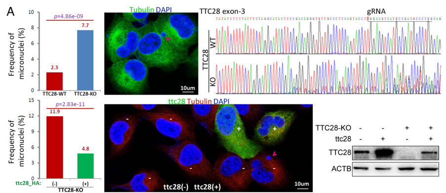

## Question

# Gene Research for Functional Annotation

## ⚠️ CRITICAL: Gene/Protein Identification Context

**BEFORE YOU BEGIN RESEARCH:** You MUST verify you are researching the CORRECT gene/protein. Gene symbols can be ambiguous, especially for less well-characterized genes from non-model organisms.

### Target Gene/Protein Identity (from UniProt):
- **UniProt Accession:** Q96AY4
- **Protein Description:** RecName: Full=Tetratricopeptide repeat protein 28; Short=TPR repeat protein 28; AltName: Full=TPR repeat-containing big gene cloned at Keio;
- **Gene Information:** Name=TTC28; Synonyms=KIAA1043, TPRBK;
- **Organism (full):** Homo sapiens (Human).
- **Protein Family:** Not specified in UniProt
- **Key Domains:** CHAT_dom. (IPR024983); TPR-like_helical_dom_sf. (IPR011990); TPR_rpt. (IPR019734); CHAT (PF12770); TPR_12 (PF13424)

### MANDATORY VERIFICATION STEPS:

1. **Check if the gene symbol "TTC28" matches the protein description above**
2. **Verify the organism is correct:** Homo sapiens (Human).
3. **Check if protein family/domains align with what you find in literature**
4. **If you find literature for a DIFFERENT gene with the same or similar symbol, STOP**

### If Gene Symbol is Ambiguous or You Cannot Find Relevant Literature:

**DO NOT PROCEED WITH RESEARCH ON A DIFFERENT GENE.** Instead:
- State clearly: "The gene symbol 'TTC28' is ambiguous or literature is limited for this specific protein"
- Explain what you found (e.g., "Found extensive literature on a different gene with the same symbol in a different organism")
- Describe the protein based ONLY on the UniProt information provided above
- Suggest that the protein function can be inferred from domain/family information

### Research Target:

Please provide a comprehensive research report on the gene **TTC28** (gene ID: TTC28, UniProt: Q96AY4) in human.

The research report should be a detailed narrative explaining the function, biological processes, and localization of the gene product. Citations should be given for all claims.

You should prioritize authoritative reviews and primary scientific literature when conducting research. You can supplement
this with annotations you find in gene/protein databases, but these can be outdated or inaccurate.

We are specifically interested in the primary function of the gene - for enzymes, what reaction is catalyzed, and what is the substrate specificity? For transporters, what is the substrate? For structural proteins or adapters, what is the broader structural role? For signaling molecules, what is the role in the pathway.

We are interested in where in or outside the cell the gene product carries out its function.

We are also interested in the signaling or biochemical pathways in which the gene functions. We are less interested in broad pleiotropic effects, except where these elucidate the precise role.

Include evidence where possible. We are interested in both experimental evidence as well as inference from structure, evolution, or bioinformatic analysis. Precise studies should be prioritized over high-throughput, where available.

## Output

Question: You are an expert researcher providing comprehensive, well-cited information.

Provide detailed information focusing on:
1. Key concepts and definitions with current understanding
2. Recent developments and latest research (prioritize 2023-2024 sources)
3. Current applications and real-world implementations
4. Expert opinions and analysis from authoritative sources
5. Relevant statistics and data from recent studies

Format as a comprehensive research report with proper citations. Include URLs and publication dates where available.
Always prioritize recent, authoritative sources and provide specific citations for all major claims.

# Gene Research for Functional Annotation

## ⚠️ CRITICAL: Gene/Protein Identification Context

**BEFORE YOU BEGIN RESEARCH:** You MUST verify you are researching the CORRECT gene/protein. Gene symbols can be ambiguous, especially for less well-characterized genes from non-model organisms.

### Target Gene/Protein Identity (from UniProt):
- **UniProt Accession:** Q96AY4
- **Protein Description:** RecName: Full=Tetratricopeptide repeat protein 28; Short=TPR repeat protein 28; AltName: Full=TPR repeat-containing big gene cloned at Keio;
- **Gene Information:** Name=TTC28; Synonyms=KIAA1043, TPRBK;
- **Organism (full):** Homo sapiens (Human).
- **Protein Family:** Not specified in UniProt
- **Key Domains:** CHAT_dom. (IPR024983); TPR-like_helical_dom_sf. (IPR011990); TPR_rpt. (IPR019734); CHAT (PF12770); TPR_12 (PF13424)

### MANDATORY VERIFICATION STEPS:

1. **Check if the gene symbol "TTC28" matches the protein description above**
2. **Verify the organism is correct:** Homo sapiens (Human).
3. **Check if protein family/domains align with what you find in literature**
4. **If you find literature for a DIFFERENT gene with the same or similar symbol, STOP**

### If Gene Symbol is Ambiguous or You Cannot Find Relevant Literature:

**DO NOT PROCEED WITH RESEARCH ON A DIFFERENT GENE.** Instead:
- State clearly: "The gene symbol 'TTC28' is ambiguous or literature is limited for this specific protein"
- Explain what you found (e.g., "Found extensive literature on a different gene with the same symbol in a different organism")
- Describe the protein based ONLY on the UniProt information provided above
- Suggest that the protein function can be inferred from domain/family information

### Research Target:

Please provide a comprehensive research report on the gene **TTC28** (gene ID: TTC28, UniProt: Q96AY4) in human.

The research report should be a detailed narrative explaining the function, biological processes, and localization of the gene product. Citations should be given for all claims.

You should prioritize authoritative reviews and primary scientific literature when conducting research. You can supplement
this with annotations you find in gene/protein databases, but these can be outdated or inaccurate.

We are specifically interested in the primary function of the gene - for enzymes, what reaction is catalyzed, and what is the substrate specificity? For transporters, what is the substrate? For structural proteins or adapters, what is the broader structural role? For signaling molecules, what is the role in the pathway.

We are interested in where in or outside the cell the gene product carries out its function.

We are also interested in the signaling or biochemical pathways in which the gene functions. We are less interested in broad pleiotropic effects, except where these elucidate the precise role.

Include evidence where possible. We are interested in both experimental evidence as well as inference from structure, evolution, or bioinformatic analysis. Precise studies should be prioritized over high-throughput, where available.

# Research Report: Human **TTC28** (UniProt **Q96AY4**) — Functional Annotation and Disease Relevance

## 0. Target verification (critical disambiguation)
The literature and datasets retrieved here consistently match the requested identity: **human TTC28** encoding **tetratricopeptide repeat protein 28**, mapped to **UniProt Q96AY4** (Homo sapiens). In a curated human protein–protein interaction dataset (human testis TCTEX1D4 interactome), **TTC28 is explicitly listed as “TTC28 (Tetratricopeptide repeat protein 28)” with UniProt ID Q96AY4**. (freitas2014tctex1d4interactomein pages 4-5)

## 1. Key concepts and definitions (current understanding)

### 1.1 What is TTC28?
TTC28 is a very large (~271 kDa) **tetratricopeptide repeat (TPR)–containing protein**. Recent mechanistic work describes TTC28 as containing **28 TPR domains** and multiple KFERQ-like motifs consistent with recognition by **chaperone-mediated autophagy (CMA)**. (zhang2024theessentialrole pages 1-2, zhang2024theessentialrole pages 2-4)

**TPR domains** are helical repeat motifs that commonly mediate **protein–protein interactions**, often acting as scaffolds/adaptors in multi-protein assemblies. In TTC28, the TPR architecture is functionally leveraged for interactions with chaperone machinery (HSPA8) and mitotic regulators. (zhang2024theessentialrole pages 2-4, zhang2024theessentialrole pages 4-6)

### 1.2 Chaperone-mediated autophagy (CMA) and why it matters for TTC28
**CMA** is a selective lysosomal degradation route in which substrates bearing KFERQ-like motifs are recognized by cytosolic chaperones (notably **HSPA8/Hsc70**) and translocated into lysosomes via LAMP2A-dependent mechanisms.

In the most directly relevant 2024 PNAS study, TTC28 is positioned not merely as a CMA substrate but as a **functional component required for the ability of CMA to maintain genome stability**. (zhang2024theessentialrole pages 1-2, zhang2024theessentialrole pages 6-8)

## 2. Protein localization and cellular context

### 2.1 Subcellular localization
Experimental imaging and fractionation in human cancer cell lines show TTC28 is:
- **Mainly cytoplasmic**, with **perinuclear enrichment**, and
- Detectable in mitotic structures including the **midbody**, consistent with involvement in cytokinesis. (zhang2024theessentialrole pages 2-4, zhang2024theessentialrole pages 6-8, zhang2024theessentialrole media 08900e33, zhang2024theessentialrole media 41dc178a)

These localizations support TTC28 functioning where cytosolic chaperone pathways intersect with cytoskeletal/mitotic machinery. (zhang2024theessentialrole pages 6-8, zhang2024theessentialrole pages 4-6)

## 3. Primary function and pathway-level role (best-supported model)

## 3.1 TTC28 as an HSPA8-binding CMA/microautophagy substrate
A central mechanistic finding (2024) is that TTC28 **directly binds HSPA8** through the **HSPA8 C-terminal PTIEEVD motif**, a known TPR-interacting sequence; TTC28 abundance responds to perturbations of HSPA8 ATPase function and lysosomal/CMA inhibition, supporting **CMA/microautophagy-mediated turnover**. (zhang2024theessentialrole pages 4-6)

TTC28 also contains **16 KFERQ-like motifs**, consistent with CMA targeting logic. (zhang2024theessentialrole pages 2-4)

## 3.2 TTC28 in mitosis/cytokinesis and microtubule-associated processes
The same 2024 study provides multiple lines of evidence that TTC28 is linked to mitotic machinery:
- Proteomics identified **TUBB (β-tubulin)** as a TTC28-binding candidate, and confocal microscopy shows **TTC28/TUBB colocalization** in the perinuclear cytoplasm and **midbody**. (zhang2024theessentialrole pages 6-8, zhang2024theessentialrole media 08900e33)
- TTC28 shows **partial overlap** with **AURKB (Aurora B kinase)**, and genetic perturbation results are consistent with a mitosis-related mechanism. (zhang2024theessentialrole pages 6-8)
- TTC28 knockout perturbs expression of tubulin-related genes (e.g., **TUBB6, TUBA1A, TTL**), reinforcing a functional link to microtubule dynamics. (zhang2024theessentialrole pages 6-8)

**Interpretation:** The evidence supports TTC28 as a large TPR scaffold/adaptor that couples chaperone/autophagy machinery to the fidelity of mitotic and cytokinetic processes, likely through protein interaction networks rather than enzymatic catalysis. (zhang2024theessentialrole pages 6-8, zhang2024theessentialrole pages 4-6)

## 3.3 TTC28 and genome/chromosome stability
The strongest functional phenotype linked to TTC28 is **chromosomal/genome stability** as assayed by micronuclei frequency and DNA damage markers.

### Key quantitative results (human cells)
- **TTC28 knockout** increased baseline micronuclei frequency (FMN) in H1299 cells from **2.3% to 7.7%** (P = 4.86E−09). (zhang2024theessentialrole pages 4-6)
- Rescue experiments (using ttc28 expression) substantially mitigated micronuclei phenotypes (e.g., **11.9% vs 4.8%**, P = 2.83E−11 in a reported comparison). (zhang2024theessentialrole pages 4-6)
- CMA perturbation (siLAMP2A) increased FMN in a **TTC28-dependent** manner (e.g., **6.5% vs 13.0%**, P = 5.26E−07; **3.5% vs 9.3%**, P = 5.30E−08). (zhang2024theessentialrole pages 4-6)
- Under DNA damage stress (cisplatin pretreatment 1.0 µM), **siTTC28 increased FMN** (**21.5% vs 17.9%**, P = 4.36e−02). (zhang2024theessentialrole pages 8-9)

These results are visually supported by figure panels showing increased FMN with TTC28 KO and midbody/perinuclear localization. (zhang2024theessentialrole media 08900e33, zhang2024theessentialrole media 41dc178a)

### Cancer-scale association statistics
Across TCGA tumors (n = **10,071**), TTC28 expression is **inversely associated with mutation count** (Spearman **−0.29**, P = **1.25E−186**), consistent with the hypothesis that reduced TTC28 contributes to genomic instability states in cancer. (zhang2024theessentialrole pages 4-6)

## 4. Recent developments and latest research (prioritizing 2023–2024)

### 4.1 2024 (PNAS): TTC28 links CMA to chromosomal stability
A 2024 PNAS paper provides the most detailed functional model: TTC28 is an **HSPA8-interacting CMA/microautophagy substrate** whose presence is **essential for CMA to maintain genome stability**, partly via regulation of **mitosis and cytokinesis**. It reports cell-cycle regulation of TTC28 abundance and multiple genome instability readouts (micronuclei, γH2AX, comet assays). (zhang2024theessentialrole pages 1-2, zhang2024theessentialrole pages 8-9, zhang2024theessentialrole pages 4-6)

It also connects TTC28 expression to cancer-relevant outcomes: TTC28 mRNA is described as decreased in many cancers, with reported survival associations in lung/ovarian cancers (as described in the text), and TTC28 levels influence drug sensitivity patterns in cell-line analyses. (zhang2024theessentialrole pages 1-2, zhang2024theessentialrole pages 9-10)

### 4.2 2024 (Cell Reports, colorectal cancer proteogenomics): TTC28 as an SV-affected gene
A 2024 Cell Reports proteogenomic analysis of primary and metastatic colorectal cancer reports TTC28 among **genes affected by structural variants** and notes **significant or near-significant mRNA decreases** in the SV-affected group; importantly, the authors caution that **mRNA does not highly correlate with copy number status** in their dataset, emphasizing the complexity of interpreting CNV/SV → expression. (tanaka2024proteogenomiccharacterizationof pages 27-31)

### 4.3 2024 (Surgical Case Reports): TTC28-MECOM fusion in esophageal carcinosarcoma
A 2024 whole-genome sequencing case report (2 patients) identifies **TTC28 as a novel fusion partner of MECOM** in one esophageal carcinosarcoma case (Patient 2), validated by PCR. The authors propose the fusion *may* influence phenotype but state that **functional verification is needed**. (inoue2024genomicalterationsin pages 3-5, inoue2024genomicalterationsin pages 5-8, inoue2024genomicalterationsin pages 1-3)

### 4.4 2023 (Nature Genetics, MESOMICS): TTC28 in a frequently deleted chr22q region in mesothelioma
A 2023 Nature Genetics multi-omics study of malignant pleural mesothelioma reports a **chr22q deletion event (~59%)** in their cohort-level genomic landscape; TTC28 is located in that region and is described as a gene frequently altered by structural variants. This situates TTC28 in a recurrently altered genomic neighborhood in mesothelioma along with established drivers (e.g., NF2) but does not by itself establish TTC28 as a causal driver. (mangiante2023multiomicanalysisof pages 5-6)

## 5. Current applications and real-world implementations

### 5.1 As a cancer genomics feature (SV/CNV/fusion context)
In practice, TTC28 appears primarily in:
- **Structural-variant and arm-level CNV analyses** (e.g., chr22q deletion regions), and
- Occasional **fusion partner** detection (e.g., TTC28–MECOM in a case report).

These contexts make TTC28 most relevant operationally as part of **tumor genome profiling** (WGS/WES + SV calling; RNA-seq fusion detection), rather than as a currently actionable drug target. (inoue2024genomicalterationsin pages 3-5, mangiante2023multiomicanalysisof pages 5-6)

### 5.2 Potential biomarker-like use (hypothesis-generating)
The 2024 PNAS study links TTC28 downregulation to genomic instability measures and survival associations in some cancers (as described), suggesting TTC28 expression could be explored as part of **genome instability / mitotic stress** biomarker panels. However, the evidence provided here is not yet at a clinical validation stage (e.g., no prospective trial demonstrating benefit of TTC28-guided treatment selection). (zhang2024theessentialrole pages 1-2, zhang2024theessentialrole pages 9-10, zhang2024theessentialrole pages 4-6)

## 6. Expert opinion / analysis (grounded in authoritative sources)

### 6.1 Most defensible functional summary
Based on direct experimental evidence, TTC28 is best interpreted as a **TPR-repeat scaffold** that:
1) physically engages **HSPA8** and is regulated by **CMA/microautophagy**, and
2) supports **high-fidelity mitosis/cytokinesis** and thereby reduces **chromosomal instability**. (zhang2024theessentialrole pages 6-8, zhang2024theessentialrole pages 4-6)

This functional framing matches the observed **perinuclear/midbody localization** and the robust micronuclei phenotype on loss of TTC28. (zhang2024theessentialrole media 08900e33, zhang2024theessentialrole media 41dc178a)

### 6.2 What is *not* established
- TTC28 is **not** established here as an enzyme with defined substrate specificity; the evidence is interaction/scaffold/quality-control centric. (zhang2024theessentialrole pages 6-8, zhang2024theessentialrole pages 4-6)
- Large-scale cancer genomics places TTC28 in frequently altered regions, but **causality** (driver vs passenger) remains uncertain in most tumor types, except that direct functional work supports that TTC28 loss can *contribute* to genome instability—a hallmark that can facilitate oncogenesis. (zhang2024theessentialrole pages 4-6, mangiante2023multiomicanalysisof pages 5-6)

## 7. Relevant statistics and datasets (recent studies)
- Micronuclei frequency changes upon TTC28 perturbation are quantitatively large (e.g., **2.3% → 7.7%** FMN with KO; multiple P values reported) and supported by figure panels. (zhang2024theessentialrole pages 4-6, zhang2024theessentialrole media 08900e33)
- TCGA-scale association: TTC28 expression vs mutation count across **10,071 tumors** (Spearman **−0.29**, P = **1.25E−186**). (zhang2024theessentialrole pages 4-6)
- Mesothelioma cohort-level event: **chr22q deletion 59%** in MESOMICS, encompassing TTC28. (mangiante2023multiomicanalysisof pages 5-6)
- CRC proteogenomics: cohort includes **32 samples** (16 pCRC, 16 mCRC) with **104–666 SV events/sample**, with **19.1% (138/723) of cancer-associated genes SV-affected**; TTC28 is among genes with significant/near-significant mRNA decrease in SV-affected group. (tanaka2024proteogenomiccharacterizationof pages 27-31)

## 8. Curated disease associations (contextual, not proof of function)
Open Targets aggregates human genetics and literature evidence linking TTC28 (ENSG00000100154) to multiple diseases including **cancer**, **breast carcinoma**, and **prostate carcinoma** (each shown with 5 pieces of evidence in the extracted record). These associations should be treated as hypothesis-generating and interpreted alongside mechanistic studies. (OpenTargets Search: -TTC28)

## 9. Evidence map (summary table)
The table below links major functional annotation claims to sources and quantitative support.

| Aspect | Key findings | Quantitative data (with values) | Evidence/source (paper + year + URL) | Citation ID |
|---|---|---|---|---|
| Identity/domains | Human TTC28 corresponds to UniProt Q96AY4 and is a very large tetratricopeptide repeat protein; literature describes ~270–271 kDa TTC28 with 28 TPR domains, consistent with the UniProt description. | ~270.9–271 kDa; 28 TPR domains; cloned protein reported at 2,365 aa in the 2024 study. | Freitas et al., 2014, *OMICS* — https://doi.org/10.1089/omi.2013.0133; Zhang et al., 2024, *PNAS* — https://doi.org/10.1073/pnas.2409447121 | (freitas2014tctex1d4interactomein pages 4-5, zhang2024theessentialrole pages 1-2, zhang2024theessentialrole pages 9-10) |
| Localization | TTC28 is mainly cytoplasmic with perinuclear enrichment; some nucleolar signal is reported; microscopy also places TTC28 at the midbody and overlapping with tubulin in interphase cells. | Perinuclear cytoplasmic localization observed in H1299/H661 cells; midbody localization shown in confocal imaging. | Zhang et al., 2024, *PNAS* — https://doi.org/10.1073/pnas.2409447121 | (zhang2024theessentialrole pages 2-4, zhang2024theessentialrole pages 6-8, zhang2024theessentialrole media 08900e33) |
| CMA/autophagy | TTC28 directly binds HSPA8 and is a substrate of HSPA8/LAMP2A-dependent chaperone-mediated autophagy (CMA)/microautophagy; HSPA8 stabilizes TTC28, while lysosome/CMA perturbation alters TTC28 abundance. | TTC28 contains 16 KFERQ-like motifs; TTC28 half-life increased to >12 h with siLAMP2A versus 4.6 h and 9.6 h in controls (cell-line dependent); TCGA/CCLE correlations reported for HSPA8-TTC28 expression (Spearman R = 0.43 in TCGA, 0.78 in CCLE). | Zhang et al., 2024, *PNAS* — https://doi.org/10.1073/pnas.2409447121 | (zhang2024theessentialrole pages 2-4, zhang2024theessentialrole pages 4-6) |
| Mitosis/cytokinesis | TTC28 interacts with microtubule/mitotic machinery, including TUBB and weakly AURKB, supporting a role in regulating mitosis and cytokinesis. | 222 TTC28-interacting protein candidates identified; TTC28 KO altered tubulin-related transcripts: TUBB6 +0.7 (adj-P = 5.98e-24), TUBA1A +0.62 (adj-P = 5.88e-16), TTL +0.55 (adj-P = 4.34e-11). | Zhang et al., 2024, *PNAS* — https://doi.org/10.1073/pnas.2409447121 | (zhang2024theessentialrole pages 6-8, zhang2024theessentialrole pages 2-4) |
| Genome stability assays | TTC28 is required for maintenance of chromosomal stability; loss of TTC28 increases micronuclei and DNA-damage markers, while rescue suppresses the phenotype. | Baseline FMN in TTC28-KO vs WT: 7.7% vs 2.3% (P = 4.86E−09); rescue: 11.9% vs 4.8% (P = 2.83E−11); siLAMP2A increased FMN in TTC28-WT cells 6.5% vs 13.0% (P = 5.26E−07) and 3.5% vs 9.3% (P = 5.30E−08); with cisplatin pretreatment, siTTC28 increased FMN 21.5% vs 17.9% (P = 4.36e−02). | Zhang et al., 2024, *PNAS* — https://doi.org/10.1073/pnas.2409447121 | (zhang2024theessentialrole pages 1-2, zhang2024theessentialrole pages 8-9, zhang2024theessentialrole pages 4-6, zhang2024theessentialrole media 08900e33) |
| Cancer genomic alterations | TTC28 is recurrently altered in cancer mainly via structural variation/CNV contexts rather than a well-established recurrent point-driver role; studies report downregulation, SV involvement in CRC, chr22q deletion context in mesothelioma, and a TTC28-MECOM fusion in esophageal carcinosarcoma. | TCGA transcriptome analysis across n = 10,071 cancers showed inverse association of TTC28 expression with mutation count (Spearman −0.29, P = 1.25E−186); in CRC cohort, 19.1% (138/723) of cancer-associated genes were SV-affected and TTC28 showed significant or near-significant mRNA decrease in SV-affected samples; chr22q deletion in mesothelioma reported at 59%; TTC28-MECOM observed in 1 of 2 esophageal carcinosarcoma cases. | Zhang et al., 2024, *PNAS* — https://doi.org/10.1073/pnas.2409447121; Tanaka et al., 2024, *Cell Reports* — https://doi.org/10.1016/j.celrep.2024.113810; Mangiante et al., 2023, *Nature Genetics* — https://doi.org/10.1038/s41588-023-01321-1; Inoue et al., 2024, *Surgical Case Reports* — https://doi.org/10.1186/s40792-024-01978-8 | (zhang2024theessentialrole pages 4-6, tanaka2024proteogenomiccharacterizationof pages 27-31, mangiante2023multiomicanalysisof pages 5-6, inoue2024genomicalterationsin pages 3-5, inoue2024genomicalterationsin pages 5-8) |
| Clinical/prognostic associations | Low TTC28 expression is linked to poorer survival in some cancers; TTC28 abundance may also modulate sensitivity to DNA-damaging and mitosis-targeting drugs in cell-line analyses. | Low TTC28 associated with worse overall survival in lung and ovarian cancer; high TTC28 expression reported to affect sensitivity to cisplatin, olaparib, and inhibitors targeting EGFR, ERBB2, and AURKA (direction not fully quantified in the excerpts). | Zhang et al., 2024, *PNAS* — https://doi.org/10.1073/pnas.2409447121 | (zhang2024theessentialrole pages 1-2, zhang2024theessentialrole pages 9-10) |
| Disease associations in OpenTargets | OpenTargets lists TTC28 associations across multiple diseases, but these are evidence-aggregated links rather than proof of causal function. | Reported association scores/evidence sizes: cancer 0.534 (5 evidences), breast carcinoma 0.479 (5), prostate carcinoma 0.472 (5), glaucoma 0.465 (5), polycystic ovary syndrome 0.449 (5). | Open Targets platform query for TTC28 — https://platform.opentargets.org/target/ENSG00000100154 | (OpenTargets Search: -TTC28) |

*Table: This table summarizes the main functional annotation evidence for human TTC28 (UniProt Q96AY4), including experimentally supported roles in CMA, mitosis/cytokinesis, and genome stability, plus current cancer-genomic and disease-association evidence. It is useful as a compact evidence map linking each annotation aspect to quantitative findings and source citations.*

## Key primary sources (with dates and URLs)
- Zhang G. et al. **2024-12**. *PNAS*: “The essential role of TTC28 in maintaining chromosomal stability via HSPA8 chaperone-mediated autophagy.” https://doi.org/10.1073/pnas.2409447121 (zhang2024theessentialrole pages 1-2)
- Tanaka A. et al. **2024-02**. *Cell Reports*: “Proteogenomic characterization of primary colorectal cancer and metastatic progression…” https://doi.org/10.1016/j.celrep.2024.113810 (tanaka2024proteogenomiccharacterizationof pages 27-31)
- Inoue M. et al. **2024-08**. *Surgical Case Reports*: “Genomic alterations… esophageal carcinosarcoma…” https://doi.org/10.1186/s40792-024-01978-8 (inoue2024genomicalterationsin pages 1-3)
- Mangiante L. et al. **2023-03**. *Nature Genetics*: “Multiomic analysis of malignant pleural mesothelioma…” https://doi.org/10.1038/s41588-023-01321-1 (mangiante2023multiomicanalysisof pages 5-6)
- Freitas M.J. et al. **2014-04**. *OMICS*: interactome table confirming TTC28→UniProt Q96AY4 mapping. https://doi.org/10.1089/omi.2013.0133 (freitas2014tctex1d4interactomein pages 4-5)

References

1. (freitas2014tctex1d4interactomein pages 4-5): Maria João Freitas, Luís Korrodi-Gregório, Filipa Morais-Santos, Edgar da Cruz e Silva, and Margarida Fardilha. Tctex1d4 interactome in human testis: unraveling the function of dynein light chain in spermatozoa. Omics : a journal of integrative biology, 18 4:242-53, Apr 2014. URL: https://doi.org/10.1089/omi.2013.0133, doi:10.1089/omi.2013.0133. This article has 12 citations.

2. (zhang2024theessentialrole pages 1-2): Ge Zhang, Meiyi Xiang, Liankun Gu, Jing Zhou, Baozhen Zhang, Wei Tian, and Dajun Deng. The essential role of ttc28 in maintaining chromosomal stability via hspa8 chaperone-mediated autophagy. Proceedings of the National Academy of Sciences of the United States of America, Dec 2024. URL: https://doi.org/10.1073/pnas.2409447121, doi:10.1073/pnas.2409447121. This article has 8 citations and is from a highest quality peer-reviewed journal.

3. (zhang2024theessentialrole pages 2-4): Ge Zhang, Meiyi Xiang, Liankun Gu, Jing Zhou, Baozhen Zhang, Wei Tian, and Dajun Deng. The essential role of ttc28 in maintaining chromosomal stability via hspa8 chaperone-mediated autophagy. Proceedings of the National Academy of Sciences of the United States of America, Dec 2024. URL: https://doi.org/10.1073/pnas.2409447121, doi:10.1073/pnas.2409447121. This article has 8 citations and is from a highest quality peer-reviewed journal.

4. (zhang2024theessentialrole pages 4-6): Ge Zhang, Meiyi Xiang, Liankun Gu, Jing Zhou, Baozhen Zhang, Wei Tian, and Dajun Deng. The essential role of ttc28 in maintaining chromosomal stability via hspa8 chaperone-mediated autophagy. Proceedings of the National Academy of Sciences of the United States of America, Dec 2024. URL: https://doi.org/10.1073/pnas.2409447121, doi:10.1073/pnas.2409447121. This article has 8 citations and is from a highest quality peer-reviewed journal.

5. (zhang2024theessentialrole pages 6-8): Ge Zhang, Meiyi Xiang, Liankun Gu, Jing Zhou, Baozhen Zhang, Wei Tian, and Dajun Deng. The essential role of ttc28 in maintaining chromosomal stability via hspa8 chaperone-mediated autophagy. Proceedings of the National Academy of Sciences of the United States of America, Dec 2024. URL: https://doi.org/10.1073/pnas.2409447121, doi:10.1073/pnas.2409447121. This article has 8 citations and is from a highest quality peer-reviewed journal.

6. (zhang2024theessentialrole media 08900e33): Ge Zhang, Meiyi Xiang, Liankun Gu, Jing Zhou, Baozhen Zhang, Wei Tian, and Dajun Deng. The essential role of ttc28 in maintaining chromosomal stability via hspa8 chaperone-mediated autophagy. Proceedings of the National Academy of Sciences of the United States of America, Dec 2024. URL: https://doi.org/10.1073/pnas.2409447121, doi:10.1073/pnas.2409447121. This article has 8 citations and is from a highest quality peer-reviewed journal.

7. (zhang2024theessentialrole media 41dc178a): Ge Zhang, Meiyi Xiang, Liankun Gu, Jing Zhou, Baozhen Zhang, Wei Tian, and Dajun Deng. The essential role of ttc28 in maintaining chromosomal stability via hspa8 chaperone-mediated autophagy. Proceedings of the National Academy of Sciences of the United States of America, Dec 2024. URL: https://doi.org/10.1073/pnas.2409447121, doi:10.1073/pnas.2409447121. This article has 8 citations and is from a highest quality peer-reviewed journal.

8. (zhang2024theessentialrole pages 8-9): Ge Zhang, Meiyi Xiang, Liankun Gu, Jing Zhou, Baozhen Zhang, Wei Tian, and Dajun Deng. The essential role of ttc28 in maintaining chromosomal stability via hspa8 chaperone-mediated autophagy. Proceedings of the National Academy of Sciences of the United States of America, Dec 2024. URL: https://doi.org/10.1073/pnas.2409447121, doi:10.1073/pnas.2409447121. This article has 8 citations and is from a highest quality peer-reviewed journal.

9. (zhang2024theessentialrole pages 9-10): Ge Zhang, Meiyi Xiang, Liankun Gu, Jing Zhou, Baozhen Zhang, Wei Tian, and Dajun Deng. The essential role of ttc28 in maintaining chromosomal stability via hspa8 chaperone-mediated autophagy. Proceedings of the National Academy of Sciences of the United States of America, Dec 2024. URL: https://doi.org/10.1073/pnas.2409447121, doi:10.1073/pnas.2409447121. This article has 8 citations and is from a highest quality peer-reviewed journal.

10. (tanaka2024proteogenomiccharacterizationof pages 27-31): Atsushi Tanaka, Makiko Ogawa, Yihua Zhou, Kei Namba, Ronald C. Hendrickson, Matthew M. Miele, Zhuoning Li, David S. Klimstra, Patrick G. Buckley, Jeffrey Gulcher, Julia Y. Wang, and Michael H.A. Roehrl. Proteogenomic characterization of primary colorectal cancer and metastatic progression identifies proteome-based subtypes and signatures. Cell reports, 43 2:113810, Feb 2024. URL: https://doi.org/10.1016/j.celrep.2024.113810, doi:10.1016/j.celrep.2024.113810. This article has 34 citations and is from a highest quality peer-reviewed journal.

11. (inoue2024genomicalterationsin pages 3-5): Masazumi Inoue, Yasuhiro Tsubosa, Sumiko Ohnami, Kazunori Tokizawa, Shuhei Mayanagi, Keiichi Ohshima, Kenichi Urakami, Shumpei Ohnami, Takeshi Nagashima, and Ken Yamaguchi. Genomic alterations in two patients with esophageal carcinosarcoma identified by whole genome sequencing: a case report. Surgical Case Reports, Aug 2024. URL: https://doi.org/10.1186/s40792-024-01978-8, doi:10.1186/s40792-024-01978-8. This article has 1 citations.

12. (inoue2024genomicalterationsin pages 5-8): Masazumi Inoue, Yasuhiro Tsubosa, Sumiko Ohnami, Kazunori Tokizawa, Shuhei Mayanagi, Keiichi Ohshima, Kenichi Urakami, Shumpei Ohnami, Takeshi Nagashima, and Ken Yamaguchi. Genomic alterations in two patients with esophageal carcinosarcoma identified by whole genome sequencing: a case report. Surgical Case Reports, Aug 2024. URL: https://doi.org/10.1186/s40792-024-01978-8, doi:10.1186/s40792-024-01978-8. This article has 1 citations.

13. (inoue2024genomicalterationsin pages 1-3): Masazumi Inoue, Yasuhiro Tsubosa, Sumiko Ohnami, Kazunori Tokizawa, Shuhei Mayanagi, Keiichi Ohshima, Kenichi Urakami, Shumpei Ohnami, Takeshi Nagashima, and Ken Yamaguchi. Genomic alterations in two patients with esophageal carcinosarcoma identified by whole genome sequencing: a case report. Surgical Case Reports, Aug 2024. URL: https://doi.org/10.1186/s40792-024-01978-8, doi:10.1186/s40792-024-01978-8. This article has 1 citations.

14. (mangiante2023multiomicanalysisof pages 5-6): Lise Mangiante, Nicolas Alcala, Alexandra Sexton-Oates, Alex Di Genova, Abel Gonzalez-Perez, Azhar Khandekar, Erik N. Bergstrom, Jaehee Kim, Xiran Liu, Ricardo Blazquez-Encinas, Colin Giacobi, Nolwenn Le Stang, Sandrine Boyault, Cyrille Cuenin, Severine Tabone-Eglinger, Francesca Damiola, Catherine Voegele, Maude Ardin, Marie-Cecile Michallet, Lorraine Soudade, Tiffany M. Delhomme, Arnaud Poret, Marie Brevet, Marie-Christine Copin, Sophie Giusiano-Courcambeck, Diane Damotte, Cecile Girard, Veronique Hofman, Paul Hofman, Jérôme Mouroux, Charlotte Cohen, Stephanie Lacomme, Julien Mazieres, Vincent Thomas de Montpreville, Corinne Perrin, Gaetane Planchard, Nathalie Rousseau, Isabelle Rouquette, Christine Sagan, Arnaud Scherpereel, Francoise Thivolet, Jean-Michel Vignaud, Didier Jean, Anabelle Gilg Soit Ilg, Robert Olaso, Vincent Meyer, Anne Boland-Auge, Jean-Francois Deleuze, Janine Altmuller, Peter Nuernberg, Alejandro Ibáñez-Costa, Justo P. Castaño, Sylvie Lantuejoul, Akram Ghantous, Charles Maussion, Pierre Courtiol, Hector Hernandez-Vargas, Christophe Caux, Nicolas Girard, Nuria Lopez-Bigas, Ludmil B. Alexandrov, Françoise Galateau-Salle, Matthieu Foll, and Lynnette Fernandez-Cuesta. Multiomic analysis of malignant pleural mesothelioma identifies molecular axes and specialized tumor profiles driving intertumor heterogeneity. Nature Genetics, 55:607-618, Mar 2023. URL: https://doi.org/10.1038/s41588-023-01321-1, doi:10.1038/s41588-023-01321-1. This article has 103 citations and is from a highest quality peer-reviewed journal.

15. (OpenTargets Search: -TTC28): Open Targets Query (-TTC28, 5 results). Buniello, A. et al. (2025). Open Targets Platform: facilitating therapeutic hypotheses building in drug discovery. Nucleic Acids Research.

## Artifacts

- [Edison artifact artifact-00](TTC28-deep-research-falcon_artifacts/artifact-00.md)

## Citations

1. zhang2024theessentialrole pages 4-6
2. zhang2024theessentialrole pages 2-4
3. zhang2024theessentialrole pages 6-8
4. zhang2024theessentialrole pages 8-9
5. tanaka2024proteogenomiccharacterizationof pages 27-31
6. mangiante2023multiomicanalysisof pages 5-6
7. zhang2024theessentialrole pages 1-2
8. inoue2024genomicalterationsin pages 1-3
9. zhang2024theessentialrole pages 9-10
10. inoue2024genomicalterationsin pages 3-5
11. inoue2024genomicalterationsin pages 5-8
12. https://doi.org/10.1089/omi.2013.0133;
13. https://doi.org/10.1073/pnas.2409447121
14. https://doi.org/10.1073/pnas.2409447121;
15. https://doi.org/10.1016/j.celrep.2024.113810;
16. https://doi.org/10.1038/s41588-023-01321-1;
17. https://doi.org/10.1186/s40792-024-01978-8
18. https://platform.opentargets.org/target/ENSG00000100154
19. https://doi.org/10.1016/j.celrep.2024.113810
20. https://doi.org/10.1038/s41588-023-01321-1
21. https://doi.org/10.1089/omi.2013.0133
22. https://doi.org/10.1089/omi.2013.0133,
23. https://doi.org/10.1073/pnas.2409447121,
24. https://doi.org/10.1016/j.celrep.2024.113810,
25. https://doi.org/10.1186/s40792-024-01978-8,
26. https://doi.org/10.1038/s41588-023-01321-1,