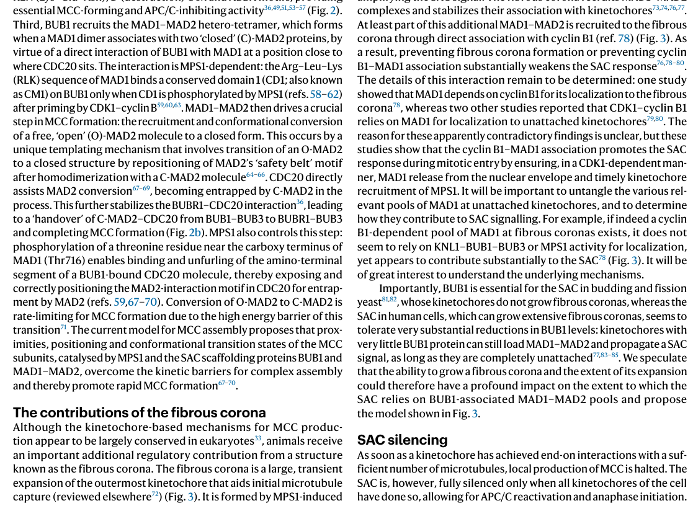

## Question

# Gene Research for Functional Annotation

## ⚠️ CRITICAL: Gene/Protein Identification Context

**BEFORE YOU BEGIN RESEARCH:** You MUST verify you are researching the CORRECT gene/protein. Gene symbols can be ambiguous, especially for less well-characterized genes from non-model organisms.

### Target Gene/Protein Identity (from UniProt):
- **UniProt Accession:** P33981
- **Protein Description:** RecName: Full=Dual specificity protein kinase TTK; EC=2.7.12.1 {ECO:0000269|PubMed:30785839, ECO:0000305|PubMed:29162720}; AltName: Full=Phosphotyrosine picked threonine-protein kinase; Short=PYT;
- **Gene Information:** Name=TTK; Synonyms=MPS1, MPS1L1;
- **Organism (full):** Homo sapiens (Human).
- **Protein Family:** Belongs to the protein kinase superfamily. Ser/Thr protein
- **Key Domains:** Kinase-like_dom_sf. (IPR011009); Mps1_cat. (IPR027084); Prot_kinase_dom. (IPR000719); Protein_kinase_ATP_BS. (IPR017441); Ser/Thr_kinase_AS. (IPR008271)

### MANDATORY VERIFICATION STEPS:

1. **Check if the gene symbol "TTK" matches the protein description above**
2. **Verify the organism is correct:** Homo sapiens (Human).
3. **Check if protein family/domains align with what you find in literature**
4. **If you find literature for a DIFFERENT gene with the same or similar symbol, STOP**

### If Gene Symbol is Ambiguous or You Cannot Find Relevant Literature:

**DO NOT PROCEED WITH RESEARCH ON A DIFFERENT GENE.** Instead:
- State clearly: "The gene symbol 'TTK' is ambiguous or literature is limited for this specific protein"
- Explain what you found (e.g., "Found extensive literature on a different gene with the same symbol in a different organism")
- Describe the protein based ONLY on the UniProt information provided above
- Suggest that the protein function can be inferred from domain/family information

### Research Target:

Please provide a comprehensive research report on the gene **TTK** (gene ID: TTK, UniProt: P33981) in human.

The research report should be a detailed narrative explaining the function, biological processes, and localization of the gene product. Citations should be given for all claims.

You should prioritize authoritative reviews and primary scientific literature when conducting research. You can supplement
this with annotations you find in gene/protein databases, but these can be outdated or inaccurate.

We are specifically interested in the primary function of the gene - for enzymes, what reaction is catalyzed, and what is the substrate specificity? For transporters, what is the substrate? For structural proteins or adapters, what is the broader structural role? For signaling molecules, what is the role in the pathway.

We are interested in where in or outside the cell the gene product carries out its function.

We are also interested in the signaling or biochemical pathways in which the gene functions. We are less interested in broad pleiotropic effects, except where these elucidate the precise role.

Include evidence where possible. We are interested in both experimental evidence as well as inference from structure, evolution, or bioinformatic analysis. Precise studies should be prioritized over high-throughput, where available.

## Output

Question: You are an expert researcher providing comprehensive, well-cited information.

Provide detailed information focusing on:
1. Key concepts and definitions with current understanding
2. Recent developments and latest research (prioritize 2023-2024 sources)
3. Current applications and real-world implementations
4. Expert opinions and analysis from authoritative sources
5. Relevant statistics and data from recent studies

Format as a comprehensive research report with proper citations. Include URLs and publication dates where available.
Always prioritize recent, authoritative sources and provide specific citations for all major claims.

# Gene Research for Functional Annotation

## ⚠️ CRITICAL: Gene/Protein Identification Context

**BEFORE YOU BEGIN RESEARCH:** You MUST verify you are researching the CORRECT gene/protein. Gene symbols can be ambiguous, especially for less well-characterized genes from non-model organisms.

### Target Gene/Protein Identity (from UniProt):
- **UniProt Accession:** P33981
- **Protein Description:** RecName: Full=Dual specificity protein kinase TTK; EC=2.7.12.1 {ECO:0000269|PubMed:30785839, ECO:0000305|PubMed:29162720}; AltName: Full=Phosphotyrosine picked threonine-protein kinase; Short=PYT;
- **Gene Information:** Name=TTK; Synonyms=MPS1, MPS1L1;
- **Organism (full):** Homo sapiens (Human).
- **Protein Family:** Belongs to the protein kinase superfamily. Ser/Thr protein
- **Key Domains:** Kinase-like_dom_sf. (IPR011009); Mps1_cat. (IPR027084); Prot_kinase_dom. (IPR000719); Protein_kinase_ATP_BS. (IPR017441); Ser/Thr_kinase_AS. (IPR008271)

### MANDATORY VERIFICATION STEPS:

1. **Check if the gene symbol "TTK" matches the protein description above**
2. **Verify the organism is correct:** Homo sapiens (Human).
3. **Check if protein family/domains align with what you find in literature**
4. **If you find literature for a DIFFERENT gene with the same or similar symbol, STOP**

### If Gene Symbol is Ambiguous or You Cannot Find Relevant Literature:

**DO NOT PROCEED WITH RESEARCH ON A DIFFERENT GENE.** Instead:
- State clearly: "The gene symbol 'TTK' is ambiguous or literature is limited for this specific protein"
- Explain what you found (e.g., "Found extensive literature on a different gene with the same symbol in a different organism")
- Describe the protein based ONLY on the UniProt information provided above
- Suggest that the protein function can be inferred from domain/family information

### Research Target:

Please provide a comprehensive research report on the gene **TTK** (gene ID: TTK, UniProt: P33981) in human.

The research report should be a detailed narrative explaining the function, biological processes, and localization of the gene product. Citations should be given for all claims.

You should prioritize authoritative reviews and primary scientific literature when conducting research. You can supplement
this with annotations you find in gene/protein databases, but these can be outdated or inaccurate.

We are specifically interested in the primary function of the gene - for enzymes, what reaction is catalyzed, and what is the substrate specificity? For transporters, what is the substrate? For structural proteins or adapters, what is the broader structural role? For signaling molecules, what is the role in the pathway.

We are interested in where in or outside the cell the gene product carries out its function.

We are also interested in the signaling or biochemical pathways in which the gene functions. We are less interested in broad pleiotropic effects, except where these elucidate the precise role.

Include evidence where possible. We are interested in both experimental evidence as well as inference from structure, evolution, or bioinformatic analysis. Precise studies should be prioritized over high-throughput, where available.

# Human TTK/MPS1 (UniProt P33981): Functional-Annotation Research Report

## Executive summary

**Identity is verified.** The requested target is human **TTK protein kinase**, UniProt **P33981**, also called **MPS1**, **hMPS1**, or **MPS1L1**. The literature retrieved consistently concerns the same *Homo sapiens* mitotic-checkpoint kinase: an MPS1-family protein with an N-terminal kinetochore-targeting region and a C-terminal protein-kinase domain. No conflicting same-symbol protein was used. The supplied InterPro annotations—protein-kinase/ATP-binding/Ser-Thr kinase features and the MPS1 catalytic domain—accord with the experimental literature. (combes2017étudedelextension pages 132-135, combes2017étudedelextension pages 166-168, stratford2017geneticandpharmacological pages 22-22)

TTK’s primary function is to initiate and maintain the **spindle-assembly checkpoint (SAC)** at unattached or improperly attached kinetochores. It phosphorylates KNL1, BUB1, and MAD1 in sequence, thereby catalyzing production of the mitotic checkpoint complex (MCC). MCC inhibits APC/C–CDC20 and delays anaphase until chromosome attachment is adequate. Thus, TTK is best understood not as a generic growth-signaling kinase but as an attachment-responsive mitotic signaling enzyme that protects chromosome-segregation fidelity. (ji2017asequentialmultitarget pages 15-16, dou2019recentprogresson pages 9-11, mcainsh2023principlesanddynamics media 3389ae3a, mcainsh2023principlesanddynamics media e48c20fa)

## 1. Gene and protein identity

| Field | Verified annotation |
|---|---|
| Gene | **TTK** |
| Protein | Dual-specificity protein kinase TTK / monopolar spindle 1 kinase |
| UniProt | **P33981** |
| Organism | *Homo sapiens* (human) |
| Principal aliases | **MPS1**, hMPS1, **MPS1L1**; historically “phosphotyrosine-picked threonine-protein kinase” |
| Protein class | MPS1-family protein kinase; predominantly physiological Ser/Thr kinase |
| Principal cellular process | Spindle-assembly checkpoint and chromosome segregation |

The apparently unusual name “TTK” should not be confused with a classical receptor tyrosine kinase. Although historically designated a **dual-specificity** kinase, its best-defined physiological mitotic substrates are phosphorylated on serine or threonine. The nomenclature therefore should not be taken to mean that tyrosine phosphorylation is equally prominent in its established SAC function. Human-cell literature identifies the same protein as both TTK and MPS1 and describes the expected kinase, ATP-binding, activation-loop, and kinetochore-targeting features. (combes2017étudedelextension pages 166-168, stratford2017geneticandpharmacological pages 1-2, ji2017asequentialmultitarget pages 15-16)

## 2. Primary molecular function and catalytic reaction

TTK catalyzes ATP-dependent phosphorylation of protein hydroxy residues:

**ATP + protein–OH → ADP + protein–O-phosphate**

Its strongest experimentally established physiological activity is protein **Ser/Thr phosphorylation**. Human MPS1 shows a preference for serine or threonine with an acidic determinant near the −2 position. A particularly instructive example is BUB1: CDK1 first phosphorylates BUB1 Ser459, creating an acidic/phosphorylated determinant that supports subsequent TTK phosphorylation of Thr461. MAD1 Thr716 is a documented substrate that does not follow the simple linear consensus and may instead be selected through docking or tertiary structural contacts. (ji2017asequentialmultitarget pages 15-16)

Substrate specificity is therefore determined by more than a short peptide sequence. Recruitment to unattached kinetochores, binding to checkpoint scaffolds, priming by other mitotic kinases, and the kinase’s non-catalytic regions all constrain which proteins are phosphorylated in vivo. This is consistent with the finding that catalytic inhibition and complete TTK depletion can produce different phenotypes in some cancer cells, implying kinase-independent contributions from TTK’s recruitment/scaffolding regions. (stratford2017geneticandpharmacological pages 14-16)

### Major experimentally supported substrates

* **KNL1/CASC5:** phosphorylation of repeated MELT motifs creates BUB3–BUB1 docking sites.
* **BUB1:** phosphorylation, after CDK1 priming, promotes MAD1–MAD2 recruitment.
* **MAD1:** Thr716 phosphorylation supports CDC20 binding and efficient MCC assembly.
* **TTK itself:** autophosphorylation contributes to catalytic activation and checkpoint competence.
* Additional reported or context-dependent substrates include Borealin, HEC1/NDC80-associated machinery, USP16, MDM2, BLM and RMI2. These broaden possible functions but are less central than KNL1–BUB1–MAD1 to the protein’s primary annotation. (combes2017étudedelextension pages 132-135, stratford2017geneticandpharmacological pages 14-16, combes2017étudedelextension pages 166-168, ji2017asequentialmultitarget pages 15-16)

## 3. Structure and regulation

TTK contains an extended N-terminal regulatory region with a TPR-like kinetochore-targeting module and a C-terminal MPS1-family kinase domain. The N terminus is required for efficient Aurora-B-regulated kinetochore recruitment, whereas the catalytic region supplies ATP-dependent phosphotransferase activity. Activation-loop and other autophosphorylation events enhance activity and SAC signaling. (combes2017étudedelextension pages 132-135, combes2017étudedelextension pages 166-168, stratford2017geneticandpharmacological pages 22-22)

TTK is embedded in a mitotic kinase/phosphatase network. Aurora B facilitates kinetochore recruitment; CDK1–cyclin B establishes a checkpoint-permissive mitotic state and primes BUB1; PLK1 can reinforce portions of checkpoint signaling. Counteracting phosphatases and loss of kinetochore binding reverse TTK-generated phosphorylation as attachments mature. These relationships explain why TTK activity is strongly localized and cell-cycle dependent rather than constitutively distributed throughout the cell. (stratford2017geneticandpharmacological pages 22-22, ji2017asequentialmultitarget pages 15-16, dou2019recentprogresson pages 9-11)

## 4. Cellular localization

The functionally decisive pool of TTK localizes dynamically to the **outer kinetochore**, especially at unattached kinetochores during prometaphase. Recruitment involves direct interaction with the NDC80 complex. Microtubules and TTK use overlapping or mutually antagonistic access to NDC80, providing a molecular mechanism by which attachment suppresses checkpoint initiation: when stable end-on microtubule attachment is achieved, kinetochore TTK occupancy and local MCC production fall. (ji2017asequentialmultitarget pages 15-16, combes2017étudedelextension pages 132-135, dou2019recentprogresson pages 9-11)

Other reported pools occur at centrosomes, in the nucleoplasm, and in DNA-damage contexts. Centrosomal TTK has been associated with centrosome duplication, while nuclear/stress-responsive studies have implicated MDM2–H2B, CHK2, p53 and DNA-repair pathways. These may be biologically meaningful but should be annotated as secondary or context-dependent functions, not as replacements for the kinetochore SAC role. (stratford2017geneticandpharmacological pages 21-22, combes2017étudedelextension pages 164-166)

## 5. Core pathway: how TTK activates the spindle checkpoint

The current mechanistic model is a sequential phosphorylation and assembly cascade:

1. **Attachment sensing.** TTK binds NDC80 at an unattached outer kinetochore. Microtubule occupancy antagonizes this interaction.
2. **Checkpoint-platform creation.** TTK phosphorylates MELT motifs in KNL1. Human KNL1 contains 19 MELT-like motifs, although only a subset appears strongly active.
3. **BUB recruitment.** Phospho-MELT motifs bind BUB3–BUB1 and associated BUBR1–BUB3 machinery.
4. **MAD1–MAD2 recruitment.** CDK1 phosphorylation of BUB1 Ser459 primes TTK phosphorylation of Thr461, enabling BUB1 to recruit MAD1–closed MAD2.
5. **CDC20 capture.** TTK phosphorylation of MAD1 Thr716 promotes MAD1–CDC20 interaction and positions CDC20 for incorporation into MCC.
6. **MCC assembly.** MAD2 conformational conversion and transfer reactions produce MCC containing CDC20, MAD2, BUBR1 and BUB3.
7. **Anaphase restraint.** MCC inhibits APC/C–CDC20, preventing premature destruction of securin and cyclin B and thereby delaying sister-chromatid separation.
8. **Silencing.** Stable end-on attachment removes the local TTK-dependent signal; phosphatases reverse checkpoint phosphorylation, MCC production stops, and APC/C–CDC20 becomes active. (ji2017asequentialmultitarget pages 15-16, dou2019recentprogresson pages 9-11, mcainsh2023principlesanddynamics media 3389ae3a, mcainsh2023principlesanddynamics media e48c20fa)

The 2023 authoritative review by McAinsh and Kops depicts unattached kinetochores as catalytic sources of diffusible MCC, which switches APC/C–CDC20 into an inhibited state until attachment errors are resolved. This is the most useful systems-level interpretation of TTK: it converts a local mechanical state at one or more kinetochores into a cell-wide biochemical “wait anaphase” signal. (mcainsh2023principlesanddynamics media 3389ae3a, mcainsh2023principlesanddynamics media e48c20fa)

## 6. Biological consequences of loss or inhibition

TTK inhibition prematurely silences the SAC. Cells then exit mitosis before all chromosomes are correctly attached, producing lagging chromosomes, chromosome gains or losses, micronuclei, multinucleation, polyploidy and aneuploidy. Whether this causes immediate apoptosis, delayed proliferative failure, senescence, or survival with additional chromosomal instability depends on genetic background and baseline CIN tolerance. (stratford2017geneticandpharmacological pages 14-16, stratford2017geneticandpharmacological pages 9-11, stratford2017geneticandpharmacological pages 1-2)

In pancreatic ductal adenocarcinoma models, TTK was among the ten most overexpressed kinases, with a reported 2.972-fold increase and FDR q=0. Genetic depletion reduced growth in all four tested cell lines, whereas catalytic inhibition reduced growth in three of four, illustrating both a broad dependency and context-specific pharmacology. Treatment with 2 μM AZ3146 during nocodazole arrest reduced cyclin B, consistent with SAC bypass, and subsequently produced multinucleation, abnormal post-G2 DNA content and chromosome-segregation defects. (stratford2017geneticandpharmacological pages 14-16, stratford2017geneticandpharmacological pages 9-11)

Importantly, overexpression is not automatically equivalent to oncogenic activation. High TTK often tracks proliferation and mitotic fraction. Moreover, both insufficient and excessive checkpoint signaling can promote chromosomal abnormalities. TTK expression should therefore be treated as a candidate dependency or prognostic marker that requires tumor-specific validation, not as a universal driver.

## 7. Recent developments, emphasizing 2023–2024

### 7.1 Updated checkpoint framework

The 2023 SAC review emphasizes signal amplification, spatial organization, dynamic MCC production, and attachment-dependent silencing rather than a simple binary checkpoint switch. It also highlights the contribution of the fibrous corona and the requirement to coordinate local kinetochore signaling with a cytosolic APC/C-inhibitory output. TTK remains the initiating kinase at the center of this model. (mcainsh2023principlesanddynamics media 3389ae3a, mcainsh2023principlesanddynamics media e48c20fa)

### 7.2 TTK inhibition as immune priming through cGAS–STING

Bharti and colleagues reported in June 2024 that the selective inhibitor **OSU13** induces chromosome-segregation damage, DNA damage and micronuclei, which activate tumor-intrinsic cGAS–STING signaling. OSU13 had a biochemical TTK IC50 of **4.3 nM** and cellular TTK EC50 of **10 nM**; its cellular EC50 against LRRK2 was 216 nM, indicating at least 20-fold cellular selectivity in the reported assay. Treatment increased TBK1/STAT1 phosphorylation and STING-dependent inflammatory mediators, including CCL5 and CXCL10. (bharti2024ttkinhibitorosu13 pages 4-6, bharti2024ttkinhibitorosu13 pages 2-4)

In mouse colon-tumor models, low-toxicity OSU13 plus anti–PD-1 produced STING- and CD8-T-cell-dependent tumor inhibition and improved survival. Four mice that rejected tumors were rechallenged two months later, providing evidence consistent with immune memory. The authors propose tumor cGAS/STING competence as a selection biomarker. This is compelling preclinical evidence, but only OSU13 was evaluated extensively; off-target contributions and generalization to other TTK inhibitors remain unresolved, and the biomarker is not clinically validated. Published June 2024, *JCI Insight* 9:e177523, https://doi.org/10.1172/jci.insight.177523. (bharti2024ttkinhibitorosu13 pages 12-14, bharti2024ttkinhibitorosu13 pages 1-2, bharti2024ttkinhibitorosu13 pages 14-15)

### 7.3 Head-and-neck cancer, NF-κB and radiation

A November 2024 RNAi study connected TTK and other G2/M/kinetochore proteins to TNFα-induced NF-κB survival signaling in head-and-neck squamous-cell carcinoma. TTK depletion or inhibition attenuated RELA nuclear translocation and promoted DNA damage, polyploidy, mitotic catastrophe and radiosensitization. In observational HNSCC datasets, one radiotherapy-stratified comparison showed median progression-free survival of **24.1 months** with high TTK expression versus **169.5 months** with low expression; however, such associations are susceptible to proliferation and treatment-selection confounding. Published November 2024, https://doi.org/10.1158/2767-9764.CRC-24-0274. (morgan2024functionalrnaiscreening pages 12-13)

In SCC-25 oral-cancer cells, BAY1217389 plus cetuximab increased apoptosis to **21.62 ± 4.70%**, compared with **7.48 ± 1.60%** for BAY1217389 alone and **2.30 ± 0.72%** in controls. Long-term colony survival was nearly the same with combination and TTK inhibitor alone—51.37% versus 52.64%—so the incremental durable benefit was limited. Published November 2024, https://doi.org/10.3390/cancers16223732. (calheiroslobo2024targetingtheegfr pages 22-25)

### 7.4 Noncanonical cancer-signaling claims

A 2024 esophageal squamous-cell carcinoma study reported that an ANXA2–TTK complex activates Akt–mTOR signaling, promotes epithelial–mesenchymal transition, and increases invasion and metastasis; TTK overexpression reportedly rescued invasion after ANXA2 depletion. This is potentially important but currently represents a noncanonical, single-study pathway. The direct TTK substrate connecting the complex to Akt–mTOR was not established in the extracted evidence, so it should not be elevated to the same confidence level as the SAC mechanism. Published April 2024, https://doi.org/10.1038/s41419-024-06683-w.

Other 2024 preclinical strategies include combining CFI-402257 with AMPK activation in triple-negative breast cancer and designing dual MPS1/HDAC8 inhibitors. These approaches attempt to exploit the metabolic and proteotoxic stress imposed by acute aneuploidy, but they remain preclinical.

## 8. Therapeutic applications and clinical implementation

The principal proposed application is **cancer therapy by deliberately raising chromosomal instability beyond a tolerable threshold**. TTK inhibitors force premature mitotic progression; combinations with taxanes, radiation, metabolic stressors or immune-checkpoint blockade seek to convert the resulting segregation damage into tumor-selective death or antitumor immunity.

Clinical programs have included:

* **CFI-402257:** NCT02792465, completed phase I, 52 participants; NCT05251714, active-not-recruiting phase I/II, 44 participants; NCT03568422 with paclitaxel in HER2-negative breast cancer, active-not-recruiting phase I/II, 37 participants.
* **BAY 1217389 plus paclitaxel:** NCT02366949, completed phase I, 75 participants.
* **BOS172722 plus paclitaxel:** NCT03328494, completed phase I, 38 participants.
* **S 81694 plus paclitaxel:** NCT03411161, completed phase I/II, 22 participants.

As of the June 2024 review, **no TTK inhibitor was approved**, and there is no established routine or real-world clinical implementation. Published TTK-inhibitor/chemotherapy experience cited objective response rates of approximately **11–14%**. Toxicities included fatigue, neutropenia, anemia, alopecia, diarrhea and nausea; BAY1217389 plus paclitaxel produced substantial hematologic and other toxicity. These findings indicate pharmacological target engagement but only modest early efficacy and a narrow combination-therapy window. (bharti2024ttkinhibitorosu13 pages 1-2)

| Aspect | Best-supported conclusion | Key molecular/quantitative evidence | Evidence level/current status |
|---|---|---|---|
| Identity | Human **TTK** is the dual-specificity protein kinase **MPS1**; supplied UniProt accession **P33981** and aliases **MPS1/MPS1L1** match the human mitotic-checkpoint kinase studied in the literature. | Human-cell studies consistently identify TTK as MPS1 and place it among core spindle-assembly-checkpoint components; no conflicting same-symbol protein was identified. (combes2017étudedelextension pages 166-168, stratford2017geneticandpharmacological pages 1-2) | **Verified identity**; authoritative database record plus extensive human experimental literature. |
| Enzyme reaction and specificity | TTK catalyzes ATP-dependent transfer of phosphate to protein hydroxy residues: **ATP + protein–OH → ADP + protein–OPO₃²⁻**. It is historically classified as dual-specificity because activity toward Ser/Thr and Tyr has been reported, but its best-established physiological checkpoint substrates are predominantly **Ser/Thr** sites. | Human MPS1 prefers Ser/Thr with an acidic determinant near the −2 position; examples include BUB1 Thr461 and MAD1 Thr716. Autophosphorylation regulates catalytic activity. (ji2017asequentialmultitarget pages 15-16, combes2017étudedelextension pages 132-135) | **Strong for protein Ser/Thr kinase activity**; physiological significance of Tyr phosphorylation is less firmly established and should not be inferred merely from the name “threonine tyrosine kinase.” |
| Domains and activation | TTK is an MPS1-family protein kinase with an N-terminal kinetochore-targeting region, including a TPR-like module, and a C-terminal catalytic protein-kinase domain. Autophosphorylation and mitotic-kinase inputs regulate activation. | The N-terminal module is required for Aurora-B-dependent kinetochore localization; activation-loop and other autophosphorylation events enhance kinase activity and checkpoint function. (combes2017étudedelextension pages 132-135, combes2017étudedelextension pages 166-168, stratford2017geneticandpharmacological pages 22-22) | **Strong structural and cell-biological support**; exact boundaries and individual phosphosite effects vary by construct and experimental system. |
| Cellular localization | TTK acts principally at **unattached or improperly attached outer kinetochores** during mitosis; centrosomal and nucleoplasmic pools and non-mitotic stress functions have also been reported. | Recruitment involves direct interaction with the NDC80 complex and is promoted by Aurora B. Microtubule occupancy of NDC80 opposes MPS1 binding, coupling attachment state to checkpoint output. (ji2017asequentialmultitarget pages 15-16, combes2017étudedelextension pages 132-135, dou2019recentprogresson pages 9-11) | **High-confidence core localization** at unattached kinetochores; additional localizations are context-dependent. |
| Sequential spindle-checkpoint pathway | TTK/MPS1 is the initiating kinase that converts an unattached kinetochore into a catalytic platform for mitotic-checkpoint-complex production. | MPS1 binds NDC80 → phosphorylates **KNL1 MELT motifs** → recruits BUB3–BUB1 → CDK1 primes BUB1 Ser459 and MPS1 phosphorylates BUB1 Thr461 → recruits MAD1–closed MAD2 → MPS1 phosphorylates MAD1 Thr716 to promote CDC20 binding → formation of **MCC** containing MAD2, BUBR1–BUB3 and CDC20 → inhibition of **APC/C–CDC20**, delaying anaphase. Human KNL1 contains 19 MELT-like motifs, with only a subset strongly active. (ji2017asequentialmultitarget pages 15-16, mcainsh2023principlesanddynamics media 3389ae3a, mcainsh2023principlesanddynamics media e48c20fa) | **Mechanistically established** by biochemical reconstitution, phosphosite mutants, live-cell studies and authoritative 2023 synthesis. |
| Biological outcome | TTK preserves chromosome-segregation fidelity by sustaining the checkpoint until proper kinetochore–microtubule attachment; inhibition causes premature mitotic exit, chromosome mis-segregation, micronuclei, polyploidy/aneuploidy and context-dependent apoptosis. | In PDAC models, 2 μM AZ3146 reduced cyclin B during nocodazole arrest and produced abnormal post-G2 populations, multinucleation and chromosome gains; genetic depletion reduced growth in all four tested lines, whereas catalytic inhibition reduced growth in three of four. (stratford2017geneticandpharmacological pages 14-16, stratford2017geneticandpharmacological pages 9-11) | **Strong experimental evidence**; cell death depends on genetic background, baseline chromosomal instability and intact stress responses. |
| 2024 development: OSU13–STING immunotherapy | TTK inhibition may be used as an **immune-priming strategy**: OSU13-induced segregation damage and micronuclei activate tumor-cell cGAS–STING signaling and sensitize STING-competent tumors to PD-1 blockade. | OSU13 biochemical TTK IC₅₀ was **4.3 nM** and cellular EC₅₀ **10 nM**; LRRK2 cellular EC₅₀ was 216 nM. OSU13 induced γH2AX, micronuclei, TBK1/STAT1 phosphorylation and inflammatory chemokines. Combination efficacy required tumor STING and CD8⁺ T cells; rechallenge of four mice that rejected tumors suggested immune memory. (bharti2024ttkinhibitorosu13 pages 12-14, bharti2024ttkinhibitorosu13 pages 4-6, bharti2024ttkinhibitorosu13 pages 2-4) | **Promising preclinical evidence only**; tested principally with OSU13, so class-wide activity and human benefit remain unproven. STING/cGAS status is a proposed biomarker, not clinically validated. |
| 2024 development: HNSCC/OSCC combinations | TTK depletion or inhibition can attenuate TNFα–NF-κB survival signaling and promote DNA damage, mitotic catastrophe and radiosensitization in HNSCC models; pairing MPS1 inhibition with cetuximab increased apoptosis in an OSCC line. | In SCC-25 cells, BAY1217389 plus cetuximab produced **21.62 ± 4.70% apoptosis**, versus **7.48 ± 1.60%** with BAY1217389 alone and **2.30 ± 0.72%** in controls. Colony survival was similar for combination and BAY1217389 alone—51.37% versus 52.64%—indicating limited added long-term benefit. Observational HNSCC data linked high TTK expression with shorter PFS in a radiotherapy subgroup. (morgan2024functionalrnaiscreening pages 12-13, calheiroslobo2024targetingtheegfr pages 22-25) | **Preclinical and observational**; not evidence of clinical efficacy, and expression–outcome associations may reflect proliferation rather than a causal TTK dependency. |
| 2024 development: ANXA2–TTK signaling | A 2024 ESCC study reported that an **ANXA2–TTK complex** promotes Akt–mTOR signaling, epithelial–mesenchymal transition, invasion and metastasis, extending TTK biology beyond its canonical checkpoint role. | Knockdown/overexpression and tumor-model experiments reportedly supported the complex, and TTK overexpression rescued invasion after ANXA2 depletion; direct TTK phosphorylation substrates within this proposed axis were not established in the extracted evidence. | **Single-study, noncanonical pathway**; requires independent replication and biochemical definition before inclusion as a primary TTK function. |
| Clinical translation | TTK inhibition remains investigational; **no TTK inhibitor was approved by June 2024**. Clinical development has emphasized combinations with taxanes or endocrine therapy because checkpoint abrogation may amplify treatment-induced segregation stress. | Early-phase programs include CFI-402257 ([NCT02792465](https://clinicaltrials.gov/study/NCT02792465), [NCT05251714](https://clinicaltrials.gov/study/NCT05251714), [NCT03568422](https://clinicaltrials.gov/study/NCT03568422)), BAY1217389 ([NCT02366949](https://clinicaltrials.gov/study/NCT02366949)), BOS172722 ([NCT03328494](https://clinicaltrials.gov/study/NCT03328494)) and S 81694 ([NCT03411161](https://clinicaltrials.gov/study/NCT03411161)). Published TTK-inhibitor/chemotherapy experience cited response rates of approximately **11–14%**, with fatigue, neutropenia, anemia, alopecia, diarrhea and nausea; BAY1217389–paclitaxel produced substantial hematologic and other toxicities. (bharti2024ttkinhibitorosu13 pages 1-2) | **Early phase; no established real-world implementation**. Modest response rates, toxicity and absent validated predictive biomarkers remain major barriers. |

*Table: Concise functional-annotation evidence for human TTK/MPS1, spanning molecular identity, catalytic and checkpoint mechanisms, 2024 preclinical developments, and the current limitations of clinical translation.*

## 9. Expert assessment

The strongest conclusion is that TTK is a **spatially controlled Ser/Thr-dominant mitotic checkpoint kinase**. Its functional annotation should center on unattached kinetochores and the KNL1–BUB1–MAD1–MCC–APC/C pathway. DNA repair, Akt–mTOR, NF-κB and immune effects are plausible extensions, but some are indirect consequences of segregation failure or remain less independently replicated.

Therapeutically, TTK is mechanistically attractive because cancer cells often operate close to the maximum chromosomal-instability burden compatible with survival. The clinical problem is that mitosis is also essential in normal proliferating tissues, while cancer cells vary greatly in their tolerance of additional CIN. This explains the hematologic toxicity, variable apoptosis, and modest early response rates. The most credible development strategy is therefore not unselected monotherapy, but biomarker-guided combinations—potentially using baseline aneuploidy/CIN, CDC20/checkpoint state, or cGAS–STING competence—while recognizing that none is yet a validated clinical companion diagnostic. (stratford2017geneticandpharmacological pages 14-16, bharti2024ttkinhibitorosu13 pages 1-2, bharti2024ttkinhibitorosu13 pages 14-15)

Finally, generic target-association databases should be interpreted cautiously. Open Targets labels the human target as **TTK protein kinase/ENSG00000112742**, but its retrieved top associations were driven largely by small CRISPR-screen evidence sets in neurological models rather than by established Mendelian or clinical causality. These database hits should not displace the much stronger mechanistic and translational evidence for mitotic checkpoint biology and cancer. (OpenTargets Search: -TTK)

## Key references

1. McAinsh AD, Kops GJPL. “Principles and dynamics of spindle assembly checkpoint signalling.” *Nature Reviews Molecular Cell Biology*. Published March 2023. https://doi.org/10.1038/s41580-023-00593-z. (mcainsh2023principlesanddynamics media 3389ae3a, mcainsh2023principlesanddynamics media e48c20fa)
2. Ji Z, et al. “A sequential multi-target Mps1 phosphorylation cascade promotes spindle checkpoint signaling.” *eLife*. January 2017;6:e22513. https://doi.org/10.7554/eLife.22513. (ji2017asequentialmultitarget pages 15-16)
3. Dou Z, et al. “Recent Progress on the Localization of the Spindle Assembly Checkpoint Machinery to Kinetochores.” *Cells*. March 2019;8:278. https://doi.org/10.3390/cells8030278. (dou2019recentprogresson pages 9-11)
4. Stratford JK, et al. “Genetic and pharmacological inhibition of TTK impairs pancreatic cancer cell line growth by inducing lethal chromosomal instability.” *PLOS ONE*. April 5, 2017;12:e0174863. https://doi.org/10.1371/journal.pone.0174863. (stratford2017geneticandpharmacological pages 14-16, stratford2017geneticandpharmacological pages 9-11, stratford2017geneticandpharmacological pages 1-2)
5. Bharti V, et al. “TTK inhibitor OSU13 promotes immunotherapy responses by activating tumor STING.” *JCI Insight*. June 2024;9:e177523. https://doi.org/10.1172/jci.insight.177523. (bharti2024ttkinhibitorosu13 pages 12-14, bharti2024ttkinhibitorosu13 pages 1-2, bharti2024ttkinhibitorosu13 pages 4-6, bharti2024ttkinhibitorosu13 pages 14-15, bharti2024ttkinhibitorosu13 pages 2-4)
6. Morgan EL, et al. “Functional RNAi Screening Identifies G2/M and Kinetochore Components as Modulators of TNFα/NF-κB Prosurvival Signaling in Head and Neck Squamous Cell Carcinoma.” *Cancer Research Communications*. November 2024;4:2903–2918. https://doi.org/10.1158/2767-9764.CRC-24-0274. (morgan2024functionalrnaiscreening pages 12-13)
7. Calheiros-Lobo M, et al. “Targeting the EGFR and Spindle Assembly Checkpoint Pathways in Oral Cancer.” *Cancers*. November 2024;16:3732. https://doi.org/10.3390/cancers16223732. (calheiroslobo2024targetingtheegfr pages 22-25)

References

1. (combes2017étudedelextension pages 132-135): G Combes. Étude de l'extension n-terminale de la kinase mitotique mps1. Unknown journal, 2017.

2. (combes2017étudedelextension pages 166-168): G Combes. Étude de l'extension n-terminale de la kinase mitotique mps1. Unknown journal, 2017.

3. (stratford2017geneticandpharmacological pages 22-22): Jeran K. Stratford, Feng Yan, Rebecca A. Hill, Michael B. Major, Lee M. Graves, Channing J. Der, and Jen Jen Yeh. Genetic and pharmacological inhibition of ttk impairs pancreatic cancer cell line growth by inducing lethal chromosomal instability. PLoS ONE, 12:e0174863, Apr 2017. URL: https://doi.org/10.1371/journal.pone.0174863, doi:10.1371/journal.pone.0174863. This article has 46 citations and is from a peer-reviewed journal.

4. (ji2017asequentialmultitarget pages 15-16): Zhejian Ji, Haishan Gao, Luying Jia, Bing Li, and Hongtao Yu. A sequential multi-target mps1 phosphorylation cascade promotes spindle checkpoint signaling. eLife, Jan 2017. URL: https://doi.org/10.7554/elife.22513, doi:10.7554/elife.22513. This article has 204 citations and is from a domain leading peer-reviewed journal.

5. (dou2019recentprogresson pages 9-11): Zhen Dou, Diogjena Katerina Prifti, Ping Gui, Xing Liu, Sabine Elowe, and Xuebiao Yao. Recent progress on the localization of the spindle assembly checkpoint machinery to kinetochores. Cells, 8:278, Mar 2019. URL: https://doi.org/10.3390/cells8030278, doi:10.3390/cells8030278. This article has 52 citations.

6. (mcainsh2023principlesanddynamics media 3389ae3a): Andrew D. McAinsh and Geert J. P. L. Kops. Principles and dynamics of spindle assembly checkpoint signalling. Nature Reviews Molecular Cell Biology, pages 1-17, Mar 2023. URL: https://doi.org/10.1038/s41580-023-00593-z, doi:10.1038/s41580-023-00593-z. This article has 311 citations and is from a domain leading peer-reviewed journal.

7. (mcainsh2023principlesanddynamics media e48c20fa): Andrew D. McAinsh and Geert J. P. L. Kops. Principles and dynamics of spindle assembly checkpoint signalling. Nature Reviews Molecular Cell Biology, pages 1-17, Mar 2023. URL: https://doi.org/10.1038/s41580-023-00593-z, doi:10.1038/s41580-023-00593-z. This article has 311 citations and is from a domain leading peer-reviewed journal.

8. (stratford2017geneticandpharmacological pages 1-2): Jeran K. Stratford, Feng Yan, Rebecca A. Hill, Michael B. Major, Lee M. Graves, Channing J. Der, and Jen Jen Yeh. Genetic and pharmacological inhibition of ttk impairs pancreatic cancer cell line growth by inducing lethal chromosomal instability. PLoS ONE, 12:e0174863, Apr 2017. URL: https://doi.org/10.1371/journal.pone.0174863, doi:10.1371/journal.pone.0174863. This article has 46 citations and is from a peer-reviewed journal.

9. (stratford2017geneticandpharmacological pages 14-16): Jeran K. Stratford, Feng Yan, Rebecca A. Hill, Michael B. Major, Lee M. Graves, Channing J. Der, and Jen Jen Yeh. Genetic and pharmacological inhibition of ttk impairs pancreatic cancer cell line growth by inducing lethal chromosomal instability. PLoS ONE, 12:e0174863, Apr 2017. URL: https://doi.org/10.1371/journal.pone.0174863, doi:10.1371/journal.pone.0174863. This article has 46 citations and is from a peer-reviewed journal.

10. (stratford2017geneticandpharmacological pages 21-22): Jeran K. Stratford, Feng Yan, Rebecca A. Hill, Michael B. Major, Lee M. Graves, Channing J. Der, and Jen Jen Yeh. Genetic and pharmacological inhibition of ttk impairs pancreatic cancer cell line growth by inducing lethal chromosomal instability. PLoS ONE, 12:e0174863, Apr 2017. URL: https://doi.org/10.1371/journal.pone.0174863, doi:10.1371/journal.pone.0174863. This article has 46 citations and is from a peer-reviewed journal.

11. (combes2017étudedelextension pages 164-166): G Combes. Étude de l'extension n-terminale de la kinase mitotique mps1. Unknown journal, 2017.

12. (stratford2017geneticandpharmacological pages 9-11): Jeran K. Stratford, Feng Yan, Rebecca A. Hill, Michael B. Major, Lee M. Graves, Channing J. Der, and Jen Jen Yeh. Genetic and pharmacological inhibition of ttk impairs pancreatic cancer cell line growth by inducing lethal chromosomal instability. PLoS ONE, 12:e0174863, Apr 2017. URL: https://doi.org/10.1371/journal.pone.0174863, doi:10.1371/journal.pone.0174863. This article has 46 citations and is from a peer-reviewed journal.

13. (bharti2024ttkinhibitorosu13 pages 4-6): Vijaya Bharti, Amrendra Kumar, Yinchong Wang, Nikhil Roychowdhury, Daniel de Lima Bellan, Beimnet B. Kassaye, Reese Watkins, Marina Capece, Catherine G. Chung, Gerard Hilinski, and Anna E. Vilgelm. Ttk inhibitor osu13 promotes immunotherapy responses by activating tumor sting. JCI Insight, Jun 2024. URL: https://doi.org/10.1172/jci.insight.177523, doi:10.1172/jci.insight.177523. This article has 14 citations and is from a domain leading peer-reviewed journal.

14. (bharti2024ttkinhibitorosu13 pages 2-4): Vijaya Bharti, Amrendra Kumar, Yinchong Wang, Nikhil Roychowdhury, Daniel de Lima Bellan, Beimnet B. Kassaye, Reese Watkins, Marina Capece, Catherine G. Chung, Gerard Hilinski, and Anna E. Vilgelm. Ttk inhibitor osu13 promotes immunotherapy responses by activating tumor sting. JCI Insight, Jun 2024. URL: https://doi.org/10.1172/jci.insight.177523, doi:10.1172/jci.insight.177523. This article has 14 citations and is from a domain leading peer-reviewed journal.

15. (bharti2024ttkinhibitorosu13 pages 12-14): Vijaya Bharti, Amrendra Kumar, Yinchong Wang, Nikhil Roychowdhury, Daniel de Lima Bellan, Beimnet B. Kassaye, Reese Watkins, Marina Capece, Catherine G. Chung, Gerard Hilinski, and Anna E. Vilgelm. Ttk inhibitor osu13 promotes immunotherapy responses by activating tumor sting. JCI Insight, Jun 2024. URL: https://doi.org/10.1172/jci.insight.177523, doi:10.1172/jci.insight.177523. This article has 14 citations and is from a domain leading peer-reviewed journal.

16. (bharti2024ttkinhibitorosu13 pages 1-2): Vijaya Bharti, Amrendra Kumar, Yinchong Wang, Nikhil Roychowdhury, Daniel de Lima Bellan, Beimnet B. Kassaye, Reese Watkins, Marina Capece, Catherine G. Chung, Gerard Hilinski, and Anna E. Vilgelm. Ttk inhibitor osu13 promotes immunotherapy responses by activating tumor sting. JCI Insight, Jun 2024. URL: https://doi.org/10.1172/jci.insight.177523, doi:10.1172/jci.insight.177523. This article has 14 citations and is from a domain leading peer-reviewed journal.

17. (bharti2024ttkinhibitorosu13 pages 14-15): Vijaya Bharti, Amrendra Kumar, Yinchong Wang, Nikhil Roychowdhury, Daniel de Lima Bellan, Beimnet B. Kassaye, Reese Watkins, Marina Capece, Catherine G. Chung, Gerard Hilinski, and Anna E. Vilgelm. Ttk inhibitor osu13 promotes immunotherapy responses by activating tumor sting. JCI Insight, Jun 2024. URL: https://doi.org/10.1172/jci.insight.177523, doi:10.1172/jci.insight.177523. This article has 14 citations and is from a domain leading peer-reviewed journal.

18. (morgan2024functionalrnaiscreening pages 12-13): Ethan L. Morgan, Anthony D. Saleh, Shaleeka Cornelius, Sophie G. Carlson, Tiffany Toni, Hui Cheng, Jun Jeon, Ramya Viswanathan, Xinping Yang, Christopher Silvin, Paul E. Clavijo, Anastasia L. Sowers, James B. Mitchell, Pinar Ormanoglu, Madhu Lal Nag, Scott E. Martin, Zhong Chen, and Carter Van Waes. Functional rnai screening identifies g2/m and kinetochore components as modulators of tnfα/nf-κb prosurvival signaling in head and neck squamous cell carcinoma. Cancer Research Communications, 4:2903-2918, Nov 2024. URL: https://doi.org/10.1158/2767-9764.crc-24-0274, doi:10.1158/2767-9764.crc-24-0274. This article has 6 citations and is from a peer-reviewed journal.

19. (calheiroslobo2024targetingtheegfr pages 22-25): Mafalda Calheiros-Lobo, João P. N. Silva, Leonor Delgado, Bárbara Pinto, Luís Monteiro, Carlos Lopes, Patrícia M. A. Silva, and Hassan Bousbaa. Targeting the egfr and spindle assembly checkpoint pathways in oral cancer: a plausible alliance to enhance cell death. Cancers, 16:3732, Nov 2024. URL: https://doi.org/10.3390/cancers16223732, doi:10.3390/cancers16223732. This article has 2 citations.

20. (OpenTargets Search: -TTK): Open Targets Query (-TTK, 5 results). Buniello, A. et al. (2025). Open Targets Platform: facilitating therapeutic hypotheses building in drug discovery. Nucleic Acids Research.

## Artifacts

- [Edison artifact artifact-00](TTK-deep-research-falcon_artifacts/artifact-00.md)

## Citations

1. ji2017asequentialmultitarget pages 15-16
2. stratford2017geneticandpharmacological pages 14-16
3. morgan2024functionalrnaiscreening pages 12-13
4. calheiroslobo2024targetingtheegfr pages 22-25
5. dou2019recentprogresson pages 9-11
6. stratford2017geneticandpharmacological pages 22-22
7. stratford2017geneticandpharmacological pages 1-2
8. stratford2017geneticandpharmacological pages 21-22
9. stratford2017geneticandpharmacological pages 9-11
10. NCT02792465
11. NCT05251714
12. NCT03568422
13. NCT02366949
14. NCT03328494
15. NCT03411161
16. https://doi.org/10.1172/jci.insight.177523.
17. https://doi.org/10.1158/2767-9764.CRC-24-0274.
18. https://doi.org/10.3390/cancers16223732.
19. https://doi.org/10.1038/s41419-024-06683-w.
20. https://clinicaltrials.gov/study/NCT02792465
21. https://clinicaltrials.gov/study/NCT05251714
22. https://clinicaltrials.gov/study/NCT03568422
23. https://clinicaltrials.gov/study/NCT02366949
24. https://clinicaltrials.gov/study/NCT03328494
25. https://clinicaltrials.gov/study/NCT03411161
26. https://doi.org/10.1038/s41580-023-00593-z.
27. https://doi.org/10.7554/eLife.22513.
28. https://doi.org/10.3390/cells8030278.
29. https://doi.org/10.1371/journal.pone.0174863.
30. https://doi.org/10.1371/journal.pone.0174863,
31. https://doi.org/10.7554/elife.22513,
32. https://doi.org/10.3390/cells8030278,
33. https://doi.org/10.1038/s41580-023-00593-z,
34. https://doi.org/10.1172/jci.insight.177523,
35. https://doi.org/10.1158/2767-9764.crc-24-0274,
36. https://doi.org/10.3390/cancers16223732,