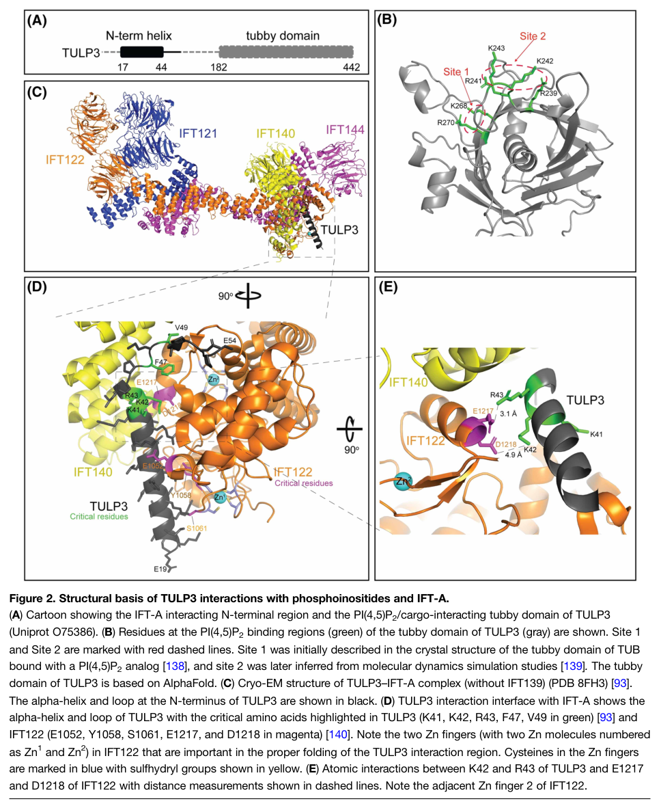

## Question

# Gene Research for Functional Annotation

## ⚠️ CRITICAL: Gene/Protein Identification Context

**BEFORE YOU BEGIN RESEARCH:** You MUST verify you are researching the CORRECT gene/protein. Gene symbols can be ambiguous, especially for less well-characterized genes from non-model organisms.

### Target Gene/Protein Identity (from UniProt):
- **UniProt Accession:** O75386
- **Protein Description:** RecName: Full=Tubby-related protein 3 {ECO:0000305}; AltName: Full=Tubby-like protein 3 {ECO:0000303|PubMed:9828123};
- **Gene Information:** Name=TULP3 {ECO:0000303|PubMed:9828123, ECO:0000312|HGNC:HGNC:12425}; Synonyms=TUBL3;
- **Organism (full):** Homo sapiens (Human).
- **Protein Family:** Belongs to the TUB family. .
- **Key Domains:** Tubby-like_C. (IPR025659); Tubby_C. (IPR000007); Tubby_C_CS. (IPR018066); Tubby_N. (IPR005398); Tub (PF01167)

### MANDATORY VERIFICATION STEPS:

1. **Check if the gene symbol "TULP3" matches the protein description above**
2. **Verify the organism is correct:** Homo sapiens (Human).
3. **Check if protein family/domains align with what you find in literature**
4. **If you find literature for a DIFFERENT gene with the same or similar symbol, STOP**

### If Gene Symbol is Ambiguous or You Cannot Find Relevant Literature:

**DO NOT PROCEED WITH RESEARCH ON A DIFFERENT GENE.** Instead:
- State clearly: "The gene symbol 'TULP3' is ambiguous or literature is limited for this specific protein"
- Explain what you found (e.g., "Found extensive literature on a different gene with the same symbol in a different organism")
- Describe the protein based ONLY on the UniProt information provided above
- Suggest that the protein function can be inferred from domain/family information

### Research Target:

Please provide a comprehensive research report on the gene **TULP3** (gene ID: TULP3, UniProt: O75386) in human.

The research report should be a detailed narrative explaining the function, biological processes, and localization of the gene product. Citations should be given for all claims.

You should prioritize authoritative reviews and primary scientific literature when conducting research. You can supplement
this with annotations you find in gene/protein databases, but these can be outdated or inaccurate.

We are specifically interested in the primary function of the gene - for enzymes, what reaction is catalyzed, and what is the substrate specificity? For transporters, what is the substrate? For structural proteins or adapters, what is the broader structural role? For signaling molecules, what is the role in the pathway.

We are interested in where in or outside the cell the gene product carries out its function.

We are also interested in the signaling or biochemical pathways in which the gene functions. We are less interested in broad pleiotropic effects, except where these elucidate the precise role.

Include evidence where possible. We are interested in both experimental evidence as well as inference from structure, evolution, or bioinformatic analysis. Precise studies should be prioritized over high-throughput, where available.

## Output

Question: You are an expert researcher providing comprehensive, well-cited information.

Provide detailed information focusing on:
1. Key concepts and definitions with current understanding
2. Recent developments and latest research (prioritize 2023-2024 sources)
3. Current applications and real-world implementations
4. Expert opinions and analysis from authoritative sources
5. Relevant statistics and data from recent studies

Format as a comprehensive research report with proper citations. Include URLs and publication dates where available.
Always prioritize recent, authoritative sources and provide specific citations for all major claims.

# Gene Research for Functional Annotation

## ⚠️ CRITICAL: Gene/Protein Identification Context

**BEFORE YOU BEGIN RESEARCH:** You MUST verify you are researching the CORRECT gene/protein. Gene symbols can be ambiguous, especially for less well-characterized genes from non-model organisms.

### Target Gene/Protein Identity (from UniProt):
- **UniProt Accession:** O75386
- **Protein Description:** RecName: Full=Tubby-related protein 3 {ECO:0000305}; AltName: Full=Tubby-like protein 3 {ECO:0000303|PubMed:9828123};
- **Gene Information:** Name=TULP3 {ECO:0000303|PubMed:9828123, ECO:0000312|HGNC:HGNC:12425}; Synonyms=TUBL3;
- **Organism (full):** Homo sapiens (Human).
- **Protein Family:** Belongs to the TUB family. .
- **Key Domains:** Tubby-like_C. (IPR025659); Tubby_C. (IPR000007); Tubby_C_CS. (IPR018066); Tubby_N. (IPR005398); Tub (PF01167)

### MANDATORY VERIFICATION STEPS:

1. **Check if the gene symbol "TULP3" matches the protein description above**
2. **Verify the organism is correct:** Homo sapiens (Human).
3. **Check if protein family/domains align with what you find in literature**
4. **If you find literature for a DIFFERENT gene with the same or similar symbol, STOP**

### If Gene Symbol is Ambiguous or You Cannot Find Relevant Literature:

**DO NOT PROCEED WITH RESEARCH ON A DIFFERENT GENE.** Instead:
- State clearly: "The gene symbol 'TULP3' is ambiguous or literature is limited for this specific protein"
- Explain what you found (e.g., "Found extensive literature on a different gene with the same symbol in a different organism")
- Describe the protein based ONLY on the UniProt information provided above
- Suggest that the protein function can be inferred from domain/family information

### Research Target:

Please provide a comprehensive research report on the gene **TULP3** (gene ID: TULP3, UniProt: O75386) in human.

The research report should be a detailed narrative explaining the function, biological processes, and localization of the gene product. Citations should be given for all claims.

You should prioritize authoritative reviews and primary scientific literature when conducting research. You can supplement
this with annotations you find in gene/protein databases, but these can be outdated or inaccurate.

We are specifically interested in the primary function of the gene - for enzymes, what reaction is catalyzed, and what is the substrate specificity? For transporters, what is the substrate? For structural proteins or adapters, what is the broader structural role? For signaling molecules, what is the role in the pathway.

We are interested in where in or outside the cell the gene product carries out its function.

We are also interested in the signaling or biochemical pathways in which the gene functions. We are less interested in broad pleiotropic effects, except where these elucidate the precise role.

Include evidence where possible. We are interested in both experimental evidence as well as inference from structure, evolution, or bioinformatic analysis. Precise studies should be prioritized over high-throughput, where available.

# Human TULP3: functional annotation research report

## Identity and principal function

**Identity verified.** The specified target is human **TULP3** (synonym **TUBL3**; UniProt **[O75386](https://www.uniprot.org/uniprotkb/O75386/entry)**), a tubby-family protein distinct from TUB, TULP1, TULP2 and TULP4. Literature describing human TULP3 identifies the expected amino-terminal IFT-A-interacting region and carboxy-terminal tubby domain, consistent with the supplied domain annotations. The accession and synonym come from the supplied UniProt identification; the family assignment and domain functions are independently supported by published biochemical work. (mukhopadhyay2011thetubbyfamily pages 2-4, mukhopadhyay2010tulp3bridgesthe pages 6-8, palicharla2024molecularandstructural pages 4-5)

**Primary annotation:** TULP3 is a *selective adaptor for delivery of membrane proteins to the primary cilium*. It is neither an enzyme catalyzing a substrate conversion nor a transporter that itself conducts ions. Its amino terminus connects selected cargo to intraflagellar-transport complex A (**IFT-A**); its carboxy-terminal tubby domain associates with membrane phosphoinositides and recognizes features of cargo proteins. Consequently, changing TULP3 changes the **composition and signaling capacity of the ciliary membrane**, often without removing the cilium itself. This interpretation rests on interaction mapping, phosphoinositide-binding assays, receptor-localization experiments, and Tulp3 knockout and rescue studies. (mukhopadhyay2010tulp3bridgesthe pages 10-11, mukhopadhyay2010tulp3bridgesthe pages 8-10, palicharla2024molecularandstructural pages 4-5, badgandi2017tubbyfamilyproteins pages 1-2)

## Molecular mechanism and site of action

The relevant cellular site is the **mother-centriole/basal-body region and primary cilium at the cell surface**, particularly the membrane-adjacent ciliary entry region. Imaging places TULP3 at the ciliary base and in puncta along cilia, including tips. IFT-A core proteins—including IFT122, IFT140 and IFT144/WDR19—support its ciliary localization. Mapping in human cells identified an IFT-A-interacting amino-terminal stretch around residues **23–68**; depleting TULP3 did not itself dismantle IFT-A or IFT-B localization, supporting its classification as an associated adaptor rather than an obligate structural IFT-A subunit. (mukhopadhyay2011thetubbyfamily pages 4-5, mukhopadhyay2010tulp3bridgesthe pages 6-8, palicharla2024molecularandstructural pages 3-4)

For many *transmembrane* cargoes, the experimentally supported working model has three steps: **capture** of a membrane-proximal ciliary-localization sequence by the tubby domain in a phosphatidylinositol-4,5-bisphosphate [**PI(4,5)P₂**]-containing environment; **delivery** through TULP3’s IFT-A interaction; and **release** into the ciliary membrane, which normally has much less PI(4,5)P₂ than the entry region. Cargo release and its precise physical location remain partly model-based, not directly established for every cargo. The tubby domain binds PI(4,5)P₂ preferentially in lipid-binding experiments; it *binds* this lipid rather than hydrolyzing it. The ciliary phosphatase **INPP5E**, not TULP3, generates the characteristic lipid distribution by restricting ciliary PI(4,5)P₂. (palicharla2024molecularandstructural pages 5-6, mukhopadhyay2010tulp3bridgesthe pages 8-10, badgandi2017tubbyfamilyproteins pages 1-2, garciagonzalo2015phosphoinositidesregulateciliary pages 4-5, garciagonzalo2015phosphoinositidesregulateciliary pages 1-2)

The 2024 structural review depicts this two-ended architecture and summarizes a cryo-EM structure of reconstituted **human TULP3–IFT-A** (PDB **8FH3**). It places TULP3’s amino-terminal helix and adjacent loop against IFT-A, especially IFT122 and IFT140; implicated TULP3 residues include **K41, K42, R43, F47 and V49**. The flexible carboxy-terminal tubby domain was not resolved in that complex: the illustrated tubby-domain lipid sites draw partly on a related TUB structure, molecular-dynamics inference and an AlphaFold TULP3 model. Thus, the IFT-A interface has a stronger direct structural basis than a complete atomic model of a TULP3–lipid–cargo assembly. The **2024 review’s Figure 2** provides a visual summary of this evidence. (palicharla2024molecularandstructural media 9596db2b, palicharla2024molecularandstructural pages 6-7)

## Cargo specificity and signaling pathways

The evidence distinguishes several *substrates of the trafficking process*—that is, **protein cargoes**, not substrates of a catalytic reaction. The following table separates direct demonstrations from context-dependent conclusions. (palicharla2024molecularandstructural pages 4-5, palicharla2023interactionsbetweentulp3 pages 3-5, badgandi2017tubbyfamilyproteins pages 1-2)

| Cargo/pathway | Exact TULP3-dependent role and direct evidence | Original publication and DOI | Evidence strength / caveat |
|---|---|---|---|
| **GPR161–Hedgehog signaling** | TULP3–IFT-A imports GPR161 into primary cilia. Ciliary GPR161 raises cAMP–PKA activity and promotes GLI3 repressor formation; mouse **Gpr161** loss phenocopied elevated Hedgehog signaling in **Tulp3/IFT-A** mutants. In **Inpp5e**-deficient cells, TULP3 knockdown reduced ciliary GPR161 and restored Hedgehog responsiveness (mukhopadhyay2013theciliarygproteincoupled pages 1-2, garciagonzalo2015phosphoinositidesregulateciliary pages 1-2, mukhopadhyay2013theciliarygproteincoupled pages 6-7). | 2013, [10.1016/j.cell.2012.12.026](https://doi.org/10.1016/j.cell.2012.12.026); 2015, [10.1016/j.devcel.2015.08.001](https://doi.org/10.1016/j.devcel.2015.08.001) | **Strong genetic, localization, and rescue evidence.** TULP3 does not directly traffic Smoothened, and its effect on Hedgehog output is context-dependent rather than universally repressive (mukhopadhyay2010tulp3bridgesthe pages 1-2, mukhopadhyay2010tulp3bridgesthe pages 11-12). |
| **SSTR3 and MCHR1 GPCRs** | TULP3 depletion strongly reduced ciliary receptor localization without reducing ciliogenesis. Disrupting either the N-terminal IFT-A-binding region or tubby-domain phosphoinositide binding impaired trafficking; the isolated N-terminal fragment acted dominantly negatively. ACIII and RAB8A were comparatively unaffected, demonstrating cargo selectivity (mukhopadhyay2010tulp3bridgesthe pages 6-8, mukhopadhyay2010tulp3bridgesthe pages 8-10). | 2010, [10.1101/gad.1966210](https://doi.org/10.1101/gad.1966210) | **Strong cell-biological and domain-mutant evidence.** PI(4,5)P2 binding is important for these transmembrane cargoes, but not every ciliary GPCR uses TULP3 identically. |
| **PC1/PC2, fibrocystin, and renal pathways** | The tubby domain captures polycystin-1/2 and fibrocystin ciliary-localization sequences, while the N-terminus couples cargo to IFT-A. Kidney-specific **Tulp3** loss removed polycystins from cilia without eliminating cilia or total cellular protein and produced cystogenesis; fibrocystin-derived minimal sequences were sufficient for TULP3-dependent targeting (hwang2019tulp3regulatesrenal pages 1-3, badgandi2017tubbyfamilyproteins pages 1-2). | 2017, [10.1083/jcb.201607095](https://doi.org/10.1083/jcb.201607095); 2019, [10.1016/j.cub.2019.01.047](https://doi.org/10.1016/j.cub.2019.01.047); 2019, [10.1016/j.cub.2019.01.054](https://doi.org/10.1016/j.cub.2019.01.054) | **Strong trafficking and conditional-mouse evidence.** TULP3 is an adaptor, not a channel. Renal effects depend on developmental timing and polycystin status; adult **Pkd1/Tulp3** epistasis can differ from developmental loss (walker2022cilialocalizedcounterregulatorysignals pages 1-2, legue2019tulp3isa pages 1-3). |
| **ARL13B–INPP5E–NPHP3–CYS1 lipidated-cargo axis** | TULP3 drives ARL13B entry into cilia and thereby supports enrichment of downstream prenylated or myristoylated proteins. Wild-type TULP3 rescued ARL13B and INPP5E in knockout cells; an IFT-A-binding mutant did not. Unlike GPCR trafficking, a PI(4,5)P2-binding-defective TULP3 mutant produced **partial rescue**, showing that lipid binding improves efficiency but is not strictly required for ARL13B transport. In kidney conditional knockouts, ARL13B, INPP5E, and NPHP3 were lost with distinct kinetics—approximately P0, P5, and P24—while ciliation remained unchanged; CYS1 was also reduced in cells (palicharla2023interactionsbetweentulp3 pages 3-5). | 2023, [10.1091/mbc.e22-10-0473](https://doi.org/10.1091/mbc.e22-10-0473) | **Strong knockout, entry-kinetics, rescue, and in-vivo localization evidence.** Tissue redundancy matters: neural TUB can compensate for TULP3, and individual lipidated cargoes exhibit different dependencies and depletion kinetics. |
| **IFT-A structural interface and cargo-recognition surface** | Cryo-EM of reconstituted human TULP3–IFT-A (PDB **8FH3**) placed the TULP3 N-terminal helix and loop against IFT122 and IFT140; critical TULP3 residues include K41, K42, R43, F47, and V49. Subsequent mutagenesis and proximity labeling identified a separate tubby β-barrel surface around β-strands 8–12 that supports proximity to GPR161, fibrocystin, and ARL13B without disrupting IFT-A-dependent localization, PI(4,5)P2 binding, or hydrodynamic behavior (palicharla2025adefinedtubby pages 5-7, palicharla2024molecularandstructural pages 6-7). | 2023 structural study summarized in 2024, [10.1042/BST20231403](https://doi.org/10.1042/BST20231403); 2025 functional-interface study, [10.1091/mbc.e24-09-0426](https://doi.org/10.1091/mbc.e24-09-0426) | **Strong structural evidence for IFT-A binding and functional evidence for a distinct cargo surface.** The flexible tubby domain was unresolved in the cryo-EM complex; parts of its lipid-binding architecture rely on TUB structures, molecular dynamics, and AlphaFold rather than a TULP3–cargo co-structure (palicharla2024molecularandstructural pages 6-7). |

*Table: Direct genetic, biochemical, imaging, and structural evidence defining TULP3-dependent ciliary cargo trafficking. The table distinguishes shared IFT-A dependence from cargo-specific phosphoinositide requirements and key experimental caveats.*

**GPCR signaling and Hedgehog.** In cultured human retinal pigment epithelial cells, TULP3 depletion inhibited ciliary localization of **MCHR1** and **SSTR3** without impairing ciliogenesis; disrupting either its IFT-A or phosphoinositide interaction likewise impaired receptor targeting. Endogenous neuronal SSTR3 was affected by a dominant-negative TULP3 fragment, whereas ciliary adenylyl cyclase III was not, demonstrating selectivity. Another consequential cargo is **GPR161**: its TULP3/IFT-A-dependent presence in cilia supports GPR161-driven cAMP/PKA signaling and GLI3 repressor formation when Sonic Hedgehog (SHH) signaling is off. On pathway activation, GPR161 normally leaves cilia. Mouse *Gpr161* loss increases neural-tube Hedgehog signaling; conversely, TULP3 depletion in *Inpp5e*-deficient cells reduced excessive ciliary GPR161 and restored Hedgehog responsiveness. TULP3 is **not established as the direct ciliary importer of Smoothened**: its depletion did not reproduce a general Smoothened-entry defect in the original selective-trafficking tests. Its net effect on Hedgehog signaling must therefore be interpreted by cargo and cellular context. (mukhopadhyay2010tulp3bridgesthe pages 6-8, mukhopadhyay2010tulp3bridgesthe pages 8-10, mukhopadhyay2013theciliarygproteincoupled pages 1-2, garciagonzalo2015phosphoinositidesregulateciliary pages 1-2, mukhopadhyay2013theciliarygproteincoupled pages 6-7)

**Renal ciliary proteins.** The TULP3-dependent repertoire includes the **polycystin-1/polcystin-2 complex**, and experiments with fibrocystin ciliary-localization sequences support TULP3-dependent targeting of that protein class. Conditional kidney studies show that Tulp3 loss changes ciliary polycystin and ARL13B localization and causes cystogenesis, while leaving cilia present; the phenotype is not equivalent to deleting the entire cilium. TULP3 is the *delivery adaptor*, not the polycystin ion channel. Kidney-genetic analyses further caution against one-directional predictions: Tulp3-dependent pathways can restrain cyst formation during development yet contribute to cystogenesis in adult kidneys already lacking polycystin function. (hwang2019tulp3regulatesrenal pages 1-3, badgandi2017tubbyfamilyproteins pages 1-2, legue2019tulp3isa pages 1-3, walker2022cilialocalizedcounterregulatorysignals pages 1-2)

**Lipidated cargoes and a mechanistic exception.** A **2023 primary study** established that TULP3’s tubby domain recognizes an **amphipathic amino-terminal helix of ARL13B**, a ciliary small GTPase. ARL13B entry requires TULP3–IFT-A binding; unlike the tested transmembrane GPCRs, it can still be supported by a TULP3 mutant defective in PI(4,5)P₂ binding, **although rescue is less efficient than with wild-type TULP3**. ARL13B localization in turn supports ciliary enrichment of downstream proteins including **INPP5E, NPHP3 and CYS1**; their requirements and depletion kinetics differ, and some effects may be indirect through ARL13B. LKB1 ciliary localization remained unaffected in the tested renal collecting ducts. In a pulse-labeling entry assay, newly arriving ARL13B reached approximately **50% of the measured ciliary pool by five hours** in control cells, with markedly reduced entry after Tulp3 deletion. In conditional mouse kidneys, ARL13B was nearly lost from cilia by **postnatal day 0**, INPP5E by **day 5**, and NPHP3 by **day 24**, despite unchanged collecting-duct ciliation. These timings are model-specific, not estimates of human disease progression. (palicharla2023interactionsbetweentulp3 pages 3-5, palicharla2023interactionsbetweentulp3 pages 1-2)

## Recent mechanistic advances

The **2023 ARL13B work** revised the oversimplified idea that PI(4,5)P₂ binding is indispensable for *all* TULP3 cargoes: IFT-A binding remained essential, but impaired lipid binding permitted partial ARL13B/INPP5E rescue. The **2024 Palicharla–Mukhopadhyay review** integrated this exception with human IFT-A structural work and emphasized diverse, frequently membrane-proximal cargo-recognition sequences rather than one universal peptide motif. (palicharla2023interactionsbetweentulp3 pages 3-5, palicharla2024molecularandstructural pages 6-7, palicharla2024molecularandstructural pages 5-6)

A subsequent **January 2025 primary study** sharpened the mechanism beyond the requested 2023–2024 window. Mutagenesis, ciliary-localization assays and proximity labeling implicated one surface of the tubby-domain **β-barrel**, away from the canonical phosphoinositide-binding region, in association with both transmembrane and lipidated cargoes. Patient-associated **R382W and R408H** impaired ciliary ARL13B and GPR161 trafficking; several surface variants also reduced proximity to GPR161, fibrocystin and ARL13B while retaining measurable phosphoinositide binding, IFT-A-dependent localization and approximately **55-Å Stokes-radius** behavior. This argues for a **cargo-recognition defect** rather than automatically attributing every tubby-domain disease variant to failed lipid binding. Proximity labeling demonstrates association/proximity, not by itself an atomic-resolution direct cargo-binding interface. (palicharla2025adefinedtubby pages 5-7, palicharla2025adefinedtubby pages 1-2)

## Human relevance and implementation

**Established disease association.** In a **May 2022** human genetics study, deleterious **biallelic TULP3 variants** occurred in **15 affected people from eight unrelated families**, predominantly adults, with progressive liver fibrosis, fibrocystic kidney disease and, in a subset, hypertrophic cardiomyopathy. Patient-derived urine renal epithelial cells and skin fibroblasts had reduced ciliary **GPR161, ARL13B and/or INPP5E**, with variant-dependent severity; these are direct human-cell observations supporting the trafficking annotation. An independent **October 2022** study reported **two sisters** homozygous for **p.Arg382Trp** with renal–hepatic fibrocystic disease: wild-type TULP3 rescued ciliary cargo localization in knockout kidney cells more effectively than the variant. The 15-person cohort and two-sister report are separate ascertainments and should not be treated as a population prevalence estimate. (devane2022progressiveliverkidney pages 1-3, devane2022progressiveliverkidney pages 11-12, khamirani2022apathogenicvariant pages 4-7, khamirani2022apathogenicvariant pages 8-10)

A practical research and diagnostic implementation is to combine **biallelic-variant identification and segregation** with **patient-cell ciliary immunofluorescence** or experimentally controlled variant-rescue assays for GPR161, ARL13B and INPP5E. The 2022 study used patient urine-derived epithelial cells and fibroblasts in precisely this way. Its authors advocated periodic assessment of **liver, kidney and cardiac** disease in affected individuals because manifestations can progress; this is a clinical implication of the observed cohort, not evidence for an established TULP3-specific therapy. By contrast, a **2022** analysis found **one heterozygous TULP3 candidate variant among 50 unrelated spina-bifida cases** and explicitly called for further evidence: this should not be assigned the same causal certainty as the biallelic hepatorenal disease association. (devane2022progressiveliverkidney pages 11-12, devane2022progressiveliverkidney pages 12-14, khamirani2022apathogenicvariant pages 4-7, wang2022wholeexomesequencing pages 10-12)

**Secondary findings and uncertainties.** The human study reported TULP3–**SIRT1** co-immunoprecipitation, increased DNA-damage marker γH2AX in tested patient cells, and WNT/TGF-β-associated transcriptional changes in a patient fibroblast comparison. These observations may illuminate fibrosis, but do **not** establish SIRT1 regulation or WNT/TGF-β signaling as TULP3’s primary molecular function, nor demonstrate that the SIRT1 interaction occurs at the ciliary site of cargo transport. The same study did not detect a uniformly dysregulated SHH transcriptional program in the fibroblasts it analyzed. Finally, dependence on a particular cargo varies by tissue—neural Tubby/TUB can compensate for TULP3 in some settings—and the 2024 expert review identifies how cargo-loaded preciliary membranes engage IFT-A and how individual cargoes are released as outstanding questions. (devane2022progressiveliverkidney pages 11-12, devane2022progressiveliverkidney pages 12-14, palicharla2024molecularandstructural pages 9-10, palicharla2023interactionsbetweentulp3 pages 3-5)

### Selected source record — publication dates and URLs

- Mukhopadhyay *et al.*, **October 2010**, *Genes & Development*, foundational IFT-A/phosphoinositide mechanism: https://doi.org/10.1101/gad.1966210. (mukhopadhyay2010tulp3bridgesthe pages 8-10)
- Mukhopadhyay *et al.*, **January 2013**, *Cell*, GPR161–cAMP–Hedgehog mechanism: https://doi.org/10.1016/j.cell.2012.12.026. (mukhopadhyay2013theciliarygproteincoupled pages 1-2)
- Garcia-Gonzalo *et al.*, **August 2015**, *Developmental Cell*, ciliary phosphoinositides and TULP3: https://doi.org/10.1016/j.devcel.2015.08.001. (garciagonzalo2015phosphoinositidesregulateciliary pages 1-2)
- Badgandi *et al.*, **March 2017**, *Journal of Cell Biology*, integral-membrane cargo adaptation: https://doi.org/10.1083/jcb.201607095. (badgandi2017tubbyfamilyproteins pages 1-2)
- Hwang *et al.* and Legué & Liem, **March 2019**, *Current Biology*, renal cargo trafficking and genetic context: https://doi.org/10.1016/j.cub.2019.01.047 and https://doi.org/10.1016/j.cub.2019.01.054. (hwang2019tulp3regulatesrenal pages 1-3, legue2019tulp3isa pages 1-3)
- Devane *et al.*, **May 2022**, *American Journal of Human Genetics*, human biallelic cohort: https://doi.org/10.1016/j.ajhg.2022.03.015; Khamirani *et al.*, **October 2022**, *Frontiers in Genetics*, p.Arg382Trp family and functional testing: https://doi.org/10.3389/fgene.2022.1021037. (devane2022progressiveliverkidney pages 1-3, khamirani2022apathogenicvariant pages 4-7)
- Palicharla *et al.*, **March 2023**, *Molecular Biology of the Cell*, ARL13B and lipidated-cargo mechanism: https://doi.org/10.1091/mbc.e22-10-0473; Palicharla & Mukhopadhyay, **June 2024**, *Biochemical Society Transactions*, structural/mechanistic review: https://doi.org/10.1042/BST20231403; Palicharla *et al.*, **January 2025**, *Molecular Biology of the Cell*, β-barrel cargo surface: https://doi.org/10.1091/mbc.e24-09-0426. (palicharla2023interactionsbetweentulp3 pages 3-5, palicharla2024molecularandstructural pages 6-7, palicharla2025adefinedtubby pages 5-7)

References

1. (mukhopadhyay2011thetubbyfamily pages 2-4): Saikat Mukhopadhyay and Peter K Jackson. The tubby family proteins. Genome Biology, 12:225-225, Jun 2011. URL: https://doi.org/10.1186/gb-2011-12-6-225, doi:10.1186/gb-2011-12-6-225. This article has 170 citations and is from a highest quality peer-reviewed journal.

2. (mukhopadhyay2010tulp3bridgesthe pages 6-8): Saikat Mukhopadhyay, Xiaohui Wen, Ben Chih, Christopher D. Nelson, William S. Lane, Suzie J. Scales, and Peter K. Jackson. Tulp3 bridges the ift-a complex and membrane phosphoinositides to promote trafficking of g protein-coupled receptors into primary cilia. Genes & development, 24 19:2180-93, Oct 2010. URL: https://doi.org/10.1101/gad.1966210, doi:10.1101/gad.1966210. This article has 521 citations and is from a highest quality peer-reviewed journal.

3. (palicharla2024molecularandstructural pages 4-5): Vivek Reddy Palicharla and Saikat Mukhopadhyay. Molecular and structural perspectives on protein trafficking to the primary cilium membrane. Biochemical Society Transactions, 52:1473-1487, Jun 2024. URL: https://doi.org/10.1042/bst20231403, doi:10.1042/bst20231403. This article has 16 citations and is from a peer-reviewed journal.

4. (mukhopadhyay2010tulp3bridgesthe pages 10-11): Saikat Mukhopadhyay, Xiaohui Wen, Ben Chih, Christopher D. Nelson, William S. Lane, Suzie J. Scales, and Peter K. Jackson. Tulp3 bridges the ift-a complex and membrane phosphoinositides to promote trafficking of g protein-coupled receptors into primary cilia. Genes & development, 24 19:2180-93, Oct 2010. URL: https://doi.org/10.1101/gad.1966210, doi:10.1101/gad.1966210. This article has 521 citations and is from a highest quality peer-reviewed journal.

5. (mukhopadhyay2010tulp3bridgesthe pages 8-10): Saikat Mukhopadhyay, Xiaohui Wen, Ben Chih, Christopher D. Nelson, William S. Lane, Suzie J. Scales, and Peter K. Jackson. Tulp3 bridges the ift-a complex and membrane phosphoinositides to promote trafficking of g protein-coupled receptors into primary cilia. Genes & development, 24 19:2180-93, Oct 2010. URL: https://doi.org/10.1101/gad.1966210, doi:10.1101/gad.1966210. This article has 521 citations and is from a highest quality peer-reviewed journal.

6. (badgandi2017tubbyfamilyproteins pages 1-2): Hemant B. Badgandi, Sun-hee Hwang, Issei S. Shimada, Evan Loriot, and Saikat Mukhopadhyay. Tubby family proteins are adapters for ciliary trafficking of integral membrane proteins. The Journal of Cell Biology, 216:743-760, Mar 2017. URL: https://doi.org/10.1083/jcb.201607095, doi:10.1083/jcb.201607095. This article has 233 citations.

7. (mukhopadhyay2011thetubbyfamily pages 4-5): Saikat Mukhopadhyay and Peter K Jackson. The tubby family proteins. Genome Biology, 12:225-225, Jun 2011. URL: https://doi.org/10.1186/gb-2011-12-6-225, doi:10.1186/gb-2011-12-6-225. This article has 170 citations and is from a highest quality peer-reviewed journal.

8. (palicharla2024molecularandstructural pages 3-4): Vivek Reddy Palicharla and Saikat Mukhopadhyay. Molecular and structural perspectives on protein trafficking to the primary cilium membrane. Biochemical Society Transactions, 52:1473-1487, Jun 2024. URL: https://doi.org/10.1042/bst20231403, doi:10.1042/bst20231403. This article has 16 citations and is from a peer-reviewed journal.

9. (palicharla2024molecularandstructural pages 5-6): Vivek Reddy Palicharla and Saikat Mukhopadhyay. Molecular and structural perspectives on protein trafficking to the primary cilium membrane. Biochemical Society Transactions, 52:1473-1487, Jun 2024. URL: https://doi.org/10.1042/bst20231403, doi:10.1042/bst20231403. This article has 16 citations and is from a peer-reviewed journal.

10. (garciagonzalo2015phosphoinositidesregulateciliary pages 4-5): Francesc R. Garcia-Gonzalo, Siew Cheng Phua, Elle C. Roberson, Galo Garcia, Monika Abedin, Stéphane Schurmans, Takanari Inoue, and Jeremy F. Reiter. Phosphoinositides regulate ciliary protein trafficking to modulate hedgehog signaling. Developmental cell, 34 4:400-409, Aug 2015. URL: https://doi.org/10.1016/j.devcel.2015.08.001, doi:10.1016/j.devcel.2015.08.001. This article has 387 citations and is from a highest quality peer-reviewed journal.

11. (garciagonzalo2015phosphoinositidesregulateciliary pages 1-2): Francesc R. Garcia-Gonzalo, Siew Cheng Phua, Elle C. Roberson, Galo Garcia, Monika Abedin, Stéphane Schurmans, Takanari Inoue, and Jeremy F. Reiter. Phosphoinositides regulate ciliary protein trafficking to modulate hedgehog signaling. Developmental cell, 34 4:400-409, Aug 2015. URL: https://doi.org/10.1016/j.devcel.2015.08.001, doi:10.1016/j.devcel.2015.08.001. This article has 387 citations and is from a highest quality peer-reviewed journal.

12. (palicharla2024molecularandstructural media 9596db2b): Vivek Reddy Palicharla and Saikat Mukhopadhyay. Molecular and structural perspectives on protein trafficking to the primary cilium membrane. Biochemical Society Transactions, 52:1473-1487, Jun 2024. URL: https://doi.org/10.1042/bst20231403, doi:10.1042/bst20231403. This article has 16 citations and is from a peer-reviewed journal.

13. (palicharla2024molecularandstructural pages 6-7): Vivek Reddy Palicharla and Saikat Mukhopadhyay. Molecular and structural perspectives on protein trafficking to the primary cilium membrane. Biochemical Society Transactions, 52:1473-1487, Jun 2024. URL: https://doi.org/10.1042/bst20231403, doi:10.1042/bst20231403. This article has 16 citations and is from a peer-reviewed journal.

14. (palicharla2023interactionsbetweentulp3 pages 3-5): Vivek Reddy Palicharla, Sun-Hee Hwang, Bandarigoda N. Somatilaka, Emilie Legué, Issei S. Shimada, Nicole E. Familiari, Vanna M. Tran, Jeffrey B. Woodruff, Karel F. Liem, and Saikat Mukhopadhyay. Interactions between tulp3 tubby domain and arl13b amphipathic helix promote lipidated protein transport to cilia. Mar 2023. URL: https://doi.org/10.1091/mbc.e22-10-0473, doi:10.1091/mbc.e22-10-0473. This article has 30 citations and is from a domain leading peer-reviewed journal.

15. (mukhopadhyay2013theciliarygproteincoupled pages 1-2): Saikat Mukhopadhyay, Xiaohui Wen, Navneet Ratti, Alexander Loktev, Linda Rangell, Suzie J. Scales, and Peter K. Jackson. The ciliary g-protein-coupled receptor gpr161 negatively regulates the sonic hedgehog pathway via camp signaling. Cell, 152:210-223, Jan 2013. URL: https://doi.org/10.1016/j.cell.2012.12.026, doi:10.1016/j.cell.2012.12.026. This article has 596 citations and is from a highest quality peer-reviewed journal.

16. (mukhopadhyay2013theciliarygproteincoupled pages 6-7): Saikat Mukhopadhyay, Xiaohui Wen, Navneet Ratti, Alexander Loktev, Linda Rangell, Suzie J. Scales, and Peter K. Jackson. The ciliary g-protein-coupled receptor gpr161 negatively regulates the sonic hedgehog pathway via camp signaling. Cell, 152:210-223, Jan 2013. URL: https://doi.org/10.1016/j.cell.2012.12.026, doi:10.1016/j.cell.2012.12.026. This article has 596 citations and is from a highest quality peer-reviewed journal.

17. (mukhopadhyay2010tulp3bridgesthe pages 1-2): Saikat Mukhopadhyay, Xiaohui Wen, Ben Chih, Christopher D. Nelson, William S. Lane, Suzie J. Scales, and Peter K. Jackson. Tulp3 bridges the ift-a complex and membrane phosphoinositides to promote trafficking of g protein-coupled receptors into primary cilia. Genes & development, 24 19:2180-93, Oct 2010. URL: https://doi.org/10.1101/gad.1966210, doi:10.1101/gad.1966210. This article has 521 citations and is from a highest quality peer-reviewed journal.

18. (mukhopadhyay2010tulp3bridgesthe pages 11-12): Saikat Mukhopadhyay, Xiaohui Wen, Ben Chih, Christopher D. Nelson, William S. Lane, Suzie J. Scales, and Peter K. Jackson. Tulp3 bridges the ift-a complex and membrane phosphoinositides to promote trafficking of g protein-coupled receptors into primary cilia. Genes & development, 24 19:2180-93, Oct 2010. URL: https://doi.org/10.1101/gad.1966210, doi:10.1101/gad.1966210. This article has 521 citations and is from a highest quality peer-reviewed journal.

19. (hwang2019tulp3regulatesrenal pages 1-3): Sun-Hee Hwang, Bandarigoda N. Somatilaka, Hemant Badgandi, Vivek Reddy Palicharla, Rebecca Walker, John M. Shelton, Feng Qian, and Saikat Mukhopadhyay. Tulp3 regulates renal cystogenesis by trafficking of cystoproteins to cilia. Current Biology, 29:790-802.e5, Mar 2019. URL: https://doi.org/10.1016/j.cub.2019.01.047, doi:10.1016/j.cub.2019.01.047. This article has 69 citations and is from a highest quality peer-reviewed journal.

20. (walker2022cilialocalizedcounterregulatorysignals pages 1-2): Rebecca V. Walker, Anthony Maranto, Vivek Reddy Palicharla, Sun-Hee Hwang, Saikat Mukhopadhyay, and Feng Qian. Cilia-localized counterregulatory signals as drivers of renal cystogenesis. Frontiers in Molecular Biosciences, Jun 2022. URL: https://doi.org/10.3389/fmolb.2022.936070, doi:10.3389/fmolb.2022.936070. This article has 31 citations.

21. (legue2019tulp3isa pages 1-3): Emilie Legué and Karel F. Liem. Tulp3 is a ciliary trafficking gene that regulates polycystic kidney disease. Current Biology, 29:803-812.e5, Mar 2019. URL: https://doi.org/10.1016/j.cub.2019.01.054, doi:10.1016/j.cub.2019.01.054. This article has 87 citations and is from a highest quality peer-reviewed journal.

22. (palicharla2025adefinedtubby pages 5-7): Vivek Reddy Palicharla, Hemant B. Badgandi, Sun-Hee Hwang, Emilie Legué, Karel F. Liem, and Saikat Mukhopadhyay. A defined tubby domain β-barrel surface region of tulp3 mediates ciliary trafficking of diverse cargoes. Jan 2025. URL: https://doi.org/10.1091/mbc.e24-09-0426, doi:10.1091/mbc.e24-09-0426. This article has 7 citations and is from a domain leading peer-reviewed journal.

23. (palicharla2023interactionsbetweentulp3 pages 1-2): Vivek Reddy Palicharla, Sun-Hee Hwang, Bandarigoda N. Somatilaka, Emilie Legué, Issei S. Shimada, Nicole E. Familiari, Vanna M. Tran, Jeffrey B. Woodruff, Karel F. Liem, and Saikat Mukhopadhyay. Interactions between tulp3 tubby domain and arl13b amphipathic helix promote lipidated protein transport to cilia. Mar 2023. URL: https://doi.org/10.1091/mbc.e22-10-0473, doi:10.1091/mbc.e22-10-0473. This article has 30 citations and is from a domain leading peer-reviewed journal.

24. (palicharla2025adefinedtubby pages 1-2): Vivek Reddy Palicharla, Hemant B. Badgandi, Sun-Hee Hwang, Emilie Legué, Karel F. Liem, and Saikat Mukhopadhyay. A defined tubby domain β-barrel surface region of tulp3 mediates ciliary trafficking of diverse cargoes. Jan 2025. URL: https://doi.org/10.1091/mbc.e24-09-0426, doi:10.1091/mbc.e24-09-0426. This article has 7 citations and is from a domain leading peer-reviewed journal.

25. (devane2022progressiveliverkidney pages 1-3): John Devane, Elisabeth Ott, Eric G. Olinger, Daniel Epting, Eva Decker, Anja Friedrich, Nadine Bachmann, Gina Renschler, Tobias Eisenberger, Andrea Briem-Richter, Enke Freya Grabhorn, Laura Powell, Ian J. Wilson, Sarah J. Rice, Colin G. Miles, Katrina Wood, Palak Trivedi, Gideon Hirschfield, Andrea Pietrobattista, Elizabeth Wohler, Anya Mezina, Nara Sobreira, Emanuele Agolini, Giuseppe Maggiore, Mareike Dahmer-Heath, Ali Yilmaz, Melanie Boerries, Patrick Metzger, Christoph Schell, Inga Grünewald, Martin Konrad, Jens König, Bernhard Schlevogt, John A. Sayer, and Carsten Bergmann. Progressive liver, kidney, and heart degeneration in children and adults affected by tulp3 mutations. The American Journal of Human Genetics, 109:928-943, May 2022. URL: https://doi.org/10.1016/j.ajhg.2022.03.015, doi:10.1016/j.ajhg.2022.03.015. This article has 58 citations.

26. (devane2022progressiveliverkidney pages 11-12): John Devane, Elisabeth Ott, Eric G. Olinger, Daniel Epting, Eva Decker, Anja Friedrich, Nadine Bachmann, Gina Renschler, Tobias Eisenberger, Andrea Briem-Richter, Enke Freya Grabhorn, Laura Powell, Ian J. Wilson, Sarah J. Rice, Colin G. Miles, Katrina Wood, Palak Trivedi, Gideon Hirschfield, Andrea Pietrobattista, Elizabeth Wohler, Anya Mezina, Nara Sobreira, Emanuele Agolini, Giuseppe Maggiore, Mareike Dahmer-Heath, Ali Yilmaz, Melanie Boerries, Patrick Metzger, Christoph Schell, Inga Grünewald, Martin Konrad, Jens König, Bernhard Schlevogt, John A. Sayer, and Carsten Bergmann. Progressive liver, kidney, and heart degeneration in children and adults affected by tulp3 mutations. The American Journal of Human Genetics, 109:928-943, May 2022. URL: https://doi.org/10.1016/j.ajhg.2022.03.015, doi:10.1016/j.ajhg.2022.03.015. This article has 58 citations.

27. (khamirani2022apathogenicvariant pages 4-7): Hossein Jafari Khamirani, Vivek Reddy Palicharla, Seyed Alireza Dastgheib, Mehdi Dianatpour, Mohammad Hadi Imanieh, Seyed Sajjad Tabei, Whitney Besse, Saikat Mukhopadhyay, and Karel F. Liem. A pathogenic variant of tulp3 causes renal and hepatic fibrocystic disease. Frontiers in Genetics, Oct 2022. URL: https://doi.org/10.3389/fgene.2022.1021037, doi:10.3389/fgene.2022.1021037. This article has 16 citations and is from a peer-reviewed journal.

28. (khamirani2022apathogenicvariant pages 8-10): Hossein Jafari Khamirani, Vivek Reddy Palicharla, Seyed Alireza Dastgheib, Mehdi Dianatpour, Mohammad Hadi Imanieh, Seyed Sajjad Tabei, Whitney Besse, Saikat Mukhopadhyay, and Karel F. Liem. A pathogenic variant of tulp3 causes renal and hepatic fibrocystic disease. Frontiers in Genetics, Oct 2022. URL: https://doi.org/10.3389/fgene.2022.1021037, doi:10.3389/fgene.2022.1021037. This article has 16 citations and is from a peer-reviewed journal.

29. (devane2022progressiveliverkidney pages 12-14): John Devane, Elisabeth Ott, Eric G. Olinger, Daniel Epting, Eva Decker, Anja Friedrich, Nadine Bachmann, Gina Renschler, Tobias Eisenberger, Andrea Briem-Richter, Enke Freya Grabhorn, Laura Powell, Ian J. Wilson, Sarah J. Rice, Colin G. Miles, Katrina Wood, Palak Trivedi, Gideon Hirschfield, Andrea Pietrobattista, Elizabeth Wohler, Anya Mezina, Nara Sobreira, Emanuele Agolini, Giuseppe Maggiore, Mareike Dahmer-Heath, Ali Yilmaz, Melanie Boerries, Patrick Metzger, Christoph Schell, Inga Grünewald, Martin Konrad, Jens König, Bernhard Schlevogt, John A. Sayer, and Carsten Bergmann. Progressive liver, kidney, and heart degeneration in children and adults affected by tulp3 mutations. The American Journal of Human Genetics, 109:928-943, May 2022. URL: https://doi.org/10.1016/j.ajhg.2022.03.015, doi:10.1016/j.ajhg.2022.03.015. This article has 58 citations.

30. (wang2022wholeexomesequencing pages 10-12): Chunyan Wang, Steve Seltzsam, Bixia Zheng, Chen‐Han Wilfred Wu, Camille Nicolas‐Frank, Kirollos Yousef, Kit Sing Au, Nina Mann, Dalia Pantel, Sophia Schneider, Luca Schierbaum, Thomas M. Kitzler, Dervla M. Connaughton, Youying Mao, Rufeng Dai, Makiko Nakayama, Jameela A. Kari, Sherif El Desoky, Mohammed Shalaby, Loai A. Eid, Hazem S. Awad, Velibor Tasic, Shrikant M. Mane, Richard P. Lifton, Michelle A. Baum, Shirlee Shril, Carlos R. Estrada, and Friedhelm Hildebrandt. Whole exome sequencing identifies potential candidate genes for spina bifida derived from mouse models. American Journal of Medical Genetics Part A, 188:1355-1367, Jan 2022. URL: https://doi.org/10.1002/ajmg.a.62644, doi:10.1002/ajmg.a.62644. This article has 8 citations.

31. (palicharla2024molecularandstructural pages 9-10): Vivek Reddy Palicharla and Saikat Mukhopadhyay. Molecular and structural perspectives on protein trafficking to the primary cilium membrane. Biochemical Society Transactions, 52:1473-1487, Jun 2024. URL: https://doi.org/10.1042/bst20231403, doi:10.1042/bst20231403. This article has 16 citations and is from a peer-reviewed journal.

## Artifacts

- [Edison artifact artifact-00](TULP3-deep-research-falcon_artifacts/artifact-00.md)

## Citations

1. palicharla2024molecularandstructural pages 6-7
2. mukhopadhyay2013theciliarygproteincoupled pages 1-2
3. garciagonzalo2015phosphoinositidesregulateciliary pages 1-2
4. badgandi2017tubbyfamilyproteins pages 1-2
5. mukhopadhyay2011thetubbyfamily pages 2-4
6. palicharla2024molecularandstructural pages 4-5
7. mukhopadhyay2011thetubbyfamily pages 4-5
8. palicharla2024molecularandstructural pages 3-4
9. palicharla2024molecularandstructural pages 5-6
10. garciagonzalo2015phosphoinositidesregulateciliary pages 4-5
11. mukhopadhyay2013theciliarygproteincoupled pages 6-7
12. walker2022cilialocalizedcounterregulatorysignals pages 1-2
13. palicharla2025adefinedtubby pages 5-7
14. palicharla2025adefinedtubby pages 1-2
15. devane2022progressiveliverkidney pages 1-3
16. devane2022progressiveliverkidney pages 11-12
17. khamirani2022apathogenicvariant pages 4-7
18. khamirani2022apathogenicvariant pages 8-10
19. devane2022progressiveliverkidney pages 12-14
20. wang2022wholeexomesequencing pages 10-12
21. palicharla2024molecularandstructural pages 9-10
22. O75386
23. **PI(4,5)P₂**
24. 10.1016/j.cell.2012.12.026
25. 10.1016/j.devcel.2015.08.001
26. 10.1101/gad.1966210
27. 10.1083/jcb.201607095
28. 10.1016/j.cub.2019.01.047
29. 10.1016/j.cub.2019.01.054
30. 10.1091/mbc.e22-10-0473
31. 10.1042/BST20231403
32. 10.1091/mbc.e24-09-0426
33. https://www.uniprot.org/uniprotkb/O75386/entry
34. https://doi.org/10.1016/j.cell.2012.12.026
35. https://doi.org/10.1016/j.devcel.2015.08.001
36. https://doi.org/10.1101/gad.1966210
37. https://doi.org/10.1083/jcb.201607095
38. https://doi.org/10.1016/j.cub.2019.01.047
39. https://doi.org/10.1016/j.cub.2019.01.054
40. https://doi.org/10.1091/mbc.e22-10-0473
41. https://doi.org/10.1042/BST20231403
42. https://doi.org/10.1091/mbc.e24-09-0426
43. https://doi.org/10.1101/gad.1966210.
44. https://doi.org/10.1016/j.cell.2012.12.026.
45. https://doi.org/10.1016/j.devcel.2015.08.001.
46. https://doi.org/10.1083/jcb.201607095.
47. https://doi.org/10.1016/j.cub.2019.01.054.
48. https://doi.org/10.1016/j.ajhg.2022.03.015;
49. https://doi.org/10.3389/fgene.2022.1021037.
50. https://doi.org/10.1091/mbc.e22-10-0473;
51. https://doi.org/10.1042/BST20231403;
52. https://doi.org/10.1091/mbc.e24-09-0426.
53. https://doi.org/10.1186/gb-2011-12-6-225,
54. https://doi.org/10.1101/gad.1966210,
55. https://doi.org/10.1042/bst20231403,
56. https://doi.org/10.1083/jcb.201607095,
57. https://doi.org/10.1016/j.devcel.2015.08.001,
58. https://doi.org/10.1091/mbc.e22-10-0473,
59. https://doi.org/10.1016/j.cell.2012.12.026,
60. https://doi.org/10.1016/j.cub.2019.01.047,
61. https://doi.org/10.3389/fmolb.2022.936070,
62. https://doi.org/10.1016/j.cub.2019.01.054,
63. https://doi.org/10.1091/mbc.e24-09-0426,
64. https://doi.org/10.1016/j.ajhg.2022.03.015,
65. https://doi.org/10.3389/fgene.2022.1021037,
66. https://doi.org/10.1002/ajmg.a.62644,