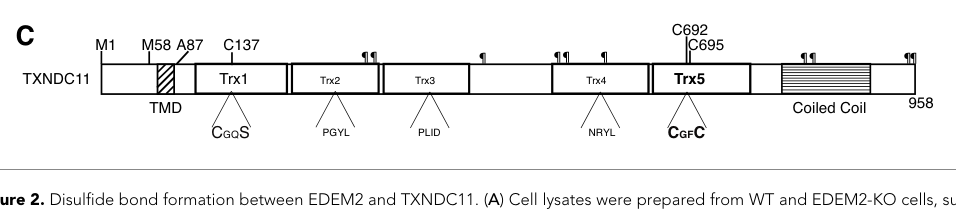

## Question

# Gene Research for Functional Annotation

## ⚠️ CRITICAL: Gene/Protein Identification Context

**BEFORE YOU BEGIN RESEARCH:** You MUST verify you are researching the CORRECT gene/protein. Gene symbols can be ambiguous, especially for less well-characterized genes from non-model organisms.

### Target Gene/Protein Identity (from UniProt):
- **UniProt Accession:** Q6PKC3
- **Protein Description:** RecName: Full=Thioredoxin domain-containing protein 11; AltName: Full=EF-hand-binding protein 1;
- **Gene Information:** Name=TXNDC11; Synonyms=EFP1;
- **Organism (full):** Homo sapiens (Human).
- **Protein Family:** Belongs to the protein disulfide isomerase family.
- **Key Domains:** Thioredoxin-like_sf. (IPR036249); Thioredoxin_dom-contain_11. (IPR052792); Thioredoxin_domain. (IPR013766); TXNDC11_thioredoxin. (IPR058777); Thioredoxin (PF00085)

### MANDATORY VERIFICATION STEPS:

1. **Check if the gene symbol "TXNDC11" matches the protein description above**
2. **Verify the organism is correct:** Homo sapiens (Human).
3. **Check if protein family/domains align with what you find in literature**
4. **If you find literature for a DIFFERENT gene with the same or similar symbol, STOP**

### If Gene Symbol is Ambiguous or You Cannot Find Relevant Literature:

**DO NOT PROCEED WITH RESEARCH ON A DIFFERENT GENE.** Instead:
- State clearly: "The gene symbol 'TXNDC11' is ambiguous or literature is limited for this specific protein"
- Explain what you found (e.g., "Found extensive literature on a different gene with the same symbol in a different organism")
- Describe the protein based ONLY on the UniProt information provided above
- Suggest that the protein function can be inferred from domain/family information

### Research Target:

Please provide a comprehensive research report on the gene **TXNDC11** (gene ID: TXNDC11, UniProt: Q6PKC3) in human.

The research report should be a detailed narrative explaining the function, biological processes, and localization of the gene product. Citations should be given for all claims.

You should prioritize authoritative reviews and primary scientific literature when conducting research. You can supplement
this with annotations you find in gene/protein databases, but these can be outdated or inaccurate.

We are specifically interested in the primary function of the gene - for enzymes, what reaction is catalyzed, and what is the substrate specificity? For transporters, what is the substrate? For structural proteins or adapters, what is the broader structural role? For signaling molecules, what is the role in the pathway.

We are interested in where in or outside the cell the gene product carries out its function.

We are also interested in the signaling or biochemical pathways in which the gene functions. We are less interested in broad pleiotropic effects, except where these elucidate the precise role.

Include evidence where possible. We are interested in both experimental evidence as well as inference from structure, evolution, or bioinformatic analysis. Precise studies should be prioritized over high-throughput, where available.

## Output

Question: You are an expert researcher providing comprehensive, well-cited information.

Provide detailed information focusing on:
1. Key concepts and definitions with current understanding
2. Recent developments and latest research (prioritize 2023-2024 sources)
3. Current applications and real-world implementations
4. Expert opinions and analysis from authoritative sources
5. Relevant statistics and data from recent studies

Format as a comprehensive research report with proper citations. Include URLs and publication dates where available.
Always prioritize recent, authoritative sources and provide specific citations for all major claims.

# Gene Research for Functional Annotation

## ⚠️ CRITICAL: Gene/Protein Identification Context

**BEFORE YOU BEGIN RESEARCH:** You MUST verify you are researching the CORRECT gene/protein. Gene symbols can be ambiguous, especially for less well-characterized genes from non-model organisms.

### Target Gene/Protein Identity (from UniProt):
- **UniProt Accession:** Q6PKC3
- **Protein Description:** RecName: Full=Thioredoxin domain-containing protein 11; AltName: Full=EF-hand-binding protein 1;
- **Gene Information:** Name=TXNDC11; Synonyms=EFP1;
- **Organism (full):** Homo sapiens (Human).
- **Protein Family:** Belongs to the protein disulfide isomerase family.
- **Key Domains:** Thioredoxin-like_sf. (IPR036249); Thioredoxin_dom-contain_11. (IPR052792); Thioredoxin_domain. (IPR013766); TXNDC11_thioredoxin. (IPR058777); Thioredoxin (PF00085)

### MANDATORY VERIFICATION STEPS:

1. **Check if the gene symbol "TXNDC11" matches the protein description above**
2. **Verify the organism is correct:** Homo sapiens (Human).
3. **Check if protein family/domains align with what you find in literature**
4. **If you find literature for a DIFFERENT gene with the same or similar symbol, STOP**

### If Gene Symbol is Ambiguous or You Cannot Find Relevant Literature:

**DO NOT PROCEED WITH RESEARCH ON A DIFFERENT GENE.** Instead:
- State clearly: "The gene symbol 'TXNDC11' is ambiguous or literature is limited for this specific protein"
- Explain what you found (e.g., "Found extensive literature on a different gene with the same symbol in a different organism")
- Describe the protein based ONLY on the UniProt information provided above
- Suggest that the protein function can be inferred from domain/family information

### Research Target:

Please provide a comprehensive research report on the gene **TXNDC11** (gene ID: TXNDC11, UniProt: Q6PKC3) in human.

The research report should be a detailed narrative explaining the function, biological processes, and localization of the gene product. Citations should be given for all claims.

You should prioritize authoritative reviews and primary scientific literature when conducting research. You can supplement
this with annotations you find in gene/protein databases, but these can be outdated or inaccurate.

We are specifically interested in the primary function of the gene - for enzymes, what reaction is catalyzed, and what is the substrate specificity? For transporters, what is the substrate? For structural proteins or adapters, what is the broader structural role? For signaling molecules, what is the role in the pathway.

We are interested in where in or outside the cell the gene product carries out its function.

We are also interested in the signaling or biochemical pathways in which the gene functions. We are less interested in broad pleiotropic effects, except where these elucidate the precise role.

Include evidence where possible. We are interested in both experimental evidence as well as inference from structure, evolution, or bioinformatic analysis. Precise studies should be prioritized over high-throughput, where available.

## Research Report: Human **TXNDC11** (UniProt Q6PKC3) — functional annotation and current evidence

### Executive summary
Thioredoxin domain-containing protein 11 (**TXNDC11**; synonym **EFP1**) is a human endoplasmic reticulum (ER) protein in the protein disulfide isomerase (PDI) family with **five thioredoxin-like (Trx) domains**, a **single-pass transmembrane anchor**, and a **C-terminal coiled-coil**. Genetic, biochemical, and cell-biological evidence supports TXNDC11 acting primarily as a **disulfide reductase/oxidoreductase** that is essential for **glycoprotein ER-associated degradation (gpERAD)**, notably by forming an **obligate disulfide-bonded complex with the ER mannosidase EDEM2** that catalyzes the **first mannose trimming step (Man9GlcNAc2 → Man8GlcNAc2)** that commits misfolded glycoproteins to ERAD. Recent (2023) studies extend relevance to (i) regulation of **EDEM2 stability** in human cells and (ii) translational associations in **glioma prognosis and tumor biology**. (george2020edem2stablydisulfidebonded pages 9-10, george2020edem2stablydisulfidebonded pages 4-5, timms2016geneticdissectionof pages 5-5, chen2023highthioredoxindomaincontaining pages 2-5, murase2023regulationofthe pages 4-7)

---

## 1) Key concepts and definitions (current understanding)

### 1.1 TXNDC11 identity verification (required disambiguation)
**Target identity**: Human TXNDC11 (UniProt **Q6PKC3**) is consistent with the literature describing “thioredoxin domain-containing protein 11” / “EFP1” as an ER PDI-family member with multiple Trx domains and ER glycoprotein features. (timms2016geneticdissectionof pages 4-5, george2020edem2stablydisulfidebonded pages 4-5)

**Domain architecture and catalytic motifs**
- TXNDC11 is annotated and experimentally supported as a **single-pass transmembrane protein** with a large ER-luminal region containing **five Trx-like domains (Trx1–Trx5)** and a **coiled-coil region**. (george2020edem2stablydisulfidebonded pages 4-5, timms2016geneticdissectionof pages 4-5)
- Only **Trx5** contains the canonical **CXXC** active-site motif (reported as **CGFC**), whereas Trx1 contains a **CXXS** motif, consistent with differential redox activity across domains. (timms2016geneticdissectionof pages 5-5, timms2016geneticdissectionof pages 4-5)

**Subcellular localization**
- TXNDC11 is predominantly **ER-localized**, supported by immunofluorescence co-localization (with ER markers) and **EndoH sensitivity**, indicating high-mannose N-glycosylation typical of ER-resident luminal glycoproteins. (timms2016geneticdissectionof pages 4-5, appel2009efp1isan pages 7-8)

### 1.2 What “PDI-family disulfide reductase in gpERAD” means
Protein disulfide isomerase (PDI) family members are thioredoxin-fold oxidoreductases that catalyze disulfide exchange reactions. In ERAD, reductive and isomerase activities can help remodel disulfides in substrates or partner proteins to enable recognition, processing, or retrotranslocation. TXNDC11 is now best defined as a gpERAD oxidoreductase that **enables EDEM2-dependent demannosylation** and supports efficient degradation of specific **N-glycosylated ERAD substrates**. (george2020edem2stablydisulfidebonded pages 4-5, timms2016geneticdissectionof pages 5-5, patel2020oxidoreductasesinglycoprotein pages 5-7)

---

## 2) Molecular function, substrates, and pathways (primary literature)

### 2.1 Core pathway placement: EDEM2–TXNDC11 complex initiates mannose trimming in gpERAD
A central advance is the demonstration that **EDEM2 is stably disulfide-bonded to TXNDC11**, and that this complex is required for the first N-glycan trimming step that marks ERAD commitment.

**Covalent complex and residue-level mechanism**
- EDEM2 forms a stable interprotein disulfide with TXNDC11: **EDEM2 Cys558** is linked to **TXNDC11 Cys692** (within Trx5). (george2020edem2stablydisulfidebonded pages 9-10, george2020edem2stablydisulfidebonded pages 4-5)
- Disruption of this linkage (e.g., EDEM2 C558A or TXNDC11 C692 mutation) eliminates the high-molecular-weight disulfide-linked species and compromises mannose trimming and downstream degradation. (george2020edem2stablydisulfidebonded pages 9-10, george2020edem2stablydisulfidebonded pages 4-5)

**Biochemical activity (substrate specificity at the glycan level)**
- The purified EDEM2–TXNDC11 complex catalyzes **PA-M9 → PA-M8B** conversion in vitro, establishing functional **α1,2-mannosidase activity** of the complex relevant to gpERAD initiation. (george2020edem2stablydisulfidebonded pages 4-5)

**Visual evidence from the primary paper**
- Cropped figure regions show the TXNDC11 domain map (TMD + Trx1–Trx5 with CGFC motif) and non-reducing immunoblots demonstrating EDEM2–TXNDC11 disulfide-bonded high-molecular-weight forms. (george2020edem2stablydisulfidebonded media ff6d387e, george2020edem2stablydisulfidebonded media a0df7537, george2020edem2stablydisulfidebonded media bc2d408b)

### 2.2 TXNDC11 redox biochemistry: reductase-like properties and active domain
Independent work supports that TXNDC11’s activity is concentrated in Trx5.

- Functional dissection shows **Trx5 active-site cysteines are required** for TXNDC11 function in glycoprotein ERAD, whereas Trx1 active-site changes are not. (timms2016geneticdissectionof pages 5-5)
- The isolated Trx5 domain has an estimated **reduction potential ~ −234 mV**, and is described as a reductase-like domain. (timms2016geneticdissectionof pages 5-5)

### 2.3 Cellular roles in ERAD substrate processing (genetic evidence)
- Forward genetic screens identified TXNDC11 as required for efficient ERAD of multiple **glycoprotein** substrates, with relatively less impact on a non-glycosylated variant, supporting a **glycoprotein-focused ERAD role**. (timms2016geneticdissectionof pages 5-5)

### 2.4 Additional interacting partners and ER stress links
**Par-4 interaction / ER stress inducibility (ortholog evidence but mechanistically informative)**
- “EFP1” (TXNDC11 ortholog) localizes to the ER (co-localizes with PDI) and is an **ER stress–induced glycoprotein**; it physically interacts with pro-apoptotic **Par-4** by multiple interaction assays. (appel2009efp1isan pages 1-2, appel2009efp1isan pages 8-9)
- Recombinant EFP1 shows thioredoxin/PDI-like activity in an **insulin disulfide reduction assay** (e.g., 3.9 µM enzyme, 0.13 mM insulin, 0.33 mM DTT), supporting intrinsic disulfide reductase capability consistent with the family assignment. (appel2009efp1isan pages 7-8)

**DUOX1 association (reported background)**
- TXNDC11/EFP1 was originally identified as a binding partner for **dual oxidase 1 (DUOX1)** in a yeast two-hybrid screen (not functionally resolved in that report excerpt), suggesting potential cross-talk between ER redox factors and oxidase systems, though mechanistic evidence in the retrieved corpus remains limited. (timms2016geneticdissectionof pages 4-5)

---

## 3) Recent developments and latest research (prioritizing 2023–2024)

### 3.1 2023: Post-transcriptional regulation of EDEM2 depends on TXNDC11 (HEK293)
Murase et al. (Received Oct 6, 2023; Accepted Nov 9, 2023) analyzed endogenous EDEM2 regulation in HEK293 cells and linked EDEM2 protein stability to TXNDC11.

Key findings:
- **TXNDC11 deficiency markedly decreases EDEM2 protein**, without corresponding decreases in EDEM2 mRNA, supporting a **post-transcriptional stabilization role**. (murase2023regulationofthe pages 4-7)
- Reductive stress with **1 mM DTT** decreases **both EDEM2 and TXNDC11 protein** levels over time, while EDEM2 and TXNDC11 mRNAs increase, consistent with **post-transcriptional destabilization** under reducing conditions. (murase2023regulationofthe pages 4-7)
- The DTT-induced EDEM2 decrease is **partially suppressed by MG132** and largely absent in **SEL1L-deficient** cells, implying that destabilized/cleaved EDEM2 can become an **SEL1L-mediated ERAD substrate**. (murase2023regulationofthe pages 4-7)

URL and publication date: BPB Reports 6:193–199 (2023), DOI: https://doi.org/10.1248/bpbreports.6.6_193 (Received Oct 6, 2023; Accepted Nov 9, 2023). (murase2023regulationofthe pages 1-2)

### 3.2 2023: TXNDC11 in glioma—prognostic biomarker and functional dependency
Chen et al. (Aug 2023) reported TXNDC11 as clinically and functionally relevant in glioma.

Clinical/prognostic statistics:
- Cohort **n = 86** glioma cases (20 WHO grade II; 66 WHO grade III–IV). High TXNDC11 expression is associated with higher grade (**p < 0.001**) and shorter survival (**p < 0.001**). (chen2023highthioredoxindomaincontaining pages 2-5)
- Cox regression: univariate HR **0.248** (95% CI 0.117–0.524, **p < 0.001**) and multivariate HR **0.334** (95% CI 0.153–0.729, **p = 0.006**) with TXNDC11 as an independent prognostic factor in their model (interpretation depends on coding of the variable, but independence is explicit). (chen2023highthioredoxindomaincontaining pages 2-5)

Functional experiments:
- TXNDC11 knockdown decreases proliferation, migration, invasion, and increases apoptosis in GBM cell models; in vivo, TXNDC11 knockdown slows tumor growth and extends survival. Reported survival in xenografts: **25.50 ± 0.812 days vs 20.75 ± 0.978 days (p = 0.006)**. (chen2023highthioredoxindomaincontaining pages 8-10)

URL and publication date: Int J Mol Sci 24:13367 (Aug 2023), https://doi.org/10.3390/ijms241713367. (chen2023highthioredoxindomaincontaining pages 2-5)

### 3.3 2023 expert synthesis: consensus view of TXNDC11 in ERAD
A 2023 Nature Reviews Molecular Cell Biology review places TXNDC11 among mammalian ERAD factors and complexes that coordinate recognition, processing, ubiquitination, extraction, and proteasomal targeting, providing expert consensus framing for its role as part of ER quality control/ERAD networks. (christianson2023mechanismsofsubstrate pages 22-26, christianson2023mechanismsofsubstrate pages 30-31)

URL and publication date: Nat Rev Mol Cell Biol 24:777–796 (Aug 2023), https://doi.org/10.1038/s41580-023-00633-8. (christianson2023mechanismsofsubstrate pages 22-26)

**Note on 2024 coverage:** within the retrieved and accessible corpus here, no 2024 TXNDC11-specific primary mechanistic papers were available; therefore, 2023 primary studies and authoritative 2023 review synthesis are prioritized.

---

## 4) Current applications and real-world implementations

### 4.1 Biomarker/clinical implementation signals
- TXNDC11 has been proposed as a **prognostic biomarker** in glioma based on IHC scoring and multivariate survival analyses, and it has functional validation in GBM models, suggesting translational potential (risk stratification; possible therapeutic co-targeting strategies in TMZ-treated GBM). (chen2023highthioredoxindomaincontaining pages 2-5, chen2023highthioredoxindomaincontaining pages 8-10)

### 4.2 Therapeutic targeting concept (preclinical)
- The glioma study proposes TXNDC11 as an “emerging therapeutic target,” supported by knockdown phenotypes and in vivo survival benefit. (chen2023highthioredoxindomaincontaining pages 8-10)
- Mechanistically, because TXNDC11 is integral to gpERAD via EDEM2, targeting it could, in principle, perturb ER proteostasis, which is a known vulnerability in some cancers; however, such strategies would require careful evaluation due to broad ER homeostasis roles. (george2020edem2stablydisulfidebonded pages 4-5, christianson2023mechanismsofsubstrate pages 22-26)

### 4.3 Disease association aggregation (curated database evidence)
Open Targets lists TXNDC11 disease associations including **rheumatoid arthritis** and **glioma** (evidence counts shown), serving as a discovery/triage signal rather than mechanistic proof. (OpenTargets Search: -TXNDC11)

---

## 5) Expert opinions and authoritative analysis

### 5.1 Mechanistic interpretation supported by authoritative sources
Across primary mechanistic work and review synthesis, TXNDC11 is most coherently interpreted as:
1) an ER-resident PDI-family oxidoreductase, 
2) with critical redox activity concentrated in Trx5, and 
3) functioning in gpERAD largely by enabling EDEM2-driven demannosylation through a stable covalent complex. (george2020edem2stablydisulfidebonded pages 4-5, timms2016geneticdissectionof pages 5-5, christianson2023mechanismsofsubstrate pages 22-26)

### 5.2 Open questions highlighted by the evidence base
- **Client specificity**: while TXNDC11 clearly supports glycoprotein ERAD for several substrates, the full set of physiological clients and whether it has roles beyond EDEM2 (e.g., with EDEM1/3) remain areas for further study. (patel2020oxidoreductasesinglycoprotein pages 5-7, murase2023regulationofthe pages 4-7)
- **ER stress and apoptosis links**: ortholog-based evidence and background reports support ER-stress inducibility and Par-4 interactions, but direct human TXNDC11–Par-4 mechanistic coupling remains less fully developed in the retrieved human primary literature. (appel2009efp1isan pages 8-9, appel2009efp1isan pages 1-2)

---

## 6) Relevant statistics and data (recent studies)

| Finding/Claim | System (cell line/organism) | Assay/Method | Key quantitative result(s) | Interpretation/Function | Source (first author year journal) with URL | Evidence Context ID(s) |
|---|---|---|---|---|---|---|
| TXNDC11 is an ER-resident PDI-family protein with five predicted Trx domains, a single TM segment, and a luminal region; only Trx5 contains the canonical active-site motif important for function | HeLa, KBM7 human cells | Forward genetic screens, homology modeling, immunofluorescence, EndoH sensitivity, rescue with active-site mutants | Five predicted Trx domains; Trx5 contains **CGFC** (canonical CXXC), Trx1 contains **CXXS**; Trx5 mutant abolishes rescue whereas Trx1 mutant does not | Establishes correct human TXNDC11 identity and supports a redox-active ER oxidoreductase role in glycoprotein ERAD | Timms 2016 *Nature Communications* — https://doi.org/10.1038/ncomms11786 | (timms2016geneticdissectionof pages 4-5, timms2016geneticdissectionof pages 5-5) |
| TXNDC11 Trx5 has reductase-like redox properties | Recombinant human Trx5 domain | AMS shift assay / redox titration | Estimated reduction potential of isolated Trx5 disulfide: **~−234 mV** | Supports classification of TXNDC11 as a **disulfide reductase** rather than oxidase in ERAD | Timms 2016 *Nature Communications* — https://doi.org/10.1038/ncomms11786 | (timms2016geneticdissectionof pages 5-5, timms2016geneticdissectionof pages 4-5) |
| TXNDC11 is required preferentially for glycoprotein ERAD rather than non-glycosylated substrate degradation | Human knockout/knockdown cell systems (including GFP-HLA-A2, CD3δ-YFP, NHK-mCherry ERAD substrates) | CRISPR/haploid screens, degradation assays, rescue experiments | Screen concordance reported as **>70%** overall; TXNDC11 depletion impairs degradation of multiple **glycoprotein** ERAD substrates but not a non-glycosylated variant | Places TXNDC11 specifically in **glycoprotein ERAD** | Timms 2016 *Nature Communications* — https://doi.org/10.1038/ncomms11786 | (george2020edem2stablydisulfidebonded pages 5-6, timms2016geneticdissectionof pages 5-5) |
| Human TXNDC11 contains a TMD, five Trx-like domains, coiled-coil region, and multiple potential N-glycosylation sites | Human TXNDC11 schematic / transfected mammalian cells | Domain mapping, immunoblotting, co-IP | Domain map shows **TMD + 5 Trx domains + coiled coil**; multiple potential N-glycosylation sites indicated | Confirms the literature matches UniProt Q6PKC3 domain architecture | George 2020 *eLife* — https://doi.org/10.7554/eLife.53455 | (george2020edem2stablydisulfidebonded pages 4-5, george2020edem2stablydisulfidebonded pages 5-6, george2020edem2stablydisulfidebonded pages 13-14, george2020edem2stablydisulfidebonded media ff6d387e) |
| EDEM2 is stably disulfide-bonded to TXNDC11 through EDEM2 C558 and TXNDC11 C692 in Trx5 | Human HCT116-derived experimental system | Non-reducing SDS-PAGE, co-IP, cysteine mutagenesis | Covalent linkage requires **EDEM2 C558** and **TXNDC11 C692**; loss of this bond abolishes high-molecular-weight complex | Defines the key **EDEM2–TXNDC11 ERAD complex** and links TXNDC11 active-site chemistry to EDEM2 function | George 2020 *eLife* — https://doi.org/10.7554/eLife.53455 | (george2020edem2stablydisulfidebonded pages 9-10, george2020edem2stablydisulfidebonded pages 4-5, george2020edem2stablydisulfidebonded pages 13-14, george2020edem2stablydisulfidebonded media ff6d387e) |
| Purified EDEM2–TXNDC11 complex catalyzes the first glycoprotein ERAD mannose-trimming step in vitro | Purified proteins / transfected mammalian cells | In vitro glycan conversion assay | Complex converts **PA-M9 → PA-M8B**; disulfide linkage is stated to be **essential** for EDEM2-mediated mannose trimming | TXNDC11 functions as the PDI-family partner enabling **initiating mannose trimming** in gpERAD | George 2020 *eLife* — https://doi.org/10.7554/eLife.53455 | (george2020edem2stablydisulfidebonded pages 9-10, george2020edem2stablydisulfidebonded pages 4-5, george2020edem2stablydisulfidebonded pages 13-14) |
| Alternative translation initiation affects TXNDC11 membrane association/topology | Human cells expressing M1A/M58A mutants | Mutational analysis and fractionation/solubility comparison | **M1A** mutant is at least partly soluble; **M58A** remains transmembrane | Suggests the N-terminal hydrophobic region can act as a **signal anchor/weak signal peptide**, influencing ER membrane anchoring | George 2020 *eLife* — https://doi.org/10.7554/eLife.53455 | (george2020edem2stablydisulfidebonded pages 9-10, george2020edem2stablydisulfidebonded pages 5-6) |
| TXNDC11/EFP1 localizes to the ER and is an N-glycosylated glycoprotein | REF52.2 and CHO cells; rat ortholog highly similar to human TXNDC11 | GFP/Myc localization with PDI co-staining; Endo H sensitivity; western blot | Two EFP1 species at approximately **136 kDa** and **155 kDa**; **155-kDa** form is Endo H-sensitive high-mannose glycoform | Supports ER residency and lumenal glycoprotein maturation state for TXNDC11/EFP1 | Appel 2009 *Cell Health and Cytoskeleton* / DOI-linked report — https://doi.org/10.2147/chc.s5137 | (appel2009efp1isan pages 7-8, appel2009efp1isan pages 8-9, appel2009efp1isan pages 1-2) |
| EFP1/TXNDC11 shows thioredoxin/PDI-like catalytic activity in insulin reduction assay | Recombinant rat EFP1 ortholog (informative for human ortholog) | Insulin disulfide reduction assay | Assay conditions: **3.9 µM EFP1**, **0.13 mM insulin**, **0.33 mM DTT**, **120 µL** final volume; activity slower than *E. coli* thioredoxin; mean of **3 independent experiments** | Demonstrates intrinsic **disulfide-reductase** activity consistent with PDI family membership | Appel 2009 *Cell Health and Cytoskeleton* / DOI-linked report — https://doi.org/10.2147/chc.s5137 | (appel2009efp1isan pages 12-13, appel2009efp1isan pages 7-8, appel2009efp1isan pages 8-9, appel2009efp1isan pages 1-2) |
| EFP1/TXNDC11 interacts with Par-4 and modulates ER-stress-linked apoptosis | CHO/NIH3T3 and related cell systems; rat ortholog study | Pull-down, dot blot, co-IP, apoptosis assays with ER stressors and Par-4 siRNA | Par-4 knockdown reduced apoptosis induced by **ionomycin (p = 0.0043)** and **thapsigargin (p = 0.0019)**; apoptosis scoring used **5 independent experiments** with **100–200 cells/condition** | Supports a role in **ER-stress response** and cell-fate decisions, though based on ortholog data | Appel 2009 *Cell Health and Cytoskeleton* / DOI-linked report — https://doi.org/10.2147/chc.s5137 | (appel2009efp1isan pages 4-5, appel2009efp1isan pages 12-13, appel2009efp1isan pages 1-2) |
| Endogenous EDEM2 is post-transcriptionally stabilized by TXNDC11; TXNDC11 deficiency lowers EDEM2 protein | HEK293 human cells | CRISPR-deficient cell lines; western blot; RT-PCR | In SEL1L-deficient cells, TXNDC11 previously increased by **~1.5-fold**; in **TXNDC11-deficient** cells, EDEM2 protein was **markedly decreased** despite lack of corresponding mRNA reduction | Indicates TXNDC11 is important for **EDEM2 protein stability/maintenance** in the ERAD pathway | Murase 2023 *BPB Reports* — https://doi.org/10.1248/bpbreports.6.6_193 | (murase2023regulationofthe pages 4-7, murase2023regulationofthe pages 1-2) |
| Reductive stress destabilizes both EDEM2 and TXNDC11 proteins; EDEM2 decrease is proteasome- and SEL1L-sensitive | HEK293 human cells | DTT treatment ± MG132 or SEL1L deficiency | **1 mM DTT** decreased EDEM2 and TXNDC11 protein **time-dependently**; decrease in EDEM2 after DTT was **partially suppressed by MG132 (10 µM)** and largely absent in **SEL1L-deficient** cells | Suggests EDEM2 stability depends on disulfide-linked state with TXNDC11 and that free/cleaved EDEM2 can enter **SEL1L-mediated ERAD** | Murase 2023 *BPB Reports* — https://doi.org/10.1248/bpbreports.6.6_193 | (murase2023regulationofthe pages 4-7, murase2023regulationofthe pages 2-4, murase2023regulationofthe pages 1-2) |
| High TXNDC11 expression is associated with higher-grade glioma and poor prognosis | Human glioma clinical cohort | IHC, Kaplan–Meier survival, Cox regression | **n = 86** cases; **20 WHO grade II**, **66 WHO grade III–IV**; high TXNDC11 associated with high grade (**p < 0.001**) and shorter survival (**p < 0.001**); univariate HR **0.248** (95% CI **0.117–0.524**, **p < 0.001**); multivariate HR **0.334** (95% CI **0.153–0.729**, **p = 0.006**) | TXNDC11 is a potential **prognostic biomarker** in glioma | Chen 2023 *International Journal of Molecular Sciences* — https://doi.org/10.3390/ijms241713367 | (chen2023highthioredoxindomaincontaining pages 8-10, chen2023highthioredoxindomaincontaining pages 2-5) |
| TXNDC11 promotes glioblastoma growth, invasion/migration, and temozolomide resistance; knockdown improves survival in vivo | GBM8401 and U87 cells; orthotopic xenograft model | siRNA/overexpression, proliferation and apoptosis assays, TMZ sensitivity, in vivo imaging | Knockdown reduced xenograft fluorescence at **day 14 (p < 0.01)** and **day 21 (p < 0.001)**; survival **25.50 ± 0.812 days** vs **20.75 ± 0.978 days** (**p = 0.006**); animal groups **n = 12** each | Supports TXNDC11 as a candidate **oncogenic dependency / therapeutic target** in glioblastoma | Chen 2023 *International Journal of Molecular Sciences* — https://doi.org/10.3390/ijms241713367 | (chen2023highthioredoxindomaincontaining pages 8-10, chen2023highthioredoxindomaincontaining pages 11-13) |

*Table: This table summarizes experimentally supported TXNDC11 findings across foundational mechanistic studies and recent translational work. It emphasizes quantitative results, domain/function evidence, and disease relevance for rapid incorporation into a functional annotation report.*

---

## References (URLs and publication dates)
- Timms RT et al. *Nature Communications* (Jun 2016). “Genetic dissection of mammalian ERAD…” https://doi.org/10.1038/ncomms11786 (timms2016geneticdissectionof pages 4-5)
- George G et al. *eLife* (Feb 2020). “EDEM2 stably disulfide-bonded to TXNDC11…” https://doi.org/10.7554/eLife.53455 (george2020edem2stablydisulfidebonded pages 4-5)
- Patel C et al. *Cells* (Sep 2020). “Oxidoreductases in glycoprotein glycosylation, folding, and ERAD” https://doi.org/10.3390/cells9092138 (patel2020oxidoreductasesinglycoprotein pages 7-9)
- Christianson JC et al. *Nature Reviews Molecular Cell Biology* (Aug 2023). “Mechanisms of substrate processing during ER-associated protein degradation” https://doi.org/10.1038/s41580-023-00633-8 (christianson2023mechanismsofsubstrate pages 22-26)
- Murase R et al. *BPB Reports* (2023; Received Oct 6, 2023; Accepted Nov 9, 2023). “Regulation of the ER-Resident Mannosidase EDEM2 in HEK293 Cells” https://doi.org/10.1248/bpbreports.6.6_193 (murase2023regulationofthe pages 1-2)
- Chen Y-T et al. *International Journal of Molecular Sciences* (Aug 2023). “High Thioredoxin Domain-Containing Protein 11 Expression…” https://doi.org/10.3390/ijms241713367 (chen2023highthioredoxindomaincontaining pages 2-5)
- Open Targets Platform (accessed via tool; aggregated evidence for TXNDC11–disease associations). (OpenTargets Search: -TXNDC11)

References

1. (george2020edem2stablydisulfidebonded pages 9-10): Ginto George, Satoshi Ninagawa, Hirokazu Yagi, Taiki Saito, Tokiro Ishikawa, Tetsushi Sakuma, Takashi Yamamoto, Koshi Imami, Yasushi Ishihama, Koichi Kato, Tetsuya Okada, and Kazutoshi Mori. Edem2 stably disulfide-bonded to txndc11 catalyzes the first mannose trimming step in mammalian glycoprotein erad. eLife, Feb 2020. URL: https://doi.org/10.7554/elife.53455, doi:10.7554/elife.53455. This article has 58 citations and is from a domain leading peer-reviewed journal.

2. (george2020edem2stablydisulfidebonded pages 4-5): Ginto George, Satoshi Ninagawa, Hirokazu Yagi, Taiki Saito, Tokiro Ishikawa, Tetsushi Sakuma, Takashi Yamamoto, Koshi Imami, Yasushi Ishihama, Koichi Kato, Tetsuya Okada, and Kazutoshi Mori. Edem2 stably disulfide-bonded to txndc11 catalyzes the first mannose trimming step in mammalian glycoprotein erad. eLife, Feb 2020. URL: https://doi.org/10.7554/elife.53455, doi:10.7554/elife.53455. This article has 58 citations and is from a domain leading peer-reviewed journal.

3. (timms2016geneticdissectionof pages 5-5): Richard T. Timms, Sam A. Menzies, Iva A. Tchasovnikarova, Lea C. Christensen, James C. Williamson, Robin Antrobus, Gordon Dougan, Lars Ellgaard, and Paul J. Lehner. Genetic dissection of mammalian erad through comparative haploid and crispr forward genetic screens. Nature Communications, Jun 2016. URL: https://doi.org/10.1038/ncomms11786, doi:10.1038/ncomms11786. This article has 84 citations and is from a highest quality peer-reviewed journal.

4. (chen2023highthioredoxindomaincontaining pages 2-5): Ying-Tso Chen, Chia-Li Chung, Yu-Wen Cheng, Chien-Ju Lin, Tzu-Ting Tseng, Shu-Shong Hsu, Hung-Pei Tsai, and Aij-Lie Kwan. High thioredoxin domain-containing protein 11 expression is associated with tumour progression in glioma. International Journal of Molecular Sciences, 24:13367, Aug 2023. URL: https://doi.org/10.3390/ijms241713367, doi:10.3390/ijms241713367. This article has 1 citations.

5. (murase2023regulationofthe pages 4-7): Ryoichi Murase, Genki Kato, and Kentaro Oh-hashi. Regulation of the er-resident mannosidase edem2 in hek293 cells. BPB Reports, 6:193-199, Jan 2023. URL: https://doi.org/10.1248/bpbreports.6.6\_193, doi:10.1248/bpbreports.6.6\_193. This article has 3 citations.

6. (timms2016geneticdissectionof pages 4-5): Richard T. Timms, Sam A. Menzies, Iva A. Tchasovnikarova, Lea C. Christensen, James C. Williamson, Robin Antrobus, Gordon Dougan, Lars Ellgaard, and Paul J. Lehner. Genetic dissection of mammalian erad through comparative haploid and crispr forward genetic screens. Nature Communications, Jun 2016. URL: https://doi.org/10.1038/ncomms11786, doi:10.1038/ncomms11786. This article has 84 citations and is from a highest quality peer-reviewed journal.

7. (appel2009efp1isan pages 7-8): S. Appel, S. Vetterkind, Ansgar Koplin, Barbara Maertens, Meike Boosen, and U. Preuss. Efp1 is an er stress-induced glycoprotein which interacts with the pro-apoptotic protein par-4. ArXiv, 1:1-16, May 2009. URL: https://doi.org/10.2147/chc.s5137, doi:10.2147/chc.s5137. This article has 2 citations.

8. (patel2020oxidoreductasesinglycoprotein pages 5-7): Chaitanya Patel, Haddas Saad, Marina Shenkman, and Gerardo Z. Lederkremer. Oxidoreductases in glycoprotein glycosylation, folding, and erad. Sep 2020. URL: https://doi.org/10.3390/cells9092138, doi:10.3390/cells9092138. This article has 33 citations.

9. (george2020edem2stablydisulfidebonded media ff6d387e): Ginto George, Satoshi Ninagawa, Hirokazu Yagi, Taiki Saito, Tokiro Ishikawa, Tetsushi Sakuma, Takashi Yamamoto, Koshi Imami, Yasushi Ishihama, Koichi Kato, Tetsuya Okada, and Kazutoshi Mori. Edem2 stably disulfide-bonded to txndc11 catalyzes the first mannose trimming step in mammalian glycoprotein erad. eLife, Feb 2020. URL: https://doi.org/10.7554/elife.53455, doi:10.7554/elife.53455. This article has 58 citations and is from a domain leading peer-reviewed journal.

10. (george2020edem2stablydisulfidebonded media a0df7537): Ginto George, Satoshi Ninagawa, Hirokazu Yagi, Taiki Saito, Tokiro Ishikawa, Tetsushi Sakuma, Takashi Yamamoto, Koshi Imami, Yasushi Ishihama, Koichi Kato, Tetsuya Okada, and Kazutoshi Mori. Edem2 stably disulfide-bonded to txndc11 catalyzes the first mannose trimming step in mammalian glycoprotein erad. eLife, Feb 2020. URL: https://doi.org/10.7554/elife.53455, doi:10.7554/elife.53455. This article has 58 citations and is from a domain leading peer-reviewed journal.

11. (george2020edem2stablydisulfidebonded media bc2d408b): Ginto George, Satoshi Ninagawa, Hirokazu Yagi, Taiki Saito, Tokiro Ishikawa, Tetsushi Sakuma, Takashi Yamamoto, Koshi Imami, Yasushi Ishihama, Koichi Kato, Tetsuya Okada, and Kazutoshi Mori. Edem2 stably disulfide-bonded to txndc11 catalyzes the first mannose trimming step in mammalian glycoprotein erad. eLife, Feb 2020. URL: https://doi.org/10.7554/elife.53455, doi:10.7554/elife.53455. This article has 58 citations and is from a domain leading peer-reviewed journal.

12. (appel2009efp1isan pages 1-2): S. Appel, S. Vetterkind, Ansgar Koplin, Barbara Maertens, Meike Boosen, and U. Preuss. Efp1 is an er stress-induced glycoprotein which interacts with the pro-apoptotic protein par-4. ArXiv, 1:1-16, May 2009. URL: https://doi.org/10.2147/chc.s5137, doi:10.2147/chc.s5137. This article has 2 citations.

13. (appel2009efp1isan pages 8-9): S. Appel, S. Vetterkind, Ansgar Koplin, Barbara Maertens, Meike Boosen, and U. Preuss. Efp1 is an er stress-induced glycoprotein which interacts with the pro-apoptotic protein par-4. ArXiv, 1:1-16, May 2009. URL: https://doi.org/10.2147/chc.s5137, doi:10.2147/chc.s5137. This article has 2 citations.

14. (murase2023regulationofthe pages 1-2): Ryoichi Murase, Genki Kato, and Kentaro Oh-hashi. Regulation of the er-resident mannosidase edem2 in hek293 cells. BPB Reports, 6:193-199, Jan 2023. URL: https://doi.org/10.1248/bpbreports.6.6\_193, doi:10.1248/bpbreports.6.6\_193. This article has 3 citations.

15. (chen2023highthioredoxindomaincontaining pages 8-10): Ying-Tso Chen, Chia-Li Chung, Yu-Wen Cheng, Chien-Ju Lin, Tzu-Ting Tseng, Shu-Shong Hsu, Hung-Pei Tsai, and Aij-Lie Kwan. High thioredoxin domain-containing protein 11 expression is associated with tumour progression in glioma. International Journal of Molecular Sciences, 24:13367, Aug 2023. URL: https://doi.org/10.3390/ijms241713367, doi:10.3390/ijms241713367. This article has 1 citations.

16. (christianson2023mechanismsofsubstrate pages 22-26): John C. Christianson, Ernst Jarosch, and Thomas Sommer. Mechanisms of substrate processing during er-associated protein degradation. Nature Reviews Molecular Cell Biology, 24:777-796, Aug 2023. URL: https://doi.org/10.1038/s41580-023-00633-8, doi:10.1038/s41580-023-00633-8. This article has 189 citations and is from a domain leading peer-reviewed journal.

17. (christianson2023mechanismsofsubstrate pages 30-31): John C. Christianson, Ernst Jarosch, and Thomas Sommer. Mechanisms of substrate processing during er-associated protein degradation. Nature Reviews Molecular Cell Biology, 24:777-796, Aug 2023. URL: https://doi.org/10.1038/s41580-023-00633-8, doi:10.1038/s41580-023-00633-8. This article has 189 citations and is from a domain leading peer-reviewed journal.

18. (OpenTargets Search: -TXNDC11): Open Targets Query (-TXNDC11, 5 results). Buniello, A. et al. (2025). Open Targets Platform: facilitating therapeutic hypotheses building in drug discovery. Nucleic Acids Research.

19. (george2020edem2stablydisulfidebonded pages 5-6): Ginto George, Satoshi Ninagawa, Hirokazu Yagi, Taiki Saito, Tokiro Ishikawa, Tetsushi Sakuma, Takashi Yamamoto, Koshi Imami, Yasushi Ishihama, Koichi Kato, Tetsuya Okada, and Kazutoshi Mori. Edem2 stably disulfide-bonded to txndc11 catalyzes the first mannose trimming step in mammalian glycoprotein erad. eLife, Feb 2020. URL: https://doi.org/10.7554/elife.53455, doi:10.7554/elife.53455. This article has 58 citations and is from a domain leading peer-reviewed journal.

20. (george2020edem2stablydisulfidebonded pages 13-14): Ginto George, Satoshi Ninagawa, Hirokazu Yagi, Taiki Saito, Tokiro Ishikawa, Tetsushi Sakuma, Takashi Yamamoto, Koshi Imami, Yasushi Ishihama, Koichi Kato, Tetsuya Okada, and Kazutoshi Mori. Edem2 stably disulfide-bonded to txndc11 catalyzes the first mannose trimming step in mammalian glycoprotein erad. eLife, Feb 2020. URL: https://doi.org/10.7554/elife.53455, doi:10.7554/elife.53455. This article has 58 citations and is from a domain leading peer-reviewed journal.

21. (appel2009efp1isan pages 12-13): S. Appel, S. Vetterkind, Ansgar Koplin, Barbara Maertens, Meike Boosen, and U. Preuss. Efp1 is an er stress-induced glycoprotein which interacts with the pro-apoptotic protein par-4. ArXiv, 1:1-16, May 2009. URL: https://doi.org/10.2147/chc.s5137, doi:10.2147/chc.s5137. This article has 2 citations.

22. (appel2009efp1isan pages 4-5): S. Appel, S. Vetterkind, Ansgar Koplin, Barbara Maertens, Meike Boosen, and U. Preuss. Efp1 is an er stress-induced glycoprotein which interacts with the pro-apoptotic protein par-4. ArXiv, 1:1-16, May 2009. URL: https://doi.org/10.2147/chc.s5137, doi:10.2147/chc.s5137. This article has 2 citations.

23. (murase2023regulationofthe pages 2-4): Ryoichi Murase, Genki Kato, and Kentaro Oh-hashi. Regulation of the er-resident mannosidase edem2 in hek293 cells. BPB Reports, 6:193-199, Jan 2023. URL: https://doi.org/10.1248/bpbreports.6.6\_193, doi:10.1248/bpbreports.6.6\_193. This article has 3 citations.

24. (chen2023highthioredoxindomaincontaining pages 11-13): Ying-Tso Chen, Chia-Li Chung, Yu-Wen Cheng, Chien-Ju Lin, Tzu-Ting Tseng, Shu-Shong Hsu, Hung-Pei Tsai, and Aij-Lie Kwan. High thioredoxin domain-containing protein 11 expression is associated with tumour progression in glioma. International Journal of Molecular Sciences, 24:13367, Aug 2023. URL: https://doi.org/10.3390/ijms241713367, doi:10.3390/ijms241713367. This article has 1 citations.

25. (patel2020oxidoreductasesinglycoprotein pages 7-9): Chaitanya Patel, Haddas Saad, Marina Shenkman, and Gerardo Z. Lederkremer. Oxidoreductases in glycoprotein glycosylation, folding, and erad. Sep 2020. URL: https://doi.org/10.3390/cells9092138, doi:10.3390/cells9092138. This article has 33 citations.

## Artifacts

- [Edison artifact artifact-00](TXNDC11-deep-research-falcon_artifacts/artifact-00.md)

## Citations

1. timms2016geneticdissectionof pages 5-5
2. timms2016geneticdissectionof pages 4-5
3. murase2023regulationofthe pages 4-7
4. murase2023regulationofthe pages 1-2
5. chen2023highthioredoxindomaincontaining pages 2-5
6. chen2023highthioredoxindomaincontaining pages 8-10
7. christianson2023mechanismsofsubstrate pages 22-26
8. patel2020oxidoreductasesinglycoprotein pages 7-9
9. patel2020oxidoreductasesinglycoprotein pages 5-7
10. christianson2023mechanismsofsubstrate pages 30-31
11. murase2023regulationofthe pages 2-4
12. chen2023highthioredoxindomaincontaining pages 11-13
13. https://doi.org/10.1248/bpbreports.6.6_193
14. https://doi.org/10.3390/ijms241713367.
15. https://doi.org/10.1038/s41580-023-00633-8.
16. https://doi.org/10.1038/ncomms11786
17. https://doi.org/10.7554/eLife.53455
18. https://doi.org/10.2147/chc.s5137
19. https://doi.org/10.3390/ijms241713367
20. https://doi.org/10.3390/cells9092138
21. https://doi.org/10.1038/s41580-023-00633-8
22. https://doi.org/10.7554/elife.53455,
23. https://doi.org/10.1038/ncomms11786,
24. https://doi.org/10.3390/ijms241713367,
25. https://doi.org/10.1248/bpbreports.6.6\_193,
26. https://doi.org/10.2147/chc.s5137,
27. https://doi.org/10.3390/cells9092138,
28. https://doi.org/10.1038/s41580-023-00633-8,