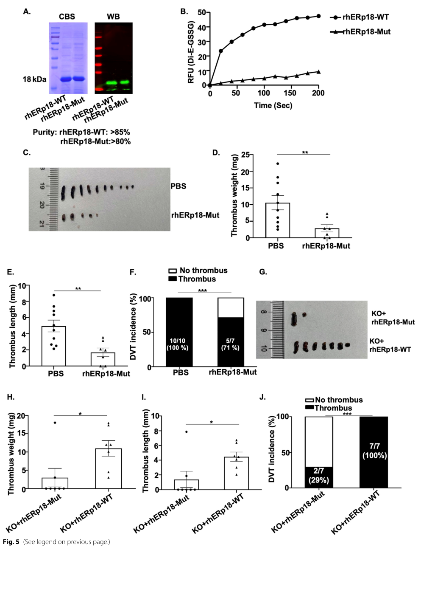

## Question

# Gene Research for Functional Annotation

## ⚠️ CRITICAL: Gene/Protein Identification Context

**BEFORE YOU BEGIN RESEARCH:** You MUST verify you are researching the CORRECT gene/protein. Gene symbols can be ambiguous, especially for less well-characterized genes from non-model organisms.

### Target Gene/Protein Identity (from UniProt):
- **UniProt Accession:** O95881
- **Protein Description:** RecName: Full=Thioredoxin domain-containing protein 12 {ECO:0000305|PubMed:12761212}; EC=1.8.4.2 {ECO:0000269|PubMed:12761212}; AltName: Full=Endoplasmic reticulum resident protein 18 {ECO:0000303|PubMed:12761212}; Short=ER protein 18 {ECO:0000303|PubMed:12761212}; Short=ERp18 {ECO:0000303|PubMed:12761212}; AltName: Full=Endoplasmic reticulum resident protein 19; Short=ER protein 19; Short=ERp19; AltName: Full=Thioredoxin-like protein p19; AltName: Full=hTLP19 {ECO:0000303|PubMed:14557066}; Flags: Precursor;
- **Gene Information:** Name=TXNDC12 {ECO:0000312|HGNC:HGNC:24626}; Synonyms=TLP19 {ECO:0000303|PubMed:14557066}; ORFNames=UNQ713/PRO1376;
- **Organism (full):** Homo sapiens (Human).
- **Protein Family:** Not specified in UniProt
- **Key Domains:** AGR/TXD. (IPR051099); ERp19. (IPR037462); Thioredoxin-like_fold. (IPR012336); Thioredoxin-like_sf. (IPR036249); Thioredoxin_CS. (IPR017937)

### MANDATORY VERIFICATION STEPS:

1. **Check if the gene symbol "TXNDC12" matches the protein description above**
2. **Verify the organism is correct:** Homo sapiens (Human).
3. **Check if protein family/domains align with what you find in literature**
4. **If you find literature for a DIFFERENT gene with the same or similar symbol, STOP**

### If Gene Symbol is Ambiguous or You Cannot Find Relevant Literature:

**DO NOT PROCEED WITH RESEARCH ON A DIFFERENT GENE.** Instead:
- State clearly: "The gene symbol 'TXNDC12' is ambiguous or literature is limited for this specific protein"
- Explain what you found (e.g., "Found extensive literature on a different gene with the same symbol in a different organism")
- Describe the protein based ONLY on the UniProt information provided above
- Suggest that the protein function can be inferred from domain/family information

### Research Target:

Please provide a comprehensive research report on the gene **TXNDC12** (gene ID: TXNDC12, UniProt: O95881) in human.

The research report should be a detailed narrative explaining the function, biological processes, and localization of the gene product. Citations should be given for all claims.

You should prioritize authoritative reviews and primary scientific literature when conducting research. You can supplement
this with annotations you find in gene/protein databases, but these can be outdated or inaccurate.

We are specifically interested in the primary function of the gene - for enzymes, what reaction is catalyzed, and what is the substrate specificity? For transporters, what is the substrate? For structural proteins or adapters, what is the broader structural role? For signaling molecules, what is the role in the pathway.

We are interested in where in or outside the cell the gene product carries out its function.

We are also interested in the signaling or biochemical pathways in which the gene functions. We are less interested in broad pleiotropic effects, except where these elucidate the precise role.

Include evidence where possible. We are interested in both experimental evidence as well as inference from structure, evolution, or bioinformatic analysis. Precise studies should be prioritized over high-throughput, where available.

## Output

Question: You are an expert researcher providing comprehensive, well-cited information.

Provide detailed information focusing on:
1. Key concepts and definitions with current understanding
2. Recent developments and latest research (prioritize 2023-2024 sources)
3. Current applications and real-world implementations
4. Expert opinions and analysis from authoritative sources
5. Relevant statistics and data from recent studies

Format as a comprehensive research report with proper citations. Include URLs and publication dates where available.
Always prioritize recent, authoritative sources and provide specific citations for all major claims.

# Gene Research for Functional Annotation

## ⚠️ CRITICAL: Gene/Protein Identification Context

**BEFORE YOU BEGIN RESEARCH:** You MUST verify you are researching the CORRECT gene/protein. Gene symbols can be ambiguous, especially for less well-characterized genes from non-model organisms.

### Target Gene/Protein Identity (from UniProt):
- **UniProt Accession:** O95881
- **Protein Description:** RecName: Full=Thioredoxin domain-containing protein 12 {ECO:0000305|PubMed:12761212}; EC=1.8.4.2 {ECO:0000269|PubMed:12761212}; AltName: Full=Endoplasmic reticulum resident protein 18 {ECO:0000303|PubMed:12761212}; Short=ER protein 18 {ECO:0000303|PubMed:12761212}; Short=ERp18 {ECO:0000303|PubMed:12761212}; AltName: Full=Endoplasmic reticulum resident protein 19; Short=ER protein 19; Short=ERp19; AltName: Full=Thioredoxin-like protein p19; AltName: Full=hTLP19 {ECO:0000303|PubMed:14557066}; Flags: Precursor;
- **Gene Information:** Name=TXNDC12 {ECO:0000312|HGNC:HGNC:24626}; Synonyms=TLP19 {ECO:0000303|PubMed:14557066}; ORFNames=UNQ713/PRO1376;
- **Organism (full):** Homo sapiens (Human).
- **Protein Family:** Not specified in UniProt
- **Key Domains:** AGR/TXD. (IPR051099); ERp19. (IPR037462); Thioredoxin-like_fold. (IPR012336); Thioredoxin-like_sf. (IPR036249); Thioredoxin_CS. (IPR017937)

### MANDATORY VERIFICATION STEPS:

1. **Check if the gene symbol "TXNDC12" matches the protein description above**
2. **Verify the organism is correct:** Homo sapiens (Human).
3. **Check if protein family/domains align with what you find in literature**
4. **If you find literature for a DIFFERENT gene with the same or similar symbol, STOP**

### If Gene Symbol is Ambiguous or You Cannot Find Relevant Literature:

**DO NOT PROCEED WITH RESEARCH ON A DIFFERENT GENE.** Instead:
- State clearly: "The gene symbol 'TXNDC12' is ambiguous or literature is limited for this specific protein"
- Explain what you found (e.g., "Found extensive literature on a different gene with the same symbol in a different organism")
- Describe the protein based ONLY on the UniProt information provided above
- Suggest that the protein function can be inferred from domain/family information

### Research Target:

Please provide a comprehensive research report on the gene **TXNDC12** (gene ID: TXNDC12, UniProt: O95881) in human.

The research report should be a detailed narrative explaining the function, biological processes, and localization of the gene product. Citations should be given for all claims.

You should prioritize authoritative reviews and primary scientific literature when conducting research. You can supplement
this with annotations you find in gene/protein databases, but these can be outdated or inaccurate.

We are specifically interested in the primary function of the gene - for enzymes, what reaction is catalyzed, and what is the substrate specificity? For transporters, what is the substrate? For structural proteins or adapters, what is the broader structural role? For signaling molecules, what is the role in the pathway.

We are interested in where in or outside the cell the gene product carries out its function.

We are also interested in the signaling or biochemical pathways in which the gene functions. We are less interested in broad pleiotropic effects, except where these elucidate the precise role.

Include evidence where possible. We are interested in both experimental evidence as well as inference from structure, evolution, or bioinformatic analysis. Precise studies should be prioritized over high-throughput, where available.

## Comprehensive research report: Human **TXNDC12** (ERp18; UniProt O95881)

### 0) Target verification (gene/protein identity)
The sources retrieved in this review consistently refer to **ERp18** as **TXNDC12** in **human**, describing it as a small ER thioredoxin/PDI-family oxidoreductase with a single **CGAC** active-site motif and an ER-retention signal (EDEL), aligning with the UniProt O95881 definition provided. (pierre2023investigatingtherole pages 36-41, he2024anovelrole pages 4-7)

---

### 1) Key concepts and definitions (current understanding)

#### 1.1 Thiol–disulfide oxidoreductases and the PDI family
Protein disulfide isomerase (PDI) family enzymes are defined by the presence of thioredoxin-like domains that typically contain an active-site **CXXC** motif, enabling **thiol–disulfide exchange** reactions that form, reduce, or rearrange disulfide bonds in substrate proteins. These reactions support **ER proteostasis** and are commonly linked to **ER stress** and the **unfolded protein response (UPR)**. (powell2021proteindisulphideisomerase pages 1-2)

#### 1.2 What TXNDC12/ERp18 is
The 2023 ATF6α-focused work describes ERp18/TXNDC12 as an **ER-resident**, **172-aa**, thioredoxin-fold **PDI-like protein** with a **single CGAC catalytic motif** near the N-terminus and a characteristic ER retention signal (EDEL). (pierre2023investigatingtherole pages 36-41)

---

### 2) Molecular function of TXNDC12/ERp18

#### 2.1 Enzymatic activity and catalytic motif
A 2024 primary study produced **recombinant human ERp18** in two forms—wild-type (WT) containing the **CGAC** motif and a catalytically inactive mutant in which **CGAC→SGAS**—and measured enzyme activity using a **Di-E-GSSG** assay. WT ERp18 displayed strong disulfide reductase activity, whereas the SGAS mutant lost this activity, supporting that ERp18 functions as a **thiol–disulfide oxidoreductase** and that the **CGAC** motif is required. (he2024anovelrole pages 4-7, he2024anovelrole pages 7-10)

The 2023 mechanistic UPR study also reports in vitro reductase activity and outlines assays used to probe ERp18 function (e.g., insulin reduction assay and redox shift assays). (pierre2023investigatingtherole pages 7-10, pierre2023investigatingtherole pages 6-7)

**Reaction/substrate specificity (what is known vs. unknown):**
* Direct evidence in the retrieved sources supports thiol–disulfide exchange activity, but does **not** provide classic enzyme kinetic constants (e.g., kcat/KM) or a comprehensive substrate repertoire.
* Mechanistic work supports **ATF6α** as a functionally relevant redox-regulated client pathway, with ERp18 forming mixed disulfides preferentially involving ATF6α C467 (see below). (pierre2023investigatingtherole pages 137-141)

#### 2.2 Experimentally supported partners/clients: ATF6α (UPR sensor)
The 2023 UPR-focused study provides multiple lines of evidence that ERp18 regulates **ATF6α** early in activation, via controlling ATF6α redox state and ER exit:

* ERp18 interacts with ATF6α during ER stress, and ERp18 knockout causes **non-canonical ATF6α processing**. (pierre2023investigatingtherole pages 7-10, pierre2023investigatingtherole pages 122-126)
* Under ER stress, ATF6α shifts from monomeric forms to a disulfide-linked dimer termed **“467D”**; this species traffics to the Golgi where S1P cleavage occurs. ERp18 overexpression antagonizes 467D formation, whereas ERp18 knockout enhances the monomer→467D shift, indicating ERp18 activity modulates the redox transition linked to trafficking. (pierre2023investigatingtherole pages 116-122, pierre2023investigatingtherole pages 1-6)
* Mixed-disulfide “substrate-trapping” logic supports ERp18 forming mixed disulfide intermediates biased toward **ATF6α C467**, consistent with ERp18 functioning as a **redox quality-control checkpoint** for ATF6α maturation/trafficking. (pierre2023investigatingtherole pages 137-141)

Together, these data support an experimentally grounded client relationship: ERp18 modulates ATF6α’s disulfide status, affecting ATF6α ER-to-Golgi trafficking and proteolytic activation during the UPR. (pierre2023investigatingtherole pages 133-137, pierre2023investigatingtherole pages 116-122)

---

### 3) Subcellular localization and where TXNDC12 acts

#### 3.1 ER residency (intracellular)
Cell-based evidence indicates ERp18 is **ER-localized** and functions in ER quality control/UPR signaling via ATF6α. (pierre2023investigatingtherole pages 7-10)

#### 3.2 Vascular/platelet surface and extracellular presence (context-dependent)
A 2024 thrombosis study reports ERp18 is detected in **endothelial cells, leukocytes, and platelets**, is present on the surface of **resting platelets** (with increased surface exposure upon activation), and can be released/secreted from activated platelets or endothelial cells, supporting a context in which ERp18 can act **extracellularly** in vascular biology. (he2024anovelrole pages 4-7, he2024anovelrole pages 7-10)

---

### 4) Pathways and biological roles

#### 4.1 Role in UPR signaling via ATF6α redox control (2023 mechanistic update)
The 2023 mechanistic work supports that ERp18 regulates the **ATF6 branch of the UPR** by controlling ATF6α redox status, oligomeric states, and trafficking competence. Loss of ERp18 dysregulates trafficking and proteolytic processing and yields a non-canonical cleavage product (ATF6-P), suggesting ERp18 supports correct ATF6α processing and quality control under stress. (pierre2023investigatingtherole pages 133-137, pierre2023investigatingtherole pages 122-126, pierre2023investigatingtherole pages 116-122)

#### 4.2 Role in venous thrombosis via catalytic activity and vWF release (2024 primary study)
A 2024 in vivo study used an inferior vena cava (IVC) stenosis model and reported that **ERp18 knockout (ERp18-KO)** mice developed **less venous thrombosis** than wild-type, with statistically significant reductions in thrombus weight/length/incidence (reported as *P<0.05 to ***P<0.001 depending on metric). (he2024anovelrole pages 7-10)

Mechanistically and causally:
* Recombinant **rhERp18-WT (CGAC)** versus catalytically inactive **rhERp18 mutant (SGAS)** experiments indicate that ERp18’s **enzymatic activity is required** for pro-thrombotic effects in this model. (he2024anovelrole pages 7-10)
* ERp18-KO mice had reduced **vWF** at thrombosis sites and within thrombi, while basal vWF was unchanged (ns in ELISA), supporting a model where ERp18 promotes **vWF release/exocytosis** rather than baseline vWF biosynthesis. (he2024anovelrole pages 7-10)

The figures from this study provide direct visual evidence for the **CGAC motif**, **Di-E-GSSG activity assay**, and in vivo thrombosis/vWF readouts. (he2024anovelrole media 70c97672, he2024anovelrole media f12e516c, he2024anovelrole media 3800f751)

---

### 5) Recent developments and latest research (prioritizing 2023–2024)

#### 5.1 2024: ERp18 as a catalytic driver of venous thrombosis
The most direct 2024 advance for TXNDC12 is the demonstration that ERp18 catalytic activity contributes to venous thrombosis in an in vivo model, and that the effect correlates with local vWF levels at thrombus sites. (he2024anovelrole pages 7-10)

Publication details: He et al., **2024**, *Thrombosis Journal*. DOI/URL: https://doi.org/10.1186/s12959-024-00678-5. (he2024anovelrole pages 7-10)

#### 5.2 2023: ERp18 redox checkpoint role in ATF6α activation
A 2023 thesis provides a mechanistic model in which ERp18 regulates ATF6α redox transitions (monomer↔467D dimer), trafficking, and cleavage during ER stress, and indicates active-site cysteine dependence for the regulatory effect. (pierre2023investigatingtherole pages 133-137, pierre2023investigatingtherole pages 116-122)

Publication details: Pierre, **2023**, University of Glasgow thesis. DOI/URL: https://doi.org/10.5525/gla.thesis.83614. (pierre2023investigatingtherole pages 36-41)

#### 5.3 2024: Cancer/oxidative stress/ferroptosis associations (evidence status)
Two 2024 cancer-focused papers mention TXNDC12, but the accessible excerpts provide mainly association or hypothesis-level support rather than detailed mechanistic or clinical-performance statistics:

* **Osteosarcoma prognostic signature:** TXNDC12 is included among five ER stress-related genes in a prognostic signature; in the excerpted analysis, higher TXNDC12 expression was associated with better overall survival in osteosarcoma. (chen2024constructionofan pages 11-15)
  * Chen et al., **2024**, *Journal of Translational Medicine*. DOI/URL: https://doi.org/10.1186/s12967-023-04794-0. (chen2024constructionofan pages 11-15)

* **Hepatocellular carcinoma oxidative-stress response:** TXNDC12 is discussed as an antioxidant/redox protein upregulated in a SOCS1-expressing HCC model and is referenced (via other literature) as a factor that can inhibit lipid peroxidation/ferroptosis. The excerpt does not provide quantitative clinical statistics for TXNDC12. (shukla2024thetumorsuppressor pages 18-20)
  * Shukla et al., **2024**, *Cancers*. DOI/URL: https://doi.org/10.3390/cancers16020292. (shukla2024thetumorsuppressor pages 18-20)

---

### 6) Current applications and real-world implementations

#### 6.1 Translational vascular biology / antithrombotic target hypothesis
The 2024 thrombosis study demonstrates that ERp18’s **catalytic activity** is necessary for its pro-thrombotic role in a mouse model and that vWF release is involved, implying ERp18 could be considered a candidate target for antithrombotic strategies (conceptually analogous to broader thiol-isomerase targeting approaches). However, the retrieved evidence stops short of clinical intervention trials in humans for ERp18/TXNDC12 specifically. (he2024anovelrole pages 7-10)

#### 6.2 Biomarker/prognostic signature usage (research-stage)
TXNDC12 appears as one component of an ER stress-related prognostic signature in osteosarcoma, representing a research-stage application of TXNDC12 expression in risk stratification. The excerpted material does not include AUC/hazard ratios for TXNDC12 alone, and clinical adoption would require independent validation. (chen2024constructionofan pages 11-15)

---

### 7) Expert opinions and analysis grounded in authoritative sources

#### 7.1 Functional interpretation from enzymology + pathway data
The combined 2023–2024 evidence supports a coherent annotation:

* **Primary biochemical function:** ERp18/TXNDC12 is a **thiol–disulfide oxidoreductase** with a single **CGAC** active site, capable of reductase activity in vitro and required for certain redox-regulated processes in cells and in vivo. (he2024anovelrole pages 7-10, pierre2023investigatingtherole pages 7-10)
* **Key pathway role (high-confidence):** ERp18 regulates the **ATF6α arm** of the UPR by controlling redox-dependent trafficking/processing; evidence includes interaction, redox-state modulation, and active-site dependence. (pierre2023investigatingtherole pages 133-137, pierre2023investigatingtherole pages 116-122)
* **Context-dependent extracellular/vascular role:** ERp18 can be surface-exposed/released by platelets and endothelial cells and promotes venous thrombosis, plausibly via thiol–disulfide remodeling of substrates that influence **vWF release**. While the precise extracellular substrates are not yet identified in the retrieved excerpts, the requirement for enzymatic activity supports a direct catalytic mechanism rather than a scaffolding-only role. (he2024anovelrole pages 7-10)

#### 7.2 Limitations and open questions (based on available evidence)
* **Substrate specificity remains incompletely mapped**: ATF6α redox regulation is supported, but additional direct substrates in thrombosis (or broader ER client proteins) are not identified in the retrieved materials. (he2024anovelrole pages 7-10, pierre2023investigatingtherole pages 122-126)
* **Cancer/ferroptosis links are suggestive** in the retrieved excerpts and require deeper inspection of the primary ferroptosis paper(s) referenced by Shukla et al. (not retrieved here) to quantify effect sizes and establish direct causality. (shukla2024thetumorsuppressor pages 18-20)

---

### 8) Relevant statistics and data (recent studies)

* **Venous thrombosis model (mouse, IVC stenosis):** ERp18 deficiency reduced thrombosis outcomes (thrombus weight/length/incidence) with reported statistical significance (*P<0.05; ***P<0.001; with n reported as ~6–8 depending on readout). (he2024anovelrole pages 7-10)
* **Enzymatic dependence:** In vivo rescue/perturbation with recombinant proteins showed the inactive SGAS mutant failed to support the pro-thrombotic effect observed with WT ERp18; enzyme activity was also supported by the Di-E-GSSG assay comparison of WT vs mutant. (he2024anovelrole pages 7-10, he2024anovelrole media 70c97672)
* **vWF measurements:** Local plasma/thrombus vWF was lower in ERp18-KO mice after stenosis, while basal plasma vWF was not significantly different (ns), consistent with an effect on vWF release in the thrombosis context. (he2024anovelrole pages 7-10)

---

### Evidence map (summary table)
The following table condenses the key claims, evidence, and sources.

| Category | Key findings (1-3 bullets) | Evidence/source | Publication (author year, DOI/URL) |
|---|---|---|---|
| Identity/domain | • Human TXNDC12 corresponds to ERp18, a small PDI/thioredoxin-like ER protein.  • Reported as 172 aa, with a single thioredoxin-fold catalytic domain and ER-retention signal EDEL.  • Family-level reviews place TXNDC12/ERp18 among PDI-family proteins that mediate thiol-disulfide exchange in ER proteostasis. | Pierre 2023 thesis; PDI family review (pierre2023investigatingtherole pages 36-41, powell2021proteindisulphideisomerase pages 1-2) | Pierre 2023, https://doi.org/10.5525/gla.thesis.83614; Powell & Foster 2021, https://doi.org/10.1002/cam4.3836 |
| Enzymatic activity | • Recombinant human ERp18 shows disulfide reductase activity in a Di-E-GSSG assay; catalytic mutant loses activity.  • Thesis evidence also reports in vitro reductase activity and insulin reduction assay framework.  • ERp18 is described as capable of catalyzing disulfide bond formation, reduction, and isomerization. | Recombinant-protein assay and thesis biochemical analyses (he2024anovelrole pages 4-7, pierre2023investigatingtherole pages 7-10, pierre2023investigatingtherole pages 36-41) | He et al. 2024, https://doi.org/10.1186/s12959-024-00678-5; Pierre 2023, https://doi.org/10.5525/gla.thesis.83614 |
| Active-site motif | • ERp18 contains a single CGAC catalytic motif.  • Mutation of CGAC to SGAS abolishes reductase activity and fails to support the pro-thrombotic function seen with WT protein.  • PDI-family reviews note catalytic CXXC motifs as the basis for thiol-disulfide exchange activity. | Catalytic-motif experiment and family review (he2024anovelrole pages 4-7, he2024anovelrole pages 7-10, powell2021proteindisulphideisomerase pages 1-2) | He et al. 2024, https://doi.org/10.1186/s12959-024-00678-5; Powell & Foster 2021, https://doi.org/10.1002/cam4.3836 |
| Localization | • ERp18 is ER-resident/ER-localized in cell-based studies.  • In thrombosis work, ERp18 is detected in endothelial cells, leukocytes, and platelets; present on resting platelet surfaces and surface exposure increases with activation.  • Activated platelets/endothelial cells can release or externalize ERp18, indicating extracellular activity in vascular settings. | Cell localization and vascular-cell expression studies (pierre2023investigatingtherole pages 7-10, he2024anovelrole pages 4-7, he2024anovelrole pages 7-10) | Pierre 2023, https://doi.org/10.5525/gla.thesis.83614; He et al. 2024, https://doi.org/10.1186/s12959-024-00678-5 |
| UPR/ATF6 mechanism | • ERp18 interacts with ATF6α during ER stress and regulates ATF6α redox state and ER-to-Golgi trafficking.  • ERp18 reductase activity antagonizes the monomer→467D disulfide-linked dimer shift; knockout enhances this shift and causes dysregulated/non-canonical ATF6α processing.  • Substrate-trapping evidence supports mixed-disulfide formation with ATF6α, biased toward C467, consistent with ERp18 acting as a redox quality-control checkpoint in early ATF6 activation. | ATF6-focused thesis experiments (pierre2023investigatingtherole pages 133-137, pierre2023investigatingtherole pages 116-122, pierre2023investigatingtherole pages 137-141, pierre2023investigatingtherole pages 1-6) | Pierre 2023, https://doi.org/10.5525/gla.thesis.83614 |
| Thrombosis findings | • ERp18 knockout mice develop reduced venous thrombosis in the IVC stenosis model, with lower thrombus weight, length, and incidence.  • WT recombinant ERp18, but not inactive SGAS mutant, supports pro-thrombotic effects, indicating catalytic activity is required.  • ERp18 deficiency lowers local plasma/thrombus vWF after stenosis while basal vWF is unchanged, suggesting regulation of vWF release/exocytosis rather than biosynthesis. | In vivo mouse model, enzymatic rescue, and vWF analyses (he2024anovelrole pages 7-10, he2024anovelrole pages 4-7, he2024anovelrole media 70c97672) | He et al. 2024, https://doi.org/10.1186/s12959-024-00678-5 |
| Cancer/ferroptosis associations | • In osteosarcoma, TXNDC12 is one of five genes in an ER-stress prognostic signature; higher TXNDC12 expression was associated with better overall survival in that cohort.  • In hepatocarcinoma-cell proteomic analysis, TXNDC12 is discussed as an antioxidant/redox protein and cited as a factor that may inhibit lipid peroxidation and ferroptosis.  • These 2024 sources provide association/mechanistic hypotheses rather than definitive TXNDC12-specific clinical implementation. | Prognostic-signature study and oxidative-stress/ferroptosis discussion (chen2024constructionofan pages 11-15, shukla2024thetumorsuppressor pages 18-20) | Chen et al. 2024, https://doi.org/10.1186/s12967-023-04794-0; Shukla et al. 2024, https://doi.org/10.3390/cancers16020292 |

*Table: This table summarizes the experimentally supported identity, molecular function, localization, UPR role, and disease associations of human TXNDC12/ERp18 using only the retrieved evidence snippets. It is useful as a compact evidence map for building the full research report.*

---

### Key references (with dates and URLs)
* He C. et al. **2024**. *A novel role for protein disulfide isomerase ERp18 in venous thrombosis*. **Thrombosis Journal**. https://doi.org/10.1186/s12959-024-00678-5 (he2024anovelrole pages 7-10)
* Pierre A.S. **2023**. *Investigating the role of ERp18 during activation of UPR sensor ATF6α* (thesis). https://doi.org/10.5525/gla.thesis.83614 (pierre2023investigatingtherole pages 36-41)
* Chen W. et al. **2024**. *Construction of an ER stress-related prognostic signature… osteosarcoma*. **Journal of Translational Medicine**. https://doi.org/10.1186/s12967-023-04794-0 (chen2024constructionofan pages 11-15)
* Shukla A. et al. **2024**. *SOCS1 diminishes tolerance to oxidative stress in hepatocellular carcinoma*. **Cancers**. https://doi.org/10.3390/cancers16020292 (shukla2024thetumorsuppressor pages 18-20)
* Powell L.E., Foster P.A. **2021**. *Protein disulphide isomerase inhibition as a potential cancer therapeutic strategy*. **Cancer Medicine**. https://doi.org/10.1002/cam4.3836 (powell2021proteindisulphideisomerase pages 1-2)

References

1. (pierre2023investigatingtherole pages 36-41): Arvin Shedrach Pierre. Investigating the role of erp18 during activation of upr sensor atf6α. Text, Jan 2023. URL: https://doi.org/10.5525/gla.thesis.83614, doi:10.5525/gla.thesis.83614. This article has 0 citations and is from a peer-reviewed journal.

2. (he2024anovelrole pages 4-7): Chao He, Aizhen Yang, Yuxin Zhang, Zhenzhen Zhao, Yi Lu, Jingyu Zhang, and Yi Wu. A novel role for protein disulfide isomerase erp18 in venous thrombosis. Thrombosis Journal, Dec 2024. URL: https://doi.org/10.1186/s12959-024-00678-5, doi:10.1186/s12959-024-00678-5. This article has 2 citations and is from a peer-reviewed journal.

3. (powell2021proteindisulphideisomerase pages 1-2): Lauren E. Powell and Paul A. Foster. Protein disulphide isomerase inhibition as a potential cancer therapeutic strategy. Cancer Medicine, 10:2812-2825, Mar 2021. URL: https://doi.org/10.1002/cam4.3836, doi:10.1002/cam4.3836. This article has 108 citations and is from a peer-reviewed journal.

4. (he2024anovelrole pages 7-10): Chao He, Aizhen Yang, Yuxin Zhang, Zhenzhen Zhao, Yi Lu, Jingyu Zhang, and Yi Wu. A novel role for protein disulfide isomerase erp18 in venous thrombosis. Thrombosis Journal, Dec 2024. URL: https://doi.org/10.1186/s12959-024-00678-5, doi:10.1186/s12959-024-00678-5. This article has 2 citations and is from a peer-reviewed journal.

5. (pierre2023investigatingtherole pages 7-10): Arvin Shedrach Pierre. Investigating the role of erp18 during activation of upr sensor atf6α. Text, Jan 2023. URL: https://doi.org/10.5525/gla.thesis.83614, doi:10.5525/gla.thesis.83614. This article has 0 citations and is from a peer-reviewed journal.

6. (pierre2023investigatingtherole pages 6-7): Arvin Shedrach Pierre. Investigating the role of erp18 during activation of upr sensor atf6α. Text, Jan 2023. URL: https://doi.org/10.5525/gla.thesis.83614, doi:10.5525/gla.thesis.83614. This article has 0 citations and is from a peer-reviewed journal.

7. (pierre2023investigatingtherole pages 137-141): Arvin Shedrach Pierre. Investigating the role of erp18 during activation of upr sensor atf6α. Text, Jan 2023. URL: https://doi.org/10.5525/gla.thesis.83614, doi:10.5525/gla.thesis.83614. This article has 0 citations and is from a peer-reviewed journal.

8. (pierre2023investigatingtherole pages 122-126): Arvin Shedrach Pierre. Investigating the role of erp18 during activation of upr sensor atf6α. Text, Jan 2023. URL: https://doi.org/10.5525/gla.thesis.83614, doi:10.5525/gla.thesis.83614. This article has 0 citations and is from a peer-reviewed journal.

9. (pierre2023investigatingtherole pages 116-122): Arvin Shedrach Pierre. Investigating the role of erp18 during activation of upr sensor atf6α. Text, Jan 2023. URL: https://doi.org/10.5525/gla.thesis.83614, doi:10.5525/gla.thesis.83614. This article has 0 citations and is from a peer-reviewed journal.

10. (pierre2023investigatingtherole pages 1-6): Arvin Shedrach Pierre. Investigating the role of erp18 during activation of upr sensor atf6α. Text, Jan 2023. URL: https://doi.org/10.5525/gla.thesis.83614, doi:10.5525/gla.thesis.83614. This article has 0 citations and is from a peer-reviewed journal.

11. (pierre2023investigatingtherole pages 133-137): Arvin Shedrach Pierre. Investigating the role of erp18 during activation of upr sensor atf6α. Text, Jan 2023. URL: https://doi.org/10.5525/gla.thesis.83614, doi:10.5525/gla.thesis.83614. This article has 0 citations and is from a peer-reviewed journal.

12. (he2024anovelrole media 70c97672): Chao He, Aizhen Yang, Yuxin Zhang, Zhenzhen Zhao, Yi Lu, Jingyu Zhang, and Yi Wu. A novel role for protein disulfide isomerase erp18 in venous thrombosis. Thrombosis Journal, Dec 2024. URL: https://doi.org/10.1186/s12959-024-00678-5, doi:10.1186/s12959-024-00678-5. This article has 2 citations and is from a peer-reviewed journal.

13. (he2024anovelrole media f12e516c): Chao He, Aizhen Yang, Yuxin Zhang, Zhenzhen Zhao, Yi Lu, Jingyu Zhang, and Yi Wu. A novel role for protein disulfide isomerase erp18 in venous thrombosis. Thrombosis Journal, Dec 2024. URL: https://doi.org/10.1186/s12959-024-00678-5, doi:10.1186/s12959-024-00678-5. This article has 2 citations and is from a peer-reviewed journal.

14. (he2024anovelrole media 3800f751): Chao He, Aizhen Yang, Yuxin Zhang, Zhenzhen Zhao, Yi Lu, Jingyu Zhang, and Yi Wu. A novel role for protein disulfide isomerase erp18 in venous thrombosis. Thrombosis Journal, Dec 2024. URL: https://doi.org/10.1186/s12959-024-00678-5, doi:10.1186/s12959-024-00678-5. This article has 2 citations and is from a peer-reviewed journal.

15. (chen2024constructionofan pages 11-15): Weidong Chen, Yan Liao, Pengxiao Sun, Jian Tu, Yutong Zou, Ji Fang, Ziyun Chen, Hongbo Li, Junkai Chen, Yuzhong Peng, Lili Wen, and Xianbiao Xie. Construction of an er stress-related prognostic signature for predicting prognosis and screening the effective anti-tumor drug in osteosarcoma. Journal of Translational Medicine, Jan 2024. URL: https://doi.org/10.1186/s12967-023-04794-0, doi:10.1186/s12967-023-04794-0. This article has 20 citations and is from a peer-reviewed journal.

16. (shukla2024thetumorsuppressor pages 18-20): Akhil Shukla, Md Gulam Musawwir Khan, Anny Armas Cayarga, Mozhdeh Namvarpour, Mohammad Mobarak H. Chowdhury, Dominique Levesque, Jean-François Lucier, François-Michel Boisvert, Sheela Ramanathan, and Subburaj Ilangumaran. The tumor suppressor socs1 diminishes tolerance to oxidative stress in hepatocellular carcinoma. Cancers, 16:292, Jan 2024. URL: https://doi.org/10.3390/cancers16020292, doi:10.3390/cancers16020292. This article has 6 citations.

## Artifacts

- [Edison artifact artifact-00](TXNDC12-deep-research-falcon_artifacts/artifact-00.md)

## Citations

1. powell2021proteindisulphideisomerase pages 1-2
2. pierre2023investigatingtherole pages 36-41
3. pierre2023investigatingtherole pages 137-141
4. pierre2023investigatingtherole pages 7-10
5. he2024anovelrole pages 7-10
6. chen2024constructionofan pages 11-15
7. shukla2024thetumorsuppressor pages 18-20
8. he2024anovelrole pages 4-7
9. pierre2023investigatingtherole pages 6-7
10. pierre2023investigatingtherole pages 122-126
11. pierre2023investigatingtherole pages 116-122
12. pierre2023investigatingtherole pages 1-6
13. pierre2023investigatingtherole pages 133-137
14. https://doi.org/10.1186/s12959-024-00678-5.
15. https://doi.org/10.5525/gla.thesis.83614.
16. https://doi.org/10.1186/s12967-023-04794-0.
17. https://doi.org/10.3390/cancers16020292.
18. https://doi.org/10.5525/gla.thesis.83614;
19. https://doi.org/10.1002/cam4.3836
20. https://doi.org/10.1186/s12959-024-00678-5;
21. https://doi.org/10.5525/gla.thesis.83614
22. https://doi.org/10.1186/s12959-024-00678-5
23. https://doi.org/10.1186/s12967-023-04794-0;
24. https://doi.org/10.3390/cancers16020292
25. https://doi.org/10.1186/s12967-023-04794-0
26. https://doi.org/10.5525/gla.thesis.83614,
27. https://doi.org/10.1186/s12959-024-00678-5,
28. https://doi.org/10.1002/cam4.3836,
29. https://doi.org/10.1186/s12967-023-04794-0,
30. https://doi.org/10.3390/cancers16020292,