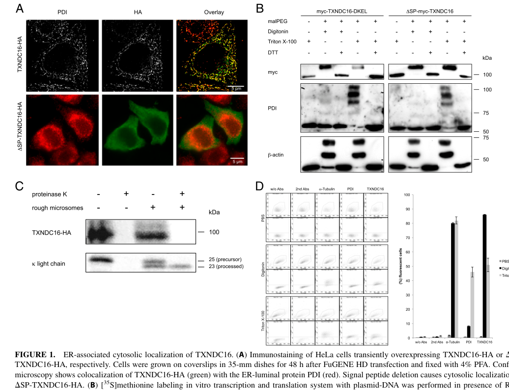

## Question

# Gene Research for Functional Annotation

## ⚠️ CRITICAL: Gene/Protein Identification Context

**BEFORE YOU BEGIN RESEARCH:** You MUST verify you are researching the CORRECT gene/protein. Gene symbols can be ambiguous, especially for less well-characterized genes from non-model organisms.

### Target Gene/Protein Identity (from UniProt):
- **UniProt Accession:** Q9P2K2
- **Protein Description:** RecName: Full=Thioredoxin domain-containing protein 16 {ECO:0000312|HGNC:HGNC:19965}; Flags: Precursor;
- **Gene Information:** Name=TXNDC16 {ECO:0000312|HGNC:HGNC:19965}; Synonyms=ERP90 {ECO:0000303|PubMed:21359175}, KIAA1344;
- **Organism (full):** Homo sapiens (Human).
- **Protein Family:** Not specified in UniProt
- **Key Domains:** Thioredoxin-like_sf. (IPR036249); Thioredoxin_domain. (IPR013766); TXNDC16. (IPR040090); TXNDC16_2nd. (IPR057642); TXNDC16_3rd. (IPR057645)

### MANDATORY VERIFICATION STEPS:

1. **Check if the gene symbol "TXNDC16" matches the protein description above**
2. **Verify the organism is correct:** Homo sapiens (Human).
3. **Check if protein family/domains align with what you find in literature**
4. **If you find literature for a DIFFERENT gene with the same or similar symbol, STOP**

### If Gene Symbol is Ambiguous or You Cannot Find Relevant Literature:

**DO NOT PROCEED WITH RESEARCH ON A DIFFERENT GENE.** Instead:
- State clearly: "The gene symbol 'TXNDC16' is ambiguous or literature is limited for this specific protein"
- Explain what you found (e.g., "Found extensive literature on a different gene with the same symbol in a different organism")
- Describe the protein based ONLY on the UniProt information provided above
- Suggest that the protein function can be inferred from domain/family information

### Research Target:

Please provide a comprehensive research report on the gene **TXNDC16** (gene ID: TXNDC16, UniProt: Q9P2K2) in human.

The research report should be a detailed narrative explaining the function, biological processes, and localization of the gene product. Citations should be given for all claims.

You should prioritize authoritative reviews and primary scientific literature when conducting research. You can supplement
this with annotations you find in gene/protein databases, but these can be outdated or inaccurate.

We are specifically interested in the primary function of the gene - for enzymes, what reaction is catalyzed, and what is the substrate specificity? For transporters, what is the substrate? For structural proteins or adapters, what is the broader structural role? For signaling molecules, what is the role in the pathway.

We are interested in where in or outside the cell the gene product carries out its function.

We are also interested in the signaling or biochemical pathways in which the gene functions. We are less interested in broad pleiotropic effects, except where these elucidate the precise role.

Include evidence where possible. We are interested in both experimental evidence as well as inference from structure, evolution, or bioinformatic analysis. Precise studies should be prioritized over high-throughput, where available.

## Output

Question: You are an expert researcher providing comprehensive, well-cited information.

Provide detailed information focusing on:
1. Key concepts and definitions with current understanding
2. Recent developments and latest research (prioritize 2023-2024 sources)
3. Current applications and real-world implementations
4. Expert opinions and analysis from authoritative sources
5. Relevant statistics and data from recent studies

Format as a comprehensive research report with proper citations. Include URLs and publication dates where available.
Always prioritize recent, authoritative sources and provide specific citations for all major claims.

# Gene Research for Functional Annotation

## ⚠️ CRITICAL: Gene/Protein Identification Context

**BEFORE YOU BEGIN RESEARCH:** You MUST verify you are researching the CORRECT gene/protein. Gene symbols can be ambiguous, especially for less well-characterized genes from non-model organisms.

### Target Gene/Protein Identity (from UniProt):
- **UniProt Accession:** Q9P2K2
- **Protein Description:** RecName: Full=Thioredoxin domain-containing protein 16 {ECO:0000312|HGNC:HGNC:19965}; Flags: Precursor;
- **Gene Information:** Name=TXNDC16 {ECO:0000312|HGNC:HGNC:19965}; Synonyms=ERP90 {ECO:0000303|PubMed:21359175}, KIAA1344;
- **Organism (full):** Homo sapiens (Human).
- **Protein Family:** Not specified in UniProt
- **Key Domains:** Thioredoxin-like_sf. (IPR036249); Thioredoxin_domain. (IPR013766); TXNDC16. (IPR040090); TXNDC16_2nd. (IPR057642); TXNDC16_3rd. (IPR057645)

### MANDATORY VERIFICATION STEPS:

1. **Check if the gene symbol "TXNDC16" matches the protein description above**
2. **Verify the organism is correct:** Homo sapiens (Human).
3. **Check if protein family/domains align with what you find in literature**
4. **If you find literature for a DIFFERENT gene with the same or similar symbol, STOP**

### If Gene Symbol is Ambiguous or You Cannot Find Relevant Literature:

**DO NOT PROCEED WITH RESEARCH ON A DIFFERENT GENE.** Instead:
- State clearly: "The gene symbol 'TXNDC16' is ambiguous or literature is limited for this specific protein"
- Explain what you found (e.g., "Found extensive literature on a different gene with the same symbol in a different organism")
- Describe the protein based ONLY on the UniProt information provided above
- Suggest that the protein function can be inferred from domain/family information

### Research Target:

Please provide a comprehensive research report on the gene **TXNDC16** (gene ID: TXNDC16, UniProt: Q9P2K2) in human.

The research report should be a detailed narrative explaining the function, biological processes, and localization of the gene product. Citations should be given for all claims.

You should prioritize authoritative reviews and primary scientific literature when conducting research. You can supplement
this with annotations you find in gene/protein databases, but these can be outdated or inaccurate.

We are specifically interested in the primary function of the gene - for enzymes, what reaction is catalyzed, and what is the substrate specificity? For transporters, what is the substrate? For structural proteins or adapters, what is the broader structural role? For signaling molecules, what is the role in the pathway.

We are interested in where in or outside the cell the gene product carries out its function.

We are also interested in the signaling or biochemical pathways in which the gene functions. We are less interested in broad pleiotropic effects, except where these elucidate the precise role.

Include evidence where possible. We are interested in both experimental evidence as well as inference from structure, evolution, or bioinformatic analysis. Precise studies should be prioritized over high-throughput, where available.

## Research report: Human **TXNDC16** (ERp90; UniProt **Q9P2K2**)—functional annotation, localization, pathways, and translational relevance

### 0) Target verification (mandatory)
The literature retrieved here is consistent with the requested target: **human TXNDC16** (thioredoxin domain-containing protein 16), also referred to as **ERp90**, and described as an **ER-luminal glycoprotein** with ER-targeting/retention features. This matches the UniProt-provided identity and the stated thioredoxin-like domain architecture. (harz2014secretionandimmunogenicity pages 1-2, oliveira2025endoplasmicreticulumredoxome pages 4-5)

### 1) Key concepts and definitions (current understanding)

#### 1.1 Thioredoxin-like / PDI-family-like proteins in the ER
Proteins with thioredoxin-like domains in the **endoplasmic reticulum (ER)** often participate in **oxidative protein folding**, **quality control**, and **ER-associated degradation (ERAD)**. Many have catalytic **CXXC** active-site motifs to mediate thiol–disulfide exchange; however, some members are **non-catalytic**, functioning as **scaffolds/adaptors** within folding/ERAD complexes rather than directly catalyzing disulfide chemistry. TXNDC16 is repeatedly placed in this ER oxidoreductase/quality-control context. (oliveira2025endoplasmicreticulumredoxome pages 4-5, patel2020oxidoreductasesinglycoprotein pages 7-9)

#### 1.2 ER targeting and retention/retrieval signals
Secretory-pathway proteins are typically targeted to the ER by an **N-terminal signal peptide**, enabling cotranslational ER translocation via SRP/Sec61 and signal-peptidase cleavage. ER luminal resident proteins commonly use C-terminal **KDEL-like motifs** for retrieval from the Golgi back to the ER, though these signals can be context-dependent or functionally masked. TXNDC16 includes a predicted signal peptide and a KDEL-variant (DKEL), but its retention can be incomplete. (harz2014secretionandimmunogenicity pages 2-3, harz2014secretionandimmunogenicity pages 6-6)

### 2) Molecular identity, domain architecture, and biochemical function

#### 2.1 Protein identity and size
TXNDC16 was described as having a molecular mass of **~93 kDa** (reference sequence cited in the primary paper) and being broadly expressed across normal and many cancer tissues. (harz2014secretionandimmunogenicity pages 1-2)

#### 2.2 Domain/motif-level functional inference: “thioredoxin-like but non-catalytic”
A key point for functional annotation is that TXNDC16/ERp90 contains multiple thioredoxin-like domains but is annotated in an authoritative ER folding/ERAD review as having **inactive/non-canonical Trx-like motifs** (e.g., CX8C, CX9C, CX6C rather than canonical catalytic CXXC). This is presented as evidence that ERp90 is **non-catalytic** (i.e., not a classical thiol–disulfide oxidoreductase enzyme), supporting a role as a **structural/complex component** in ER quality control rather than a substrate-specific oxidoreductase. (patel2020oxidoreductasesinglycoprotein pages 5-7, patel2020oxidoreductasesinglycoprotein pages 7-9)

**Implication for “primary function” request:** based on the retrieved sources, TXNDC16 is best described as a **PDI/thioredoxin-domain-containing ER quality-control factor** without a clearly defined catalytic reaction or specific substrate list; its functional evidence is stronger at the **pathway/complex level (ERAD association)** than at the **substrate-specific enzymology** level. (patel2020oxidoreductasesinglycoprotein pages 7-9, patel2020oxidoreductasesinglycoprotein pages 5-7)

### 3) Subcellular localization and trafficking

#### 3.1 ER localization (experimental evidence)
Harz et al. (2014, *J Immunol*, published online Aug 13, 2014; issue Sep 2014; https://doi.org/10.4049/jimmunol.1303098) performed confocal microscopy in human cells expressing TXNDC16-HA and reported **colocalization with PDI**, an ER-luminal marker, supporting ER localization. Deleting the first **27 amino acids** (the predicted signal peptide) shifted localization from ER-associated to **cytosolic**, showing the signal peptide is **required** for ER targeting. (harz2014secretionandimmunogenicity pages 3-4)

Visual evidence for ER localization and domain schematic is present in the paper’s figures. (harz2014secretionandimmunogenicity media 3c06b519, harz2014secretionandimmunogenicity media d160178d)

#### 3.2 ER retention vs secretion (unusual behavior)
Despite harboring a KDEL-like motif (DKEL), Harz et al. report that TXNDC16 can be **secreted** into supernatants from multiple human cell lines, and they interpret this as being due to a **masked/nonfunctional ER retrieval motif** (i.e., incomplete ER retention). They further report detection of TXNDC16 protein in **serum**, bound in **circulating immune complexes**, and discuss uncertainty regarding whether secretion is classical ER/Golgi-dependent or unconventional. They did **not** confirm a previously suggested exosomal secretion mechanism in HEK293 cells (CD63-marked fraction). (harz2014secretionandimmunogenicity pages 1-2, harz2014secretionandimmunogenicity pages 6-6, harz2014secretionandimmunogenicity pages 8-8)

### 4) Pathways and interaction partners (ERAD-focused)

#### 4.1 ERAD/retrotranslocation complexes
In a widely cited review on oxidoreductases in glycoprotein folding and ERAD (Patel et al., 2020, *Cells*, Sep 2020; https://doi.org/10.3390/cells9092138), TXNDC16 (ERp90) is specifically placed in the **ERAD (retrotranslocation)** category and described as **non-catalytic**. The review reports interactions/associations with the ERAD lectin **OS-9** and adaptor **SEL1L**, and positions ERp90 in assemblies alongside other ERAD redox/processing factors (e.g., ERdj5; ERFAD noted as NADPH-dependent reductase). This supports a model where TXNDC16 acts as a **component of ERAD machinery**—likely in recognition/scaffolding or organization of ERAD complexes—rather than directly performing thiol–disulfide catalysis. (patel2020oxidoreductasesinglycoprotein pages 5-7, patel2020oxidoreductasesinglycoprotein pages 7-9)

#### 4.2 Expert framing within the “ER redoxome”
A more recent review of the ER redoxome includes TXNDC16 among PDI/thioredoxin-domain-containing proteins (alias ERp90), reinforcing its placement within ER proteostasis/redox networks, while not adding TXNDC16-specific mechanistic detail in the excerpt retrieved. (oliveira2025endoplasmicreticulumredoxome pages 4-5)

### 5) Recent developments and latest research (prioritizing 2023–2024)

#### 5.1 2024 expert review: TXNDC16 in non-invasive meningioma biomarker development
Korte & Mathios (2024, *International Journal of Molecular Sciences*, Apr 2024; https://doi.org/10.3390/ijms25084195) review liquid biopsy approaches for meningioma and summarize prior TXNDC16 work as a meningioma-associated antigen. They cite evidence that a **panel of five TXNDC16 immunogenic epitopes** (derived from mapping **163 overlapping peptides**) could discriminate meningioma from healthy sera with **~90% sensitivity** and **~83.7% specificity**, framing this as a proof-of-concept **serology/autoantibody** liquid biopsy approach. They also provide expert cautions that tumor-associated antigen (TAA) autoantibodies can lack specificity across cancers or occur in autoimmunity/healthy individuals, implying that TXNDC16 would likely perform best as **part of multi-antigen panels** and within well-validated clinical workflows. (korte2024innovationinnoninvasive pages 7-9)

#### 5.2 2023–2024 TXNDC16 mechanistic biology: limited direct primary data retrieved
Within the retrieved 2023–2024 corpus, TXNDC16 appears mainly in review/omics contexts rather than in detailed mechanistic papers focused on TXNDC16. A 2024 PNAS study in mouse testis proteomics (in the context of multi-gene knockout in the WFDC cluster) notes **TXNDC16 upregulation** among proteins associated with **protein degradation/quality control**, which is directionally consistent with an ER quality-control role but is not TXNDC16-specific mechanistic proof in human cells. (kent2024largescalecrisprcas9deletions pages 8-9)

### 6) Current applications and real-world implementations

#### 6.1 Potential clinical application: serology-based meningioma liquid biopsy (not yet clinically validated)
The most concrete translational “implementation pathway” is **serum-based detection of anti-TXNDC16 autoantibodies** using peptide arrays or reduced epitope panels. This is supported by primary serology results (Harz et al. 2014) and positioned within the broader liquid biopsy landscape in a 2024 review, but remains a **proof-of-concept** rather than an approved clinical test. (harz2014secretionandimmunogenicity pages 6-7, korte2024innovationinnoninvasive pages 7-9)

#### 6.2 Systems/proteostasis application: inclusion in ERAD network models
In cell biology and proteostasis research, TXNDC16/ERp90 is used as a named component of the **ERAD retrotranslocation network** (OS-9/SEL1L-associated), which can guide experimental design (e.g., ERAD complex mapping, perturbation studies of ER proteostasis). This is a “real-world” research application as part of ERAD conceptual/interaction maps. (patel2020oxidoreductasesinglycoprotein pages 7-9)

### 7) Expert opinions and analysis (authoritative synthesis)

* **Non-catalytic classification:** Patel et al. (2020) explicitly characterize ERp90/TXNDC16 as **non-catalytic**, with inactive Trx-like motifs and placement in ERAD complexes with OS-9 and SEL1L; this constitutes a strong expert synthesis for functional inference in the absence of substrate-level enzymology. (patel2020oxidoreductasesinglycoprotein pages 7-9, patel2020oxidoreductasesinglycoprotein pages 5-7)
* **Biomarker caution:** Korte & Mathios (2024) highlight the promise of autoantibody-based detection but emphasize practical limitations (heterogeneity, cross-reactivity, and need for validation/panels), which is critical for interpreting TXNDC16 biomarker potential. (korte2024innovationinnoninvasive pages 7-9)

### 8) Statistics and quantitative data from studies

#### 8.1 Meningioma discrimination performance (primary data)
Harz et al. (2014, *J Immunol*; https://doi.org/10.4049/jimmunol.1303098) report that while no single TXNDC16 epitope was universally recognized, a **five-epitope** subset chosen from a **163-peptide** overlapping array discriminated meningioma vs controls with **~87.2% accuracy**, **~90% sensitivity**, and **~83.7% specificity**; using all peptides yielded substantially worse performance (**~53.8% accuracy**, **~24.2% specificity**, **~77.3% sensitivity**). These values are restated in the 2024 review as evidence supporting TXNDC16’s biomarker potential. (harz2014secretionandimmunogenicity pages 6-7, korte2024innovationinnoninvasive pages 7-9)

#### 8.2 Database-level disease association scores (interpret with caution)
Open Targets returns low association scores for TXNDC16 with several diseases (including meningioma and Alzheimer disease), but with **zero underlying evidence rows** in the retrieved output. These associations therefore should not be treated as strong evidence of causality or clinical utility without supporting primary genetics/functional studies. (OpenTargets Search: -TXNDC16)

### 9) Limitations and evidence gaps (important for functional annotation)
1. **Substrate/client specificity:** No retrieved primary study here defines specific substrates (“client proteins”) of TXNDC16 or a catalytic reaction with substrate specificity, consistent with its classification as **non-catalytic** in ERAD contexts. (patel2020oxidoreductasesinglycoprotein pages 7-9, patel2020oxidoreductasesinglycoprotein pages 5-7)
2. **Mechanistic depth in 2023–2024:** The most TXNDC16-relevant 2024 source retrieved is a review (meningioma liquid biopsy). More recent TXNDC16-centered mechanistic studies may exist but were not surfaced in the current retrieval results. (korte2024innovationinnoninvasive pages 7-9)
3. **Secretion biology unresolved:** TXNDC16 shows atypical retention/secretion behavior; the secretion route (classical vs unconventional) is not resolved in the primary study and likely depends on cell type and protein context. (harz2014secretionandimmunogenicity pages 8-8)

---

## Summary table of evidence

| Aspect | Finding | Best supporting citations |
|---|---|---|
| Identity/synonyms | **TXNDC16** is the human gene matching **UniProt Q9P2K2**; reported synonyms include **ERp90** and **KIAA1344**. Harz 2014 identifies TXNDC16 as a meningioma-associated antigen and notes it had previously been characterized as an **ER-luminal glycoprotein**. Harz 2014, *J Immunol*, published Sep 2014, URL: https://doi.org/10.4049/jimmunol.1303098 | (harz2014secretionandimmunogenicity pages 1-2) |
| Domains/motifs | TXNDC16/ERp90 is a **thioredoxin domain-containing, PDI-family-like** protein. Review evidence places it in the ER oxidoreductase network but notes its Trx-like motifs are **non-canonical/inactive** rather than classical catalytic CXXC motifs: **Trxl1-CX8C, Trxl2-CX9C, Trxl3-CX6C, Trxl4/5 inactive**. It also has a **predicted N-terminal 27 aa signal peptide** and a **C-terminal DKEL** KDEL-like motif. Patel 2020, *Cells*, Sep 2020, URL: https://doi.org/10.3390/cells9092138 | (patel2020oxidoreductasesinglycoprotein pages 5-7, harz2014secretionandimmunogenicity pages 2-3, harz2014secretionandimmunogenicity media 3c06b519) |
| Subcellular localization | Experimental data support predominant **ER luminal/ER-associated localization**. TXNDC16-HA **colocalizes with PDI** by confocal microscopy, and deleting the signal peptide shifts localization from ER-associated to **cytosolic**, showing signal-peptide-dependent ER targeting. Harz 2014, *J Immunol*, Sep 2014, URL: https://doi.org/10.4049/jimmunol.1303098 | (harz2014secretionandimmunogenicity pages 3-4, harz2014secretionandimmunogenicity media 3c06b519) |
| Secretion/extracellular presence | Despite ER-targeting features, TXNDC16 is also reported in **cell-culture supernatants** and **serum/circulating immune complexes**. Harz 2014 concluded secretion likely reflects a **masked/nonfunctional ER retrieval motif**; the authors could not confirm prior **exosomal** secretion in HEK293 cells. Korte 2024 highlights this as a basis for liquid-biopsy interest. Korte 2024, *Int J Mol Sci*, Apr 2024, URL: https://doi.org/10.3390/ijms25084195 | (harz2014secretionandimmunogenicity pages 1-2, harz2014secretionandimmunogenicity pages 6-6, harz2014secretionandimmunogenicity pages 8-8, korte2024innovationinnoninvasive pages 7-9, harz2014secretionandimmunogenicity pages 6-7) |
| Proposed molecular function | Current evidence supports TXNDC16 as an **ER quality-control/thioredoxin-like scaffold or chaperone-associated factor**, not a well-established classical oxidoreductase enzyme. Because its Trx-like domains lack canonical catalytic motifs, the strongest inference is a role in **ER protein folding/quality control and ERAD-associated processes**, rather than a defined substrate-specific disulfide isomerase reaction. Patel 2020, *Cells*, Sep 2020, URL: https://doi.org/10.3390/cells9092138 | (patel2020oxidoreductasesinglycoprotein pages 5-7, oliveira2025endoplasmicreticulumredoxome pages 4-5) |
| Interactions/complexes | TXNDC16/ERp90 is specifically linked to **ERAD retrotranslocation machinery**, with reported interactions involving **OS-9** and **SEL1L** in review summaries of ER glycoprotein quality control. This places TXNDC16 in pathways handling **misfolded glycoproteins** in the ER. Patel 2020, *Cells*, Sep 2020, URL: https://doi.org/10.3390/cells9092138 | (patel2020oxidoreductasesinglycoprotein pages 5-7) |
| Disease/biomarker evidence | The clearest disease-relevant evidence is in **meningioma serology**. TXNDC16 was identified as a **meningioma-associated antigen** with autoantibody reactivity; Korte 2024 reviews it as a **proof-of-concept liquid biopsy biomarker** based on serum autoantibodies/peptide arrays. Open Targets currently lists only **very weak association scores with zero underlying evidence rows** for diseases including meningioma, Alzheimer disease, chronic kidney disease, eye disease, and tinnitus, so these database associations should be treated cautiously. Open Targets query context available in this session. | (korte2024innovationinnoninvasive pages 7-9, harz2014secretionandimmunogenicity pages 6-7, OpenTargets Search: -TXNDC16) |
| Key statistics | Harz 2014 reports TXNDC16 has a **~93 kDa** predicted molecular mass and that a **5-epitope panel** derived from **163 overlapping peptides** discriminated meningioma vs controls with **87.2% accuracy**, **90% sensitivity**, and **83.7% specificity**; using all peptides performed much worse (**53.8% accuracy**, **24.2% specificity**, **77.3% sensitivity**). Korte 2024 reiterates the approximate **90% sensitivity / 83.7% specificity** result as support for non-invasive biomarker development. Harz 2014, *J Immunol*, Sep 2014, URL: https://doi.org/10.4049/jimmunol.1303098; Korte 2024, *Int J Mol Sci*, Apr 2024, URL: https://doi.org/10.3390/ijms25084195 | (harz2014secretionandimmunogenicity pages 1-2, korte2024innovationinnoninvasive pages 7-9, harz2014secretionandimmunogenicity pages 6-7) |

*Table: This table summarizes the strongest available functional annotation evidence for human TXNDC16/ERp90, including identity verification, ER localization, inferred molecular role, ERAD associations, and current biomarker evidence. It is useful for distinguishing well-supported findings from weaker database-level disease associations.*

---

## Key sources (with dates and URLs)
1. Harz C. et al. **“Secretion and Immunogenicity of the Meningioma-Associated Antigen TXNDC16.”** *The Journal of Immunology* (prepublished online 13 Aug 2014; issue Sep 2014). https://doi.org/10.4049/jimmunol.1303098 (harz2014secretionandimmunogenicity pages 1-2)
2. Patel C. et al. **“Oxidoreductases in Glycoprotein Glycosylation, Folding, and ERAD.”** *Cells* (Sep 2020). https://doi.org/10.3390/cells9092138 (patel2020oxidoreductasesinglycoprotein pages 5-7)
3. Korte B., Mathios D. **“Innovation in Non-Invasive Diagnosis and Disease Monitoring for Meningiomas.”** *International Journal of Molecular Sciences* (Apr 2024). https://doi.org/10.3390/ijms25084195 (korte2024innovationinnoninvasive pages 7-9)
4. Open Targets Platform: TXNDC16 disease associations (query output in this session; evidence rows absent). https://platform.opentargets.org/ (OpenTargets Search: -TXNDC16)

References

1. (harz2014secretionandimmunogenicity pages 1-2): Christian Harz, Nicole Ludwig, Sven Lang, Tamara V. Werner, Valentina Galata, Christina Backes, Katja Schmitt, Ruth Nickels, Elmar Krause, Martin Jung, Jens Rettig, Andreas Keller, Michael Menger, Richard Zimmermann, and Eckart Meese. Secretion and immunogenicity of the meningioma-associated antigen txndc16. The Journal of Immunology, 193:3146-3154, Sep 2014. URL: https://doi.org/10.4049/jimmunol.1303098, doi:10.4049/jimmunol.1303098. This article has 10 citations.

2. (oliveira2025endoplasmicreticulumredoxome pages 4-5): Percillia V. S. Oliveira, Tiphany C. De Bessa, and Francisco R. M. Laurindo. Endoplasmic reticulum redoxome: protein folding and beyond. Biochemistry, 65(1):1-30, Dec 2025. URL: https://doi.org/10.1021/acs.biochem.5c00527, doi:10.1021/acs.biochem.5c00527. This article has 7 citations and is from a peer-reviewed journal.

3. (patel2020oxidoreductasesinglycoprotein pages 7-9): Chaitanya Patel, Haddas Saad, Marina Shenkman, and Gerardo Z. Lederkremer. Oxidoreductases in glycoprotein glycosylation, folding, and erad. Sep 2020. URL: https://doi.org/10.3390/cells9092138, doi:10.3390/cells9092138. This article has 33 citations.

4. (harz2014secretionandimmunogenicity pages 2-3): Christian Harz, Nicole Ludwig, Sven Lang, Tamara V. Werner, Valentina Galata, Christina Backes, Katja Schmitt, Ruth Nickels, Elmar Krause, Martin Jung, Jens Rettig, Andreas Keller, Michael Menger, Richard Zimmermann, and Eckart Meese. Secretion and immunogenicity of the meningioma-associated antigen txndc16. The Journal of Immunology, 193:3146-3154, Sep 2014. URL: https://doi.org/10.4049/jimmunol.1303098, doi:10.4049/jimmunol.1303098. This article has 10 citations.

5. (harz2014secretionandimmunogenicity pages 6-6): Christian Harz, Nicole Ludwig, Sven Lang, Tamara V. Werner, Valentina Galata, Christina Backes, Katja Schmitt, Ruth Nickels, Elmar Krause, Martin Jung, Jens Rettig, Andreas Keller, Michael Menger, Richard Zimmermann, and Eckart Meese. Secretion and immunogenicity of the meningioma-associated antigen txndc16. The Journal of Immunology, 193:3146-3154, Sep 2014. URL: https://doi.org/10.4049/jimmunol.1303098, doi:10.4049/jimmunol.1303098. This article has 10 citations.

6. (patel2020oxidoreductasesinglycoprotein pages 5-7): Chaitanya Patel, Haddas Saad, Marina Shenkman, and Gerardo Z. Lederkremer. Oxidoreductases in glycoprotein glycosylation, folding, and erad. Sep 2020. URL: https://doi.org/10.3390/cells9092138, doi:10.3390/cells9092138. This article has 33 citations.

7. (harz2014secretionandimmunogenicity pages 3-4): Christian Harz, Nicole Ludwig, Sven Lang, Tamara V. Werner, Valentina Galata, Christina Backes, Katja Schmitt, Ruth Nickels, Elmar Krause, Martin Jung, Jens Rettig, Andreas Keller, Michael Menger, Richard Zimmermann, and Eckart Meese. Secretion and immunogenicity of the meningioma-associated antigen txndc16. The Journal of Immunology, 193:3146-3154, Sep 2014. URL: https://doi.org/10.4049/jimmunol.1303098, doi:10.4049/jimmunol.1303098. This article has 10 citations.

8. (harz2014secretionandimmunogenicity media 3c06b519): Christian Harz, Nicole Ludwig, Sven Lang, Tamara V. Werner, Valentina Galata, Christina Backes, Katja Schmitt, Ruth Nickels, Elmar Krause, Martin Jung, Jens Rettig, Andreas Keller, Michael Menger, Richard Zimmermann, and Eckart Meese. Secretion and immunogenicity of the meningioma-associated antigen txndc16. The Journal of Immunology, 193:3146-3154, Sep 2014. URL: https://doi.org/10.4049/jimmunol.1303098, doi:10.4049/jimmunol.1303098. This article has 10 citations.

9. (harz2014secretionandimmunogenicity media d160178d): Christian Harz, Nicole Ludwig, Sven Lang, Tamara V. Werner, Valentina Galata, Christina Backes, Katja Schmitt, Ruth Nickels, Elmar Krause, Martin Jung, Jens Rettig, Andreas Keller, Michael Menger, Richard Zimmermann, and Eckart Meese. Secretion and immunogenicity of the meningioma-associated antigen txndc16. The Journal of Immunology, 193:3146-3154, Sep 2014. URL: https://doi.org/10.4049/jimmunol.1303098, doi:10.4049/jimmunol.1303098. This article has 10 citations.

10. (harz2014secretionandimmunogenicity pages 8-8): Christian Harz, Nicole Ludwig, Sven Lang, Tamara V. Werner, Valentina Galata, Christina Backes, Katja Schmitt, Ruth Nickels, Elmar Krause, Martin Jung, Jens Rettig, Andreas Keller, Michael Menger, Richard Zimmermann, and Eckart Meese. Secretion and immunogenicity of the meningioma-associated antigen txndc16. The Journal of Immunology, 193:3146-3154, Sep 2014. URL: https://doi.org/10.4049/jimmunol.1303098, doi:10.4049/jimmunol.1303098. This article has 10 citations.

11. (korte2024innovationinnoninvasive pages 7-9): Brianna Korte and Dimitrios Mathios. Innovation in non-invasive diagnosis and disease monitoring for meningiomas. International Journal of Molecular Sciences, 25:4195, Apr 2024. URL: https://doi.org/10.3390/ijms25084195, doi:10.3390/ijms25084195. This article has 11 citations.

12. (kent2024largescalecrisprcas9deletions pages 8-9): Katarzyna Kent, Kaori Nozawa, Rachel Parkes, Laura Dean, Frey Daniel, Mei Leng, Antrix Jain, Anna Malovannaya, Martin M. Matzuk, and Thomas X. Garcia. Large-scale crispr/cas9 deletions within the wfdc gene cluster uncover gene functionality and critical roles in mammalian reproduction. Proceedings of the National Academy of Sciences of the United States of America, Dec 2024. URL: https://doi.org/10.1073/pnas.2413195121, doi:10.1073/pnas.2413195121. This article has 10 citations and is from a highest quality peer-reviewed journal.

13. (harz2014secretionandimmunogenicity pages 6-7): Christian Harz, Nicole Ludwig, Sven Lang, Tamara V. Werner, Valentina Galata, Christina Backes, Katja Schmitt, Ruth Nickels, Elmar Krause, Martin Jung, Jens Rettig, Andreas Keller, Michael Menger, Richard Zimmermann, and Eckart Meese. Secretion and immunogenicity of the meningioma-associated antigen txndc16. The Journal of Immunology, 193:3146-3154, Sep 2014. URL: https://doi.org/10.4049/jimmunol.1303098, doi:10.4049/jimmunol.1303098. This article has 10 citations.

14. (OpenTargets Search: -TXNDC16): Open Targets Query (-TXNDC16, 5 results). Buniello, A. et al. (2025). Open Targets Platform: facilitating therapeutic hypotheses building in drug discovery. Nucleic Acids Research.

## Artifacts

- [Edison artifact artifact-00](TXNDC16-deep-research-falcon_artifacts/artifact-00.md)

## Citations

1. harz2014secretionandimmunogenicity pages 1-2
2. harz2014secretionandimmunogenicity pages 3-4
3. oliveira2025endoplasmicreticulumredoxome pages 4-5
4. korte2024innovationinnoninvasive pages 7-9
5. patel2020oxidoreductasesinglycoprotein pages 7-9
6. harz2014secretionandimmunogenicity pages 8-8
7. patel2020oxidoreductasesinglycoprotein pages 5-7
8. harz2014secretionandimmunogenicity pages 2-3
9. harz2014secretionandimmunogenicity pages 6-6
10. harz2014secretionandimmunogenicity pages 6-7
11. https://doi.org/10.4049/jimmunol.1303098
12. https://doi.org/10.3390/cells9092138
13. https://doi.org/10.3390/ijms25084195
14. https://doi.org/10.4049/jimmunol.1303098;
15. https://platform.opentargets.org/
16. https://doi.org/10.4049/jimmunol.1303098,
17. https://doi.org/10.1021/acs.biochem.5c00527,
18. https://doi.org/10.3390/cells9092138,
19. https://doi.org/10.3390/ijms25084195,
20. https://doi.org/10.1073/pnas.2413195121,