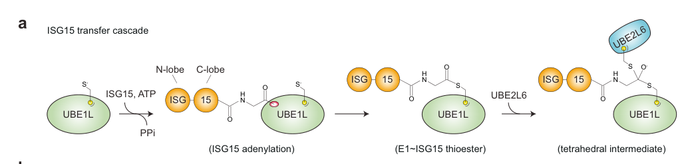

## Question

# Gene Research for Functional Annotation

## ⚠️ CRITICAL: Gene/Protein Identification Context

**BEFORE YOU BEGIN RESEARCH:** You MUST verify you are researching the CORRECT gene/protein. Gene symbols can be ambiguous, especially for less well-characterized genes from non-model organisms.

### Target Gene/Protein Identity (from UniProt):
- **UniProt Accession:** P41226
- **Protein Description:** RecName: Full=Ubiquitin-like modifier-activating enzyme 7; Short=Ubiquitin-activating enzyme 7; EC=6.2.1.- {ECO:0000250|UniProtKB:Q9DBK7}; AltName: Full=D8; AltName: Full=Ubiquitin-activating enzyme E1 homolog;
- **Gene Information:** Name=UBA7 {ECO:0000303|PubMed:28397838, ECO:0000312|HGNC:HGNC:12471}; Synonyms=UBE1L, UBE2;
- **Organism (full):** Homo sapiens (Human).
- **Protein Family:** Belongs to the ubiquitin-activating E1 family.
- **Key Domains:** E1_4HB. (IPR032420); E1_FCCH. (IPR032418); E1_FCCH_sf. (IPR042302); ThiF/MoeB/HesA. (IPR045886); ThiF_NAD_FAD-bd. (IPR000594)

### MANDATORY VERIFICATION STEPS:

1. **Check if the gene symbol "UBA7" matches the protein description above**
2. **Verify the organism is correct:** Homo sapiens (Human).
3. **Check if protein family/domains align with what you find in literature**
4. **If you find literature for a DIFFERENT gene with the same or similar symbol, STOP**

### If Gene Symbol is Ambiguous or You Cannot Find Relevant Literature:

**DO NOT PROCEED WITH RESEARCH ON A DIFFERENT GENE.** Instead:
- State clearly: "The gene symbol 'UBA7' is ambiguous or literature is limited for this specific protein"
- Explain what you found (e.g., "Found extensive literature on a different gene with the same symbol in a different organism")
- Describe the protein based ONLY on the UniProt information provided above
- Suggest that the protein function can be inferred from domain/family information

### Research Target:

Please provide a comprehensive research report on the gene **UBA7** (gene ID: UBA7, UniProt: P41226) in human.

The research report should be a detailed narrative explaining the function, biological processes, and localization of the gene product. Citations should be given for all claims.

You should prioritize authoritative reviews and primary scientific literature when conducting research. You can supplement
this with annotations you find in gene/protein databases, but these can be outdated or inaccurate.

We are specifically interested in the primary function of the gene - for enzymes, what reaction is catalyzed, and what is the substrate specificity? For transporters, what is the substrate? For structural proteins or adapters, what is the broader structural role? For signaling molecules, what is the role in the pathway.

We are interested in where in or outside the cell the gene product carries out its function.

We are also interested in the signaling or biochemical pathways in which the gene functions. We are less interested in broad pleiotropic effects, except where these elucidate the precise role.

Include evidence where possible. We are interested in both experimental evidence as well as inference from structure, evolution, or bioinformatic analysis. Precise studies should be prioritized over high-throughput, where available.

## Output

Question: You are an expert researcher providing comprehensive, well-cited information.

Provide detailed information focusing on:
1. Key concepts and definitions with current understanding
2. Recent developments and latest research (prioritize 2023-2024 sources)
3. Current applications and real-world implementations
4. Expert opinions and analysis from authoritative sources
5. Relevant statistics and data from recent studies

Format as a comprehensive research report with proper citations. Include URLs and publication dates where available.
Always prioritize recent, authoritative sources and provide specific citations for all major claims.

# Gene Research for Functional Annotation

## ⚠️ CRITICAL: Gene/Protein Identification Context

**BEFORE YOU BEGIN RESEARCH:** You MUST verify you are researching the CORRECT gene/protein. Gene symbols can be ambiguous, especially for less well-characterized genes from non-model organisms.

### Target Gene/Protein Identity (from UniProt):
- **UniProt Accession:** P41226
- **Protein Description:** RecName: Full=Ubiquitin-like modifier-activating enzyme 7; Short=Ubiquitin-activating enzyme 7; EC=6.2.1.- {ECO:0000250|UniProtKB:Q9DBK7}; AltName: Full=D8; AltName: Full=Ubiquitin-activating enzyme E1 homolog;
- **Gene Information:** Name=UBA7 {ECO:0000303|PubMed:28397838, ECO:0000312|HGNC:HGNC:12471}; Synonyms=UBE1L, UBE2;
- **Organism (full):** Homo sapiens (Human).
- **Protein Family:** Belongs to the ubiquitin-activating E1 family.
- **Key Domains:** E1_4HB. (IPR032420); E1_FCCH. (IPR032418); E1_FCCH_sf. (IPR042302); ThiF/MoeB/HesA. (IPR045886); ThiF_NAD_FAD-bd. (IPR000594)

### MANDATORY VERIFICATION STEPS:

1. **Check if the gene symbol "UBA7" matches the protein description above**
2. **Verify the organism is correct:** Homo sapiens (Human).
3. **Check if protein family/domains align with what you find in literature**
4. **If you find literature for a DIFFERENT gene with the same or similar symbol, STOP**

### If Gene Symbol is Ambiguous or You Cannot Find Relevant Literature:

**DO NOT PROCEED WITH RESEARCH ON A DIFFERENT GENE.** Instead:
- State clearly: "The gene symbol 'UBA7' is ambiguous or literature is limited for this specific protein"
- Explain what you found (e.g., "Found extensive literature on a different gene with the same symbol in a different organism")
- Describe the protein based ONLY on the UniProt information provided above
- Suggest that the protein function can be inferred from domain/family information

### Research Target:

Please provide a comprehensive research report on the gene **UBA7** (gene ID: UBA7, UniProt: P41226) in human.

The research report should be a detailed narrative explaining the function, biological processes, and localization of the gene product. Citations should be given for all claims.

You should prioritize authoritative reviews and primary scientific literature when conducting research. You can supplement
this with annotations you find in gene/protein databases, but these can be outdated or inaccurate.

We are specifically interested in the primary function of the gene - for enzymes, what reaction is catalyzed, and what is the substrate specificity? For transporters, what is the substrate? For structural proteins or adapters, what is the broader structural role? For signaling molecules, what is the role in the pathway.

We are interested in where in or outside the cell the gene product carries out its function.

We are also interested in the signaling or biochemical pathways in which the gene functions. We are less interested in broad pleiotropic effects, except where these elucidate the precise role.

Include evidence where possible. We are interested in both experimental evidence as well as inference from structure, evolution, or bioinformatic analysis. Precise studies should be prioritized over high-throughput, where available.

# Research Report: Human **UBA7 / UBE1L** (UniProt **P41226**) — Functional Annotation and Current Understanding

## 1) Target identity verification (critical)
The literature retrieved and analyzed corresponds to the *human* gene **UBA7** (synonyms **UBE1L**, “ubiquitin-like modifier-activating enzyme 7”), which functions as the **E1 activating enzyme in the ISG15 conjugation (ISGylation) pathway**. This matches the UniProt accession **P41226** description (E1-family enzyme with E1-like domains) and is consistently used in recent structural and functional studies. (afsar2023cryoemstructuresof pages 1-2, wallace2023insightsintothe pages 1-2, madaan2024isgylationenhancesdsrnainduced pages 1-2)

## 2) Key concepts and definitions (current consensus)
### 2.1 ISG15 and ISGylation
**ISG15** is an interferon-stimulated ubiquitin-like (UBL) protein produced as a precursor that is proteolytically matured to expose a C-terminal glycine motif required for conjugation (often described as LR(L/R)GG, depending on review). (sarkar2023isg15itsroles pages 1-2, alvarez2024unveilingthemultifaceted pages 2-4)

**ISGylation** is defined as a reversible post-translational modification in which ISG15 is covalently conjugated to lysine residues on substrate proteins via an E1–E2–E3 enzyme cascade analogous to ubiquitination but largely distinct in biological outcomes. (sarkar2023isg15itsroles pages 1-2, bonacci2025digdubsmechanismsand pages 2-3, alvarez2024unveilingthemultifaceted pages 2-4)

### 2.2 Where UBA7 fits
UBA7/UBE1L is the **E1 enzyme** that performs the **first step** in the ISGylation cascade: it activates ISG15 for transfer to the E2 enzyme. A recent primary study explicitly states that **UBA7/UBE1L encodes the only ISG15-activating enzyme identified to date**. (madaan2024isgylationenhancesdsrnainduced pages 1-2)

## 3) Biochemical function: reaction catalyzed and substrate specificity
### 3.1 Reaction catalyzed (E1 chemistry)
Recent high-resolution structural and biochemical work supports that human UBA7 follows the canonical E1 mechanism for UBL activation:

1. **ATP-dependent adenylation** of the ISG15 C-terminus (forming an ISG15 adenylate intermediate).
2. Formation of an **E1~ISG15 thioester** at the UBA7 catalytic cysteine.
3. **Transthiolation (E1→E2 transfer)** to the catalytic cysteine of the cognate E2, **UBE2L6 (UbcH8)**, generating **UBE2L6~ISG15**, which then supports E3-mediated isopeptide bond formation on substrates. (afsar2023cryoemstructuresof pages 1-2, wallace2023insightsintothe pages 1-2, wallace2023insightsintothe pages 10-11)

Wallace et al. (Nature Communications; published 2023-12; https://doi.org/10.1038/s41467-023-43711-3) report in vitro charging and transfer assays with explicit time courses (0–900 s) and representative concentrations/conditions (e.g., E1 charging with **2.5 µM UBE1L** and **3 µM ISG15**; multi-turnover assays with **0.25 µM UBE1L**, **2 µM UBE2L6**, **5 µM ISG15**, 25 °C), anchoring these mechanistic steps experimentally. (wallace2023insightsintothe pages 10-11, wallace2023insightsintothe pages 6-7)

### 3.2 Substrate specificity (ISG15 versus ubiquitin)
UBA7 is widely treated as an **ISG15-dedicated E1**, contrasted with the ubiquitin E1 UBA1 in parallel biochemical contexts. (clancy2023isgylationindependentprotectionof pages 1-2, wallace2023insightsintothe pages 10-11)

Mechanistic specificity determinants were clarified by 2023 cryo-EM structural studies:

* **ISG15’s C-terminal UBL domain (“C-lobe”)** makes an extensive interaction network with UBA7’s adenylation region, whereas the **ISG15 N-lobe is dispensable** for forming E1 and E2 thioesters (i.e., activation and E1→E2 transfer can proceed without the N-lobe contribution). (wallace2023insightsintothe pages 6-7)
* An **ISG15 Thr125 patch** functions as a negative selector against mis-activation by the ubiquitin E1 **UBA1**, contributing to pathway fidelity (ISG15 charging by the “wrong” E1). (wallace2023insightsintothe pages 6-7)
* Wallace et al. further demonstrated that engineered **ISG15 and UBE2L6 mutants** can shift selectivity between ISG15 and ubiquitin conjugation pathways, implying specificity is encoded by defined interface determinants rather than generic E1 chemistry. (wallace2023insightsintothe pages 1-2, wallace2023insightsintothe pages 6-7)

Two complementary 2023 Nature Communications papers provided structural snapshots of UBA7/UBE1L complexes with ISG15 intermediates and UBE2L6 that together explain how specificity is achieved for **both the modifier (ISG15)** and the **cognate E2 (UBE2L6)**. (afsar2023cryoemstructuresof pages 1-2, wallace2023insightsintothe pages 1-2)

## 4) Pathway partners, biological processes, and (inferred) localization
### 4.1 Core E2 and E3 partners
**E2 partner (required for downstream conjugation):**
* **UBE2L6 / UbcH8** is the canonical cognate E2 for ISG15 transfer from UBA7. (afsar2023cryoemstructuresof pages 1-2, wallace2023insightsintothe pages 1-2, sarkar2023isg15itsroles pages 1-2)

**E3 ligases (examples with strong support in recent reviews and experiments):**
* **HERC5** is emphasized as the dominant human ISG15 E3 ligase in reviews (loss of HERC5 markedly reduces observable ISGylation), and it is central in viral restriction examples. (bonacci2025digdubsmechanismsand pages 3-3, alvarez2024unveilingthemultifaceted pages 2-4)
* **TRIM25/EFP** and **ARIH1** are also reported as ISG15 E3 ligases (with TRIM25/ARIH1 being dual-function enzymes in ubiquitin contexts). (sarkar2023isg15itsroles pages 1-2, alvarez2024unveilingthemultifaceted pages 2-4)

### 4.2 Regulation by interferon signaling
Type I interferons induce ISGylation pathway components through **IFNAR1/IFNAR2 → JAK/STAT → ISGF3 nuclear transcriptional activation** of interferon-stimulated genes. (bonacci2025digdubsmechanismsand pages 2-3)

A 2023 study highlights a key regulatory nuance: in some contexts, **USP18 early expression after interferon can suppress UBA7 expression**, limiting ISGylation despite interferon responsiveness (shown in HCT116 cells; USP18 depletion restored interferon-dependent expression of UBA7 and UBE2L6/UBCH8 and rescued ISGylation). (clancy2023isgylationindependentprotectionof pages 1-2, clancy2023isgylationindependentprotectionof pages 3-4)

### 4.3 Cellular localization: what is known and what remains uncertain
The retrieved 2023–2024 evidence clearly places UBA7 function in **intracellular** ISGylation cascades and in settings consistent with **cytosolic innate immune signaling** (e.g., ISGylation of viral proteins; modulation of cytosolic nucleic acid sensing). (sarkar2023isg15itsroles pages 1-2, zhu2024isgylationofthe pages 2-5, madaan2024isgylationenhancesdsrnainduced pages 5-6)

However, within the retrieved excerpts, **direct experimental statements localizing UBA7 itself to a specific compartment (cytosol vs nucleus; organelle association) are limited**. Some reviews describe HERC5-linked ISGylation as acting on newly synthesized proteins (consistent with ribosome-proximal/cytosolic activity), but this does not, by itself, prove UBA7’s steady-state subcellular distribution. This is a limitation of the current evidence set. (sarkar2023isg15itsroles pages 2-4, alvarez2024unveilingthemultifaceted pages 2-4)

## 5) Recent developments and latest research (prioritizing 2023–2024)
### 5.1 2023: Structural mechanism of UBA7 activation and E1→E2 transfer
Two 2023 *Nature Communications* papers are central advances:

* **Afsar et al. (published 2023-08; https://doi.org/10.1038/s41467-023-39780-z)** present cryo-EM structures of human UBA7 in complexes poised for catalysis with **UBE2L6**, **ISG15 adenylate**, and **ISG15 thioester intermediates**, illuminating why UBA7 is exquisitely specific for ISG15 and UBE2L6. (afsar2023cryoemstructuresof pages 1-2)
* **Wallace et al. (published 2023-12; https://doi.org/10.1038/s41467-023-43711-3)** provide a **3.45 Å** cryo-EM structure of a trapped **UBE1L(UBA7)–UBE2L6–activated ISG15** complex and biochemical mutational analyses that identify specificity determinants (e.g., C-lobe engagement; N-lobe dispensability for thioester formation; Thr125 patch influencing cross-pathway mis-activation). (wallace2023insightsintothe pages 1-2, wallace2023insightsintothe pages 6-7)

### 5.2 2024: UBA7/ISGylation in innate immune signaling and epithelial immunity
* **Madaan et al. (Journal of Biological Chemistry; published 2024-09; https://doi.org/10.1016/j.jbc.2024.107686)** used human epithelial cells with **UBA7-null clones** and found that loss of ISGylation (UBA7-null) reduced Poly I:C-triggered NF-κB activation (**p-RELA ≈30% of parental** in one summary) and reduced Poly I:C-induced **IFNB1 transcript induction to ≈50% of parental**, with statistics summarized across 3–6 experiments (star-thresholds reported in the paper). (madaan2024isgylationenhancesdsrnainduced pages 5-6, madaan2024isgylationenhancesdsrnainduced pages 4-5)
* **Zhu et al. (Journal of Virology; published 2024-09; https://doi.org/10.1128/jvi.00869-24)** show that the ISGylation machinery (E1 **UBA7**, E2 **UBE2L6**, E3 **HERC5**) targets **SARS-CoV-2 nucleocapsid (N)**. They map four major ISGylation sites (**K266, K355, K387, K388**), show that endogenous ISGylation can be induced by IFN-α (1,000 U/mL, 24 h), and demonstrate that ISGylation impairs N oligomerization and suppresses viral RNA synthesis in a replicon system; importantly, the ISGylated fraction is **<5%** yet can exert a dominant-negative effect on N assembly. (zhu2024isgylationofthe pages 2-5, zhu2024isgylationofthe pages 11-13, zhu2024isgylationofthe pages 5-7)

## 6) Current applications and real-world implementations
### 6.1 Antiviral restriction mechanisms and viral antagonism
UBA7’s most immediate “real-world” biological role is in **interferon-driven antiviral defense**, by enabling ISGylation of host and viral proteins.

In SARS-CoV-2, a clear implementation-level mechanism is that **HERC5-mediated ISGylation of N** disrupts N oligomerization/assembly and inhibits viral RNA synthesis, while the viral **PLpro/NSP3** counters by deISGylation; pharmacological PLpro inhibition increases detectable N ISGylation during infection. (zhu2024isgylationofthe pages 2-5, zhu2024isgylationofthe pages 11-13)

### 6.2 Innate immune pathway modulation (cGAS-STING)
A 2024 preprint reports that **deficiency of ISG15 or UBA7 attenuates cGAS-STING downstream gene expression and antiviral ability** in mouse and human cells, and that UBA7 knockdown facilitated HSV-1 infection; the same study mapped multiple cGAS ISGylation lysines (K21, K187, K219, K458). While preprints warrant caution versus peer-reviewed final versions, this provides a mechanistic, testable model linking UBA7-dependent ISGylation to cytosolic DNA sensing. (chu2024herc5catalyzedisgylationpotentiates pages 1-4)

### 6.3 Therapeutic/frontier framing from expert reviews
A 2024 expert review argues that ISG15 has “therapeutic frontier” potential spanning immunomodulation, vaccine contexts, and cancer biology, and explicitly places **UBA7 (human) / Ube1L (mouse)** as the upstream E1 enzyme in that pathway. (alvarez2024unveilingthemultifaceted pages 2-4)

## 7) Disease relevance, expert opinion, and translational signals
### 7.1 Cancer context (ISG15/ISGylation axis)
Reviews emphasize that ISG15/ISGylation can have **context-dependent pro- or anti-tumor roles**, motivating interest in pathway components including UBA7 as biomarkers or modulators; UBA7 is typically presented as the E1 required for intracellular ISGylation. (alvarez2024unveilingthemultifaceted pages 2-4, yuan2023thefunctionalroles pages 2-5, yuan2023thefunctionalroles pages 1-2)

### 7.2 Genetics / association-level evidence (Open Targets)
Open Targets reports association evidence between **UBA7** and multiple conditions (e.g., dengue disease, breast cancer, heart failure) with modest aggregate scores (example: dengue disease association score ~0.37; breast cancer ~0.24 in the displayed results), reflecting heterogeneous evidence types rather than direct mechanistic causality. These associations are best treated as hypothesis-generating until supported by direct functional genetics. (OpenTargets Search: -UBA7)

### 7.3 Clinical trials
A broad ClinicalTrials.gov-style search returned trials in the system, but none clearly represent **direct UBA7-targeting** interventions (e.g., no UBA7 inhibitors in trials were identified by the query). This aligns with the notion that pathway manipulation is currently more feasible through upstream interferon signaling, viral protease antagonism (e.g., PLpro), or downstream effectors rather than direct UBA7 targeting. (clancy2023isgylationindependentprotectionof pages 1-2)

## 8) Key statistics and data points from recent studies (examples)
* Cryo-EM structure resolution of UBE1L(UBA7)–UBE2L6–ISG15 complex: **3.45 Å** (Wallace et al., 2023-12). (wallace2023insightsintothe pages 1-2)
* Charging/transfer assay timepoints reported: **0, 15, 30, 60, 300, 900 seconds** (Wallace et al., 2023-12). (wallace2023insightsintothe pages 6-7)
* SARS-CoV-2 N ISGylation fraction **<5%** yet dominant-negative on oligomerization/assembly (Zhu et al., 2024-09). (zhu2024isgylationofthe pages 11-13)
* SARS-CoV-2 N ISGylation sites: **K266, K355, K387, K388** (Zhu et al., 2024-09). (zhu2024isgylationofthe pages 5-7)
* In UBA7-null epithelial cells, Poly I:C-triggered NF-κB activation **p-RELA ≈30% of parental** and Poly I:C-induced **IFNB1 induction ≈50% of parental** (Madaan et al., 2024-09; statistical significance thresholds reported). (madaan2024isgylationenhancesdsrnainduced pages 5-6)

## 9) Visual evidence: pathway and structure
Wallace et al. provide (i) a schematic of the ISG15 activation/transfer cascade via UBE1L(UBA7)→UBE2L6 and (ii) cryo-EM structural depiction of the complex, useful for interpreting domain organization and the relay mechanism. (wallace2023insightsintothe media bf4518e2, wallace2023insightsintothe media afc40555)

## 10) Summary: functional annotation statement (human UBA7)
Human **UBA7/UBE1L** (UniProt **P41226**) is the **E1 enzyme dedicated to ISG15 activation**, catalyzing ATP-dependent ISG15 adenylation and formation of an E1~ISG15 thioester, followed by transfer to the E2 **UBE2L6** to drive E3-dependent ISGylation (notably via **HERC5**, and also TRIM25/EFP and ARIH1 in some contexts). Its activity is embedded in **type I/III interferon signaling** and under negative regulation in some cellular contexts by **USP18**-linked feedback, enabling dynamic control of ISGylation magnitude during innate immune responses. Recent (2023) cryo-EM structures reveal molecular determinants ensuring specificity for ISG15 and UBE2L6, and 2024 studies connect UBA7-dependent ISGylation to dsRNA-triggered inflammatory signaling and direct restriction of SARS-CoV-2 replication by targeting viral nucleocapsid assembly. (afsar2023cryoemstructuresof pages 1-2, wallace2023insightsintothe pages 1-2, wallace2023insightsintothe pages 6-7, madaan2024isgylationenhancesdsrnainduced pages 5-6, zhu2024isgylationofthe pages 11-13)

---

## Evidence map (artifact)
| Category | Finding | Evidence type | Key quantitative details | Key source / URL |
|---|---|---|---|---|
| Identity / verification | **Human UBA7** (UniProt **P41226**) is the **ubiquitin-like modifier-activating enzyme 7**, also called **UBE1L**; it is the **E1 enzyme of the ISG15 conjugation (ISGylation) pathway**. Reviews and primary papers consistently use the human names **UBA7/UBE1L** for the ISG15 E1. (afsar2023cryoemstructuresof pages 1-2, sarkar2023isg15itsroles pages 1-2, madaan2024isgylationenhancesdsrnainduced pages 1-2) | Structure, review, cell | Madaan 2024 explicitly states UBA7/UBE1L is the **only ISG15-activating enzyme identified to date**. (madaan2024isgylationenhancesdsrnainduced pages 1-2) | Afsar et al., 2023-08, *Nat Commun*, https://doi.org/10.1038/s41467-023-39780-z; Sarkar et al., 2023-12, *Trends Microbiol*, https://doi.org/10.1016/j.tim.2023.07.006; Madaan et al., 2024-09, *J Biol Chem*, https://doi.org/10.1016/j.jbc.2024.107686 |
| Core biochemical function | UBA7 catalyzes the canonical **E1 two-step activation reaction for ISG15**: **(1) ATP-dependent adenylation** of the ISG15 C-terminus, **(2) formation of an E1\~ISG15 thioester** on the catalytic cysteine, then **(3) transthiolation to the E2 UBE2L6/UbcH8**. (wallace2023insightsintothe pages 1-2, wallace2023insightsintothe pages 10-11, afsar2023cryoemstructuresof pages 1-2) | Structure, biochemistry | Afsar 2023 reports complexes with **ISG15 adenylate** and **ISG15 thioester** intermediates; Wallace 2023 reports charging assays with timepoints **0, 15, 30, 60, 300, 900 s** and example in vitro conditions including **2.5 µM UBE1L + 3 µM ISG15** for E1 charging and **0.25 µM UBE1L + 2 µM UBE2L6 + 5 µM ISG15** in multi-turnover assays at **25 °C**. (wallace2023insightsintothe pages 6-7, wallace2023insightsintothe pages 10-11, afsar2023cryoemstructuresof pages 1-2) | Afsar et al., 2023-08, https://doi.org/10.1038/s41467-023-39780-z; Wallace et al., 2023-12, https://doi.org/10.1038/s41467-023-43711-3 |
| Enzymatic step 1: adenylation | UBA7 recognizes mature ISG15 and catalyzes **adenylation of its C-terminal glycine motif**, preparing ISG15 for thioester formation. The **ISG15 C-terminal ubiquitin-like domain** is especially important in this step. (wallace2023insightsintothe pages 1-2, wallace2023insightsintothe pages 6-7, alvarez2024unveilingthemultifaceted pages 2-4) | Structure, biochemistry, review | Wallace 2023 used viral effectors to validate that the **ISG15 C-terminal Ubl domain** and **last six C-terminal residues** are important for adenylation. (wallace2023insightsintothe pages 1-2, wallace2023insightsintothe pages 6-7) | Wallace et al., 2023-12, https://doi.org/10.1038/s41467-023-43711-3; Álvarez et al., 2024-02, https://doi.org/10.3390/vaccines12020153 |
| Enzymatic step 2: E1\~ISG15 thioester | After adenylation, UBA7 forms a **high-energy thioester intermediate** with ISG15 at its catalytic cysteine. This is the activated E1 intermediate used for E2 transfer. (wallace2023insightsintothe pages 10-11, afsar2023cryoemstructuresof pages 1-2) | Structure, biochemistry | Afsar 2023 modeled transfer intermediates by crosslinking **Uba7 Cys599** to engineered UBE2L6–ISG15; Wallace 2023 trapped UBE1L with **Cys599Ala** in structural work. (wallace2023insightsintothe pages 1-2, afsar2023cryoemstructuresof pages 1-2) | Afsar et al., 2023-08, https://doi.org/10.1038/s41467-023-39780-z; Wallace et al., 2023-12, https://doi.org/10.1038/s41467-023-43711-3 |
| Enzymatic step 3: transfer to E2 | UBA7 transfers ISG15 from the E1 thioester to the **cognate E2 enzyme UBE2L6/UbcH8**, producing **UBE2L6\~ISG15**, which then functions with E3 ligases for substrate ISGylation. (wallace2023insightsintothe pages 1-2, wallace2023insightsintothe pages 10-11, afsar2023cryoemstructuresof pages 1-2) | Structure, biochemistry | Wallace 2023 captured a **3.45 Å cryo-EM** structure of a chemically trapped **UBE1L–UBE2L6–activated ISG15** complex. (wallace2023insightsintothe pages 1-2) | Wallace et al., 2023-12, https://doi.org/10.1038/s41467-023-43711-3 |
| Substrate specificity: modifier | Current evidence supports UBA7 as a **dedicated ISG15 E1**, distinct from the ubiquitin E1 **UBA1**. UBA7 is generally treated as **ISG15-specific**, whereas ubiquitin charging is performed by UBA1 in parallel assays. (clancy2023isgylationindependentprotectionof pages 1-2, wallace2023insightsintothe pages 10-11, madaan2024isgylationenhancesdsrnainduced pages 1-2) | Cell, biochemistry | Clancy 2023 describes UBA7 as the **ISG15-specific E1**; Madaan 2024 states it is the **only known ISG15-activating enzyme**. (clancy2023isgylationindependentprotectionof pages 1-2, madaan2024isgylationenhancesdsrnainduced pages 1-2) | Clancy et al., 2023-07, https://doi.org/10.1042/bcj20230301; Madaan et al., 2024-09, https://doi.org/10.1016/j.jbc.2024.107686 |
| Specificity determinants vs ubiquitin pathway | Structural and biochemical work indicates fidelity is enforced by **specific UBA7–ISG15 and UBA7–UBE2L6 interfaces**. The **ISG15 C-lobe** makes an extensive side-chain interaction network with the UBA7 adenylation domain; the **ISG15 N-lobe is dispensable** for E1/E2 thioester formation; and the **ISG15 Thr125 patch** helps prevent mis-activation by **UBA1**, sharpening pathway specificity. (wallace2023insightsintothe pages 6-7, afsar2023cryoemstructuresof pages 1-2) | Structure, biochemistry | Wallace 2023 reports that engineered **ISG15 and UBE2L6 mutants** altered selectivity between the **ISG15 and ubiquitin** pathways. (wallace2023insightsintothe pages 1-2, wallace2023insightsintothe pages 6-7) | Wallace et al., 2023-12, https://doi.org/10.1038/s41467-023-43711-3; Afsar et al., 2023-08, https://doi.org/10.1038/s41467-023-39780-z |
| Key partners: E2 | The principal cognate E2 is **UBE2L6** (also **UbcH8/UBCH8**). It is the E2 used in structural, biochemical, and cell-based studies of UBA7-mediated ISG15 transfer. (wallace2023insightsintothe pages 1-2, wallace2023insightsintothe pages 10-11, yuan2023thefunctionalroles pages 1-2) | Structure, biochemistry, review | UBE2L6 charging defects were measurable in time-course assays; specific UBE2 mutations significantly reduced **E2\~ISG15** thioester formation. (wallace2023insightsintothe pages 6-7) | Wallace et al., 2023-12, https://doi.org/10.1038/s41467-023-43711-3; Yuan et al., 2023-01, https://doi.org/10.3390/molecules28031337 |
| Key partners: E3 ligases | Reported ISG15 E3 ligases downstream of UBA7 include **HERC5** (dominant human E3), **TRIM25/EFP**, and **ARIH1**. HERC5 is emphasized as the major human E3 and mediates ISGylation of newly synthesized proteins. (bonacci2025digdubsmechanismsand pages 3-3, sarkar2023isg15itsroles pages 1-2, alvarez2024unveilingthemultifaceted pages 2-4) | Review, biochemistry | HERC5 is described as the dominant human E3 because loss of HERC5 markedly reduces observable ISGylation; ARIH1 can mono-ISGylate **cGAS** on **K187** in review discussion. (bonacci2025digdubsmechanismsand pages 3-3, alvarez2024unveilingthemultifaceted pages 2-4) | Sarkar et al., 2023-12, https://doi.org/10.1016/j.tim.2023.07.006; Álvarez et al., 2024-02, https://doi.org/10.3390/vaccines12020153 |
| Pathway context | UBA7 functions in the **ISGylation / type I interferon innate immune pathway**, acting upstream of ISG15 conjugation to host and viral proteins. ISGylation is reversible, with **USP18** as the major human deISGylase. (sarkar2023isg15itsroles pages 1-2, bonacci2025digdubsmechanismsand pages 2-3, alvarez2024unveilingthemultifaceted pages 2-4) | Review | Type I IFN signaling through **IFNAR1/IFNAR2 → JAK/STAT → ISGF3** induces ISGs including ISG15 and its conjugation machinery. (bonacci2025digdubsmechanismsand pages 2-3) | Sarkar et al., 2023-12, https://doi.org/10.1016/j.tim.2023.07.006; Álvarez et al., 2024-02, https://doi.org/10.3390/vaccines12020153 |
| Regulation by interferon | UBA7 is an **interferon-responsive** component of the ISGylation machinery, induced with ISG15, UBE2L6, and E3 ligases during type I IFN responses. (clancy2023isgylationindependentprotectionof pages 1-2, bonacci2025digdubsmechanismsand pages 2-3, sarkar2023isg15itsroles pages 12-14) | Cell, review | Reviews describe strong induction of ISG15 system genes by **type I IFN (IFN-α/β)**; Clancy 2023 experimentally examined IFN responses across multiple cell lines. (clancy2023isgylationindependentprotectionof pages 1-2, bonacci2025digdubsmechanismsand pages 2-3, clancy2023isgylationindependentprotectionof pages 3-4) | Clancy et al., 2023-07, https://doi.org/10.1042/bcj20230301; Bonacci & Emanuele, 2025-07, https://doi.org/10.1042/bst20240859 |
| Regulation by USP18 / cell context | In some human cell contexts, **USP18 suppresses UBA7 expression** despite interferon stimulation. In **HCT116** cells, early USP18 expression was sufficient to suppress the **ISG15 E1 enzyme UBA7**; **USP18 depletion restored interferon-dependent UBA7 and UBCH8 expression** and rescued ISGylation. (clancy2023isgylationindependentprotectionof pages 1-2, clancy2023isgylationindependentprotectionof pages 3-4) | Cell | Study surveyed **six cell lines** for IFN responsiveness of USP18, UBA7, and UBCH8; UBA7 was “not discernible” in IFN-treated HCT116 cells until USP18 depletion. (clancy2023isgylationindependentprotectionof pages 3-4) | Clancy et al., 2023-07, https://doi.org/10.1042/bcj20230301 |
| Cellular localization / compartment | Direct localization data for UBA7 itself are limited in the retrieved 2023-2024 evidence. The pathway is clearly **intracellular**, and HERC5-mediated ISGylation is linked to **newly synthesized proteins**, consistent with major **cytosolic/ribosome-associated** activity, but the retrieved sources do **not provide a definitive UBA7 cytosol-vs-nucleus localization assignment**. (sarkar2023isg15itsroles pages 1-2, alvarez2024unveilingthemultifaceted pages 2-4, sarkar2023isg15itsroles pages 2-4, madaan2024isgylationenhancesdsrnainduced pages 1-2) | Review, inference | Reviews distinguish **intracellular** versus **extracellular** ISG15, and HERC5 is associated with co-translational targeting of nascent proteins. Direct localization evidence for UBA7 remains limited in these sources. (alvarez2024unveilingthemultifaceted pages 2-4, sarkar2023isg15itsroles pages 2-4, madaan2024isgylationenhancesdsrnainduced pages 1-2) | Sarkar et al., 2023-12, https://doi.org/10.1016/j.tim.2023.07.006; Álvarez et al., 2024-02, https://doi.org/10.3390/vaccines12020153 |
| Antiviral / innate immune application | UBA7 supports **antiviral innate immunity** by enabling ISGylation of immune and viral proteins. In a 2024 preprint, **UBA7 or ISG15 deficiency attenuated cGAS-STING downstream gene expression and antiviral activity**, and **UBA7 knockdown facilitated HSV-1 infection**. (chu2024herc5catalyzedisgylationpotentiates pages 1-4) | Cell, innate immunity | Human **cGAS** ISGylation sites reported: **K21, K187, K219, K458**. (chu2024herc5catalyzedisgylationpotentiates pages 1-4) | Chu et al., 2024-01, *bioRxiv*, https://doi.org/10.1101/2023.01.03.522548 |
| Viral restriction example | UBA7 is part of the machinery required for ISGylation of **SARS-CoV-2 nucleocapsid (N)** by **HERC5**, which impedes N oligomerization and viral RNA synthesis; viral **PLpro/NSP3** reverses this by deISGylation. (sarkar2023isg15itsroles pages 12-14) | Review, virology | N-protein ISGylation sites identified in the cited 2024 J Virol study: **K266, K355, K387, K388**. (sarkar2023isg15itsroles pages 12-14) | Zhu et al., 2024-09, *J Virol*, https://doi.org/10.1128/jvi.00869-24 |
| Recent primary study | **Afsar et al. 2023** established cryo-EM structures of human **Uba7** with **UBE2L6**, **ISG15 adenylate**, and **ISG15 thioester** intermediates, revealing the molecular basis for ISG15 activation and E1→E2 transfer. (afsar2023cryoemstructuresof pages 1-2) | Structure, biochemistry | Structural complexes captured activation and transthiolation intermediates; article published **2023-08**. (afsar2023cryoemstructuresof pages 1-2) | https://doi.org/10.1038/s41467-023-39780-z |
| Recent primary study | **Wallace et al. 2023** resolved a **3.45 Å cryo-EM** UBE1L–UBE2L6–activated ISG15 complex and dissected determinants of E1/E2 and ISG15/ubiquitin pathway specificity. (wallace2023insightsintothe pages 1-2, wallace2023insightsintothe pages 6-7) | Structure, biochemistry | Time-course charging assays used **0–900 s** intervals; article published **2023-12**. (wallace2023insightsintothe pages 1-2, wallace2023insightsintothe pages 6-7) | https://doi.org/10.1038/s41467-023-43711-3 |
| Recent primary study | **Madaan et al. 2024** used CRISPR disruption in fallopian tube epithelial cells and stated that **UBA7/UBE1L is the only ISG15-activating enzyme identified to date**, placing it at the first step of ISGylation. (madaan2024isgylationenhancesdsrnainduced pages 1-2) | Cell | Published **2024-09**; functional context linked ISGylation to dsRNA-induced IFN and NF-κB signaling. (madaan2024isgylationenhancesdsrnainduced pages 1-2) | https://doi.org/10.1016/j.jbc.2024.107686 |
| Recent primary study | **Zhu et al. 2024** showed HERC5-mediated ISGylation of **SARS-CoV-2 N** restricts viral RNA synthesis, illustrating a concrete antiviral output of the UBA7→UBE2L6→HERC5 axis. (sarkar2023isg15itsroles pages 12-14) | Cell, virology | N ISGylation sites: **K266, K355, K387, K388**; published **2024-09**. (sarkar2023isg15itsroles pages 12-14) | https://doi.org/10.1128/jvi.00869-24 |
| Recent primary study | **Chu et al. 2024** implicated UBA7 in **cGAS-STING** signaling: UBA7 deficiency or knockdown reduced antiviral gene induction and promoted **HSV-1** infection. (chu2024herc5catalyzedisgylationpotentiates pages 1-4) | Cell, innate immunity | Human cGAS lysine sites reported: **K21, K187, K219, K458**; published **2024-01** as preprint. (chu2024herc5catalyzedisgylationpotentiates pages 1-4) | https://doi.org/10.1101/2023.01.03.522548 |

*Table: This table summarizes verified functional annotation for human UBA7/UBE1L (UniProt P41226), including enzymatic mechanism, ISG15 specificity, pathway partners, regulation, and recent high-value studies. It is useful as a compact evidence map linking structural, biochemical, and cell-based findings to the ISGylation pathway.*

References

1. (afsar2023cryoemstructuresof pages 1-2): Mohammad Afsar, GuanQun Liu, Lijia Jia, Eliza A. Ruben, Digant Nayak, Zuberwasim Sayyad, Priscila dos Santos Bury, Kristin E. Cano, Anindita Nayak, Xiang Ru Zhao, Ankita Shukla, Patrick Sung, Elizabeth V. Wasmuth, Michaela U. Gack, and Shaun K. Olsen. Cryo-em structures of uba7 reveal the molecular basis for isg15 activation and e1-e2 thioester transfer. Nature Communications, Aug 2023. URL: https://doi.org/10.1038/s41467-023-39780-z, doi:10.1038/s41467-023-39780-z. This article has 31 citations and is from a highest quality peer-reviewed journal.

2. (wallace2023insightsintothe pages 1-2): Iona Wallace, Kheewoong Baek, J. Rajan Prabu, Ronnald Vollrath, Susanne von Gronau, Brenda A. Schulman, and Kirby N. Swatek. Insights into the isg15 transfer cascade by the ube1l activating enzyme. Nature Communications, Dec 2023. URL: https://doi.org/10.1038/s41467-023-43711-3, doi:10.1038/s41467-023-43711-3. This article has 29 citations and is from a highest quality peer-reviewed journal.

3. (madaan2024isgylationenhancesdsrnainduced pages 1-2): Vidushi Madaan, Alexandra Kollara, David Spaner, and Theodore J. Brown. Isgylation enhances dsrna-induced interferon response and nfκb signaling in fallopian tube epithelial cells. Journal of Biological Chemistry, 300:107686, Sep 2024. URL: https://doi.org/10.1016/j.jbc.2024.107686, doi:10.1016/j.jbc.2024.107686. This article has 7 citations and is from a domain leading peer-reviewed journal.

4. (sarkar2023isg15itsroles pages 1-2): Lucky Sarkar, GuanQun Liu, and Michaela U. Gack. Isg15: its roles in sars-cov-2 and other viral infections. Trends in Microbiology, 31:1262-1275, Dec 2023. URL: https://doi.org/10.1016/j.tim.2023.07.006, doi:10.1016/j.tim.2023.07.006. This article has 55 citations and is from a domain leading peer-reviewed journal.

5. (alvarez2024unveilingthemultifaceted pages 2-4): Enrique Álvarez, Michela Falqui, Laura Sin, Joseph Patrick McGrail, Beatriz Perdiguero, Rocío Coloma, Laura Marcos-Villar, Céline Tárrega, Mariano Esteban, Carmen Elena Gómez, and Susana Guerra. Unveiling the multifaceted roles of isg15: from immunomodulation to therapeutic frontiers. Vaccines, 12:153, Feb 2024. URL: https://doi.org/10.3390/vaccines12020153, doi:10.3390/vaccines12020153. This article has 42 citations.

6. (bonacci2025digdubsmechanismsand pages 2-3): Thomas Bonacci and Michael J. Emanuele. Dig-dubs: mechanisms and functions of isg15 deconjugation by human and viral cross-reactive ubiquitin proteases. Biochemical Society transactions, Jul 2025. URL: https://doi.org/10.1042/bst20240859, doi:10.1042/bst20240859. This article has 1 citations and is from a peer-reviewed journal.

7. (wallace2023insightsintothe pages 10-11): Iona Wallace, Kheewoong Baek, J. Rajan Prabu, Ronnald Vollrath, Susanne von Gronau, Brenda A. Schulman, and Kirby N. Swatek. Insights into the isg15 transfer cascade by the ube1l activating enzyme. Nature Communications, Dec 2023. URL: https://doi.org/10.1038/s41467-023-43711-3, doi:10.1038/s41467-023-43711-3. This article has 29 citations and is from a highest quality peer-reviewed journal.

8. (wallace2023insightsintothe pages 6-7): Iona Wallace, Kheewoong Baek, J. Rajan Prabu, Ronnald Vollrath, Susanne von Gronau, Brenda A. Schulman, and Kirby N. Swatek. Insights into the isg15 transfer cascade by the ube1l activating enzyme. Nature Communications, Dec 2023. URL: https://doi.org/10.1038/s41467-023-43711-3, doi:10.1038/s41467-023-43711-3. This article has 29 citations and is from a highest quality peer-reviewed journal.

9. (clancy2023isgylationindependentprotectionof pages 1-2): Anne Clancy, Emma V. Rusilowicz-Jones, Iona Wallace, Kirby N. Swatek, Sylvie Urbé, and Michael J. Clague. Isgylation-independent protection of cell growth by usp18 following interferon stimulation. Biochemical Journal, 480:1571-1581, Jul 2023. URL: https://doi.org/10.1042/bcj20230301, doi:10.1042/bcj20230301. This article has 10 citations and is from a domain leading peer-reviewed journal.

10. (bonacci2025digdubsmechanismsand pages 3-3): Thomas Bonacci and Michael J. Emanuele. Dig-dubs: mechanisms and functions of isg15 deconjugation by human and viral cross-reactive ubiquitin proteases. Biochemical Society transactions, Jul 2025. URL: https://doi.org/10.1042/bst20240859, doi:10.1042/bst20240859. This article has 1 citations and is from a peer-reviewed journal.

11. (clancy2023isgylationindependentprotectionof pages 3-4): Anne Clancy, Emma V. Rusilowicz-Jones, Iona Wallace, Kirby N. Swatek, Sylvie Urbé, and Michael J. Clague. Isgylation-independent protection of cell growth by usp18 following interferon stimulation. Biochemical Journal, 480:1571-1581, Jul 2023. URL: https://doi.org/10.1042/bcj20230301, doi:10.1042/bcj20230301. This article has 10 citations and is from a domain leading peer-reviewed journal.

12. (zhu2024isgylationofthe pages 2-5): Junji Zhu, GuanQun Liu, Zuberwasim Sayyad, Christopher M. Goins, Shaun R. Stauffer, and Michaela U. Gack. Isgylation of the sars-cov-2 n protein by herc5 impedes n oligomerization and thereby viral rna synthesis. Journal of Virology, Sep 2024. URL: https://doi.org/10.1128/jvi.00869-24, doi:10.1128/jvi.00869-24. This article has 23 citations and is from a domain leading peer-reviewed journal.

13. (madaan2024isgylationenhancesdsrnainduced pages 5-6): Vidushi Madaan, Alexandra Kollara, David Spaner, and Theodore J. Brown. Isgylation enhances dsrna-induced interferon response and nfκb signaling in fallopian tube epithelial cells. Journal of Biological Chemistry, 300:107686, Sep 2024. URL: https://doi.org/10.1016/j.jbc.2024.107686, doi:10.1016/j.jbc.2024.107686. This article has 7 citations and is from a domain leading peer-reviewed journal.

14. (sarkar2023isg15itsroles pages 2-4): Lucky Sarkar, GuanQun Liu, and Michaela U. Gack. Isg15: its roles in sars-cov-2 and other viral infections. Trends in Microbiology, 31:1262-1275, Dec 2023. URL: https://doi.org/10.1016/j.tim.2023.07.006, doi:10.1016/j.tim.2023.07.006. This article has 55 citations and is from a domain leading peer-reviewed journal.

15. (madaan2024isgylationenhancesdsrnainduced pages 4-5): Vidushi Madaan, Alexandra Kollara, David Spaner, and Theodore J. Brown. Isgylation enhances dsrna-induced interferon response and nfκb signaling in fallopian tube epithelial cells. Journal of Biological Chemistry, 300:107686, Sep 2024. URL: https://doi.org/10.1016/j.jbc.2024.107686, doi:10.1016/j.jbc.2024.107686. This article has 7 citations and is from a domain leading peer-reviewed journal.

16. (zhu2024isgylationofthe pages 11-13): Junji Zhu, GuanQun Liu, Zuberwasim Sayyad, Christopher M. Goins, Shaun R. Stauffer, and Michaela U. Gack. Isgylation of the sars-cov-2 n protein by herc5 impedes n oligomerization and thereby viral rna synthesis. Journal of Virology, Sep 2024. URL: https://doi.org/10.1128/jvi.00869-24, doi:10.1128/jvi.00869-24. This article has 23 citations and is from a domain leading peer-reviewed journal.

17. (zhu2024isgylationofthe pages 5-7): Junji Zhu, GuanQun Liu, Zuberwasim Sayyad, Christopher M. Goins, Shaun R. Stauffer, and Michaela U. Gack. Isgylation of the sars-cov-2 n protein by herc5 impedes n oligomerization and thereby viral rna synthesis. Journal of Virology, Sep 2024. URL: https://doi.org/10.1128/jvi.00869-24, doi:10.1128/jvi.00869-24. This article has 23 citations and is from a domain leading peer-reviewed journal.

18. (chu2024herc5catalyzedisgylationpotentiates pages 1-4): Lei Chu, Yu Chen, Li Qian, Wei Meng, Juanjuan Zhu, Quanyi Wang, Chen Wang, and Shufang Cui. Herc5-catalyzed isgylation potentiates cgas-mediated innate immunity. bioRxiv, Jan 2024. URL: https://doi.org/10.1101/2023.01.03.522548, doi:10.1101/2023.01.03.522548. This article has 40 citations.

19. (yuan2023thefunctionalroles pages 2-5): Yin Yuan, Hai Qin, Huilong Li, Wanjin Shi, Lichen Bao, Shengtao Xu, Jun Yin, and Lufeng Zheng. The functional roles of isg15/isgylation in cancer. Molecules, 28:1337, Jan 2023. URL: https://doi.org/10.3390/molecules28031337, doi:10.3390/molecules28031337. This article has 46 citations.

20. (yuan2023thefunctionalroles pages 1-2): Yin Yuan, Hai Qin, Huilong Li, Wanjin Shi, Lichen Bao, Shengtao Xu, Jun Yin, and Lufeng Zheng. The functional roles of isg15/isgylation in cancer. Molecules, 28:1337, Jan 2023. URL: https://doi.org/10.3390/molecules28031337, doi:10.3390/molecules28031337. This article has 46 citations.

21. (OpenTargets Search: -UBA7): Open Targets Query (-UBA7, 5 results). Buniello, A. et al. (2025). Open Targets Platform: facilitating therapeutic hypotheses building in drug discovery. Nucleic Acids Research.

22. (wallace2023insightsintothe media bf4518e2): Iona Wallace, Kheewoong Baek, J. Rajan Prabu, Ronnald Vollrath, Susanne von Gronau, Brenda A. Schulman, and Kirby N. Swatek. Insights into the isg15 transfer cascade by the ube1l activating enzyme. Nature Communications, Dec 2023. URL: https://doi.org/10.1038/s41467-023-43711-3, doi:10.1038/s41467-023-43711-3. This article has 29 citations and is from a highest quality peer-reviewed journal.

23. (wallace2023insightsintothe media afc40555): Iona Wallace, Kheewoong Baek, J. Rajan Prabu, Ronnald Vollrath, Susanne von Gronau, Brenda A. Schulman, and Kirby N. Swatek. Insights into the isg15 transfer cascade by the ube1l activating enzyme. Nature Communications, Dec 2023. URL: https://doi.org/10.1038/s41467-023-43711-3, doi:10.1038/s41467-023-43711-3. This article has 29 citations and is from a highest quality peer-reviewed journal.

24. (sarkar2023isg15itsroles pages 12-14): Lucky Sarkar, GuanQun Liu, and Michaela U. Gack. Isg15: its roles in sars-cov-2 and other viral infections. Trends in Microbiology, 31:1262-1275, Dec 2023. URL: https://doi.org/10.1016/j.tim.2023.07.006, doi:10.1016/j.tim.2023.07.006. This article has 55 citations and is from a domain leading peer-reviewed journal.

## Artifacts

- [Edison artifact artifact-00](UBA7-deep-research-falcon_artifacts/artifact-00.md)

## Citations

1. madaan2024isgylationenhancesdsrnainduced pages 1-2
2. wallace2023insightsintothe pages 6-7
3. bonacci2025digdubsmechanismsand pages 2-3
4. afsar2023cryoemstructuresof pages 1-2
5. alvarez2024unveilingthemultifaceted pages 2-4
6. clancy2023isgylationindependentprotectionof pages 1-2
7. wallace2023insightsintothe pages 1-2
8. zhu2024isgylationofthe pages 11-13
9. zhu2024isgylationofthe pages 5-7
10. madaan2024isgylationenhancesdsrnainduced pages 5-6
11. clancy2023isgylationindependentprotectionof pages 3-4
12. wallace2023insightsintothe pages 10-11
13. bonacci2025digdubsmechanismsand pages 3-3
14. zhu2024isgylationofthe pages 2-5
15. madaan2024isgylationenhancesdsrnainduced pages 4-5
16. yuan2023thefunctionalroles pages 2-5
17. yuan2023thefunctionalroles pages 1-2
18. https://doi.org/10.1038/s41467-023-43711-3
19. https://doi.org/10.1038/s41467-023-39780-z
20. https://doi.org/10.1016/j.jbc.2024.107686
21. https://doi.org/10.1128/jvi.00869-24
22. https://doi.org/10.1038/s41467-023-39780-z;
23. https://doi.org/10.1016/j.tim.2023.07.006;
24. https://doi.org/10.1038/s41467-023-43711-3;
25. https://doi.org/10.3390/vaccines12020153
26. https://doi.org/10.1042/bcj20230301;
27. https://doi.org/10.3390/molecules28031337
28. https://doi.org/10.1042/bst20240859
29. https://doi.org/10.1042/bcj20230301
30. https://doi.org/10.1101/2023.01.03.522548
31. https://doi.org/10.1038/s41467-023-39780-z,
32. https://doi.org/10.1038/s41467-023-43711-3,
33. https://doi.org/10.1016/j.jbc.2024.107686,
34. https://doi.org/10.1016/j.tim.2023.07.006,
35. https://doi.org/10.3390/vaccines12020153,
36. https://doi.org/10.1042/bst20240859,
37. https://doi.org/10.1042/bcj20230301,
38. https://doi.org/10.1128/jvi.00869-24,
39. https://doi.org/10.1101/2023.01.03.522548,
40. https://doi.org/10.3390/molecules28031337,