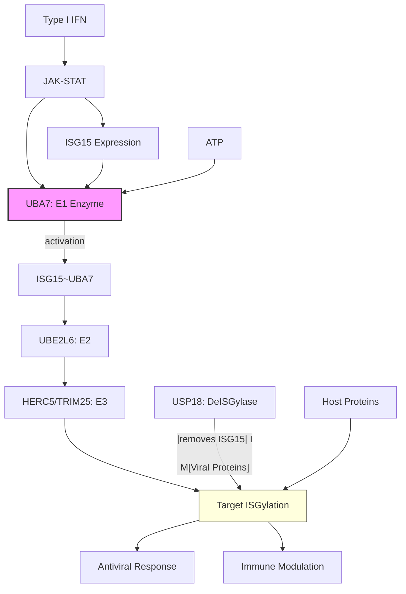

# Pathway Summary for UBA7

## Overview
UBA7 (Ubiquitin-like Modifier Activating Enzyme 7) is the E1 activating enzyme for ISG15, a ubiquitin-like protein induced by interferon signaling. UBA7 initiates ISGylation, a post-translational modification system that conjugates ISG15 to target proteins, playing critical roles in antiviral immunity and immune regulation.

## Core Pathways

### ISGylation Cascade
UBA7 initiates ISG15 conjugation through:
- ATP-dependent ISG15 activation
- Thioester bond formation with ISG15
- Transfer to UBE2L6 (E2 enzyme)
- Ultimate conjugation by HERC5/TRIM25 (E3 ligases)

### Interferon Response Pathway
UBA7 is a key effector of type I interferon signaling:
- Induced by IFN-α/β through JAK-STAT
- ISGylates viral and host proteins
- Restricts viral replication
- Modulates immune responses

## Pathway Diagram

## Upstream Regulation
- **Type I interferons**: Primary inducers via ISGF3
- **Viral infection**: Triggers IFN production
- **TLR signaling**: Pattern recognition response
- **IRF3/7**: Transcription factors

## Downstream Effects
- **Viral restriction**: ISGylation of viral proteins
- **Translation regulation**: Modified host factors
- **Signaling modulation**: ISGylated regulators
- **Cytokine production**: Immune response tuning

## Clinical Significance
- **ISG15 deficiency**: Susceptibility to mycobacterial disease
- **Autoinflammation**: Dysregulated ISGylation
- **Cancer**: Altered expression in malignancies
- **Therapeutic target**: Modulating antiviral immunity

## Molecular Mechanism
- **ATP binding**: Required for ISG15 activation
- **Adenylation**: ISG15 C-terminus activation
- **Thioester formation**: Cys-ISG15 intermediate
- **Trans-thiolation**: Transfer to E2 enzyme

## Integration with Immunity
- **Antiviral defense**: Core effector mechanism
- **Bacterial immunity**: Antimycobacterial responses
- **Inflammatory regulation**: Balances immune activation
- **Cross-talk**: Interacts with ubiquitination system
