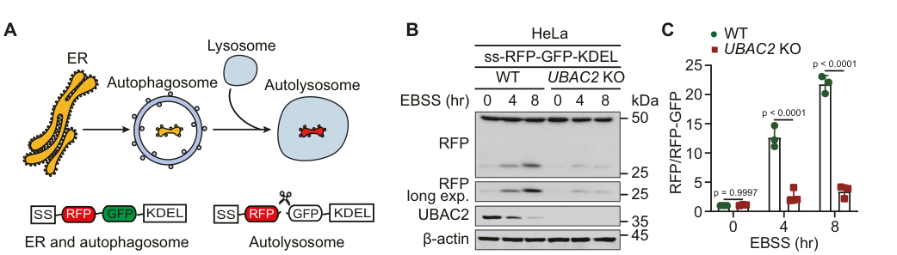

## Question

# Gene Research for Functional Annotation

## ⚠️ CRITICAL: Gene/Protein Identification Context

**BEFORE YOU BEGIN RESEARCH:** You MUST verify you are researching the CORRECT gene/protein. Gene symbols can be ambiguous, especially for less well-characterized genes from non-model organisms.

### Target Gene/Protein Identity (from UniProt):
- **UniProt Accession:** Q8NBM4
- **Protein Description:** RecName: Full=Ubiquitin-associated domain-containing protein 2; Short=UBA domain-containing protein 2; AltName: Full=Phosphoglycerate dehydrogenase-like protein 1; Flags: Precursor;
- **Gene Information:** Name=UBAC2; Synonyms=PHGDHL1; ORFNames=PSEC0110;
- **Organism (full):** Homo sapiens (Human).
- **Protein Family:** Not specified in UniProt
- **Key Domains:** Rhomboid-like_sf. (IPR035952); UBA. (IPR015940); UBA-like_sf. (IPR009060); UBA_UBAC2. (IPR041928); UBA (PF00627)

### MANDATORY VERIFICATION STEPS:

1. **Check if the gene symbol "UBAC2" matches the protein description above**
2. **Verify the organism is correct:** Homo sapiens (Human).
3. **Check if protein family/domains align with what you find in literature**
4. **If you find literature for a DIFFERENT gene with the same or similar symbol, STOP**

### If Gene Symbol is Ambiguous or You Cannot Find Relevant Literature:

**DO NOT PROCEED WITH RESEARCH ON A DIFFERENT GENE.** Instead:
- State clearly: "The gene symbol 'UBAC2' is ambiguous or literature is limited for this specific protein"
- Explain what you found (e.g., "Found extensive literature on a different gene with the same symbol in a different organism")
- Describe the protein based ONLY on the UniProt information provided above
- Suggest that the protein function can be inferred from domain/family information

### Research Target:

Please provide a comprehensive research report on the gene **UBAC2** (gene ID: UBAC2, UniProt: Q8NBM4) in human.

The research report should be a detailed narrative explaining the function, biological processes, and localization of the gene product. Citations should be given for all claims.

You should prioritize authoritative reviews and primary scientific literature when conducting research. You can supplement
this with annotations you find in gene/protein databases, but these can be outdated or inaccurate.

We are specifically interested in the primary function of the gene - for enzymes, what reaction is catalyzed, and what is the substrate specificity? For transporters, what is the substrate? For structural proteins or adapters, what is the broader structural role? For signaling molecules, what is the role in the pathway.

We are interested in where in or outside the cell the gene product carries out its function.

We are also interested in the signaling or biochemical pathways in which the gene functions. We are less interested in broad pleiotropic effects, except where these elucidate the precise role.

Include evidence where possible. We are interested in both experimental evidence as well as inference from structure, evolution, or bioinformatic analysis. Precise studies should be prioritized over high-throughput, where available.

## Output

Question: You are an expert researcher providing comprehensive, well-cited information.

Provide detailed information focusing on:
1. Key concepts and definitions with current understanding
2. Recent developments and latest research (prioritize 2023-2024 sources)
3. Current applications and real-world implementations
4. Expert opinions and analysis from authoritative sources
5. Relevant statistics and data from recent studies

Format as a comprehensive research report with proper citations. Include URLs and publication dates where available.
Always prioritize recent, authoritative sources and provide specific citations for all major claims.

# Gene Research for Functional Annotation

## ⚠️ CRITICAL: Gene/Protein Identification Context

**BEFORE YOU BEGIN RESEARCH:** You MUST verify you are researching the CORRECT gene/protein. Gene symbols can be ambiguous, especially for less well-characterized genes from non-model organisms.

### Target Gene/Protein Identity (from UniProt):
- **UniProt Accession:** Q8NBM4
- **Protein Description:** RecName: Full=Ubiquitin-associated domain-containing protein 2; Short=UBA domain-containing protein 2; AltName: Full=Phosphoglycerate dehydrogenase-like protein 1; Flags: Precursor;
- **Gene Information:** Name=UBAC2; Synonyms=PHGDHL1; ORFNames=PSEC0110;
- **Organism (full):** Homo sapiens (Human).
- **Protein Family:** Not specified in UniProt
- **Key Domains:** Rhomboid-like_sf. (IPR035952); UBA. (IPR015940); UBA-like_sf. (IPR009060); UBA_UBAC2. (IPR041928); UBA (PF00627)

### MANDATORY VERIFICATION STEPS:

1. **Check if the gene symbol "UBAC2" matches the protein description above**
2. **Verify the organism is correct:** Homo sapiens (Human).
3. **Check if protein family/domains align with what you find in literature**
4. **If you find literature for a DIFFERENT gene with the same or similar symbol, STOP**

### If Gene Symbol is Ambiguous or You Cannot Find Relevant Literature:

**DO NOT PROCEED WITH RESEARCH ON A DIFFERENT GENE.** Instead:
- State clearly: "The gene symbol 'UBAC2' is ambiguous or literature is limited for this specific protein"
- Explain what you found (e.g., "Found extensive literature on a different gene with the same symbol in a different organism")
- Describe the protein based ONLY on the UniProt information provided above
- Suggest that the protein function can be inferred from domain/family information

### Research Target:

Please provide a comprehensive research report on the gene **UBAC2** (gene ID: UBAC2, UniProt: Q8NBM4) in human.

The research report should be a detailed narrative explaining the function, biological processes, and localization of the gene product. Citations should be given for all claims.

You should prioritize authoritative reviews and primary scientific literature when conducting research. You can supplement
this with annotations you find in gene/protein databases, but these can be outdated or inaccurate.

We are specifically interested in the primary function of the gene - for enzymes, what reaction is catalyzed, and what is the substrate specificity? For transporters, what is the substrate? For structural proteins or adapters, what is the broader structural role? For signaling molecules, what is the role in the pathway.

We are interested in where in or outside the cell the gene product carries out its function.

We are also interested in the signaling or biochemical pathways in which the gene functions. We are less interested in broad pleiotropic effects, except where these elucidate the precise role.

Include evidence where possible. We are interested in both experimental evidence as well as inference from structure, evolution, or bioinformatic analysis. Precise studies should be prioritized over high-throughput, where available.

# Comprehensive Research Report: Human **UBAC2** (UniProt **Q8NBM4**) — Functional Annotation, Pathways, and Disease Context

## Executive summary
**UBAC2** (UBA domain–containing protein 2; UniProt Q8NBM4; synonym **PHGDHL1**) encodes an **ER-resident, rhomboid-like multi-pass membrane pseudoprotein** with a **cytosolic ubiquitin-associated (UBA) domain** that has been historically linked to **ER-associated degradation (ERAD)** and ubiquitin-dependent protein quality control (proteostasis). (adrain2020thecomplexlife pages 15-18, kandel2020theroleof pages 10-14, lemberg2016inactiverhomboidproteins pages 16-21, choi2019lmbr1lregulateslymphopoiesis pages 1-2)

A major **2024** advance is the discovery that UBAC2 also functions as a **selective autophagy receptor for ER-phagy (reticulophagy)**: it binds **GABARAP** via a cytosolic **LC3-interacting region (LIR)** and is activated by **MARK2 phosphorylation at S223**, which promotes UBAC2 dimerization and increased GABARAP binding. This UBAC2-driven ER-phagy **restrains ER stress/UPR-linked inflammation** and protects against **DSS-induced colitis** in vivo. (he2024erphagyrestrainsinflammatory pages 1-2, he2024erphagyrestrainsinflammatory pages 12-13, he2024erphagyrestrainsinflammatory pages 15-16, he2024erphagyrestrainsinflammatory pages 7-8)

## 1. Key concepts and definitions (current understanding)

### 1.1 UBAC2 as a rhomboid-like “pseudoprotease”
“Rhomboid-like” proteins share a rhomboid fold (typically multiple transmembrane helices) but **may lack protease activity**; such proteins are often termed **rhomboid pseudoproteases** and can act as **adapters/scaffolds** that regulate client protein trafficking, turnover, and signaling rather than catalyzing proteolysis. Reviews place UBAC2 within this class and connect rhomboid-like factors to ER protein quality control. (lemberg2016inactiverhomboidproteins pages 16-21, adrain2020thecomplexlife pages 1-5)

### 1.2 UBA domain and ubiquitin-dependent protein quality control
UBA (ubiquitin-associated) domains are small protein modules that can bind ubiquitin or polyubiquitin chains and thereby link proteins to ubiquitin signaling and degradation pathways. Reviews specifically describe UBAC2 as having a **conserved C-terminal UBA domain** that binds **polyubiquitin chains**, consistent with an adapter role in ubiquitin-dependent quality control. (kandel2020theroleof pages 10-14, lemberg2016inactiverhomboidproteins pages 16-21)

### 1.3 ERAD (endoplasmic reticulum–associated degradation)
ERAD is a canonical ER quality-control process in which misfolded or orphaned ER proteins are recognized, ubiquitinated, extracted (often via the p97/VCP machinery), and degraded by the proteasome. Reviews place UBAC2 within ERAD-related networks (including the **GP78** pathway) and highlight its interactions with UBXD8/p97 axis components relevant to substrate processing. (adrain2020thecomplexlife pages 15-18, kandel2020theroleof pages 10-14, lemberg2016inactiverhomboidproteins pages 16-21)

### 1.4 ER-phagy (reticulophagy) and LIR–ATG8 family interactions
**ER-phagy** is selective autophagic degradation of ER fragments. ER-phagy receptors often contain a **LIR motif** that binds ATG8-family proteins (e.g., **GABARAP/LC3**) to couple ER membranes to autophagosomes. In 2024, UBAC2 was shown to be such a receptor via its cytosolic LIR and GABARAP binding. (he2024erphagyrestrainsinflammatory pages 1-2, he2024erphagyrestrainsinflammatory pages 12-13, he2024erphagyrestrainsinflammatory pages 7-8)

## 2. Molecular identity verification (critical disambiguation)
The literature sources retrieved here consistently describe **human** UBAC2 as “**ubiquitin-associated domain–containing protein 2**,” and genetic studies explicitly note that **PHGDHL1 is alternatively called UBAC2**, supporting the UniProt synonym set and mitigating symbol ambiguity. (nan2011genomewideassociationstudy pages 1-2, hou2012replicationstudyconfirms pages 1-2)

## 3. Protein features, localization, and primary molecular functions

### 3.1 Subcellular localization
Multiple sources place UBAC2 at the **endoplasmic reticulum (ER)**.

* **Primary evidence (pathway study):** An “**ER-localized LMBR1L-GP78-UBAC2 complex**” is reported to regulate degradation of Wnt pathway components. (choi2019lmbr1lregulateslymphopoiesis pages 1-2)
* **Primary evidence (ER-phagy study):** UBAC2 is described as residing at the ER and functioning as an ER-phagy receptor; ER stress/starvation induces UBAC2 relocalization/turnover consistent with autophagy/lysosomal routing. (he2024erphagyrestrainsinflammatory pages 12-13, he2024erphagyrestrainsinflammatory pages 3-4)

### 3.2 UBAC2 as an ER-phagy receptor (major 2024 development)
A 2024 EMBO Journal study provides direct mechanistic evidence that UBAC2 is an **ER-phagy receptor**.

**Core mechanism**
* UBAC2 contains a **canonical LIR** in its cytosolic domain that binds **GABARAP**. (he2024erphagyrestrainsinflammatory pages 1-2, he2024erphagyrestrainsinflammatory pages 12-13)
* Under ER stress or autophagy activation, **MARK2 phosphorylates UBAC2 at S223**, promoting UBAC2 **dimerization** and stronger GABARAP binding, thereby enhancing ER-phagy. (he2024erphagyrestrainsinflammatory pages 1-2, he2024erphagyrestrainsinflammatory pages 12-13)

**Experimental readouts and quantitative design features**
* ER-phagy flux was monitored with an ER luminal reporter **ss-RFP-GFP-KDEL**, in which lysosomal delivery quenches GFP and yields an RFP fragment; UBAC2 knockout reduces reporter processing under starvation conditions, while UBAC2 WT rescues and a **LIR mutant (LIRm)** fails to rescue. (he2024erphagyrestrainsinflammatory pages 7-8)
* Quantification in microscopy includes **20 cells scored/condition** and statistics reported across **3 biological replicates** (mean ± SEM). (he2024erphagyrestrainsinflammatory pages 12-13)

**Physiological/in vivo implications**
* In a **DSS acute ulcerative colitis** mouse model, AAV-mediated expression of UBAC2 variants (WT vs LIRm vs S223A and disease-associated variants) was tested with **n = 6 mice/group** and multiple outcome measures including body weight, colon length, histology, and qPCR markers of ER stress and inflammation. (he2024erphagyrestrainsinflammatory pages 15-16)
* The study concludes that UBAC2-mediated ER-phagy restrains inflammatory responses and protects against colitis pathology. (he2024erphagyrestrainsinflammatory pages 1-2, he2024erphagyrestrainsinflammatory pages 15-16)

**Figure-level support**
Cropped panels of Figure 3 directly show: the ER-phagy reporter concept and quantification; rescue by UBAC2 WT but not LIRm; immunoblot readouts under starvation; and UBAC2–GABARAP co-immunoprecipitation. (he2024erphagyrestrainsinflammatory media 2051f18f, he2024erphagyrestrainsinflammatory media 4a49bd3c, he2024erphagyrestrainsinflammatory media 87f2e417, he2024erphagyrestrainsinflammatory media a2146745)

### 3.3 UBAC2 in ERAD-like ubiquitin-mediated degradation and Wnt pathway attenuation
Prior to 2024, UBAC2’s best-supported mechanistic placement was in ER-associated ubiquitin-dependent quality control.

* A 2019 Science study reports that UBAC2 participates in an “**ER-localized LMBR1L-GP78-UBAC2 complex**” that promotes ubiquitin-mediated degradation of **Wnt receptors (e.g., FZD and LRP6)** and helps attenuate **Wnt/β-catenin** signaling in lymphocytes. (choi2019lmbr1lregulateslymphopoiesis pages 1-2)
* Reviews integrate UBAC2 into the broader ERAD conceptual framework, discussing its interactions with ubiquitin-binding modules and ERAD components (including association with UBXD8/p97-related machinery and GP78-linked pathways). (adrain2020thecomplexlife pages 15-18, kandel2020theroleof pages 10-14, lemberg2016inactiverhomboidproteins pages 16-21)

## 4. Recent developments and latest research (prioritize 2023–2024)

### 4.1 2024: UBAC2–MARK2 axis links ER stress to ER-phagy and inflammation
The central 2024 discovery is that UBAC2 is a **regulated ER-phagy receptor**, with an explicit upstream kinase (**MARK2**) and a defined regulatory site (**S223 phosphorylation**) that modulates receptor activity through dimerization and strengthened GABARAP binding. (he2024erphagyrestrainsinflammatory pages 1-2, he2024erphagyrestrainsinflammatory pages 12-13)

### 4.2 2023: UBAC2 in updated ER quality-control frameworks
A 2023 Cold Spring Harbor Perspectives in Biology review summarizes the roles of rhomboid superfamily members in ER protein quality control and includes UBAC2 within this proteostasis context, providing a recent synthesis that anticipates why a rhomboid-like ER membrane factor may integrate multiple quality-control outputs (e.g., ubiquitin pathways and autophagy). (OpenTargets Search: -UBAC2)

## 5. Current applications and real-world implementations

### 5.1 Translational hypothesis generation: inflammation and IBD
Because UBAC2-driven ER-phagy restrains ER stress/UPR-linked inflammation and mitigates colitis phenotypes in vivo (DSS model), the UBAC2–MARK2–GABARAP axis provides a mechanistically grounded **target pathway** for therapeutic exploration in inflammatory disease contexts where ER stress contributes to pathology. (he2024erphagyrestrainsinflammatory pages 1-2, he2024erphagyrestrainsinflammatory pages 15-16)

### 5.2 Signaling pathway modulation: Wnt/β-catenin brake
The LMBR1L–GP78–UBAC2 complex was proposed as a second “brake” on Wnt signaling in lymphocytes by promoting ER-localized ubiquitination and degradation of Wnt receptors and β-catenin, suggesting a potential lever for contexts where Wnt signaling needs to be constrained. (choi2019lmbr1lregulateslymphopoiesis pages 1-2)

### 5.3 Human genetics and biomarker context
UBAC2 is implicated as a susceptibility locus across several diseases by genetics and aggregated evidence.

* **Behçet’s disease:** Fine-mapped promoter variants modulate UBAC2 transcription, supporting a plausible regulatory mechanism for disease risk. (hou2012replicationstudyconfirms pages 4-5, hou2012replicationstudyconfirms pages 5-6, hou2012replicationstudyconfirms pages 1-2)
* **Skin cancers:** The UBAC2 region shows genome-wide significant associations with basal cell carcinoma risk, suggesting clinical relevance as a locus (while not proving causality of UBAC2 protein function). (nan2011genomewideassociationstudy pages 1-2)
* **Database aggregation:** Open Targets lists UBAC2 associations with asthma, psoriasis, actinic keratosis, hypothyroidism, etc., which is useful for target prioritization and hypothesis generation. (OpenTargets Search: -UBAC2)

## 6. Expert synthesis and analysis (authoritative interpretations)

### 6.1 UBAC2 as an integrator of ER proteostasis pathways
Across authoritative reviews, UBAC2 is repeatedly positioned as an ER membrane rhomboid-like factor with a ubiquitin-binding UBA module that participates in ER quality control, including ERAD-linked networks and lipid-droplet related trafficking (via UBXD8). (adrain2020thecomplexlife pages 15-18, kandel2020theroleof pages 10-14, lemberg2016inactiverhomboidproteins pages 16-21)

The 2024 identification of UBAC2 as an ER-phagy receptor provides a coherent functional extension: UBAC2 appears capable of routing ER components to both **proteasome-associated** and **autophagy-associated** disposal pathways depending on stress context and regulatory state (e.g., MARK2 phosphorylation), consistent with modern views that ER proteostasis involves coordinated and partially redundant degradation systems. (he2024erphagyrestrainsinflammatory pages 1-2, he2024erphagyrestrainsinflammatory pages 12-13)

### 6.2 Caution on mechanistic specificity vs locus association
Genetic associations at the UBAC2/PHGDHL1 locus (e.g., skin cancer GWAS) establish medical relevance but do not alone demonstrate UBAC2 as the causal gene or define causal mechanisms; mechanistic interpretation should primarily rely on direct experiments such as the 2019 Science and 2024 EMBO Journal studies. (nan2011genomewideassociationstudy pages 1-2, choi2019lmbr1lregulateslymphopoiesis pages 1-2, he2024erphagyrestrainsinflammatory pages 1-2)

## 7. Relevant statistics and data (selected)

### 7.1 Behçet’s disease (Chinese Han cohorts) — UBAC2 locus
In a two-stage study totaling **477 BD cases and 1,334 controls**, UBAC2 showed replicated association, including (selected examples):

* rs3825427: combined Pc = **6.9 × 10^-6**, OR = **1.5**; promoter risk T allele had lower promoter activity than G allele (**P = 0.002**) and was associated with decreased UBAC2 transcript variant 1 expression in PBMCs and skin (Bonferroni-corrected **P = 0.045** and **P = 0.025**). (hou2012replicationstudyconfirms pages 4-5, hou2012replicationstudyconfirms pages 5-6)
* rs9517668: combined Pc = **3.3 × 10^-4**, OR = **1.4**. (hou2012replicationstudyconfirms pages 4-5)
* rs9517701: combined Pc = **2.9 × 10^-5**, OR = **1.4**. (hou2012replicationstudyconfirms pages 4-5)

### 7.2 Skin cancer GWAS (UBAC2 region)
For basal cell carcinoma (BCC), rs7335046 near UBAC2 showed combined OR **1.26** (95% CI 1.18–1.34) with **P = 2.9 × 10^-8** (genome-wide significant) in a discovery + replication GWAS design. (nan2011genomewideassociationstudy pages 1-2)

### 7.3 2024 ER-phagy functional statistics (selected)
The EMBO Journal 2024 study reports multiple statistically significant effects of UBAC2 perturbation/mutants on ER-phagy and inflammation-linked phenotypes, including comparisons with **p < 0.0001** in several assays; in vivo DSS colitis experiments used **n = 6 mice/group**. (he2024erphagyrestrainsinflammatory pages 15-16, he2024erphagyrestrainsinflammatory pages 7-8)

## Evidence map (key sources)
| Year | Citation (first author journal) | URL | Evidence type (primary/review/database) | Key findings relevant to UBAC2 (function/pathway/localization/domains) | Key quantitative/statistical data (p-values, ORs, n) | Notes/limitations |
|---|---|---|---|---|---|---|
| 2024 | He, *EMBO Journal* | https://doi.org/10.1038/s44318-024-00232-z | Primary | Identifies human UBAC2 as an ER-resident ER-phagy receptor. UBAC2 contains a cytoplasmic canonical LIR that binds GABARAP; MARK2 phosphorylates UBAC2 at S223, promoting dimerization and stronger GABARAP binding. UBAC2-mediated ER-phagy restrains UPR/inflammatory signaling and protects against DSS colitis. UBAC2 also undergoes autophagic turnover during ER stress/starvation. (he2024erphagyrestrainsinflammatory pages 1-2, he2024erphagyrestrainsinflammatory pages 12-13, he2024erphagyrestrainsinflammatory pages 15-16, he2024erphagyrestrainsinflammatory pages 7-8, he2024erphagyrestrainsinflammatory pages 14-15, he2024erphagyrestrainsinflammatory pages 3-4) | HeLa ER-phagy reporter quantified across 3 biological replicates; 20 cells scored/condition in microscopy analyses; DSS colitis experiments used n=6 mice/group; multiple comparisons reported including p<0.0001, p=0.0100, p=0.0071, p=0.0012, p=0.0080. (he2024erphagyrestrainsinflammatory pages 12-13, he2024erphagyrestrainsinflammatory pages 15-16, he2024erphagyrestrainsinflammatory pages 7-8, he2024erphagyrestrainsinflammatory pages 3-4) | Strongest recent mechanistic study; extends UBAC2 function beyond ERAD into selective autophagy. Context excerpts do not provide all effect sizes/fold changes. |
| 2019 | Choi, *Science* | https://doi.org/10.1126/science.aau0812 | Primary | Places UBAC2 in an ER-localized LMBR1L-GP78-UBAC2 complex that promotes ubiquitin-mediated degradation of FZD6/LRP6 and helps limit Wnt/β-catenin signaling in lymphocytes. Supports ER quality-control/ERAD-like function and ER localization. (choi2019lmbr1lregulateslymphopoiesis pages 1-2) | Paper reports impaired lymphoid development/function in mutant mice and restoration experiments involving β-catenin knockout, but quantitative values were not present in the available excerpt. (choi2019lmbr1lregulateslymphopoiesis pages 1-2) | Direct primary evidence for pathway-specific UBAC2 function, but excerpt does not state membrane topology or UBA-domain position. |
| 2023 | Bhaduri, *Cold Spring Harbor Perspectives in Biology* | https://doi.org/10.1101/cshperspect.a041248 | Review | Reviews rhomboid superfamily roles in ER protein quality control and includes UBAC2 among rhomboid-like proteins linked to ERAD/proteostasis. Helps place UBAC2 in current ER quality-control framework. (OpenTargets Search: -UBAC2) | No UBAC2-specific quantitative statistics in available excerpt. | High-authority recent review; useful for current conceptual understanding, but mostly secondary synthesis rather than direct UBAC2 experiments. |
| 2020 | Adrain, *FEBS Journal* | https://doi.org/10.1111/febs.15548 | Review | Describes UBAC2 as an ER-localized rhomboid pseudoprotease with a conserved C-terminal UBA domain; links UBAC2 to UBXD8, GP78-ERAD, delivery of substrates to GP78, and LMBR1L-GP78-UBAC2-mediated Wnt regulation. Notes Derlin-like behavior and unresolved physiology. (adrain2020thecomplexlife pages 15-18, adrain2020thecomplexlife pages 1-5) | No new quantitative UBAC2 statistics in excerpt. | Strong synthesis of mechanistic literature; some claims are review-level interpretations and precise physiological roles remain incompletely established. |
| 2020 | Kandel, *BBA Mol Cell Res* | https://doi.org/10.1016/j.bbamcr.2020.118793 | Review | Summarizes UBAC2 as a rhomboid-like multi-pass membrane protein with a C-terminal UBA domain that binds polyubiquitin; UBAC2 knockdown stabilizes mutant α1-antitrypsin (an ERAD substrate) and UBAC2 restricts UBXD8 trafficking from ER to lipid droplets, linking proteostasis to lipid homeostasis. (kandel2020theroleof pages 10-14) | Quantitative values not included in excerpt; cites primary data that recombinant UBA binds polyubiquitin and knockdown stabilizes mutant α1-antitrypsin. (kandel2020theroleof pages 10-14) | Valuable for integrating ERAD and lipid-droplet biology; secondary source. |
| 2016 | Lemberg, *Seminars in Cell & Developmental Biology* | https://doi.org/10.1016/j.semcdb.2016.06.022 | Review | Classifies UBAC2 as a rhomboid-family pseudoprotease predicted to bind ubiquitin via a conserved cytoplasmic C-terminal UBA domain; places it in the ERAD network with gp78 and identifies UBAC2 as an ER tether for UBXD8, affecting lipid-droplet trafficking and triglyceride turnover. (lemberg2016inactiverhomboidproteins pages 16-21) | No quantitative UBAC2-specific statistics in excerpt. | Foundational review; older and predates ER-phagy findings. |
| 2013 | Olzmann, *Cold Spring Harbor Perspectives in Biology* | https://doi.org/10.1101/cshperspect.a013185 | Review | Early authoritative ERAD review explicitly mentions UBAC2 as a recently identified UBA-domain-containing, rhomboid-like factor in mammalian ERAD, helping establish the historical basis for UBAC2’s ER quality-control annotation. (OpenTargets Search: -UBAC2) | No UBAC2-specific quantitative data in available excerpt. | Important historical context, but limited UBAC2 detail in excerpt. |
| 2012 | Hou, *Arthritis Research & Therapy* | https://doi.org/10.1186/ar3789 | Primary genetics/functional | Validates UBAC2 as a Behçet’s disease susceptibility locus in Han Chinese. Promoter SNP rs3825427 risk T allele reduces promoter activity and lowers UBAC2 transcript variant 1 in PBMCs/skin; variant 1 is decreased in BD, while variant 2 is increased in BD skin. (hou2012replicationstudyconfirms pages 4-5, hou2012replicationstudyconfirms pages 5-6, hou2012replicationstudyconfirms pages 1-2, hou2012replicationstudyconfirms pages 2-4, hou2012replicationstudyconfirms pages 6-7) | Two-stage study totaling 477 BD patients and 1,334 controls; rs9513584 Pc=0.018, OR=1.4; rs3825427 combined Pc=6.9×10^-6, OR=1.5; rs9517668 combined Pc=3.3×10^-4, OR=1.4; rs9517701 combined Pc=2.9×10^-5, OR=1.4; rs3825427 promoter assay P=0.002; transcript variant 1 genotype-expression P=0.045 and P=0.025; BD vs control expression P=0.025 and P=0.047; variant 2 in BD skin P=0.004. (hou2012replicationstudyconfirms pages 4-5, hou2012replicationstudyconfirms pages 5-6, hou2012replicationstudyconfirms pages 1-2, hou2012replicationstudyconfirms pages 2-4) | Strong disease-association and functional-regulatory evidence, but does not define biochemical mechanism of UBAC2 protein action. |
| 2011 | Nan, *Human Molecular Genetics* | https://doi.org/10.1093/hmg/ddr287 | Primary genetics | GWAS implicates the UBAC2/PHGDHL1 region in skin cancer susceptibility, supporting medical relevance of the locus. (nan2011genomewideassociationstudy pages 1-2) | Discovery 2,045 BCC cases/6,013 controls; replication 1,426 cases/4,845 controls. rs7335046 near UBAC2: BCC OR 1.26 (95% CI 1.18–1.34), P=2.9×10^-8; SCC OR 1.21 (95% CI 1.02–1.44), P=0.03; rs12210050[T] SCC OR 1.35 (95% CI 1.16–1.57), P=7.6×10^-5. (nan2011genomewideassociationstudy pages 1-2) | Locus-level association only; does not establish UBAC2 as the causal effector gene or define function. |
| Current | Open Targets Platform | https://platform.opentargets.org/target/ENSG00000134882 | Database | Aggregates disease-target associations for UBAC2, including asthma, childhood-onset asthma, psoriasis, actinic keratosis, and hypothyroidism, useful for prioritizing translational hypotheses. (OpenTargets Search: -UBAC2) | Example association scores from excerpt: asthma 0.4426; hypothyroidism 0.3475; actinic keratosis 0.3268; psoriasis 0.3055; childhood-onset asthma 0.3054; 5 literature-linked evidences per listed disease. (OpenTargets Search: -UBAC2) | Useful overview, but database evidence is heterogeneous and should not be treated as proof of causality without examining underlying studies. |

*Table: This table summarizes the main evidence base for human UBAC2 (Q8NBM4), highlighting the 2024 ER-phagy discovery paper, the 2019 Wnt/ERAD study, key reviews, and disease-genetics sources. It is useful for quickly separating direct mechanistic evidence from review synthesis and locus-level association data.*

## Conclusion
The best-supported “primary function” assignment for human UBAC2 has shifted from being primarily an **ERAD-associated adapter** in ubiquitin-dependent quality control to a broader role as a **regulated ER-phagy receptor** that connects ER stress to selective autophagy and inflammatory restraint. Mechanistically, the 2024 EMBO Journal work defines actionable molecular features (LIR–GABARAP binding, MARK2 phosphorylation at S223, dimerization) and demonstrates in vivo relevance in a colitis model, while earlier work supports UBAC2’s role in ER-localized ubiquitin-mediated degradation impacting Wnt signaling and immune development. (he2024erphagyrestrainsinflammatory pages 1-2, he2024erphagyrestrainsinflammatory pages 12-13, he2024erphagyrestrainsinflammatory pages 15-16, choi2019lmbr1lregulateslymphopoiesis pages 1-2)

## URLs and publication dates (selected)
* He et al., *The EMBO Journal* — **Sep 2024** — https://doi.org/10.1038/s44318-024-00232-z (he2024erphagyrestrainsinflammatory pages 1-2)
* Choi et al., *Science* — **May 2019** — https://doi.org/10.1126/science.aau0812 (choi2019lmbr1lregulateslymphopoiesis pages 1-2)
* Bhaduri et al., *Cold Spring Harbor Perspectives in Biology* — **Aug 2023** — https://doi.org/10.1101/cshperspect.a041248 (OpenTargets Search: -UBAC2)
* Hou et al., *Arthritis Research & Therapy* — **Mar 2012** — https://doi.org/10.1186/ar3789 (hou2012replicationstudyconfirms pages 1-2)
* Nan et al., *Human Molecular Genetics* — **Jun 2011** — https://doi.org/10.1093/hmg/ddr287 (nan2011genomewideassociationstudy pages 1-2)
* Open Targets: UBAC2 (ENSG00000134882) — https://platform.opentargets.org/target/ENSG00000134882 (OpenTargets Search: -UBAC2)

References

1. (adrain2020thecomplexlife pages 15-18): Colin Adrain and Miguel Cavadas. The complex life of rhomboid pseudoproteases. The FEBS Journal, 287:4261-4283, Oct 2020. URL: https://doi.org/10.1111/febs.15548, doi:10.1111/febs.15548. This article has 25 citations.

2. (kandel2020theroleof pages 10-14): Rachel R. Kandel and Sonya E. Neal. The role of rhomboid superfamily members in protein homeostasis: mechanistic insight and physiological implications. Oct 2020. URL: https://doi.org/10.1016/j.bbamcr.2020.118793, doi:10.1016/j.bbamcr.2020.118793. This article has 27 citations and is from a peer-reviewed journal.

3. (lemberg2016inactiverhomboidproteins pages 16-21): Marius K. Lemberg and Colin Adrain. Inactive rhomboid proteins: new mechanisms with implications in health and disease. Seminars in cell & developmental biology, 60:29-37, Dec 2016. URL: https://doi.org/10.1016/j.semcdb.2016.06.022, doi:10.1016/j.semcdb.2016.06.022. This article has 41 citations and is from a peer-reviewed journal.

4. (choi2019lmbr1lregulateslymphopoiesis pages 1-2): Jin Huk Choi, Xue Zhong, William McAlpine, Tzu-Chieh Liao, Duanwu Zhang, Beibei Fang, Jamie Russell, Sara Ludwig, Evan Nair-Gill, Zhao Zhang, Kuan-wen Wang, Takuma Misawa, Xiaoming Zhan, Mihwa Choi, Tao Wang, Xiaohong Li, Miao Tang, Qihua Sun, Liyang Yu, Anne R. Murray, Eva Marie Y. Moresco, and Bruce Beutler. Lmbr1l regulates lymphopoiesis through wnt/β-catenin signaling. May 2019. URL: https://doi.org/10.1126/science.aau0812, doi:10.1126/science.aau0812. This article has 66 citations and is from a highest quality peer-reviewed journal.

5. (he2024erphagyrestrainsinflammatory pages 1-2): Xing He, Haowei He, Zitong Hou, Zheyu Wang, Qinglin Shi, Tao Zhou, Yaoxing Wu, Yunfei Qin, Jun Wang, Zhe Cai, Jun Cui, and Shouheng Jin. Er-phagy restrains inflammatory responses through its receptor ubac2. The EMBO Journal, 43:5057-5084, Sep 2024. URL: https://doi.org/10.1038/s44318-024-00232-z, doi:10.1038/s44318-024-00232-z. This article has 13 citations.

6. (he2024erphagyrestrainsinflammatory pages 12-13): Xing He, Haowei He, Zitong Hou, Zheyu Wang, Qinglin Shi, Tao Zhou, Yaoxing Wu, Yunfei Qin, Jun Wang, Zhe Cai, Jun Cui, and Shouheng Jin. Er-phagy restrains inflammatory responses through its receptor ubac2. The EMBO Journal, 43:5057-5084, Sep 2024. URL: https://doi.org/10.1038/s44318-024-00232-z, doi:10.1038/s44318-024-00232-z. This article has 13 citations.

7. (he2024erphagyrestrainsinflammatory pages 15-16): Xing He, Haowei He, Zitong Hou, Zheyu Wang, Qinglin Shi, Tao Zhou, Yaoxing Wu, Yunfei Qin, Jun Wang, Zhe Cai, Jun Cui, and Shouheng Jin. Er-phagy restrains inflammatory responses through its receptor ubac2. The EMBO Journal, 43:5057-5084, Sep 2024. URL: https://doi.org/10.1038/s44318-024-00232-z, doi:10.1038/s44318-024-00232-z. This article has 13 citations.

8. (he2024erphagyrestrainsinflammatory pages 7-8): Xing He, Haowei He, Zitong Hou, Zheyu Wang, Qinglin Shi, Tao Zhou, Yaoxing Wu, Yunfei Qin, Jun Wang, Zhe Cai, Jun Cui, and Shouheng Jin. Er-phagy restrains inflammatory responses through its receptor ubac2. The EMBO Journal, 43:5057-5084, Sep 2024. URL: https://doi.org/10.1038/s44318-024-00232-z, doi:10.1038/s44318-024-00232-z. This article has 13 citations.

9. (adrain2020thecomplexlife pages 1-5): Colin Adrain and Miguel Cavadas. The complex life of rhomboid pseudoproteases. The FEBS Journal, 287:4261-4283, Oct 2020. URL: https://doi.org/10.1111/febs.15548, doi:10.1111/febs.15548. This article has 25 citations.

10. (nan2011genomewideassociationstudy pages 1-2): Hongmei Nan, Mousheng Xu, Peter Kraft, Abrar A. Qureshi, Constance Chen, Qun Guo, Frank B. Hu, Gary Curhan, Christopher I. Amos, Li-E. Wang, Jeffrey E. Lee, Qingyi Wei, David J. Hunter, and Jiali Han. Genome-wide association study identifies novel alleles associated with risk of cutaneous basal cell carcinoma and squamous cell carcinoma. Human Molecular Genetics, 20:3718-3724, Jun 2011. URL: https://doi.org/10.1093/hmg/ddr287, doi:10.1093/hmg/ddr287. This article has 127 citations and is from a domain leading peer-reviewed journal.

11. (hou2012replicationstudyconfirms pages 1-2): Shengping Hou, Qinmeng Shu, Zhengxuan Jiang, Yuanyuan Chen, Fuzhen Li, Feilan Chen, Aize Kijlstra, and Peizeng Yang. Replication study confirms the association between ubac2 and behçet's disease in two independent chinese sets of patients and controls. Arthritis Research & Therapy, 14:R70-R70, Mar 2012. URL: https://doi.org/10.1186/ar3789, doi:10.1186/ar3789. This article has 50 citations and is from a domain leading peer-reviewed journal.

12. (he2024erphagyrestrainsinflammatory pages 3-4): Xing He, Haowei He, Zitong Hou, Zheyu Wang, Qinglin Shi, Tao Zhou, Yaoxing Wu, Yunfei Qin, Jun Wang, Zhe Cai, Jun Cui, and Shouheng Jin. Er-phagy restrains inflammatory responses through its receptor ubac2. The EMBO Journal, 43:5057-5084, Sep 2024. URL: https://doi.org/10.1038/s44318-024-00232-z, doi:10.1038/s44318-024-00232-z. This article has 13 citations.

13. (he2024erphagyrestrainsinflammatory media 2051f18f): Xing He, Haowei He, Zitong Hou, Zheyu Wang, Qinglin Shi, Tao Zhou, Yaoxing Wu, Yunfei Qin, Jun Wang, Zhe Cai, Jun Cui, and Shouheng Jin. Er-phagy restrains inflammatory responses through its receptor ubac2. The EMBO Journal, 43:5057-5084, Sep 2024. URL: https://doi.org/10.1038/s44318-024-00232-z, doi:10.1038/s44318-024-00232-z. This article has 13 citations.

14. (he2024erphagyrestrainsinflammatory media 4a49bd3c): Xing He, Haowei He, Zitong Hou, Zheyu Wang, Qinglin Shi, Tao Zhou, Yaoxing Wu, Yunfei Qin, Jun Wang, Zhe Cai, Jun Cui, and Shouheng Jin. Er-phagy restrains inflammatory responses through its receptor ubac2. The EMBO Journal, 43:5057-5084, Sep 2024. URL: https://doi.org/10.1038/s44318-024-00232-z, doi:10.1038/s44318-024-00232-z. This article has 13 citations.

15. (he2024erphagyrestrainsinflammatory media 87f2e417): Xing He, Haowei He, Zitong Hou, Zheyu Wang, Qinglin Shi, Tao Zhou, Yaoxing Wu, Yunfei Qin, Jun Wang, Zhe Cai, Jun Cui, and Shouheng Jin. Er-phagy restrains inflammatory responses through its receptor ubac2. The EMBO Journal, 43:5057-5084, Sep 2024. URL: https://doi.org/10.1038/s44318-024-00232-z, doi:10.1038/s44318-024-00232-z. This article has 13 citations.

16. (he2024erphagyrestrainsinflammatory media a2146745): Xing He, Haowei He, Zitong Hou, Zheyu Wang, Qinglin Shi, Tao Zhou, Yaoxing Wu, Yunfei Qin, Jun Wang, Zhe Cai, Jun Cui, and Shouheng Jin. Er-phagy restrains inflammatory responses through its receptor ubac2. The EMBO Journal, 43:5057-5084, Sep 2024. URL: https://doi.org/10.1038/s44318-024-00232-z, doi:10.1038/s44318-024-00232-z. This article has 13 citations.

17. (OpenTargets Search: -UBAC2): Open Targets Query (-UBAC2, 5 results). Buniello, A. et al. (2025). Open Targets Platform: facilitating therapeutic hypotheses building in drug discovery. Nucleic Acids Research.

18. (hou2012replicationstudyconfirms pages 4-5): Shengping Hou, Qinmeng Shu, Zhengxuan Jiang, Yuanyuan Chen, Fuzhen Li, Feilan Chen, Aize Kijlstra, and Peizeng Yang. Replication study confirms the association between ubac2 and behçet's disease in two independent chinese sets of patients and controls. Arthritis Research & Therapy, 14:R70-R70, Mar 2012. URL: https://doi.org/10.1186/ar3789, doi:10.1186/ar3789. This article has 50 citations and is from a domain leading peer-reviewed journal.

19. (hou2012replicationstudyconfirms pages 5-6): Shengping Hou, Qinmeng Shu, Zhengxuan Jiang, Yuanyuan Chen, Fuzhen Li, Feilan Chen, Aize Kijlstra, and Peizeng Yang. Replication study confirms the association between ubac2 and behçet's disease in two independent chinese sets of patients and controls. Arthritis Research & Therapy, 14:R70-R70, Mar 2012. URL: https://doi.org/10.1186/ar3789, doi:10.1186/ar3789. This article has 50 citations and is from a domain leading peer-reviewed journal.

20. (he2024erphagyrestrainsinflammatory pages 14-15): Xing He, Haowei He, Zitong Hou, Zheyu Wang, Qinglin Shi, Tao Zhou, Yaoxing Wu, Yunfei Qin, Jun Wang, Zhe Cai, Jun Cui, and Shouheng Jin. Er-phagy restrains inflammatory responses through its receptor ubac2. The EMBO Journal, 43:5057-5084, Sep 2024. URL: https://doi.org/10.1038/s44318-024-00232-z, doi:10.1038/s44318-024-00232-z. This article has 13 citations.

21. (hou2012replicationstudyconfirms pages 2-4): Shengping Hou, Qinmeng Shu, Zhengxuan Jiang, Yuanyuan Chen, Fuzhen Li, Feilan Chen, Aize Kijlstra, and Peizeng Yang. Replication study confirms the association between ubac2 and behçet's disease in two independent chinese sets of patients and controls. Arthritis Research & Therapy, 14:R70-R70, Mar 2012. URL: https://doi.org/10.1186/ar3789, doi:10.1186/ar3789. This article has 50 citations and is from a domain leading peer-reviewed journal.

22. (hou2012replicationstudyconfirms pages 6-7): Shengping Hou, Qinmeng Shu, Zhengxuan Jiang, Yuanyuan Chen, Fuzhen Li, Feilan Chen, Aize Kijlstra, and Peizeng Yang. Replication study confirms the association between ubac2 and behçet's disease in two independent chinese sets of patients and controls. Arthritis Research & Therapy, 14:R70-R70, Mar 2012. URL: https://doi.org/10.1186/ar3789, doi:10.1186/ar3789. This article has 50 citations and is from a domain leading peer-reviewed journal.

## Artifacts

- [Edison artifact artifact-00](UBAC2-deep-research-falcon_artifacts/artifact-00.md)

## Citations

1. he2024erphagyrestrainsinflammatory pages 7-8
2. he2024erphagyrestrainsinflammatory pages 12-13
3. he2024erphagyrestrainsinflammatory pages 15-16
4. nan2011genomewideassociationstudy pages 1-2
5. hou2012replicationstudyconfirms pages 4-5
6. kandel2020theroleof pages 10-14
7. lemberg2016inactiverhomboidproteins pages 16-21
8. he2024erphagyrestrainsinflammatory pages 1-2
9. hou2012replicationstudyconfirms pages 1-2
10. adrain2020thecomplexlife pages 15-18
11. adrain2020thecomplexlife pages 1-5
12. he2024erphagyrestrainsinflammatory pages 3-4
13. hou2012replicationstudyconfirms pages 5-6
14. he2024erphagyrestrainsinflammatory pages 14-15
15. hou2012replicationstudyconfirms pages 2-4
16. hou2012replicationstudyconfirms pages 6-7
17. T
18. https://doi.org/10.1038/s44318-024-00232-z
19. https://doi.org/10.1126/science.aau0812
20. https://doi.org/10.1101/cshperspect.a041248
21. https://doi.org/10.1111/febs.15548
22. https://doi.org/10.1016/j.bbamcr.2020.118793
23. https://doi.org/10.1016/j.semcdb.2016.06.022
24. https://doi.org/10.1101/cshperspect.a013185
25. https://doi.org/10.1186/ar3789
26. https://doi.org/10.1093/hmg/ddr287
27. https://platform.opentargets.org/target/ENSG00000134882
28. https://doi.org/10.1111/febs.15548,
29. https://doi.org/10.1016/j.bbamcr.2020.118793,
30. https://doi.org/10.1016/j.semcdb.2016.06.022,
31. https://doi.org/10.1126/science.aau0812,
32. https://doi.org/10.1038/s44318-024-00232-z,
33. https://doi.org/10.1093/hmg/ddr287,
34. https://doi.org/10.1186/ar3789,