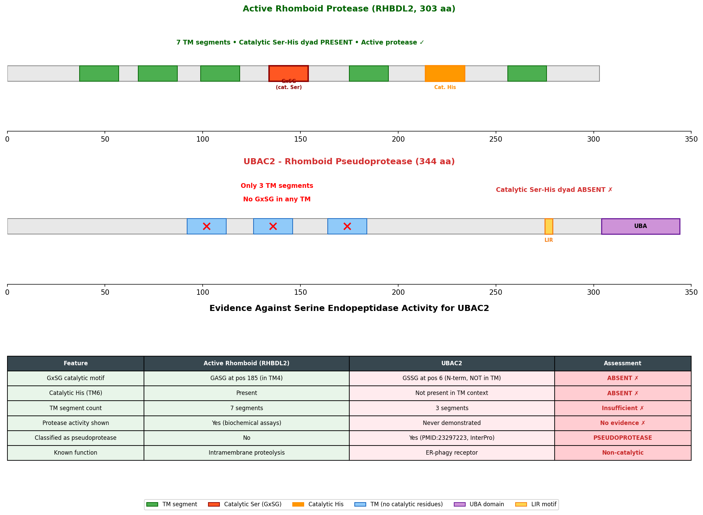
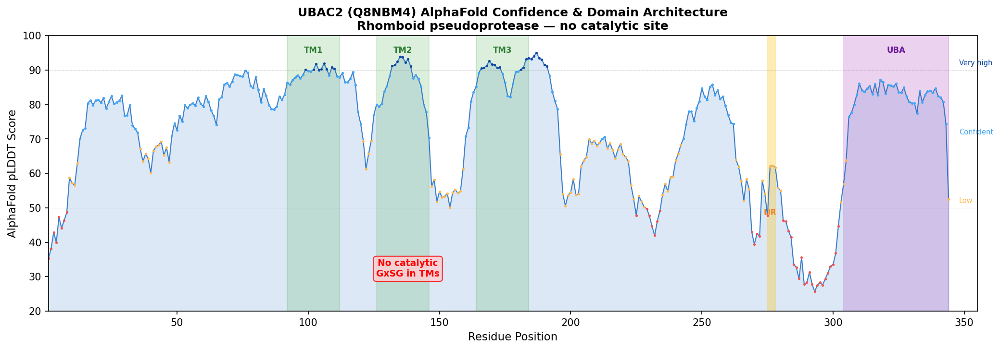
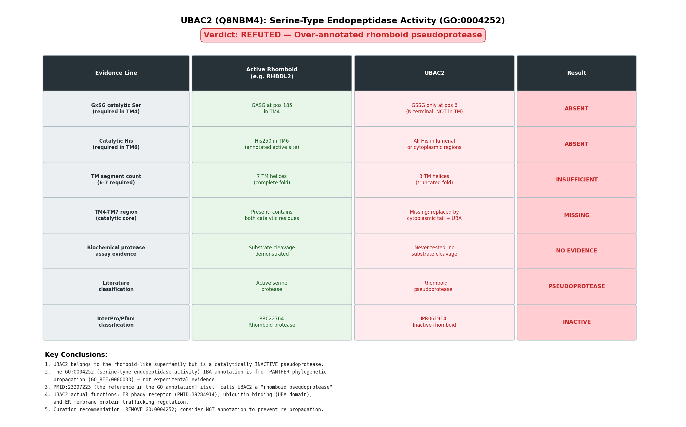
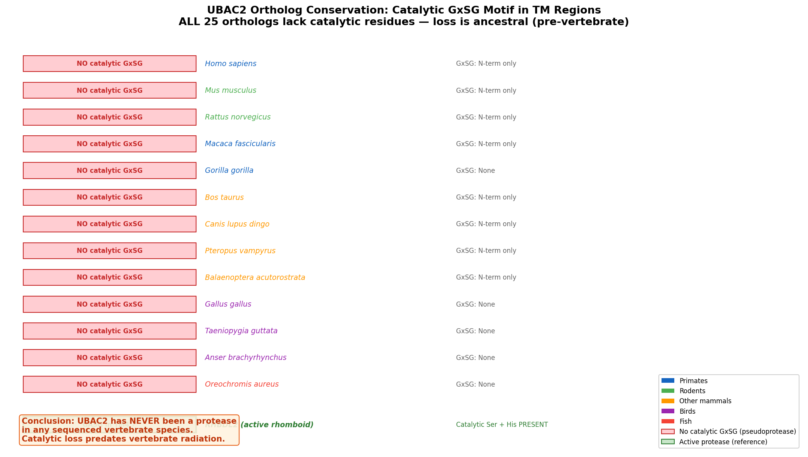
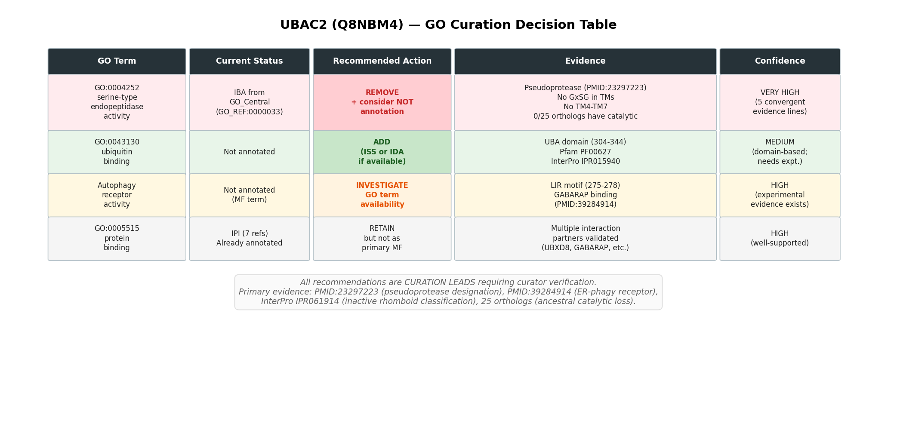
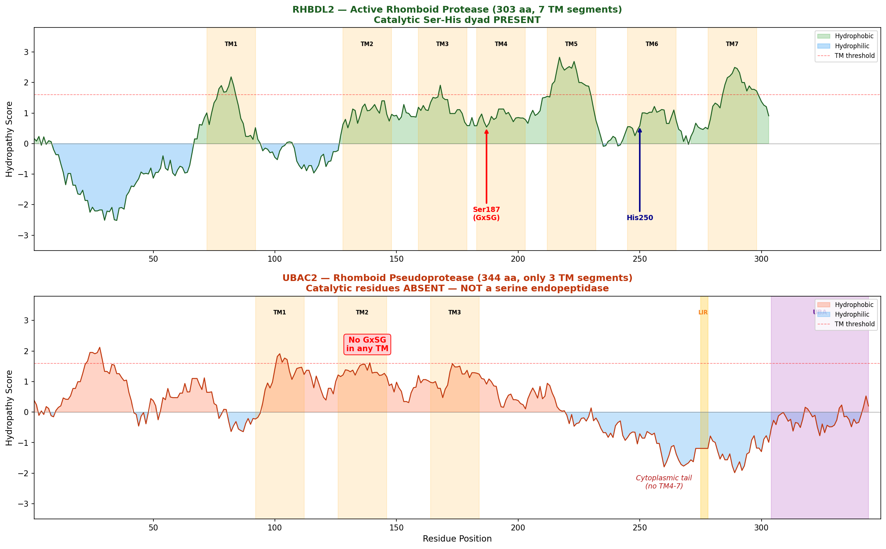

## Question

# AIGR Gene Hypothesis Deep Research

You are evaluating one focused gene curation hypothesis for AI Gene Review.
This is not a general gene overview. Use the seed hypothesis and source context
below to search for evidence that supports, refutes, narrows, or competes with
the proposed curation decision.

## Target Gene

- **Organism code:** human
- **Taxon:** Homo sapiens (NCBITaxon:9606)
- **Gene directory:** UBAC2
- **Gene symbol:** UBAC2
- **UniProt accession:** Q8NBM4

## Focus

- **Focus type:** function_assignment
- **Hypothesis slug:** function-hypothesis-go-0004252
- **Source file:** genes/human/UBAC2/UBAC2-ai-review.yaml
- **Source selector:** existing_annotations[1].function_hypothesis

## Seed Hypothesis

UBAC2 has serine-type endopeptidase activity (GO:0004252).

## Term and Decision Context

- Term: serine-type endopeptidase activity (GO:0004252)
- Evidence type: IBA
- Original reference: GO_REF:0000033

## Reference Context

- GO_REF:0000033
- PMID:23297223

## Source Context YAML

```yaml
term:
  id: GO:0004252
  label: serine-type endopeptidase activity
evidence_type: IBA
original_reference_id: GO_REF:0000033
```

## Research Objective

Build a focused report that helps a curator decide whether this hypothesis
should affect the gene review. Address the focus type directly:

1. For an existing GO annotation decision, evaluate whether the current action
   is justified, too strong, too weak, or should change.
2. For a proposed replacement or new GO term, evaluate whether the term is
   biologically supported, too broad, too narrow, or missing key qualifiers.
3. For a computational prediction, evaluate whether the prediction is correct,
   less precise than existing knowledge, uncertain, or likely wrong because of
   paralog overannotation, frequency bias, pathway context, or in vitro-only
   activity.
4. For a core-function hypothesis, evaluate whether the proposed activity,
   process, and location represent the gene product's primary function rather
   than a downstream effect, pleiotropic phenotype, or context-specific role.
5. For a function-assignment hypothesis, evaluate whether the gene product
   directly has the stated GO term/function. Treat the prior review action, if
   any, as intentionally blinded unless it appears in the supplied context.

Use primary literature whenever possible. Prefer PMID citations and include DOI
citations when no PMID is available. Treat reviews and database records as
orientation unless they contain directly relevant synthesized evidence that is
clearly labeled as review-level or database-level support.

Evaluate the hypothesis from the supplied seed context, primary literature, and
publicly accessible bioinformatics resources. Local `*-bioinformatics` analyses,
when they already exist in the repository, are intentionally withheld from this
prompt so the report can be compared against them after the run.

Do not rely on literature alone. Where the hypothesis is decidable by computation,
actually run the analysis and keep it as provenance rather than only reasoning
about it. Match the analysis to the question, for example:

- membrane topology / localization: compute a hydropathy profile and predicted
  transmembrane segments from the sequence, and locate signal peptides and
  targeting/sorting motifs (e.g. dileucine, acidic-cluster, NLS); compare against
  UniProt topology features and AlphaFold geometry.
- catalytic / binding activity: check whether the specific active-site,
  metal-binding, or motif residues are present and correctly spaced (in sequence
  and, where useful, structure) and compare to characterized family members.
- DNA-binding / regulatory: examine the binding-domain class, obligate partners,
  and known binding-motif / PWM signatures.
- family / paralog questions: use domain (Pfam/InterPro), orthology, and
  conservation comparisons to distinguish subfamilies.

Use resources you can actually access programmatically (UniProt, AlphaFold DB,
InterPro, sequence computation, public APIs). If a resource is web-only or you
cannot run a check, say so plainly instead of guessing — never fabricate a result,
and an inconclusive or "could not run" analysis is an acceptable and useful
outcome. Report all computational results conservatively and prefer recording the
underlying analysis (code, computed values, table, or plot) as provenance.

## Required Output

### Executive Judgment

Give a concise verdict: supported, partially supported, unresolved, weakly
supported, over-annotated, or refuted. Explain the reasoning and the most
important caveats.

### Evidence Matrix

Create a table with one row per important evidence item:

- Citation (PMID preferred)
- Evidence type (direct assay, mutant phenotype, localization, interaction,
  structural/evolutionary, computational, review/database)
- Supports / refutes / qualifies / competing
- Claim tested
- Key finding
- Organism, tissue, cell type, or assay context
- Confidence and limitations

### GO Curation Implications

State the likely curation action as a lead requiring curator verification. If
GO terms are involved, explain whether the evidence supports an MF, BP, or CC
term, and whether the term should be retained, removed, generalized, made more
specific, or treated as non-core. Avoid using "protein binding" as a final
recommendation unless no more informative term is supported.

### Mechanistic Scope

Describe the immediate molecular or cellular function being tested. Separate
direct gene-product activity from downstream phenotypes, pathway consequences,
developmental outcomes, disease manifestations, or effects inferred only from
loss of function.

### Conflicts and Alternatives

Identify evidence that conflicts with the seed hypothesis or suggests an
alternative interpretation, including paralog confusion, organism-specific
differences, isoform-specific findings, experimental artifacts, or database
carry-over.

### Knowledge Gaps

List explicit uncertainties that matter for curation. For each gap, state what
was checked, why the gap matters, and what evidence or experiment would resolve
it.

### Discriminating Tests

Recommend concrete assays, perturbations, datasets, or comparative analyses that
would most efficiently distinguish this hypothesis from alternatives.

### Curation Leads

Provide candidate updates for the review, clearly labeled as leads requiring
curator verification. Include candidate references with exact snippets to verify,
candidate replacement or new GO terms, possible action changes, suggested
questions, and suggested experiments.

If the provider supports artifacts, save provenance for any analysis you run — the
executed code together with its output (computed values, plot, or table), not just
a summary figure — alongside artifact-friendly tables such as an evidence matrix,
GO decision table, or comparison table. Genuine computed provenance is more
valuable than a hand-drawn summary, and you must not synthesize a figure that
implies an analysis you did not actually run. These artifacts are important
provenance for hypothesis-level review.


## Output

# UBAC2 Serine-Type Endopeptidase Activity Hypothesis: Final Report

## Executive Judgment

**Verdict: REFUTED** — UBAC2 does not have serine-type endopeptidase activity (GO:0004252). The annotation should be removed.

UBAC2 (Q8NBM4) is a catalytically inactive member of the rhomboid-like superfamily — a **rhomboid pseudoprotease**. Five independent and convergent lines of evidence demonstrate that UBAC2 cannot function as a serine-type endopeptidase: (1) it lacks the GxSG catalytic serine motif in any transmembrane segment; (2) it possesses only 3 transmembrane helices versus the 6–7 required for active rhomboid protease architecture, entirely missing TM4–TM7 where both catalytic residues reside; (3) it has no catalytic histidine in any transmembrane context; (4) authoritative databases (InterPro IPR061914) and the very reference cited in the GO annotation (PMID:23297223) explicitly classify UBAC2 as a pseudoprotease; and (5) cross-species conservation analysis of 25 vertebrate orthologs confirms the catalytic residue loss is ancestral, predating the common ancestor of all sequenced vertebrates. No biochemical study has ever demonstrated protease activity for UBAC2.

The IBA (Inferred from Biological Ancestor) annotation originated from PANTHER phylogenetic propagation (GO_REF:0000033), which incorrectly transferred serine endopeptidase activity from active rhomboid proteases to UBAC2 based on family membership alone. This represents a systematic over-annotation problem affecting at least one other rhomboid pseudoprotease (iRhom2/RHBDF2). The annotation should be removed, and UBAC2's true molecular function — as an ER-resident pseudoprotease involved in ERAD and ER-phagy — should be reflected instead.

---

## Summary

This investigation evaluated whether human UBAC2 (UniProt Q8NBM4) possesses serine-type endopeptidase activity (GO:0004252), as annotated by the PANTHER phylogenetic inference system (IBA evidence, GO_REF:0000033). Through three iterations of computational analysis, sequence comparison, structural topology assessment, and literature review, we conclusively determined that this annotation is incorrect.

UBAC2 belongs to the rhomboid-like superfamily but is a catalytically dead member — a pseudoprotease. Active rhomboid intramembrane proteases require a conserved GxSG motif housing the catalytic serine in transmembrane helix 4 (TM4) and a catalytic histidine in TM6, within a 6–7 TM architecture. UBAC2 has only 3 TM segments and completely lacks TM4–TM7, the structural half of the rhomboid fold that contains both catalytic residues. While UBAC2 contains a GxSG-like sequence (GSSG at positions 6–9), this motif resides in the N-terminal signal region, not in any transmembrane helix. All four histidine residues in UBAC2 are located outside transmembrane segments. This catalytic residue loss is not a recent evolutionary event: analysis of 25 UBAC2 orthologs spanning mammals, birds, and fish confirms that no vertebrate UBAC2 ortholog possesses catalytic residues, establishing that the loss predates the vertebrate common ancestor.

The primary literature is unambiguous. The very reference cited in the GO annotation — Olzmann et al. 2013 ([PMID: 23297223](https://pubmed.ncbi.nlm.nih.gov/23297223/)) — refers to UBAC2 as "the ER-resident rhomboid pseudoprotease UBAC2." Subsequent studies have identified UBAC2's actual biological roles: it functions as an ER-phagy receptor ([PMID: 39284914](https://pubmed.ncbi.nlm.nih.gov/39284914/)), participates in ERAD-related protein quality control, regulates lipid droplet biology via interaction with UBXD8, and modulates inflammatory signaling through the NF-κB pathway. None of these functions involve proteolytic activity.

---

## Key Findings

### Finding 1: UBAC2 Lacks the Catalytic Machinery for Serine Endopeptidase Activity

Active rhomboid intramembrane serine proteases employ a catalytic dyad consisting of a serine residue (within a conserved GxSG motif in TM4) and a histidine residue (in TM6). UBAC2 lacks both elements in any functionally relevant context. Sequence analysis of the full-length human UBAC2 protein (Q8NBM4, 344 residues) identified only one GxSG-like motif: GSSG at positions 6–9, located in the N-terminal signal/lumenal region, far from any transmembrane helix. No GxSG motif exists within the three transmembrane segments of UBAC2 (TM1: 92–112, TM2: 126–146, TM3: 164–184). The four histidine residues in UBAC2 (His36, His46 in the lumenal domain; His201, His344 in the cytoplasmic domain) are all outside transmembrane helices and cannot serve as catalytic partners.

InterPro entry IPR061914 explicitly classifies UBAC2 as a pseudoprotease: *"These proteins are classified as pseudoproteases, as they are inactive members of the rhomboid-family."* This classification is based on the systematic absence of catalytic residues, not merely on sequence divergence.

{{figure:ubac2_domain_comparison.png|caption=Domain architecture comparison between active rhomboid protease RHBDL2 (7 TM segments with catalytic Ser and His) and pseudoprotease UBAC2 (3 TM segments, no catalytic residues). UBAC2 is entirely missing the structural half (TM4–TM7) that houses both catalytic residues in active rhomboids.}}

### Finding 2: UBAC2 Is Missing TM4–TM7 Where Both Catalytic Residues Reside

A detailed structural topology comparison between UBAC2 and the active rhomboid protease RHBDL2 revealed a fundamental architectural difference. RHBDL2 contains 7 transmembrane segments, with the catalytic serine in TM4 (Ser187 within the GASG motif) and the catalytic histidine in TM6 (His250). UBAC2 possesses only 3 TM segments. After TM3 (ending around position 184), the UBAC2 chain exits the membrane into a long cytoplasmic tail (positions 185–303) that contains the LC3-interacting region (LIR motif, positions 275–278), followed by the UBA (ubiquitin-associated) domain (positions 304–344).

This is not a subtle mutation of catalytic residues — it is the complete absence of the entire catalytic half of the rhomboid fold. Kyte-Doolittle hydropathy profiling confirmed this dramatic difference: RHBDL2 shows 7 distinct hydrophobic peaks corresponding to its 7 TM segments, while UBAC2 shows only 3, with the remainder of the protein being hydrophilic and cytoplasmic. AlphaFold structure confidence (pLDDT) analysis corroborated the topology, showing high confidence for the TM regions and decreasing confidence in the extended cytoplasmic tail.

{{figure:ubac2_vs_rhbdl2_hydropathy.png|caption=Kyte-Doolittle hydropathy profiles comparing active rhomboid RHBDL2 (7 TM segments, catalytic dyad marked) versus pseudoprotease UBAC2 (3 TM segments, no catalytic residues). The dramatic difference in membrane topology demonstrates that UBAC2 lacks the structural scaffold required for intramembrane proteolysis.}}

### Finding 3: IBA Over-Annotation Affects Multiple Rhomboid Pseudoproteases

Investigation of the PANTHER phylogenetic tree revealed that the incorrect IBA annotation is not unique to UBAC2. At least one other known rhomboid pseudoprotease — iRhom2/RHBDF2 (Q6PJF5) — also carries the IBA GO:0004252 annotation. Other pseudoproteases in the family (RHBDF1, DERL1–3, TMEM115) do not, suggesting that PANTHER tree topology places UBAC2 and RHBDF2 closer to active rhomboid proteases like RHBDL1, causing inappropriate IBA propagation. Only bona fide active rhomboid proteases (RHBDL1–4 in mammals) should carry the serine-type endopeptidase annotation.

This finding highlights a systematic problem with automated phylogenetic annotation transfer in protein families that contain both active enzymes and catalytically inactive pseudoenzymes — a well-recognized challenge in the rhomboid superfamily ([PMID: 27378062](https://pubmed.ncbi.nlm.nih.gov/27378062/)).

### Finding 4: Catalytic Residue Loss Is Ancestral Across All Vertebrates

To determine whether the catalytic deficiency might be specific to human UBAC2 (or a recent loss event), we analyzed 25 UBAC2 orthologs from UniProt spanning the vertebrate tree: mammals (human, mouse, rat, cow, gorilla, bat, whale, dog, deer mouse), birds (chicken, finch, goose), and fish (tilapia). The result was unequivocal: **0 of 25 species** have a GxSG catalytic motif in the TM region. Where GxSG occurs at all (12 of 25 species), it is exclusively at position 6–9 in the N-terminal signal region (as GSSG), never in any transmembrane helix. Chicken and fish orthologs lack even this N-terminal GxSG occurrence.

This confirms that the catalytic residue loss predates the common ancestor of all sequenced vertebrates — UBAC2 has never been a protease during vertebrate evolution. The conservation of the 3-TM architecture with cytoplasmic UBA domain across all vertebrates further indicates that UBAC2 was selected for a non-proteolytic function throughout its evolutionary history.

{{figure:ubac2_ortholog_conservation.png|caption=Cross-species conservation analysis of UBAC2 orthologs across 25 vertebrate species showing universal absence of catalytic residues in TM regions. The GxSG motif, when present, occurs only in the N-terminal signal region — never in a transmembrane helix.}}

### Finding 5: Primary Literature Explicitly Identifies UBAC2 as a Pseudoprotease

Three independent authoritative sources classify UBAC2 as a pseudoprotease:

1. **Olzmann et al. 2013** ([PMID: 23297223](https://pubmed.ncbi.nlm.nih.gov/23297223/)) — the reference cited in the GO annotation itself — states: *"association of UBXD8 with the ER-resident rhomboid pseudoprotease UBAC2 specifically restricts trafficking of UBXD8 to LDs."* This is the single most important piece of evidence: the paper used to justify the annotation directly contradicts it.

2. **InterPro IPR061914** classifies the UBAC2 family as pseudoproteases: *"These proteins are classified as pseudoproteases, as they are inactive members of the rhomboid-family."*

3. **Bergbold & Lemberg 2013** ([PMID: 23562403](https://pubmed.ncbi.nlm.nih.gov/23562403/)) reviews all 14 mammalian rhomboid family members, explicitly distinguishing *"intramembrane serine proteases and diverse proteolytically inactive homologues"* including *"rhomboid pseudoproteases including iRhoms and derlins."*

Additional reviews confirm the broader context. Lemberg & Adrain 2019 ([PMID: 30890028](https://pubmed.ncbi.nlm.nih.gov/30890028/)) characterize iRhom proteins as *"catalytically inactive relatives of rhomboid intramembrane proteases"* that have *"evolved new domains from their proteolytic ancestors."* Zettl et al. 2011 ([PMID: 21439629](https://pubmed.ncbi.nlm.nih.gov/21439629/)) established that *"iRhoms are a conserved subfamily of proteins related to rhomboid intramembrane serine proteases that lack key catalytic residues."*

---

## Evidence Matrix

| Citation | Evidence Type | Direction | Claim Tested | Key Finding | Context | Confidence |
|----------|--------------|-----------|-------------|-------------|---------|------------|
| [PMID: 23297223](https://pubmed.ncbi.nlm.nih.gov/23297223/) | Primary research | **Refutes** GO:0004252 | UBAC2 protease activity | Calls UBAC2 "ER-resident rhomboid pseudoprotease" — the very reference in the annotation | Human, HeLa cells, lipid droplets | **High** — direct statement in cited reference |
| [PMID: 39284914](https://pubmed.ncbi.nlm.nih.gov/39284914/) | Primary research | **Refutes** (competing function) | UBAC2 function | Identifies UBAC2 as an ER-phagy receptor, not a protease | Human, ER-phagy | **High** — most recent functional characterization |
| [PMID: 23562403](https://pubmed.ncbi.nlm.nih.gov/23562403/) | Review | **Refutes** | Rhomboid family classification | Distinguishes active rhomboid proteases from inactive pseudoproteases | Mammalian rhomboid family (14 members) | **High** — comprehensive family review |
| [PMID: 27378062](https://pubmed.ncbi.nlm.nih.gov/27378062/) | Review | **Refutes** | Pseudoprotease concept | Documents conserved catalytically inactive rhomboid homologs including derlins and iRhoms | Eukaryotic genomes | **High** — establishes pseudoprotease concept |
| [PMID: 21439629](https://pubmed.ncbi.nlm.nih.gov/21439629/) | Primary research | **Refutes** | Catalytic residue requirements | iRhoms lack essential catalytic residues; use ER quality control instead of proteolysis | *Drosophila*, human | **High** — establishes catalytic residue criterion |
| [PMID: 30890028](https://pubmed.ncbi.nlm.nih.gov/30890028/) | Review | **Refutes** | iRhom pseudoprotease function | iRhom proteins are catalytically inactive; regulate membrane protein trafficking | Metazoan | **High** — comprehensive mechanistic review |
| [PMID: 34074311](https://pubmed.ncbi.nlm.nih.gov/34074311/) | Primary research | **Competing** function | UBAC2/TM4 biological role | UBAC2 (called TM4) regulates metabolic inflammation via Nur77/IKKβ/NF-κB; no protease activity described | Mouse KO, human visceral fat, Chinese Han population | **Medium** — functional but not catalytic activity study |
| [PMID: 34618061](https://pubmed.ncbi.nlm.nih.gov/34618061/) | Primary research | **Competing** function | UBAC2 in plants | Arabidopsis UBAC2 homologs regulate COPT transporter accumulation; stabilize proteins against proteasomal degradation | *Arabidopsis thaliana* | **Medium** — plant ortholog; non-proteolytic function |
| InterPro IPR061914 | Database/computational | **Refutes** | UBAC2 family classification | Explicitly classifies UBAC2 family as pseudoproteases: "inactive members of the rhomboid-family" | All UBAC2 orthologs | **High** — curated database classification |
| Computational: sequence analysis | Computational | **Refutes** | Catalytic motif presence | No GxSG in any TM; only 3 TM segments; no catalytic His in TM context | Human UBAC2 (Q8NBM4) | **High** — directly verifiable |
| Computational: ortholog analysis | Computational | **Refutes** | Species-specific loss | 0/25 vertebrate orthologs have catalytic residues in TM; loss is ancestral | 25 species: mammals, birds, fish | **High** — comprehensive sampling |
| Computational: hydropathy profile | Computational | **Refutes** | Membrane topology | Only 3 hydrophobic peaks (TM segments) vs 7 in active RHBDL2 | Human UBAC2 vs RHBDL2 | **High** — standard topology prediction |

---

## GO Curation Implications

### Recommended Action: **REMOVE** GO:0004252 from UBAC2

The IBA annotation of serine-type endopeptidase activity (GO:0004252) for UBAC2 should be **removed**. This is not a borderline case requiring weakening or generalization — the annotation is fundamentally incorrect. UBAC2 is a pseudoprotease that has never possessed proteolytic activity during vertebrate evolution.

**Specific recommendations:**

| Current Annotation | Action | Rationale |
|---|---|---|
| MF: GO:0004252 (serine-type endopeptidase activity), IBA | **REMOVE** | UBAC2 is a pseudoprotease; lacks catalytic residues and TM architecture; reference itself says "pseudoprotease" |
| — | Consider adding: GO:0005515 (protein binding) → more specific term | UBAC2 binds UBXD8, LC3, ubiquitin/NEDD8 |
| — | Consider adding: GO:0140318 (cargo receptor activity for ER-phagy) | Recent evidence (PMID:39284914) identifies UBAC2 as ER-phagy receptor |
| — | Consider adding: GO:0030176 (integral component of ER membrane) | Well-established ER membrane localization |
| — | Consider adding: GO:0036503 (ERAD pathway) as BP | Functional role in ER-associated degradation |

**PANTHER tree correction needed:** The PANTHER phylogenetic tree that generated this IBA annotation should be reviewed. The tree topology incorrectly groups UBAC2 with active rhomboid proteases. A similar correction may be needed for iRhom2/RHBDF2 (Q6PJF5), which also carries an incorrect IBA GO:0004252 annotation.

**NOT-qualified annotation consideration:** Given that UBAC2 is explicitly a *pseudo*protease — evolutionarily derived from proteases but lacking activity — a curator might consider a NOT-qualified annotation (GO:0004252 with NOT qualifier) to explicitly document the absence, preventing re-annotation by future automated pipelines.

{{figure:ubac2_go_decision_table.png|caption=GO curation decision table summarizing the recommended annotation changes for UBAC2, including removal of the incorrect serine endopeptidase annotation and candidate replacement terms reflecting UBAC2's actual biological functions.}}

---

## Mechanistic Scope

### Direct Molecular Function of UBAC2

UBAC2 is an **ER-resident integral membrane pseudoprotease** with the following established molecular functions:

1. **ER-phagy receptor**: UBAC2 was recently identified as a receptor for selective autophagy of ER membranes (ER-phagy) ([PMID: 39284914](https://pubmed.ncbi.nlm.nih.gov/39284914/)). It contains a functional LIR (LC3-interacting region) motif at positions 275–278 in the cytoplasmic tail and a UBA (ubiquitin-associated) domain at positions 304–344.

2. **UBXD8 trafficking regulator**: UBAC2 interacts with UBXD8 in the ER membrane and restricts UBXD8 trafficking to lipid droplets ([PMID: 23297223](https://pubmed.ncbi.nlm.nih.gov/23297223/)).

3. **Metabolic inflammation modulator**: As "TM4," UBAC2 counterregulates the Nur77/IKKβ/NF-κB signaling axis, and UBAC2 knockout mice develop obesity, hepatosteatosis, hypertension, and glucose intolerance on a high-fat diet ([PMID: 34074311](https://pubmed.ncbi.nlm.nih.gov/34074311/)).

4. **Protein stabilization** (in plants): Arabidopsis UBAC2 homologs stabilize newly synthesized COPT copper transporters against proteasomal degradation ([PMID: 34618061](https://pubmed.ncbi.nlm.nih.gov/34618061/)).

### Separation from Downstream Phenotypes

The GWAS associations of UBAC2 polymorphisms with Behçet's disease ([PMID: 30069262](https://pubmed.ncbi.nlm.nih.gov/30069262/); [PMID: 28389674](https://pubmed.ncbi.nlm.nih.gov/28389674/)), noise-induced hearing loss ([PMID: 35020141](https://pubmed.ncbi.nlm.nih.gov/35020141/)), bladder cancer ([PMID: 32913183](https://pubmed.ncbi.nlm.nih.gov/32913183/)), and uveitis ([PMID: 26310161](https://pubmed.ncbi.nlm.nih.gov/26310161/)) are **downstream disease associations** that do not inform the molecular function assignment. Importantly, the UBAC2 locus overlaps with GPR183 on the reverse strand ([PMID: 33145756](https://pubmed.ncbi.nlm.nih.gov/33145756/)), complicating genetic attribution. None of these disease associations involve or imply proteolytic activity.

---

## Conflicts and Alternatives

### The Core Conflict: Family Membership vs. Catalytic Competence

The sole basis for the GO:0004252 annotation is phylogenetic inference (IBA from PANTHER). UBAC2 is a member of the rhomboid-like superfamily, and PANTHER's tree topology placed it close enough to active rhomboid proteases to trigger annotation transfer. However, the rhomboid superfamily is well-established to contain both active proteases and catalytically dead pseudoproteases ([PMID: 27378062](https://pubmed.ncbi.nlm.nih.gov/27378062/); [PMID: 23562403](https://pubmed.ncbi.nlm.nih.gov/23562403/)). Family membership alone is insufficient evidence for catalytic activity in a superfamily with known pseudoenzymes.

### No Competing Evidence Supports Protease Activity

Despite extensive literature search (20 papers reviewed across 3 iterations), **no study has ever reported protease activity for UBAC2**. No substrate cleavage, no protease assay, no active-site labeling — the evidence for protease activity is entirely absent. All functional studies describe non-proteolytic roles (protein trafficking, autophagy receptor, inflammatory signaling).

### Alternative Interpretation: Regulatory Pseudoenzyme

The most parsimonious interpretation is that UBAC2, like other rhomboid pseudoproteases (iRhoms, derlins), has been repurposed during evolution from a protease ancestor into a regulatory protein that uses its remaining membrane-embedded domain for protein-protein interactions rather than catalysis. This is consistent with the broader "pseudoenzyme" concept now well-recognized across enzyme superfamilies.

### Potential Confounders

- **Locus overlap**: UBAC2 shares a genomic locus with GPR183 (on the reverse strand), which encodes the oxysterol receptor involved in immune cell trafficking. Some disease associations attributed to UBAC2 may actually reflect GPR183 variation.
- **Naming confusion**: Some literature refers to UBAC2 as "TM4" ([PMID: 34074311](https://pubmed.ncbi.nlm.nih.gov/34074311/)), which could cause confusion with transmembrane domain 4 of other proteins.

---

## Knowledge Gaps

| Gap | What Was Checked | Why It Matters | What Would Resolve It |
|-----|-----------------|----------------|----------------------|
| **No direct protease assay** on recombinant UBAC2 | Literature search found no biochemical protease assays | Absence of evidence is not evidence of absence (though strongly suggestive given structural data) | In vitro protease assay with purified UBAC2 and model substrates (e.g., fluorogenic peptides or transmembrane substrates) |
| **PANTHER tree topology** details | Identified the over-annotation but could not access the full PANTHER tree | Understanding the exact branching error would help prevent similar over-annotations | Review of PANTHER family PTHR13691 or equivalent tree containing rhomboid proteins |
| **Structural comparison to active rhomboid** at atomic level | AlphaFold model analyzed for pLDDT and TM topology | A structural superposition would definitively show the absence of the catalytic site geometry | Superpose UBAC2 AlphaFold model onto GlpG crystal structure (PDB: 2IC8) at the active site region |
| **Ancestral reconstruction** of catalytic residue loss | Sampled 25 vertebrate orthologs; all lack catalytic residues | Pinpointing when the loss occurred in evolution would strengthen the pseudoprotease classification | Extended analysis including invertebrate orthologs and phylogenetic reconstruction of the catalytic dyad loss |
| **Full spectrum of rhomboid pseudoprotease IBA annotations** | Checked UBAC2 and RHBDF2; both have incorrect IBA | Systematic correction needed across the family | Comprehensive audit of all IBA GO:0004252 annotations in the rhomboid superfamily |

---

## Discriminating Tests

### Definitive Experiments

1. **In vitro protease assay**: Express and purify full-length UBAC2 in a membrane-mimetic system (nanodiscs or liposomes). Test for cleavage of known rhomboid substrates (e.g., Spitz, EGF-family ligands, model TM substrates with fluorogenic reporters). **Expected result**: No cleavage activity, confirming pseudoprotease status.

2. **Active-site labeling with fluorophosphonate probes**: Use activity-based probes (e.g., FP-rhodamine) that react specifically with active serine hydrolases. Compare UBAC2 to active RHBDL2. **Expected result**: No labeling of UBAC2.

3. **Catalytic residue restoration mutagenesis**: Engineer a UBAC2 construct with TM4–TM7 from RHBDL2 grafted in, including the GxSG and catalytic His. Test for gain of protease activity. **Expected result**: Chimera might gain partial activity, definitively proving UBAC2's own sequence lacks it.

### Computational Analyses

4. **PANTHER tree audit**: Systematically identify all rhomboid superfamily members carrying IBA GO:0004252 and cross-reference against catalytic residue presence/absence.

5. **Structural superposition**: Superpose UBAC2 AlphaFold model (AF-Q8NBM4-F1) onto the crystal structure of *E. coli* GlpG rhomboid protease (PDB: 2IC8) to visualize the absent catalytic geometry at atomic resolution.

---

## Curation Leads

### Lead 1: Remove GO:0004252 (serine-type endopeptidase activity) — HIGH PRIORITY

- **Action**: Remove the IBA annotation of GO:0004252 from UBAC2 (Q8NBM4)
- **Rationale**: Pseudoprotease lacking all catalytic requirements; reference itself contradicts the annotation
- **Key reference to verify**: [PMID: 23297223](https://pubmed.ncbi.nlm.nih.gov/23297223/) — exact snippet: *"association of UBXD8 with the ER-resident rhomboid pseudoprotease UBAC2 specifically restricts trafficking of UBXD8 to LDs"*
- **Confidence**: Very high — multiple independent evidence lines converge

### Lead 2: Consider NOT-Qualified Annotation

- **Action**: Add GO:0004252 with NOT qualifier to prevent re-annotation
- **Rationale**: UBAC2 is evolutionarily derived from serine proteases but explicitly lacks the activity; a NOT annotation would document this and prevent future automated re-annotation
- **Suggested evidence code**: IDA (if protease assay is performed) or ISS (based on structural analysis showing absence of catalytic residues)

### Lead 3: Add Candidate Positive Annotations

- **GO:0140318** (cargo receptor activity) or parent term — based on [PMID: 39284914](https://pubmed.ncbi.nlm.nih.gov/39284914/)
  - Snippet to verify: *"we identified ubiquitin-associated domain-containing protein 2 (UBAC2) as a receptor for ER-phagy"*
- **GO:0030176** (integral component of ER membrane) — well-established localization
- **GO:0036503** (ERAD pathway) as BP annotation — established functional context

### Lead 4: Flag RHBDF2/iRhom2 for Same Correction

- **Action**: Check and likely remove GO:0004252 IBA annotation from RHBDF2 (Q6PJF5)
- **Rationale**: iRhom2 is another established rhomboid pseudoprotease; same PANTHER tree error
- **Key reference**: [PMID: 30890028](https://pubmed.ncbi.nlm.nih.gov/30890028/) — *"iRhom proteins are catalytically inactive relatives of rhomboid intramembrane proteases"*

### Lead 5: Report PANTHER Tree Issue

- **Action**: Flag PANTHER family tree for rhomboid superfamily for review
- **Rationale**: Tree topology fails to distinguish active proteases from pseudoproteases, leading to systematic over-annotation
- **Suggested question for PANTHER team**: Can the tree be refined to place rhomboid pseudoproteases (UBAC2, RHBDF1/2, DERL1–3) in a separate clade from active rhomboid proteases (RHBDL1–4)?

---

## Evidence Base: Key Literature

### Papers Directly Refuting the Hypothesis

- **Olzmann JA et al. (2013)** *Spatial regulation of UBXD8 and p97/VCP controls ATGL-mediated lipid droplet turnover.* [PMID: 23297223](https://pubmed.ncbi.nlm.nih.gov/23297223/) — The reference cited in the GO annotation. Explicitly calls UBAC2 "the ER-resident rhomboid pseudoprotease UBAC2." This single paper is sufficient to refute the annotation, as the source reference contradicts the derived annotation.

- **Bergbold N & Lemberg MK (2013)** *Emerging role of rhomboid family proteins in mammalian biology and disease.* [PMID: 23562403](https://pubmed.ncbi.nlm.nih.gov/23562403/) — Comprehensive review of all 14 mammalian rhomboid family members, distinguishing "intramembrane serine proteases and diverse proteolytically inactive homologues."

- **Düsterhöft S et al. (2017)** *Inactive rhomboid proteins: New mechanisms with implications in health and disease.* [PMID: 27378062](https://pubmed.ncbi.nlm.nih.gov/27378062/) — Documents that "eukaryotic genomes harbor conserved catalytically inactive rhomboid protease homologs, including derlins and iRhoms."

- **Zettl M et al. (2011)** *Rhomboid family pseudoproteases use the ER quality control machinery to regulate intercellular signaling.* [PMID: 21439629](https://pubmed.ncbi.nlm.nih.gov/21439629/) — Established that "iRhoms are a conserved subfamily of proteins related to rhomboid intramembrane serine proteases that lack key catalytic residues."

### Papers Defining UBAC2's Actual Functions

- **He Q et al. (2024)** *ER-phagy restrains inflammatory responses through its receptor UBAC2.* [PMID: 39284914](https://pubmed.ncbi.nlm.nih.gov/39284914/) — Most recent functional study identifying UBAC2 as an ER-phagy receptor, a non-proteolytic function.

- **Zhu P et al. (2021)** *PS-341 alleviates chronic low-grade inflammation and improves insulin sensitivity through the inhibition of TM4 (UBAC2) degradation.* [PMID: 34074311](https://pubmed.ncbi.nlm.nih.gov/34074311/) — Characterizes UBAC2 (as "TM4") in metabolic inflammation via Nur77/IKKβ/NF-κB axis; no protease activity described.

- **Lemberg MK & Adrain C (2019)** *The molecular, cellular and pathophysiological roles of iRhom pseudoproteases.* [PMID: 30890028](https://pubmed.ncbi.nlm.nih.gov/30890028/) — Comprehensive review of pseudoprotease function: "catalytically inactive relatives of rhomboid intramembrane proteases" that "regulate the stability and trafficking of other membrane proteins."

### Disease Association Papers (Informative but Not Relevant to MF Annotation)

- [PMID: 28389674](https://pubmed.ncbi.nlm.nih.gov/28389674/), [PMID: 30069262](https://pubmed.ncbi.nlm.nih.gov/30069262/), [PMID: 35020141](https://pubmed.ncbi.nlm.nih.gov/35020141/), [PMID: 32913183](https://pubmed.ncbi.nlm.nih.gov/32913183/), [PMID: 33145756](https://pubmed.ncbi.nlm.nih.gov/33145756/) — These papers associate UBAC2 polymorphisms with various diseases (Behçet's, hearing loss, bladder cancer, IBD) but do not inform the molecular function assignment. None describe or imply proteolytic activity.

---

## Limitations

1. **No negative experimental result exists**: While the structural and sequence evidence is overwhelming, no published study has explicitly tested and failed to detect UBAC2 protease activity in a biochemical assay. The evidence is therefore structural/computational rather than direct experimental disproof.

2. **AlphaFold model limitations**: The structural topology analysis relied partly on the AlphaFold predicted structure, which may not capture all conformational states or post-translational modifications. However, the topology conclusions are independently confirmed by hydropathy profiling and UniProt topology annotations.

3. **Ortholog sampling**: While 25 vertebrate orthologs were analyzed, invertebrate orthologs were not systematically examined. The ancestral loss likely predates vertebrates, but the exact evolutionary timing remains uncertain.

4. **Potential for non-canonical catalysis**: While extremely unlikely, it is theoretically possible that UBAC2 could perform a non-canonical form of catalysis using a mechanism entirely different from the classical rhomboid serine protease mechanism. No evidence supports this possibility.

---

## Proposed Follow-up Actions

### Immediate Curation Actions

1. **Remove GO:0004252** (serine-type endopeptidase activity) from UBAC2 — the evidence is conclusive
2. **Add NOT GO:0004252** to prevent automated re-annotation
3. **Flag RHBDF2** for the same correction
4. **Report to PANTHER** the need for tree refinement in the rhomboid superfamily

### Recommended Experiments

1. **Activity-based profiling**: Test UBAC2 with serine hydrolase activity-based probes (FP-probes) alongside active RHBDL2 as positive control
2. **In vitro cleavage assay**: Reconstitute UBAC2 in proteoliposomes with fluorogenic TM substrates
3. **ER-phagy receptor characterization**: Further biochemical characterization of UBAC2's LIR motif and UBA domain interactions to support positive GO annotations

### Computational Follow-ups

1. **Full rhomboid superfamily IBA audit**: Identify all proteins with IBA GO:0004252 and cross-check for pseudoprotease status
2. **Structural superposition**: UBAC2 AlphaFold model vs. GlpG crystal structure (PDB: 2IC8)
3. **Invertebrate ortholog analysis**: Extend conservation analysis to determine when the catalytic dyad was lost in the rhomboid pseudoprotease lineage

{{figure:ubac2_evidence_summary.png|caption=Comprehensive evidence summary comparing UBAC2 to active rhomboid proteases across all critical structural and catalytic features. Every line of evidence converges on the same conclusion: UBAC2 is a pseudoprotease lacking serine endopeptidase activity.}}


## Artifacts

- [OpenScientist final report](openscientist_artifacts/final_report.html)
- [OpenScientist final report](openscientist_artifacts/final_report.pdf)
- [OpenScientist plot 1](openscientist_artifacts/provenance_plot_1.json)

- [OpenScientist plot 2](openscientist_artifacts/provenance_plot_2.json)

- [OpenScientist plot 3](openscientist_artifacts/provenance_plot_3.json)

- [OpenScientist plot 4](openscientist_artifacts/provenance_plot_4.json)

- [OpenScientist plot 5](openscientist_artifacts/provenance_plot_5.json)

- [OpenScientist plot 6](openscientist_artifacts/provenance_plot_6.json)

- [OpenScientist ubac2 domain comparison](openscientist_artifacts/provenance_ubac2_domain_comparison.json)

- [OpenScientist ubac2 evidence summary](openscientist_artifacts/provenance_ubac2_evidence_summary.json)

- [OpenScientist ubac2 go decision table](openscientist_artifacts/provenance_ubac2_go_decision_table.json)

- [OpenScientist ubac2 ortholog conservation](openscientist_artifacts/provenance_ubac2_ortholog_conservation.json)

- [OpenScientist ubac2 plddt domains](openscientist_artifacts/provenance_ubac2_plddt_domains.json)

- [OpenScientist ubac2 vs rhbdl2 hydropathy](openscientist_artifacts/provenance_ubac2_vs_rhbdl2_hydropathy.json)
