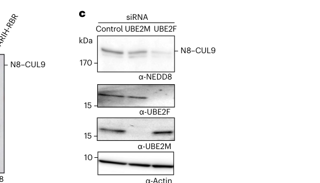

## Question

# Gene Research for Functional Annotation

## ⚠️ CRITICAL: Gene/Protein Identification Context

**BEFORE YOU BEGIN RESEARCH:** You MUST verify you are researching the CORRECT gene/protein. Gene symbols can be ambiguous, especially for less well-characterized genes from non-model organisms.

### Target Gene/Protein Identity (from UniProt):
- **UniProt Accession:** F8WDQ9
- **Protein Description:** SubName: Full=Ubiquitin conjugating enzyme E2 F (putative) {ECO:0000313|Ensembl:ENSP00000389685.1};
- **Gene Information:** Name=UBE2F {ECO:0000313|Ensembl:ENSP00000389685.1};
- **Organism (full):** Homo sapiens (Human).
- **Protein Family:** Belongs to the ubiquitin-conjugating enzyme family.
- **Key Domains:** UBC. (IPR000608); UBQ-conjugating_enzyme/RWD. (IPR016135)

### MANDATORY VERIFICATION STEPS:

1. **Check if the gene symbol "UBE2F" matches the protein description above**
2. **Verify the organism is correct:** Homo sapiens (Human).
3. **Check if protein family/domains align with what you find in literature**
4. **If you find literature for a DIFFERENT gene with the same or similar symbol, STOP**

### If Gene Symbol is Ambiguous or You Cannot Find Relevant Literature:

**DO NOT PROCEED WITH RESEARCH ON A DIFFERENT GENE.** Instead:
- State clearly: "The gene symbol 'UBE2F' is ambiguous or literature is limited for this specific protein"
- Explain what you found (e.g., "Found extensive literature on a different gene with the same symbol in a different organism")
- Describe the protein based ONLY on the UniProt information provided above
- Suggest that the protein function can be inferred from domain/family information

### Research Target:

Please provide a comprehensive research report on the gene **UBE2F** (gene ID: UBE2F, UniProt: F8WDQ9) in human.

The research report should be a detailed narrative explaining the function, biological processes, and localization of the gene product. Citations should be given for all claims.

You should prioritize authoritative reviews and primary scientific literature when conducting research. You can supplement
this with annotations you find in gene/protein databases, but these can be outdated or inaccurate.

We are specifically interested in the primary function of the gene - for enzymes, what reaction is catalyzed, and what is the substrate specificity? For transporters, what is the substrate? For structural proteins or adapters, what is the broader structural role? For signaling molecules, what is the role in the pathway.

We are interested in where in or outside the cell the gene product carries out its function.

We are also interested in the signaling or biochemical pathways in which the gene functions. We are less interested in broad pleiotropic effects, except where these elucidate the precise role.

Include evidence where possible. We are interested in both experimental evidence as well as inference from structure, evolution, or bioinformatic analysis. Precise studies should be prioritized over high-throughput, where available.

## Output

Question: You are an expert researcher providing comprehensive, well-cited information.

Provide detailed information focusing on:
1. Key concepts and definitions with current understanding
2. Recent developments and latest research (prioritize 2023-2024 sources)
3. Current applications and real-world implementations
4. Expert opinions and analysis from authoritative sources
5. Relevant statistics and data from recent studies

Format as a comprehensive research report with proper citations. Include URLs and publication dates where available.
Always prioritize recent, authoritative sources and provide specific citations for all major claims.

# Gene Research for Functional Annotation

## ⚠️ CRITICAL: Gene/Protein Identification Context

**BEFORE YOU BEGIN RESEARCH:** You MUST verify you are researching the CORRECT gene/protein. Gene symbols can be ambiguous, especially for less well-characterized genes from non-model organisms.

### Target Gene/Protein Identity (from UniProt):
- **UniProt Accession:** F8WDQ9
- **Protein Description:** SubName: Full=Ubiquitin conjugating enzyme E2 F (putative) {ECO:0000313|Ensembl:ENSP00000389685.1};
- **Gene Information:** Name=UBE2F {ECO:0000313|Ensembl:ENSP00000389685.1};
- **Organism (full):** Homo sapiens (Human).
- **Protein Family:** Belongs to the ubiquitin-conjugating enzyme family.
- **Key Domains:** UBC. (IPR000608); UBQ-conjugating_enzyme/RWD. (IPR016135)

### MANDATORY VERIFICATION STEPS:

1. **Check if the gene symbol "UBE2F" matches the protein description above**
2. **Verify the organism is correct:** Homo sapiens (Human).
3. **Check if protein family/domains align with what you find in literature**
4. **If you find literature for a DIFFERENT gene with the same or similar symbol, STOP**

### If Gene Symbol is Ambiguous or You Cannot Find Relevant Literature:

**DO NOT PROCEED WITH RESEARCH ON A DIFFERENT GENE.** Instead:
- State clearly: "The gene symbol 'UBE2F' is ambiguous or literature is limited for this specific protein"
- Explain what you found (e.g., "Found extensive literature on a different gene with the same symbol in a different organism")
- Describe the protein based ONLY on the UniProt information provided above
- Suggest that the protein function can be inferred from domain/family information

### Research Target:

Please provide a comprehensive research report on the gene **UBE2F** (gene ID: UBE2F, UniProt: F8WDQ9) in human.

The research report should be a detailed narrative explaining the function, biological processes, and localization of the gene product. Citations should be given for all claims.

You should prioritize authoritative reviews and primary scientific literature when conducting research. You can supplement
this with annotations you find in gene/protein databases, but these can be outdated or inaccurate.

We are specifically interested in the primary function of the gene - for enzymes, what reaction is catalyzed, and what is the substrate specificity? For transporters, what is the substrate? For structural proteins or adapters, what is the broader structural role? For signaling molecules, what is the role in the pathway.

We are interested in where in or outside the cell the gene product carries out its function.

We are also interested in the signaling or biochemical pathways in which the gene functions. We are less interested in broad pleiotropic effects, except where these elucidate the precise role.

Include evidence where possible. We are interested in both experimental evidence as well as inference from structure, evolution, or bioinformatic analysis. Precise studies should be prioritized over high-throughput, where available.

# Human UBE2F Functional-Annotation Report

## Executive conclusion

The requested target is the correct human gene: **UBE2F** (*ubiquitin-conjugating enzyme E2 F [putative]*; Ensembl gene **ENSG00000184182**) in *Homo sapiens*. The supplied UniProt record **F8WDQ9**, derived from Ensembl protein ENSP00000389685.1, is consistent with literature describing human UBE2F as a member of the ubiquitin-conjugating/UBC-domain family. No conflicting gene with the same symbol in another organism was used. Open Targets independently maps ENSG00000184182 to the approved human symbol UBE2F. However, F8WDQ9 is an Ensembl-derived UniProt record, so the conclusions below are strongest at the human **gene/protein-family level**; isoform-specific sequence claims should not automatically be assigned to ENSP00000389685.1 without direct sequence reconciliation. (OpenTargets Search: -UBE2F)

UBE2F’s primary function is **NEDD8 conjugation (neddylation), not conventional substrate ubiquitylation**. It accepts NEDD8 from the NAE1–UBA3 E1 enzyme onto catalytic **Cys116**, forming a transient UBE2F∼NEDD8 thioester, and—usually with the RING E3 **SAG/RBX2**—transfers NEDD8 to a lysine on a cullin substrate. Its canonical target is **CUL5**, whose neddylation activates CRL5 ubiquitin ligases. A major 2024 advance established **CUL9 Lys1881** as an additional, unusual UBE2F-dependent substrate despite CUL9 being RBX1-associated. (hornghetko2024noncanonicalassemblyneddylation pages 8-9, hornghetko2024noncanonicalassemblyneddylation pages 9-10, zhou2017neddylatione2ube2f pages 1-6, mamun2023discoveryofneddylation pages 2-4)

| Annotation category | Best-supported conclusion | Direct evidence/examples | Confidence/limitations |
|---|---|---|---|
| Identity and domain | In the supplied F8WDQ9 context, the target is human **UBE2F**, one of two mammalian NEDD8-conjugating E2 enzymes. It is a class-II E2 with a 26-residue N-terminal E1-docking extension and a conserved UBC catalytic core containing catalytic **Cys116**. | Literature distinguishes UBE2F from its paralog UBE2M/UBC12 and reports that deleting the N-terminal extension substantially impairs NEDD8 transfer; C116A is catalytically inactive. (zhou2017neddylatione2ube2f pages 19-22, zhou2017neddylatione2ube2f pages 1-6, mamun2023discoveryofneddylation pages 2-4) | **High** for gene-level function and architecture. F8WDQ9 is an Ensembl-derived UniProt context, so isoform-specific sequence details should not be inferred beyond the supplied record without direct accession-level validation. |
| Catalytic reaction | UBE2F accepts activated NEDD8 from the NAE1–UBA3 E1 by transthiolation, forming a **UBE2F-Cys116∼NEDD8 thioester**, then transfers NEDD8 to a substrate lysine with an E3 ligase. | Purified E1/E2 assays directly measure UBE2F∼NEDD8 formation; HA-9104 inhibits this intermediate and downstream CUL5 neddylation. The N-terminal region docks UBA3, while Cys116 is required for activity. (mamun2023discoveryofneddylation pages 2-4, xu2022asmallmolecule pages 6-8, xu2022asmallmolecule pages 2-4) | **High** for thioester-dependent NEDD8-E2 chemistry. UBE2F is historically named a ubiquitin-conjugating enzyme but is functionally specialized primarily for **NEDD8**, not ordinary ubiquitin transfer. |
| Substrate specificity: CUL5 | The canonical physiological axis is **UBE2F–SAG/RBX2–CUL5**. UBE2F preferentially pairs with SAG/RBX2 to neddylate CUL5 and activate CRL5, whereas UBE2M generally pairs with RBX1 to modify CUL1–CUL4. | Genetic, interaction, mutant and reconstituted biochemical studies support UBE2F-dependent CUL5 neddylation; side-by-side assays include NAE, ATP, NEDD8, UBE2F or UBE2M, and CUL5–RBX2. (hornghetko2024noncanonicalassemblyneddylation pages 1-2, hornghetko2024noncanonicalassemblyneddylation pages 15-16, zhou2017neddylatione2ube2f pages 1-6, zhou2018ube2misa pages 1-3) | **High**, but “specific” should mean strong physiological preference rather than absolute exclusivity, because newer work identifies CUL9 as another UBE2F-dependent cullin. |
| Substrate specificity: CUL9 | A 2024 study extended UBE2F specificity to **CUL9–RBX1**, an unusual exception to the conventional RBX1–UBE2M pairing. UBE2F neddylates CUL9 at **Lys1881**, enabling its noncanonical cullin–RING/RBR activity. | UBE2F knockdown reduced cellular CUL9 neddylation, whereas UBE2M knockdown had little effect. Recombinant CUL9–RBX1 was robustly modified with UBE2F, but no modification was detected with UBE2M under the reported conditions. (hornghetko2024noncanonicalassemblyneddylation pages 8-9, hornghetko2024noncanonicalassemblyneddylation pages 9-10, hornghetko2024noncanonicalassemblyneddylation media 88a05e0d) | **High** for the tested U2OS and reconstituted systems. Whether UBE2F modifies further cullins or additional CUL9 sites in other contexts remains unresolved. |
| Cellular localization | UBE2F is best regarded as an intracellular, soluble neddylation enzyme whose functional location follows NAE, SAG/RBX2 and cullin complexes; it can be recruited to nuclear DNA-damage sites. | Both UBE2F and UBE2M were reported at laser-induced DNA-damage stripes, although UBE2F depletion did not reproduce the strong DNA-damage sensitivity caused by UBE2M depletion. (zhou2018ube2misa pages 1-3, keuss2016characterizationofthe pages 16-18) | **Moderate**. Available evidence does not justify assigning UBE2F exclusively to nucleus, cytosol, membrane or a particular organelle; localization is likely dynamic and partner-dependent. |
| Downstream CRL5–NOXA pathway | UBE2F-dependent CUL5 neddylation activates CRL5, which promotes atypical **K11-linked polyubiquitylation** of pro-apoptotic NOXA on C-terminal lysines, followed by proteasomal degradation and suppression of apoptosis. | CRL5 inactivation or K11R ubiquitin accumulated NOXA and induced apoptosis; NOXA depletion rescued growth inhibition and apoptosis caused by UBE2F loss. Implicated NOXA acceptor lysines include K35, K41 and K48. (zhou2017neddylatione2ube2f pages 14-19, zhou2017neddylatione2ube2f pages 19-22, zhou2017neddylatione2ube2f pages 30-36) | **High** in studied lung-cancer models. NOXA ubiquitylation is performed by activated CRL5 ubiquitin-transfer machinery; UBE2F’s direct enzymatic product is NEDD8-conjugated CUL5, not ubiquitinated NOXA. |
| Regulation and cross-talk | UBE2F abundance and CRL5 output are negatively regulated by UBE2M. UBE2M can activate CUL3–KEAP1-dependent UBE2F degradation under basal conditions and act as a ubiquitin E2 with Parkin–DJ-1 during stress. | Stress-inducible UBE2M promoted UBE2F proteasomal degradation, inactivated CRL5 and accumulated NOXA; MLN4924 increased UBE2M while decreasing UBE2F in the reported system. (zhou2018ube2misa pages 1-3) | **Moderate-to-high** mechanistically, but context dependence is important because UBE2M and UBE2F can also compensate functionally in selected cell lineages. |
| Disease association and application | Strongest direct disease evidence concerns NSCLC, where elevated UBE2F supports survival through CRL5–NOXA. The axis is a preclinical therapeutic and radiosensitization target, not a clinically validated UBE2F-specific treatment. | Among **168 NSCLC samples**, 57.7% had high UBE2F; of these, 75.3% had high CUL5 and 76.3% low NOXA. UBE2F correlated positively with CUL5 (r²=0.651) and inversely with NOXA (r²=−0.339), both *p*<0.001. HA-9104 inhibited purified UBE2F∼NEDD8 and CUL5 neddylation with IC50 values of about 49 and 30 μM, respectively, and showed cellular growth IC50 values of 1–5 μM. (zhou2017neddylatione2ube2f pages 14-19, xu2022asmallmolecule pages 4-6, xu2022asmallmolecule pages 2-4) | **Moderate** translational confidence. HA-9104 has additional DNA-damage/translation effects, poor solubility and an approximately six-minute microsomal half-life; no approved UBE2F-selective drug or direct clinical efficacy is established. |
| Recent 2023–2024 findings | Recent work refined rather than overturned the core annotation: UBE2F can compensate for UBE2M in Treg cells, inhibitor development remains preclinical, and CUL9 is a newly established UBE2F-dependent cullin substrate. | Treg-specific loss of Ube2f alone produced no obvious phenotype, but combined Ube2m/Ube2f deletion caused more severe autoimmune inflammation than Ube2m loss alone. A 2023 review highlighted E2–E1/E3 interfaces as drug targets, while 2024 biochemical and structural work established UBE2F-dependent CUL9 neddylation. (mamun2023discoveryofneddylation pages 9-10, wu2023thefunctionalredundancy pages 1-2, hornghetko2024noncanonicalassemblyneddylation pages 8-9, hornghetko2024noncanonicalassemblyneddylation media 88a05e0d) | **High** for the reported models; Treg findings are from mice and should not be generalized directly to human immunity. CUL9 expands substrate scope, but CUL5 remains the best-established canonical target. |

*Table: Compact evidence hierarchy for human UBE2F in the UniProt F8WDQ9 context, separating its primary NEDD8-transfer chemistry from downstream CRL-dependent effects. It also highlights confidence limits and the major 2023–2024 updates.*

## 1. Identity, family, and structural organization

UBE2F is one of only two established mammalian NEDD8-conjugating E2 enzymes, the other being **UBE2M/UBC12**. It is classified as a class-II E2 containing a **26-residue N-terminal extension** followed by a conserved **UBC catalytic core**. This agrees with the supplied InterPro annotations, UBC (IPR000608) and ubiquitin-conjugating-enzyme/RWD superfamily (IPR016135). The N-terminal segment docks the NEDD8 E1, especially UBA3, while the UBC core contains catalytic **Cys116**; deleting the extension substantially impairs NEDD8 transfer, and a C116A mutant lacks normal biological activity. (zhou2017neddylatione2ube2f pages 19-22, mamun2023discoveryofneddylation pages 2-4)

The protein name retains “ubiquitin-conjugating enzyme” because UBE2F belongs structurally to the E2 family. Functionally, however, its best-established modifier is the ubiquitin-like protein **NEDD8**. It should therefore be annotated primarily as a **NEDD8 E2 conjugase** rather than as a general ubiquitin E2. (zhou2017neddylatione2ube2f pages 1-6, mamun2023discoveryofneddylation pages 2-4)

## 2. Catalytic reaction and substrate specificity

### 2.1 Reaction

The neddylation cascade proceeds as follows:

1. NAE1–UBA3 activates NEDD8 using ATP.
2. Activated NEDD8 is transferred from the E1 to UBE2F Cys116 by **transthiolation**, producing UBE2F-Cys116∼NEDD8.
3. An E3 ligase positions the charged E2 and substrate.
4. NEDD8’s C-terminal carboxyl group is transferred to the ε-amino group of a substrate lysine, forming an isopeptide bond.

Thus, the immediate UBE2F substrate is activated **NEDD8**, while its principal acceptor proteins are selected by E2–E3–cullin recognition. Purified-protein assays directly measure UBE2F∼NEDD8 thioester formation and downstream cullin neddylation. (mamun2023discoveryofneddylation pages 2-4, xu2022asmallmolecule pages 6-8, xu2022asmallmolecule pages 2-4)

### 2.2 Canonical UBE2F–SAG/RBX2–CUL5 axis

The prevailing specificity model is that **UBE2M–RBX1** modifies CUL1–CUL4, whereas **UBE2F–SAG/RBX2** preferentially modifies **CUL5**. Neddylated CUL5 undergoes conformational activation of CRL5, increasing the ability of associated ubiquitin E2s and substrate receptors to ubiquitylate recruited proteins. UBE2F therefore activates CRL5 indirectly; it does **not** itself catalyze the downstream ubiquitin chains discussed below. (hornghetko2024noncanonicalassemblyneddylation pages 1-2, zhou2017neddylatione2ube2f pages 1-6, zhou2018ube2misa pages 1-3)

Reconstituted 2024 assays used 0.5 μM NAE1–UBA3, 1 μM UBE2F or UBE2M, 1 μM cullin complex, 5 μM NEDD8 and 2.5 mM ATP, illustrating direct biochemical testing of E2/cullin selectivity. (hornghetko2024noncanonicalassemblyneddylation pages 15-16)

### 2.3 2024 expansion to CUL9

Horn-Ghetko and colleagues reported in April 2024 that CUL9 is a second strongly supported UBE2F-dependent cullin. In U2OS cells, UBE2F knockdown substantially reduced CUL9 neddylation, whereas UBE2M knockdown had little effect. Recombinant CUL9–RBX1 was robustly neddylated at **Lys1881** with UBE2F, while no modification was detected with UBE2M under the tested conditions. Neddylation enables CUL9’s unusual chimeric cullin–RING/RBR ubiquitin-ligase activity. This finding qualifies the older statement that UBE2F is “CUL5-specific”: **CUL5 remains canonical, but specificity is not absolute**. [Published April 2024; https://doi.org/10.1038/s41594-024-01257-y.] (hornghetko2024noncanonicalassemblyneddylation pages 8-9, hornghetko2024noncanonicalassemblyneddylation pages 9-10, hornghetko2024noncanonicalassemblyneddylation media 88a05e0d, hornghetko2024noncanonicalassemblyneddylation media 6b55ac8a, hornghetko2024noncanonicalassemblyneddylation media 56b056dc)

## 3. Cellular localization

UBE2F is an intracellular soluble enzyme, with function determined by access to NAE, SAG/RBX2 and cullin complexes. Available evidence does not support assigning it exclusively to the nucleus, cytoplasm, membrane, or one organelle. Both UBE2F and UBE2M can be recruited to laser-induced nuclear DNA-damage tracks, demonstrating a nuclear-accessible pool, although UBE2F depletion did not produce the strong ionizing-radiation sensitivity associated with UBE2M depletion. Localization is therefore best described as **dynamic and partner/context dependent**, rather than as a fixed compartmental residence. (zhou2018ube2misa pages 1-3, keuss2016characterizationofthe pages 16-18)

For its best-characterized biochemical role, UBE2F acts wherever SAG/RBX2–CUL5 complexes are assembled. The 2024 CUL9 work additionally places functional UBE2F in the cellular context of large CUL9–RBX1 assemblies. Direct high-resolution mapping of endogenous UBE2F across human tissues and organelles remains comparatively limited. (hornghetko2024noncanonicalassemblyneddylation pages 8-9, hornghetko2024noncanonicalassemblyneddylation media ed9adfbb, hornghetko2024noncanonicalassemblyneddylation media 56b056dc)

## 4. Principal pathway and downstream biological consequences

### CRL5–NOXA apoptosis-control pathway

The most precisely characterized downstream pathway is:

**UBE2F → CUL5 neddylation → CRL5 activation → NOXA K11-linked polyubiquitylation → proteasomal degradation → reduced apoptosis.**

In lung-cancer models, UBE2F forms a functional axis with SAG/RBX2 and CUL5. Activated CRL5 modifies the pro-apoptotic BH3-only protein **NOXA**, including acceptor lysines K35, K41 and K48, with atypical **K11-linked ubiquitin chains** rather than conventional K48 chains. CRL5 inactivation or expression of K11R ubiquitin accumulates NOXA and induces apoptosis; NOXA depletion rescues growth suppression and apoptosis caused by UBE2F loss, providing causal rather than merely correlative evidence. [Published February 2017; https://doi.org/10.1158/1078-0432.CCR-16-1585.] (zhou2017neddylatione2ube2f pages 14-19, zhou2017neddylatione2ube2f pages 19-22, zhou2017neddylatione2ube2f pages 30-36)

This distinction is important for annotation: **UBE2F catalyzes NEDD8 transfer to CUL5; the activated CRL5 machinery subsequently catalyzes ubiquitin transfer to NOXA.** Consequently, NOXA is a downstream CRL5 ubiquitination substrate, not necessarily a direct UBE2F acceptor substrate. (zhou2017neddylatione2ube2f pages 14-19, zhou2017neddylatione2ube2f pages 1-6)

### Regulation by UBE2M

UBE2F is subject to negative cross-talk from the other NEDD8 E2. A 2018 study found that stress-inducible UBE2M can promote UBE2F degradation in two contexts: as a neddylation E2 activating CUL3–KEAP1 under basal conditions and as a ubiquitin E2 working with Parkin–DJ-1 during stress. UBE2F loss then inactivates CRL5 and accumulates NOXA. MLN4924 increased UBE2M while decreasing UBE2F in that experimental system. [Published June 21, 2018; https://doi.org/10.1016/j.molcel.2018.06.002.] (zhou2018ube2misa pages 1-3)

## 5. Disease evidence and recent quantitative data

The strongest direct human disease evidence is in **non-small-cell lung cancer (NSCLC)**. In a cohort of **168 NSCLC specimens**, 57.7% showed high UBE2F. Among the high-UBE2F tumors, 75.3% also had high CUL5 and 76.3% had low NOXA. UBE2F correlated positively with CUL5 (r²=0.651) and inversely with NOXA (r²=−0.339), both *p*<0.001. Within high-UBE2F tumors, high CUL5 and low NOXA were associated with poorer survival (*p*=0.001 and *p*=0.005). Genetic depletion and catalytic-mutant experiments further showed that UBE2F activity supports lung-cancer growth in culture and xenografts. (zhou2017neddylatione2ube2f pages 14-19, zhou2017neddylatione2ube2f pages 19-22)

These data support an oncogenic dependency in selected tumors, but they do not establish UBE2F as a universal cancer driver. Open Targets lists associations with several diseases, including neurodegenerative disease and ovarian neoplasm, but the displayed scores are modest and draw partly on high-throughput evidence; these associations are materially weaker than the mechanistic CRL5–NOXA evidence in NSCLC. (OpenTargets Search: -UBE2F)

## 6. Recent developments, 2023–2024

### 6.1 Functional redundancy in regulatory T cells—2023

A mouse genetic study published August 18, 2023 found that Treg-specific deletion of **Ube2f alone** produced no obvious phenotype, whereas combined Ube2m/Ube2f deletion caused more severe autoimmune inflammation than Ube2m deletion alone, including lymphocyte infiltration in several organs at approximately postnatal day 20. The authors concluded that Ube2m substantially compensates for Ube2f in this lineage. This demonstrates context-dependent redundancy and cautions against treating the UBE2M/CUL1–4 versus UBE2F/CUL5 division as completely insulated in vivo. [https://doi.org/10.34133/research.0212.] (wu2023thefunctionalredundancy pages 1-2)

### 6.2 Inhibitor-development assessment—2023

A September 2023 review emphasized UBE2F’s catalytic Cys116, N-terminal E1-docking region and E2–E3 interfaces as druggable concepts. It argued that selective disruption of UBE2F–E1 or UBE2F–E3 interactions may offer a narrower therapeutic window than global NAE blockade, while acknowledging that direct E2 inhibitors remain early-stage. [https://doi.org/10.1038/s41389-023-00490-2.] (mamun2023discoveryofneddylation pages 9-10, mamun2023discoveryofneddylation pages 2-4)

### 6.3 CUL9 mechanism—2024

The April 2024 CUL9 study is the most important recent revision to UBE2F functional annotation. It expands the verified cullin substrate spectrum beyond CUL5 and identifies a UBE2F-dependent route for activating a 1.8-MDa CUL9 assembly with chimeric cullin–RING/RBR ubiquitin-ligase activity. The result was supported by both cellular knockdown and side-by-side purified reactions with UBE2F and UBE2M. (hornghetko2024noncanonicalassemblyneddylation pages 8-9, hornghetko2024noncanonicalassemblyneddylation pages 9-10, hornghetko2024noncanonicalassemblyneddylation media 88a05e0d, hornghetko2024noncanonicalassemblyneddylation media 6b55ac8a)

## 7. Applications and translational status

### Genetic and biochemical applications

UBE2F knockdown, catalytic C116A substitution, UBE2F∼NEDD8 thioester assays, cullin-neddylation assays, and downstream NOXA measurements are established tools for separating UBE2F-dependent CRL5 activity from UBE2M-dependent CRL1–4 biology. The 2024 CUL9 assays now provide an additional specificity readout. (hornghetko2024noncanonicalassemblyneddylation pages 15-16, zhou2017neddylatione2ube2f pages 19-22, xu2022asmallmolecule pages 2-4)

### HA-9104 as a preclinical chemical probe

HA-9104 was reported in October 2022 as the first small molecule intended to selectively target the UBE2F–CRL5 axis. It emerged from virtual screening of **240,000 compounds** and subsequent optimization. In purified systems it did not inhibit E1∼NEDD8 formation at concentrations up to 200 μM, but inhibited UBE2F∼NEDD8 formation at approximately **49 μM IC50** and CUL5 neddylation at approximately **30 μM IC50**. Cellular growth IC50 values were approximately 1–5 μM. [https://doi.org/10.1038/s41392-022-01182-w.] (xu2022asmallmolecule pages 4-6, xu2022asmallmolecule pages 2-4)

HA-9104 reduced UBE2F protein, preferentially suppressed CUL5 neddylation, accumulated NOXA and induced apoptosis. It produced radiosensitization enhancement ratios of **1.41** in H1650 and **1.38** in MIAPaCa-2 cells. In H1650 xenografts, 30 mg/kg intraperitoneally once daily for 19 days reduced tumor burden; with 1 Gy radiation daily for 15 days, complete regression occurred in 9/16 tumors versus 4/15 with radiation alone. (xu2022asmallmolecule pages 4-6, xu2022asmallmolecule pages 6-8)

Nevertheless, HA-9104 is not a clean, clinically ready UBE2F inhibitor. It also caused replication stress, reactive oxygen species, DNA damage and G2/M arrest, possibly through a 7-azaindole-mediated DNA interaction. Its precise binding site remains incompletely resolved, it affected global translation, had poor solubility, and showed an approximately **six-minute microsomal half-life**. Thus, it is best regarded as an early preclinical probe with polypharmacology, not definitive pharmacological validation of UBE2F. (xu2022asmallmolecule pages 4-6, xu2022asmallmolecule pages 6-8, xu2022asmallmolecule pages 4-4)

There is currently no evidence in the retrieved literature for an **approved UBE2F-selective drug** or completed clinical trial demonstrating benefit from direct UBE2F inhibition. Pevonedistat/MLN4924 inhibits NAE upstream and therefore blocks neddylation much more broadly; clinical experience with it cannot be attributed specifically to UBE2F. (mamun2023discoveryofneddylation pages 9-10, zheng2021targetingneddylatione2s pages 9-10)

## 8. Expert assessment and annotation confidence

The evidence supports the following high-confidence annotation:

> **Human UBE2F is a Cys116-dependent NEDD8-conjugating E2 enzyme whose N-terminal extension docks the NEDD8 E1. It preferentially partners with SAG/RBX2 to neddylate CUL5, activating CRL5 ubiquitin ligases; CUL9 Lys1881 is an additional experimentally validated UBE2F-dependent cullin substrate.**

CUL5 specificity, Cys116 dependence and the CRL5–NOXA mechanism are supported by orthogonal biochemical, mutational, cellular and animal evidence. CUL9 is supported by rigorous 2024 cell-based and reconstituted evidence. Localization is less precisely resolved and should be annotated as intracellular and dynamic rather than assigned to a single compartment. Cancer-targeting claims remain preclinical: the patient correlations and genetic dependencies are compelling, but existing chemical probes have selectivity and pharmacokinetic limitations. Finally, lineage-specific mouse data show that UBE2M can compensate for UBE2F, so pathway specificity should be treated as a strong biochemical preference—not universal biological exclusivity. (hornghetko2024noncanonicalassemblyneddylation pages 8-9, zhou2017neddylatione2ube2f pages 14-19, mamun2023discoveryofneddylation pages 2-4, xu2022asmallmolecule pages 6-8, wu2023thefunctionalredundancy pages 1-2)

References

1. (OpenTargets Search: -UBE2F): Open Targets Query (-UBE2F, 5 results). Buniello, A. et al. (2025). Open Targets Platform: facilitating therapeutic hypotheses building in drug discovery. Nucleic Acids Research.

2. (hornghetko2024noncanonicalassemblyneddylation pages 8-9): Daniel Horn-Ghetko, Linus V. M. Hopf, Ishita Tripathi-Giesgen, Jiale Du, Sebastian Kostrhon, D. Tung Vu, Viola Beier, Barbara Steigenberger, J. Rajan Prabu, Luca Stier, Elias M. Bruss, Matthias Mann, Yue Xiong, and Brenda A. Schulman. Noncanonical assembly, neddylation and chimeric cullin–ring/rbr ubiquitylation by the 1.8 mda cul9 e3 ligase complex. Nature Structural & Molecular Biology, 31:1083-1094, Apr 2024. URL: https://doi.org/10.1038/s41594-024-01257-y, doi:10.1038/s41594-024-01257-y. This article has 17 citations and is from a highest quality peer-reviewed journal.

3. (hornghetko2024noncanonicalassemblyneddylation pages 9-10): Daniel Horn-Ghetko, Linus V. M. Hopf, Ishita Tripathi-Giesgen, Jiale Du, Sebastian Kostrhon, D. Tung Vu, Viola Beier, Barbara Steigenberger, J. Rajan Prabu, Luca Stier, Elias M. Bruss, Matthias Mann, Yue Xiong, and Brenda A. Schulman. Noncanonical assembly, neddylation and chimeric cullin–ring/rbr ubiquitylation by the 1.8 mda cul9 e3 ligase complex. Nature Structural & Molecular Biology, 31:1083-1094, Apr 2024. URL: https://doi.org/10.1038/s41594-024-01257-y, doi:10.1038/s41594-024-01257-y. This article has 17 citations and is from a highest quality peer-reviewed journal.

4. (zhou2017neddylatione2ube2f pages 1-6): Weihua Zhou, Jie Xu, Haomin Li, Ming Xu, Zhijian J. Chen, Wenyi Wei, Zhenqiang Pan, and Yi Sun. Neddylation e2 ube2f promotes the survival of lung cancer cells by activating crl5 to degrade noxa via the k11 linkage. Clinical Cancer Research, 23(4):1104-1116, Feb 2017. URL: https://doi.org/10.1158/1078-0432.ccr-16-1585, doi:10.1158/1078-0432.ccr-16-1585. This article has 152 citations and is from a highest quality peer-reviewed journal.

5. (mamun2023discoveryofneddylation pages 2-4): MAA Mamun, Ying Liu, Yin-Ping Geng, Yi-Chao Zheng, Ya Gao, Jian-Gang Sun, Long-Fei Zhao, Li-Juan Zhao, and Hong-Min Liu. Discovery of neddylation e2s inhibitors with therapeutic activity. Sep 2023. URL: https://doi.org/10.1038/s41389-023-00490-2, doi:10.1038/s41389-023-00490-2. This article has 16 citations and is from a domain leading peer-reviewed journal.

6. (zhou2017neddylatione2ube2f pages 19-22): Weihua Zhou, Jie Xu, Haomin Li, Ming Xu, Zhijian J. Chen, Wenyi Wei, Zhenqiang Pan, and Yi Sun. Neddylation e2 ube2f promotes the survival of lung cancer cells by activating crl5 to degrade noxa via the k11 linkage. Clinical Cancer Research, 23(4):1104-1116, Feb 2017. URL: https://doi.org/10.1158/1078-0432.ccr-16-1585, doi:10.1158/1078-0432.ccr-16-1585. This article has 152 citations and is from a highest quality peer-reviewed journal.

7. (xu2022asmallmolecule pages 6-8): Tiantian Xu, Qisheng Ma, Yanan Li, Qing Yu, Peichen Pan, Yawen Zheng, Zhijian Li, Xiufang Xiong, Tingjun Hou, Bin Yu, Hongmin Liu, and Yi Sun. A small molecule inhibitor of the ube2f-crl5 axis induces apoptosis and radiosensitization in lung cancer. Signal Transduction and Targeted Therapy, Oct 2022. URL: https://doi.org/10.1038/s41392-022-01182-w, doi:10.1038/s41392-022-01182-w. This article has 62 citations and is from a peer-reviewed journal.

8. (xu2022asmallmolecule pages 2-4): Tiantian Xu, Qisheng Ma, Yanan Li, Qing Yu, Peichen Pan, Yawen Zheng, Zhijian Li, Xiufang Xiong, Tingjun Hou, Bin Yu, Hongmin Liu, and Yi Sun. A small molecule inhibitor of the ube2f-crl5 axis induces apoptosis and radiosensitization in lung cancer. Signal Transduction and Targeted Therapy, Oct 2022. URL: https://doi.org/10.1038/s41392-022-01182-w, doi:10.1038/s41392-022-01182-w. This article has 62 citations and is from a peer-reviewed journal.

9. (hornghetko2024noncanonicalassemblyneddylation pages 1-2): Daniel Horn-Ghetko, Linus V. M. Hopf, Ishita Tripathi-Giesgen, Jiale Du, Sebastian Kostrhon, D. Tung Vu, Viola Beier, Barbara Steigenberger, J. Rajan Prabu, Luca Stier, Elias M. Bruss, Matthias Mann, Yue Xiong, and Brenda A. Schulman. Noncanonical assembly, neddylation and chimeric cullin–ring/rbr ubiquitylation by the 1.8 mda cul9 e3 ligase complex. Nature Structural & Molecular Biology, 31:1083-1094, Apr 2024. URL: https://doi.org/10.1038/s41594-024-01257-y, doi:10.1038/s41594-024-01257-y. This article has 17 citations and is from a highest quality peer-reviewed journal.

10. (hornghetko2024noncanonicalassemblyneddylation pages 15-16): Daniel Horn-Ghetko, Linus V. M. Hopf, Ishita Tripathi-Giesgen, Jiale Du, Sebastian Kostrhon, D. Tung Vu, Viola Beier, Barbara Steigenberger, J. Rajan Prabu, Luca Stier, Elias M. Bruss, Matthias Mann, Yue Xiong, and Brenda A. Schulman. Noncanonical assembly, neddylation and chimeric cullin–ring/rbr ubiquitylation by the 1.8 mda cul9 e3 ligase complex. Nature Structural & Molecular Biology, 31:1083-1094, Apr 2024. URL: https://doi.org/10.1038/s41594-024-01257-y, doi:10.1038/s41594-024-01257-y. This article has 17 citations and is from a highest quality peer-reviewed journal.

11. (zhou2018ube2misa pages 1-3): Weihua Zhou, Jie Xu, Mingjia Tan, Haomin Li, Hua Li, Wenyi Wei, and Yi Sun. Ube2m is a stress-inducible dual e2 for neddylation and ubiquitylation that promotes targeted degradation of ube2f. Molecular cell, 70 6:1008-1024.e6, Jun 2018. URL: https://doi.org/10.1016/j.molcel.2018.06.002, doi:10.1016/j.molcel.2018.06.002. This article has 106 citations and is from a highest quality peer-reviewed journal.

12. (hornghetko2024noncanonicalassemblyneddylation media 88a05e0d): Daniel Horn-Ghetko, Linus V. M. Hopf, Ishita Tripathi-Giesgen, Jiale Du, Sebastian Kostrhon, D. Tung Vu, Viola Beier, Barbara Steigenberger, J. Rajan Prabu, Luca Stier, Elias M. Bruss, Matthias Mann, Yue Xiong, and Brenda A. Schulman. Noncanonical assembly, neddylation and chimeric cullin–ring/rbr ubiquitylation by the 1.8 mda cul9 e3 ligase complex. Nature Structural & Molecular Biology, 31:1083-1094, Apr 2024. URL: https://doi.org/10.1038/s41594-024-01257-y, doi:10.1038/s41594-024-01257-y. This article has 17 citations and is from a highest quality peer-reviewed journal.

13. (keuss2016characterizationofthe pages 16-18): Matthew J. Keuss, Yann Thomas, Robin Mcarthur, Nicola T. Wood, Axel Knebel, and Thimo Kurz. Characterization of the mammalian family of dcn-type nedd8 e3 ligases. Journal of Cell Science, 129:1441-1454, Apr 2016. URL: https://doi.org/10.1242/jcs.181784, doi:10.1242/jcs.181784. This article has 59 citations and is from a domain leading peer-reviewed journal.

14. (zhou2017neddylatione2ube2f pages 14-19): Weihua Zhou, Jie Xu, Haomin Li, Ming Xu, Zhijian J. Chen, Wenyi Wei, Zhenqiang Pan, and Yi Sun. Neddylation e2 ube2f promotes the survival of lung cancer cells by activating crl5 to degrade noxa via the k11 linkage. Clinical Cancer Research, 23(4):1104-1116, Feb 2017. URL: https://doi.org/10.1158/1078-0432.ccr-16-1585, doi:10.1158/1078-0432.ccr-16-1585. This article has 152 citations and is from a highest quality peer-reviewed journal.

15. (zhou2017neddylatione2ube2f pages 30-36): Weihua Zhou, Jie Xu, Haomin Li, Ming Xu, Zhijian J. Chen, Wenyi Wei, Zhenqiang Pan, and Yi Sun. Neddylation e2 ube2f promotes the survival of lung cancer cells by activating crl5 to degrade noxa via the k11 linkage. Clinical Cancer Research, 23(4):1104-1116, Feb 2017. URL: https://doi.org/10.1158/1078-0432.ccr-16-1585, doi:10.1158/1078-0432.ccr-16-1585. This article has 152 citations and is from a highest quality peer-reviewed journal.

16. (xu2022asmallmolecule pages 4-6): Tiantian Xu, Qisheng Ma, Yanan Li, Qing Yu, Peichen Pan, Yawen Zheng, Zhijian Li, Xiufang Xiong, Tingjun Hou, Bin Yu, Hongmin Liu, and Yi Sun. A small molecule inhibitor of the ube2f-crl5 axis induces apoptosis and radiosensitization in lung cancer. Signal Transduction and Targeted Therapy, Oct 2022. URL: https://doi.org/10.1038/s41392-022-01182-w, doi:10.1038/s41392-022-01182-w. This article has 62 citations and is from a peer-reviewed journal.

17. (mamun2023discoveryofneddylation pages 9-10): MAA Mamun, Ying Liu, Yin-Ping Geng, Yi-Chao Zheng, Ya Gao, Jian-Gang Sun, Long-Fei Zhao, Li-Juan Zhao, and Hong-Min Liu. Discovery of neddylation e2s inhibitors with therapeutic activity. Sep 2023. URL: https://doi.org/10.1038/s41389-023-00490-2, doi:10.1038/s41389-023-00490-2. This article has 16 citations and is from a domain leading peer-reviewed journal.

18. (wu2023thefunctionalredundancy pages 1-2): Di Wu and Yi Sun. The functional redundancy of neddylation e2s and e3s in modulating the fitness of regulatory t cells. Research, Aug 2023. URL: https://doi.org/10.34133/research.0212, doi:10.34133/research.0212. This article has 19 citations and is from a peer-reviewed journal.

19. (hornghetko2024noncanonicalassemblyneddylation media 6b55ac8a): Daniel Horn-Ghetko, Linus V. M. Hopf, Ishita Tripathi-Giesgen, Jiale Du, Sebastian Kostrhon, D. Tung Vu, Viola Beier, Barbara Steigenberger, J. Rajan Prabu, Luca Stier, Elias M. Bruss, Matthias Mann, Yue Xiong, and Brenda A. Schulman. Noncanonical assembly, neddylation and chimeric cullin–ring/rbr ubiquitylation by the 1.8 mda cul9 e3 ligase complex. Nature Structural & Molecular Biology, 31:1083-1094, Apr 2024. URL: https://doi.org/10.1038/s41594-024-01257-y, doi:10.1038/s41594-024-01257-y. This article has 17 citations and is from a highest quality peer-reviewed journal.

20. (hornghetko2024noncanonicalassemblyneddylation media 56b056dc): Daniel Horn-Ghetko, Linus V. M. Hopf, Ishita Tripathi-Giesgen, Jiale Du, Sebastian Kostrhon, D. Tung Vu, Viola Beier, Barbara Steigenberger, J. Rajan Prabu, Luca Stier, Elias M. Bruss, Matthias Mann, Yue Xiong, and Brenda A. Schulman. Noncanonical assembly, neddylation and chimeric cullin–ring/rbr ubiquitylation by the 1.8 mda cul9 e3 ligase complex. Nature Structural & Molecular Biology, 31:1083-1094, Apr 2024. URL: https://doi.org/10.1038/s41594-024-01257-y, doi:10.1038/s41594-024-01257-y. This article has 17 citations and is from a highest quality peer-reviewed journal.

21. (hornghetko2024noncanonicalassemblyneddylation media ed9adfbb): Daniel Horn-Ghetko, Linus V. M. Hopf, Ishita Tripathi-Giesgen, Jiale Du, Sebastian Kostrhon, D. Tung Vu, Viola Beier, Barbara Steigenberger, J. Rajan Prabu, Luca Stier, Elias M. Bruss, Matthias Mann, Yue Xiong, and Brenda A. Schulman. Noncanonical assembly, neddylation and chimeric cullin–ring/rbr ubiquitylation by the 1.8 mda cul9 e3 ligase complex. Nature Structural & Molecular Biology, 31:1083-1094, Apr 2024. URL: https://doi.org/10.1038/s41594-024-01257-y, doi:10.1038/s41594-024-01257-y. This article has 17 citations and is from a highest quality peer-reviewed journal.

22. (xu2022asmallmolecule pages 4-4): Tiantian Xu, Qisheng Ma, Yanan Li, Qing Yu, Peichen Pan, Yawen Zheng, Zhijian Li, Xiufang Xiong, Tingjun Hou, Bin Yu, Hongmin Liu, and Yi Sun. A small molecule inhibitor of the ube2f-crl5 axis induces apoptosis and radiosensitization in lung cancer. Signal Transduction and Targeted Therapy, Oct 2022. URL: https://doi.org/10.1038/s41392-022-01182-w, doi:10.1038/s41392-022-01182-w. This article has 62 citations and is from a peer-reviewed journal.

23. (zheng2021targetingneddylatione2s pages 9-10): Yi-Chao Zheng, Yan-Jia Guo, Bo Wang, Chong Wang, M. A. A. Mamun, Ya Gao, and Hong-Min Liu. Targeting neddylation e2s: a novel therapeutic strategy in cancer. Journal of Hematology & Oncology, Apr 2021. URL: https://doi.org/10.1186/s13045-021-01070-w, doi:10.1186/s13045-021-01070-w. This article has 74 citations and is from a domain leading peer-reviewed journal.

## Artifacts

- [Edison artifact artifact-00](UBE2F-deep-research-falcon_artifacts/artifact-00.md)

## Citations

1. hornghetko2024noncanonicalassemblyneddylation pages 15-16
2. wu2023thefunctionalredundancy pages 1-2
3. hornghetko2024noncanonicalassemblyneddylation pages 8-9
4. hornghetko2024noncanonicalassemblyneddylation pages 9-10
5. mamun2023discoveryofneddylation pages 2-4
6. xu2022asmallmolecule pages 6-8
7. xu2022asmallmolecule pages 2-4
8. hornghetko2024noncanonicalassemblyneddylation pages 1-2
9. keuss2016characterizationofthe pages 16-18
10. xu2022asmallmolecule pages 4-6
11. mamun2023discoveryofneddylation pages 9-10
12. xu2022asmallmolecule pages 4-4
13. putative
14. Published April 2024; https://doi.org/10.1038/s41594-024-01257-y.
15. Published February 2017; https://doi.org/10.1158/1078-0432.CCR-16-1585.
16. Published June 21, 2018; https://doi.org/10.1016/j.molcel.2018.06.002.
17. https://doi.org/10.34133/research.0212.
18. https://doi.org/10.1038/s41389-023-00490-2.
19. https://doi.org/10.1038/s41392-022-01182-w.
20. https://doi.org/10.1038/s41594-024-01257-y.]
21. https://doi.org/10.1158/1078-0432.CCR-16-1585.]
22. https://doi.org/10.1016/j.molcel.2018.06.002.]
23. https://doi.org/10.34133/research.0212.]
24. https://doi.org/10.1038/s41389-023-00490-2.]
25. https://doi.org/10.1038/s41392-022-01182-w.]
26. https://doi.org/10.1038/s41594-024-01257-y,
27. https://doi.org/10.1158/1078-0432.ccr-16-1585,
28. https://doi.org/10.1038/s41389-023-00490-2,
29. https://doi.org/10.1038/s41392-022-01182-w,
30. https://doi.org/10.1016/j.molcel.2018.06.002,
31. https://doi.org/10.1242/jcs.181784,
32. https://doi.org/10.34133/research.0212,
33. https://doi.org/10.1186/s13045-021-01070-w,