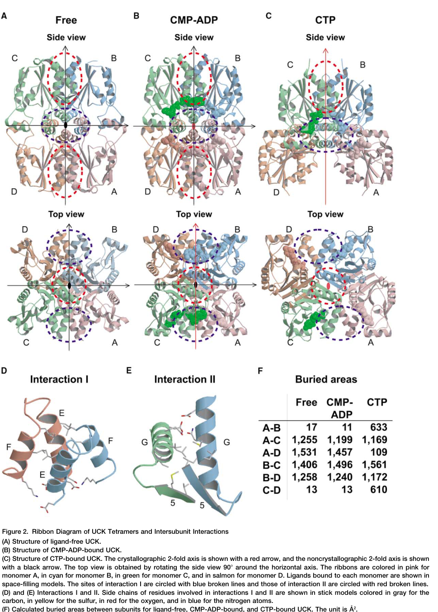

## Question

# Gene Research for Functional Annotation

## ⚠️ CRITICAL: Gene/Protein Identification Context

**BEFORE YOU BEGIN RESEARCH:** You MUST verify you are researching the CORRECT gene/protein. Gene symbols can be ambiguous, especially for less well-characterized genes from non-model organisms.

### Target Gene/Protein Identity (from UniProt):
- **UniProt Accession:** Q9BZX2
- **Protein Description:** RecName: Full=Uridine-cytidine kinase 2; Short=UCK 2; EC=2.7.1.48 {ECO:0000269|PubMed:11306702, ECO:0000269|PubMed:11494055}; AltName: Full=Cytidine monophosphokinase 2; AltName: Full=Testis-specific protein TSA903; AltName: Full=Uridine monophosphokinase 2;
- **Gene Information:** Name=UCK2; Synonyms=UMPK;
- **Organism (full):** Homo sapiens (Human).
- **Protein Family:** Belongs to the uridine kinase family. .
- **Key Domains:** P-loop_NTPase. (IPR027417); PRK/URK. (IPR006083); Uridine_kinase-like. (IPR000764); PRK (PF00485)

### MANDATORY VERIFICATION STEPS:

1. **Check if the gene symbol "UCK2" matches the protein description above**
2. **Verify the organism is correct:** Homo sapiens (Human).
3. **Check if protein family/domains align with what you find in literature**
4. **If you find literature for a DIFFERENT gene with the same or similar symbol, STOP**

### If Gene Symbol is Ambiguous or You Cannot Find Relevant Literature:

**DO NOT PROCEED WITH RESEARCH ON A DIFFERENT GENE.** Instead:
- State clearly: "The gene symbol 'UCK2' is ambiguous or literature is limited for this specific protein"
- Explain what you found (e.g., "Found extensive literature on a different gene with the same symbol in a different organism")
- Describe the protein based ONLY on the UniProt information provided above
- Suggest that the protein function can be inferred from domain/family information

### Research Target:

Please provide a comprehensive research report on the gene **UCK2** (gene ID: UCK2, UniProt: Q9BZX2) in human.

The research report should be a detailed narrative explaining the function, biological processes, and localization of the gene product. Citations should be given for all claims.

You should prioritize authoritative reviews and primary scientific literature when conducting research. You can supplement
this with annotations you find in gene/protein databases, but these can be outdated or inaccurate.

We are specifically interested in the primary function of the gene - for enzymes, what reaction is catalyzed, and what is the substrate specificity? For transporters, what is the substrate? For structural proteins or adapters, what is the broader structural role? For signaling molecules, what is the role in the pathway.

We are interested in where in or outside the cell the gene product carries out its function.

We are also interested in the signaling or biochemical pathways in which the gene functions. We are less interested in broad pleiotropic effects, except where these elucidate the precise role.

Include evidence where possible. We are interested in both experimental evidence as well as inference from structure, evolution, or bioinformatic analysis. Precise studies should be prioritized over high-throughput, where available.

## Output

Question: You are an expert researcher providing comprehensive, well-cited information.

Provide detailed information focusing on:
1. Key concepts and definitions with current understanding
2. Recent developments and latest research (prioritize 2023-2024 sources)
3. Current applications and real-world implementations
4. Expert opinions and analysis from authoritative sources
5. Relevant statistics and data from recent studies

Format as a comprehensive research report with proper citations. Include URLs and publication dates where available.
Always prioritize recent, authoritative sources and provide specific citations for all major claims.

# Gene Research for Functional Annotation

## ⚠️ CRITICAL: Gene/Protein Identification Context

**BEFORE YOU BEGIN RESEARCH:** You MUST verify you are researching the CORRECT gene/protein. Gene symbols can be ambiguous, especially for less well-characterized genes from non-model organisms.

### Target Gene/Protein Identity (from UniProt):
- **UniProt Accession:** Q9BZX2
- **Protein Description:** RecName: Full=Uridine-cytidine kinase 2; Short=UCK 2; EC=2.7.1.48 {ECO:0000269|PubMed:11306702, ECO:0000269|PubMed:11494055}; AltName: Full=Cytidine monophosphokinase 2; AltName: Full=Testis-specific protein TSA903; AltName: Full=Uridine monophosphokinase 2;
- **Gene Information:** Name=UCK2; Synonyms=UMPK;
- **Organism (full):** Homo sapiens (Human).
- **Protein Family:** Belongs to the uridine kinase family. .
- **Key Domains:** P-loop_NTPase. (IPR027417); PRK/URK. (IPR006083); Uridine_kinase-like. (IPR000764); PRK (PF00485)

### MANDATORY VERIFICATION STEPS:

1. **Check if the gene symbol "UCK2" matches the protein description above**
2. **Verify the organism is correct:** Homo sapiens (Human).
3. **Check if protein family/domains align with what you find in literature**
4. **If you find literature for a DIFFERENT gene with the same or similar symbol, STOP**

### If Gene Symbol is Ambiguous or You Cannot Find Relevant Literature:

**DO NOT PROCEED WITH RESEARCH ON A DIFFERENT GENE.** Instead:
- State clearly: "The gene symbol 'UCK2' is ambiguous or literature is limited for this specific protein"
- Explain what you found (e.g., "Found extensive literature on a different gene with the same symbol in a different organism")
- Describe the protein based ONLY on the UniProt information provided above
- Suggest that the protein function can be inferred from domain/family information

### Research Target:

Please provide a comprehensive research report on the gene **UCK2** (gene ID: UCK2, UniProt: Q9BZX2) in human.

The research report should be a detailed narrative explaining the function, biological processes, and localization of the gene product. Citations should be given for all claims.

You should prioritize authoritative reviews and primary scientific literature when conducting research. You can supplement
this with annotations you find in gene/protein databases, but these can be outdated or inaccurate.

We are specifically interested in the primary function of the gene - for enzymes, what reaction is catalyzed, and what is the substrate specificity? For transporters, what is the substrate? For structural proteins or adapters, what is the broader structural role? For signaling molecules, what is the role in the pathway.

We are interested in where in or outside the cell the gene product carries out its function.

We are also interested in the signaling or biochemical pathways in which the gene functions. We are less interested in broad pleiotropic effects, except where these elucidate the precise role.

Include evidence where possible. We are interested in both experimental evidence as well as inference from structure, evolution, or bioinformatic analysis. Precise studies should be prioritized over high-throughput, where available.

## Comprehensive Research Report: Human **UCK2** (UniProt **Q9BZX2**) — Functional Annotation, Recent Research, and Applications

### 0) Target verification (gene/protein identity)
The evidence summarized here pertains specifically to **human uridine–cytidine kinase 2** (**UCK2**; EC **2.7.1.48**), corresponding to **UniProt Q9BZX2**, a pyrimidine ribonucleoside kinase that forms a homotetramer and is distinct from the related enzymes **UCK1** and **UCKL1**. This specificity is explicit in primary structural work on human UCK2 and in pharmacologic studies using UCK2-targeting knockdown/biochemical assays. (suzuki2004structuralbasisfor pages 1-3, sarkisjan2016thecytidineanalog pages 1-2, mashayekh2022structurebasedprototypingof pages 6-12)

### 1) Key concepts and definitions (current understanding)
#### 1.1 Pyrimidine nucleoside salvage and “rate-limiting” first phosphorylation
**Pyrimidine salvage** refers to recovery of pyrimidine nucleosides (notably **uridine** and **cytidine**) from extracellular sources or nucleic-acid turnover, converting them back into nucleotide pools. **UCK2 catalyzes the first committed phosphorylation step**, converting nucleosides to **nucleoside monophosphates**, which can then be further phosphorylated to di- and triphosphates for incorporation into RNA/DNA or other metabolic uses. This first phosphorylation step is often described as functionally rate-limiting for ribonucleoside salvage. (suzuki2004structuralbasisfor pages 1-3, okesliarmlovich2019discoveryofsmall pages 1-3)

#### 1.2 Enzymatic reaction catalyzed by UCK2
Human UCK2 catalyzes **ATP-dependent phosphorylation** of the pyrimidine ribonucleosides:
- **Uridine → UMP**
- **Cytidine → CMP**  
with ATP serving as the phosphate donor. (suzuki2004structuralbasisfor pages 1-3, rompay2001phosphorylationofuridine pages 3-4)

### 2) Core molecular function: substrates, specificity, and kinetics
#### 2.1 Substrate class specificity (ribo vs deoxy; pyrimidine vs purine)
Recombinant human UCK1 and UCK2 both phosphorylate **uridine and cytidine**, and **do not** phosphorylate purine ribonucleosides (adenosine/guanosine) or **2′-deoxyribonucleosides** under tested conditions, supporting stringent selection for **pyrimidine ribonucleosides**. (rompay2001phosphorylationofuridine pages 3-4, suzuki2004structuralbasisfor pages 1-3)

#### 2.2 Quantitative kinetic differences: UCK2 vs UCK1
In a foundational comparative enzymology study (van Rompay et al., 2001), UCK2 exhibited:
- **Lower Km** for uridine and cytidine than UCK1 (approx. **4–6× lower**), and 
- **Higher Vmax**, resulting in markedly higher catalytic efficiency (**kcat/Km**) for UCK2 than UCK1. (rompay2001phosphorylationofuridine pages 3-4)

#### 2.3 Nucleoside analog phosphorylation (drug/probe activation)
UCK2 phosphorylates a range of **uridine/cytidine nucleoside analogs**, enabling their conversion into active nucleotide metabolites. A broad panel tested in recombinant enzymes showed phosphorylation of multiple base-modified analogs (selected examples):
- **6-azauridine** (UCK1 & UCK2) 
- **6-azacytidine** (reported as **UCK2-only** in that screen)
- **5-fluorouridine**, **4-thiouridine**, **5-bromouridine**, and multiple N4-substituted cytidines (various tolerances)
while **sugar-modified cytidine analogs** such as araC and certain deoxy/dideoxy analogs were not substrates, consistent with ribose-OH requirements. (rompay2001phosphorylationofuridine pages 3-4)

Primary structural work also notes phosphorylation of **cytotoxic ribonucleoside analogs** including **5-fluorouridine** and **cyclopentenyl-cytidine** derivatives as UCK substrates. (suzuki2004structuralbasisfor pages 1-3)

### 3) Structure, catalytic mechanism, and regulation
#### 3.1 Oligomeric state and fold
Human UCK2 adopts an **NMP kinase-like fold** and functions as a **homotetramer**. Crystal structures support tetrameric assemblies and show ligand-dependent conformational states. (suzuki2004structuralbasisfor pages 1-3, suzuki2004structuralbasisfor pages 4-6)

Visual evidence from the foundational structural paper illustrates tetrameric states and ligand-binding conformational changes, including inhibitor-bound states and remodeling of the acceptor-site cavity. (suzuki2004structuralbasisfor media fedd12be, suzuki2004structuralbasisfor media da16ea3f, suzuki2004structuralbasisfor media 76e0d74f, suzuki2004structuralbasisfor media 4a76c853)

#### 3.2 Induced fit and binding-site remodeling
Comparison of ligand-free versus ligand-bound structures indicates substantial **induced-fit conformational change** particularly around the **acceptor (nucleoside) binding site**, whereas the ATP-binding site remains comparatively constant across several ligand-bound structures. (suzuki2004structuralbasisfor pages 4-6)

#### 3.3 Feedback inhibition and nucleotide regulation
UCK2 is described as:
- **Activated by ATP**, and
- **Feedback-inhibited by UTP and CTP**, with structural evidence from inhibitor-bound complexes and biochemical analyses. (suzuki2004structuralbasisfor pages 1-3, mashayekh2022structurebasedprototypingof pages 6-12)

#### 3.4 Allosteric inhibition: new structural insights (drug discovery relevance)
Structure-based inhibitor prototyping identified a previously unrecognized **allosteric site at the inter-subunit interface** of tetrameric UCK2. These inhibitors act **non-competitively** (relative to uridine and ATP) and primarily **reduce kcat** without substantially changing Km, enabling “dialing” down salvage flux. (mashayekh2022structurebasedprototypingof pages 1-6, mashayekh2022structurebasedprototypingof pages 6-12)

### 4) Cellular localization and pathway context
#### 4.1 Subcellular location (evidence-limited)
In the retrieved corpus, UCK2 is consistently discussed as functioning in **cytosolic pyrimidine nucleoside salvage** (e.g., converting extracellular/plasma-derived nucleosides into nucleotide pools), but the current evidence set **does not include direct microscopy-based localization experiments** (e.g., immunofluorescence or cell fractionation with UCK2 detection). Thus, cytosolic localization is best treated as a **pathway-context inference** from salvage biology rather than definitively demonstrated here. (okesliarmlovich2019discoveryofsmall pages 1-3, mashayekh2022structurebasedprototypingof pages 1-6)

#### 4.2 Pathway interactions: salvage vs de novo synthesis
A recurring functional theme is the **interaction between de novo pyrimidine synthesis** (e.g., DHODH-dependent) and **salvage** (UCK2-dependent). When de novo synthesis is inhibited, salvage can compensate by phosphorylating extracellular uridine; therefore, combined targeting of DHODH and UCK2 has been proposed/validated in antiviral and metabolic intervention frameworks. (okesliarmlovich2019discoveryofsmall pages 1-3, mashayekh2022structurebasedprototypingof pages 6-12)

### 5) Expression patterns and regulation in normal tissues and cancer
#### 5.1 Normal tissue expression (older panels) and tissue selectivity
In an early tissue panel, UCK2 mRNA isoforms were detected only in **placenta** among investigated tissues, whereas UCK1 showed broader expression, supporting the historical view of UCK2 as more tissue-restricted. (rompay2001phosphorylationofuridine pages 3-4)

Later translational work continues to describe UCK2 as limited in normal tissues (often placenta/testis) but **upregulated in many tumors**, motivating “tumor-selective activation” strategies. (hassouni2019uridinecytidinekinase pages 1-2, fu2022themetabolicand pages 2-4)

#### 5.2 2023 evidence of tissue-context relevance for drug genotoxicity
A 2023 Nucleic Acids Research study (Xu et al., published **Nov 2023**, https://doi.org/10.1093/nar/gkad1002) reported that **blood and liver** have **relatively low UCK2 expression** compared with other tissues or cultured cells in referenced expression resources, which the authors discuss as potentially relevant for differences between in vitro mutagenicity results and in vivo genotoxicity assays for molnupiravir/NHC. (xu2023uridine–cytidinekinase2 pages 9-10)

#### 5.3 Pan-cancer genomic patterns (2024)
A 2024 pan-cancer analysis of pyrimidine salvage genes reported that salvage-pathway genes generally show **low mutation rates** but notable **copy-number variation**, with **UCK2 listed among genes showing amplifications** across cancers; expression upregulation and correlations with clinical features/prognosis were also reported at a broad level (though quantitative UCK2-specific effect sizes were not extractable from the available excerpt). (li2024integrativeanalysesof pages 1-2)

### 6) Recent developments (prioritizing 2023–2024)
#### 6.1 UCK2 and antiviral nucleoside analog metabolism/genotoxicity (2023)
Xu et al. (2023, Nucleic Acids Research) performed a CRISPR screen and found that inactivation of **Uck2** increased cellular tolerance to β-d-N4-hydroxycytidine (NHC; active form of molnupiravir) and that **UCK2 activity potentiated NHC-associated mutagenic outcomes** in their cellular model; they further note that UCK2 phosphorylates multiple nucleoside analogs including **azacytidine**, **fluorocyclopentenylcytosine**, and **3′-ethynyl nucleosides**. (xu2023uridine–cytidinekinase2 pages 9-10)

#### 6.2 UCK2 induction in immune cell proliferation programs (2024)
Watanabe et al. (2024, Blood Advances; **Mar 2024**, https://doi.org/10.1182/bloodadvances.2023011131) report that **UCK2 (but not UCK1) is overexpressed** in HTLV-1–infected T cells/ATL contexts and supports vigorous proliferation; they also summarize that UCK proteins catalyze phosphorylation of uridine/cytidine during salvage. This places UCK2 within the broader reprogramming of pyrimidine metabolism in proliferative immune-cell states. (watanabe2024reprogrammingofpyrimidine pages 6-7)

#### 6.3 UCK2 as a driver of tumor progression and chemotherapy response (2024)
Wu et al. (2024, Cell Death Discovery; **Aug 2024**, https://doi.org/10.1038/s41420-024-02140-x) report elevated UCK2 in intrahepatic cholangiocarcinoma and show that **UCK2 overexpression promotes proliferation, migration/invasion, tumor growth, and cisplatin resistance**, mechanistically linked to **PI3K/AKT/mTOR signaling and autophagy inhibition**. Higher UCK2 expression was associated with aggressive tumor features, poorer survival, and lower chemotherapy sensitivity in that cohort. (wu2024uck2promotesintrahepatic pages 1-2)

#### 6.4 Post-transcriptional regulation via circRNA (2024)
Shen et al. (2024, Discover Oncology; **Jan 2024**, https://doi.org/10.1007/s12672-024-00863-y) describe a regulatory mechanism in hepatocellular carcinoma whereby **circUCK2** acts as a ceRNA for **miR-149-5p**, thereby upregulating UCK2 and promoting proliferation/migration/invasion and tumor growth in vivo; rescue experiments support functional dependence on UCK2 expression. (shen2024circuck2promoteshepatocellular pages 1-3)

### 7) Current applications and real-world implementations
#### 7.1 Precision oncology: UCK2 as a biomarker and drug-activation enzyme
**RX-3117 (fluorocyclopentenylcytosine)** is a cytidine analog whose activity depends on phosphorylation. In lung cancer cell lines, **UCK2 knockdown** (siRNA) “completely downregulated” UCK2 and **protected** cells against RX-3117; RX-3117 nucleotide accumulation and UCK activity correlated with UCK2 expression (reported correlations **r = 0.803** and **0.915** in cell panels and xenografts). (sarkisjan2016thecytidineanalog pages 1-2)

In pancreatic cancer, a biomarker-focused study reported UCK2 protein expression was high in **21/25** tumors, and high UCK2 was associated with shorter mean overall survival (**8.4 vs 34.3 months**, p = **0.045**), supporting UCK2 as a candidate **patient-selection biomarker** for UCK2-activated nucleoside analog therapy. (hassouni2019uridinecytidinekinase pages 1-2)

#### 7.2 Host-directed antiviral strategies: targeting salvage with UCK2 inhibitors
Because salvage can rescue nucleotide pools when de novo synthesis is inhibited, **UCK2 inhibitors** have been developed to suppress uridine salvage. High-throughput screening identified multiple inhibitor classes, including non-competitive inhibitors with micromolar potency and cell-based effects on uridine analog uptake under DHODH inhibition conditions. (okesliarmlovich2019discoveryofsmall pages 4-6, okesliarmlovich2019discoveryofsmall pages 1-3)

Allosteric inhibitor discovery further suggests pharmacologic opportunities to modulate salvage flux by reducing kcat. (mashayekh2022structurebasedprototypingof pages 6-12, mashayekh2022structurebasedprototypingof pages 1-6)

### 8) Expert opinions and synthesis from authoritative sources
A 2022 mini-review synthesizes that UCK2’s tumor relevance may stem both from (i) its catalytic role supplying nucleotide building blocks via salvage and (ii) reported “non-metabolic” roles engaging oncogenic signaling pathways (e.g., STAT3; EGFR–AKT), and that leveraging UCK2 catalytic activity enables tumor-selective activation of cytotoxic ribonucleoside analogs such as RX-3117. (fu2022themetabolicand pages 1-2, fu2022themetabolicand pages 2-4)

A 2023 Nature Reviews Cancer review on nucleotide metabolism positions salvage enzymes including UCK1/UCK2 within pan-cancer dependencies and therapeutic opportunities, reinforcing the broader context in which UCK2 expression can be coupled to drug response and metabolic vulnerabilities (the excerpt available here confirms inclusion of UCK1/UCK2 in this conceptual framework). (suzuki2004structuralbasisfor pages 1-3)

### 9) Key statistics and quantitative data (from available evidence)
- Enzyme kinetics comparison (recombinant): UCK2 shows **~4–6× lower Km** and higher Vmax than UCK1 for uridine/cytidine; reported kcat/Km values for UCK2 in one assay were **~26×10^3 s−1·M−1 (uridine)** and **~37×10^3 s−1·M−1 (cytidine)** vs **~1.2×10^3** and **~2.0×10^3** for UCK1. (rompay2001phosphorylationofuridine pages 3-4)
- Pancreatic cancer biomarker cohort: UCK2 protein high in **21/25** tumors; mean overall survival **8.4 vs 34.3 months** (high vs low), **p=0.045**. (hassouni2019uridinecytidinekinase pages 1-2)
- RX-3117 activation dependence: correlation of UCK2 expression with UCK activity and nucleotide accumulation reported as **r=0.803** and **r=0.915** in tumor cell/xenograft panels; UCK2 knockdown protects cells from RX-3117 cytotoxicity. (sarkisjan2016thecytidineanalog pages 1-2)
- UCK2 inhibitor potency example: compound 20874830 reported with an IC50 in low micromolar range upon retesting and kinetic Ki values consistent with non-competitive inhibition (micromolar), with partial suppression of uridine salvage in cells at 50 µM. (okesliarmlovich2019discoveryofsmall pages 4-6)

### 10) Limitations of the retrieved evidence set (important for functional annotation)
- **Direct subcellular localization** (e.g., cytosol vs nucleus vs organelles) was **not directly demonstrated** in the extracted passages; the report therefore treats localization primarily as **pathway-context inference** (salvage in cytosol) rather than definitive cell biology. (okesliarmlovich2019discoveryofsmall pages 1-3)
- Some 2023–2024 cancer expression/prognosis claims (e.g., hazard ratios, fold-changes) could not be quantitatively extracted from the available excerpts for certain papers (e.g., pan-cancer TCGA analysis). (li2024integrativeanalysesof pages 1-2)

### 11) Consolidated evidence table
| Functional aspect | Key findings | Key sources with year and DOI/URL |
|---|---|---|
| Reaction | Human UCK2 (UniProt Q9BZX2; EC 2.7.1.48) catalyzes ATP-dependent phosphorylation of the pyrimidine ribonucleosides uridine and cytidine to UMP and CMP, respectively, constituting the first/rate-limiting step of pyrimidine ribonucleoside salvage in many settings. Foundational structural and biochemical studies agree on this core activity. (suzuki2004structuralbasisfor pages 1-3, fu2022themetabolicand pages 1-2, okesliarmlovich2019discoveryofsmall pages 1-3) | Suzuki et al., 2004, Structure, doi:10.1016/j.str.2004.02.038, https://doi.org/10.1016/j.str.2004.02.038; Fu et al., 2022, Front Oncol, doi:10.3389/fonc.2022.904887, https://doi.org/10.3389/fonc.2022.904887; Okesli-Armlovich et al., 2019, Bioorg Med Chem Lett, doi:10.1016/j.bmcl.2019.08.010, https://doi.org/10.1016/j.bmcl.2019.08.010 |
| Substrate specificity | UCK2 is selective for pyrimidine ribonucleosides and does not phosphorylate purine ribonucleosides or 2′-deoxyribonucleosides. Compared with UCK1, UCK2 has lower Km and higher Vmax for uridine/cytidine; reported catalytic efficiencies were ~26 × 10^3 s^-1 M^-1 for uridine and ~37 × 10^3 s^-1 M^-1 for cytidine in one recombinant assay, versus ~1.2 × 10^3 and ~2.0 × 10^3 for UCK1. Multiple analogs are accepted, including 6-azauridine, 5-fluorouridine, 4-thiouridine, 5-bromouridine, 5-fluorocytidine, 2-thiocytidine, 5-methylcytidine, and N4-substituted cytidines. (rompay2001phosphorylationofuridine pages 3-4, suzuki2004structuralbasisfor pages 1-3, fu2022themetabolicand pages 2-4) | Van Rompay et al., 2001, Mol Pharmacol, doi:10.1124/mol.59.5.1181, https://doi.org/10.1124/mol.59.5.1181; Suzuki et al., 2004, https://doi.org/10.1016/j.str.2004.02.038; Fu et al., 2022, https://doi.org/10.3389/fonc.2022.904887 |
| Regulation / feedback inhibition | UCK2 is activated by ATP and feedback-inhibited by UTP and CTP. Structural studies showed inhibitor-bound states and conformational changes associated with ligand binding, while recent medicinal chemistry identified a distinct intersubunit allosteric pocket where noncompetitive inhibitors reduce kcat without materially changing Km. (suzuki2004structuralbasisfor pages 1-3, mashayekh2022structurebasedprototypingof pages 6-12, mashayekh2022structurebasedprototypingof pages 1-6, suzuki2004structuralbasisfor media fedd12be) | Suzuki et al., 2004, Structure, doi:10.1016/j.str.2004.02.038, https://doi.org/10.1016/j.str.2004.02.038; Mashayekh et al., 2022, Biochemistry, doi:10.1021/acs.biochem.2c00451, https://doi.org/10.1021/acs.biochem.2c00451 |
| Structure / oligomerization | UCK2 is a ~29 kDa, 261-aa enzyme in the NMP kinase-fold family that forms a homotetramer. Crystal structures revealed ligand-free, substrate/product-bound, and feedback-inhibited tetrameric states, with induced-fit remodeling of the acceptor site; key residues highlighted across studies include Asp62 (catalytic base), Tyr112/His117 (base recognition), Asp84/Arg166 (ribose OH recognition), and Mg2+-coordinating residues. (suzuki2004structuralbasisfor pages 1-3, suzuki2004structuralbasisfor pages 4-6, fu2022themetabolicand pages 2-4, suzuki2004structuralbasisfor media fedd12be) | Suzuki et al., 2004, Structure, doi:10.1016/j.str.2004.02.038, https://doi.org/10.1016/j.str.2004.02.038; Fu et al., 2022, Front Oncol, doi:10.3389/fonc.2022.904887, https://doi.org/10.3389/fonc.2022.904887 |
| Expression patterns | Foundational work detected UCK2 mRNA much more restrictively than UCK1, with placenta-specific detection in one early normal-tissue panel; later translational studies and reviews describe expression in placenta/testis and broad upregulation across many cancers. A 2023 mutagenesis study further noted that UCK2 expression is low in blood and liver relative to many cultured cells/tissues, potentially relevant to tissue-specific drug effects. (rompay2001phosphorylationofuridine pages 3-4, hassouni2019uridinecytidinekinase pages 1-2, xu2023uridine–cytidinekinase2 pages 9-10, li2024integrativeanalysesof pages 1-2) | Van Rompay et al., 2001, https://doi.org/10.1124/mol.59.5.1181; El Hassouni et al., 2019, AntiCancer Res, doi:10.21873/anticanres.13508, https://doi.org/10.21873/anticanres.13508; Xu et al., 2023, Nucleic Acids Res, doi:10.1093/nar/gkad1002, https://doi.org/10.1093/nar/gkad1002; Li et al., 2024, J Inflamm Res, doi:10.2147/JIR.S440295, https://doi.org/10.2147/jir.s440295 |
| Cancer roles | UCK2 is repeatedly linked to malignant proliferation and metastasis, with both metabolic and reported non-metabolic signaling roles. Recent studies show overexpression in HTLV-1/ATL T cells supporting proliferation, and in intrahepatic cholangiocarcinoma promoting growth, migration/invasion, poorer survival, and cisplatin resistance via PI3K/AKT/mTOR-autophagy; pan-cancer analyses also report amplification/upregulation associations. (wu2024uck2promotesintrahepatic pages 1-2, li2024integrativeanalysesof pages 1-2, watanabe2024reprogrammingofpyrimidine pages 6-7, fu2022themetabolicand pages 1-2) | Watanabe et al., 2024, Blood Adv, doi:10.1182/bloodadvances.2023011131, https://doi.org/10.1182/bloodadvances.2023011131; Wu et al., 2024, Cell Death Discov, doi:10.1038/s41420-024-02140-x, https://doi.org/10.1038/s41420-024-02140-x; Li et al., 2024, https://doi.org/10.2147/jir.s440295; Fu et al., 2022, https://doi.org/10.3389/fonc.2022.904887 |
| Drug activation / biomarker use | UCK2 phosphorylates and thereby activates several cytotoxic ribonucleoside analogs. Strongest cited translational evidence is for RX-3117, where UCK2 knockdown protected tumor cells and drug nucleotide accumulation correlated with UCK2 expression (r = 0.803 and 0.915 in cell panels/xenografts); in pancreatic cancer, high UCK2 protein was observed in 21/25 tumors and associated with shorter mean overall survival (8.4 vs 34.3 months, p = 0.045). UCK2 is also implicated in activation of azacytidine and other analogs, and chromosome 1q gains may create a UCK2-linked therapeutic vulnerability. (sarkisjan2016thecytidineanalog pages 1-2, hassouni2019uridinecytidinekinase pages 1-2, xu2023uridine–cytidinekinase2 pages 9-10) | Sarkisjan et al., 2016, PLoS ONE, doi:10.1371/journal.pone.0162901, https://doi.org/10.1371/journal.pone.0162901; El Hassouni et al., 2019, AntiCancer Res, doi:10.21873/anticanres.13508, https://doi.org/10.21873/anticanres.13508; Xu et al., 2023, https://doi.org/10.1093/nar/gkad1002 |
| Antiviral context | In host-directed antiviral strategies, UCK2 is the salvage-pathway kinase whose activity can preserve pyrimidine pools when de novo synthesis is blocked, making it an attractive cotarget with DHODH. Small-molecule UCK2 inhibitors and allosteric leads have been developed to suppress uridine salvage, and 2023 work showed that UCK2 also potentiates mutagenic effects of β-d-N4-hydroxycytidine/molnupiravir in cells, with loss of UCK2 reducing mutagenicity. (okesliarmlovich2019discoveryofsmall pages 1-3, mashayekh2022structurebasedprototypingof pages 6-12, xu2023uridine–cytidinekinase2 pages 9-10) | Okesli-Armlovich et al., 2019, Bioorg Med Chem Lett, doi:10.1016/j.bmcl.2019.08.010, https://doi.org/10.1016/j.bmcl.2019.08.010; Mashayekh et al., 2022, Biochemistry, doi:10.1021/acs.biochem.2c00451, https://doi.org/10.1021/acs.biochem.2c00451; Xu et al., 2023, Nucleic Acids Res, doi:10.1093/nar/gkad1002, https://doi.org/10.1093/nar/gkad1002 |

*Table: This table summarizes compact functional-annotation evidence for human UCK2/Q9BZX2 across enzymology, structure, regulation, expression, disease biology, and translational applications. It highlights both foundational mechanistic studies and recent 2023–2024 papers most relevant to current understanding.*

### 12) Key primary sources (with publication dates and URLs)
- Suzuki N. et al. **(May 2004)**. *Structural basis for the specificity, catalysis, and regulation of human uridine-cytidine kinase.* **Structure**. https://doi.org/10.1016/j.str.2004.02.038 (suzuki2004structuralbasisfor pages 1-3)
- Van Rompay A.R. et al. **(May 2001)**. *Phosphorylation of uridine and cytidine nucleoside analogs by two human uridine-cytidine kinases.* **Molecular Pharmacology**. https://doi.org/10.1124/mol.59.5.1181 (rompay2001phosphorylationofuridine pages 3-4)
- Xu Z. et al. **(Nov 2023)**. *Uridine–cytidine kinase 2 potentiates the mutagenic influence of the antiviral β-d-N4-hydroxycytidine.* **Nucleic Acids Research**. https://doi.org/10.1093/nar/gkad1002 (xu2023uridine–cytidinekinase2 pages 9-10)
- Watanabe T. et al. **(Mar 2024)**. *Reprogramming of pyrimidine nucleotide metabolism supports vigorous cell proliferation of normal and malignant T cells.* **Blood Advances**. https://doi.org/10.1182/bloodadvances.2023011131 (watanabe2024reprogrammingofpyrimidine pages 6-7)
- Wu X. et al. **(Aug 2024)**. *UCK2 promotes intrahepatic cholangiocarcinoma progression and desensitizes cisplatin treatment by PI3K/AKT/mTOR/autophagic axis.* **Cell Death Discovery**. https://doi.org/10.1038/s41420-024-02140-x (wu2024uck2promotesintrahepatic pages 1-2)
- Shen M. et al. **(Jan 2024)**. *CircUCK2 promotes hepatocellular carcinoma development by upregulating UCK2 in a miR-149-5p-dependent manner.* **Discover Oncology**. https://doi.org/10.1007/s12672-024-00863-y (shen2024circuck2promoteshepatocellular pages 1-3)
- Sarkisjan D. et al. **(Sep 2016)**. *RX-3117 is activated by uridine-cytidine kinase 2.* **PLOS ONE**. https://doi.org/10.1371/journal.pone.0162901 (sarkisjan2016thecytidineanalog pages 1-2)
- El Hassouni B. et al. **(Jul 2019)**. *UCK2 as a potential biomarker for RX-3117 in pancreatic cancer.* **Anti-Cancer Research**. https://doi.org/10.21873/anticanres.13508 (hassouni2019uridinecytidinekinase pages 1-2)
- Mashayekh S. et al. **(Oct 2022)**. *Structure-based prototyping of allosteric inhibitors of human UCK2.* **Biochemistry**. https://doi.org/10.1021/acs.biochem.2c00451 (mashayekh2022structurebasedprototypingof pages 1-6)
- Okesli-Armlovich A. et al. **(Sep 2019)**. *Discovery of small-molecule inhibitors of human UCK2.* **Bioorg Med Chem Lett**. https://doi.org/10.1016/j.bmcl.2019.08.010 (okesliarmlovich2019discoveryofsmall pages 1-3)

### 13) Summary conclusion
Human **UCK2 (Q9BZX2)** is a **pyrimidine ribonucleoside kinase** that catalyzes ATP-dependent phosphorylation of **uridine and cytidine** to **UMP and CMP**, showing high selectivity for ribonucleosides and strong structural regulation via tetrameric conformational states and feedback inhibition by **UTP/CTP**. Modern research (2023–2024) increasingly links UCK2 to clinically relevant phenotypes—especially cancer proliferation/therapy response and nucleoside analog activation—supporting its dual importance as a **metabolic node** and as a **drug-activation/biomarker axis**, while also motivating ongoing development of **allosteric and non-competitive inhibitors** for antiviral and cancer-adjacent applications. (suzuki2004structuralbasisfor pages 1-3, rompay2001phosphorylationofuridine pages 3-4, xu2023uridine–cytidinekinase2 pages 9-10, wu2024uck2promotesintrahepatic pages 1-2)

References

1. (suzuki2004structuralbasisfor pages 1-3): N. Suzuki, K. Koizumi, M. Fukushima, A. Matsuda, and F. Inagaki. Structural basis for the specificity, catalysis, and regulation of human uridine-cytidine kinase. Structure, 12 5:751-64, May 2004. URL: https://doi.org/10.1016/j.str.2004.02.038, doi:10.1016/j.str.2004.02.038. This article has 108 citations and is from a domain leading peer-reviewed journal.

2. (sarkisjan2016thecytidineanalog pages 1-2): Dzjemma Sarkisjan, Joris R. Julsing, Kees Smid, Daniël de Klerk, André B. P. van Kuilenburg, Rutger Meinsma, Young B. Lee, Deog J. Kim, and Godefridus J. Peters. The cytidine analog fluorocyclopentenylcytosine (rx-3117) is activated by uridine-cytidine kinase 2. PLoS ONE, 11:e0162901, Sep 2016. URL: https://doi.org/10.1371/journal.pone.0162901, doi:10.1371/journal.pone.0162901. This article has 34 citations and is from a peer-reviewed journal.

3. (mashayekh2022structurebasedprototypingof pages 6-12): Siavash Mashayekh, Lee M. Stunkard, Maryline Kienle, Irimpan I. Mathews, and Chaitan Khosla. Structure-based prototyping of allosteric inhibitors of human uridine/cytidine kinase 2 (uck2). Biochemistry, 61:2261-2266, Oct 2022. URL: https://doi.org/10.1021/acs.biochem.2c00451, doi:10.1021/acs.biochem.2c00451. This article has 1 citations and is from a peer-reviewed journal.

4. (okesliarmlovich2019discoveryofsmall pages 1-3): Ayse Okesli-Armlovich, Amita Gupta, Marta Jimenez, Douglas Auld, Qi Liu, Michael C. Bassik, and Chaitan Khosla. Discovery of small molecule inhibitors of human uridine-cytidine kinase 2 by high-throughput screening. Sep 2019. URL: https://doi.org/10.1016/j.bmcl.2019.08.010, doi:10.1016/j.bmcl.2019.08.010. This article has 19 citations and is from a peer-reviewed journal.

5. (rompay2001phosphorylationofuridine pages 3-4): An R. Van Rompay, Ameli Norda, Karin Lindén, Magnus Johansson, and Anna Karlsson. Phosphorylation of uridine and cytidine nucleoside analogs by two human uridine-cytidine kinases. Molecular pharmacology, 59 5:1181-6, May 2001. URL: https://doi.org/10.1124/mol.59.5.1181, doi:10.1124/mol.59.5.1181. This article has 220 citations and is from a domain leading peer-reviewed journal.

6. (suzuki2004structuralbasisfor pages 4-6): N. Suzuki, K. Koizumi, M. Fukushima, A. Matsuda, and F. Inagaki. Structural basis for the specificity, catalysis, and regulation of human uridine-cytidine kinase. Structure, 12 5:751-64, May 2004. URL: https://doi.org/10.1016/j.str.2004.02.038, doi:10.1016/j.str.2004.02.038. This article has 108 citations and is from a domain leading peer-reviewed journal.

7. (suzuki2004structuralbasisfor media fedd12be): N. Suzuki, K. Koizumi, M. Fukushima, A. Matsuda, and F. Inagaki. Structural basis for the specificity, catalysis, and regulation of human uridine-cytidine kinase. Structure, 12 5:751-64, May 2004. URL: https://doi.org/10.1016/j.str.2004.02.038, doi:10.1016/j.str.2004.02.038. This article has 108 citations and is from a domain leading peer-reviewed journal.

8. (suzuki2004structuralbasisfor media da16ea3f): N. Suzuki, K. Koizumi, M. Fukushima, A. Matsuda, and F. Inagaki. Structural basis for the specificity, catalysis, and regulation of human uridine-cytidine kinase. Structure, 12 5:751-64, May 2004. URL: https://doi.org/10.1016/j.str.2004.02.038, doi:10.1016/j.str.2004.02.038. This article has 108 citations and is from a domain leading peer-reviewed journal.

9. (suzuki2004structuralbasisfor media 76e0d74f): N. Suzuki, K. Koizumi, M. Fukushima, A. Matsuda, and F. Inagaki. Structural basis for the specificity, catalysis, and regulation of human uridine-cytidine kinase. Structure, 12 5:751-64, May 2004. URL: https://doi.org/10.1016/j.str.2004.02.038, doi:10.1016/j.str.2004.02.038. This article has 108 citations and is from a domain leading peer-reviewed journal.

10. (suzuki2004structuralbasisfor media 4a76c853): N. Suzuki, K. Koizumi, M. Fukushima, A. Matsuda, and F. Inagaki. Structural basis for the specificity, catalysis, and regulation of human uridine-cytidine kinase. Structure, 12 5:751-64, May 2004. URL: https://doi.org/10.1016/j.str.2004.02.038, doi:10.1016/j.str.2004.02.038. This article has 108 citations and is from a domain leading peer-reviewed journal.

11. (mashayekh2022structurebasedprototypingof pages 1-6): Siavash Mashayekh, Lee M. Stunkard, Maryline Kienle, Irimpan I. Mathews, and Chaitan Khosla. Structure-based prototyping of allosteric inhibitors of human uridine/cytidine kinase 2 (uck2). Biochemistry, 61:2261-2266, Oct 2022. URL: https://doi.org/10.1021/acs.biochem.2c00451, doi:10.1021/acs.biochem.2c00451. This article has 1 citations and is from a peer-reviewed journal.

12. (hassouni2019uridinecytidinekinase pages 1-2): BTISSAME EL HASSOUNI, JESSICA INFANTE, GIULIA MANTINI, CLAUDIO RICCI, NICCOLA FUNEL, ELISA GIOVANNETTI, and GODEFRIDUS J. PETERS. Uridine cytidine kinase 2 as a potential biomarker for treatment with rx-3117 in pancreatic cancer*. AntiCancer Research, 39:3609-3614, Jul 2019. URL: https://doi.org/10.21873/anticanres.13508, doi:10.21873/anticanres.13508. This article has 14 citations and is from a peer-reviewed journal.

13. (fu2022themetabolicand pages 2-4): Yi Fu, Xin-dong Wei, Luoting Guo, Kai Wu, Jiamei Le, Yujie Ma, Xiaoni Kong, Ying Tong, and Hailong Wu. The metabolic and non-metabolic roles of uck2 in tumor progression. Frontiers in Oncology, May 2022. URL: https://doi.org/10.3389/fonc.2022.904887, doi:10.3389/fonc.2022.904887. This article has 34 citations.

14. (xu2023uridine–cytidinekinase2 pages 9-10): Zhen Xu, Christoffer Flensburg, Rebecca A Bilardi, and Ian J Majewski. Uridine–cytidine kinase 2 potentiates the mutagenic influence of the antiviral β-d-n4-hydroxycytidine. Nucleic Acids Research, 51:12031-12042, Nov 2023. URL: https://doi.org/10.1093/nar/gkad1002, doi:10.1093/nar/gkad1002. This article has 13 citations and is from a highest quality peer-reviewed journal.

15. (li2024integrativeanalysesof pages 1-2): Yin Li, Manling Jiang, Yongqi Wei, Xiang He, Guoping Li, Chunlai Lu, and Di Ge. Integrative analyses of pyrimidine salvage pathway-related genes revealing the associations between upp1 and tumor microenvironment. Journal of Inflammation Research, 17:101-119, Jan 2024. URL: https://doi.org/10.2147/jir.s440295, doi:10.2147/jir.s440295. This article has 10 citations and is from a peer-reviewed journal.

16. (watanabe2024reprogrammingofpyrimidine pages 6-7): Tatsuro Watanabe, Yuta Yamamoto, Yuki Kurahashi, Kazunori Kawasoe, Keisuke Kidoguchi, Hiroshi Ureshino, Kazuharu Kamachi, Nao Yoshida-Sakai, Yuki Fukuda-Kurahashi, Hideaki Nakamura, Seiji Okada, Eisaburo Sueoka, and Shinya Kimura. Reprogramming of pyrimidine nucleotide metabolism supports vigorous cell proliferation of normal and malignant t cells. Blood Advances, 8:1345-1358, Mar 2024. URL: https://doi.org/10.1182/bloodadvances.2023011131, doi:10.1182/bloodadvances.2023011131. This article has 9 citations and is from a peer-reviewed journal.

17. (wu2024uck2promotesintrahepatic pages 1-2): Xiwen Wu, Da Chen, Muqi Li, Gehao Liang, and Huizhen Ye. Uck2 promotes intrahepatic cholangiocarcinoma progression and desensitizes cisplatin treatment by pi3k/akt/mtor/autophagic axis. Cell Death Discovery, Aug 2024. URL: https://doi.org/10.1038/s41420-024-02140-x, doi:10.1038/s41420-024-02140-x. This article has 11 citations and is from a peer-reviewed journal.

18. (shen2024circuck2promoteshepatocellular pages 1-3): Minghai Shen, Qinghua Zhang, Wanneng Pan, and Bei Wang. Circuck2 promotes hepatocellular carcinoma development by upregulating uck2 in a mir-149-5p-dependent manner. Discover. Oncology, Jan 2024. URL: https://doi.org/10.1007/s12672-024-00863-y, doi:10.1007/s12672-024-00863-y. This article has 2 citations.

19. (okesliarmlovich2019discoveryofsmall pages 4-6): Ayse Okesli-Armlovich, Amita Gupta, Marta Jimenez, Douglas Auld, Qi Liu, Michael C. Bassik, and Chaitan Khosla. Discovery of small molecule inhibitors of human uridine-cytidine kinase 2 by high-throughput screening. Sep 2019. URL: https://doi.org/10.1016/j.bmcl.2019.08.010, doi:10.1016/j.bmcl.2019.08.010. This article has 19 citations and is from a peer-reviewed journal.

20. (fu2022themetabolicand pages 1-2): Yi Fu, Xin-dong Wei, Luoting Guo, Kai Wu, Jiamei Le, Yujie Ma, Xiaoni Kong, Ying Tong, and Hailong Wu. The metabolic and non-metabolic roles of uck2 in tumor progression. Frontiers in Oncology, May 2022. URL: https://doi.org/10.3389/fonc.2022.904887, doi:10.3389/fonc.2022.904887. This article has 34 citations.

## Artifacts

- [Edison artifact artifact-00](UCK2-deep-research-falcon_artifacts/artifact-00.md)

## Citations

1. rompay2001phosphorylationofuridine pages 3-4
2. suzuki2004structuralbasisfor pages 1-3
3. suzuki2004structuralbasisfor pages 4-6
4. li2024integrativeanalysesof pages 1-2
5. watanabe2024reprogrammingofpyrimidine pages 6-7
6. sarkisjan2016thecytidineanalog pages 1-2
7. hassouni2019uridinecytidinekinase pages 1-2
8. okesliarmlovich2019discoveryofsmall pages 4-6
9. okesliarmlovich2019discoveryofsmall pages 1-3
10. mashayekh2022structurebasedprototypingof pages 1-6
11. mashayekh2022structurebasedprototypingof pages 6-12
12. fu2022themetabolicand pages 2-4
13. fu2022themetabolicand pages 1-2
14. https://doi.org/10.1093/nar/gkad1002
15. https://doi.org/10.1182/bloodadvances.2023011131
16. https://doi.org/10.1038/s41420-024-02140-x
17. https://doi.org/10.1007/s12672-024-00863-y
18. https://doi.org/10.1016/j.str.2004.02.038;
19. https://doi.org/10.3389/fonc.2022.904887;
20. https://doi.org/10.1016/j.bmcl.2019.08.010
21. https://doi.org/10.1124/mol.59.5.1181;
22. https://doi.org/10.3389/fonc.2022.904887
23. https://doi.org/10.1021/acs.biochem.2c00451
24. https://doi.org/10.21873/anticanres.13508;
25. https://doi.org/10.1093/nar/gkad1002;
26. https://doi.org/10.2147/jir.s440295
27. https://doi.org/10.1182/bloodadvances.2023011131;
28. https://doi.org/10.1038/s41420-024-02140-x;
29. https://doi.org/10.2147/jir.s440295;
30. https://doi.org/10.1371/journal.pone.0162901;
31. https://doi.org/10.1016/j.bmcl.2019.08.010;
32. https://doi.org/10.1021/acs.biochem.2c00451;
33. https://doi.org/10.1016/j.str.2004.02.038
34. https://doi.org/10.1124/mol.59.5.1181
35. https://doi.org/10.1371/journal.pone.0162901
36. https://doi.org/10.21873/anticanres.13508
37. https://doi.org/10.1016/j.str.2004.02.038,
38. https://doi.org/10.1371/journal.pone.0162901,
39. https://doi.org/10.1021/acs.biochem.2c00451,
40. https://doi.org/10.1016/j.bmcl.2019.08.010,
41. https://doi.org/10.1124/mol.59.5.1181,
42. https://doi.org/10.21873/anticanres.13508,
43. https://doi.org/10.3389/fonc.2022.904887,
44. https://doi.org/10.1093/nar/gkad1002,
45. https://doi.org/10.2147/jir.s440295,
46. https://doi.org/10.1182/bloodadvances.2023011131,
47. https://doi.org/10.1038/s41420-024-02140-x,
48. https://doi.org/10.1007/s12672-024-00863-y,