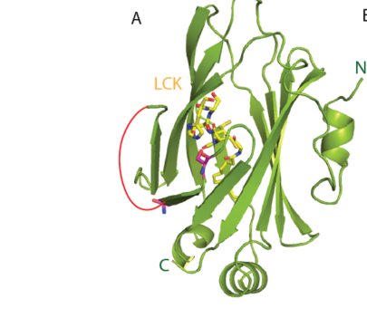

## Question

# Gene Research for Functional Annotation

## ⚠️ CRITICAL: Gene/Protein Identification Context

**BEFORE YOU BEGIN RESEARCH:** You MUST verify you are researching the CORRECT gene/protein. Gene symbols can be ambiguous, especially for less well-characterized genes from non-model organisms.

### Target Gene/Protein Identity (from UniProt):
- **UniProt Accession:** A6NIH7
- **Protein Description:** RecName: Full=Protein unc-119 homolog B;
- **Gene Information:** Name=UNC119B;
- **Organism (full):** Homo sapiens (Human).
- **Protein Family:** Belongs to the PDE6D/unc-119 family. .
- **Key Domains:** Ig_E-set. (IPR014756); PDE6D_unc-119_myristoyl-bd. (IPR051519); PDED_dom. (IPR008015); PDED_dom_sf. (IPR037036); GMP_PDE_delta (PF05351)

### MANDATORY VERIFICATION STEPS:

1. **Check if the gene symbol "UNC119B" matches the protein description above**
2. **Verify the organism is correct:** Homo sapiens (Human).
3. **Check if protein family/domains align with what you find in literature**
4. **If you find literature for a DIFFERENT gene with the same or similar symbol, STOP**

### If Gene Symbol is Ambiguous or You Cannot Find Relevant Literature:

**DO NOT PROCEED WITH RESEARCH ON A DIFFERENT GENE.** Instead:
- State clearly: "The gene symbol 'UNC119B' is ambiguous or literature is limited for this specific protein"
- Explain what you found (e.g., "Found extensive literature on a different gene with the same symbol in a different organism")
- Describe the protein based ONLY on the UniProt information provided above
- Suggest that the protein function can be inferred from domain/family information

### Research Target:

Please provide a comprehensive research report on the gene **UNC119B** (gene ID: UNC119B, UniProt: A6NIH7) in human.

The research report should be a detailed narrative explaining the function, biological processes, and localization of the gene product. Citations should be given for all claims.

You should prioritize authoritative reviews and primary scientific literature when conducting research. You can supplement
this with annotations you find in gene/protein databases, but these can be outdated or inaccurate.

We are specifically interested in the primary function of the gene - for enzymes, what reaction is catalyzed, and what is the substrate specificity? For transporters, what is the substrate? For structural proteins or adapters, what is the broader structural role? For signaling molecules, what is the role in the pathway.

We are interested in where in or outside the cell the gene product carries out its function.

We are also interested in the signaling or biochemical pathways in which the gene functions. We are less interested in broad pleiotropic effects, except where these elucidate the precise role.

Include evidence where possible. We are interested in both experimental evidence as well as inference from structure, evolution, or bioinformatic analysis. Precise studies should be prioritized over high-throughput, where available.

## Output

Question: You are an expert researcher providing comprehensive, well-cited information.

Provide detailed information focusing on:
1. Key concepts and definitions with current understanding
2. Recent developments and latest research (prioritize 2023-2024 sources)
3. Current applications and real-world implementations
4. Expert opinions and analysis from authoritative sources
5. Relevant statistics and data from recent studies

Format as a comprehensive research report with proper citations. Include URLs and publication dates where available.
Always prioritize recent, authoritative sources and provide specific citations for all major claims.

# Gene Research for Functional Annotation

## ⚠️ CRITICAL: Gene/Protein Identification Context

**BEFORE YOU BEGIN RESEARCH:** You MUST verify you are researching the CORRECT gene/protein. Gene symbols can be ambiguous, especially for less well-characterized genes from non-model organisms.

### Target Gene/Protein Identity (from UniProt):
- **UniProt Accession:** A6NIH7
- **Protein Description:** RecName: Full=Protein unc-119 homolog B;
- **Gene Information:** Name=UNC119B;
- **Organism (full):** Homo sapiens (Human).
- **Protein Family:** Belongs to the PDE6D/unc-119 family. .
- **Key Domains:** Ig_E-set. (IPR014756); PDE6D_unc-119_myristoyl-bd. (IPR051519); PDED_dom. (IPR008015); PDED_dom_sf. (IPR037036); GMP_PDE_delta (PF05351)

### MANDATORY VERIFICATION STEPS:

1. **Check if the gene symbol "UNC119B" matches the protein description above**
2. **Verify the organism is correct:** Homo sapiens (Human).
3. **Check if protein family/domains align with what you find in literature**
4. **If you find literature for a DIFFERENT gene with the same or similar symbol, STOP**

### If Gene Symbol is Ambiguous or You Cannot Find Relevant Literature:

**DO NOT PROCEED WITH RESEARCH ON A DIFFERENT GENE.** Instead:
- State clearly: "The gene symbol 'UNC119B' is ambiguous or literature is limited for this specific protein"
- Explain what you found (e.g., "Found extensive literature on a different gene with the same symbol in a different organism")
- Describe the protein based ONLY on the UniProt information provided above
- Suggest that the protein function can be inferred from domain/family information

### Research Target:

Please provide a comprehensive research report on the gene **UNC119B** (gene ID: UNC119B, UniProt: A6NIH7) in human.

The research report should be a detailed narrative explaining the function, biological processes, and localization of the gene product. Citations should be given for all claims.

You should prioritize authoritative reviews and primary scientific literature when conducting research. You can supplement
this with annotations you find in gene/protein databases, but these can be outdated or inaccurate.

We are specifically interested in the primary function of the gene - for enzymes, what reaction is catalyzed, and what is the substrate specificity? For transporters, what is the substrate? For structural proteins or adapters, what is the broader structural role? For signaling molecules, what is the role in the pathway.

We are interested in where in or outside the cell the gene product carries out its function.

We are also interested in the signaling or biochemical pathways in which the gene functions. We are less interested in broad pleiotropic effects, except where these elucidate the precise role.

Include evidence where possible. We are interested in both experimental evidence as well as inference from structure, evolution, or bioinformatic analysis. Precise studies should be prioritized over high-throughput, where available.

# Human UNC119B (UniProt A6NIH7): functional annotation

## Identity and principal function

**Identity verified.** UNC119B encodes human protein unc-119 homolog B, accession **A6NIH7**: a 2025 experimental study explicitly identifies its purified full-length human UNC119B reagent by that accession. It is distinct from **UNC119A** and from the related **PDE6D** protein. UNC119A and UNC119B share approximately 58% sequence identity and a PDE6D-like β-sandwich, consistent with the supplied myristoyl-binding/PDED-family domain annotations; their divergent regions and biological activities should not be treated as interchangeable. (horne2025pskh1kinaseactivity pages 7-8, jaiswal2016novelbiochemicaland pages 1-2)

**Primary annotation:** UNC119B is an intracellular **lipid-binding trafficking chaperone**, not a phosphodiesterase or a membrane transporter. Its hydrophobic pocket accommodates the N-terminal myristoyl group of selected proteins, shielding that lipid from the aqueous cytosol so that cargo can be redistributed between membranes. The shared PDE6D-like fold does **not** mean that UNC119B has PDE6D’s established preference for prenylated cargo. Direct assays and a UNC119B–myristoylated-LCK peptide crystal structure establish the myristoyl-binding function. (jaiswal2016novelbiochemicaland pages 1-1, yelland2021thestructuraland pages 2-4, yelland2021thestructuraland media c4c8be88)

## Cargo specificity and biochemical mechanism

UNC119B recognizes the **myristoylated N terminus plus nearby peptide residues**, rather than indiscriminately binding every lipidated protein. Its measured affinities span several orders of magnitude; the strongest tested ciliary-cargo peptides bind more tightly than the non-ciliary Src peptide. These are affinities of *synthetic myristoylated peptides*, not measurements of whole-protein transport in cells. Jaiswal and colleagues reported the following UNC119B-specific results in *Journal of Biological Chemistry* (published September 2016; https://doi.org/10.1074/jbc.M116.741827). (jaiswal2016novelbiochemicaland pages 4-4, jaiswal2016novelbiochemicaland pages 1-1)

| Cargo peptide | UNC119B K_D (nM) | Functional context | Measurement scope |
|---|---:|---|---|
| GNAT1 | 5.76 | Ciliary, high-affinity cargo | Synthetic N-terminally myristoylated peptide; binding affinity, not a cellular trafficking rate (jaiswal2016novelbiochemicaland pages 4-4) |
| NPHP3 | 0.020 | Ciliary, high-affinity cargo | Synthetic N-terminally myristoylated peptide; binding affinity, not a cellular trafficking rate (jaiswal2016novelbiochemicaland pages 4-4) |
| Cystin1 | 0.059 | Ciliary, high-affinity cargo | Synthetic N-terminally myristoylated peptide; binding affinity, not a cellular trafficking rate (jaiswal2016novelbiochemicaland pages 4-4) |
| RP2 | 47.2 | Intermediate-affinity cargo associated with the ciliary transition zone | Synthetic N-terminally myristoylated peptide; binding affinity, not a cellular trafficking rate (jaiswal2016novelbiochemicaland pages 4-4) |
| Src | 145.12 | Lower-affinity, non-ciliary cargo | Synthetic N-terminally myristoylated peptide; binding affinity, not a cellular trafficking rate (jaiswal2016novelbiochemicaland pages 4-4) |

*Table: Exact UNC119B dissociation constants reported by Jaiswal et al. for synthetic N-terminally myristoylated cargo peptides. These biochemical affinities should not be interpreted as cellular transport rates.*

In the same assays, GTP-analog-bound **ARL3** efficiently promoted release of tightly bound cargo from UNC119B. **ARL2** predominantly released weaker-binding cargo such as RP2 and Src; the division is not absolute, since GNAT1 bound to UNC119B showed partial ARL2-dependent release under some assay conditions. For example, the measured ARL3-versus-ARL2 release-rate constants for UNC119B-bound NPHP3 peptide were **2.5 versus 0.032 s⁻¹**; for Cystin1, **11.3 versus 0.001 s⁻¹**. Thus, cargo affinity and the local availability of activated ARL3 together help explain preferential ciliary deposition, rather than myristoylation alone constituting an unconditional ciliary address. (jaiswal2016novelbiochemicaland pages 4-4, jaiswal2016novelbiochemicaland pages 8-9)

Structural and biochemical work by Yelland and colleagues, *Biochemistry* (published June 2021; https://doi.org/10.1021/acs.biochem.1c00251), established structures of UNC119B bound to a myristoylated **LCK** peptide and to the release factor **ARL3**. Their UNC119B–LCK peptide affinity was **0.37 nM**, compared with **0.83 nM** for UNC119A–LCK in that study. An UNC119B-specific acidic region around residues **120–135** is proposed to influence cargo release, but that additional release mechanism remains a structural proposal, not an established cellular pathway. The peptide study also identified potential cargoes including FMNL1, PCMTD1 and GNAI2; their measured binding and release alone do not establish UNC119B-dependent trafficking of each full-length protein. (yelland2021thestructuraland pages 4-8, yelland2021thestructuraland media c4c8be88)

## Where UNC119B acts: the ciliary trafficking cycle

In cultured human retinal pigment epithelial cells, tagged **UNC119B** was enriched at the **ciliary transition zone and proximal primary cilium**, whereas tagged UNC119A localized chiefly around the centrosome. UNC119B also functions as a soluble carrier in the cytoplasm. A model consistent with the experiments is: UNC119B captures myristoylated cargo at an extraciliary membrane; the soluble carrier–cargo complex reaches the cilium; **ARL3-GTP** displaces cargo for association with the ciliary membrane; and the ARL3 GTPase-activating protein **RP2** helps reset the cycle. ARL13B is an upstream regulator of ciliary ARL3 activation. Importantly, a 2024 expert review notes that *how the UNC119B–cargo complex crosses the transition-zone barrier*—by diffusion or another mechanism—remains unresolved; this pathway should not simply be equated with transport on conventional intraflagellar-transport trains. (wright2011anarl3unc119rp2gtpase pages 2-3, wright2011anarl3unc119rp2gtpase pages 8-10, moran2024transportandbarrier pages 9-10)

The strongest **UNC119B-specific cellular test** is the targeting of **nephrocystin-3 (NPHP3)**. Wright and colleagues found that UNC119B depletion, **unlike UNC119A depletion**, impaired localization of an NPHP3 N-terminal reporter to primary cilia. Reintroducing wild-type UNC119B rescued targeting, whereas a myristoyl-binding-defective UNC119B construct, designated **Mut-4** in the paper, did not rescue equivalently and remained restricted near the basal-body/transition-zone region. A myristoylated cystin reporter likewise depended on the ARL3–UNC119B pathway. These experiments support a nonredundant role for UNC119B in this cellular setting, even though both paralogs can bind some of the same peptides *in vitro*. Wright et al., *Genes & Development* (published November 2011; https://doi.org/10.1101/gad.173443.111). (wright2011anarl3unc119rp2gtpase pages 6-7, wright2011anarl3unc119rp2gtpase pages 7-8, wright2011anarl3unc119rp2gtpase pages 10-11)

## Signaling contexts and newer findings

**Ciliary signaling:** By determining whether proteins such as NPHP3 reach the specialized ciliary membrane, UNC119B acts upstream of their location-dependent functions; it is a **cargo-localization factor**, not itself a demonstrated signaling enzyme. The 2024 ciliary-compartmentalization review describes UNC119B and PDE6D as distinct lipidated-protein carriers and highlights unresolved questions about LIFT-carrier entry into cilia. Moran et al., *Nature Reviews Nephrology* 20:83–100 (2024; https://doi.org/10.1038/s41581-023-00773-2). A 2023 review likewise identifies their cargo-pocket and ARL3-dependent interactions as potential—but not validated clinical—points of intervention. Saito et al., *Frontiers in Molecular Biosciences* (September 2023; https://doi.org/10.3389/fmolb.2023.1232188). (moran2024transportandbarrier pages 9-10, saito2023recentadvancesin pages 9-10)

**An additional, distinct biochemical activity:** Horne and colleagues demonstrated that purified human **UNC119B A6NIH7** binds and stimulates the kinase **PSKH1** in a radiometric assay. Mutating the PSKH1 N-terminal lipidation sites (**G2A**, **C3S**, or both) did not abolish stimulation, supporting **direct allosteric engagement of the kinase domain**, rather than simply carriage of PSKH1’s myristoyl group. Crosslinking implicated the PSKH1 kinase-domain N-lobe and adjacent C-terminal region. The result expands UNC119B’s experimentally established molecular activities beyond lipid sequestration, but its physiological site and consequences in intact cells require further testing. Horne et al., *Proceedings of the National Academy of Sciences* (published February 18, 2025; https://doi.org/10.1073/pnas.2420961122). (horne2025pskh1kinaseactivity pages 1-2, horne2025pskh1kinaseactivity pages 6-7, horne2025pskh1kinaseactivity pages 7-8)

**Immune-synapse evidence needs paralog qualification.** UNC119B binds myristoylated LCK peptide in biochemical and structural experiments. However, Stephen and colleagues showed that an additional interaction with **nonmyristoylated LCK** depends on **UNC119A’s** N-terminal region and was **not** observed with UNC119B; that UNC119A mechanism must not be assigned to UNC119B. Stephen et al., *Developmental Cell* (October 2018; https://doi.org/10.1016/j.devcel.2018.08.012). A 2025 study found that inhibiting **UNC119** perturbs LCK positioning and T-cell-receptor signaling and reduces proliferation of patient-derived T-cell acute lymphoblastic leukemia cells *in vitro*, but the reported intervention does **not** establish which UNC119 paralog is responsible. Samarakoon et al., *Life Science Alliance* (January 2025; https://doi.org/10.26508/lsa.202403066). (stephen2018theciliarymachinery pages 6-8, samarakoon2025unc119regulatestcell pages 2-5)

## Research applications and limitations

UNC119B’s validated **NPHP3-knockdown/rescue phenotype** provides a cellular assay of ciliary cargo delivery; its myristoylated-peptide binding and ARL3-release assays provide quantitative biochemical readouts. Chemical-proteomic experiments have also measured stereoselective cellular engagement of UNC119B by clickable enantiomeric probes and competition by **squarunkin A**, establishing experimental ligandability, not therapeutic efficacy. Wang and colleagues’ enantioprobe study (2019 preprint; https://doi.org/10.26434/chemrxiv.7764638.v1) identified UNC119B **A6NIH7** with a reported **2.9** maximal stereoselectivity ratio in peripheral blood mononuclear cells. A separate affinity-proteomics study validated co-immunoprecipitation of UNC119B with MACIR, but did not establish direct binding or a functional consequence: McGauran et al., *Proteomics* (September 2020; https://doi.org/10.1002/pmic.202000062). (cravatt2019expeditedmappingof pages 19-23, cravatt2019expeditedmappingof pages 5-9, mcgauran2020resolvingtheinteractome pages 3-5)

**Clinical interpretation:** The available mechanistic data make UNC119B relevant to studying ciliary cargo mislocalization and candidate drug interactions, but they do not establish an approved UNC119B-targeted therapy or a UNC119B-specific therapeutic benefit. In particular, a 2024 **PDE6D**-inhibitor paper only *speculated* about possible UNC119B off-target engagement; its measured selectivity experiments concerned PDE6D and UNC119A, not UNC119B. Kaya et al., *Journal of Medicinal Chemistry* (May 2024; https://doi.org/10.1021/acs.jmedchem.3c02129). The best-supported annotation remains **an ARL3-regulated carrier of selected N-myristoylated proteins at the cytosol–primary-cilium interface**, with PSKH1 allosteric activation as a newer, separately demonstrated biochemical role. (kaya2024animprovedpde6d pages 9-10, wright2011anarl3unc119rp2gtpase pages 7-8, horne2025pskh1kinaseactivity pages 6-7)

References

1. (horne2025pskh1kinaseactivity pages 7-8): Christopher R. Horne, Toby A. Dite, Samuel N. Young, Lucy J. Mather, Laura F. Dagley, Jared L. Johnson, Tomer M. Yaron-Barir, Emily M. Huntsman, Leonard A. Daly, Dominic P. Byrne, Antonia L. Cadell, Boaz H. Ng, Jumana Yousef, Dylan H. Multari, Lianju Shen, Luke M. McAloon, Gerard Manning, Mark A. Febbraio, Anthony R. Means, Lewis C. Cantley, Maria C. Tanzer, David R. Croucher, Claire E. Eyers, Patrick A. Eyers, John W. Scott, and James M. Murphy. Pskh1 kinase activity is differentially modulated via allosteric binding of ca 2+ sensor proteins. Feb 2025. URL: https://doi.org/10.1073/pnas.2420961122, doi:10.1073/pnas.2420961122. This article has 5 citations and is from a highest quality peer-reviewed journal.

2. (jaiswal2016novelbiochemicaland pages 1-2): Mamta Jaiswal, Eyad K. Fansa, Stefanie K. Kösling, Tom Mejuch, Herbert Waldmann, and Alfred Wittinghofer. Novel biochemical and structural insights into the interaction of myristoylated cargo with unc119 protein and their release by arl2/3. Journal of Biological Chemistry, 291:20766-20778, Sep 2016. URL: https://doi.org/10.1074/jbc.m116.741827, doi:10.1074/jbc.m116.741827. This article has 53 citations and is from a domain leading peer-reviewed journal.

3. (jaiswal2016novelbiochemicaland pages 1-1): Mamta Jaiswal, Eyad K. Fansa, Stefanie K. Kösling, Tom Mejuch, Herbert Waldmann, and Alfred Wittinghofer. Novel biochemical and structural insights into the interaction of myristoylated cargo with unc119 protein and their release by arl2/3. Journal of Biological Chemistry, 291:20766-20778, Sep 2016. URL: https://doi.org/10.1074/jbc.m116.741827, doi:10.1074/jbc.m116.741827. This article has 53 citations and is from a domain leading peer-reviewed journal.

4. (yelland2021thestructuraland pages 2-4): Tamas Yelland, Esther Garcia, Youhani Samarakoon, and Shehab Ismail. The structural and biochemical characterization of unc119b cargo binding and release mechanisms. Biochemistry, 60:1952-1963, Jun 2021. URL: https://doi.org/10.1021/acs.biochem.1c00251, doi:10.1021/acs.biochem.1c00251. This article has 15 citations and is from a peer-reviewed journal.

5. (yelland2021thestructuraland media c4c8be88): Tamas Yelland, Esther Garcia, Youhani Samarakoon, and Shehab Ismail. The structural and biochemical characterization of unc119b cargo binding and release mechanisms. Biochemistry, 60:1952-1963, Jun 2021. URL: https://doi.org/10.1021/acs.biochem.1c00251, doi:10.1021/acs.biochem.1c00251. This article has 15 citations and is from a peer-reviewed journal.

6. (jaiswal2016novelbiochemicaland pages 4-4): Mamta Jaiswal, Eyad K. Fansa, Stefanie K. Kösling, Tom Mejuch, Herbert Waldmann, and Alfred Wittinghofer. Novel biochemical and structural insights into the interaction of myristoylated cargo with unc119 protein and their release by arl2/3. Journal of Biological Chemistry, 291:20766-20778, Sep 2016. URL: https://doi.org/10.1074/jbc.m116.741827, doi:10.1074/jbc.m116.741827. This article has 53 citations and is from a domain leading peer-reviewed journal.

7. (jaiswal2016novelbiochemicaland pages 8-9): Mamta Jaiswal, Eyad K. Fansa, Stefanie K. Kösling, Tom Mejuch, Herbert Waldmann, and Alfred Wittinghofer. Novel biochemical and structural insights into the interaction of myristoylated cargo with unc119 protein and their release by arl2/3. Journal of Biological Chemistry, 291:20766-20778, Sep 2016. URL: https://doi.org/10.1074/jbc.m116.741827, doi:10.1074/jbc.m116.741827. This article has 53 citations and is from a domain leading peer-reviewed journal.

8. (yelland2021thestructuraland pages 4-8): Tamas Yelland, Esther Garcia, Youhani Samarakoon, and Shehab Ismail. The structural and biochemical characterization of unc119b cargo binding and release mechanisms. Biochemistry, 60:1952-1963, Jun 2021. URL: https://doi.org/10.1021/acs.biochem.1c00251, doi:10.1021/acs.biochem.1c00251. This article has 15 citations and is from a peer-reviewed journal.

9. (wright2011anarl3unc119rp2gtpase pages 2-3): Kevin J. Wright, Lisa M. Baye, Anique Olivier-Mason, Saikat Mukhopadhyay, Liyun Sang, Mandy Kwong, Weiru Wang, Pamela R. Pretorius, Val C. Sheffield, Piali Sengupta, Diane C. Slusarski, and Peter K. Jackson. An arl3-unc119-rp2 gtpase cycle targets myristoylated nphp3 to the primary cilium. Genes & development, 25 22:2347-60, Nov 2011. URL: https://doi.org/10.1101/gad.173443.111, doi:10.1101/gad.173443.111. This article has 272 citations and is from a highest quality peer-reviewed journal.

10. (wright2011anarl3unc119rp2gtpase pages 8-10): Kevin J. Wright, Lisa M. Baye, Anique Olivier-Mason, Saikat Mukhopadhyay, Liyun Sang, Mandy Kwong, Weiru Wang, Pamela R. Pretorius, Val C. Sheffield, Piali Sengupta, Diane C. Slusarski, and Peter K. Jackson. An arl3-unc119-rp2 gtpase cycle targets myristoylated nphp3 to the primary cilium. Genes & development, 25 22:2347-60, Nov 2011. URL: https://doi.org/10.1101/gad.173443.111, doi:10.1101/gad.173443.111. This article has 272 citations and is from a highest quality peer-reviewed journal.

11. (moran2024transportandbarrier pages 9-10): Ailis L. Moran, Laura Louzao-Martinez, Dominic P. Norris, Dorien J. M. Peters, and Oliver E. Blacque. Transport and barrier mechanisms that regulate ciliary compartmentalization and ciliopathies. Nature Reviews Nephrology, 20:83-100, Oct 2024. URL: https://doi.org/10.1038/s41581-023-00773-2, doi:10.1038/s41581-023-00773-2. This article has 48 citations and is from a domain leading peer-reviewed journal.

12. (wright2011anarl3unc119rp2gtpase pages 6-7): Kevin J. Wright, Lisa M. Baye, Anique Olivier-Mason, Saikat Mukhopadhyay, Liyun Sang, Mandy Kwong, Weiru Wang, Pamela R. Pretorius, Val C. Sheffield, Piali Sengupta, Diane C. Slusarski, and Peter K. Jackson. An arl3-unc119-rp2 gtpase cycle targets myristoylated nphp3 to the primary cilium. Genes & development, 25 22:2347-60, Nov 2011. URL: https://doi.org/10.1101/gad.173443.111, doi:10.1101/gad.173443.111. This article has 272 citations and is from a highest quality peer-reviewed journal.

13. (wright2011anarl3unc119rp2gtpase pages 7-8): Kevin J. Wright, Lisa M. Baye, Anique Olivier-Mason, Saikat Mukhopadhyay, Liyun Sang, Mandy Kwong, Weiru Wang, Pamela R. Pretorius, Val C. Sheffield, Piali Sengupta, Diane C. Slusarski, and Peter K. Jackson. An arl3-unc119-rp2 gtpase cycle targets myristoylated nphp3 to the primary cilium. Genes & development, 25 22:2347-60, Nov 2011. URL: https://doi.org/10.1101/gad.173443.111, doi:10.1101/gad.173443.111. This article has 272 citations and is from a highest quality peer-reviewed journal.

14. (wright2011anarl3unc119rp2gtpase pages 10-11): Kevin J. Wright, Lisa M. Baye, Anique Olivier-Mason, Saikat Mukhopadhyay, Liyun Sang, Mandy Kwong, Weiru Wang, Pamela R. Pretorius, Val C. Sheffield, Piali Sengupta, Diane C. Slusarski, and Peter K. Jackson. An arl3-unc119-rp2 gtpase cycle targets myristoylated nphp3 to the primary cilium. Genes & development, 25 22:2347-60, Nov 2011. URL: https://doi.org/10.1101/gad.173443.111, doi:10.1101/gad.173443.111. This article has 272 citations and is from a highest quality peer-reviewed journal.

15. (saito2023recentadvancesin pages 9-10): Masaki Saito, Wataru Otsu, Keiko Miyadera, and Yuhei Nishimura. Recent advances in the understanding of cilia mechanisms and their applications as therapeutic targets. Frontiers in Molecular Biosciences, Sep 2023. URL: https://doi.org/10.3389/fmolb.2023.1232188, doi:10.3389/fmolb.2023.1232188. This article has 27 citations.

16. (horne2025pskh1kinaseactivity pages 1-2): Christopher R. Horne, Toby A. Dite, Samuel N. Young, Lucy J. Mather, Laura F. Dagley, Jared L. Johnson, Tomer M. Yaron-Barir, Emily M. Huntsman, Leonard A. Daly, Dominic P. Byrne, Antonia L. Cadell, Boaz H. Ng, Jumana Yousef, Dylan H. Multari, Lianju Shen, Luke M. McAloon, Gerard Manning, Mark A. Febbraio, Anthony R. Means, Lewis C. Cantley, Maria C. Tanzer, David R. Croucher, Claire E. Eyers, Patrick A. Eyers, John W. Scott, and James M. Murphy. Pskh1 kinase activity is differentially modulated via allosteric binding of ca 2+ sensor proteins. Feb 2025. URL: https://doi.org/10.1073/pnas.2420961122, doi:10.1073/pnas.2420961122. This article has 5 citations and is from a highest quality peer-reviewed journal.

17. (horne2025pskh1kinaseactivity pages 6-7): Christopher R. Horne, Toby A. Dite, Samuel N. Young, Lucy J. Mather, Laura F. Dagley, Jared L. Johnson, Tomer M. Yaron-Barir, Emily M. Huntsman, Leonard A. Daly, Dominic P. Byrne, Antonia L. Cadell, Boaz H. Ng, Jumana Yousef, Dylan H. Multari, Lianju Shen, Luke M. McAloon, Gerard Manning, Mark A. Febbraio, Anthony R. Means, Lewis C. Cantley, Maria C. Tanzer, David R. Croucher, Claire E. Eyers, Patrick A. Eyers, John W. Scott, and James M. Murphy. Pskh1 kinase activity is differentially modulated via allosteric binding of ca 2+ sensor proteins. Feb 2025. URL: https://doi.org/10.1073/pnas.2420961122, doi:10.1073/pnas.2420961122. This article has 5 citations and is from a highest quality peer-reviewed journal.

18. (stephen2018theciliarymachinery pages 6-8): Louise A. Stephen, Yasmin ElMaghloob, Michael J. McIlwraith, Tamas Yelland, Patricia Castro Sanchez, Pedro Roda-Navarro, and Shehab Ismail. The ciliary machinery is repurposed for t cell immune synapse trafficking of lck. Developmental Cell, 47:122-132.e4, Oct 2018. URL: https://doi.org/10.1016/j.devcel.2018.08.012, doi:10.1016/j.devcel.2018.08.012. This article has 60 citations and is from a highest quality peer-reviewed journal.

19. (samarakoon2025unc119regulatestcell pages 2-5): Youhani Samarakoon, Tamas Yelland, Esther Garcia-Gonzalez, Amauri da Silva Justo Junior, Mahnoor Mahmood, Anand Manoharan, Shaun Patterson, Valentina Serafin, Payam A Gammage, Sandra Marmiroli, Christina Halsey, Shehab Ismail, and Edward W Roberts. Unc119 regulates t-cell receptor signalling in primary t cells and t acute lymphocytic leukaemia. Life Science Alliance, 8:e202403066, Jan 2025. URL: https://doi.org/10.26508/lsa.202403066, doi:10.26508/lsa.202403066. This article has 2 citations and is from a peer-reviewed journal.

20. (cravatt2019expeditedmappingof pages 19-23): Benjamin Cravatt, Yujia Wang, melissa dix, jarrett remsberg, hsin-yu lee, marian kalocsay, steven gygi, gregory vite, michael lawrence, and Christopher Parker. Expedited mapping of the ligandable proteome using fully functionalized enantiomeric probe pairs. Feb 2019. URL: https://doi.org/10.26434/chemrxiv.7764638.v1, doi:10.26434/chemrxiv.7764638.v1. This article has 3 citations.

21. (cravatt2019expeditedmappingof pages 5-9): Benjamin Cravatt, Yujia Wang, melissa dix, jarrett remsberg, hsin-yu lee, marian kalocsay, steven gygi, gregory vite, michael lawrence, and Christopher Parker. Expedited mapping of the ligandable proteome using fully functionalized enantiomeric probe pairs. Feb 2019. URL: https://doi.org/10.26434/chemrxiv.7764638.v1, doi:10.26434/chemrxiv.7764638.v1. This article has 3 citations.

22. (mcgauran2020resolvingtheinteractome pages 3-5): Gavin McGauran, Emma Dorris, Razvan Borza, Niamh Morgan, Denis C. Shields, David Matallanas, Anthony G. Wilson, and David J. O'Connell. Resolving the interactome of the human macrophage immunometabolism regulator (macir) with enhanced membrane protein preparation and affinity proteomics. Sep 2020. URL: https://doi.org/10.1002/pmic.202000062, doi:10.1002/pmic.202000062. This article has 6 citations and is from a peer-reviewed journal.

23. (kaya2024animprovedpde6d pages 9-10): Pelin Kaya, Elisabeth Schaffner-Reckinger, Ganesh babu Manoharan, Vladimir Vukic, Alexandros Kiriazis, Mirko Ledda, Maria Burgos Renedo, Karolina Pavic, Anthoula Gaigneaux, Enrico Glaab, and Daniel Kwaku Abankwa. An improved pde6d inhibitor combines with sildenafil to inhibit kras mutant cancer cell growth. Journal of Medicinal Chemistry, 67:8569-8584, May 2024. URL: https://doi.org/10.1021/acs.jmedchem.3c02129, doi:10.1021/acs.jmedchem.3c02129. This article has 25 citations and is from a highest quality peer-reviewed journal.

## Artifacts

- [Edison artifact artifact-00](UNC119B-deep-research-falcon_artifacts/artifact-00.md)

## Citations

1. jaiswal2016novelbiochemicaland pages 4-4
2. jaiswal2016novelbiochemicaland pages 1-2
3. jaiswal2016novelbiochemicaland pages 1-1
4. yelland2021thestructuraland pages 2-4
5. jaiswal2016novelbiochemicaland pages 8-9
6. yelland2021thestructuraland pages 4-8
7. moran2024transportandbarrier pages 9-10
8. saito2023recentadvancesin pages 9-10
9. stephen2018theciliarymachinery pages 6-8
10. cravatt2019expeditedmappingof pages 19-23
11. cravatt2019expeditedmappingof pages 5-9
12. mcgauran2020resolvingtheinteractome pages 3-5
13. https://doi.org/10.1074/jbc.M116.741827
14. https://doi.org/10.1021/acs.biochem.1c00251
15. https://doi.org/10.1101/gad.173443.111
16. https://doi.org/10.1038/s41581-023-00773-2
17. https://doi.org/10.3389/fmolb.2023.1232188
18. https://doi.org/10.1073/pnas.2420961122
19. https://doi.org/10.1016/j.devcel.2018.08.012
20. https://doi.org/10.26508/lsa.202403066
21. https://doi.org/10.26434/chemrxiv.7764638.v1
22. https://doi.org/10.1002/pmic.202000062
23. https://doi.org/10.1021/acs.jmedchem.3c02129
24. https://doi.org/10.1073/pnas.2420961122,
25. https://doi.org/10.1074/jbc.m116.741827,
26. https://doi.org/10.1021/acs.biochem.1c00251,
27. https://doi.org/10.1101/gad.173443.111,
28. https://doi.org/10.1038/s41581-023-00773-2,
29. https://doi.org/10.3389/fmolb.2023.1232188,
30. https://doi.org/10.1016/j.devcel.2018.08.012,
31. https://doi.org/10.26508/lsa.202403066,
32. https://doi.org/10.26434/chemrxiv.7764638.v1,
33. https://doi.org/10.1002/pmic.202000062,
34. https://doi.org/10.1021/acs.jmedchem.3c02129,