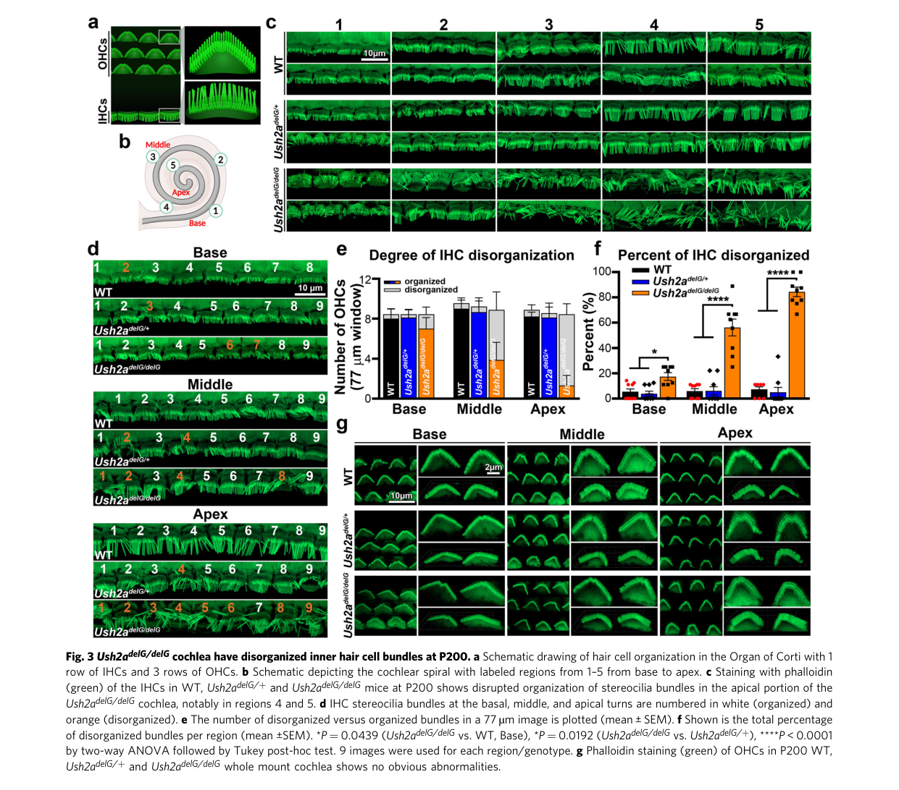

## Question

# Gene Research for Functional Annotation

## ⚠️ CRITICAL: Gene/Protein Identification Context

**BEFORE YOU BEGIN RESEARCH:** You MUST verify you are researching the CORRECT gene/protein. Gene symbols can be ambiguous, especially for less well-characterized genes from non-model organisms.

### Target Gene/Protein Identity (from UniProt):
- **UniProt Accession:** O75445
- **Protein Description:** RecName: Full=Usherin; AltName: Full=Usher syndrome type IIa protein; AltName: Full=Usher syndrome type-2A protein; Flags: Precursor;
- **Gene Information:** Name=USH2A;
- **Organism (full):** Homo sapiens (Human).
- **Protein Family:** Not specified in UniProt
- **Key Domains:** ConA-like_dom_sf. (IPR013320); FN3_dom. (IPR003961); FN3_sf. (IPR036116); Ig-like_fold. (IPR013783); LamG-like. (IPR006558)

### MANDATORY VERIFICATION STEPS:

1. **Check if the gene symbol "USH2A" matches the protein description above**
2. **Verify the organism is correct:** Homo sapiens (Human).
3. **Check if protein family/domains align with what you find in literature**
4. **If you find literature for a DIFFERENT gene with the same or similar symbol, STOP**

### If Gene Symbol is Ambiguous or You Cannot Find Relevant Literature:

**DO NOT PROCEED WITH RESEARCH ON A DIFFERENT GENE.** Instead:
- State clearly: "The gene symbol 'USH2A' is ambiguous or literature is limited for this specific protein"
- Explain what you found (e.g., "Found extensive literature on a different gene with the same symbol in a different organism")
- Describe the protein based ONLY on the UniProt information provided above
- Suggest that the protein function can be inferred from domain/family information

### Research Target:

Please provide a comprehensive research report on the gene **USH2A** (gene ID: USH2A, UniProt: O75445) in human.

The research report should be a detailed narrative explaining the function, biological processes, and localization of the gene product. Citations should be given for all claims.

You should prioritize authoritative reviews and primary scientific literature when conducting research. You can supplement
this with annotations you find in gene/protein databases, but these can be outdated or inaccurate.

We are specifically interested in the primary function of the gene - for enzymes, what reaction is catalyzed, and what is the substrate specificity? For transporters, what is the substrate? For structural proteins or adapters, what is the broader structural role? For signaling molecules, what is the role in the pathway.

We are interested in where in or outside the cell the gene product carries out its function.

We are also interested in the signaling or biochemical pathways in which the gene functions. We are less interested in broad pleiotropic effects, except where these elucidate the precise role.

Include evidence where possible. We are interested in both experimental evidence as well as inference from structure, evolution, or bioinformatic analysis. Precise studies should be prioritized over high-throughput, where available.

## Output

Question: You are an expert researcher providing comprehensive, well-cited information.

Provide detailed information focusing on:
1. Key concepts and definitions with current understanding
2. Recent developments and latest research (prioritize 2023-2024 sources)
3. Current applications and real-world implementations
4. Expert opinions and analysis from authoritative sources
5. Relevant statistics and data from recent studies

Format as a comprehensive research report with proper citations. Include URLs and publication dates where available.
Always prioritize recent, authoritative sources and provide specific citations for all major claims.

# Gene Research for Functional Annotation

## ⚠️ CRITICAL: Gene/Protein Identification Context

**BEFORE YOU BEGIN RESEARCH:** You MUST verify you are researching the CORRECT gene/protein. Gene symbols can be ambiguous, especially for less well-characterized genes from non-model organisms.

### Target Gene/Protein Identity (from UniProt):
- **UniProt Accession:** O75445
- **Protein Description:** RecName: Full=Usherin; AltName: Full=Usher syndrome type IIa protein; AltName: Full=Usher syndrome type-2A protein; Flags: Precursor;
- **Gene Information:** Name=USH2A;
- **Organism (full):** Homo sapiens (Human).
- **Protein Family:** Not specified in UniProt
- **Key Domains:** ConA-like_dom_sf. (IPR013320); FN3_dom. (IPR003961); FN3_sf. (IPR036116); Ig-like_fold. (IPR013783); LamG-like. (IPR006558)

### MANDATORY VERIFICATION STEPS:

1. **Check if the gene symbol "USH2A" matches the protein description above**
2. **Verify the organism is correct:** Homo sapiens (Human).
3. **Check if protein family/domains align with what you find in literature**
4. **If you find literature for a DIFFERENT gene with the same or similar symbol, STOP**

### If Gene Symbol is Ambiguous or You Cannot Find Relevant Literature:

**DO NOT PROCEED WITH RESEARCH ON A DIFFERENT GENE.** Instead:
- State clearly: "The gene symbol 'USH2A' is ambiguous or literature is limited for this specific protein"
- Explain what you found (e.g., "Found extensive literature on a different gene with the same symbol in a different organism")
- Describe the protein based ONLY on the UniProt information provided above
- Suggest that the protein function can be inferred from domain/family information

### Research Target:

Please provide a comprehensive research report on the gene **USH2A** (gene ID: USH2A, UniProt: O75445) in human.

The research report should be a detailed narrative explaining the function, biological processes, and localization of the gene product. Citations should be given for all claims.

You should prioritize authoritative reviews and primary scientific literature when conducting research. You can supplement
this with annotations you find in gene/protein databases, but these can be outdated or inaccurate.

We are specifically interested in the primary function of the gene - for enzymes, what reaction is catalyzed, and what is the substrate specificity? For transporters, what is the substrate? For structural proteins or adapters, what is the broader structural role? For signaling molecules, what is the role in the pathway.

We are interested in where in or outside the cell the gene product carries out its function.

We are also interested in the signaling or biochemical pathways in which the gene functions. We are less interested in broad pleiotropic effects, except where these elucidate the precise role.

Include evidence where possible. We are interested in both experimental evidence as well as inference from structure, evolution, or bioinformatic analysis. Precise studies should be prioritized over high-throughput, where available.

# USH2A / usherin functional-annotation report

## Executive conclusion

The requested target is correctly identified: **human USH2A**, approved name *usherin* (human gene ID 7399; supplied UniProt accession **O75445**). The literature consistently uses USH2A for the human protein usherin, and no conflicting same-symbol protein was encountered. Open Targets independently maps human **USH2A/usherin (ENSG00000042781)** most strongly to Usher syndrome type 2A. The retrieved papers did not themselves print O75445, so the accession-to-protein mapping is accepted from the supplied UniProt record rather than independently demonstrated in those articles. (OpenTargets Search: Usher syndrome type 2A,retinitis pigmentosa-USH2A, stemerdink2022geneticspathogenesisand pages 4-6, zaw2023applicationoftherapeutic pages 70-76)

Functionally, usherin is **not an enzyme or transporter**. Its best-supported primary role is that of a very large, non-catalytic membrane adhesion/structural protein and organizing component of the USH2 interactome. Long transmembrane usherin helps form the developmental ankle-link apparatus at cochlear stereocilia and the periciliary membrane complex around the photoreceptor connecting cilium. Its repeat-rich extracellular region likely provides adhesion, linkage, and intermembrane spacing, while its short cytoplasmic PDZ-binding tail connects it to scaffolds such as WHRN and PDZD7. (zaw2023applicationoftherapeutic pages 28-29, slijkerman2017moleculargeneticsof pages 25-28, guan2023deafness‐associatedadgrv1mutation pages 1-2, grati2012localizationofpdzd7 pages 1-2)

| Dimension | Best-supported annotation | Evidence type/strength | Key caveat |
|---|---|---|---|
| Verified identity | Human **USH2A** encodes **usherin**; the supplied UniProt accession is **O75445**. No conflicting gene identity was found. | Concordant human gene nomenclature and peer-reviewed literature; strong (OpenTargets Search: Usher syndrome type 2A,retinitis pigmentosa-USH2A, stemerdink2022geneticspathogenesisand pages 4-6) | Retrieved papers did not explicitly print O75445; accession identity derives from the supplied UniProt record. |
| Isoforms/domain architecture | Short extracellular isoform A is 1,546 aa; long isoform B is a 5,202-aa single-pass membrane protein with a large extracellular laminin-related/FN3-repeat region and a short cytoplasmic class-I PDZ-binding tail. | Transcript/protein characterization and reviews; strong (zaw2023applicationoftherapeutic pages 26-28, stemerdink2022geneticspathogenesisand pages 4-6) | Domain counts and apparent molecular masses vary slightly among annotations; the physiological role of the short isoform is less defined. |
| Molecular role | **Non-enzymatic adhesion/structural protein** of the USH2 complex; extracellular repeats support membrane linkage or spacing, while the cytoplasmic tail recruits PDZ scaffolds. | Architecture, binding assays, localization, and genetic models; moderate–strong (zaw2023applicationoftherapeutic pages 28-29, slijkerman2017moleculargeneticsof pages 25-28, grati2012localizationofpdzd7 pages 1-2) | No catalytic reaction or transported substrate is known; exact extracellular binding partners and mechanics remain incompletely resolved. |
| Cochlear localization/function | Long usherin localizes at developing hair-cell stereocilia bases as part of transient ankle links and supports bundle growth, rigidity, organization, and hearing. | Immunolocalization and mutant-mouse phenotypes; strong (crane2023expressionofthe pages 1-2, crane2023expressionofthe pages 5-7, crane2023expressionofthe media 8e94f933) | Ankle links are developmentally transient, and some findings are mutation- or species-specific. |
| Retinal localization/function | Predominantly localizes around the photoreceptor connecting cilium in the periciliary membrane complex, supporting complex integrity and likely inner-to-outer-segment trafficking/structural organization. | Immunolocalization and vertebrate loss-of-function models; moderate–strong (zaw2023applicationoftherapeutic pages 28-29, crane2023expressionofthe pages 1-2) | A direct cargo-transport mechanism for usherin itself has not been demonstrated. |
| Interaction/signaling network | The ankle-link/periciliary complex includes **ADGRV1, WHRN, and PDZD7**. ADGRV1-dependent local cAMP–PKA signaling controls WHRN phosphorylation and WDSUB1-dependent ubiquitination/stability of USH2A. | Binding/localization studies plus 2023 mechanistic mouse and biochemical work; strong for cochlear regulation (guan2023deafness‐associatedadgrv1mutation pages 1-2, grati2012localizationofpdzd7 pages 1-2) | Signaling evidence is strongest in developing cochlear hair cells; retinal equivalence is not established. |
| Disease relationship | Biallelic pathogenic variants cause autosomal-recessive **Usher syndrome type 2A** or nonsyndromic RP; truncating/LoF allele burden correlates with earlier, more syndromic disease. | Human genetics and 2024 cohorts; strong (ogorodova2024acomparativeevaluation pages 7-8, ogorodova2024acomparativeevaluation pages 1-2, lin2024highprevalenceof pages 1-2) | Genotype–phenotype relationships are probabilistic and modified by variant class, ancestry, and possibly other genes. |
| Therapy status | Current implementation is supportive—hearing aids/cochlear implantation, retinal surveillance, and visual rehabilitation. Exon-13 skipping ASO **ultevursen/QR-421a** reached early clinical testing; organoids and genome-editing approaches remain investigational. | Clinical-care reviews, preclinical organoids, and Phase 1b/2 trial reporting; moderate (ashworth2024inheritedretinaldiseases pages 4-5, ling2023therapeuticgeneediting pages 9-10, girach2022rnabasedtherapiesin pages 10-13, heerlie2024theeffectsand pages 4-6) | No approved USH2A retinal disease-modifying therapy was identified; definitive clinical efficacy and regulatory progress remain unestablished. |

*Table: Compact evidence-weighted annotation of human USH2A/usherin, covering identity, structure, sensory-cell functions, molecular network, disease, and therapy. Caveats distinguish direct experimental support from mechanistic inference.*

## 1. Protein architecture and isoforms

Human USH2A produces two principal products. **Isoform A**, the short extracellular form, contains 1,546 amino acids and is encoded by the first 21 exons. **Isoform B**, generally regarded as the functionally central sensory-cell form, is a 5,202-amino-acid, approximately 546–580-kDa, single-pass membrane protein encoded by 72 exons. Isoform B has a very large N-terminal extracellular region, one transmembrane segment, and a short intracellular C-terminal tail containing a class-I PDZ-binding motif. (zaw2023applicationoftherapeutic pages 26-28, stemerdink2022geneticspathogenesisand pages 4-6, zaw2023applicationoftherapeutic pages 25-26)

The reported extracellular architecture includes laminin N-terminal and laminin G-like elements, laminin EGF-like motifs, and numerous fibronectin type III repeats. The long isoform has two additional laminin-G domains and approximately 28 additional FN3 repeats beyond the shared N-terminal region. This agrees well with the supplied UniProt/InterPro annotations—ConA-like domain superfamily, laminin-G-like, FN3, FN3 superfamily, and Ig-like fold—because FN3 domains adopt an immunoglobulin-like fold and laminin-G domains fall within the broader ConA-like lectin/glucanase structural superfamily. (zaw2023applicationoftherapeutic pages 26-28, stemerdink2022geneticspathogenesisand pages 4-6)

This architecture is characteristic of an extracellular adhesion or matrix-interaction protein, not a catalytic protein. The precise ligand set and tensile properties of the extracellular region remain incompletely characterized. The short isoform has been associated with retinal and cochlear basement membranes, including Bruch’s membrane, but its contribution to USH2A pathogenesis is substantially less certain than that of long transmembrane usherin. (stemerdink2022geneticspathogenesisand pages 4-6, zaw2023applicationoftherapeutic pages 28-29)

## 2. Molecular function and interaction network

### Structural role in the USH2 complex

In developing cochlear hair cells, long usherin is a plasma-membrane component of the **ankle-link complex**, together with the membrane protein ADGRV1 and cytoplasmic PDZ scaffolds WHRN and PDZD7. The extended extracellular portions of usherin and ADGRV1 are thought to form or support fibrous links between adjacent stereocilia near their bases, while their intracellular tails recruit the scaffold. Cell-based binding experiments showed that usherin’s cytoplasmic domain can bind WHRN and PDZD7. (zou2015individualush2proteins pages 1-2, grati2012localizationofpdzd7 pages 1-2)

The functional interpretation is therefore two-level: extracellular usherin contributes physical linkage, spacing, and bundle mechanics; intracellularly, it anchors an organized protein network. Proposed intermembrane-spacing roles extend to photoreceptor periciliary membranes, although this mechanical interpretation is less directly established in retina than in hair-cell ankle links. (zaw2023applicationoftherapeutic pages 28-29, slijkerman2017moleculargeneticsof pages 25-28)

### Regulated scaffold rather than passive cable

A 2023 mechanistic study refined the view of the complex. In cochlear hair cells, ADGRV1-dependent local cAMP–PKA signaling suppresses WHRN phosphorylation; WHRN’s phosphorylation state then controls recruitment of the E3 ligase WDSUB1 and thereby USH2A ubiquitination and stability. A deafness-associated ADGRV1 truncation disrupted complex interactions, altered this local signaling compartment, destabilized USH2A, and impaired mechanoelectrical transduction. Thus, usherin is both a structural element and a regulated endpoint of local signaling, although it is not itself demonstrated to catalyze signaling. (guan2023deafness‐associatedadgrv1mutation pages 1-2)

## 3. Cellular and tissue localization

### Cochlear sensory hair cells

During early postnatal development, usherin localizes at the **base of inner- and outer-hair-cell stereocilia**, coincident with transient ankle links. WHRN also occurs at stereocilia tips, but usherin’s defining cochlear localization is the ankle region. The complex regulates bundle growth, differentiation, rigidity, and organization needed for normal hearing. (crane2023expressionofthe pages 5-7, zou2015individualush2proteins pages 1-2, zou2017therolesof pages 4-5)

The developmental nature of this localization is important: in mice the ankle-link proteins normally disappear as the bundle matures. Usherin is therefore not simply a permanent adult cross-link; it helps establish mechanically and geometrically competent bundles during maturation. Myosin VIIa is required for normal assembly/localization of the USH2 complex in cochlear hair cells, but apparently not in photoreceptors, demonstrating tissue-specific assembly mechanisms. (crane2023expressionofthe pages 5-7, zou2017therolesof pages 1-1)

### Photoreceptors

Transmembrane usherin is concentrated around the **connecting cilium/periciliary membrane region**, at the boundary between the metabolically active inner segment and the photosensitive outer segment. There it forms a periciliary complex with ADGRV1, WHRN, and PDZD7-related scaffolding components. The complex is generally interpreted as maintaining periciliary architecture and supporting the highly demanding movement of membrane and protein material toward the outer segment. However, no direct cargo-transport reaction or usherin motor activity has been demonstrated; “trafficking role” should therefore be understood as complex-level structural support for transport rather than usherin acting as a transporter. (zaw2023applicationoftherapeutic pages 28-29, crane2023expressionofthe pages 1-2)

Vertebrate mutant studies support complex interdependence: loss or mislocalization of usherin reduces correct localization or persistence of other USH2 components at the photoreceptor periciliary region. This provides stronger evidence for a complex-assembly/stability function than for direct binding to a specific transported substrate. (crane2023expressionofthe pages 1-2)

## 4. Experimental evidence for function

### Human-variant knock-in evidence

Crane et al., published **September 2023** in *Communications Biology*, studied a mouse knock-in corresponding to the common human **c.2299delG** frameshift. Truncated usherin was produced early but remained in hair-cell bodies rather than reaching stereocilia bases; it became undetectable by postnatal day 10. ADGRV1 initially localized near the base but was prematurely depleted by day 7, followed by marked stereocilia disorganization and persistent congenital hearing loss. [DOI/URL](https://doi.org/10.1038/s42003-023-05296-x). (crane2023expressionofthe pages 1-2, crane2023expressionofthe pages 5-7)

At postnatal day 200, more than 80% of inner-hair-cell bundles were disorganized in the cochlear apex, while outer hair cells showed no obvious abnormality in the reported staining. The localization images directly show wild-type usherin, ADGRV1, and WHRN at stereocilia bases and their altered persistence in mutant cells. This is strong evidence that correct usherin targeting stabilizes the developmental ankle-link apparatus and longer inner-hair-cell stereocilia. (crane2023expressionofthe media 8e94f933, crane2023expressionofthe media 10c50d2d, crane2023expressionofthe media 776a1a9e)

### Genetic and interaction evidence

At postnatal day 4, immunofluorescence places usherin, ADGRV1, WHRN, and PDZD7 together at cochlear stereocilia bases. In Myo7a-mutant hair cells, usherin becomes undetectable and the other components are redistributed or depleted, supporting coordinated assembly rather than independent localization. Direct binding of cytosolic usherin to WHRN and PDZD7 in cultured cells supplies complementary biochemical evidence. (zou2017therolesof pages 4-5, grati2012localizationofpdzd7 pages 1-2)

Collectively, the evidence hierarchy is strongest for: (1) membrane localization; (2) participation in a multicomponent adhesion/scaffold complex; (3) maintenance of stereocilia organization and USH2-complex stability. Evidence is weaker for a specific extracellular ligand, direct cargo transport, or an autonomous signaling activity.

## 5. Disease mechanism and clinical interpretation

Biallelic pathogenic USH2A variants cause autosomal-recessive **Usher syndrome type 2A**, typically combining congenital sensorineural hearing impairment with progressive retinitis pigmentosa, or **nonsyndromic autosomal-recessive RP**. The same molecular locus can therefore produce syndromic or retina-only disease. Open Targets ranks USH2A above PDZD7 and ADGRV1 for the specific USH2A disease association, consistent with direct causal human genetics. (OpenTargets Search: Usher syndrome type 2A,retinitis pigmentosa-USH2A, ling2023therapeuticgeneediting pages 9-10)

The leading mechanistic model is loss of correctly localized, full-length transmembrane usherin, followed by defective USH2-complex assembly or persistence. In hair cells this disrupts developmental stereocilia geometry and mechanical competence. In photoreceptors it compromises the periciliary architecture needed to maintain outer segments, ultimately causing photoreceptor dysfunction and degeneration. Truncated proteins may add mutation-specific mislocalization or instability phenotypes rather than behaving as simple null alleles. (crane2023expressionofthe pages 1-2, crane2023expressionofthe pages 5-7, guan2023deafness‐associatedadgrv1mutation pages 1-2)

## 6. Recent human data and statistics

A **November 2024** Russian study screened 2,415 unrelated patients suspected of inherited retinal disease. A molecular diagnosis was obtained in 1,107; among 792 confirmed autosomal-recessive cases, 69 patients (8.7%) had biallelic USH2A variants—55 with isolated RP and 14 with combined retinal and hearing disease. Fifty pathogenic/likely pathogenic variants were detected, including ten previously undescribed loss-of-function variants. [DOI/URL](https://doi.org/10.3390/ijms252212169). (ogorodova2024acomparativeevaluation pages 1-2, ogorodova2024acomparativeevaluation pages 2-4)

In that cohort, two loss-of-function alleles occurred in 71.4% of syndromic patients versus 17.8% of retina-only patients; LoF-plus-missense genotypes predominated in nonsyndromic disease at 67.3%. The authors estimated Russian USH2A-associated retinal-dystrophy prevalence at **1.9 per 100,000** and interpreted the higher null-allele burden as evidence for a dosage/severity relationship. Because later hearing loss remains possible, they recommended continuing audiological surveillance, especially for patients with two LoF alleles. (ogorodova2024acomparativeevaluation pages 7-8, ogorodova2024acomparativeevaluation pages 1-2, ogorodova2024acomparativeevaluation pages 8-10)

A **June 2024** Taiwanese cohort included 41 individuals carrying two USH2A variants. Mean symptom onset was **31.21 ± 15.24 years**, mean age at first visit was **47.66 ± 13.54 years**, and 15 patients (37%) reported hearing impairment. Of 46 variants, 50% were missense, 22% splice-altering, 17% nonsense, and 11% frameshift; c.2802T>G in exon 13 occurred in 21% of patients. Truncating alleles were associated with earlier onset and apparently poorer progression. [DOI/URL](https://doi.org/10.1186/s13023-024-03238-2). (lin2024highprevalenceof pages 1-2)

These recent cohorts reinforce—but do not make deterministic—the genotype–phenotype pattern: greater residual usherin function generally favors retina-only or later disease, whereas two severe LoF alleles increase the probability of combined hearing and vision impairment. Population-specific founder variants and ascertainment can substantially alter frequencies. Panel sequencing can also miss deep-intronic, structural, and other non-coding variants, making whole-genome or targeted RNA studies important in unresolved cases. (ogorodova2024acomparativeevaluation pages 8-10, ogorodova2024acomparativeevaluation pages 10-11)

Across broader literature, USH2A variants are estimated to account for approximately **7–23% of autosomal-recessive RP** and around **80%—up to 85% in some series—of Usher syndrome type 2**. These ranges reflect population and diagnostic differences rather than a single universal frequency. (girach2022rnabasedtherapiesin pages 10-13, ogorodova2024acomparativeevaluation pages 1-2, lin2024highprevalenceof pages 1-2)

## 7. Current applications and therapeutic development

### Present clinical implementation

There is no established catalytic activity to target and no approved therapy that restores usherin. Current real-world management is therefore phenotype directed: molecular diagnosis and genetic counseling; longitudinal retinal imaging, visual-field and functional testing; low-vision rehabilitation; and hearing aids or cochlear implantation when indicated. Genotype information can guide audiological surveillance and trial eligibility. No approved USH2A-specific retinal disease-modifying treatment was identified in the reviewed evidence. (ogorodova2024acomparativeevaluation pages 1-2, heerlie2024theeffectsand pages 4-6)

### Antisense exon skipping

The most advanced sequence-specific strategy has been **ultevursen/QR-421a**, a modified 21-mer antisense oligonucleotide for patients with biallelic exon-13 variants. It binds USH2A pre-mRNA and promotes exon-13 skipping, preserving the reading frame and producing a shorter protein intended to retain sufficient function. Exon 13 is attractive because it contains frequent disease variants, including c.2299delG and c.2276G>T. (ashworth2024inheritedretinaldiseases pages 4-5, ling2023therapeuticgeneediting pages 9-10, girach2022rnabasedtherapiesin pages 10-13)

Preclinical work demonstrated exon skipping in patient-derived iPSC photoreceptors and durable activity of a mouse analogue for as long as 203 days after intravitreal administration. The 24-month Phase 1b/2 **STELLAR** study enrolled 20 participants with biallelic exon-13 mutations and was designed principally around safety and tolerability. The retrieved peer-reviewed evidence does not establish definitive clinical efficacy or current regulatory advancement; consequently, early signals should not be interpreted as proof of benefit. (ashworth2024inheritedretinaldiseases pages 4-5)

### Why conventional gene augmentation is difficult

The approximately 15.6-kb coding sequence of the 5,202-aa isoform greatly exceeds standard single-AAV payload capacity. Current research therefore emphasizes exon skipping, dual/multi-vector or nonviral delivery, genome editing, and mutation-specific splice correction. Human iPSC-derived retinal organoids are increasingly used because common rodent models do not fully reproduce human USH2A retinal degeneration. A 2024 review identified USH2A as a major use case for organoid-based study of retinal ciliopathies and large-gene therapeutic delivery. (zaw2023applicationoftherapeutic pages 26-28, ashworth2024inheritedretinaldiseases pages 4-5, ling2023therapeuticgeneediting pages 9-10)

## 8. Expert assessment and unresolved questions

The most defensible annotation is: **usherin is a giant extracellular adhesion/spacing protein tethered to a cytoplasmic PDZ scaffold, required to organize and stabilize specialized membrane–cytoskeletal interfaces in auditory hair-cell stereocilia and photoreceptor periciliary membranes.** Calling it simply a “ciliary trafficking protein” would overstate direct evidence; calling it only a passive structural protein would omit the regulated complex-stability mechanism revealed in 2023. (slijkerman2017moleculargeneticsof pages 25-28, guan2023deafness‐associatedadgrv1mutation pages 1-2, grati2012localizationofpdzd7 pages 1-2)

Major unresolved issues include the identity and stoichiometry of extracellular binding partners, the exact physical organization of usherin and ADGRV1 across ankle links, whether the ADGRV1–PKA–WHRN–WDSUB1 mechanism also operates in human photoreceptors, the biological importance of short extracellular usherin, and how much function an exon-13-deleted protein retains in mature human retina. Human organoids and longitudinal genotype-stratified natural-history studies are currently the most relevant systems for addressing these questions. (zaw2023applicationoftherapeutic pages 28-29, guan2023deafness‐associatedadgrv1mutation pages 1-2, ashworth2024inheritedretinaldiseases pages 4-5)

## Key references

- Crane R. et al. **September 2023.** “Expression of the human usherin c.2299delG mutation leads to early-onset auditory loss and stereocilia disorganization.” *Communications Biology*. https://doi.org/10.1038/s42003-023-05296-x. (crane2023expressionofthe pages 1-2)
- Guan Y. et al. **April 2023.** “Deafness-Associated ADGRV1 Mutation Impairs USH2A Stability through Improper Phosphorylation of WHRN and WDSUB1 Recruitment.” *Advanced Science*. https://doi.org/10.1002/advs.202205993. (guan2023deafness‐associatedadgrv1mutation pages 1-2)
- Stemerdink M. et al. **July 2022.** “Genetics, pathogenesis and therapeutic developments for Usher syndrome type 2.” *Human Genetics*. https://doi.org/10.1007/s00439-021-02324-w. (stemerdink2022geneticspathogenesisand pages 4-6)
- Lin Y-W. et al. **June 2024.** “High prevalence of exon-13 variants in USH2A-related retinal dystrophies in Taiwanese population.” *Orphanet Journal of Rare Diseases*. https://doi.org/10.1186/s13023-024-03238-2. (lin2024highprevalenceof pages 1-2)
- Ogorodova N. et al. **November 2024.** “A Comparative Evaluation of the Genetic Variant Spectrum in the USH2A Gene in Russian Patients with Isolated and Syndromic Forms of Retinitis Pigmentosa.” *International Journal of Molecular Sciences*. https://doi.org/10.3390/ijms252212169. (ogorodova2024acomparativeevaluation pages 1-2, ogorodova2024acomparativeevaluation pages 2-4)
- Ashworth K.E. et al. **May 2024.** “Inherited Retinal Diseases and Retinal Organoids as Preclinical Cell Models for Inherited Retinal Disease Research.” *Genes*. https://doi.org/10.3390/genes15060705. (ashworth2024inheritedretinaldiseases pages 4-5)

References

1. (OpenTargets Search: Usher syndrome type 2A,retinitis pigmentosa-USH2A): Open Targets Query (Usher syndrome type 2A,retinitis pigmentosa-USH2A, 15 results). Buniello, A. et al. (2025). Open Targets Platform: facilitating therapeutic hypotheses building in drug discovery. Nucleic Acids Research.

2. (stemerdink2022geneticspathogenesisand pages 4-6): M. Stemerdink, B. García-Bohórquez, R. Schellens, G. Garcia-Garcia, E. Van Wijk, and J. M. Millan. Genetics, pathogenesis and therapeutic developments for usher syndrome type 2. Human Genetics, 141:737-758, Jul 2022. URL: https://doi.org/10.1007/s00439-021-02324-w, doi:10.1007/s00439-021-02324-w. This article has 48 citations and is from a peer-reviewed journal.

3. (zaw2023applicationoftherapeutic pages 70-76): K Zaw. Application of therapeutic alternative splicing to usher syndrome type 2a. Unknown journal, 2023.

4. (zaw2023applicationoftherapeutic pages 28-29): K Zaw. Application of therapeutic alternative splicing to usher syndrome type 2a. Unknown journal, 2023.

5. (slijkerman2017moleculargeneticsof pages 25-28): Molecular Genetics of Usher Syndrome: Current State of Understanding This article has 6 citations.

6. (guan2023deafness‐associatedadgrv1mutation pages 1-2): Ying Guan, Hai‐Bo Du, Zhao Yang, Yu‐Zhu Wang, Rui Ren, Wen‐Wen Liu, Chao Zhang, Jia‐Hai Zhang, Wen‐Tao An, Na‐Na Li, Xiao‐Xue Zeng, Jie Li, Yi‐Xiao Sun, Yan‐Fei Wang, Fan Yang, Jun Yang, Wei Xiong, Xiao Yu, Ren‐Jie Chai, Xiao‐Ming Tu, Jin‐Peng Sun, and Zhi‐Gang Xu. Deafness‐associated adgrv1 mutation impairs ush2a stability through improper phosphorylation of whrn and wdsub1 recruitment. Advanced Science, Apr 2023. URL: https://doi.org/10.1002/advs.202205993, doi:10.1002/advs.202205993. This article has 22 citations and is from a peer-reviewed journal.

7. (grati2012localizationofpdzd7 pages 1-2): M'hamed Grati, Jung-Bum Shin, Michael D. Weston, James Green, Manzoor A. Bhat, Peter G. Gillespie, and Bechara Kachar. Localization of pdzd7 to the stereocilia ankle-link associates this scaffolding protein with the usher syndrome protein network. The Journal of Neuroscience, 32:14288-14293, Oct 2012. URL: https://doi.org/10.1523/jneurosci.3071-12.2012, doi:10.1523/jneurosci.3071-12.2012. This article has 81 citations.

8. (zaw2023applicationoftherapeutic pages 26-28): K Zaw. Application of therapeutic alternative splicing to usher syndrome type 2a. Unknown journal, 2023.

9. (crane2023expressionofthe pages 1-2): Ryan Crane, Lars Tebbe, Maggie L. Mwoyosvi, Muayyad R. Al-Ubaidi, and Muna I. Naash. Expression of the human usherin c.2299delg mutation leads to early-onset auditory loss and stereocilia disorganization. Communications Biology, Sep 2023. URL: https://doi.org/10.1038/s42003-023-05296-x, doi:10.1038/s42003-023-05296-x. This article has 10 citations and is from a peer-reviewed journal.

10. (crane2023expressionofthe pages 5-7): Ryan Crane, Lars Tebbe, Maggie L. Mwoyosvi, Muayyad R. Al-Ubaidi, and Muna I. Naash. Expression of the human usherin c.2299delg mutation leads to early-onset auditory loss and stereocilia disorganization. Communications Biology, Sep 2023. URL: https://doi.org/10.1038/s42003-023-05296-x, doi:10.1038/s42003-023-05296-x. This article has 10 citations and is from a peer-reviewed journal.

11. (crane2023expressionofthe media 8e94f933): Ryan Crane, Lars Tebbe, Maggie L. Mwoyosvi, Muayyad R. Al-Ubaidi, and Muna I. Naash. Expression of the human usherin c.2299delg mutation leads to early-onset auditory loss and stereocilia disorganization. Communications Biology, Sep 2023. URL: https://doi.org/10.1038/s42003-023-05296-x, doi:10.1038/s42003-023-05296-x. This article has 10 citations and is from a peer-reviewed journal.

12. (ogorodova2024acomparativeevaluation pages 7-8): Natalya Ogorodova, Anna Stepanova, Vitaly Kadyshev, Svetlana Kuznetsova, Olga Ismagilova, Alena Chukhrova, Aleksandr Polyakov, Sergey Kutsev, and Olga Shchagina. A comparative evaluation of the genetic variant spectrum in the ush2a gene in russian patients with isolated and syndromic forms of retinitis pigmentosa. International Journal of Molecular Sciences, 25:12169, Nov 2024. URL: https://doi.org/10.3390/ijms252212169, doi:10.3390/ijms252212169. This article has 3 citations.

13. (ogorodova2024acomparativeevaluation pages 1-2): Natalya Ogorodova, Anna Stepanova, Vitaly Kadyshev, Svetlana Kuznetsova, Olga Ismagilova, Alena Chukhrova, Aleksandr Polyakov, Sergey Kutsev, and Olga Shchagina. A comparative evaluation of the genetic variant spectrum in the ush2a gene in russian patients with isolated and syndromic forms of retinitis pigmentosa. International Journal of Molecular Sciences, 25:12169, Nov 2024. URL: https://doi.org/10.3390/ijms252212169, doi:10.3390/ijms252212169. This article has 3 citations.

14. (lin2024highprevalenceof pages 1-2): Yu-Wei Lin, Yu-Shu Huang, Chien-Yu Lin, Chao-Wen Lin, Chen-Chi Wu, Chang-Hao Yang, Chung-May Yang, Pei-Lung Chen, and Ta-Ching Chen. High prevalence of exon-13 variants in ush2a-related retinal dystrophies in taiwanese population. Orphanet Journal of Rare Diseases, Jun 2024. URL: https://doi.org/10.1186/s13023-024-03238-2, doi:10.1186/s13023-024-03238-2. This article has 3 citations and is from a peer-reviewed journal.

15. (ashworth2024inheritedretinaldiseases pages 4-5): Kristen E. Ashworth, Jessica Weisbrod, and Brian G. Ballios. Inherited retinal diseases and retinal organoids as preclinical cell models for inherited retinal disease research. Genes, 15:705, May 2024. URL: https://doi.org/10.3390/genes15060705, doi:10.3390/genes15060705. This article has 21 citations.

16. (ling2023therapeuticgeneediting pages 9-10): Jinjie Ling, Laura A. Jenny, Ashley Z Zhou, and Stephen H. Tsang. Therapeutic gene editing in inherited retinal disorders. Cold Spring Harbor perspectives in medicine, 13:a041292, Sep 2023. URL: https://doi.org/10.1101/cshperspect.a041292, doi:10.1101/cshperspect.a041292. This article has 4 citations and is from a peer-reviewed journal.

17. (girach2022rnabasedtherapiesin pages 10-13): Aniz Girach, Isabelle Audo, David G. Birch, Rachel M. Huckfeldt, Byron L. Lam, Bart P. Leroy, Michel Michaelides, Stephen R. Russell, Juliana M.F. Sallum, Katarina Stingl, Stephen H. Tsang, and Paul Yang. Rna-based therapies in inherited retinal diseases. Therapeutic Advances in Ophthalmology, Jan 2022. URL: https://doi.org/10.1177/25158414221134602, doi:10.1177/25158414221134602. This article has 58 citations and is from a peer-reviewed journal.

18. (heerlie2024theeffectsand pages 4-6): Devita Mayanda Heerlie, Febrina Margaretha, Daniel Ryan Fugaha, and Arli Aditya Parikesit. The effects and treatments for usher syndrome: a review. Indonesian Journal of Life Sciences, pages 68-82, Mar 2024. URL: https://doi.org/10.54250/ijls.v6i01.184, doi:10.54250/ijls.v6i01.184. This article has 0 citations.

19. (zaw2023applicationoftherapeutic pages 25-26): K Zaw. Application of therapeutic alternative splicing to usher syndrome type 2a. Unknown journal, 2023.

20. (zou2015individualush2proteins pages 1-2): Junhuang Zou, Pranav D. Mathur, Tihua Zheng, Yong Wang, Ali Almishaal, Albert H. Park, and Jun Yang. Individual ush2 proteins make distinct contributions to the ankle link complex during development of the mouse cochlear stereociliary bundle. Human molecular genetics, 24 24:6944-57, Sep 2015. URL: https://doi.org/10.1093/hmg/ddv398, doi:10.1093/hmg/ddv398. This article has 53 citations and is from a domain leading peer-reviewed journal.

21. (zou2017therolesof pages 4-5): Junhuang Zou, Qian Chen, Ali Almishaal, Pranav Dinesh Mathur, Tihua Zheng, Cong Tian, Qing Y. Zheng, and Jun Yang. The roles of ush1 proteins and pdz domain‐containing ush proteins in ush2 complex integrity in cochlear hair cells. Human Molecular Genetics, 26:624–636, Dec 2017. URL: https://doi.org/10.1093/hmg/ddw421, doi:10.1093/hmg/ddw421. This article has 51 citations and is from a domain leading peer-reviewed journal.

22. (zou2017therolesof pages 1-1): Junhuang Zou, Qian Chen, Ali Almishaal, Pranav Dinesh Mathur, Tihua Zheng, Cong Tian, Qing Y. Zheng, and Jun Yang. The roles of ush1 proteins and pdz domain‐containing ush proteins in ush2 complex integrity in cochlear hair cells. Human Molecular Genetics, 26:624–636, Dec 2017. URL: https://doi.org/10.1093/hmg/ddw421, doi:10.1093/hmg/ddw421. This article has 51 citations and is from a domain leading peer-reviewed journal.

23. (crane2023expressionofthe media 10c50d2d): Ryan Crane, Lars Tebbe, Maggie L. Mwoyosvi, Muayyad R. Al-Ubaidi, and Muna I. Naash. Expression of the human usherin c.2299delg mutation leads to early-onset auditory loss and stereocilia disorganization. Communications Biology, Sep 2023. URL: https://doi.org/10.1038/s42003-023-05296-x, doi:10.1038/s42003-023-05296-x. This article has 10 citations and is from a peer-reviewed journal.

24. (crane2023expressionofthe media 776a1a9e): Ryan Crane, Lars Tebbe, Maggie L. Mwoyosvi, Muayyad R. Al-Ubaidi, and Muna I. Naash. Expression of the human usherin c.2299delg mutation leads to early-onset auditory loss and stereocilia disorganization. Communications Biology, Sep 2023. URL: https://doi.org/10.1038/s42003-023-05296-x, doi:10.1038/s42003-023-05296-x. This article has 10 citations and is from a peer-reviewed journal.

25. (ogorodova2024acomparativeevaluation pages 2-4): Natalya Ogorodova, Anna Stepanova, Vitaly Kadyshev, Svetlana Kuznetsova, Olga Ismagilova, Alena Chukhrova, Aleksandr Polyakov, Sergey Kutsev, and Olga Shchagina. A comparative evaluation of the genetic variant spectrum in the ush2a gene in russian patients with isolated and syndromic forms of retinitis pigmentosa. International Journal of Molecular Sciences, 25:12169, Nov 2024. URL: https://doi.org/10.3390/ijms252212169, doi:10.3390/ijms252212169. This article has 3 citations.

26. (ogorodova2024acomparativeevaluation pages 8-10): Natalya Ogorodova, Anna Stepanova, Vitaly Kadyshev, Svetlana Kuznetsova, Olga Ismagilova, Alena Chukhrova, Aleksandr Polyakov, Sergey Kutsev, and Olga Shchagina. A comparative evaluation of the genetic variant spectrum in the ush2a gene in russian patients with isolated and syndromic forms of retinitis pigmentosa. International Journal of Molecular Sciences, 25:12169, Nov 2024. URL: https://doi.org/10.3390/ijms252212169, doi:10.3390/ijms252212169. This article has 3 citations.

27. (ogorodova2024acomparativeevaluation pages 10-11): Natalya Ogorodova, Anna Stepanova, Vitaly Kadyshev, Svetlana Kuznetsova, Olga Ismagilova, Alena Chukhrova, Aleksandr Polyakov, Sergey Kutsev, and Olga Shchagina. A comparative evaluation of the genetic variant spectrum in the ush2a gene in russian patients with isolated and syndromic forms of retinitis pigmentosa. International Journal of Molecular Sciences, 25:12169, Nov 2024. URL: https://doi.org/10.3390/ijms252212169, doi:10.3390/ijms252212169. This article has 3 citations.

## Artifacts

- [Edison artifact artifact-00](USH2A-deep-research-falcon_artifacts/artifact-00.md)

## Citations

1. crane2023expressionofthe pages 1-2
2. lin2024highprevalenceof pages 1-2
3. ashworth2024inheritedretinaldiseases pages 4-5
4. stemerdink2022geneticspathogenesisand pages 4-6
5. zaw2023applicationoftherapeutic pages 70-76
6. zaw2023applicationoftherapeutic pages 28-29
7. slijkerman2017moleculargeneticsof pages 25-28
8. zaw2023applicationoftherapeutic pages 26-28
9. crane2023expressionofthe pages 5-7
10. ogorodova2024acomparativeevaluation pages 7-8
11. ogorodova2024acomparativeevaluation pages 1-2
12. ling2023therapeuticgeneediting pages 9-10
13. girach2022rnabasedtherapiesin pages 10-13
14. heerlie2024theeffectsand pages 4-6
15. zaw2023applicationoftherapeutic pages 25-26
16. zou2017therolesof pages 4-5
17. zou2017therolesof pages 1-1
18. ogorodova2024acomparativeevaluation pages 2-4
19. ogorodova2024acomparativeevaluation pages 8-10
20. ogorodova2024acomparativeevaluation pages 10-11
21. DOI/URL
22. https://doi.org/10.1038/s42003-023-05296-x
23. https://doi.org/10.3390/ijms252212169
24. https://doi.org/10.1186/s13023-024-03238-2
25. https://doi.org/10.1038/s42003-023-05296-x.
26. https://doi.org/10.1002/advs.202205993.
27. https://doi.org/10.1007/s00439-021-02324-w.
28. https://doi.org/10.1186/s13023-024-03238-2.
29. https://doi.org/10.3390/ijms252212169.
30. https://doi.org/10.3390/genes15060705.
31. https://doi.org/10.1007/s00439-021-02324-w,
32. https://doi.org/10.1002/advs.202205993,
33. https://doi.org/10.1523/jneurosci.3071-12.2012,
34. https://doi.org/10.1038/s42003-023-05296-x,
35. https://doi.org/10.3390/ijms252212169,
36. https://doi.org/10.1186/s13023-024-03238-2,
37. https://doi.org/10.3390/genes15060705,
38. https://doi.org/10.1101/cshperspect.a041292,
39. https://doi.org/10.1177/25158414221134602,
40. https://doi.org/10.54250/ijls.v6i01.184,
41. https://doi.org/10.1093/hmg/ddv398,
42. https://doi.org/10.1093/hmg/ddw421,