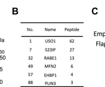

## Question

# Gene Research for Functional Annotation

## ⚠️ CRITICAL: Gene/Protein Identification Context

**BEFORE YOU BEGIN RESEARCH:** You MUST verify you are researching the CORRECT gene/protein. Gene symbols can be ambiguous, especially for less well-characterized genes from non-model organisms.

### Target Gene/Protein Identity (from UniProt):
- **UniProt Accession:** O60763
- **Protein Description:** RecName: Full=General vesicular transport factor p115; AltName: Full=Protein USO1 homolog; AltName: Full=Transcytosis-associated protein; Short=TAP; AltName: Full=Vesicle-docking protein;
- **Gene Information:** Name=USO1; Synonyms=VDP;
- **Organism (full):** Homo sapiens (Human).
- **Protein Family:** Belongs to the VDP/USO1/EDE1 family. .
- **Key Domains:** ARM-like. (IPR011989); ARM-type_fold. (IPR016024); Armadillo. (IPR000225); P115_Arm_rpt. (IPR041209); Uso1_p115_C. (IPR006955)

### MANDATORY VERIFICATION STEPS:

1. **Check if the gene symbol "USO1" matches the protein description above**
2. **Verify the organism is correct:** Homo sapiens (Human).
3. **Check if protein family/domains align with what you find in literature**
4. **If you find literature for a DIFFERENT gene with the same or similar symbol, STOP**

### If Gene Symbol is Ambiguous or You Cannot Find Relevant Literature:

**DO NOT PROCEED WITH RESEARCH ON A DIFFERENT GENE.** Instead:
- State clearly: "The gene symbol 'USO1' is ambiguous or literature is limited for this specific protein"
- Explain what you found (e.g., "Found extensive literature on a different gene with the same symbol in a different organism")
- Describe the protein based ONLY on the UniProt information provided above
- Suggest that the protein function can be inferred from domain/family information

### Research Target:

Please provide a comprehensive research report on the gene **USO1** (gene ID: USO1, UniProt: O60763) in human.

The research report should be a detailed narrative explaining the function, biological processes, and localization of the gene product. Citations should be given for all claims.

You should prioritize authoritative reviews and primary scientific literature when conducting research. You can supplement
this with annotations you find in gene/protein databases, but these can be outdated or inaccurate.

We are specifically interested in the primary function of the gene - for enzymes, what reaction is catalyzed, and what is the substrate specificity? For transporters, what is the substrate? For structural proteins or adapters, what is the broader structural role? For signaling molecules, what is the role in the pathway.

We are interested in where in or outside the cell the gene product carries out its function.

We are also interested in the signaling or biochemical pathways in which the gene functions. We are less interested in broad pleiotropic effects, except where these elucidate the precise role.

Include evidence where possible. We are interested in both experimental evidence as well as inference from structure, evolution, or bioinformatic analysis. Precise studies should be prioritized over high-throughput, where available.

## Output

Question: You are an expert researcher providing comprehensive, well-cited information.

Provide detailed information focusing on:
1. Key concepts and definitions with current understanding
2. Recent developments and latest research (prioritize 2023-2024 sources)
3. Current applications and real-world implementations
4. Expert opinions and analysis from authoritative sources
5. Relevant statistics and data from recent studies

Format as a comprehensive research report with proper citations. Include URLs and publication dates where available.
Always prioritize recent, authoritative sources and provide specific citations for all major claims.

# Gene Research for Functional Annotation

## ⚠️ CRITICAL: Gene/Protein Identification Context

**BEFORE YOU BEGIN RESEARCH:** You MUST verify you are researching the CORRECT gene/protein. Gene symbols can be ambiguous, especially for less well-characterized genes from non-model organisms.

### Target Gene/Protein Identity (from UniProt):
- **UniProt Accession:** O60763
- **Protein Description:** RecName: Full=General vesicular transport factor p115; AltName: Full=Protein USO1 homolog; AltName: Full=Transcytosis-associated protein; Short=TAP; AltName: Full=Vesicle-docking protein;
- **Gene Information:** Name=USO1; Synonyms=VDP;
- **Organism (full):** Homo sapiens (Human).
- **Protein Family:** Belongs to the VDP/USO1/EDE1 family. .
- **Key Domains:** ARM-like. (IPR011989); ARM-type_fold. (IPR016024); Armadillo. (IPR000225); P115_Arm_rpt. (IPR041209); Uso1_p115_C. (IPR006955)

### MANDATORY VERIFICATION STEPS:

1. **Check if the gene symbol "USO1" matches the protein description above**
2. **Verify the organism is correct:** Homo sapiens (Human).
3. **Check if protein family/domains align with what you find in literature**
4. **If you find literature for a DIFFERENT gene with the same or similar symbol, STOP**

### If Gene Symbol is Ambiguous or You Cannot Find Relevant Literature:

**DO NOT PROCEED WITH RESEARCH ON A DIFFERENT GENE.** Instead:
- State clearly: "The gene symbol 'USO1' is ambiguous or literature is limited for this specific protein"
- Explain what you found (e.g., "Found extensive literature on a different gene with the same symbol in a different organism")
- Describe the protein based ONLY on the UniProt information provided above
- Suggest that the protein function can be inferred from domain/family information

### Research Target:

Please provide a comprehensive research report on the gene **USO1** (gene ID: USO1, UniProt: O60763) in human.

The research report should be a detailed narrative explaining the function, biological processes, and localization of the gene product. Citations should be given for all claims.

You should prioritize authoritative reviews and primary scientific literature when conducting research. You can supplement
this with annotations you find in gene/protein databases, but these can be outdated or inaccurate.

We are specifically interested in the primary function of the gene - for enzymes, what reaction is catalyzed, and what is the substrate specificity? For transporters, what is the substrate? For structural proteins or adapters, what is the broader structural role? For signaling molecules, what is the role in the pathway.

We are interested in where in or outside the cell the gene product carries out its function.

We are also interested in the signaling or biochemical pathways in which the gene functions. We are less interested in broad pleiotropic effects, except where these elucidate the precise role.

Include evidence where possible. We are interested in both experimental evidence as well as inference from structure, evolution, or bioinformatic analysis. Precise studies should be prioritized over high-throughput, where available.

## Comprehensive Research Report: Human **USO1** (p115) — Functional Annotation

### Scope, identity verification, and nomenclature
The target is **USO1** in **Homo sapiens**, encoding **general vesicular transport factor p115** (also called p115/USO1; sometimes referenced as vesicle-docking protein), corresponding to UniProt **O60763**. Across retrieved sources, “USO1” consistently refers to the p115-family vesicular trafficking factor involved in early secretory pathway organization and Golgi/ERGIC tethering, with no conflicting alternative gene identity detected in this evidence set. (yakunin2025thegolgivesicle pages 1-5, yakunin2023characterisingthefactors pages 36-39)

### 1) Key concepts and definitions (current understanding)

#### 1.1 Vesicle tethering vs fusion (where USO1/p115 acts)
In the secretory pathway, **COPII vesicles** bud from ER exit sites and must be captured and fused with early Golgi/ERGIC membranes. “Tethering” refers to the initial physical capture/bridging that promotes productive docking and sets the stage for membrane fusion. p115/USO1 is described as a **Golgi vesicle tethering protein** that promotes **vesicle docking and fusion**, in part through binding to SNARE machinery and Rab GTPase–dependent recruitment. (yakunin2025thegolgivesicle pages 1-5, yakunin2025thegolgivesicle pages 11-14)

#### 1.2 Rab GTPase recruitment and SNARE assembly
A widely used framework is that **Rab1 (RAB1A/B)** on COPII vesicles recruits p115/USO1 at the ER–Golgi interface, and p115 then helps organize or stabilize **cis-Golgi SNARE complex assembly**, promoting membrane fusion. A 2023 thesis synthesis explicitly states that p115 has been shown to interact with **Rab1A via its N-terminus** and that p115 interacts with cis-Golgi SNAREs (e.g., Sec22b, Bet1, GOSR2, syntaxin-5) in proposed fusion models. (yakunin2023characterisingthefactors pages 36-39)

#### 1.3 Domain architecture (annotation-level, supported mainly by homolog structural work)
Although the UniProt record specifies armadillo/ARM-like repeats for human USO1/p115, the strongest domain-resolved structural evidence in the retrieved set is from homologs: yeast/fungal Uso1/p115 head domains adopt an **armadillo-repeat/α-solenoid** organization, and the protein includes long coiled-coils implicated in tethering-distance/geometry. Human-centric sources in this set largely describe p115 as a **dimer with an N-terminal head and coiled-coil tail**. (heo2020crystalstructuresof pages 1-2, yakunin2023characterisingthefactors pages 36-39)

### 2) Molecular function and pathways (evidence-led functional annotation)

#### 2.1 Primary function: early secretory pathway tether/fusion factor
Human p115/USO1 is positioned at the **ER–Golgi interface** (ERGIC/cis-Golgi) as a vesicle tether/fusion factor, linking COPII vesicle delivery with productive fusion. In a human-cell experimental study (preprint), p115/USO1 is described as a key player in delivery of COPII vesicles to early Golgi compartments and as binding SNARE proteins to promote fusion; this study adds that p115 can bind an ER exit-site organizer (Sec16A), implying a role in large-scale spatial organization of ER exit sites relative to early Golgi. (yakunin2025thegolgivesicle pages 1-5, yakunin2025thegolgivesicle pages 11-14)

#### 2.2 Interaction network (validated and proposed)
**Rab1/RAB1A:** p115/USO1 is described as associating with Golgi membranes in a **Rab1-dependent** manner and is frequently placed downstream of Rab1 activation on COPII vesicles in mechanistic models. (yakunin2025thegolgivesicle pages 1-5, yakunin2023characterisingthefactors pages 36-39)

**GM130/GRASP65 axis:** A 2023 thesis synthesis states that **GM130 binds p115 at its N-terminus** and that this interaction can be blocked by **Cdk1 phosphorylation of GM130 S37** during mitosis, consistent with mitotic reorganization of the Golgi. (yakunin2023characterisingthefactors pages 36-39)

**SNAREs:** The same synthesis describes p115 interactions with **cis-Golgi SNAREs** (Sec22b, Bet1, GOSR2, syntaxin-5) and advances a model where p115 mediates SNARE complex assembly and vesicle fusion. (yakunin2023characterisingthefactors pages 36-39)

**Sec16A (ER exit-site organizer):** A human-cell study reports that the p115 head domain can bind directly to Sec16A, with mutations that disrupt motif binding reducing secretion efficiency, providing a mechanistic link between a Golgi tether and ER exit-site scaffolding. (yakunin2025thegolgivesicle pages 1-5)

### 3) Subcellular localization (where the protein carries out its role)
Human p115/USO1 localizes to the **ERGIC and cis-Golgi**, cycling on/off membranes and acting at early secretory trafficking steps. A human-cell study describes p115 as anchored to Golgi membranes, acting at the ER–Golgi interface, and adds functional coupling to ER exit sites via binding to Sec16A. (yakunin2025thegolgivesicle pages 1-5, yakunin2025thegolgivesicle pages 11-14)

Homolog systems reinforce this early-Golgi localization: fungal Uso1 resides on puncta overlapping early Golgi/ER–Golgi markers with dynamic residence times. (bravoplaza2023theuso1globular pages 1-2)

### 4) Recent developments and latest research (prioritizing 2023–2024)

#### 4.1 2023: mechanistic shift toward “SNARE-regulatory essentiality” (homolog evidence)
A 2023 eLife study (fungal Uso1; homolog of human p115) reports that the **globular head domain directly binds SNAREs** (including Bet1 and Bos1/membrin family members) and that a **monomeric head domain** can complement loss of full-length Uso1 in vivo when overexpressed—arguing that long-range coiled-coil tethering can be dispensable and that the essential role can involve **direct regulation of SNARE machinery**. Quantitatively, Uso1 puncta had a reported half-life of ~**60 s**, and SNARE binding was modulated by specific point mutations. While not a human experiment, this work is influential because the machinery and architecture are conserved across eukaryotes and the study explicitly frames Uso1/p115 as a Rab1-recruited ER–Golgi tether with direct SNARE contacts. (bravoplaza2023theuso1globular pages 1-2, bravoplaza2023theuso1globular pages 27-30)

#### 4.2 2024: phosphorylation/omics evidence in human disease tissue
A 2024 phosphoproteomics/proteomics study of **treatment-naïve RA synovial biopsies (n=8)** reports that **USO1 Ser48** was the phosphosite with the **highest inverse correlation with ESR** in their analysis, illustrating that USO1 is phosphorylated in human inflammatory tissue and that specific phosphosites can correlate with clinical measures. This is associative and does not establish a trafficking mechanism for Ser48, but it provides human, recent evidence of regulated USO1 phosphorylation in vivo in disease. (cubuk2024phosphoproteomicprofilingof pages 1-2)

#### 4.3 2024: systems-level contextualization in innate immunity
A 2024 review highlights the Golgi’s role in innate immune signaling and emphasizes that Golgi trafficking machinery (including tethers and SNARE-related processes) supports cytokine maturation and secretion pathways that pass through ER→ERGIC→Golgi→TGN routes. This supports the plausibility that perturbations in Golgi tethering proteins can influence immune signaling via secretory logistics, though it is not USO1-specific mechanistic proof. (maruntelu2024thegolgiapparatus pages 1-2)

**Evidence gap note (important):** within the retrieved corpus, there were relatively few **2023–2024 primary studies directly dissecting human USO1/p115 molecular mechanism** (Rab1/GM130/SNARE binding biochemistry/structures) beyond the omics (RA) and broader Golgi/immune review context. Therefore, conserved homolog mechanistic evidence (2023 eLife) is explicitly labeled as such and used cautiously for functional inference. (bravoplaza2023theuso1globular pages 1-2, yakunin2023characterisingthefactors pages 36-39)

### 5) Current applications and real-world implementations

#### 5.1 Host–pathogen biology: Legionella hijacking of p115
A major real-world implementation of USO1/p115 biology is in **infection cell biology**: a 2022 Science Advances study shows that the Legionella effector **LegA15** hijacks host **p115**, inducing host **Golgi fragmentation** and altering lipid-droplet homeostasis. Proteomics identified p115/USO1 as a top putative interactor with high peptide support (see quantitative section and figure-based evidence below). This provides a concrete example where p115 is a host dependency exploited by pathogens. (chen2022atypicallegionellagtpase pages 1-2, chen2022atypicallegionellagtpase media 41416518, chen2022atypicallegionellagtpase media b798ae8b)

#### 5.2 Cancer cell biology and biomarker/isoform studies
In hepatocellular carcinoma, an isoform-level USO1 study reports tumor-associated isoforms with distinct functional consequences on Golgi structure and ER→Golgi→plasma membrane trafficking, linking ER–Golgi network dysregulation to cancer aggressiveness and prognosis association. (yoon2021uso1isoformsdifferentially pages 1-2, yoon2021uso1isoformsdifferentially pages 7-8)

#### 5.3 Clinical proteomics/phosphoproteomics for stratification
The 2024 RA synovial phosphoproteomics study illustrates a practical pipeline for **label-free MS-based phosphoproteomics** in patient tissue and supports the concept that pathway activity/phosphosite signatures can stratify disease pathotypes; USO1 Ser48 emerges as one of the phosphosites associated with a clinical metric (ESR). (cubuk2024phosphoproteomicprofilingof pages 1-2)

### 6) Expert opinions and analysis (authoritative synthesis)
A 2023 thesis synthesis (University of Cambridge repository) summarizes multiple models for p115/USO1 action, including: (i) tethering via C-terminal binding to golgins such as GM130/giantin, (ii) Rab1A binding via the N-terminus, and (iii) promotion of SNARE assembly/fusion. Importantly, it emphasizes that the field has debated whether p115’s golgin-binding is essential (conflicting results between models), consistent with more recent homolog mechanistic work suggesting essentiality may lie in SNARE regulation rather than long-distance tethering alone. (yakunin2023characterisingthefactors pages 36-39, bravoplaza2023theuso1globular pages 1-2)

### 7) Relevant statistics and recent data (quantitative highlights)

#### 7.1 Proteomics: p115/USO1 peptide support in host–pathogen interaction mapping
In the LegA15 immunoprecipitation/MS analysis, **p115/USO1 was identified with 62 unique peptides** among top candidate binding proteins (figure-based evidence). (chen2022atypicallegionellagtpase media 41416518)

#### 7.2 Live-cell dynamics and colocalization (homolog system)
In fungal Uso1 (homolog), Uso1 puncta recurrence had an estimated half-life of ~**60 seconds**, and quantitative colocalization with early Golgi markers was reported (e.g., Pearson correlations with early Golgi factors and Rab1). While not human, these data quantify early Golgi association dynamics for a conserved tether/fusion factor. (bravoplaza2023theuso1globular pages 1-2, bravoplaza2022tetheringbyuso1 pages 11-13)

#### 7.3 Human phosphoproteomics cohort size and USO1 phosphosite association
In the 2024 RA synovium study, **8 pre-treatment synovial biopsies** were analyzed by label-free MS; within correlated phosphosite analyses, **USO1 Ser48** was highlighted as having the strongest inverse correlation with ESR (as reported in the study text describing Fig. 4C). (cubuk2024phosphoproteomicprofilingof pages 1-2)

#### 7.4 Human trafficking assay quantitation framework (HCC context)
In the HCC isoform study, ER→Golgi trafficking was quantified using a VSVG-ts045 trafficking assay with readouts reported as mean % of cells ± SEM and sampling of **n=5–8 fields** with **10–50 cells per field** (exact percentages are not included in the available excerpt). (yoon2021uso1isoformsdifferentially pages 9-10)

### Summary table of supported annotation
The following table consolidates function, localization, partners, regulation, disease links, and quantitative points, explicitly distinguishing direct human evidence from homolog inference:

| Category | Evidence summary | Key references with DOI/URL and publication date | Citation IDs |
|---|---|---|---|
| Identity/domains | **Verified target:** human **USO1** encodes **general vesicular transport factor p115** (also called p115/USO1), a Golgi/ER-Golgi tethering factor. Structural evidence from homolog work shows an **N-terminal globular head with armadillo-repeat/α-solenoid architecture** and a long **coiled-coil tail**; human-focused studies and reviews describe p115 as a **dimer** with N-terminal head and coiled-coil tail. **Note:** direct domain-resolution evidence here is mainly from yeast/fungal homologs and review synthesis, not a new 2023–2024 human structure. (heo2020crystalstructuresof pages 1-2, yakunin2023characterisingthefactors pages 36-39) | Heo Y et al. *Sci Rep* (2020), doi:10.1038/s41598-020-66480-1, https://doi.org/10.1038/s41598-020-66480-1, published Jun 2020; Yakunin I. PhD thesis (2023), doi:10.17863/cam.93885, https://doi.org/10.17863/cam.93885, published Feb 2023 | (heo2020crystalstructuresof pages 1-2, yakunin2023characterisingthefactors pages 36-39) |
| Core molecular function | **Human evidence:** p115/USO1 is a **Golgi vesicle tether** required for **ER-to-Golgi/early secretory trafficking**, vesicle docking, and secretion efficiency; recent human-cell work also supports direct binding of p115 to **Sec16A**, an ER exit site organizer, linking p115 to early secretory pathway organization. **Homolog evidence:** 2023 fungal work argues the **globular head directly binds SNAREs** and that long-range coiled-coil tethering may be partly dispensable, emphasizing a key role in **SNARE regulation/fusion competence**. (yakunin2025thegolgivesicle pages 1-5, yakunin2025thegolgivesicle pages 11-14, bravoplaza2023theuso1globular pages 1-2) | Yakunin IG et al. bioRxiv preprint, doi:10.1101/2025.10.16.682774, https://doi.org/10.1101/2025.10.16.682774, posted Oct 2025; Bravo-Plaza I et al. *eLife* (2023), doi:10.7554/eLife.85079, https://doi.org/10.7554/elife.85079, published May 30 2023 | (yakunin2025thegolgivesicle pages 1-5, yakunin2025thegolgivesicle pages 11-14, bravoplaza2023theuso1globular pages 1-2) |
| Key interaction partners | **Human-supported/reviewed partners:** **RAB1A** binds the N-terminus; **GM130** binds p115 at its N-terminus in a mitotically regulated manner; p115 also interacts with **giantin** at the C-terminus and with cis-Golgi **SNAREs** including **Sec22b, Bet1, GOSR2, syntaxin-5** in proposed SNARE-assembly/fusion models. **Human disease/pathogen context:** Legionella effector **LegA15** physically hijacks host p115. **Homolog support:** fungal/yeast studies support direct binding to Bet1/Bos1/Sec22-family SNAREs and recruitment dependence on Rab1/golgin systems. (chen2022atypicallegionellagtpase pages 1-2, yakunin2023characterisingthefactors pages 36-39, bravoplaza2022tetheringbyuso1 pages 20-23) | Chen T-T et al. *Sci Adv* (2022), doi:10.1126/sciadv.add7945, https://doi.org/10.1126/sciadv.add7945, published Dec 16 2022; Yakunin I. PhD thesis (2023), doi:10.17863/cam.93885, https://doi.org/10.17863/cam.93885, published Feb 2023; Bravo-Plaza I et al. bioRxiv (2022), doi:10.1101/2022.11.30.518472, https://doi.org/10.1101/2022.11.30.518472, posted Dec 2022 | (chen2022atypicallegionellagtpase pages 1-2, yakunin2023characterisingthefactors pages 36-39, bravoplaza2022tetheringbyuso1 pages 20-23) |
| Subcellular localization | **Human evidence/review:** p115 localizes to the **ERGIC and cis-Golgi**, associates with Golgi membranes in a **Rab1-dependent** manner, and functions at the **ER–Golgi interface**; recent human-cell work also links it to **ER exit sites** via Sec16A. **Homolog evidence:** fungal Uso1 cycles on early Golgi/ER-Golgi puncta. (yakunin2025thegolgivesicle pages 1-5, yakunin2025thegolgivesicle pages 11-14, bravoplaza2023theuso1globular pages 1-2) | Yakunin IG et al. bioRxiv preprint, doi:10.1101/2025.10.16.682774, https://doi.org/10.1101/2025.10.16.682774, posted Oct 2025; Bravo-Plaza I et al. *eLife* (2023), doi:10.7554/eLife.85079, https://doi.org/10.7554/elife.85079, published May 30 2023 | (yakunin2025thegolgivesicle pages 1-5, yakunin2025thegolgivesicle pages 11-14, bravoplaza2023theuso1globular pages 1-2) |
| Pathways/processes | USO1/p115 functions in the **early secretory pathway**, especially **COPII-derived ER-to-Golgi transport**, **vesicle tethering/docking**, and likely **cis-SNARE complex assembly/fusion**. In broader cell-biology/immune reviews, Golgi tethers including p115 are discussed as supporting **cytokine secretion** and Golgi-dependent innate immune signaling logistics, but this is contextual rather than USO1-specific mechanistic proof. (heo2020crystalstructuresof pages 1-2, yakunin2023characterisingthefactors pages 36-39, maruntelu2024thegolgiapparatus pages 1-2) | Heo Y et al. *Sci Rep* (2020), doi:10.1038/s41598-020-66480-1, https://doi.org/10.1038/s41598-020-66480-1, published Jun 2020; Yakunin I. PhD thesis (2023), doi:10.17863/cam.93885, https://doi.org/10.17863/cam.93885, published Feb 2023; Mărunțelu I et al. *Int J Mol Sci* (2024), doi:10.3390/ijms25074120, https://doi.org/10.3390/ijms25074120, published Apr 8 2024 | (heo2020crystalstructuresof pages 1-2, yakunin2023characterisingthefactors pages 36-39, maruntelu2024thegolgiapparatus pages 1-2) |
| Regulation/PTMs | **Human review evidence:** the **GM130–p115 interaction is blocked by Cdk1 phosphorylation of GM130 S37 during mitosis**, indicating cell-cycle regulation of p115 tethering. **Human phosphoproteomics:** **USO1 Ser48** was reported in RA synovial phosphoproteomic analysis as inversely correlated with ESR, suggesting regulated phosphorylation in disease tissue, but this is associative and not mechanistically assigned to trafficking. (yakunin2023characterisingthefactors pages 36-39, cubuk2024phosphoproteomicprofilingof pages 1-2) | Yakunin I. PhD thesis (2023), doi:10.17863/cam.93885, https://doi.org/10.17863/cam.93885, published Feb 2023; Çubuk C et al. *Arthritis Res Ther* (2024), doi:10.1186/s13075-024-03351-4, https://doi.org/10.1186/s13075-024-03351-4, published Jun 2024 | (yakunin2023characterisingthefactors pages 36-39, cubuk2024phosphoproteomicprofilingof pages 1-2) |
| Disease/clinical associations | **Cancer:** in human HCC, a tumor-associated isoform **USO1-T** correlates with poorer prognosis, promotes aggressive behavior, causes **Golgi unstacking**, and accelerates trafficking from ER to Golgi/plasma membrane; modeling suggests weakened dimerization/GM130 tethering and involvement of **ERK** and **GRASP65**. Additional literature summaries link USO1/p115 to colon cancer, gastric cancer, multiple myeloma, NSCLC, and leukemia vulnerability/fusions, though quantitative details are limited in the available snippets. **Infection:** Legionella **LegA15** hijacks host p115, causing Golgi fragmentation and altered lipid-droplet homeostasis. (yoon2021uso1isoformsdifferentially pages 1-2, yoon2021uso1isoformsdifferentially pages 13-13, li2025uso1coordinatescentriolar pages 13-14, chen2022atypicallegionellagtpase pages 1-2) | Yoon S et al. *Carcinogenesis* (2021), doi:10.1093/carcin/bgab067, https://doi.org/10.1093/carcin/bgab067, published Jul 22 2021; Chen T-T et al. *Sci Adv* (2022), doi:10.1126/sciadv.add7945, https://doi.org/10.1126/sciadv.add7945, published Dec 16 2022 | (yoon2021uso1isoformsdifferentially pages 1-2, yoon2021uso1isoformsdifferentially pages 13-13, li2025uso1coordinatescentriolar pages 13-14, chen2022atypicallegionellagtpase pages 1-2) |
| Recent developments 2023-2024 | **2023:** homolog-based mechanistic work showed the **Uso1/p115 globular head directly binds SNAREs** and can sustain essential function without the coiled-coil tether, sharpening the model from “long tether” to **SNARE-regulatory tether/fusion factor**. **2024:** Golgi/innate-immunity review highlights p115 among Golgi tethers relevant to secretory and immune processes; RA phosphoproteomics identified **USO1 Ser48** as a disease-associated phosphosite. **Caveat:** among retrieved items, truly human USO1-specific primary mechanistic advances in 2023–2024 were limited. (bravoplaza2023theuso1globular pages 1-2, maruntelu2024thegolgiapparatus pages 1-2, cubuk2024phosphoproteomicprofilingof pages 1-2) | Bravo-Plaza I et al. *eLife* (2023), doi:10.7554/eLife.85079, https://doi.org/10.7554/elife.85079, published May 30 2023; Mărunțelu I et al. *Int J Mol Sci* (2024), doi:10.3390/ijms25074120, https://doi.org/10.3390/ijms25074120, published Apr 8 2024; Çubuk C et al. *Arthritis Res Ther* (2024), doi:10.1186/s13075-024-03351-4, https://doi.org/10.1186/s13075-024-03351-4, published Jun 2024 | (bravoplaza2023theuso1globular pages 1-2, maruntelu2024thegolgiapparatus pages 1-2, cubuk2024phosphoproteomicprofilingof pages 1-2) |
| Quantitative data points | **Homolog quantitative data:** fungal Uso1 puncta half-life ~**60 s**; Pearson colocalization with GeaA/Gea1,2 **0.52 ± 0.06 (n=16)** and with RAB1 **0.61 ± 0.07 (n=20)**. **Human/pathogen quantitative data:** LegA15 interactome identified host p115/USO1 with **62 unique peptides** in MS. **Human trafficking assay framework:** HCC study quantified VSVG trafficking as mean % cells ± SEM with **n=5–8 fields, 10–50 cells/field**, but exact values were not in the available snippet. **Human interaction assay parameters (preprint):** RUSH assay used **1 mM biotin**, **35 min** progression, **3 biological repeats**. (bravoplaza2023theuso1globular pages 1-2, bravoplaza2022tetheringbyuso1 pages 11-13, chen2022atypicallegionellagtpase media 41416518, yoon2021uso1isoformsdifferentially pages 9-10, yakunin2025thegolgivesicle pages 11-14) | Bravo-Plaza I et al. *eLife* (2023), doi:10.7554/eLife.85079, https://doi.org/10.7554/elife.85079, published May 30 2023; Bravo-Plaza I et al. bioRxiv (2022), doi:10.1101/2022.11.30.518472, https://doi.org/10.1101/2022.11.30.518472, posted Dec 2022; Chen T-T et al. *Sci Adv* (2022), doi:10.1126/sciadv.add7945, https://doi.org/10.1126/sciadv.add7945, published Dec 16 2022; Yoon S et al. *Carcinogenesis* (2021), doi:10.1093/carcin/bgab067, https://doi.org/10.1093/carcin/bgab067, published Jul 22 2021; Yakunin IG et al. bioRxiv preprint, doi:10.1101/2025.10.16.682774, https://doi.org/10.1101/2025.10.16.682774, posted Oct 2025 | (bravoplaza2023theuso1globular pages 1-2, bravoplaza2022tetheringbyuso1 pages 11-13, chen2022atypicallegionellagtpase media 41416518, yoon2021uso1isoformsdifferentially pages 9-10, yakunin2025thegolgivesicle pages 11-14) |

*Table: This table summarizes supported functional annotation for human USO1/p115 (UniProt O60763), separating direct human evidence from inference based on yeast/fungal homologs. It highlights function, localization, partners, disease links, and the strongest quantitative findings available from the gathered evidence.*

### Figure-based evidence (visual)
The following figure crops provide visual support for key quantitative and mechanistic claims regarding host p115/USO1 in Legionella infection biology:

* Proteomics evidence identifying p115/USO1 with **62 unique peptides** as a top LegA15 interactor. (chen2022atypicallegionellagtpase media 41416518)
* Model schematic of LegA15 hijacking host p115 to impact LD/LCV interactions and Golgi fragmentation. (chen2022atypicallegionellagtpase media b798ae8b)

### Concluding functional annotation (most defensible claims)
1. **Core role:** Human **USO1/p115** is a conserved **ERGIC/cis-Golgi vesicle tether/fusion factor** in early secretory trafficking, connecting Rab1-regulated vesicle capture/docking with SNARE-dependent membrane fusion. (yakunin2025thegolgivesicle pages 1-5, yakunin2023characterisingthefactors pages 36-39)
2. **Key interactions:** Robustly supported interaction axes include **Rab1A**, **GM130** (mitotically regulated via GM130 S37 phosphorylation), and **cis-Golgi SNAREs** (Sec22b/Bet1/GOSR2/STX5 in proposed models); newer work also links p115 to **Sec16A** at ER exit sites. (yakunin2023characterisingthefactors pages 36-39, yakunin2025thegolgivesicle pages 1-5)
3. **Localization:** p115/USO1 localizes to **ERGIC and cis-Golgi** and functionally couples to **ER exit sites** (Sec16A linkage). (yakunin2025thegolgivesicle pages 1-5)
4. **Human disease relevance:** USO1 is implicated in **cancer trafficking/Golgi organization phenotypes** (HCC isoform effects) and appears in **human disease phosphoproteomes** (USO1 Ser48 association in RA tissue). (yoon2021uso1isoformsdifferentially pages 1-2, cubuk2024phosphoproteomicprofilingof pages 1-2)
5. **Real-world exploitation:** Host p115/USO1 is directly **hijacked by Legionella** effector LegA15, supported by proteomics (62 unique peptides) and mechanistic modeling. (chen2022atypicallegionellagtpase media 41416518, chen2022atypicallegionellagtpase media b798ae8b)

### Reference URLs and publication dates (from retrieved sources)
- Bravo-Plaza I. et al. *eLife* (published **2023-05-30**): https://doi.org/10.7554/elife.85079 (bravoplaza2023theuso1globular pages 1-2)
- Çubuk C. et al. *Arthritis Research & Therapy* (published **2024-06**, DOI page): https://doi.org/10.1186/s13075-024-03351-4 (cubuk2024phosphoproteomicprofilingof pages 1-2)
- Mărunțelu I. et al. *International Journal of Molecular Sciences* (published **2024-04-08**): https://doi.org/10.3390/ijms25074120 (maruntelu2024thegolgiapparatus pages 1-2)
- Chen T.-T. et al. *Science Advances* (published **2022-12-16**): https://doi.org/10.1126/sciadv.add7945 (chen2022atypicallegionellagtpase pages 1-2)
- Yoon S. et al. *Carcinogenesis* (advance access **2021-07-22**): https://doi.org/10.1093/carcin/bgab067 (yoon2021uso1isoformsdifferentially pages 1-2)
- Yakunin I. PhD thesis/dissertation (published **2023-02**): https://doi.org/10.17863/cam.93885 (yakunin2023characterisingthefactors pages 36-39)

References

1. (yakunin2025thegolgivesicle pages 1-5): Igor Yakunin, Alison K Gillingham, Conceição Pereira, David C Gershlick, and Sean Munro. The golgi vesicle tether p115/uso1 can bind directly to the er exit site organiser sec16a. BioRxiv, Oct 2026. URL: https://doi.org/10.1101/2025.10.16.682774, doi:10.1101/2025.10.16.682774. This article has 1 citations.

2. (yakunin2023characterisingthefactors pages 36-39): Characterising the factors involved in ER-to-Golgi anterograde trafficking This article has 0 citations.

3. (yakunin2025thegolgivesicle pages 11-14): Igor Yakunin, Alison K Gillingham, Conceição Pereira, David C Gershlick, and Sean Munro. The golgi vesicle tether p115/uso1 can bind directly to the er exit site organiser sec16a. BioRxiv, Oct 2026. URL: https://doi.org/10.1101/2025.10.16.682774, doi:10.1101/2025.10.16.682774. This article has 1 citations.

4. (heo2020crystalstructuresof pages 1-2): Yoonyoung Heo, Hye-Jin Yoon, Hanseo Ko, Soonmin Jang, and Hyung Ho Lee. Crystal structures of uso1 membrane tether reveal an alternative conformation in the globular head domain. Scientific Reports, Jun 2020. URL: https://doi.org/10.1038/s41598-020-66480-1, doi:10.1038/s41598-020-66480-1. This article has 14 citations and is from a peer-reviewed journal.

5. (bravoplaza2023theuso1globular pages 1-2): Ignacio Bravo-Plaza, Victor G Tagua, Herbert N Arst, Ana Alonso, Mario Pinar, Begoña Monterroso, Antonio Galindo, and Miguel A Peñalva. The uso1 globular head interacts with snares to maintain viability even in the absence of the coiled-coil domain. eLife, May 2023. URL: https://doi.org/10.7554/elife.85079, doi:10.7554/elife.85079. This article has 10 citations and is from a domain leading peer-reviewed journal.

6. (bravoplaza2023theuso1globular pages 27-30): Ignacio Bravo-Plaza, Victor G Tagua, Herbert N Arst, Ana Alonso, Mario Pinar, Begoña Monterroso, Antonio Galindo, and Miguel A Peñalva. The uso1 globular head interacts with snares to maintain viability even in the absence of the coiled-coil domain. eLife, May 2023. URL: https://doi.org/10.7554/elife.85079, doi:10.7554/elife.85079. This article has 10 citations and is from a domain leading peer-reviewed journal.

7. (cubuk2024phosphoproteomicprofilingof pages 1-2): Cankut Çubuk, Rachel Lau, Pedro Cutillas, Vinothini Rajeeve, Christopher R. John, Anna E. A. Surace, Rebecca Hands, Liliane Fossati-Jimack, Myles J. Lewis, and Costantino Pitzalis. Phosphoproteomic profiling of early rheumatoid arthritis synovium reveals active signalling pathways and differentiates inflammatory pathotypes. Arthritis Research & Therapy, Jun 2024. URL: https://doi.org/10.1186/s13075-024-03351-4, doi:10.1186/s13075-024-03351-4. This article has 12 citations and is from a domain leading peer-reviewed journal.

8. (maruntelu2024thegolgiapparatus pages 1-2): Ion Mărunţelu, Alexandra-Elena Constantinescu, Razvan-Adrian Covache-Busuioc, and Ileana Constantinescu. The golgi apparatus: a key player in innate immunity. International Journal of Molecular Sciences, 25:4120, Apr 2024. URL: https://doi.org/10.3390/ijms25074120, doi:10.3390/ijms25074120. This article has 20 citations.

9. (chen2022atypicallegionellagtpase pages 1-2): Tao-Tao Chen, Yanling Lin, Shijun Zhang, Shuxin Liu, Lei Song, Wenhong Zhong, Zhao-Qing Luo, and Aidong Han. Atypical <i>legionella</i> gtpase effector hijacks host vesicular transport factor p115 to regulate host lipid droplet. Science Advances, Dec 2022. URL: https://doi.org/10.1126/sciadv.add7945, doi:10.1126/sciadv.add7945. This article has 15 citations and is from a highest quality peer-reviewed journal.

10. (chen2022atypicallegionellagtpase media 41416518): Tao-Tao Chen, Yanling Lin, Shijun Zhang, Shuxin Liu, Lei Song, Wenhong Zhong, Zhao-Qing Luo, and Aidong Han. Atypical <i>legionella</i> gtpase effector hijacks host vesicular transport factor p115 to regulate host lipid droplet. Science Advances, Dec 2022. URL: https://doi.org/10.1126/sciadv.add7945, doi:10.1126/sciadv.add7945. This article has 15 citations and is from a highest quality peer-reviewed journal.

11. (chen2022atypicallegionellagtpase media b798ae8b): Tao-Tao Chen, Yanling Lin, Shijun Zhang, Shuxin Liu, Lei Song, Wenhong Zhong, Zhao-Qing Luo, and Aidong Han. Atypical <i>legionella</i> gtpase effector hijacks host vesicular transport factor p115 to regulate host lipid droplet. Science Advances, Dec 2022. URL: https://doi.org/10.1126/sciadv.add7945, doi:10.1126/sciadv.add7945. This article has 15 citations and is from a highest quality peer-reviewed journal.

12. (yoon2021uso1isoformsdifferentially pages 1-2): Sarah Yoon, Ji-Hye Choi, Masaud Shah, So Mee Kwon, Jieun Yang, Young Nyun Park, Hee-Jung Wang, and Hyun Goo Woo. Uso1 isoforms differentially promote liver cancer progression by dysregulating the er-golgi network. Carcinogenesis, 42:1208-1220, Jul 2021. URL: https://doi.org/10.1093/carcin/bgab067, doi:10.1093/carcin/bgab067. This article has 13 citations and is from a peer-reviewed journal.

13. (yoon2021uso1isoformsdifferentially pages 7-8): Sarah Yoon, Ji-Hye Choi, Masaud Shah, So Mee Kwon, Jieun Yang, Young Nyun Park, Hee-Jung Wang, and Hyun Goo Woo. Uso1 isoforms differentially promote liver cancer progression by dysregulating the er-golgi network. Carcinogenesis, 42:1208-1220, Jul 2021. URL: https://doi.org/10.1093/carcin/bgab067, doi:10.1093/carcin/bgab067. This article has 13 citations and is from a peer-reviewed journal.

14. (bravoplaza2022tetheringbyuso1 pages 11-13): Ignacio Bravo-Plaza, Víctor G. Tagua, Herbert N. Arst, Ana Alonso, Mario Pinar, Begoña Monterroso, Antonio Galindo, and Miguel Á. Peñalva. Tethering by uso1 is dispensable: the uso1 monomeric globular head domain interacts with snares to maintain viability. bioRxiv, Dec 2022. URL: https://doi.org/10.1101/2022.11.30.518472, doi:10.1101/2022.11.30.518472. This article has 0 citations.

15. (yoon2021uso1isoformsdifferentially pages 9-10): Sarah Yoon, Ji-Hye Choi, Masaud Shah, So Mee Kwon, Jieun Yang, Young Nyun Park, Hee-Jung Wang, and Hyun Goo Woo. Uso1 isoforms differentially promote liver cancer progression by dysregulating the er-golgi network. Carcinogenesis, 42:1208-1220, Jul 2021. URL: https://doi.org/10.1093/carcin/bgab067, doi:10.1093/carcin/bgab067. This article has 13 citations and is from a peer-reviewed journal.

16. (bravoplaza2022tetheringbyuso1 pages 20-23): Ignacio Bravo-Plaza, Víctor G. Tagua, Herbert N. Arst, Ana Alonso, Mario Pinar, Begoña Monterroso, Antonio Galindo, and Miguel Á. Peñalva. Tethering by uso1 is dispensable: the uso1 monomeric globular head domain interacts with snares to maintain viability. bioRxiv, Dec 2022. URL: https://doi.org/10.1101/2022.11.30.518472, doi:10.1101/2022.11.30.518472. This article has 0 citations.

17. (yoon2021uso1isoformsdifferentially pages 13-13): Sarah Yoon, Ji-Hye Choi, Masaud Shah, So Mee Kwon, Jieun Yang, Young Nyun Park, Hee-Jung Wang, and Hyun Goo Woo. Uso1 isoforms differentially promote liver cancer progression by dysregulating the er-golgi network. Carcinogenesis, 42:1208-1220, Jul 2021. URL: https://doi.org/10.1093/carcin/bgab067, doi:10.1093/carcin/bgab067. This article has 13 citations and is from a peer-reviewed journal.

18. (li2025uso1coordinatescentriolar pages 13-14): Xinyi Li, Peiyi Lin, Zaikuan Zhang, Runzhi Wang, Jing Cai, Xiaosong Feng, Zhihong Jiang, Shengming Xu, and Yajun Xie. Uso1 coordinates centriolar satellites to regulate male germ cell proliferation and cell cycle progression. International Journal of Molecular Sciences, 26:4274, Apr 2025. URL: https://doi.org/10.3390/ijms26094274, doi:10.3390/ijms26094274. This article has 0 citations.

## Artifacts

- [Edison artifact artifact-00](USO1-deep-research-falcon_artifacts/artifact-00.md)

## Citations

1. yakunin2023characterisingthefactors pages 36-39
2. yakunin2025thegolgivesicle pages 1-5
3. cubuk2024phosphoproteomicprofilingof pages 1-2
4. maruntelu2024thegolgiapparatus pages 1-2
5. chen2022atypicallegionellagtpase pages 1-2
6. yakunin2025thegolgivesicle pages 11-14
7. heo2020crystalstructuresof pages 1-2
8. https://doi.org/10.1038/s41598-020-66480-1,
9. https://doi.org/10.17863/cam.93885,
10. https://doi.org/10.1101/2025.10.16.682774,
11. https://doi.org/10.7554/elife.85079,
12. https://doi.org/10.1126/sciadv.add7945,
13. https://doi.org/10.1101/2022.11.30.518472,
14. https://doi.org/10.3390/ijms25074120,
15. https://doi.org/10.1186/s13075-024-03351-4,
16. https://doi.org/10.1093/carcin/bgab067,
17. https://doi.org/10.7554/elife.85079
18. https://doi.org/10.1186/s13075-024-03351-4
19. https://doi.org/10.3390/ijms25074120
20. https://doi.org/10.1126/sciadv.add7945
21. https://doi.org/10.1093/carcin/bgab067
22. https://doi.org/10.17863/cam.93885
23. https://doi.org/10.3390/ijms26094274,