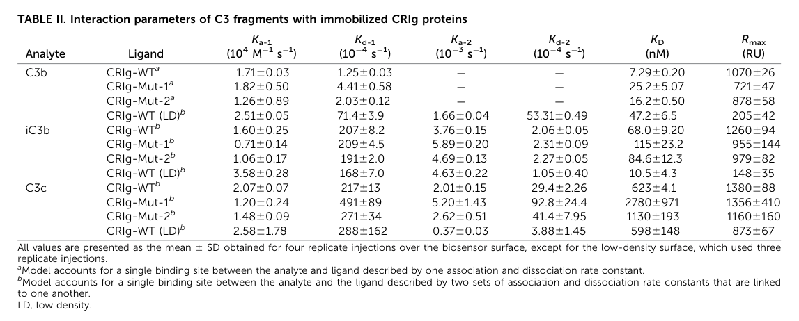

## Question

# Gene Research for Functional Annotation

## ⚠️ CRITICAL: Gene/Protein Identification Context

**BEFORE YOU BEGIN RESEARCH:** You MUST verify you are researching the CORRECT gene/protein. Gene symbols can be ambiguous, especially for less well-characterized genes from non-model organisms.

### Target Gene/Protein Identity (from UniProt):
- **UniProt Accession:** Q9Y279
- **Protein Description:** RecName: Full=V-set and immunoglobulin domain-containing protein 4; AltName: Full=Protein Z39Ig; Flags: Precursor;
- **Gene Information:** Name=VSIG4; Synonyms=CRIg, Z39IG; ORFNames=UNQ317/PRO362;
- **Organism (full):** Homo sapiens (Human).
- **Protein Family:** Not specified in UniProt
- **Key Domains:** Ig-like_dom. (IPR007110); Ig-like_dom_sf. (IPR036179); Ig-like_fold. (IPR013783); Ig_sub. (IPR003599); Ig_sub2. (IPR003598)

### MANDATORY VERIFICATION STEPS:

1. **Check if the gene symbol "VSIG4" matches the protein description above**
2. **Verify the organism is correct:** Homo sapiens (Human).
3. **Check if protein family/domains align with what you find in literature**
4. **If you find literature for a DIFFERENT gene with the same or similar symbol, STOP**

### If Gene Symbol is Ambiguous or You Cannot Find Relevant Literature:

**DO NOT PROCEED WITH RESEARCH ON A DIFFERENT GENE.** Instead:
- State clearly: "The gene symbol 'VSIG4' is ambiguous or literature is limited for this specific protein"
- Explain what you found (e.g., "Found extensive literature on a different gene with the same symbol in a different organism")
- Describe the protein based ONLY on the UniProt information provided above
- Suggest that the protein function can be inferred from domain/family information

### Research Target:

Please provide a comprehensive research report on the gene **VSIG4** (gene ID: VSIG4, UniProt: Q9Y279) in human.

The research report should be a detailed narrative explaining the function, biological processes, and localization of the gene product. Citations should be given for all claims.

You should prioritize authoritative reviews and primary scientific literature when conducting research. You can supplement
this with annotations you find in gene/protein databases, but these can be outdated or inaccurate.

We are specifically interested in the primary function of the gene - for enzymes, what reaction is catalyzed, and what is the substrate specificity? For transporters, what is the substrate? For structural proteins or adapters, what is the broader structural role? For signaling molecules, what is the role in the pathway.

We are interested in where in or outside the cell the gene product carries out its function.

We are also interested in the signaling or biochemical pathways in which the gene functions. We are less interested in broad pleiotropic effects, except where these elucidate the precise role.

Include evidence where possible. We are interested in both experimental evidence as well as inference from structure, evolution, or bioinformatic analysis. Precise studies should be prioritized over high-throughput, where available.

## Output

Question: You are an expert researcher providing comprehensive, well-cited information.

Provide detailed information focusing on:
1. Key concepts and definitions with current understanding
2. Recent developments and latest research (prioritize 2023-2024 sources)
3. Current applications and real-world implementations
4. Expert opinions and analysis from authoritative sources
5. Relevant statistics and data from recent studies

Format as a comprehensive research report with proper citations. Include URLs and publication dates where available.
Always prioritize recent, authoritative sources and provide specific citations for all major claims.

# Gene Research for Functional Annotation

## ⚠️ CRITICAL: Gene/Protein Identification Context

**BEFORE YOU BEGIN RESEARCH:** You MUST verify you are researching the CORRECT gene/protein. Gene symbols can be ambiguous, especially for less well-characterized genes from non-model organisms.

### Target Gene/Protein Identity (from UniProt):
- **UniProt Accession:** Q9Y279
- **Protein Description:** RecName: Full=V-set and immunoglobulin domain-containing protein 4; AltName: Full=Protein Z39Ig; Flags: Precursor;
- **Gene Information:** Name=VSIG4; Synonyms=CRIg, Z39IG; ORFNames=UNQ317/PRO362;
- **Organism (full):** Homo sapiens (Human).
- **Protein Family:** Not specified in UniProt
- **Key Domains:** Ig-like_dom. (IPR007110); Ig-like_dom_sf. (IPR036179); Ig-like_fold. (IPR013783); Ig_sub. (IPR003599); Ig_sub2. (IPR003598)

### MANDATORY VERIFICATION STEPS:

1. **Check if the gene symbol "VSIG4" matches the protein description above**
2. **Verify the organism is correct:** Homo sapiens (Human).
3. **Check if protein family/domains align with what you find in literature**
4. **If you find literature for a DIFFERENT gene with the same or similar symbol, STOP**

### If Gene Symbol is Ambiguous or You Cannot Find Relevant Literature:

**DO NOT PROCEED WITH RESEARCH ON A DIFFERENT GENE.** Instead:
- State clearly: "The gene symbol 'VSIG4' is ambiguous or literature is limited for this specific protein"
- Explain what you found (e.g., "Found extensive literature on a different gene with the same symbol in a different organism")
- Describe the protein based ONLY on the UniProt information provided above
- Suggest that the protein function can be inferred from domain/family information

### Research Target:

Please provide a comprehensive research report on the gene **VSIG4** (gene ID: VSIG4, UniProt: Q9Y279) in human.

The research report should be a detailed narrative explaining the function, biological processes, and localization of the gene product. Citations should be given for all claims.

You should prioritize authoritative reviews and primary scientific literature when conducting research. You can supplement
this with annotations you find in gene/protein databases, but these can be outdated or inaccurate.

We are specifically interested in the primary function of the gene - for enzymes, what reaction is catalyzed, and what is the substrate specificity? For transporters, what is the substrate? For structural proteins or adapters, what is the broader structural role? For signaling molecules, what is the role in the pathway.

We are interested in where in or outside the cell the gene product carries out its function.

We are also interested in the signaling or biochemical pathways in which the gene functions. We are less interested in broad pleiotropic effects, except where these elucidate the precise role.

Include evidence where possible. We are interested in both experimental evidence as well as inference from structure, evolution, or bioinformatic analysis. Precise studies should be prioritized over high-throughput, where available.

# Human VSIG4 (UniProt Q9Y279): functional annotation and research assessment

**Identity verified.** Human UniProt **Q9Y279** corresponds to **VSIG4**, also called **CRIg** (complement receptor of the immunoglobulin superfamily) and **Z39Ig**. This is an immunoglobulin-superfamily, type-I single-pass membrane protein—not an enzyme or transporter. Its extracellular **IgV-like domain** mediates complement recognition; the principal long human isoform additionally has an IgC2-like domain. Alternative splicing produces shorter forms lacking IgC2, so domain descriptions must be interpreted by isoform. A 2023 structural review identifies a 399-amino-acid long precursor, although descriptions of the lengths and number of short isoforms vary among reports. These findings match the supplied human accession, aliases, and Ig-like domain annotations; literature on mouse *Vsig4* is used below only where its species is identified. [UniProt Q9Y279](https://www.uniprot.org/uniprotkb/Q9Y279/entry); [Zhou et al., September 2022](https://doi.org/10.3389/fimmu.2022.938470); [Santos-López et al., September 2023](https://doi.org/10.3389/fimmu.2023.1239146). (zhou2022vsetandimmunoglobulin pages 3-4, small2016complementreceptorimmunoglobulin pages 2-3, pez2023structuralbiologyof pages 10-11)

## Primary molecular function and site of action

**VSIG4 is principally a cell-surface capture receptor for activated complement C3 fragments.** Its extracellular IgV domain binds **C3b and iC3b** on opsonized material, allowing tissue macrophages—especially liver Kupffer cells positioned in hepatic sinusoids—to capture and engulf blood-borne particles. It also binds soluble C3c, although this is not equivalent to demonstrating that C3c is a major physiological opsonin. The receptor recognizes a site spanning macroglobulin-like domains **MG3–MG6 and the linker region of the C3 β-chain**. Structural analysis finds that site accessible in C3b, iC3b and C3c, masked in intact C3, and absent from C3d: VSIG4 should therefore **not** be annotated simply as a receptor for native C3 or C3d. [Helmy et al., March 2006](https://doi.org/10.1016/j.cell.2005.12.039); [Duan et al., November 2023](https://doi.org/10.4049/immunohorizons.2300064). (helmy2006crigamacrophage pages 1-2, duan2023newinsightsinto pages 3-5)

The quantitative human evidence has improved substantially. With recombinant **human** CRIg IgV, Duan and colleagues measured apparent surface-plasmon-resonance dissociation constants of **7.29 ± 0.20 nM for C3b, 68.0 ± 9.2 nM for iC3b, and 623 ± 4.1 nM for C3c**. Repeating measurements at lower receptor-immobilization density gave **47.2 ± 6.5, 10.5 ± 4.3, and 598 ± 148 nM**, respectively. Thus the robust conclusion is preferential recognition of activated C3b/iC3b over C3c; the apparent rank between C3b and iC3b depends on assay presentation. The same recombinant domain inhibited alternative-pathway-mediated erythrocyte lysis with an **IC₅₀ of 1.6 µM**—a functional assay concentration, not its binding affinity. The article’s extracted text sometimes misrenders **µM** as “mM.” The cropped original affinity table was inspected for the reported values. [Duan et al., November 2023](https://doi.org/10.4049/immunohorizons.2300064). (duan2023newinsightsinto pages 9-10, duan2023newinsightsinto pages 6-9, duan2023newinsightsinto media a7a22f9d)

This molecular recognition has a demonstrated physiological consequence. In the foundational study, CRIg-deficient **mouse** Kupffer cells showed approximately **60% less** binding to C3-opsonized test particles than wild-type cells; blocking CR3 produced only a further approximately **20%** reduction in that assay. Knockout mice had impaired hepatic clearance of injected pathogens. Human liver sections showed CRIg on CD68-positive Kupffer cells. These experiments establish a strong *in-vivo mouse* requirement and support human cell localization, but they are not a human genetic loss-of-function experiment. [Helmy et al., March 2006](https://doi.org/10.1016/j.cell.2005.12.039). (helmy2006crigamacrophage pages 1-2, helmy2006crigamacrophage pages 3-5, helmy2006crigamacrophage pages 5-6, helmy2006crigamacrophage pages 6-7)

**Where the work occurs matters.** VSIG4 operates initially with its ligand-binding domain exposed at the macrophage **plasma membrane**, including the blood-facing surface of sinusoidal Kupffer cells. It also occupies a **constitutively recycling, transferrin-positive endosomal pool**. During uptake, receptor moves to phagocytic cups and nascent phagosomes and subsequently recycles, rather than remaining with cargo in lysosomes. Recycling/endosomal localization was observed in human monocyte-derived macrophages as well as mouse Kupffer cells. Soluble VSIG4 detected outside cells during inflammation is a released form; it should not be conflated with the normal membrane receptor or with an established constitutively secreted isoform. [Helmy et al., March 2006](https://doi.org/10.1016/j.cell.2005.12.039); [Reißing et al., January 2022](https://doi.org/10.1016/j.jhepr.2021.100391). (helmy2006crigamacrophage pages 6-7, reissing2022immunomodulatoryreceptorvsig4 pages 1-2)

## Complement regulation and additional extracellular ligands

The same C3b-binding event has a second, mechanistically distinct effect: occupancy of C3b in **alternative-pathway C3 and C5 convertases** interferes with access of their respective substrates, C3 and C5. VSIG4 is **not itself a convertase, protease, or factor-I cofactor**. Soluble CRIg-Fc consequently inhibits alternative-pathway activation without equivalently inhibiting classical-pathway initiation; this selectivity was supported by C3b-interface mutations and experimental mouse arthritis studies. Endogenous receptor-mediated particle uptake and pharmacological systemic inhibition by administered soluble CRIg-Fc are related mechanisms but should not be treated as interchangeable physiological effects. [Katschke et al., June 2007](https://doi.org/10.1084/jem.20070432); [Duan et al., November 2023](https://doi.org/10.4049/immunohorizons.2300064). (katschke2007anovelinhibitor pages 2-3, katschke2007anovelinhibitor pages 4-5, duan2023newinsightsinto pages 9-10)

VSIG4 can also recognize a microbial molecule **without complement**. In mouse intravital-imaging and loss/blockade experiments, Kupffer-cell capture of circulating *Staphylococcus aureus* depended on CRIg recognition of **lipoteichoic acid (LTA)**, but not on C3, C4 or C5. Interfering with CRIg–LTA recognition increased bacterial dissemination. Recombinant **human and mouse** CRIg were included in bacterial-binding experiments; the decisive bloodstream-clearance experiments were in mice. This establishes a complement-independent, pattern-recognition function alongside C3-opsonin capture, particularly relevant to tested Gram-positive bacteria. [Zeng et al., July 2016](https://doi.org/10.1016/j.chom.2016.06.002). (zeng2016crigfunctionsas pages 4-5, zeng2016crigfunctionsas pages 1-3)

A **2023 biochemical advance** identified **heparan sulfate (HS)** as another extracellular VSIG4-binding partner. Human VSIG4 binding increased with HS chain length and sulfation; enzymatic removal or genetic disruption of cell-surface HS reduced binding. HS/heparin competed with C3b and iC3b, and mutagenesis supported partially overlapping VSIG4-binding surfaces. In an HS panel, sulfate density correlated with binding signal with **R² = 0.57** for long-form human VSIG4 and **0.37** for short-form human VSIG4. An HS affinity of **1.3 ± 0.1 µM** was measurable for **mouse**, *not* human, VSIG4-Fc; the authors could not determine a reliable human value. Whether soluble HS, HS on the same cell, or HS on an opposing cell controls this competition *in vivo* remains unresolved. [Ebstein et al., June 2023](https://doi.org/10.1093/glycob/cwad050). (ebstein2023vsig4interactionwith pages 6-7, ebstein2023vsig4interactionwith pages 7-8, ebstein2023vsig4interactionwith pages 3-4, ebstein2023vsig4interactionwith pages 4-5)

## Immune signaling and cellular context

VSIG4 also behaves as a **coinhibitory ligand in experimental T-cell interactions**. Immobilized mouse VSIG4-Ig and human Z39Ig-Ig suppressed anti-CD3-stimulated T-cell proliferation and **IL-2** production; suppression was observed despite CD28 costimulation, and added IL-2 rescued proliferation. In mice, administered VSIG4-Ig reduced antigen-specific T-cell responses. The need for immobilization in key assays suggests a cell-contact or clustering requirement. The **T-cell counter-receptor was not established in the 2022–2024 evidence assessed here**; consequently, the suppressive phenotype is more secure than a proposed specific receptor–ligand signaling pathway in T cells. [Vogt et al., October 2006](https://doi.org/10.1172/JCI25673); [Zhou et al., September 2022](https://doi.org/10.3389/fimmu.2022.938470). (vogt2006vsig4ab7 pages 5-6, vogt2006vsig4ab7 pages 6-8, zhou2022vsetandimmunoglobulin pages 6-8)

Expression is **enriched, not absolutely exclusive, in tissue-resident macrophages**: human Kupffer and peritoneal macrophages are well-supported sites, and expression varies with activation state. Importantly, primary human **monocyte-derived dendritic cells** can also express cell-surface CRIg. Dexamethasone increased dendritic-cell CRIg; an anti-CRIg antibody relieved the suppression of T-cell responses by dexamethasone-conditioned dendritic cells. Transcript detection in a cell type should not automatically be equated with demonstrable cell-surface receptor. [Helmy et al., March 2006](https://doi.org/10.1016/j.cell.2005.12.039); [Munawara et al., December 2019](https://doi.org/10.3389/fimmu.2019.02892); [Vogt et al., October 2006](https://doi.org/10.1172/JCI25673). (helmy2006crigamacrophage pages 3-5, munawara2019humandendriticcells pages 7-9, vogt2006vsig4ab7 pages 2-4)

Mechanistic studies in **mouse macrophages** describe two VSIG4-linked anti-inflammatory routes. One activates **PI3K–Akt–STAT3 → PDK2 → inhibitory phosphorylation of pyruvate dehydrogenase**, lowering mitochondrial pyruvate oxidation and reactive oxygen species. The other couples VSIG4 to the membrane partner **MS4A6D → JAK2–STAT3 → A20**, suppressing NF-κB-dependent *Nlrp3* and *Il1b* transcription and subsequent inflammasome responses; C3b or an agonist antibody can occupy VSIG4 in that system. These experimentally resolved mouse pathways help explain immune restraint but should **not** be assumed to have identical strength or wiring across human splice isoforms without direct human validation. [Li et al., November 2017](https://doi.org/10.1038/s41467-017-01327-4); [Huang et al., January 2019](https://doi.org/10.1126/sciadv.aau7426). (li2017vsig4inhibitsproinflammatory pages 1-2, huang2019vsig4mediatestranscriptional pages 3-5, huang2019vsig4mediatestranscriptional pages 9-10)

The following evidence map distinguishes direct human molecular measurements from mouse physiological findings and experimental therapeutic manipulations. (helmy2006crigamacrophage pages 1-2, duan2023newinsightsinto pages 9-10, lebegge2025vsig4isdispensable pages 1-2)

| Mechanism / subcellular site | Direct supporting experiment | Interpretation / limitations |
|---|---|---|
| **Activated C3-fragment recognition at the macrophage surface** | Recombinant human CRIg IgV bound C3b, iC3b and C3c by SPR with apparent K_D values of **7.29 ± 0.20 nM**, **68.0 ± 9.2 nM** and **623 ± 4.1 nM**, respectively. On lower-density sensor surfaces, values shifted to 47.2 ± 6.5, 10.5 ± 4.3 and 598 ± 148 nM. Duan et al., 2023-11, [DOI](https://doi.org/10.4049/immunohorizons.2300064) (duan2023newinsightsinto pages 9-10, duan2023newinsightsinto pages 6-9, duan2023newinsightsinto media a7a22f9d) | **High-confidence human biochemical function.** IgV recognizes an exposed site spanning C3 beta-chain MG3–MG6/LNK domains. The site is masked in native C3 and absent from C3d. Affinity is sensitive to immobilization density and kinetic model, so no single value is an invariant physiological constant. |
| **Opsonophagocytosis in hepatic sinusoids; constitutive recycling endosomes** | CRIg-knockout mouse Kupffer cells showed about **60% less** rosetting with C3-opsonized particles; CR3 blockade caused only a further approximately 20% reduction. Knockout impaired clearance of intravenously delivered pathogens. In mouse Kupffer cells and human monocyte-derived macrophages, CRIg localized to transferrin-positive recycling/early endosomes, moved to phagocytic cups and nascent phagosomes, and recycled before phagosome–lysosome fusion. Helmy et al., 2006-03-10, [DOI](https://doi.org/10.1016/j.cell.2005.12.039) (helmy2006crigamacrophage pages 3-5, helmy2006crigamacrophage pages 5-6, helmy2006crigamacrophage pages 6-7) | **Strong physiological mouse evidence with human-cell localization support.** Establishes VSIG4 as a capture/internalization receptor rather than an enzyme. Requirement for whole-organism pathogen clearance is demonstrated chiefly in mice, not by human genetic loss-of-function. |
| **Complement-independent recognition of bacterial lipoteichoic acid at the Kupffer-cell surface** | Recombinant human and mouse CRIg bound *Staphylococcus aureus*. Mouse intravital imaging and knockout/blockade experiments showed Kupffer-cell capture of Gram-positive bacteria through CRIg recognition of **lipoteichoic acid**, independently of C3, C4 or C5; impaired recognition increased systemic dissemination. Zeng et al., 2016-07, [DOI](https://doi.org/10.1016/j.chom.2016.06.002) (zeng2016crigfunctionsas pages 4-5, zeng2016crigfunctionsas pages 1-3) | **Direct biochemical human evidence plus in-vivo mouse validation.** Supports an additional pattern-recognition function, but does not prove the quantitative contribution of this route to human bloodstream infection. |
| **Heparan-sulfate binding and competition with complement at the extracellular Ig region** | Human VSIG4 bound soluble and cell-surface heparan sulfate; binding increased with sulfate density and chain length, and heparin/HS dose-dependently inhibited C3b/iC3b binding and receptor clustering. Mouse VSIG4–HS K_D was **1.3 ± 0.1 μM**; a reliable human K_D could not be determined. Ebstein et al., 2023-06, [DOI](https://doi.org/10.1093/glycob/cwad050) (ebstein2023vsig4interactionwith pages 6-7, ebstein2023vsig4interactionwith pages 3-4, ebstein2023vsig4interactionwith pages 4-5) | **Human biochemical and cell-based evidence, not yet in-vivo physiology.** Complement and HS use overlapping VSIG4 epitopes, but whether soluble, cis-cell-surface or trans-cell-surface HS dominates in tissues remains unresolved. |
| **Selective inhibition of alternative-pathway C3/C5 convertases in the extracellular complement cascade** | CRIg binding to convertase-associated C3b obstructed substrate C3/C5 access. Soluble CRIg-Fc reduced complement deposition, inflammation and bone damage in mouse arthritis; established-disease regimens included 4–12 mg/kg. Recombinant human CRIg IgV inhibited alternative-pathway rabbit-erythrocyte lysis with **IC50 1.6 μM**. Katschke et al., 2007-06, [DOI](https://doi.org/10.1084/jem.20070432); Duan et al., 2023-11, [DOI](https://doi.org/10.4049/immunohorizons.2300064) (katschke2007anovelinhibitor pages 2-3, katschke2007anovelinhibitor pages 4-5, katschke2007anovelinhibitor pages 5-6, duan2023newinsightsinto pages 9-10) | **Strong structural/biochemical mechanism and preclinical efficacy.** VSIG4 is not a protease or catalytic cofactor; inhibition is steric and alternative-pathway selective. Soluble CRIg-Fc pharmacology is not equivalent to endogenous membrane VSIG4, and no VSIG4-specific clinical efficacy is established. |
| **Coinhibitory ligand for T cells at macrophage/DC–T-cell contacts** | Immobilized mouse VSIG4-Ig and human Z39Ig-Ig inhibited anti-CD3- or anti-CD3/CD28-driven CD4/CD8 proliferation and IL-2 production; exogenous IL-2 rescued suppression. In human monocyte-derived DCs, dexamethasone increased surface CRIg, and anti-CRIg antibody reversed suppression of PHA- and alloantigen-induced T-cell responses. Vogt et al., 2006-10, [DOI](https://doi.org/10.1172/JCI25673); Munawara et al., 2019-12, [DOI](https://doi.org/10.3389/fimmu.2019.02892) (vogt2006vsig4ab7 pages 5-6, vogt2006vsig4ab7 pages 1-2, munawara2019humandendriticcells pages 7-9, vogt2006vsig4ab7 pages 6-8) | **Cross-species functional evidence, but an incomplete molecular mechanism.** Activity generally requires immobilization/crosslinking, implying a T-cell counter-receptor; that receptor was still unidentified in the 2022–2024 literature reviewed here. VSIG4 should therefore be called a *candidate macrophage checkpoint*, not a clinically validated checkpoint pathway. |
| **Macrophage-intrinsic anti-inflammatory signaling at the plasma membrane and mitochondria/nucleus** | In mouse macrophages, VSIG4 activated PI3K–Akt–STAT3, induced PDK2, inhibited pyruvate dehydrogenase and reduced mitochondrial ROS. Separately, VSIG4 occupancy by C3b or agonist antibody promoted MS4A6D Ser232/Ser235 phosphorylation, JAK2–STAT3 activation and A20 induction, thereby suppressing NF-kappaB-dependent *Nlrp3* and *Il1b* transcription. Li et al., 2017-11, [DOI](https://doi.org/10.1038/s41467-017-01327-4); Huang et al., 2019-01, [DOI](https://doi.org/10.1126/sciadv.aau7426) (li2017vsig4inhibitsproinflammatory pages 1-2, huang2019vsig4mediatestranscriptional pages 5-6, huang2019vsig4mediatestranscriptional pages 3-5, huang2019vsig4mediatestranscriptional pages 9-10) | **Mechanistically detailed but predominantly murine evidence.** These pathways explain anti-inflammatory macrophage phenotypes, yet they should not be assumed to operate identically in human macrophages because human splice isoforms have different cytoplasmic architecture and direct human pathway validation is limited. |

*Table: Compact evidence map for human VSIG4/Q9Y279, separating direct human biochemical or cellular findings from in-vivo mouse evidence. It highlights quantitative measurements, subcellular sites, and key translational limitations.*

## Clinical relevance, 2023–2024 findings, and implementation status

**The demonstrated applications are currently research and preclinical applications, not established VSIG4-directed patient treatment.** Soluble CRIg-Fc reduced joint complement activation, inflammation and bone loss in **two mouse arthritis models**, including experiments initiated after disease onset. The work is a proof of mechanism for alternative-pathway targeting, not evidence that CRIg-Fc is an approved arthritis treatment. Recombinant human receptor domains, Fc fusions, blocking/agonistic antibodies, and structural mutants are used to dissect receptor biology and explore drug design. The targeted trial searches conducted for VSIG4/CRIg did not identify a VSIG4-specific interventional clinical trial; this is a search limitation, not proof that none exists anywhere. [Katschke et al., June 2007](https://doi.org/10.1084/jem.20070432); [Duan et al., November 2023](https://doi.org/10.4049/immunohorizons.2300064). (katschke2007anovelinhibitor pages 2-3, katschke2007anovelinhibitor pages 4-5, katschke2007anovelinhibitor pages 5-6, duan2023newinsightsinto pages 1-2)

Human observations suggest **potential biomarkers**, with substantial context dependence. In spontaneous bacterial peritonitis, a study of **120 affected patients and 40 comparators** found fewer VSIG4-high peritoneal macrophages (**25% versus 57%**) but more soluble ascitic VSIG4 (**0.73 versus 0.35 µg/mL**). Ascitic VSIG4 at or above **1.0206 µg/mL** associated with worse 90-day survival (**hazard ratio 1.70; 95% CI 1.01–2.86**). These findings connect release of a macrophage-surface receptor with inflammation and prognosis; they do not establish that soluble VSIG4 itself causes mortality. [Reißing et al., January 2022](https://doi.org/10.1016/j.jhepr.2021.100391). (reissing2022immunomodulatoryreceptorvsig4 pages 1-2)

In **2023**, a pancreatic ductal adenocarcinoma study combined human datasets and tissue assays with VSIG4 knockdown and tumor models. Higher tumor VSIG4 associated with fewer infiltrating CD8⁺ T cells and poorer prognosis, while knockdown reduced cancer-cell proliferation/migration and increased T-cell recruitment. Tumor-cell expression and xenograft effects should be distinguished from the firmly established macrophage complement-receptor function. [Jiang et al., April 2023](https://doi.org/10.1007/s00262-023-03438-y). (jiang2023identificationofa pages 1-2, jiang2023identificationofa pages 14-15)

In **2024**, a colorectal/peritoneal-metastasis study analyzed colorectal tumor microarrays (**n = 211**) and cell-free ascites (**reported n = 39**) alongside single-cell data. Soluble VSIG4 was detectable in ascites, but **lower**, not higher, stromal VSIG4 in primary colorectal tumors associated with poorer survival (**p = 0.0226**). This observational result cautions against declaring high VSIG4 a universally adverse cancer biomarker or inferring a uniform antitumor benefit from receptor blockade. The ascites sample count differs slightly between the report’s overall description and its analyzed-sample methods. [Chong et al., July 2024](https://doi.org/10.1038/s41598-024-64449-y). (chong2024theimmunomodulatoryrole pages 1-2, chong2024theimmunomodulatoryrole pages 7-8)

A further **2025 model-validation study** illustrates the translational problem: VSIG4 was predominantly associated with macrophages in human colorectal and triple-negative breast tumors, yet the tested primary **mouse** tumors lacked detectable macrophage *Vsig4*. Mouse knockout did not substantially change primary-tumor growth or liver/peritoneal metastatic burden, apart from an omental effect. Thus an unresponsive mouse model need not refute human macrophage expression, and neither human expression–outcome associations nor selected mouse efficacy models establish a general therapeutic indication. [Lebegge et al., October 2025](https://doi.org/10.3390/cancers17193207). (lebegge2025vsig4isdispensable pages 1-2)

**Functional-annotation conclusion.** The most defensible primary annotation for human **VSIG4/Q9Y279** is an **IgV-domain-containing, recycling macrophage membrane receptor for C3b/iC3b**, mediating capture and phagocytosis of opsonized material at tissue–blood interfaces, particularly liver sinusoids. Its C3b engagement can also restrain alternative-pathway convertases; direct LTA recognition provides a complementary bacterial-capture route. T-cell inhibition and macrophage anti-inflammatory signaling are substantiated secondary functions, but their precise human counter-receptors, isoform-specific wiring, and therapeutic consequences remain less settled than the complement-binding mechanism. (helmy2006crigamacrophage pages 1-2, duan2023newinsightsinto pages 3-5, helmy2006crigamacrophage pages 6-7, zeng2016crigfunctionsas pages 4-5, zhou2022vsetandimmunoglobulin pages 6-8, huang2019vsig4mediatestranscriptional pages 3-5, duan2023newinsightsinto pages 9-10)

References

1. (zhou2022vsetandimmunoglobulin pages 3-4): Xia Zhou, Sohail Khan, Dabing Huang, and Lu Li. V-set and immunoglobulin domain containing (vsig) proteins as emerging immune checkpoint targets for cancer immunotherapy. Frontiers in Immunology, Sep 2022. URL: https://doi.org/10.3389/fimmu.2022.938470, doi:10.3389/fimmu.2022.938470. This article has 63 citations and is from a peer-reviewed journal.

2. (small2016complementreceptorimmunoglobulin pages 2-3): A. Small, M. Al-Baghdadi, A. Quach, C. Hii, and A. Ferrante. Complement receptor immunoglobulin: a control point in infection and immunity, inflammation and cancer. Swiss medical weekly, 146:w14301, Apr 2016. URL: https://doi.org/10.4414/smw.2016.14301, doi:10.4414/smw.2016.14301. This article has 50 citations and is from a peer-reviewed journal.

3. (pez2023structuralbiologyof pages 10-11): Jorge Santos-Lo ´ pez, Karla de la Paz, Francisco J. Ferna ´ ndez, M. Vega, Hyun Ho Park, Laure Yatime, and Brandon L. Garcia. Structural biology of complement receptors. Frontiers in Immunology, Sep 2023. URL: https://doi.org/10.3389/fimmu.2023.1239146, doi:10.3389/fimmu.2023.1239146. This article has 38 citations and is from a peer-reviewed journal.

4. (helmy2006crigamacrophage pages 1-2): Karim Y. Helmy, Kenneth J. Katschke, Nick N. Gorgani, Noelyn M. Kljavin, J. Michael Elliott, Lauri Diehl, Suzie J. Scales, Nico Ghilardi, and Menno van Lookeren Campagne. Crig: a macrophage complement receptor required for phagocytosis of circulating pathogens. Cell, 124:915-927, Mar 2006. URL: https://doi.org/10.1016/j.cell.2005.12.039, doi:10.1016/j.cell.2005.12.039. This article has 817 citations and is from a highest quality peer-reviewed journal.

5. (duan2023newinsightsinto pages 3-5): Huiquan Duan, Troy G Abram, Ana Rita Cruz, Suzan H M Rooijakkers, and Brian V Geisbrecht. New insights into the complement receptor of the ig superfamily obtained from structural and functional studies on two mutants. ImmunoHorizons, 7:806-818, Nov 2023. URL: https://doi.org/10.4049/immunohorizons.2300064, doi:10.4049/immunohorizons.2300064. This article has 4 citations and is from a peer-reviewed journal.

6. (duan2023newinsightsinto pages 9-10): Huiquan Duan, Troy G Abram, Ana Rita Cruz, Suzan H M Rooijakkers, and Brian V Geisbrecht. New insights into the complement receptor of the ig superfamily obtained from structural and functional studies on two mutants. ImmunoHorizons, 7:806-818, Nov 2023. URL: https://doi.org/10.4049/immunohorizons.2300064, doi:10.4049/immunohorizons.2300064. This article has 4 citations and is from a peer-reviewed journal.

7. (duan2023newinsightsinto pages 6-9): Huiquan Duan, Troy G Abram, Ana Rita Cruz, Suzan H M Rooijakkers, and Brian V Geisbrecht. New insights into the complement receptor of the ig superfamily obtained from structural and functional studies on two mutants. ImmunoHorizons, 7:806-818, Nov 2023. URL: https://doi.org/10.4049/immunohorizons.2300064, doi:10.4049/immunohorizons.2300064. This article has 4 citations and is from a peer-reviewed journal.

8. (duan2023newinsightsinto media a7a22f9d): Huiquan Duan, Troy G Abram, Ana Rita Cruz, Suzan H M Rooijakkers, and Brian V Geisbrecht. New insights into the complement receptor of the ig superfamily obtained from structural and functional studies on two mutants. ImmunoHorizons, 7:806-818, Nov 2023. URL: https://doi.org/10.4049/immunohorizons.2300064, doi:10.4049/immunohorizons.2300064. This article has 4 citations and is from a peer-reviewed journal.

9. (helmy2006crigamacrophage pages 3-5): Karim Y. Helmy, Kenneth J. Katschke, Nick N. Gorgani, Noelyn M. Kljavin, J. Michael Elliott, Lauri Diehl, Suzie J. Scales, Nico Ghilardi, and Menno van Lookeren Campagne. Crig: a macrophage complement receptor required for phagocytosis of circulating pathogens. Cell, 124:915-927, Mar 2006. URL: https://doi.org/10.1016/j.cell.2005.12.039, doi:10.1016/j.cell.2005.12.039. This article has 817 citations and is from a highest quality peer-reviewed journal.

10. (helmy2006crigamacrophage pages 5-6): Karim Y. Helmy, Kenneth J. Katschke, Nick N. Gorgani, Noelyn M. Kljavin, J. Michael Elliott, Lauri Diehl, Suzie J. Scales, Nico Ghilardi, and Menno van Lookeren Campagne. Crig: a macrophage complement receptor required for phagocytosis of circulating pathogens. Cell, 124:915-927, Mar 2006. URL: https://doi.org/10.1016/j.cell.2005.12.039, doi:10.1016/j.cell.2005.12.039. This article has 817 citations and is from a highest quality peer-reviewed journal.

11. (helmy2006crigamacrophage pages 6-7): Karim Y. Helmy, Kenneth J. Katschke, Nick N. Gorgani, Noelyn M. Kljavin, J. Michael Elliott, Lauri Diehl, Suzie J. Scales, Nico Ghilardi, and Menno van Lookeren Campagne. Crig: a macrophage complement receptor required for phagocytosis of circulating pathogens. Cell, 124:915-927, Mar 2006. URL: https://doi.org/10.1016/j.cell.2005.12.039, doi:10.1016/j.cell.2005.12.039. This article has 817 citations and is from a highest quality peer-reviewed journal.

12. (reissing2022immunomodulatoryreceptorvsig4 pages 1-2): Johanna Reißing, Philipp Lutz, Mick Frissen, Oluwatomi Ibidapo-Obe, Philipp A. Reuken, Theresa H. Wirtz, Sven Stengel, Stefanie Quickert, Michael Rooney, Karsten Große, Henning W. Zimmermann, Christian Trautwein, Andreas Stallmach, and Tony Bruns. Immunomodulatory receptor vsig4 is released during spontaneous bacterial peritonitis and predicts short-term mortality. Jan 2022. URL: https://doi.org/10.1016/j.jhepr.2021.100391, doi:10.1016/j.jhepr.2021.100391. This article has 26 citations and is from a peer-reviewed journal.

13. (katschke2007anovelinhibitor pages 2-3): Kenneth J. Katschke, Karim Y. Helmy, Micah Steffek, Hongkang Xi, JianPing Yin, Wyne P. Lee, Peter Gribling, Kai H. Barck, Richard A.D. Carano, Robin E. Taylor, Linda Rangell, Lauri Diehl, Philip E. Hass, Christian Wiesmann, and Menno van Lookeren Campagne. A novel inhibitor of the alternative pathway of complement reverses inflammation and bone destruction in experimental arthritis. The Journal of Experimental Medicine, 204:1319-1325, Jun 2007. URL: https://doi.org/10.1084/jem.20070432, doi:10.1084/jem.20070432. This article has 93 citations.

14. (katschke2007anovelinhibitor pages 4-5): Kenneth J. Katschke, Karim Y. Helmy, Micah Steffek, Hongkang Xi, JianPing Yin, Wyne P. Lee, Peter Gribling, Kai H. Barck, Richard A.D. Carano, Robin E. Taylor, Linda Rangell, Lauri Diehl, Philip E. Hass, Christian Wiesmann, and Menno van Lookeren Campagne. A novel inhibitor of the alternative pathway of complement reverses inflammation and bone destruction in experimental arthritis. The Journal of Experimental Medicine, 204:1319-1325, Jun 2007. URL: https://doi.org/10.1084/jem.20070432, doi:10.1084/jem.20070432. This article has 93 citations.

15. (zeng2016crigfunctionsas pages 4-5): Zhutian Zeng, Bas G.J. Surewaard, Connie H.Y. Wong, Joan A. Geoghegan, Craig N. Jenne, and Paul Kubes. Crig functions as a macrophage pattern recognition receptor to directly bind and capture blood-borne gram-positive bacteria. Cell host & microbe, 20 1:99-106, Jul 2016. URL: https://doi.org/10.1016/j.chom.2016.06.002, doi:10.1016/j.chom.2016.06.002. This article has 267 citations and is from a highest quality peer-reviewed journal.

16. (zeng2016crigfunctionsas pages 1-3): Zhutian Zeng, Bas G.J. Surewaard, Connie H.Y. Wong, Joan A. Geoghegan, Craig N. Jenne, and Paul Kubes. Crig functions as a macrophage pattern recognition receptor to directly bind and capture blood-borne gram-positive bacteria. Cell host & microbe, 20 1:99-106, Jul 2016. URL: https://doi.org/10.1016/j.chom.2016.06.002, doi:10.1016/j.chom.2016.06.002. This article has 267 citations and is from a highest quality peer-reviewed journal.

17. (ebstein2023vsig4interactionwith pages 6-7): Sarah Y Ebstein, Ashique Rafique, Yi Zhou, Amanda Krasco, Welby Montalvo-Ortiz, Lola Yu, Luisaidy Custodio, Rene C Adam, Nicolin Bloch, Ken Lee, Funmilola Adewale, Dominic Vergata, Antonio Luz, Sebastien Coquery, Benjamin Daniel, Erica Ullman, Matthew C Franklin, Aynur Hermann, Tammy Huang, William Olson, Samuel Davis, Andrew J Murphy, Matthew A Sleeman, Joyce Wei, and Dimitris Skokos. Vsig4 interaction with heparan sulfates inhibits vsig4–complement binding. Glycobiology, 33:591-604, Jun 2023. URL: https://doi.org/10.1093/glycob/cwad050, doi:10.1093/glycob/cwad050. This article has 9 citations and is from a peer-reviewed journal.

18. (ebstein2023vsig4interactionwith pages 7-8): Sarah Y Ebstein, Ashique Rafique, Yi Zhou, Amanda Krasco, Welby Montalvo-Ortiz, Lola Yu, Luisaidy Custodio, Rene C Adam, Nicolin Bloch, Ken Lee, Funmilola Adewale, Dominic Vergata, Antonio Luz, Sebastien Coquery, Benjamin Daniel, Erica Ullman, Matthew C Franklin, Aynur Hermann, Tammy Huang, William Olson, Samuel Davis, Andrew J Murphy, Matthew A Sleeman, Joyce Wei, and Dimitris Skokos. Vsig4 interaction with heparan sulfates inhibits vsig4–complement binding. Glycobiology, 33:591-604, Jun 2023. URL: https://doi.org/10.1093/glycob/cwad050, doi:10.1093/glycob/cwad050. This article has 9 citations and is from a peer-reviewed journal.

19. (ebstein2023vsig4interactionwith pages 3-4): Sarah Y Ebstein, Ashique Rafique, Yi Zhou, Amanda Krasco, Welby Montalvo-Ortiz, Lola Yu, Luisaidy Custodio, Rene C Adam, Nicolin Bloch, Ken Lee, Funmilola Adewale, Dominic Vergata, Antonio Luz, Sebastien Coquery, Benjamin Daniel, Erica Ullman, Matthew C Franklin, Aynur Hermann, Tammy Huang, William Olson, Samuel Davis, Andrew J Murphy, Matthew A Sleeman, Joyce Wei, and Dimitris Skokos. Vsig4 interaction with heparan sulfates inhibits vsig4–complement binding. Glycobiology, 33:591-604, Jun 2023. URL: https://doi.org/10.1093/glycob/cwad050, doi:10.1093/glycob/cwad050. This article has 9 citations and is from a peer-reviewed journal.

20. (ebstein2023vsig4interactionwith pages 4-5): Sarah Y Ebstein, Ashique Rafique, Yi Zhou, Amanda Krasco, Welby Montalvo-Ortiz, Lola Yu, Luisaidy Custodio, Rene C Adam, Nicolin Bloch, Ken Lee, Funmilola Adewale, Dominic Vergata, Antonio Luz, Sebastien Coquery, Benjamin Daniel, Erica Ullman, Matthew C Franklin, Aynur Hermann, Tammy Huang, William Olson, Samuel Davis, Andrew J Murphy, Matthew A Sleeman, Joyce Wei, and Dimitris Skokos. Vsig4 interaction with heparan sulfates inhibits vsig4–complement binding. Glycobiology, 33:591-604, Jun 2023. URL: https://doi.org/10.1093/glycob/cwad050, doi:10.1093/glycob/cwad050. This article has 9 citations and is from a peer-reviewed journal.

21. (vogt2006vsig4ab7 pages 5-6): L. Vogt, N. Schmitz, M. O. Kurrer, M. Bauer, H. I. Hinton, S. Behnke, D. Gatto, P. Sebbel, R. R. Beerli, I. Sonderegger, M. Kopf, P. Saudan, and M. F. Bachmann. Vsig4, a b7 family-related protein, is a negative regulator of t cell activation. Journal of Clinical Investigation, 116:2817-2826, Oct 2006. URL: https://doi.org/10.1172/jci25673, doi:10.1172/jci25673. This article has 357 citations and is from a highest quality peer-reviewed journal.

22. (vogt2006vsig4ab7 pages 6-8): L. Vogt, N. Schmitz, M. O. Kurrer, M. Bauer, H. I. Hinton, S. Behnke, D. Gatto, P. Sebbel, R. R. Beerli, I. Sonderegger, M. Kopf, P. Saudan, and M. F. Bachmann. Vsig4, a b7 family-related protein, is a negative regulator of t cell activation. Journal of Clinical Investigation, 116:2817-2826, Oct 2006. URL: https://doi.org/10.1172/jci25673, doi:10.1172/jci25673. This article has 357 citations and is from a highest quality peer-reviewed journal.

23. (zhou2022vsetandimmunoglobulin pages 6-8): Xia Zhou, Sohail Khan, Dabing Huang, and Lu Li. V-set and immunoglobulin domain containing (vsig) proteins as emerging immune checkpoint targets for cancer immunotherapy. Frontiers in Immunology, Sep 2022. URL: https://doi.org/10.3389/fimmu.2022.938470, doi:10.3389/fimmu.2022.938470. This article has 63 citations and is from a peer-reviewed journal.

24. (munawara2019humandendriticcells pages 7-9): Usma Munawara, Khalida Perveen, Annabelle G. Small, Trishni Putty, Alex Quach, Nick N. Gorgani, Charles S. Hii, Catherine A. Abbott, and Antonio Ferrante. Human dendritic cells express the complement receptor immunoglobulin which regulates t cell responses. Frontiers in Immunology, Dec 2019. URL: https://doi.org/10.3389/fimmu.2019.02892, doi:10.3389/fimmu.2019.02892. This article has 19 citations and is from a peer-reviewed journal.

25. (vogt2006vsig4ab7 pages 2-4): L. Vogt, N. Schmitz, M. O. Kurrer, M. Bauer, H. I. Hinton, S. Behnke, D. Gatto, P. Sebbel, R. R. Beerli, I. Sonderegger, M. Kopf, P. Saudan, and M. F. Bachmann. Vsig4, a b7 family-related protein, is a negative regulator of t cell activation. Journal of Clinical Investigation, 116:2817-2826, Oct 2006. URL: https://doi.org/10.1172/jci25673, doi:10.1172/jci25673. This article has 357 citations and is from a highest quality peer-reviewed journal.

26. (li2017vsig4inhibitsproinflammatory pages 1-2): Jialin Li, Bo Diao, Sheng Guo, Xiaoyong Huang, Chengying Yang, Zeqing Feng, Weiming Yan, Qin Ning, Lixin Zheng, Yongwen Chen, and Yuzhang Wu. Vsig4 inhibits proinflammatory macrophage activation by reprogramming mitochondrial pyruvate metabolism. Nature Communications, Nov 2017. URL: https://doi.org/10.1038/s41467-017-01327-4, doi:10.1038/s41467-017-01327-4. This article has 218 citations and is from a highest quality peer-reviewed journal.

27. (huang2019vsig4mediatestranscriptional pages 3-5): Xiaoyong Huang, Zeqing Feng, Yuanzhong Jiang, Jialin Li, Qun Xiang, Sheng Guo, Chengying Yang, Lei Fei, Guoning Guo, Lixin Zheng, Yuzhang Wu, and Yongwen Chen. Vsig4 mediates transcriptional inhibition of <i>nlrp3</i> and <i>il-1</i> β in macrophages. Science Advances, Jan 2019. URL: https://doi.org/10.1126/sciadv.aau7426, doi:10.1126/sciadv.aau7426. This article has 134 citations and is from a highest quality peer-reviewed journal.

28. (huang2019vsig4mediatestranscriptional pages 9-10): Xiaoyong Huang, Zeqing Feng, Yuanzhong Jiang, Jialin Li, Qun Xiang, Sheng Guo, Chengying Yang, Lei Fei, Guoning Guo, Lixin Zheng, Yuzhang Wu, and Yongwen Chen. Vsig4 mediates transcriptional inhibition of <i>nlrp3</i> and <i>il-1</i> β in macrophages. Science Advances, Jan 2019. URL: https://doi.org/10.1126/sciadv.aau7426, doi:10.1126/sciadv.aau7426. This article has 134 citations and is from a highest quality peer-reviewed journal.

29. (lebegge2025vsig4isdispensable pages 1-2): Els Lebegge, Neema Ahishakiye Jumapili, Jolien Van Craenenbroeck, Daliya Kancheva, Máté Kiss, Romina Mora Barthelmess, Ahmed E. I. Hamouda, Yvon Elkrim, Geert Raes, Éva Hadadi, Damya Laoui, Jo A. Van Ginderachter, and Sana M. Arnouk. Vsig4 is dispensable for tumor growth and metastasis in murine colorectal and breast cancer models. Cancers, 17:3207, Oct 2025. URL: https://doi.org/10.3390/cancers17193207, doi:10.3390/cancers17193207. This article has 1 citations.

30. (katschke2007anovelinhibitor pages 5-6): Kenneth J. Katschke, Karim Y. Helmy, Micah Steffek, Hongkang Xi, JianPing Yin, Wyne P. Lee, Peter Gribling, Kai H. Barck, Richard A.D. Carano, Robin E. Taylor, Linda Rangell, Lauri Diehl, Philip E. Hass, Christian Wiesmann, and Menno van Lookeren Campagne. A novel inhibitor of the alternative pathway of complement reverses inflammation and bone destruction in experimental arthritis. The Journal of Experimental Medicine, 204:1319-1325, Jun 2007. URL: https://doi.org/10.1084/jem.20070432, doi:10.1084/jem.20070432. This article has 93 citations.

31. (vogt2006vsig4ab7 pages 1-2): L. Vogt, N. Schmitz, M. O. Kurrer, M. Bauer, H. I. Hinton, S. Behnke, D. Gatto, P. Sebbel, R. R. Beerli, I. Sonderegger, M. Kopf, P. Saudan, and M. F. Bachmann. Vsig4, a b7 family-related protein, is a negative regulator of t cell activation. Journal of Clinical Investigation, 116:2817-2826, Oct 2006. URL: https://doi.org/10.1172/jci25673, doi:10.1172/jci25673. This article has 357 citations and is from a highest quality peer-reviewed journal.

32. (huang2019vsig4mediatestranscriptional pages 5-6): Xiaoyong Huang, Zeqing Feng, Yuanzhong Jiang, Jialin Li, Qun Xiang, Sheng Guo, Chengying Yang, Lei Fei, Guoning Guo, Lixin Zheng, Yuzhang Wu, and Yongwen Chen. Vsig4 mediates transcriptional inhibition of <i>nlrp3</i> and <i>il-1</i> β in macrophages. Science Advances, Jan 2019. URL: https://doi.org/10.1126/sciadv.aau7426, doi:10.1126/sciadv.aau7426. This article has 134 citations and is from a highest quality peer-reviewed journal.

33. (duan2023newinsightsinto pages 1-2): Huiquan Duan, Troy G Abram, Ana Rita Cruz, Suzan H M Rooijakkers, and Brian V Geisbrecht. New insights into the complement receptor of the ig superfamily obtained from structural and functional studies on two mutants. ImmunoHorizons, 7:806-818, Nov 2023. URL: https://doi.org/10.4049/immunohorizons.2300064, doi:10.4049/immunohorizons.2300064. This article has 4 citations and is from a peer-reviewed journal.

34. (jiang2023identificationofa pages 1-2): Yongsheng Jiang, Lijie Han, Jian Yang, Min-Wei Yang, Jian Zhang, Meilin Xue, Youwei Zhu, Cheng Xiong, Minmin Shi, Shiwei Zhao, Baiyong Shen, Zhiwei Xu, Lingxi Jiang, and Haoda Chen. Identification of a novel immune checkpoint molecule v-set immunoglobulin domain-containing 4 that leads to impaired immunity infiltration in pancreatic ductal adenocarcinoma. Cancer Immunology, Immunotherapy : CII, 72:2701-2716, Apr 2023. URL: https://doi.org/10.1007/s00262-023-03438-y, doi:10.1007/s00262-023-03438-y. This article has 8 citations.

35. (jiang2023identificationofa pages 14-15): Yongsheng Jiang, Lijie Han, Jian Yang, Min-Wei Yang, Jian Zhang, Meilin Xue, Youwei Zhu, Cheng Xiong, Minmin Shi, Shiwei Zhao, Baiyong Shen, Zhiwei Xu, Lingxi Jiang, and Haoda Chen. Identification of a novel immune checkpoint molecule v-set immunoglobulin domain-containing 4 that leads to impaired immunity infiltration in pancreatic ductal adenocarcinoma. Cancer Immunology, Immunotherapy : CII, 72:2701-2716, Apr 2023. URL: https://doi.org/10.1007/s00262-023-03438-y, doi:10.1007/s00262-023-03438-y. This article has 8 citations.

36. (chong2024theimmunomodulatoryrole pages 1-2): Yik Yan Chong, Sasinthiran Thiagarajan, Qiu Xuan Tan, Hui Jun Lim, Joey Wee-Shan Tan, Josephine Hendrikson, Gillian Ng, Ying Liu, Clara Yieh Lin Chong, Wanyu Guo, Nye Thane Ngo, Wei-Qiang Leow, Tracy Loh, Xin Xiu Sam, Tony Kiat Hon Lim, Mingzhe Cai, Chin Jin Seo, Jolene Si Min Wong, Khee Chee Soo, Claramae Shulyn Chia, Nicholas Brian Shannon, and Chin-Ann Johnny Ong. The immunomodulatory role of paracrine signalling factor vsig4 in peritoneal metastases. Scientific Reports, Jul 2024. URL: https://doi.org/10.1038/s41598-024-64449-y, doi:10.1038/s41598-024-64449-y. This article has 5 citations and is from a peer-reviewed journal.

37. (chong2024theimmunomodulatoryrole pages 7-8): Yik Yan Chong, Sasinthiran Thiagarajan, Qiu Xuan Tan, Hui Jun Lim, Joey Wee-Shan Tan, Josephine Hendrikson, Gillian Ng, Ying Liu, Clara Yieh Lin Chong, Wanyu Guo, Nye Thane Ngo, Wei-Qiang Leow, Tracy Loh, Xin Xiu Sam, Tony Kiat Hon Lim, Mingzhe Cai, Chin Jin Seo, Jolene Si Min Wong, Khee Chee Soo, Claramae Shulyn Chia, Nicholas Brian Shannon, and Chin-Ann Johnny Ong. The immunomodulatory role of paracrine signalling factor vsig4 in peritoneal metastases. Scientific Reports, Jul 2024. URL: https://doi.org/10.1038/s41598-024-64449-y, doi:10.1038/s41598-024-64449-y. This article has 5 citations and is from a peer-reviewed journal.

## Artifacts

- [Edison artifact artifact-00](VSIG4-deep-research-falcon_artifacts/artifact-00.md)

## Citations

1. zhou2022vsetandimmunoglobulin pages 3-4
2. small2016complementreceptorimmunoglobulin pages 2-3
3. pez2023structuralbiologyof pages 10-11
4. helmy2006crigamacrophage pages 1-2
5. duan2023newinsightsinto pages 3-5
6. duan2023newinsightsinto pages 9-10
7. duan2023newinsightsinto pages 6-9
8. helmy2006crigamacrophage pages 3-5
9. helmy2006crigamacrophage pages 5-6
10. helmy2006crigamacrophage pages 6-7
11. katschke2007anovelinhibitor pages 2-3
12. katschke2007anovelinhibitor pages 4-5
13. zeng2016crigfunctionsas pages 4-5
14. zeng2016crigfunctionsas pages 1-3
15. zhou2022vsetandimmunoglobulin pages 6-8
16. munawara2019humandendriticcells pages 7-9
17. katschke2007anovelinhibitor pages 5-6
18. duan2023newinsightsinto pages 1-2
19. jiang2023identificationofa pages 1-2
20. jiang2023identificationofa pages 14-15
21. chong2024theimmunomodulatoryrole pages 1-2
22. chong2024theimmunomodulatoryrole pages 7-8
23. UniProt Q9Y279
24. Zhou et al., September 2022
25. Santos-López et al., September 2023
26. Helmy et al., March 2006
27. Duan et al., November 2023
28. Reißing et al., January 2022
29. Katschke et al., June 2007
30. Zeng et al., July 2016
31. Ebstein et al., June 2023
32. Vogt et al., October 2006
33. Munawara et al., December 2019
34. Li et al., November 2017
35. Huang et al., January 2019
36. DOI
37. Jiang et al., April 2023
38. Chong et al., July 2024
39. Lebegge et al., October 2025
40. https://www.uniprot.org/uniprotkb/Q9Y279/entry
41. https://doi.org/10.3389/fimmu.2022.938470
42. https://doi.org/10.3389/fimmu.2023.1239146
43. https://doi.org/10.1016/j.cell.2005.12.039
44. https://doi.org/10.4049/immunohorizons.2300064
45. https://doi.org/10.1016/j.jhepr.2021.100391
46. https://doi.org/10.1084/jem.20070432
47. https://doi.org/10.1016/j.chom.2016.06.002
48. https://doi.org/10.1093/glycob/cwad050
49. https://doi.org/10.1172/JCI25673
50. https://doi.org/10.3389/fimmu.2019.02892
51. https://doi.org/10.1038/s41467-017-01327-4
52. https://doi.org/10.1126/sciadv.aau7426
53. https://doi.org/10.1007/s00262-023-03438-y
54. https://doi.org/10.1038/s41598-024-64449-y
55. https://doi.org/10.3390/cancers17193207
56. https://doi.org/10.3389/fimmu.2022.938470,
57. https://doi.org/10.4414/smw.2016.14301,
58. https://doi.org/10.3389/fimmu.2023.1239146,
59. https://doi.org/10.1016/j.cell.2005.12.039,
60. https://doi.org/10.4049/immunohorizons.2300064,
61. https://doi.org/10.1016/j.jhepr.2021.100391,
62. https://doi.org/10.1084/jem.20070432,
63. https://doi.org/10.1016/j.chom.2016.06.002,
64. https://doi.org/10.1093/glycob/cwad050,
65. https://doi.org/10.1172/jci25673,
66. https://doi.org/10.3389/fimmu.2019.02892,
67. https://doi.org/10.1038/s41467-017-01327-4,
68. https://doi.org/10.1126/sciadv.aau7426,
69. https://doi.org/10.3390/cancers17193207,
70. https://doi.org/10.1007/s00262-023-03438-y,
71. https://doi.org/10.1038/s41598-024-64449-y,