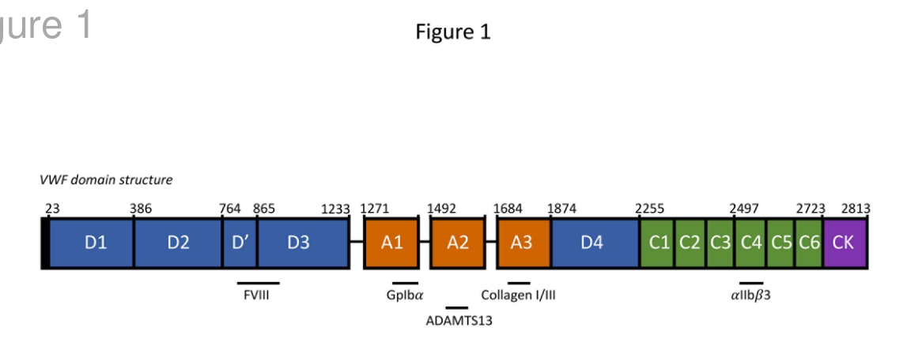

## Question

# Gene Research for Functional Annotation

## ⚠️ CRITICAL: Gene/Protein Identification Context

**BEFORE YOU BEGIN RESEARCH:** You MUST verify you are researching the CORRECT gene/protein. Gene symbols can be ambiguous, especially for less well-characterized genes from non-model organisms.

### Target Gene/Protein Identity (from UniProt):
- **UniProt Accession:** P04275
- **Protein Description:** RecName: Full=von Willebrand factor; Short=vWF; Contains: RecName: Full=von Willebrand antigen 2; AltName: Full=von Willebrand antigen II; Flags: Precursor;
- **Gene Information:** Name=VWF; Synonyms=F8VWF;
- **Organism (full):** Homo sapiens (Human).
- **Protein Family:** Not specified in UniProt
- **Key Domains:** Cys_knot_C. (IPR006207); Mucin_vWF_Thrombospondin_sf. (IPR050780); Ser_inhib-like_sf. (IPR036084); TIL_dom. (IPR002919); TIL_OTOGL_Mucin. (IPR058753)

### MANDATORY VERIFICATION STEPS:

1. **Check if the gene symbol "VWF" matches the protein description above**
2. **Verify the organism is correct:** Homo sapiens (Human).
3. **Check if protein family/domains align with what you find in literature**
4. **If you find literature for a DIFFERENT gene with the same or similar symbol, STOP**

### If Gene Symbol is Ambiguous or You Cannot Find Relevant Literature:

**DO NOT PROCEED WITH RESEARCH ON A DIFFERENT GENE.** Instead:
- State clearly: "The gene symbol 'VWF' is ambiguous or literature is limited for this specific protein"
- Explain what you found (e.g., "Found extensive literature on a different gene with the same symbol in a different organism")
- Describe the protein based ONLY on the UniProt information provided above
- Suggest that the protein function can be inferred from domain/family information

### Research Target:

Please provide a comprehensive research report on the gene **VWF** (gene ID: VWF, UniProt: P04275) in human.

The research report should be a detailed narrative explaining the function, biological processes, and localization of the gene product. Citations should be given for all claims.

You should prioritize authoritative reviews and primary scientific literature when conducting research. You can supplement
this with annotations you find in gene/protein databases, but these can be outdated or inaccurate.

We are specifically interested in the primary function of the gene - for enzymes, what reaction is catalyzed, and what is the substrate specificity? For transporters, what is the substrate? For structural proteins or adapters, what is the broader structural role? For signaling molecules, what is the role in the pathway.

We are interested in where in or outside the cell the gene product carries out its function.

We are also interested in the signaling or biochemical pathways in which the gene functions. We are less interested in broad pleiotropic effects, except where these elucidate the precise role.

Include evidence where possible. We are interested in both experimental evidence as well as inference from structure, evolution, or bioinformatic analysis. Precise studies should be prioritized over high-throughput, where available.

## Output

Question: You are an expert researcher providing comprehensive, well-cited information.

Provide detailed information focusing on:
1. Key concepts and definitions with current understanding
2. Recent developments and latest research (prioritize 2023-2024 sources)
3. Current applications and real-world implementations
4. Expert opinions and analysis from authoritative sources
5. Relevant statistics and data from recent studies

Format as a comprehensive research report with proper citations. Include URLs and publication dates where available.
Always prioritize recent, authoritative sources and provide specific citations for all major claims.

# Gene Research for Functional Annotation

## ⚠️ CRITICAL: Gene/Protein Identification Context

**BEFORE YOU BEGIN RESEARCH:** You MUST verify you are researching the CORRECT gene/protein. Gene symbols can be ambiguous, especially for less well-characterized genes from non-model organisms.

### Target Gene/Protein Identity (from UniProt):
- **UniProt Accession:** P04275
- **Protein Description:** RecName: Full=von Willebrand factor; Short=vWF; Contains: RecName: Full=von Willebrand antigen 2; AltName: Full=von Willebrand antigen II; Flags: Precursor;
- **Gene Information:** Name=VWF; Synonyms=F8VWF;
- **Organism (full):** Homo sapiens (Human).
- **Protein Family:** Not specified in UniProt
- **Key Domains:** Cys_knot_C. (IPR006207); Mucin_vWF_Thrombospondin_sf. (IPR050780); Ser_inhib-like_sf. (IPR036084); TIL_dom. (IPR002919); TIL_OTOGL_Mucin. (IPR058753)

### MANDATORY VERIFICATION STEPS:

1. **Check if the gene symbol "VWF" matches the protein description above**
2. **Verify the organism is correct:** Homo sapiens (Human).
3. **Check if protein family/domains align with what you find in literature**
4. **If you find literature for a DIFFERENT gene with the same or similar symbol, STOP**

### If Gene Symbol is Ambiguous or You Cannot Find Relevant Literature:

**DO NOT PROCEED WITH RESEARCH ON A DIFFERENT GENE.** Instead:
- State clearly: "The gene symbol 'VWF' is ambiguous or literature is limited for this specific protein"
- Explain what you found (e.g., "Found extensive literature on a different gene with the same symbol in a different organism")
- Describe the protein based ONLY on the UniProt information provided above
- Suggest that the protein function can be inferred from domain/family information

### Research Target:

Please provide a comprehensive research report on the gene **VWF** (gene ID: VWF, UniProt: P04275) in human.

The research report should be a detailed narrative explaining the function, biological processes, and localization of the gene product. Citations should be given for all claims.

You should prioritize authoritative reviews and primary scientific literature when conducting research. You can supplement
this with annotations you find in gene/protein databases, but these can be outdated or inaccurate.

We are specifically interested in the primary function of the gene - for enzymes, what reaction is catalyzed, and what is the substrate specificity? For transporters, what is the substrate? For structural proteins or adapters, what is the broader structural role? For signaling molecules, what is the role in the pathway.

We are interested in where in or outside the cell the gene product carries out its function.

We are also interested in the signaling or biochemical pathways in which the gene functions. We are less interested in broad pleiotropic effects, except where these elucidate the precise role.

Include evidence where possible. We are interested in both experimental evidence as well as inference from structure, evolution, or bioinformatic analysis. Precise studies should be prioritized over high-throughput, where available.

# Human VWF (UniProt P04275): functional annotation research report

## Identity and principal function

**Identity verified.** Human **VWF**, also called **F8VWF**, encodes **von Willebrand factor (vWF)**, not factor VIII itself. A structural study explicitly identifies its VWF constructs as **UniProt P04275**; their mapped D and A domains agree with the supplied precursor and domain annotations. The human gene is located on chromosome 12. The precursor includes the D1–D2 **VWF propeptide**, also known as *von Willebrand antigen II*, which is processed separately from mature VWF. (javitt2022assemblyofvon pages 1-6, randi2018vonwillebrandfactor pages 1-3, lenting2024howuniquestructural pages 5-7)

**Primary molecular role:** VWF is a secreted, multimeric **adhesive scaffold and factor VIII carrier**, not an enzyme. At a damaged vessel wall, it links exposed subendothelial matrix to circulating platelets, particularly when blood flow makes direct platelet capture difficult. In plasma, it binds and protects coagulation factor VIII (FVIII). These activities connect **primary hemostasis**—platelet recruitment—to **secondary hemostasis**—maintenance and delivery of the FVIII cofactor required for effective coagulation. Its trypsin-inhibitor-like (*TIL*) and cystine-knot annotations describe structural modules and do not establish catalytic or protease-inhibitory activity. (lenting2024howuniquestructural pages 1-5, lenting2024howuniquestructural pages 5-7, seidizadeh2024vonwillebranddisease pages 3-5)

The following domain map summarizes the experimentally supported division of labor; the corresponding domain-and-ligand schematic in the 2024 structural review was also inspected directly. (lenting2024howuniquestructural pages 5-7, lenting2024howuniquestructural media d7743cf0)

| Structural module | Status or location | Mechanistic role in human VWF P04275 |
|---|---|---|
| **D1–D2** | Propeptide, also called von Willebrand antigen II; removed before secretion of mature VWF | Supports intracellular assembly and multimerization; it is **not** the FVIII-binding region. A1 also contributes structurally to correctly configured VWF storage tubules. (javitt2022assemblyofvon pages 1-6, lenting2024howuniquestructural pages 5-7) |
| **D′D3** | N-terminus of secreted mature VWF | Forms intermolecular disulfide bonds during N-terminal multimerization. It binds FVIII with high affinity and protects FVIII from rapid clearance and proteolysis. Its VWD, C8, TIL and E modules are structural folds; TIL annotation alone does not establish protease-inhibitor activity. (lenting2024howuniquestructural pages 5-7, seidizadeh2024vonwillebranddisease pages 3-5) |
| **A1** | Mature VWF | Binds platelet GPIbα. Flanking sequences form an autoinhibitory module that hydrodynamic force opens, enabling shear-controlled platelet capture. A1 can also contribute to collagen binding, whereas A3 is the principal site emphasized for collagens I and III. (lenting2024howuniquestructural pages 7-9, seidizadeh2024vonwillebranddisease pages 3-5) |
| **A2** | Force-sensitive regulatory domain in mature VWF | Mechanical unfolding exposes the **Tyr1605–Met1606** bond for cleavage by ADAMTS13, limiting multimer size and thrombogenicity. VWF is **not an enzyme**, and A2 does not catalyse this reaction. (lenting2024howuniquestructural pages 7-9) |
| **A3** | Mature VWF | Principal binding domain for fibrillar collagens **I and III**, anchoring VWF at exposed subendothelium. (lenting2024howuniquestructural pages 9-11, seidizadeh2024vonwillebranddisease pages 3-5) |
| **D4** | D assembly in mature VWF | Contains VWD, C8, TIL and E structural modules and contributes to the multidomain scaffold; no specific ligand is assigned here without direct evidence. TIL annotation alone does not establish serine-protease inhibition. (lenting2024howuniquestructural pages 5-7) |
| **C4** | One of six C domains in mature VWF | Presents an exposed **RGD** motif that binds platelet integrin αIIbβ3, helping stabilize platelet–platelet interactions and the developing thrombus. (lenting2024howuniquestructural pages 9-11, seidizadeh2024vonwillebranddisease pages 3-5) |
| **CK** | C-terminal cystine-knot domain of mature VWF | Mediates C-terminal disulfide-linked dimerization, the first stage of multimer assembly. Cystine knot denotes a structural fold, not catalytic activity. (lenting2024howuniquestructural pages 5-7, seidizadeh2024vonwillebranddisease pages 3-5) |

*Table: Domain-to-function map for human VWF P04275, distinguishing the cleaved D1–D2 propeptide from mature secreted VWF and avoiding enzymatic over-interpretation of structural folds. Primary structural review: [Lenting et al., Blood, published November 2024](https://doi.org/10.1182/blood.2023023277).*

## Biosynthesis, localization and site of action

VWF expression is principally restricted to **vascular endothelial cells and megakaryocytes**. Endothelial cells supply nearly all circulating plasma VWF; megakaryocyte-derived VWF is stored in **platelet α-granules**. The approximately **2,813-residue precursor** enters the endoplasmic reticulum, forms C-terminal disulfide-linked dimers, and acquires N-terminal disulfide links during Golgi multimerization. The D1–D2 propeptide is cleaved during processing. Mature multimers are secreted constitutively or packaged into endothelial **Weibel–Palade bodies (WPBs)** for regulated release; platelets release their stored VWF on activation. Its main **functional extracellular locations** are circulating plasma, the injured subendothelial matrix, and platelet-binding VWF attached to an activated endothelial surface. WPB tubules and platelet granules are storage/assembly compartments, rather than the principal sites of its platelet-adhesive action. (karampini2024oglycandeterminantsregulate pages 1-2, seidizadeh2024vonwillebranddisease pages 3-5, randi2018vonwillebrandfactor pages 1-3, bradburyjost2025exploringalternatebinding pages 11-17)

Multimer size is consequential: the largest multimers are particularly effective at platelet recruitment. WPB release can generate endothelial-surface **ultralarge VWF strings** that capture platelets under flow; circulating multimers also attach to exposed collagen after vascular injury. VWF itself helps construct its storage organelle: VWF depletion abolishes normal WPBs in endothelial-cell models, and a reconstitution/cryo-electron microscopy study showed that **A1 insertion between helical turns** helps produce tubules with the geometry observed in WPBs. A1 therefore contributes to intracellular assembly as well as its better-known extracellular platelet-binding function. (randi2018vonwillebrandfactor pages 1-3, javitt2022assemblyofvon pages 1-6, seidizadeh2024vonwillebranddisease pages 3-5)

## Molecular mechanism and pathways

**Platelet capture and plug formation.** At vascular injury, VWF binds subendothelial **collagens I and III primarily through A3**; A1 contributes to binding some collagen contexts. Flow-dependent conformational changes allow **A1 to engage platelet glycoprotein Ibα (GPIbα)** within the GPIb–IX–V receptor complex. This transient tethering slows platelets sufficiently for collagen receptors and platelet activation pathways to act. Activated platelet integrin **αIIbβ3** can then bind the exposed **RGD motif in VWF C4**, contributing to stable platelet adhesion and platelet–platelet interactions. VWF is thus an extracellular ligand and mechanical regulator of receptor engagement, **not** an intracellular platelet signaling enzyme. (lenting2024howuniquestructural pages 9-11, lenting2024howuniquestructural pages 7-9, seidizadeh2024vonwillebranddisease pages 3-5)

**FVIII carriage and coagulation.** Mature VWF’s **D′D3** region binds FVIII and protects it from premature clearance and proteolysis; VWF deficiency consequently lowers circulating FVIII. The 2024 structural synthesis reports an approximately **0.5 nM dissociation constant** and estimates that **more than 95% of circulating FVIII** is VWF-bound. Structural studies resolve contacts involving D′ TIL and other D3 substructures; expression of a D′D3-containing fragment restored FVIII levels in VWF-deficient mice. FVIII is the transported cofactor, **not** a product synthesized by VWF or a substrate that VWF catalytically converts. (lenting2024howuniquestructural pages 5-7)

**Mechanical control and proteolysis.** VWF’s A1-flanking peptides form an autoinhibitory module that limits inappropriate GPIbα binding until sufficient hydrodynamic force exposes the interaction surface. Separately, mechanical unfolding of **A2** makes the **Tyr1605–Met1606 peptide bond** accessible to the metalloprotease **ADAMTS13**. ADAMTS13—not VWF—cleaves this bond, reducing multimer size and limiting excessive platelet adhesion. A2’s distinctive calcium-binding site and disulfide arrangement modulate its unfolding. Larger multimers are especially susceptible to flow-dependent unfolding and cleavage, providing feedback between hemostatic potency and thrombotic restraint. Shear is not a universal prerequisite for VWF binding: FVIII, collagen and αIIbβ3 interactions can occur under static experimental conditions. (lenting2024howuniquestructural pages 7-9, lenting2024howuniquestructural pages 11-15)

**Endothelial vascular biology, secondary to the core annotation.** VWF also organizes WPBs and thereby influences storage or release of endothelial mediators, including **angiopoietin-2**. VWF-depleted endothelial cells and VWF-deficient animals show altered angiogenic behavior; proposed connections involve endothelial **αvβ3**, Angpt–Tie2 and **VEGF–VEGFR2** signaling. The 2024 expert review stresses that the complete causal sequence from these interactions to vascular malformations is **not established** and may vary by vascular bed. These observations broaden VWF’s endothelial role but should not displace platelet adhesion and FVIII carriage as its best-demonstrated primary functions. (crossettethambiah2024vonwillebranddisease pages 1-2, crossettethambiah2024vonwillebranddisease pages 2-4, randi2018vonwillebrandfactor pages 6-8)

## Recent experimental developments, emphasizing 2024

- **Glycosylation controls functional storage.** Karampini and colleagues studied human endothelial cells and VWF mutants. Interfering with **O-linked glycan processing**, including glycans clustered around A1, shortened WPBs, reduced VWF multimerization and stimulated secretion, and produced shorter endothelial-surface VWF strings. Removing both flanking glycan clusters caused marked pseudo-WPB abnormalities in a recombinant-cell model. Increased basal release of the WPB cargo angiopoietin-2 after glycan inhibition (**P = 0.0062**) connects VWF processing to organelle function. These cell and engineered-protein experiments establish a mechanistic role for glycans; they do not, by themselves, measure clinical bleeding risk. Published **25 June 2024**, *Blood Advances*: https://doi.org/10.1182/bloodadvances.2023012499. (karampini2024oglycandeterminantsregulate pages 1-2, karampini2024oglycandeterminantsregulate pages 6-8)
- **Genetic regulation of circulating VWF.** A 2024 *Blood* study analyzed VWF measurements from **45,289 participants** and FVIII measurements from **42,125**, combining population genetics with endothelial experiments. It identified **B3GNT2** as a newly associated VWF locus; silencing **B3GNT2, CD36 or PDIA3** reduced VWF release from cultured human endothelial cells. This links genetic associations to secretion but does not imply that those modifier genes replace VWF as the adhesive effector. Published **May 2024**: https://doi.org/10.1182/blood.2023021452. (vries2024ageneticassociation pages 5-11, vries2024ageneticassociation pages 11-14)
- **Structural resolution of ligand selectivity.** The 2024 *Blood* structural review integrates ligand-complex studies showing how D′D3 accommodates FVIII, the A1 autoinhibitory module regulates GPIbα capture, A2 presents an ADAMTS13-sensitive bond only after unfolding, A3 recognizes fibrillar collagen, and C4 exposes an integrin-binding RGD motif. These are distinct regulated interactions within one protein, rather than evidence for a single nonspecific adhesion surface. Published **November 2024**: https://doi.org/10.1182/blood.2023023277. (lenting2024howuniquestructural pages 5-7, lenting2024howuniquestructural pages 7-9, lenting2024howuniquestructural pages 9-11, lenting2024howuniquestructural media d7743cf0)

## Human disease and real-world applications

The clearest functional validation is **von Willebrand disease (VWD)**: reduced VWF abundance or impaired ligand binding causes bleeding. Type **1** is partial quantitative deficiency; type **3** is near absence of VWF, with markedly reduced FVIII. Among qualitative type 2 disorders, **2A** loses effective large multimers, **2B** increases GPIbα binding, **2M** impairs platelet or collagen binding despite relatively preserved multimers, and **2N** impairs FVIII binding. These phenotypes separate VWF’s matrix/platelet, multimer-regulatory and FVIII-carrier functions in human patients. A 2024 authoritative primer estimated **symptomatic VWD at at least 1 in 1,000 people**, while noting that broader screening estimates are higher and strongly dependent on case definitions. Published **July 2024**, *Nature Reviews Disease Primers*: https://doi.org/10.1038/s41572-024-00536-8. (seidizadeh2024vonwillebranddisease pages 6-8, seidizadeh2024vonwillebranddisease pages 5-6, seidizadeh2024vonwillebranddisease pages 1-2)

**Diagnosis measures function as well as abundance.** Initial testing includes **VWF antigen**, a **platelet-dependent VWF activity** assay and **FVIII coagulant activity**; activity-to-antigen ratios, collagen binding, multimer patterns, ristocetin-induced platelet agglutination and specific FVIII-binding assays help resolve distinct defects. Thus a normal or near-normal amount of immunoreactive VWF does not necessarily mean normal platelet-binding or FVIII-carrier function. (seidizadeh2024vonwillebranddisease pages 11-12)

**Treatment exploits the molecule’s two core roles.** Expert society guidelines recommend assessing **desmopressin responsiveness** when appropriate, especially in type 1 disease; desmopressin releases endogenous VWF but cannot replace absent protein in type 3 disease and is generally inappropriate in type 2B. **Plasma-derived or recombinant VWF concentrates** replace defective VWF when necessary, sometimes with FVIII; **tranexamic acid** supports mucosal or procedural hemostasis. For major surgery, the 2021 ASH/ISTH/NHF/WFH guideline suggests maintaining **both VWF and FVIII activity at least 0.50 IU/mL for at least three days**, tailored to the procedure. Long-term concentrate prophylaxis is conditionally recommended for severe, frequent bleeding, with acknowledgment that supporting evidence has limitations. Guideline published **January 2021**: https://doi.org/10.1182/bloodadvances.2020003264. (connell2021ashisthnhf pages 2-3, connell2021ashisthnhf pages 3-4, connell2021ashisthnhf pages 1-2)

In a **2024 post-hoc, non-randomized analysis** of **33** patients with severe VWD, VWF-containing concentrate prophylaxis was associated with a fall in mean annualized nosebleeds from **11.0 to 2.7** (**76%**) compared with their earlier on-demand treatment period; spontaneous annualized nosebleeds fell from **10.9 to 2.1** (**81%**). This illustrates clinical utility but is not a randomized estimate of treatment effect. *Clinical and Applied Thrombosis/Hemostasis* (2024): https://doi.org/10.1177/10760296241306755. (boban2024efficacyofwilate pages 1-2, boban2024efficacyofwilate pages 3-4)

Excessive or poorly regulated VWF illustrates the opposite side of the pathway. **Severe ADAMTS13 deficiency** leaves ultralarge, platelet-binding VWF insufficiently cleaved in **thrombotic thrombocytopenic purpura (TTP)**. **Caplacizumab** binds VWF A1 and blocks its interaction with platelet GPIbα in immune TTP; it does **not** correct the underlying anti-ADAMTS13 autoimmunity, which requires separate treatment. Conversely, high-shear cardiac devices can cause **acquired loss of large VWF multimers** and bleeding. A small 2024 observational study found reduced large multimers and platelet-binding activity during ECMO in **10 treated patients**, compared with **22** patients not receiving ECMO, despite no group difference in VWF antigen or FVIII activity; it supports the importance of testing *function and multimer size*, while not proving that VWF loss alone caused every bleed. TTP mechanism: https://doi.org/10.4084/mjhid.2024.060 (**June 2024**); ECMO study: https://doi.org/10.1186/s12959-024-00617-4 (**May 2024**). (lenting2024howuniquestructural pages 7-9, chiba2024impactofextracorporeal pages 1-2, li2025newadjuvanttreatment pages 2-3)

**Overall annotation:** Human VWF/P04275 is an endothelial- and megakaryocyte-produced **extracellular, shear-regulated multimeric adhesion protein** that captures platelets at vascular injury and **carries/stabilizes plasma FVIII**. Its precursor also has a distinct **intracellular WPB-assembly role**. Domain-resolved structural studies, human bleeding disorders and targeted therapies provide convergent evidence for these functions; proposed angiogenic signaling mechanisms remain less definitively resolved. (javitt2022assemblyofvon pages 1-6, lenting2024howuniquestructural pages 5-7, seidizadeh2024vonwillebranddisease pages 3-5, crossettethambiah2024vonwillebranddisease pages 2-4)

References

1. (javitt2022assemblyofvon pages 1-6): G. Javitt, Noa Yeshaya, L. Khmelnitsky, and D. Fass. Assembly of von willebrand factor tubules with in vivo helical parameters requires a1 domain insertion. Blood, 140:2835-2843, Jul 2022. URL: https://doi.org/10.1101/2022.07.05.498862, doi:10.1101/2022.07.05.498862. This article has 10 citations and is from a highest quality peer-reviewed journal.

2. (randi2018vonwillebrandfactor pages 1-3): Anna M. Randi, Koval E. Smith, and Giancarlo Castaman. Von willebrand factor regulation of blood vessel formation. Blood, 132 2:132-140, Jul 2018. URL: https://doi.org/10.1182/blood-2018-01-769018, doi:10.1182/blood-2018-01-769018. This article has 273 citations and is from a highest quality peer-reviewed journal.

3. (lenting2024howuniquestructural pages 5-7): Peter J. Lenting, Cécile V. Denis, and Olivier D. Christophe. How unique structural adaptations support and coordinate the complex function of von willebrand factor. Blood, 144:2174-2184, Nov 2024. URL: https://doi.org/10.1182/blood.2023023277, doi:10.1182/blood.2023023277. This article has 25 citations and is from a highest quality peer-reviewed journal.

4. (lenting2024howuniquestructural pages 1-5): Peter J. Lenting, Cécile V. Denis, and Olivier D. Christophe. How unique structural adaptations support and coordinate the complex function of von willebrand factor. Blood, 144:2174-2184, Nov 2024. URL: https://doi.org/10.1182/blood.2023023277, doi:10.1182/blood.2023023277. This article has 25 citations and is from a highest quality peer-reviewed journal.

5. (seidizadeh2024vonwillebranddisease pages 3-5): Omid Seidizadeh, Jeroen C. J. Eikenboom, Cécile V. Denis, Veronica H. Flood, Paula James, Peter J. Lenting, Luciano Baronciani, James S. O’Donnell, David Lillicrap, and Flora Peyvandi. Von willebrand disease. Nature Reviews Disease Primers, 10:1-18, Jul 2024. URL: https://doi.org/10.1038/s41572-024-00536-8, doi:10.1038/s41572-024-00536-8. This article has 97 citations.

6. (lenting2024howuniquestructural media d7743cf0): Peter J. Lenting, Cécile V. Denis, and Olivier D. Christophe. How unique structural adaptations support and coordinate the complex function of von willebrand factor. Blood, 144:2174-2184, Nov 2024. URL: https://doi.org/10.1182/blood.2023023277, doi:10.1182/blood.2023023277. This article has 25 citations and is from a highest quality peer-reviewed journal.

7. (lenting2024howuniquestructural pages 7-9): Peter J. Lenting, Cécile V. Denis, and Olivier D. Christophe. How unique structural adaptations support and coordinate the complex function of von willebrand factor. Blood, 144:2174-2184, Nov 2024. URL: https://doi.org/10.1182/blood.2023023277, doi:10.1182/blood.2023023277. This article has 25 citations and is from a highest quality peer-reviewed journal.

8. (lenting2024howuniquestructural pages 9-11): Peter J. Lenting, Cécile V. Denis, and Olivier D. Christophe. How unique structural adaptations support and coordinate the complex function of von willebrand factor. Blood, 144:2174-2184, Nov 2024. URL: https://doi.org/10.1182/blood.2023023277, doi:10.1182/blood.2023023277. This article has 25 citations and is from a highest quality peer-reviewed journal.

9. (karampini2024oglycandeterminantsregulate pages 1-2): Ellie Karampini, Dearbhla Doherty, Petra E. Bürgisser, Massimiliano Garre, Ingmar Schoen, Stephanie Elliott, Ruben Bierings, and James S. O’Donnell. O-glycan determinants regulate vwf trafficking to weibel-palade bodies. Jun 2024. URL: https://doi.org/10.1182/bloodadvances.2023012499, doi:10.1182/bloodadvances.2023012499. This article has 9 citations and is from a peer-reviewed journal.

10. (bradburyjost2025exploringalternatebinding pages 11-17): Calvin Sebastien Bradbury-Jost. Exploring alternate binding mechanisms between VWF and mutant GPIbα in platelet-type von Willebrand disease. PhD thesis, Carleton University, 2025. URL: https://doi.org/10.22215/etd/2025-16771, doi:10.22215/etd/2025-16771.

11. (lenting2024howuniquestructural pages 11-15): Peter J. Lenting, Cécile V. Denis, and Olivier D. Christophe. How unique structural adaptations support and coordinate the complex function of von willebrand factor. Blood, 144:2174-2184, Nov 2024. URL: https://doi.org/10.1182/blood.2023023277, doi:10.1182/blood.2023023277. This article has 25 citations and is from a highest quality peer-reviewed journal.

12. (crossettethambiah2024vonwillebranddisease pages 1-2): Christina Crossette-Thambiah, Anna M. Randi, and Michael Laffan. Von willebrand disease and angiodysplasia: a wider view of pathogenesis in pursuit of therapy. Haematologica, 110:588-595, Nov 2024. URL: https://doi.org/10.3324/haematol.2024.285244, doi:10.3324/haematol.2024.285244. This article has 12 citations.

13. (crossettethambiah2024vonwillebranddisease pages 2-4): Christina Crossette-Thambiah, Anna M. Randi, and Michael Laffan. Von willebrand disease and angiodysplasia: a wider view of pathogenesis in pursuit of therapy. Haematologica, 110:588-595, Nov 2024. URL: https://doi.org/10.3324/haematol.2024.285244, doi:10.3324/haematol.2024.285244. This article has 12 citations.

14. (randi2018vonwillebrandfactor pages 6-8): Anna M. Randi, Koval E. Smith, and Giancarlo Castaman. Von willebrand factor regulation of blood vessel formation. Blood, 132 2:132-140, Jul 2018. URL: https://doi.org/10.1182/blood-2018-01-769018, doi:10.1182/blood-2018-01-769018. This article has 273 citations and is from a highest quality peer-reviewed journal.

15. (karampini2024oglycandeterminantsregulate pages 6-8): Ellie Karampini, Dearbhla Doherty, Petra E. Bürgisser, Massimiliano Garre, Ingmar Schoen, Stephanie Elliott, Ruben Bierings, and James S. O’Donnell. O-glycan determinants regulate vwf trafficking to weibel-palade bodies. Jun 2024. URL: https://doi.org/10.1182/bloodadvances.2023012499, doi:10.1182/bloodadvances.2023012499. This article has 9 citations and is from a peer-reviewed journal.

16. (vries2024ageneticassociation pages 5-11): Paul S. de Vries, Paula Reventun, Michael R. Brown, Adam S. Heath, Jennifer E. Huffman, Ngoc-Quynh Le, Allison Bebo, Jennifer A. Brody, Gerard Temprano-Sagrera, Laura M. Raffield, Ayse Bilge Ozel, Florian Thibord, Deepti Jain, Joshua P. Lewis, Benjamin A. T. Rodriguez, Nathan Pankratz, Kent D. Taylor, Ozren Polasek, Ming-Huei Chen, Lisa R. Yanek, German D. Carrasquilla, Riccardo E. Marioni, Marcus E. Kleber, David-Alexandre Trégouët, Jie Yao, Ruifang Li-Gao, Peter K. Joshi, Stella Trompet, Angel Martinez-Perez, Mohsen Ghanbari, Tom E. Howard, Alex P. Reiner, Marios Arvanitis, Kathleen A. Ryan, Traci M. Bartz, Igor Rudan, Nauder Faraday, Allan Linneberg, Lynette Ekunwe, Gail Davies, Graciela E. Delgado, Pierre Suchon, Xiuqing Guo, Frits R. Rosendaal, Lucija Klaric, Raymond Noordam, Frank van Rooij, Joanne E. Curran, Marsha M. Wheeler, William O. Osburn, Jeffrey R. O'Connell, Eric Boerwinkle, Andrew Beswick, Bruce M. Psaty, Ivana Kolcic, Juan Carlos Souto, Lewis C. Becker, Torben Hansen, Margaret F. Doyle, Sarah E. Harris, Angela P. Moissl, Jean-François Deleuze, Stephen S. Rich, Astrid van Hylckama Vlieg, Harry Campbell, David J. Stott, Jose Manuel Soria, Moniek P. M. de Maat, Laura Almasy, Lawrence C. Brody, Paul L. Auer, Braxton D. Mitchell, Yoav Ben-Shlomo, Myriam Fornage, Caroline Hayward, Rasika A. Mathias, Tuomas O. Kilpeläinen, Leslie A. Lange, Simon R. Cox, Winfried März, Pierre-Emmanuel Morange, Jerome I. Rotter, Dennis O. Mook-Kanamori, James F. Wilson, Pim van der Harst, J. Wouter Jukema, M. Arfan Ikram, John Blangero, Charles Kooperberg, Karl C. Desch, Andrew D. Johnson, Maria Sabater-Lleal, Charles J. Lowenstein, Nicholas L. Smith, and Alanna C. Morrison. A genetic association study of circulating coagulation factor viii and von willebrand factor levels. Blood, 143:1845-1855, May 2024. URL: https://doi.org/10.1182/blood.2023021452, doi:10.1182/blood.2023021452. This article has 34 citations and is from a highest quality peer-reviewed journal.

17. (vries2024ageneticassociation pages 11-14): Paul S. de Vries, Paula Reventun, Michael R. Brown, Adam S. Heath, Jennifer E. Huffman, Ngoc-Quynh Le, Allison Bebo, Jennifer A. Brody, Gerard Temprano-Sagrera, Laura M. Raffield, Ayse Bilge Ozel, Florian Thibord, Deepti Jain, Joshua P. Lewis, Benjamin A. T. Rodriguez, Nathan Pankratz, Kent D. Taylor, Ozren Polasek, Ming-Huei Chen, Lisa R. Yanek, German D. Carrasquilla, Riccardo E. Marioni, Marcus E. Kleber, David-Alexandre Trégouët, Jie Yao, Ruifang Li-Gao, Peter K. Joshi, Stella Trompet, Angel Martinez-Perez, Mohsen Ghanbari, Tom E. Howard, Alex P. Reiner, Marios Arvanitis, Kathleen A. Ryan, Traci M. Bartz, Igor Rudan, Nauder Faraday, Allan Linneberg, Lynette Ekunwe, Gail Davies, Graciela E. Delgado, Pierre Suchon, Xiuqing Guo, Frits R. Rosendaal, Lucija Klaric, Raymond Noordam, Frank van Rooij, Joanne E. Curran, Marsha M. Wheeler, William O. Osburn, Jeffrey R. O'Connell, Eric Boerwinkle, Andrew Beswick, Bruce M. Psaty, Ivana Kolcic, Juan Carlos Souto, Lewis C. Becker, Torben Hansen, Margaret F. Doyle, Sarah E. Harris, Angela P. Moissl, Jean-François Deleuze, Stephen S. Rich, Astrid van Hylckama Vlieg, Harry Campbell, David J. Stott, Jose Manuel Soria, Moniek P. M. de Maat, Laura Almasy, Lawrence C. Brody, Paul L. Auer, Braxton D. Mitchell, Yoav Ben-Shlomo, Myriam Fornage, Caroline Hayward, Rasika A. Mathias, Tuomas O. Kilpeläinen, Leslie A. Lange, Simon R. Cox, Winfried März, Pierre-Emmanuel Morange, Jerome I. Rotter, Dennis O. Mook-Kanamori, James F. Wilson, Pim van der Harst, J. Wouter Jukema, M. Arfan Ikram, John Blangero, Charles Kooperberg, Karl C. Desch, Andrew D. Johnson, Maria Sabater-Lleal, Charles J. Lowenstein, Nicholas L. Smith, and Alanna C. Morrison. A genetic association study of circulating coagulation factor viii and von willebrand factor levels. Blood, 143:1845-1855, May 2024. URL: https://doi.org/10.1182/blood.2023021452, doi:10.1182/blood.2023021452. This article has 34 citations and is from a highest quality peer-reviewed journal.

18. (seidizadeh2024vonwillebranddisease pages 6-8): Omid Seidizadeh, Jeroen C. J. Eikenboom, Cécile V. Denis, Veronica H. Flood, Paula James, Peter J. Lenting, Luciano Baronciani, James S. O’Donnell, David Lillicrap, and Flora Peyvandi. Von willebrand disease. Nature Reviews Disease Primers, 10:1-18, Jul 2024. URL: https://doi.org/10.1038/s41572-024-00536-8, doi:10.1038/s41572-024-00536-8. This article has 97 citations.

19. (seidizadeh2024vonwillebranddisease pages 5-6): Omid Seidizadeh, Jeroen C. J. Eikenboom, Cécile V. Denis, Veronica H. Flood, Paula James, Peter J. Lenting, Luciano Baronciani, James S. O’Donnell, David Lillicrap, and Flora Peyvandi. Von willebrand disease. Nature Reviews Disease Primers, 10:1-18, Jul 2024. URL: https://doi.org/10.1038/s41572-024-00536-8, doi:10.1038/s41572-024-00536-8. This article has 97 citations.

20. (seidizadeh2024vonwillebranddisease pages 1-2): Omid Seidizadeh, Jeroen C. J. Eikenboom, Cécile V. Denis, Veronica H. Flood, Paula James, Peter J. Lenting, Luciano Baronciani, James S. O’Donnell, David Lillicrap, and Flora Peyvandi. Von willebrand disease. Nature Reviews Disease Primers, 10:1-18, Jul 2024. URL: https://doi.org/10.1038/s41572-024-00536-8, doi:10.1038/s41572-024-00536-8. This article has 97 citations.

21. (seidizadeh2024vonwillebranddisease pages 11-12): Omid Seidizadeh, Jeroen C. J. Eikenboom, Cécile V. Denis, Veronica H. Flood, Paula James, Peter J. Lenting, Luciano Baronciani, James S. O’Donnell, David Lillicrap, and Flora Peyvandi. Von willebrand disease. Nature Reviews Disease Primers, 10:1-18, Jul 2024. URL: https://doi.org/10.1038/s41572-024-00536-8, doi:10.1038/s41572-024-00536-8. This article has 97 citations.

22. (connell2021ashisthnhf pages 2-3): Nathan T. Connell, Veronica H. Flood, Romina Brignardello-Petersen, Rezan Abdul-Kadir, Alice Arapshian, Susie Couper, Jean M. Grow, Peter Kouides, Michael Laffan, Michelle Lavin, Frank W. G. Leebeek, Sarah H. O’Brien, Margareth C. Ozelo, Alberto Tosetto, Angela C. Weyand, Paula D. James, Mohamad A. Kalot, Nedaa Husainat, and Reem A. Mustafa. Ash isth nhf wfh 2021 guidelines on the management of von willebrand disease. Blood advances, 5 1:301-325, Jan 2021. URL: https://doi.org/10.1182/bloodadvances.2020003264, doi:10.1182/bloodadvances.2020003264. This article has 490 citations and is from a peer-reviewed journal.

23. (connell2021ashisthnhf pages 3-4): Nathan T. Connell, Veronica H. Flood, Romina Brignardello-Petersen, Rezan Abdul-Kadir, Alice Arapshian, Susie Couper, Jean M. Grow, Peter Kouides, Michael Laffan, Michelle Lavin, Frank W. G. Leebeek, Sarah H. O’Brien, Margareth C. Ozelo, Alberto Tosetto, Angela C. Weyand, Paula D. James, Mohamad A. Kalot, Nedaa Husainat, and Reem A. Mustafa. Ash isth nhf wfh 2021 guidelines on the management of von willebrand disease. Blood advances, 5 1:301-325, Jan 2021. URL: https://doi.org/10.1182/bloodadvances.2020003264, doi:10.1182/bloodadvances.2020003264. This article has 490 citations and is from a peer-reviewed journal.

24. (connell2021ashisthnhf pages 1-2): Nathan T. Connell, Veronica H. Flood, Romina Brignardello-Petersen, Rezan Abdul-Kadir, Alice Arapshian, Susie Couper, Jean M. Grow, Peter Kouides, Michael Laffan, Michelle Lavin, Frank W. G. Leebeek, Sarah H. O’Brien, Margareth C. Ozelo, Alberto Tosetto, Angela C. Weyand, Paula D. James, Mohamad A. Kalot, Nedaa Husainat, and Reem A. Mustafa. Ash isth nhf wfh 2021 guidelines on the management of von willebrand disease. Blood advances, 5 1:301-325, Jan 2021. URL: https://doi.org/10.1182/bloodadvances.2020003264, doi:10.1182/bloodadvances.2020003264. This article has 490 citations and is from a peer-reviewed journal.

25. (boban2024efficacyofwilate pages 1-2): Ana Boban, Leonid Dubey, Kateryna V. Vilchevska, Adlette Inati, Claudia Djambas Khayat, and Robert F. Sidonio. Efficacy of wilate prophylaxis in reducing nosebleeds in patients with severe vwd – a post-hoc analysis of the wil-31 study. Clinical and Applied Thrombosis/Hemostasis, Jan 2024. URL: https://doi.org/10.1177/10760296241306755, doi:10.1177/10760296241306755. This article has 3 citations.

26. (boban2024efficacyofwilate pages 3-4): Ana Boban, Leonid Dubey, Kateryna V. Vilchevska, Adlette Inati, Claudia Djambas Khayat, and Robert F. Sidonio. Efficacy of wilate prophylaxis in reducing nosebleeds in patients with severe vwd – a post-hoc analysis of the wil-31 study. Clinical and Applied Thrombosis/Hemostasis, Jan 2024. URL: https://doi.org/10.1177/10760296241306755, doi:10.1177/10760296241306755. This article has 3 citations.

27. (chiba2024impactofextracorporeal pages 1-2): Yuki Chiba, Kota Goto, Misako Suzuki, Hisanori Horiuchi, and Mineji Hayakawa. Impact of extracorporeal membrane oxygenation treatments on acquired von willebrand syndrome in patients with out-of-hospital cardiac arrest: a retrospective observational study. Thrombosis Journal, May 2024. URL: https://doi.org/10.1186/s12959-024-00617-4, doi:10.1186/s12959-024-00617-4. This article has 4 citations and is from a peer-reviewed journal.

28. (li2025newadjuvanttreatment pages 2-3): Luke Li and Wadie Bahou. New adjuvant treatment modalities in thrombotic thrombocytopenic purpura: a review of recent clinical trials. touchREVIEWS in Oncology &amp; Haematology, Jan 2025. URL: https://doi.org/10.17925/ohr.2025.21.2.2, doi:10.17925/ohr.2025.21.2.2. This article has 0 citations.

## Artifacts

- [Edison artifact artifact-00](VWF-deep-research-falcon_artifacts/artifact-00.md)

## Citations

1. lenting2024howuniquestructural pages 7-9
2. lenting2024howuniquestructural pages 5-7
3. seidizadeh2024vonwillebranddisease pages 11-12
4. javitt2022assemblyofvon pages 1-6
5. randi2018vonwillebrandfactor pages 1-3
6. lenting2024howuniquestructural pages 1-5
7. seidizadeh2024vonwillebranddisease pages 3-5
8. lenting2024howuniquestructural pages 9-11
9. karampini2024oglycandeterminantsregulate pages 1-2
10. bradburyjost2025exploringalternatebinding pages 11-17
11. lenting2024howuniquestructural pages 11-15
12. crossettethambiah2024vonwillebranddisease pages 1-2
13. crossettethambiah2024vonwillebranddisease pages 2-4
14. randi2018vonwillebrandfactor pages 6-8
15. karampini2024oglycandeterminantsregulate pages 6-8
16. vries2024ageneticassociation pages 5-11
17. vries2024ageneticassociation pages 11-14
18. seidizadeh2024vonwillebranddisease pages 6-8
19. seidizadeh2024vonwillebranddisease pages 5-6
20. seidizadeh2024vonwillebranddisease pages 1-2
21. connell2021ashisthnhf pages 2-3
22. connell2021ashisthnhf pages 3-4
23. connell2021ashisthnhf pages 1-2
24. boban2024efficacyofwilate pages 1-2
25. boban2024efficacyofwilate pages 3-4
26. chiba2024impactofextracorporeal pages 1-2
27. li2025newadjuvanttreatment pages 2-3
28. Lenting et al., Blood, published November 2024
29. https://doi.org/10.1182/blood.2023023277
30. https://doi.org/10.1182/bloodadvances.2023012499.
31. https://doi.org/10.1182/blood.2023021452.
32. https://doi.org/10.1182/blood.2023023277.
33. https://doi.org/10.1038/s41572-024-00536-8.
34. https://doi.org/10.1182/bloodadvances.2020003264.
35. https://doi.org/10.1177/10760296241306755.
36. https://doi.org/10.4084/mjhid.2024.060
37. https://doi.org/10.1186/s12959-024-00617-4
38. https://doi.org/10.1101/2022.07.05.498862,
39. https://doi.org/10.1182/blood-2018-01-769018,
40. https://doi.org/10.1182/blood.2023023277,
41. https://doi.org/10.1038/s41572-024-00536-8,
42. https://doi.org/10.1182/bloodadvances.2023012499,
43. https://doi.org/10.22215/etd/2025-16771,
44. https://doi.org/10.3324/haematol.2024.285244,
45. https://doi.org/10.1182/blood.2023021452,
46. https://doi.org/10.1182/bloodadvances.2020003264,
47. https://doi.org/10.1177/10760296241306755,
48. https://doi.org/10.1186/s12959-024-00617-4,
49. https://doi.org/10.17925/ohr.2025.21.2.2,