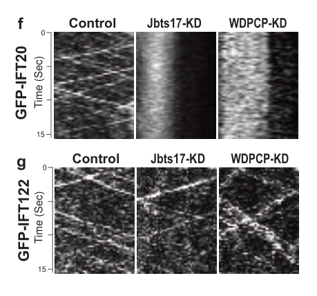

## Question

# Gene Research for Functional Annotation

## ⚠️ CRITICAL: Gene/Protein Identification Context

**BEFORE YOU BEGIN RESEARCH:** You MUST verify you are researching the CORRECT gene/protein. Gene symbols can be ambiguous, especially for less well-characterized genes from non-model organisms.

### Target Gene/Protein Identity (from UniProt):
- **UniProt Accession:** O95876
- **Protein Description:** RecName: Full=WD repeat-containing and planar cell polarity effector protein fritz homolog; Short=hFRTZ; AltName: Full=Bardet-Biedl syndrome 15 protein; AltName: Full=WD repeat-containing and planar cell polarity effector protein;
- **Gene Information:** Name=WDPCP; Synonyms=BBS15, C2orf86, FRITZ;
- **Organism (full):** Homo sapiens (Human).
- **Protein Family:** Belongs to the WD repeat fritz family. .
- **Key Domains:** Frtz. (IPR024511); WD40/YVTN_repeat-like_dom_sf. (IPR015943); WD40_repeat_dom_sf. (IPR036322); Frtz (PF11768)

### MANDATORY VERIFICATION STEPS:

1. **Check if the gene symbol "WDPCP" matches the protein description above**
2. **Verify the organism is correct:** Homo sapiens (Human).
3. **Check if protein family/domains align with what you find in literature**
4. **If you find literature for a DIFFERENT gene with the same or similar symbol, STOP**

### If Gene Symbol is Ambiguous or You Cannot Find Relevant Literature:

**DO NOT PROCEED WITH RESEARCH ON A DIFFERENT GENE.** Instead:
- State clearly: "The gene symbol 'WDPCP' is ambiguous or literature is limited for this specific protein"
- Explain what you found (e.g., "Found extensive literature on a different gene with the same symbol in a different organism")
- Describe the protein based ONLY on the UniProt information provided above
- Suggest that the protein function can be inferred from domain/family information

### Research Target:

Please provide a comprehensive research report on the gene **WDPCP** (gene ID: WDPCP, UniProt: O95876) in human.

The research report should be a detailed narrative explaining the function, biological processes, and localization of the gene product. Citations should be given for all claims.

You should prioritize authoritative reviews and primary scientific literature when conducting research. You can supplement
this with annotations you find in gene/protein databases, but these can be outdated or inaccurate.

We are specifically interested in the primary function of the gene - for enzymes, what reaction is catalyzed, and what is the substrate specificity? For transporters, what is the substrate? For structural proteins or adapters, what is the broader structural role? For signaling molecules, what is the role in the pathway.

We are interested in where in or outside the cell the gene product carries out its function.

We are also interested in the signaling or biochemical pathways in which the gene functions. We are less interested in broad pleiotropic effects, except where these elucidate the precise role.

Include evidence where possible. We are interested in both experimental evidence as well as inference from structure, evolution, or bioinformatic analysis. Precise studies should be prioritized over high-throughput, where available.

## Output

Question: You are an expert researcher providing comprehensive, well-cited information.

Provide detailed information focusing on:
1. Key concepts and definitions with current understanding
2. Recent developments and latest research (prioritize 2023-2024 sources)
3. Current applications and real-world implementations
4. Expert opinions and analysis from authoritative sources
5. Relevant statistics and data from recent studies

Format as a comprehensive research report with proper citations. Include URLs and publication dates where available.
Always prioritize recent, authoritative sources and provide specific citations for all major claims.

# Gene Research for Functional Annotation

## ⚠️ CRITICAL: Gene/Protein Identification Context

**BEFORE YOU BEGIN RESEARCH:** You MUST verify you are researching the CORRECT gene/protein. Gene symbols can be ambiguous, especially for less well-characterized genes from non-model organisms.

### Target Gene/Protein Identity (from UniProt):
- **UniProt Accession:** O95876
- **Protein Description:** RecName: Full=WD repeat-containing and planar cell polarity effector protein fritz homolog; Short=hFRTZ; AltName: Full=Bardet-Biedl syndrome 15 protein; AltName: Full=WD repeat-containing and planar cell polarity effector protein;
- **Gene Information:** Name=WDPCP; Synonyms=BBS15, C2orf86, FRITZ;
- **Organism (full):** Homo sapiens (Human).
- **Protein Family:** Belongs to the WD repeat fritz family. .
- **Key Domains:** Frtz. (IPR024511); WD40/YVTN_repeat-like_dom_sf. (IPR015943); WD40_repeat_dom_sf. (IPR036322); Frtz (PF11768)

### MANDATORY VERIFICATION STEPS:

1. **Check if the gene symbol "WDPCP" matches the protein description above**
2. **Verify the organism is correct:** Homo sapiens (Human).
3. **Check if protein family/domains align with what you find in literature**
4. **If you find literature for a DIFFERENT gene with the same or similar symbol, STOP**

### If Gene Symbol is Ambiguous or You Cannot Find Relevant Literature:

**DO NOT PROCEED WITH RESEARCH ON A DIFFERENT GENE.** Instead:
- State clearly: "The gene symbol 'WDPCP' is ambiguous or literature is limited for this specific protein"
- Explain what you found (e.g., "Found extensive literature on a different gene with the same symbol in a different organism")
- Describe the protein based ONLY on the UniProt information provided above
- Suggest that the protein function can be inferred from domain/family information

### Research Target:

Please provide a comprehensive research report on the gene **WDPCP** (gene ID: WDPCP, UniProt: O95876) in human.

The research report should be a detailed narrative explaining the function, biological processes, and localization of the gene product. Citations should be given for all claims.

You should prioritize authoritative reviews and primary scientific literature when conducting research. You can supplement
this with annotations you find in gene/protein databases, but these can be outdated or inaccurate.

We are specifically interested in the primary function of the gene - for enzymes, what reaction is catalyzed, and what is the substrate specificity? For transporters, what is the substrate? For structural proteins or adapters, what is the broader structural role? For signaling molecules, what is the role in the pathway.

We are interested in where in or outside the cell the gene product carries out its function.

We are also interested in the signaling or biochemical pathways in which the gene functions. We are less interested in broad pleiotropic effects, except where these elucidate the precise role.

Include evidence where possible. We are interested in both experimental evidence as well as inference from structure, evolution, or bioinformatic analysis. Precise studies should be prioritized over high-throughput, where available.

# WDPCP (UniProt O95876) Functional-Annotation Research Report

## Executive summary

Human **WDPCP** encodes the WD repeat-containing planar-cell-polarity effector protein, also called **Fritz/hFRTZ** and **BBS15**. The verified target is the human protein **UniProt O95876**, not an unrelated use of “WDPCP” as an acronym. Literature identifies it as the vertebrate orthologue of *Drosophila* Fritz and a core member of the **CPLANE** (“ciliogenesis and planar polarity effector”) module with INTU and FUZ. Its WD-repeat/Frtz, predicted β-propeller architecture is characteristic of a protein-interaction scaffold rather than an enzyme, transporter, receptor, or motor. No catalytic reaction or transported substrate is known. (toriyama2016theciliopathyassociatedcplane pages 13-14, adler2017fromplanarcell pages 1-3, toriyama2016theciliopathyassociatedcplane pages 1-5)

The best-supported primary function is therefore: **WDPCP organizes multiprotein and cytoskeletal assemblies required for ciliogenesis and polarized cell behavior**. At the ciliary base it helps CPLANE recruit and correctly assemble intraflagellar-transport machinery, especially IFT-A. At actin stress fibres, the cell cortex, and focal adhesions it associates with SEPT2-containing complexes and promotes orderly actin–septin organization, membrane dynamics, and directional migration. Deficiency consequently impairs cilium-dependent Sonic Hedgehog signaling and planar-polarity-associated morphogenesis, but WDPCP is not itself established as a direct Hedgehog or Wnt receptor/transducer. (cui2013wdpcpapcp pages 1-2, toriyama2016theciliopathyassociatedcplane pages 1-5, adler2017fromplanarcell pages 7-9, cui2013wdpcpapcp pages 8-10, cui2013wdpcpapcp pages 10-11)

## 1. Mandatory identity verification

- **Gene/protein match:** WDPCP is the approved human gene symbol for “WD repeat containing planar cell polarity effector”; the human transcript used in recent clinical genetics is **NM_015910.7**, located at **2p15**. Literature also uses **Wdpcp** for vertebrate orthologues and **Fritz** for the ancestral *Drosophila* protein. (OpenTargets Search: -WDPCP, adler2017fromplanarcell pages 1-3, nawaz2023biallelicvariantsin pages 8-9)
- **Organism:** The requested protein is **Homo sapiens** WDPCP/O95876. Much of the detailed mechanism comes from mouse, zebrafish, and *Xenopus* orthologues, while human evidence is strongest for recessive disease variants and experiments in HEK-293 cells. Model-organism results are identified as such below and are not presented as direct human-protein measurements. (cui2013wdpcpapcp pages 10-11, cui2013wdpcpapcp pages 2-3, toriyama2016theciliopathyassociatedcplane pages 7-13)
- **Family/domains:** The supplied UniProt annotation—WD-repeat Fritz family, Frtz/PF11768 and WD40-repeat-like domains—aligns with literature that predicts a β-propeller architecture and describes WDPCP as an interaction-rich CPLANE scaffold. Toriyama and colleagues estimated mouse Wdpcp at approximately 81.7 kDa and modeled a β-propeller-containing protein. (toriyama2016theciliopathyassociatedcplane pages 13-14, toriyama2016theciliopathyassociatedcplane pages 1-5)
- **Ambiguity check:** A 2024 search result used “WDPCP” for a computer-vision algorithm; it is unrelated and was excluded. No different biological gene with the same approved human symbol was substituted.

## 2. Molecular function and mechanism

### 2.1 Non-enzymatic CPLANE scaffold

Affinity-purification proteomics and reciprocal pulldowns place WDPCP in a core complex with **INTU** and **FUZ**. Their combined interactome contained approximately **250 proteins**, with associations extending to JBTS17/CFAP418, RSG1, nephronophthisis proteins, and IFT-A components. In-vitro co-immunoprecipitation confirmed CPLANE interactions with JBTS17, although not every proteomic association has been validated as a direct binary contact. (toriyama2016theciliopathyassociatedcplane pages 1-5)

Expert synthesis by Adler and Wallingford interprets CPLANE proteins as cytoplasmic organizers that concentrate at basal bodies, influence one another’s localization, and promote IFT-particle assembly. They emphasized that the detailed biochemical activity and cell-type-specific composition remained incompletely resolved; thus, “scaffold/assembly factor” is better supported than assigning WDPCP an enzymatic activity. (adler2017fromplanarcell pages 7-9, adler2017fromplanarcell pages 15-19)

### 2.2 Basal-body recruitment and intraflagellar transport

At the ciliary base, CPLANE associates with IFT-A proteins including **IFT43, IFT122, IFT140, TTC21B/IFT139, WDR19/IFT144, and WDR35/IFT121**. Depletion experiments in *Xenopus* multiciliated cells assessed CPLANE-protein localization at centrin-positive basal bodies and followed GFP-tagged IFT proteins. WDPCP knockdown altered IFT20 and IFT122 particle behavior in axonemal kymographs, supporting a requirement for normally assembled and trafficked IFT particles. (toriyama2016theciliopathyassociatedcplane pages 1-5, toriyama2016theciliopathyassociatedcplane pages 7-13, toriyama2016theciliopathyassociatedcplane pages 5-7, toriyama2016theciliopathyassociatedcplane media c5fd405b)

The appropriate mechanistic interpretation is that WDPCP acts **within CPLANE** to recruit or organize a selected IFT-A subset at basal bodies; evidence is stronger for the complex-level mechanism than for WDPCP independently binding every IFT component. In CPLANE-deficient cells, defective IFT-A particles can enter axonemes and IFT-B trafficking becomes severely disturbed, explaining impaired axoneme assembly and ciliary function. (toriyama2016theciliopathyassociatedcplane pages 1-5, adler2017fromplanarcell pages 7-9)

### 2.3 Transition-zone organization and ciliogenesis

Wdpcp has been localized to the ciliary base/transition-zone region and ciliary axoneme in vertebrate models. Mouse loss-of-function disrupted recruitment or maintenance of **SEPT2, NPHP1, and MKS1** at the transition zone and impaired ciliogenesis in kidney collecting ducts, neuroepithelium, and embryonic fibroblasts. Mutant fibroblast cilia were shorter. (cui2013wdpcpapcp pages 11-13, cui2013wdpcpapcp pages 1-2, cui2013wdpcpapcp pages 2-3)

The requirement is not identical in every ciliated tissue: embryonic-node cilia were reported to retain normal shape and length, and mutant tracheal cilia could remain coordinated, whereas zebrafish pronephric cilia beat weakly and uncoordinatedly. WDPCP should therefore not be annotated simply as a universal motile-cilia motor; it is an upstream assembly/organization factor with tissue-dependent consequences. (cui2013wdpcpapcp pages 15-16, cui2013wdpcpapcp pages 15-15)

### 2.4 Septin–actin coupling, focal adhesions, and cell polarity

A second major functional site is the cytoplasmic actin cortex. In mouse fibroblasts, Wdpcp colocalized with **SEPT2** on actin stress fibres and was enriched at cortical sites where actin inserts into vinculin-positive focal adhesions. In human HEK-293 cells, FLAG-Wdpcp co-immunoprecipitated both SEPT2–GFP and endogenous SEPT2, establishing membership in the same complex, though not necessarily direct binary binding. (cui2013wdpcpapcp pages 10-11, cui2013wdpcpapcp pages 8-10)

Wdpcp-deficient fibroblasts lost thick aligned stress fibres, displayed abnormal ring-like SEPT2 structures, and showed a **28% reduction in phalloidin signal** (144 mutant versus 111 control cells; *p*=0.011). Filopodia were more frequent (**46.03% versus 19.99%**) and persisted longer (**3.0 versus 1.12 hours**; both *p*<0.0001), while leading-edge fluctuation slowed from 167 to 272 seconds (*p*<0.0002). Focal adhesions became shorter (0.76 versus 1.18 μm; *p*<0.0001), rounder (58.9 versus 37.7; *p*<0.0001), and more intensely vinculin-positive. These data support a structural role in stabilizing and spatially coordinating septin–actin assemblies, not simple promotion or inhibition of bulk actin polymerization. (cui2013wdpcpapcp pages 10-11, cui2013wdpcpapcp pages 8-10)

The integrated evidence is summarized below.

| Functional layer | Precise role/localization | Strongest evidence/model | Confidence/limitation |
|---|---|---|---|
| Protein architecture and CPLANE scaffold | WDPCP is the vertebrate Fritz orthologue and a core CPLANE component with INTU and FUZ. Its predicted beta-propeller and WD-repeat architecture supports a non-enzymatic protein-interaction scaffold role. | Reciprocal affinity purification and co-immunoprecipitation identified a shared CPLANE complex; the combined INTU–FUZ–WDPCP interactome contained approximately 250 proteins. Structural modeling predicted a beta-propeller architecture (toriyama2016theciliopathyassociatedcplane pages 1-5, toriyama2016theciliopathyassociatedcplane pages 13-14, adler2017fromplanarcell pages 1-3). | **High:** Complex membership and scaffold-like architecture are well supported. No catalytic activity is known, and the detailed human structure and interaction interfaces remain experimentally unresolved. |
| Basal-body recruitment of IFT machinery | CPLANE acts at basal bodies to recruit selected IFT-A components and enable normal IFT-particle assembly and trafficking into the axoneme. | Xenopus multiciliated-cell imaging, WDPCP knockdown, IFT20 and IFT122 kymographs, proteomics, and reciprocal-localization assays implicated IFT43, IFT122, IFT140, TTC21B/IFT139, WDR19/IFT144, and WDR35/IFT121 (toriyama2016theciliopathyassociatedcplane pages 1-5, toriyama2016theciliopathyassociatedcplane pages 7-13, toriyama2016theciliopathyassociatedcplane pages 5-7, toriyama2016theciliopathyassociatedcplane media c5fd405b). | **High** for the CPLANE-level mechanism; **moderate** for assigning every recruitment step directly to WDPCP rather than collectively to CPLANE. Much of the evidence derives from Xenopus and mouse models. |
| Ciliary transition zone and ciliogenesis | WDPCP localizes at or near the ciliary base and transition zone and supports recruitment or maintenance of SEPT2, NPHP1, and MKS1. Its loss impairs ciliogenesis or reduces cilium length in several tissues and cell types. | Mouse Wdpcp-mutant embryonic fibroblasts, kidney collecting ducts, and neuroepithelium exhibited ciliary defects; transition-zone localization and disrupted SEPT2, NPHP1, and MKS1 recruitment were reported (cui2013wdpcpapcp pages 11-13, cui2013wdpcpapcp pages 1-2, cui2013wdpcpapcp pages 2-3). | **Moderate–high:** Vertebrate models consistently support this role, but effects are tissue-dependent; embryonic-node cilia and mutant tracheal ciliary motion could be relatively preserved. |
| Septin–actin organization and focal adhesions | At actin stress fibers and the cell cortex, WDPCP associates with SEPT2, promotes septin alignment with actin, stabilizes stress fibers, and organizes vinculin-positive focal adhesions and membrane protrusions. | FLAG-WDPCP co-immunoprecipitated SEPT2-GFP and endogenous SEPT2 in HEK-293 cells. In mutant mouse fibroblasts, phalloidin signal fell 28% (144 mutant versus 111 control; *p*=0.011); filopodia became more frequent and persistent, membrane ruffling slowed, and focal adhesions became shorter and rounder (cui2013wdpcpapcp pages 10-11, cui2013wdpcpapcp pages 8-10). | **High** for a SEPT2-containing complex and cytoskeletal phenotypes. Direct binary binding remains unproven, and most functional measurements derive from mouse fibroblasts. |
| PCP and noncanonical Wnt output | WDPCP couples planar-polarity information to polarized actin remodeling, directional migration, cell alignment, and tissue morphogenesis. Loss reduces noncanonical Wnt/PCP output while canonical Wnt signaling increases in specific developmental contexts. | Mutant cardiomyocytes lost polarized projections and migration into the cardiac outflow cushion. Outflow-tract tissue showed reduced Wnt5a, increased Axin2 and DVL1/2, reduced DKK1/2/3, and increased BAT-lacZ canonical-Wnt reporter activity (cui2013wdpcpapcp pages 8-10). | **Moderate–high** for a cytoskeletal PCP-effector function. Transcript and reporter changes may be downstream developmental consequences rather than evidence that WDPCP directly transduces Wnt-receptor signals. |
| Sonic Hedgehog signaling | By supporting primary-cilium assembly and transport, WDPCP indirectly enables cilium-dependent Hedgehog signaling and normal GLI processing. | Wdpcp-mutant mouse fibroblasts failed to respond normally to Smoothened agonist; altered GLI3 processing and elevated full-length GLI2 accompanied developmental abnormalities (cui2013wdpcpapcp pages 15-16). | **Moderate–high** for an upstream, cilia-dependent requirement. WDPCP is not established as a direct Hedgehog receptor, enzyme, or GLI regulator. |
| Human recessive ciliopathy genetics | Biallelic WDPCP loss-of-function variants underlie a spectrum encompassing BBS15 or Bardet–Biedl-like disease, oral-facial-digital phenotypes, and heart-defect–tongue-hamartoma–polysyndactyly presentations. | Disease evidence links human WDPCP, ENSG00000143951, to BBS15, Bardet–Biedl syndrome, Meckel syndrome, and heart-defect–tongue-hamartoma–polysyndactyly syndrome. A conserved WDPCP D54 residue was mutated in oral-facial-digital syndrome (OpenTargets Search: -WDPCP, toriyama2016theciliopathyassociatedcplane pages 7-13, toriyama2016theciliopathyassociatedcplane media a3df5cd3). | **High** for recessive ciliopathy association. Syndromic labels overlap, and genotype–phenotype correlations remain constrained by the small number of reported families. |
| Recent human evidence (2023) | A homozygous nonsense variant, NM_015910.7:c.720C>A (p.Cys240Ter), is predicted to truncate WDPCP and was associated with a Bardet–Biedl phenotype in a consanguineous family. | Two affected siblings, aged 8 and 11 years, had obesity, bilateral post-axial polydactyly, bilateral grade-II hydronephrosis, learning and speech difficulties, mild hearing impairment, and visual anomalies; the boy also had hypogonadism and micropenis. The variant was classified as likely pathogenic using PVS1 and PM2 (nawaz2023biallelicvariantsin pages 8-9, nawaz2023biallelicvariantsin pages 6-8). | **Moderate–high:** Segregation and the predicted loss-of-function effect support pathogenicity, but only one family was reported and no patient-cell functional validation was presented. |

*Table: This table integrates structural, cellular, pathway, and human-genetic evidence for human WDPCP/O95876. It distinguishes well-supported core functions from model-dependent interpretations and unresolved mechanisms.*

## 3. Cellular localization

The experimentally supported locations are:

1. **Basal bodies and ciliary transition zone:** CPLANE/IFT recruitment and transition-zone organization. (cui2013wdpcpapcp pages 1-2, toriyama2016theciliopathyassociatedcplane pages 7-13, toriyama2016theciliopathyassociatedcplane pages 5-7)
2. **Ciliary axoneme:** reported in vertebrate cells, consistent with disturbed IFT and ciliary assembly after depletion. (cui2013wdpcpapcp pages 2-3, toriyama2016theciliopathyassociatedcplane pages 7-13)
3. **Cytoplasmic actin stress fibres:** colocalization with actin and SEPT2. (cui2013wdpcpapcp pages 8-10)
4. **Cell cortex and focal adhesions:** enrichment at vinculin-positive actin insertion sites, supporting protrusion, adhesion turnover, and directional migration. (cui2013wdpcpapcp pages 10-11)

These are not competing annotations. They indicate that WDPCP connects two spatially related systems—ciliary/basal-body assembly and cortical actin–septin organization—whose relative importance depends on cell type and developmental context.

## 4. Pathways and biological processes

### Planar cell polarity and noncanonical Wnt output

WDPCP is classed as a planar-cell-polarity effector because it translates polarity information into asymmetric cytoskeletal behavior, including cell elongation, alignment, protrusion, and directional migration. In mouse cardiac outflow-tract development, mutant cardiomyocytes were rounded, lacked aligned projections, and failed to migrate normally into cushion tissue. Wdpcp loss was associated with reduced **Wnt5a** expression and increased canonical-Wnt readouts—higher **Axin2** and **DVL1/2**, lower **DKK1/2/3**, and increased BAT–lacZ reporter activity. (cui2013wdpcpapcp pages 8-10)

These observations support altered pathway balance but do not prove that WDPCP directly receives a Wnt ligand or biochemically switches β-catenin signaling. Its more precise placement is downstream or parallel to core PCP components, at the level of cytoskeletal execution. The normal cochlear kinocilia observed in one mutant context, despite PCP defects, further argues that its actin-based polarity function can be partly separable from cilium loss. (cui2013wdpcpapcp pages 1-2, adler2017fromplanarcell pages 1-3)

### Sonic Hedgehog signaling

Primary cilia organize vertebrate Hedgehog signaling. Wdpcp-mutant mouse fibroblasts failed to respond normally to Smoothened agonist, with altered GLI3 processing and increased full-length GLI2. WDPCP is consequently required upstream for competent cilium-dependent Shh signaling, but it is not a Hedgehog ligand, receptor, or GLI-processing enzyme. (cui2013wdpcpapcp pages 15-16)

### Directional migration and morphogenesis

Through cortical actin, septins, and focal adhesions, WDPCP supports wound-directed migration, Golgi reorientation, cardiomyocyte polarity, and tissue morphogenesis. Mutant fibroblasts showed randomized Golgi orientation—only 64/161 mutant cells versus 94/117 controls oriented within the 0–60° wound-facing sector—and abnormal collective migration. (cui2013wdpcpapcp pages 11-13)

## 5. Human genetics and disease relevance

Biallelic WDPCP variants are associated with an overlapping recessive ciliopathy spectrum described as **Bardet–Biedl syndrome 15/Bardet–Biedl-like disease**, Meckel-spectrum disease, oral-facial-digital phenotypes, and heart-defect–tongue-hamartoma–polysyndactyly syndrome. Open Targets aggregates multiple human genetic studies for these associations, with the strongest listed association among the retrieved results being general Bardet–Biedl syndrome (score 0.779), followed by BBS15 (0.721) and heart-defect–tongue-hamartoma–polysyndactyly syndrome (approximately 0.665–0.701). These scores rank aggregated evidence; they are not penetrance or risk estimates. (OpenTargets Search: -WDPCP)

Evolutionary evidence supports pathogenic interpretation: an OFD-associated alteration at **WDPCP D54** affects a residue invariant from human through fish. Structural modeling places WDPCP in a conserved β-propeller framework, making disruption of conserved residues or early truncation mechanistically plausible. (toriyama2016theciliopathyassociatedcplane pages 7-13, toriyama2016theciliopathyassociatedcplane pages 13-14, toriyama2016theciliopathyassociatedcplane media a3df5cd3)

### Recent peer-reviewed evidence: 2023 BBS family

Nawaz et al., published **May 2023** in *Genes*, identified homozygous **NM_015910.7:c.720C>A, p.Cys240Ter** in a consanguineous Pakistani family. The nonsense variant was classified **likely pathogenic** under ACMG/AMP criteria PVS1 and PM2; MutationTaster predicted disease causation with probability 0.9963. It is expected to truncate the protein well before the full β-propeller/scaffold architecture is completed, although patient-cell functional validation was not reported. DOI/URL: https://doi.org/10.3390/genes14051113. (nawaz2023biallelicvariantsin pages 8-9)

The two homozygous siblings—an 8-year-old girl and an 11-year-old boy—had obesity, bilateral post-axial polydactyly, bilateral grade-II hydronephrosis, mild learning disability, speech difficulty, mild hearing impairment, and visual anomalies; the boy additionally had hypogonadism and micropenis. This is a useful recent genotype–phenotype extension, but it remains one family and cannot establish robust variant-specific penetrance. (nawaz2023biallelicvariantsin pages 6-8)

## 6. 2023–2024 developments and evidence gaps

The strongest recent WDPCP-specific advance retrieved for 2023–2024 was the 2023 p.Cys240Ter family, which expands the allelic spectrum and reinforces loss of function as a BBS mechanism. A 2023 ciliopathy database review reported that ciliopathies now span more than 30 disorders and catalogued 55 likely cilia-related disorders with over 4,000 clinical manifestations, illustrating why WDPCP phenotypes cross historical syndrome boundaries; these are field-wide figures, not WDPCP prevalence statistics. DOI/URL: https://doi.org/10.1093/database/baad047.

A separate **April 2023 Research Square preprint**, not established here as peer-reviewed, proposed a role for WDPCP in alcohol-related lipid accumulation and liver disease. Its Airwave resource contained 53,116 participants, with 1,970 having paired genetic/metabolomic data; WDPCP knockdown in flies accelerated ethanol sedation and reduced ethanol-associated triacylglycerol, while public human datasets linked expression to fibrosis/cirrhosis. However, the strongest stated lipid effect—TG 60:2, β=1.24, 95% CI 0.52–1.95, *p*=0.002—was an alcohol effect rather than a WDPCP-specific causal estimate. The result is hypothesis-generating and does not supersede the established CPLANE/cytoskeletal function. DOI/URL: https://doi.org/10.21203/rs.3.rs-2823633/v1. (pazoki2023evidenceforinvolvement pages 1-3, pazoki2023evidenceforinvolvement pages 4-5)

No substantive 2024 WDPCP-specific mechanistic study was identified in the retrieved literature. Thus, the current functional model still rests primarily on the high-quality 2013 cytoskeletal and 2016 CPLANE studies, strengthened by newer human genetic observations rather than by a newly defined biochemical activity.

## 7. Current applications and real-world implementation

1. **Molecular diagnosis:** WDPCP belongs on ciliopathy, BBS, oral-facial-digital, polydactyly–renal anomaly, and congenital heart/oral hamartoma sequencing panels. Exome or genome sequencing is particularly appropriate because phenotype labels overlap and recessive truncating variants may not be detected by chromosomal microarray; in the 2023 family, SNP microarray was unrevealing before exome sequencing identified p.Cys240Ter. (nawaz2023biallelicvariantsin pages 6-8, nawaz2023biallelicvariantsin pages 8-9)
2. **Variant interpretation:** Loss-of-function mechanism, segregation in recessive families, conservation, predicted β-propeller disruption, and compatibility with ciliopathy features provide the main evidence framework. Conserved-residue evidence such as D54 supports missense interpretation, but functional assays remain important because phenotype and severity vary. (toriyama2016theciliopathyassociatedcplane pages 7-13, nawaz2023biallelicvariantsin pages 8-9, toriyama2016theciliopathyassociatedcplane media a3df5cd3)
3. **Clinical surveillance:** A confirmed biallelic WDPCP diagnosis supports evaluation of retinal/visual function, renal structure and function, obesity/metabolic status, hearing, neurodevelopment, genital development, limb anomalies, and congenital heart/oral abnormalities. This is syndrome-informed management rather than a WDPCP-targeted therapy. (OpenTargets Search: -WDPCP, nawaz2023biallelicvariantsin pages 6-8)
4. **Research assays:** Patient-derived fibroblasts or engineered epithelial cells can be assessed for cilium number/length, basal-body IFT-A recruitment, Hedgehog responsiveness, SEPT2–actin organization, focal-adhesion morphology, and migration. These readouts closely reflect established mechanism and are preferable to nonspecific high-throughput phenotypes. (cui2013wdpcpapcp pages 15-16, toriyama2016theciliopathyassociatedcplane pages 7-13, cui2013wdpcpapcp pages 8-10, cui2013wdpcpapcp pages 10-11)

No approved drug, gene therapy, or clinical trial specifically targeting WDPCP was identified. At present, implementation is diagnostic, prognostic/surveillance-oriented, and experimental rather than therapeutic.

## 8. Evidence-weighted conclusion

WDPCP/O95876 is best annotated as a **conserved, non-enzymatic WD-repeat/β-propeller assembly factor** with two tightly connected roles: formation of CPLANE-dependent ciliary transport assemblies at basal bodies/transition zones, and organization of SEPT2-associated cortical actin and focal adhesions. These activities enable ciliogenesis, ciliary Shh signaling, polarized migration, and planar tissue organization. Human biallelic loss-of-function variants cause a variable recessive ciliopathy spectrum, with a 2023 family providing recent support for p.Cys240Ter as a likely pathogenic BBS15 allele. The principal unresolved issues are the atomic structure of human WDPCP, direct interaction interfaces, the division of labor among CPLANE subunits, and determinants of tissue-specific genotype–phenotype variability. (toriyama2016theciliopathyassociatedcplane pages 1-5, adler2017fromplanarcell pages 7-9, nawaz2023biallelicvariantsin pages 8-9, cui2013wdpcpapcp pages 8-10)

References

1. (toriyama2016theciliopathyassociatedcplane pages 13-14): Michinori Toriyama, Chanjae Lee, S Paige Taylor, Ivan Duran, Daniel H Cohn, Ange-Line Bruel, Jacqueline M Tabler, Kevin Drew, Marcus R Kelly, Sukyoung Kim, Tae Joo Park, Daniela A Braun, Ghislaine Pierquin, Armand Biver, Kerstin Wagner, Anne Malfroot, Inusha Panigrahi, Brunella Franco, Hadeel Adel Al-lami, Yvonne Yeung, Yeon Ja Choi, Yannis Duffourd, Laurence Faivre, Jean-Baptiste Rivière, Jiang Chen, Karen J Liu, Edward M Marcotte, Friedhelm Hildebrandt, Christel Thauvin-Robinet, Deborah Krakow, Peter K Jackson, and John B Wallingford. The ciliopathy-associated cplane proteins direct basal body recruitment of intraflagellar transport machinery. Nature genetics, 48:648-656, May 2016. URL: https://doi.org/10.1038/ng.3558, doi:10.1038/ng.3558. This article has 189 citations and is from a highest quality peer-reviewed journal.

2. (adler2017fromplanarcell pages 1-3): Paul N. Adler and John B. Wallingford. From planar cell polarity to ciliogenesis and back: the curious tale of the ppe and cplane proteins. Trends in cell biology, 27 5:379-390, May 2017. URL: https://doi.org/10.1016/j.tcb.2016.12.001, doi:10.1016/j.tcb.2016.12.001. This article has 76 citations and is from a domain leading peer-reviewed journal.

3. (toriyama2016theciliopathyassociatedcplane pages 1-5): Michinori Toriyama, Chanjae Lee, S Paige Taylor, Ivan Duran, Daniel H Cohn, Ange-Line Bruel, Jacqueline M Tabler, Kevin Drew, Marcus R Kelly, Sukyoung Kim, Tae Joo Park, Daniela A Braun, Ghislaine Pierquin, Armand Biver, Kerstin Wagner, Anne Malfroot, Inusha Panigrahi, Brunella Franco, Hadeel Adel Al-lami, Yvonne Yeung, Yeon Ja Choi, Yannis Duffourd, Laurence Faivre, Jean-Baptiste Rivière, Jiang Chen, Karen J Liu, Edward M Marcotte, Friedhelm Hildebrandt, Christel Thauvin-Robinet, Deborah Krakow, Peter K Jackson, and John B Wallingford. The ciliopathy-associated cplane proteins direct basal body recruitment of intraflagellar transport machinery. Nature genetics, 48:648-656, May 2016. URL: https://doi.org/10.1038/ng.3558, doi:10.1038/ng.3558. This article has 189 citations and is from a highest quality peer-reviewed journal.

4. (cui2013wdpcpapcp pages 1-2): Cheng Cui, Bishwanath Chatterjee, Thomas P. Lozito, Zhen Zhang, Richard J. Francis, Hisato Yagi, Lisa M. Swanhart, Subramaniam Sanker, Deanne Francis, Qing Yu, Jovenal T. San Agustin, Chandrakala Puligilla, Tania Chatterjee, Terry Tansey, Xiaoqin Liu, Matthew W. Kelley, Elias T. Spiliotis, Adam V. Kwiatkowski, Rocky Tuan, Gregory J. Pazour, Neil A. Hukriede, and Cecilia W. Lo. Wdpcp, a pcp protein required for ciliogenesis, regulates directional cell migration and cell polarity by direct modulation of the actin cytoskeleton. Nov 2013. URL: https://doi.org/10.1371/journal.pbio.1001720, doi:10.1371/journal.pbio.1001720. This article has 138 citations and is from a highest quality peer-reviewed journal.

5. (adler2017fromplanarcell pages 7-9): Paul N. Adler and John B. Wallingford. From planar cell polarity to ciliogenesis and back: the curious tale of the ppe and cplane proteins. Trends in cell biology, 27 5:379-390, May 2017. URL: https://doi.org/10.1016/j.tcb.2016.12.001, doi:10.1016/j.tcb.2016.12.001. This article has 76 citations and is from a domain leading peer-reviewed journal.

6. (cui2013wdpcpapcp pages 8-10): Cheng Cui, Bishwanath Chatterjee, Thomas P. Lozito, Zhen Zhang, Richard J. Francis, Hisato Yagi, Lisa M. Swanhart, Subramaniam Sanker, Deanne Francis, Qing Yu, Jovenal T. San Agustin, Chandrakala Puligilla, Tania Chatterjee, Terry Tansey, Xiaoqin Liu, Matthew W. Kelley, Elias T. Spiliotis, Adam V. Kwiatkowski, Rocky Tuan, Gregory J. Pazour, Neil A. Hukriede, and Cecilia W. Lo. Wdpcp, a pcp protein required for ciliogenesis, regulates directional cell migration and cell polarity by direct modulation of the actin cytoskeleton. Nov 2013. URL: https://doi.org/10.1371/journal.pbio.1001720, doi:10.1371/journal.pbio.1001720. This article has 138 citations and is from a highest quality peer-reviewed journal.

7. (cui2013wdpcpapcp pages 10-11): Cheng Cui, Bishwanath Chatterjee, Thomas P. Lozito, Zhen Zhang, Richard J. Francis, Hisato Yagi, Lisa M. Swanhart, Subramaniam Sanker, Deanne Francis, Qing Yu, Jovenal T. San Agustin, Chandrakala Puligilla, Tania Chatterjee, Terry Tansey, Xiaoqin Liu, Matthew W. Kelley, Elias T. Spiliotis, Adam V. Kwiatkowski, Rocky Tuan, Gregory J. Pazour, Neil A. Hukriede, and Cecilia W. Lo. Wdpcp, a pcp protein required for ciliogenesis, regulates directional cell migration and cell polarity by direct modulation of the actin cytoskeleton. Nov 2013. URL: https://doi.org/10.1371/journal.pbio.1001720, doi:10.1371/journal.pbio.1001720. This article has 138 citations and is from a highest quality peer-reviewed journal.

8. (OpenTargets Search: -WDPCP): Open Targets Query (-WDPCP, 5 results). Buniello, A. et al. (2025). Open Targets Platform: facilitating therapeutic hypotheses building in drug discovery. Nucleic Acids Research.

9. (nawaz2023biallelicvariantsin pages 8-9): Hamed Nawaz, Mujahid, Sher Alam Khan, Farhana Bibi, Ahmed Waqas, Abdul Bari, Fardous, Niamatullah Khan, Nazif Muhammad, Amjad Khan, Sohail Aziz Paracha, Qamre Alam, Mohammad Azhar Kamal, Misbahuddin M. Rafeeq, Noor Muhammad, Fayaz Ul Haq, Shazia Khan, Arif Mahmood, Saadullah Khan, and Muhammad Umair. Biallelic variants in seven different genes associated with clinically suspected bardet–biedl syndrome. May 2023. URL: https://doi.org/10.3390/genes14051113, doi:10.3390/genes14051113. This article has 12 citations.

10. (cui2013wdpcpapcp pages 2-3): Cheng Cui, Bishwanath Chatterjee, Thomas P. Lozito, Zhen Zhang, Richard J. Francis, Hisato Yagi, Lisa M. Swanhart, Subramaniam Sanker, Deanne Francis, Qing Yu, Jovenal T. San Agustin, Chandrakala Puligilla, Tania Chatterjee, Terry Tansey, Xiaoqin Liu, Matthew W. Kelley, Elias T. Spiliotis, Adam V. Kwiatkowski, Rocky Tuan, Gregory J. Pazour, Neil A. Hukriede, and Cecilia W. Lo. Wdpcp, a pcp protein required for ciliogenesis, regulates directional cell migration and cell polarity by direct modulation of the actin cytoskeleton. Nov 2013. URL: https://doi.org/10.1371/journal.pbio.1001720, doi:10.1371/journal.pbio.1001720. This article has 138 citations and is from a highest quality peer-reviewed journal.

11. (toriyama2016theciliopathyassociatedcplane pages 7-13): Michinori Toriyama, Chanjae Lee, S Paige Taylor, Ivan Duran, Daniel H Cohn, Ange-Line Bruel, Jacqueline M Tabler, Kevin Drew, Marcus R Kelly, Sukyoung Kim, Tae Joo Park, Daniela A Braun, Ghislaine Pierquin, Armand Biver, Kerstin Wagner, Anne Malfroot, Inusha Panigrahi, Brunella Franco, Hadeel Adel Al-lami, Yvonne Yeung, Yeon Ja Choi, Yannis Duffourd, Laurence Faivre, Jean-Baptiste Rivière, Jiang Chen, Karen J Liu, Edward M Marcotte, Friedhelm Hildebrandt, Christel Thauvin-Robinet, Deborah Krakow, Peter K Jackson, and John B Wallingford. The ciliopathy-associated cplane proteins direct basal body recruitment of intraflagellar transport machinery. Nature genetics, 48:648-656, May 2016. URL: https://doi.org/10.1038/ng.3558, doi:10.1038/ng.3558. This article has 189 citations and is from a highest quality peer-reviewed journal.

12. (adler2017fromplanarcell pages 15-19): Paul N. Adler and John B. Wallingford. From planar cell polarity to ciliogenesis and back: the curious tale of the ppe and cplane proteins. Trends in cell biology, 27 5:379-390, May 2017. URL: https://doi.org/10.1016/j.tcb.2016.12.001, doi:10.1016/j.tcb.2016.12.001. This article has 76 citations and is from a domain leading peer-reviewed journal.

13. (toriyama2016theciliopathyassociatedcplane pages 5-7): Michinori Toriyama, Chanjae Lee, S Paige Taylor, Ivan Duran, Daniel H Cohn, Ange-Line Bruel, Jacqueline M Tabler, Kevin Drew, Marcus R Kelly, Sukyoung Kim, Tae Joo Park, Daniela A Braun, Ghislaine Pierquin, Armand Biver, Kerstin Wagner, Anne Malfroot, Inusha Panigrahi, Brunella Franco, Hadeel Adel Al-lami, Yvonne Yeung, Yeon Ja Choi, Yannis Duffourd, Laurence Faivre, Jean-Baptiste Rivière, Jiang Chen, Karen J Liu, Edward M Marcotte, Friedhelm Hildebrandt, Christel Thauvin-Robinet, Deborah Krakow, Peter K Jackson, and John B Wallingford. The ciliopathy-associated cplane proteins direct basal body recruitment of intraflagellar transport machinery. Nature genetics, 48:648-656, May 2016. URL: https://doi.org/10.1038/ng.3558, doi:10.1038/ng.3558. This article has 189 citations and is from a highest quality peer-reviewed journal.

14. (toriyama2016theciliopathyassociatedcplane media c5fd405b): Michinori Toriyama, Chanjae Lee, S Paige Taylor, Ivan Duran, Daniel H Cohn, Ange-Line Bruel, Jacqueline M Tabler, Kevin Drew, Marcus R Kelly, Sukyoung Kim, Tae Joo Park, Daniela A Braun, Ghislaine Pierquin, Armand Biver, Kerstin Wagner, Anne Malfroot, Inusha Panigrahi, Brunella Franco, Hadeel Adel Al-lami, Yvonne Yeung, Yeon Ja Choi, Yannis Duffourd, Laurence Faivre, Jean-Baptiste Rivière, Jiang Chen, Karen J Liu, Edward M Marcotte, Friedhelm Hildebrandt, Christel Thauvin-Robinet, Deborah Krakow, Peter K Jackson, and John B Wallingford. The ciliopathy-associated cplane proteins direct basal body recruitment of intraflagellar transport machinery. Nature genetics, 48:648-656, May 2016. URL: https://doi.org/10.1038/ng.3558, doi:10.1038/ng.3558. This article has 189 citations and is from a highest quality peer-reviewed journal.

15. (cui2013wdpcpapcp pages 11-13): Cheng Cui, Bishwanath Chatterjee, Thomas P. Lozito, Zhen Zhang, Richard J. Francis, Hisato Yagi, Lisa M. Swanhart, Subramaniam Sanker, Deanne Francis, Qing Yu, Jovenal T. San Agustin, Chandrakala Puligilla, Tania Chatterjee, Terry Tansey, Xiaoqin Liu, Matthew W. Kelley, Elias T. Spiliotis, Adam V. Kwiatkowski, Rocky Tuan, Gregory J. Pazour, Neil A. Hukriede, and Cecilia W. Lo. Wdpcp, a pcp protein required for ciliogenesis, regulates directional cell migration and cell polarity by direct modulation of the actin cytoskeleton. Nov 2013. URL: https://doi.org/10.1371/journal.pbio.1001720, doi:10.1371/journal.pbio.1001720. This article has 138 citations and is from a highest quality peer-reviewed journal.

16. (cui2013wdpcpapcp pages 15-16): Cheng Cui, Bishwanath Chatterjee, Thomas P. Lozito, Zhen Zhang, Richard J. Francis, Hisato Yagi, Lisa M. Swanhart, Subramaniam Sanker, Deanne Francis, Qing Yu, Jovenal T. San Agustin, Chandrakala Puligilla, Tania Chatterjee, Terry Tansey, Xiaoqin Liu, Matthew W. Kelley, Elias T. Spiliotis, Adam V. Kwiatkowski, Rocky Tuan, Gregory J. Pazour, Neil A. Hukriede, and Cecilia W. Lo. Wdpcp, a pcp protein required for ciliogenesis, regulates directional cell migration and cell polarity by direct modulation of the actin cytoskeleton. Nov 2013. URL: https://doi.org/10.1371/journal.pbio.1001720, doi:10.1371/journal.pbio.1001720. This article has 138 citations and is from a highest quality peer-reviewed journal.

17. (cui2013wdpcpapcp pages 15-15): Cheng Cui, Bishwanath Chatterjee, Thomas P. Lozito, Zhen Zhang, Richard J. Francis, Hisato Yagi, Lisa M. Swanhart, Subramaniam Sanker, Deanne Francis, Qing Yu, Jovenal T. San Agustin, Chandrakala Puligilla, Tania Chatterjee, Terry Tansey, Xiaoqin Liu, Matthew W. Kelley, Elias T. Spiliotis, Adam V. Kwiatkowski, Rocky Tuan, Gregory J. Pazour, Neil A. Hukriede, and Cecilia W. Lo. Wdpcp, a pcp protein required for ciliogenesis, regulates directional cell migration and cell polarity by direct modulation of the actin cytoskeleton. Nov 2013. URL: https://doi.org/10.1371/journal.pbio.1001720, doi:10.1371/journal.pbio.1001720. This article has 138 citations and is from a highest quality peer-reviewed journal.

18. (toriyama2016theciliopathyassociatedcplane media a3df5cd3): Michinori Toriyama, Chanjae Lee, S Paige Taylor, Ivan Duran, Daniel H Cohn, Ange-Line Bruel, Jacqueline M Tabler, Kevin Drew, Marcus R Kelly, Sukyoung Kim, Tae Joo Park, Daniela A Braun, Ghislaine Pierquin, Armand Biver, Kerstin Wagner, Anne Malfroot, Inusha Panigrahi, Brunella Franco, Hadeel Adel Al-lami, Yvonne Yeung, Yeon Ja Choi, Yannis Duffourd, Laurence Faivre, Jean-Baptiste Rivière, Jiang Chen, Karen J Liu, Edward M Marcotte, Friedhelm Hildebrandt, Christel Thauvin-Robinet, Deborah Krakow, Peter K Jackson, and John B Wallingford. The ciliopathy-associated cplane proteins direct basal body recruitment of intraflagellar transport machinery. Nature genetics, 48:648-656, May 2016. URL: https://doi.org/10.1038/ng.3558, doi:10.1038/ng.3558. This article has 189 citations and is from a highest quality peer-reviewed journal.

19. (nawaz2023biallelicvariantsin pages 6-8): Hamed Nawaz, Mujahid, Sher Alam Khan, Farhana Bibi, Ahmed Waqas, Abdul Bari, Fardous, Niamatullah Khan, Nazif Muhammad, Amjad Khan, Sohail Aziz Paracha, Qamre Alam, Mohammad Azhar Kamal, Misbahuddin M. Rafeeq, Noor Muhammad, Fayaz Ul Haq, Shazia Khan, Arif Mahmood, Saadullah Khan, and Muhammad Umair. Biallelic variants in seven different genes associated with clinically suspected bardet–biedl syndrome. May 2023. URL: https://doi.org/10.3390/genes14051113, doi:10.3390/genes14051113. This article has 12 citations.

20. (pazoki2023evidenceforinvolvement pages 1-3): Raha Pazoki, Felix O’Farrel, Benjamin Aleyakpo, Rima Mustafa, Xiyun Jiang, Rui Pinto, Paul Elliott, Ioanna Tzoulaki, Dehghan Abbas, Samantha Loh, Jeff Barclay, and Luis Martins. Evidence for involvement of the alcohol consumption wdpcp gene in lipid metabolism, and liver cirrhosis. Apr 2023. URL: https://doi.org/10.21203/rs.3.rs-2823633/v1, doi:10.21203/rs.3.rs-2823633/v1.

21. (pazoki2023evidenceforinvolvement pages 4-5): Raha Pazoki, Felix O’Farrel, Benjamin Aleyakpo, Rima Mustafa, Xiyun Jiang, Rui Pinto, Paul Elliott, Ioanna Tzoulaki, Dehghan Abbas, Samantha Loh, Jeff Barclay, and Luis Martins. Evidence for involvement of the alcohol consumption wdpcp gene in lipid metabolism, and liver cirrhosis. Apr 2023. URL: https://doi.org/10.21203/rs.3.rs-2823633/v1, doi:10.21203/rs.3.rs-2823633/v1.

## Artifacts

- [Edison artifact artifact-00](WDPCP-deep-research-falcon_artifacts/artifact-00.md)

## Citations

1. toriyama2016theciliopathyassociatedcplane pages 1-5
2. cui2013wdpcpapcp pages 8-10
3. cui2013wdpcpapcp pages 15-16
4. cui2013wdpcpapcp pages 10-11
5. cui2013wdpcpapcp pages 11-13
6. nawaz2023biallelicvariantsin pages 8-9
7. nawaz2023biallelicvariantsin pages 6-8
8. toriyama2016theciliopathyassociatedcplane pages 13-14
9. adler2017fromplanarcell pages 1-3
10. cui2013wdpcpapcp pages 1-2
11. adler2017fromplanarcell pages 7-9
12. cui2013wdpcpapcp pages 2-3
13. toriyama2016theciliopathyassociatedcplane pages 7-13
14. adler2017fromplanarcell pages 15-19
15. toriyama2016theciliopathyassociatedcplane pages 5-7
16. cui2013wdpcpapcp pages 15-15
17. pazoki2023evidenceforinvolvement pages 1-3
18. pazoki2023evidenceforinvolvement pages 4-5
19. https://doi.org/10.3390/genes14051113.
20. https://doi.org/10.1093/database/baad047.
21. https://doi.org/10.21203/rs.3.rs-2823633/v1.
22. https://doi.org/10.1038/ng.3558,
23. https://doi.org/10.1016/j.tcb.2016.12.001,
24. https://doi.org/10.1371/journal.pbio.1001720,
25. https://doi.org/10.3390/genes14051113,
26. https://doi.org/10.21203/rs.3.rs-2823633/v1,