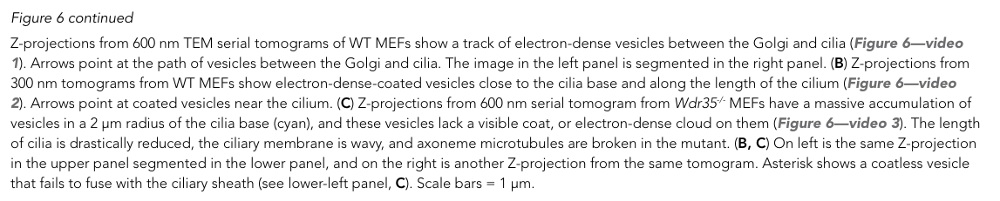

## Question

# Gene Research for Functional Annotation

## ⚠️ CRITICAL: Gene/Protein Identification Context

**BEFORE YOU BEGIN RESEARCH:** You MUST verify you are researching the CORRECT gene/protein. Gene symbols can be ambiguous, especially for less well-characterized genes from non-model organisms.

### Target Gene/Protein Identity (from UniProt):
- **UniProt Accession:** Q9P2L0
- **Protein Description:** RecName: Full=WD repeat-containing protein 35 {ECO:0000305}; AltName: Full=Intraflagellar transport protein 121 homolog;
- **Gene Information:** Name=WDR35 {ECO:0000312|HGNC:HGNC:29250}; Synonyms=IFT121 {ECO:0000303|PubMed:27932497, ECO:0000303|PubMed:29220510}, KIAA1336;
- **Organism (full):** Homo sapiens (Human).
- **Protein Family:** Not specified in UniProt
- **Key Domains:** Beta-prop_IFT121_2nd. (IPR056158); Beta-prop_IFT121_TULP_N. (IPR056159); Ift122/121. (IPR039857); TPR_IFT121. (IPR057979); TPR_IFT80_172_dom. (IPR056157)

### MANDATORY VERIFICATION STEPS:

1. **Check if the gene symbol "WDR35" matches the protein description above**
2. **Verify the organism is correct:** Homo sapiens (Human).
3. **Check if protein family/domains align with what you find in literature**
4. **If you find literature for a DIFFERENT gene with the same or similar symbol, STOP**

### If Gene Symbol is Ambiguous or You Cannot Find Relevant Literature:

**DO NOT PROCEED WITH RESEARCH ON A DIFFERENT GENE.** Instead:
- State clearly: "The gene symbol 'WDR35' is ambiguous or literature is limited for this specific protein"
- Explain what you found (e.g., "Found extensive literature on a different gene with the same symbol in a different organism")
- Describe the protein based ONLY on the UniProt information provided above
- Suggest that the protein function can be inferred from domain/family information

### Research Target:

Please provide a comprehensive research report on the gene **WDR35** (gene ID: WDR35, UniProt: Q9P2L0) in human.

The research report should be a detailed narrative explaining the function, biological processes, and localization of the gene product. Citations should be given for all claims.

You should prioritize authoritative reviews and primary scientific literature when conducting research. You can supplement
this with annotations you find in gene/protein databases, but these can be outdated or inaccurate.

We are specifically interested in the primary function of the gene - for enzymes, what reaction is catalyzed, and what is the substrate specificity? For transporters, what is the substrate? For structural proteins or adapters, what is the broader structural role? For signaling molecules, what is the role in the pathway.

We are interested in where in or outside the cell the gene product carries out its function.

We are also interested in the signaling or biochemical pathways in which the gene functions. We are less interested in broad pleiotropic effects, except where these elucidate the precise role.

Include evidence where possible. We are interested in both experimental evidence as well as inference from structure, evolution, or bioinformatic analysis. Precise studies should be prioritized over high-throughput, where available.

## Output

Question: You are an expert researcher providing comprehensive, well-cited information.

Provide detailed information focusing on:
1. Key concepts and definitions with current understanding
2. Recent developments and latest research (prioritize 2023-2024 sources)
3. Current applications and real-world implementations
4. Expert opinions and analysis from authoritative sources
5. Relevant statistics and data from recent studies

Format as a comprehensive research report with proper citations. Include URLs and publication dates where available.
Always prioritize recent, authoritative sources and provide specific citations for all major claims.

# Gene Research for Functional Annotation

## ⚠️ CRITICAL: Gene/Protein Identification Context

**BEFORE YOU BEGIN RESEARCH:** You MUST verify you are researching the CORRECT gene/protein. Gene symbols can be ambiguous, especially for less well-characterized genes from non-model organisms.

### Target Gene/Protein Identity (from UniProt):
- **UniProt Accession:** Q9P2L0
- **Protein Description:** RecName: Full=WD repeat-containing protein 35 {ECO:0000305}; AltName: Full=Intraflagellar transport protein 121 homolog;
- **Gene Information:** Name=WDR35 {ECO:0000312|HGNC:HGNC:29250}; Synonyms=IFT121 {ECO:0000303|PubMed:27932497, ECO:0000303|PubMed:29220510}, KIAA1336;
- **Organism (full):** Homo sapiens (Human).
- **Protein Family:** Not specified in UniProt
- **Key Domains:** Beta-prop_IFT121_2nd. (IPR056158); Beta-prop_IFT121_TULP_N. (IPR056159); Ift122/121. (IPR039857); TPR_IFT121. (IPR057979); TPR_IFT80_172_dom. (IPR056157)

### MANDATORY VERIFICATION STEPS:

1. **Check if the gene symbol "WDR35" matches the protein description above**
2. **Verify the organism is correct:** Homo sapiens (Human).
3. **Check if protein family/domains align with what you find in literature**
4. **If you find literature for a DIFFERENT gene with the same or similar symbol, STOP**

### If Gene Symbol is Ambiguous or You Cannot Find Relevant Literature:

**DO NOT PROCEED WITH RESEARCH ON A DIFFERENT GENE.** Instead:
- State clearly: "The gene symbol 'WDR35' is ambiguous or literature is limited for this specific protein"
- Explain what you found (e.g., "Found extensive literature on a different gene with the same symbol in a different organism")
- Describe the protein based ONLY on the UniProt information provided above
- Suggest that the protein function can be inferred from domain/family information

### Research Target:

Please provide a comprehensive research report on the gene **WDR35** (gene ID: WDR35, UniProt: Q9P2L0) in human.

The research report should be a detailed narrative explaining the function, biological processes, and localization of the gene product. Citations should be given for all claims.

You should prioritize authoritative reviews and primary scientific literature when conducting research. You can supplement
this with annotations you find in gene/protein databases, but these can be outdated or inaccurate.

We are specifically interested in the primary function of the gene - for enzymes, what reaction is catalyzed, and what is the substrate specificity? For transporters, what is the substrate? For structural proteins or adapters, what is the broader structural role? For signaling molecules, what is the role in the pathway.

We are interested in where in or outside the cell the gene product carries out its function.

We are also interested in the signaling or biochemical pathways in which the gene functions. We are less interested in broad pleiotropic effects, except where these elucidate the precise role.

Include evidence where possible. We are interested in both experimental evidence as well as inference from structure, evolution, or bioinformatic analysis. Precise studies should be prioritized over high-throughput, where available.

# Human WDR35 (IFT121): functional annotation research report

**Identity and principal function.** The target is human **WDR35**, UniProt **[Q9P2L0](https://www.uniprot.org/uniprotkb/Q9P2L0/entry)**, also called **IFT121**; *KIAA1336* is an additional alias in the supplied UniProt record. Human-cell experiments explicitly identify WDR35 as IFT121, and structural and sequence analyses agree with the supplied WD40/β-propeller and tetratricopeptide-repeat (TPR) annotations. WDR35 is a **peripheral subunit of intraflagellar transport complex A (IFT-A)**, not an enzyme, molecular motor, or transporter with a single defined substrate. Its primary role is to help assemble a cargo-carrying complex that delivers selected proteins to primary cilia and supports their transport within cilia. The literature examined is consistent with the specified human protein, rather than similarly named WDR proteins. (mill2011humanandmouse pages 1-3, fu2016roleforthe pages 1-3, mill2011humanandmouse pages 5-6, palicharla2024molecularandstructural pages 6-7)

## Molecular role and structural basis

IFT-A is a six-subunit transport assembly. WDR35/IFT121 occupies its **base, or IFT-A2, module** alongside the N-terminal region of IFT122, IFT139/TTC21B, and IFT43; IFT122 connects this module to the IFT140–IFT144-containing head. WDR35’s TPR-containing regions support association with other IFT-A proteins, whereas its WD40/β-propeller regions contribute to interactions with ciliary cargo. In human-cell experiments, WDR35 associated with IFT122, IFT139, and IFT43; removing an IFT-A-interacting region could disrupt complex association while preserving cargo interaction. This is the architecture of a **structural scaffold and cargo-associated adaptor**, although an association detected by co-immunoprecipitation need not always be direct. (fu2016roleforthe pages 6-7, palicharla2024molecularandstructural pages 6-7, fu2016roleforthe pages 10-11)

Recent structural work sharpens that model. Cryo-electron microscopy of *Tetrahymena* IFT-A, published in **March 2023**, placed IFT121 against IFT122 and IFT139, with IFT43 helping stabilize the base module; the complex adopted extended and folded conformations. Cryo-electron tomography of *Chlamydomonas* anterograde trains, integrated with structures of reconstituted human IFT-A, places WD-domain surfaces toward the ciliary membrane and indicates contacts between WD regions of neighboring IFT140 and WDR35 subunits. These are strong insights into conserved architecture, but native human WDR35 was **not** imaged in those non-human ciliary trains. (ma2023structuralinsightinto pages 2-4, palicharla2024molecularandstructural pages 6-7, palicharla2024molecularandstructural pages 7-8, palicharla2024molecularandstructural pages 7-7)

## Where WDR35 acts and what it transports

WDR35 operates **inside the cell**, particularly at the centrosome/mother centriole and ciliary base, on IFT-A assemblies entering and moving along the ciliary axoneme, and in trafficking associated with the periciliary region. It has also been observed in association with centriolar-satellite proteins. Its action concerns delivery to and movement within the **primary cilium**, a membrane-enclosed signaling compartment projecting from the cell surface; WDR35 is not itself an extracellular signaling ligand. (mill2011humanandmouse pages 1-3, mill2011humanandmouse pages 5-6, fu2016roleforthe pages 3-4, quidwai2021awdr35dependentcoat pages 2-3, fu2016roleforthe pages 6-7)

The most direct human loss-of-function evidence comes from **Fu and colleagues’ November 2016** CRISPR knockout experiments in RPE1 cells. WDR35-null cells formed fewer or delayed, short, bulbous cilia. Their cilia accumulated IFT88 and other transport components abnormally, often at the tip, indicating defective **retrograde transport and exit**. At the same time, ciliary entry of the membrane-associated proteins **ARL13B** and **INPP5E**, several tested G-protein-coupled receptors (**SSTR3, MCHR1, and 5HT6**), and endogenous activated **Smoothened (SMO)** was impaired. Reintroducing wild-type WDR35 rescued IFT88 retrograde transport and ARL13B entry. Thus, describing IFT-A only as a retrograde machine misses a second, experimentally supported function in **selective ciliary cargo import**. SMO behavior depends partly on assay context: ectopically expressed GFP–SMO could enter some knockout cilia, where its subsequent transport remained abnormal. (fu2016roleforthe pages 3-4, fu2016roleforthe pages 4-5, fu2016roleforthe pages 10-11)

WDR35 does **not** have one established molecular “substrate” analogous to an enzyme or solute transporter. Its experimentally implicated cargo classes include membrane-associated ARL13B and INPP5E, multiple GPCRs, Hedgehog-pathway proteins, and IFT/BBSome components that must be cleared or redistributed within cilia. The molecular connection to cargo is not exclusively through WDR35: a human IFT-A–TULP3 structure discussed in a **June 2024** review locates the characterized TULP3-adaptor interface principally at **IFT122 and IFT140**. TULP3 links IFT-A to membrane proteins and phosphoinositide-containing membranes. A *direct* WDR35–TULP3 binding interface should therefore not be assumed merely because both participate in the same cargo-delivery pathway. (fu2016roleforthe pages 4-5, fu2016roleforthe pages 3-4, palicharla2024molecularandstructural pages 6-7, palicharla2024molecularandstructural pages 9-9, palicharla2024molecularandstructural pages 4-5)

## Periciliary vesicles: an additional, qualified role

A **November 2021** mouse-cell study supplied evidence that WDR35 acts *before* cargo enters the ciliary shaft. Loss of Wdr35 destabilized peripheral IFT-A proteins, including IFT43 and IFT139, and left core components concentrated at the ciliary base. Electron tomography found approximately **ten times as many vesicles** near Wdr35-null cilia as near controls; virtually all mutant periciliary vesicles lacked the electron-dense coat seen on control vesicles, and fusion events were not observed. The study’s Figure 6 provides a visual comparison of coated control vesicles and the accumulation of apparently coatless mutant vesicles. (quidwai2021awdr35dependentcoat pages 9-11, quidwai2021awdr35dependentcoat pages 14-16, quidwai2021awdr35dependentcoat media 07464d01)

Purified recombinant **IFT139–IFT121–IFT43**, rather than isolated WDR35, bound **phosphatidic acid** strongly and phosphatidylserine more weakly in vitro; the trimer associated with phosphatidic-acid-containing liposomes, whereas the IFT121–IFT43 dimer associated weakly. Sequence relationships to COPI coatomer proteins, these lipid-binding results, electron microscopy, and WDR35 rescue support a **COPI-like, WDR35-dependent vesicle-coat model** for delivery of ciliary membrane cargo. They do not yet establish that WDR35 alone forms a coat, specify the origin and complete composition of every affected vesicle, or identify a direct membrane-fusion reaction catalyzed by WDR35. The observations are strongest in mouse cells, complementing—not replacing—the human-cell evidence for import and retrograde transport. (quidwai2021awdr35dependentcoat pages 1-2, quidwai2021awdr35dependentcoat pages 14-16, quidwai2021awdr35dependentcoat pages 20-21)

The experimental distinctions, including where evidence is direct or inferential, are summarized below.

| Mechanistic inference | Precise experiment/model | Actual observation | Confidence / important limitation |
|---|---|---|---|
| **WDR35/IFT121 is a non-core/peripheral IFT-A scaffold–cargo adaptor, not an enzyme or motor.** Its TPR region supports IFT-A assembly, whereas WD40/β-propeller regions contribute to cargo interactions. | CRISPR knockout of **WDR35** in human RPE1 cells, domain mapping, co-immunoprecipitation and wild-type rescue; Fu *et al.* (2016), DOI: [10.1016/j.celrep.2016.10.018](https://doi.org/10.1016/j.celrep.2016.10.018). | Two independently generated knockout clones produced short, bulbous cilia; wild-type WDR35 rescued retrograde IFT88 transport and ARL13B entry. WDR35 associated with IFT122, IFT139/TTC21B and IFT43; its mapped regions also interacted with ARL13B. (fu2016roleforthe pages 10-11, fu2016roleforthe pages 6-7, fu2016roleforthe pages 3-4) | **High** for human IFT-A and trafficking functions. Interaction assays used tagged proteins in places and do not establish that every association is direct. No catalytic reaction or motor activity has been demonstrated. |
| **WDR35 supports both selective membrane-cargo import and retrograde clearance within primary cilia.** | Human RPE1 WDR35-knockout cells examined by immunofluorescence and TEM; Fu *et al.* (2016), DOI above. | Loss of WDR35 excluded ARL13B and INPP5E and impaired entry of 5HT6, MCHR1, SSTR3 and endogenous activated SMO. IFT88, IFT-B proteins, IFT-A proteins, KIF3A, BBS4/BBS5 and GLI2 accumulated abnormally, frequently at bulbous ciliary tips. Early ciliary-vesicle docking was preserved, but Rab8-positive tube formation after docking was markedly reduced. (fu2016roleforthe pages 3-4, fu2016roleforthe pages 4-5) | **High** for dual import/retrograde phenotypes in cultured human cells. Cargo effects are selective and context-dependent: ectopic GFP-SMO could enter some knockout cilia, after which retrograde movement remained defective. |
| **WDR35 stabilizes peripheral IFT-A and is required for delivery or fusion of cargo-bearing periciliary vesicles; a COPI-like coat role is a supported model, not a proven complete mechanism.** | Wdr35-null mouse embryos and embryonic fibroblasts, rescue, proteomics and electron tomography; Quidwai *et al.* (2021), DOI: [10.7554/eLife.69786](https://doi.org/10.7554/eLife.69786). | IFT43 and IFT139 were depleted when WDR35 was absent, whereas core IFT-A accumulated near the ciliary base. Mutants had an approximately **10-fold increase** in periciliary vesicles distributed through about **2 µm³**; virtually all lacked the electron-dense coat seen in controls, and fusion events were not observed. Other coats, including likely clathrin coats, remained detectable. (quidwai2021awdr35dependentcoat pages 14-16, quidwai2021awdr35dependentcoat pages 9-11, quidwai2021awdr35dependentcoat media 07464d01) | **Moderate–high** for WDR35-dependent coat formation and vesicle accumulation. Vesicle origin, coat composition, scission mechanism and direct role in membrane fusion remain unresolved; EM morphology alone does not prove that WDR35 itself forms the coat. |
| **Peripheral IFT-A can bind anionic membrane lipids, consistent with membrane-associated trafficking.** | Purified recombinant IFT139–IFT121/WDR35–IFT43 trimer, lipid-overlay and liposome-association assays; Quidwai *et al.* (2021), DOI above. | The **trimer** bound phosphatidic acid strongly and phosphatidylserine weakly; it associated with PA-containing PE/PG/PA liposomes but not POPC liposomes lacking PA. The IFT121–IFT43 dimer associated only weakly. (quidwai2021awdr35dependentcoat pages 14-16) | **Moderate.** This demonstrates lipid binding by the recombinant peripheral **complex**, not isolated WDR35; IFT139 appears important. Physiological lipid specificity and binding affinity in intact human cells remain uncertain. |
| **IFT121/WDR35 occupies the IFT-A base module, where its β-propellers and TPR/Zn-binding regions organize cargo-facing and complex-assembly interfaces.** | Cryo-EM of the six-subunit *Tetrahymena* IFT-A complex; Ma *et al.* (2023), DOI: [10.1038/s41467-023-37208-2](https://doi.org/10.1038/s41467-023-37208-2). | IFT121 contacted IFT122 and IFT139 in an oval base-module ring; its WD40 propellers lay above the IFT121–IFT122 TPR junction, its zinc-binding region fitted into an IFT139 TPR groove, and IFT43 contacted IFT121/IFT122 as a stabilizing tether. Elongated and folded states differed by an approximately **125°** head-module rotation. (ma2023structuralinsightinto pages 2-4) | **High** structural confidence for the conserved non-human complex. Assignment to human WDR35 is supported by conservation and human reconstitution, but organism-specific contacts should not automatically be treated as demonstrated in living human cells. |
| **In assembled anterograde trains, IFT-A remodels and places WD-domain cargo-binding surfaces toward the ciliary membrane.** | 2023 *Chlamydomonas* in-situ cryo-electron tomography integrated with high-resolution human IFT-A structures; reviewed by Palicharla & Mukhopadhyay (2024), DOI: [10.1042/BST20231403](https://doi.org/10.1042/BST20231403). | Monomeric lariat-like IFT-A remodelled into a trident-like train arrangement; WD motifs of neighboring IFT140 and WDR35 subunits contacted one another. Structural docking oriented WD domains toward the ciliary membrane and TPR regions toward the opposite face. (palicharla2024molecularandstructural pages 7-7, palicharla2024molecularandstructural pages 7-8) | **Moderate–high.** The human complex was fitted into *Chlamydomonas* train maps; this is powerful cross-species inference rather than direct imaging of human WDR35 in a native human cilium. The 2024 review noted that retrograde-train architecture remained unresolved. |
| **TULP3 links IFT-A to diverse membrane cargo, principally through IFT122 rather than a demonstrated direct WDR35–TULP3 interface.** | Cryo-EM of reconstituted human TULP3–IFT-A and functional trafficking assays summarized by Palicharla & Mukhopadhyay (2024), DOI above. | TULP3’s N-terminal helix/loop contacted IFT122 and IFT140; IFT122 E1217/D1218 lay near TULP3 K42/R43. Interface mutations impaired ciliary trafficking of cargo such as GPR161 and ARL13B. WDR35 WD domains remain plausible cargo-contact surfaces, but direct WDR35–TULP3 binding was not established. (palicharla2024molecularandstructural pages 6-7, palicharla2024molecularandstructural pages 9-9) | **High** for the human TULP3–IFT-A interface; **low** for any claim that WDR35 directly binds TULP3. This distinction prevents over-attributing all IFT-A cargo recognition to WDR35. |
| **Patient-derived renal cells provide a practical functional assay for WDR35-associated ciliopathy, but current evidence is preliminary.** | Urine-derived renal epithelial cells from one 5-year-old with CED and stage-II CKD carrying p.Leu641* and p.Ala1027Thr, compared with three unaffected pediatric controls; Walczak-Sztulpa *et al.* (published 12 Dec 2023), DOI: [10.3389/fmolb.2023.1285790](https://doi.org/10.3389/fmolb.2023.1285790). | At least 100 cilia or cells per individual were analyzed. Patient cilia were wider by acetylated-tubulin and ARL13B measurements (**p < 0.0001**), longer by acetylated tubulin (**p < 0.01**) and ARL13B (**p < 0.05**), and had increased marker volumes (**p < 0.0001**); overall ciliation did not differ from pooled controls. The report’s literature review found renal insufficiency in **25/27 (≈93%)** reported WDR35-CED cases, with **10/25** receiving kidney transplants. (walczaksztulpa2023ciliaryphenotypingin pages 5-7, walczaksztulpa2023ciliaryphenotypingin pages 2-3, walczaksztulpa2023ciliaryphenotypingin pages 1-2) | **Low–moderate** for genotype-to-cell-phenotype causality: one patient, three controls, different culture passages, a missense VUS and an additional 7q31.1 deletion. The 25/27 statistic is from reported cases and is vulnerable to ascertainment and publication bias; it is not population prevalence. |

*Table: Evidence linking human WDR35/IFT121 to IFT-A assembly, ciliary cargo transport, membrane-associated trafficking, structural organization and renal ciliopathy. Confidence statements distinguish direct observations from cross-species inference and the proposed COPI-like coat model.*

## Signaling consequences and human disease

WDR35 affects **Hedgehog signaling through ciliary localization**, rather than through a demonstrated catalytic step in the pathway. In Wdr35-null fibroblasts, total EVC and EVC2 protein amounts were retained, but these proteins were not detected in the cilium; agonist-induced SMO ciliary recruitment was also lost. Comparison with a retrograde-dynein mutant supported a specific requirement for WDR35-dependent **entry** of these signaling components, not simply a generic consequence of failed retrograde transport. Abnormal ciliary handling of GLI2 was also reported in human WDR35-knockout cells. These defects provide a mechanistic explanation for developmental consequences of pathogenic variants, without assigning every skeletal or renal phenotype to one cargo. (caparrosmartin2015specificvariantsin pages 5-6, caparrosmartin2015specificvariantsin pages 6-7, fu2016roleforthe pages 3-4)

Biallelic pathogenic **WDR35 variants** are implicated in overlapping skeletal ciliopathies, including **cranioectodermal dysplasia/Sensenbrenner syndrome**, short-rib polydactyly phenotypes, and a reported Ellis–van Creveld-like presentation. In an early human-and-mouse study, an **85% reduction in Wdr35 mRNA** by siRNA accompanied an approximately **50% reduction in ciliated cells**, providing functional support alongside patient genetic findings. Different alleles can preserve different degrees of IFT-A assembly and cargo trafficking, so disease-associated variants should be assessed functionally rather than treated as equivalent nulls. (mill2011humanandmouse pages 3-5, caparrosmartin2015specificvariantsin pages 6-7, palicharla2024molecularandstructural pages 4-5)

A **12 December 2023** patient-cell study illustrates a real-world research application: non-invasively collected, urine-derived renal epithelial cells were examined from **one child** with cranioectodermal dysplasia, stage-II chronic kidney disease, and WDR35 variants **p.Leu641\*** and **p.Ala1027Thr**, against **three pediatric controls**. The patient’s cilia were wider by both acetylated-tubulin and ARL13B measurements (**p < 0.0001**) and longer by the respective measurements (**p < 0.01** and **p < 0.05**); ciliation frequency did not differ significantly from the pooled controls. The report’s review of previously published WDR35-associated cranioectodermal dysplasia cases identified renal insufficiency in **25/27** patients and kidney transplantation in **10/25** with renal insufficiency. Those are **reported-case proportions, not population risks**. The cell findings also cannot establish that the missense variant alone caused the phenotype: this was a single-patient study, p.Ala1027Thr was a variant of uncertain significance, and the patient carried an additional chromosome 7q31.1 deletion. (walczaksztulpa2023ciliaryphenotypingin pages 1-2, walczaksztulpa2023ciliaryphenotypingin pages 3-5, walczaksztulpa2023ciliaryphenotypingin pages 5-7)

**Assessment.** The best-supported annotation is that **human WDR35/IFT121 is a noncatalytic, peripheral IFT-A structural and cargo-associated protein required for selective ciliary membrane-protein delivery and normal intraflagellar transport**. A WDR35-dependent periciliary vesicle-coat function is compelling but remains a mechanistic model in important respects. Current research applications include interpreting ciliopathy variants using structural interfaces, measuring cargo trafficking in gene-edited cells, and phenotyping cilia in patient-derived renal cells; these are functional and diagnostic research approaches, not established WDR35-directed treatments. (fu2016roleforthe pages 10-11, quidwai2021awdr35dependentcoat pages 14-16, palicharla2024molecularandstructural pages 6-7, walczaksztulpa2023ciliaryphenotypingin pages 5-7)

### Key sources and publication dates

- Fu *et al.* **November 2016**, *Cell Reports*, human WDR35 knockout and rescue: https://doi.org/10.1016/j.celrep.2016.10.018. (fu2016roleforthe pages 1-3, fu2016roleforthe pages 10-11)
- Quidwai *et al.* **4 November 2021**, *eLife*, IFT-A lipid binding and periciliary-vesicle electron tomography: https://doi.org/10.7554/eLife.69786. (quidwai2021awdr35dependentcoat pages 1-2, quidwai2021awdr35dependentcoat pages 14-16)
- Ma *et al.* **March 2023**, *Nature Communications*, IFT-A structural organization in *Tetrahymena*: https://doi.org/10.1038/s41467-023-37208-2. (ma2023structuralinsightinto pages 2-4)
- Lacey, Foster and Pigino **2023**, *Nature Structural & Molecular Biology*, in situ anterograde IFT-train architecture in *Chlamydomonas*: https://doi.org/10.1038/s41594-022-00905-5. (palicharla2024molecularandstructural pages 7-8, palicharla2024molecularandstructural pages 7-7)
- Walczak-Sztulpa *et al.* **12 December 2023**, *Frontiers in Molecular Biosciences*, patient-derived renal-cell phenotyping: https://doi.org/10.3389/fmolb.2023.1285790. (walczaksztulpa2023ciliaryphenotypingin pages 1-2, walczaksztulpa2023ciliaryphenotypingin pages 5-7)
- Palicharla and Mukhopadhyay **June 2024**, *Biochemical Society Transactions*, expert synthesis of human and comparative IFT-A structures and cargo delivery: https://doi.org/10.1042/BST20231403. (palicharla2024molecularandstructural pages 6-7, palicharla2024molecularandstructural pages 9-9)

References

1. (mill2011humanandmouse pages 1-3): Pleasantine Mill, Paul J. Lockhart, Elizabeth Fitzpatrick, Hayley S. Mountford, Emma A. Hall, Martin A.M. Reijns, Margaret Keighren, Melanie Bahlo, Catherine J. Bromhead, Peter Budd, Salim Aftimos, Martin B. Delatycki, Ravi Savarirayan, Ian J. Jackson, and David J. Amor. Human and mouse mutations in wdr35 cause short-rib polydactyly syndromes due to abnormal ciliogenesis. American journal of human genetics, 88 4:508-15, Apr 2011. URL: https://doi.org/10.1016/j.ajhg.2011.03.015, doi:10.1016/j.ajhg.2011.03.015. This article has 165 citations and is from a highest quality peer-reviewed journal.

2. (fu2016roleforthe pages 1-3): Wenxiang Fu, Lei Wang, Sehyun Kim, Ji Li, and Brian David Dynlacht. Role for the ift-a complex in selective transport to the primary cilium. Cell reports, 17 6:1505-1517, Nov 2016. URL: https://doi.org/10.1016/j.celrep.2016.10.018, doi:10.1016/j.celrep.2016.10.018. This article has 126 citations and is from a highest quality peer-reviewed journal.

3. (mill2011humanandmouse pages 5-6): Pleasantine Mill, Paul J. Lockhart, Elizabeth Fitzpatrick, Hayley S. Mountford, Emma A. Hall, Martin A.M. Reijns, Margaret Keighren, Melanie Bahlo, Catherine J. Bromhead, Peter Budd, Salim Aftimos, Martin B. Delatycki, Ravi Savarirayan, Ian J. Jackson, and David J. Amor. Human and mouse mutations in wdr35 cause short-rib polydactyly syndromes due to abnormal ciliogenesis. American journal of human genetics, 88 4:508-15, Apr 2011. URL: https://doi.org/10.1016/j.ajhg.2011.03.015, doi:10.1016/j.ajhg.2011.03.015. This article has 165 citations and is from a highest quality peer-reviewed journal.

4. (palicharla2024molecularandstructural pages 6-7): Vivek Reddy Palicharla and Saikat Mukhopadhyay. Molecular and structural perspectives on protein trafficking to the primary cilium membrane. Biochemical Society Transactions, 52:1473-1487, Jun 2024. URL: https://doi.org/10.1042/bst20231403, doi:10.1042/bst20231403. This article has 16 citations and is from a peer-reviewed journal.

5. (fu2016roleforthe pages 6-7): Wenxiang Fu, Lei Wang, Sehyun Kim, Ji Li, and Brian David Dynlacht. Role for the ift-a complex in selective transport to the primary cilium. Cell reports, 17 6:1505-1517, Nov 2016. URL: https://doi.org/10.1016/j.celrep.2016.10.018, doi:10.1016/j.celrep.2016.10.018. This article has 126 citations and is from a highest quality peer-reviewed journal.

6. (fu2016roleforthe pages 10-11): Wenxiang Fu, Lei Wang, Sehyun Kim, Ji Li, and Brian David Dynlacht. Role for the ift-a complex in selective transport to the primary cilium. Cell reports, 17 6:1505-1517, Nov 2016. URL: https://doi.org/10.1016/j.celrep.2016.10.018, doi:10.1016/j.celrep.2016.10.018. This article has 126 citations and is from a highest quality peer-reviewed journal.

7. (ma2023structuralinsightinto pages 2-4): Yuanyuan Ma, Jun He, Shaobai Li, Deqiang Yao, Chenhui Huang, Jian Wu, and Ming Lei. Structural insight into the intraflagellar transport complex ift-a and its assembly in the anterograde ift train. Nature Communications, Mar 2023. URL: https://doi.org/10.1038/s41467-023-37208-2, doi:10.1038/s41467-023-37208-2. This article has 43 citations and is from a highest quality peer-reviewed journal.

8. (palicharla2024molecularandstructural pages 7-8): Vivek Reddy Palicharla and Saikat Mukhopadhyay. Molecular and structural perspectives on protein trafficking to the primary cilium membrane. Biochemical Society Transactions, 52:1473-1487, Jun 2024. URL: https://doi.org/10.1042/bst20231403, doi:10.1042/bst20231403. This article has 16 citations and is from a peer-reviewed journal.

9. (palicharla2024molecularandstructural pages 7-7): Vivek Reddy Palicharla and Saikat Mukhopadhyay. Molecular and structural perspectives on protein trafficking to the primary cilium membrane. Biochemical Society Transactions, 52:1473-1487, Jun 2024. URL: https://doi.org/10.1042/bst20231403, doi:10.1042/bst20231403. This article has 16 citations and is from a peer-reviewed journal.

10. (fu2016roleforthe pages 3-4): Wenxiang Fu, Lei Wang, Sehyun Kim, Ji Li, and Brian David Dynlacht. Role for the ift-a complex in selective transport to the primary cilium. Cell reports, 17 6:1505-1517, Nov 2016. URL: https://doi.org/10.1016/j.celrep.2016.10.018, doi:10.1016/j.celrep.2016.10.018. This article has 126 citations and is from a highest quality peer-reviewed journal.

11. (quidwai2021awdr35dependentcoat pages 2-3): Tooba Quidwai, Jiaolong Wang, Emma A Hall, Narcis A Petriman, Weihua Leng, Petra Kiesel, Jonathan N Wells, Laura C Murphy, Margaret A Keighren, Joseph A Marsh, Esben Lorentzen, Gaia Pigino, and Pleasantine Mill. A wdr35-dependent coat protein complex transports ciliary membrane cargo vesicles to cilia. eLife, Nov 2021. URL: https://doi.org/10.7554/elife.69786, doi:10.7554/elife.69786. This article has 45 citations and is from a domain leading peer-reviewed journal.

12. (fu2016roleforthe pages 4-5): Wenxiang Fu, Lei Wang, Sehyun Kim, Ji Li, and Brian David Dynlacht. Role for the ift-a complex in selective transport to the primary cilium. Cell reports, 17 6:1505-1517, Nov 2016. URL: https://doi.org/10.1016/j.celrep.2016.10.018, doi:10.1016/j.celrep.2016.10.018. This article has 126 citations and is from a highest quality peer-reviewed journal.

13. (palicharla2024molecularandstructural pages 9-9): Vivek Reddy Palicharla and Saikat Mukhopadhyay. Molecular and structural perspectives on protein trafficking to the primary cilium membrane. Biochemical Society Transactions, 52:1473-1487, Jun 2024. URL: https://doi.org/10.1042/bst20231403, doi:10.1042/bst20231403. This article has 16 citations and is from a peer-reviewed journal.

14. (palicharla2024molecularandstructural pages 4-5): Vivek Reddy Palicharla and Saikat Mukhopadhyay. Molecular and structural perspectives on protein trafficking to the primary cilium membrane. Biochemical Society Transactions, 52:1473-1487, Jun 2024. URL: https://doi.org/10.1042/bst20231403, doi:10.1042/bst20231403. This article has 16 citations and is from a peer-reviewed journal.

15. (quidwai2021awdr35dependentcoat pages 9-11): Tooba Quidwai, Jiaolong Wang, Emma A Hall, Narcis A Petriman, Weihua Leng, Petra Kiesel, Jonathan N Wells, Laura C Murphy, Margaret A Keighren, Joseph A Marsh, Esben Lorentzen, Gaia Pigino, and Pleasantine Mill. A wdr35-dependent coat protein complex transports ciliary membrane cargo vesicles to cilia. eLife, Nov 2021. URL: https://doi.org/10.7554/elife.69786, doi:10.7554/elife.69786. This article has 45 citations and is from a domain leading peer-reviewed journal.

16. (quidwai2021awdr35dependentcoat pages 14-16): Tooba Quidwai, Jiaolong Wang, Emma A Hall, Narcis A Petriman, Weihua Leng, Petra Kiesel, Jonathan N Wells, Laura C Murphy, Margaret A Keighren, Joseph A Marsh, Esben Lorentzen, Gaia Pigino, and Pleasantine Mill. A wdr35-dependent coat protein complex transports ciliary membrane cargo vesicles to cilia. eLife, Nov 2021. URL: https://doi.org/10.7554/elife.69786, doi:10.7554/elife.69786. This article has 45 citations and is from a domain leading peer-reviewed journal.

17. (quidwai2021awdr35dependentcoat media 07464d01): Tooba Quidwai, Jiaolong Wang, Emma A Hall, Narcis A Petriman, Weihua Leng, Petra Kiesel, Jonathan N Wells, Laura C Murphy, Margaret A Keighren, Joseph A Marsh, Esben Lorentzen, Gaia Pigino, and Pleasantine Mill. A wdr35-dependent coat protein complex transports ciliary membrane cargo vesicles to cilia. eLife, Nov 2021. URL: https://doi.org/10.7554/elife.69786, doi:10.7554/elife.69786. This article has 45 citations and is from a domain leading peer-reviewed journal.

18. (quidwai2021awdr35dependentcoat pages 1-2): Tooba Quidwai, Jiaolong Wang, Emma A Hall, Narcis A Petriman, Weihua Leng, Petra Kiesel, Jonathan N Wells, Laura C Murphy, Margaret A Keighren, Joseph A Marsh, Esben Lorentzen, Gaia Pigino, and Pleasantine Mill. A wdr35-dependent coat protein complex transports ciliary membrane cargo vesicles to cilia. eLife, Nov 2021. URL: https://doi.org/10.7554/elife.69786, doi:10.7554/elife.69786. This article has 45 citations and is from a domain leading peer-reviewed journal.

19. (quidwai2021awdr35dependentcoat pages 20-21): Tooba Quidwai, Jiaolong Wang, Emma A Hall, Narcis A Petriman, Weihua Leng, Petra Kiesel, Jonathan N Wells, Laura C Murphy, Margaret A Keighren, Joseph A Marsh, Esben Lorentzen, Gaia Pigino, and Pleasantine Mill. A wdr35-dependent coat protein complex transports ciliary membrane cargo vesicles to cilia. eLife, Nov 2021. URL: https://doi.org/10.7554/elife.69786, doi:10.7554/elife.69786. This article has 45 citations and is from a domain leading peer-reviewed journal.

20. (walczaksztulpa2023ciliaryphenotypingin pages 5-7): Joanna Walczak-Sztulpa, Anna Wawrocka, Łukasz Kuszel, Paulina Pietras, Marta Leśniczak-Staszak, Mirosław Andrusiewicz, Maciej R. Krawczyński, Anna Latos-Bieleńska, Marta Pawlak, Ryszard Grenda, Anna Materna-Kiryluk, Machteld M. Oud, and Witold Szaflarski. Ciliary phenotyping in renal epithelial cells in a cranioectodermal dysplasia patient with wdr35 variants. Frontiers in Molecular Biosciences, Dec 2023. URL: https://doi.org/10.3389/fmolb.2023.1285790, doi:10.3389/fmolb.2023.1285790. This article has 3 citations.

21. (walczaksztulpa2023ciliaryphenotypingin pages 2-3): Joanna Walczak-Sztulpa, Anna Wawrocka, Łukasz Kuszel, Paulina Pietras, Marta Leśniczak-Staszak, Mirosław Andrusiewicz, Maciej R. Krawczyński, Anna Latos-Bieleńska, Marta Pawlak, Ryszard Grenda, Anna Materna-Kiryluk, Machteld M. Oud, and Witold Szaflarski. Ciliary phenotyping in renal epithelial cells in a cranioectodermal dysplasia patient with wdr35 variants. Frontiers in Molecular Biosciences, Dec 2023. URL: https://doi.org/10.3389/fmolb.2023.1285790, doi:10.3389/fmolb.2023.1285790. This article has 3 citations.

22. (walczaksztulpa2023ciliaryphenotypingin pages 1-2): Joanna Walczak-Sztulpa, Anna Wawrocka, Łukasz Kuszel, Paulina Pietras, Marta Leśniczak-Staszak, Mirosław Andrusiewicz, Maciej R. Krawczyński, Anna Latos-Bieleńska, Marta Pawlak, Ryszard Grenda, Anna Materna-Kiryluk, Machteld M. Oud, and Witold Szaflarski. Ciliary phenotyping in renal epithelial cells in a cranioectodermal dysplasia patient with wdr35 variants. Frontiers in Molecular Biosciences, Dec 2023. URL: https://doi.org/10.3389/fmolb.2023.1285790, doi:10.3389/fmolb.2023.1285790. This article has 3 citations.

23. (caparrosmartin2015specificvariantsin pages 5-6): José A. Caparrós-Martín, Alessandro De Luca, François Cartault, Mona Aglan, Samia Temtamy, Ghada A. Otaify, Mennat Mehrez, María Valencia, Laura Vázquez, Jean-Luc Alessandri, Julián Nevado, Inmaculada Rueda-Arenas, Karen E. Heath, Maria Cristina Digilio, Bruno Dallapiccola, Judith A. Goodship, Pleasantine Mill, Pablo Lapunzina, and Victor L. Ruiz-Perez. Specific variants in wdr35 cause a distinctive form of ellis-van creveld syndrome by disrupting the recruitment of the evc complex and smo into the cilium. Human molecular genetics, 24 14:4126-37, Apr 2015. URL: https://doi.org/10.1093/hmg/ddv152, doi:10.1093/hmg/ddv152. This article has 77 citations and is from a domain leading peer-reviewed journal.

24. (caparrosmartin2015specificvariantsin pages 6-7): José A. Caparrós-Martín, Alessandro De Luca, François Cartault, Mona Aglan, Samia Temtamy, Ghada A. Otaify, Mennat Mehrez, María Valencia, Laura Vázquez, Jean-Luc Alessandri, Julián Nevado, Inmaculada Rueda-Arenas, Karen E. Heath, Maria Cristina Digilio, Bruno Dallapiccola, Judith A. Goodship, Pleasantine Mill, Pablo Lapunzina, and Victor L. Ruiz-Perez. Specific variants in wdr35 cause a distinctive form of ellis-van creveld syndrome by disrupting the recruitment of the evc complex and smo into the cilium. Human molecular genetics, 24 14:4126-37, Apr 2015. URL: https://doi.org/10.1093/hmg/ddv152, doi:10.1093/hmg/ddv152. This article has 77 citations and is from a domain leading peer-reviewed journal.

25. (mill2011humanandmouse pages 3-5): Pleasantine Mill, Paul J. Lockhart, Elizabeth Fitzpatrick, Hayley S. Mountford, Emma A. Hall, Martin A.M. Reijns, Margaret Keighren, Melanie Bahlo, Catherine J. Bromhead, Peter Budd, Salim Aftimos, Martin B. Delatycki, Ravi Savarirayan, Ian J. Jackson, and David J. Amor. Human and mouse mutations in wdr35 cause short-rib polydactyly syndromes due to abnormal ciliogenesis. American journal of human genetics, 88 4:508-15, Apr 2011. URL: https://doi.org/10.1016/j.ajhg.2011.03.015, doi:10.1016/j.ajhg.2011.03.015. This article has 165 citations and is from a highest quality peer-reviewed journal.

26. (walczaksztulpa2023ciliaryphenotypingin pages 3-5): Joanna Walczak-Sztulpa, Anna Wawrocka, Łukasz Kuszel, Paulina Pietras, Marta Leśniczak-Staszak, Mirosław Andrusiewicz, Maciej R. Krawczyński, Anna Latos-Bieleńska, Marta Pawlak, Ryszard Grenda, Anna Materna-Kiryluk, Machteld M. Oud, and Witold Szaflarski. Ciliary phenotyping in renal epithelial cells in a cranioectodermal dysplasia patient with wdr35 variants. Frontiers in Molecular Biosciences, Dec 2023. URL: https://doi.org/10.3389/fmolb.2023.1285790, doi:10.3389/fmolb.2023.1285790. This article has 3 citations.

## Artifacts

- [Edison artifact artifact-00](WDR35-deep-research-falcon_artifacts/artifact-00.md)

## Citations

1. ma2023structuralinsightinto pages 2-4
2. mill2011humanandmouse pages 1-3
3. fu2016roleforthe pages 1-3
4. mill2011humanandmouse pages 5-6
5. palicharla2024molecularandstructural pages 6-7
6. fu2016roleforthe pages 6-7
7. fu2016roleforthe pages 10-11
8. palicharla2024molecularandstructural pages 7-8
9. palicharla2024molecularandstructural pages 7-7
10. fu2016roleforthe pages 3-4
11. fu2016roleforthe pages 4-5
12. palicharla2024molecularandstructural pages 9-9
13. palicharla2024molecularandstructural pages 4-5
14. walczaksztulpa2023ciliaryphenotypingin pages 5-7
15. walczaksztulpa2023ciliaryphenotypingin pages 2-3
16. walczaksztulpa2023ciliaryphenotypingin pages 1-2
17. caparrosmartin2015specificvariantsin pages 5-6
18. caparrosmartin2015specificvariantsin pages 6-7
19. mill2011humanandmouse pages 3-5
20. walczaksztulpa2023ciliaryphenotypingin pages 3-5
21. Q9P2L0
22. 10.1016/j.celrep.2016.10.018
23. 10.7554/eLife.69786
24. 10.1038/s41467-023-37208-2
25. 10.1042/BST20231403
26. 10.3389/fmolb.2023.1285790
27. https://www.uniprot.org/uniprotkb/Q9P2L0/entry
28. https://doi.org/10.1016/j.celrep.2016.10.018
29. https://doi.org/10.7554/eLife.69786
30. https://doi.org/10.1038/s41467-023-37208-2
31. https://doi.org/10.1042/BST20231403
32. https://doi.org/10.3389/fmolb.2023.1285790
33. https://doi.org/10.1016/j.celrep.2016.10.018.
34. https://doi.org/10.7554/eLife.69786.
35. https://doi.org/10.1038/s41467-023-37208-2.
36. https://doi.org/10.1038/s41594-022-00905-5.
37. https://doi.org/10.3389/fmolb.2023.1285790.
38. https://doi.org/10.1042/BST20231403.
39. https://doi.org/10.1016/j.ajhg.2011.03.015,
40. https://doi.org/10.1016/j.celrep.2016.10.018,
41. https://doi.org/10.1042/bst20231403,
42. https://doi.org/10.1038/s41467-023-37208-2,
43. https://doi.org/10.7554/elife.69786,
44. https://doi.org/10.3389/fmolb.2023.1285790,
45. https://doi.org/10.1093/hmg/ddv152,