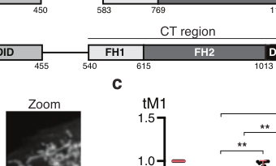

## Question

# Gene Research for Functional Annotation

## ⚠️ CRITICAL: Gene/Protein Identification Context

**BEFORE YOU BEGIN RESEARCH:** You MUST verify you are researching the CORRECT gene/protein. Gene symbols can be ambiguous, especially for less well-characterized genes from non-model organisms.

### Target Gene/Protein Identity (from UniProt):
- **UniProt Accession:** P60710
- **Protein Description:** RecName: Full=Actin, cytoplasmic 1; AltName: Full=Beta-actin; EC=3.6.4.- {ECO:0000250|UniProtKB:P68137}; Contains: RecName: Full=Actin, cytoplasmic 1, N-terminally processed;
- **Gene Information:** Name=Actb;
- **Organism (full):** Mus musculus (Mouse).
- **Protein Family:** Belongs to the actin family. .
- **Key Domains:** Actin. (IPR004000); Actin/actin-like_CS. (IPR020902); Actin_CS. (IPR004001); ATPase_NBD. (IPR043129); Actin (PF00022)

### MANDATORY VERIFICATION STEPS:

1. **Check if the gene symbol "Actb" matches the protein description above**
2. **Verify the organism is correct:** Mus musculus (Mouse).
3. **Check if protein family/domains align with what you find in literature**
4. **If you find literature for a DIFFERENT gene with the same or similar symbol, STOP**

### If Gene Symbol is Ambiguous or You Cannot Find Relevant Literature:

**DO NOT PROCEED WITH RESEARCH ON A DIFFERENT GENE.** Instead:
- State clearly: "The gene symbol 'Actb' is ambiguous or literature is limited for this specific protein"
- Explain what you found (e.g., "Found extensive literature on a different gene with the same symbol in a different organism")
- Describe the protein based ONLY on the UniProt information provided above
- Suggest that the protein function can be inferred from domain/family information

### Research Target:

Please provide a comprehensive research report on the gene **Actb** (gene ID: Actb, UniProt: P60710) in mouse.

The research report should be a detailed narrative explaining the function, biological processes, and localization of the gene product. Citations should be given for all claims.

You should prioritize authoritative reviews and primary scientific literature when conducting research. You can supplement
this with annotations you find in gene/protein databases, but these can be outdated or inaccurate.

We are specifically interested in the primary function of the gene - for enzymes, what reaction is catalyzed, and what is the substrate specificity? For transporters, what is the substrate? For structural proteins or adapters, what is the broader structural role? For signaling molecules, what is the role in the pathway.

We are interested in where in or outside the cell the gene product carries out its function.

We are also interested in the signaling or biochemical pathways in which the gene functions. We are less interested in broad pleiotropic effects, except where these elucidate the precise role.

Include evidence where possible. We are interested in both experimental evidence as well as inference from structure, evolution, or bioinformatic analysis. Precise studies should be prioritized over high-throughput, where available.

## Output

Question: You are an expert researcher providing comprehensive, well-cited information.

Provide detailed information focusing on:
1. Key concepts and definitions with current understanding
2. Recent developments and latest research (prioritize 2023-2024 sources)
3. Current applications and real-world implementations
4. Expert opinions and analysis from authoritative sources
5. Relevant statistics and data from recent studies

Format as a comprehensive research report with proper citations. Include URLs and publication dates where available.
Always prioritize recent, authoritative sources and provide specific citations for all major claims.

# Gene Research for Functional Annotation

## ⚠️ CRITICAL: Gene/Protein Identification Context

**BEFORE YOU BEGIN RESEARCH:** You MUST verify you are researching the CORRECT gene/protein. Gene symbols can be ambiguous, especially for less well-characterized genes from non-model organisms.

### Target Gene/Protein Identity (from UniProt):
- **UniProt Accession:** P60710
- **Protein Description:** RecName: Full=Actin, cytoplasmic 1; AltName: Full=Beta-actin; EC=3.6.4.- {ECO:0000250|UniProtKB:P68137}; Contains: RecName: Full=Actin, cytoplasmic 1, N-terminally processed;
- **Gene Information:** Name=Actb;
- **Organism (full):** Mus musculus (Mouse).
- **Protein Family:** Belongs to the actin family. .
- **Key Domains:** Actin. (IPR004000); Actin/actin-like_CS. (IPR020902); Actin_CS. (IPR004001); ATPase_NBD. (IPR043129); Actin (PF00022)

### MANDATORY VERIFICATION STEPS:

1. **Check if the gene symbol "Actb" matches the protein description above**
2. **Verify the organism is correct:** Mus musculus (Mouse).
3. **Check if protein family/domains align with what you find in literature**
4. **If you find literature for a DIFFERENT gene with the same or similar symbol, STOP**

### If Gene Symbol is Ambiguous or You Cannot Find Relevant Literature:

**DO NOT PROCEED WITH RESEARCH ON A DIFFERENT GENE.** Instead:
- State clearly: "The gene symbol 'Actb' is ambiguous or literature is limited for this specific protein"
- Explain what you found (e.g., "Found extensive literature on a different gene with the same symbol in a different organism")
- Describe the protein based ONLY on the UniProt information provided above
- Suggest that the protein function can be inferred from domain/family information

### Research Target:

Please provide a comprehensive research report on the gene **Actb** (gene ID: Actb, UniProt: P60710) in mouse.

The research report should be a detailed narrative explaining the function, biological processes, and localization of the gene product. Citations should be given for all claims.

You should prioritize authoritative reviews and primary scientific literature when conducting research. You can supplement
this with annotations you find in gene/protein databases, but these can be outdated or inaccurate.

We are specifically interested in the primary function of the gene - for enzymes, what reaction is catalyzed, and what is the substrate specificity? For transporters, what is the substrate? For structural proteins or adapters, what is the broader structural role? For signaling molecules, what is the role in the pathway.

We are interested in where in or outside the cell the gene product carries out its function.

We are also interested in the signaling or biochemical pathways in which the gene functions. We are less interested in broad pleiotropic effects, except where these elucidate the precise role.

Include evidence where possible. We are interested in both experimental evidence as well as inference from structure, evolution, or bioinformatic analysis. Precise studies should be prioritized over high-throughput, where available.

# Research report: Mouse **Actb** (β‑actin; UniProt **P60710**) functional annotation

## 0) Target verification (mandatory)
The requested target is **Actb** encoding **β‑actin (actin, cytoplasmic 1)** in **Mus musculus**. The literature retrieved and cited here explicitly addresses **β‑actin/Actb** as a **cytoplasmic non‑muscle actin isoform**, including comparisons to the closely related **γ‑actin/Actg1** (99% identical proteins differing at four conserved N‑terminal residues) and mouse genetic perturbations (Actb knockout and Actb→Actg1 coding‑sequence conversion models), consistent with UniProt P60710 identity and actin-family membership. (shah2024thediaph3linker pages 1-2, sundby2022nucleotideandproteindependent pages 1-2, sundby2022nucleotideandproteindependent pages 2-4)

## 1) Key concepts, definitions, and current understanding

### 1.1 Actb/β‑actin as a cytoskeletal “core” protein with isoform-specific networks
β‑actin is a central component of the **actin cytoskeleton**, existing as **monomeric (G‑actin)** and **filamentous (F‑actin)** assemblies that drive processes such as **cell motility** and **cytokinesis**. Actin filaments arise by polymerization of actin monomers and are nucleated by actin assembly factors including **formins**; formins’ **FH2** domain mediates actin polymerization. (shah2024thediaph3linker pages 1-2, sundby2022nucleotideandproteindependent pages 1-2)

A recurring modern theme is that **cytoplasmic actin isoforms form spatially distinct, functionally non-redundant networks** despite minimal protein sequence divergence. In cytokinesis, for example, specialized β‑ and γ‑actin networks occupy different spatial zones and are not interchangeable. (shah2024thediaph3linker pages 1-2)

### 1.2 Isoform specialization and “nucleotide-dependent” functions
A particularly important nuance for Actb is that some essential functions can be **dependent on the Actb nucleotide sequence** (e.g., regulatory elements/translation dynamics) rather than strictly the amino-acid sequence of β‑actin protein. In mouse models, **Actb−/− is embryonic lethal**, while gene conversion of the Actb coding sequence to encode γ‑actin protein (Actb→Actg1 coding swap) can markedly mitigate overt phenotypes, supporting nucleotide-sequence–dependent roles of the Actb locus. (sundby2022nucleotideandproteindependent pages 1-2, sundby2022nucleotideandproteindependent pages 2-4)

## 2) Recent developments (prioritizing 2023–2024)

### 2.1 2024: DIAPH3 specifies β‑actin networks that organize cytokinetic signaling
A 2024 Nature Communications mechanistic study shows that the formin **DIAPH3** preferentially generates **β‑actin** filaments, while **DIAPH1** can generate both β‑ and γ‑actin filaments. This was quantified in a mitochondrial targeting assay via Manders overlap coefficients (MOC), demonstrating strong β‑actin recruitment for DIAPH3 (**0.78 ± 0.15** vs empty **0.06 ± 0.08**, **p = 1.45×10−11**) and much weaker γ‑actin recruitment (**0.25 ± 0.15** vs **0.11 ± 0.12**, **p = 6.68×10−4**). (shah2024thediaph3linker pages 1-2)

Functionally, the authors show that **β‑actin networks (but not γ‑actin networks)** are required to maintain **RhoA** and **non‑muscle myosin II** at the cytokinetic furrow, tying β‑actin’s isoform-specific scaffold to localized biochemical activities essential for successful cell division. (shah2024thediaph3linker pages 1-2)

Visual evidence for DIAPH3 isoform selectivity and furrow phenotypes is provided in the paper’s figure panels retrieved here. (shah2024thediaph3linker media 53c92cbc)

### 2.2 2024: MRTF/SRF → actin gene expression → F‑actin assembly controls immune-cell IL‑2 delivery
A 2024 Nature Communications study links actin expression/dynamics to **immune signaling architecture** in vivo. In CD8+ T cells, the transcription factor **SRF** and its actin-regulated co-factors **MRTF‑A/MRTF‑B** (MRTFs sense cellular G‑actin concentration) regulate cytoskeletal gene expression including cytoplasmic actins. (maurice2024il2deliveryto pages 1-2)

Mechanistically, **activation-induced homotypic clustering** of CD8+ T cells requires **F‑actin assembly** and supports paracrine **IL‑2 retention/presentation**. MRTF deficiency reduces actin expression and F‑actin, producing fewer and smaller clusters with impaired IL‑2 retention and downstream STAT5 signaling. Quantitatively:
- Cluster frequency: **16.9 ± 2.1%** (Mrtfab−/−) vs **31.6 ± 2.8%** (WT)
- Homotypic interactions: **17 ± 4.7%** vs **48.54 ± 6.8%**
- Clusters contain **~8‑fold less F‑actin**
- Latrunculin B (5 μM) **abolishes cluster formation** and reduces **STAT5 Y694 phosphorylation** (IL‑2 signaling readout)
- Lentiviral **β‑actin overexpression partially rescues** clustering and STAT5 phosphorylation
(maurice2024il2deliveryto pages 6-7, maurice2024il2deliveryto pages 15-17, maurice2024il2deliveryto pages 7-8)

These findings position Actb (as a major cytoplasmic actin) within an actionable signaling/biophysical axis: **MRTF/SRF transcriptional program → actin abundance → F‑actin–dependent tissue micro-organization → cytokine delivery efficiency**. (maurice2024il2deliveryto pages 1-2, maurice2024il2deliveryto pages 7-8)

### 2.3 2023: Retina structural integrity depends on β‑actin (isoform-swap genetics)
A 2023 preprint used an **Actb coding-sequence edited model (Actbcg/cg)** in which β‑actin protein is absent and γ‑actin is produced from both Actg1 and the edited Actb locus. In retina, β‑ and γ‑actin exhibit overlapping but distinguishable localizations, including enrichment in synaptic layers and microvilli of RPE/Müller cells. (vedula2023βactinisessential pages 4-6)

The β→γ replacement produced quantifiable morphologic and functional phenotypes:
- Müller cell microvilli: **narrower spread**
- RPE microvilli: **elongated** with **~2‑fold wider spread**
- Elongated RPE microvilli show reduced F‑actin density, with negative correlation between F‑actin intensity and microvilli width (Pearson/Spearman **−0.76/−0.86**, **p=0.045/0.014**)
- Physiologic impact: reduced rod transducin concentration and impaired light sensitivity (ERG/photoreceptor recordings)
(vedula2023βactinisessential pages 4-6)

### 2.4 2024: Variant-to-phenotype “non-muscle actinopathies” integrate biochemistry, iPSC, and mouse data
A 2024 medRxiv integrative study emphasizes that β‑ and γ‑cytoplasmic actins differ by only **4 of 375 amino acids** yet can show distinct polymerization properties and binding-partner preferences, and that disease-associated variants can dysregulate polymerization/depolymerization kinetics and neuronal migration. The authors also report that **heterozygous Actb loss in mice** associates with altered neuronal morphology and altered expression of actin-related genes in neonatal brain. (donato2024genomicandbiological pages 4-8, donato2024genomicandbiological pages 48-53)

## 3) Molecular function, biochemical activity, and pathways

### 3.1 Primary molecular function: dynamic polymerization into F‑actin networks
Across the cited mechanistic studies, β‑actin’s primary functional contribution is to **polymerize into F‑actin networks** that act as force-generating and scaffold structures for cellular processes including cytokinesis. Formin-mediated nucleation (e.g., DIAPH3) creates **β‑actin–enriched filaments** that organize local regulatory modules. (shah2024thediaph3linker pages 1-2)

### 3.2 Pathway-level roles: cytokinesis (RhoA/myosin-II maintenance)
During cytokinesis, β‑actin networks are required to maintain key contractile and signaling components at the furrow (RhoA, activated myosin-II), indicating that the β‑actin scaffold influences **RhoA pathway spatial control** and contractile ring mechanics. (shah2024thediaph3linker pages 1-2)

### 3.3 Pathway-level roles: actin–MRTF/SRF transcriptional feedback controlling immune function
MRTFs act as **G‑actin sensors** and, with SRF, regulate expression of cytoskeletal genes including actins. In CD8 T cells, this transcriptional program is required for F‑actin assembly needed for clustering, which in turn is required for effective IL‑2 signaling during infection—illustrating a functional loop between actin dynamics and transcriptional control. (maurice2024il2deliveryto pages 1-2, maurice2024il2deliveryto pages 14-15)

## 4) Cellular localization: where β‑actin operates

### 4.1 Cytokinetic furrow and compartmentalized actin networks
β‑actin can be enriched in specific cytoskeletal structures such as the **cleavage furrow** during cytokinesis, in contrast to γ‑actin which can occupy different cortical zones; this spatial segregation is linked to non-redundant functions and is consistent with formin-specific network assembly (DIAPH3→β‑actin). (shah2024thediaph3linker pages 1-2, sundby2022nucleotideandproteindependent pages 1-2)

### 4.2 Retina: microvilli and synaptic layers
In retina, both β‑ and γ‑actin are present across retinal layers with prominent enrichment in synaptic layers and microvilli of RPE/Müller cells, with β‑actin showing a more constrained distribution in Müller cell microvilli relative to γ‑actin. (vedula2023βactinisessential pages 4-6)

### 4.3 Immune-cell clusters: F‑actin content in homotypic T cell assemblies
In activated CD8+ T-cell clusters, β/γ actin expression supports **F‑actin accumulation** within clusters; loss of MRTF-dependent actin expression results in clusters containing markedly reduced F‑actin and impaired IL‑2 retention puncta. (maurice2024il2deliveryto pages 6-7, maurice2024il2deliveryto pages 15-17)

## 5) Phenotypes and genetic evidence in mouse

### 5.1 Essentiality and viability
- **Actb−/− mice are embryonic lethal**. (sundby2022nucleotideandproteindependent pages 1-2, shah2024thediaph3linker pages 1-2)
- Actb gene-conversion strategies (Actb coding sequence expressing γ‑actin) can yield viable mice, supporting the idea that some essential Actb functions are nucleotide-sequence linked rather than strictly β‑actin amino-acid linked. (sundby2022nucleotideandproteindependent pages 2-4)

### 5.2 Tissue-specific phenotypes highlight β‑actin specialization
The retina isoform-swap model (Actbcg/cg) shows that loss of β‑actin (even with γ‑actin compensation) can disrupt microvilli architecture and photoreceptor physiology. (vedula2023βactinisessential pages 4-6)

## 6) Current applications and real-world implementations

### 6.1 Actin perturbation as a tool: cytochalasans and F-actin disruption
A 2023 review summarizes **cytochalasans** as widely used small-molecule tools that interfere with actin filament remodeling (e.g., by affecting polymerization/elongation or monomer availability) to probe actin network contributions to cell morphology and motility-associated processes. The review notes that, despite decades of use, mechanistic data are incomplete across the structurally diverse cytochalasan family, motivating renewed structure–activity investigation. (sundby2022nucleotideandproteindependent pages 1-2)

In immune-cell clustering assays, pharmacologic disruption of F-actin using **Latrunculin B** provides a concrete example of real-world implementation of actin perturbation to test mechanism, showing abolition of clustering and impaired IL-2 signaling readouts. (maurice2024il2deliveryto pages 15-17)

### 6.2 ACTB/Actb as a “housekeeping” reference gene: current best practice is validation, not assumption
Although ACTB/Actb is often used for normalization/loading control, contemporary practice emphasizes **context-specific validation**.

Two 2024 studies illustrate typical use and evolving recommendations:
- **FFPE breast cancer RT-qPCR (Dec 2024):** among candidate reference genes, **ACTB** was identified as the least variable by multiple methods (NormFinder, BestKeeper, comparative ΔCt), while geNorm recommended using **ACTB + UBC** as a stable pair. (mohammed2024selectingsuitablereference pages 1-2)
- **Acute leukemia RT-qPCR (Jan 2024):** stability testing supported an endogenous set including **ACTB, ABL, TBP, RPLP0**, with a recommendation to use **2–3 genes** for normalization rather than relying on a single gene. (pessoa2024validationofendogenous pages 1-2)

Methodological cautions emphasize that ACTB expression can vary with differentiation, stimuli, and disease, and that no single housekeeping gene is universally stable—hence ACTB should be empirically validated per tissue and condition. (adhikariUnknownyearhousekeepinggeneand pages 7-10, adhikariUnknownyearhousekeepinggeneand pages 10-13)

## 7) Relevant statistics and data highlights (from recent studies)
Key quantitative values supporting functional annotation include:
- DIAPH3 β‑actin selectivity (Manders overlap coefficients; p-values) supporting β-actin–specific filament assembly. (shah2024thediaph3linker pages 1-2)
- Cytokinesis dependence of RhoA/myosin-II localization on β-actin networks (figure-based mechanistic evidence). (shah2024thediaph3linker media 53c92cbc)
- Immune clustering and IL‑2 delivery deficits in MRTF-deficient CD8 T cells (cluster %, homotypic interactions %, ~8-fold less F-actin; LatB concentration). (maurice2024il2deliveryto pages 6-7, maurice2024il2deliveryto pages 15-17)
- Retina microvilli structure/function correlations (Pearson/Spearman coefficients and p-values; ~2-fold spread change). (vedula2023βactinisessential pages 4-6)

For rapid reference, the evidence table below consolidates these points.

| Topic/claim | Key evidence/quantitative detail | System/model | Citation ID | Publication (with URL and date) |
|---|---|---|---|---|
| **Actb (β-actin) key evidence (mouse)** |  |  |  |  |
| DIAPH3 specifies a β-actin network | DIAPH3 preferentially generated/recruited β-actin filaments in a mitochondrial targeting assay: Manders overlap coefficient (tM1/MOC) for DIAPH3–β-actin **0.78 ± 0.15** vs empty **0.06 ± 0.08** (**p = 1.45 × 10⁻¹¹**); DIAPH3–γ-actin **0.25 ± 0.15** vs **0.11 ± 0.12** (**p = 6.68 × 10⁻⁴**). By comparison, DIAPH1 recruited both isoforms strongly (β **0.88 ± 0.13**; γ **0.82 ± 0.15**), supporting β-actin selectivity of DIAPH3. | Cell-based actin isoform specificity assay; mechanistic study relevant to mammalian cytokinesis | (shah2024thediaph3linker pages 1-2, shah2024thediaph3linker media 53c92cbc) | Shah et al., *Nature Communications* (2024-06). https://doi.org/10.1038/s41467-024-49427-2 |
| β-actin networks maintain RhoA and myosin-II at the cytokinetic furrow | Figure evidence showed that replacing the normal β-actin furrow network with γ-actin (via DIAPH3 linker swap) caused loss of activated non-muscle myosin II from the furrow and disrupted active **RhoA** and **Ect2** localization at the equatorial membrane. Authors concluded β-actin, but not γ-actin, is required to maintain myosin-II and RhoA at the cytokinetic furrow. | Cytokinesis in mammalian cells; isoform-specific actin network analysis | (shah2024thediaph3linker pages 1-2, shah2024thediaph3linker media 53c92cbc) | Shah et al., *Nature Communications* (2024-06). https://doi.org/10.1038/s41467-024-49427-2 |
| Actb loss is essential; coding-sequence/gene-conversion studies refine interpretation | **Actb−/− mice are embryonic lethal**; Actb-null MEFs fail to proliferate and migrate severely. In contrast, replacing the Actb coding region so the **Actb locus expresses γ-actin protein (Actbc–g)** removed the overt knockout phenotype, supporting essential **nucleotide-sequence–dependent** functions of Actb beyond β-actin amino-acid identity. In Actbc–g/Actg1-null mice (bG/0), viability persisted but pups were underrepresented at weaning (**6.75%**) and median survival was **163 days**. | Mouse genetics; MEFs; isoform-swap and compensation studies | (sundby2022nucleotideandproteindependent pages 1-2, sundby2022nucleotideandproteindependent pages 2-4) | Sundby et al., *Molecular Biology of the Cell* (2022-08). https://doi.org/10.1091/mbc.e22-02-0054 |
| Retina-specific Actb isoform-swap phenotypes demonstrate β-actin-specific structural roles | In **Actbcg/cg** mice (β-actin absent; γ-actin produced from both loci), Müller cell microvilli had **narrower spread**, while RPE microvilli were **elongated with ~2-fold wider spread**. Elongated RPE microvilli had reduced F-actin density, with F-actin intensity negatively correlated with width (**Pearson −0.76; Spearman −0.86; p = 0.045/0.014**). The swap also caused reduced rod transducin concentration and impaired light sensitivity on ERG/photoreceptor testing. | Mouse retina; Actb coding-sequence edited isoform-swap model | (vedula2023βactinisessential pages 4-6) | Vedula et al., *bioRxiv* (2023-03). https://doi.org/10.1101/2023.03.27.534392 |
| MRTF/SRF-dependent actin expression is required for CD8 clustering and IL-2 retention | In **Mrtfab−/−** CD8 T cells, cluster frequency fell to **16.9 ± 2.1%** vs **31.6 ± 2.8%** in WT, and homotypic interactions to **17 ± 4.7%** vs **48.54 ± 6.8%**. Mutant clusters contained **~8-fold less F-actin**. **Latrunculin B (5 μM)** abolished cluster formation and reduced **STAT5 Y694** phosphorylation, linking F-actin assembly to IL-2 signaling. β-actin overexpression partially rescued clustering/STAT5 signaling. | Mouse OT-I CD8 T cells; infection/activation and clustering assays | (maurice2024il2deliveryto pages 6-7, maurice2024il2deliveryto pages 15-17, maurice2024il2deliveryto pages 1-2, maurice2024il2deliveryto pages 7-8) | Maurice et al., *Nature Communications* (2024-09). https://doi.org/10.1038/s41467-024-52230-8 |
| Real-world application: ACTB as a reference gene, with context-specific caveats | **2024 FFPE breast cancer study:** among 5 candidates, **ACTB** was the least variable by RefFinder aggregation; NormFinder, BestKeeper, and comparative ΔCt recommended ACTB, while geNorm recommended **ACTB + UBC**; study used **75 FFPE blocks**. **2024 acute leukemia study:** ACTB was part of the recommended stable set (**ACTB, ABL, TBP, RPLP0**), with authors advising **2–3 genes** for normalization. Caveat: authoritative methodological reviews note ACTB can vary with tissue, disease, growth/differentiation, and stimuli, so it should not be assumed universally stable without validation. | RT-qPCR normalization studies; human tissues but widely relevant to experimental practice using Actb/ACTB | (mohammed2024selectingsuitablereference pages 1-2, pessoa2024validationofendogenous pages 1-2, adhikariUnknownyearhousekeepinggeneand pages 7-10, adhikariUnknownyearhousekeepinggeneand pages 10-13) | Mohammed et al., *Al-Nahrain Journal of Science* (2024-12). https://doi.org/10.22401/anjs.27.5.11; Pessoa et al., *Genes* (2024-01). https://doi.org/10.3390/genes15020151 |

*Table: This table compiles high-value evidence for mouse Actb/β-actin, spanning core molecular function, isoform-specific cell biology, mouse phenotypes, immune signaling, and practical experimental use. It is useful as a rapid evidence map linking major claims to specific quantitative findings and citations.*

## 8) Expert interpretation and synthesis
Taken together, the 2023–2024 evidence supports a functional annotation of mouse **Actb/β‑actin** as:
1) a **primary structural polymer** whose regulated assembly into F‑actin networks is essential for processes such as cytokinesis (β‑actin networks uniquely maintaining RhoA/myosin-II at the furrow), and
2) a **systems-level organizer** linking actin abundance/dynamics to signaling outcomes (MRTF/SRF-driven actin expression enabling F‑actin–dependent immune-cell clustering required for efficient paracrine IL‑2 delivery). (shah2024thediaph3linker pages 1-2, maurice2024il2deliveryto pages 6-7, maurice2024il2deliveryto pages 1-2)

The emerging isoform-specific view—β‑actin scaffolds generating distinct interactomes and biochemical microdomains—helps explain why β‑actin cannot always be functionally replaced by γ‑actin despite near-identical protein sequences, and why perturbations can be tissue-specific (e.g., retina microvilli and photoreceptor physiology). (shah2024thediaph3linker pages 1-2, vedula2023βactinisessential pages 4-6)

## 9) Limitations of this report (evidence availability)
- The retrieved corpus is strong for **isoform-specific network biology**, **cytokinesis**, **immune clustering**, and **retina phenotypes**, but provides limited direct primary evidence within this run for the detailed **ATP hydrolysis mechanism** of actin or a complete curated list of Actb binding partners in mouse beyond those highlighted in the isoform-network studies.
- Several reference-gene papers are in human contexts; they are included because they directly affect real-world implementation and best practices for ACTB/Actb normalization workflows, but they are not mouse-specific. (mohammed2024selectingsuitablereference pages 1-2, pessoa2024validationofendogenous pages 1-2)

References

1. (shah2024thediaph3linker pages 1-2): Riya Shah, Thomas C. Panagiotou, Gregory B. Cole, Trevor F. Moraes, Brigitte D. Lavoie, Christopher A. McCulloch, and Andrew Wilde. The diaph3 linker specifies a β-actin network that maintains rhoa and myosin-ii at the cytokinetic furrow. Nature Communications, Jun 2024. URL: https://doi.org/10.1038/s41467-024-49427-2, doi:10.1038/s41467-024-49427-2. This article has 12 citations and is from a highest quality peer-reviewed journal.

2. (sundby2022nucleotideandproteindependent pages 1-2): Lauren J. Sundby, William M. Southern, Katelin M. Hawbaker, Jesús M. Trujillo, Benjamin J. Perrin, and James M. Ervasti. Nucleotide- and protein-dependent functions of <i>actg1</i>. Aug 2022. URL: https://doi.org/10.1091/mbc.e22-02-0054, doi:10.1091/mbc.e22-02-0054. This article has 22 citations and is from a domain leading peer-reviewed journal.

3. (sundby2022nucleotideandproteindependent pages 2-4): Lauren J. Sundby, William M. Southern, Katelin M. Hawbaker, Jesús M. Trujillo, Benjamin J. Perrin, and James M. Ervasti. Nucleotide- and protein-dependent functions of <i>actg1</i>. Aug 2022. URL: https://doi.org/10.1091/mbc.e22-02-0054, doi:10.1091/mbc.e22-02-0054. This article has 22 citations and is from a domain leading peer-reviewed journal.

4. (shah2024thediaph3linker media 53c92cbc): Riya Shah, Thomas C. Panagiotou, Gregory B. Cole, Trevor F. Moraes, Brigitte D. Lavoie, Christopher A. McCulloch, and Andrew Wilde. The diaph3 linker specifies a β-actin network that maintains rhoa and myosin-ii at the cytokinetic furrow. Nature Communications, Jun 2024. URL: https://doi.org/10.1038/s41467-024-49427-2, doi:10.1038/s41467-024-49427-2. This article has 12 citations and is from a highest quality peer-reviewed journal.

5. (maurice2024il2deliveryto pages 1-2): Diane Maurice, Patrick Costello, Jessica Diring, Francesco Gualdrini, Bruno Frederico, and Richard Treisman. Il-2 delivery to cd8+ t cells during infection requires mrtf/srf-dependent gene expression and cytoskeletal dynamics. Nature Communications, Sep 2024. URL: https://doi.org/10.1038/s41467-024-52230-8, doi:10.1038/s41467-024-52230-8. This article has 1 citations and is from a highest quality peer-reviewed journal.

6. (maurice2024il2deliveryto pages 6-7): Diane Maurice, Patrick Costello, Jessica Diring, Francesco Gualdrini, Bruno Frederico, and Richard Treisman. Il-2 delivery to cd8+ t cells during infection requires mrtf/srf-dependent gene expression and cytoskeletal dynamics. Nature Communications, Sep 2024. URL: https://doi.org/10.1038/s41467-024-52230-8, doi:10.1038/s41467-024-52230-8. This article has 1 citations and is from a highest quality peer-reviewed journal.

7. (maurice2024il2deliveryto pages 15-17): Diane Maurice, Patrick Costello, Jessica Diring, Francesco Gualdrini, Bruno Frederico, and Richard Treisman. Il-2 delivery to cd8+ t cells during infection requires mrtf/srf-dependent gene expression and cytoskeletal dynamics. Nature Communications, Sep 2024. URL: https://doi.org/10.1038/s41467-024-52230-8, doi:10.1038/s41467-024-52230-8. This article has 1 citations and is from a highest quality peer-reviewed journal.

8. (maurice2024il2deliveryto pages 7-8): Diane Maurice, Patrick Costello, Jessica Diring, Francesco Gualdrini, Bruno Frederico, and Richard Treisman. Il-2 delivery to cd8+ t cells during infection requires mrtf/srf-dependent gene expression and cytoskeletal dynamics. Nature Communications, Sep 2024. URL: https://doi.org/10.1038/s41467-024-52230-8, doi:10.1038/s41467-024-52230-8. This article has 1 citations and is from a highest quality peer-reviewed journal.

9. (vedula2023βactinisessential pages 4-6): Pavan Vedula, Marie E. Fina, Brent A. Bell, Sergei S. Nikonov, Anna Kashina, and Dawei W. Dong. Β-actin is essential for structural integrity and physiological function of the retina. bioRxiv, Mar 2023. URL: https://doi.org/10.1101/2023.03.27.534392, doi:10.1101/2023.03.27.534392. This article has 10 citations.

10. (donato2024genomicandbiological pages 4-8): Nataliya Di Donato, Andrew Thom, Andreas Rump, Johannes N. Greve, Marcus Kropp, Juan Cadiñanos, Salvatore Calabro, Sara Cathey, Brian Chung, Heidi Cope, Maria Costales, Sara Cuvertino, Philine Dinkel, Kalliopi Erripi, Andrew E. Fry, Livia Garavelli, Kaomei Guan, Sabine Hoffjan, Wibke G. Janzarik, Matti Koenig, Insa Kreimer, Karolina Kuenzel, Grazia Mancini, Purificacion Marin-Reina, Andrea Meinhardt, Indra Niehaus, Daniela Pilz, Ivana Ricca, Fernando Santos Simarro, Evelin Schrock, Anja Marquardt, Manuel H. Taft, Kamer Tezcan, Sofia Thunström, Judith Verhagen, Alain Verloes, Bernd Wollnik, Peter Krawitz, Tzung-Chien Hsieh, Leo Zeef, Michael Seifert, Michael Heide, Catherine B. Lawrence, Neil Roberts, Dietmar Manstein, Adrian S. Woolf, and Siddharth Banka. Genomic and biological panoramas of non-muscle actinopathies. MedRxiv, Aug 2024. URL: https://doi.org/10.1101/2024.08.21.24310320, doi:10.1101/2024.08.21.24310320. This article has 4 citations.

11. (donato2024genomicandbiological pages 48-53): Nataliya Di Donato, Andrew Thom, Andreas Rump, Johannes N. Greve, Marcus Kropp, Juan Cadiñanos, Salvatore Calabro, Sara Cathey, Brian Chung, Heidi Cope, Maria Costales, Sara Cuvertino, Philine Dinkel, Kalliopi Erripi, Andrew E. Fry, Livia Garavelli, Kaomei Guan, Sabine Hoffjan, Wibke G. Janzarik, Matti Koenig, Insa Kreimer, Karolina Kuenzel, Grazia Mancini, Purificacion Marin-Reina, Andrea Meinhardt, Indra Niehaus, Daniela Pilz, Ivana Ricca, Fernando Santos Simarro, Evelin Schrock, Anja Marquardt, Manuel H. Taft, Kamer Tezcan, Sofia Thunström, Judith Verhagen, Alain Verloes, Bernd Wollnik, Peter Krawitz, Tzung-Chien Hsieh, Leo Zeef, Michael Seifert, Michael Heide, Catherine B. Lawrence, Neil Roberts, Dietmar Manstein, Adrian S. Woolf, and Siddharth Banka. Genomic and biological panoramas of non-muscle actinopathies. MedRxiv, Aug 2024. URL: https://doi.org/10.1101/2024.08.21.24310320, doi:10.1101/2024.08.21.24310320. This article has 4 citations.

12. (maurice2024il2deliveryto pages 14-15): Diane Maurice, Patrick Costello, Jessica Diring, Francesco Gualdrini, Bruno Frederico, and Richard Treisman. Il-2 delivery to cd8+ t cells during infection requires mrtf/srf-dependent gene expression and cytoskeletal dynamics. Nature Communications, Sep 2024. URL: https://doi.org/10.1038/s41467-024-52230-8, doi:10.1038/s41467-024-52230-8. This article has 1 citations and is from a highest quality peer-reviewed journal.

13. (mohammed2024selectingsuitablereference pages 1-2): Sada S. Mohammed, Hanaa AL-Mahmoodi, and Mayada I. Yalda. Selecting suitable reference gene for rt-qpcr normalization in ffpe breast cancer tissues for duhok/iraqi women. Al-Nahrain Journal of Science, 27:93-104, Dec 2024. URL: https://doi.org/10.22401/anjs.27.5.11, doi:10.22401/anjs.27.5.11. This article has 0 citations.

14. (pessoa2024validationofendogenous pages 1-2): Flávia Melo Cunha de Pinho Pessoa, Vitória Beatriz de Jesus Viana, Marcelo Braga de Oliveira, Beatriz Maria Dias Nogueira, Rodrigo Monteiro Ribeiro, Deivide de Sousa Oliveira, Germison Silva Lopes, Ricardo Parente Garcia Vieira, Manoel Odorico de Moraes Filho, Maria Elisabete Amaral de Moraes, André Salim Khayat, Fabiano Cordeiro Moreira, and Caroline Aquino Moreira-Nunes. Validation of endogenous control genes by real-time quantitative reverse transcriptase polymerase chain reaction for acute leukemia gene expression studies. Genes, 15:151, Jan 2024. URL: https://doi.org/10.3390/genes15020151, doi:10.3390/genes15020151. This article has 7 citations.

15. (adhikariUnknownyearhousekeepinggeneand pages 7-10): K Adhikari, H Singh, and D Sharma. Housekeeping gene and its internal control. Unknown journal, Unknown year.

16. (adhikariUnknownyearhousekeepinggeneand pages 10-13): K Adhikari, H Singh, and D Sharma. Housekeeping gene and its internal control. Unknown journal, Unknown year.

## Artifacts

- [Edison artifact artifact-00](Actb-deep-research-falcon_artifacts/artifact-00.md)

## Citations

1. sundby2022nucleotideandproteindependent pages 2-4
2. sundby2022nucleotideandproteindependent pages 1-2
3. mohammed2024selectingsuitablereference pages 1-2
4. pessoa2024validationofendogenous pages 1-2
5. donato2024genomicandbiological pages 4-8
6. donato2024genomicandbiological pages 48-53
7. https://doi.org/10.1038/s41467-024-49427-2
8. https://doi.org/10.1091/mbc.e22-02-0054
9. https://doi.org/10.1101/2023.03.27.534392
10. https://doi.org/10.1038/s41467-024-52230-8
11. https://doi.org/10.22401/anjs.27.5.11;
12. https://doi.org/10.3390/genes15020151
13. https://doi.org/10.1038/s41467-024-49427-2,
14. https://doi.org/10.1091/mbc.e22-02-0054,
15. https://doi.org/10.1038/s41467-024-52230-8,
16. https://doi.org/10.1101/2023.03.27.534392,
17. https://doi.org/10.1101/2024.08.21.24310320,
18. https://doi.org/10.22401/anjs.27.5.11,
19. https://doi.org/10.3390/genes15020151,