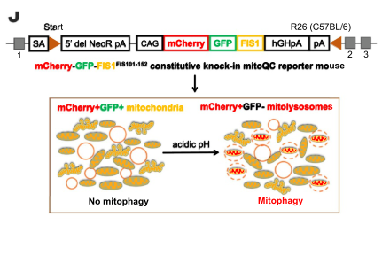

## Question

# Gene Research for Functional Annotation

## ⚠️ CRITICAL: Gene/Protein Identification Context

**BEFORE YOU BEGIN RESEARCH:** You MUST verify you are researching the CORRECT gene/protein. Gene symbols can be ambiguous, especially for less well-characterized genes from non-model organisms.

### Target Gene/Protein Identity (from UniProt):
- **UniProt Accession:** O55003
- **Protein Description:** RecName: Full=BCL2/adenovirus E1B 19 kDa protein-interacting protein 3 {ECO:0000305};
- **Gene Information:** Name=Bnip3 {ECO:0000312|MGI:MGI:109326}; Synonyms=Nip3;
- **Organism (full):** Mus musculus (Mouse).
- **Protein Family:** Belongs to the NIP3 family. .
- **Key Domains:** BNIP3. (IPR010548); BNIP3 (PF06553)

### MANDATORY VERIFICATION STEPS:

1. **Check if the gene symbol "Bnip3" matches the protein description above**
2. **Verify the organism is correct:** Mus musculus (Mouse).
3. **Check if protein family/domains align with what you find in literature**
4. **If you find literature for a DIFFERENT gene with the same or similar symbol, STOP**

### If Gene Symbol is Ambiguous or You Cannot Find Relevant Literature:

**DO NOT PROCEED WITH RESEARCH ON A DIFFERENT GENE.** Instead:
- State clearly: "The gene symbol 'Bnip3' is ambiguous or literature is limited for this specific protein"
- Explain what you found (e.g., "Found extensive literature on a different gene with the same symbol in a different organism")
- Describe the protein based ONLY on the UniProt information provided above
- Suggest that the protein function can be inferred from domain/family information

### Research Target:

Please provide a comprehensive research report on the gene **Bnip3** (gene ID: Bnip3, UniProt: O55003) in mouse.

The research report should be a detailed narrative explaining the function, biological processes, and localization of the gene product. Citations should be given for all claims.

You should prioritize authoritative reviews and primary scientific literature when conducting research. You can supplement
this with annotations you find in gene/protein databases, but these can be outdated or inaccurate.

We are specifically interested in the primary function of the gene - for enzymes, what reaction is catalyzed, and what is the substrate specificity? For transporters, what is the substrate? For structural proteins or adapters, what is the broader structural role? For signaling molecules, what is the role in the pathway.

We are interested in where in or outside the cell the gene product carries out its function.

We are also interested in the signaling or biochemical pathways in which the gene functions. We are less interested in broad pleiotropic effects, except where these elucidate the precise role.

Include evidence where possible. We are interested in both experimental evidence as well as inference from structure, evolution, or bioinformatic analysis. Precise studies should be prioritized over high-throughput, where available.

## Output

Question: You are an expert researcher providing comprehensive, well-cited information.

Provide detailed information focusing on:
1. Key concepts and definitions with current understanding
2. Recent developments and latest research (prioritize 2023-2024 sources)
3. Current applications and real-world implementations
4. Expert opinions and analysis from authoritative sources
5. Relevant statistics and data from recent studies

Format as a comprehensive research report with proper citations. Include URLs and publication dates where available.
Always prioritize recent, authoritative sources and provide specific citations for all major claims.

# Gene Research for Functional Annotation

## ⚠️ CRITICAL: Gene/Protein Identification Context

**BEFORE YOU BEGIN RESEARCH:** You MUST verify you are researching the CORRECT gene/protein. Gene symbols can be ambiguous, especially for less well-characterized genes from non-model organisms.

### Target Gene/Protein Identity (from UniProt):
- **UniProt Accession:** O55003
- **Protein Description:** RecName: Full=BCL2/adenovirus E1B 19 kDa protein-interacting protein 3 {ECO:0000305};
- **Gene Information:** Name=Bnip3 {ECO:0000312|MGI:MGI:109326}; Synonyms=Nip3;
- **Organism (full):** Mus musculus (Mouse).
- **Protein Family:** Belongs to the NIP3 family. .
- **Key Domains:** BNIP3. (IPR010548); BNIP3 (PF06553)

### MANDATORY VERIFICATION STEPS:

1. **Check if the gene symbol "Bnip3" matches the protein description above**
2. **Verify the organism is correct:** Mus musculus (Mouse).
3. **Check if protein family/domains align with what you find in literature**
4. **If you find literature for a DIFFERENT gene with the same or similar symbol, STOP**

### If Gene Symbol is Ambiguous or You Cannot Find Relevant Literature:

**DO NOT PROCEED WITH RESEARCH ON A DIFFERENT GENE.** Instead:
- State clearly: "The gene symbol 'Bnip3' is ambiguous or literature is limited for this specific protein"
- Explain what you found (e.g., "Found extensive literature on a different gene with the same symbol in a different organism")
- Describe the protein based ONLY on the UniProt information provided above
- Suggest that the protein function can be inferred from domain/family information

### Research Target:

Please provide a comprehensive research report on the gene **Bnip3** (gene ID: Bnip3, UniProt: O55003) in mouse.

The research report should be a detailed narrative explaining the function, biological processes, and localization of the gene product. Citations should be given for all claims.

You should prioritize authoritative reviews and primary scientific literature when conducting research. You can supplement
this with annotations you find in gene/protein databases, but these can be outdated or inaccurate.

We are specifically interested in the primary function of the gene - for enzymes, what reaction is catalyzed, and what is the substrate specificity? For transporters, what is the substrate? For structural proteins or adapters, what is the broader structural role? For signaling molecules, what is the role in the pathway.

We are interested in where in or outside the cell the gene product carries out its function.

We are also interested in the signaling or biochemical pathways in which the gene functions. We are less interested in broad pleiotropic effects, except where these elucidate the precise role.

Include evidence where possible. We are interested in both experimental evidence as well as inference from structure, evolution, or bioinformatic analysis. Precise studies should be prioritized over high-throughput, where available.

# Mouse *Bnip3* (UniProt O55003): functional annotation and research report

## Identity and principal function

**Identity check.** The specified accession [UniProt O55003](https://www.uniprot.org/uniprotkb/O55003/entry) identifies *Mus musculus Bnip3*, also called *Nip3*: BCL2/adenovirus E1B 19-kDa protein-interacting protein 3, a NIP3-family protein carrying the BNIP3 domain (InterPro IPR010548; Pfam PF06553). This is **not** *Bnip3l/Nix*, a related but distinct gene. Primary research explicitly examines BNIP3 and NIX as separate receptors. (nguyen‐dien2023fbxl4suppressesmitophagy pages 1-2, zhu2013modulationofserines pages 1-2)

**Primary molecular role.** BNIP3 is a stress-responsive **mitochondrial-autophagy receptor**. It is not an enzyme or a metabolite transporter: its relevant molecular activity is to connect a mitochondrion to the autophagic isolation membrane. A C-terminal membrane-spanning segment anchors BNIP3 in the **outer mitochondrial membrane**, with its N-terminal interaction region exposed to the cytosol. There, an LC3-interacting region (LIR) engages membrane-associated ATG8-family proteins, recruiting or tethering autophagic membrane to mitochondrial cargo for eventual lysosomal degradation. The resulting process, *mitophagy*, controls mitochondrial quantity and quality. This mechanistic assignment is supported both by interaction studies and by mouse-tissue loss-of-function experiments. (poole2021posttranslationalcontrolof pages 34-39, delgado2023theermembrane pages 1-2, madhu2023themitophagyreceptor pages 2-4, zhu2013modulationofserines pages 1-2)

The BNIP3/NIP3-family identity is consistent with its atypical BCL2-homology region and C-terminal tail anchor. Importantly, the family designation does **not** imply that all BNIP3 activity is apoptotic: receptor-mediated mitochondrial clearance and promotion of mitochondrial cell death are experimentally separable, context-dependent outputs. (nguyen‐dien2023fbxl4suppressesmitophagy pages 1-2, kubli2007bnip3mediatesmitochondrial pages 1-2, zhu2013modulationofserines pages 1-2)

## Localization and molecular mechanism

BNIP3 carries out its direct cargo-recognition function **at the cytosolic face of the mitochondrial outer membrane**, where its tail anchor retains it on the organelle and its exposed LIR can contact LC3-family proteins on an approaching isolation membrane. Hypoxia-dependent recruitment of BNIP3 to mitochondria has been observed in nucleus-pulposus cells; the downstream mitochondrial material is ultimately delivered to lysosomes rather than secreted outside the cell. The transmembrane segment also supports BNIP3 homodimerization, although whether that dimer is necessary for mitophagy under *all* physiological conditions remains unsettled. (poole2021posttranslationalcontrolof pages 34-39, delgado2023theermembrane pages 1-2, delgado2023theermembrane pages 13-14, madhu2020hypoxicregulationof pages 1-2)

At the molecular level, the characterized LIR contains a **WVEL** motif. In a mechanistic study using a cloned **human** BNIP3 sequence and cultured cells, changing serines **17 and 24** flanking this motif to mimic phosphorylation strengthened binding to **LC3B and GATE-16**, increased mitochondrial sequestration and lysosomal delivery, and reduced subsequent cytochrome-*c* release. This establishes how receptor activity can favor survival, but the exact phosphosite experiments should not be presented as direct measurements of the mouse O55003 protein in vivo. In hypoxia experiments reported in 2022, JNK1/2-dependent phosphorylation of BNIP3 **Ser60/Thr66** instead increased protein stability by limiting proteasomal turnover, thereby promoting LC3 association and mitophagy; these are distinct regulatory sites with a distinct proposed mechanism. (he2022bnip3phosphorylationby pages 11-12, zhu2013modulationofserines pages 2-3, zhu2013modulationofserines pages 1-2)

**Upstream and downstream pathway:** low oxygen → HIF1A/HIF-1α-dependent BNIP3 expression and, in some tissues, mitochondrial recruitment → LIR-dependent engagement of ATG8 proteins → mitochondrial enclosure by autophagic membrane → lysosomal degradation. BNIP3 abundance is also constrained independently of hypoxic transcription: the outer-membrane **SCF–FBXL4 ubiquitin-ligase complex** promotes constitutive BNIP3 turnover, while an **ER membrane protein complex (EMC)/endolysosomal** route supplies a second, largely autophagy-independent route for BNIP3 disposal. These proteostasis findings are principally from **human cultured cells**, so their extent in mouse tissues requires separate validation. BNIP3-associated mitophagy can cooperate with **DRP1-dependent fission and Parkin** in cardiomyocytes, but BNIP3 receptor activity should not be equated universally with Parkin dependence. (delgado2023theermembrane pages 1-2, nguyen‐dien2023fbxl4suppressesmitophagy pages 1-2, lee2011mitochondrialautophagyby pages 1-2, delgado2023theermembrane pages 13-14, nguyen‐dien2023fbxl4suppressesmitophagy pages 4-6, madhu2020hypoxicregulationof pages 1-2)

## Direct evidence in mouse systems and biological consequences

**Hypoxic intervertebral disc.** Mouse nucleus-pulposus cells provide unusually informative endogenous-tissue evidence. A 2020 study using **mitoQC reporter mice** observed mitophagy in the avascular, hypoxic disc and linked HIF1A signaling to BNIP3 mitochondrial recruitment. The follow-up 2023 study combined two *Bnip3*-targeting shRNAs, metabolic tracing and **Bnip3-knockout–mitoQC mice**. Loss of BNIP3 produced longer, more branched mitochondria, increased mitochondrial number, reduced glycolytic capacity and altered ATP-production rates; [1,2-¹³C]glucose tracing indicated an approximately **50–60% increase in pentose-cycle flux** relative to controls. Young knockout mice had decreased disc height and increased COL10A1 expression, although conventional histology had **not** yet shown pronounced structural degeneration. Thus the evidence supports early metabolic and cellular changes, not established severe disc disease. (madhu2023themitophagyreceptor pages 10-12, madhu2023themitophagyreceptor pages 2-4, madhu2023themitophagyreceptor pages 9-10, madhu2020hypoxicregulationof pages 1-2)

A particularly important qualification is that **total measured mitophagy increased, rather than decreased**, after BNIP3 loss in these disc cells: mitoQC-positive mitolysosomes were higher in knockout cells than controls (**Figure 2, p = 0.0368**). BNIP3L/NIX, FUNDC1 and BCL2L13 abundance did not obviously increase, and the authors could not assign this compensatory flux definitively to one replacement receptor. Consequently, “BNIP3 is a mitophagy receptor” does **not** mean that deleting it necessarily decreases *aggregate* mitophagy in every tissue. (madhu2023themitophagyreceptor pages 10-12, madhu2023themitophagyreceptor pages 2-4, madhu2023themitophagyreceptor media 0647c6f1)

**Kidney ischemia–reperfusion.** In contrast, *Bnip3*-knockout mice subjected to renal ischemia–reperfusion exhibited **less renal mitophagy**, accumulation of damaged mitochondria, more oxidative stress and cell death, and worse kidney injury. Silencing *Bnip3* in cultured renal tubular cells likewise reduced mitophagy after oxygen–glucose deprivation/reperfusion. These experiments support a protective mitochondrial-quality-control role in injured renal tubules; the differing disc result underscores tissue-specific compensation rather than a contradiction about BNIP3’s direct receptor activity. Quantitative renal-function effect sizes were not independently recoverable from the available source text. (poole2021posttranslationalcontrolof pages 39-44)

**Cardiac fission and cell fate.** In rodent cardiomyocytes, BNIP3 overexpression promoted mitochondrial **DRP1 recruitment, fission and autophagy**; inhibition of fission suppressed this autophagic response, and **Park2-deficient mouse myocytes** showed reduced BNIP3-induced autophagy. Blocking fission or autophagy increased death in BNIP3-expressing myocytes. Conversely, in mouse embryonic fibroblasts lacking both **Bax and Bak**, hypoxia or BNIP3 overexpression failed to cause the mitochondrial dysfunction and cell death observed in controls; restoring either effector restored susceptibility. BNIP3 can therefore support organelle clearance *or* engage a **BAX/BAK-dependent mitochondrial death branch**, depending on experimental context. Because several experiments used overexpression, they do not establish that death induction is BNIP3’s predominant normal physiological activity. (lee2011mitochondrialautophagyby pages 1-2, kubli2007bnip3mediatesmitochondrial pages 1-2)

**Skeletal muscle and an experimental intervention.** In a **2024** mouse C26 cancer-cachexia model, locally delivered adenoviral *Bnip3* shRNA lowered muscle BNIP3 and modestly improved muscle-fiber cross-sectional area. It **did not rescue whole-muscle mass**: tumor-bearing animals had tibialis-anterior weights of **38 ± 4 versus 37 ± 4 mg** (*p* = 0.9766), and gastrocnemius weights of **98 ± 9 versus 95 ± 10 mg** (*p* = 0.9415), for comparison groups reported in the study. These data establish an experimentally actionable pathway, **not** an effective treatment for human cachexia. (fornelli2024bnip3downregulationameliorates pages 1-2, fornelli2024bnip3downregulationameliorates pages 7-11, fornelli2024bnip3downregulationameliorates pages 5-7)

The following matrix summarizes the experimental setting and limits of inference.

| Mechanism or setting | Precise intervention or observation | Evidence limitation | Original paper |
|---|---|---|---|
| LIR-dependent mitophagy | In cloned **human BNIP3**, the N-terminal **WVEL** LC3-interacting region binds Atg8-family proteins. Phosphomimetic modification of flanking **Ser17/Ser24** increased LC3B and GATE-16 binding, mitochondrial sequestration, lysosomal delivery and degradation, reducing subsequent cytochrome-c release. (zhu2013modulationofserines pages 1-2, zhu2013modulationofserines pages 2-3) | Human BNIP3 construct and mainly human cell lines; supports the conserved receptor mechanism but is not direct evidence from mouse O55003. | [Zhu et al., 2013](https://doi.org/10.1074/jbc.M112.399345) |
| Bax/Bak-dependent mitochondrial injury | Wild-type and **Bax/Bak-double-knockout mouse embryonic fibroblasts** were exposed to hypoxia or BNIP3 overexpression. Double-knockout cells resisted membrane-potential loss and death; re-expression of either Bax or Bak restored susceptibility. BNIP3 knockdown also reduced Bax activation during simulated ischemia/reperfusion in mouse HL-1 myocytes. (kubli2007bnip3mediatesmitochondrial pages 1-2) | Establishes a stress-induced cell-death branch, not BNIP3’s basal or primary mitophagy-receptor activity; much evidence used overexpression or cultured cells. | [Kubli et al., 2007](https://doi.org/10.1042/BJ20070319) |
| Cardiac mitochondrial fission and Parkin recruitment | In adult rodent cardiomyocytes and mouse HL-1 cells, BNIP3 promoted **DRP1 translocation, mitochondrial fission and autophagy**. Dominant-negative DRP1, DRP1 inhibition or MFN1 blocked fission/autophagy; BNIP3-induced autophagy was reduced in **Park2-null mouse myocytes**, and inhibiting fission or autophagy increased BNIP3-associated death. (lee2011mitochondrialautophagyby pages 1-2) | Predominantly BNIP3 overexpression; demonstrates pathway cooperation rather than proving that endogenous mouse BNIP3 always requires Parkin. | [Lee et al., 2011](https://doi.org/10.1152/ajpheart.00368.2011) |
| Hypoxic nucleus-pulposus metabolism and compensatory mitophagy | Two Bnip3 shRNAs and **Bnip3-knockout–mitoQC mice** produced longer, more branched mitochondria and unexpectedly **increased mitolysosomes** versus wild type (**p=0.0368**). Knockdown redirected glucose metabolism, including an approximately **50–60% increase in pentose-cycle flux**, while reducing glycolytic capacity. (madhu2023themitophagyreceptor pages 2-4, madhu2023themitophagyreceptor pages 9-10, madhu2023themitophagyreceptor media 0647c6f1) | Tissue-specific paradox: overall mitophagy rose despite loss of this receptor, probably through compensatory receptors; BNIP3L, FUNDC1 and BCL2L13 abundance/localization did not clearly explain it. This should not be generalized to kidney or heart. | [Madhu et al., 2023](https://doi.org/10.1080/15548627.2022.2162245) |
| SCF–FBXL4 control of receptor abundance | In primarily **human U2OS cells**, FBXL4 or CUL1 depletion stabilized endogenous BNIP3; CRISPR FBXL4-deficient clones accumulated BNIP3 at mitochondria, whereas wild-type FBXL4 rescue restored its turnover. Experiments typically used **four replicates**, at least **50 cells per condition per replicate** and over **300 cells per condition**. BNIP3 and the distinct receptor **BNIP3L/NIX** were assessed separately. (nguyen‐dien2023fbxl4suppressesmitophagy pages 1-2, nguyen‐dien2023fbxl4suppressesmitophagy pages 4-6) | Mostly human-cell evidence and joint regulation of two paralogs; it does not establish an in-vivo mouse Bnip3 phenotype or permit attributing every effect solely to BNIP3. | [Nguyen-Dien et al., 2023](https://doi.org/10.15252/embj.2022112767) |
| EMC/endolysosomal control of BNIP3 turnover | In mainly **human MDA-MB-231 cells**, a genome-wide CRISPR screen linked the ER membrane protein complex to constitutive, autophagy-independent BNIP3 trafficking and degradation. Flow-cytometry conditions analyzed **>10,000 cells**, generally in three experiments. LIR disruption blocked mitophagy but not lysosomal delivery; disrupting the TMD GxxxG motif abolished SDS-resistant dimers without reducing overexpression-driven mitophagy. (delgado2023theermembrane pages 1-2, delgado2023theermembrane pages 13-14) | Human-cell/overexpression findings; authors caution that overexpression or other clustering mechanisms may bypass a dimer requirement. Thus, dimerization is not proven universally dispensable in endogenous mouse tissues. | [Delgado et al., online 2023; issue 2024](https://doi.org/10.1038/s44318-023-00006-z) |
| C26 cancer-cachexia skeletal muscle | Adenoviral shRNA lowered muscle BNIP3 in C26-bearing mice and modestly improved myofiber cross-sectional area, but did **not** rescue tibialis-anterior mass (**38±4 mg versus 37±4 mg; p=0.9766**) or gastrocnemius mass (**98±9 mg versus 95±10 mg; p=0.9415**). H₂O₂ and respiratory-complex levels were not significantly changed. (fornelli2024bnip3downregulationameliorates pages 5-7, fornelli2024bnip3downregulationameliorates pages 7-11) | Acute, local knockdown with **9–10 tumor-bearing mice per group**; partial fiber-size benefit did not translate into whole-muscle or body-mass recovery, so therapeutic efficacy remains preliminary. | [Fornelli et al., 2024](https://doi.org/10.3390/cancers16244133) |
| Renal ischemia–reperfusion | Global **Bnip3 knockout** reportedly reduced renal mitophagy and worsened ischemia–reperfusion injury, damaged-mitochondria accumulation, ROS, cell death and inflammation. | Available evidence did not expose verified numerical biomarker values; therefore no quantitative renal-function claim is made here. This tissue response differs from compensatory mitophagy in nucleus-pulposus cells. | [Tang et al., 2019](https://doi.org/10.1038/s41419-019-1899-0) |

*Table: Mechanistic and in-vivo evidence relevant to mouse Bnip3/UniProt O55003, with species and experimental limitations made explicit. BNIP3L/NIX findings are kept distinct from BNIP3.*

## Developments in 2023–2025 and interpretation

**Receptor abundance is actively regulated.** Nguyen-Dien and colleagues (**published online 10 May 2023**) showed that removing **FBXL4** or **CUL1** stabilized both BNIP3 and its separate paralog NIX, while restoring functional, mitochondrially localized FBXL4 lowered their abundance. Their principal CRISPR and rescue experiments used **human U2OS cells**. The work proposes that excessive receptor accumulation can drive inappropriate basal mitochondrial disposal; because both paralogs change, disease effects cannot automatically be assigned solely to BNIP3. (nguyen‐dien2023fbxl4suppressesmitophagy pages 1-2, nguyen‐dien2023fbxl4suppressesmitophagy pages 4-6)

Delgado and colleagues (**online 15 December 2023; 2024 journal issue**) found that BNIP3 can reach lysosomes by a predominantly **autophagy-independent, EMC-linked endolysosomal route**. Crucially, mutating its LIR disrupted BNIP3-driven mitophagy but **did not** abolish its own lysosomal delivery: disappearance of BNIP3 from a cell is therefore **not by itself proof of mitophagic flux**. In their mainly human-cell overexpression assays, disrupting a transmembrane dimerization motif did not suppress mitophagy, prompting a cautious revision of older assumptions that membrane-spanning dimerization is always required; the authors note that overexpression may bypass an endogenous requirement. (delgado2023theermembrane pages 13-14, delgado2023theermembrane pages 1-2)

More recent ultrastructural work (**2025**, included for mechanistic context rather than as 2023–2024 mouse evidence) used human HeLa double-knockout cells to show that BNIP3 and NIX help the isolation membrane **adhere tightly to and expand along mitochondria**; nascent membrane still formed when both receptors were absent. The double-knockout design establishes a **combined-receptor** mechanism and does not by itself prove that mouse BNIP3 alone is indispensable in every tissue. (yamashita2025themitophagyreceptors pages 1-2)

**Overall assessment.** The most defensible primary annotation for mouse O55003 is **an inducible outer-mitochondrial-membrane adaptor/receptor for selective autophagic removal of mitochondria**, with a separately demonstrated capacity to influence BAX/BAK-dependent mitochondrial injury. Its functional location is the **mitochondria–autophagic-membrane interface**; transcriptional induction, phosphorylation and protein turnover determine how much active receptor is available there. Disease-oriented uses remain chiefly **mouse models, cultured cells and proposed therapeutic strategies**: the benefits or harms of altering BNIP3 depend on tissue, stress intensity and compensatory mitophagy pathways. (delgado2023theermembrane pages 1-2, nguyen‐dien2023fbxl4suppressesmitophagy pages 1-2, kubli2007bnip3mediatesmitochondrial pages 1-2, madhu2023themitophagyreceptor pages 10-12, yamashita2025themitophagyreceptors pages 1-2, fornelli2024bnip3downregulationameliorates pages 5-7)

### Key primary publications and URLs

- Madhu *et al.*, **2023**, *Autophagy*, 19:1821–1843, mouse disc knockout and metabolic tracing: https://doi.org/10.1080/15548627.2022.2162245. (madhu2023themitophagyreceptor pages 1-2, madhu2023themitophagyreceptor pages 9-10)
- Nguyen-Dien *et al.*, **10 May 2023**, *EMBO Journal*, 42:e112767, FBXL4-dependent receptor turnover: https://doi.org/10.15252/embj.2022112767. (nguyen‐dien2023fbxl4suppressesmitophagy pages 1-2)
- Delgado *et al.*, **15 December 2023 online; 2024 issue**, *EMBO Journal*, 43:32–60, EMC/endolysosomal BNIP3 trafficking: https://doi.org/10.1038/s44318-023-00006-z. (delgado2023theermembrane pages 1-2)
- Fornelli *et al.*, **11 December 2024**, *Cancers*, 16:4133, mouse cachexia intervention: https://doi.org/10.3390/cancers16244133. (fornelli2024bnip3downregulationameliorates pages 1-2)
- Madhu *et al.*, **2020**, *Journal of Bone and Mineral Research*, 35:1504–1524, hypoxic HIF1A–BNIP3 signaling in nucleus pulposus: https://doi.org/10.1002/jbmr.4019. (madhu2020hypoxicregulationof pages 1-2)
- Zhu *et al.*, **11 January 2013**, *Journal of Biological Chemistry*, 288:1099–1113, LIR phosphorylation and LC3 binding, principally human BNIP3 constructs: https://doi.org/10.1074/jbc.M112.399345. (zhu2013modulationofserines pages 1-2)
- Lee *et al.*, **2011**, *American Journal of Physiology—Heart and Circulatory Physiology*, 301:H1924–H1931, cardiomyocyte fission/Parkin experiments: https://doi.org/10.1152/ajpheart.00368.2011. (lee2011mitochondrialautophagyby pages 1-2)
- Kubli *et al.*, **2007**, *Biochemical Journal*, 405:407–415, mouse-cell BAX/BAK-dependence: https://doi.org/10.1042/BJ20070319. (kubli2007bnip3mediatesmitochondrial pages 1-2)

References

1. (nguyen‐dien2023fbxl4suppressesmitophagy pages 1-2): Giang Thanh Nguyen‐Dien, Keri‐Lyn Kozul, Yi Cui, Brendan Townsend, Prajakta Gosavi Kulkarni, Soo Siang Ooi, Antonio Marzio, Nissa Carrodus, Steven Zuryn, Michele Pagano, Robert G Parton, Michael Lazarou, S Sean Millard, Robert W Taylor, Brett M Collins, Mathew JK Jones, and Julia K Pagan. <scp>fbxl4</scp> suppresses mitophagy by restricting the accumulation of <scp>nix</scp> and <scp>bnip3</scp> mitophagy receptors. The EMBO Journal, May 2023. URL: https://doi.org/10.15252/embj.2022112767, doi:10.15252/embj.2022112767. This article has 103 citations.

2. (zhu2013modulationofserines pages 1-2): Yanyan Zhu, Stefan Massen, Marco Terenzio, Verena Lang, Silu Chen-Lindner, Roland Eils, Ivana Novak, Ivan Dikic, Anne Hamacher-Brady, and Nathan R. Brady. Modulation of serines 17 and 24 in the lc3-interacting region of bnip3 determines pro-survival mitophagy versus apoptosis. Journal of Biological Chemistry, 288:1099-1113, Jan 2013. URL: https://doi.org/10.1074/jbc.m112.399345, doi:10.1074/jbc.m112.399345. This article has 583 citations and is from a domain leading peer-reviewed journal.

3. (poole2021posttranslationalcontrolof pages 34-39): Logan Patrick Poole. Post-translational control of bnip3 and mitophagy by ulk1 kinase. Text, Jan 2021. URL: https://doi.org/10.6082/uchicago.3408, doi:10.6082/uchicago.3408. This article has 0 citations and is from a peer-reviewed journal.

4. (delgado2023theermembrane pages 1-2): Jose M Delgado, Logan Wallace Shepard, Sarah W Lamson, Samantha L Liu, and Christopher J Shoemaker. The er membrane protein complex restricts mitophagy by controlling bnip3 turnover. The EMBO Journal, 43:32-60, Dec 2024. URL: https://doi.org/10.1038/s44318-023-00006-z, doi:10.1038/s44318-023-00006-z. This article has 34 citations.

5. (madhu2023themitophagyreceptor pages 2-4): Vedavathi Madhu, Miriam Hernandez-Meadows, Paige K Boneski, Yunping Qiu, Anyonya R Guntur, Irwin J. Kurland, Ruteja A Barve, and Makarand V. Risbud. The mitophagy receptor bnip3 is critical for the regulation of metabolic homeostasis and mitochondrial function in the nucleus pulposus cells of the intervertebral disc. Autophagy, 19:1821-1843, Jan 2023. URL: https://doi.org/10.1080/15548627.2022.2162245, doi:10.1080/15548627.2022.2162245. This article has 102 citations and is from a domain leading peer-reviewed journal.

6. (kubli2007bnip3mediatesmitochondrial pages 1-2): Dieter A. Kubli, John E. Ycaza, and Åsa B. Gustafsson. Bnip3 mediates mitochondrial dysfunction and cell death through bax and bak. The Biochemical journal, 405 3:407-15, Aug 2007. URL: https://doi.org/10.1042/bj20070319, doi:10.1042/bj20070319. This article has 280 citations.

7. (delgado2023theermembrane pages 13-14): Jose M Delgado, Logan Wallace Shepard, Sarah W Lamson, Samantha L Liu, and Christopher J Shoemaker. The er membrane protein complex restricts mitophagy by controlling bnip3 turnover. The EMBO Journal, 43:32-60, Dec 2024. URL: https://doi.org/10.1038/s44318-023-00006-z, doi:10.1038/s44318-023-00006-z. This article has 34 citations.

8. (madhu2020hypoxicregulationof pages 1-2): Vedavathi Madhu, Paige K Boneski, Elizabeth Silagi, Yunping Qiu, Irwin Kurland, Anyonya R Guntur, Irving M Shapiro, and Makarand V Risbud. Hypoxic regulation of mitochondrial metabolism and mitophagy in nucleus pulposus cells is dependent on hif‐1α–bnip3 axis. Journal of Bone and Mineral Research, 35:1504-1524, Apr 2020. URL: https://doi.org/10.1002/jbmr.4019, doi:10.1002/jbmr.4019. This article has 165 citations and is from a highest quality peer-reviewed journal.

9. (he2022bnip3phosphorylationby pages 11-12): Yun-Ling He, Sheng-Hui Gong, Xiang Cheng, Ming Zhao, Tong Zhao, Yong-Qi Zhao, Ming Fan, Ling-Ling Zhu, and Li-Ying Wu. Bnip3 phosphorylation by jnk1/2 promotes mitophagy via enhancing its stability under hypoxia. Cell Death & Disease, Aug 2022. URL: https://doi.org/10.1038/s41419-022-05418-z, doi:10.1038/s41419-022-05418-z. This article has 120 citations and is from a peer-reviewed journal.

10. (zhu2013modulationofserines pages 2-3): Yanyan Zhu, Stefan Massen, Marco Terenzio, Verena Lang, Silu Chen-Lindner, Roland Eils, Ivana Novak, Ivan Dikic, Anne Hamacher-Brady, and Nathan R. Brady. Modulation of serines 17 and 24 in the lc3-interacting region of bnip3 determines pro-survival mitophagy versus apoptosis. Journal of Biological Chemistry, 288:1099-1113, Jan 2013. URL: https://doi.org/10.1074/jbc.m112.399345, doi:10.1074/jbc.m112.399345. This article has 583 citations and is from a domain leading peer-reviewed journal.

11. (lee2011mitochondrialautophagyby pages 1-2): Youngil Lee, Hwa-Youn Lee, Rita A. Hanna, and Åsa B. Gustafsson. Mitochondrial autophagy by bnip3 involves drp1-mediated mitochondrial fission and recruitment of parkin in cardiac myocytes. American journal of physiology. Heart and circulatory physiology, 301 5:H1924-31, Nov 2011. URL: https://doi.org/10.1152/ajpheart.00368.2011, doi:10.1152/ajpheart.00368.2011. This article has 475 citations.

12. (nguyen‐dien2023fbxl4suppressesmitophagy pages 4-6): Giang Thanh Nguyen‐Dien, Keri‐Lyn Kozul, Yi Cui, Brendan Townsend, Prajakta Gosavi Kulkarni, Soo Siang Ooi, Antonio Marzio, Nissa Carrodus, Steven Zuryn, Michele Pagano, Robert G Parton, Michael Lazarou, S Sean Millard, Robert W Taylor, Brett M Collins, Mathew JK Jones, and Julia K Pagan. <scp>fbxl4</scp> suppresses mitophagy by restricting the accumulation of <scp>nix</scp> and <scp>bnip3</scp> mitophagy receptors. The EMBO Journal, May 2023. URL: https://doi.org/10.15252/embj.2022112767, doi:10.15252/embj.2022112767. This article has 103 citations.

13. (madhu2023themitophagyreceptor pages 10-12): Vedavathi Madhu, Miriam Hernandez-Meadows, Paige K Boneski, Yunping Qiu, Anyonya R Guntur, Irwin J. Kurland, Ruteja A Barve, and Makarand V. Risbud. The mitophagy receptor bnip3 is critical for the regulation of metabolic homeostasis and mitochondrial function in the nucleus pulposus cells of the intervertebral disc. Autophagy, 19:1821-1843, Jan 2023. URL: https://doi.org/10.1080/15548627.2022.2162245, doi:10.1080/15548627.2022.2162245. This article has 102 citations and is from a domain leading peer-reviewed journal.

14. (madhu2023themitophagyreceptor pages 9-10): Vedavathi Madhu, Miriam Hernandez-Meadows, Paige K Boneski, Yunping Qiu, Anyonya R Guntur, Irwin J. Kurland, Ruteja A Barve, and Makarand V. Risbud. The mitophagy receptor bnip3 is critical for the regulation of metabolic homeostasis and mitochondrial function in the nucleus pulposus cells of the intervertebral disc. Autophagy, 19:1821-1843, Jan 2023. URL: https://doi.org/10.1080/15548627.2022.2162245, doi:10.1080/15548627.2022.2162245. This article has 102 citations and is from a domain leading peer-reviewed journal.

15. (madhu2023themitophagyreceptor media 0647c6f1): Vedavathi Madhu, Miriam Hernandez-Meadows, Paige K Boneski, Yunping Qiu, Anyonya R Guntur, Irwin J. Kurland, Ruteja A Barve, and Makarand V. Risbud. The mitophagy receptor bnip3 is critical for the regulation of metabolic homeostasis and mitochondrial function in the nucleus pulposus cells of the intervertebral disc. Autophagy, 19:1821-1843, Jan 2023. URL: https://doi.org/10.1080/15548627.2022.2162245, doi:10.1080/15548627.2022.2162245. This article has 102 citations and is from a domain leading peer-reviewed journal.

16. (poole2021posttranslationalcontrolof pages 39-44): Logan Patrick Poole. Post-translational control of bnip3 and mitophagy by ulk1 kinase. Text, Jan 2021. URL: https://doi.org/10.6082/uchicago.3408, doi:10.6082/uchicago.3408. This article has 0 citations and is from a peer-reviewed journal.

17. (fornelli2024bnip3downregulationameliorates pages 1-2): Claudia Fornelli, Marc Beltrà, Antonio Zorzano, Paola Costelli, David Sebastian, and Fabio Penna. Bnip3 downregulation ameliorates muscle atrophy in cancer cachexia. Cancers, 16:4133, Dec 2024. URL: https://doi.org/10.3390/cancers16244133, doi:10.3390/cancers16244133. This article has 15 citations.

18. (fornelli2024bnip3downregulationameliorates pages 7-11): Claudia Fornelli, Marc Beltrà, Antonio Zorzano, Paola Costelli, David Sebastian, and Fabio Penna. Bnip3 downregulation ameliorates muscle atrophy in cancer cachexia. Cancers, 16:4133, Dec 2024. URL: https://doi.org/10.3390/cancers16244133, doi:10.3390/cancers16244133. This article has 15 citations.

19. (fornelli2024bnip3downregulationameliorates pages 5-7): Claudia Fornelli, Marc Beltrà, Antonio Zorzano, Paola Costelli, David Sebastian, and Fabio Penna. Bnip3 downregulation ameliorates muscle atrophy in cancer cachexia. Cancers, 16:4133, Dec 2024. URL: https://doi.org/10.3390/cancers16244133, doi:10.3390/cancers16244133. This article has 15 citations.

20. (yamashita2025themitophagyreceptors pages 1-2): Shun-ichi Yamashita, Ritsuko Arai, Hiroshi Hada, Benjamin Scott Padman, Michael Lazarou, David C. Chan, Tomotake Kanki, and Satoshi Waguri. The mitophagy receptors bnip3 and nix mediate tight attachment and expansion of the isolation membrane to mitochondria. The Journal of Cell Biology, May 2025. URL: https://doi.org/10.1083/jcb.202408166, doi:10.1083/jcb.202408166. This article has 22 citations.

21. (madhu2023themitophagyreceptor pages 1-2): Vedavathi Madhu, Miriam Hernandez-Meadows, Paige K Boneski, Yunping Qiu, Anyonya R Guntur, Irwin J. Kurland, Ruteja A Barve, and Makarand V. Risbud. The mitophagy receptor bnip3 is critical for the regulation of metabolic homeostasis and mitochondrial function in the nucleus pulposus cells of the intervertebral disc. Autophagy, 19:1821-1843, Jan 2023. URL: https://doi.org/10.1080/15548627.2022.2162245, doi:10.1080/15548627.2022.2162245. This article has 102 citations and is from a domain leading peer-reviewed journal.

## Artifacts

- [Edison artifact artifact-00](Bnip3-deep-research-falcon_artifacts/artifact-00.md)

## Citations

1. poole2021posttranslationalcontrolof pages 39-44
2. lee2011mitochondrialautophagyby pages 1-2
3. yamashita2025themitophagyreceptors pages 1-2
4. delgado2023theermembrane pages 1-2
5. madhu2020hypoxicregulationof pages 1-2
6. zhu2013modulationofserines pages 1-2
7. poole2021posttranslationalcontrolof pages 34-39
8. madhu2023themitophagyreceptor pages 2-4
9. delgado2023theermembrane pages 13-14
10. zhu2013modulationofserines pages 2-3
11. madhu2023themitophagyreceptor pages 10-12
12. madhu2023themitophagyreceptor pages 9-10
13. madhu2023themitophagyreceptor pages 1-2
14. UniProt O55003
15. 1,2-¹³C
16. Zhu et al., 2013
17. Kubli et al., 2007
18. Lee et al., 2011
19. Madhu et al., 2023
20. Nguyen-Dien et al., 2023
21. Delgado et al., online 2023; issue 2024
22. Fornelli et al., 2024
23. Tang et al., 2019
24. https://www.uniprot.org/uniprotkb/O55003/entry
25. https://doi.org/10.1074/jbc.M112.399345
26. https://doi.org/10.1042/BJ20070319
27. https://doi.org/10.1152/ajpheart.00368.2011
28. https://doi.org/10.1080/15548627.2022.2162245
29. https://doi.org/10.15252/embj.2022112767
30. https://doi.org/10.1038/s44318-023-00006-z
31. https://doi.org/10.3390/cancers16244133
32. https://doi.org/10.1038/s41419-019-1899-0
33. https://doi.org/10.1080/15548627.2022.2162245.
34. https://doi.org/10.15252/embj.2022112767.
35. https://doi.org/10.1038/s44318-023-00006-z.
36. https://doi.org/10.3390/cancers16244133.
37. https://doi.org/10.1002/jbmr.4019.
38. https://doi.org/10.1074/jbc.M112.399345.
39. https://doi.org/10.1152/ajpheart.00368.2011.
40. https://doi.org/10.1042/BJ20070319.
41. https://doi.org/10.15252/embj.2022112767,
42. https://doi.org/10.1074/jbc.m112.399345,
43. https://doi.org/10.6082/uchicago.3408,
44. https://doi.org/10.1038/s44318-023-00006-z,
45. https://doi.org/10.1080/15548627.2022.2162245,
46. https://doi.org/10.1042/bj20070319,
47. https://doi.org/10.1002/jbmr.4019,
48. https://doi.org/10.1038/s41419-022-05418-z,
49. https://doi.org/10.1152/ajpheart.00368.2011,
50. https://doi.org/10.3390/cancers16244133,
51. https://doi.org/10.1083/jcb.202408166,