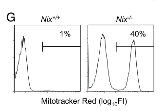

## Question

# Gene Research for Functional Annotation

## ⚠️ CRITICAL: Gene/Protein Identification Context

**BEFORE YOU BEGIN RESEARCH:** You MUST verify you are researching the CORRECT gene/protein. Gene symbols can be ambiguous, especially for less well-characterized genes from non-model organisms.

### Target Gene/Protein Identity (from UniProt):
- **UniProt Accession:** Q9Z2F7
- **Protein Description:** RecName: Full=BCL2/adenovirus E1B 19 kDa protein-interacting protein 3-like; AltName: Full=NIP3-like protein X; Short=NIP3L;
- **Gene Information:** Name=Bnip3l; Synonyms=Nix;
- **Organism (full):** Mus musculus (Mouse).
- **Protein Family:** Belongs to the NIP3 family. .
- **Key Domains:** BNIP3. (IPR010548); BNIP3 (PF06553)

### MANDATORY VERIFICATION STEPS:

1. **Check if the gene symbol "Bnip3l" matches the protein description above**
2. **Verify the organism is correct:** Mus musculus (Mouse).
3. **Check if protein family/domains align with what you find in literature**
4. **If you find literature for a DIFFERENT gene with the same or similar symbol, STOP**

### If Gene Symbol is Ambiguous or You Cannot Find Relevant Literature:

**DO NOT PROCEED WITH RESEARCH ON A DIFFERENT GENE.** Instead:
- State clearly: "The gene symbol 'Bnip3l' is ambiguous or literature is limited for this specific protein"
- Explain what you found (e.g., "Found extensive literature on a different gene with the same symbol in a different organism")
- Describe the protein based ONLY on the UniProt information provided above
- Suggest that the protein function can be inferred from domain/family information

### Research Target:

Please provide a comprehensive research report on the gene **Bnip3l** (gene ID: Bnip3l, UniProt: Q9Z2F7) in mouse.

The research report should be a detailed narrative explaining the function, biological processes, and localization of the gene product. Citations should be given for all claims.

You should prioritize authoritative reviews and primary scientific literature when conducting research. You can supplement
this with annotations you find in gene/protein databases, but these can be outdated or inaccurate.

We are specifically interested in the primary function of the gene - for enzymes, what reaction is catalyzed, and what is the substrate specificity? For transporters, what is the substrate? For structural proteins or adapters, what is the broader structural role? For signaling molecules, what is the role in the pathway.

We are interested in where in or outside the cell the gene product carries out its function.

We are also interested in the signaling or biochemical pathways in which the gene functions. We are less interested in broad pleiotropic effects, except where these elucidate the precise role.

Include evidence where possible. We are interested in both experimental evidence as well as inference from structure, evolution, or bioinformatic analysis. Precise studies should be prioritized over high-throughput, where available.

## Output

Question: You are an expert researcher providing comprehensive, well-cited information.

Provide detailed information focusing on:
1. Key concepts and definitions with current understanding
2. Recent developments and latest research (prioritize 2023-2024 sources)
3. Current applications and real-world implementations
4. Expert opinions and analysis from authoritative sources
5. Relevant statistics and data from recent studies

Format as a comprehensive research report with proper citations. Include URLs and publication dates where available.
Always prioritize recent, authoritative sources and provide specific citations for all major claims.

# Gene Research for Functional Annotation

## ⚠️ CRITICAL: Gene/Protein Identification Context

**BEFORE YOU BEGIN RESEARCH:** You MUST verify you are researching the CORRECT gene/protein. Gene symbols can be ambiguous, especially for less well-characterized genes from non-model organisms.

### Target Gene/Protein Identity (from UniProt):
- **UniProt Accession:** Q9Z2F7
- **Protein Description:** RecName: Full=BCL2/adenovirus E1B 19 kDa protein-interacting protein 3-like; AltName: Full=NIP3-like protein X; Short=NIP3L;
- **Gene Information:** Name=Bnip3l; Synonyms=Nix;
- **Organism (full):** Mus musculus (Mouse).
- **Protein Family:** Belongs to the NIP3 family. .
- **Key Domains:** BNIP3. (IPR010548); BNIP3 (PF06553)

### MANDATORY VERIFICATION STEPS:

1. **Check if the gene symbol "Bnip3l" matches the protein description above**
2. **Verify the organism is correct:** Mus musculus (Mouse).
3. **Check if protein family/domains align with what you find in literature**
4. **If you find literature for a DIFFERENT gene with the same or similar symbol, STOP**

### If Gene Symbol is Ambiguous or You Cannot Find Relevant Literature:

**DO NOT PROCEED WITH RESEARCH ON A DIFFERENT GENE.** Instead:
- State clearly: "The gene symbol 'Bnip3l' is ambiguous or literature is limited for this specific protein"
- Explain what you found (e.g., "Found extensive literature on a different gene with the same symbol in a different organism")
- Describe the protein based ONLY on the UniProt information provided above
- Suggest that the protein function can be inferred from domain/family information

### Research Target:

Please provide a comprehensive research report on the gene **Bnip3l** (gene ID: Bnip3l, UniProt: Q9Z2F7) in mouse.

The research report should be a detailed narrative explaining the function, biological processes, and localization of the gene product. Citations should be given for all claims.

You should prioritize authoritative reviews and primary scientific literature when conducting research. You can supplement
this with annotations you find in gene/protein databases, but these can be outdated or inaccurate.

We are specifically interested in the primary function of the gene - for enzymes, what reaction is catalyzed, and what is the substrate specificity? For transporters, what is the substrate? For structural proteins or adapters, what is the broader structural role? For signaling molecules, what is the role in the pathway.

We are interested in where in or outside the cell the gene product carries out its function.

We are also interested in the signaling or biochemical pathways in which the gene functions. We are less interested in broad pleiotropic effects, except where these elucidate the precise role.

Include evidence where possible. We are interested in both experimental evidence as well as inference from structure, evolution, or bioinformatic analysis. Precise studies should be prioritized over high-throughput, where available.

# Functional annotation of mouse *Bnip3l* (NIX)

**Identity and principal conclusion.** The target is the *Mus musculus Bnip3l* gene product, NIX/BNIP3L, corresponding to the supplied UniProt accession [Q9Z2F7](https://www.uniprot.org/uniprotkb/Q9Z2F7/entry). Mouse knockout studies explicitly identify NIX as BNIP3L; **BNIP3, encoded by *Bnip3*, is a related but different protein**, and its experimental phenotypes should not be assigned to *Bnip3l*. The supplied NIP3-family annotation and BNIP3-family domains are consistent with the conserved architecture described for the two paralogs. The best-supported primary function of NIX is as a **membrane-anchored selective-autophagy receptor**: it links mitochondria—and, in particular settings, peroxisomes—to machinery that encloses them in autophagosomes for lysosomal degradation. It is not an enzyme with a catalyzed reaction or a transporter with a molecular substrate. Its relevant *cargo* is the organelle, especially the mitochondrion during mouse reticulocyte maturation. (schweers2007nixisrequired pages 1-2, niemi2024coordinatingbnip3nixmediatedmitophagy pages 1-3, wilhelm2022bnip3lnixregulatesboth pages 1-2)

## Molecular function and site of action

NIX acts principally at the **outer mitochondrial membrane**. A single C-terminal transmembrane segment anchors it there and exposes most of the protein to the cytosol, where it can contact developing autophagic membranes. Its amino-terminal LC3-interacting region (**LIR**) binds ATG8-family proteins, including LC3 and GABARAP proteins. An atypical BH3-like region places NIX in the BNIP3-related BCL2 protein family, but this structural relationship does **not** mean that canonical apoptosis is required for its reticulocyte-clearance function. NIX can associate with the endoplasmic/sarcoplasmic reticulum (ER/SR), and independent targeting to peroxisomes has also been demonstrated; localization and biological output therefore depend on cell type and conditions. (nguyen‐dien2023fbxl4suppressesmitophagy pages 1-2, niemi2024coordinatingbnip3nixmediatedmitophagy pages 1-3, schweers2007nixisrequired pages 3-4, diwan2009endoplasmicreticulummitochondriacrosstalk pages 1-2, wilhelm2022bnip3lnixregulatesboth pages 9-10)

The strongest direct evidence for receptor activity comes from Novak *et al.* (*EMBO Reports*, **2010**; [DOI](https://doi.org/10.1038/embor.2009.256)). Their binding and reconstitution experiments identified a mouse NIX LIR centered on **Trp35/Leu38**: W35A markedly impaired ATG8 binding and recruitment, and restored mitochondrial clearance in *Nix*-null reticulocytes less effectively than wild-type NIX. The tested Trp35-containing segment bound LC3A more strongly than LC3B—reported dissociation constants of approximately **28 versus 91 µM**, respectively. W35A did not abolish clearance, so direct ATG8 binding is important but cannot by itself explain every NIX activity. Residue numbering should not automatically be transferred between mouse and human constructs; a subsequent human-cell pexophagy study, for example, describes its LIR mutant as W36A/L39A. (novak2010nixisa pages 5-6, novak2010nixisa pages 6-7, novak2010nixisa pages 4-5, wilhelm2022bnip3lnixregulatesboth pages 9-10)

A major mechanistic refinement came from Bunker *et al.* (*EMBO Journal*, published online **25 August 2023**; [DOI](https://doi.org/10.15252/embj.2023113491)). In engineered cultured-cell assays, a NIX **minimal essential region (MER)** recruited the autophagy effector **WIPI2** to mitochondria, while the LIR helped organize mitochondrial WIPI2 into puncta. A NIX1–87 construct containing both regions bound WIPI2 and retained activity; NIX1–70, lacking the MER, did not. Mutation of LIR residues left roughly half the measured mitophagy activity, whereas removing the region extending into the MER nearly abolished it. Thus, NIX is more precisely annotated as a receptor that **recruits and organizes autophagosome-biogenesis factors**, not merely a passive LC3 tether. These construct-level findings came principally from engineered cultured cells, including human ATG8-deficient cells, rather than direct tests of every residue in mouse Q9Z2F7. (bunker2023nixinteractswith pages 1-2, bunker2023nixinteractswith pages 4-5)

## Established biological process: erythroid mitochondrial clearance

The clearest in-vivo function is **programmed mitophagy during terminal erythroid differentiation**. Reticulocytes must remove their mitochondria as they become mature red cells. In mouse *Nix/Bnip3l* knockouts, mitochondria persisted despite ongoing erythroid autophagy: LC3 lipidation and autophagic structures still appeared, but mitochondrial entry into, and maturation of, autophagic compartments were impaired. Some knockout erythrocytes lost ribosomes yet retained mitochondria, demonstrating a selective organelle-clearance defect rather than a general failure of maturation. Bone-marrow transplantation showed that the principal erythroid defect resides within the hematopoietic compartment. Schweers *et al.* (*PNAS*, **4 December 2007**; [DOI](https://doi.org/10.1073/pnas.0708818104)) reported that **approximately half of circulating knockout erythrocytes contained mitochondria**; their representative flow-cytometry panel shows **40% in knockout versus 1% in wild type**, figures that should not be mistaken for cohort means. Knockout mice also had anemia and reticulocytosis. (schweers2007nixisrequired pages 1-2, schweers2007nixisrequired pages 3-4, schweers2007nixisrequired pages 2-3, schweers2007nixisrequired media 24653872)

Sandoval *et al.* (*Nature*, **2008**; [DOI](https://doi.org/10.1038/nature07006)) independently observed anemia, mitochondrial retention and reduced erythrocyte survival in *Nix*-null mice. Mitochondrial membrane potential normally declined during maturation but was retained in knockout reticulocytes; experimentally dissipating it restored mitochondrial sequestration. These results support a role for depolarization in targeting mitochondria, **without establishing that depolarization is NIX’s only direct action**. Indeed, LIR-mutant rescue experiments support direct autophagic recruitment, while intact general autophagy and normal clearance in BAX/BAK-deficient reticulocytes argue against obligatory canonical apoptosis. The relative contributions of depolarization, membrane tethering and other clearance routes remain context-dependent. (sandoval2008essentialrolefor pages 2-4, zhang2008nixinducesmitochondrial pages 2-3, novak2010nixisa pages 4-5, schweers2007nixisrequired pages 3-4)

The following table separates genetic evidence in mice from mechanisms characterized mainly in cultured cells.

| Experimental context and source/date/DOI URL | Precise NIX-specific result | Interpretation / evidence limitation |
|---|---|---|
| **Mouse reticulocytes** — Schweers et al., 4 Dec 2007, *PNAS*. [DOI](https://doi.org/10.1073/pnas.0708818104) | About half of circulating *Nix*−/− erythrocytes retained mitochondria; the representative MitoTracker flow plot showed 40% in knockout versus 1% in WT. Knockout cells formed LC3-positive autophagic structures but were defective in mitochondrial incorporation and autophagosome maturation; bone-marrow transplantation localized the defect to the hematopoietic compartment. (schweers2007nixisrequired pages 3-4, schweers2007nixisrequired pages 2-3) | Strong loss-of-function evidence that NIX is required for programmed mitochondrial clearance, not for general autophagy induction. The 40% versus 1% values are from a representative plot, not cohort means. Canonical BAX/BAK-dependent apoptosis and mitochondrial-permeability-transition pathways were dispensable. |
| **Mouse reticulocyte rescue and biochemical binding** — Novak et al., Jan 2010, *EMBO Reports*. [DOI](https://doi.org/10.1038/embor.2009.256) | NIX contains an N-terminal LIR centered on Trp35 and Leu38. W35A markedly impaired LC3/GABARAP binding and recruitment and was less effective than WT NIX at restoring mitochondrial clearance in *Nix*−/− reticulocytes. Measured affinities for the W35-containing region were approximately 28 μM for LC3A and 91 μM for LC3B. (novak2010nixisa pages 5-6, novak2010nixisa pages 4-5, novak2010nixisa pages 1-2) | Establishes NIX as a direct selective-autophagy receptor linking mitochondria to ATG8-family proteins. Rescue was incomplete rather than abolished, indicating that the LIR is important but not the sole functional element. |
| **Mouse lens-fiber differentiation** — Brennan et al., 3 Jun 2018, *Experimental Eye Research*. [DOI](https://doi.org/10.1016/j.exer.2018.06.003) | *Bnip3l* deletion caused retention of mitochondria, endoplasmic reticulum and Golgi apparatus during formation of the lens organelle-free zone, but did not cause nuclear retention. In WT newborn lenses, BNIP3L localized with ER and Golgi markers. (brennan2018bnip3lnixisrequired pages 1-3) | In-vivo deletion supports a broader developmental organelle-clearance role beyond mitophagy. Localization and retention do not by themselves establish that NIX directly acts as an ER-phagy or Golgiphagy receptor. |
| **Mouse cerebral ischemia–reperfusion** — Yuan et al., Aug 2017, *Autophagy*. [DOI](https://doi.org/10.1080/15548627.2017.1357792) | *Bnip3l* deletion impaired ischemia-induced mitophagy and aggravated brain injury. NIX expression rescued mitophagy and protection in *Park2*−/− mice, whereas the non-phosphorylatable S81A NIX mutant failed to rescue *Bnip3l*−/− mice. Combined *Bnip3l/Park2* loss caused a stronger defect. (yuan2017bnip3lnixmediatedmitophagyprotects pages 1-5) | Supports a Ser81-dependent, PARK2-independent receptor pathway in this mouse injury model. It does not establish that Ser81 controls every physiological NIX function or identify the responsible kinase. |
| **Mouse retina plus cultured-cell pexophagy** — Wilhelm et al., 10 Oct 2022, *EMBO Journal*. [DOI](https://doi.org/10.15252/embj.2022111115) | Whole-body NIX-knockout retinas showed significantly increased PMP70 and catalase staining in the inner nuclear layer and increased catalase in the outer nuclear layer; each plotted point represented one mouse, with **n = 3–4 per group**. In ARPE-19 cells, NIX localized independently to peroxisomes and its LIR and membrane/dimerization determinants supported iron-chelation-induced pexophagy. (wilhelm2022bnip3lnixregulatesboth pages 9-10, wilhelm2022bnip3lnixregulatesboth pages 11-12, wilhelm2022bnip3lnixregulatesboth pages 1-2) | Supports NIX-dependent control of peroxisomal content in vivo and direct pexophagy in vitro. The retinal experiment measured marker abundance, not pexophagic flux; altered peroxisome biogenesis was not excluded, and the mechanistic assays were not performed in mouse retina. |
| **Human cultured-cell mechanism** — Bunker et al., 25 Aug 2023, *EMBO Journal*. [DOI](https://doi.org/10.15252/embj.2023113491) | Chemically targeted NIX required both its LIR and minimal essential region (MER) for robust mitophagy. NIX1–87, containing both regions, bound and recruited WIPI2, whereas NIX1–70, lacking the MER, did not; LIR mutation retained roughly half of mt-Keima activity and altered WIPI2 organization into puncta. (bunker2023nixinteractswith pages 1-2, bunker2023nixinteractswith pages 4-5) | Refines NIX annotation from a simple LC3 tether to a receptor that also recruits WIPI2 through its MER. These experiments used engineered human cultured-cell systems and provide no direct mouse-Q9Z2F7 validation. |
| **Human cultured-cell receptor turnover** — Nguyen-Dien et al., 10 May 2023, *EMBO Journal*. [DOI](https://doi.org/10.15252/embj.2022112767); Nguyen-Dien et al., Jul 2024, *EMBO Reports*. [DOI](https://doi.org/10.1038/s44319-024-00181-y) | In U2OS/HeLa-derived systems, mitochondrial SCF^FBXL4 promoted NIX polyubiquitylation and proteasomal turnover; FBXL4 loss stabilized NIX and increased basal mitophagy, while hyperstable NIX deletion mutants produced about a twofold higher mean mitophagy ratio than WT NIX. The 2024 work placed an outer-membrane pool of PPTC7 between NIX and FBXL4 as a turnover-promoting adaptor. (nguyen‐dien2023fbxl4suppressesmitophagy pages 1-2, nguyen‐dien2023fbxl4suppressesmitophagy pages 6-8, nguyendien2024pptc7antagonizesmitophagy pages 22-24, niemi2024coordinatingbnip3nixmediatedmitophagy pages 4-5) | Establishes post-translational restraint of NIX abundance and explains why excessive receptor accumulation can be pathogenic. Most direct assays used human cells and often assessed BNIP3 and NIX together; they do not independently prove the same residue-level mechanism for mouse Q9Z2F7. PPTC7’s catalytic contribution remains debated across 2024 studies. |

*Table: Key genetic and mechanistic evidence supporting functional annotation of mouse Bnip3l/NIX (UniProt Q9Z2F7), with explicit separation of in-vivo mouse findings from human cultured-cell mechanisms and their limitations.*

## Additional localization and biological pathways

**Peroxisomes.** Wilhelm *et al.* (*EMBO Journal*, published online **10 October 2022**; [DOI](https://doi.org/10.15252/embj.2022111115)) showed that NIX can localize to peroxisomes **independently of mitochondria** and promote their selective autophagic removal, or **pexophagy**, after iron chelation in cultured cells. Whole-body *Nix*-null mouse retinas had significantly more staining for both PMP70 and catalase in the inner nuclear layer, with **3–4 mice per group**, consistent with greater peroxisomal content; lysosomal-marker staining was not correspondingly increased. This is substantive mouse evidence for regulation of peroxisome abundance, but retinal staining measures content, **not pexophagic flux**, and does not alone exclude altered biogenesis. The mechanistic assays directly supporting peroxisomal targeting and pexophagy were performed principally in cell models. (wilhelm2022bnip3lnixregulatesboth pages 1-2, wilhelm2022bnip3lnixregulatesboth pages 11-12, wilhelm2022bnip3lnixregulatesboth pages 9-10)

**Lens and ER/Golgi.** In developing mouse lens fibers, *Bnip3l* deletion impaired clearance of **mitochondria, ER and Golgi**, but not nuclei; wild-type lens NIX was also detected with ER and Golgi compartments. This broadens the developmental phenotype beyond red cells, while leaving open whether NIX directly recognizes each nonmitochondrial organelle or indirectly coordinates their removal. Brennan *et al.* (*Experimental Eye Research*, **2018**; [DOI](https://doi.org/10.1016/j.exer.2018.06.003)). (brennan2018bnip3lnixisrequired pages 1-3)

**Stress-responsive signaling.** Hypoxia-associated HIF1α signaling can raise NIX expression; in experimental intestinal inflammation, mitochondrial reactive oxygen species promoted HIF1α stabilization, HIF1α binding at the *Nix* promoter and NIX accumulation at mitochondria. Global *Nix*-null mice accumulated mitochondrial material and experienced worse dextran-sulfate-sodium colitis. These experiments connect an upstream **ROS–HIF1α–NIX** response to mitochondrial quality control, although the global knockout cannot assign the entire disease phenotype exclusively to intestinal epithelial NIX. Vincent *et al.* (*Antioxidants & Redox Signaling*, **2020**; [DOI](https://doi.org/10.1089/ars.2018.7702)). (vincent2020nixmediatedmitophagymodulates pages 1-2)

**Neuronal ischemia.** In mouse cerebral ischemia–reperfusion, *Bnip3l* deletion impaired mitochondrial clearance and worsened injury; NIX-mediated rescue persisted in *Park2*-null animals, and combined *Bnip3l/Park2* loss was more disruptive. NIX **Ser81** was important in this model: an S81A mutant failed to restore mitophagy and protection. This supports a receptor-mediated route that can function independently of PARK2, without establishing a universal requirement for Ser81 or identifying its kinase. Yuan *et al.* (*Autophagy*, **2017**; [DOI](https://doi.org/10.1080/15548627.2017.1357792)). A subsequent mouse ischemia study found that proteasomal loss of NIX impaired mitophagy; dimerization-disrupting transmembrane mutants failed to induce it, and proteasome inhibition with carfilzomib was protective in the reported models **but not in *Bnip3l*-null mice**. This is a preclinical, pathway-dependent observation, not an established stroke treatment. Wu *et al.* (*Autophagy*, **2021**; [DOI](https://doi.org/10.1080/15548627.2020.1802089)). (yuan2017bnip3lnixmediatedmitophagyprotects pages 1-5, wu2021bnip3lnixdegradationleads pages 1-6)

**Platelets and heart.** Mouse *Nix*-null platelets show defective mitochondrial quality control and activation, impaired experimental thrombosis, and longer survival. A reported tail-bleeding-time increase was approximately **twofold**; bone-marrow or platelet replacement supported a hematopoietic/platelet-lineage contribution. These observations provide potential antithrombotic target rationale, not a demonstrated human application. Zhang *et al.* (*Blood Advances*, **2019**; [DOI](https://doi.org/10.1182/bloodadvances.2019032334)). In the heart, NIX additionally occupies mitochondria and ER/SR and can promote cell death through mitochondrial apoptosis or calcium-linked mitochondrial injury, depending on localization; cardiac deletion mitigated pressure-overload remodeling in mouse experiments. These **stress-induced death functions are separable from its essential reticulocyte mitophagy function**, which does not require BAX/BAK. Diwan *et al.* (*Journal of Clinical Investigation*, **2009**; [DOI](https://doi.org/10.1172/JCI36445)); Chen *et al.* (*PNAS*, **2010**; [DOI](https://doi.org/10.1073/pnas.0914013107)). (zhang2019nixmediatedmitophagyregulates pages 5-6, zhang2019nixmediatedmitophagyregulates pages 9-10, diwan2009endoplasmicreticulummitochondriacrosstalk pages 1-2, chen2010dualautonomousmitochondrial pages 1-3, dorn2010mitochondrialpruningby pages 3-4, schweers2007nixisrequired pages 3-4)

## Recent regulation, expert assessment and practical implications

NIX activity depends not only on transcription and receptor–autophagy-factor binding but also on **receptor abundance**. Nguyen-Dien *et al.* (*EMBO Journal*, published online **10 May 2023**; [DOI](https://doi.org/10.15252/embj.2022112767)) showed in principally human U2OS/HeLa-derived systems that mitochondrial **SCF–FBXL4** promotes NIX and BNIP3 polyubiquitylation and turnover. FBXL4 loss increased basal mitophagy; stabilized NIX mutants yielded about a **twofold higher mean mitophagy ratio** than wild-type NIX in their inducible assay. Disease-associated FBXL4 variants disrupted this restraint, linking excess receptor-mediated mitochondrial removal to mitochondrial-DNA-depletion pathology. This implicates NIX as a mechanistic contributor, not as the sole receptor or an independently validated mouse-specific therapeutic target. (nguyen‐dien2023fbxl4suppressesmitophagy pages 1-2, nguyen‐dien2023fbxl4suppressesmitophagy pages 6-8)

Two **2024** papers added an outer-membrane pool of **PPTC7** to the NIX-turnover pathway. Nguyen-Dien *et al.* (*EMBO Reports*, **2024**; [DOI](https://doi.org/10.1038/s44319-024-00181-y)) found that PPTC7 can connect NIX/BNIP3 to FBXL4 for degradation; disrupting a NIX–PPTC7 binding interface stabilized the receptor and raised basal mitophagy. Wei *et al.* (*Life Science Alliance*, published online **11 July 2024**; [DOI](https://doi.org/10.26508/lsa.202402765)) independently found mitochondrial-matrix and outer-membrane PPTC7 pools, with the outer-membrane-associated pool limiting NIX/BNIP3 accumulation. **Whether PPTC7 must catalytically dephosphorylate NIX for this turnover remains unsettled:** binding-interface and active-site mutations do not cleanly isolate catalysis, and the 2024 expert review favors an additional adaptor function while identifying receptor dephosphorylation as unresolved. Niemi and Friedman, *Biochemical Society Transactions*, published **8 October 2024**; [DOI](https://doi.org/10.1042/BST20221364). (nguyendien2024pptc7antagonizesmitophagy pages 22-24, wei2024duallocalizedpptc7limits pages 1-2, niemi2024coordinatingbnip3nixmediatedmitophagy pages 4-5)

A separate caution for real-world assay interpretation comes from Delgado *et al.* (*EMBO Journal*, online **2023**, 2024 volume; [DOI](https://doi.org/10.1038/s44318-023-00006-z)): cultured-cell NIX and BNIP3 can reach lysosomes **without canonical autophagy**. Consequently, lysosomal loss of NIX alone is not proof that mitochondria underwent NIX-mediated mitophagy; organelle-specific flux measurements and appropriate genetic controls are preferable. Likewise, an increase in NIX protein does not by itself establish an increase in mitochondrial turnover. (delgado2023theermembrane pages 1-2, niemi2024coordinatingbnip3nixmediatedmitophagy pages 4-5)

Since the prioritized 2023–2024 work, two **2025** studies have strengthened—but not replaced—the mouse-based annotation. Imaging in human HeLa cells implicated BNIP3/NIX in tight attachment and expansion of isolation membranes around mitochondria, whereas biochemical reconstitution and cell experiments connected these receptors to a **WIPI–ATG13** route for initiating autophagosome formation. Their combined findings refine how NIX can organize mitophagy, but shared BNIP3/NIX perturbations and human-cell systems should not be presented as direct proof of every molecular step in mouse *Bnip3l*. Yamashita *et al.*, *Journal of Cell Biology*, **2025**, [DOI](https://doi.org/10.1083/jcb.202408166); Adriaenssens *et al.*, *Nature Cell Biology*, **2025**, [DOI](https://doi.org/10.1038/s41556-025-01712-y). (yamashita2025themitophagyreceptors pages 1-2, adriaenssens2025reconstitutionofbnip3nixmitophagy pages 1-2, adriaenssens2025reconstitutionofbnip3nixmitophagy pages 3-4)

**Annotation judgment.** Assign **selective autophagy receptor for mitochondrial clearance at the outer mitochondrial membrane** as the high-confidence primary molecular function of mouse Bnip3l/NIX. Add **peroxisome-localized pexophagy receptor** as a well-supported, context-dependent additional function; recognize ER/SR-associated death signaling and developmental clearance of other organelles without equating every phenotype with direct receptor activity at those membranes. Mouse genetic studies provide the strongest physiological evidence, whereas WIPI2/MER interactions and FBXL4–PPTC7 control provide detailed mechanisms characterized largely in cultured human systems. (schweers2007nixisrequired pages 1-2, novak2010nixisa pages 5-6, wilhelm2022bnip3lnixregulatesboth pages 1-2, brennan2018bnip3lnixisrequired pages 1-3, niemi2024coordinatingbnip3nixmediatedmitophagy pages 1-3, bunker2023nixinteractswith pages 4-5, niemi2024coordinatingbnip3nixmediatedmitophagy pages 4-5)

References

1. (schweers2007nixisrequired pages 1-2): Rachel L. Schweers, Ji Zhang, Mindy S. Randall, Melanie R. Loyd, Weimin Li, Frank C. Dorsey, Mondira Kundu, Joseph T. Opferman, John L. Cleveland, Jeffery L. Miller, and Paul A. Ney. Nix is required for programmed mitochondrial clearance during reticulocyte maturation. Proceedings of the National Academy of Sciences, 104:19500-19505, Dec 2007. URL: https://doi.org/10.1073/pnas.0708818104, doi:10.1073/pnas.0708818104. This article has 1116 citations and is from a highest quality peer-reviewed journal.

2. (niemi2024coordinatingbnip3nixmediatedmitophagy pages 1-3): Natalie M. Niemi and Jonathan R. Friedman. Coordinating bnip3/nix-mediated mitophagy in space and time. Biochemical Society Transactions, 52:1969-1979, Oct 2024. URL: https://doi.org/10.1042/bst20221364, doi:10.1042/bst20221364. This article has 43 citations and is from a peer-reviewed journal.

3. (wilhelm2022bnip3lnixregulatesboth pages 1-2): Léa P Wilhelm, Juan Zapata‐Muñoz, Beatriz Villarejo‐Zori, Stephanie Pellegrin, Catarina Martins Freire, Ashley M Toye, Patricia Boya, and Ian G Ganley. Bnip3l/nix regulates both mitophagy and pexophagy. The EMBO Journal, Oct 2022. URL: https://doi.org/10.15252/embj.2022111115, doi:10.15252/embj.2022111115. This article has 119 citations.

4. (nguyen‐dien2023fbxl4suppressesmitophagy pages 1-2): Giang Thanh Nguyen‐Dien, Keri‐Lyn Kozul, Yi Cui, Brendan Townsend, Prajakta Gosavi Kulkarni, Soo Siang Ooi, Antonio Marzio, Nissa Carrodus, Steven Zuryn, Michele Pagano, Robert G Parton, Michael Lazarou, S Sean Millard, Robert W Taylor, Brett M Collins, Mathew JK Jones, and Julia K Pagan. <scp>fbxl4</scp> suppresses mitophagy by restricting the accumulation of <scp>nix</scp> and <scp>bnip3</scp> mitophagy receptors. The EMBO Journal, May 2023. URL: https://doi.org/10.15252/embj.2022112767, doi:10.15252/embj.2022112767. This article has 103 citations.

5. (schweers2007nixisrequired pages 3-4): Rachel L. Schweers, Ji Zhang, Mindy S. Randall, Melanie R. Loyd, Weimin Li, Frank C. Dorsey, Mondira Kundu, Joseph T. Opferman, John L. Cleveland, Jeffery L. Miller, and Paul A. Ney. Nix is required for programmed mitochondrial clearance during reticulocyte maturation. Proceedings of the National Academy of Sciences, 104:19500-19505, Dec 2007. URL: https://doi.org/10.1073/pnas.0708818104, doi:10.1073/pnas.0708818104. This article has 1116 citations and is from a highest quality peer-reviewed journal.

6. (diwan2009endoplasmicreticulummitochondriacrosstalk pages 1-2): Abhinav Diwan, Scot J. Matkovich, Qunying Yuan, Wen Zhao, Atsuko Yatani, Joan Heller Brown, Jeffery D. Molkentin, Evangelia G. Kranias, and Gerald W. Dorn. Endoplasmic reticulum-mitochondria crosstalk in nix-mediated murine cell death. The Journal of clinical investigation, 119 1:203-12, Dec 2009. URL: https://doi.org/10.1172/jci36445, doi:10.1172/jci36445. This article has 172 citations.

7. (wilhelm2022bnip3lnixregulatesboth pages 9-10): Léa P Wilhelm, Juan Zapata‐Muñoz, Beatriz Villarejo‐Zori, Stephanie Pellegrin, Catarina Martins Freire, Ashley M Toye, Patricia Boya, and Ian G Ganley. Bnip3l/nix regulates both mitophagy and pexophagy. The EMBO Journal, Oct 2022. URL: https://doi.org/10.15252/embj.2022111115, doi:10.15252/embj.2022111115. This article has 119 citations.

8. (novak2010nixisa pages 5-6): Ivana Novak, Vladimir Kirkin, David G McEwan, Ji Zhang, Philipp Wild, Alexis Rozenknop, Vladimir Rogov, Frank Löhr, Doris Popovic, Angelo Occhipinti, Andreas S Reichert, Janos Terzic, Volker Dötsch, Paul A Ney, and Ivan Dikic. Nix is a selective autophagy receptor for mitochondrial clearance. EMBO reports, 11:45-51, Jan 2010. URL: https://doi.org/10.1038/embor.2009.256, doi:10.1038/embor.2009.256. This article has 1581 citations and is from a highest quality peer-reviewed journal.

9. (novak2010nixisa pages 6-7): Ivana Novak, Vladimir Kirkin, David G McEwan, Ji Zhang, Philipp Wild, Alexis Rozenknop, Vladimir Rogov, Frank Löhr, Doris Popovic, Angelo Occhipinti, Andreas S Reichert, Janos Terzic, Volker Dötsch, Paul A Ney, and Ivan Dikic. Nix is a selective autophagy receptor for mitochondrial clearance. EMBO reports, 11:45-51, Jan 2010. URL: https://doi.org/10.1038/embor.2009.256, doi:10.1038/embor.2009.256. This article has 1581 citations and is from a highest quality peer-reviewed journal.

10. (novak2010nixisa pages 4-5): Ivana Novak, Vladimir Kirkin, David G McEwan, Ji Zhang, Philipp Wild, Alexis Rozenknop, Vladimir Rogov, Frank Löhr, Doris Popovic, Angelo Occhipinti, Andreas S Reichert, Janos Terzic, Volker Dötsch, Paul A Ney, and Ivan Dikic. Nix is a selective autophagy receptor for mitochondrial clearance. EMBO reports, 11:45-51, Jan 2010. URL: https://doi.org/10.1038/embor.2009.256, doi:10.1038/embor.2009.256. This article has 1581 citations and is from a highest quality peer-reviewed journal.

11. (bunker2023nixinteractswith pages 1-2): Eric N Bunker, François Le Guerroué, Chunxin Wang, Marie‐Paule Strub, Achim Werner, Nico Tjandra, and Richard J Youle. Nix interacts with wipi2 to induce mitophagy. The EMBO Journal, Aug 2023. URL: https://doi.org/10.15252/embj.2023113491, doi:10.15252/embj.2023113491. This article has 51 citations.

12. (bunker2023nixinteractswith pages 4-5): Eric N Bunker, François Le Guerroué, Chunxin Wang, Marie‐Paule Strub, Achim Werner, Nico Tjandra, and Richard J Youle. Nix interacts with wipi2 to induce mitophagy. The EMBO Journal, Aug 2023. URL: https://doi.org/10.15252/embj.2023113491, doi:10.15252/embj.2023113491. This article has 51 citations.

13. (schweers2007nixisrequired pages 2-3): Rachel L. Schweers, Ji Zhang, Mindy S. Randall, Melanie R. Loyd, Weimin Li, Frank C. Dorsey, Mondira Kundu, Joseph T. Opferman, John L. Cleveland, Jeffery L. Miller, and Paul A. Ney. Nix is required for programmed mitochondrial clearance during reticulocyte maturation. Proceedings of the National Academy of Sciences, 104:19500-19505, Dec 2007. URL: https://doi.org/10.1073/pnas.0708818104, doi:10.1073/pnas.0708818104. This article has 1116 citations and is from a highest quality peer-reviewed journal.

14. (schweers2007nixisrequired media 24653872): Rachel L. Schweers, Ji Zhang, Mindy S. Randall, Melanie R. Loyd, Weimin Li, Frank C. Dorsey, Mondira Kundu, Joseph T. Opferman, John L. Cleveland, Jeffery L. Miller, and Paul A. Ney. Nix is required for programmed mitochondrial clearance during reticulocyte maturation. Proceedings of the National Academy of Sciences, 104:19500-19505, Dec 2007. URL: https://doi.org/10.1073/pnas.0708818104, doi:10.1073/pnas.0708818104. This article has 1116 citations and is from a highest quality peer-reviewed journal.

15. (sandoval2008essentialrolefor pages 2-4): Hector Sandoval, Perumal Thiagarajan, Swapan K. Dasgupta, Armin Schumacher, Josef T. Prchal, Min Chen, and Jin Wang. Essential role for nix in autophagic maturation of erythroid cells. Nature, 454:232-235, Jul 2008. URL: https://doi.org/10.1038/nature07006, doi:10.1038/nature07006. This article has 1411 citations and is from a highest quality peer-reviewed journal.

16. (zhang2008nixinducesmitochondrial pages 2-3): Ji Zhang and Paul Ney. Nix induces mitochondrial autophagy in reticulocytes. Autophagy, 4:354-356, Apr 2008. URL: https://doi.org/10.4161/auto.5552, doi:10.4161/auto.5552. This article has 109 citations and is from a domain leading peer-reviewed journal.

17. (novak2010nixisa pages 1-2): Ivana Novak, Vladimir Kirkin, David G McEwan, Ji Zhang, Philipp Wild, Alexis Rozenknop, Vladimir Rogov, Frank Löhr, Doris Popovic, Angelo Occhipinti, Andreas S Reichert, Janos Terzic, Volker Dötsch, Paul A Ney, and Ivan Dikic. Nix is a selective autophagy receptor for mitochondrial clearance. EMBO reports, 11:45-51, Jan 2010. URL: https://doi.org/10.1038/embor.2009.256, doi:10.1038/embor.2009.256. This article has 1581 citations and is from a highest quality peer-reviewed journal.

18. (brennan2018bnip3lnixisrequired pages 1-3): Lisa A. Brennan, Rebecca McGreal-Estrada, Caitlin M. Logan, Ales Cvekl, A. Sue Menko, and Marc Kantorow. Bnip3l/nix is required for elimination of mitochondria, endoplasmic reticulum and golgi apparatus during eye lens organelle‐free zone formation. Experimental Eye Research, 174:173–184, Sep 2018. URL: https://doi.org/10.1016/j.exer.2018.06.003, doi:10.1016/j.exer.2018.06.003. This article has 86 citations and is from a peer-reviewed journal.

19. (yuan2017bnip3lnixmediatedmitophagyprotects pages 1-5): Yang Yuan, Yanrong Zheng, Xiangnan Zhang, Ying Chen, Xiao-li Wu, Jia‐ying Wu, Zhe Shen, Lei Jiang, Lu Wang, Wei Yang, Jianhong Luo, Zhenghong Qin, Weiwei Hu, and Zhong Chen. Bnip3l/nix-mediated mitophagy protects against ischemic brain injury independent of park2. Autophagy, 13:1754-1766, Aug 2017. URL: https://doi.org/10.1080/15548627.2017.1357792, doi:10.1080/15548627.2017.1357792. This article has 320 citations and is from a domain leading peer-reviewed journal.

20. (wilhelm2022bnip3lnixregulatesboth pages 11-12): Léa P Wilhelm, Juan Zapata‐Muñoz, Beatriz Villarejo‐Zori, Stephanie Pellegrin, Catarina Martins Freire, Ashley M Toye, Patricia Boya, and Ian G Ganley. Bnip3l/nix regulates both mitophagy and pexophagy. The EMBO Journal, Oct 2022. URL: https://doi.org/10.15252/embj.2022111115, doi:10.15252/embj.2022111115. This article has 119 citations.

21. (nguyen‐dien2023fbxl4suppressesmitophagy pages 6-8): Giang Thanh Nguyen‐Dien, Keri‐Lyn Kozul, Yi Cui, Brendan Townsend, Prajakta Gosavi Kulkarni, Soo Siang Ooi, Antonio Marzio, Nissa Carrodus, Steven Zuryn, Michele Pagano, Robert G Parton, Michael Lazarou, S Sean Millard, Robert W Taylor, Brett M Collins, Mathew JK Jones, and Julia K Pagan. <scp>fbxl4</scp> suppresses mitophagy by restricting the accumulation of <scp>nix</scp> and <scp>bnip3</scp> mitophagy receptors. The EMBO Journal, May 2023. URL: https://doi.org/10.15252/embj.2022112767, doi:10.15252/embj.2022112767. This article has 103 citations.

22. (nguyendien2024pptc7antagonizesmitophagy pages 22-24): Giang Thanh Nguyen-Dien, Brendan Townsend, Prajakta Gosavi Kulkarni, Keri-Lyn Kozul, Soo Siang Ooi, Denaye N Eldershaw, Saroja Weeratunga, Meihan Liu, Mathew JK Jones, S Sean Millard, Dominic CH Ng, Michele Pagano, Alexis Bonfim-Melo, Tobias Schneider, David Komander, Michael Lazarou, Brett M Collins, and Julia K Pagan. Pptc7 antagonizes mitophagy by promoting bnip3 and nix degradation via scffbxl4. EMBO Reports, 25:3324-3347, Jul 2024. URL: https://doi.org/10.1038/s44319-024-00181-y, doi:10.1038/s44319-024-00181-y. This article has 33 citations and is from a highest quality peer-reviewed journal.

23. (niemi2024coordinatingbnip3nixmediatedmitophagy pages 4-5): Natalie M. Niemi and Jonathan R. Friedman. Coordinating bnip3/nix-mediated mitophagy in space and time. Biochemical Society Transactions, 52:1969-1979, Oct 2024. URL: https://doi.org/10.1042/bst20221364, doi:10.1042/bst20221364. This article has 43 citations and is from a peer-reviewed journal.

24. (vincent2020nixmediatedmitophagymodulates pages 1-2): Garret Vincent, Elizabeth A. Novak, Vei Shaun Siow, Kellie E. Cunningham, Brian D. Griffith, Thomas E. Comerford, Heather L. Mentrup, Donna B. Stolz, Patricia Loughran, Sarangarajan Ranganathan, and Kevin P. Mollen. Nix-mediated mitophagy modulates mitochondrial damage during intestinal inflammation. Antioxidants &amp; Redox Signaling, 33:1-19, Jul 2020. URL: https://doi.org/10.1089/ars.2018.7702, doi:10.1089/ars.2018.7702. This article has 65 citations and is from a domain leading peer-reviewed journal.

25. (wu2021bnip3lnixdegradationleads pages 1-6): Xiao-li Wu, Yanrong Zheng, Meng-ru Liu, Yue Li, Shijia Ma, Wei-dong Tang, Wenping Yan, Ming Cao, Wanqing Zheng, Lei Jiang, Jia‐ying Wu, Feng Han, Zhenghong Qin, Liang Fang, Weiwei Hu, Zhong Chen, and Xiangnan Zhang. Bnip3l/nix degradation leads to mitophagy deficiency in ischemic brains. Autophagy, 17:1934-1946, Aug 2021. URL: https://doi.org/10.1080/15548627.2020.1802089, doi:10.1080/15548627.2020.1802089. This article has 195 citations and is from a domain leading peer-reviewed journal.

26. (zhang2019nixmediatedmitophagyregulates pages 5-6): Weilin Zhang, Qi Ma, Sami Siraj, Paul A. Ney, Junling Liu, Xudong Liao, Yefeng Yuan, Wei Li, Lei Liu, and Quan Chen. Nix-mediated mitophagy regulates platelet activation and life span. Blood advances, 3 15:2342-2354, Aug 2019. URL: https://doi.org/10.1182/bloodadvances.2019032334, doi:10.1182/bloodadvances.2019032334. This article has 65 citations and is from a peer-reviewed journal.

27. (zhang2019nixmediatedmitophagyregulates pages 9-10): Weilin Zhang, Qi Ma, Sami Siraj, Paul A. Ney, Junling Liu, Xudong Liao, Yefeng Yuan, Wei Li, Lei Liu, and Quan Chen. Nix-mediated mitophagy regulates platelet activation and life span. Blood advances, 3 15:2342-2354, Aug 2019. URL: https://doi.org/10.1182/bloodadvances.2019032334, doi:10.1182/bloodadvances.2019032334. This article has 65 citations and is from a peer-reviewed journal.

28. (chen2010dualautonomousmitochondrial pages 1-3): Yun Chen, William Lewis, Abhinav Diwan, Emily H.-Y. Cheng, Scot J. Matkovich, and Gerald W. Dorn. Dual autonomous mitochondrial cell death pathways are activated by nix/bnip3l and induce cardiomyopathy. Proceedings of the National Academy of Sciences, 107:9035-9042, Apr 2010. URL: https://doi.org/10.1073/pnas.0914013107, doi:10.1073/pnas.0914013107. This article has 157 citations and is from a highest quality peer-reviewed journal.

29. (dorn2010mitochondrialpruningby pages 3-4): Gerald W. Dorn. Mitochondrial pruning by nix and bnip3: an essential function for cardiac-expressed death factors. Journal of Cardiovascular Translational Research, 3:374-383, Mar 2010. URL: https://doi.org/10.1007/s12265-010-9174-x, doi:10.1007/s12265-010-9174-x. This article has 256 citations and is from a peer-reviewed journal.

30. (wei2024duallocalizedpptc7limits pages 1-2): Lianjie Wei, Mehmet Oguz Gok, Jordyn D Svoboda, Keri-Lyn Kozul, Merima Forny, Jonathan R Friedman, and Natalie M Niemi. Dual-localized pptc7 limits mitophagy through proximal and dynamic interactions with bnip3 and nix. Life Science Alliance, 7:e202402765, Jul 2024. URL: https://doi.org/10.26508/lsa.202402765, doi:10.26508/lsa.202402765. This article has 24 citations and is from a peer-reviewed journal.

31. (delgado2023theermembrane pages 1-2): Jose M Delgado, Logan Wallace Shepard, Sarah W Lamson, Samantha L Liu, and Christopher J Shoemaker. The er membrane protein complex restricts mitophagy by controlling bnip3 turnover. The EMBO Journal, 43:32-60, Dec 2024. URL: https://doi.org/10.1038/s44318-023-00006-z, doi:10.1038/s44318-023-00006-z. This article has 34 citations.

32. (yamashita2025themitophagyreceptors pages 1-2): Shun-ichi Yamashita, Ritsuko Arai, Hiroshi Hada, Benjamin Scott Padman, Michael Lazarou, David C. Chan, Tomotake Kanki, and Satoshi Waguri. The mitophagy receptors bnip3 and nix mediate tight attachment and expansion of the isolation membrane to mitochondria. The Journal of Cell Biology, May 2025. URL: https://doi.org/10.1083/jcb.202408166, doi:10.1083/jcb.202408166. This article has 22 citations.

33. (adriaenssens2025reconstitutionofbnip3nixmitophagy pages 1-2): Elias Adriaenssens, Stefan Schaar, Annan S. I. Cook, Jan F. M. Stuke, Justyna Sawa-Makarska, Thanh Ngoc Nguyen, Xuefeng Ren, Martina Schuschnig, Julia Romanov, Grace Khuu, Louise Uoselis, Michael Lazarou, Gerhard Hummer, James H. Hurley, and Sascha Martens. Reconstitution of bnip3/nix-mitophagy initiation reveals hierarchical flexibility of the autophagy machinery. Nature Cell Biology, 27:1272-1287, Jul 2025. URL: https://doi.org/10.1038/s41556-025-01712-y, doi:10.1038/s41556-025-01712-y. This article has 40 citations and is from a highest quality peer-reviewed journal.

34. (adriaenssens2025reconstitutionofbnip3nixmitophagy pages 3-4): Elias Adriaenssens, Stefan Schaar, Annan S. I. Cook, Jan F. M. Stuke, Justyna Sawa-Makarska, Thanh Ngoc Nguyen, Xuefeng Ren, Martina Schuschnig, Julia Romanov, Grace Khuu, Louise Uoselis, Michael Lazarou, Gerhard Hummer, James H. Hurley, and Sascha Martens. Reconstitution of bnip3/nix-mitophagy initiation reveals hierarchical flexibility of the autophagy machinery. Nature Cell Biology, 27:1272-1287, Jul 2025. URL: https://doi.org/10.1038/s41556-025-01712-y, doi:10.1038/s41556-025-01712-y. This article has 40 citations and is from a highest quality peer-reviewed journal.

## Artifacts

- [Edison artifact artifact-00](Bnip3l-deep-research-falcon_artifacts/artifact-00.md)

## Citations

1. vincent2020nixmediatedmitophagymodulates pages 1-2
2. schweers2007nixisrequired pages 1-2
3. schweers2007nixisrequired pages 3-4
4. diwan2009endoplasmicreticulummitochondriacrosstalk pages 1-2
5. novak2010nixisa pages 5-6
6. novak2010nixisa pages 6-7
7. novak2010nixisa pages 4-5
8. bunker2023nixinteractswith pages 1-2
9. bunker2023nixinteractswith pages 4-5
10. schweers2007nixisrequired pages 2-3
11. sandoval2008essentialrolefor pages 2-4
12. zhang2008nixinducesmitochondrial pages 2-3
13. novak2010nixisa pages 1-2
14. zhang2019nixmediatedmitophagyregulates pages 5-6
15. zhang2019nixmediatedmitophagyregulates pages 9-10
16. chen2010dualautonomousmitochondrial pages 1-3
17. dorn2010mitochondrialpruningby pages 3-4
18. delgado2023theermembrane pages 1-2
19. yamashita2025themitophagyreceptors pages 1-2
20. Q9Z2F7
21. DOI
22. https://www.uniprot.org/uniprotkb/Q9Z2F7/entry
23. https://doi.org/10.1038/embor.2009.256
24. https://doi.org/10.15252/embj.2023113491
25. https://doi.org/10.1073/pnas.0708818104
26. https://doi.org/10.1038/nature07006
27. https://doi.org/10.1016/j.exer.2018.06.003
28. https://doi.org/10.1080/15548627.2017.1357792
29. https://doi.org/10.15252/embj.2022111115
30. https://doi.org/10.15252/embj.2022112767
31. https://doi.org/10.1038/s44319-024-00181-y
32. https://doi.org/10.1089/ars.2018.7702
33. https://doi.org/10.1080/15548627.2020.1802089
34. https://doi.org/10.1182/bloodadvances.2019032334
35. https://doi.org/10.1172/JCI36445
36. https://doi.org/10.1073/pnas.0914013107
37. https://doi.org/10.26508/lsa.202402765
38. https://doi.org/10.1042/BST20221364
39. https://doi.org/10.1038/s44318-023-00006-z
40. https://doi.org/10.1083/jcb.202408166
41. https://doi.org/10.1038/s41556-025-01712-y
42. https://doi.org/10.1073/pnas.0708818104,
43. https://doi.org/10.1042/bst20221364,
44. https://doi.org/10.15252/embj.2022111115,
45. https://doi.org/10.15252/embj.2022112767,
46. https://doi.org/10.1172/jci36445,
47. https://doi.org/10.1038/embor.2009.256,
48. https://doi.org/10.15252/embj.2023113491,
49. https://doi.org/10.1038/nature07006,
50. https://doi.org/10.4161/auto.5552,
51. https://doi.org/10.1016/j.exer.2018.06.003,
52. https://doi.org/10.1080/15548627.2017.1357792,
53. https://doi.org/10.1038/s44319-024-00181-y,
54. https://doi.org/10.1089/ars.2018.7702,
55. https://doi.org/10.1080/15548627.2020.1802089,
56. https://doi.org/10.1182/bloodadvances.2019032334,
57. https://doi.org/10.1073/pnas.0914013107,
58. https://doi.org/10.1007/s12265-010-9174-x,
59. https://doi.org/10.26508/lsa.202402765,
60. https://doi.org/10.1038/s44318-023-00006-z,
61. https://doi.org/10.1083/jcb.202408166,
62. https://doi.org/10.1038/s41556-025-01712-y,