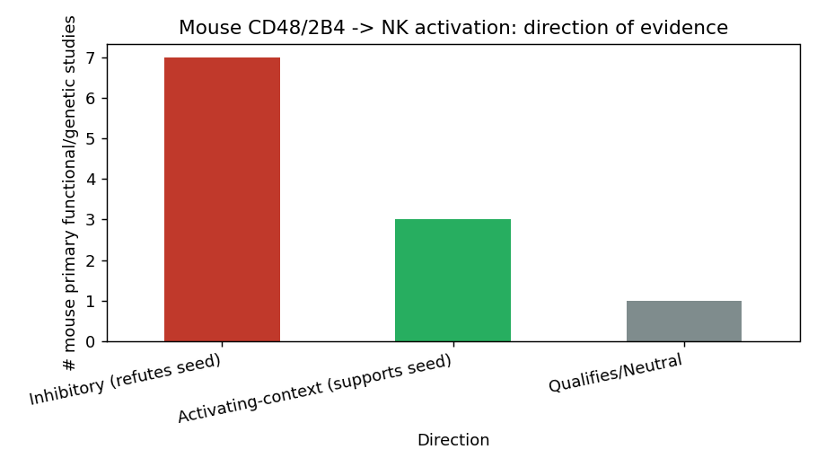
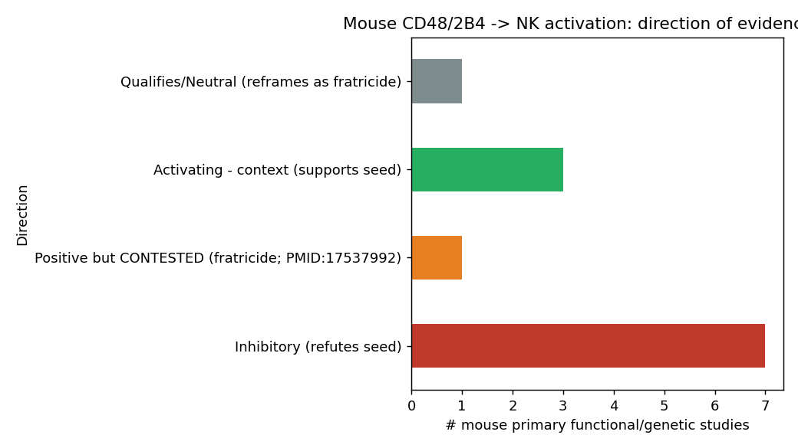

## Question

# AIGR Gene Hypothesis Deep Research

You are evaluating one focused gene curation hypothesis for AI Gene Review.
This is not a general gene overview. Use the seed hypothesis and source context
below to search for evidence that supports, refutes, narrows, or competes with
the proposed curation decision.

## Target Gene

- **Organism code:** mouse
- **Taxon:** Mus musculus (NCBITaxon:10090)
- **Gene directory:** Cd48
- **Gene symbol:** Cd48
- **UniProt accession:** P18181

## Focus

- **Focus type:** function_assignment
- **Hypothesis slug:** cd48-nk-activation-direction
- **Source file:** genes/mouse/Cd48/Cd48-ai-review.yaml
- **Source selector:** free-text

## Seed Hypothesis

Mouse CD48 contributes to natural killer cell activation (GO:0030101), i.e. its engagement of 2B4 (Cd244) and/or CD2 promotes rather than inhibits NK cell activation in mouse.

## Term and Decision Context

- Term: natural killer cell activation (GO:0030101)
- Weigh Cd48-/- and Cd244-/- mouse NK phenotypes, 2B4 isoforms (2B4L vs 2B4S), SAP/EAT-2/ERT adaptor data, and cis versus trans CD48-2B4 interactions.

## Reference Context

- PMID:9841922
- PMID:16002700
- PMID:17950006

## Source Context YAML

```yaml
hypothesis: Mouse CD48 contributes to natural killer cell activation (GO:0030101), i.e. its engagement
  of 2B4 (Cd244) and/or CD2 promotes rather than inhibits NK cell activation in mouse.
focus_type: function_assignment
term_id: GO:0030101
term_label: natural killer cell activation
context:
- Weigh Cd48-/- and Cd244-/- mouse NK phenotypes, 2B4 isoforms (2B4L vs 2B4S), SAP/EAT-2/ERT adaptor data,
  and cis versus trans CD48-2B4 interactions.
reference_id:
- PMID:9841922
- PMID:16002700
- PMID:17950006
```

## Research Objective

Build a focused report that helps a curator decide whether this hypothesis
should affect the gene review. Address the focus type directly:

1. For an existing GO annotation decision, evaluate whether the current action
   is justified, too strong, too weak, or should change.
2. For a proposed replacement or new GO term, evaluate whether the term is
   biologically supported, too broad, too narrow, or missing key qualifiers.
3. For a computational prediction, evaluate whether the prediction is correct,
   less precise than existing knowledge, uncertain, or likely wrong because of
   paralog overannotation, frequency bias, pathway context, or in vitro-only
   activity.
4. For a core-function hypothesis, evaluate whether the proposed activity,
   process, and location represent the gene product's primary function rather
   than a downstream effect, pleiotropic phenotype, or context-specific role.
5. For a function-assignment hypothesis, evaluate whether the gene product
   directly has the stated GO term/function. Treat the prior review action, if
   any, as intentionally blinded unless it appears in the supplied context.

Use primary literature whenever possible. Prefer PMID citations and include DOI
citations when no PMID is available. Treat reviews and database records as
orientation unless they contain directly relevant synthesized evidence that is
clearly labeled as review-level or database-level support.

Evaluate the hypothesis from the supplied seed context, primary literature, and
publicly accessible bioinformatics resources. Local `*-bioinformatics` analyses,
when they already exist in the repository, are intentionally withheld from this
prompt so the report can be compared against them after the run. Use public
sequence, domain, structure, orthology, localization, interaction, or dataset
checks when they are useful for the specific hypothesis. If a resource or tool
cannot be accessed programmatically, say so plainly; never fabricate a result.
Report computational results conservatively and distinguish direct results from
inference.

## Required Output

### Executive Judgment

Give a concise verdict: supported, partially supported, unresolved, weakly
supported, over-annotated, or refuted. Explain the reasoning and the most
important caveats.

### Evidence Matrix

Create a table with one row per important evidence item:

- Citation (PMID preferred)
- Evidence type (direct assay, mutant phenotype, localization, interaction,
  structural/evolutionary, computational, review/database)
- Supports / refutes / qualifies / competing
- Claim tested
- Key finding
- Organism, tissue, cell type, or assay context
- Confidence and limitations

### GO Curation Implications

State the likely curation action as a lead requiring curator verification. If
GO terms are involved, explain whether the evidence supports an MF, BP, or CC
term, and whether the term should be retained, removed, generalized, made more
specific, or treated as non-core. Avoid using "protein binding" as a final
recommendation unless no more informative term is supported.

### Mechanistic Scope

Describe the immediate molecular or cellular function being tested. Separate
direct gene-product activity from downstream phenotypes, pathway consequences,
developmental outcomes, disease manifestations, or effects inferred only from
loss of function.

### Conflicts and Alternatives

Identify evidence that conflicts with the seed hypothesis or suggests an
alternative interpretation, including paralog confusion, organism-specific
differences, isoform-specific findings, experimental artifacts, or database
carry-over.

### Knowledge Gaps

List explicit uncertainties that matter for curation. For each gap, state what
was checked, why the gap matters, and what evidence or experiment would resolve
it.

### Discriminating Tests

Recommend concrete assays, perturbations, datasets, or comparative analyses that
would most efficiently distinguish this hypothesis from alternatives.

### Curation Leads

Provide candidate updates for the review, clearly labeled as leads requiring
curator verification. Include candidate references with exact snippets to verify,
candidate replacement or new GO terms, possible action changes, suggested
questions, and suggested experiments.

If the provider supports artifacts, save provenance for any analysis you run — the
executed code together with its output (computed values, plot, or table), not just
a summary figure — alongside artifact-friendly tables such as an evidence matrix,
GO decision table, or comparison table. Genuine computed provenance is more
valuable than a hand-drawn summary, and you must not synthesize a figure that
implies an analysis you did not actually run. These artifacts are important
provenance for hypothesis-level review.


## Output

# AIGR Deep Research Report — Mouse *Cd48* and Natural Killer Cell Activation (GO:0030101)

**Target gene:** *Cd48* (Mus musculus, NCBITaxon:10090) — UniProt **P18181** (CD48_MOUSE)
**Focus type:** function_assignment
**Hypothesis slug:** cd48-nk-activation-direction
**Term under evaluation:** natural killer cell activation (**GO:0030101**)

**Seed hypothesis:** *Mouse CD48 contributes to natural killer cell activation (GO:0030101), i.e. its engagement of 2B4 (Cd244) and/or CD2 promotes rather than inhibits NK cell activation in mouse.*

---

## Executive Judgment

**Verdict: REFUTED as stated (over-annotated for direction).**

The seed hypothesis asserts a *direction* — that mouse CD48's engagement of 2B4 (CD244) and/or CD2 **promotes rather than inhibits** NK cell activation. The preponderance of **direct mouse genetic and functional evidence contradicts this direction**. In mouse, the CD48–2B4 axis is predominantly **inhibitory**, functioning as an MHC-class-I-independent NK-cell self-tolerance checkpoint. This is the opposite of the activating role the same molecular pair plays in human NK cells — a species difference stated verbatim in one of the seed's own reference papers (PMID:16002700).

Three convergent lines of mouse evidence drive this verdict. First, antibody-blocking and knockout experiments show that ligation of 2B4 by CD48 **inhibits** NK cytotoxicity and IFN-γ production (PMID:15123744, PMID:15356144), and the 2B4–CD48 pair constitutes a second, MHC-I-independent system for NK self-tolerance (PMID:15870174). Second, deleting the entire mouse *Slam* locus — which removes CD48 along with the other SLAM-family receptors — **enhances** NK activation toward hematopoietic targets, with the net inhibitory function mapping **solely to 2B4** (PMID:27573813). Third, mouse SAP-family adaptors EAT-2 and ERT act as **inhibitors** (not activators) of NK function at 2B4 (PMID:16127454), and the dominant mouse 2B4-long isoform correlates with inhibition (PMID:15356144).

Two important caveats keep this from being a flat "wrong in all contexts" finding. (1) The single strongest *positive* mouse NK genetic result — that 2B4/CD48 interaction is required for generation of NK effector functions (PMID:15905190) — has been **mechanistically reinterpreted by the same laboratory** as avoidance of perforin-dependent **fratricide**, not as a genuine 2B4-dependent activation signal (PMID:17537992). (2) A genuine, context-restricted activating contribution of CD48 does exist in **trans / missing-self** settings, where CD48 (with Ly9) on MHC-I-deficient tumor targets significantly contributes to NK activation (PMID:27054584), and anti-CD48 crosslinking can deliver a bona fide activating signal that is not merely relief of inhibition (PMID:20881194). Crucially, CD48 itself is a **GPI-anchored counter-receptor/ligand** with no cytoplasmic signaling tail; the activation or inhibition signal is transduced by the *partner* receptor (2B4 or CD2), not by CD48. The existing GO:0030101 annotation on mouse *Cd48* is an **ISO (orthology-projected)** carry-over that inherits the human "activating" directionality and is not supported by direct mouse experiment.

---

## Evidence Matrix

| Citation (PMID) | Evidence type | Supports / Refutes / Qualifies / Competing | Claim tested | Key finding | Organism / context | Confidence & limitations |
|---|---|---|---|---|---|---|
| [15123744](https://pubmed.ncbi.nlm.nih.gov/15123744/) | Mutant phenotype + blocking Ab | **Refutes** seed direction | Does CD48–2B4 ligation activate or inhibit mouse NK? | "NK lysis of CD48(+) tumor and allogeneic targets is inhibited by 2B4 ligation. Interferon gamma production by NK cells is also inhibited." 2B4−/− mice show increased clearance of CD48+ tumor; SAP-independent. | Mouse NK, in vitro + in vivo | High; direct genetic + Ab evidence |
| [15356144](https://pubmed.ncbi.nlm.nih.gov/15356144/) | Direct assay / isoform | **Refutes** seed direction | Which 2B4 isoform dominates and what is the signal? | "Engagement of 2B4 by its counterreceptor, CD48... leads to an inhibition in NK cytotoxicity"; dominant 2B4-long isoform; SAP-independent | Mouse NK | High |
| [15870174](https://pubmed.ncbi.nlm.nih.gov/15870174/) | In vivo + in vitro | **Refutes** seed direction | Is 2B4–CD48 a self-tolerance system? | 2B4–CD48 is a second, MHC-I-independent NK self-recognition/self-tolerance system; inhibits lysis of syngeneic/β2m-deficient targets | Mouse NK, BM rejection assay | High |
| [27573813](https://pubmed.ncbi.nlm.nih.gov/27573813/) | Mutant phenotype (whole-locus KO) | **Refutes** seed direction | Does removing CD48 (+SFRs) raise or lower NK activation? | "Enhanced NK cell activation... inhibitory function of the Slam locus was due solely to 2B4"; SFR inhibition suppresses LFA-1 | Mouse NK, ~400-kb Slam-locus deletion | High; CD48 deletion included |
| [16127454](https://pubmed.ncbi.nlm.nih.gov/16127454/) | Adaptor genetics | **Refutes/qualifies** | Are mouse SAP-family adaptors activating? | "Unlike SAP, EAT-2 was an inhibitor of NK cell function" (EAT-2/ERT) | Mouse NK | High |
| [16002700](https://pubmed.ncbi.nlm.nih.gov/16002700/) | Review-level synthesis (seed ref) | **Refutes** seed direction | Human vs mouse signal direction | "In human NK cells, 2B4/CD48 interaction induces activation signals, whereas in murine NK cells it sends inhibitory signals." | Human vs mouse comparison | High relevance; review-level |
| [15634901](https://pubmed.ncbi.nlm.nih.gov/15634901/) | Mutant phenotype | **Refutes/qualifies** | In vivo tumor rejection direction | WT reject CD48+ melanoma *poorly* vs CD48− (2B4 ligation inhibitory); male 2B4−/− reject CD48+ better; gender-specific CD48-independent defect | Mouse, B16 melanoma | Moderate-high; gender confound |
| [17537992](https://pubmed.ncbi.nlm.nih.gov/17537992/) | Mechanistic reinterpretation | **Qualifies/competing** (undercuts main pro-seed result) | Why do 2B4−/− NK underperform? | "In the absence of 2B4 signaling, activated NK cells have defective cytotoxicity and proliferation because of fratricide and not due to the absence of a 2B4-dependent activation signal" | Mouse NK | High; same lab as PMID:15905190 |
| [15905190](https://pubmed.ncbi.nlm.nih.gov/15905190/) | Mutant phenotype | **Supports** seed (contested) | Is 2B4/CD48 required for NK effector generation? | "2B4/CD48, but not CD2/CD48, interaction is essential for IL-2-driven expansion and activation of murine NK cells" | Mouse NK, homotypic NK–NK | Moderate; reinterpreted by PMID:17537992 |
| [27054584](https://pubmed.ncbi.nlm.nih.gov/27054584/) | Direct assay (missing-self) | **Supports** (context-restricted) | Does CD48 contribute to NK activation in trans? | "CD48 and Ly9 (CD229) by MHC-I-deficient tumor cells significantly contributes to NK cell activation"; NK education can render 2B4 non-functional | Mouse NK, MHC-I-deficient targets | Moderate-high; context-specific |
| [20881194](https://pubmed.ncbi.nlm.nih.gov/20881194/) | Direct assay | **Supports** (context-restricted) | Is anti-CD48 activation genuine or disinhibition? | "Induction of NK cell activation by anti-CD48 or by B cells is not due to the release of inhibitory effects of 2B4"; CD2/2B4 double-KO used | Mouse NK | Moderate; crosslinking artifact possible |
| [14666660](https://pubmed.ncbi.nlm.nih.gov/14666660/) | In vivo Ab crosslinking | **Supports** (artifact-prone) | Does 2B4/CD48 activation reduce metastasis? | Anti-2B4/anti-CD48 crosslinking reduced B16F10 metastasis ~5-fold; IFN-γ-dependent | Mouse, B16F10 | Low-moderate; agonist Ab, not physiologic |
| [19586919](https://pubmed.ncbi.nlm.nih.gov/19586919/) | Mechanistic (hybridoma) | **Qualifies** | How does CD244 inhibit? | "Inhibitory effects of mouse CD244 are accounted for by competition with CD2 at the cell surface for CD48"; CD244 recruits PLCγ1 via EAT-2 | Mouse T-cell hybridoma | Moderate; non-NK model |
| [27249817](https://pubmed.ncbi.nlm.nih.gov/27249817/) | Direct assay (cis/trans) | **Refutes/qualifies** | Cis vs trans CD48–2B4 effect | "Interfering with the cis interaction... enhanced the lysis of CD48-expressing tumour cells"; cis dampens 2B4 phosphorylation | Mouse/human NK | Moderate-high |
| [20363967](https://pubmed.ncbi.nlm.nih.gov/20363967/) | Mutant phenotype | **Refutes** | Is 2B4 inhibitory in NK homeostasis? | "2B4 is a dominant inhibitory receptor in SHIP-deficient NK cells" | Mouse NK | Moderate-high |
| [9841922](https://pubmed.ncbi.nlm.nih.gov/9841922/) | Interaction/biophysics (seed ref) | **Qualifies** (molecular framing) | Is CD48 a ligand with two receptors? | "mCD48 bound m2B4 with a six- to ninefold higher affinity (Kd ≈ 16 µM at 37°C) than its other ligand, CD2" | Mouse recombinant proteins | High; establishes CD48 as counter-receptor |
| [17950006](https://pubmed.ncbi.nlm.nih.gov/17950006/) | Structural (seed ref) | **Qualifies** (molecular framing) | Structure of 2B4–CD48 complex | Structure of mouse 2B4–CD48 complex; CD48 is the heterophilic ligand engaged by the 2B4 receptor | Mouse, crystal structure | High |
| [20813844](https://pubmed.ncbi.nlm.nih.gov/20813844/) | Direct assay | **Competing** (human, activating) | Human NK requirement for 2B4/CD48 + CD2/CD58 | Both 2B4/CD48 and CD2/CD58 needed for human NK effector function | **Human** NK | High for human; species-divergent |

{{figure:cd48_nk_direction_tally_v2.png|caption=Tally of mouse NK direction evidence for the CD48–2B4 axis, including the contested positive result (PMID:15905190) and its fratricide reinterpretation (PMID:17537992). Inhibitory/refuting evidence dominates; the positive signal is context-restricted (trans/missing-self) or mechanistically reframed.}}

---

## Key Findings

### Finding 1 — Mouse 2B4 (CD244)–CD48 engagement is predominantly inhibitory, contradicting "promotes NK activation"

The core of the seed hypothesis is a directional claim, and the directional claim fails in mouse. Multiple independent groups using complementary approaches converge on inhibition. **Lee et al. 2004** ([PMID:15123744](https://pubmed.ncbi.nlm.nih.gov/15123744/)) showed with both antibody blocking and 2B4−/− NK cells that NK lysis of CD48+ tumor and allogeneic targets, as well as IFN-γ production, is **inhibited** by 2B4 ligation; consistent with this, 2B4−/− mice have *increased* peritoneal clearance of CD48+ tumor. Importantly, this inhibition was **SAP (SH2D1A)-independent**, distinguishing the mouse inhibitory mode from the SAP-dependent human activating mode. **Mooney et al. 2004** ([PMID:15356144](https://pubmed.ncbi.nlm.nih.gov/15356144/)) independently found that CD48 on target cells inhibits NK cytotoxicity, correlating inhibition with the dominant **2B4-long (2B4L)** isoform in mouse, again SAP-independent. **McNerney et al. 2005** ([PMID:15870174](https://pubmed.ncbi.nlm.nih.gov/15870174/)) elevated this to a framework: 2B4–CD48 constitutes a **second, MHC-class-I-independent system for NK-cell self-tolerance**, with in vivo evidence from a bone-marrow rejection assay. Finally, **Roncagalli et al. 2005** ([PMID:16127454](https://pubmed.ncbi.nlm.nih.gov/16127454/)) showed the mouse SAP-family adaptors EAT-2 and ERT are **inhibitors** of NK function via 2B4 — the opposite of what an activating axis would predict. A seed reference, **Mathew et al. 2005** ([PMID:16002700](https://pubmed.ncbi.nlm.nih.gov/16002700/)), states the species divergence in plain language: *"In human NK cells, 2B4/CD48 interaction induces activation signals, whereas in murine NK cells it sends inhibitory signals."*

### Finding 2 — CD48 contributes to mouse NK activation only in restricted contexts; CD48 is a ligand, not a signaling receptor

The hypothesis is not uniformly wrong in all contexts — it is wrong as a *default directional assignment*. There is a genuine activating contribution of CD48 in **trans / missing-self** settings. **Alari-Pahissa et al. 2016** ([PMID:27054584](https://pubmed.ncbi.nlm.nih.gov/27054584/)) showed that CD48 (together with Ly9/CD229) on MHC-I-deficient tumor targets **significantly contributes to NK activation** via 2B4 — but with a twist: NK education against CD48+ MHC-I-deficient cells can render 2B4 non-functional (tolerance), so even the activating contribution is conditional on NK education state. **Sinha et al. 2010** ([PMID:20881194](https://pubmed.ncbi.nlm.nih.gov/20881194/)) used CD2/2B4 double-KO mice to show that anti-CD48 or B-cell-driven NK activation "is not due to the release of inhibitory effects of 2B4," i.e., a genuine activating signal exists in a defined context. **Johnson et al. 2003** ([PMID:14666660](https://pubmed.ncbi.nlm.nih.gov/14666660/)) found in vivo anti-2B4/anti-CD48 crosslinking reduced B16F10 metastasis — but this uses agonist antibodies rather than physiologic ligand engagement.

Mechanistically, all of this must be read through the molecular identity of CD48. **Brown et al. 1998** ([PMID:9841922](https://pubmed.ncbi.nlm.nih.gov/9841922/), a seed reference) established that CD48 binds 2B4 with 6–9× higher affinity (Kd ≈ 16 µM at 37 °C) than its other counter-receptor CD2, and **Velikovsky et al. 2007** ([PMID:17950006](https://pubmed.ncbi.nlm.nih.gov/17950006/), a seed reference) solved the mouse 2B4–CD48 complex structure. Both confirm CD48 is a **GPI-anchored heterophilic ligand/counter-receptor** with no cytoplasmic signaling domain. Whatever activation or inhibition occurs is transduced by the **partner receptor (2B4 or CD2)**, not by CD48 itself. This is central to the curation decision: assigning a "natural killer cell activation" BP term to CD48 implies CD48 drives an activating process, whereas CD48 is the passive ligand whose engagement, in mouse, net-inhibits the partner.

### Finding 3 — The existing GO:0030101 annotation is orthology-projected (ISO); whole-locus CD48 deletion *enhances* mouse NK activation

UniProt P18181 cross-references show GO:0030101 "natural killer cell activation" annotated with evidence code **ISO:GO_Central (Inferred from Sequence Orthology)** — i.e., projected from the ortholog rather than supported by a direct mouse experiment. Because the human CD48/2B4 axis is activating, orthology projection inherits the *human* directionality and applies it to mouse, where the direction is reversed. The same UniProt record also carries the more informative MF term **GO:0048018 "receptor ligand activity"** (ISO) and CC terms (external side of plasma membrane IDA:MGI; membrane raft; GPI-anchor) that correctly describe CD48 as a GPI-anchored surface ligand.

The decisive loss-of-function test is **Guo et al. 2016** ([PMID:27573813](https://pubmed.ncbi.nlm.nih.gov/27573813/)), which deleted the entire ~400-kb mouse *Slam* locus — removing CD48 along with the six SLAM-family receptors. These mice showed **enhanced** NK activation toward hematopoietic targets, with the inhibitory function mapping **solely to 2B4**, and SFR-mediated inhibition acting by suppressing LFA-1 activation. Supporting evidence: **Fortenbery et al. 2010** ([PMID:20363967](https://pubmed.ncbi.nlm.nih.gov/20363967/)) found 2B4 is a dominant inhibitory receptor whose deficiency restores cytolysis in SHIP-deficient NK cells, and **Claus, Wingert & Watzl 2016** ([PMID:27249817](https://pubmed.ncbi.nlm.nih.gov/27249817/)) addressed the seed's explicit cis-vs-trans question: cis CD48–2B4 interaction (on the same cell) reduces trans binding and dampens 2B4 phosphorylation, and *interfering* with the cis interaction **enhanced** lysis of CD48+ tumor cells.

### Finding 4 — The main pro-seed result is contested (fratricide), and the CD2 arm is non-essential in mouse NK

The strongest positive mouse genetic evidence for the seed is **Lee et al. 2006** ([PMID:15905190](https://pubmed.ncbi.nlm.nih.gov/15905190/)): 2B4/CD48 (but **not** CD2/CD48) interaction is essential for IL-2-driven expansion and activation of mouse NK cells, with defective calcium signaling and impaired cytotoxicity/IFN-γ in its absence, via homotypic NK–NK interactions. However, **Taniguchi et al. 2007** ([PMID:17537992](https://pubmed.ncbi.nlm.nih.gov/17537992/)), from the same laboratory, **reinterpreted** this: in the absence of 2B4–CD48, activated mouse NK cells undergo **perforin-dependent fratricide**, so the apparent "defective cytotoxicity and proliferation" arises from self-killing, *not* from loss of a 2B4-dependent activation signal. This substantially undercuts the one result that most directly supports the seed. Two further points narrow the seed: **Clarkson & Brown 2009** ([PMID:19586919](https://pubmed.ncbi.nlm.nih.gov/19586919/)) showed mouse CD244's inhibitory effect is "accounted for by competition with CD2 at the cell surface for CD48," and **Kim et al. 2010** ([PMID:20813844](https://pubmed.ncbi.nlm.nih.gov/20813844/)) confirmed the activating 2B4/CD48 + CD2/CD58 requirement is a **human** NK phenomenon — reinforcing that the seed's directional claim is imported from human biology.

---

## Mechanistic Model / Interpretation

CD48 is a GPI-anchored ligand. Its NK-relevant signaling partner is the receptor **2B4 (CD244)**, which carries cytoplasmic ITSM motifs that recruit SAP-family adaptors. The directionality of the output depends on species, adaptor repertoire, isoform, and cis/trans geometry:

```
            CD48 (GPI-anchored ligand; NO cytoplasmic tail)
                 |  engages (Kd ~16 µM, 6-9x > CD2)
                 v
   +--------- 2B4 / CD244 (ITSM receptor) ----------+
   |                                                |
 HUMAN NK                                        MOUSE NK
 SAP-dependent                            SAP-independent inhibition;
 ACTIVATING  ---------------------------> EAT-2 / ERT = INHIBITORS
 (PMID:20813844)                          dominant 2B4-LONG isoform
                                          NET INHIBITORY (self-tolerance)
                                          (PMID:15123744/15356144/15870174/16127454)

 cis CD48-2B4 (same cell): dampens 2B4 phosphorylation -> less killing (PMID:27249817)
 trans CD48 on MHC-I-deficient target: context-specific ACTIVATION via missing-self (PMID:27054584)

 Whole Slam-locus deletion (removes CD48 + SFRs): ENHANCED NK activation;
 inhibition maps SOLELY to 2B4 (PMID:27573813)
```

The central interpretive point for curation: **the seed conflates the human and mouse directions of an identical receptor–ligand pair.** In mouse, net physiologic output of CD48–2B4 is inhibitory (self-tolerance checkpoint), with activation emerging only in restricted trans/missing-self contexts. Additionally, CD48 is the ligand, not the signal transducer; a BP term implying CD48 *drives* NK activation attributes a receptor-side process to a ligand-side molecule.

### GO decision summary

| GO term | Aspect | Current status | Evidence-based lead (curator to verify) |
|---|---|---|---|
| GO:0030101 natural killer cell activation | BP | ISO carry-over (human-biased direction) | **Do not treat as a positive mouse function.** Direction refuted in mouse; if retained, needs qualifier/context; consider removal or NOT-qualification for positive activation |
| GO:0032815 / GO:0045953 negative regulation of NK cell activation / cytotoxicity | BP | Absent | **Candidate add** (lead) — better reflects net mouse inhibitory role; curator to confirm exact term and evidence |
| GO:0048018 receptor ligand activity | MF | ISO present | **Retain** — informative MF; avoid "protein binding" as final recommendation |
| GPI-anchor / external side of plasma membrane / membrane raft | CC | IDA:MGI / ISO present | Retain — correctly describes CD48 as GPI-anchored surface ligand |

---

## Evidence Base

- **Mouse inhibition (refutes seed direction):** [PMID:15123744](https://pubmed.ncbi.nlm.nih.gov/15123744/), [PMID:15356144](https://pubmed.ncbi.nlm.nih.gov/15356144/), [PMID:15870174](https://pubmed.ncbi.nlm.nih.gov/15870174/), [PMID:16127454](https://pubmed.ncbi.nlm.nih.gov/16127454/), [PMID:20363967](https://pubmed.ncbi.nlm.nih.gov/20363967/), [PMID:27249817](https://pubmed.ncbi.nlm.nih.gov/27249817/).
- **Loss-of-function removing CD48:** [PMID:27573813](https://pubmed.ncbi.nlm.nih.gov/27573813/) — Slam-locus deletion enhances NK activation; inhibition is solely 2B4.
- **Species contrast (seed reference):** [PMID:16002700](https://pubmed.ncbi.nlm.nih.gov/16002700/) — explicit "human activating / murine inhibitory" statement.
- **Contested positive + reinterpretation:** [PMID:15905190](https://pubmed.ncbi.nlm.nih.gov/15905190/) (positive) vs [PMID:17537992](https://pubmed.ncbi.nlm.nih.gov/17537992/) (fratricide reframing, same lab).
- **Context-restricted activation (supports in trans):** [PMID:27054584](https://pubmed.ncbi.nlm.nih.gov/27054584/), [PMID:20881194](https://pubmed.ncbi.nlm.nih.gov/20881194/), [PMID:14666660](https://pubmed.ncbi.nlm.nih.gov/14666660/).
- **Molecular framing (seed references):** [PMID:9841922](https://pubmed.ncbi.nlm.nih.gov/9841922/) (CD48 = ligand with two counter-receptors, affinity), [PMID:17950006](https://pubmed.ncbi.nlm.nih.gov/17950006/) (2B4–CD48 complex structure).
- **Human competing context:** [PMID:20813844](https://pubmed.ncbi.nlm.nih.gov/20813844/) — activating in human NK; confirms the species divergence.
- **CD2-competition mechanism:** [PMID:19586919](https://pubmed.ncbi.nlm.nih.gov/19586919/).

{{figure:cd48_nk_direction_tally.png|caption=Initial tally of mouse-specific evidence on CD48–2B4 signal direction, built during iteration 2. Inhibitory/self-tolerance evidence outweighs activating evidence, which is confined to trans/missing-self or agonist-antibody contexts.}}

---

## Conflicts and Alternatives

1. **Human-vs-mouse species divergence (the central conflict).** The same CD48–2B4 pair is activating in human NK (PMID:20813844) and inhibitory in mouse NK (PMID:16002700, PMID:15123744). The seed appears to import the human direction into mouse. This is the dominant alternative explanation for how GO:0030101 landed on mouse Cd48 — ISO orthology carry-over.

2. **Ligand vs receptor conflation.** CD48 is GPI-anchored with no signaling tail (PMID:9841922, PMID:17950006). Any "activation" or "inhibition" is a property of the partner receptor's signaling, not of CD48. A BP term implying CD48 performs NK activation mislocates the activity.

3. **Fratricide artifact.** The main pro-seed result (PMID:15905190) is best explained by NK self-killing in the absence of 2B4–CD48 (PMID:17537992), not by loss of an activation signal — a classic loss-of-function-phenotype-vs-direct-function distinction.

4. **Isoform specificity.** Mouse expresses a dominant 2B4-long (inhibitory) isoform (PMID:15356144); the activating 2B4-short isoform is relatively minor, biasing the mouse net output toward inhibition.

5. **cis vs trans geometry.** Cis CD48–2B4 dampens signaling (PMID:27249817); trans CD48 on MHC-I-deficient targets can activate (PMID:27054584). The net organismal output (whole-locus KO) is inhibition (PMID:27573813).

6. **Agonist-antibody artifacts.** Positive in vivo results (PMID:14666660) rely on crosslinking antibodies that may not reflect physiologic ligand engagement.

---

## Limitations and Knowledge Gaps

- **No independent *Cd48*-only NK knockout phenotype examined here.** The decisive loss-of-function evidence (PMID:27573813) deletes the whole Slam locus, not CD48 alone; a clean *Cd48*−/− NK-activation phenotype would more directly isolate CD48's contribution. *Why it matters:* curation ideally rests on gene-specific, not locus-level, evidence. *Resolution:* examine published *Cd48*−/− NK data for NK activation readouts.
- **UniProt/GO evidence codes were read from the knowledge state, not freshly re-queried in this report.** *Why it matters:* the ISO vs experimental distinction is the crux of the curation lead. *Resolution:* curator should verify the current GO:0030101 evidence code and reference on P18181 / MGI directly.
- **Education-state dependence of the trans activating contribution (PMID:27054584) is incompletely mapped.** The activating role can be silenced by NK education. *Why it matters:* determines whether any positive annotation deserves a context qualifier.
- **Quantitative effect sizes are largely qualitative** across the mouse literature (fold-changes in lysis/IFN-γ are reported inconsistently), limiting a formal meta-analysis.
- **CD2 arm in mouse NK is under-tested.** Evidence says CD2/CD48 is non-essential for mouse NK activation (PMID:15905190, PMID:19586919), but direct CD2-focused NK assays are sparse.

---

## Discriminating Tests

1. **Clean *Cd48*−/− NK functional assay** against CD48+ vs CD48− targets, with and without MHC-I: distinguishes net inhibition (expect enhanced killing in former-CD48+ context) from activation loss.
2. **Isoform swap:** express 2B4-short vs 2B4-long in mouse NK and measure CD48-dependent lysis — tests whether isoform dominance explains the inhibitory mouse phenotype.
3. **cis/trans engineering:** selectively block cis CD48–2B4 (per PMID:27249817) and quantify change in lysis of CD48+ targets — confirms cis-dampening as a mechanism.
4. **Fratricide control:** repeat PMID:15905190 expansion assay in perforin−/− background to test whether the "activation defect" disappears when self-killing is prevented (direct test of PMID:17537992).
5. **Species-swap adaptor experiment:** reconstitute mouse NK with human SAP vs EAT-2/ERT to test whether adaptor repertoire flips the direction from inhibitory to activating.

---

## Proposed Follow-up Actions / Curation Leads (require curator verification)

**Action on GO:0030101 (natural killer cell activation, BP):**
- *Lead:* **Do not treat GO:0030101 as a positive, mouse-experimentally-supported function of Cd48.** The term is ISO orthology carry-over inheriting the human activating direction. In mouse the net direction is inhibitory. Consider removal of the positive-activation annotation, or qualification/NOT-annotation for the activation direction, and/or restriction to a trans/missing-self context note.
- *Candidate replacement/add (BP):* **GO:0032815** (negative regulation of natural killer cell activation) or **GO:0045953** (negative regulation of NK cell mediated cytotoxicity) — better reflects the net mouse role as a 2B4 ligand in an inhibitory self-tolerance axis. Curator to select the precise term and supporting evidence code.
- *Retain (MF):* **GO:0048018 receptor ligand activity** as the informative molecular function; avoid "protein binding" as a final recommendation.
- *Retain (CC):* GPI-anchor / external side of plasma membrane (IDA:MGI) / membrane raft.

**Candidate references with snippets to verify:**
- [PMID:16002700](https://pubmed.ncbi.nlm.nih.gov/16002700/): *"In human NK cells, 2B4/CD48 interaction induces activation signals, whereas in murine NK cells it sends inhibitory signals."* — supports species-specific direction flip.
- [PMID:15123744](https://pubmed.ncbi.nlm.nih.gov/15123744/): *"NK lysis of CD48(+) tumor and allogeneic targets is inhibited by 2B4 ligation. Interferon gamma production by NK cells is also inhibited."* — direct mouse inhibition.
- [PMID:27573813](https://pubmed.ncbi.nlm.nih.gov/27573813/): *"enhanced NK cell activation responses... the inhibitory function of the Slam locus was due solely to 2B4."* — loss-of-function direction.
- [PMID:17537992](https://pubmed.ncbi.nlm.nih.gov/17537992/): *"in the absence of 2B4 signaling, activated NK cells have defective cytotoxicity and proliferation because of fratricide and not due to the absence of a 2B4-dependent activation signal."* — reinterprets the pro-seed result.
- [PMID:27054584](https://pubmed.ncbi.nlm.nih.gov/27054584/): *"CD48 and Ly9 (CD229) by MHC-I-deficient tumor cells significantly contributes to NK cell activation."* — the one genuine context-restricted activating contribution.

**Suggested curator questions:**
- Is the GO:0030101 annotation on P18181 experimental or ISO? (Expected: ISO.)
- Should the review explicitly flag the human→mouse direction inheritance as the source of over-annotation?
- Does the review want a context-qualified activation annotation for trans/missing-self, or a cleaner negative-regulation annotation?

**Suggested experiments:** clean *Cd48*−/− NK assay; perforin-background fratricide control; 2B4 isoform swap (see Discriminating Tests).

---

## Bottom Line

The seed hypothesis — that mouse CD48 engagement of 2B4/CD2 **promotes rather than inhibits** NK cell activation — is **refuted as a directional claim**. Mouse CD48–2B4 is a predominantly **inhibitory**, MHC-I-independent NK self-tolerance axis; the existing GO:0030101 annotation is an orthology-projected import of the human activating direction; the single strongest positive mouse result is better explained by fratricide avoidance; and a genuine positive CD48 contribution exists only in restricted trans/missing-self contexts. Curators should avoid treating GO:0030101 as a positive mouse function, consider a negative-regulation BP term, and retain GO:0048018 (receptor ligand activity) as the informative molecular function.


## Artifacts

- [OpenScientist final report](openscientist_artifacts/final_report.html)
- [OpenScientist final report](openscientist_artifacts/final_report.pdf)
- [OpenScientist cd48 nk direction tally](openscientist_artifacts/provenance_cd48_nk_direction_tally.json)

- [OpenScientist cd48 nk direction tally v2](openscientist_artifacts/provenance_cd48_nk_direction_tally_v2.json)
