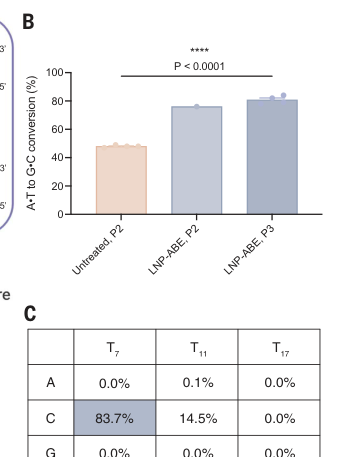

## Question

# Gene Research for Functional Annotation

## ⚠️ CRITICAL: Gene/Protein Identification Context

**BEFORE YOU BEGIN RESEARCH:** You MUST verify you are researching the CORRECT gene/protein. Gene symbols can be ambiguous, especially for less well-characterized genes from non-model organisms.

### Target Gene/Protein Identity (from UniProt):
- **UniProt Accession:** P26361
- **Protein Description:** RecName: Full=Cystic fibrosis transmembrane conductance regulator {ECO:0000305}; Short=CFTR; AltName: Full=ATP-binding cassette sub-family C member 7; AltName: Full=Channel conductance-controlling ATPase; EC=5.6.1.6 {ECO:0000250|UniProtKB:P13569}; AltName: Full=cAMP-dependent chloride channel;
- **Gene Information:** Name=Cftr {ECO:0000312|MGI:MGI:88388}; Synonyms=Abcc7;
- **Organism (full):** Mus musculus (Mouse).
- **Protein Family:** Belongs to the ABC transporter superfamily. ABCC family.
- **Key Domains:** AAA+_ATPase. (IPR003593); ABC1_TM_dom. (IPR011527); ABC1_TM_sf. (IPR036640); ABC_transporter-like_ATP-bd. (IPR003439); ABC_transporter-like_CS. (IPR017871)

### MANDATORY VERIFICATION STEPS:

1. **Check if the gene symbol "Cftr" matches the protein description above**
2. **Verify the organism is correct:** Mus musculus (Mouse).
3. **Check if protein family/domains align with what you find in literature**
4. **If you find literature for a DIFFERENT gene with the same or similar symbol, STOP**

### If Gene Symbol is Ambiguous or You Cannot Find Relevant Literature:

**DO NOT PROCEED WITH RESEARCH ON A DIFFERENT GENE.** Instead:
- State clearly: "The gene symbol 'Cftr' is ambiguous or literature is limited for this specific protein"
- Explain what you found (e.g., "Found extensive literature on a different gene with the same symbol in a different organism")
- Describe the protein based ONLY on the UniProt information provided above
- Suggest that the protein function can be inferred from domain/family information

### Research Target:

Please provide a comprehensive research report on the gene **Cftr** (gene ID: Cftr, UniProt: P26361) in mouse.

The research report should be a detailed narrative explaining the function, biological processes, and localization of the gene product. Citations should be given for all claims.

You should prioritize authoritative reviews and primary scientific literature when conducting research. You can supplement
this with annotations you find in gene/protein databases, but these can be outdated or inaccurate.

We are specifically interested in the primary function of the gene - for enzymes, what reaction is catalyzed, and what is the substrate specificity? For transporters, what is the substrate? For structural proteins or adapters, what is the broader structural role? For signaling molecules, what is the role in the pathway.

We are interested in where in or outside the cell the gene product carries out its function.

We are also interested in the signaling or biochemical pathways in which the gene functions. We are less interested in broad pleiotropic effects, except where these elucidate the precise role.

Include evidence where possible. We are interested in both experimental evidence as well as inference from structure, evolution, or bioinformatic analysis. Precise studies should be prioritized over high-throughput, where available.

## Output

Question: You are an expert researcher providing comprehensive, well-cited information.

Provide detailed information focusing on:
1. Key concepts and definitions with current understanding
2. Recent developments and latest research (prioritize 2023-2024 sources)
3. Current applications and real-world implementations
4. Expert opinions and analysis from authoritative sources
5. Relevant statistics and data from recent studies

Format as a comprehensive research report with proper citations. Include URLs and publication dates where available.
Always prioritize recent, authoritative sources and provide specific citations for all major claims.

# Gene Research for Functional Annotation

## ⚠️ CRITICAL: Gene/Protein Identification Context

**BEFORE YOU BEGIN RESEARCH:** You MUST verify you are researching the CORRECT gene/protein. Gene symbols can be ambiguous, especially for less well-characterized genes from non-model organisms.

### Target Gene/Protein Identity (from UniProt):
- **UniProt Accession:** P26361
- **Protein Description:** RecName: Full=Cystic fibrosis transmembrane conductance regulator {ECO:0000305}; Short=CFTR; AltName: Full=ATP-binding cassette sub-family C member 7; AltName: Full=Channel conductance-controlling ATPase; EC=5.6.1.6 {ECO:0000250|UniProtKB:P13569}; AltName: Full=cAMP-dependent chloride channel;
- **Gene Information:** Name=Cftr {ECO:0000312|MGI:MGI:88388}; Synonyms=Abcc7;
- **Organism (full):** Mus musculus (Mouse).
- **Protein Family:** Belongs to the ABC transporter superfamily. ABCC family.
- **Key Domains:** AAA+_ATPase. (IPR003593); ABC1_TM_dom. (IPR011527); ABC1_TM_sf. (IPR036640); ABC_transporter-like_ATP-bd. (IPR003439); ABC_transporter-like_CS. (IPR017871)

### MANDATORY VERIFICATION STEPS:

1. **Check if the gene symbol "Cftr" matches the protein description above**
2. **Verify the organism is correct:** Mus musculus (Mouse).
3. **Check if protein family/domains align with what you find in literature**
4. **If you find literature for a DIFFERENT gene with the same or similar symbol, STOP**

### If Gene Symbol is Ambiguous or You Cannot Find Relevant Literature:

**DO NOT PROCEED WITH RESEARCH ON A DIFFERENT GENE.** Instead:
- State clearly: "The gene symbol 'Cftr' is ambiguous or literature is limited for this specific protein"
- Explain what you found (e.g., "Found extensive literature on a different gene with the same symbol in a different organism")
- Describe the protein based ONLY on the UniProt information provided above
- Suggest that the protein function can be inferred from domain/family information

### Research Target:

Please provide a comprehensive research report on the gene **Cftr** (gene ID: Cftr, UniProt: P26361) in mouse.

The research report should be a detailed narrative explaining the function, biological processes, and localization of the gene product. Citations should be given for all claims.

You should prioritize authoritative reviews and primary scientific literature when conducting research. You can supplement
this with annotations you find in gene/protein databases, but these can be outdated or inaccurate.

We are specifically interested in the primary function of the gene - for enzymes, what reaction is catalyzed, and what is the substrate specificity? For transporters, what is the substrate? For structural proteins or adapters, what is the broader structural role? For signaling molecules, what is the role in the pathway.

We are interested in where in or outside the cell the gene product carries out its function.

We are also interested in the signaling or biochemical pathways in which the gene functions. We are less interested in broad pleiotropic effects, except where these elucidate the precise role.

Include evidence where possible. We are interested in both experimental evidence as well as inference from structure, evolution, or bioinformatic analysis. Precise studies should be prioritized over high-throughput, where available.

## Research report: Mouse **Cftr** (UniProt **P26361**) — functional annotation, pathways, and 2023–2024 research advances

### 0) Target verification (mandatory)
The UniProt accession **P26361** corresponds to **CFTR_MOUSE** (cystic fibrosis transmembrane conductance regulator) from **Mus musculus**, matching the gene symbol **Cftr** (synonym **Abcc7**) and the expected ABC-transporter-like architecture. This mapping is explicitly stated in a UniProtKB-based cross-species analysis that lists **P26361 = CFTR_MOUSE** (mouse; 1476 aa). (hassan2026mathematicalsequenceanalyses pages 3-4)

### 1) Key concepts and definitions (current understanding)

#### 1.1 What CFTR/Cftr is
CFTR (mouse **Cftr/Abcc7**) is a member of the **ATP-binding cassette (ABC) transporter superfamily (ABCC subfamily)** but is unusual in that it functions primarily as a **regulated anion channel** rather than a classical active transporter. (infield2021themolecularevolution pages 1-2, anwar2024cysticfibrosisunderstanding pages 1-2)

#### 1.2 Domain architecture and membrane topology
CFTR is a multi-pass membrane protein organized into: two **membrane-spanning/transmembrane domains** (MSD/TMD1 and MSD/TMD2; **12 TM helices total**), two cytosolic **nucleotide-binding domains** (**NBD1, NBD2**), and a regulatory **R domain** enriched in phosphorylation sites. (baroni2025unravelingthemechanism pages 2-5, anwar2024cysticfibrosisunderstanding pages 1-2)

#### 1.3 Primary molecular function and transported substrates
The primary function of CFTR is to conduct **anions**, especially **chloride (Cl−)** and **bicarbonate (HCO3−)**, across epithelial plasma membranes down electrochemical gradients to drive fluid and electrolyte transport and regulate pH. (infield2021themolecularevolution pages 1-2, jonge2020strategiesforcystic pages 7-9, anwar2024cysticfibrosisunderstanding pages 1-2)

#### 1.4 Channel gating: phosphorylation + ATP-driven NBD cycle
CFTR activity requires (i) **phosphorylation of the R domain** (typically via **cAMP/PKA signaling**; intestinal-specific PKG contributions are also described) and (ii) **ATP binding and NBD dimerization** to open the channel, with **ATP hydrolysis at site 2** promoting closure (dissociation of the NBD dimer). (jonge2020strategiesforcystic pages 26-28, jonge2020strategiesforcystic pages 1-5)

#### 1.5 Subcellular localization
In secretory epithelia, CFTR is predominantly localized to the **apical plasma membrane** of polarized epithelial cells, including airway, intestinal, pancreatic duct, sweat duct, and reproductive tract epithelia. (anwar2024cysticfibrosisunderstanding pages 1-2)

### 2) Biological pathways and mechanistic context

#### 2.1 Epithelial transport “module” CFTR participates in
CFTR-mediated anion secretion is mechanistically coupled to basolateral transporters and channels that establish driving forces and supply substrates:
- Basolateral **Na+/K+-ATPase** maintains Na+ gradient and membrane potential.
- Basolateral **NKCC1** loads cells with Cl− for secretion.
- Basolateral **K+ channels** (e.g., KCNQ1, KCNN4 in intestinal epithelia) recycle K+ and help set membrane potential.
- **HCO3−** supply/handling involves Na+-coupled transporters (NBCe1/NBCn1) and luminal/basolateral exchangers including **SLC26A3 (DRA)** and **SLC26A6 (PAT-1)**, functionally integrated with CFTR. (jonge2020strategiesforcystic pages 7-9, jonge2020strategiesforcystic pages 26-28)

#### 2.2 cAMP microdomains and mouse-relevant signaling evidence
Modern models emphasize that CFTR is regulated in spatially restricted signaling “microdomains,” shaped by GPCR signaling, scaffolding proteins, phosphodiesterases, and Ca2+-linked effectors. Mouse-specific evidence described includes **direct CFTR–AC6 interaction in mouse intestinal mucosa/colon epithelial cells** and failure of forskolin-induced swelling in intestinal organoids derived from **AC6-deficient mice**, supporting AC6’s role in CFTR-dependent secretion. (varga2025beyondthemutations pages 16-20)

### 3) Recent developments and latest research (prioritizing 2023–2024)

#### 3.1 2024: Structures of PKA in complex with CFTR (mechanisms of multisite phosphorylation and noncatalytic activation)
A 2024 cryo-EM study solved structures of the **PKA catalytic subunit (PKA-C) bound to full-length CFTR**, showing unphosphorylated CFTR engages PKA-C at **two distinct docking locations**, forming two “**catalytic stations**” that can access many spatially separated phosphorylation sites in the flexible R domain. The same work also provides structural and functional support for **phosphorylation-independent potentiation**: PKA-C binding alone can stimulate CFTR currents (“noncatalytic activation”). (fiedorczuk2024thestructuresofa pages 1-2)

*Interpretation (expert analysis):* These structures strengthen a model in which CFTR regulation is not simply a diffuse kinase-substrate collision process; instead, CFTR can act as a scaffold for PKA-C to enable efficient multi-site phosphorylation and potentially permit acute gating modulation through binding-based allostery. (fiedorczuk2024thestructuresofa pages 1-2)

#### 3.2 2024: Allosteric inhibition by CFTRinh-172 mapped to the pore
A 2024 Nature Communications cryo-EM structure localized the CFTR gating inhibitor **CFTRinh-172** inside the CFTR pore, contacting residues in **TMs 1, 6, 8, 9, and 12**. Binding is associated with re-orientations of extracellular segments (notably **TMs 1, 8, 12**), supporting an **allosteric gating-inhibition** mechanism. The study also reports that ivacaftor (VX-770) alters the apparent affinity of CFTRinh-172, indicating interacting allosteric sites around TM8. (gao2024allostericinhibitionof pages 1-2)

*Interpretation (expert analysis):* For functional annotation, this provides residue-level evidence linking CFTR’s pore architecture and gating transitions to pharmacologic control—useful for mapping mutation effects and designing inhibitors for CFTR hyperactivation states (e.g., secretory diarrhea). (gao2024allostericinhibitionof pages 1-2)

#### 3.3 2023: Evolution-informed gating mechanisms
A 2023 Journal of General Physiology paper used cross-species comparison and thermodynamic mutant cycles to show how extracellular loop interactions stabilize CFTR bursting/open states and how disease mutations (e.g., R117H in human CFTR) disrupt open-state stabilization. (simon2023optimizationofcftr pages 1-2)

### 4) Current applications and real-world implementations (mouse Cftr)

#### 4.1 Mouse genetic models: knockout, mutant, and humanized/chimeric Cftr
Mouse Cftr models (knockout and allele-specific mutants) are widely used for mechanistic studies and preclinical evaluation; they robustly model gastrointestinal disease and can be engineered by CRISPR to introduce precise alleles. Humanized or chimeric models are used to improve translational alignment (e.g., to test human-sequence–specific reagents), with the important caveat that species differences can strongly affect pharmacology. For example, a mouse-model-focused review notes **ivacaftor does not act on mCFTR**, motivating humanized/chimeric strategies for certain drug studies. (michicich2025developmentofcftr pages 28-33, michicich2025developmentofcftr pages 23-28, michicich2025developmentofcftr pages 33-38)

#### 4.2 Organoid implementations (mouse intestinal organoids; functional readout)
Forskolin-induced swelling (FIS) in intestinal organoids is a widely used functional CFTR readout. In a 2024 in vivo editing study, **intestinal organoids from R553X homozygous mice** showed **~50% base editing** by sequencing and **~80% swelling** after LNP-ABE treatment (versus no swelling untreated), demonstrating functional restoration via Cftr correction. (sun2024invivoediting pages 5-6)

#### 4.3 In vivo gene correction/editing in mice (2024; quantitative outcomes)
A 2024 Science study demonstrated lung-targeting lipid nanoparticles (LNPs) enabling durable in vivo editing of lung stem cells in mice and applied this to a CFTR nonsense mutation model. Key quantitative outcomes include:
- In reporter mice: **>70% lung stem cell editing** and **>80% lung epithelial cells** remaining labeled/edited for **660 days**. (sun2024invivoediting pages 1-1)
- In CFTR R553X correction experiments: in vivo NGS showed **50.0% correction in isolated lung NGFR+ stem cells**, **12.2%** in whole lung, and **28.7%** in trachea. (sun2024invivoediting pages 6-6)
- Functional rescue (TECC): editing alone restored **53.4% of WT CFTR function** (AUC **11.6** vs WT **21.7 mA/cm²·min**), and combination with Trikafta improved function further (AUC **18.5 mA/cm²·min**). (sun2024invivoediting pages 6-6)

Visual evidence: figure panels from this study directly display the editing frequencies and TECC/AUC functional rescue outcomes, including ~50% correction in lung NGFR+ stem cells. (sun2024invivoediting media 4be5b4c3, sun2024invivoediting media e348f72f, sun2024invivoediting media ecd86120)

#### 4.4 Pharmacologic tool compounds and inhibitors (for functional perturbation and modeling)
A 2024 ACS Pharmacology & Translational Science review compiles recommended CFTR tool compounds with quantitative potencies used to model CFTR loss/hyperactivation and to probe gating/trafficking mechanisms. Examples include:
- **PPQ-102** (reversible inhibitor) **IC50 ≈ 90 nM**.
- CFTRinh-172 analogs (Tetrazolo-172, Oxo-172) potency ≈ **1 μM**.
- Corrector/potentiator examples: **C18/VRT-534 EC50 ≈ 0.6 μM**, **ΔF508act-02 EC50 ≈ 600 nM**. (han2024recommendedtoolcompounds pages 11-12)

### 5) Statistics and data highlights (recent studies)
- Structural regulation: 2024 cryo-EM supports a **two-site docking** model for PKA-C on CFTR and provides structural support for **phosphorylation-independent potentiation** by kinase binding. (fiedorczuk2024thestructuresofa pages 1-2)
- Pharmacologic binding-site mapping: 2024 cryo-EM localizes CFTRinh-172 inside the pore (TMs 1/6/8/9/12) with conformational reorientation of TMs consistent with allosteric inhibition. (gao2024allostericinhibitionof pages 1-2)
- In vivo editing (mouse): **50.0%** correction in lung NGFR+ stem cells; TECC AUC restoration **11.6 vs 21.7 mA/cm²·min** (editing alone), improved to **18.5 mA/cm²·min** with Trikafta. (sun2024invivoediting pages 6-6)

### 6) Practical functional-annotation summary (mouse Cftr)
- **Molecular function:** cAMP/PKA- and ATP-regulated **apical epithelial anion channel** conducting **Cl− and HCO3−**. (infield2021themolecularevolution pages 1-2, jonge2020strategiesforcystic pages 7-9, jonge2020strategiesforcystic pages 1-5, anwar2024cysticfibrosisunderstanding pages 1-2)
- **Cellular component:** primarily **apical plasma membrane** of polarized epithelia (airway, gut, pancreatic ducts, sweat ducts, reproductive tract). (anwar2024cysticfibrosisunderstanding pages 1-2)
- **Core mechanism:** R-domain phosphorylation relieves inhibition; ATP binding promotes NBD dimerization/opening; ATP hydrolysis (site 2) drives closure. (jonge2020strategiesforcystic pages 26-28, jonge2020strategiesforcystic pages 1-5)
- **Pathway context:** integrated epithelial secretion network with basolateral NKCC1/Na,K-ATPase/K+ channels and bicarbonate exchangers/transporters (SLC26 family, NBC transporters). (jonge2020strategiesforcystic pages 7-9, jonge2020strategiesforcystic pages 26-28)

### 7) Evidence map (quick reference)
| Topic | Key point | Evidence/data (include quantitative values where present) | Key source (first author, journal, year) | URL | Citation id |
|---|---|---|---|---|---|
| Identity verification | UniProt P26361 maps to **CFTR_MOUSE** from **Mus musculus**; this matches the target gene symbol **Cftr/Abcc7** and the CFTR protein description. | UniProtKB-based cross-species analysis explicitly lists **P26361 = CFTR_MOUSE**, sequence length **1476 aa**, species **Mus musculus**. | Hassan, preprint, 2026 | https://doi.org/10.20944/preprints202605.1213.v1 | (hassan2026mathematicalsequenceanalyses pages 3-4) |
| Domain architecture/topology | Mouse Cftr is an **ABCC-family/ABC transporter-like** protein that functions as an ion channel, with **2 MSD/TMDs**, **12 TM helices total**, **2 NBDs**, and an **R regulatory domain**. | Canonical CFTR architecture: MSD1 (TM1-6), MSD2 (TM7-12), NBD1/NBD2, and R domain; NBDs contain Walker motifs/ABC signature; topology is consistent with a multi-pass plasma-membrane protein. | Baroni, Curr Issues Mol Biol, 2025 | https://doi.org/10.3390/cimb47020119 | (baroni2025unravelingthemechanism pages 2-5) |
| Substrates | Primary transported substrates are **Cl−** and **HCO3−**. | CFTR is described as an anion-selective channel conducting **chloride and bicarbonate** across apical epithelial membranes. | Infield, J Gen Physiol, 2021 | https://doi.org/10.1085/jgp.202012625 | (infield2021themolecularevolution pages 1-2) |
| Gating regulation (PKA/ATP) | CFTR opening requires **R-domain phosphorylation** and **ATP-dependent NBD dimerization**; closing is linked to **ATP hydrolysis at site 2**. | PKA/cAMP phosphorylates multiple R-domain serines; ATP binding promotes NBD1/NBD2 dimerization and pore opening; ATP hydrolysis at the composite active site drives channel closure. | de Jonge, FEBS Lett, 2020 | https://doi.org/10.1002/1873-3468.13971 | (jonge2020strategiesforcystic pages 26-28, jonge2020strategiesforcystic pages 1-5) |
| Apical localization | Cftr functions mainly at the **apical plasma membrane** of polarized epithelial cells. | Localized to apical membranes of airway, intestinal, pancreatic, sweat duct, and other secretory epithelia; drives trans-epithelial salt/water transport. | Anwar, Adv Respir Med, 2024 | https://doi.org/10.3390/arm92040026 | (anwar2024cysticfibrosisunderstanding pages 1-2) |
| Epithelial transport coupling | CFTR works in a network with **NKCC1**, **Na+/K+-ATPase**, **basolateral K+ channels** (e.g., **KCNQ1, KCNN4**), and **SLC26 exchangers** to support fluid and acid-base secretion. | Basolateral Na+/K+-ATPase and NKCC1 load Cl−; K+ recycling maintains driving force; HCO3− handling involves **NBCe1/NBCn1** and **SLC26A3/A6** exchangers. | de Jonge, FEBS Lett, 2020 | https://doi.org/10.1002/1873-3468.13971 | (jonge2020strategiesforcystic pages 7-9, jonge2020strategiesforcystic pages 26-28) |
| 2024 PKA-C–CFTR structural complex | Cryo-EM showed **PKA-C bound to CFTR** at **two catalytic stations**, explaining multisite phosphorylation and **noncatalytic activation**. | 2024 structures revealed PKA-C docking at 2 sites; open-pore CFTR structures stabilized by PKA-C support activation even without phosphotransfer. | Fiedorczuk, PNAS, 2024 | https://doi.org/10.1073/pnas.2409049121 | (fiedorczuk2024thestructuresofa pages 1-2) |
| 2024 CFTRinh-172 pore binding structure | Cryo-EM localized **CFTRinh-172** inside the pore and supported an **allosteric gating-inhibition** mechanism. | Inhibitor contacts residues from **TMs 1, 6, 8, 9, 12**; mutating these residues lowers apparent affinity; extracellular segments of **TM1, TM8, TM12** reorient upon binding. | Gao, Nat Commun, 2024 | https://doi.org/10.1038/s41467-024-50641-1 | (gao2024allostericinhibitionof pages 1-2) |
| 2024 in vivo base editing in mice | Lung-targeted LNP adenine base editing achieved substantial **Cftr correction** in mouse CF models and durable lung stem-cell editing. | Reporter mice: **>70%** lung stem-cell editing and **>80%** epithelial labeling persisting **660 days**. CFTR-R553X models: **>95%** correction in engineered 16HBE cells; **~60%** allelic correction in primary HBE; organoids **47.8-50%** editing with **>82%/80%** swelling; in vivo **50.0%** editing in isolated lung stem cells, **12.2%** whole lung, **28.7%** trachea; CFTR function restored to **53.4% of WT** by editing alone (**AUC 11.6 vs WT 21.7 mA/cm2·min**) and improved to **18.5 mA/cm2·min** with editing + Trikafta. | Sun, Science, 2024 | https://doi.org/10.1126/science.adk9428 | (sun2024invivoediting pages 1-1, sun2024invivoediting pages 6-6, sun2024invivoediting pages 5-6, sun2024invivoediting pages 6-7) |
| 2024 tool compound/modulator statistic | Recent tool-compound review reports quantitative activities for CFTR modulators/inhibitors useful in functional studies. | **PPQ-102** inhibits CFTR with **IC50 ~90 nM**; **Tetrazolo-172/Oxo-172 ~1 μM**; **UCCF-152** activates WT and G551D CFTR; **VRT-534/C18** partially rescues ΔF508-CFTR with **EC50 ~0.6 μM**; **DeltaF508act-02 EC50 ~600 nM**. | Han, ACS Pharmacol Transl Sci, 2024 | https://doi.org/10.1021/acsptsci.3c00362 | (han2024recommendedtoolcompounds pages 11-12) |

*Table: This table summarizes core functional-annotation facts for mouse Cftr (UniProt P26361) together with major 2023-2024 mechanistic and translational developments. It is useful as a compact evidence map linking function, localization, regulation, and recent applications to specific cited sources.*

### References (URLs and publication dates)
Key sources used here include:
- Sun et al., *Science* (14 Jun 2024). https://doi.org/10.1126/science.adk9428 (sun2024invivoediting pages 1-1)
- Fiedorczuk et al., *PNAS* (Published 4 Nov 2024). https://doi.org/10.1073/pnas.2409049121 (fiedorczuk2024thestructuresofa pages 1-2)
- Gao et al., *Nature Communications* (Accepted 9 Jul 2024; 2024 publication). https://doi.org/10.1038/s41467-024-50641-1 (gao2024allostericinhibitionof pages 1-2)
- Han et al., *ACS Pharmacology & Translational Science* (Mar 2024). https://doi.org/10.1021/acsptsci.3c00362 (han2024recommendedtoolcompounds pages 11-12)
- Anwar et al., *Advances in Respiratory Medicine* (Jul 2024). https://doi.org/10.3390/arm92040026 (anwar2024cysticfibrosisunderstanding pages 1-2)
- de Jonge et al., *FEBS Letters* (Nov 2020). https://doi.org/10.1002/1873-3468.13971 (jonge2020strategiesforcystic pages 1-5)
- Infield et al., *Journal of General Physiology* (Oct 2021). https://doi.org/10.1085/jgp.202012625 (infield2021themolecularevolution pages 1-2)

References

1. (hassan2026mathematicalsequenceanalyses pages 3-4): Sk. Sarif Hassan, Kharerin Hungyo, and Vladimir N. Uversky. Mathematical sequence analyses of cystic fibrosis transmembrane conductance regulator (cftr): cross-species skeletal frameworks in cystic fibrosis. Unknown journal, May 2026. URL: https://doi.org/10.20944/preprints202605.1213.v1, doi:10.20944/preprints202605.1213.v1.

2. (infield2021themolecularevolution pages 1-2): Daniel T. Infield, Kerry M. Strickland, Amit Gaggar, and Nael A. McCarty. The molecular evolution of function in the cftr chloride channel. The Journal of General Physiology, Oct 2021. URL: https://doi.org/10.1085/jgp.202012625, doi:10.1085/jgp.202012625. This article has 27 citations.

3. (anwar2024cysticfibrosisunderstanding pages 1-2): Saba Anwar, Jin-Liang Peng, Kashif Rafiq Zahid, Yu-Ming Zhou, Qurban Ali, and Chong-Rong Qiu. Cystic fibrosis: understanding cystic fibrosis transmembrane regulator mutation classification and modulator therapies. Advances in Respiratory Medicine, 92:263-277, Jul 2024. URL: https://doi.org/10.3390/arm92040026, doi:10.3390/arm92040026. This article has 31 citations.

4. (baroni2025unravelingthemechanism pages 2-5): Debora Baroni. Unraveling the mechanism of action, binding sites, and therapeutic advances of cftr modulators: a narrative review. Current Issues in Molecular Biology, 47:119, Feb 2025. URL: https://doi.org/10.3390/cimb47020119, doi:10.3390/cimb47020119. This article has 16 citations.

5. (jonge2020strategiesforcystic pages 7-9): Hugo R. de Jonge, Maria C. Ardelean, Marcel J. C. Bijvelds, and Paola Vergani. Strategies for cystic fibrosis transmembrane conductance regulator inhibition: from molecular mechanisms to treatment for secretory diarrhoeas. FEBS Letters, 594:4085-4108, Nov 2020. URL: https://doi.org/10.1002/1873-3468.13971, doi:10.1002/1873-3468.13971. This article has 16 citations and is from a peer-reviewed journal.

6. (jonge2020strategiesforcystic pages 26-28): Hugo R. de Jonge, Maria C. Ardelean, Marcel J. C. Bijvelds, and Paola Vergani. Strategies for cystic fibrosis transmembrane conductance regulator inhibition: from molecular mechanisms to treatment for secretory diarrhoeas. FEBS Letters, 594:4085-4108, Nov 2020. URL: https://doi.org/10.1002/1873-3468.13971, doi:10.1002/1873-3468.13971. This article has 16 citations and is from a peer-reviewed journal.

7. (jonge2020strategiesforcystic pages 1-5): Hugo R. de Jonge, Maria C. Ardelean, Marcel J. C. Bijvelds, and Paola Vergani. Strategies for cystic fibrosis transmembrane conductance regulator inhibition: from molecular mechanisms to treatment for secretory diarrhoeas. FEBS Letters, 594:4085-4108, Nov 2020. URL: https://doi.org/10.1002/1873-3468.13971, doi:10.1002/1873-3468.13971. This article has 16 citations and is from a peer-reviewed journal.

8. (varga2025beyondthemutations pages 16-20): Arpad Varga, Aletta Kiss, Tim Crul, Tamara Madácsy, Petra Pallagi, and József Maléth. Beyond the mutations: spatiotemporal regulation of cftr by camp and calcium signaling in epithelial physiology and cystic fibrosis. Cellular &amp; Molecular Biology Letters, Dec 2025. URL: https://doi.org/10.1186/s11658-025-00836-1, doi:10.1186/s11658-025-00836-1. This article has 5 citations and is from a peer-reviewed journal.

9. (fiedorczuk2024thestructuresofa pages 1-2): Karol Fiedorczuk, Iordan Iordanov, Csaba Mihályi, Andras Szollosi, László Csanády, and Jue Chen. The structures of protein kinase a in complex with cftr: mechanisms of phosphorylation and noncatalytic activation. Proceedings of the National Academy of Sciences of the United States of America, Nov 2024. URL: https://doi.org/10.1073/pnas.2409049121, doi:10.1073/pnas.2409049121. This article has 19 citations and is from a highest quality peer-reviewed journal.

10. (gao2024allostericinhibitionof pages 1-2): Xiaolong Gao, Han-I Yeh, Zhengrong Yang, Chen Fan, Fan Jiang, Rebecca J. Howard, Erik Lindahl, John C. Kappes, and Tzyh-Chang Hwang. Allosteric inhibition of cftr gating by cftrinh-172 binding in the pore. Nature Communications, Aug 2024. URL: https://doi.org/10.1038/s41467-024-50641-1, doi:10.1038/s41467-024-50641-1. This article has 20 citations and is from a highest quality peer-reviewed journal.

11. (simon2023optimizationofcftr pages 1-2): Márton A. Simon and László Csanády. Optimization of cftr gating through the evolution of its extracellular loops. The Journal of General Physiology, Feb 2023. URL: https://doi.org/10.1085/jgp.202213264, doi:10.1085/jgp.202213264. This article has 3 citations.

12. (michicich2025developmentofcftr pages 28-33): MM Michicich. Development of cftr mouse models to study cftr biology and inform cystic fibrosis therapies. Unknown journal, 2025.

13. (michicich2025developmentofcftr pages 23-28): MM Michicich. Development of cftr mouse models to study cftr biology and inform cystic fibrosis therapies. Unknown journal, 2025.

14. (michicich2025developmentofcftr pages 33-38): MM Michicich. Development of cftr mouse models to study cftr biology and inform cystic fibrosis therapies. Unknown journal, 2025.

15. (sun2024invivoediting pages 5-6): Yehui Sun, Sumanta Chatterjee, Xizhen Lian, Zachary Traylor, Sandhya R. Sattiraju, Yufen Xiao, Sean A. Dilliard, Yun-Chieh Sung, Minjeong Kim, Sang M. Lee, Stephen Moore, Xu Wang, Di Zhang, Shiying Wu, Pratima Basak, Jialu Wang, Jing Liu, Rachel J. Mann, David F. LePage, Weihong Jiang, Shadaan Abid, Mirko Hennig, Anna Martinez, Brandon A. Wustman, David J. Lockhart, Raksha Jain, Ronald A. Conlon, Mitchell L. Drumm, Craig A. Hodges, and Daniel J. Siegwart. In vivo editing of lung stem cells for durable gene correction in mice. Science, 384:1196-1202, Jun 2024. URL: https://doi.org/10.1126/science.adk9428, doi:10.1126/science.adk9428. This article has 171 citations and is from a highest quality peer-reviewed journal.

16. (sun2024invivoediting pages 1-1): Yehui Sun, Sumanta Chatterjee, Xizhen Lian, Zachary Traylor, Sandhya R. Sattiraju, Yufen Xiao, Sean A. Dilliard, Yun-Chieh Sung, Minjeong Kim, Sang M. Lee, Stephen Moore, Xu Wang, Di Zhang, Shiying Wu, Pratima Basak, Jialu Wang, Jing Liu, Rachel J. Mann, David F. LePage, Weihong Jiang, Shadaan Abid, Mirko Hennig, Anna Martinez, Brandon A. Wustman, David J. Lockhart, Raksha Jain, Ronald A. Conlon, Mitchell L. Drumm, Craig A. Hodges, and Daniel J. Siegwart. In vivo editing of lung stem cells for durable gene correction in mice. Science, 384:1196-1202, Jun 2024. URL: https://doi.org/10.1126/science.adk9428, doi:10.1126/science.adk9428. This article has 171 citations and is from a highest quality peer-reviewed journal.

17. (sun2024invivoediting pages 6-6): Yehui Sun, Sumanta Chatterjee, Xizhen Lian, Zachary Traylor, Sandhya R. Sattiraju, Yufen Xiao, Sean A. Dilliard, Yun-Chieh Sung, Minjeong Kim, Sang M. Lee, Stephen Moore, Xu Wang, Di Zhang, Shiying Wu, Pratima Basak, Jialu Wang, Jing Liu, Rachel J. Mann, David F. LePage, Weihong Jiang, Shadaan Abid, Mirko Hennig, Anna Martinez, Brandon A. Wustman, David J. Lockhart, Raksha Jain, Ronald A. Conlon, Mitchell L. Drumm, Craig A. Hodges, and Daniel J. Siegwart. In vivo editing of lung stem cells for durable gene correction in mice. Science, 384:1196-1202, Jun 2024. URL: https://doi.org/10.1126/science.adk9428, doi:10.1126/science.adk9428. This article has 171 citations and is from a highest quality peer-reviewed journal.

18. (sun2024invivoediting media 4be5b4c3): Yehui Sun, Sumanta Chatterjee, Xizhen Lian, Zachary Traylor, Sandhya R. Sattiraju, Yufen Xiao, Sean A. Dilliard, Yun-Chieh Sung, Minjeong Kim, Sang M. Lee, Stephen Moore, Xu Wang, Di Zhang, Shiying Wu, Pratima Basak, Jialu Wang, Jing Liu, Rachel J. Mann, David F. LePage, Weihong Jiang, Shadaan Abid, Mirko Hennig, Anna Martinez, Brandon A. Wustman, David J. Lockhart, Raksha Jain, Ronald A. Conlon, Mitchell L. Drumm, Craig A. Hodges, and Daniel J. Siegwart. In vivo editing of lung stem cells for durable gene correction in mice. Science, 384:1196-1202, Jun 2024. URL: https://doi.org/10.1126/science.adk9428, doi:10.1126/science.adk9428. This article has 171 citations and is from a highest quality peer-reviewed journal.

19. (sun2024invivoediting media e348f72f): Yehui Sun, Sumanta Chatterjee, Xizhen Lian, Zachary Traylor, Sandhya R. Sattiraju, Yufen Xiao, Sean A. Dilliard, Yun-Chieh Sung, Minjeong Kim, Sang M. Lee, Stephen Moore, Xu Wang, Di Zhang, Shiying Wu, Pratima Basak, Jialu Wang, Jing Liu, Rachel J. Mann, David F. LePage, Weihong Jiang, Shadaan Abid, Mirko Hennig, Anna Martinez, Brandon A. Wustman, David J. Lockhart, Raksha Jain, Ronald A. Conlon, Mitchell L. Drumm, Craig A. Hodges, and Daniel J. Siegwart. In vivo editing of lung stem cells for durable gene correction in mice. Science, 384:1196-1202, Jun 2024. URL: https://doi.org/10.1126/science.adk9428, doi:10.1126/science.adk9428. This article has 171 citations and is from a highest quality peer-reviewed journal.

20. (sun2024invivoediting media ecd86120): Yehui Sun, Sumanta Chatterjee, Xizhen Lian, Zachary Traylor, Sandhya R. Sattiraju, Yufen Xiao, Sean A. Dilliard, Yun-Chieh Sung, Minjeong Kim, Sang M. Lee, Stephen Moore, Xu Wang, Di Zhang, Shiying Wu, Pratima Basak, Jialu Wang, Jing Liu, Rachel J. Mann, David F. LePage, Weihong Jiang, Shadaan Abid, Mirko Hennig, Anna Martinez, Brandon A. Wustman, David J. Lockhart, Raksha Jain, Ronald A. Conlon, Mitchell L. Drumm, Craig A. Hodges, and Daniel J. Siegwart. In vivo editing of lung stem cells for durable gene correction in mice. Science, 384:1196-1202, Jun 2024. URL: https://doi.org/10.1126/science.adk9428, doi:10.1126/science.adk9428. This article has 171 citations and is from a highest quality peer-reviewed journal.

21. (han2024recommendedtoolcompounds pages 11-12): XiaoXuan Han, Danni Li, Yimin Zhu, and Elena K. Schneider-Futschik. Recommended tool compounds for modifying the cystic fibrosis transmembrane conductance regulator channel variants. ACS pharmacology & translational science, 7 4:933-950, Mar 2024. URL: https://doi.org/10.1021/acsptsci.3c00362, doi:10.1021/acsptsci.3c00362. This article has 2 citations and is from a peer-reviewed journal.

22. (sun2024invivoediting pages 6-7): Yehui Sun, Sumanta Chatterjee, Xizhen Lian, Zachary Traylor, Sandhya R. Sattiraju, Yufen Xiao, Sean A. Dilliard, Yun-Chieh Sung, Minjeong Kim, Sang M. Lee, Stephen Moore, Xu Wang, Di Zhang, Shiying Wu, Pratima Basak, Jialu Wang, Jing Liu, Rachel J. Mann, David F. LePage, Weihong Jiang, Shadaan Abid, Mirko Hennig, Anna Martinez, Brandon A. Wustman, David J. Lockhart, Raksha Jain, Ronald A. Conlon, Mitchell L. Drumm, Craig A. Hodges, and Daniel J. Siegwart. In vivo editing of lung stem cells for durable gene correction in mice. Science, 384:1196-1202, Jun 2024. URL: https://doi.org/10.1126/science.adk9428, doi:10.1126/science.adk9428. This article has 171 citations and is from a highest quality peer-reviewed journal.

## Artifacts

- [Edison artifact artifact-00](Cftr-deep-research-falcon_artifacts/artifact-00.md)

## Citations

1. hassan2026mathematicalsequenceanalyses pages 3-4
2. anwar2024cysticfibrosisunderstanding pages 1-2
3. varga2025beyondthemutations pages 16-20
4. fiedorczuk2024thestructuresofa pages 1-2
5. gao2024allostericinhibitionof pages 1-2
6. simon2023optimizationofcftr pages 1-2
7. sun2024invivoediting pages 5-6
8. sun2024invivoediting pages 1-1
9. sun2024invivoediting pages 6-6
10. han2024recommendedtoolcompounds pages 11-12
11. baroni2025unravelingthemechanism pages 2-5
12. infield2021themolecularevolution pages 1-2
13. jonge2020strategiesforcystic pages 1-5
14. jonge2020strategiesforcystic pages 7-9
15. jonge2020strategiesforcystic pages 26-28
16. michicich2025developmentofcftr pages 28-33
17. michicich2025developmentofcftr pages 23-28
18. michicich2025developmentofcftr pages 33-38
19. sun2024invivoediting pages 6-7
20. https://doi.org/10.20944/preprints202605.1213.v1
21. https://doi.org/10.3390/cimb47020119
22. https://doi.org/10.1085/jgp.202012625
23. https://doi.org/10.1002/1873-3468.13971
24. https://doi.org/10.3390/arm92040026
25. https://doi.org/10.1073/pnas.2409049121
26. https://doi.org/10.1038/s41467-024-50641-1
27. https://doi.org/10.1126/science.adk9428
28. https://doi.org/10.1021/acsptsci.3c00362
29. https://doi.org/10.20944/preprints202605.1213.v1,
30. https://doi.org/10.1085/jgp.202012625,
31. https://doi.org/10.3390/arm92040026,
32. https://doi.org/10.3390/cimb47020119,
33. https://doi.org/10.1002/1873-3468.13971,
34. https://doi.org/10.1186/s11658-025-00836-1,
35. https://doi.org/10.1073/pnas.2409049121,
36. https://doi.org/10.1038/s41467-024-50641-1,
37. https://doi.org/10.1085/jgp.202213264,
38. https://doi.org/10.1126/science.adk9428,
39. https://doi.org/10.1021/acsptsci.3c00362,