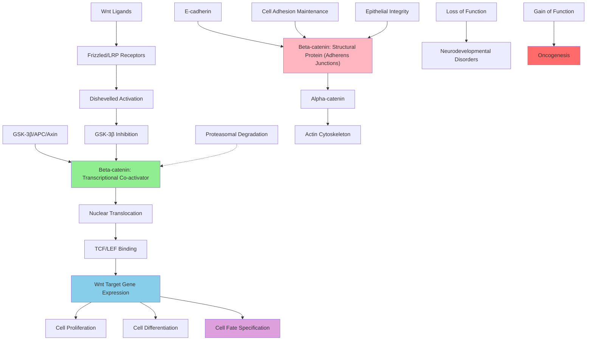

# Pathway Summary for Ctnnb1

## Overview
Beta-catenin (Ctnnb1) is a multifunctional protein with dual critical roles in cell adhesion and Wnt signaling [Q02248]. At adherens junctions, it links E-cadherin to alpha-catenin and the actin cytoskeleton to maintain epithelial integrity, while in the canonical Wnt pathway, stabilized beta-catenin translocates to the nucleus to act as a transcriptional co-activator with TCF/LEF transcription factors [file:mouse/Ctnnb1/Ctnnb1-deep-research.md]. This dual functionality makes beta-catenin essential for embryonic development, tissue homeostasis, and when dysregulated, contributes to cancer progression.

## Canonical Wnt Signaling Pathway
Beta-catenin serves as the central effector of the canonical Wnt signaling pathway, controlling cell proliferation, differentiation, and fate specification during development and tissue homeostasis [file:mouse/Ctnnb1/Ctnnb1-deep-research.md]. In the absence of Wnt ligands, beta-catenin is phosphorylated by the GSK-3β/APC/Axin destruction complex and targeted for proteasomal degradation. Upon Wnt stimulation, this destruction complex is disrupted, allowing beta-catenin to accumulate and translocate to the nucleus where it forms transcriptional complexes with TCF/LEF factors to activate target gene expression [PMID:28463231].

## Cell Adhesion and Junction Formation
At adherens junctions, beta-catenin functions as a structural component linking E-cadherin to the actin cytoskeleton through its interaction with alpha-catenin [Q02248]. This adhesion function is essential for maintaining epithelial integrity and coordinating cell behaviors during morphogenetic processes. The protein's 12 Armadillo repeats form a versatile protein interaction interface that mediates binding to both cadherin cytoplasmic tails and various cytoplasmic signaling proteins.

## Cell Fate Specification and Development
Beta-catenin is essential for cell fate specification through its transcriptional co-activator role in Wnt signaling [PMID:28463231]. The protein partners with TCF/LEF transcription factors to drive expression of genes controlling cell differentiation and fate determination during embryonic development and adult tissue maintenance. This function is particularly critical during gastrulation, axis formation, and organogenesis where precise spatial and temporal control of gene expression is required [file:mouse/Ctnnb1/Ctnnb1-deep-research.md].

## Epithelial Cell Development and Morphogenesis
Beta-catenin plays dual roles in epithelial cell development, functioning both in cell adhesion maintenance and transcriptional regulation [PMID:16102745]. During epithelial morphogenesis, the protein coordinates cell-cell adhesion with gene expression programs that control proliferation, differentiation, and apoptosis. Loss of beta-catenin disrupts coordinated epithelial cell behavior and can lead to loss of epithelial integrity and aberrant morphogenetic movements.

## Pathway Diagram

## Tissue Homeostasis and Stem Cell Regulation
Beta-catenin is critical for maintaining tissue homeostasis and regulating stem cell behavior in various adult tissues including intestine, skin, and hair follicles [file:mouse/Ctnnb1/Ctnnb1-deep-research.md]. The protein's Wnt signaling function controls stem cell self-renewal, proliferation, and differentiation decisions. Dysregulation of beta-catenin in stem cells can lead to either tissue degeneration or inappropriate proliferation and tumor formation.

## Embryonic Development and Axis Formation
During embryonic development, beta-catenin is essential for gastrulation, axis formation, and organogenesis [Q02248]. The protein's transcriptional activity establishes morphogen gradients and controls the expression of homeotic genes that specify body axis patterning. Its adhesion function is equally important for coordinating cell movements and maintaining tissue integrity during the dramatic morphogenetic changes of early development.

## Cancer and Oncogenic Transformation
Mutations in beta-catenin or its regulatory partners are frequently found in cancers, particularly colorectal cancer where APC mutations lead to beta-catenin stabilization and oncogenic transformation [Q02248]. Aberrant beta-catenin signaling drives tumor cell proliferation, invasion, and metastasis through activation of oncogenic gene expression programs. The protein's dual role in adhesion and signaling makes it a central player in the epithelial-to-mesenchymal transition associated with cancer progression.

## Protein Interaction Networks and Regulation
Beta-catenin's Armadillo repeat domain provides a versatile platform for protein-protein interactions with numerous binding partners including cadherins, APC, TCF/LEF, and various co-activators and co-repressors [file:mouse/Ctnnb1/Ctnnb1-deep-research.md]. The protein's stability and subcellular localization are tightly regulated through phosphorylation events, particularly by GSK-3β, which targets the protein for degradation. Additional post-translational modifications including ubiquitination and acetylation fine-tune its activity and interactions.

## Therapeutic Implications and Drug Development
Beta-catenin represents both a therapeutic target and a potential biomarker in cancer treatment. Small molecules targeting the Wnt/beta-catenin pathway are being developed as cancer therapeutics, while beta-catenin levels and mutations serve as prognostic markers. Understanding the protein's dual functions also informs strategies for tissue engineering and regenerative medicine applications where controlled Wnt signaling is desired for tissue repair and organ regeneration.