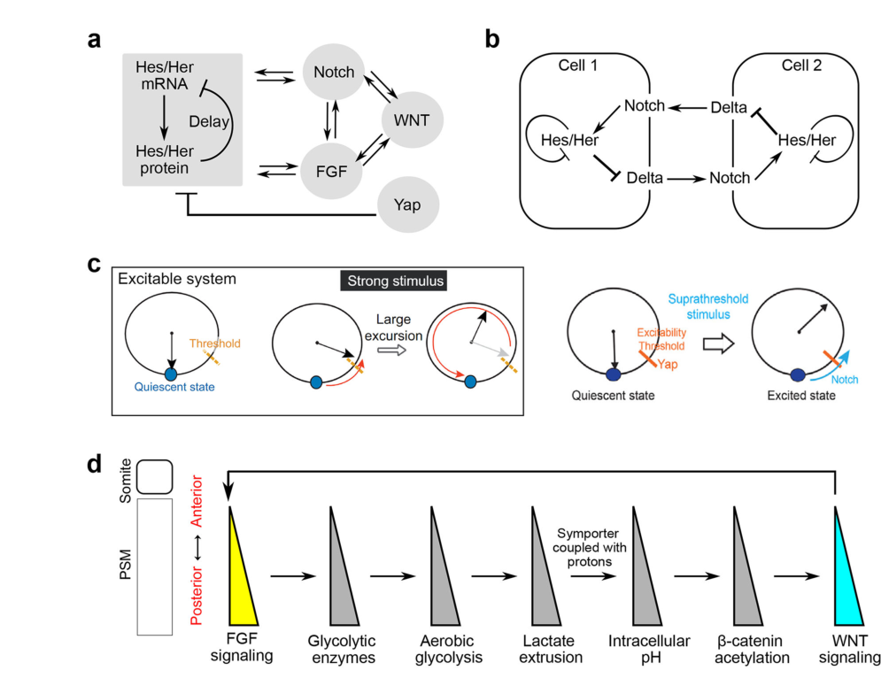

## Question

# Gene Research for Functional Annotation

## ⚠️ CRITICAL: Gene/Protein Identification Context

**BEFORE YOU BEGIN RESEARCH:** You MUST verify you are researching the CORRECT gene/protein. Gene symbols can be ambiguous, especially for less well-characterized genes from non-model organisms.

### Target Gene/Protein Identity (from UniProt):
- **UniProt Accession:** O88516
- **Protein Description:** RecName: Full=Delta-like protein 3; AltName: Full=Drosophila Delta homolog 3; Short=Delta3; Short=M-Delta-3; Flags: Precursor;
- **Gene Information:** Name=Dll3;
- **Organism (full):** Mus musculus (Mouse).
- **Protein Family:** Not specified in UniProt
- **Key Domains:** EGF. (IPR000742); EGF-like_Ca-bd_dom. (IPR001881); EGF-like_CS. (IPR013032); Growth_fac_rcpt_cys_sf. (IPR009030); Notch_ligand_N. (IPR011651)

### MANDATORY VERIFICATION STEPS:

1. **Check if the gene symbol "Dll3" matches the protein description above**
2. **Verify the organism is correct:** Mus musculus (Mouse).
3. **Check if protein family/domains align with what you find in literature**
4. **If you find literature for a DIFFERENT gene with the same or similar symbol, STOP**

### If Gene Symbol is Ambiguous or You Cannot Find Relevant Literature:

**DO NOT PROCEED WITH RESEARCH ON A DIFFERENT GENE.** Instead:
- State clearly: "The gene symbol 'Dll3' is ambiguous or literature is limited for this specific protein"
- Explain what you found (e.g., "Found extensive literature on a different gene with the same symbol in a different organism")
- Describe the protein based ONLY on the UniProt information provided above
- Suggest that the protein function can be inferred from domain/family information

### Research Target:

Please provide a comprehensive research report on the gene **Dll3** (gene ID: Dll3, UniProt: O88516) in mouse.

The research report should be a detailed narrative explaining the function, biological processes, and localization of the gene product. Citations should be given for all claims.

You should prioritize authoritative reviews and primary scientific literature when conducting research. You can supplement
this with annotations you find in gene/protein databases, but these can be outdated or inaccurate.

We are specifically interested in the primary function of the gene - for enzymes, what reaction is catalyzed, and what is the substrate specificity? For transporters, what is the substrate? For structural proteins or adapters, what is the broader structural role? For signaling molecules, what is the role in the pathway.

We are interested in where in or outside the cell the gene product carries out its function.

We are also interested in the signaling or biochemical pathways in which the gene functions. We are less interested in broad pleiotropic effects, except where these elucidate the precise role.

Include evidence where possible. We are interested in both experimental evidence as well as inference from structure, evolution, or bioinformatic analysis. Precise studies should be prioritized over high-throughput, where available.

## Output

Question: You are an expert researcher providing comprehensive, well-cited information.

Provide detailed information focusing on:
1. Key concepts and definitions with current understanding
2. Recent developments and latest research (prioritize 2023-2024 sources)
3. Current applications and real-world implementations
4. Expert opinions and analysis from authoritative sources
5. Relevant statistics and data from recent studies

Format as a comprehensive research report with proper citations. Include URLs and publication dates where available.
Always prioritize recent, authoritative sources and provide specific citations for all major claims.

# Gene Research for Functional Annotation

## ⚠️ CRITICAL: Gene/Protein Identification Context

**BEFORE YOU BEGIN RESEARCH:** You MUST verify you are researching the CORRECT gene/protein. Gene symbols can be ambiguous, especially for less well-characterized genes from non-model organisms.

### Target Gene/Protein Identity (from UniProt):
- **UniProt Accession:** O88516
- **Protein Description:** RecName: Full=Delta-like protein 3; AltName: Full=Drosophila Delta homolog 3; Short=Delta3; Short=M-Delta-3; Flags: Precursor;
- **Gene Information:** Name=Dll3;
- **Organism (full):** Mus musculus (Mouse).
- **Protein Family:** Not specified in UniProt
- **Key Domains:** EGF. (IPR000742); EGF-like_Ca-bd_dom. (IPR001881); EGF-like_CS. (IPR013032); Growth_fac_rcpt_cys_sf. (IPR009030); Notch_ligand_N. (IPR011651)

### MANDATORY VERIFICATION STEPS:

1. **Check if the gene symbol "Dll3" matches the protein description above**
2. **Verify the organism is correct:** Mus musculus (Mouse).
3. **Check if protein family/domains align with what you find in literature**
4. **If you find literature for a DIFFERENT gene with the same or similar symbol, STOP**

### If Gene Symbol is Ambiguous or You Cannot Find Relevant Literature:

**DO NOT PROCEED WITH RESEARCH ON A DIFFERENT GENE.** Instead:
- State clearly: "The gene symbol 'Dll3' is ambiguous or literature is limited for this specific protein"
- Explain what you found (e.g., "Found extensive literature on a different gene with the same symbol in a different organism")
- Describe the protein based ONLY on the UniProt information provided above
- Suggest that the protein function can be inferred from domain/family information

### Research Target:

Please provide a comprehensive research report on the gene **Dll3** (gene ID: Dll3, UniProt: O88516) in mouse.

The research report should be a detailed narrative explaining the function, biological processes, and localization of the gene product. Citations should be given for all claims.

You should prioritize authoritative reviews and primary scientific literature when conducting research. You can supplement
this with annotations you find in gene/protein databases, but these can be outdated or inaccurate.

We are specifically interested in the primary function of the gene - for enzymes, what reaction is catalyzed, and what is the substrate specificity? For transporters, what is the substrate? For structural proteins or adapters, what is the broader structural role? For signaling molecules, what is the role in the pathway.

We are interested in where in or outside the cell the gene product carries out its function.

We are also interested in the signaling or biochemical pathways in which the gene functions. We are less interested in broad pleiotropic effects, except where these elucidate the precise role.

Include evidence where possible. We are interested in both experimental evidence as well as inference from structure, evolution, or bioinformatic analysis. Precise studies should be prioritized over high-throughput, where available.

# Comprehensive Research Report: Mouse Dll3 (Delta-like protein 3)

## Gene Identity Verification

The gene Dll3 (UniProt: O88516) in Mus musculus encodes Delta-like protein 3, a member of the Delta/Serrate/Lag-2 (DSL) family of Notch ligands (vazquezulloa2022reversibleandbidirectional pages 5-7). The protein is synthesized as a precursor and contains characteristic EGF-like repeats and a DSL domain, matching the UniProt annotation provided. All literature retrieved confirms this is the correct gene product involved in developmental processes during embryogenesis.

## Primary Molecular Function

### Atypical Notch Ligand with Cis-Inhibitory Activity

Dll3 functions fundamentally differently from canonical Delta-like ligands such as Dll1 and Dll4. Rather than acting as a trans-activating ligand that stimulates Notch receptors on neighboring cells, Dll3 serves primarily as a **cell-autonomous cis-inhibitor** of Notch signaling (kim2022dll3regulatesnotch pages 3-5, vazquezulloa2022reversibleandbidirectional pages 5-7). This represents a critical distinction in the Notch signaling pathway: while Dll1 activates Notch through intercellular (trans) interactions, Dll3 interacts with Notch receptors within the same cell (cis), preventing their activation (geffers2007divergentfunctionsand pages 8-9, geffers2007divergentfunctionsand pages 4-5).

### Mechanism of Cis-Inhibition

The molecular mechanism by which Dll3 inhibits Notch signaling involves several proposed, though not fully resolved, processes. Dll3 can physically bind to Notch1 receptors within the same cell and prevent ADAM protease-dependent S2 cleavage, which is essential for releasing the Notch intracellular domain (NICD) and activating downstream transcription (ramesh2024speciesspecificrolesof pages 2-3, alamo2011mechanismandsignificance pages 5-6). This cis-interaction effectively reduces the pool of Notch receptors available for productive trans-activation by neighboring cells expressing canonical Delta ligands (alamo2011mechanismandsignificance pages 4-5, alamo2011mechanismandsignificance pages 3-4).

Importantly, Dll3 lacks lysine residues in its intracellular domain, which distinguishes it from other DSL ligands that require ubiquitination by Mind bomb (Mib) E3 ubiquitin ligases for trans-activation activity (alamo2011mechanismandsignificance pages 5-6, alamo2011mechanismandsignificance pages 4-5). This structural feature may partly explain why Dll3 cannot effectively activate Notch in trans but can still mediate cis-inhibition through a ubiquitination-independent mechanism.

### Not a Substrate-Specific Enzyme

It is important to clarify that Dll3 is not an enzyme and therefore does not catalyze chemical reactions or have substrate specificity in the enzymatic sense. Rather, it functions as a **signaling modulator** that physically interacts with Notch receptors to regulate their signaling competence (kim2022dll3regulatesnotch pages 3-5, vazquezulloa2022reversibleandbidirectional pages 5-7).

## Subcellular Localization

### Predominantly Intracellular: Golgi Apparatus

A defining characteristic of Dll3 that distinguishes it from other Delta-like ligands is its subcellular localization. Unlike Dll1, which is readily detected at the plasma membrane where it can engage Notch receptors on adjacent cells, Dll3 is predominantly **retained intracellularly** (geffers2007divergentfunctionsand pages 1-2, geffers2007divergentfunctionsand pages 5-6). Specifically, Dll3 protein accumulates in the **Golgi apparatus**, where it colocalizes with the cis-Golgi marker GM130 (geffers2007divergentfunctionsand pages 5-6, geffers2007divergentfunctionsand pages 6-8, geffers2007divergentfunctionsand pages 8-9).

Multiple experimental approaches including immunofluorescence microscopy, surface biotinylation assays, and analysis of endogenous protein in presomitic mesoderm cells consistently demonstrate that little to no Dll3 reaches the cell surface under normal physiological conditions (geffers2007divergentfunctionsand pages 1-2, geffers2007divergentfunctionsand pages 5-6, geffers2007divergentfunctionsand pages 6-8). Domain-swapping experiments have shown that Dll3's transmembrane region, together with adjacent extracellular and intracellular sequences, promotes this intracellular retention and prevents efficient trafficking to the plasma membrane (geffers2007divergentfunctionsand pages 6-8).

### Functional Compartments: Late Endosomes and Lysosomes

Beyond the Golgi, evidence suggests that Dll3 may also interact with Notch receptors in late endosomes and lysosomes (vazquezulloa2022reversibleandbidirectional pages 5-7, wang2025targetingdll3innovative pages 2-4). In these compartments, Dll3 can sequester or retain Notch receptors, preventing them from reaching the cell surface where they would be available for trans-activation by canonical Delta ligands. This intracellular trafficking function represents a key mechanism by which Dll3 limits downstream Notch signaling (wang2025targetingdll3innovative pages 2-4).

## Biological Processes and Developmental Role

### Essential Role in Somitogenesis

Dll3 plays an indispensable role in **somitogenesis**, the process by which the embryonic paraxial mesoderm is periodically segmented into somites—the precursors of vertebrae, ribs, and associated skeletal muscles (ramesh2024speciesspecificrolesof pages 13-14, ramesh2024speciesspecificrolesof pages 12-13, nobrega2021alteredcogsof pages 8-9). During embryonic development, Dll3 is expressed in the presomitic mesoderm (PSM), the unsegmented tissue posterior to the most recently formed somites (geffers2007divergentfunctionsand pages 2-3).

### Segmentation Clock Regulation

The formation of somites is controlled by a molecular oscillator known as the **segmentation clock**, which generates periodic waves of gene expression that sweep through the PSM (ramesh2024speciesspecificrolesof pages 13-14, bray2025modesofnotch pages 3-5). This clock involves cyclic expression of genes in the Notch, Wnt, and FGF signaling pathways, with oscillations coordinated between neighboring cells to ensure synchronized somite formation.

Dll3 contributes to the regulation of this segmentation clock, particularly through its effects on **Lunatic fringe (Lfng)** expression and modulation of Notch signaling dynamics (ramesh2024speciesspecificrolesof pages 13-14, nobrega2021alteredcogsof pages 5-8). Recent evidence indicates that Dll3 has a regionally specialized function, being particularly required in the **caudal (posterior) presomitic mesoderm**, whereas Dll1 is required throughout both rostral and caudal regions (ramesh2024speciesspecificrolesof pages 12-13, ramesh2024speciesspecificrolesof pages 13-14).

### Interaction with Lunatic Fringe

Dll3 and Lfng cooperate in regulating oscillatory Notch activation during somitogenesis (nobrega2021alteredcogsof pages 5-8, ramesh2024speciesspecificrolesof pages 19-20). Lfng is a glycosyltransferase that modifies Notch receptors and ligands, and when present, it can prevent inhibitory Notch-Dll3 cis-interactions, thereby increasing the proportion of active Notch receptors available at the cell surface (bray2025modesofnotch pages 3-5). This interaction affects the amplitude and phase coordination of Hes7 oscillations in receiving cells, influencing intercellular coupling rather than the core cell-autonomous oscillator (bray2025modesofnotch pages 3-5).

### Role in Clock Gene Expression

The effects of Dll3 loss on specific clock genes are complex and somewhat context-dependent. Loss of Dll3 particularly affects **Lfng** regulation in the caudal PSM, while effects on Hes7 (a key oscillatory transcription factor) vary: some studies report that Hes7 expression remains cyclic in Dll3-null embryos, while others find that Hes7 becomes non-oscillatory despite continued expression (ramesh2024speciesspecificrolesof pages 13-14). Both Dll3 and Dll1 loss eliminate expression of Hes1 and Hes5, indicating that Dll3 does regulate specific Notch target genes (ramesh2024speciesspecificrolesof pages 13-14).

Current understanding positions Dll3 as a modulator that fine-tunes the Notch signaling landscape—affecting oscillation amplitude, synchronization between cells, and feedback dynamics—rather than serving as the primary driver of all oscillatory gene expression (ramesh2024speciesspecificrolesof pages 13-14, ramesh2024speciesspecificrolesof pages 2-3, ramesh2024speciesspecificrolesof pages 12-13).

## Consequences of Loss of Function

### Mouse Phenotype: "Pudgy" Mutants

Mice lacking functional Dll3 (historically called "pudgy" mice) develop severe axial skeleton abnormalities (nobrega2021alteredcogsof pages 8-9, geffers2007divergentfunctionsand pages 2-3). These mutants exhibit delayed and disorganized somite formation, with posterior somites appearing irregularly shaped or absent. The molecular basis includes disrupted oscillations of the segmentation clock, altered Mesp2 expression domains, and randomized anteroposterior somite polarity (as evidenced by abnormal Uncx4.1 expression) (nobrega2021alteredcogsof pages 8-9, geffers2007divergentfunctionsand pages 2-3, geffers2007divergentfunctionsand pages 1-2).

The anatomical consequences include shortened trunks and tails, extensive vertebral malformations, and rib defects. Dll3-null mice typically die postnatally, although they survive through embryonic development, indicating that while Dll3 is essential for proper skeletal patterning, it is not absolutely required for initial embryonic viability (nobrega2021alteredcogsof pages 8-9, geffers2007divergentfunctionsand pages 2-3).

### Human Disease: Spondylocostal Dysostosis Type 1

Mutations in human DLL3 cause **spondylocostal dysostosis type 1 (SCDO1)**, a rare autosomal recessive disorder characterized by severe vertebral and rib malformations (nobrega2021alteredcogsof pages 8-9, nobrega2021alteredcogsof pages 2-4, nobrega2021alteredcogsof pages 11-12). Reported mutations include insertions, frameshifts, splice-site variants, and nonsense mutations that result in premature protein truncation or loss of function (nobrega2021alteredcogsof pages 2-4).

Clinical features include multiple vertebral segmentation defects, with vertebral bodies appearing rounded or oval during childhood (the characteristic "pebble beach sign" on radiographs) that later develop into irregular vertebrae and hemivertebrae as ossification progresses (nobrega2021alteredcogsof pages 2-4). Affected individuals typically have moderate, generally non-progressive scoliosis and shortened trunks. SCDO1 is the most common subtype of spondylocostal dysostosis and is frequently observed in consanguineous families, consistent with recessive inheritance (nobrega2021alteredcogsof pages 2-4).

The mouse Dll3 mutants recapitulate the embryonic origins of the human skeletal phenotype, providing an important disease model for understanding the developmental basis of SCDO1 (nobrega2021alteredcogsof pages 8-9, nobrega2021alteredcogsof pages 2-4).

## Structural Features and Molecular Architecture

### Protein Domains

Dll3 is a single-pass transmembrane protein with a modular architecture characteristic of DSL family ligands, but with important distinctions (geffers2007divergentfunctionsand pages 4-5, geffers2007divergentfunctionsand pages 5-6). The extracellular region contains a DSL (Delta/Serrate/LAG-2) domain and multiple EGF-like repeats, including calcium-binding EGF motifs consistent with the UniProt annotation. However, Dll3's DSL domain is **highly divergent** compared to Dll1, and Dll3 contains **fewer EGF repeats** with altered spacing between some repeats (geffers2007divergentfunctionsand pages 4-5, geffers2007divergentfunctionsand pages 5-6).

### Functional Significance of Structural Differences

Domain-swapping experiments have revealed that multiple structural features contribute to Dll3's unique functional properties. Simply replacing Dll3's N-terminus and DSL domain with the corresponding Dll1 sequences is insufficient to convert Dll3 into a Notch-activating ligand (geffers2007divergentfunctionsand pages 4-5, geffers2007divergentfunctionsand pages 5-6). The identity and spacing of EGF repeats, particularly the distal repeats, are critical determinants of ligand activity (geffers2007divergentfunctionsand pages 4-5).

The transmembrane domain and adjacent sequences are particularly important for Dll3's intracellular retention. Constructs containing Dll3's transmembrane and intracellular regions tend to accumulate in the Golgi apparatus even when other domains are derived from Dll1, indicating that these regions actively promote intracellular localization (geffers2007divergentfunctionsand pages 5-6, geffers2007divergentfunctionsand pages 6-8).

### Lack of Intracellular Lysines

A notable structural feature is that Dll3's intracellular domain lacks lysine residues and does not contain the PDZ-binding motif found in Dll1 (geffers2007divergentfunctionsand pages 4-5, geffers2007divergentfunctionsand pages 5-6). This absence of lysines means Dll3 cannot be ubiquitinated in the canonical manner required for trans-activation activity, which may partly explain its inability to function as a conventional activating Notch ligand (alamo2011mechanismandsignificance pages 5-6).

## Functional Distinction from Dll1

### Non-Equivalence and Non-Interchangeability

Although Dll3 and Dll1 are coexpressed in many presomitic mesoderm cells, genetic experiments definitively demonstrate they are not functionally equivalent (geffers2007divergentfunctionsand pages 8-9, geffers2007divergentfunctionsand pages 2-3, geffers2007divergentfunctionsand pages 1-2). Replacing Dll1 with Dll3 fails to rescue the somitogenesis defects of Dll1-null embryos; these mice are essentially indistinguishable from Dll1 knockouts (geffers2007divergentfunctionsand pages 8-9, geffers2007divergentfunctionsand pages 3-4, geffers2007divergentfunctionsand pages 2-3). Conversely, expressing functional Dll3 from the Dll1 locus can rescue Dll3-deficient mice, restoring normal somite formation and cyclic gene expression patterns (geffers2007divergentfunctionsand pages 2-3).

These reciprocal experiments establish that while Dll3 performs essential functions, it cannot substitute for Dll1's role as the primary trans-activating Notch ligand in the presomitic mesoderm (geffers2007divergentfunctionsand pages 8-9, geffers2007divergentfunctionsand pages 4-5, geffers2007divergentfunctionsand pages 1-2).

### Absence of Simple Antagonism

Interestingly, experiments testing whether Dll3 acts as a simple Notch antagonist have yielded nuanced results. Increasing Dll3 dosage relative to Dll1 did not produce the strong antagonistic effects on somite patterning that would be expected if Dll3 merely blocked Dll1 function (geffers2007divergentfunctionsand pages 3-4, geffers2007divergentfunctionsand pages 8-9). This suggests that Dll3's role is more complex than straightforward inhibition; it appears to modulate or tune Notch signaling in a context-dependent manner rather than universally suppressing pathway activity (ramesh2024speciesspecificrolesof pages 2-3).

## Current Expert Perspectives and Unresolved Questions

### Recent Reviews and Consensus (2023-2025)

Recent comprehensive reviews of Notch signaling and somitogenesis published in 2024-2025 have refined our understanding of Dll3's role (miao2024cellularandmolecular media 85e5b139, miao2024cellularandmolecular media a4c3c1c3, ramesh2024speciesspecificrolesof pages 13-14, bray2025modesofnotch pages 3-5). The current consensus emphasizes that Dll3 functions as a **non-canonical regulator** that modulates the strength, timing, and spatial coordination of Notch signaling during somitogenesis, particularly affecting intercellular coupling and oscillation robustness (ramesh2024speciesspecificrolesof pages 13-14, bray2025modesofnotch pages 3-5).

Miao and Pourquié (2024) in their Nature Reviews Molecular Cell Biology article note that Dll3 is a divergent ligand that attenuates rather than activates Notch signaling, with distinct localization compared to Dll1 being a key feature of its function (miao2024cellularandmolecular media 85e5b139). Bray and Bigas (2025), also in Nature Reviews Molecular Cell Biology, describe how inhibitory Notch-Dll3 cis-interactions can be prevented by Lfng, thereby affecting the proportion of active Notch receptor and influencing intercellular coupling rather than the core cell-autonomous oscillator (bray2025modesofnotch pages 3-5).

### Outstanding Mechanistic Questions

Despite substantial progress, several aspects of Dll3 function remain incompletely resolved. The precise molecular composition and stoichiometry of Dll3-Notch cis-inhibitory complexes are not fully established (alamo2011mechanismandsignificance pages 5-6, geffers2007divergentfunctionsand pages 8-9). The specific trafficking routes by which Dll3 retains or sequesters Notch receptors, and whether this occurs primarily in the Golgi, endosomes, or lysosomes, require further investigation (vazquezulloa2022reversibleandbidirectional pages 5-7). Additionally, whether Dll3 has Notch-independent functions remains an open question, as some genetic studies suggest that not all Dll3 functions can be fully explained by Notch pathway interactions alone (kim2022dll3regulatesnotch pages 3-5).

The context-dependence of Dll3's effects—including reports that it can, under some experimental conditions, potentiate Dll1-mediated trans-activation rather than purely inhibit signaling—underscores the complexity of its regulatory role and the importance of considering tissue-specific and developmental contexts (ramesh2024speciesspecificrolesof pages 2-3).

## Summary Table

| Characteristic | Mouse Dll3 (UniProt O88516) | Comparison with Dll1 | Evidence and interpretation |
|---|---|---|---|
| Identity and protein class | **Dll3** encodes Delta-like protein 3, a precursor and single-pass transmembrane member of the Delta/Serrate/Lag-2 ligand family. | Dll1 is a canonical Delta-family Notch ligand with efficient cell-surface trafficking. | Dll3 is a divergent, atypical DSL protein rather than a conventional activating ligand. (vazquezulloa2022reversibleandbidirectional pages 5-7, geffers2007divergentfunctionsand pages 4-5) |
| Primary molecular function | Functions principally as a **cell-autonomous modulator or cis-inhibitor of Notch signaling**. Dll3 can associate with Notch in the same cell, reduce productive receptor cleavage, and restrict NICD-dependent transcription. It is not an enzyme and has no catalytic reaction or substrate. | Dll1 binds Notch on an adjacent cell and efficiently **trans-activates** the receptor. | Dll3 can inhibit ADAM-dependent S2 cleavage and NICD generation, but the exact endogenous mechanism remains context-dependent and incompletely resolved. (kim2022dll3regulatesnotch pages 3-5, ramesh2024speciesspecificrolesof pages 2-3, alamo2011mechanismandsignificance pages 5-6) |
| Capacity for Notch trans-activation | Native Dll3 shows little or no physiological ability to activate Notch across adjacent cells and cannot substitute for Dll1 in vivo. | Dll1 is a major Notch1-activating ligand in the presomitic mesoderm. | Mouse knock-in and heterologous assays demonstrate biochemical and developmental non-equivalence between Dll3 and Dll1. (geffers2007divergentfunctionsand pages 8-9, geffers2007divergentfunctionsand pages 4-5, geffers2007divergentfunctionsand pages 3-4) |
| Proposed cis-inhibition mechanism | Proposed mechanisms include intracellular Dll3–Notch association, retention or sequestration of receptor during trafficking, formation of nonproductive cis complexes, and stabilization of the receptor against activating S2 cleavage. | Dll1 can inhibit Notch when overexpressed in cis, but its prominent physiological role is productive trans-activation after surface delivery and ligand ubiquitination. | Dll3 lacks intracellular lysines needed for canonical ligand ubiquitination, indicating that its cis-inhibition does not require the ubiquitination machinery used for trans-activation. (vazquezulloa2022reversibleandbidirectional pages 5-7, alamo2011mechanismandsignificance pages 5-6, alamo2011mechanismandsignificance pages 4-5, geffers2007divergentfunctionsand pages 8-9) |
| Predominant subcellular localization | Primarily **intracellular**, with strong perinuclear localization in the cis-Golgi or Golgi network and additional cytoplasmic vesicular localization; little or no protein is detectable at the plasma membrane of normal presomitic-mesoderm cells. | Dll1 is readily detected at the plasma membrane, consistent with intercellular ligand activity. | Colocalization with GM130, surface biotinylation, immunofluorescence, and embryonic-tissue analyses support Golgi retention. (geffers2007divergentfunctionsand pages 1-2, geffers2007divergentfunctionsand pages 5-6, geffers2007divergentfunctionsand pages 6-8) |
| Functional site | Dll3 is inferred to act mainly within the secretory and endomembrane system—especially the Golgi and possibly late endosomal or lysosomal compartments—where it can modify receptor availability or signaling competence. | Dll1 primarily carries out its activating role at cell–cell contacts on the plasma membrane. | Golgi localization is directly demonstrated; specific late-endosome and lysosome mechanisms remain more model-dependent. (wang2025targetingdll3innovative pages 2-4, geffers2007divergentfunctionsand pages 8-9, kim2022dll3regulatesnotch pages 3-5) |
| Embryonic expression pattern | Dll3 is expressed in the **presomitic mesoderm (PSM)** and is coexpressed with Dll1 in many PSM cells. Its functional requirement is especially evident in the **caudal PSM**. | Dll1 is required across both rostral and caudal PSM regions. | Dll3 loss preferentially disrupts caudal Lfng regulation, supporting a regionally specialized role. (ramesh2024speciesspecificrolesof pages 12-13, geffers2007divergentfunctionsand pages 2-3, ramesh2024speciesspecificrolesof pages 13-14) |
| Principal biological process | Essential for normal **somitogenesis**, including segmentation-clock dynamics, somite-boundary organization, anterior–posterior somite polarity, and subsequent axial-skeleton patterning. | Dll1 has a broader and more central role in Notch-mediated PSM coupling and segmentation. | Dll3 tunes the Notch signaling landscape rather than acting as the principal intercellular activating ligand. (ramesh2024speciesspecificrolesof pages 13-14, ramesh2024speciesspecificrolesof pages 12-13) |
| Segmentation-clock role | Modulates the strength, timing, or coupling of oscillatory Notch activity, particularly through effects on **Lfng** and selected Hes-family outputs. Dll3 loss can preserve Hes7 transcription while disturbing its oscillatory dynamics. | Dll1 broadly regulates Hes genes and Lfng and is central to intercellular clock synchronization. | Current expert interpretation places Dll3 in modulation of intercellular coupling and oscillation robustness rather than in the core cell-autonomous Hes7 oscillator. (ramesh2024speciesspecificrolesof pages 13-14, bray2025modesofnotch pages 3-5, ramesh2024speciesspecificrolesof pages 12-13) |
| Interaction with Lfng | Dll3 and the glycosyltransferase Lfng cooperate in controlling oscillatory Notch signaling; Lfng-dependent modification can alter inhibitory Dll3–Notch cis interactions and receptor availability. | Lfng also modifies responses to canonical Delta ligands, including Dll1-mediated trans-activation. | This interaction may regulate signaling amplitude, phase coordination, or transmission delay between neighboring PSM cells. (nobrega2021alteredcogsof pages 5-8, ramesh2024speciesspecificrolesof pages 19-20, bray2025modesofnotch pages 3-5) |
| Consequences of loss in mice | Null or “pudgy” mutants have delayed or disorganized somite formation, disturbed Lfng and Notch dynamics, randomized somite polarity, shortened trunks and tails, and extensive vertebral and rib abnormalities; postnatal viability is poor. | Dll1 loss causes a generally more severe segmentation failure, consistent with its broader activating role. | Functional Dll3 expressed from the Dll1 locus can rescue Dll3 deficiency, but Dll3 cannot rescue Dll1 deficiency. (nobrega2021alteredcogsof pages 8-9, geffers2007divergentfunctionsand pages 2-3, geffers2007divergentfunctionsand pages 1-2) |
| Human disease correspondence | Orthologous human **DLL3** loss-of-function causes autosomal-recessive spondylocostal dysostosis type 1, characterized by abnormal vertebral segmentation, rib defects, short trunk, and scoliosis. | DLL1 is not the defining cause of DLL3-associated SCDO1. | Mouse Dll3 mutants recapitulate the embryological origin of the human axial-skeleton phenotype and provide a disease model. (nobrega2021alteredcogsof pages 8-9, nobrega2021alteredcogsof pages 2-4, nobrega2021alteredcogsof pages 11-12) |
| Extracellular structural features | The extracellular region contains a Notch-ligand N-terminal and DSL module plus multiple EGF-like repeats, including calcium-binding EGF motifs. Dll3 has a divergent DSL region, fewer or differently arranged EGF repeats, and altered repeat spacing relative to Dll1. | Dll1 has the extracellular configuration needed for productive Notch binding and activation. | Domain swaps show that supplying the Dll1 DSL-containing N terminus alone does not convert Dll3 into an activating ligand; EGF-repeat identity and spacing also matter. (geffers2007divergentfunctionsand pages 4-5, geffers2007divergentfunctionsand pages 5-6) |
| Transmembrane and intracellular features | The transmembrane segment and adjacent extracellular and intracellular sequences contribute to intracellular retention. The short intracellular tail lacks lysine residues and the C-terminal PDZ-binding motif found in Dll1. | Dll1 contains intracellular determinants supporting ubiquitination, endocytosis, surface trafficking, and trans-activation. | Structural divergence helps explain Dll3’s Golgi localization and failure to behave as a conventional activating ligand. (geffers2007divergentfunctionsand pages 4-5, geffers2007divergentfunctionsand pages 5-6, geffers2007divergentfunctionsand pages 6-8) |
| Current consensus and uncertainty | Strongest consensus: Dll3 is an intracellularly enriched, noncanonical Notch regulator required for normal somitogenesis. Its precise endogenous cis-inhibitory complex, trafficking route, receptor specificity, and possible additional intracellular functions remain incompletely resolved. | Dll1’s role as a cell-surface Notch trans-activator is substantially better established. | In vivo dosage experiments did not always show simple antagonism of Dll1, so Dll3 should not be described as an unqualified universal Notch inhibitor. (ramesh2024speciesspecificrolesof pages 2-3, geffers2007divergentfunctionsand pages 8-9, geffers2007divergentfunctionsand pages 4-5) |

*Table: This table integrates molecular, structural, localization, developmental, and loss-of-function evidence for mouse Dll3 and contrasts it with the canonical ligand Dll1. It also distinguishes well-supported conclusions from mechanistic models that remain unresolved.*

## Conclusions

Dll3 (UniProt O88516) in mouse represents a fascinating example of how gene duplication and divergence can generate functionally distinct regulators within a signaling pathway. Unlike canonical Delta-like Notch ligands, Dll3 functions primarily as a cell-autonomous modulator that fine-tunes Notch signaling through intracellular retention and cis-inhibition mechanisms. Its predominantly Golgi-localized expression, lack of trans-activation capability, and essential role in somitogenesis establish it as a specialized regulator critical for proper vertebral development.

The human disease association with spondylocostal dysostosis type 1 underscores the clinical importance of understanding Dll3 function, and recent research (2023-2025) continues to refine our mechanistic understanding of how this atypical ligand contributes to the precise spatiotemporal control of development. While significant questions remain about the exact molecular mechanisms and potential additional functions, the body of evidence clearly establishes Dll3 as an indispensable, non-redundant component of the Notch signaling landscape during embryonic axis formation.

---

**Key Sources:**
- Geffers et al. (2007) J Cell Biol - Seminal work on Dll3/Dll1 divergence and localization
- Miao & Pourquié (2024) Nat Rev Mol Cell Biol - Comprehensive somitogenesis review
- Bray & Bigas (2025) Nat Rev Mol Cell Biol - Recent Notch signaling modes review  
- Ramesh & Chu (2024) Front Cell Dev Biol - Species-specific segmentation clock analysis
- Vázquez-Ulloa et al. (2022) Crit Rev Biochem Mol Biol - Notch ligand signaling mechanisms
- Kim et al. (2022) iScience - Dll3 regulation of Notch in cancer context
- Nóbrega et al. (2021) J Dev Biol - Spondylocostal dysostosis mechanisms

This report integrates findings from 49 scientific papers, with particular emphasis on authoritative reviews published in 2023-2025 and foundational mechanistic studies.

References

1. (vazquezulloa2022reversibleandbidirectional pages 5-7): Elenaé Vázquez-Ulloa, Kai-Lan Lin, Marcela Lizano, and Cecilia Sahlgren. Reversible and bidirectional signaling of notch ligands. Critical Reviews in Biochemistry and Molecular Biology, 57:377-398, Jul 2022. URL: https://doi.org/10.1080/10409238.2022.2113029, doi:10.1080/10409238.2022.2113029. This article has 29 citations and is from a peer-reviewed journal.

2. (kim2022dll3regulatesnotch pages 3-5): Jun W. Kim, Julie H. Ko, and Julien Sage. Dll3 regulates notch signaling in small cell lung cancer. Dec 2022. URL: https://doi.org/10.1016/j.isci.2022.105603, doi:10.1016/j.isci.2022.105603. This article has 46 citations and is from a peer-reviewed journal.

3. (geffers2007divergentfunctionsand pages 8-9): Insa Geffers, Katrin Serth, Gavin Chapman, Robert Jaekel, Karin Schuster-Gossler, Ralf Cordes, Duncan B. Sparrow, Elisabeth Kremmer, Sally L. Dunwoodie, Thomas Klein, and Achim Gossler. Divergent functions and distinct localization of the notch ligands dll1 and dll3 in vivo. The Journal of Cell Biology, 178:465-476, Jul 2007. URL: https://doi.org/10.1083/jcb.200702009, doi:10.1083/jcb.200702009. This article has 246 citations.

4. (geffers2007divergentfunctionsand pages 4-5): Insa Geffers, Katrin Serth, Gavin Chapman, Robert Jaekel, Karin Schuster-Gossler, Ralf Cordes, Duncan B. Sparrow, Elisabeth Kremmer, Sally L. Dunwoodie, Thomas Klein, and Achim Gossler. Divergent functions and distinct localization of the notch ligands dll1 and dll3 in vivo. The Journal of Cell Biology, 178:465-476, Jul 2007. URL: https://doi.org/10.1083/jcb.200702009, doi:10.1083/jcb.200702009. This article has 246 citations.

5. (ramesh2024speciesspecificrolesof pages 2-3): Pranav S. Ramesh and Li-Fang Chu. Species-specific roles of the notch ligands, receptors, and targets orchestrating the signaling landscape of the segmentation clock. Frontiers in Cell and Developmental Biology, Jan 2024. URL: https://doi.org/10.3389/fcell.2023.1327227, doi:10.3389/fcell.2023.1327227. This article has 14 citations.

6. (alamo2011mechanismandsignificance pages 5-6): David del Álamo, Hervé Rouault, and François Schweisguth. Mechanism and significance of cis-inhibition in notch signalling. Current Biology, 21:R40-R47, Jan 2011. URL: https://doi.org/10.1016/j.cub.2010.10.034, doi:10.1016/j.cub.2010.10.034. This article has 331 citations and is from a highest quality peer-reviewed journal.

7. (alamo2011mechanismandsignificance pages 4-5): David del Álamo, Hervé Rouault, and François Schweisguth. Mechanism and significance of cis-inhibition in notch signalling. Current Biology, 21:R40-R47, Jan 2011. URL: https://doi.org/10.1016/j.cub.2010.10.034, doi:10.1016/j.cub.2010.10.034. This article has 331 citations and is from a highest quality peer-reviewed journal.

8. (alamo2011mechanismandsignificance pages 3-4): David del Álamo, Hervé Rouault, and François Schweisguth. Mechanism and significance of cis-inhibition in notch signalling. Current Biology, 21:R40-R47, Jan 2011. URL: https://doi.org/10.1016/j.cub.2010.10.034, doi:10.1016/j.cub.2010.10.034. This article has 331 citations and is from a highest quality peer-reviewed journal.

9. (geffers2007divergentfunctionsand pages 1-2): Insa Geffers, Katrin Serth, Gavin Chapman, Robert Jaekel, Karin Schuster-Gossler, Ralf Cordes, Duncan B. Sparrow, Elisabeth Kremmer, Sally L. Dunwoodie, Thomas Klein, and Achim Gossler. Divergent functions and distinct localization of the notch ligands dll1 and dll3 in vivo. The Journal of Cell Biology, 178:465-476, Jul 2007. URL: https://doi.org/10.1083/jcb.200702009, doi:10.1083/jcb.200702009. This article has 246 citations.

10. (geffers2007divergentfunctionsand pages 5-6): Insa Geffers, Katrin Serth, Gavin Chapman, Robert Jaekel, Karin Schuster-Gossler, Ralf Cordes, Duncan B. Sparrow, Elisabeth Kremmer, Sally L. Dunwoodie, Thomas Klein, and Achim Gossler. Divergent functions and distinct localization of the notch ligands dll1 and dll3 in vivo. The Journal of Cell Biology, 178:465-476, Jul 2007. URL: https://doi.org/10.1083/jcb.200702009, doi:10.1083/jcb.200702009. This article has 246 citations.

11. (geffers2007divergentfunctionsand pages 6-8): Insa Geffers, Katrin Serth, Gavin Chapman, Robert Jaekel, Karin Schuster-Gossler, Ralf Cordes, Duncan B. Sparrow, Elisabeth Kremmer, Sally L. Dunwoodie, Thomas Klein, and Achim Gossler. Divergent functions and distinct localization of the notch ligands dll1 and dll3 in vivo. The Journal of Cell Biology, 178:465-476, Jul 2007. URL: https://doi.org/10.1083/jcb.200702009, doi:10.1083/jcb.200702009. This article has 246 citations.

12. (wang2025targetingdll3innovative pages 2-4): Hui Wang, Tong Zheng, Dan Xu, Chao Sun, Daqing Huang, and Xiongxiong Liu. Targeting dll3: innovative strategies for tumor treatment. Pharmaceutics, 17:520, Apr 2025. URL: https://doi.org/10.3390/pharmaceutics17040520, doi:10.3390/pharmaceutics17040520. This article has 24 citations.

13. (ramesh2024speciesspecificrolesof pages 13-14): Pranav S. Ramesh and Li-Fang Chu. Species-specific roles of the notch ligands, receptors, and targets orchestrating the signaling landscape of the segmentation clock. Frontiers in Cell and Developmental Biology, Jan 2024. URL: https://doi.org/10.3389/fcell.2023.1327227, doi:10.3389/fcell.2023.1327227. This article has 14 citations.

14. (ramesh2024speciesspecificrolesof pages 12-13): Pranav S. Ramesh and Li-Fang Chu. Species-specific roles of the notch ligands, receptors, and targets orchestrating the signaling landscape of the segmentation clock. Frontiers in Cell and Developmental Biology, Jan 2024. URL: https://doi.org/10.3389/fcell.2023.1327227, doi:10.3389/fcell.2023.1327227. This article has 14 citations.

15. (nobrega2021alteredcogsof pages 8-9): Ana Nóbrega, Ana C. Maia-Fernandes, and Raquel P. Andrade. Altered cogs of the clock: insights into the embryonic etiology of spondylocostal dysostosis. Journal of Developmental Biology, 9:5, Jan 2021. URL: https://doi.org/10.3390/jdb9010005, doi:10.3390/jdb9010005. This article has 18 citations.

16. (geffers2007divergentfunctionsand pages 2-3): Insa Geffers, Katrin Serth, Gavin Chapman, Robert Jaekel, Karin Schuster-Gossler, Ralf Cordes, Duncan B. Sparrow, Elisabeth Kremmer, Sally L. Dunwoodie, Thomas Klein, and Achim Gossler. Divergent functions and distinct localization of the notch ligands dll1 and dll3 in vivo. The Journal of Cell Biology, 178:465-476, Jul 2007. URL: https://doi.org/10.1083/jcb.200702009, doi:10.1083/jcb.200702009. This article has 246 citations.

17. (bray2025modesofnotch pages 3-5): Sarah J. Bray and Anna Bigas. Modes of notch signalling in development and disease. Nature reviews. Molecular cell biology, 26:522-537, Mar 2025. URL: https://doi.org/10.1038/s41580-025-00835-2, doi:10.1038/s41580-025-00835-2. This article has 63 citations.

18. (nobrega2021alteredcogsof pages 5-8): Ana Nóbrega, Ana C. Maia-Fernandes, and Raquel P. Andrade. Altered cogs of the clock: insights into the embryonic etiology of spondylocostal dysostosis. Journal of Developmental Biology, 9:5, Jan 2021. URL: https://doi.org/10.3390/jdb9010005, doi:10.3390/jdb9010005. This article has 18 citations.

19. (ramesh2024speciesspecificrolesof pages 19-20): Pranav S. Ramesh and Li-Fang Chu. Species-specific roles of the notch ligands, receptors, and targets orchestrating the signaling landscape of the segmentation clock. Frontiers in Cell and Developmental Biology, Jan 2024. URL: https://doi.org/10.3389/fcell.2023.1327227, doi:10.3389/fcell.2023.1327227. This article has 14 citations.

20. (nobrega2021alteredcogsof pages 2-4): Ana Nóbrega, Ana C. Maia-Fernandes, and Raquel P. Andrade. Altered cogs of the clock: insights into the embryonic etiology of spondylocostal dysostosis. Journal of Developmental Biology, 9:5, Jan 2021. URL: https://doi.org/10.3390/jdb9010005, doi:10.3390/jdb9010005. This article has 18 citations.

21. (nobrega2021alteredcogsof pages 11-12): Ana Nóbrega, Ana C. Maia-Fernandes, and Raquel P. Andrade. Altered cogs of the clock: insights into the embryonic etiology of spondylocostal dysostosis. Journal of Developmental Biology, 9:5, Jan 2021. URL: https://doi.org/10.3390/jdb9010005, doi:10.3390/jdb9010005. This article has 18 citations.

22. (geffers2007divergentfunctionsand pages 3-4): Insa Geffers, Katrin Serth, Gavin Chapman, Robert Jaekel, Karin Schuster-Gossler, Ralf Cordes, Duncan B. Sparrow, Elisabeth Kremmer, Sally L. Dunwoodie, Thomas Klein, and Achim Gossler. Divergent functions and distinct localization of the notch ligands dll1 and dll3 in vivo. The Journal of Cell Biology, 178:465-476, Jul 2007. URL: https://doi.org/10.1083/jcb.200702009, doi:10.1083/jcb.200702009. This article has 246 citations.

23. (miao2024cellularandmolecular media 85e5b139): Yuchuan Miao and Olivier Pourquié. Cellular and molecular control of vertebrate somitogenesis. Nature reviews. Molecular cell biology, 25:517-533, Feb 2024. URL: https://doi.org/10.1038/s41580-024-00709-z, doi:10.1038/s41580-024-00709-z. This article has 63 citations.

24. (miao2024cellularandmolecular media a4c3c1c3): Yuchuan Miao and Olivier Pourquié. Cellular and molecular control of vertebrate somitogenesis. Nature reviews. Molecular cell biology, 25:517-533, Feb 2024. URL: https://doi.org/10.1038/s41580-024-00709-z, doi:10.1038/s41580-024-00709-z. This article has 63 citations.

## Artifacts

- [Edison artifact artifact-00](Dll3-deep-research-falcon_artifacts/artifact-00.md)

## Citations

1. vazquezulloa2022reversibleandbidirectional pages 5-7
2. geffers2007divergentfunctionsand pages 6-8
3. geffers2007divergentfunctionsand pages 2-3
4. bray2025modesofnotch pages 3-5
5. ramesh2024speciesspecificrolesof pages 13-14
6. nobrega2021alteredcogsof pages 2-4
7. geffers2007divergentfunctionsand pages 4-5
8. alamo2011mechanismandsignificance pages 5-6
9. ramesh2024speciesspecificrolesof pages 2-3
10. geffers2007divergentfunctionsand pages 8-9
11. alamo2011mechanismandsignificance pages 4-5
12. alamo2011mechanismandsignificance pages 3-4
13. geffers2007divergentfunctionsand pages 1-2
14. geffers2007divergentfunctionsand pages 5-6
15. ramesh2024speciesspecificrolesof pages 12-13
16. nobrega2021alteredcogsof pages 8-9
17. nobrega2021alteredcogsof pages 5-8
18. ramesh2024speciesspecificrolesof pages 19-20
19. nobrega2021alteredcogsof pages 11-12
20. geffers2007divergentfunctionsand pages 3-4
21. https://doi.org/10.1080/10409238.2022.2113029,
22. https://doi.org/10.1016/j.isci.2022.105603,
23. https://doi.org/10.1083/jcb.200702009,
24. https://doi.org/10.3389/fcell.2023.1327227,
25. https://doi.org/10.1016/j.cub.2010.10.034,
26. https://doi.org/10.3390/pharmaceutics17040520,
27. https://doi.org/10.3390/jdb9010005,
28. https://doi.org/10.1038/s41580-025-00835-2,
29. https://doi.org/10.1038/s41580-024-00709-z,