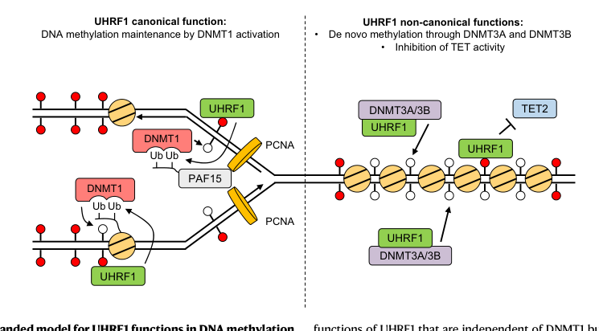

## Question

# Gene Research for Functional Annotation

## ⚠️ CRITICAL: Gene/Protein Identification Context

**BEFORE YOU BEGIN RESEARCH:** You MUST verify you are researching the CORRECT gene/protein. Gene symbols can be ambiguous, especially for less well-characterized genes from non-model organisms.

### Target Gene/Protein Identity (from UniProt):
- **UniProt Accession:** P13864
- **Protein Description:** RecName: Full=DNA (cytosine-5)-methyltransferase 1; Short=Dnmt1; Short=Met-1; EC=2.1.1.37; AltName: Full=DNA methyltransferase MmuI; Short=DNA MTase MmuI; Short=M.MmuI; AltName: Full=MCMT;
- **Gene Information:** Name=Dnmt1; Synonyms=Dnmt, Met1, Uim;
- **Organism (full):** Mus musculus (Mouse).
- **Protein Family:** Belongs to the class I-like SAM-binding methyltransferase
- **Key Domains:** BAH_dom. (IPR001025); BAH_sf. (IPR043151); C5-Methyltransferase. (IPR050390); C5_DNA_meth_AS. (IPR018117); C5_MeTfrase. (IPR001525)

### MANDATORY VERIFICATION STEPS:

1. **Check if the gene symbol "Dnmt1" matches the protein description above**
2. **Verify the organism is correct:** Mus musculus (Mouse).
3. **Check if protein family/domains align with what you find in literature**
4. **If you find literature for a DIFFERENT gene with the same or similar symbol, STOP**

### If Gene Symbol is Ambiguous or You Cannot Find Relevant Literature:

**DO NOT PROCEED WITH RESEARCH ON A DIFFERENT GENE.** Instead:
- State clearly: "The gene symbol 'Dnmt1' is ambiguous or literature is limited for this specific protein"
- Explain what you found (e.g., "Found extensive literature on a different gene with the same symbol in a different organism")
- Describe the protein based ONLY on the UniProt information provided above
- Suggest that the protein function can be inferred from domain/family information

### Research Target:

Please provide a comprehensive research report on the gene **Dnmt1** (gene ID: Dnmt1, UniProt: P13864) in mouse.

The research report should be a detailed narrative explaining the function, biological processes, and localization of the gene product. Citations should be given for all claims.

You should prioritize authoritative reviews and primary scientific literature when conducting research. You can supplement
this with annotations you find in gene/protein databases, but these can be outdated or inaccurate.

We are specifically interested in the primary function of the gene - for enzymes, what reaction is catalyzed, and what is the substrate specificity? For transporters, what is the substrate? For structural proteins or adapters, what is the broader structural role? For signaling molecules, what is the role in the pathway.

We are interested in where in or outside the cell the gene product carries out its function.

We are also interested in the signaling or biochemical pathways in which the gene functions. We are less interested in broad pleiotropic effects, except where these elucidate the precise role.

Include evidence where possible. We are interested in both experimental evidence as well as inference from structure, evolution, or bioinformatic analysis. Precise studies should be prioritized over high-throughput, where available.

## Output

Question: You are an expert researcher providing comprehensive, well-cited information.

Provide detailed information focusing on:
1. Key concepts and definitions with current understanding
2. Recent developments and latest research (prioritize 2023-2024 sources)
3. Current applications and real-world implementations
4. Expert opinions and analysis from authoritative sources
5. Relevant statistics and data from recent studies

Format as a comprehensive research report with proper citations. Include URLs and publication dates where available.
Always prioritize recent, authoritative sources and provide specific citations for all major claims.

# Gene Research for Functional Annotation

## ⚠️ CRITICAL: Gene/Protein Identification Context

**BEFORE YOU BEGIN RESEARCH:** You MUST verify you are researching the CORRECT gene/protein. Gene symbols can be ambiguous, especially for less well-characterized genes from non-model organisms.

### Target Gene/Protein Identity (from UniProt):
- **UniProt Accession:** P13864
- **Protein Description:** RecName: Full=DNA (cytosine-5)-methyltransferase 1; Short=Dnmt1; Short=Met-1; EC=2.1.1.37; AltName: Full=DNA methyltransferase MmuI; Short=DNA MTase MmuI; Short=M.MmuI; AltName: Full=MCMT;
- **Gene Information:** Name=Dnmt1; Synonyms=Dnmt, Met1, Uim;
- **Organism (full):** Mus musculus (Mouse).
- **Protein Family:** Belongs to the class I-like SAM-binding methyltransferase
- **Key Domains:** BAH_dom. (IPR001025); BAH_sf. (IPR043151); C5-Methyltransferase. (IPR050390); C5_DNA_meth_AS. (IPR018117); C5_MeTfrase. (IPR001525)

### MANDATORY VERIFICATION STEPS:

1. **Check if the gene symbol "Dnmt1" matches the protein description above**
2. **Verify the organism is correct:** Mus musculus (Mouse).
3. **Check if protein family/domains align with what you find in literature**
4. **If you find literature for a DIFFERENT gene with the same or similar symbol, STOP**

### If Gene Symbol is Ambiguous or You Cannot Find Relevant Literature:

**DO NOT PROCEED WITH RESEARCH ON A DIFFERENT GENE.** Instead:
- State clearly: "The gene symbol 'Dnmt1' is ambiguous or literature is limited for this specific protein"
- Explain what you found (e.g., "Found extensive literature on a different gene with the same symbol in a different organism")
- Describe the protein based ONLY on the UniProt information provided above
- Suggest that the protein function can be inferred from domain/family information

### Research Target:

Please provide a comprehensive research report on the gene **Dnmt1** (gene ID: Dnmt1, UniProt: P13864) in mouse.

The research report should be a detailed narrative explaining the function, biological processes, and localization of the gene product. Citations should be given for all claims.

You should prioritize authoritative reviews and primary scientific literature when conducting research. You can supplement
this with annotations you find in gene/protein databases, but these can be outdated or inaccurate.

We are specifically interested in the primary function of the gene - for enzymes, what reaction is catalyzed, and what is the substrate specificity? For transporters, what is the substrate? For structural proteins or adapters, what is the broader structural role? For signaling molecules, what is the role in the pathway.

We are interested in where in or outside the cell the gene product carries out its function.

We are also interested in the signaling or biochemical pathways in which the gene functions. We are less interested in broad pleiotropic effects, except where these elucidate the precise role.

Include evidence where possible. We are interested in both experimental evidence as well as inference from structure, evolution, or bioinformatic analysis. Precise studies should be prioritized over high-throughput, where available.

## Research report: Mouse **Dnmt1** (DNA (cytosine-5)-methyltransferase 1; UniProt **P13864**) — functional annotation and recent findings

### 0) Target verification (gene/protein identity)
The UniProt accession **P13864** corresponds to **Mus musculus Dnmt1**, the vertebrate **maintenance DNA (cytosine-5)-methyltransferase** that copies CpG methylation patterns after DNA replication, preferentially acting on **hemimethylated CpG** substrates; the domain architecture and replication-coupled function described in recent mechanistic literature match the UniProt-provided description and domains (RFTS, CXXC, BAH, catalytic C5-methyltransferase). (mulholland2025molecularmechanismsof pages 2-4, prakash2024characterizationofdnmt3cmediated pages 35-39, hu2024identificationofa pages 1-2)

### 1) Key concepts and definitions (current understanding)

#### 1.1 DNA cytosine-5 methylation (5mC) and maintenance methylation
In mammals, DNA methylation refers primarily to **5-methylcytosine (5mC)**, most commonly at **CpG dinucleotides**. After DNA replication, the parental strand retains methylation, while the nascent strand is initially unmethylated, generating **hemimethylated CpG sites** that must be re-methylated to preserve epigenetic information across cell divisions. DNMT1 is the canonical enzyme responsible for this replication-coupled “maintenance” step. (yamaguchi2024noncanonicalfunctionsof pages 1-2, mulholland2025molecularmechanismsof pages 2-4)

#### 1.2 Enzymatic reaction catalyzed by DNMT1 (substrates and cofactor)
**Reaction.** DNMT1 catalyzes transfer of a methyl group to the **C5 position of cytosine** in CpG DNA. (mulholland2025molecularmechanismsof pages 2-4, prakash2024characterizationofdnmt3cmediated pages 35-39)

**Cofactor.** The methyl donor is **S-adenosylmethionine (SAM)** (yielding S-adenosylhomocysteine after transfer). (mulholland2025molecularmechanismsof pages 2-4, prakash2024characterizationofdnmt3cmediated pages 35-39)

**Substrate specificity.** DNMT1 has an intrinsic **preference for hemimethylated CpG DNA** versus unmethylated CpG DNA, consistent with a maintenance role rather than de novo methylation. (mulholland2025molecularmechanismsof pages 2-4, yamaguchi2024noncanonicalfunctionsof pages 1-2)

#### 1.3 Domain architecture and functional modules
DNMT1 is a large multi-domain enzyme. Evidence in recent literature supports the following key modules relevant to functional annotation:

- **PCNA-binding domain/platform**: contributes to positioning at replication sites. (cuesta2024roleofuhrf1 pages 46-50, mulholland2025molecularmechanismsof pages 2-4)
- **RFTS (replication foci targeting sequence) domain**: involved in replication-associated targeting and serves as an **autoinhibitory module** whose engagement can block the catalytic site until activation signals are received. (cuesta2024roleofuhrf1 pages 46-50, yamaguchi2024noncanonicalfunctionsof pages 2-3)
- **CXXC domain**: binds **unmethylated CpG** and contributes to preventing inappropriate de novo methylation by coupling CpG binding to an inhibitory linker arrangement. (wright2025usingsyntheticbiology pages 26-29, cuesta2024roleofuhrf1 pages 46-50)
- **BAH domains**: implicated in chromatin/protein interactions and structural organization of the enzyme. (cuesta2024roleofuhrf1 pages 46-50, mulholland2025molecularmechanismsof pages 2-4)
- **C-terminal C5 DNA methyltransferase catalytic domain (with TRD)**: performs cytosine methylation and includes the internal target recognition logic for CpG substrates. (mulholland2025molecularmechanismsof pages 2-4, prakash2024characterizationofdnmt3cmediated pages 35-39)

#### 1.4 Subcellular localization
DNMT1 is predominantly **nuclear** and **colocalizes with replication foci during S phase**, consistent with replication-coupled maintenance methylation. (mulholland2025molecularmechanismsof pages 2-4, wright2025usingsyntheticbiology pages 26-29)

### 2) Molecular pathway context: recruitment and activation at replication forks

#### 2.1 Core pathway: UHRF1–DNMT1 axis and ubiquitin signaling
A modern mechanistic view emphasizes that DNMT1’s in vivo maintenance function depends strongly on ubiquitin-mediated recruitment/activation:

- **UHRF1** recognizes hemimethylated CpG DNA (via its SRA domain; described in mechanistic context) and modifies chromatin substrates. (yamaguchi2024noncanonicalfunctionsof pages 1-2)
- UHRF1’s ubiquitin ligase activity installs **mono-ubiquitin** marks on **histone H3 (notably H3K18 and H3K23)** and on **PAF15** (a PCNA-associated factor). These ubiquitin marks can bind DNMT1’s **RFTS** domain and relieve RFTS-mediated autoinhibition, enabling catalytic activity on hemimethylated DNA. (yamaguchi2024noncanonicalfunctionsof pages 2-3)

A schematic depiction of this canonical activation model at the replication fork (including PCNA, histone/PAF15 ubiquitylation, and DNMT1 RFTS engagement) is shown in Yamaguchi et al. (2024). (yamaguchi2024noncanonicalfunctionsof media 35d3e602)

#### 2.2 Quantitative evidence for methylation dependence on UHRF1 vs DNMT1 depletion (2024)
Using degron approaches in cancer cell systems (mechanistically informative for mammalian DNMT1), Yamaguchi et al. (Nature Communications, **Apr 2024**, URL: https://doi.org/10.1038/s41467-024-47314-4) reported that combined UHRF1/DNMT1 perturbation produced measurable global methylation decreases, and (notably) that UHRF1 depletion can cause a larger methylation loss than DNMT1 depletion in that setting, supporting non-canonical roles of UHRF1 in methylation homeostasis beyond DNMT1 activation alone. Quantitatively, they report ~**6%** global DNA methylation reduction in single degron lines and ~**10%** reduction in a UHRF1-AID/DNMT1-AID double line (with accompanying transcriptional changes). (yamaguchi2024noncanonicalfunctionsof pages 1-2, yamaguchi2024noncanonicalfunctionsof pages 2-3)

#### 2.3 Role of PCNA interaction
DNMT1 can interact with PCNA to help localize to replication sites, but a synthesis review of maintenance mechanisms notes that disrupting DNMT1–PCNA interaction causes only **modest impairment** of maintenance methylation, implying multiple redundant recruitment/activation routes (particularly UHRF1/ubiquitin-based routes). (mulholland2025molecularmechanismsof pages 2-4)

### 3) Recent developments (prioritizing 2023–2024)

#### 3.1 2024: Newly identified N-terminal folded domain (structural refinement)
A 2024 Journal of Biological Chemistry study (Hu et al., **Mar 2024**, URL: https://doi.org/10.1016/j.jbc.2024.105775) identified a previously unreported **conserved α-helical folded domain** in the N-terminus of human DNMT1 using NMR and SAXS. While not mouse-specific, it refines the structural map of DNMT1’s N-terminus and is relevant for annotating conserved structural features in mouse Dnmt1. (hu2024identificationofa pages 1-2)

#### 3.2 2024: Mechanistic consolidation of ubiquitin-dependent activation of DNMT1
Yamaguchi et al. (Nature Communications, **Apr 2024**, URL: https://doi.org/10.1038/s41467-024-47314-4) provides contemporary mechanistic framing where UHRF1-mediated ubiquitylation of **histone H3** and **PAF15** acts as a direct activating/recruitment signal via DNMT1’s **RFTS** module, integrating replication-coupled chromatin marking with DNMT1 activation. (yamaguchi2024noncanonicalfunctionsof pages 2-3, yamaguchi2024noncanonicalfunctionsof media 35d3e602)

### 4) Current applications and real-world implementations

#### 4.1 Developmental biology and teratogen/toxicant modeling (mouse)
A 2024 PNAS study (Ulschmid et al., **Jan 2024**, URL: https://doi.org/10.1073/pnas.2317668121) used (i) **conditional Dnmt1 deletion** in cranial neural crest (cNCC) lineages and (ii) pharmacologic DNA methylation reduction (5-aza-2′-deoxycytidine; **AzadC**) to interrogate a sensitive developmental window for craniofacial morphogenesis.

This work is a concrete example of DNMT1-targeting strategies used in vivo/in vitro to model **environmentally sensitive epigenetic disruption** during development. (ulschmid2024disruptionofdna pages 3-5, ulschmid2024disruptionofdna pages 5-6)

#### 4.2 Cancer translational modeling: DNMT1 as a druggable dependency in SHH medulloblastoma
A 2024 Acta Neuropathologica Communications study (Tsiami et al., **Aug 2024**, URL: https://doi.org/10.1186/s40478-024-01831-x) used genome-wide CRISPR-Cas9 knockout screens in murine SHH-medulloblastoma models to identify **DNMT1 as a druggable dependency**, reporting that DNMT1 inhibition (alone and with Smoothened inhibition) can suppress tumor growth and prolong survival in SHH-MB mouse models, consistent with a real-world implementation of DNMT1 targeting as a therapeutic concept. (tsiami2024genomewidecrisprcas9knockout pages 1-2)

#### 4.3 Mechanistic dissection tools: degron alleles of maintenance machinery
Recent work employing degron alleles to acutely deplete DNMT1 and/or UHRF1 provides a practical experimental framework to disentangle effects of DNA methylation loss from other confounders (e.g., DNA damage), and yields quantitative readouts of global methylation changes under controlled perturbations. (yamaguchi2024noncanonicalfunctionsof pages 2-3)

### 5) Experimental evidence and statistics from recent studies (emphasis 2023–2024 mouse data)

#### 5.1 Dnmt1 in cranial neural crest: cleft palate penetrance, timing window, and methylation/proliferation changes (mouse; 2024)
Ulschmid et al. (PNAS, **Jan 2024**, https://doi.org/10.1073/pnas.2317668121) provides unusually direct mouse genetic evidence linking Dnmt1-dependent maintenance methylation to a defined morphogenetic process.

**Genetic conditional knockout phenotypes.** Early cNCC deletion via Sox10-Cre produced highly penetrant cleft palate:
- **24/24 (100%)** cleft palate (paternal Sox10-Cre transmission) and **27/28 (96%)** cleft palate (maternal Sox10-Cre transmission), with cleft lip in **4/24 (17%)** in one cohort. (ulschmid2024disruptionofdna pages 3-5, ulschmid2024disruptionofdna pages 2-3)
- In contrast, later/more restricted palatal mesenchyme deletion via Osr2-Cre yielded **0/15** clefting in Osr2-Cre;Dnmt1^fl/fl animals in the reported cohort. (ulschmid2024disruptionofdna pages 3-5)

**Pharmacologic inhibition/timing window.** A single maternal dose of AzadC induced stage-dependent cleft palate, with peak incidence **30/51 (59%)** when administered at GD9.75; later administration at GD11.75 did not induce clefts in the study. (ulschmid2024disruptionofdna pages 3-5, ulschmid2024disruptionofdna pages 2-3)

**Molecular/cellular readouts.** The study reported significantly reduced global 5-mC levels in maxillary mesenchyme upon Dnmt1 cKO (5-mC ELISA) and reduced proliferation (EdU-positive fraction in maxillary mesenchyme decreased). (ulschmid2024disruptionofdna pages 3-5, ulschmid2024disruptionofdna pages 5-6)

#### 5.2 DNMT1/UHRF1 mechanistic statistics (2024; mammalian cells)
Yamaguchi et al. (Nature Communications, **Apr 2024**, https://doi.org/10.1038/s41467-024-47314-4) provides quantitative global methylation differences in degron-based perturbations, reporting approximately **6%** global methylation reduction upon single UHRF1-AID or DNMT1-AID depletion and approximately **10%** reduction in the double degron line, along with differential gene expression counts (124 down, 132 up) in the combined perturbation condition. (yamaguchi2024noncanonicalfunctionsof pages 2-3)

### 6) Expert synthesis / interpretive analysis (grounded in authoritative sources)

1. **Primary function is mechanistically narrow but biologically central.** DNMT1’s primary biochemical role—SAM-dependent methyl transfer to cytosine at CpG—combined with strong preference for hemimethylated CpG, positions it as a replication-coupled epigenetic “copying” enzyme rather than a broad de novo methyltransferase. (mulholland2025molecularmechanismsof pages 2-4, prakash2024characterizationofdnmt3cmediated pages 35-39)

2. **Regulation is enforced by multi-layer autoinhibition plus ubiquitin-licensed activation.** Domain-based autoinhibition (RFTS and CXXC-linked mechanisms) helps prevent promiscuous DNA methylation, while UHRF1-installed ubiquitin marks on histones/PAF15 provide a licensing signal that activates DNMT1 at the appropriate chromatin context during replication. (cuesta2024roleofuhrf1 pages 46-50, yamaguchi2024noncanonicalfunctionsof pages 2-3, yamaguchi2024noncanonicalfunctionsof media 35d3e602)

3. **Mouse developmental phenotypes highlight timing and lineage sensitivity.** The high penetrance of cleft palate upon early cNCC Dnmt1 deletion, contrasted with the lack of clefting upon later targeting, supports a model where DNMT1-dependent maintenance methylation is required to sustain proliferation and differentiation programs in a narrow developmental window. (ulschmid2024disruptionofdna pages 3-5, ulschmid2024disruptionofdna pages 2-3)

4. **Therapeutic relevance is emerging from functional dependency screens.** CRISPR screening evidence in SHH medulloblastoma models indicates DNMT1 can behave as a context-specific dependency, motivating combination strategies (e.g., DNMT1 inhibition plus SHH pathway inhibition) in translational mouse models. (tsiami2024genomewidecrisprcas9knockout pages 1-2)

### Summary synthesis table
The following table compiles the core functional annotation points and key 2023–2024 evidence.

| Aspect | Evidence summary | Key citations |
|---|---|---|
| Identity | The target is mouse **Dnmt1** (UniProt **P13864**), the canonical maintenance DNA methyltransferase in vertebrates. Evidence in the retrieved literature consistently describes DNMT1/Dnmt1 as the enzyme that preserves CpG methylation patterns during DNA replication and specifically recognizes hemimethylated DNA. | (mulholland2025molecularmechanismsof pages 2-4, prakash2024characterizationofdnmt3cmediated pages 35-39, hu2024identificationofa pages 1-2) |
| Enzymatic reaction/cofactor | DNMT1 is a **DNA (cytosine-5)-methyltransferase** that transfers a methyl group from **S-adenosylmethionine (SAM)** to the 5-position of cytosine in CpG dinucleotides, producing 5-methylcytosine. This matches the UniProt annotation EC 2.1.1.37 and class I-like SAM-dependent C5 methyltransferase family assignment. | (mulholland2025molecularmechanismsof pages 2-4, prakash2024characterizationofdnmt3cmediated pages 35-39, kim2025theroleof pages 7-9) |
| Substrate specificity | DNMT1 shows a strong **preference for hemimethylated CpG DNA** over unmethylated DNA, fitting its role in copying methylation after replication rather than establishing new methylation broadly de novo. The CXXC-linked autoinhibitory mechanism further helps prevent inappropriate methylation of unmethylated CpGs. | (wright2025usingsyntheticbiology pages 26-29, cuesta2024roleofuhrf1 pages 46-50, yamaguchi2024noncanonicalfunctionsof pages 1-2) |
| Key domains | Evidence supports the expected DNMT1 architecture: **PBD/PCNA-binding region**, **RFTS** autoinhibitory/replication-targeting module, **CXXC** domain that binds unmethylated CpG, **BAH1/BAH2** domains, and the **C-terminal catalytic C5 methyltransferase domain**. These domains align with the UniProt family/domain description for P13864. | (cuesta2024roleofuhrf1 pages 46-50, mulholland2025molecularmechanismsof pages 2-4, hu2024identificationofa pages 1-2) |
| Localization | DNMT1 is primarily **nuclear** and **colocalizes with replication foci during S phase**; outside S phase it is more diffusely nuclear but can remain associated with methylated heterochromatin. This localization is consistent with replication-coupled maintenance methylation. | (wright2025usingsyntheticbiology pages 26-29, mulholland2025molecularmechanismsof pages 2-4, yamaguchi2024noncanonicalfunctionsof pages 2-3) |
| Recruitment/activation mechanism | Current evidence supports a model in which **UHRF1** recognizes hemimethylated CpGs and ubiquitylates **histone H3 (K18/K23)** and **PAF15**, whose ubiquitin marks bind the **DNMT1 RFTS** domain and relieve autoinhibition. PCNA interaction contributes to replication-site targeting, but the DNMT1-PCNA interaction alone appears to make only a modest contribution relative to UHRF1-dependent mechanisms. | (cuesta2024roleofuhrf1 pages 46-50, mulholland2025molecularmechanismsof pages 2-4, yamaguchi2024noncanonicalfunctionsof pages 2-3, yamaguchi2024noncanonicalfunctionsof media 35d3e602) |
| Key interactors | The strongest supported interactors/pathway components are **UHRF1**, **PCNA**, **PAF15**, and chromatin-associated ubiquitin/H3K9me3-linked signals; additional reported partners include **HDAC1** and **G9a**. Together these place DNMT1 in the maintenance methylation pathway that couples DNA replication to chromatin-state inheritance. | (wright2025usingsyntheticbiology pages 26-29, prakash2024characterizationofdnmt3cmediated pages 35-39, yamaguchi2024noncanonicalfunctionsof pages 2-3, kim2025theroleof pages 7-9) |
| 2023-2024 mouse phenotypes/data | In mice, early cranial neural crest **Dnmt1** loss caused highly penetrant cleft palate (**24/24** or **27/28** depending on cross) with reduced maxillary mesenchyme 5-mC and reduced EdU labeling; pharmacologic DNMT inhibition caused stage-dependent cleft palate with peak incidence **30/51 (59%)** at GD9.75, while later exposure did not. A 2024 SHH medulloblastoma study identified **Dnmt1** as a druggable dependency required for murine cerebellar development and tumor growth in vivo, with DNMT1 inhibition suppressing tumor growth and prolonging survival in mouse models. | (ulschmid2024disruptionofdna pages 5-6, ulschmid2024disruptionofdna pages 3-5, ulschmid2024disruptionofdna pages 2-3, tsiami2024genomewidecrisprcas9knockout pages 1-2) |
| 2024 structural update | A 2024 JBC study identified a previously unreported **conserved N-terminal α-helical folded domain** in human DNMT1, expanding the structural map of the N-terminus beyond the classic annotated modules. Although not mouse-specific, this update is directly relevant because DNMT1 is highly conserved and informs functional annotation of mouse Dnmt1. | (hu2024identificationofa pages 1-2) |

*Table: This table condenses the key functional annotation points for mouse Dnmt1 (UniProt P13864), including catalytic activity, domains, localization, regulation, and recent mouse phenotype evidence. It is useful as a citation-linked overview for drafting the full research report.*

### Key sources (with URLs and publication dates)
- Yamaguchi K. et al. **Non-canonical functions of UHRF1 maintain DNA methylation homeostasis in cancer cells.** *Nature Communications* (Apr **2024**). https://doi.org/10.1038/s41467-024-47314-4 (yamaguchi2024noncanonicalfunctionsof pages 1-2, yamaguchi2024noncanonicalfunctionsof pages 2-3)
- Ulschmid C.M. et al. **Disruption of DNA methylation–mediated cranial neural crest proliferation and differentiation causes orofacial clefts in mice.** *PNAS* (Jan **2024**). https://doi.org/10.1073/pnas.2317668121 (ulschmid2024disruptionofdna pages 3-5, ulschmid2024disruptionofdna pages 2-3)
- Tsiami F. et al. **Genome-wide CRISPR-Cas9 knockout screens identify DNMT1 as a druggable dependency in sonic hedgehog medulloblastoma.** *Acta Neuropathologica Communications* (Aug **2024**). https://doi.org/10.1186/s40478-024-01831-x (tsiami2024genomewidecrisprcas9knockout pages 1-2)
- Hu Q. et al. **Identification of a conserved α-helical domain at the N terminus of human DNA methyltransferase 1.** *J. Biol. Chem.* (Mar **2024**). https://doi.org/10.1016/j.jbc.2024.105775 (hu2024identificationofa pages 1-2)

References

1. (mulholland2025molecularmechanismsof pages 2-4): Christopher B. Mulholland and Atsuya Nishiyama. Molecular mechanisms of maintenance dna methylation. Genes & genetic systems, Jul 2025. URL: https://doi.org/10.1266/ggs.25-00073, doi:10.1266/ggs.25-00073. This article has 1 citations and is from a peer-reviewed journal.

2. (prakash2024characterizationofdnmt3cmediated pages 35-39): Srinivasa Abishek Prakash. Characterization of dnmt3c-mediated inactivation of active transposons in mouse. Text, Jan 2024. URL: https://doi.org/10.25358/openscience-10893, doi:10.25358/openscience-10893. This article has 0 citations and is from a peer-reviewed journal.

3. (hu2024identificationofa pages 1-2): Qi Hu, Maria Victoria Botuyan, and Georges Mer. Identification of a conserved α-helical domain at the n terminus of human dna methyltransferase 1. Journal of Biological Chemistry, 300:105775, Mar 2024. URL: https://doi.org/10.1016/j.jbc.2024.105775, doi:10.1016/j.jbc.2024.105775. This article has 4 citations and is from a domain leading peer-reviewed journal.

4. (yamaguchi2024noncanonicalfunctionsof pages 1-2): Kosuke Yamaguchi, Xiaoying Chen, Brianna Rodgers, Fumihito Miura, Pavel Bashtrykov, Frédéric Bonhomme, Catalina Salinas-Luypaert, Deis Haxholli, Nicole Gutekunst, Bihter Özdemir Aygenli, Laure Ferry, Olivier Kirsh, Marthe Laisné, Andrea Scelfo, Enes Ugur, Paola B. Arimondo, Heinrich Leonhardt, Masato T. Kanemaki, Till Bartke, Daniele Fachinetti, Albert Jeltsch, Takashi Ito, and Pierre-Antoine Defossez. Non-canonical functions of uhrf1 maintain dna methylation homeostasis in cancer cells. Nature Communications, Apr 2024. URL: https://doi.org/10.1038/s41467-024-47314-4, doi:10.1038/s41467-024-47314-4. This article has 52 citations and is from a highest quality peer-reviewed journal.

5. (cuesta2024roleofuhrf1 pages 46-50): C Fernandez Cuesta. Role of uhrf1 and histone h3 ubiquitination in chromatin re-establishment during dna replication. Unknown journal, 2024.

6. (yamaguchi2024noncanonicalfunctionsof pages 2-3): Kosuke Yamaguchi, Xiaoying Chen, Brianna Rodgers, Fumihito Miura, Pavel Bashtrykov, Frédéric Bonhomme, Catalina Salinas-Luypaert, Deis Haxholli, Nicole Gutekunst, Bihter Özdemir Aygenli, Laure Ferry, Olivier Kirsh, Marthe Laisné, Andrea Scelfo, Enes Ugur, Paola B. Arimondo, Heinrich Leonhardt, Masato T. Kanemaki, Till Bartke, Daniele Fachinetti, Albert Jeltsch, Takashi Ito, and Pierre-Antoine Defossez. Non-canonical functions of uhrf1 maintain dna methylation homeostasis in cancer cells. Nature Communications, Apr 2024. URL: https://doi.org/10.1038/s41467-024-47314-4, doi:10.1038/s41467-024-47314-4. This article has 52 citations and is from a highest quality peer-reviewed journal.

7. (wright2025usingsyntheticbiology pages 26-29): A Wright. Using synthetic biology to understand dna methylation maintenance in cancer. Unknown journal, 2025.

8. (yamaguchi2024noncanonicalfunctionsof media 35d3e602): Kosuke Yamaguchi, Xiaoying Chen, Brianna Rodgers, Fumihito Miura, Pavel Bashtrykov, Frédéric Bonhomme, Catalina Salinas-Luypaert, Deis Haxholli, Nicole Gutekunst, Bihter Özdemir Aygenli, Laure Ferry, Olivier Kirsh, Marthe Laisné, Andrea Scelfo, Enes Ugur, Paola B. Arimondo, Heinrich Leonhardt, Masato T. Kanemaki, Till Bartke, Daniele Fachinetti, Albert Jeltsch, Takashi Ito, and Pierre-Antoine Defossez. Non-canonical functions of uhrf1 maintain dna methylation homeostasis in cancer cells. Nature Communications, Apr 2024. URL: https://doi.org/10.1038/s41467-024-47314-4, doi:10.1038/s41467-024-47314-4. This article has 52 citations and is from a highest quality peer-reviewed journal.

9. (ulschmid2024disruptionofdna pages 3-5): Caden M. Ulschmid, Miranda R. Sun, Christopher R. Jabbarpour, Austin C. Steward, Kenneth S. Rivera-González, Jocelyn Cao, Alexander A. Martin, Macy Barnes, Lorena Wicklund, Andy Madrid, Ligia A. Papale, Diya B. Joseph, Chad M. Vezina, Reid S. Alisch, and Robert J. Lipinski. Disruption of dna methylation–mediated cranial neural crest proliferation and differentiation causes orofacial clefts in mice. Proceedings of the National Academy of Sciences of the United States of America, Jan 2024. URL: https://doi.org/10.1073/pnas.2317668121, doi:10.1073/pnas.2317668121. This article has 17 citations and is from a highest quality peer-reviewed journal.

10. (ulschmid2024disruptionofdna pages 5-6): Caden M. Ulschmid, Miranda R. Sun, Christopher R. Jabbarpour, Austin C. Steward, Kenneth S. Rivera-González, Jocelyn Cao, Alexander A. Martin, Macy Barnes, Lorena Wicklund, Andy Madrid, Ligia A. Papale, Diya B. Joseph, Chad M. Vezina, Reid S. Alisch, and Robert J. Lipinski. Disruption of dna methylation–mediated cranial neural crest proliferation and differentiation causes orofacial clefts in mice. Proceedings of the National Academy of Sciences of the United States of America, Jan 2024. URL: https://doi.org/10.1073/pnas.2317668121, doi:10.1073/pnas.2317668121. This article has 17 citations and is from a highest quality peer-reviewed journal.

11. (tsiami2024genomewidecrisprcas9knockout pages 1-2): Foteini Tsiami, Chiara Lago, Noemi Pozza, Federica Piccioni, Xuesong Zhao, Fabienne Lülsberg, David E. Root, Luca Tiberi, Marcel Kool, Jens Schittenhelm, Pratiti Bandopadhayay, Rosalind A. Segal, Ghazaleh Tabatabai, and Daniel J. Merk. Genome-wide crispr-cas9 knockout screens identify dnmt1 as a druggable dependency in sonic hedgehog medulloblastoma. Acta Neuropathologica Communications, Aug 2024. URL: https://doi.org/10.1186/s40478-024-01831-x, doi:10.1186/s40478-024-01831-x. This article has 11 citations and is from a peer-reviewed journal.

12. (ulschmid2024disruptionofdna pages 2-3): Caden M. Ulschmid, Miranda R. Sun, Christopher R. Jabbarpour, Austin C. Steward, Kenneth S. Rivera-González, Jocelyn Cao, Alexander A. Martin, Macy Barnes, Lorena Wicklund, Andy Madrid, Ligia A. Papale, Diya B. Joseph, Chad M. Vezina, Reid S. Alisch, and Robert J. Lipinski. Disruption of dna methylation–mediated cranial neural crest proliferation and differentiation causes orofacial clefts in mice. Proceedings of the National Academy of Sciences of the United States of America, Jan 2024. URL: https://doi.org/10.1073/pnas.2317668121, doi:10.1073/pnas.2317668121. This article has 17 citations and is from a highest quality peer-reviewed journal.

13. (kim2025theroleof pages 7-9): Dae Joong Kim. The role of the dna methyltransferase family and the therapeutic potential of dnmt inhibitors in tumor treatment. Current Oncology, 32:88, Feb 2025. URL: https://doi.org/10.3390/curroncol32020088, doi:10.3390/curroncol32020088. This article has 53 citations.

## Artifacts

- [Edison artifact artifact-00](Dnmt1-deep-research-falcon_artifacts/artifact-00.md)

## Citations

1. yamaguchi2024noncanonicalfunctionsof pages 1-2
2. yamaguchi2024noncanonicalfunctionsof pages 2-3
3. mulholland2025molecularmechanismsof pages 2-4
4. hu2024identificationofa pages 1-2
5. ulschmid2024disruptionofdna pages 3-5
6. wright2025usingsyntheticbiology pages 26-29
7. ulschmid2024disruptionofdna pages 5-6
8. ulschmid2024disruptionofdna pages 2-3
9. kim2025theroleof pages 7-9
10. https://doi.org/10.1038/s41467-024-47314-4
11. https://doi.org/10.1016/j.jbc.2024.105775
12. https://doi.org/10.1073/pnas.2317668121
13. https://doi.org/10.1186/s40478-024-01831-x
14. https://doi.org/10.1266/ggs.25-00073,
15. https://doi.org/10.25358/openscience-10893,
16. https://doi.org/10.1016/j.jbc.2024.105775,
17. https://doi.org/10.1038/s41467-024-47314-4,
18. https://doi.org/10.1073/pnas.2317668121,
19. https://doi.org/10.1186/s40478-024-01831-x,
20. https://doi.org/10.3390/curroncol32020088,