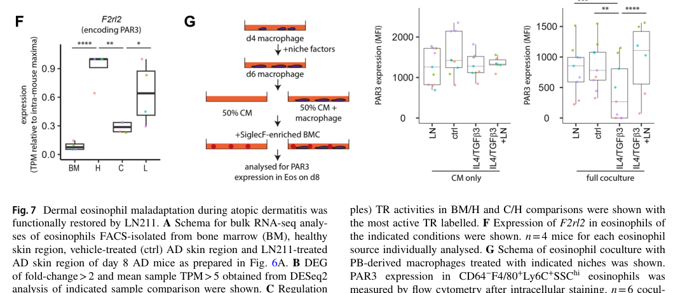

## Question

# Gene Research for Functional Annotation

## ⚠️ CRITICAL: Gene/Protein Identification Context

**BEFORE YOU BEGIN RESEARCH:** You MUST verify you are researching the CORRECT gene/protein. Gene symbols can be ambiguous, especially for less well-characterized genes from non-model organisms.

### Target Gene/Protein Identity (from UniProt):
- **UniProt Accession:** O08675
- **Protein Description:** RecName: Full=Proteinase-activated receptor 3; Short=PAR-3; AltName: Full=Coagulation factor II receptor-like 2; AltName: Full=Thrombin receptor-like 2; Flags: Precursor;
- **Gene Information:** Name=F2rl2; Synonyms=Par3;
- **Organism (full):** Mus musculus (Mouse).
- **Protein Family:** Belongs to the G-protein coupled receptor 1 family.
- **Key Domains:** GPCR_Rhodpsn. (IPR000276); GPCR_Rhodpsn_7TM. (IPR017452); Prot_act_rcpt_3. (IPR003943); Protea_act_rcpt. (IPR003912); 7tm_1 (PF00001)

### MANDATORY VERIFICATION STEPS:

1. **Check if the gene symbol "F2rl2" matches the protein description above**
2. **Verify the organism is correct:** Mus musculus (Mouse).
3. **Check if protein family/domains align with what you find in literature**
4. **If you find literature for a DIFFERENT gene with the same or similar symbol, STOP**

### If Gene Symbol is Ambiguous or You Cannot Find Relevant Literature:

**DO NOT PROCEED WITH RESEARCH ON A DIFFERENT GENE.** Instead:
- State clearly: "The gene symbol 'F2rl2' is ambiguous or literature is limited for this specific protein"
- Explain what you found (e.g., "Found extensive literature on a different gene with the same symbol in a different organism")
- Describe the protein based ONLY on the UniProt information provided above
- Suggest that the protein function can be inferred from domain/family information

### Research Target:

Please provide a comprehensive research report on the gene **F2rl2** (gene ID: F2rl2, UniProt: O08675) in mouse.

The research report should be a detailed narrative explaining the function, biological processes, and localization of the gene product. Citations should be given for all claims.

You should prioritize authoritative reviews and primary scientific literature when conducting research. You can supplement
this with annotations you find in gene/protein databases, but these can be outdated or inaccurate.

We are specifically interested in the primary function of the gene - for enzymes, what reaction is catalyzed, and what is the substrate specificity? For transporters, what is the substrate? For structural proteins or adapters, what is the broader structural role? For signaling molecules, what is the role in the pathway.

We are interested in where in or outside the cell the gene product carries out its function.

We are also interested in the signaling or biochemical pathways in which the gene functions. We are less interested in broad pleiotropic effects, except where these elucidate the precise role.

Include evidence where possible. We are interested in both experimental evidence as well as inference from structure, evolution, or bioinformatic analysis. Precise studies should be prioritized over high-throughput, where available.

## Output

Question: You are an expert researcher providing comprehensive, well-cited information.

Provide detailed information focusing on:
1. Key concepts and definitions with current understanding
2. Recent developments and latest research (prioritize 2023-2024 sources)
3. Current applications and real-world implementations
4. Expert opinions and analysis from authoritative sources
5. Relevant statistics and data from recent studies

Format as a comprehensive research report with proper citations. Include URLs and publication dates where available.
Always prioritize recent, authoritative sources and provide specific citations for all major claims.

# Gene Research for Functional Annotation

## ⚠️ CRITICAL: Gene/Protein Identification Context

**BEFORE YOU BEGIN RESEARCH:** You MUST verify you are researching the CORRECT gene/protein. Gene symbols can be ambiguous, especially for less well-characterized genes from non-model organisms.

### Target Gene/Protein Identity (from UniProt):
- **UniProt Accession:** O08675
- **Protein Description:** RecName: Full=Proteinase-activated receptor 3; Short=PAR-3; AltName: Full=Coagulation factor II receptor-like 2; AltName: Full=Thrombin receptor-like 2; Flags: Precursor;
- **Gene Information:** Name=F2rl2; Synonyms=Par3;
- **Organism (full):** Mus musculus (Mouse).
- **Protein Family:** Belongs to the G-protein coupled receptor 1 family.
- **Key Domains:** GPCR_Rhodpsn. (IPR000276); GPCR_Rhodpsn_7TM. (IPR017452); Prot_act_rcpt_3. (IPR003943); Protea_act_rcpt. (IPR003912); 7tm_1 (PF00001)

### MANDATORY VERIFICATION STEPS:

1. **Check if the gene symbol "F2rl2" matches the protein description above**
2. **Verify the organism is correct:** Mus musculus (Mouse).
3. **Check if protein family/domains align with what you find in literature**
4. **If you find literature for a DIFFERENT gene with the same or similar symbol, STOP**

### If Gene Symbol is Ambiguous or You Cannot Find Relevant Literature:

**DO NOT PROCEED WITH RESEARCH ON A DIFFERENT GENE.** Instead:
- State clearly: "The gene symbol 'F2rl2' is ambiguous or literature is limited for this specific protein"
- Explain what you found (e.g., "Found extensive literature on a different gene with the same symbol in a different organism")
- Describe the protein based ONLY on the UniProt information provided above
- Suggest that the protein function can be inferred from domain/family information

### Research Target:

Please provide a comprehensive research report on the gene **F2rl2** (gene ID: F2rl2, UniProt: O08675) in mouse.

The research report should be a detailed narrative explaining the function, biological processes, and localization of the gene product. Citations should be given for all claims.

You should prioritize authoritative reviews and primary scientific literature when conducting research. You can supplement
this with annotations you find in gene/protein databases, but these can be outdated or inaccurate.

We are specifically interested in the primary function of the gene - for enzymes, what reaction is catalyzed, and what is the substrate specificity? For transporters, what is the substrate? For structural proteins or adapters, what is the broader structural role? For signaling molecules, what is the role in the pathway.

We are interested in where in or outside the cell the gene product carries out its function.

We are also interested in the signaling or biochemical pathways in which the gene functions. We are less interested in broad pleiotropic effects, except where these elucidate the precise role.

Include evidence where possible. We are interested in both experimental evidence as well as inference from structure, evolution, or bioinformatic analysis. Precise studies should be prioritized over high-throughput, where available.

## Research report: Mouse **F2rl2** (UniProt O08675) — Proteinase-activated receptor 3 (PAR3)

### Scope and identity verification
The target is **mouse F2rl2 (Par3)** encoding **proteinase-activated receptor 3 (PAR3)**, a rhodopsin-like **7-transmembrane GPCR** activated by proteolysis and historically described as a **thrombin receptor-like** protein (UniProt O08675 context). Multiple independent sources explicitly map **F2rl2/F2RL2 → PAR3** and describe canonical PAR-family activation by N-terminal cleavage and tethered-ligand exposure, consistent with this identity (hanzelmann2015thrombinstimulatesinsulin pages 4-8, knauss2024plateletactivationin pages 64-70).

### 1) Key concepts and current understanding

#### 1.1 Protease-activated receptors (PARs): definition and “tethered ligand” activation
PARs are GPCRs that are activated when a protease cleaves their N-terminus, unmasking a new N-terminal sequence that folds back as a **tethered ligand** to activate the receptor; synthetic peptides corresponding to the tethered ligand can substitute for proteolysis in many systems (hollenberg2015proteinasestheirreceptors pages 4-5, jakobschepolicht2025theroleof pages 6-8). PAR signaling is often described as “single-use/Kleenex” because activation is irreversible and is followed by desensitization, internalization, and degradation; PARs can also signal from endosomes through **β-arrestin signalosomes** over longer timescales (minutes–tens of minutes) beyond the rapid membrane-proximal G-protein signaling (seconds–minutes) (hollenberg2015proteinasestheirreceptors pages 4-5).

#### 1.2 PAR3 (F2rl2) molecular activation features
Mouse PAR3 is reported to have a **hirudin-like thrombin-binding sequence** that can bind thrombin’s **exosite I**, and it is cleaved at **Lys38/Thr39**, exposing a tethered ligand beginning with **TFRGAP…**; a synthetic peptide **TFRGAP** is described as a PAR3-activating peptide in platelet-oriented literature (knauss2024plateletactivationin pages 64-70, thibeault2020molecularmechanismsregulating pages 62-69).

#### 1.3 Two functional “modes” of PAR3 emphasized in the literature
A consistent theme is that PAR3 can act (i) as a **thrombin-binding cofactor/modulator** for other PARs (especially PAR4 on mouse platelets), and (ii) as a **signaling receptor** in certain non-platelet contexts where direct downstream signaling has been experimentally demonstrated (e.g., islets/β cells) (knauss2024plateletactivationin pages 70-76, hanzelmann2015thrombinstimulatesinsulin pages 8-11).

### 2) Recent developments and latest research (2023–2024 prioritized)

#### 2.1 2024: F2rl2/PAR3 as an eosinophil “state marker” in atopic dermatitis niche biology
A 2024 mouse study of atopic dermatitis (AD) and hypodermal fibroblast–macrophage matrices measured **F2rl2 (PAR3)** in eosinophils by bulk RNA-seq and intracellular flow cytometry. The authors report that **dermal eosinophil F2rl2/PAR3 expression is reduced in AD and restored by laminin-211 (LN211) treatment** (Fig. 7F) (li2024guidedmonocytefate pages 10-12, li2024guidedmonocytefate media 243f02b7). In an in vitro coculture system, eosinophils interacting with macrophages driven toward a non-S1 phenotype (IL4/TGFβ3-treated) showed **substantially lower PAR3**, quantified as **−62 (±12)%**, and this loss was rescued when macrophages were treated with IL4/TGFβ3 plus LN211 (li2024guidedmonocytefate pages 10-12, li2024guidedmonocytefate media 243f02b7). This positions F2rl2/PAR3 as a readout of eosinophil maladaptation versus restoration in a defined skin inflammatory microenvironment rather than as a general systemic marker (li2024guidedmonocytefate pages 10-12, li2024guidedmonocytefate pages 12-14).

#### 2.2 2024: Emphasis on species differences—mouse platelet thrombin signaling uses PAR3/PAR4
A 2024 platelet-focused synthesis emphasizes that **mouse platelets lack PAR1**, have **high PAR3**, and rely on a **PAR3–PAR4 partnership** for thrombin responsiveness, whereas **human platelets** use a **PAR1/PAR4 dual receptor system** and have low PAR3 (reported ~150–200 copies) (knauss2024plateletactivationin pages 70-76). This species difference is highlighted as crucial for interpreting mouse thrombosis/hemostasis models and translating antiplatelet strategies (knauss2024plateletactivationin pages 70-76).

### 3) Primary function, pathways, and mechanistic evidence

#### 3.1 Primary function in mouse platelets: PAR3 as a thrombin-binding cofactor for PAR4
Across multiple authoritative sources, the dominant experimentally supported platelet role of mouse PAR3 is **cofactoring PAR4 activation** rather than acting as an autonomous signaling receptor.

* **Cofactor role / heterodimerization:** In mouse platelets, PAR4 can form a **heterodimer with PAR3** that promotes thrombin-mediated platelet activity; PAR3 itself is stated to **not mediate signal transduction upon thrombin cleavage**, instead acting as a **cofactor enabling PAR4 signaling** (cunningham2016proteinaseactivatedreceptors(pars) pages 3-5). A mechanistic model is that PAR3’s hirudin-like/exosite-I thrombin binding recruits thrombin to facilitate cleavage of adjacent PAR4; **dimerization is described as essential** for this amplification of PAR4 cleavage (knauss2024plateletactivationin pages 70-76).

* **Species difference matters:** A 2019 review notes mouse platelets express a **PAR3/PAR4 complex**, while human platelets express **PAR1 and PAR4**, and thus phenotypes in Par1−/− mice should not be assumed to reflect platelet hyporesponsiveness to thrombin (posma2019rolesofcoagulation pages 1-2). This distinction is reiterated in later syntheses (knauss2024plateletactivationin pages 70-76).

* **Expert consensus framing:** A highly cited inflammation-focused PAR review summarizes that mouse PAR3 maintained thrombin recruitment activity but “lost receptor function,” reinforcing the concept of PAR3 as a thrombin-recruiting cofactor in mice (heuberger2019proteaseactivatedreceptors(pars) pages 1-3).

#### 3.2 Direct signaling: PAR3 activation in pancreatic islets/β cells (PLC/Ca2+/PKC)
In contrast to the “non-signaling cofactor” view for platelets, a primary study demonstrated **functional signaling downstream of PAR3 activation** in islets.

In isolated mouse islets/β cells, thrombin and a PAR3 tethered-ligand peptide stimulated insulin secretion and β-cell exocytosis:

* **Agonists and blockade supporting PAR3 cleavage mechanism:** Thrombin-stimulated insulin secretion was prevented by an antibody blocking the thrombin cleavage site of PAR3, supporting proteolytic activation and tethered-ligand signaling (hanzelmann2015thrombinstimulatesinsulin pages 8-11).

* **Quantitative functional outcomes:** Thrombin (10 nM) increased insulin secretion by ~**140%** at 2 h (with diminishing effects at longer incubations), and a PAR3 activating peptide at **20 μM** robustly increased insulin secretion (reported ~**90%** increase at basal glucose and ~**130%** at high glucose) and increased β-cell exocytosis (~**70%**) (hanzelmann2015thrombinstimulatesinsulin pages 4-8, hanzelmann2015thrombinstimulatesinsulin pages 8-11).

* **Downstream pathway evidence:** Pharmacology and Ca2+ imaging support signaling via **Gq → PLC → IP3/DAG**, with **Ca2+ release from intracellular stores** and involvement of **PKC**; multiple inhibitors (e.g., PLC, IP3 receptor, PKC blockade) prevented the PAR3 peptide’s effects, and the peptide increased intracellular Ca2+ about **2-fold** (hanzelmann2015thrombinstimulatesinsulin pages 8-11).

This provides a concrete mechanistic pathway for PAR3-dependent cellular responses outside platelets and highlights the context dependence of PAR3 biology (hanzelmann2015thrombinstimulatesinsulin pages 8-11).

#### 3.3 Canonical PAR signaling modules (general framework used for interpreting PAR3)
A mechanistic review of PAR signaling provides a widely used interpretive framework: rapid **Gq-mediated Ca2+ mobilization**, potential **Gi-mediated inhibition of adenylyl cyclase**, and slower **β-arrestin–dependent endosomal signaling**; receptor desensitization and internalization are central regulators (hollenberg2015proteinasestheirreceptors pages 4-5). This framework aligns with the β-cell PLC/Ca2+ findings (hanzelmann2015thrombinstimulatesinsulin pages 8-11) and with general PAR signaling summaries emphasizing both G-protein and β-arrestin pathways (jakobschepolicht2025theroleof pages 6-8).

### 4) Expression patterns and subcellular localization (evidence-supported)

#### 4.1 Subcellular localization (functional inference)
PARs, including PAR3, are **cell-surface transmembrane receptors** whose activation requires extracellular proteolysis; after activation they undergo **internalization** and can form endosomal signaling complexes via β-arrestin, providing a mechanistic basis for both plasma membrane and endosomal localization during signaling (hollenberg2015proteinasestheirreceptors pages 4-5, jakobschepolicht2025theroleof pages 6-8).

#### 4.2 Cell-type/tissue expression highlighted in retrieved sources
* **Platelets:** Mouse platelet thrombin responsiveness depends on PAR3/PAR4 partnership (posma2019rolesofcoagulation pages 1-2, knauss2024plateletactivationin pages 70-76).
* **Pancreatic islets/β cells:** PAR3 activation modulates insulin secretion/exocytosis (hanzelmann2015thrombinstimulatesinsulin pages 8-11).
* **Skin eosinophils (AD model):** F2rl2/PAR3 expression changes with disease state and LN211 treatment (li2024guidedmonocytefate pages 10-12, li2024guidedmonocytefate media 243f02b7).
* **Broad tissue distribution (review-level):** PAR3 expression is summarized across multiple tissues (e.g., heart, kidney, pancreas, thymus, gut, lymphoid tissues, trachea) and cell types including airway smooth muscle and platelets (thibeault2020molecularmechanismsregulating pages 62-69).

### 5) Current applications and real-world implementations

#### 5.1 Translational/therapeutic context: antiplatelet drug development and species differences
PAR biology is directly leveraged for antiplatelet strategies. An antiplatelet therapy review emphasizes that while PAR1 antagonism (e.g., **vorapaxar**) is clinically used, bleeding risk has motivated interest in alternative approaches including **PAR4 targeting**; however, development of selective PAR4 agents has been challenging (cunningham2016proteinaseactivatedreceptors(pars) pages 3-5, cunningham2016proteinaseactivatedreceptors(pars) pages 1-3). Because mouse platelets use **PAR3/PAR4** whereas humans use **PAR1/PAR4**, the cofactor role of PAR3 in mouse models can confound translation of mouse thrombosis studies to humans, reinforcing the importance of receptor-system differences when interpreting preclinical data (knauss2024plateletactivationin pages 70-76, posma2019rolesofcoagulation pages 1-2).

#### 5.2 Research implementation: mouse models disentangling coagulation proteases vs PARs in inflammation
A major review of mouse inflammatory disease models outlines how investigators use **direct oral anticoagulants (DOACs)** to inhibit FXa/thrombin and compare these effects with **PAR-deficient mice**; it highlights that thrombin activates PARs and that platelet PAR expression differs between species (mouse PAR3/PAR4 vs human PAR1/PAR4) (posma2019rolesofcoagulation pages 1-2). This supports real-world use of mouse genetics and anticoagulant pharmacology to test whether phenotypes arise from coagulation per se versus PAR-mediated cell signaling.

### 6) Statistics/data highlights from recent studies
Key quantitative results available in the retrieved evidence include:

* **Eosinophil PAR3 change in AD niche biology (mouse, 2024):** coculture with IL4/TGFβ3-treated macrophages reduced eosinophil PAR3 by **−62 ± 12%**, and F2rl2 RNA-seq comparisons used **n=4 mice per eosinophil source**; intracellular flow cytometry coculture assay reported **n=6** (li2024guidedmonocytefate pages 10-12).
* **β-cell/islet functional signaling (mouse, 2015):** thrombin **10 nM** increased insulin secretion ~**140%** at 2 h; PAR3 agonist peptide **20 μM** increased insulin secretion (~**90%** basal; ~**130%** high glucose), increased exocytosis (~**70%**) and increased intracellular Ca2+ ~**2-fold**; an antibody blocking the PAR3 cleavage site prevented thrombin’s effect (hanzelmann2015thrombinstimulatesinsulin pages 4-8, hanzelmann2015thrombinstimulatesinsulin pages 8-11).
* **Species difference in platelet PAR3 levels (human vs mouse):** human platelet PAR3 levels are described as low (~**150–200 copies**) relative to mouse platelet PAR3 expression, which is high and functionally important for PAR4 responses (knauss2024plateletactivationin pages 70-76).

### 7) Expert interpretation and limitations (evidence-based)
A central expert-level interpretation emerging from the sources is that **PAR3 function is context-dependent**:

* In mouse platelets, PAR3 is best supported as a **thrombin-recruiting cofactor/modulator** for PAR4 (and possibly an inter-PAR regulator) rather than an autonomous signaling receptor (knauss2024plateletactivationin pages 70-76, cunningham2016proteinaseactivatedreceptors(pars) pages 3-5, heuberger2019proteaseactivatedreceptors(pars) pages 1-3).
* In non-platelet tissues (e.g., islets), there is direct functional evidence for PAR3-dependent intracellular signaling via PLC/Ca2+/PKC with measurable secretory outcomes (hanzelmann2015thrombinstimulatesinsulin pages 8-11).

The retrieved evidence base is strong for activation mechanism, platelet cofactoring, and two well-supported biological contexts (platelets; islets; plus a recent eosinophil context), but it is comparatively limited here for broad mouse organ phenotypes of F2rl2 genetic perturbation and for a complete atlas of cell-type expression beyond the reported tissues and models.

### Evidence map table (curation-ready)
| Aspect | Identity | Activation mechanism | Cleavage site / tethered ligand | Cofactor / heterodimer role with PAR4 | Downstream signaling evidence | Expression / cell types | Quantitative data | Key references |
|---|---|---|---|---|---|---|---|---|
| Mouse F2rl2 / PAR3 functional annotation | F2rl2 encodes protease-activated receptor 3 (PAR3), a thrombin receptor-like rhodopsin-family GPCR; literature retrieved for mouse aligns with UniProt O08675/PAR3 identity (hanzelmann2015thrombinstimulatesinsulin pages 4-8, knauss2024plateletactivationin pages 64-70) | Activated by irreversible proteolytic N-terminal cleavage, principally by thrombin; APC also reported as a PAR3-cleaving protease; synthetic PAR3 agonist peptides can mimic tethered-ligand activation in some systems (hanzelmann2015thrombinstimulatesinsulin pages 4-8, jakobschepolicht2025theroleof pages 6-8, knauss2024plateletactivationin pages 64-70) | Mouse PAR3 is reported cleaved at Lys38/Thr39, exposing tethered ligand sequence TFRGAP…; Hänzelmann et al. used PAR3-activating peptide SFNGGP, reflecting PAR3 tethered-ligand mimic activity in islets (thibeault2020molecularmechanismsregulating pages 62-69, knauss2024plateletactivationin pages 64-70, hanzelmann2015thrombinstimulatesinsulin pages 4-8) | On mouse platelets, PAR3 is best supported as a thrombin-binding cofactor/modulator for PAR4 rather than a robust autonomous signaling receptor; PAR3/PAR4 heterodimerization enhances thrombin cleavage of adjacent PAR4, with species difference vs humans (human platelets mainly PAR1/PAR4, low PAR3 ~150–200 copies) (knauss2024plateletactivationinb pages 70-76, knauss2024plateletactivationin pages 70-76, cunningham2016proteinaseactivatedreceptors(pars) pages 3-5, cunningham2016proteinaseactivatedreceptors(pars) pages 1-3, posma2019rolesofcoagulation pages 1-2) | In mouse islets/β-cells, PAR3 activation increases exocytosis and Ca2+ via Gq→PLC→IP3/DAG, ER Ca2+ release, and PKC-sensitive signaling; broader PAR-family evidence supports GPCR, Ca2+, MAPK/ERK, β-arrestin/internalization paradigms, but direct platelet-autonomous PAR3 signaling remains weak/uncertain (hanzelmann2015thrombinstimulatesinsulin pages 8-11, jakobschepolicht2025theroleof pages 6-8, hollenberg2015proteinasestheirreceptors pages 4-5, knauss2024plateletactivationin pages 70-76) | Platelets; mouse islets/β-cells; eosinophils in skin/AD model; broader tissue distribution reported in heart, kidney, pancreas, thymus, small intestine, stomach, lymph node, trachea, airway smooth muscle (thibeault2020molecularmechanismsregulating pages 62-69, hanzelmann2015thrombinstimulatesinsulin pages 4-8, li2024guidedmonocytefate pages 10-12, li2024guidedmonocytefate pages 12-14) | Thrombin 10 nM increased insulin secretion ~140% at 2 h, 87% at 12 h, 29% at 24 h; PAR3-AP 20 μM increased insulin secretion ~90% at basal glucose and ~130% at high glucose; PAR3-AP increased β-cell exocytosis ~70% and intracellular Ca2+ ~2-fold; H103 antibody against PAR3 cleavage region blocked thrombin effect; in eosinophil coculture, PAR3 decreased by −62 ± 12%; eosinophil RNA-seq source comparison used n=4 mice/source, intracellular-flow coculture assay n=6 (hanzelmann2015thrombinstimulatesinsulin pages 4-8, hanzelmann2015thrombinstimulatesinsulin pages 8-11, li2024guidedmonocytefate pages 10-12, li2024guidedmonocytefate pages 12-14) | Hänzelmann et al., 2015, Islets, https://doi.org/10.1080/19382014.2015.1118195; Li et al., 2024, Cell. Mol. Life Sci., https://doi.org/10.1007/s00018-024-05543-2; Posma et al., 2019, ATVB, https://doi.org/10.1161/ATVBAHA.118.311655; Cunningham et al., 2016, Biochem. Soc. Trans., https://doi.org/10.1042/BST20150282 (hanzelmann2015thrombinstimulatesinsulin pages 4-8, hanzelmann2015thrombinstimulatesinsulin pages 8-11, li2024guidedmonocytefate pages 10-12, cunningham2016proteinaseactivatedreceptors(pars) pages 3-5, posma2019rolesofcoagulation pages 1-2) |

*Table: This table summarizes core functional annotation for mouse F2rl2/PAR3, integrating identity, activation, platelet cofactor function with PAR4, signaling evidence, expression, and key quantitative findings from primary studies. It is useful as a compact evidence map for gene-function curation.*

### Visual evidence (recent mouse study)
Figure evidence for F2rl2/PAR3 expression modulation in eosinophils across conditions (AD and LN211 treatment), with intracellular flow cytometry quantification, is shown in the retrieved Figure 7F/7G region (li2024guidedmonocytefate media 243f02b7).

### Key references (with publication dates and URLs)
* Li Y-T et al. **Guided monocyte fate to FRβ/CD163+ S1 macrophage antagonises atopic dermatitis via fibroblastic matrices in mouse hypodermis**. *Cellular and Molecular Life Sciences* (Dec **2024**). https://doi.org/10.1007/s00018-024-05543-2 (li2024guidedmonocytefate pages 10-12, li2024guidedmonocytefate media 243f02b7)
* Knauss E. **Platelet Activation in Venous Thrombosis is Driven by Protease Activated Receptor 4 (PAR4)** (year **2024**; source metadata incomplete in retrieved record). (knauss2024plateletactivationin pages 70-76)
* Posma JJ et al. **Roles of Coagulation Proteases and PARs in Mouse Models of Inflammatory Diseases**. *ATVB* (Jan **2019**). https://doi.org/10.1161/ATVBAHA.118.311655 (posma2019rolesofcoagulation pages 1-2)
* Cunningham M et al. **Proteinase-activated receptors (PARs) as targets for antiplatelet therapy**. *Biochemical Society Transactions* (Apr **2016**). https://doi.org/10.1042/BST20150282 (cunningham2016proteinaseactivatedreceptors(pars) pages 3-5, cunningham2016proteinaseactivatedreceptors(pars) pages 1-3)
* Heuberger DM, Schuepbach RA. **PARs: mechanisms of action and potential therapeutic modulators in PAR-driven inflammatory diseases**. *Thrombosis Journal* (Mar **2019**). https://doi.org/10.1186/s12959-019-0194-8 (heuberger2019proteaseactivatedreceptors(pars) pages 1-3)
* Hänzelmann S et al. **Thrombin stimulates insulin secretion via protease-activated receptor-3**. *Islets* (Jul **2015**). https://doi.org/10.1080/19382014.2015.1118195 (hanzelmann2015thrombinstimulatesinsulin pages 8-11)
* Hollenberg MD. **Proteinases, their receptors and inflammatory signalling**. *British Journal of Pharmacology* (Jul **2015**). https://doi.org/10.1111/bph.13041 (hollenberg2015proteinasestheirreceptors pages 4-5)

References

1. (hanzelmann2015thrombinstimulatesinsulin pages 4-8): Sonja Hänzelmann, Jinling Wang, Emre Güney, Yunzhao Tang, Enming Zhang, Annika S Axelsson, Hannah Nenonen, Albert S Salehi, Claes B Wollheim, Eva Zetterberg, Erik Berntorp, Ivan G Costa, Robert Castelo, and Anders H Rosengren. Thrombin stimulates insulin secretion via protease-activated receptor-3. Islets, 7:e1118195, Jul 2015. URL: https://doi.org/10.1080/19382014.2015.1118195, doi:10.1080/19382014.2015.1118195. This article has 30 citations and is from a peer-reviewed journal.

2. (knauss2024plateletactivationin pages 64-70): E Knauss. Platelet activation in venous thrombosis is driven by protease activated receptor 4 (par4). Unknown journal, 2024.

3. (hollenberg2015proteinasestheirreceptors pages 4-5): M D Hollenberg. Proteinases, their receptors and inflammatory signalling: the oxford south parks road connection. British Journal of Pharmacology, 172:3196-3211, Jul 2015. URL: https://doi.org/10.1111/bph.13041, doi:10.1111/bph.13041. This article has 7 citations and is from a highest quality peer-reviewed journal.

4. (jakobschepolicht2025theroleof pages 6-8): Urszula Jakobsche-Policht, Agnieszka Bronowicka-Szydełko, Rajmund Adamiec, Dorota Bednarska-Chabowska, Magdalena Mierzchała-Pasierb, Łukasz Lewandowski, Kinga Gostomska-Pampuch, Joanna Adamiec-Mroczek, Maciej Rabczyński, Edwin Kuźnik, Paweł Lubieniecki, Olgierd Dróżdż, Helena Martynowicz, Anna Kwiecień, Małgorzata Strzelecka, Dawid Rudkiewicz, Marcin Piersiak, Maciej Ziomek, Mikołaj Kondracki, Zuzanna Galińska, and Katarzyna Madziarska. The role of protease-activated receptors (pars) in the functioning of platelets and platelet-derived microparticles (pmps). Sep 2025. URL: https://doi.org/10.3389/fmolb.2025.1636893, doi:10.3389/fmolb.2025.1636893. This article has 2 citations.

5. (thibeault2020molecularmechanismsregulating pages 62-69): PE Thibeault. Molecular mechanisms regulating the platelet thrombin receptor par4. Unknown journal, 2020.

6. (knauss2024plateletactivationin pages 70-76): E Knauss. Platelet activation in venous thrombosis is driven by protease activated receptor 4 (par4). Unknown journal, 2024.

7. (hanzelmann2015thrombinstimulatesinsulin pages 8-11): Sonja Hänzelmann, Jinling Wang, Emre Güney, Yunzhao Tang, Enming Zhang, Annika S Axelsson, Hannah Nenonen, Albert S Salehi, Claes B Wollheim, Eva Zetterberg, Erik Berntorp, Ivan G Costa, Robert Castelo, and Anders H Rosengren. Thrombin stimulates insulin secretion via protease-activated receptor-3. Islets, 7:e1118195, Jul 2015. URL: https://doi.org/10.1080/19382014.2015.1118195, doi:10.1080/19382014.2015.1118195. This article has 30 citations and is from a peer-reviewed journal.

8. (li2024guidedmonocytefate pages 10-12): Yu-Tung Li, Eiichi Takaki, Yuya Ouchi, and Katsuto Tamai. Guided monocyte fate to frβ/cd163+ s1 macrophage antagonises atopic dermatitis via fibroblastic matrices in mouse hypodermis. Cellular and Molecular Life Sciences: CMLS, Dec 2024. URL: https://doi.org/10.1007/s00018-024-05543-2, doi:10.1007/s00018-024-05543-2. This article has 6 citations.

9. (li2024guidedmonocytefate media 243f02b7): Yu-Tung Li, Eiichi Takaki, Yuya Ouchi, and Katsuto Tamai. Guided monocyte fate to frβ/cd163+ s1 macrophage antagonises atopic dermatitis via fibroblastic matrices in mouse hypodermis. Cellular and Molecular Life Sciences: CMLS, Dec 2024. URL: https://doi.org/10.1007/s00018-024-05543-2, doi:10.1007/s00018-024-05543-2. This article has 6 citations.

10. (li2024guidedmonocytefate pages 12-14): Yu-Tung Li, Eiichi Takaki, Yuya Ouchi, and Katsuto Tamai. Guided monocyte fate to frβ/cd163+ s1 macrophage antagonises atopic dermatitis via fibroblastic matrices in mouse hypodermis. Cellular and Molecular Life Sciences: CMLS, Dec 2024. URL: https://doi.org/10.1007/s00018-024-05543-2, doi:10.1007/s00018-024-05543-2. This article has 6 citations.

11. (cunningham2016proteinaseactivatedreceptors(pars) pages 3-5): Margaret Cunningham, Kathryn McIntosh, Trevor Bushell, Graeme Sloan, and Robin Plevin. Proteinase-activated receptors (pars) as targets for antiplatelet therapy. Biochemical Society transactions, 44 2:606-12, Apr 2016. URL: https://doi.org/10.1042/bst20150282, doi:10.1042/bst20150282. This article has 24 citations and is from a peer-reviewed journal.

12. (posma2019rolesofcoagulation pages 1-2): Jens J. Posma, Steven P. Grover, Yohei Hisada, A. Phillip Owens, Silvio Antoniak, Henri M. Spronk, and Nigel Mackman. Roles of coagulation proteases and pars (protease-activated receptors) in mouse models of inflammatory diseases. Arteriosclerosis, Thrombosis, and Vascular Biology, 39:13–24, Jan 2019. URL: https://doi.org/10.1161/atvbaha.118.311655, doi:10.1161/atvbaha.118.311655. This article has 118 citations and is from a domain leading peer-reviewed journal.

13. (heuberger2019proteaseactivatedreceptors(pars) pages 1-3): DM Heuberger and RA Schuepbach. Protease-activated receptors (pars): mechanisms of action and potential therapeutic modulators in par-driven inflammatory diseases. Thrombosis Journal, Mar 2019. URL: https://doi.org/10.1186/s12959-019-0194-8, doi:10.1186/s12959-019-0194-8. This article has 516 citations and is from a peer-reviewed journal.

14. (cunningham2016proteinaseactivatedreceptors(pars) pages 1-3): Margaret Cunningham, Kathryn McIntosh, Trevor Bushell, Graeme Sloan, and Robin Plevin. Proteinase-activated receptors (pars) as targets for antiplatelet therapy. Biochemical Society transactions, 44 2:606-12, Apr 2016. URL: https://doi.org/10.1042/bst20150282, doi:10.1042/bst20150282. This article has 24 citations and is from a peer-reviewed journal.

15. (knauss2024plateletactivationinb pages 70-76): E Knauss. Platelet activation in venous thrombosis is driven by protease activated receptor 4 (par4). Unknown journal, 2024.

## Artifacts

- [Edison artifact artifact-00](F2rl2-deep-research-falcon_artifacts/artifact-00.md)

## Citations

1. hollenberg2015proteinasestheirreceptors pages 4-5
2. knauss2024plateletactivationin pages 70-76
3. posma2019rolesofcoagulation pages 1-2
4. hanzelmann2015thrombinstimulatesinsulin pages 8-11
5. jakobschepolicht2025theroleof pages 6-8
6. thibeault2020molecularmechanismsregulating pages 62-69
7. li2024guidedmonocytefate pages 10-12
8. hanzelmann2015thrombinstimulatesinsulin pages 4-8
9. knauss2024plateletactivationin pages 64-70
10. li2024guidedmonocytefate pages 12-14
11. knauss2024plateletactivationinb pages 70-76
12. https://doi.org/10.1080/19382014.2015.1118195;
13. https://doi.org/10.1007/s00018-024-05543-2;
14. https://doi.org/10.1161/ATVBAHA.118.311655;
15. https://doi.org/10.1042/BST20150282
16. https://doi.org/10.1007/s00018-024-05543-2
17. https://doi.org/10.1161/ATVBAHA.118.311655
18. https://doi.org/10.1186/s12959-019-0194-8
19. https://doi.org/10.1080/19382014.2015.1118195
20. https://doi.org/10.1111/bph.13041
21. https://doi.org/10.1080/19382014.2015.1118195,
22. https://doi.org/10.1111/bph.13041,
23. https://doi.org/10.3389/fmolb.2025.1636893,
24. https://doi.org/10.1007/s00018-024-05543-2,
25. https://doi.org/10.1042/bst20150282,
26. https://doi.org/10.1161/atvbaha.118.311655,
27. https://doi.org/10.1186/s12959-019-0194-8,