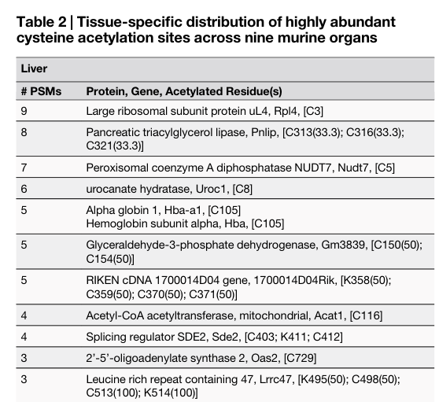

## Question

# Gene Research for Functional Annotation

## ⚠️ CRITICAL: Gene/Protein Identification Context

**BEFORE YOU BEGIN RESEARCH:** You MUST verify you are researching the CORRECT gene/protein. Gene symbols can be ambiguous, especially for less well-characterized genes from non-model organisms.

### Target Gene/Protein Identity (from UniProt):
- **UniProt Accession:** P16858
- **Protein Description:** RecName: Full=Glyceraldehyde-3-phosphate dehydrogenase; Short=GAPDH; EC=1.2.1.12 {ECO:0000269|PubMed:19903941}; AltName: Full=Peptidyl-cysteine S-nitrosylase GAPDH {ECO:0000305}; EC=2.6.99.- {ECO:0000250|UniProtKB:P04797};
- **Gene Information:** Name=Gapdh; Synonyms=Gapd;
- **Organism (full):** Mus musculus (Mouse).
- **Protein Family:** Belongs to the glyceraldehyde-3-phosphate dehydrogenase
- **Key Domains:** GlycerAld/Erythrose_P_DH. (IPR020831); GlycerAld_3-P_DH_AS. (IPR020830); GlycerAld_3-P_DH_cat. (IPR020829); GlycerAld_3-P_DH_NAD(P)-bd. (IPR020828); Glyceraldehyde-3-P_DH_1. (IPR006424)

### MANDATORY VERIFICATION STEPS:

1. **Check if the gene symbol "Gapdh" matches the protein description above**
2. **Verify the organism is correct:** Mus musculus (Mouse).
3. **Check if protein family/domains align with what you find in literature**
4. **If you find literature for a DIFFERENT gene with the same or similar symbol, STOP**

### If Gene Symbol is Ambiguous or You Cannot Find Relevant Literature:

**DO NOT PROCEED WITH RESEARCH ON A DIFFERENT GENE.** Instead:
- State clearly: "The gene symbol 'Gapdh' is ambiguous or literature is limited for this specific protein"
- Explain what you found (e.g., "Found extensive literature on a different gene with the same symbol in a different organism")
- Describe the protein based ONLY on the UniProt information provided above
- Suggest that the protein function can be inferred from domain/family information

### Research Target:

Please provide a comprehensive research report on the gene **Gapdh** (gene ID: Gapdh, UniProt: P16858) in mouse.

The research report should be a detailed narrative explaining the function, biological processes, and localization of the gene product. Citations should be given for all claims.

You should prioritize authoritative reviews and primary scientific literature when conducting research. You can supplement
this with annotations you find in gene/protein databases, but these can be outdated or inaccurate.

We are specifically interested in the primary function of the gene - for enzymes, what reaction is catalyzed, and what is the substrate specificity? For transporters, what is the substrate? For structural proteins or adapters, what is the broader structural role? For signaling molecules, what is the role in the pathway.

We are interested in where in or outside the cell the gene product carries out its function.

We are also interested in the signaling or biochemical pathways in which the gene functions. We are less interested in broad pleiotropic effects, except where these elucidate the precise role.

Include evidence where possible. We are interested in both experimental evidence as well as inference from structure, evolution, or bioinformatic analysis. Precise studies should be prioritized over high-throughput, where available.

## Output

Question: You are an expert researcher providing comprehensive, well-cited information.

Provide detailed information focusing on:
1. Key concepts and definitions with current understanding
2. Recent developments and latest research (prioritize 2023-2024 sources)
3. Current applications and real-world implementations
4. Expert opinions and analysis from authoritative sources
5. Relevant statistics and data from recent studies

Format as a comprehensive research report with proper citations. Include URLs and publication dates where available.
Always prioritize recent, authoritative sources and provide specific citations for all major claims.

# Gene Research for Functional Annotation

## ⚠️ CRITICAL: Gene/Protein Identification Context

**BEFORE YOU BEGIN RESEARCH:** You MUST verify you are researching the CORRECT gene/protein. Gene symbols can be ambiguous, especially for less well-characterized genes from non-model organisms.

### Target Gene/Protein Identity (from UniProt):
- **UniProt Accession:** P16858
- **Protein Description:** RecName: Full=Glyceraldehyde-3-phosphate dehydrogenase; Short=GAPDH; EC=1.2.1.12 {ECO:0000269|PubMed:19903941}; AltName: Full=Peptidyl-cysteine S-nitrosylase GAPDH {ECO:0000305}; EC=2.6.99.- {ECO:0000250|UniProtKB:P04797};
- **Gene Information:** Name=Gapdh; Synonyms=Gapd;
- **Organism (full):** Mus musculus (Mouse).
- **Protein Family:** Belongs to the glyceraldehyde-3-phosphate dehydrogenase
- **Key Domains:** GlycerAld/Erythrose_P_DH. (IPR020831); GlycerAld_3-P_DH_AS. (IPR020830); GlycerAld_3-P_DH_cat. (IPR020829); GlycerAld_3-P_DH_NAD(P)-bd. (IPR020828); Glyceraldehyde-3-P_DH_1. (IPR006424)

### MANDATORY VERIFICATION STEPS:

1. **Check if the gene symbol "Gapdh" matches the protein description above**
2. **Verify the organism is correct:** Mus musculus (Mouse).
3. **Check if protein family/domains align with what you find in literature**
4. **If you find literature for a DIFFERENT gene with the same or similar symbol, STOP**

### If Gene Symbol is Ambiguous or You Cannot Find Relevant Literature:

**DO NOT PROCEED WITH RESEARCH ON A DIFFERENT GENE.** Instead:
- State clearly: "The gene symbol 'Gapdh' is ambiguous or literature is limited for this specific protein"
- Explain what you found (e.g., "Found extensive literature on a different gene with the same symbol in a different organism")
- Describe the protein based ONLY on the UniProt information provided above
- Suggest that the protein function can be inferred from domain/family information

### Research Target:

Please provide a comprehensive research report on the gene **Gapdh** (gene ID: Gapdh, UniProt: P16858) in mouse.

The research report should be a detailed narrative explaining the function, biological processes, and localization of the gene product. Citations should be given for all claims.

You should prioritize authoritative reviews and primary scientific literature when conducting research. You can supplement
this with annotations you find in gene/protein databases, but these can be outdated or inaccurate.

We are specifically interested in the primary function of the gene - for enzymes, what reaction is catalyzed, and what is the substrate specificity? For transporters, what is the substrate? For structural proteins or adapters, what is the broader structural role? For signaling molecules, what is the role in the pathway.

We are interested in where in or outside the cell the gene product carries out its function.

We are also interested in the signaling or biochemical pathways in which the gene functions. We are less interested in broad pleiotropic effects, except where these elucidate the precise role.

Include evidence where possible. We are interested in both experimental evidence as well as inference from structure, evolution, or bioinformatic analysis. Precise studies should be prioritized over high-throughput, where available.

## Research report: Mus musculus **Gapdh** (UniProt P16858) — functional annotation

### 1) Target verification (critical disambiguation)
The research target is **mouse glyceraldehyde-3-phosphate dehydrogenase (GAPDH)** encoded by **Gapdh**, consistent with UniProt P16858 and the well-conserved GAPDH family. Evidence in this corpus describes a ~335 aa, ~37 kDa enzyme with an N‑terminal NAD+ binding region and a conserved catalytic cysteine centered at **Cys150** (mouse numbering is consistently reported as Cys150 in multiple mechanistic and PTM contexts), matching the UniProt-provided identity and domains. (levenes2024desrétropseudogènespotentiellement pages 35-39, keenan2025cysteinesacetylationis pages 6-7)

### 2) Key concepts and definitions (current understanding)

#### 2.1 Canonical enzymatic function in glycolysis
**Definition (canonical role):** GAPDH catalyzes the oxidative phosphorylation step of glycolysis converting **glyceraldehyde-3-phosphate (G3P)** to **1,3-bisphosphoglycerate (1,3‑BPG)** while reducing **NAD+ to NADH**.

A mechanistic structural study (conserved across species) describes the reaction sequence: the catalytic **Cys150** nucleophilically attacks the aldehyde of G3P forming a hemithioacetal; hydride transfer to NAD+ produces NADH and a thioacyl (thioester) intermediate; then inorganic phosphate attacks the thioester to release **1,3‑BPG**. **His177** is identified as a key catalytic residue partner with Cys150, and Cys150/His177 mutations inactivate enzyme activity. (zhang2021novelstructuresof pages 1-2, zhang2021novelstructuresof pages 14-16, zhang2021novelstructuresof pages 12-14)

A dedicated enzymology-focused review reiterates that GAPDH catalyzes a glycolytic oxidoreduction reaction yielding **NADH and the macroergic compound 1,3‑diphosphoglycerate**, which is required for ATP generation in subsequent steps. (muronetz2019inhibitorsofglyceraldehyde pages 1-2)

#### 2.2 Structural organization: domains and oligomeric state
A mouse-focused synthesis summarizes a typical architecture: an N‑terminal region mediating **NAD+ binding** (approx. residues 1–150), an active-site segment around **150–157** including an essential catalytic cysteine, and a functional catalytic form as an **NAD+-bound homotetramer**. (levenes2024desrétropseudogènespotentiellement pages 35-39)

#### 2.3 “Moonlighting” definition and relevance to GAPDH
“Moonlighting proteins” are single polypeptides that execute multiple functions not attributable to gene fusion, alternative splicing, or promiscuous side reactions, with function switching often governed by **subcellular localization, oligomeric state, and post-translational modifications (PTMs)**. GAPDH is a canonical example: many non-glycolytic roles are proposed/observed when PTMs disrupt the tetrameric glycolytic state and promote relocalization (e.g., to nucleus). (levenes2024desrétropseudogènespotentiellement pages 35-39)

### 3) Primary function: reaction, substrate specificity, and mechanism (evidence-based)

#### 3.1 Reaction and substrates
- **Substrate:** D-glyceraldehyde-3-phosphate (G3P)
- **Cofactor:** NAD+ (reduced to NADH)
- **Co-substrate:** inorganic phosphate (Pi)
- **Products:** 1,3-bisphosphoglycerate (1,3‑BPG) + NADH (and H+)

This conserved chemistry is explicitly described in the structural-mechanistic study and reiterated in the enzymology review. (zhang2021novelstructuresof pages 1-2, zhang2021novelstructuresof pages 14-16, muronetz2019inhibitorsofglyceraldehyde pages 1-2)

#### 3.2 Catalytic residues and chemical steps
Key residues include **Cys150** (active-site nucleophile) and **His177** (catalytic partner), with the pathway proceeding through hemithioacetal and thioacyl intermediates and a phosphate attack step that yields 1,3‑BPG. (zhang2021novelstructuresof pages 1-2, zhang2021novelstructuresof pages 14-16, zhang2021novelstructuresof pages 12-14)

#### 3.3 Structure-function determinants relevant to annotation
The mechanistic structural evidence identifies important features controlling phosphate positioning and intermediate turnover (anion-binding sites and a mobile loop), supporting a conserved “flip-flop” type catalytic model and underscoring why the Cys150 microenvironment is a central vulnerability to inhibition and PTMs. (zhang2021novelstructuresof pages 14-16, zhang2021novelstructuresof pages 12-14, muronetz2019inhibitorsofglyceraldehyde pages 1-2)

### 4) Subcellular localization and pathway context

#### 4.1 Canonical localization and pathway placement
Canonical GAPDH catalysis occurs in the **cytoplasm** as part of glycolysis, producing NADH that can be re-oxidized in anaerobic contexts (via lactate production) or used in aerobic energy metabolism. (levenes2024desrétropseudogènespotentiellement pages 35-39, muronetz2019inhibitorsofglyceraldehyde pages 1-2)

#### 4.2 PTM-triggered relocalization (nuclear enrichment)
A central theme in the modern understanding of GAPDH is that PTMs at the catalytic cysteine can inactivate glycolysis and favor nuclear-associated functions.

- **S-nitrosylation-driven nuclear translocation (classic mechanism):** A mouse-focused synthesis summarizes that oxidative/nitrosative stress can induce **S-nitrosylation** of catalytic **Cys150**, inhibiting glycolytic activity, preventing NAD+ binding and tetramer stability, and enabling interaction with **Siah1** (E3 ligase). Siah1 contains an NLS that supports nuclear import of the complex. (levenes2024desrétropseudogènespotentiellement pages 35-39)

- **Recent PTM development with quantitative localization data:** A murine multi-tissue study of **cysteine S-acetylation** reports acetylation at **GAPDH Cys150** (and Cys154) in mouse tissues, and provides functional and localization evidence: extensive acetylation of purified GAPDH correlated with an approximately **90% decrease in enzymatic activity after 24 h** incubation with acetyl-CoA, and an acetylated GAPDH isoform was **~28-fold enriched in a nuclear-containing heavy membrane fraction** compared with supernatant. This supports a contemporary view that active-site cysteine PTMs can jointly suppress glycolysis and favor nuclear-associated pools available for moonlighting functions. (keenan2025cysteinesacetylationis media 46448877, keenan2025cysteinesacetylationis pages 6-7)

### 5) Non-glycolytic (moonlighting) functions with evidence and expert synthesis

#### 5.1 S-nitrosylation and transnitrosylase activity
A consolidated mouse-oriented synthesis states that GAPDH-SNO can function as a **transnitrosylase**, transferring NO from the S-nitrosylated active-site cysteine to nuclear proteins such as **HDAC2, ATM, and SIRT1**, and that this activity is abolished when the cysteine carrying NO (Cys150) is substituted. This is consistent with UniProt’s note of peptidyl-cysteine S-nitrosylase/transnitrosylase-like activity and emphasizes a mechanistic basis (NO group transfer from GAPDH-SNO). (levenes2024desrétropseudogènespotentiellement pages 35-39)

#### 5.2 Nuclear roles in stress responses, apoptosis, and autophagy (conceptual consensus)
The same synthesis connects nuclear GAPDH to stress-response pathways including apoptosis (NO/GAPDH/Siah1 axis) and autophagy regulation (including AMPK-linked phosphorylation events), framing non-glycolytic roles as condition-dependent and typically enabled by PTMs that disrupt the glycolytic tetramer. (levenes2024desrétropseudogènespotentiellement pages 35-39)

#### 5.3 Relation to broader redox/PTM biology (authoritative 2023 context)
A 2023 cancer-metabolism PTM review highlights that PTMs on metabolic enzymes can alter **protein–protein interactions and subcellular localization**, and includes GAPDH as an example where nitric oxide-driven modifications can drive nuclear translocation (review framing). (dessai2023regulationoftumor pages 1-3)

A 2023 persulfidation review emphasizes that central metabolic enzymes (including GAPDH) are regulated by cysteine-centered redox PTMs and reports, via cited literature, that CSE knockout mice show reduced GAPDH activity (~35%)—supporting the broader concept that gaseous transmitters and cysteine chemistry can re-tune GAPDH function. (vignane2023emergingchemicalbiology pages 10-12, vignane2023emergingchemicalbiology pages 1-2)

### 6) Recent developments (prioritizing 2023–2024 where available)

#### 6.1 2023: sex bias and instability of “housekeeping” expression assumptions
A 2023 meta-analysis focused on adipose tissue reports that **~70% of papers employed ACTB, GAPDH, and 18S** as reference genes, yet also emphasizes that many studies did not include sex as a biological variable and that male bias is prevalent in datasets (e.g., **16,152 male vs 3,173 female** samples in their surveyed context; **22% of publications** did not specify animal sex; **80%** included only males). The study’s main implication for Gapdh functional annotation practice is methodological: **Gapdh/GAPDH expression may not be invariant across sex and conditions**, and “reference gene” usage requires explicit validation. (guaitacespedes2023decipheringthesex pages 2-4)

#### 6.2 2023: quantitative evidence that GAPDH is not universally stable as a control
A 2023 Scientific Reports study in human PBMCs (n=86 total; 47 normoglycemic, 39 type 2 diabetes) evaluated ACTB, PPIB, YWHAZ, GAPDH using RefFinder/NormFinder/BestKeeper/geNorm/ΔCt approaches and concluded **ACTB and YWHAZ** were most stable while **GAPDH** was among the least stable, particularly in T2DM subgroups. Sex-stratified analysis reported a significant reduction in GAPDH expression in T2DM females versus controls (**P=0.034**). While not a mouse dataset, this is directly relevant to the pervasive practice of using Gapdh as a normalizer in mammalian studies and reinforces the need for context-specific validation in mouse experiments. (hazarika2023identificationofstable pages 3-5, hazarika2023identificationofstable pages 5-7)

### 7) Current applications and real-world implementations

#### 7.1 Laboratory normalization / assay benchmarking
GAPDH remains widely used as a **reference gene/protein** (qPCR, Western blot normalization, and as an internal benchmark in workflows). The 2023 adipose-tissue meta-analysis demonstrates its continued prevalence (70% usage with other classic housekeeping genes), while also quantifying sex-related reporting biases that can confound interpretation. (guaitacespedes2023decipheringthesex pages 2-4)

#### 7.2 Redox/PTM biology and disease-relevant implementations
GAPDH is a practical node for studying metabolic control via PTMs: enzymology-focused work emphasizes the high conservation of the Cys150 environment (limiting selective inhibition strategies) and discusses how oxidative inactivation can redirect metabolic flux (e.g., uncoupling glycolytic oxidation and phosphorylation). This provides a mechanistic rationale for why GAPDH PTMs are repeatedly leveraged as readouts in redox and metabolic-stress research. (muronetz2019inhibitorsofglyceraldehyde pages 1-2)

### 8) Visual evidence from recent studies
The following figure/table excerpts provide direct quantitative and site-level support for GAPDH functional modulation by active-site cysteine PTMs:
- Table listing **GAPDH Cys150/Cys154 acetylation sites** in mouse tissues and Figure panels showing activity loss and nuclear fraction enrichment after acetylation. (keenan2025cysteinesacetylationis media 46448877, keenan2025cysteinesacetylationis media 56a270a4)

### 9) Expert analysis (interpretation and functional annotation guidance)
1. **Primary annotation should remain glycolytic oxidoreduction** (G3P → 1,3‑BPG; NAD+ → NADH) because this is deeply conserved, structurally defined, and quantitatively central to cell metabolism. (zhang2021novelstructuresof pages 1-2, zhang2021novelstructuresof pages 14-16, muronetz2019inhibitorsofglyceraldehyde pages 1-2)
2. **Moonlighting roles are best annotated as conditionally enabled states** driven by PTMs (especially at catalytic cysteines), oligomeric changes (tetramer → monomer), and relocalization (cytoplasm → nucleus). (levenes2024desrétropseudogènespotentiellement pages 35-39, keenan2025cysteinesacetylationis media 46448877)
3. **Catalytic Cys150 is a convergence point** for both metabolism and signaling: it is essential for catalysis and is repeatedly targeted by multiple PTMs (nitrosylation, acetylation, etc.), making it a mechanistically plausible switch between glycolytic and non-glycolytic functions. (zhang2021novelstructuresof pages 1-2, zhang2021novelstructuresof pages 12-14, keenan2025cysteinesacetylationis media 46448877)
4. **Use of Gapdh as a reference gene should be treated as an application, not a biological constant.** Recent large-scale analyses emphasize sex bias and condition dependence; context-specific validation (often with multiple reference genes) is recommended. (guaitacespedes2023decipheringthesex pages 2-4, hazarika2023identificationofstable pages 3-5)

### 10) Summary table (integrated functional annotation)
| Aspect | Key points (mechanism/localization/PTMs) | Representative evidence (what type: structure, review, proteomics) | Recent/quantitative data (if any) | Key citations with year and URL |
|---|---|---|---|---|
| Identity / verification | UniProt P16858 matches **Mus musculus Gapdh**, the canonical cytosolic glyceraldehyde-3-phosphate dehydrogenase (GAPDH), a 335-aa ~37 kDa glycolytic enzyme; literature summarized here aligns with the GAPDH family, NAD+-binding domain, catalytic cysteine chemistry, and mouse tissue proteomics/PTM data, consistent with the requested target rather than an unrelated gene symbol. | Mouse/mammalian review-style summary plus murine proteomics/PTM study | Mouse multi-tissue acetylome profiled **9 murine organs** with **n=3 biological replicates/tissue** and detected GAPDH active-site cysteine acetylation in liver/BAT contexts (keenan2025cysteinesacetylationis pages 6-7, levenes2024desrétropseudogènespotentiellement pages 35-39) | Lévénès 2024, unknown journal/thesis summary, no stable URL in excerpt; Keenan et al. 2025, *npj Metabolic Health and Disease*, https://doi.org/10.1038/s44324-025-00081-2 (keenan2025cysteinesacetylationis pages 6-7, levenes2024desrétropseudogènespotentiellement pages 35-39) |
| Canonical enzymatic reaction | Canonical glycolytic step: **G3P + Pi + NAD+ → 1,3-bisphosphoglycerate (1,3-BPG) + NADH + H+**; GAPDH performs oxidative phosphorylation of glyceraldehyde-3-phosphate in the **cytoplasm**, coupling substrate oxidation to NAD+ reduction and high-energy acyl-phosphate formation. | Conserved mechanistic structural study; enzymology review; mammalian summary | GAPDH is highly abundant in cells, often estimated at **5–15% of soluble protein** in older enzymology review literature cited in review context; reaction highlighted as central source of NADH and ATP-linked flux (muronetz2019inhibitorsofglyceraldehyde pages 1-2, levenes2024desrétropseudogènespotentiellement pages 35-39) | Zhang et al. 2021, *Biomolecules*, https://doi.org/10.3390/biom11111565; Muronetz et al. 2019, *Biochemistry (Moscow)*, https://doi.org/10.1134/S0006297919110051 (zhang2021novelstructuresof pages 1-2, zhang2021novelstructuresof pages 14-16, muronetz2019inhibitorsofglyceraldehyde pages 1-2, levenes2024desrétropseudogènespotentiellement pages 35-39) |
| Catalytic mechanism / residues | Conserved catalytic mechanism: active-site **Cys150** attacks the aldehyde of G3P to form a hemithioacetal; hydride transfer to NAD+ yields NADH and a thioacyl intermediate; **His177** is the catalytic partner; inorganic phosphate then attacks the thioester to release 1,3-BPG. | Primary structure-function / crystallography | Mutations at **C150** and **H177** inactivate enzyme in structural-mechanistic studies; bacterial type-I GAPDH mechanism is used as a close, highly conserved model for mammalian GAPDH chemistry (zhang2021novelstructuresof pages 1-2, zhang2021novelstructuresof pages 14-16, zhang2021novelstructuresof pages 12-14) | Zhang et al. 2021, *Biomolecules*, https://doi.org/10.3390/biom11111565 (zhang2021novelstructuresof pages 1-2, zhang2021novelstructuresof pages 14-16, zhang2021novelstructuresof pages 12-14) |
| Domains / oligomeric state / canonical localization | N-terminal **NAD+-binding domain** extends roughly through residues 1–150; active-site segment around 150–157; GAPDH is catalytically active as a **homotetramer**; canonical function is **cytosolic**. | Structural summary; mammalian review-style synthesis | Tetramerization is linked to NAD+ and substrate binding; disruption of tetrameric state is associated with moonlighting/nuclear functions under PTM stress conditions (levenes2024desrétropseudogènespotentiellement pages 35-39) | Lévénès 2024, unknown journal/thesis summary, no stable URL in excerpt; Zhang et al. 2021, *Biomolecules*, https://doi.org/10.3390/biom11111565 (zhang2021novelstructuresof pages 1-2, levenes2024desrétropseudogènespotentiellement pages 35-39) |
| S-nitrosylation and nuclear translocation | **S-nitrosylation of catalytic Cys150** inhibits glycolytic activity, disrupts NAD+-bound tetrameric state, and enables binding of the E3 ligase **Siah1** (binding region reported around residues 220–238; Lys225 implicated), whose NLS mediates **nuclear translocation** of the complex; nuclear GAPDH contributes to apoptosis and stress signaling. | Mammalian mechanistic review/summary with prior primary studies synthesized | S-nitrosylation also reported at **C154** and **C245** in some summaries; PTM-dependent GAPDH monomerization/nuclear movement is emphasized as a core moonlighting switch (levenes2024desrétropseudogènespotentiellement pages 35-39) | Lévénès 2024, unknown journal/thesis summary, no stable URL in excerpt; Dessai et al. 2023 review notes GAPDH PTM-driven nuclear translocation, https://doi.org/10.1038/s41417-022-00521-x (levenes2024desrétropseudogènespotentiellement pages 35-39, dessai2023regulationoftumor pages 1-3) |
| Transnitrosylase / nuclear targets | GAPDH-SNO is described as a **transnitrosylase** that can transfer NO equivalents from S-nitrosylated Cys150 to nuclear proteins, including **HDAC2, ATM, and SIRT1**; this links GAPDH to transcriptional control, DNA-damage signaling, acetylation programs, and cell death pathways. | Mechanistic review-style synthesis of prior primary literature | Cys150 substitution abolishes reported GAPDH-SNO transnitrosylase activity toward nuclear targets in cited summaries (levenes2024desrétropseudogènespotentiellement pages 35-39) | Lévénès 2024, unknown journal/thesis summary, no stable URL in excerpt (levenes2024desrétropseudogènespotentiellement pages 35-39) |
| Recent PTM development: cysteine acetylation in mouse tissues | A recent murine cysteine acetylome study identified active-site GAPDH acetylation at **C150/C154** in mouse tissues; this PTM phenocopies known nitrosylation logic by suppressing catalytic activity and associating with nuclear-enriched fractions. | 2025 primary proteomics and functional biochemistry in mouse tissues/protein | In liver survey, GAPDH C150/C154 was among highly abundant cysteine acetylation sites; in purified GAPDH, **24 h acetyl-CoA exposure decreased activity by ~90%**; acetylated GAPDH isoform was **28-fold enriched in nuclear-containing heavy membrane fraction** versus supernatant; PCA of cysteine acetylome across **9 tissues** separated organs strongly, and cold exposure reorganized BAT acetylome (keenan2025cysteinesacetylationis pages 6-7, keenan2025cysteinesacetylationis media 46448877) | Keenan et al. 2025, *npj Metabolic Health and Disease*, https://doi.org/10.1038/s44324-025-00081-2 (keenan2025cysteinesacetylationis pages 6-7, keenan2025cysteinesacetylationis media 46448877) |
| Other PTM/redox context | GAPDH is also discussed as a target of oxidation, glutathionylation, glycation, O-GlcNAcylation, sulfhydration/persulfidation, and ADP-ribosylation; these modifications can reduce catalytic activity, re-route metabolism, or favor non-glycolytic roles including autophagy and nuclear signaling. | Reviews on GAPDH inhibition/redox biology; persulfidation review | Persulfidation field review highlights broad disease relevance and notes reduced GAPDH activity in **CSE knockout mice by ~35%** in cited literature context; O-GlcNAcylation at **Thr227** and phosphorylation at **Ser122** are linked in summaries to nuclear relocalization/autophagy signaling (vignane2023emergingchemicalbiology pages 10-12, levenes2024desrétropseudogènespotentiellement pages 35-39) | Vignane & Filipovic 2023, *Antioxidants & Redox Signaling*, https://doi.org/10.1089/ars.2023.0352; Muronetz et al. 2019, https://doi.org/10.1134/S0006297919110051 (vignane2023emergingchemicalbiology pages 10-12, vignane2023emergingchemicalbiology pages 1-2, muronetz2019inhibitorsofglyceraldehyde pages 1-2, levenes2024desrétropseudogènespotentiellement pages 35-39) |
| Real-world application: reference gene / normalization | **Gapdh/GAPDH** remains widely used as a qPCR housekeeping/reference gene and as a practical assay readout in RNA extraction workflows, but recent studies stress that it is **not universally stable** and must be validated by tissue, disease state, and sex. | 2023 meta-analysis; 2023 PBMC validation; 2024 RNA workflow paper | In adipose-tissue review/meta-analysis, **70% of papers** used **ACTB, GAPDH, or 18S** as references; among preclinical studies, **22%** did not specify animal sex, **80%** used only males, with **16,152 male vs 3,173 female** samples overall (guaitacespedes2023decipheringthesex pages 2-4). In a PBMC study (**n=86 total: 47 normoglycemic, 39 T2DM**), **GAPDH was among the least stable genes** and in T2DM females its expression was significantly lower than controls (**P = 0.034**), while **ACTB/YWHAZ** were recommended as more stable alternatives (hazarika2023identificationofstable pages 3-5, hazarika2023identificationofstable pages 5-7). A 2024 RNA extraction paper still used GAPDH as a housekeeping benchmark in mouse cortex, illustrating continued implementation despite these cautions (anastacio2017proteinprofileof pages 9-14, hazarika2023identificationofstable pages 3-5, hazarika2023identificationofstable pages 5-7, guaitacespedes2023decipheringthesex pages 2-4, guaitacespedes2023decipheringthesex pages 1-2). | Guaita-Cespedes et al. 2023, *Biology of Sex Differences*, https://doi.org/10.1186/s13293-023-00506-x; Hazarika et al. 2023, *Scientific Reports*, https://doi.org/10.1038/s41598-023-27460-3; Zeng et al. 2024, *PeerJ*, https://doi.org/10.7717/peerj.18072 (hazarika2023identificationofstable pages 3-5, hazarika2023identificationofstable pages 5-7, guaitacespedes2023decipheringthesex pages 2-4, guaitacespedes2023decipheringthesex pages 1-2, anastacio2017proteinprofileof pages 9-14) |

*Table: This table summarizes the canonical enzymatic role of Mus musculus GAPDH (Gapdh; UniProt P16858), its best-supported moonlighting functions, and recent quantitative findings relevant to functional annotation. It also captures practical laboratory use as a reference gene together with recent cautions about context- and sex-dependent instability.*

### 11) Evidence gaps and limitations (scope control)
- This evidence set contains strong mechanistic support for canonical catalysis and multiple pathways for PTM-driven relocalization, but many detailed non-glycolytic roles (e.g., specific transcriptional programs, RNA-binding targets) are referenced indirectly in review-style syntheses rather than recovered here as dedicated 2023–2024 primary experiments in mouse.
- Recent (2023–2024) mouse-specific primary studies directly quantifying **GAPDH S-nitrosylation–driven transnitrosylation** were not retrieved in this run; the most quantitative recent PTM evidence in mouse tissues concerns cysteine acetylation and nuclear fraction enrichment (2025). (keenan2025cysteinesacetylationis media 46448877)

### Key URLs (most central sources)
- Zhang et al., 2021-10, *Biomolecules*: https://doi.org/10.3390/biom11111565 (zhang2021novelstructuresof pages 1-2)
- Muronetz et al., 2019-11, *Biochemistry (Moscow)*: https://doi.org/10.1134/S0006297919110051 (muronetz2019inhibitorsofglyceraldehyde pages 1-2)
- Dessai et al., 2023-04, *Cancer Gene Therapy* (review): https://doi.org/10.1038/s41417-022-00521-x (dessai2023regulationoftumor pages 1-3)
- Vignane & Filipovic, 2023-07, *Antioxidants & Redox Signaling* (review): https://doi.org/10.1089/ars.2023.0352 (vignane2023emergingchemicalbiology pages 1-2)
- Guaita-Cespedes et al., 2023-04, *Biology of Sex Differences* (meta-analysis): https://doi.org/10.1186/s13293-023-00506-x (guaitacespedes2023decipheringthesex pages 2-4)
- Hazarika et al., 2023-01, *Scientific Reports*: https://doi.org/10.1038/s41598-023-27460-3 (hazarika2023identificationofstable pages 3-5)
- Keenan et al., 2025-11, *npj Metabolic Health and Disease*: https://doi.org/10.1038/s44324-025-00081-2 (keenan2025cysteinesacetylationis media 46448877)

References

1. (levenes2024desrétropseudogènespotentiellement pages 35-39): A Lévénès. Des rétropseudogènes potentiellement impliqués dans la plurifonctionnalité décrite chez gapdh. Unknown journal, 2024.

2. (keenan2025cysteinesacetylationis pages 6-7): E. Keith Keenan, Akshay Bareja, Yannie Lam, Paul A. Grimsrud, and Matthew D. Hirschey. Cysteine s-acetylation is a widespread post-translational modification on metabolic proteins. npj Metabolic Health and Disease, Nov 2025. URL: https://doi.org/10.1038/s44324-025-00081-2, doi:10.1038/s44324-025-00081-2. This article has 1 citations and is from a peer-reviewed journal.

3. (zhang2021novelstructuresof pages 1-2): Li Zhang, Meiruo Liu, Luyao Bao, Kristina I. Boström, Yucheng Yao, Jixi Li, Shaohua Gu, and Chaoneng Ji. Novel structures of type 1 glyceraldehyde-3-phosphate dehydrogenase from escherichia coli provide new insights into the mechanism of generation of 1,3-bisphosphoglyceric acid. Biomolecules, 11:1565, Oct 2021. URL: https://doi.org/10.3390/biom11111565, doi:10.3390/biom11111565. This article has 14 citations.

4. (zhang2021novelstructuresof pages 14-16): Li Zhang, Meiruo Liu, Luyao Bao, Kristina I. Boström, Yucheng Yao, Jixi Li, Shaohua Gu, and Chaoneng Ji. Novel structures of type 1 glyceraldehyde-3-phosphate dehydrogenase from escherichia coli provide new insights into the mechanism of generation of 1,3-bisphosphoglyceric acid. Biomolecules, 11:1565, Oct 2021. URL: https://doi.org/10.3390/biom11111565, doi:10.3390/biom11111565. This article has 14 citations.

5. (zhang2021novelstructuresof pages 12-14): Li Zhang, Meiruo Liu, Luyao Bao, Kristina I. Boström, Yucheng Yao, Jixi Li, Shaohua Gu, and Chaoneng Ji. Novel structures of type 1 glyceraldehyde-3-phosphate dehydrogenase from escherichia coli provide new insights into the mechanism of generation of 1,3-bisphosphoglyceric acid. Biomolecules, 11:1565, Oct 2021. URL: https://doi.org/10.3390/biom11111565, doi:10.3390/biom11111565. This article has 14 citations.

6. (muronetz2019inhibitorsofglyceraldehyde pages 1-2): V. I. Muronetz, A. K. Melnikova, K. V. Barinova, and E. V. Schmalhausen. Inhibitors of glyceraldehyde 3-phosphate dehydrogenase and unexpected effects of its reduced activity. Biochemistry (Moscow), 84:1268-1279, Nov 2019. URL: https://doi.org/10.1134/s0006297919110051, doi:10.1134/s0006297919110051. This article has 31 citations.

7. (keenan2025cysteinesacetylationis media 46448877): E. Keith Keenan, Akshay Bareja, Yannie Lam, Paul A. Grimsrud, and Matthew D. Hirschey. Cysteine s-acetylation is a widespread post-translational modification on metabolic proteins. npj Metabolic Health and Disease, Nov 2025. URL: https://doi.org/10.1038/s44324-025-00081-2, doi:10.1038/s44324-025-00081-2. This article has 1 citations and is from a peer-reviewed journal.

8. (dessai2023regulationoftumor pages 1-3): Abhisha Sawant Dessai, Poonam Kalhotra, Aaron T. Novickis, and Subhamoy Dasgupta. Regulation of tumor metabolism by post translational modifications on metabolic enzymes. Cancer Gene Therapy, 30:548-558, Aug 2023. URL: https://doi.org/10.1038/s41417-022-00521-x, doi:10.1038/s41417-022-00521-x. This article has 39 citations and is from a peer-reviewed journal.

9. (vignane2023emergingchemicalbiology pages 10-12): Thibaut Vignane and Milos R. Filipovic. Emerging chemical biology of protein persulfidation. Jul 2023. URL: https://doi.org/10.1089/ars.2023.0352, doi:10.1089/ars.2023.0352. This article has 89 citations and is from a domain leading peer-reviewed journal.

10. (vignane2023emergingchemicalbiology pages 1-2): Thibaut Vignane and Milos R. Filipovic. Emerging chemical biology of protein persulfidation. Jul 2023. URL: https://doi.org/10.1089/ars.2023.0352, doi:10.1089/ars.2023.0352. This article has 89 citations and is from a domain leading peer-reviewed journal.

11. (guaitacespedes2023decipheringthesex pages 2-4): Maria Guaita-Cespedes, Rubén Grillo-Risco, Marta R. Hidalgo, S. Fernández-Veledo, Borja Gómez-Cabañes, Gonzalo Anton-Bernat, Deborah Burks, María de la Iglesia-Vayá, A. Galán, and F. García-García. Deciphering the sex bias in housekeeping gene expression in adipose tissue: a comprehensive meta-analysis of transcriptomic studies. Biology of Sex Differences, Apr 2023. URL: https://doi.org/10.1186/s13293-023-00506-x, doi:10.1186/s13293-023-00506-x. This article has 9 citations and is from a peer-reviewed journal.

12. (hazarika2023identificationofstable pages 3-5): Ankita Hazarika, Bajanai Nongkhlaw, and Arpita Mukhopadhyay. Identification of stable reference genes in peripheral blood mononuclear cells from type 2 diabetes mellitus patients. Scientific Reports, Jan 2023. URL: https://doi.org/10.1038/s41598-023-27460-3, doi:10.1038/s41598-023-27460-3. This article has 16 citations and is from a peer-reviewed journal.

13. (hazarika2023identificationofstable pages 5-7): Ankita Hazarika, Bajanai Nongkhlaw, and Arpita Mukhopadhyay. Identification of stable reference genes in peripheral blood mononuclear cells from type 2 diabetes mellitus patients. Scientific Reports, Jan 2023. URL: https://doi.org/10.1038/s41598-023-27460-3, doi:10.1038/s41598-023-27460-3. This article has 16 citations and is from a peer-reviewed journal.

14. (keenan2025cysteinesacetylationis media 56a270a4): E. Keith Keenan, Akshay Bareja, Yannie Lam, Paul A. Grimsrud, and Matthew D. Hirschey. Cysteine s-acetylation is a widespread post-translational modification on metabolic proteins. npj Metabolic Health and Disease, Nov 2025. URL: https://doi.org/10.1038/s44324-025-00081-2, doi:10.1038/s44324-025-00081-2. This article has 1 citations and is from a peer-reviewed journal.

15. (anastacio2017proteinprofileof pages 9-14): Amandine Anastácio, Kenny A Rodriguez-Wallberg, Solenne Chardonnet, Cédric Pionneau, Christian Fédérici, Teresa Almeida Santos, and Catherine Poirot. Protein profile of mouse ovarian follicles grown in vitro. Molecular Human Reproduction, 23:827-841, Oct 2017. URL: https://doi.org/10.1093/molehr/gax056, doi:10.1093/molehr/gax056. This article has 34 citations and is from a peer-reviewed journal.

16. (guaitacespedes2023decipheringthesex pages 1-2): Maria Guaita-Cespedes, Rubén Grillo-Risco, Marta R. Hidalgo, S. Fernández-Veledo, Borja Gómez-Cabañes, Gonzalo Anton-Bernat, Deborah Burks, María de la Iglesia-Vayá, A. Galán, and F. García-García. Deciphering the sex bias in housekeeping gene expression in adipose tissue: a comprehensive meta-analysis of transcriptomic studies. Biology of Sex Differences, Apr 2023. URL: https://doi.org/10.1186/s13293-023-00506-x, doi:10.1186/s13293-023-00506-x. This article has 9 citations and is from a peer-reviewed journal.

## Artifacts

- [Edison artifact artifact-00](Gapdh-deep-research-falcon_artifacts/artifact-00.md)

## Citations

1. muronetz2019inhibitorsofglyceraldehyde pages 1-2
2. dessai2023regulationoftumor pages 1-3
3. guaitacespedes2023decipheringthesex pages 2-4
4. zhang2021novelstructuresof pages 1-2
5. vignane2023emergingchemicalbiology pages 1-2
6. hazarika2023identificationofstable pages 3-5
7. keenan2025cysteinesacetylationis pages 6-7
8. zhang2021novelstructuresof pages 14-16
9. zhang2021novelstructuresof pages 12-14
10. vignane2023emergingchemicalbiology pages 10-12
11. hazarika2023identificationofstable pages 5-7
12. anastacio2017proteinprofileof pages 9-14
13. guaitacespedes2023decipheringthesex pages 1-2
14. https://doi.org/10.1038/s44324-025-00081-2
15. https://doi.org/10.3390/biom11111565;
16. https://doi.org/10.1134/S0006297919110051
17. https://doi.org/10.3390/biom11111565
18. https://doi.org/10.1038/s41417-022-00521-x
19. https://doi.org/10.1089/ars.2023.0352;
20. https://doi.org/10.1186/s13293-023-00506-x;
21. https://doi.org/10.1038/s41598-023-27460-3;
22. https://doi.org/10.7717/peerj.18072
23. https://doi.org/10.1089/ars.2023.0352
24. https://doi.org/10.1186/s13293-023-00506-x
25. https://doi.org/10.1038/s41598-023-27460-3
26. https://doi.org/10.1038/s44324-025-00081-2,
27. https://doi.org/10.3390/biom11111565,
28. https://doi.org/10.1134/s0006297919110051,
29. https://doi.org/10.1038/s41417-022-00521-x,
30. https://doi.org/10.1089/ars.2023.0352,
31. https://doi.org/10.1186/s13293-023-00506-x,
32. https://doi.org/10.1038/s41598-023-27460-3,
33. https://doi.org/10.1093/molehr/gax056,