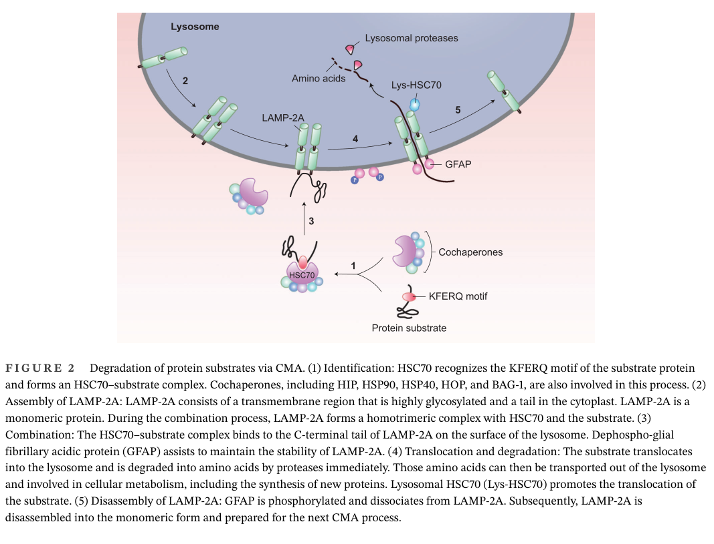

## Question

# Gene Research for Functional Annotation

## ⚠️ CRITICAL: Gene/Protein Identification Context

**BEFORE YOU BEGIN RESEARCH:** You MUST verify you are researching the CORRECT gene/protein. Gene symbols can be ambiguous, especially for less well-characterized genes from non-model organisms.

### Target Gene/Protein Identity (from UniProt):
- **UniProt Accession:** P63017
- **Protein Description:** RecName: Full=Heat shock cognate 71 kDa protein {ECO:0000305}; EC=3.6.4.10 {ECO:0000250|UniProtKB:P11142}; AltName: Full=Heat shock 70 kDa protein 8;
- **Gene Information:** Name=Hspa8 {ECO:0000312|MGI:MGI:105384}; Synonyms=Hsc70 {ECO:0000303|PubMed:10095055}, Hsc73 {ECO:0000303|PubMed:8682318};
- **Organism (full):** Mus musculus (Mouse).
- **Protein Family:** Belongs to the heat shock protein 70 family. .
- **Key Domains:** ATPase_NBD. (IPR043129); Heat_shock_70_CS. (IPR018181); HSP70_C_sf. (IPR029048); HSP70_peptide-bd_sf. (IPR029047); Hsp_70_fam. (IPR013126)

### MANDATORY VERIFICATION STEPS:

1. **Check if the gene symbol "Hspa8" matches the protein description above**
2. **Verify the organism is correct:** Mus musculus (Mouse).
3. **Check if protein family/domains align with what you find in literature**
4. **If you find literature for a DIFFERENT gene with the same or similar symbol, STOP**

### If Gene Symbol is Ambiguous or You Cannot Find Relevant Literature:

**DO NOT PROCEED WITH RESEARCH ON A DIFFERENT GENE.** Instead:
- State clearly: "The gene symbol 'Hspa8' is ambiguous or literature is limited for this specific protein"
- Explain what you found (e.g., "Found extensive literature on a different gene with the same symbol in a different organism")
- Describe the protein based ONLY on the UniProt information provided above
- Suggest that the protein function can be inferred from domain/family information

### Research Target:

Please provide a comprehensive research report on the gene **Hspa8** (gene ID: Hspa8, UniProt: P63017) in mouse.

The research report should be a detailed narrative explaining the function, biological processes, and localization of the gene product. Citations should be given for all claims.

You should prioritize authoritative reviews and primary scientific literature when conducting research. You can supplement
this with annotations you find in gene/protein databases, but these can be outdated or inaccurate.

We are specifically interested in the primary function of the gene - for enzymes, what reaction is catalyzed, and what is the substrate specificity? For transporters, what is the substrate? For structural proteins or adapters, what is the broader structural role? For signaling molecules, what is the role in the pathway.

We are interested in where in or outside the cell the gene product carries out its function.

We are also interested in the signaling or biochemical pathways in which the gene functions. We are less interested in broad pleiotropic effects, except where these elucidate the precise role.

Include evidence where possible. We are interested in both experimental evidence as well as inference from structure, evolution, or bioinformatic analysis. Precise studies should be prioritized over high-throughput, where available.

## Output

Question: You are an expert researcher providing comprehensive, well-cited information.

Provide detailed information focusing on:
1. Key concepts and definitions with current understanding
2. Recent developments and latest research (prioritize 2023-2024 sources)
3. Current applications and real-world implementations
4. Expert opinions and analysis from authoritative sources
5. Relevant statistics and data from recent studies

Format as a comprehensive research report with proper citations. Include URLs and publication dates where available.
Always prioritize recent, authoritative sources and provide specific citations for all major claims.

# Gene Research for Functional Annotation

## ⚠️ CRITICAL: Gene/Protein Identification Context

**BEFORE YOU BEGIN RESEARCH:** You MUST verify you are researching the CORRECT gene/protein. Gene symbols can be ambiguous, especially for less well-characterized genes from non-model organisms.

### Target Gene/Protein Identity (from UniProt):
- **UniProt Accession:** P63017
- **Protein Description:** RecName: Full=Heat shock cognate 71 kDa protein {ECO:0000305}; EC=3.6.4.10 {ECO:0000250|UniProtKB:P11142}; AltName: Full=Heat shock 70 kDa protein 8;
- **Gene Information:** Name=Hspa8 {ECO:0000312|MGI:MGI:105384}; Synonyms=Hsc70 {ECO:0000303|PubMed:10095055}, Hsc73 {ECO:0000303|PubMed:8682318};
- **Organism (full):** Mus musculus (Mouse).
- **Protein Family:** Belongs to the heat shock protein 70 family. .
- **Key Domains:** ATPase_NBD. (IPR043129); Heat_shock_70_CS. (IPR018181); HSP70_C_sf. (IPR029048); HSP70_peptide-bd_sf. (IPR029047); Hsp_70_fam. (IPR013126)

### MANDATORY VERIFICATION STEPS:

1. **Check if the gene symbol "Hspa8" matches the protein description above**
2. **Verify the organism is correct:** Mus musculus (Mouse).
3. **Check if protein family/domains align with what you find in literature**
4. **If you find literature for a DIFFERENT gene with the same or similar symbol, STOP**

### If Gene Symbol is Ambiguous or You Cannot Find Relevant Literature:

**DO NOT PROCEED WITH RESEARCH ON A DIFFERENT GENE.** Instead:
- State clearly: "The gene symbol 'Hspa8' is ambiguous or literature is limited for this specific protein"
- Explain what you found (e.g., "Found extensive literature on a different gene with the same symbol in a different organism")
- Describe the protein based ONLY on the UniProt information provided above
- Suggest that the protein function can be inferred from domain/family information

### Research Target:

Please provide a comprehensive research report on the gene **Hspa8** (gene ID: Hspa8, UniProt: P63017) in mouse.

The research report should be a detailed narrative explaining the function, biological processes, and localization of the gene product. Citations should be given for all claims.

You should prioritize authoritative reviews and primary scientific literature when conducting research. You can supplement
this with annotations you find in gene/protein databases, but these can be outdated or inaccurate.

We are specifically interested in the primary function of the gene - for enzymes, what reaction is catalyzed, and what is the substrate specificity? For transporters, what is the substrate? For structural proteins or adapters, what is the broader structural role? For signaling molecules, what is the role in the pathway.

We are interested in where in or outside the cell the gene product carries out its function.

We are also interested in the signaling or biochemical pathways in which the gene functions. We are less interested in broad pleiotropic effects, except where these elucidate the precise role.

Include evidence where possible. We are interested in both experimental evidence as well as inference from structure, evolution, or bioinformatic analysis. Precise studies should be prioritized over high-throughput, where available.

# Research Report: Mouse **Hspa8** (HSC70/HSC73) Functional Annotation (UniProt: **P63017**)

## 0. Scope and identity verification

**Target verified:** The user-specified UniProt entry **P63017** corresponds to mouse **Hspa8**, encoding the constitutively expressed cytosolic HSP70-family chaperone commonly called **HSC70/HSC73** (heat shock cognate 70/73). Across multiple sources, “Hsc70” is explicitly equated with **HSPA8** and described with the canonical HSP70 domain architecture and ATP-driven chaperone cycle expected for Hspa8/P63017 (melikov2024heatshockprotein pages 5-6, park2015theclathrinbindingand pages 1-2). 

**Ambiguity note:** The retrieved full-text corpus did not contain an explicit “UniProt P63017” string match; therefore, UniProt accession mapping is taken from the user-provided UniProt record and cross-validated by concordant naming (Hsc70 ≡ HSPA8) and functional/structural features in the literature (melikov2024heatshockprotein pages 5-6, park2015theclathrinbindingand pages 1-2).

## 1. Key concepts and definitions (current understanding)

### 1.1 What Hspa8/HSC70 is
Hspa8 encodes a **molecular chaperone** in the HSP70 family that supports proteostasis under basal (“housekeeping”) conditions, distinct from stress-inducible HSP70 paralogs. Structurally, HSP70s (including HSC70/HSPA8) contain an **N-terminal nucleotide-binding domain (NBD)** that binds/hydrolyzes ATP and a **C-terminal substrate-binding domain (SBD)** that binds client peptides; a C-terminal tail containing **EEVD** mediates cofactor interactions (melikov2024heatshockprotein pages 5-6).

### 1.2 Enzymatic activity and reaction cycle (EC 3.6.4.10)
HSC70’s core biochemical activity is **ATP hydrolysis coupled to cycles of client binding and release**, which enables folding/holding/refolding and quality control routing. ATP binding and hydrolysis in the NBD is allosterically coupled to SBD lid dynamics and client affinity (melikov2024heatshockprotein pages 5-6). In chaperone-mediated autophagy (CMA), the **ADP-bound** form is described as having the highest substrate affinity (huang2024selectiveproteindegradation pages 4-5).

### 1.3 Substrate recognition rules
HSC70/HSPA8 recognizes:
- **Non-native protein segments**, often hydrophobic patches exposed during misfolding/denaturation (general HSP70 feature) (pustovaya2026recentinsightsinto pages 1-2).
- **CMA substrates** bearing a **KFERQ-like pentapeptide motif**, which is necessary and sufficient to target proteins to CMA when appended to a reporter (huang2024selectiveproteindegradation pages 4-5). In CMA, the substrate motif is first recognized by HSC70 and delivered to the lysosomal surface (yao2023chaperone‐mediatedautophagymolecular pages 1-3).

### 1.4 Co-chaperones: what “drives” specificity
HSC70 function is strongly shaped by co-chaperones:
- **J-domain proteins (DNAJ/HSP40)** stimulate HSC70 ATP hydrolysis and promote client handoff (melikov2024heatshockprotein pages 5-6, huang2024selectiveproteindegradation pages 4-5).
- **Nucleotide exchange factors (NEFs)** accelerate ADP→ATP exchange; multiple NEF families exist (e.g., BAG family, Hsp110-like) (melikov2024heatshockprotein pages 5-6, pustovaya2026recentinsightsinto pages 8-9).
- In CMA, additional modulators include **Hip** (stabilizes substrate-bound complexes), **Hsp90** (notably described as stabilizing LAMP2A complexes), and others (huang2024selectiveproteindegradation pages 4-5).

## 2. Primary functions, pathways, and mechanisms

## 2.1 Proteostasis and protein quality control (PQC)
At a systems level, HSC70/HSPA8 is a core proteostasis factor that (i) assists folding of nascent and stress-denatured proteins, (ii) prevents aggregation, and (iii) helps route damaged clients toward degradation pathways (proteasome/autophagy) (melikov2024heatshockprotein pages 5-6, pustovaya2026recentinsightsinto pages 2-3).

## 2.2 Chaperone-mediated autophagy (CMA): pathway role of Hspa8
CMA is a selective lysosomal degradation pathway in vertebrates in which HSC70/HSPA8 is the **central recognition chaperone**.

**Mechanism (core steps):**
1) HSC70 recognizes the substrate’s **KFERQ-like motif** and forms a chaperone–substrate complex (yao2023chaperone‐mediatedautophagymolecular pages 1-3).
2) The complex is delivered to lysosomal membranes, where it binds the cytosolic tail of **LAMP-2A**; LAMP-2A multimerizes to form the translocation complex (yao2023chaperone‐mediatedautophagymolecular pages 1-3, yao2023chaperone‐mediatedautophagymolecular media e1f481b9).
3) HSC70’s ATPase cycle supports substrate unfolding and translocation; the unfolded substrate is imported into the lysosomal lumen and degraded by lysosomal enzymes (huang2024selectiveproteindegradation pages 4-5, yao2023chaperone‐mediatedautophagymolecular media e1f481b9).

**CMA evidence and regulatory context (recent review synthesis):** A 2023 review highlights CMA regulation by signaling pathways including **NRF2** and **p38–TFEB** axes, and positions CMA as activated by starvation, hypoxia, and oxidative stress (yao2023chaperone‐mediatedautophagymolecular pages 1-3). A 2024 CMA review adds mechanistic details including HSC70’s ATPase involvement and co-chaperone modulators (huang2024selectiveproteindegradation pages 4-5).

**Figure evidence:** The following schematic visualizes the HSC70/HSPA8-dependent CMA steps (substrate recognition, LAMP-2A multimerization, translocation, degradation) (yao2023chaperone‐mediatedautophagymolecular media e1f481b9).

## 2.3 Clathrin-mediated endocytosis (CME) and synaptic vesicle recycling: clathrin uncoating
HSC70/HSPA8 is a key ATPase that remodels and **uncoats clathrin lattices** after vesicle budding.

**Primary evidence (brain and cells):** Park et al. (J Cell Sci, 2015) provide direct evidence that Hsc70 (HSPA8) drives clathrin uncoating/chaperoning and that this activity requires J-domain cochaperones **GAK** (ubiquitous) or **auxilin** (neuronal). In this system, the **clathrin-binding motif plus J-domain** of GAK are necessary and sufficient to support Hsc70-dependent clathrin uncoating and rescue clathrin trafficking defects in knockout contexts, whereas the J-domain alone is insufficient (park2015theclathrinbindingand pages 1-2, park2015theclathrinbindingand pages 2-3). The study reports that a minimal GAK fragment (GAK-C62) can rescue lethality/histologic defects of GAK knockout and can support viability even when GAK and auxilin are both knocked out in brain (with smaller body size), implying these domains are the functional core for recruiting Hsc70 ATPase activity to clathrin coats (park2015theclathrinbindingand pages 1-2).

**Disease-pathway linkage (2024 synthesis):** A 2024 review on Parkinson’s disease emphasizes that defects in clathrin-uncoating-associated genes (e.g., **DNAJC6/auxilin**, **SYNJ1**) disrupt synaptic vesicle recycling, with mouse models showing dopamine terminal pathology and synergistic effects in combined models; it also flags GAK as a risk factor and notes emerging links between endocytic proteins and autophagy (ng2024dysfunctionofsynaptic pages 1-2).

## 3. Subcellular localization: where Hspa8 acts

### 3.1 Cytosol and cytosolic complexes
HSC70/HSPA8 is primarily a **cytosolic** chaperone supporting basal proteostasis, with cofactor engagement through its EEVD tail (melikov2024heatshockprotein pages 5-6).

### 3.2 Lysosomal membrane interface and lumen-associated CMA machinery
In CMA, HSC70 operates at the **cytosolic face of lysosomes** to recognize substrates and deliver them to LAMP-2A; luminal and membrane-associated co-chaperones (e.g., Hsp90 as described in one CMA review) participate in stabilizing the translocation complex (huang2024selectiveproteindegradation pages 4-5, yao2023chaperone‐mediatedautophagymolecular media e1f481b9).

### 3.3 Endocytic coats and synapses
In CME, HSC70/HSPA8 localizes functionally to clathrin-coated intermediates through recruitment by GAK/auxilin J-domain proteins, where ATP hydrolysis is coupled to clathrin lattice disassembly (park2015theclathrinbindingand pages 1-2, park2015theclathrinbindingand pages 2-3).

### 3.4 Neuronal dendrites: localized mRNA transport and local translation (2024)
A 2024 preprint reports that **Hspa8 mRNA is the most abundant dendritic chaperone mRNA** in mouse neurons, and that proteotoxic stress increases dendritic localization via microtubule-based transport and enhances local translation (alecki2024localizedmolecularchaperone pages 1-3). Quantitatively, dendrites contained on average ~**100 Hspa8 mRNAs vs ~5 Hspa1a mRNAs**; MG132 stress increased the fraction of spines containing Hspa8 mRNAs from ~**20%** to ~**40%** (alecki2024localizedmolecularchaperone pages 3-5, alecki2024localizedmolecularchaperone pages 5-7). This work implicates ALS-linked RBPs (e.g., FUS; HNRNPA2B1) as regulators of the Hspa8 mRNA localization response (alecki2024localizedmolecularchaperone pages 1-3, alecki2024localizedmolecularchaperone pages 7-10).

### 3.5 Extracellular/EV-associated HSP70-family pools (context for HSPA8)
A 2024 review summarizes that HSP70-family proteins can translocate to membranes and extracellular space, including packaging into extracellular vesicles (EVs); mechanisms include lipid-raft association, endolysosomal trafficking, and exosome/ectosome release (hu2024diversityofextracellular pages 2-4). This literature is often **not isoform-specific**, but provides the current framework used for biomarker development around extracellular HSP70s.

## 4. Recent developments (prioritizing 2023–2024)

### 4.1 CMA: refined regulatory networks and disease connections
Recent CMA reviews (2023–2024) emphasize HSC70 as the recognition chaperone, LAMP-2A as the lysosomal receptor, and explore how CMA influences metabolism, aging, immunity, and inflammatory signaling; they highlight the continuing expansion of regulatory pathways (e.g., NRF2, p38–TFEB) (yao2023chaperone‐mediatedautophagymolecular pages 1-3, huang2024selectiveproteindegradation pages 4-5).

### 4.2 Neuronal compartment-specific proteostasis as an Hspa8-controlled stress response (2024)
The 2024 neuron-focused work provides a modern view of Hspa8 regulation: not just protein-level chaperoning, but **spatiotemporally controlled dendritic mRNA localization and translation** as a cell-biological mechanism to maintain local proteostasis in dendrites and spines under stress (alecki2024localizedmolecularchaperone pages 1-3, alecki2024localizedmolecularchaperone pages 5-7).

### 4.3 Therapeutic targeting: HSPA8 inhibition as a combination strategy (2024)
A 2024 Molecular Biology of the Cell study reports a noncanonical function of HSPA8 as an “amyloidase” that suppresses necroptosis by dismantling RHIM-containing fibrils, and shows that **pharmacologic inhibition** of HSPA8 can potentiate necroptosis and improve responses to microtubule-targeting chemotherapy (wu2024hspa8inhibitorsaugment pages 1-2). The study specifies two targeting modes: **VER-155008** (ATP-competitive NBD binder) and **PES/pifithrin-μ** (SBD-interacting), both of which disrupted HSPA8–RHIM binding and enhanced necroptosis, with improved tumor regression in vivo when combined with MTAs (wu2024hspa8inhibitorsaugment pages 1-2).

## 5. Current applications and real-world implementations

### 5.1 Experimental biology and model systems
- **Endocytosis/synapse research:** Hsc70/HSPA8 is used conceptually and experimentally as the ATPase core of clathrin uncoating, with GAK/auxilin as modulators; these mechanisms are used to interpret synaptic vesicle recycling phenotypes in neurological disease models (park2015theclathrinbindingand pages 1-2, ng2024dysfunctionofsynaptic pages 1-2).
- **Autophagy pathway interrogation:** CMA studies frequently track HSC70-mediated KFERQ recognition and LAMP-2A-dependent trafficking/translocation as a selective degradation route (yao2023chaperone‐mediatedautophagymolecular pages 1-3, yao2023chaperone‐mediatedautophagymolecular media e1f481b9).

### 5.2 Translational applications
- **Cancer therapy:** Small-molecule HSPA8 inhibitors (e.g., VER-155008, PES/pifithrin-μ) are being investigated for synergistic effects with established chemotherapies by manipulating regulated cell death pathways (necroptosis) (wu2024hspa8inhibitorsaugment pages 1-2).
- **Biomarkers (extracellular HSP70s):** EV-associated/extracellular HSP70-family proteins are being assessed as blood/urine biomarkers for diagnosis, metastasis, and treatment response in cancer; mechanistic models for how HSP70s are exported are actively reviewed (hu2024diversityofextracellular pages 2-4).

## 6. Expert opinions and analysis (authoritative synthesis)

### 6.1 Why Hspa8 is pleiotropic yet mechanistically coherent
The breadth of Hspa8 phenotypes across tissues and diseases is best understood as the downstream consequence of a conserved biochemical engine—**ATP-driven binding/release cycles**—deployed in diverse cellular contexts via distinct co-chaperones and targeting factors (J-domain proteins, NEFs, etc.) (melikov2024heatshockprotein pages 5-6, pustovaya2026recentinsightsinto pages 8-9).

### 6.2 Two especially well-supported “primary” pathway roles
Among Hspa8’s many reported functions, two are particularly mechanistically grounded and repeatedly supported:
1) **CMA substrate recognition and delivery to LAMP-2A**, central for selective lysosomal degradation (yao2023chaperone‐mediatedautophagymolecular pages 1-3, huang2024selectiveproteindegradation pages 4-5).
2) **Clathrin uncoating and clathrin chaperoning** via GAK/auxilin recruitment, crucial for endocytosis and synaptic vesicle recycling (park2015theclathrinbindingand pages 1-2, park2015theclathrinbindingand pages 2-3).

## 7. Relevant recent statistics/data (from recent studies)

Neuronal compartmentalization (mouse neurons; 2024 preprint):
- Average dendritic abundance: ~**100 Hspa8** vs ~**5 Hspa1a** mRNAs (alecki2024localizedmolecularchaperone pages 3-5).
- Fraction of spines containing Hspa8 mRNAs increased from ~**20%** (control) to ~**40%** (MG132 stress) (alecki2024localizedmolecularchaperone pages 5-7).

These quantitative readouts support a model in which Hspa8 is prioritized for local proteostasis support in neuronal projections during stress (alecki2024localizedmolecularchaperone pages 1-3, alecki2024localizedmolecularchaperone pages 5-7).

## 8. Summary table (evidence-based)

| Category | Summary |
|---|---|
| Identity/Structure | - Mouse **Hspa8/HSC70 (Hsc73)** is the constitutive cytosolic HSP70-family paralog, distinct from stress-inducible HSP70s. - Domain architecture: **N-terminal ATPase/NBD**, **C-terminal substrate-binding domain (SBD)** with lid, interdomain linker, and **EEVD-containing tail** for cofactor interactions. - Functional annotation is consistent with an HSP70-family housekeeping chaperone/proteostasis factor (melikov2024heatshockprotein pages 5-6, pustovaya2026recentinsightsinto pages 1-2) |
| Enzymatic activity | - **ATPase-driven molecular chaperone**: ATP binding/hydrolysis in the NBD controls client capture and release. - ADP-bound state has high substrate affinity in CMA-related binding cycles. - Also functions in ATP-coupled clathrin coat remodeling/uncoating (huang2024selectiveproteindegradation pages 4-5, pustovaya2026recentinsightsinto pages 2-3, park2015theclathrinbindingand pages 1-2) |
| Substrate recognition | - Binds exposed **hydrophobic peptide segments** typical of non-native proteins. - In **chaperone-mediated autophagy (CMA)**, recognizes **KFERQ-like motifs** and delivers substrates to lysosomes. - 2024 mechanistic evidence highlighted direct HSC70 interaction with KFERQ-like motifs in CMA/microautophagy context (huang2024selectiveproteindegradation pages 4-5, yao2023chaperone‐mediatedautophagymolecular pages 1-3, pustovaya2026recentinsightsinto pages 11-12) |
| Key co-chaperones | - **J-domain proteins/HSP40s** stimulate ATP hydrolysis and client handoff. - **NEFs** (e.g., BAG family, HSP110 class) promote ADP→ATP exchange. - In CMA/endocytosis contexts, reported partners include **Hip, Hsp40, Hsp90, BAG proteins, GAK, auxilin** (melikov2024heatshockprotein pages 5-6, huang2024selectiveproteindegradation pages 4-5, pustovaya2026recentinsightsinto pages 8-9, park2015theclathrinbindingand pages 1-2) |
| Major pathways | - Core **proteostasis/PQC**: folding, refolding, anti-aggregation, routing clients toward degradation. - **CMA**: HSC70 binds KFERQ-bearing substrates, docks at **LAMP2A**, and supports unfolding/translocation. - **Clathrin-mediated endocytosis/synaptic vesicle recycling**: HSC70 works with **GAK/auxilin** to uncoat clathrin-coated vesicles (huang2024selectiveproteindegradation pages 4-5, yao2023chaperone‐mediatedautophagymolecular pages 1-3, park2015theclathrinbindingand pages 1-2, ng2024dysfunctionofsynaptic pages 1-2) |
| Localization | - Predominantly **cytosolic**, but functionally engages **lysosomal membranes/lumen-associated CMA machinery**. - Also implicated at **endocytic/synaptic vesicle coats** and in **neuronal dendrites** via local Hspa8 mRNA translation. - Broader HSP70 literature supports extracellular/endolysosomal/exosomal trafficking, though HSPA8-specific extracellular evidence here is more limited than for total eHSP70 (huang2024selectiveproteindegradation pages 4-5, pustovaya2026recentinsightsinto pages 11-12, alecki2024localizedmolecularchaperone pages 1-3, hu2024diversityofextracellular pages 2-4) |
| 2023-2024 developments | - 2023–2024 CMA reviews emphasize HSC70 as the **central substrate-recognition chaperone** and discuss newer regulators such as **NRF2** and **p38–TFEB** pathways. - 2024 neuronal work identifies **Hspa8 as the most abundant dendritic chaperone mRNA** and shows stress-induced local translation in mouse/human neurons. - 2024 cancer study shows **HSPA8 inhibitors** can potentiate necroptosis and chemotherapy response (yao2023chaperone‐mediatedautophagymolecular pages 1-3, alecki2024localizedmolecularchaperone pages 1-3, alecki2024localizedmolecularchaperone pages 7-10, wu2024hspa8inhibitorsaugment pages 1-2) |
| Applications/therapeutic targeting | - Pharmacologic inhibitors include **VER-155008** (ATP-competitive, NBD) and **PES/pifithrin-μ** (SBD-directed). - In 2024 cancer models, HSPA8 inhibition increased sensitivity to **microtubule-targeting agents** and enhanced necroptosis-driven tumor regression. - HSP70-family extracellular vesicle biology is being explored for **biomarker** and therapeutic applications, though much of that literature is not HSPA8-specific (wu2024hspa8inhibitorsaugment pages 1-2, hu2024diversityofextracellular pages 2-4) |
| Quantitative findings | - In stressed neurons, dendrites contained roughly **~100 Hspa8 mRNAs vs ~5 Hspa1a mRNAs** on average. - MG132 stress increased spines containing Hspa8 mRNA from about **~20% to ~40%**. - MG132 increased translated Hspa8 mRNAs by about **20–45%** in reporter assays; differential-expression thresholds included **>1.7-fold, p<0.01** in one analysis (alecki2024localizedmolecularchaperone pages 10-12, alecki2024localizedmolecularchaperone pages 5-7, alecki2024localizedmolecularchaperone pages 3-5) |

*Table: This table condenses the current evidence-based functional annotation for mouse Hspa8/HSC70 (UniProt P63017). It highlights validated structural features, core biochemical roles, major pathways, localization, and recent 2023–2024 developments useful for a final gene report.*

## Key sources (with URLs and publication dates)
- Yao R, Shen J. **Chaperone-mediated autophagy: Molecular mechanisms, biological functions, and diseases.** *MedComm*. **Aug 2023**. https://doi.org/10.1002/mco2.347 (yao2023chaperone‐mediatedautophagymolecular pages 1-3, yao2023chaperone‐mediatedautophagymolecular media e1f481b9)
- Huang J, Wang J. **Selective protein degradation through chaperone-mediated autophagy: Implications for cellular homeostasis and disease (Review).** *Molecular Medicine Reports*. **Oct 2024**. https://doi.org/10.3892/mmr.2024.13378 (huang2024selectiveproteindegradation pages 4-5)
- Melikov A, Novák P. **Heat Shock Protein Network: the Mode of Action, the Role in Protein Folding and Human Pathologies.** *Folia Biologica*. **Jan 2024**. https://doi.org/10.14712/fb2024070030152 (melikov2024heatshockprotein pages 5-6)
- Alecki C et al. **Localized molecular chaperone synthesis maintains neuronal dendrite proteostasis.** *bioRxiv preprint*. **Oct 2024**. https://doi.org/10.1101/2023.10.03.560761 (alecki2024localizedmolecularchaperone pages 1-3, alecki2024localizedmolecularchaperone pages 5-7, alecki2024localizedmolecularchaperone pages 3-5)
- Wu E et al. **HSPA8 inhibitors augment cancer chemotherapeutic effectiveness via potentiating necroptosis.** *Molecular Biology of the Cell*. **Aug 2024**. https://doi.org/10.1091/mbc.e24-04-0194 (wu2024hspa8inhibitorsaugment pages 1-2)
- Park B-C et al. **The clathrin-binding and J-domains of GAK support the uncoating and chaperoning of clathrin by Hsc70 in the brain.** *Journal of Cell Science*. **Oct 2015**. https://doi.org/10.1242/jcs.171058 (park2015theclathrinbindingand pages 1-2, park2015theclathrinbindingand pages 2-3)
- Hu B et al. **Diversity of extracellular HSP70 in cancer: advancing from a molecular biomarker to a novel therapeutic target.** *Frontiers in Oncology*. **Apr 2024**. https://doi.org/10.3389/fonc.2024.1388999 (hu2024diversityofextracellular pages 2-4)

References

1. (melikov2024heatshockprotein pages 5-6): Aleksandr Melikov and Petr Novák. Heat shock protein network: the mode of action, the role in protein folding and human pathologies. Folia biologica, 70 3:152-165, Jan 2024. URL: https://doi.org/10.14712/fb2024070030152, doi:10.14712/fb2024070030152. This article has 11 citations and is from a peer-reviewed journal.

2. (park2015theclathrinbindingand pages 1-2): Bum-Chan Park, Yang-In Yim, Xiaohong Zhao, Maciej B. Olszewski, Evan Eisenberg, and Lois E. Greene. The clathrin-binding and j-domains of gak support the uncoating and chaperoning of clathrin by hsc70 in the brain. Journal of Cell Science, 128:3811-3821, Oct 2015. URL: https://doi.org/10.1242/jcs.171058, doi:10.1242/jcs.171058. This article has 36 citations and is from a domain leading peer-reviewed journal.

3. (huang2024selectiveproteindegradation pages 4-5): Jiahui Huang and Jiazhen Wang. Selective protein degradation through chaperone‑mediated autophagy: implications for cellular homeostasis and disease (review). Molecular Medicine Reports, Oct 2024. URL: https://doi.org/10.3892/mmr.2024.13378, doi:10.3892/mmr.2024.13378. This article has 24 citations and is from a peer-reviewed journal.

4. (pustovaya2026recentinsightsinto pages 1-2): Kristina Pustovaya, Artem Venediktov, Vladislav Soldatov, Egor Kuzmin, Ksenia Pokidova, Viktoria Gartzeva, Olga Payushina, Vassiliy Tsytsarev, Igor Meglinski, and Gennadii Piavchenko. Recent insights into hsp70: proteostasis and beyond. Frontiers in Molecular Biosciences, Apr 2026. URL: https://doi.org/10.3389/fmolb.2026.1791536, doi:10.3389/fmolb.2026.1791536. This article has 1 citations.

5. (yao2023chaperone‐mediatedautophagymolecular pages 1-3): Ruchen Yao and Jun Shen. Chaperone‐mediated autophagy: molecular mechanisms, biological functions, and diseases. MedComm, Aug 2023. URL: https://doi.org/10.1002/mco2.347, doi:10.1002/mco2.347. This article has 101 citations.

6. (pustovaya2026recentinsightsinto pages 8-9): Kristina Pustovaya, Artem Venediktov, Vladislav Soldatov, Egor Kuzmin, Ksenia Pokidova, Viktoria Gartzeva, Olga Payushina, Vassiliy Tsytsarev, Igor Meglinski, and Gennadii Piavchenko. Recent insights into hsp70: proteostasis and beyond. Frontiers in Molecular Biosciences, Apr 2026. URL: https://doi.org/10.3389/fmolb.2026.1791536, doi:10.3389/fmolb.2026.1791536. This article has 1 citations.

7. (pustovaya2026recentinsightsinto pages 2-3): Kristina Pustovaya, Artem Venediktov, Vladislav Soldatov, Egor Kuzmin, Ksenia Pokidova, Viktoria Gartzeva, Olga Payushina, Vassiliy Tsytsarev, Igor Meglinski, and Gennadii Piavchenko. Recent insights into hsp70: proteostasis and beyond. Frontiers in Molecular Biosciences, Apr 2026. URL: https://doi.org/10.3389/fmolb.2026.1791536, doi:10.3389/fmolb.2026.1791536. This article has 1 citations.

8. (yao2023chaperone‐mediatedautophagymolecular media e1f481b9): Ruchen Yao and Jun Shen. Chaperone‐mediated autophagy: molecular mechanisms, biological functions, and diseases. MedComm, Aug 2023. URL: https://doi.org/10.1002/mco2.347, doi:10.1002/mco2.347. This article has 101 citations.

9. (park2015theclathrinbindingand pages 2-3): Bum-Chan Park, Yang-In Yim, Xiaohong Zhao, Maciej B. Olszewski, Evan Eisenberg, and Lois E. Greene. The clathrin-binding and j-domains of gak support the uncoating and chaperoning of clathrin by hsc70 in the brain. Journal of Cell Science, 128:3811-3821, Oct 2015. URL: https://doi.org/10.1242/jcs.171058, doi:10.1242/jcs.171058. This article has 36 citations and is from a domain leading peer-reviewed journal.

10. (ng2024dysfunctionofsynaptic pages 1-2): Xin Yi Ng and Mian Cao. Dysfunction of synaptic endocytic trafficking in parkinson’s disease. Neural Regeneration Research, 19(12):2649-2660, Mar 2024. URL: https://doi.org/10.4103/nrr.nrr-d-23-01624, doi:10.4103/nrr.nrr-d-23-01624. This article has 32 citations and is from a peer-reviewed journal.

11. (alecki2024localizedmolecularchaperone pages 1-3): Célia Alecki, Javeria Rizwan, Phuong Le, Suleima Jacob-Tomas, Mario Fernandez-Comaduran, Morgane Verbrugghe, Jia Ming Stella Xu, Sandra Minotti, James Lynch, Tad Wu, Heather Durham, Gene W. Yeo, and Maria Vera. Localized molecular chaperone synthesis maintains neuronal dendrite proteostasis. bioRxiv, Oct 2024. URL: https://doi.org/10.1101/2023.10.03.560761, doi:10.1101/2023.10.03.560761. This article has 13 citations.

12. (alecki2024localizedmolecularchaperone pages 3-5): Célia Alecki, Javeria Rizwan, Phuong Le, Suleima Jacob-Tomas, Mario Fernandez-Comaduran, Morgane Verbrugghe, Jia Ming Stella Xu, Sandra Minotti, James Lynch, Tad Wu, Heather Durham, Gene W. Yeo, and Maria Vera. Localized molecular chaperone synthesis maintains neuronal dendrite proteostasis. bioRxiv, Oct 2024. URL: https://doi.org/10.1101/2023.10.03.560761, doi:10.1101/2023.10.03.560761. This article has 13 citations.

13. (alecki2024localizedmolecularchaperone pages 5-7): Célia Alecki, Javeria Rizwan, Phuong Le, Suleima Jacob-Tomas, Mario Fernandez-Comaduran, Morgane Verbrugghe, Jia Ming Stella Xu, Sandra Minotti, James Lynch, Tad Wu, Heather Durham, Gene W. Yeo, and Maria Vera. Localized molecular chaperone synthesis maintains neuronal dendrite proteostasis. bioRxiv, Oct 2024. URL: https://doi.org/10.1101/2023.10.03.560761, doi:10.1101/2023.10.03.560761. This article has 13 citations.

14. (alecki2024localizedmolecularchaperone pages 7-10): Célia Alecki, Javeria Rizwan, Phuong Le, Suleima Jacob-Tomas, Mario Fernandez-Comaduran, Morgane Verbrugghe, Jia Ming Stella Xu, Sandra Minotti, James Lynch, Tad Wu, Heather Durham, Gene W. Yeo, and Maria Vera. Localized molecular chaperone synthesis maintains neuronal dendrite proteostasis. bioRxiv, Oct 2024. URL: https://doi.org/10.1101/2023.10.03.560761, doi:10.1101/2023.10.03.560761. This article has 13 citations.

15. (hu2024diversityofextracellular pages 2-4): Binbin Hu, Guihong Liu, Kejia Zhao, and Gao Zhang. Diversity of extracellular hsp70 in cancer: advancing from a molecular biomarker to a novel therapeutic target. Frontiers in Oncology, Apr 2024. URL: https://doi.org/10.3389/fonc.2024.1388999, doi:10.3389/fonc.2024.1388999. This article has 30 citations.

16. (wu2024hspa8inhibitorsaugment pages 1-2): Erpeng Wu, Chenlu Wu, Kelong Jia, Shen’ao Zhou, and Liming Sun. Hspa8 inhibitors augment cancer chemotherapeutic effectiveness via potentiating necroptosis. Molecular Biology of the Cell, Aug 2024. URL: https://doi.org/10.1091/mbc.e24-04-0194, doi:10.1091/mbc.e24-04-0194. This article has 9 citations and is from a domain leading peer-reviewed journal.

17. (pustovaya2026recentinsightsinto pages 11-12): Kristina Pustovaya, Artem Venediktov, Vladislav Soldatov, Egor Kuzmin, Ksenia Pokidova, Viktoria Gartzeva, Olga Payushina, Vassiliy Tsytsarev, Igor Meglinski, and Gennadii Piavchenko. Recent insights into hsp70: proteostasis and beyond. Frontiers in Molecular Biosciences, Apr 2026. URL: https://doi.org/10.3389/fmolb.2026.1791536, doi:10.3389/fmolb.2026.1791536. This article has 1 citations.

18. (alecki2024localizedmolecularchaperone pages 10-12): Célia Alecki, Javeria Rizwan, Phuong Le, Suleima Jacob-Tomas, Mario Fernandez-Comaduran, Morgane Verbrugghe, Jia Ming Stella Xu, Sandra Minotti, James Lynch, Tad Wu, Heather Durham, Gene W. Yeo, and Maria Vera. Localized molecular chaperone synthesis maintains neuronal dendrite proteostasis. bioRxiv, Oct 2024. URL: https://doi.org/10.1101/2023.10.03.560761, doi:10.1101/2023.10.03.560761. This article has 13 citations.

## Artifacts

- [Edison artifact artifact-00](Hspa8-deep-research-falcon_artifacts/artifact-00.md)

## Citations

1. melikov2024heatshockprotein pages 5-6
2. huang2024selectiveproteindegradation pages 4-5
3. pustovaya2026recentinsightsinto pages 1-2
4. park2015theclathrinbindingand pages 1-2
5. ng2024dysfunctionofsynaptic pages 1-2
6. alecki2024localizedmolecularchaperone pages 1-3
7. hu2024diversityofextracellular pages 2-4
8. alecki2024localizedmolecularchaperone pages 3-5
9. alecki2024localizedmolecularchaperone pages 5-7
10. pustovaya2026recentinsightsinto pages 8-9
11. pustovaya2026recentinsightsinto pages 2-3
12. park2015theclathrinbindingand pages 2-3
13. alecki2024localizedmolecularchaperone pages 7-10
14. pustovaya2026recentinsightsinto pages 11-12
15. alecki2024localizedmolecularchaperone pages 10-12
16. https://doi.org/10.1002/mco2.347
17. https://doi.org/10.3892/mmr.2024.13378
18. https://doi.org/10.14712/fb2024070030152
19. https://doi.org/10.1101/2023.10.03.560761
20. https://doi.org/10.1091/mbc.e24-04-0194
21. https://doi.org/10.1242/jcs.171058
22. https://doi.org/10.3389/fonc.2024.1388999
23. https://doi.org/10.14712/fb2024070030152,
24. https://doi.org/10.1242/jcs.171058,
25. https://doi.org/10.3892/mmr.2024.13378,
26. https://doi.org/10.3389/fmolb.2026.1791536,
27. https://doi.org/10.1002/mco2.347,
28. https://doi.org/10.4103/nrr.nrr-d-23-01624,
29. https://doi.org/10.1101/2023.10.03.560761,
30. https://doi.org/10.3389/fonc.2024.1388999,
31. https://doi.org/10.1091/mbc.e24-04-0194,