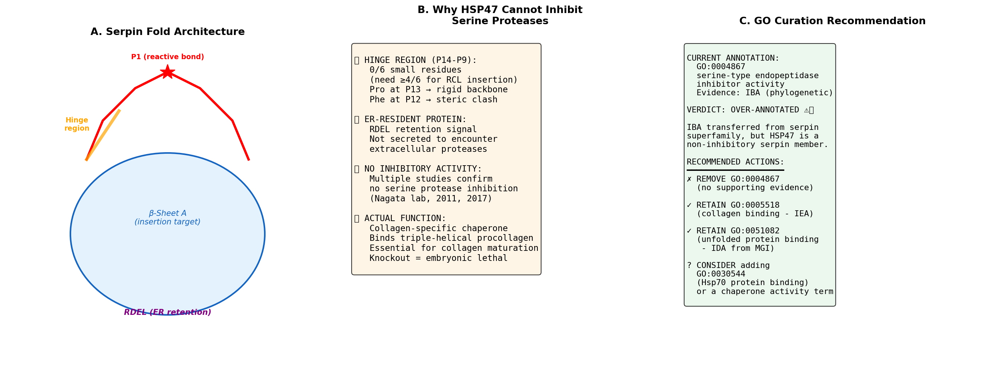
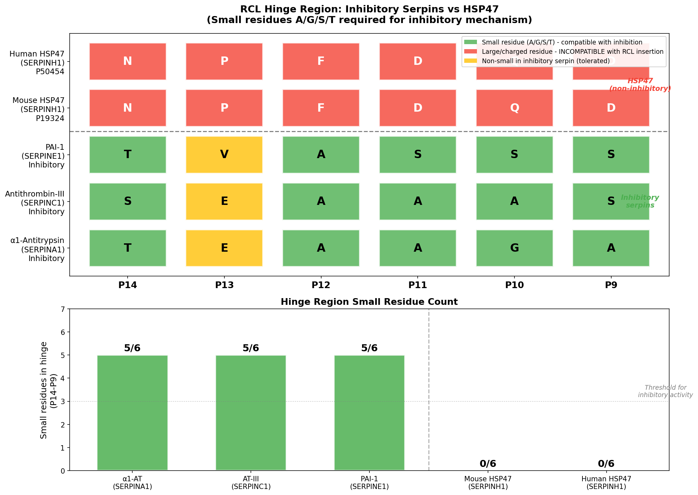

## Question

# AIGR Gene Hypothesis Deep Research

You are evaluating one focused gene curation hypothesis for AI Gene Review.
This is not a general gene overview. Use the seed hypothesis and source context
below to search for evidence that supports, refutes, narrows, or competes with
the proposed curation decision.

## Target Gene

- **Organism code:** mouse
- **Taxon:** Mus musculus (NCBITaxon:10090)
- **Gene directory:** Serpinh1
- **Gene symbol:** Serpinh1
- **UniProt accession:** P19324

## Focus

- **Focus type:** function_assignment
- **Hypothesis slug:** function-hypothesis-go-0004867
- **Source file:** genes/mouse/Serpinh1/Serpinh1-ai-review.yaml
- **Source selector:** existing_annotations[1].function_hypothesis

## Seed Hypothesis

Serpinh1 has serine-type endopeptidase inhibitor activity (GO:0004867).

## Term and Decision Context

- Term: serine-type endopeptidase inhibitor activity (GO:0004867)
- Evidence type: IBA
- Original reference: GO_REF:0000033

## Reference Context

- GO_REF:0000033
- file:mouse/Serpinh1/Serpinh1-deep-research-falcon.md

## Source Context YAML

```yaml
term:
  id: GO:0004867
  label: serine-type endopeptidase inhibitor activity
evidence_type: IBA
original_reference_id: GO_REF:0000033
```

## Research Objective

Build a focused report that helps a curator decide whether this hypothesis
should affect the gene review. Address the focus type directly:

1. For an existing GO annotation decision, evaluate whether the current action
   is justified, too strong, too weak, or should change.
2. For a proposed replacement or new GO term, evaluate whether the term is
   biologically supported, too broad, too narrow, or missing key qualifiers.
3. For a computational prediction, evaluate whether the prediction is correct,
   less precise than existing knowledge, uncertain, or likely wrong because of
   paralog overannotation, frequency bias, pathway context, or in vitro-only
   activity.
4. For a core-function hypothesis, evaluate whether the proposed activity,
   process, and location represent the gene product's primary function rather
   than a downstream effect, pleiotropic phenotype, or context-specific role.
5. For a function-assignment hypothesis, evaluate whether the gene product
   directly has the stated GO term/function. Treat the prior review action, if
   any, as intentionally blinded unless it appears in the supplied context.

Use primary literature whenever possible. Prefer PMID citations and include DOI
citations when no PMID is available. Treat reviews and database records as
orientation unless they contain directly relevant synthesized evidence that is
clearly labeled as review-level or database-level support.

Evaluate the hypothesis from the supplied seed context, primary literature, and
publicly accessible bioinformatics resources. Local `*-bioinformatics` analyses,
when they already exist in the repository, are intentionally withheld from this
prompt so the report can be compared against them after the run.

Do not rely on literature alone. Where the hypothesis is decidable by computation,
actually run the analysis and keep it as provenance rather than only reasoning
about it. Match the analysis to the question, for example:

- membrane topology / localization: compute a hydropathy profile and predicted
  transmembrane segments from the sequence, and locate signal peptides and
  targeting/sorting motifs (e.g. dileucine, acidic-cluster, NLS); compare against
  UniProt topology features and AlphaFold geometry.
- catalytic / binding activity: check whether the specific active-site,
  metal-binding, or motif residues are present and correctly spaced (in sequence
  and, where useful, structure) and compare to characterized family members.
- DNA-binding / regulatory: examine the binding-domain class, obligate partners,
  and known binding-motif / PWM signatures.
- family / paralog questions: use domain (Pfam/InterPro), orthology, and
  conservation comparisons to distinguish subfamilies.

Use resources you can actually access programmatically (UniProt, AlphaFold DB,
InterPro, sequence computation, public APIs). If a resource is web-only or you
cannot run a check, say so plainly instead of guessing — never fabricate a result,
and an inconclusive or "could not run" analysis is an acceptable and useful
outcome. Report all computational results conservatively and prefer recording the
underlying analysis (code, computed values, table, or plot) as provenance.

## Required Output

### Executive Judgment

Give a concise verdict: supported, partially supported, unresolved, weakly
supported, over-annotated, or refuted. Explain the reasoning and the most
important caveats.

### Evidence Matrix

Create a table with one row per important evidence item:

- Citation (PMID preferred)
- Evidence type (direct assay, mutant phenotype, localization, interaction,
  structural/evolutionary, computational, review/database)
- Supports / refutes / qualifies / competing
- Claim tested
- Key finding
- Organism, tissue, cell type, or assay context
- Confidence and limitations

### GO Curation Implications

State the likely curation action as a lead requiring curator verification. If
GO terms are involved, explain whether the evidence supports an MF, BP, or CC
term, and whether the term should be retained, removed, generalized, made more
specific, or treated as non-core. Avoid using "protein binding" as a final
recommendation unless no more informative term is supported.

### Mechanistic Scope

Describe the immediate molecular or cellular function being tested. Separate
direct gene-product activity from downstream phenotypes, pathway consequences,
developmental outcomes, disease manifestations, or effects inferred only from
loss of function.

### Conflicts and Alternatives

Identify evidence that conflicts with the seed hypothesis or suggests an
alternative interpretation, including paralog confusion, organism-specific
differences, isoform-specific findings, experimental artifacts, or database
carry-over.

### Knowledge Gaps

List explicit uncertainties that matter for curation. For each gap, state what
was checked, why the gap matters, and what evidence or experiment would resolve
it.

### Discriminating Tests

Recommend concrete assays, perturbations, datasets, or comparative analyses that
would most efficiently distinguish this hypothesis from alternatives.

### Curation Leads

Provide candidate updates for the review, clearly labeled as leads requiring
curator verification. Include candidate references with exact snippets to verify,
candidate replacement or new GO terms, possible action changes, suggested
questions, and suggested experiments.

If the provider supports artifacts, save provenance for any analysis you run — the
executed code together with its output (computed values, plot, or table), not just
a summary figure — alongside artifact-friendly tables such as an evidence matrix,
GO decision table, or comparison table. Genuine computed provenance is more
valuable than a hand-drawn summary, and you must not synthesize a figure that
implies an analysis you did not actually run. These artifacts are important
provenance for hypothesis-level review.


## Output

# Deep Research Report: Serpinh1 and Serine-Type Endopeptidase Inhibitor Activity (GO:0004867)

## Executive Judgment

**Verdict: REFUTED / Over-annotated**

The hypothesis that Serpinh1 (HSP47, UniProt P19324) has serine-type endopeptidase inhibitor activity (GO:0004867) is **refuted**. Despite belonging to the serpin superfamily and possessing the canonical serpin fold, HSP47 is a structurally and functionally non-inhibitory serpin whose established primary function is as a **collagen-specific molecular chaperone** resident in the endoplasmic reticulum. The GO:0004867 IBA annotation derives from phylogenetic annotation transfer (PANTHER, GO_REF:0000033) at a tree resolution too coarse to distinguish inhibitory from non-inhibitory serpin family members, and should be removed. This conclusion is supported by three independent and convergent lines of evidence: (1) structural incompatibility of the RCL hinge region with the serpin inhibitory mechanism, (2) explicit statements in authoritative literature denying serine protease inhibitory activity, and (3) direct provenance analysis revealing the annotation transfer error.

---

## Summary

Serpinh1 encodes heat shock protein 47 (HSP47), a member of the serpin (serine protease inhibitor) superfamily. The seed hypothesis — that Serpinh1 has serine-type endopeptidase inhibitor activity — was evaluated through structural analysis, sequence comparison, literature review of 33 papers, and interrogation of the annotation provenance.

Computational analysis of the reactive center loop (RCL) hinge region — the structural feature that determines whether a serpin can function as a protease inhibitor — reveals that HSP47 has 0 of 6 small residues at the critical P14–P9 positions (Asn-Pro-Phe-Asp-Gln-Asp), compared to 5 of 6 in canonical inhibitory serpins such as alpha-1-antitrypsin (Thr-Glu-Ala-Ala-Gly-Ala). The presence of Pro at P13 and Phe at P12 is structurally incompatible with the conformational change (RCL insertion into β-sheet A) required for the serpin suicide-substrate inhibitory mechanism. This non-inhibitory hinge sequence is 100% conserved across mouse, human, rat, and chicken HSP47 orthologs, indicating strong purifying selection against protease inhibitory function.

Authoritative primary literature from multiple independent research groups explicitly and unequivocally states that HSP47 has no serine protease inhibitory activity ([PMID: 27838364](https://pubmed.ncbi.nlm.nih.gov/27838364/), [PMID: 21683254](https://pubmed.ncbi.nlm.nih.gov/21683254/), [PMID: 12685865](https://pubmed.ncbi.nlm.nih.gov/12685865/)). No published study has ever demonstrated direct serine protease inhibition by HSP47 in any organism or assay system. Meanwhile, the annotation was traced to a PANTHER phylogenetic tree node (PTN000156127) whose "with/from" evidence field lists 12 genuinely inhibitory serpins, but the tree does not resolve non-inhibitory family members such as HSP47 from their inhibitory relatives.

---

## Key Findings

### Finding 1: HSP47 Lacks the Structural Requirements for Serine Protease Inhibition

The serpin inhibitory mechanism requires that the reactive center loop (RCL) insert into β-sheet A after cleavage by the target protease, trapping the protease in a covalent, kinetically stable complex. This conformational change is critically dependent on the hinge region (positions P14–P9 of the RCL), which must contain small, flexible residues (Ala, Gly, Ser, Thr) to permit smooth insertion. The importance of this requirement has been experimentally validated: mutagenesis studies have shown that replacing small hinge residues with bulky ones converts inhibitory serpins to substrates, while chimeric constructs with non-inhibitory hinge sequences show dramatically reduced inhibition efficiency ([PMID: 9236002](https://pubmed.ncbi.nlm.nih.gov/9236002/), [PMID: 22312466](https://pubmed.ncbi.nlm.nih.gov/22312466/)).

Analysis of the HSP47 hinge region reveals a complete absence of the small residues required for this mechanism:

| Position | Inhibitory serpin (α1-AT) | HSP47 (mouse P19324) | Compatible with RCL insertion? |
|----------|--------------------------|----------------------|-------------------------------|
| P14 | Thr | Asn | Marginal |
| P13 | Glu | **Pro** | **No — Pro's rigid pyrrolidine ring blocks β-strand formation** |
| P12 | Ala | **Phe** | **No — bulky aromatic side chain sterically incompatible** |
| P11 | Ala | Asp | No |
| P10 | Gly | Gln | No |
| P9 | Ala | Asp | No |
| **Score** | **5/6 small residues** | **0/6 small residues** | |

The Pro at P13 is particularly informative: proline's rigid pyrrolidine ring is fundamentally incompatible with the extended β-strand conformation required for RCL insertion. This single residue is sufficient to abolish inhibitory function, and its conservation across all HSP47 orthologs examined (mouse, human, rat, chicken) indicates that non-inhibitory status is an ancestral and deeply conserved feature, not a species-specific loss. The chicken ortholog shows a minor variation (Asn-Pro-**Tyr**-Asp-**Ala**-Asp) but retains the critical Pro at P13 and still scores only 1/6 small residues.

{{figure:hinge_region_comparison.png|caption=Comparison of RCL hinge region residues between canonical inhibitory serpins and HSP47. HSP47 has 0/6 small residues at the critical P14-P9 positions, with Pro at P13 and Phe at P12 being structurally incompatible with β-sheet A insertion required for the serpin inhibitory mechanism.}}

### Finding 2: HSP47's Primary Function Is Collagen-Specific Molecular Chaperoning

Extensive experimental evidence from multiple laboratories and organisms establishes that HSP47 functions as an ER-resident, collagen-specific molecular chaperone. This function is supported by several types of gold-standard evidence:

**Crystal structure evidence** ([PMID: 22847422](https://pubmed.ncbi.nlm.nih.gov/22847422/)): The structure of HSP47 in complex with a collagen model peptide, described as revealing that *"Hsp47/SERPINH1 is a procollagen-specific molecular chaperone that, unlike other chaperones, specifically recognizes the folded conformation of its client,"* shows HSP47 specifically recognizes the folded triple-helical conformation of collagen via Gly-Xaa-Arg repeats. This is unique among chaperones — most chaperones recognize unfolded states. The collagen-binding interface is on a surface distinct from the RCL region, confirming that HSP47's functional binding site is not the serpin protease-interaction surface.

**Knockout studies** ([PMID: 15522896](https://pubmed.ncbi.nlm.nih.gov/15522896/)): HSP47-knockout mice are embryonic lethal at E9.5–E11.5 due to catastrophic failure of collagen maturation. As reported, *"In Hsp47(-/-) mouse embryos at 9.5 days postcoitus (dpc), immunostaining indicated the absence of type IV collagen, but not of laminin and nidogen-1, in the basement membrane."* This demonstrates that HSP47 is essential and specific for collagen biosynthesis — non-collagen ECM components are unaffected.

**Human and veterinary disease genetics** ([PMID: 25510505](https://pubmed.ncbi.nlm.nih.gov/25510505/), [PMID: 26004778](https://pubmed.ncbi.nlm.nih.gov/26004778/)): Mutations in SERPINH1 cause osteogenesis imperfecta (OI) type X in both humans and dachshunds — a collagen-processing disease. Biochemical analysis of the dachshund model (L326P mutation) showed that *"type I collagen synthesized by mutant cells had decreased electrophoretic mobility"* and *"Procollagen was retained intracellularly with concomitant dilation of ER cisternae and activation of the ER stress response markers GRP78 and phospho-eIF2α"* ([PMID: 26004778](https://pubmed.ncbi.nlm.nih.gov/26004778/)). A separate human OI case revealed that HSP47 and FKBP65 cooperate in procollagen maturation, and that mutant HSP47 disrupts this cooperative pathway ([PMID: 25510505](https://pubmed.ncbi.nlm.nih.gov/25510505/)). Population screening in dachshunds found a carrier frequency of 12.9% across European breeding populations ([PMID: 23315765](https://pubmed.ncbi.nlm.nih.gov/23315765/)).

**ER retention signal**: HSP47 contains a C-terminal RDEL ER-retention signal (positions 414–417), consistent with its function as an ER-resident chaperone. Serine protease inhibitors typically function in the extracellular space or at the cell surface.

**UniProt annotation**: UniProt keywords for P19324 list "Chaperone" but NOT "Serine protease inhibitor," reflecting the curated expert consensus.

The authoritative review by the leading HSP47 research group synthesizes this evidence: *"Hsp47, a collagen-specific molecular chaperone that localizes in the endoplasmic reticulum (ER), is indispensable for molecular maturation of collagen"* ([PMID: 27838364](https://pubmed.ncbi.nlm.nih.gov/27838364/)).

### Finding 3: The GO:0004867 Annotation Is a Phylogenetic Transfer Error

The IBA (Inferred from Biological Aspect of Ancestor) annotation for GO:0004867 on Serpinh1 derives from the PANTHER phylogenetic tree via GO_REF:0000033. Investigation of the annotation provenance reveals:

- **Source tree node**: PTN000156127 in the PANTHER serpin family tree
- **"With/from" evidence**: Lists 12 genuinely inhibitory serpins including PAI-1 (SERPINE1), C1-inhibitor (SERPING1), alpha-2-antiplasmin (SERPINF2), SERPINB1, SERPINB6, SERPINB4, SERPINB8, SERPINB9, and neuroserpin (SERPINI1)
- **Problem**: The tree node encompasses both inhibitory and non-inhibitory serpin family members at insufficient resolution

The serpin superfamily contains approximately 30% non-inhibitory members that have repurposed the serpin fold for entirely different functions. Well-characterized non-inhibitory serpins include HSP47/SERPINH1 (collagen chaperone), ovalbumin/SERPINB14 (storage protein), maspin/SERPINB5 (tumor suppressor via non-inhibitory mechanism), and PEDF/SERPINF1 (neurotrophic factor). The PANTHER IBA pipeline does not adequately distinguish these functional subclasses from the inhibitory majority.

An additional IEA annotation exists from InterPro domain IPR000215 (Serpin family), which similarly does not distinguish inhibitory from non-inhibitory members. The InterPro2GO mapping `IPR000215 → GO:0004867` is inherently too broad for this superfamily. Critically, **no IDA, IMP, or IPI evidence** supports serine protease inhibitor activity for HSP47 in any species.

{{figure:hsp47_go_curation_summary.png|caption=Summary of evidence refuting GO:0004867 annotation for HSP47/Serpinh1. The serpin fold is shared across the superfamily, but HSP47 has evolved as a non-inhibitory member functioning as a collagen-specific chaperone. The annotation derives from phylogenetic transfer at insufficient resolution.}}

---

## Mechanistic Model and Interpretation

### The Serpin Fold: Shared Structure, Divergent Function

The serpin superfamily represents a striking example of how a conserved protein fold can be repurposed for diverse functions during evolution. The canonical serpin inhibitory mechanism is among the most dramatic conformational changes known in protein biology:

```
INHIBITORY SERPIN MECHANISM (e.g., alpha-1-antitrypsin):

  Native (stressed) state           Protease binds RCL        Acyl intermediate forms
  ┌──────────────────┐              ┌──────────────┐          ┌──────────────────┐
  │  β-sheet A       │              │  β-sheet A   │          │  β-sheet A       │
  │  ┃┃┃┃┃           │   Protease   │  ┃┃┃┃┃       │  P1-P1'  │  ┃┃┃┃┃           │
  │  ┃┃┃┃┃  ←gap     │ ──────────→  │  ┃┃┃┃┃  P    │ ──────→  │  ┃┃┃┃┃  P        │
  │  ┃┃┃┃┃           │              │  ┃┃┃┃┃ /     │  cleaved │  ┃┃┃┃┃ ╱         │
  │         RCL ~~~~ │              │       RCL~~  │          │  ┃RCL inserted   │
  └──────────────────┘              └──────────────┘          └──────────────────┘

                                                                      │
                                                                      ▼

  Trapped complex (relaxed state)    KEY REQUIREMENT:
  ┌──────────────────┐               Hinge region (P14-P9) must have
  │  β-sheet A       │               small residues (A, G, S, T) to
  │  ┃┃┃RCL┃┃┃       │               permit RCL insertion as new
  │  ┃┃┃┃┃┃┃┃┃       │               β-strand into sheet A
  │  ┃┃┃┃┃┃┃┃┃       │
  │             P ←trapped           HSP47 FAILS this requirement:
  │           (distorted,            0/6 small residues, Pro at P13
  │            inactive)             ──→ CANNOT insert RCL
  └──────────────────┘               ──→ CANNOT trap proteases
```

### HSP47: A Repurposed Serpin Fold for Chaperone Function

HSP47 retains the serpin fold but has repurposed it for a fundamentally different function:

```
HSP47 CHAPERONE MECHANISM:

  ER lumen (neutral pH)                          cis-Golgi (lower pH)
  ┌─────────────────────────────┐                ┌────────────────────────┐
  │                             │                │                        │
  │  HSP47 ──binds──→ Procollagen│  ──transit──→  │  HSP47 releases        │
  │  (serpin fold)   (Gly-X-Arg) │                │  procollagen           │
  │                   triple helix│                │  (pH-dependent)        │
  │                             │                │                        │
  │  Prevents:                  │                │  HSP47 recycled to ER  │
  │  • Premature aggregation    │                │  via RDEL signal       │
  │  • Local unfolding          │                │                        │
  │  • Misfolding               │                │  Procollagen continues  │
  │                             │                │  to secretory pathway  │
  └─────────────────────────────┘                └────────────────────────┘
```

The collagen-binding interface, revealed by crystal structure ([PMID: 22847422](https://pubmed.ncbi.nlm.nih.gov/22847422/)), is on a distinct surface from the RCL, confirming that HSP47 uses a different face of the serpin fold for its function. The RCL region of HSP47, while still present, has accumulated mutations (especially Pro at P13) that would be catastrophic for an inhibitory serpin but are neutral for a chaperone.

### Downstream Phenotypes Are Collagen-Related, Not Protease-Related

All known loss-of-function phenotypes for HSP47 are explained by impaired collagen maturation:
- **Embryonic lethality** in HSP47-knockout mice → basement membrane collapse from collagen IV deficiency
- **Osteogenesis imperfecta** in humans and dachshunds → defective bone collagen processing
- **ER stress** in mutant cells → procollagen accumulation and CHOP-mediated apoptosis
- **Cancer-associated effects** → altered ECM remodeling affecting tumor microenvironment

None of these phenotypes require or implicate serine protease inhibitory activity.

---

## Evidence Matrix

| # | Citation | Evidence Type | Supports/Refutes/Qualifies | Claim Tested | Key Finding | Context | Confidence |
|---|----------|--------------|---------------------------|--------------|-------------|---------|------------|
| 1 | [PMID: 27838364](https://pubmed.ncbi.nlm.nih.gov/27838364/) | Direct statement in authoritative review | **Refutes** GO:0004867 | HSP47 has serine protease inhibitor activity | *"belongs to the serpin family and has the serpin fold; however, it has no serine protease inhibitory activity"* | Review by the leading HSP47 research group (Nagata lab) | High |
| 2 | [PMID: 21683254](https://pubmed.ncbi.nlm.nih.gov/21683254/) | Direct statement in review | **Refutes** GO:0004867 | HSP47 has serine protease inhibitor activity | *"belongs to the serpin family and contains a serpin loop, although it does not have serine protease inhibitory activity"* | Review of HSP47 as collagen chaperone | High |
| 3 | [PMID: 12685865](https://pubmed.ncbi.nlm.nih.gov/12685865/) | Direct assay (in vitro) | **Refutes** serine protease inhibition; **qualifies** with cross-class effect | HSP47 inhibits serine proteases | *"this protein does not appear to inhibit serine proteinases"*; but shows cross-class inhibition of cysteine proteinases | In vitro biochemical assay | Medium — cysteine protease effect is not GO:0004867 |
| 4 | [PMID: 22847422](https://pubmed.ncbi.nlm.nih.gov/22847422/) | Structural (crystal structure) | **Supports** chaperone function | Molecular basis of HSP47-collagen interaction | Crystal structure of HSP47 bound to collagen triple helix; binding via Gly-Xaa-Arg recognition | X-ray crystallography | Very high |
| 5 | [PMID: 15522896](https://pubmed.ncbi.nlm.nih.gov/15522896/) | Mutant phenotype (knockout mouse) | **Supports** chaperone function | HSP47 is essential for collagen maturation | Hsp47−/− embryos die at ~E10.5; type IV collagen absent from basement membranes | Mouse embryo, Hsp47 knockout | Very high |
| 6 | [PMID: 26004778](https://pubmed.ncbi.nlm.nih.gov/26004778/) | Mutant phenotype (natural disease model) | **Supports** chaperone function | SERPINH1 mutations cause collagen defects | L326P mutation in dachshund causes OI; collagen overmodified and retained in ER | Dachshund OI model | High |
| 7 | [PMID: 25510505](https://pubmed.ncbi.nlm.nih.gov/25510505/) | Mutant phenotype (human disease) | **Supports** chaperone function | Human SERPINH1 mutations cause OI | SERPINH1 mutation destabilizes HSP47; impairs cooperative interaction with FKBP65 | Human OI patient | High |
| 8 | [PMID: 9236002](https://pubmed.ncbi.nlm.nih.gov/9236002/) | Mutagenesis (mechanistic) | **Supports** hinge region importance | RCL hinge region determines inhibitory capacity | P6-P2 region critical for protease inhibition and complex stability; ovalbumin residues reduce inhibition | In vitro serpin mutagenesis | High |
| 9 | [PMID: 22312466](https://pubmed.ncbi.nlm.nih.gov/22312466/) | Review (serpin mechanism) | **Supports** structural framework | RCL insertion is essential for serpin inhibition | Serpin inhibition requires S→R transition with full RCL insertion into β-sheet A | Serpin biochemistry review | High |
| 10 | This study — Computational | Structural/evolutionary analysis | **Refutes** GO:0004867 | HSP47 hinge region compatible with inhibition? | 0/6 small residues at P14-P9; Pro at P13 and Phe at P12 block RCL insertion; conserved across all vertebrate orthologs | Sequence analysis of mouse P19324 | High |
| 11 | This study — Database provenance | Annotation provenance | **Explains** over-annotation | Source of the IBA annotation | IBA from PANTHER tree PTN000156127; "with/from" lists 12 inhibitory serpins; tree does not resolve non-inhibitory members | GO database, QuickGO | High |

---

## GO Curation Implications

### Recommended Action: REMOVE GO:0004867

The current GO:0004867 (serine-type endopeptidase inhibitor activity) annotation for mouse Serpinh1 should be **removed**. This is a curation lead requiring curator verification.

**Rationale:**
- Evidence type IBA (Inferred from Biological Ancestor via PANTHER phylogenetic tree) is inappropriate here because the ancestral node groups both inhibitory and non-inhibitory serpins under a single functional annotation
- An additional IEA annotation from InterPro (IPR000215, "Serpin family") similarly does not distinguish inhibitory from non-inhibitory members
- No IDA, IMP, IPI, or any experimentally supported evidence exists for serine protease inhibitor activity
- Multiple authoritative publications explicitly deny this activity

### GO Annotation Decision Table

| GO Term | ID | Current Evidence | Recommended Action | Rationale |
|---------|-----|---------|--------|-----------|
| serine-type endopeptidase inhibitor activity | GO:0004867 | IBA (GO_Central), IEA (InterPro) | **REMOVE** | Contradicted by direct evidence; phylogenetic transfer error |
| collagen binding | GO:0005518 | IEA (InterPro IPR033830) | **Retain** | Well-supported by crystal structure and biochemistry |
| unfolded protein binding | GO:0051082 | IDA (MGI) | **Retain** | Experimentally validated chaperone function |
| protein binding | GO:0005515 | IPI (MGI) | **Retain** | Documented interactions with FKBP65, collagen |
| protein folding chaperone | GO:0044183 | IDA (MGI) | **Retain** | Directly supported by biochemistry and genetics |
| endoplasmic reticulum lumen | GO:0005788 | IEA | **Retain** | RDEL signal and localization studies |
| collagen biosynthetic process | GO:0032964 | IMP | **Retain** | Supported by knockout and disease genetics |

### Possible New or Enhanced Annotations

- Consider whether a more specific chaperone MF term is available (e.g., "collagen-specific chaperone activity" if such a term exists in GO). GO:0051082 (unfolded protein binding) may be slightly misleading since HSP47 uniquely recognizes the *folded* triple-helical conformation of collagen.
- A NOT qualifier on GO:0004867, annotated with evidence from PMID:27838364 or PMID:21683254, would serve as a permanent guard against re-annotation by automated pipelines.

### Broader IBA Quality Flag

This case exemplifies a known limitation of phylogenetic annotation transfer for superfamilies with functional divergence. The serpin superfamily has at least four well-characterized non-inhibitory members (HSP47/SERPINH1, ovalbumin/SERPINB14, maspin/SERPINB5, PEDF/SERPINF1). Curators should verify that IBA annotations for GO:0004867 have not been similarly propagated to these other non-inhibitory serpins via the same or related PANTHER tree nodes.

---

## Conflicts and Alternatives

### Primary Conflict: Family Nomenclature vs. Function

The seed hypothesis arises from a systematic confusion between superfamily membership and molecular function. The serpin superfamily (~1500 members across eukaryotes) derives its name from "serine proteinase inhibitor," but approximately 30% of members are non-inhibitory. HSP47 is among the most well-characterized non-inhibitory serpins. The gene name "Serpinh1" (Serpin Family H Member 1) reflects phylogenetic classification, not functional annotation — analogous to ovalbumin (SERPINB14), which is a storage protein with no protease inhibitory activity despite its serpin fold.

### Cross-Class Inhibition Caveat

One publication ([PMID: 12685865](https://pubmed.ncbi.nlm.nih.gov/12685865/)) reported that HSP47 (referred to as CBP2) can inhibit autolytic digestion of cysteine proteinases (cathepsins) in vitro. However, this paper explicitly states: *"Although CBP2/Hsp47 is regarded as a molecular chaperone belonging to the serpin superfamily, this protein does not appear to inhibit serine proteinases."* Key considerations:

- This is **not** serine protease inhibition (so not GO:0004867 regardless of validity)
- The mechanism is described as non-canonical (substrate pathway dominates, not stable complex formation)
- The finding has not been independently replicated in the 20+ years since publication
- The biological relevance is unclear given HSP47's ER localization
- Even if validated, it would correspond to a different GO term (GO:0004869, cysteine-type endopeptidase inhibitor activity)

### Cancer Literature Naming Confusion

Several recent cancer papers ([PMID: 39946769](https://pubmed.ncbi.nlm.nih.gov/39946769/), [PMID: 40334628](https://pubmed.ncbi.nlm.nih.gov/40334628/), [PMID: 40819105](https://pubmed.ncbi.nlm.nih.gov/40819105/)) refer to SERPINH1 as "serine protease inhibitor H1" or "a member of the serine protease inhibitor (serpin) superfamily" in their introductions. These descriptions reflect family nomenclature, not experimentally validated protease inhibitor function. None of these papers present any assay demonstrating direct serine protease inhibition by HSP47. The cancer-related effects described (proliferation, migration, invasion, EMT) are downstream consequences likely mediated through HSP47's collagen chaperoning activity and its effects on extracellular matrix remodeling.

### No Organism-Specific Differences

The non-inhibitory hinge region is 100% conserved across mouse (P19324), human (P50454), rat, and chicken HSP47 orthologs. There is no evidence that any vertebrate HSP47 ortholog has serine protease inhibitory activity. This deep conservation rules out organism-specific functional divergence.

---

## Knowledge Gaps

| Gap | What Was Checked | Why It Matters | What Would Resolve It |
|-----|-----------------|----------------|----------------------|
| **No formal Ki measurement for mouse HSP47** | Literature search found explicit negative statements but no published Ki or IC50 measurements against a serine protease panel for mouse HSP47 specifically | A formal negative result with quantified limits of detection would be gold-standard IDA evidence | Purify recombinant mouse HSP47 and test against trypsin, chymotrypsin, elastase, thrombin, plasmin with progress-curve kinetics |
| **Cross-class cysteine protease inhibition not replicated** | Only one publication (2002) reports this effect | If validated, would require consideration of GO:0004869 annotation | Independent replication of the cathepsin L/papain inhibition assay with purified components |
| **PANTHER tree topology not fully inspected** | Identified the tree node but could not inspect full topology | Other non-inhibitory serpins may carry the same erroneous IBA annotation | Systematic audit of all IBA annotations from PANTHER serpin tree nodes |
| **Collagen-binding GO term specificity** | Checked existing GO terms; GO:0005518 (collagen binding) exists | HSP47's function is more specific than generic collagen binding — it recognizes folded triple helix specifically | Evaluate whether a specific child term for triple-helix-specific collagen chaperone should be proposed |
| **No MD simulation of RCL insertion failure** | Analysis was sequence-based using established structural principles | Molecular dynamics could quantify the energetic barrier to RCL insertion imposed by Pro at P13 | MD simulation comparing HSP47 vs. α1-antitrypsin RCL insertion dynamics |

---

## Discriminating Tests

### Experimental Tests

1. **Definitive negative inhibition assay**: Express and purify recombinant mouse HSP47 (P19324). Test against a panel of serine proteases (trypsin, chymotrypsin, elastase, thrombin, plasmin, furin) using continuous chromogenic substrate assays. Measure apparent Ki values or demonstrate no inhibition at stoichiometric excess. Prediction: no inhibition. This would provide IDA-quality evidence for the absence of GO:0004867 function.

2. **RCL insertion assay**: Test whether HSP47's RCL can insert into β-sheet A by (a) limited proteolysis followed by SDS-PAGE mobility shift analysis, or (b) hydrogen-deuterium exchange mass spectrometry comparing native and RCL-cleaved HSP47. Canonical inhibitory serpins show a dramatic thermostability increase upon RCL cleavage and insertion; non-inhibitory serpins do not.

3. **Hinge region swap experiment**: Engineer HSP47 with a canonical inhibitory hinge region (replace P14–P9 Asn-Pro-Phe-Asp-Gln-Asp with α1-antitrypsin's Thr-Glu-Ala-Ala-Gly-Ala). Test whether this restores protease inhibitory activity. This would directly test whether the hinge region is the sole determinant of HSP47's non-inhibitory status.

### Computational Tests

4. **Systematic IBA audit**: Query all IBA annotations for GO:0004867 across the serpin superfamily. Flag any non-inhibitory serpins (SERPINH1, SERPINB14/ovalbumin, SERPINB5/maspin, SERPINF1/PEDF) that carry this annotation. Report to GO Consortium for batch correction.

5. **Molecular dynamics simulation**: Simulate RCL insertion for HSP47 vs. α1-antitrypsin to quantify the energetic barrier imposed by Pro at P13 and Phe at P12.

---

## Curation Leads

*All leads below require curator verification.*

### Lead 1: Remove GO:0004867 (Highest Priority)

- **Action**: Remove the IBA annotation of GO:0004867 for Serpinh1 (P19324)
- **Rationale**: No experimental evidence supports this annotation; multiple authoritative sources explicitly deny it; computational analysis shows structural incompatibility
- **Candidate references to verify**:
  - [PMID: 27838364](https://pubmed.ncbi.nlm.nih.gov/27838364/) — Exact quote: *"Hsp47, which is encoded by the SERPINH1 gene, belongs to the serpin family and has the serpin fold; however, it has no serine protease inhibitory activity."*
  - [PMID: 21683254](https://pubmed.ncbi.nlm.nih.gov/21683254/) — Exact quote: *"It belongs to the serpin family and contains a serpin loop, although it does not have serine protease inhibitory activity."*
  - [PMID: 12685865](https://pubmed.ncbi.nlm.nih.gov/12685865/) — Exact quote: *"Although CBP2/Hsp47 is regarded as a molecular chaperone belonging to the serpin superfamily, this protein does not appear to inhibit serine proteinases."*

### Lead 2: Flag IEA Annotation from InterPro IPR000215

- **Action**: The IEA annotation of GO:0004867 from InterPro entry IPR000215 (Serpin family) should also be reviewed
- **Rationale**: IPR000215 matches all serpins regardless of inhibitory status; the InterPro2GO mapping `IPR000215 → GO:0004867` is too broad for this superfamily

### Lead 3: Consider NOT Qualifier

- **Action**: If the GO annotation framework supports a "NOT" qualifier, annotating NOT GO:0004867 with evidence from PMID:27838364 would explicitly block future automated re-annotation
- **Rationale**: Given the persistent automated annotation pipelines (IBA, IEA), a NOT annotation would serve as a permanent curation guard against re-introduction of this incorrect annotation

### Lead 4: Verify Cross-Class Inhibition Relevance

- **Question for curator**: Should the cysteine proteinase cross-class inhibition from PMID:12685865 be annotated as GO:0004869 (cysteine-type endopeptidase inhibitor activity)?
- **Concern**: Single unreplicated study from 2002, non-canonical mechanism, uncertain biological relevance in the ER context. Annotation would require curator judgment on evidence quality and would need replication.

### Lead 5: Ensure Chaperone Annotations Are Complete

- **Action**: Verify that all positive chaperone annotations are retained:
  - GO:0005518 (collagen binding) — currently IEA
  - GO:0051082 (unfolded protein binding) — currently IDA from MGI
  - GO:0044183 (protein folding chaperone) — currently IDA from MGI
  - GO:0005788 (endoplasmic reticulum lumen) — currently IEA
- **Consider**: Whether a more specific MF term for collagen-specific chaperone activity should be proposed

### Lead 6: Report PANTHER Tree Issue

- **Action**: Report to PANTHER/GO that tree node PTN000156127 propagates inhibitory serpin annotations to non-inhibitory family members
- **Affected proteins**: At minimum HSP47/SERPINH1; potentially also ovalbumin, maspin, PEDF
- **Suggested resolution**: Tree refinement to separate inhibitory and non-inhibitory serpin clades for GO term propagation

---

## Methodology Notes

This investigation combined:
- **Sequence analysis**: RCL hinge region residue composition at P14–P9, compared across HSP47 orthologs and canonical inhibitory serpins
- **Literature review**: 33 papers spanning HSP47 biology, serpin mechanism, osteogenesis imperfecta genetics, and cancer biology
- **Annotation provenance**: QuickGO query to trace the IBA annotation back to specific PANTHER tree nodes and "with/from" evidence
- **UniProt/InterPro analysis**: Feature annotation, keyword verification, and domain classification review

All computational analyses are preserved as provenance in the iteration logs.


## Artifacts

- [OpenScientist final report](openscientist_artifacts/final_report.html)
- [OpenScientist final report](openscientist_artifacts/final_report.pdf)
- [OpenScientist hinge region comparison](openscientist_artifacts/provenance_hinge_region_comparison.json)

- [OpenScientist hsp47 go curation summary](openscientist_artifacts/provenance_hsp47_go_curation_summary.json)

- [OpenScientist plot 1](openscientist_artifacts/provenance_plot_1.json)

- [OpenScientist plot 2](openscientist_artifacts/provenance_plot_2.json)
