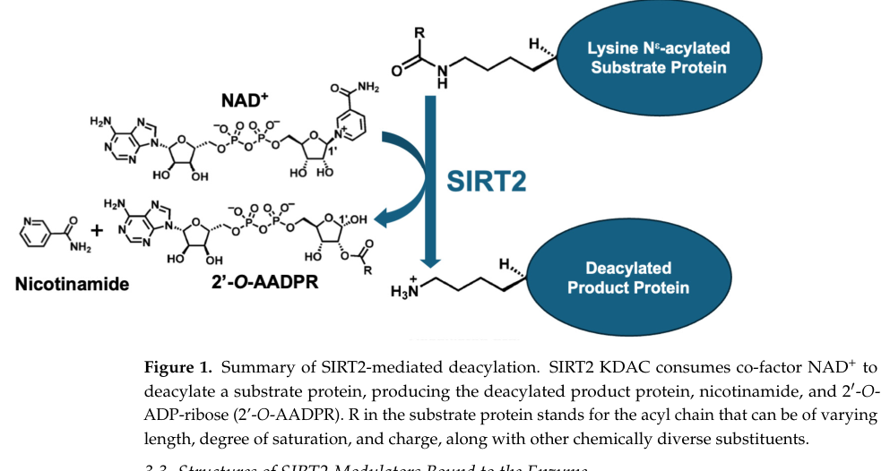

## Question

# Gene Research for Functional Annotation

## ⚠️ CRITICAL: Gene/Protein Identification Context

**BEFORE YOU BEGIN RESEARCH:** You MUST verify you are researching the CORRECT gene/protein. Gene symbols can be ambiguous, especially for less well-characterized genes from non-model organisms.

### Target Gene/Protein Identity (from UniProt):
- **UniProt Accession:** Q8VDQ8
- **Protein Description:** RecName: Full=NAD-dependent protein deacetylase sirtuin-2; EC=2.3.1.286 {ECO:0000255|PROSITE-ProRule:PRU00236, ECO:0000269|PubMed:17521387, ECO:0000269|PubMed:17574768, ECO:0000269|PubMed:17681146, ECO:0000269|PubMed:21841822, ECO:0000269|PubMed:34059674}; AltName: Full=NAD-dependent protein defatty-acylase sirtuin-2 {ECO:0000305}; EC=2.3.1.- {ECO:0000250|UniProtKB:Q8IXJ6}; AltName: Full=Regulatory protein SIR2 homolog 2; AltName: Full=SIR2-like protein 2; Short=mSIR2L2;
- **Gene Information:** Name=Sirt2; Synonyms=Sir2l2;
- **Organism (full):** Mus musculus (Mouse).
- **Protein Family:** Belongs to the sirtuin family. Class I subfamily.
- **Key Domains:** DHS-like_NAD/FAD-binding_dom. (IPR029035); NAD-dep_sirtuin_deacylases. (IPR050134); Sirtuin. (IPR003000); Sirtuin_cat_small_dom_sf. (IPR026591); Sirtuin_class_I. (IPR017328)

### MANDATORY VERIFICATION STEPS:

1. **Check if the gene symbol "Sirt2" matches the protein description above**
2. **Verify the organism is correct:** Mus musculus (Mouse).
3. **Check if protein family/domains align with what you find in literature**
4. **If you find literature for a DIFFERENT gene with the same or similar symbol, STOP**

### If Gene Symbol is Ambiguous or You Cannot Find Relevant Literature:

**DO NOT PROCEED WITH RESEARCH ON A DIFFERENT GENE.** Instead:
- State clearly: "The gene symbol 'Sirt2' is ambiguous or literature is limited for this specific protein"
- Explain what you found (e.g., "Found extensive literature on a different gene with the same symbol in a different organism")
- Describe the protein based ONLY on the UniProt information provided above
- Suggest that the protein function can be inferred from domain/family information

### Research Target:

Please provide a comprehensive research report on the gene **Sirt2** (gene ID: Sirt2, UniProt: Q8VDQ8) in mouse.

The research report should be a detailed narrative explaining the function, biological processes, and localization of the gene product. Citations should be given for all claims.

You should prioritize authoritative reviews and primary scientific literature when conducting research. You can supplement
this with annotations you find in gene/protein databases, but these can be outdated or inaccurate.

We are specifically interested in the primary function of the gene - for enzymes, what reaction is catalyzed, and what is the substrate specificity? For transporters, what is the substrate? For structural proteins or adapters, what is the broader structural role? For signaling molecules, what is the role in the pathway.

We are interested in where in or outside the cell the gene product carries out its function.

We are also interested in the signaling or biochemical pathways in which the gene functions. We are less interested in broad pleiotropic effects, except where these elucidate the precise role.

Include evidence where possible. We are interested in both experimental evidence as well as inference from structure, evolution, or bioinformatic analysis. Precise studies should be prioritized over high-throughput, where available.

## Output

Question: You are an expert researcher providing comprehensive, well-cited information.

Provide detailed information focusing on:
1. Key concepts and definitions with current understanding
2. Recent developments and latest research (prioritize 2023-2024 sources)
3. Current applications and real-world implementations
4. Expert opinions and analysis from authoritative sources
5. Relevant statistics and data from recent studies

Format as a comprehensive research report with proper citations. Include URLs and publication dates where available.
Always prioritize recent, authoritative sources and provide specific citations for all major claims.

# Gene Research for Functional Annotation

## ⚠️ CRITICAL: Gene/Protein Identification Context

**BEFORE YOU BEGIN RESEARCH:** You MUST verify you are researching the CORRECT gene/protein. Gene symbols can be ambiguous, especially for less well-characterized genes from non-model organisms.

### Target Gene/Protein Identity (from UniProt):
- **UniProt Accession:** Q8VDQ8
- **Protein Description:** RecName: Full=NAD-dependent protein deacetylase sirtuin-2; EC=2.3.1.286 {ECO:0000255|PROSITE-ProRule:PRU00236, ECO:0000269|PubMed:17521387, ECO:0000269|PubMed:17574768, ECO:0000269|PubMed:17681146, ECO:0000269|PubMed:21841822, ECO:0000269|PubMed:34059674}; AltName: Full=NAD-dependent protein defatty-acylase sirtuin-2 {ECO:0000305}; EC=2.3.1.- {ECO:0000250|UniProtKB:Q8IXJ6}; AltName: Full=Regulatory protein SIR2 homolog 2; AltName: Full=SIR2-like protein 2; Short=mSIR2L2;
- **Gene Information:** Name=Sirt2; Synonyms=Sir2l2;
- **Organism (full):** Mus musculus (Mouse).
- **Protein Family:** Belongs to the sirtuin family. Class I subfamily.
- **Key Domains:** DHS-like_NAD/FAD-binding_dom. (IPR029035); NAD-dep_sirtuin_deacylases. (IPR050134); Sirtuin. (IPR003000); Sirtuin_cat_small_dom_sf. (IPR026591); Sirtuin_class_I. (IPR017328)

### MANDATORY VERIFICATION STEPS:

1. **Check if the gene symbol "Sirt2" matches the protein description above**
2. **Verify the organism is correct:** Mus musculus (Mouse).
3. **Check if protein family/domains align with what you find in literature**
4. **If you find literature for a DIFFERENT gene with the same or similar symbol, STOP**

### If Gene Symbol is Ambiguous or You Cannot Find Relevant Literature:

**DO NOT PROCEED WITH RESEARCH ON A DIFFERENT GENE.** Instead:
- State clearly: "The gene symbol 'Sirt2' is ambiguous or literature is limited for this specific protein"
- Explain what you found (e.g., "Found extensive literature on a different gene with the same symbol in a different organism")
- Describe the protein based ONLY on the UniProt information provided above
- Suggest that the protein function can be inferred from domain/family information

### Research Target:

Please provide a comprehensive research report on the gene **Sirt2** (gene ID: Sirt2, UniProt: Q8VDQ8) in mouse.

The research report should be a detailed narrative explaining the function, biological processes, and localization of the gene product. Citations should be given for all claims.

You should prioritize authoritative reviews and primary scientific literature when conducting research. You can supplement
this with annotations you find in gene/protein databases, but these can be outdated or inaccurate.

We are specifically interested in the primary function of the gene - for enzymes, what reaction is catalyzed, and what is the substrate specificity? For transporters, what is the substrate? For structural proteins or adapters, what is the broader structural role? For signaling molecules, what is the role in the pathway.

We are interested in where in or outside the cell the gene product carries out its function.

We are also interested in the signaling or biochemical pathways in which the gene functions. We are less interested in broad pleiotropic effects, except where these elucidate the precise role.

Include evidence where possible. We are interested in both experimental evidence as well as inference from structure, evolution, or bioinformatic analysis. Precise studies should be prioritized over high-throughput, where available.

## Research report: Mouse **Sirt2** (UniProt Q8VDQ8) — functional annotation, mechanisms, pathways, and translational relevance

### 0) Identity verification (critical)
The target gene/protein is **Mus musculus Sirt2** (UniProt **Q8VDQ8**), a **class I sirtuin** that functions as an **NAD+-dependent lysine deacylase** (class III HDAC family) with prominent **cytosolic localization** and stimulus-dependent **nuclear shuttling**. This matches the UniProt description and is consistently supported by 2023–2024 literature describing SIRT2/Sirt2 as predominantly cytoplasmic, microtubule-associated (α-tubulin K40 substrate), and capable of removing diverse lysine acyl groups including long-chain fatty acyl (e.g., myristoyl) modifications. (lu2023sirt2playscomplex pages 1-2, bursch2024currenttrendsin pages 1-3, shenk2024drugstargetingsirtuin pages 4-6, schmidt2024sirt2regulatesliver pages 1-2)

### 1) Key concepts & definitions (current understanding)

#### 1.1 Sirtuins and “NAD+-dependent deacylation”
Sirtuins are **NAD+-dependent protein deacylases** that couple cellular redox/energy state (NAD+ availability) to removal of acyl modifications from lysine residues. For SIRT2, mechanistic descriptions include consumption of NAD+ and production of **nicotinamide** plus **2′-O-acyl-ADP-ribose**, along with the **deacylated protein** product. (shenk2024drugstargetingsirtuin pages 6-8)

A key structural concept for SIRT2 is the **extended C-pocket (EC pocket)**, which can accommodate long hydrophobic acyl chains and is also exploited by multiple **allosteric/selective modulators**. (shenk2024drugstargetingsirtuin pages 6-8, shenk2024drugstargetingsirtuin media 3995a2f2, shenk2024drugstargetingsirtuin media c59b53ce)

#### 1.2 Substrate scope: deacetylase vs “defatty-acylase/demyristoylase”
Modern understanding emphasizes that SIRT2 (and SIRT1–3 more broadly) can remove multiple lysine acyl modifications, and that **deacetylation and defatty-acylation can be pharmacologically separable activities**.

* Broad acyl scope is explicitly summarized in Shenk et al. 2024, including acetyl through long-chain acyl groups such as **myristoyl**, and multiple other acyl modifications tested biochemically. (shenk2024drugstargetingsirtuin pages 6-8, shenk2024drugstargetingsirtuin media 6c5a59f6)
* A 2024 assay/screening study explicitly treats SIRT2 as a “**promiscuous deacetylase and defatty-acylase**” and uses demyristoylation as a primary screening endpoint, reporting different inhibitor sensitivity for deacetylase vs demyristoylase activity. (yang2024ahomogeneoustimeresolved pages 1-2)

### 2) Molecular function and enzymology (what reaction is catalyzed; substrate specificity)

#### 2.1 Catalyzed reaction (biochemical mechanism)
SIRT2 catalyzes NAD+-dependent lysine deacylation with formation of characteristic reaction products (deacylated substrate, nicotinamide, and O-acyl-ADP-ribose). Mechanistic schematics and substrate-scope tables for SIRT2 deacylation are provided in Shenk et al. 2024 (Figure 1; Table 3). (shenk2024drugstargetingsirtuin pages 6-8, shenk2024drugstargetingsirtuin media 3995a2f2, shenk2024drugstargetingsirtuin media 6c5a59f6)

#### 2.2 Substrate specificity: canonical and expanded
**Canonical substrate:** α-tubulin K40 deacetylation.
* SIRT2 is explicitly described as deacetylating **tubulin at lysine 40** and co-localizing with microtubules primarily in the cytoplasm. (lu2023sirt2playscomplex pages 1-2)
* Mouse-focused liver work also cites Sirt2 as a **deacetylase of α-tubulin K40** (functional link to cytoskeleton remodeling). (schmidt2024sirt2regulatesliver pages 1-2)

**Expanded substrate landscape (examples in recent authoritative sources):**
* **Inflammation/innate immunity:** SIRT2 deacetylates **NF-κB** and **NLRP3**, positioning it at the interface of acetylation control and inflammasome/NF-κB signaling. (solasevilla2024sirt2asa pages 4-5)
* **Autophagy regulation:** SIRT2 binds and deacetylates **FOXO1**, with reported context dependence (basal vs oxidative stress) affecting autophagy induction. (solasevilla2024sirt2asa pages 4-5)
* **Biochemical peptide substrates/sites** reported in anti-infective review context include H3K9, H3K18, PDH-E2K259, PKM2K305 among others (used as assay substrates or cited biochemical targets). (shenk2024drugstargetingsirtuin pages 6-8)

### 3) Cellular localization and where Sirt2 acts

#### 3.1 Predominant cytosolic/microtubule association and nuclear shuttling
SIRT2 is repeatedly described as **predominantly cytoplasmic**, with ability to shuttle to the nucleus under specific conditions (e.g., stress, cell cycle states, infection, ischemic injury). (lu2023sirt2playscomplex pages 1-2, bursch2024currenttrendsin pages 1-3, shenk2024drugstargetingsirtuin pages 4-6)

Shenk et al. 2024 further details mouse isoforms and localization behavior: SIRT2.1/2.2 are **predominantly cytoplasmic but shuttle**, while an isoform lacking the nuclear export sequence can appear **exclusively nuclear**. (shenk2024drugstargetingsirtuin pages 4-6)

#### 3.2 “Mitochondrial effects without mitochondrial residence” (mouse liver)
A notable 2024 mouse study used biochemical fractionation and acetylome profiling to argue that Sirt2 can strongly impact mitochondrial protein acetylation/metabolism **even when Sirt2 antigen is not detected in purified mitochondria**.

* In wild-type mouse liver fractionation, Sirt2 isoforms were detected in nuclear/cytosolic fractions; purified mitochondria and peroxisomes lacked detectable Sirt2 antigen (N=3). (schmidt2024sirt2regulatesliver pages 7-9)
* Nevertheless, many of the “putative target” hyperacetylated sites in male Sirt2−/− liver mapped to mitochondria (44%). (schmidt2024sirt2regulatesliver pages 1-2, schmidt2024sirt2regulatesliver pages 5-7)

This supports an emerging annotation nuance: in some tissues Sirt2 may exert metabolic control **from outside the organelle** (e.g., cytosolic deacylation before import, signaling-mediated indirect effects, or regulation of carrier proteins). (schmidt2024sirt2regulatesliver pages 1-2, schmidt2024sirt2regulatesliver pages 7-9)

### 4) Pathways and biological processes (mouse-relevant, mechanistic emphasis)

#### 4.1 Cytoskeleton/microtubules
By deacetylating α-tubulin K40, Sirt2 influences microtubule acetylation state and microtubule-associated processes, a key functional “anchor” for annotation in many cell types. (lu2023sirt2playscomplex pages 1-2, schmidt2024sirt2regulatesliver pages 1-2)

#### 4.2 Inflammation, neuroinflammation, and inflammasome signaling
SIRT2 sits in regulatory circuits that include NF-κB/p65 and NLRP3, which provides mechanistic plausibility for diverse findings in neuroinflammation models (sometimes protective, sometimes deleterious depending on tissue/context). (solasevilla2024sirt2asa pages 4-5, lu2023sirt2playscomplex pages 1-2)

#### 4.3 Liver metabolism and gluconeogenesis (sex-specific in mouse)
Schmidt et al. 2024 provides direct mouse genetics evidence that whole-body Sirt2 impacts hepatic glucose metabolism and acetylome regulation in a **sex-specific** manner.

Key quantitative findings include:
* **13%** of detected acetylated peptides were significantly increased in **male** Sirt2−/− liver vs WT (and not in females), with target-site compartment distribution: mitochondria **44%**, cytosol **32%**, nucleus **8%**, other/peroxisome **~6%**. (schmidt2024sirt2regulatesliver pages 1-2, schmidt2024sirt2regulatesliver pages 5-7)
* Male Sirt2−/− mice showed reduced fat mass (N=11 KO vs N=8 WT; p<0.05) and reduced fat/lean ratio (p<0.001), plus **mild fasting hypoglycemia** (N=8; p<0.05). (schmidt2024sirt2regulatesliver pages 9-12)
* Male Sirt2−/− mice had impaired gluconeogenic responses to lactate, pyruvate, and glycerol challenges; e.g., pyruvate tolerance differences at 75 min (p<0.0005), 85 min (p<0.005), 100 min (p<0.05), and glycerol response reduced at 30/60/120 min (p<0.05). (schmidt2024sirt2regulatesliver pages 12-14)

Mechanistic links cited in that paper include Sirt2-mediated stabilization/deacetylation of **HNF4α** and **Pepck1/PEPCK1** in gluconeogenesis regulation. (schmidt2024sirt2regulatesliver pages 1-2)

### 5) Recent developments (prioritized 2023–2024) and latest research

#### 5.1 Pharmacology: allosteric SIRT2 inhibition and anti-infective translation
A 2023 JCI study (summarized and extended in a 2024 review) highlights an **allosteric SIRT2 inhibitor (FLS-359)** with broad antiviral activity and notable in vivo parameters.

From the 2024 anti-infective review:
* FLS-359 and related compounds are described as partial allosteric modulators occupying the EC/selectivity region while permitting NAD+ and peptide binding, yielding partial activity in deacetylation assays. (shenk2024drugstargetingsirtuin pages 8-9)
* FLS-359 and AGK2 selectively inhibit deacetylation while **not inhibiting demyristoylation** (activity selectivity by acyl type). (shenk2024drugstargetingsirtuin pages 8-9)
* Mouse PK/toxicity: single **50 mg/kg oral** dose in BALB/c mice: plasma half-life ~**6 h**, Cmax **89 μM**, AUC **713 μM·h/mL**; 14 days at **50 mg/kg b.i.d.** with no weight loss or overt clinical signs, and reduced virus production in humanized mouse HCMV models. (shenk2024drugstargetingsirtuin pages 8-9)

Structural and mechanistic visualization of the catalytic mechanism and EC-pocket inhibitor binding is available in Shenk et al. 2024 (Figure 1 and Figure 2). (shenk2024drugstargetingsirtuin media 3995a2f2, shenk2024drugstargetingsirtuin media c59b53ce)

#### 5.2 Drug discovery methods: dual-activity (deacetylase + defatty-acylase) screening
Yang et al. 2024 developed an HTRF assay to find inhibitors of SIRT2’s demyristoylase activity and reported a compound inhibiting both activities:
* deacetylase **IC50 = 7 μM**
* demyristoylase **IC50 = 37 μM** (yang2024ahomogeneoustimeresolved pages 1-2)

This supports a research trend: explicitly screening for **defatty-acylase** inhibition rather than assuming deacetylase inhibition covers the relevant enzymology. (yang2024ahomogeneoustimeresolved pages 1-2)

#### 5.3 Medicinal chemistry/structures: oxadiazole scaffold and crystal structure confirmation
Colcerasa et al. 2024 (J. Med. Chem.) reports:
* Sirt2 is an NAD+-dependent lysine deacylase with both deacetylase and defatty-acylase activity.
* A Kinetobox-derived hit inhibited SmSirt2 with **IC50 = 14.0 ± 2.0 μM**.
* Binding/kinetics indicated a **substrate-competitive and NAD+-noncompetitive** mode of inhibition, confirmed by a **crystal structure** of an oxadiazole inhibitor bound to hSirt2. (colcerasa2024structureactivitystudiesof pages 1-5)

#### 5.4 Neurodegeneration: central benefit vs peripheral risk (AD models)
Sola-Sevilla et al. 2023 provides primary mouse evidence in an AD model:
* The SIRT2 inhibitor **33i** improved cognition and reversed impaired hippocampal LTP in APP/PS1 mice, reduced neuroinflammation and amyloid pathology, and increased microglial Aβ engulfment. (solasevilla2023sirt2inhibitionrescues pages 12-13, solasevilla2023sirt2inhibitionrescues pages 1-2)
* However, treatment increased peripheral inflammatory cytokines including IL-1β, TNF, IL-6, and MCP-1; a BBB-impermeable inhibitor (AGK-2) worsened cognition and increased systemic inflammation. (solasevilla2023sirt2inhibitionrescues pages 12-13, solasevilla2023sirt2inhibitionrescues pages 1-2)

A 2024 AD-focused review synthesizes these findings and explicitly frames the field’s concern that **peripheral SIRT2 inhibition** may be undesirable even when **CNS inhibition** is beneficial. (solasevilla2024sirt2asa pages 5-5)

### 6) Current applications & real-world implementations

#### 6.1 Experimental and translational use cases
1. **Functional perturbation tool in vivo (mouse):** Whole-body Sirt2−/− mice and tissue phenotyping/acetylome profiling establish causal contributions to metabolism and protein acetylation in liver with strong sex effects. (schmidt2024sirt2regulatesliver pages 1-2, schmidt2024sirt2regulatesliver pages 5-7)
2. **Host-targeted anti-infectives:** SIRT2 modulators are positioned as host-targeted broad-spectrum anti-infective candidates, with FLS-359 demonstrating mouse PK feasibility and efficacy signals in humanized mouse infection models. (shenk2024drugstargetingsirtuin pages 8-9)
3. **Neurodegenerative disease pharmacology:** BBB-penetrant vs peripheral-limited inhibitors illustrate how subcellular/tissue targeting (CNS vs periphery) changes risk–benefit. (solasevilla2023sirt2inhibitionrescues pages 12-13, solasevilla2024sirt2asa pages 5-5)

#### 6.2 Practical experimental readouts
* **α-tubulin acetylation** is commonly used as a downstream readout of SIRT2 activity in cells and in some drug-development contexts because α-tubulin K40 is a well-supported substrate. (lu2023sirt2playscomplex pages 1-2)

### 7) Expert opinions and authoritative analysis (2023–2024)

#### 7.1 Context dependence as a central interpretive framework
Recent reviews emphasize that SIRT2 biology is **paradoxical/context-dependent**, particularly across CNS vs periphery and across disease models (e.g., neuroinflammation). (lu2023sirt2playscomplex pages 1-2, solasevilla2024sirt2asa pages 5-5)

#### 7.2 Activity-selective pharmacology (deacetylase vs demyristoylase)
Anti-infective and assay-development literature in 2024 explicitly underscores that many ligands affect SIRT2’s **deacetylase activity** without affecting its **defatty-acylase/demyristoylase activity**, motivating multi-assay validation and careful selection of chemical probes depending on biological question. (yang2024ahomogeneoustimeresolved pages 1-2, shenk2024drugstargetingsirtuin pages 8-9)

### 8) Key statistics/data highlights (recent studies)
* **Mouse liver acetylome:** 2452 acetylated peptides quantified; in male Sirt2−/− liver, mean acetylation increased ~8-fold (average log2FC=3), with **317 peptides / 306 sites (~13%)** significantly hyperacetylated (p<0.01, FC>1.5). (schmidt2024sirt2regulatesliver pages 5-7, schmidt2024sirt2regulatesliver pages 1-2)
* **Mouse liver phenotype statistics:** male Sirt2−/−: reduced fat mass (p<0.05), reduced fat/lean ratio (p<0.001), mild fasting hypoglycemia (p<0.05), impaired pyruvate tolerance at 75 min (p<0.0005), 85 min (p<0.005), 100 min (p<0.05), and impaired glycerol-driven glucose production (p<0.05). (schmidt2024sirt2regulatesliver pages 9-12, schmidt2024sirt2regulatesliver pages 12-14)
* **Dual-activity inhibition:** inhibitor example from 2024 HTRF screen: deacetylase IC50 **7 μM**; demyristoylase IC50 **37 μM**. (yang2024ahomogeneoustimeresolved pages 1-2)
* **Allosteric antiviral candidate PK:** FLS-359 (50 mg/kg p.o.): plasma t1/2 ~**6 h**, Cmax **89 μM**, AUC **713 μM·h/mL**; 14-day dosing 50 mg/kg b.i.d. without weight loss/clinical signs. (shenk2024drugstargetingsirtuin pages 8-9)

### 9) Visual evidence: catalytic mechanism, inhibitor binding, and substrate scope
The following figures/tables from Shenk et al. 2024 illustrate key mechanistic points:
* SIRT2 catalytic mechanism and reaction products (Figure 1). (shenk2024drugstargetingsirtuin media 3995a2f2)
* Binding of selective/allosteric modulators in the EC/selectivity pocket (Figure 2). (shenk2024drugstargetingsirtuin media c59b53ce)
* A summary of SIRT2 acyl-substrate scope (Table 3). (shenk2024drugstargetingsirtuin media 6c5a59f6)

### 10) Structured summary table
| Function / biochemical activity | Reaction / substrate scope | Key substrates / pathways | Subcellular localization / contexts | Key mouse in vivo evidence / phenotypes (quantitative) | Recent 2023–2024 developments / applications | Key citations (year; DOI / URL) |
|---|---|---|---|---|---|---|
| NAD+-dependent lysine deacetylase / deacylase; core sirtuin-family enzyme | Consumes NAD+ to remove lysine acyl groups, yielding deacylated protein, nicotinamide, and 2′-O-acyl-ADP-ribose; reported acyl scope includes acetyl, propionyl, butyryl, hexanoyl, octanoyl, decanoyl, dodecanoyl, myristoyl, crotonyl, methacryl, lipoyl, benzoyl, lactoyl, and 4-oxononanoyl groups; extended C pocket accommodates long acyl chains (shenk2024drugstargetingsirtuin pages 6-8, yang2024ahomogeneoustimeresolved pages 1-2) | α-tubulin K40 deacetylation is a canonical substrate/function; additional biochemical substrate examples include H3K9/H3K18, PDH-E2 K259, PKM2 K305; inflammatory and signaling targets reported include p65/NF-κB, NLRP3, FOXO1, p38, p53, FOXO3a, NFATc4 (lu2023sirt2playscomplex pages 1-2, shenk2024drugstargetingsirtuin pages 6-8, solasevilla2024sirt2asa pages 4-5) | Mainly cytosolic; colocalizes with microtubules; shuttles nucleus↔cytosol depending on stimulus; mouse isoforms SIRT2.1/2.2 predominantly cytoplasmic but can accumulate in nucleus; ischemia and infection can increase nuclear localization (lu2023sirt2playscomplex pages 1-2, bursch2024currenttrendsin pages 1-3, shenk2024drugstargetingsirtuin pages 4-6) | In mouse liver, male Sirt2−/− mice showed reduced adipose tissue (N=11 KO vs N=8 WT; p<0.05), reduced fat/lean ratio (p<0.001), fasting hypoglycemia (N=8; p<0.05), lower hepatic triglycerides, impaired lactate/pyruvate/glycerol-driven gluconeogenesis, and reduced OCR/FAO in hepatocytes; pyruvate test differences at 75 min p<0.0005, 85 min p<0.005, 100 min p<0.05; glycerol test reduced at 30/60/120 min p<0.05 (schmidt2024sirt2regulatesliver pages 9-12, schmidt2024sirt2regulatesliver pages 12-14) | 2024 inhibitor-screen paper emphasized separable deacetylase vs demyristoylase pharmacology; exemplar compound inhibited deacetylase with IC50 7 μM and demyristoylase with IC50 37 μM, supporting dual-activity targeting (yang2024ahomogeneoustimeresolved pages 1-2) | Schmidt et al. 2024, doi:10.3390/biom14091160, https://doi.org/10.3390/biom14091160; Lu et al. 2023, doi:10.3389/fimmu.2023.1174180, https://doi.org/10.3389/fimmu.2023.1174180; Yang et al. 2024, doi:10.1371/journal.pone.0305000, https://doi.org/10.1371/journal.pone.0305000; Shenk et al. 2024, doi:10.3390/ph17101298, https://doi.org/10.3390/ph17101298 |
| Microtubule / cytoskeleton regulator via tubulin deacetylation | Deacetylates α-tubulin at Lys40, linking SIRT2 to microtubule acetylation state, stabilization, and remodeling (schmidt2024sirt2regulatesliver pages 1-2, lu2023sirt2playscomplex pages 1-2) | α-tubulin K40; microtubule dynamics; cytoskeletal remodeling (schmidt2024sirt2regulatesliver pages 1-2, lu2023sirt2playscomplex pages 1-2) | Cytoplasm / microtubules; stimulus-dependent nuclear shuttling but dominant cytosolic function under basal conditions (lu2023sirt2playscomplex pages 1-2, bursch2024currenttrendsin pages 1-3) | Mouse-relevant liver fractionation detected major Sirt2 isoforms in nuclear and cytosolic fractions but not in purified mitochondria or peroxisomes (N=3), supporting extra-mitochondrial control of many downstream effects (schmidt2024sirt2regulatesliver pages 7-9) | SIRT2 degraders and inhibitors use α-tubulin acetylation as a downstream cellular readout; 2023 PROTAC review notes SIRT2 degradation in MCF7 cells at 0.5 μM for 48 h with increased α-tubulin acetylation (schmidt2024sirt2regulatesliver pages 7-9) | Schmidt et al. 2024, doi:10.3390/biom14091160, https://doi.org/10.3390/biom14091160; Zhang et al. 2023, doi:10.15212/amm-2023-0039, https://doi.org/10.15212/amm-2023-0039 |
| Metabolic regulator in liver / gluconeogenesis / acetylome control | Deacetylates metabolic regulators; literature cited in mouse liver study links SIRT2 to stabilization of HNF4α and Pepck1/PEPCK1 deacetylation; acetylome data indicate strong sex-specific hepatic targeting (schmidt2024sirt2regulatesliver pages 1-2) | HNF4α, Pepck1/PEPCK1, Ldha and many hepatic acetyl-sites; pathways: gluconeogenesis, glycolysis-linked lactate utilization, mitochondrial respiration, fatty-acid oxidation (schmidt2024sirt2regulatesliver pages 1-2, schmidt2024sirt2regulatesliver pages 9-12, schmidt2024sirt2regulatesliver pages 12-14) | Nuclear + cytosolic presence; despite many mitochondrial target-site changes, Sirt2 antigen was not detected in purified WT liver mitochondria, implying indirect or pre-import regulation of mitochondrial proteins (schmidt2024sirt2regulatesliver pages 1-2, schmidt2024sirt2regulatesliver pages 7-9) | 2452 acetylated peptides quantified; in male Sirt2−/− liver mean acetylation increased ~8-fold (average log2FC=3), with 317 peptides / 306 sites (~13%) significantly hyperacetylated (p<0.01, FC>1.5); target-site distribution: mitochondria 44%, cytosol 32%, nucleus 8%, peroxisomes 6%; females showed little change (schmidt2024sirt2regulatesliver pages 5-7, schmidt2024sirt2regulatesliver pages 1-2) | 2024 mouse study reframed Sirt2 as a sex-specific hepatic acetylome regulator, highlighting strong male-selective metabolic phenotypes and many putative targets outside the nucleus; useful for functional annotation because it directly interrogated the mouse gene product in vivo (schmidt2024sirt2regulatesliver pages 1-2, schmidt2024sirt2regulatesliver pages 5-7) | Schmidt et al. 2024, doi:10.3390/biom14091160, https://doi.org/10.3390/biom14091160 |
| Context-dependent regulator of inflammation / autophagy / neurodegeneration | Deacetylates p65/NF-κB and NLRP3; binds/deacetylates FOXO1; effects can be anti- or pro-inflammatory depending on CNS vs peripheral context and model (solasevilla2024sirt2asa pages 4-5) | NF-κB/p65, NLRP3 inflammasome, FOXO1-autophagy axis; pathways include neuroinflammation, autophagic-lysosomal function, oxidative stress, microglial Aβ engulfment (solasevilla2024sirt2asa pages 4-5, solasevilla2023sirt2inhibitionrescues pages 12-13) | Brain-enriched expression reported, especially in oligodendrocytes / myelin-rich regions; can translocate into neuronal nuclei in injury contexts (lu2023sirt2playscomplex pages 1-2, solasevilla2024sirt2asa pages 4-5) | In APP/PS1 AD mice, SIRT2 inhibitor 33i improved cognition and LTP, reduced amyloid pathology and hippocampal neuroinflammation, and increased microglial Aβ engulfment; however it increased peripheral IL-1β, TNF, IL-6, and MCP-1. BBB-impermeable AGK-2 worsened cognition and systemic inflammation. In prior aging work cited, 2-year-old Sirt2−/− mice had impaired GTT and increased peripheral inflammation (solasevilla2023sirt2inhibitionrescues pages 12-13, solasevilla2023sirt2inhibitionrescues pages 1-2) | AD-targeting perspective sharpened in 2023–2024: central SIRT2 inhibition can be neuroprotective, but peripheral inhibition may be harmful; 33i was reported non-mutagenic/non-genotoxic in Ames and comet assays, supporting preclinical tractability (solasevilla2023sirt2inhibitionrescues pages 12-13, solasevilla2023sirt2inhibitionrescues pages 1-2, solasevilla2024sirt2asa pages 5-5) | Sola-Sevilla et al. 2023, doi:10.1007/s11481-023-10084-9, https://doi.org/10.1007/s11481-023-10084-9; Sola-Sevilla & Puerta 2024, doi:10.4103/1673-5374.375315, https://doi.org/10.4103/1673-5374.375315 |
| Druggable deacylase with separable deacetylase vs defatty-acylase pharmacology | Allosteric / substrate-competitive modulators can preferentially inhibit deacetylation while sparing demyristoylation; EC/selectivity pocket is central to selectivity (shenk2024drugstargetingsirtuin pages 8-9, colcerasa2024structureactivitystudiesof pages 1-5) | Long-chain acyl recognition via EC pocket; inhibitor classes include SirReal-derived ligands, FLS-359, AGK2, oxadiazoles; 1,2,4-oxadiazoles described as substrate-competitive and NAD+-noncompetitive (shenk2024drugstargetingsirtuin pages 8-9, colcerasa2024structureactivitystudiesof pages 1-5) | Structural studies focus on catalytic core plus induced selectivity pocket; useful for isoform-selective pharmacology (shenk2024drugstargetingsirtuin pages 6-8, colcerasa2024structureactivitystudiesof pages 1-5) | Not a mouse phenotype row per se, but mouse pharmacology exists: FLS-359 showed favorable mouse PK in BALB/c mice and no overt toxicity over 14 days at 50 mg/kg b.i.d. (shenk2024drugstargetingsirtuin pages 8-9) | 2023 JCI: FLS-359 showed broad antiviral activity and in BALB/c mice had plasma t1/2 ~6 h, Cmax 89 μM, AUC 713 μM·h/mL after 50 mg/kg p.o.; 14-day dosing at 50 mg/kg b.i.d. caused no weight loss/clinical signs and reduced virus production in humanized mouse HCMV models. 2024 JMC: oxadiazole scaffold optimized from Kinetobox; initial hit inhibited SmSirt2 at IC50 14.0 ± 2.0 μM; crystal structure confirmed binding mode. 2024 assay paper enabled parallel discovery of deacetylase- and defatty-acylase-directed inhibitors (shenk2024drugstargetingsirtuin pages 8-9, colcerasa2024structureactivitystudiesof pages 1-5, yang2024ahomogeneoustimeresolved pages 1-2) | Roche et al. 2023, doi:10.1172/JCI158978, https://doi.org/10.1172/JCI158978; Colcerasa et al. 2024, doi:10.1021/acs.jmedchem.4c00229, https://doi.org/10.1021/acs.jmedchem.4c00229; Yang et al. 2024, doi:10.1371/journal.pone.0305000, https://doi.org/10.1371/journal.pone.0305000 |
| Evidence support for functional annotation confidence | Multiple independent 2023–2024 sources converge on same identity: NAD+-dependent lysine deacylase, tubulin K40 deacetylase, cytosol-dominant enzyme with nuclear shuttling, broad acyl chemistry, and context-dependent disease relevance (schmidt2024sirt2regulatesliver pages 1-2, lu2023sirt2playscomplex pages 1-2, bursch2024currenttrendsin pages 1-3, shenk2024drugstargetingsirtuin pages 6-8) | UniProt-consistent annotation is supported by mouse-specific genetics and modern structural/pharmacology literature (schmidt2024sirt2regulatesliver pages 1-2, colcerasa2024structureactivitystudiesof pages 1-5) | Cytosol, nucleus, microtubules; oligodendrocyte/myelin enrichment in CNS contexts; no convincing liver mitochondrial residence despite many mitochondrial acetylation changes (lu2023sirt2playscomplex pages 1-2, schmidt2024sirt2regulatesliver pages 7-9) | Strongest direct mouse evidence in this run comes from whole-body Sirt2−/− liver phenotyping and APP/PS1 pharmacology; both show that Sirt2 function is highly context- and tissue-dependent (schmidt2024sirt2regulatesliver pages 9-12, solasevilla2023sirt2inhibitionrescues pages 12-13) | Research frontier in 2023–2024 centers on separating central vs peripheral effects, and deacetylase vs defatty-acylase targeting, rather than treating SIRT2 as a single uniform activity (shenk2024drugstargetingsirtuin pages 8-9, solasevilla2023sirt2inhibitionrescues pages 12-13, colcerasa2024structureactivitystudiesof pages 1-5) | Bursch et al. 2024, doi:10.3390/molecules29051185, https://doi.org/10.3390/molecules29051185; Schmidt et al. 2024, doi:10.3390/biom14091160, https://doi.org/10.3390/biom14091160; Shenk et al. 2024, doi:10.3390/ph17101298, https://doi.org/10.3390/ph17101298 |

*Table: This table condenses the strongest evidence gathered for mouse Sirt2 (UniProt Q8VDQ8), covering its enzymatic activities, substrates, localization, mouse phenotypes, and 2023–2024 translational developments. It is designed as a citation-ready functional annotation aid anchored only to evidence retrieved in this run.*

### 11) Selected bibliography (with URLs and publication months/years)
* Schmidt AV et al. **Sirt2 Regulates Liver Metabolism in a Sex-Specific Manner**. *Biomolecules*. Sep 2024. https://doi.org/10.3390/biom14091160 (schmidt2024sirt2regulatesliver pages 1-2)
* Shenk T et al. **Drugs Targeting Sirtuin 2 Exhibit Broad-Spectrum Anti-Infective Activity**. *Pharmaceuticals*. Sep 2024. https://doi.org/10.3390/ph17101298 (shenk2024drugstargetingsirtuin pages 6-8)
* Yang J et al. **A homogeneous time-resolved fluorescence screen to identify SIRT2 deacetylase and defatty-acylase inhibitors**. *PLOS ONE*. Jun 2024. https://doi.org/10.1371/journal.pone.0305000 (yang2024ahomogeneoustimeresolved pages 1-2)
* Colcerasa A et al. **Structure-Activity Studies of 1,2,4-Oxadiazoles for the Inhibition of the NAD+-Dependent Lysine Deacylase Sirtuin 2**. *J Med Chem*. Jun 2024. https://doi.org/10.1021/acs.jmedchem.4c00229 (colcerasa2024structureactivitystudiesof pages 1-5)
* Sola-Sevilla N et al. **SIRT2 Inhibition Rescues Neurodegenerative Pathology but Increases Systemic Inflammation in a Transgenic Mouse Model of Alzheimer’s Disease**. *J Neuroimmune Pharmacol*. Sep 2023. https://doi.org/10.1007/s11481-023-10084-9 (solasevilla2023sirt2inhibitionrescues pages 1-2)
* Lu W et al. **SIRT2 plays complex roles in neuroinflammation neuroimmunology-associated disorders**. *Front Immunol*. May 2023. https://doi.org/10.3389/fimmu.2023.1174180 (lu2023sirt2playscomplex pages 1-2)
* Bursch KL et al. **Current Trends in Sirtuin Activator and Inhibitor Development**. *Molecules*. Mar 2024. https://doi.org/10.3390/molecules29051185 (bursch2024currenttrendsin pages 1-3)
* Sola-Sevilla N & Puerta E. **SIRT2 as a potential new therapeutic target for Alzheimer’s disease**. *Neural Regeneration Research*. Jan 2024. https://doi.org/10.4103/1673-5374.375315 (solasevilla2024sirt2asa pages 5-5)

### 12) Limitations of this synthesis
This report is constrained to full-text evidence retrieved in this tool run. Some widely discussed SIRT2 substrates and phenotypes may exist in the broader literature but are not asserted here unless supported by the cited evidence above.

References

1. (lu2023sirt2playscomplex pages 1-2): Wenmei Lu, Haonan Ji, and Danhong Wu. Sirt2 plays complex roles in neuroinflammation neuroimmunology-associated disorders. Frontiers in Immunology, May 2023. URL: https://doi.org/10.3389/fimmu.2023.1174180, doi:10.3389/fimmu.2023.1174180. This article has 24 citations and is from a peer-reviewed journal.

2. (bursch2024currenttrendsin pages 1-3): Karina L. Bursch, Christopher J. Goetz, and Brian C. Smith. Current trends in sirtuin activator and inhibitor development. Molecules, 29:1185, Mar 2024. URL: https://doi.org/10.3390/molecules29051185, doi:10.3390/molecules29051185. This article has 46 citations.

3. (shenk2024drugstargetingsirtuin pages 4-6): Thomas Shenk, John L. Kulp III, and Lillian W. Chiang. Drugs targeting sirtuin 2 exhibit broad-spectrum anti-infective activity. Pharmaceuticals, 17:1298, Sep 2024. URL: https://doi.org/10.3390/ph17101298, doi:10.3390/ph17101298. This article has 4 citations.

4. (schmidt2024sirt2regulatesliver pages 1-2): Alexandra V. Schmidt, Sivakama S. Bharathi, Keaton J. Solo, Joanna Bons, Jacob P. Rose, Birgit Schilling, and Eric S. Goetzman. Sirt2 regulates liver metabolism in a sex-specific manner. Sep 2024. URL: https://doi.org/10.3390/biom14091160, doi:10.3390/biom14091160. This article has 8 citations.

5. (shenk2024drugstargetingsirtuin pages 6-8): Thomas Shenk, John L. Kulp III, and Lillian W. Chiang. Drugs targeting sirtuin 2 exhibit broad-spectrum anti-infective activity. Pharmaceuticals, 17:1298, Sep 2024. URL: https://doi.org/10.3390/ph17101298, doi:10.3390/ph17101298. This article has 4 citations.

6. (shenk2024drugstargetingsirtuin media 3995a2f2): Thomas Shenk, John L. Kulp III, and Lillian W. Chiang. Drugs targeting sirtuin 2 exhibit broad-spectrum anti-infective activity. Pharmaceuticals, 17:1298, Sep 2024. URL: https://doi.org/10.3390/ph17101298, doi:10.3390/ph17101298. This article has 4 citations.

7. (shenk2024drugstargetingsirtuin media c59b53ce): Thomas Shenk, John L. Kulp III, and Lillian W. Chiang. Drugs targeting sirtuin 2 exhibit broad-spectrum anti-infective activity. Pharmaceuticals, 17:1298, Sep 2024. URL: https://doi.org/10.3390/ph17101298, doi:10.3390/ph17101298. This article has 4 citations.

8. (shenk2024drugstargetingsirtuin media 6c5a59f6): Thomas Shenk, John L. Kulp III, and Lillian W. Chiang. Drugs targeting sirtuin 2 exhibit broad-spectrum anti-infective activity. Pharmaceuticals, 17:1298, Sep 2024. URL: https://doi.org/10.3390/ph17101298, doi:10.3390/ph17101298. This article has 4 citations.

9. (yang2024ahomogeneoustimeresolved pages 1-2): Jie Yang, Joel Cassel, Brian C. Boyle, Daniel Oppong, Young-Hoon Ahn, and Brian P. Weiser. A homogeneous time-resolved fluorescence screen to identify sirt2 deacetylase and defatty-acylase inhibitors. PLOS ONE, 19:e0305000, Jun 2024. URL: https://doi.org/10.1371/journal.pone.0305000, doi:10.1371/journal.pone.0305000. This article has 0 citations and is from a peer-reviewed journal.

10. (solasevilla2024sirt2asa pages 4-5): Noemi Sola-Sevilla and Elena Puerta. Sirt2 as a potential new therapeutic target for alzheimer’s disease. Neural Regeneration Research, 19(1):124-131, Jan 2024. URL: https://doi.org/10.4103/1673-5374.375315, doi:10.4103/1673-5374.375315. This article has 34 citations and is from a peer-reviewed journal.

11. (schmidt2024sirt2regulatesliver pages 7-9): Alexandra V. Schmidt, Sivakama S. Bharathi, Keaton J. Solo, Joanna Bons, Jacob P. Rose, Birgit Schilling, and Eric S. Goetzman. Sirt2 regulates liver metabolism in a sex-specific manner. Sep 2024. URL: https://doi.org/10.3390/biom14091160, doi:10.3390/biom14091160. This article has 8 citations.

12. (schmidt2024sirt2regulatesliver pages 5-7): Alexandra V. Schmidt, Sivakama S. Bharathi, Keaton J. Solo, Joanna Bons, Jacob P. Rose, Birgit Schilling, and Eric S. Goetzman. Sirt2 regulates liver metabolism in a sex-specific manner. Sep 2024. URL: https://doi.org/10.3390/biom14091160, doi:10.3390/biom14091160. This article has 8 citations.

13. (schmidt2024sirt2regulatesliver pages 9-12): Alexandra V. Schmidt, Sivakama S. Bharathi, Keaton J. Solo, Joanna Bons, Jacob P. Rose, Birgit Schilling, and Eric S. Goetzman. Sirt2 regulates liver metabolism in a sex-specific manner. Sep 2024. URL: https://doi.org/10.3390/biom14091160, doi:10.3390/biom14091160. This article has 8 citations.

14. (schmidt2024sirt2regulatesliver pages 12-14): Alexandra V. Schmidt, Sivakama S. Bharathi, Keaton J. Solo, Joanna Bons, Jacob P. Rose, Birgit Schilling, and Eric S. Goetzman. Sirt2 regulates liver metabolism in a sex-specific manner. Sep 2024. URL: https://doi.org/10.3390/biom14091160, doi:10.3390/biom14091160. This article has 8 citations.

15. (shenk2024drugstargetingsirtuin pages 8-9): Thomas Shenk, John L. Kulp III, and Lillian W. Chiang. Drugs targeting sirtuin 2 exhibit broad-spectrum anti-infective activity. Pharmaceuticals, 17:1298, Sep 2024. URL: https://doi.org/10.3390/ph17101298, doi:10.3390/ph17101298. This article has 4 citations.

16. (colcerasa2024structureactivitystudiesof pages 1-5): Arianna Colcerasa, Florian Friedrich, Jelena Melesina, Patrick Moser, Anja Vogelmann, Pavlos Tzortzoglou, Emilia Neuwirt, Manuela Sum, Dina Robaa, Lin Zhang, Elizabeth Ramos-Morales, Christophe Romier, Oliver Einsle, Eric Metzger, Roland Schüle, Olaf Groß, Wolfgang Sippl, and Manfred Jung. Structure-activity studies of 1,2,4-oxadiazoles for the inhibition of the nad+-dependent lysine deacylase sirtuin 2. Journal of medicinal chemistry, 67:10076-10095, Jun 2024. URL: https://doi.org/10.1021/acs.jmedchem.4c00229, doi:10.1021/acs.jmedchem.4c00229. This article has 14 citations and is from a highest quality peer-reviewed journal.

17. (solasevilla2023sirt2inhibitionrescues pages 12-13): Noemi Sola-Sevilla, Alberto Mesa-Lombardo, Mikel Aleixo, Sara Expósito, Teresa Diaz-Perdigón, Amaya Azqueta, Farzad Zamani, Takayoshi Suzuki, Silvia Maioli, Francesca Eroli, Anna Matton, Maria J. Ramírez, Maite Solas, Rosa M. Tordera, Eduardo D. Martín, and Elena Puerta. Sirt2 inhibition rescues neurodegenerative pathology but increases systemic inflammation in a transgenic mouse model of alzheimer’s disease. Journal of Neuroimmune Pharmacology, 18:529-550, Sep 2023. URL: https://doi.org/10.1007/s11481-023-10084-9, doi:10.1007/s11481-023-10084-9. This article has 18 citations and is from a peer-reviewed journal.

18. (solasevilla2023sirt2inhibitionrescues pages 1-2): Noemi Sola-Sevilla, Alberto Mesa-Lombardo, Mikel Aleixo, Sara Expósito, Teresa Diaz-Perdigón, Amaya Azqueta, Farzad Zamani, Takayoshi Suzuki, Silvia Maioli, Francesca Eroli, Anna Matton, Maria J. Ramírez, Maite Solas, Rosa M. Tordera, Eduardo D. Martín, and Elena Puerta. Sirt2 inhibition rescues neurodegenerative pathology but increases systemic inflammation in a transgenic mouse model of alzheimer’s disease. Journal of Neuroimmune Pharmacology, 18:529-550, Sep 2023. URL: https://doi.org/10.1007/s11481-023-10084-9, doi:10.1007/s11481-023-10084-9. This article has 18 citations and is from a peer-reviewed journal.

19. (solasevilla2024sirt2asa pages 5-5): Noemi Sola-Sevilla and Elena Puerta. Sirt2 as a potential new therapeutic target for alzheimer’s disease. Neural Regeneration Research, 19(1):124-131, Jan 2024. URL: https://doi.org/10.4103/1673-5374.375315, doi:10.4103/1673-5374.375315. This article has 34 citations and is from a peer-reviewed journal.

## Artifacts

- [Edison artifact artifact-00](Sirt2-deep-research-falcon_artifacts/artifact-00.md)

## Citations

1. shenk2024drugstargetingsirtuin pages 6-8
2. yang2024ahomogeneoustimeresolved pages 1-2
3. shenk2024drugstargetingsirtuin pages 4-6
4. shenk2024drugstargetingsirtuin pages 8-9
5. colcerasa2024structureactivitystudiesof pages 1-5
6. bursch2024currenttrendsin pages 1-3
7. https://doi.org/10.3390/biom14091160;
8. https://doi.org/10.3389/fimmu.2023.1174180;
9. https://doi.org/10.1371/journal.pone.0305000;
10. https://doi.org/10.3390/ph17101298
11. https://doi.org/10.15212/amm-2023-0039
12. https://doi.org/10.3390/biom14091160
13. https://doi.org/10.1007/s11481-023-10084-9;
14. https://doi.org/10.4103/1673-5374.375315
15. https://doi.org/10.1172/JCI158978;
16. https://doi.org/10.1021/acs.jmedchem.4c00229;
17. https://doi.org/10.1371/journal.pone.0305000
18. https://doi.org/10.3390/molecules29051185;
19. https://doi.org/10.1021/acs.jmedchem.4c00229
20. https://doi.org/10.1007/s11481-023-10084-9
21. https://doi.org/10.3389/fimmu.2023.1174180
22. https://doi.org/10.3390/molecules29051185
23. https://doi.org/10.3389/fimmu.2023.1174180,
24. https://doi.org/10.3390/molecules29051185,
25. https://doi.org/10.3390/ph17101298,
26. https://doi.org/10.3390/biom14091160,
27. https://doi.org/10.1371/journal.pone.0305000,
28. https://doi.org/10.4103/1673-5374.375315,
29. https://doi.org/10.1021/acs.jmedchem.4c00229,
30. https://doi.org/10.1007/s11481-023-10084-9,