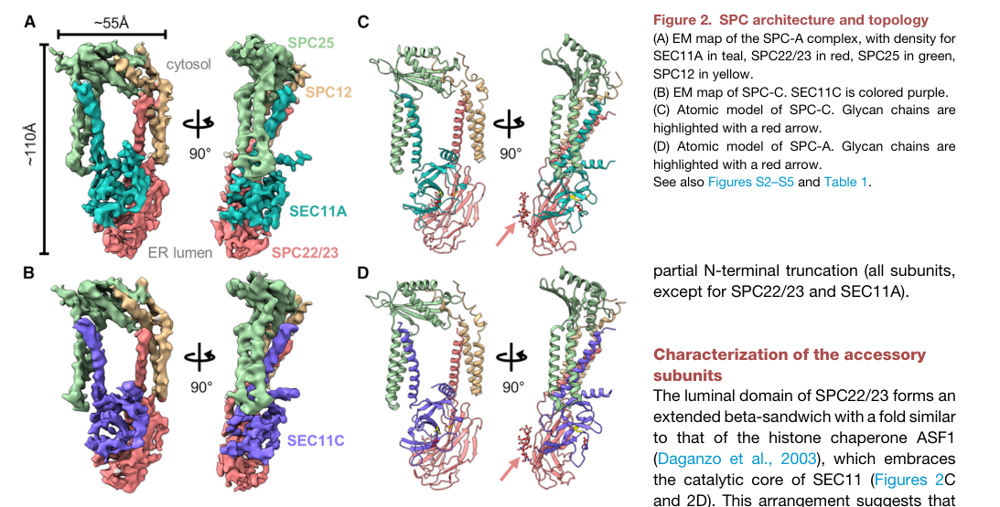

## Question

# Gene Research for Functional Annotation

## ⚠️ CRITICAL: Gene/Protein Identification Context

**BEFORE YOU BEGIN RESEARCH:** You MUST verify you are researching the CORRECT gene/protein. Gene symbols can be ambiguous, especially for less well-characterized genes from non-model organisms.

### Target Gene/Protein Identity (from UniProt):
- **UniProt Accession:** A0A140LHW5
- **Protein Description:** SubName: Full=Signal peptidase complex subunit 2 homolog (S. cerevisiae) {ECO:0000313|Ensembl:ENSMUSP00000146574.2};
- **Gene Information:** Name=Spcs2 {ECO:0000313|Ensembl:ENSMUSP00000146574.2, ECO:0000313|MGI:MGI:1913874};
- **Organism (full):** Mus musculus (Mouse).
- **Protein Family:** Not specified in UniProt
- **Key Domains:** Not specified in UniProt

### MANDATORY VERIFICATION STEPS:

1. **Check if the gene symbol "Spcs2" matches the protein description above**
2. **Verify the organism is correct:** Mus musculus (Mouse).
3. **Check if protein family/domains align with what you find in literature**
4. **If you find literature for a DIFFERENT gene with the same or similar symbol, STOP**

### If Gene Symbol is Ambiguous or You Cannot Find Relevant Literature:

**DO NOT PROCEED WITH RESEARCH ON A DIFFERENT GENE.** Instead:
- State clearly: "The gene symbol 'Spcs2' is ambiguous or literature is limited for this specific protein"
- Explain what you found (e.g., "Found extensive literature on a different gene with the same symbol in a different organism")
- Describe the protein based ONLY on the UniProt information provided above
- Suggest that the protein function can be inferred from domain/family information

### Research Target:

Please provide a comprehensive research report on the gene **Spcs2** (gene ID: Spcs2, UniProt: A0A140LHW5) in mouse.

The research report should be a detailed narrative explaining the function, biological processes, and localization of the gene product. Citations should be given for all claims.

You should prioritize authoritative reviews and primary scientific literature when conducting research. You can supplement
this with annotations you find in gene/protein databases, but these can be outdated or inaccurate.

We are specifically interested in the primary function of the gene - for enzymes, what reaction is catalyzed, and what is the substrate specificity? For transporters, what is the substrate? For structural proteins or adapters, what is the broader structural role? For signaling molecules, what is the role in the pathway.

We are interested in where in or outside the cell the gene product carries out its function.

We are also interested in the signaling or biochemical pathways in which the gene functions. We are less interested in broad pleiotropic effects, except where these elucidate the precise role.

Include evidence where possible. We are interested in both experimental evidence as well as inference from structure, evolution, or bioinformatic analysis. Precise studies should be prioritized over high-throughput, where available.

## Output

Question: You are an expert researcher providing comprehensive, well-cited information.

Provide detailed information focusing on:
1. Key concepts and definitions with current understanding
2. Recent developments and latest research (prioritize 2023-2024 sources)
3. Current applications and real-world implementations
4. Expert opinions and analysis from authoritative sources
5. Relevant statistics and data from recent studies

Format as a comprehensive research report with proper citations. Include URLs and publication dates where available.
Always prioritize recent, authoritative sources and provide specific citations for all major claims.

# Gene Research for Functional Annotation

## ⚠️ CRITICAL: Gene/Protein Identification Context

**BEFORE YOU BEGIN RESEARCH:** You MUST verify you are researching the CORRECT gene/protein. Gene symbols can be ambiguous, especially for less well-characterized genes from non-model organisms.

### Target Gene/Protein Identity (from UniProt):
- **UniProt Accession:** A0A140LHW5
- **Protein Description:** SubName: Full=Signal peptidase complex subunit 2 homolog (S. cerevisiae) {ECO:0000313|Ensembl:ENSMUSP00000146574.2};
- **Gene Information:** Name=Spcs2 {ECO:0000313|Ensembl:ENSMUSP00000146574.2, ECO:0000313|MGI:MGI:1913874};
- **Organism (full):** Mus musculus (Mouse).
- **Protein Family:** Not specified in UniProt
- **Key Domains:** Not specified in UniProt

### MANDATORY VERIFICATION STEPS:

1. **Check if the gene symbol "Spcs2" matches the protein description above**
2. **Verify the organism is correct:** Mus musculus (Mouse).
3. **Check if protein family/domains align with what you find in literature**
4. **If you find literature for a DIFFERENT gene with the same or similar symbol, STOP**

### If Gene Symbol is Ambiguous or You Cannot Find Relevant Literature:

**DO NOT PROCEED WITH RESEARCH ON A DIFFERENT GENE.** Instead:
- State clearly: "The gene symbol 'Spcs2' is ambiguous or literature is limited for this specific protein"
- Explain what you found (e.g., "Found extensive literature on a different gene with the same symbol in a different organism")
- Describe the protein based ONLY on the UniProt information provided above
- Suggest that the protein function can be inferred from domain/family information

### Research Target:

Please provide a comprehensive research report on the gene **Spcs2** (gene ID: Spcs2, UniProt: A0A140LHW5) in mouse.

The research report should be a detailed narrative explaining the function, biological processes, and localization of the gene product. Citations should be given for all claims.

You should prioritize authoritative reviews and primary scientific literature when conducting research. You can supplement
this with annotations you find in gene/protein databases, but these can be outdated or inaccurate.

We are specifically interested in the primary function of the gene - for enzymes, what reaction is catalyzed, and what is the substrate specificity? For transporters, what is the substrate? For structural proteins or adapters, what is the broader structural role? For signaling molecules, what is the role in the pathway.

We are interested in where in or outside the cell the gene product carries out its function.

We are also interested in the signaling or biochemical pathways in which the gene functions. We are less interested in broad pleiotropic effects, except where these elucidate the precise role.

Include evidence where possible. We are interested in both experimental evidence as well as inference from structure, evolution, or bioinformatic analysis. Precise studies should be prioritized over high-throughput, where available.

# Functional annotation report: mouse **Spcs2** (UniProt A0A140LHW5)

## Executive conclusion

The supplied identity is internally consistent: **Spcs2** in *Mus musculus* corresponds to **signal peptidase complex subunit 2**, called **SPCS2** or historically **SPC25** in mammals and **Spc2** in *Saccharomyces cerevisiae*. No conflicting same-symbol protein was used in this report. However, the retrieved literature contains **no accession-specific biochemical study, targeted mouse Spcs2 knockout analysis, or direct localization experiment for A0A140LHW5**. Accordingly, the most defensible annotation combines the supplied mouse database identity with strong structural evidence from human SPCS2 and mechanistic evidence from yeast Spc2, explicitly treating the latter as orthology-based inference.

Mouse Spcs2 is best annotated as a **noncatalytic, integral endoplasmic-reticulum membrane subunit of the eukaryotic signal peptidase complex (SPC)**. It helps organize the complex and its local membrane environment and probably tunes substrate and cleavage-site selection. It is **not itself the peptidase**: peptide-bond hydrolysis is performed by the catalytic SEC11A- or SEC11C-containing subunit of the assembled mammalian complex. (liaci2021structureofthe pages 1-3, liaci2021structureofthe pages 3-4, chung2024spc2modulatessubstrate pages 1-2)

## 1. Identity verification and nomenclature

The target supplied by the user is:

- **Organism:** *Mus musculus* (mouse)
- **Gene:** *Spcs2*
- **UniProt accession:** A0A140LHW5
- **Description:** signal peptidase complex subunit 2 homolog
- **Source cross-references supplied:** Ensembl ENSMUSP00000146574.2 and MGI:1913874

This designation aligns with the conserved eukaryotic nomenclature **Spc2/SPCS2**. Mammalian SPCS2 is also called **SPC25**, reflecting its historical apparent molecular mass. Recent literature explicitly maps yeast Spc2 to mammalian SPCS2 and places it with SPCS1, SPCS3, and SEC11 in the conserved ER signal peptidase complex. (chung2024spc2modulatessubstrate pages 1-2, liaci2021structureofthe pages 3-4)

The supplied description says “homolog (*S. cerevisiae*)”; this does not mean the record is a yeast protein. It denotes homology to yeast Spc2. The organism remains mouse. The literature consistently supports the protein-family assignment **eukaryotic signal peptidase-complex Spc2/SPCS2 accessory subunit**, although the supplied UniProt record does not list a named domain family.

**Accession caveat:** A0A140LHW5 appears to be an Ensembl-derived UniProt entry rather than an experimentally curated, accession-specific protein record. Exact isoform sequence, residue boundaries, and topology should therefore be checked against the current UniProt/Ensembl record before designing reagents. The retrieved literature establishes the conserved function of SPCS2, not that every feature has been experimentally demonstrated for this precise mouse isoform.

## 2. Primary molecular function

### 2.1 Complex-level reaction

The SPC removes cleavable signal peptides from secretory and membrane-protein precursors at the ER membrane. The net reaction is hydrolysis of the peptide bond at the signal-peptide cleavage site:

**signal-peptide–precursor + H₂O → free signal peptide + mature luminal/secretory protein N-terminus**.

This processing occurs during or shortly after translocation into the ER and facilitates subsequent folding, maturation, and trafficking through the secretory pathway. The complex can also process selected noncanonical membrane substrates after membrane insertion. (kozono2023cleavageofthe pages 1-4, millership2018neuronatinregulatespancreatic pages 1-2, chung2024spc2modulatessubstrate pages 1-2)

### 2.2 What Spcs2 itself does

Spcs2 is an **accessory architectural and specificity-modulating component**, not an independent enzyme. In mammals, either SEC11A or SEC11C contributes the catalytic protease; SPCS1, SPCS2, and SPCS3 are shared accessory components. Human structural mutagenesis assigns a Ser–His–Asp catalytic triad to SEC11A/C—Ser56/68, His96/108, and Asp122/134 in SEC11A/C, respectively—not to SPCS2. (liaci2021structureofthe pages 4-5)

The likely primary roles of mouse Spcs2 are therefore to:

1. stabilize and orient SPC transmembrane architecture;
2. contribute two helices to the membrane-embedded region and much of the cytosolic clamp;
3. help generate the locally thinned membrane environment through which signal peptides approach the luminal active site;
4. transiently couple the SPC to the Sec61-family translocon through Sec61β; and
5. tune discrimination among cleavable signal peptides, signal anchors, and ordinary transmembrane segments. (liaci2021structureofthe pages 3-4, liaci2021structureofthe pages 4-5, chung2024spc2modulatessubstrate pages 2-3, chung2024spc2modulatessubstrate pages 1-2)

Thus, Spcs2 should not receive an annotation implying that isolated Spcs2 catalyzes peptide-bond hydrolysis. A catalytic annotation applies only to the assembled SEC11-containing SPC.

## 3. Complex architecture, topology, and cellular localization

Human cryo-EM and structural-proteomics experiments resolved two approximately **84-kDa heterotetrameric complexes**: SPC-A contains SPCS1/SPC12, SPCS2/SPC25, SPCS3/SPC22/23, and SEC11A; SPC-C contains the same three accessory subunits and SEC11C. Both purified paralogs cleaved pre-β-lactamase in vitro with similar efficiencies. The structures were determined at approximately **4.9 Å** overall resolution. (liaci2021structureofthe pages 3-4)

SPCS2/SPC25 contains **two transmembrane helices** and accounts for much of the ordered cytosolic mass. Together with SPCS1, it forms a clamp-like cytosolic structure that orients the transmembrane segments of SEC11 and SPCS3. All four subunits frame an approximately **15-Å-wide, lipid-filled transmembrane window**. The catalytic SEC11 domain lies on the **ER-luminal side**, close to the membrane surface. (liaci2021structureofthe pages 3-4, liaci2021structureofthe pages 4-5)

The structural placement of SPCS2/SPC25 is directly visible in the human SPC architecture, with SPCS2 contributing both cytosolic and transmembrane structure rather than the luminal catalytic center. This is strong evidence for conserved mammalian topology, although it is not a direct structure of mouse A0A140LHW5. (liaci2021structureofthe media bbbed03f)

Membrane thinning is a central mechanistic feature. The membrane-like layer narrows to about **23 Å** inside the SPC window, compared with approximately **35–40 Å** outside. This is proposed to make the short hydrophobic segment of a signal peptide accessible to the luminal SEC11 active site while excluding longer, stable transmembrane helices. (liaci2021structureofthe pages 4-5)

**Functional localization:** Spcs2 therefore carries out its function in the **ER membrane**, at the interface between cytosolic nascent-chain/translocon machinery, the lipid bilayer, and the ER-luminal catalytic domain. Association with the Sec61 β subunit has been reported in yeast and mammalian systems, supporting transient coupling of translocation and cleavage; efficient yeast precursor processing without Spc2 shows that this coupling is helpful but not absolutely required in that organism. (chung2024spc2modulatessubstrate pages 1-2)

## 4. Substrate specificity and cleavage-site recognition

The SPC acts on signal peptides with a tripartite organization:

- an N-terminal, often positively charged **n-region**;
- a hydrophobic **h-region**, commonly about **7–15 residues** long; and
- a more polar **c-region**, commonly **3–7 residues**, containing the scissile bond. (liaci2021structureofthe pages 1-3, liaci2021structureofthe pages 3-4, chung2024spc2modulatessubstrate pages 1-2)

Cleavage generally favors small, neutral residues at positions **−1 and −3** relative to the scissile bond and disfavors proline at +1. Human structural modeling places the −1 and −3 side chains in shallow hydrophobic pockets that accommodate only small residues. Specificity is nevertheless contextual rather than reducible to one strict motif: n-region length, h-region hydrophobicity and length, membrane topology, and cleavage-site accessibility all contribute. (liaci2021structureofthe pages 4-5, chung2024spc2modulatessubstrate pages 1-2)

The most direct recent evidence for an Spc2-specific role comes from a **November 2024 Journal of Cell Biology** study in yeast. Spc2 deletion or mutation altered both substrate discrimination and cleavage-site selection. Spc2 promoted processing of signal sequences with n-regions shorter than **16 residues** and suppressed processing of sequences with n-regions longer than **16 residues**. Natural Ecm38 and Kar2 signal peptides, each with a 10-residue n-region, were cleaved less efficiently without Spc2; longer engineered CPY signal sequences became more susceptible. Re-expression restored the wild-type pattern. (chung2024spc2modulatessubstrate pages 2-3)

The same study localized this specificity function to the cytosolic C-terminal region: deleting **23 or 58 residues** reproduced the Spc2-null cleavage profile, whereas replacing the second transmembrane helix did not. Simulations predicted a thicker central membrane region without Spc2, providing a plausible physical explanation for changed substrate access. (chung2024spc2modulatessubstrate pages 2-3)

These results are strong for yeast Spc2 and mechanistically compatible with conserved human architecture. They should presently be treated as a **high-confidence hypothesis for mouse Spcs2**, not as a demonstrated mouse substrate rule.

## 5. Pathway placement and biological processes

Spcs2 belongs primarily to the **early secretory-pathway protein-biogenesis machinery**, not to a classical signal-transduction cascade. The sequence of events is:

1. a nascent secretory or membrane protein is targeted to the ER;
2. its signal peptide or signal anchor engages a Sec61-containing translocon;
3. the precursor enters the ER membrane in an N-cytosolic/C-luminal orientation;
4. an appropriate cleavage region is presented to SEC11 in the SPC;
5. signal-peptide removal permits downstream folding, quality control, trafficking, and secretion or membrane delivery. (kozono2023cleavageofthe pages 1-4, chung2024spc2modulatessubstrate pages 2-3, chung2024spc2modulatessubstrate pages 1-2)

Because this reaction sits upstream of the maturation of many proteins, broad perturbation can produce pleiotropic effects. Such downstream effects should not be interpreted as separate signaling functions of Spcs2 unless a direct substrate relationship is demonstrated.

A mouse study provides organism-level context for the complex but not a Spcs2-selective result. Neuronatin bound the SPC and enhanced insulin signal-peptide cleavage and nascent preproinsulin translocation; *Nnat*-deficient mice consequently had reduced insulin content and impaired glucose-stimulated insulin secretion. This establishes that mammalian SPC regulation can be physiologically important in mouse β cells, but it does **not** isolate Spcs2 as the causal subunit. (millership2018neuronatinregulatespancreatic pages 1-2)

SPC cleavage can also regulate noncanonical signaling proteins. A 2023 study showed that the SEC11A-containing SPC, but not the SEC11C-containing form, cleaves the luminal C terminus of the tail-anchored protein Jaw1; this increased Jaw1-dependent augmentation of IP3-receptor calcium release. This demonstrates paralog-selective SPC processing and an indirect route by which SPC activity can influence signaling, while again not proving a unique Spcs2-specific signaling function. (kozono2023cleavageofthe pages 1-4)

## 6. Recent developments, 2023–2024

The key advance in **2024** was the demonstration that yeast Spc2 is not merely a passive connector or stabilizer: it actively tunes substrate and cleavage-site choice through its cytosolic domain and effects on the local membrane. The study found only an approximately **10% reduction** in Sec11 and Spc3 abundance after Spc2 deletion, while standard secretory precursors remained efficiently processed. This separates altered specificity from wholesale catalytic collapse. (chung2024spc2modulatessubstrate pages 2-3)

The 2024 work builds on the authoritative 2021 human cryo-EM model, which showed how SPCS2 contributes to the membrane window and cytosolic architecture. Together, these studies support a current expert model in which accessory SPC subunits are active determinants of selectivity, not simply stoichiometric scaffolds. (liaci2021structureofthe pages 1-3, liaci2021structureofthe pages 3-4, liaci2021structureofthe pages 4-5)

A 2023 Jaw1 study further established that mammalian SPC paralogs can differ in substrate preference: Jaw1 was selectively processed by SEC11A-containing SPC. This underscores that complex composition and membrane-substrate geometry matter in addition to the canonical −1/−3 rule. (kozono2023cleavageofthe pages 1-4)

No 2023–2024 study retrieved here directly perturbed mouse Spcs2 itself. That evidence gap is important: current functional annotation is considerably stronger at the conserved complex level than at the accession-specific mouse level.

## 7. Applications and real-world relevance

Current applications are principally experimental rather than clinical:

- **Secretory-protein engineering:** understanding SPC specificity assists signal-peptide and cleavage-site design for recombinant secretion.
- **Membrane-protein quality control:** Spcs2 provides a mechanistic handle for studying how cells avoid inappropriate cleavage of signal anchors and transmembrane helices.
- **Disease-variant interpretation:** mutations near signal-peptide cleavage sites can impair processing or competitively burden the SPC.
- **Viral-host-factor research:** many enveloped viral polyproteins require host ER signal-peptidase processing, making the SPC a candidate antiviral target or dependency.
- **Structural pharmacology:** the SEC11 active site and SPCS2-shaped membrane window offer potential sites for complex- or substrate-selective intervention. (liaci2021structureofthe pages 1-3, liaci2021structureofthe pages 4-5, kozono2023cleavageofthe pages 1-4, chung2024spc2modulatessubstrate pages 1-2)

There is, however, **no established clinical diagnostic, approved drug, or real-world intervention directed specifically at mouse or human SPCS2** in the retrieved evidence. Because the SPC processes a broad range of host secretory proteins, systemic inhibition would be expected to carry substantial on-target toxicity. A more plausible translational strategy would be substrate- or paralog-selective modulation rather than complete Spcs2/SPC inhibition.

## 8. Evidence-grading summary

The following table separates direct observations from orthology-based annotation and summarizes the principal quantitative evidence.

| Question/feature | Best-supported annotation | Evidence system | Evidence type and strength | Key quantitative detail | Caveat |
|---|---|---|---|---|---|
| Identity | A0A140LHW5 is the supplied *Mus musculus* Spcs2 product, corresponding by nomenclature and conservation to mammalian SPCS2/SPC25 and yeast Spc2. Human SPCS2 and yeast Spc2 occupy conserved structural contexts in the signal peptidase complex (SPC). (chung2024spc2modulatessubstrate pages 4-4, chung2024spc2modulatessubstrate pages 2-3) | Mouse database record; human and yeast orthologs | **Moderate for identity; indirect for function.** Database assignment plus cross-species structural conservation | No accession-specific quantitative result retrieved | No direct experiment validating the A0A140LHW5 sequence or isoform was found; functional annotation is largely orthology-based. |
| Complex membership | SPCS2 is one of three conserved accessory SPC subunits; mammalian complexes contain SPCS1/SPC12, SPCS2/SPC25, SPCS3/SPC22/23, and either SEC11A or SEC11C. (liaci2021structureofthe pages 1-3, liaci2021structureofthe pages 3-4, kozono2023cleavageofthe pages 1-4) | Human; yeast; inferred mouse | **Strong human structural evidence; strong evolutionary support; inferred for mouse.** Cryo-EM, affinity purification, structural proteomics, and conservation | Human SPC-A and SPC-C are heterotetramers of approximately **84 kDa**; cryo-EM maps were approximately **4.9 Å** resolution. (liaci2021structureofthe pages 3-4) | Mammalian complex membership is strongly supported, but no mouse Spcs2 complex purification was retrieved. |
| Catalytic status | Spcs2/SPCS2 is an accessory architectural and specificity-modulating subunit, not the protease. SEC11A or SEC11C supplies the catalytic active site. (liaci2021structureofthe pages 1-3, liaci2021structureofthe pages 4-5, chung2024spc2modulatessubstrate pages 1-2) | Human structure and mutagenesis; yeast genetics; inferred mouse | **Strong for mammalian catalytic assignment; moderate-to-strong for an accessory Spcs2 role.** Structural, biochemical, and genetic evidence | Human SEC11A/C uses a Ser–His–Asp triad: Ser56/68, His96/108, and Asp122/134 in SEC11A/C, respectively. Yeast Spc2 loss only marginally impaired general cleavage. (liaci2021structureofthe pages 4-5, chung2024spc2modulatessubstrate pages 2-3) | Spcs2 should not be annotated as independently catalyzing peptide-bond hydrolysis; any catalytic-function term applies to the assembled SPC, not isolated Spcs2. |
| ER localization and topology | The protein is an integral component of the ER-membrane SPC. Mammalian SPCS2/SPC25 contains two transmembrane helices and contributes most of the ordered cytosolic portion, where it helps form a clamp around other SPC transmembrane segments. (liaci2021structureofthe pages 3-4, liaci2021structureofthe pages 4-5, liaci2021structureofthe media bbbed03f) | Human; inferred mouse | **Strong human structural evidence; inferred for mouse.** Cryo-EM, cross-linking MS, and prior topology mapping | The SPC contains a lipid-filled transmembrane window approximately **15 Å** wide; approximately **80%** of modeled SPC residues were resolved, and **80%** of cross-links satisfied the linker-distance restraint. (liaci2021structureofthe pages 3-4) | Exact residue boundaries and orientation for accession A0A140LHW5 were not directly established by the retrieved evidence. |
| Substrate class | The assembled SPC cleaves N-terminal signal peptides from secretory and membrane-protein precursors during or after ER translocation; it can also process selected noncanonical membrane substrates. Spcs2 modulates recognition rather than supplying the scissile-bond chemistry. (kozono2023cleavageofthe pages 1-4, chung2024spc2modulatessubstrate pages 1-2) | Mammalian cell studies; yeast; inferred mouse | **Strong for SPC substrate class; indirect for mouse Spcs2 contribution.** Biochemistry, cell biology, and genetics | Typical cleavable signal peptides contain a hydrophobic h-region of **7–15 residues** and a polar c-region of **3–7 residues**. (liaci2021structureofthe pages 1-3, liaci2021structureofthe pages 3-4) | A complete Spcs2-dependent mouse substrate inventory is unavailable; substrates should not automatically be assigned as direct Spcs2 binders. |
| Cleavage-site rules | SPC favors small, neutral residues at the −1 and −3 positions relative to the scissile bond and disfavors proline at +1. It distinguishes cleavable signal peptides from longer signal anchors and ordinary transmembrane helices. (liaci2021structureofthe pages 4-5, chung2024spc2modulatessubstrate pages 1-2) | Human structural modeling; yeast experiments; inferred mouse | **Strong general SPC evidence; moderate Spcs2-specific evidence.** Active-site structure plus mutational and processing assays | Human structures show shallow −1/−3 hydrophobic pockets sized for small side chains. In yeast, signal sequences with n-regions of **≤12 residues** were fully processed during a **5-minute** pulse in wild-type cells. (liaci2021structureofthe pages 4-5, chung2024spc2modulatessubstrate pages 2-3) | These are complex-level rules; cleavage also depends on precursor topology, h-region properties, and accessibility, not a strict sequence motif alone. |
| Membrane thinning | SPCS2 helps create the SPC transmembrane window and locally thinned lipid environment, facilitating presentation of short signal-peptide hydrophobic segments to the luminal SEC11 active site. (liaci2021structureofthe pages 1-3, liaci2021structureofthe pages 4-5, liaci2021structureofthe media bbbed03f) | Human structure and simulation; yeast simulation; inferred mouse | **Strong structural support for the complex; moderate mechanistic support for SPCS2 specifically.** Cryo-EM and molecular dynamics | The membrane-like layer narrows to about **23 Å** inside the window versus approximately **35–40 Å** outside. Yeast simulations predict a thicker central membrane when Spc2 is absent. (liaci2021structureofthe pages 4-5, chung2024spc2modulatessubstrate pages 2-3) | The causal effect of mouse Spcs2 on bilayer thickness has not been measured directly; the mouse mechanism is inferred from conserved architecture. |
| Substrate and cleavage-site selection | Yeast Spc2 sharpens discrimination between signal peptides and signal anchors: it promotes cleavage of substrates with short n-regions and limits cleavage of long-n-region substrates. Its cytosolic C-terminal domain is important for this effect. (chung2024spc2modulatessubstrate pages 2-3) | Yeast; inferred mouse | **Strong yeast genetic and biochemical evidence; hypothesis-level transfer to mouse.** Deletion, complementation, pulse labeling, mutagenesis, quantitative proteomics, and simulation | Spc2 promoted cleavage when n-region length was **<16 residues** and reduced cleavage when it was **>16 residues**. Deleting **23 or 58 C-terminal residues** reproduced the deletion phenotype, whereas replacing TM2 did not. (chung2024spc2modulatessubstrate pages 2-3) | This is the clearest 2024 Spc2-specific mechanistic result, but it was obtained in *S. cerevisiae*, not mouse. Mammalian validation is needed. |
| Effect on complex stability and basal activity | Spc2 modestly stabilizes or organizes the SPC but is not indispensable for its basic catalytic activity in yeast. (chung2024spc2modulatessubstrate pages 2-3) | Yeast; inferred mouse | **Moderate-to-strong yeast evidence; uncertain mouse relevance.** Quantitative proteomics and precursor-processing assays | Deletion reduced Sec11 and Spc3 abundance by approximately **10%**, while two standard secretory precursors remained efficiently processed. Earlier yeast work reported an approximately **twofold** reduction in vitro after SPC25/Spc2 deletion. (liaci2021structureofthe pages 3-4, chung2024spc2modulatessubstrate pages 2-3) | Yeast dispensability cannot establish mouse viability or tissue-level phenotype; mammalian subunit dependencies may differ. |
| Sec61 association | Spc2/SPCS2 interacts with the β subunit of the Sec61-family translocon and can mediate transient coupling between the translocon and SPC. (chung2024spc2modulatessubstrate pages 1-2) | Yeast and mammalian systems; inferred mouse | **Moderate.** Prior interaction studies summarized by recent peer-reviewed work | Secretory precursors can still be efficiently processed without yeast Spc2, indicating that this connector function is not absolutely required in that system. (chung2024spc2modulatessubstrate pages 1-2) | The retrieved evidence did not quantify a direct interaction between A0A140LHW5 and mouse Sec61β; stable constitutive coupling should not be assumed. |
| Pathway placement | Spcs2 functions in early secretory-pathway protein biogenesis: ER targeting/translocation is followed by SPC-mediated signal-peptide removal, enabling downstream folding, trafficking, and maturation. It is not primarily a signaling molecule, although SPC cleavage can regulate specific signaling proteins. (kozono2023cleavageofthe pages 1-4, millership2018neuronatinregulatespancreatic pages 1-2, chung2024spc2modulatessubstrate pages 1-2) | Mammalian and yeast; inferred mouse | **Strong for pathway placement; indirect for specific mouse outcomes.** Cell biology, biochemistry, and in-vivo mouse work on an SPC-associated regulator | In mice, neuronatin was shown to bind the SPC and augment insulin signal-peptide cleavage, linking the complex to preproinsulin biogenesis; this does not isolate Spcs2's individual contribution. (millership2018neuronatinregulatespancreatic pages 1-2) | Broad phenotypes such as altered secretion, calcium signaling, or metabolism should not be assigned directly to Spcs2 without Spcs2-selective perturbation. |
| Mouse-specific evidence scarcity | No direct mouse Spcs2 knockout, localization, catalytic assay, or accession-specific interaction evidence was identified in the retrieved literature. The defensible annotation is therefore conserved mammalian SPC accessory subunit with explicit evidence qualifiers. | Mouse evidence search | **Evidence gap.** Absence of retrieved direct studies, not proof that none exist | **0** directly relevant mouse Spcs2 studies were identified in the gathered evidence set | Database expression or phenotype records may exist outside the retrieved corpus; conclusions should be updated if validated mouse alleles or targeted biochemical studies become available. |
| Applications | SPC biology is used experimentally to study secretory-protein maturation, cleavage-site prediction, membrane-protein quality control, and host dependence of viral-polyprotein processing. Structural knowledge may support inhibitor or substrate-engineering strategies. (liaci2021structureofthe pages 1-3, kozono2023cleavageofthe pages 1-4, chung2024spc2modulatessubstrate pages 1-2) | Human or other mammalian cells; yeast; inferred relevance to mouse models | **Strong as a research application; preliminary as a therapeutic application.** Structural biology, CRISPR studies, mutational assays, and cell biology | Jaw1 processing was selective for SEC11A-containing rather than SEC11C-containing SPC, illustrating paralog-specific substrate processing. (kozono2023cleavageofthe pages 1-4) | No approved therapy, diagnostic test, or direct real-world intervention targeting mouse Spcs2 was established. Because SPC processes many host proteins, systemic inhibition may have substantial on-target toxicity. |

*Table: Evidence-grading summary for mouse Spcs2/A0A140LHW5, separating direct observations from human- and yeast-based functional inference. It highlights the strongest annotation, quantitative support, and principal caveats for each feature.*

## 9. Recommended functional annotation

A conservative annotation for **mouse Spcs2/A0A140LHW5** is:

> **Integral endoplasmic-reticulum membrane accessory subunit of the signal peptidase complex. In the assembled SEC11A- or SEC11C-containing SPC, Spcs2 contributes to transmembrane/cytosolic architecture, local membrane thinning, transient translocon association, and selection of cleavable signal peptides versus signal anchors. It is not itself the catalytic peptidase.**

Suggested process and localization terms include **signal-peptide processing**, **protein targeting/translocation at the ER**, **secretory-pathway protein maturation**, **endoplasmic-reticulum membrane**, and **signal peptidase complex**. “Serine peptidase activity” should not be assigned directly to Spcs2 without wording that clearly refers to its participation in the assembled catalytic complex.

## 10. Major limitations and research priorities

The central limitation is the scarcity of direct evidence for this precise mouse protein. No targeted mouse Spcs2 knockout phenotype, purified mouse complex, accession-specific interactome, residue-level topology map, or substrate panel was identified. The highest-priority experiments would therefore be: endogenous tagging and ER-localization/topology mapping; co-immunoprecipitation or native proteomics with SEC11A/C, SPCS1/3, and Sec61β; acute rather than chronic Spcs2 depletion followed by N-terminomics; rescue with C-terminal and transmembrane mutants; and conditional mouse alleles in highly secretory tissues. These experiments would test whether the 2024 yeast n-region-selection mechanism is conserved in mouse and would distinguish primary cleavage defects from secondary ER-stress phenotypes.

References

1. (liaci2021structureofthe pages 1-3): A. Manuel Liaci, Barbara Steigenberger, Sem Tamara, Paulo Cesar Telles de Souza, Mariska Gröllers-Mulderij, Patrick Ogrissek, Siewert Jan Marrink, Richard Scheltema, and Friedrich Förster. Structure of the human signal peptidase complex reveals the determinants for signal peptide cleavage. Jan 2021. URL: https://doi.org/10.2139/ssrn.3778304, doi:10.2139/ssrn.3778304. This article has 159 citations.

2. (liaci2021structureofthe pages 3-4): A. Manuel Liaci, Barbara Steigenberger, Sem Tamara, Paulo Cesar Telles de Souza, Mariska Gröllers-Mulderij, Patrick Ogrissek, Siewert Jan Marrink, Richard Scheltema, and Friedrich Förster. Structure of the human signal peptidase complex reveals the determinants for signal peptide cleavage. Jan 2021. URL: https://doi.org/10.2139/ssrn.3778304, doi:10.2139/ssrn.3778304. This article has 159 citations.

3. (chung2024spc2modulatessubstrate pages 1-2): Yeonji Chung, Chewon Yim, Gilberto P. Pereira, Sungjoon Son, Lisbeth R. Kjølbye, Lauren E. Mazurkiewicz, Amy M. Weeks, Friedrich Förster, Gunnar von Heijne, Paulo C.T. Souza, and Hyun Kim. Spc2 modulates substrate- and cleavage site-selection in the yeast signal peptidase complex. Journal of Cell Biology, Nov 2024. URL: https://doi.org/10.1083/jcb.202211035, doi:10.1083/jcb.202211035. This article has 7 citations and is from a highest quality peer-reviewed journal.

4. (kozono2023cleavageofthe pages 1-4): Takuma Kozono, Chifuyu Jogano, Wataru Okumura, Hiroyuki Sato, Hitomi Matsui, Tsubasa Takagi, Nobuaki Okumura, Toshifumi Takao, Takashi Tonozuka, and Atsushi Nishikawa. Cleavage of the jaw1 c-terminal region enhances its augmentative effect on the ca2+ release via ip3 receptors. Journal of cell science, Feb 2023. URL: https://doi.org/10.1242/jcs.260439, doi:10.1242/jcs.260439. This article has 5 citations and is from a domain leading peer-reviewed journal.

5. (millership2018neuronatinregulatespancreatic pages 1-2): Steven J. Millership, Gabriela Da Silva Xavier, Agharul I. Choudhury, Sergio Bertazzo, Pauline Chabosseau, Silvia M.A. Pedroni, Elaine E. Irvine, Alex Montoya, Peter Faull, William R. Taylor, Julie Kerr-Conte, Francois Pattou, Jorge Ferrer, Mark Christian, Rosalind M. John, Mathieu Latreille, Ming Liu, Guy A. Rutter, James Scott, and Dominic J. Withers. Neuronatin regulates pancreatic β cell insulin content and secretion. The Journal of Clinical Investigation, 128:3369-3381, Jul 2018. URL: https://doi.org/10.1172/jci120115, doi:10.1172/jci120115. This article has 78 citations.

6. (liaci2021structureofthe pages 4-5): A. Manuel Liaci, Barbara Steigenberger, Sem Tamara, Paulo Cesar Telles de Souza, Mariska Gröllers-Mulderij, Patrick Ogrissek, Siewert Jan Marrink, Richard Scheltema, and Friedrich Förster. Structure of the human signal peptidase complex reveals the determinants for signal peptide cleavage. Jan 2021. URL: https://doi.org/10.2139/ssrn.3778304, doi:10.2139/ssrn.3778304. This article has 159 citations.

7. (chung2024spc2modulatessubstrate pages 2-3): Yeonji Chung, Chewon Yim, Gilberto P. Pereira, Sungjoon Son, Lisbeth R. Kjølbye, Lauren E. Mazurkiewicz, Amy M. Weeks, Friedrich Förster, Gunnar von Heijne, Paulo C.T. Souza, and Hyun Kim. Spc2 modulates substrate- and cleavage site-selection in the yeast signal peptidase complex. Journal of Cell Biology, Nov 2024. URL: https://doi.org/10.1083/jcb.202211035, doi:10.1083/jcb.202211035. This article has 7 citations and is from a highest quality peer-reviewed journal.

8. (liaci2021structureofthe media bbbed03f): A. Manuel Liaci, Barbara Steigenberger, Sem Tamara, Paulo Cesar Telles de Souza, Mariska Gröllers-Mulderij, Patrick Ogrissek, Siewert Jan Marrink, Richard Scheltema, and Friedrich Förster. Structure of the human signal peptidase complex reveals the determinants for signal peptide cleavage. Jan 2021. URL: https://doi.org/10.2139/ssrn.3778304, doi:10.2139/ssrn.3778304. This article has 159 citations.

9. (chung2024spc2modulatessubstrate pages 4-4): Yeonji Chung, Chewon Yim, Gilberto P. Pereira, Sungjoon Son, Lisbeth R. Kjølbye, Lauren E. Mazurkiewicz, Amy M. Weeks, Friedrich Förster, Gunnar von Heijne, Paulo C.T. Souza, and Hyun Kim. Spc2 modulates substrate- and cleavage site-selection in the yeast signal peptidase complex. Journal of Cell Biology, Nov 2024. URL: https://doi.org/10.1083/jcb.202211035, doi:10.1083/jcb.202211035. This article has 7 citations and is from a highest quality peer-reviewed journal.

## Artifacts

- [Edison artifact artifact-00](Spcs2-deep-research-falcon_artifacts/artifact-00.md)

## Citations

1. liaci2021structureofthe pages 4-5
2. liaci2021structureofthe pages 3-4
3. millership2018neuronatinregulatespancreatic pages 1-2
4. kozono2023cleavageofthe pages 1-4
5. liaci2021structureofthe pages 1-3
6. https://doi.org/10.2139/ssrn.3778304,
7. https://doi.org/10.1083/jcb.202211035,
8. https://doi.org/10.1242/jcs.260439,
9. https://doi.org/10.1172/jci120115,