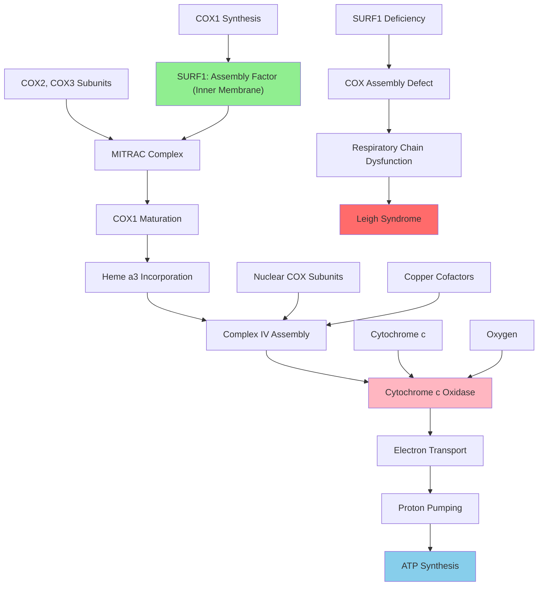

# Pathway Summary for Surf1

## Overview
SURF1 is a nuclear-encoded mitochondrial inner membrane protein that functions as an essential assembly factor for cytochrome c oxidase (Complex IV) of the electron transport chain [P09925]. This non-enzymatic scaffolding protein operates within COX assembly intermediates, particularly the MITRAC complex, where it facilitates COX1 subunit maturation and heme a3 incorporation [file:mouse/Surf1/Surf1-deep-research.md]. SURF1 deficiency results in severe respiratory chain dysfunction and is associated with Leigh syndrome in humans.

## Cytochrome c Oxidase Assembly Pathway
SURF1 serves as a critical assembly factor in the complex process of cytochrome c oxidase biogenesis [GO_REF:0000033]. The protein integrates into early assembly intermediates where it assists in the proper folding and cofactor incorporation of the COX1 subunit, the catalytic core of Complex IV. Through its scaffolding function, SURF1 coordinates the sequential assembly of COX subunits and ensures proper heme a and heme a3 insertion into the enzyme complex [file:mouse/Surf1/Surf1-deep-research.md].

## MITRAC Complex and COX1 Maturation
SURF1 functions within the MITRAC (mitochondrial translation regulation assembly intermediate of cytochrome c oxidase) complex, a specialized assembly machinery that couples COX1 synthesis with early assembly steps [file:mouse/Surf1/Surf1-deep-research.md]. Within this complex, SURF1 promotes the maturation of newly synthesized COX1 by facilitating proper protein folding and cofactor acquisition. The protein's role is particularly crucial for heme a3 incorporation, which is essential for the enzyme's oxygen reduction activity.

## Respiratory Chain Function and Energy Production
Through its role in COX assembly, SURF1 is essential for proper mitochondrial respiratory chain function and cellular energy production [P09925]. Complex IV catalyzes the final step of the electron transport chain, transferring electrons from cytochrome c to molecular oxygen while pumping protons across the inner mitochondrial membrane. SURF1 deficiency leads to approximately 50% reduction in COX activity across tissues, severely compromising cellular ATP production and energy metabolism.

## Pathway Diagram

## Tissue-Specific Energy Requirements
SURF1 function is particularly critical in tissues with high energy demands such as brain, heart, and muscle [file:mouse/Surf1/Surf1-deep-research.md]. These tissues rely heavily on efficient mitochondrial respiration for ATP production, making them especially vulnerable to COX assembly defects. The protein's role in maintaining respiratory chain function is essential for meeting the metabolic demands of these energy-intensive tissues.

## Mitochondrial Protein Import and Localization
As a nuclear-encoded mitochondrial protein, SURF1 must be imported into mitochondria and properly localized to the inner membrane where it functions [P09925]. The protein contains targeting signals that direct its import through the mitochondrial protein import machinery and its subsequent integration into assembly complexes. This import process is tightly regulated to ensure proper stoichiometry of assembly factors relative to structural COX subunits.

## Quality Control and Assembly Surveillance
SURF1 participates in quality control mechanisms that monitor COX assembly and ensure only properly assembled complexes are incorporated into respiratory supercomplexes [file:mouse/Surf1/Surf1-deep-research.md]. The protein helps prevent the formation of partially assembled or misfolded COX complexes that could be detrimental to mitochondrial function. This surveillance role is critical for maintaining respiratory chain integrity and preventing oxidative damage.

## Disease Mechanisms and Pathophysiology
SURF1 mutations cause Leigh syndrome, a severe mitochondrial disorder characterized by progressive neurodegeneration and respiratory chain dysfunction [file:mouse/Surf1/Surf1-deep-research.md]. The pathophysiology involves energy deficit in affected tissues, particularly the brain, leading to metabolic dysfunction and cell death. Understanding SURF1's assembly function provides insights into the molecular basis of mitochondrial respiratory chain disorders.

## Therapeutic Implications and Treatment Strategies
SURF1 deficiency represents a potential target for mitochondrial medicine approaches including cofactor supplementation, antioxidant therapy, and metabolic modulators [file:mouse/Surf1/Surf1-deep-research.md]. Research into SURF1 function may inform strategies for enhancing COX assembly efficiency or bypassing assembly defects. Gene therapy approaches targeting SURF1 restoration are also being investigated as potential treatments for Leigh syndrome and related mitochondrial disorders.