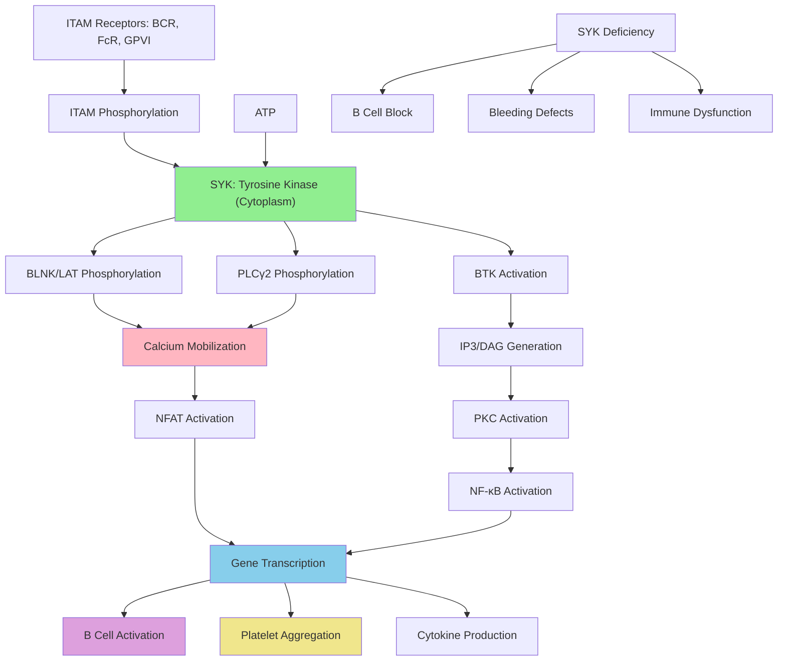

# Pathway Summary for Syk

## Overview
SYK is a non-receptor cytoplasmic tyrosine kinase that serves as a critical signaling hub downstream of immunoreceptor tyrosine-based activation motifs (ITAMs) [P48025]. The protein contains tandem SH2 domains that bind phosphorylated ITAMs and a C-terminal kinase domain that phosphorylates numerous downstream effectors [PMID:7477352]. SYK is essential for immune system function, mediating signaling from B cell receptors, Fc receptors, C-type lectin receptors, and platelet activation receptors.

## B Cell Development and BCR Signaling
SYK plays an absolutely essential role in B cell development, particularly at the pro-B to pre-B cell transition where it mediates pre-BCR signaling [P48025]. Upon BCR engagement, SYK binds to phosphorylated ITAMs in the CD79a/CD79b heterodimer through its tandem SH2 domains, becomes activated, and phosphorylates key downstream substrates including BLNK, PLCγ2, and BTK [file:mouse/Syk/Syk-deep-research.md]. This signaling cascade leads to calcium mobilization, activation of transcription factors like NFAT and NF-κB, and B cell activation, proliferation, and antibody production.

## Platelet Activation and Hemostasis
In platelets, SYK mediates activation signals downstream of the glycoprotein VI (GPVI)-FcRγ complex upon collagen binding [file:mouse/Syk/Syk-deep-research.md]. Activated SYK phosphorylates LAT and other adapter proteins, leading to PLCγ2 activation, IP3/DAG generation, and calcium mobilization. This signaling cascade results in platelet aggregation, degranulation, and hemostatic plug formation. SYK-deficient mice exhibit severe bleeding defects due to defective platelet function.

## Myeloid Cell Activation and Innate Immunity
SYK is crucial for myeloid cell activation through various ITAM-coupled receptors including FcγR, FcεRI, and C-type lectin receptors like Dectin-1 [file:mouse/Syk/Syk-deep-research.md]. In macrophages and dendritic cells, SYK mediates pathogen recognition responses, cytokine production, and phagocytosis. The kinase phosphorylates CARD9, leading to NF-κB activation and inflammatory cytokine production. This pathway is essential for antifungal immunity and innate immune responses to pathogens.

## Pathway Diagram

## Osteoclast Differentiation and Bone Remodeling
SYK contributes to osteoclast differentiation and function through signaling from immunoreceptors expressed on bone cells [file:mouse/Syk/Syk-deep-research.md]. The kinase mediates signals that regulate osteoclast activation, bone resorption, and skeletal homeostasis. While not absolutely essential for osteoclast development, SYK signaling modulates osteoclast function and contributes to the balance between bone formation and resorption.

## Allergic and Inflammatory Responses
Through FcεRI signaling in mast cells and basophils, SYK mediates allergic responses and anaphylaxis [file:mouse/Syk/Syk-deep-research.md]. Upon IgE-antigen crosslinking, SYK becomes activated and triggers degranulation, histamine release, and inflammatory mediator production. This pathway is central to immediate hypersensitivity reactions and allergic diseases. SYK inhibitors are being investigated as therapeutic agents for allergic conditions.

## Signal Transduction Networks and Adapter Proteins
SYK functions as a central hub in immune signaling networks, phosphorylating numerous adapter proteins and enzymes [PMID:7477352]. Key substrates include BLNK/SLP-65 in B cells, LAT in platelets, and CARD9 in myeloid cells. These adapter proteins serve as scaffolds for assembling larger signaling complexes, amplifying and diversifying the signals initiated by SYK activation. The protein's dual SH2 domains provide specificity for ITAM recognition while its kinase domain enables signal propagation.

## Therapeutic Targeting and Drug Development
SYK represents an important therapeutic target for autoimmune diseases, allergies, and B cell malignancies [file:mouse/Syk/Syk-deep-research.md]. Small molecule SYK inhibitors are in clinical development for treating rheumatoid arthritis, asthma, and B cell lymphomas. The kinase's central role in multiple immune pathways makes it an attractive target, though careful consideration of potential side effects on immune function is necessary.

## Developmental Requirements and Knockout Phenotypes
SYK-deficient mice exhibit perinatal lethality with severe hemorrhaging, complete block in B cell development, and defective platelet function [P48025]. This phenotype demonstrates SYK's essential roles in both adaptive and innate immunity as well as hemostasis. The early lethality has necessitated the use of conditional knockout models to study SYK function in specific cell types and developmental stages.

## Evolutionary Conservation and Functional Domains
SYK is highly conserved across vertebrates, reflecting its fundamental importance in immune system function [file:mouse/Syk/Syk-deep-research.md]. The protein's domain architecture, consisting of tandem SH2 domains and a kinase domain, is optimized for ITAM recognition and signal transduction. This structural organization allows SYK to serve as a universal adaptor linking ITAM-containing receptors to downstream signaling pathways across diverse immune cell types.