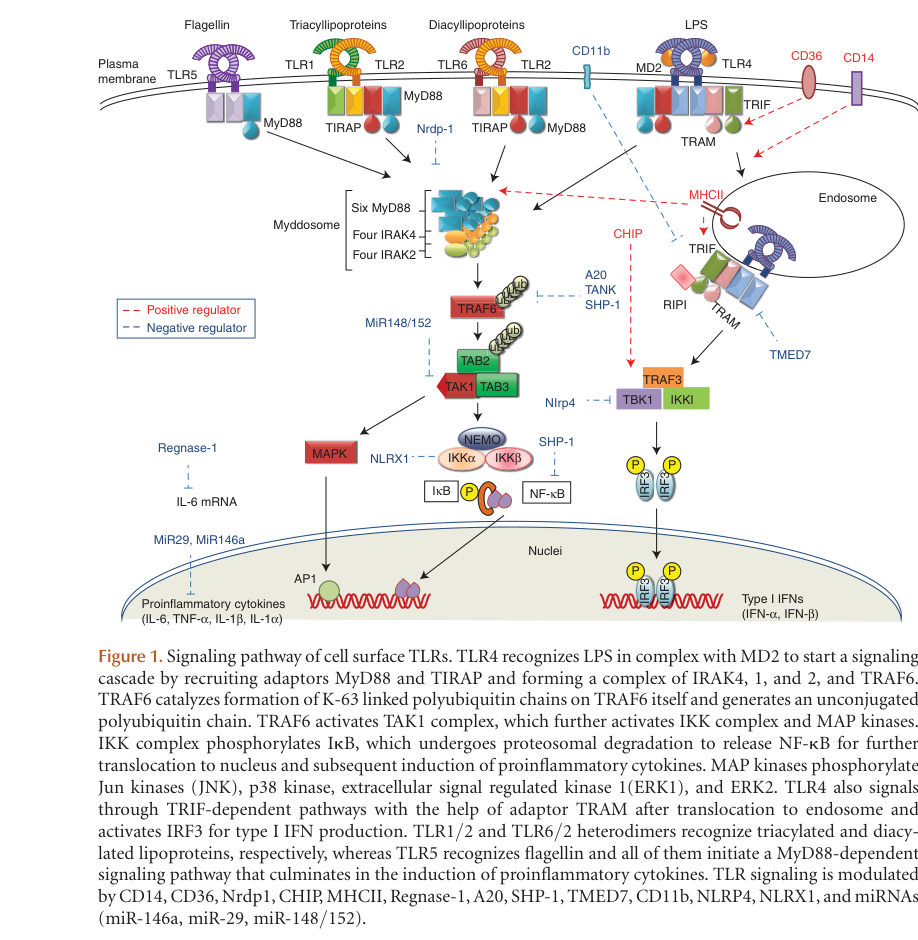

## Question

# Gene Research for Functional Annotation

## ⚠️ CRITICAL: Gene/Protein Identification Context

**BEFORE YOU BEGIN RESEARCH:** You MUST verify you are researching the CORRECT gene/protein. Gene symbols can be ambiguous, especially for less well-characterized genes from non-model organisms.

### Target Gene/Protein Identity (from UniProt):
- **UniProt Accession:** Q6R5P0
- **Protein Description:** RecName: Full=Toll-like receptor 11 {ECO:0000303|PubMed:14993594}; AltName: Full=Toll-like receptor 12 {ECO:0000305}; Flags: Precursor;
- **Gene Information:** Name=Tlr11 {ECO:0000303|PubMed:14993594, ECO:0000312|MGI:MGI:3045226}; Synonyms=Gm287 {ECO:0000312|MGI:MGI:3045226}, Tlr12 {ECO:0000305};
- **Organism (full):** Mus musculus (Mouse).
- **Protein Family:** Belongs to the Toll-like receptor family. .
- **Key Domains:** Leu-rich_rpt. (IPR001611); Leu-rich_rpt_typical-subtyp. (IPR003591); LRR_dom_sf. (IPR032675); TIR_dom. (IPR000157); Toll_tir_struct_dom_sf. (IPR035897)

### MANDATORY VERIFICATION STEPS:

1. **Check if the gene symbol "Tlr11" matches the protein description above**
2. **Verify the organism is correct:** Mus musculus (Mouse).
3. **Check if protein family/domains align with what you find in literature**
4. **If you find literature for a DIFFERENT gene with the same or similar symbol, STOP**

### If Gene Symbol is Ambiguous or You Cannot Find Relevant Literature:

**DO NOT PROCEED WITH RESEARCH ON A DIFFERENT GENE.** Instead:
- State clearly: "The gene symbol 'Tlr11' is ambiguous or literature is limited for this specific protein"
- Explain what you found (e.g., "Found extensive literature on a different gene with the same symbol in a different organism")
- Describe the protein based ONLY on the UniProt information provided above
- Suggest that the protein function can be inferred from domain/family information

### Research Target:

Please provide a comprehensive research report on the gene **Tlr11** (gene ID: Tlr11, UniProt: Q6R5P0) in mouse.

The research report should be a detailed narrative explaining the function, biological processes, and localization of the gene product. Citations should be given for all claims.

You should prioritize authoritative reviews and primary scientific literature when conducting research. You can supplement
this with annotations you find in gene/protein databases, but these can be outdated or inaccurate.

We are specifically interested in the primary function of the gene - for enzymes, what reaction is catalyzed, and what is the substrate specificity? For transporters, what is the substrate? For structural proteins or adapters, what is the broader structural role? For signaling molecules, what is the role in the pathway.

We are interested in where in or outside the cell the gene product carries out its function.

We are also interested in the signaling or biochemical pathways in which the gene functions. We are less interested in broad pleiotropic effects, except where these elucidate the precise role.

Include evidence where possible. We are interested in both experimental evidence as well as inference from structure, evolution, or bioinformatic analysis. Precise studies should be prioritized over high-throughput, where available.

## Output

Question: You are an expert researcher providing comprehensive, well-cited information.

Provide detailed information focusing on:
1. Key concepts and definitions with current understanding
2. Recent developments and latest research (prioritize 2023-2024 sources)
3. Current applications and real-world implementations
4. Expert opinions and analysis from authoritative sources
5. Relevant statistics and data from recent studies

Format as a comprehensive research report with proper citations. Include URLs and publication dates where available.
Always prioritize recent, authoritative sources and provide specific citations for all major claims.

# Gene Research for Functional Annotation

## ⚠️ CRITICAL: Gene/Protein Identification Context

**BEFORE YOU BEGIN RESEARCH:** You MUST verify you are researching the CORRECT gene/protein. Gene symbols can be ambiguous, especially for less well-characterized genes from non-model organisms.

### Target Gene/Protein Identity (from UniProt):
- **UniProt Accession:** Q6R5P0
- **Protein Description:** RecName: Full=Toll-like receptor 11 {ECO:0000303|PubMed:14993594}; AltName: Full=Toll-like receptor 12 {ECO:0000305}; Flags: Precursor;
- **Gene Information:** Name=Tlr11 {ECO:0000303|PubMed:14993594, ECO:0000312|MGI:MGI:3045226}; Synonyms=Gm287 {ECO:0000312|MGI:MGI:3045226}, Tlr12 {ECO:0000305};
- **Organism (full):** Mus musculus (Mouse).
- **Protein Family:** Belongs to the Toll-like receptor family. .
- **Key Domains:** Leu-rich_rpt. (IPR001611); Leu-rich_rpt_typical-subtyp. (IPR003591); LRR_dom_sf. (IPR032675); TIR_dom. (IPR000157); Toll_tir_struct_dom_sf. (IPR035897)

### MANDATORY VERIFICATION STEPS:

1. **Check if the gene symbol "Tlr11" matches the protein description above**
2. **Verify the organism is correct:** Mus musculus (Mouse).
3. **Check if protein family/domains align with what you find in literature**
4. **If you find literature for a DIFFERENT gene with the same or similar symbol, STOP**

### If Gene Symbol is Ambiguous or You Cannot Find Relevant Literature:

**DO NOT PROCEED WITH RESEARCH ON A DIFFERENT GENE.** Instead:
- State clearly: "The gene symbol 'Tlr11' is ambiguous or literature is limited for this specific protein"
- Explain what you found (e.g., "Found extensive literature on a different gene with the same symbol in a different organism")
- Describe the protein based ONLY on the UniProt information provided above
- Suggest that the protein function can be inferred from domain/family information

### Research Target:

Please provide a comprehensive research report on the gene **Tlr11** (gene ID: Tlr11, UniProt: Q6R5P0) in mouse.

The research report should be a detailed narrative explaining the function, biological processes, and localization of the gene product. Citations should be given for all claims.

You should prioritize authoritative reviews and primary scientific literature when conducting research. You can supplement
this with annotations you find in gene/protein databases, but these can be outdated or inaccurate.

We are specifically interested in the primary function of the gene - for enzymes, what reaction is catalyzed, and what is the substrate specificity? For transporters, what is the substrate? For structural proteins or adapters, what is the broader structural role? For signaling molecules, what is the role in the pathway.

We are interested in where in or outside the cell the gene product carries out its function.

We are also interested in the signaling or biochemical pathways in which the gene functions. We are less interested in broad pleiotropic effects, except where these elucidate the precise role.

Include evidence where possible. We are interested in both experimental evidence as well as inference from structure, evolution, or bioinformatic analysis. Precise studies should be prioritized over high-throughput, where available.

# Comprehensive Research Report: Mouse Toll-like Receptor 11 (TLR11)

## Gene Identity Confirmation

The gene Tlr11 (UniProt: Q6R5P0) encodes Toll-like receptor 11 in *Mus musculus* (mouse). This protein belongs to the Toll-like receptor family and is characterized by leucine-rich repeat (LRR) domains and a Toll/IL-1 receptor (TIR) signaling domain (hatai2016tolllikereceptor11 pages 5-9, hatai2016tolllikereceptor11 pages 1-2). TLR11 is a mouse-specific receptor; importantly, **humans lack a functional TLR11 gene** due to the presence of stop codons in the corresponding genomic sequence (behzadi2021tolllikereceptorsgeneral pages 2-3, sher2017innaterecognitionof pages 2-3). This species difference is critical for translational interpretation of TLR11 research.

## Primary Function and Ligand Recognition

### Overview of Function

TLR11 functions as a pattern recognition receptor (PRR) that detects conserved pathogen-associated molecular patterns (PAMPs) and initiates innate immune responses (hatai2016tolllikereceptor11 pages 1-2, lopezyglesias2019tlr11independentinflammasomeactivation pages 1-2). As a signaling receptor rather than an enzyme or transporter, TLR11's specificity is defined by its ligand recognition capabilities rather than substrate catalysis.

### Ligand Specificity

TLR11 recognizes two distinct classes of pathogen-derived protein ligands through separate molecular mechanisms:

**1. Profilin from *Toxoplasma gondii* and Related Parasites**

The most extensively characterized TLR11 ligand is profilin, a parasite actin-binding protein from *Toxoplasma gondii* involved in gliding motility and host cell invasion (qiu2023toxoplasmagondiimicroneme pages 11-14, hatai2016tolllikereceptor11 pages 1-2). Profilin recognition depends on a parasite-specific acidic loop/β-hairpin surface motif and represents the canonical pathway for innate detection of *T. gondii* in mice (sasai2019innateadaptiveand pages 3-4, lopezyglesias2019tlr11independentinflammasomeactivation pages 1-2). Recognition of profilin requires contributions from both the N-terminal and C-terminal regions of the TLR11 ectodomain, specifically residues Y39 and C43 in the N-terminal LRR region and the LRR24 region at the C-terminus (hatai2016tolllikereceptor11 pages 5-9). This interaction occurs with the full-length, uncleaved receptor and is favored under neutral pH conditions, suggesting recognition may occur at the plasma membrane or in early endosomes before proteolytic processing (hatai2016tolllikereceptor11 pages 9-12).

A 2023 study identified microneme protein MIC3 as a potential additional *T. gondii* ligand for TLR11, structurally distinct from profilin (qiu2023toxoplasmagondiimicroneme pages 11-14). MIC3 induced TNF-α production and Ly6C expression through the TLR11/MyD88 pathway in mouse macrophages, though unlike profilin, it did not induce IL-12p40 in the tested system. This positions MIC3 as a candidate ligand requiring further validation.

**2. Bacterial Flagellin (FliC)**

TLR11 also recognizes bacterial flagellin, specifically FliC from *Escherichia coli* and *Salmonella* species (hatai2016tolllikereceptor11 pages 1-2, hatai2016tolllikereceptor11 pages 2-4, hatai2016tolllikereceptor11 pages 12-13). This interaction provides a molecular basis for TLR11-mediated protection against uropathogenic bacteria and prevention of *Salmonella* penetration into murine Peyer's patches (hatai2016tolllikereceptor11 pages 12-13, hatai2016tolllikereceptor11 pages 9-12). Unlike profilin recognition, flagellin binding occurs preferentially with the cathepsin-generated C-terminal fragment of the TLR11 ectodomain under acidic conditions (pH 6.0), consistent with recognition in acidic endolysosomal compartments (hatai2016tolllikereceptor11 pages 2-4, hatai2016tolllikereceptor11 pages 9-12, hatai2016tolllikereceptor11 pages 4-5). Both the N-terminal and C-terminal regions of TLR11 can independently support flagellin interaction, demonstrating modular ligand-binding architecture (hatai2016tolllikereceptor11 pages 5-9, hatai2016tolllikereceptor11 pages 9-12).

### TLR12 Partnership

TLR11 frequently functions in cooperation with TLR12, particularly for profilin recognition (hatai2016tolllikereceptor11 pages 12-13, hatai2016tolllikereceptor11 pages 9-12). Studies indicate that TLR11/TLR12 operate as a heterodimeric receptor system for optimal sensing of *T. gondii* profilin and induction of IL-12 production (lopezyglesias2019tlr11independentinflammasomeactivation pages 1-2). However, the precise stoichiometry and whether heterodimerization is obligatory for all TLR11 functions remain areas of ongoing investigation (hatai2016tolllikereceptor11 pages 9-12).

## Subcellular Localization

TLR11 is classified as an **intracellular endosomal/endolysosomal TLR** rather than a cell surface receptor (pandey2015microbialsensingby pages 3-4, pandey2015microbialsensingby pages 4-5). This localization distinguishes it from plasma membrane TLRs such as TLR1, TLR2, TLR4, TLR5, and TLR6 (pandey2015microbialsensingby pages 3-4). TLR11 is grouped with other endosomal TLRs including TLR3, TLR7, TLR8, TLR9, TLR12, and TLR13 (pandey2015microbialsensingby pages 4-5, lee2014traffickingofendosomal pages 2-3).

### Ligand-Dependent Compartmentalization

The precise subcellular compartment where TLR11 functions appears to depend on the ligand being recognized:

- **Flagellin recognition** occurs in acidic endolysosomes with the cleaved, cathepsin-processed form of the receptor (hatai2016tolllikereceptor11 pages 9-12)
- **Profilin recognition** is proposed to occur at the plasma membrane or in early endosomes with the full-length receptor before proteolytic cleavage (hatai2016tolllikereceptor11 pages 9-12)

### Receptor Trafficking and Processing

TLR11 undergoes cathepsin-dependent proteolytic processing of its ectodomain, which is critical for regulating ligand specificity (hatai2016tolllikereceptor11 pages 2-4, hatai2016tolllikereceptor11 pages 1-2, hatai2016tolllikereceptor11 pages 4-5). The receptor requires UNC93B1, a trafficking factor essential for proper delivery of intracellular TLRs to endosomal compartments (lopezyglesias2019tlr11independentinflammasomeactivation pages 17-18). This processing represents a key regulatory mechanism that differentially affects ligand recognition: cleavage preserves or enhances flagellin binding while eliminating profilin binding (hatai2016tolllikereceptor11 pages 9-12, hatai2016tolllikereceptor11 pages 4-5).

## Signaling Pathways and Molecular Mechanisms

### MyD88-Dependent Signaling

TLR11 signals exclusively through the **MyD88-dependent pathway**, belonging to the inflammatory signaling branch of TLR signaling rather than the TRIF-dependent pathway used by TLR3 (pandey2015microbialsensingby pages 7-8, pandey2015microbialsensingby pages 5-7). Upon ligand recognition, TLR11 recruits the adaptor protein MyD88 through homotypic TIR domain interactions (moghaddam2024regulationofimmune pages 5-6, pandey2015microbialsensingby pages 7-8).

The canonical TLR11 signaling cascade proceeds as follows (pandey2015microbialsensingby media 4b1f380e):

**TLR11 (ligand-activated) → MyD88 → IRAK4/IRAK1/IRAK2 (Myddosome formation) → TRAF6 → TAK1 → IKK complex (IKKα, IKKβ, NEMO) → NF-κB activation**

This pathway also activates MAP kinases (MAPKs) and can engage IRF7, leading to transcription of proinflammatory genes (moghaddam2024regulationofimmune pages 5-6, pandey2015microbialsensingby pages 7-8).

### Cytokine Production

The primary and most physiologically significant cytokine produced downstream of TLR11 activation is **interleukin-12 (IL-12)**, particularly in dendritic cells (lopezyglesias2019tlr11independentinflammasomeactivation pages 1-2, ihara2024theroleof pages 3-4, sasai2019innateadaptiveand pages 3-4). This IL-12 production is central to TLR11's biological function and represents the defining output of the TLR11/TLR12-profilin recognition pathway (lopezyglesias2019tlr11independentinflammasomeactivation pages 12-13, lopezyglesias2019tlr11independentinflammasomeactivation pages 1-2).

Additional cytokines and mediators produced in response to TLR11 activation include:
- TNF-α (qiu2023toxoplasmagondiimicroneme pages 11-14, sasai2019innateadaptiveand pages 3-4)
- IL-6 (pandey2015microbialsensingby media 4b1f380e)
- iNOS (inducible nitric oxide synthase) (qiu2023toxoplasmagondiimicroneme pages 11-14)

### The IL-12/IFN-γ Axis

While TLR11 does not directly produce IFN-γ, it drives a critical downstream immune cascade (lopezyglesias2019tlr11independentinflammasomeactivation pages 1-2, sasai2019innateadaptiveand pages 3-4). IL-12 produced by TLR11-activated dendritic cells and macrophages promotes:

1. Proliferation and activation of NK cells, CD4+ T cells, and CD8+ T cells
2. Robust **IFN-γ production** by these immune cells, particularly CD4+ Th1 cells
3. IFN-γ-mediated activation of macrophages and induction of cell-autonomous antimicrobial mechanisms, including immunity-related GTPases (IRGs), guanylate-binding proteins (GBPs), and iNOS (lopezyglesias2019tlr11independentinflammasomeactivation pages 1-2, ihara2024theroleof pages 3-4, sasai2019innateadaptiveand pages 3-4)

This TLR11 → IL-12 → IFN-γ axis represents the primary mechanism by which TLR11 contributes to type 1 immunity and host defense against intracellular pathogens.

## Biological Function and Disease Relevance

### Host Defense Against *Toxoplasma gondii*

TLR11 plays a critical role in innate recognition of and defense against *Toxoplasma gondii* infection in mice (lopezyglesias2019tlr11independentinflammasomeactivation pages 1-2, ihara2024theroleof pages 1-2). Recognition of parasite profilin by the TLR11/TLR12 heterodimer activates MyD88-dependent signaling and robust IL-12 production, which drives protective Th1 immunity and IFN-γ responses essential for parasite control (lopezyglesias2019tlr11independentinflammasomeactivation pages 1-2, lopezyglesias2019tlr11independentinflammasomeactivation pages 17-18).

TLR11 is particularly important for controlling parasite replication at local infection sites and contributes to regulation of chronic cerebral toxoplasmosis, including the number of tissue cysts formed in the brain (lopezyglesias2019tlr11independentinflammasomeactivation pages 4-5, ihara2024theroleof pages 1-2). The receptor also helps prevent excessive parasite-induced immunopathology by appropriately calibrating immune responses (ihara2024theroleof pages 9-9).

### Functional Redundancy and Compensatory Pathways

Importantly, TLR11 is not absolutely indispensable for survival during *T. gondii* infection when considered in isolation (lopezyglesias2019tlr11independentinflammasomeactivation pages 1-2, lopezyglesias2019tlr11independentinflammasomeactivation pages 4-5, ihara2024theroleof pages 1-2). TLR11-deficient mice can retain substantial Th1/IFN-γ immunity because **caspase-1/11-dependent inflammasome activation** provides a compensatory pathway through production of IL-18 (lopezyglesias2019tlr11independentinflammasomeactivation pages 4-5, lopezyglesias2019tlr11independentinflammasomeactivation pages 9-12). IL-18 can substitute for the loss of TLR11-mediated IL-12 in sustaining systemic IFN-γ production and host resistance (lopezyglesias2019tlr11independentinflammasomeactivation pages 9-12, lopezyglesias2019tlr11independentinflammasomeactivation pages 12-13).

However, the combined loss of both TLR11 and caspase-1/11 causes severe susceptibility with rapid mortality comparable to MyD88 deficiency, demonstrating that these pathways cooperate through overlapping MyD88-dependent networks (lopezyglesias2019tlr11independentinflammasomeactivation pages 4-5, lopezyglesias2019tlr11independentinflammasomeactivation pages 5-9). This redundancy has important implications for understanding human immunity, as humans lack TLR11 but successfully resist *T. gondii* through alternative recognition mechanisms.

### Defense Against Bacterial Infections

TLR11 contributes to antibacterial immunity through its recognition of flagellin from bacteria including uropathogenic *E. coli* and *Salmonella* species (hatai2016tolllikereceptor11 pages 12-13, hatai2016tolllikereceptor11 pages 1-2). The receptor helps prevent infection by uropathogenic bacteria and blocks *Salmonella* penetration into murine Peyer's patches (hatai2016tolllikereceptor11 pages 12-13, hatai2016tolllikereceptor11 pages 9-12). However, the complete receptor/cofactor requirements and in vivo signaling mechanisms for flagellin-mediated protection remain less fully characterized than the profilin pathway (hatai2016tolllikereceptor11 pages 12-13).

## Tissue and Cellular Expression

TLR11 exhibits tissue- and cell-type-specific expression patterns in mice:

**Epithelial tissues**: Highly expressed in epithelial cells of the intestine, lung, and skin (hatai2016tolllikereceptor11 pages 9-12)

**Immune cells**: Expressed in profilin-responsive dendritic cells and macrophage populations that produce IL-12 in response to *T. gondii* (lopezyglesias2019tlr11independentinflammasomeactivation pages 1-2, sasai2019innateadaptiveand pages 3-4)

**Reproductive tissues**: A 2024 study identified TLR11 expression in the adult mouse testis, specifically in spermatogonia, spermatocytes, round spermatids, and elongated spermatids (dogan2024stagespecificexpressionof pages 3-5). Within these cells, TLR11 localizes to endosomal compartments of spermatocytes, acrosomal structures of spermatids, and residual bodies, though the functional significance of this expression remains unclear.

## Structural Organization

TLR11 is organized as a type I transmembrane receptor with the following domain architecture (hatai2016tolllikereceptor11 pages 5-9, hatai2016tolllikereceptor11 pages 1-2):

1. **N-terminal signal peptide** (residues M1-S21)
2. **Large extracellular ectodomain** (residues T22-S709) containing 26 leucine-rich repeats (LRRs): an N-terminal LRR-NT, LRRs 1-24, and a C-terminal LRR-CT
3. **Single transmembrane domain**
4. **Cytoplasmic TIR (Toll/IL-1 receptor) domain** for signaling

The N-terminal and C-terminal portions of the ectodomain make distinct contributions to ligand recognition, with both regions required for profilin binding but either region sufficient for flagellin interaction (hatai2016tolllikereceptor11 pages 5-9, hatai2016tolllikereceptor11 pages 9-12). The receptor undergoes cathepsin-dependent proteolytic cleavage within the ectodomain, which selectively modulates ligand recognition capabilities (hatai2016tolllikereceptor11 pages 1-2, hatai2016tolllikereceptor11 pages 2-4).

## Critical Species Difference: Mouse vs. Human

A crucial consideration for translational research is that **TLR11 is absent as a functional receptor in humans and other primates** (behzadi2021tolllikereceptorsgeneral pages 2-3, sher2017innaterecognitionof pages 2-3, rodrigues2024tlr10anintriguing pages 1-1). While a region corresponding to the mouse TLR11 locus exists on human chromosome 1, the human TLR11 gene contains three stop codons and does not encode a functional protein (sher2017innaterecognitionof pages 2-3). Humans also lack functional TLR12 and TLR13 (sher2017innaterecognitionof pages 2-3, rodrigues2024tlr10anintriguing pages 1-2).

This means that the TLR11/TLR12-dependent profilin recognition pathway that is critical for murine immunity to *T. gondii* does not operate in humans (sher2017innaterecognitionof pages 2-3). Instead, human cells must recognize the parasite through alternative innate sensing mechanisms, which may include other endosomal TLRs such as TLR7 and TLR9 detecting parasite nucleic acids, or other pattern recognition receptors (ihara2024theroleof pages 3-4, sasai2019innateadaptiveand pages 3-4).

Mice have 12 functional TLRs (TLR1-9 and TLR11-13), while humans have 10 (TLR1-10) (behzadi2021tolllikereceptorsgeneral pages 2-3, rodrigues2024tlr10anintriguing pages 1-1). This species divergence is essential context for interpreting TLR11 research and limits direct translation of mouse TLR11 findings to human immunity or therapeutic development.

## Summary Table

A comprehensive summary of TLR11's key properties is provided in the following table:

| Property | Mouse TLR11 summary | Evidence and interpretation |
|---|---|---|
| Identity and receptor class | **Tlr11** encodes Toll-like receptor 11, a type-I single-pass transmembrane pattern-recognition receptor. It contains an N-terminal signal peptide, a large leucine-rich-repeat (LRR) ectodomain, one transmembrane helix, and a cytoplasmic Toll/IL-1 receptor (TIR) signaling domain. The ectodomain was mapped to residues 22–709 and contains 26 LRR-related elements. | This architecture agrees with the LRR and TIR domains annotated for mouse UniProt Q6R5P0. (hatai2016tolllikereceptor11 pages 5-9, hatai2016tolllikereceptor11 pages 1-2) |
| Principal protozoan ligand | The best-established ligand is **profilin/profilin-like protein from *Toxoplasma gondii***. TLR11-mediated profilin sensing commonly operates with TLR12 and induces an IL-12-centered type-1 immune response. | TLR11/TLR12-dependent profilin recognition is the canonical murine pathway for innate detection of *T. gondii*. (lopezyglesias2019tlr11independentinflammasomeactivation pages 1-2, ihara2024theroleof pages 1-2) |
| Candidate additional *T. gondii* ligand | A 2023 study identified a peptide from microneme protein **MIC3** as a candidate, structurally distinct TLR11 ligand. Tlr11 silencing or knockout and MyD88 inhibition reduced MIC3-induced NF-κB activation, TNF-α, iNOS transcription, and Ly6C expression in mouse macrophages. Unlike profilin, MIC3 did not induce IL-12p40 in that system. | MIC3 is less extensively validated than profilin and is best regarded as a **candidate additional ligand**. (qiu2023toxoplasmagondiimicroneme pages 11-14) |
| Bacterial ligand | TLR11 binds **flagellin FliC** from bacteria including *Escherichia coli* and *Salmonella*. This supplies a molecular basis for reported protection against uropathogenic bacteria and restriction of *Salmonella* penetration through Peyer’s patches. | Direct biochemical binding is established, but complete receptor/cofactor requirements and the in-vivo signaling mechanism for FliC remain less resolved than the profilin pathway. (hatai2016tolllikereceptor11 pages 12-13, hatai2016tolllikereceptor11 pages 1-2, hatai2016tolllikereceptor11 pages 9-12) |
| Profilin-recognition mechanism | Profilin binds **full-length, uncleaved TLR11**. Recognition involves both ends of the ectodomain, including N-terminal Y39/C43 and the C-terminal LRR24 region. Binding is favored at neutral pH, consistent with recognition before lysosomal cleavage—possibly at the plasma membrane or in an early endosome. | This mechanism differs from flagellin recognition and may be modified by TLR12 partnership in native immune cells. (hatai2016tolllikereceptor11 pages 5-9, hatai2016tolllikereceptor11 pages 9-12) |
| Flagellin-recognition mechanism | FliC interacts with full-length TLR11 and its **cathepsin-generated C-terminal ectodomain fragment**. Either N- or C-terminal receptor regions can support interaction, and binding is strongly favored by acidic pH, supporting recognition by processed TLR11 in acidic endolysosomes. | Proteolytic processing preserves or promotes flagellin binding but eliminates profilin binding, demonstrating ligand-specific use of receptor domains and compartments. (hatai2016tolllikereceptor11 pages 2-4, hatai2016tolllikereceptor11 pages 9-12, hatai2016tolllikereceptor11 pages 4-5) |
| TLR12 relationship | TLR12 is a close functional partner in profilin sensing. Physiological studies describe a **TLR11–TLR12 heteromeric receptor system**, while TLR12 may also signal as a homodimer in some myeloid contexts. Some biochemical work cautions that obligatory heterodimerization and exact stoichiometry remain incompletely resolved. | Evidence strongly supports cooperative TLR11/TLR12 function but not a completely defined obligatory heterodimeric structure. (hatai2016tolllikereceptor11 pages 9-12, lopezyglesias2019tlr11independentinflammasomeactivation pages 1-2, ihara2024theroleof pages 1-2, sher2017innaterecognitionof pages 2-3) |
| Principal subcellular localization | TLR11 is principally an **intracellular endosomal/endolysosomal receptor**, rather than a conventional constitutive plasma-membrane TLR. | Reviews classify TLR11 with the intracellular mouse TLR11-family receptors. (pandey2015microbialsensingby pages 3-4, pandey2015microbialsensingby pages 4-5, lee2014traffickingofendosomal pages 2-3) |
| Compartment-specific activity | The best-supported model is ligand-dependent compartmentalization: **acidic endolysosomes and cleaved receptor for flagellin**, versus **full-length receptor at neutral-pH locations such as the plasma membrane or early endosomes for profilin**. | The early-endosome or cell-surface location for profilin recognition is a mechanistic proposal, not a definitive in-vivo localization measurement. (hatai2016tolllikereceptor11 pages 9-12) |
| Trafficking and processing | TLR11 undergoes **cathepsin-dependent ectodomain cleavage**. Its intracellular trafficking and profilin response depend on UNC93B1, a trafficking factor for intracellular TLRs. | Cleavage changes ligand specificity, while UNC93B1 dependence supports regulated intracellular delivery. (hatai2016tolllikereceptor11 pages 2-4, lopezyglesias2019tlr11independentinflammasomeactivation pages 17-18, hatai2016tolllikereceptor11 pages 4-5) |
| Proximal signaling adaptor | Ligand-induced activation recruits **MyD88** through TIR-domain interactions. TLR11 belongs to the MyD88-dependent inflammatory branch rather than the TLR3-like TRIF branch. | MyD88 dependence is supported by genetic and pharmacological studies of profilin and MIC3 responses. (qiu2023toxoplasmagondiimicroneme pages 11-14, pandey2015microbialsensingby pages 7-8, pandey2015microbialsensingby pages 5-7) |
| Core signaling cascade | The canonical pathway is **TLR11/TLR12 → MyD88 → IRAK4/IRAK1/IRAK2 → TRAF6 → TAK1 → IKK complex and MAPKs → NF-κB/AP-1-dependent transcription**. | These components follow established MyD88-dependent TLR signaling and are consistent with TLR11-dependent NF-κB activation. (moghaddam2024regulationofimmune pages 5-6, pandey2015microbialsensingby pages 7-8, pandey2015microbialsensingby pages 5-7) |
| Principal cytokine output | The defining physiological output of profilin sensing is robust **IL-12 production**, especially by dendritic-cell populations. Depending on ligand and cell type, TLR11–MyD88–NF-κB signaling can also induce TNF-α, IL-6, iNOS, and other inflammatory programs. | IL-12 is the best-supported TLR11-associated cytokine; other outputs are context-dependent. (qiu2023toxoplasmagondiimicroneme pages 11-14, lopezyglesias2019tlr11independentinflammasomeactivation pages 1-2, sasai2019innateadaptiveand pages 3-4) |
| Downstream IL-12–IFN-γ axis | IL-12 activates NK cells and promotes CD4⁺ Th1 and CD8⁺ T-cell responses, causing **IFN-γ production**. IFN-γ activates macrophages and induces cell-autonomous antiparasitic mechanisms, including immunity-related GTPases, guanylate-binding proteins, and iNOS. | TLR11 drives IFN-γ indirectly through IL-12 rather than producing IFN-γ itself. (lopezyglesias2019tlr11independentinflammasomeactivation pages 1-2, ihara2024theroleof pages 3-4, sasai2019innateadaptiveand pages 3-4) |
| Primary biological function | TLR11 converts detection of parasite or bacterial proteins into inflammatory and type-1 immunity. Its most precisely established physiological role is initiating the **profilin–TLR11/TLR12–MyD88–IL-12–IFN-γ pathway** against *T. gondii*. | TLR11 is a signaling receptor, not an enzyme or transporter; its specificity is therefore described in terms of ligands rather than substrates. (lopezyglesias2019tlr11independentinflammasomeactivation pages 1-2, ihara2024theroleof pages 1-2, ihara2024theroleof pages 9-9) |
| Redundancy and knockout interpretation | TLR11 is important but not individually indispensable in every model. Tlr11-deficient mice can retain substantial Th1/IFN-γ immunity because caspase-1/11-dependent inflammasome activation supplies compensatory **IL-18**. Combined loss of TLR11 and caspase-1/11 causes poor parasite control and rapid mortality resembling severe MyD88 deficiency. | TLR11 is not the sole *T. gondii* sensor; IL-18 provides a major compensatory pathway. (lopezyglesias2019tlr11independentinflammasomeactivation pages 4-5, lopezyglesias2019tlr11independentinflammasomeactivation pages 9-12, lopezyglesias2019tlr11independentinflammasomeactivation pages 5-9) |
| Tissue and cell expression | Reported expression includes epithelial cells of the **intestine, lung, and skin**, as well as profilin-responsive dendritic cells and macrophage systems. A 2024 study also detected TLR11 in spermatogonia, spermatocytes, and round and elongated spermatids. | Expression does not establish a functional immune role in every tissue; a reproductive function remains uncertain. (dogan2024stagespecificexpressionof pages 3-5, hatai2016tolllikereceptor11 pages 9-12) |
| Localization in mouse testis | In adult seminiferous epithelium, TLR11 immunostaining was observed in endosomal compartments of spermatocytes, acrosomal structures of spermatids, and residual bodies. | This recent observation expands the expression map but does not establish a defined reproductive function. (dogan2024stagespecificexpressionof pages 3-5) |
| Mouse–human species difference | Mouse has a functional **Tlr11** gene and protein. Humans lack a functional TLR11 receptor: the syntenic human locus contains disruptive stop codons, and humans also lack functional TLR12. Direct TLR11/TLR12-dependent profilin sensing is therefore a rodent-specific mechanism. | Humans recognize *T. gondii* through alternative pathways, so mouse TLR11 findings cannot be transferred uncritically to human immunity or drug development. (behzadi2021tolllikereceptorsgeneral pages 2-3, sher2017innaterecognitionof pages 2-3, rodrigues2024tlr10anintriguing pages 1-1) |

*Table: This table consolidates mouse TLR11 identity, ligand-specific recognition, localization, signaling, biological roles, expression, and species differences. It also distinguishes well-established findings from candidate ligands and unresolved mechanistic models.*

## Visual Evidence: TLR11 Signaling Pathway

The endosomal localization and MyD88-dependent signaling of TLR11 is illustrated in pathway diagrams from recent reviews (pandey2015microbialsensingby media 4b1f380e). TLR11 is positioned within endosomal compartments alongside TLR12 and TLR13, where it recognizes flagellin and profilin ligands. Upon ligand binding, TLR11 recruits MyD88, leading to formation of the Myddosome complex containing IRAK kinases and TRAF6. This cascade ultimately activates NF-κB and results in production of proinflammatory cytokines including IL-6, TNF-α, and the critical IL-12 that drives downstream Th1 immunity.

## Conclusions

TLR11 is a mouse-specific pattern recognition receptor that serves as a critical innate immune sensor for *Toxoplasma gondii* profilin and bacterial flagellin. It functions primarily within endosomal compartments, though the precise localization depends on ligand type and receptor processing state. TLR11 signals exclusively through the MyD88-dependent pathway to activate NF-κB and produce IL-12, which initiates the protective IL-12/IFN-γ axis essential for type 1 immunity against intracellular pathogens.

While TLR11 is important for host defense, particularly against *T. gondii*, it exhibits functional redundancy with inflammasome-dependent IL-18 production, explaining why TLR11-deficient mice retain substantial immunity. The complete absence of functional TLR11 in humans represents a fundamental species difference that must be considered when interpreting mouse studies and underscores that humans have evolved alternative mechanisms for detecting the same pathogens.

Recent research (2023-2024) continues to refine our understanding of TLR11 biology, including identification of potential additional ligands like MIC3, characterization of expression in non-immune tissues like testis, and elucidation of the compensatory pathways that maintain immunity in the absence of TLR11. These findings contribute to a more nuanced view of innate immune recognition as a network of overlapping and cooperative sensing systems rather than individual essential receptors.

References

1. (hatai2016tolllikereceptor11 pages 5-9): Hirotsugu Hatai, Alice Lepelley, Wangyong Zeng, Matthew S. Hayden, and Sankar Ghosh. Toll-like receptor 11 (tlr11) interacts with flagellin and profilin through disparate mechanisms. PLoS ONE, Feb 2016. URL: https://doi.org/10.1371/journal.pone.0148987, doi:10.1371/journal.pone.0148987. This article has 76 citations and is from a peer-reviewed journal.

2. (hatai2016tolllikereceptor11 pages 1-2): Hirotsugu Hatai, Alice Lepelley, Wangyong Zeng, Matthew S. Hayden, and Sankar Ghosh. Toll-like receptor 11 (tlr11) interacts with flagellin and profilin through disparate mechanisms. PLoS ONE, Feb 2016. URL: https://doi.org/10.1371/journal.pone.0148987, doi:10.1371/journal.pone.0148987. This article has 76 citations and is from a peer-reviewed journal.

3. (behzadi2021tolllikereceptorsgeneral pages 2-3): Payam Behzadi, Herney Andrés García-Perdomo, and Tomasz M. Karpiński. Toll-like receptors: general molecular and structural biology. Journal of Immunology Research, 2021:1-21, May 2021. URL: https://doi.org/10.1155/2021/9914854, doi:10.1155/2021/9914854. This article has 333 citations and is from a peer-reviewed journal.

4. (sher2017innaterecognitionof pages 2-3): Alan Sher, Kevin Tosh, and Dragana Jankovic. Innate recognition of toxoplasma gondii in humans involves a mechanism distinct from that utilized by rodents. Cellular and Molecular Immunology, 14:36-42, May 2017. URL: https://doi.org/10.1038/cmi.2016.12, doi:10.1038/cmi.2016.12. This article has 67 citations and is from a peer-reviewed journal.

5. (lopezyglesias2019tlr11independentinflammasomeactivation pages 1-2): Américo H. López-Yglesias, Ellie Camanzo, Andrew T. Martin, Alessandra M. Araujo, and Felix Yarovinsky. Tlr11-independent inflammasome activation is critical for cd4+ t cell-derived ifn-γ production and host resistance to toxoplasma gondii. PLOS Pathogens, 15:e1007872, Jun 2019. URL: https://doi.org/10.1371/journal.ppat.1007872, doi:10.1371/journal.ppat.1007872. This article has 58 citations and is from a highest quality peer-reviewed journal.

6. (qiu2023toxoplasmagondiimicroneme pages 11-14): Jingfan Qiu, Yanci Xie, Chenlu Shao, Tianye Shao, Min Qin, Rong Zhang, Xinjian Liu, Zhipeng Xu, and Yong Wang. Toxoplasma gondii microneme protein mic3 induces macrophage tnf-α production and ly6c expression via tlr11/myd88 pathway. PLOS Neglected Tropical Diseases, 17:e0011105, Feb 2023. URL: https://doi.org/10.1371/journal.pntd.0011105, doi:10.1371/journal.pntd.0011105. This article has 12 citations and is from a domain leading peer-reviewed journal.

7. (sasai2019innateadaptiveand pages 3-4): Miwa Sasai and Masahiro Yamamoto. Innate, adaptive, and cell-autonomous immunity against toxoplasma gondii infection. Experimental & Molecular Medicine, 51:1-10, Dec 2019. URL: https://doi.org/10.1038/s12276-019-0353-9, doi:10.1038/s12276-019-0353-9. This article has 180 citations and is from a peer-reviewed journal.

8. (hatai2016tolllikereceptor11 pages 9-12): Hirotsugu Hatai, Alice Lepelley, Wangyong Zeng, Matthew S. Hayden, and Sankar Ghosh. Toll-like receptor 11 (tlr11) interacts with flagellin and profilin through disparate mechanisms. PLoS ONE, Feb 2016. URL: https://doi.org/10.1371/journal.pone.0148987, doi:10.1371/journal.pone.0148987. This article has 76 citations and is from a peer-reviewed journal.

9. (hatai2016tolllikereceptor11 pages 2-4): Hirotsugu Hatai, Alice Lepelley, Wangyong Zeng, Matthew S. Hayden, and Sankar Ghosh. Toll-like receptor 11 (tlr11) interacts with flagellin and profilin through disparate mechanisms. PLoS ONE, Feb 2016. URL: https://doi.org/10.1371/journal.pone.0148987, doi:10.1371/journal.pone.0148987. This article has 76 citations and is from a peer-reviewed journal.

10. (hatai2016tolllikereceptor11 pages 12-13): Hirotsugu Hatai, Alice Lepelley, Wangyong Zeng, Matthew S. Hayden, and Sankar Ghosh. Toll-like receptor 11 (tlr11) interacts with flagellin and profilin through disparate mechanisms. PLoS ONE, Feb 2016. URL: https://doi.org/10.1371/journal.pone.0148987, doi:10.1371/journal.pone.0148987. This article has 76 citations and is from a peer-reviewed journal.

11. (hatai2016tolllikereceptor11 pages 4-5): Hirotsugu Hatai, Alice Lepelley, Wangyong Zeng, Matthew S. Hayden, and Sankar Ghosh. Toll-like receptor 11 (tlr11) interacts with flagellin and profilin through disparate mechanisms. PLoS ONE, Feb 2016. URL: https://doi.org/10.1371/journal.pone.0148987, doi:10.1371/journal.pone.0148987. This article has 76 citations and is from a peer-reviewed journal.

12. (pandey2015microbialsensingby pages 3-4): Surya Pandey, Taro Kawai, and Shizuo Akira. Microbial sensing by toll-like receptors and intracellular nucleic acid sensors. Cold Spring Harbor perspectives in biology, 7 1:a016246, Oct 2015. URL: https://doi.org/10.1101/cshperspect.a016246, doi:10.1101/cshperspect.a016246. This article has 496 citations and is from a peer-reviewed journal.

13. (pandey2015microbialsensingby pages 4-5): Surya Pandey, Taro Kawai, and Shizuo Akira. Microbial sensing by toll-like receptors and intracellular nucleic acid sensors. Cold Spring Harbor perspectives in biology, 7 1:a016246, Oct 2015. URL: https://doi.org/10.1101/cshperspect.a016246, doi:10.1101/cshperspect.a016246. This article has 496 citations and is from a peer-reviewed journal.

14. (lee2014traffickingofendosomal pages 2-3): Bettina L. Lee and Gregory M. Barton. Trafficking of endosomal toll-like receptors. Trends in cell biology, 24 6:360-9, Jun 2014. URL: https://doi.org/10.1016/j.tcb.2013.12.002, doi:10.1016/j.tcb.2013.12.002. This article has 291 citations and is from a domain leading peer-reviewed journal.

15. (lopezyglesias2019tlr11independentinflammasomeactivation pages 17-18): Américo H. López-Yglesias, Ellie Camanzo, Andrew T. Martin, Alessandra M. Araujo, and Felix Yarovinsky. Tlr11-independent inflammasome activation is critical for cd4+ t cell-derived ifn-γ production and host resistance to toxoplasma gondii. PLOS Pathogens, 15:e1007872, Jun 2019. URL: https://doi.org/10.1371/journal.ppat.1007872, doi:10.1371/journal.ppat.1007872. This article has 58 citations and is from a highest quality peer-reviewed journal.

16. (pandey2015microbialsensingby pages 7-8): Surya Pandey, Taro Kawai, and Shizuo Akira. Microbial sensing by toll-like receptors and intracellular nucleic acid sensors. Cold Spring Harbor perspectives in biology, 7 1:a016246, Oct 2015. URL: https://doi.org/10.1101/cshperspect.a016246, doi:10.1101/cshperspect.a016246. This article has 496 citations and is from a peer-reviewed journal.

17. (pandey2015microbialsensingby pages 5-7): Surya Pandey, Taro Kawai, and Shizuo Akira. Microbial sensing by toll-like receptors and intracellular nucleic acid sensors. Cold Spring Harbor perspectives in biology, 7 1:a016246, Oct 2015. URL: https://doi.org/10.1101/cshperspect.a016246, doi:10.1101/cshperspect.a016246. This article has 496 citations and is from a peer-reviewed journal.

18. (moghaddam2024regulationofimmune pages 5-6): Mehrdad Moosazadeh Moghaddam, Elham Behzadi, Hamid Sedighian, Zoleikha Goleij, Reza Kachuei, Mohammad Heiat, and Abbas Ali Imani Fooladi. Regulation of immune responses to infection through interaction between stem cell-derived exosomes and toll-like receptors mediated by microrna cargoes. Frontiers in Cellular and Infection Microbiology, May 2024. URL: https://doi.org/10.3389/fcimb.2024.1384420, doi:10.3389/fcimb.2024.1384420. This article has 15 citations.

19. (pandey2015microbialsensingby media 4b1f380e): Surya Pandey, Taro Kawai, and Shizuo Akira. Microbial sensing by toll-like receptors and intracellular nucleic acid sensors. Cold Spring Harbor perspectives in biology, 7 1:a016246, Oct 2015. URL: https://doi.org/10.1101/cshperspect.a016246, doi:10.1101/cshperspect.a016246. This article has 496 citations and is from a peer-reviewed journal.

20. (ihara2024theroleof pages 3-4): Fumiaki Ihara and Masahiro Yamamoto. The role of ifn-γ-mediated host immune responses in monitoring and the elimination of toxoplasma gondii infection. International Immunology, 36:199-210, Jan 2024. URL: https://doi.org/10.1093/intimm/dxae001, doi:10.1093/intimm/dxae001. This article has 43 citations and is from a peer-reviewed journal.

21. (lopezyglesias2019tlr11independentinflammasomeactivation pages 12-13): Américo H. López-Yglesias, Ellie Camanzo, Andrew T. Martin, Alessandra M. Araujo, and Felix Yarovinsky. Tlr11-independent inflammasome activation is critical for cd4+ t cell-derived ifn-γ production and host resistance to toxoplasma gondii. PLOS Pathogens, 15:e1007872, Jun 2019. URL: https://doi.org/10.1371/journal.ppat.1007872, doi:10.1371/journal.ppat.1007872. This article has 58 citations and is from a highest quality peer-reviewed journal.

22. (ihara2024theroleof pages 1-2): Fumiaki Ihara and Masahiro Yamamoto. The role of ifn-γ-mediated host immune responses in monitoring and the elimination of toxoplasma gondii infection. International Immunology, 36:199-210, Jan 2024. URL: https://doi.org/10.1093/intimm/dxae001, doi:10.1093/intimm/dxae001. This article has 43 citations and is from a peer-reviewed journal.

23. (lopezyglesias2019tlr11independentinflammasomeactivation pages 4-5): Américo H. López-Yglesias, Ellie Camanzo, Andrew T. Martin, Alessandra M. Araujo, and Felix Yarovinsky. Tlr11-independent inflammasome activation is critical for cd4+ t cell-derived ifn-γ production and host resistance to toxoplasma gondii. PLOS Pathogens, 15:e1007872, Jun 2019. URL: https://doi.org/10.1371/journal.ppat.1007872, doi:10.1371/journal.ppat.1007872. This article has 58 citations and is from a highest quality peer-reviewed journal.

24. (ihara2024theroleof pages 9-9): Fumiaki Ihara and Masahiro Yamamoto. The role of ifn-γ-mediated host immune responses in monitoring and the elimination of toxoplasma gondii infection. International Immunology, 36:199-210, Jan 2024. URL: https://doi.org/10.1093/intimm/dxae001, doi:10.1093/intimm/dxae001. This article has 43 citations and is from a peer-reviewed journal.

25. (lopezyglesias2019tlr11independentinflammasomeactivation pages 9-12): Américo H. López-Yglesias, Ellie Camanzo, Andrew T. Martin, Alessandra M. Araujo, and Felix Yarovinsky. Tlr11-independent inflammasome activation is critical for cd4+ t cell-derived ifn-γ production and host resistance to toxoplasma gondii. PLOS Pathogens, 15:e1007872, Jun 2019. URL: https://doi.org/10.1371/journal.ppat.1007872, doi:10.1371/journal.ppat.1007872. This article has 58 citations and is from a highest quality peer-reviewed journal.

26. (lopezyglesias2019tlr11independentinflammasomeactivation pages 5-9): Américo H. López-Yglesias, Ellie Camanzo, Andrew T. Martin, Alessandra M. Araujo, and Felix Yarovinsky. Tlr11-independent inflammasome activation is critical for cd4+ t cell-derived ifn-γ production and host resistance to toxoplasma gondii. PLOS Pathogens, 15:e1007872, Jun 2019. URL: https://doi.org/10.1371/journal.ppat.1007872, doi:10.1371/journal.ppat.1007872. This article has 58 citations and is from a highest quality peer-reviewed journal.

27. (dogan2024stagespecificexpressionof pages 3-5): Göksel Doğan, Mustafa Sandıkçı, and Levent Karagenç. Stage-specific expression of toll-like receptors in the seminiferous epithelium of mouse testis. Histochemistry and Cell Biology, 162:323-335, Jul 2024. URL: https://doi.org/10.1007/s00418-024-02310-z, doi:10.1007/s00418-024-02310-z. This article has 8 citations and is from a peer-reviewed journal.

28. (rodrigues2024tlr10anintriguing pages 1-1): Carolina Rego Rodrigues, Yadu Balachandran, Gurpreet Kaur Aulakh, and Baljit Singh. Tlr10: an intriguing toll-like receptor with many unanswered questions. Journal of Innate Immunity, 16:96-104, Jan 2024. URL: https://doi.org/10.1159/000535523, doi:10.1159/000535523. This article has 26 citations and is from a peer-reviewed journal.

29. (rodrigues2024tlr10anintriguing pages 1-2): Carolina Rego Rodrigues, Yadu Balachandran, Gurpreet Kaur Aulakh, and Baljit Singh. Tlr10: an intriguing toll-like receptor with many unanswered questions. Journal of Innate Immunity, 16:96-104, Jan 2024. URL: https://doi.org/10.1159/000535523, doi:10.1159/000535523. This article has 26 citations and is from a peer-reviewed journal.

## Artifacts

- [Edison artifact artifact-00](Tlr11-deep-research-falcon_artifacts/artifact-00.md)

## Citations

1. qiu2023toxoplasmagondiimicroneme pages 11-14
2. pandey2015microbialsensingby pages 3-4
3. ihara2024theroleof pages 9-9
4. dogan2024stagespecificexpressionof pages 3-5
5. sher2017innaterecognitionof pages 2-3
6. behzadi2021tolllikereceptorsgeneral pages 2-3
7. sasai2019innateadaptiveand pages 3-4
8. pandey2015microbialsensingby pages 4-5
9. lee2014traffickingofendosomal pages 2-3
10. pandey2015microbialsensingby pages 7-8
11. pandey2015microbialsensingby pages 5-7
12. moghaddam2024regulationofimmune pages 5-6
13. ihara2024theroleof pages 3-4
14. ihara2024theroleof pages 1-2
15. https://doi.org/10.1371/journal.pone.0148987,
16. https://doi.org/10.1155/2021/9914854,
17. https://doi.org/10.1038/cmi.2016.12,
18. https://doi.org/10.1371/journal.ppat.1007872,
19. https://doi.org/10.1371/journal.pntd.0011105,
20. https://doi.org/10.1038/s12276-019-0353-9,
21. https://doi.org/10.1101/cshperspect.a016246,
22. https://doi.org/10.1016/j.tcb.2013.12.002,
23. https://doi.org/10.3389/fcimb.2024.1384420,
24. https://doi.org/10.1093/intimm/dxae001,
25. https://doi.org/10.1007/s00418-024-02310-z,
26. https://doi.org/10.1159/000535523,