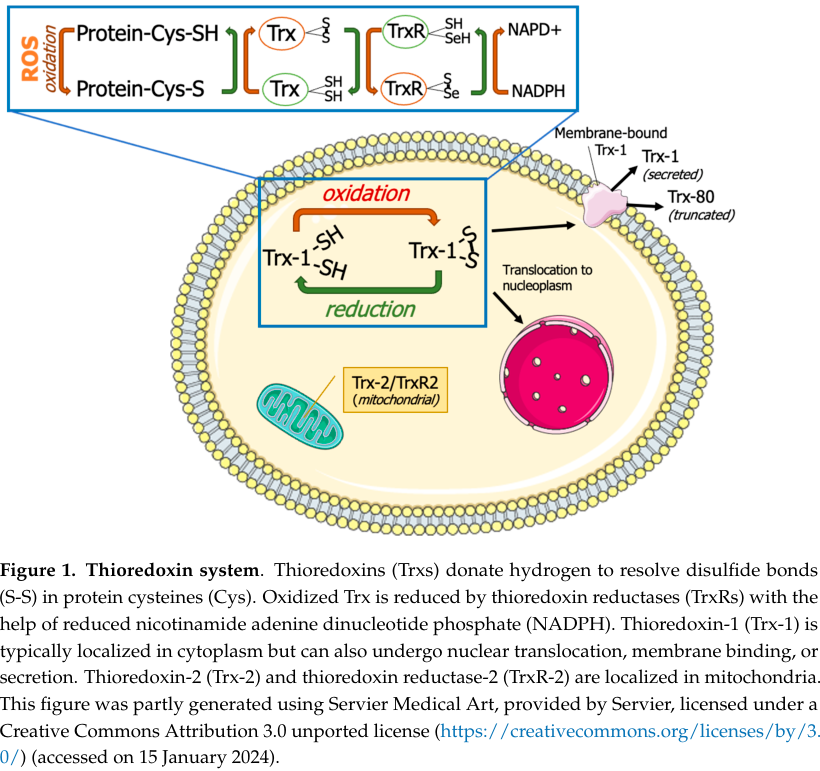

## Question

# Gene Research for Functional Annotation

## ⚠️ CRITICAL: Gene/Protein Identification Context

**BEFORE YOU BEGIN RESEARCH:** You MUST verify you are researching the CORRECT gene/protein. Gene symbols can be ambiguous, especially for less well-characterized genes from non-model organisms.

### Target Gene/Protein Identity (from UniProt):
- **UniProt Accession:** P10639
- **Protein Description:** RecName: Full=Thioredoxin; Short=Trx; AltName: Full=ATL-derived factor; Short=ADF;
- **Gene Information:** Name=Txn; Synonyms=Txn1;
- **Organism (full):** Mus musculus (Mouse).
- **Protein Family:** Belongs to the thioredoxin family. .
- **Key Domains:** Thioredoxin. (IPR005746); Thioredoxin-like_sf. (IPR036249); Thioredoxin_CS. (IPR017937); Thioredoxin_domain. (IPR013766); Thioredoxin (PF00085)

### MANDATORY VERIFICATION STEPS:

1. **Check if the gene symbol "Txn" matches the protein description above**
2. **Verify the organism is correct:** Mus musculus (Mouse).
3. **Check if protein family/domains align with what you find in literature**
4. **If you find literature for a DIFFERENT gene with the same or similar symbol, STOP**

### If Gene Symbol is Ambiguous or You Cannot Find Relevant Literature:

**DO NOT PROCEED WITH RESEARCH ON A DIFFERENT GENE.** Instead:
- State clearly: "The gene symbol 'Txn' is ambiguous or literature is limited for this specific protein"
- Explain what you found (e.g., "Found extensive literature on a different gene with the same symbol in a different organism")
- Describe the protein based ONLY on the UniProt information provided above
- Suggest that the protein function can be inferred from domain/family information

### Research Target:

Please provide a comprehensive research report on the gene **Txn** (gene ID: Txn1, UniProt: P10639) in mouse.

The research report should be a detailed narrative explaining the function, biological processes, and localization of the gene product. Citations should be given for all claims.

You should prioritize authoritative reviews and primary scientific literature when conducting research. You can supplement
this with annotations you find in gene/protein databases, but these can be outdated or inaccurate.

We are specifically interested in the primary function of the gene - for enzymes, what reaction is catalyzed, and what is the substrate specificity? For transporters, what is the substrate? For structural proteins or adapters, what is the broader structural role? For signaling molecules, what is the role in the pathway.

We are interested in where in or outside the cell the gene product carries out its function.

We are also interested in the signaling or biochemical pathways in which the gene functions. We are less interested in broad pleiotropic effects, except where these elucidate the precise role.

Include evidence where possible. We are interested in both experimental evidence as well as inference from structure, evolution, or bioinformatic analysis. Precise studies should be prioritized over high-throughput, where available.

## Output

Question: You are an expert researcher providing comprehensive, well-cited information.

Provide detailed information focusing on:
1. Key concepts and definitions with current understanding
2. Recent developments and latest research (prioritize 2023-2024 sources)
3. Current applications and real-world implementations
4. Expert opinions and analysis from authoritative sources
5. Relevant statistics and data from recent studies

Format as a comprehensive research report with proper citations. Include URLs and publication dates where available.
Always prioritize recent, authoritative sources and provide specific citations for all major claims.

# Gene Research for Functional Annotation

## ⚠️ CRITICAL: Gene/Protein Identification Context

**BEFORE YOU BEGIN RESEARCH:** You MUST verify you are researching the CORRECT gene/protein. Gene symbols can be ambiguous, especially for less well-characterized genes from non-model organisms.

### Target Gene/Protein Identity (from UniProt):
- **UniProt Accession:** P10639
- **Protein Description:** RecName: Full=Thioredoxin; Short=Trx; AltName: Full=ATL-derived factor; Short=ADF;
- **Gene Information:** Name=Txn; Synonyms=Txn1;
- **Organism (full):** Mus musculus (Mouse).
- **Protein Family:** Belongs to the thioredoxin family. .
- **Key Domains:** Thioredoxin. (IPR005746); Thioredoxin-like_sf. (IPR036249); Thioredoxin_CS. (IPR017937); Thioredoxin_domain. (IPR013766); Thioredoxin (PF00085)

### MANDATORY VERIFICATION STEPS:

1. **Check if the gene symbol "Txn" matches the protein description above**
2. **Verify the organism is correct:** Mus musculus (Mouse).
3. **Check if protein family/domains align with what you find in literature**
4. **If you find literature for a DIFFERENT gene with the same or similar symbol, STOP**

### If Gene Symbol is Ambiguous or You Cannot Find Relevant Literature:

**DO NOT PROCEED WITH RESEARCH ON A DIFFERENT GENE.** Instead:
- State clearly: "The gene symbol 'Txn' is ambiguous or literature is limited for this specific protein"
- Explain what you found (e.g., "Found extensive literature on a different gene with the same symbol in a different organism")
- Describe the protein based ONLY on the UniProt information provided above
- Suggest that the protein function can be inferred from domain/family information

### Research Target:

Please provide a comprehensive research report on the gene **Txn** (gene ID: Txn1, UniProt: P10639) in mouse.

The research report should be a detailed narrative explaining the function, biological processes, and localization of the gene product. Citations should be given for all claims.

You should prioritize authoritative reviews and primary scientific literature when conducting research. You can supplement
this with annotations you find in gene/protein databases, but these can be outdated or inaccurate.

We are specifically interested in the primary function of the gene - for enzymes, what reaction is catalyzed, and what is the substrate specificity? For transporters, what is the substrate? For structural proteins or adapters, what is the broader structural role? For signaling molecules, what is the role in the pathway.

We are interested in where in or outside the cell the gene product carries out its function.

We are also interested in the signaling or biochemical pathways in which the gene functions. We are less interested in broad pleiotropic effects, except where these elucidate the precise role.

Include evidence where possible. We are interested in both experimental evidence as well as inference from structure, evolution, or bioinformatic analysis. Precise studies should be prioritized over high-throughput, where available.

## Research report: Mouse **Txn1** / Thioredoxin-1 (Trx1) functional annotation (UniProt **P10639**)

### Scope and identity verification (critical disambiguation)
The target protein is **thioredoxin-1 (Trx1)** encoded by **Txn1** (often denoted TXN1/Trx1), the **cytosolic** thioredoxin isoform in mammals, and is distinct from **Txn2/Trx2**, the mitochondrial paralog. This mapping is explicitly stated in recent authoritative reviews discussing mammalian thioredoxin isoforms and mouse genetics (Dagdeviren et al., 2023; Shcholok & Eftekharpour, 2024) (dagdeviren2023physiologicalandpathophysiological pages 1-2, shcholok2024insightsintothe pages 1-2). The described catalytic Cys32/Cys35 active site and thioredoxin-family redox role align with the UniProt family/domain assignment in the prompt (dagdeviren2023physiologicalandpathophysiological pages 1-2, shcholok2024insightsintothe pages 1-2).

### 1) Key concepts and definitions (current understanding)

#### 1.1. What thioredoxin-1 is
Thioredoxin-1 is a conserved **thiol-disulfide oxidoreductase** that maintains proteins in the reduced state and participates in antioxidant defense and redox signaling (dagdeviren2023physiologicalandpathophysiological pages 1-2, shcholok2024insightsintothe pages 1-2). In mammals, thioredoxin exists as compartmentalized systems (cytosolic Trx1 vs mitochondrial Trx2), enabling redox control in different subcellular locales (dagdeviren2023physiologicalandpathophysiological pages 1-2, alokda2023evolutionarilyconservedrole pages 1-2).

#### 1.2. Primary biochemical function: catalytic reaction and mechanism
**Reaction class (what it catalyzes):** Trx1 catalyzes the **reduction of oxidized cysteine residues and protein disulfide bonds** in target proteins (i.e., converting a disulfide to two thiols), via its **Cys32/Cys35** catalytic pair (dagdeviren2023physiologicalandpathophysiological pages 1-2, shcholok2024insightsintothe pages 1-2). Mechanistically, Trx1 reduces oxidized protein cysteines by forming a **transient mixed disulfide intermediate**, followed by thiol–disulfide exchange (described as a fast “kiss-and-run” mechanism) that leaves the substrate reduced and Trx1 oxidized (shcholok2024insightsintothe pages 1-2, shcholok2024insightsintothe pages 2-4).

**Catalytic motif:** Reviews report the active-site CXXC motif around residues **Cys32 and Cys35**, with motif notation appearing as **Cys32–Gly–Pro–Cys35** (and minor notation variants in the literature) (shcholok2024insightsintothe pages 1-2, shcholok2024insightsintothe pages 2-4, alokda2023evolutionarilyconservedrole pages 1-2).

**Electron source / redox partner system:** Oxidized Trx1 is regenerated by **thioredoxin reductase (TrxR; cytosolic TXNRD1 in mammals)** using reducing equivalents ultimately derived from **NADPH**. Thus, the canonical electron flow is **NADPH → TrxR → Trx1 → substrate disulfide** (shcholok2024insightsintothe pages 1-2, shcholok2024insightsintothe pages 2-4, alokda2023evolutionarilyconservedrole pages 1-2). A schematic depiction of this system is shown in a 2024 review figure (shcholok2024insightsintothe media 8096d9a4).

**Substrate breadth / specificity:** The retrieved evidence emphasizes Trx1 as a broadly acting disulfide reductase rather than a narrow-specificity enzyme, donating electrons to multiple protein targets including antioxidant systems; it is also described as reducing oxidized **peroxiredoxins** (i.e., supporting peroxide detox/redox cycling indirectly through peroxiredoxin regeneration) (dagdeviren2023physiologicalandpathophysiological pages 1-2, shcholok2024insightsintothe pages 2-4). Precise kinetic constants (Km/kcat), redox potentials, or a complete substrate list were not present in the retrieved excerpts.

#### 1.3. Localization and trafficking
Trx1 is described as **mainly cytoplasmic**, but capable of **nuclear translocation** under oxidative/nitrosative stress; it can also associate with membranes and be **secreted via a leaderless secretory pathway**, with extracellular roles including signaling/chemotaxis (shcholok2024lessonsfromthe pages 3-5, shcholok2024insightsintothe pages 4-5, shcholok2024insightsintothe pages 16-17). These properties are relevant for interpreting phenotypes in inflammation, vascular biology, and tissue injury models.

### 2) Recent developments and latest research (prioritizing 2023–2024)

#### 2.1. 2023–2024 synthesis of Trx1 biology from mouse genetic models
A 2024 review focused on **murine knockout and tissue-specific models** highlights that constitutive global deletion of the thioredoxin system is incompatible with embryogenesis, motivating conditional knockouts to dissect organ-specific functions (Shcholok & Eftekharpour, 2024; Biology, published Mar 2024; https://doi.org/10.3390/biology13030180) (shcholok2024insightsintothe pages 1-2, shcholok2024insightsintothe pages 9-10). The same review presents a figure summarizing organ phenotypes across thioredoxin-system knockouts (shcholok2024insightsintothe media 22c625f5).

#### 2.2. 2023 mechanistic framing of thioredoxin/TXNIP regulation
A 2023 Antioxidants & Redox Signaling review clarifies key constraints on **TXNIP–thioredoxin interaction**, including the requirement that thioredoxin be in a **reduced** state for TXNIP binding, and reinforces compartmentalization into Txn1 (cytoplasmic) and Txn2 (mitochondrial) systems (Dagdeviren et al., published Feb 2023; https://doi.org/10.1089/ars.2022.0022) (dagdeviren2023physiologicalandpathophysiological pages 1-2). In the same review excerpt, thioredoxin is also noted as required for **NF-κB binding to DNA**, pointing to a mechanistic role in transcriptional redox regulation (dagdeviren2023physiologicalandpathophysiological pages 1-2).

#### 2.3. 2024 primary in vivo study: Trx1 regulates autophagy–lysosome pathway in MPTP Parkinsonism model
A 2024 primary study in **Cell Death Discovery** (published Feb 2024; https://doi.org/10.1038/s41420-024-01848-0) tested Trx1 gain- and loss-of-function in the **substantia nigra pars compacta** in a mouse MPTP model. MPTP was administered at **30 mg/kg i.p. once daily**, and Trx1 manipulation altered motor behavior, dopaminergic neuron integrity (TH), α-synuclein levels, and autophagy/lysosome pathway markers (gu2024thioredoxin1decreasesalphasynuclein pages 1-3, gu2024thioredoxin1decreasesalphasynuclein pages 3-5). This study provides a recent, direct example of Txn1/Trx1 functional impact in a mammalian disease-relevant context.

### 3) Pathways and mechanistic roles supported by evidence

#### 3.1. ASK1 redox signaling axis
Thioredoxin is described as binding and inhibiting **ASK1** under basal conditions; displacement or inactivation of thioredoxin (e.g., by TXNIP) promotes oxidative stress signaling and downstream outcomes (e.g., apoptosis/inflammasome-linked signaling) (alokda2023evolutionarilyconservedrole pages 2-4). Additional review evidence highlights ASK1-related regulatory roles of thioredoxin in apoptosis contexts (shcholok2024insightsintothe pages 16-17).

#### 3.2. NF-κB redox regulation
Thioredoxin is described as being **required for NF-κB binding to DNA**, consistent with a role in maintaining transcription factor cysteines in a reduced, DNA-binding competent state (dagdeviren2023physiologicalandpathophysiological pages 1-2).

#### 3.3. Antioxidant network integration (peroxiredoxins)
Reduced Trx donates electrons to **peroxiredoxins**, linking Txn1/Trx1 to peroxide detoxification and redox cycling (shcholok2024insightsintothe pages 2-4, alokda2023evolutionarilyconservedrole pages 1-2). Importantly, Trx1 is also noted to have low affinity for H2O2 itself, supporting the view that its antioxidant effect is largely via redox relay/partner proteins rather than acting as a direct peroxidase (shcholok2024insightsintothe pages 1-2).

### 4) Mouse genetics: functional necessity and organ-specific roles (with quantitative data)

#### 4.1. Essentiality in development
Mouse genetic loss of **Txn1** is described as causing **early embryonic lethality**; embryos show growth retardation around the **blastocyst stage (~E3.5)** and defects in trophoblast formation/hatching, indicating a nonredundant requirement for Trx1 during early development (dagdeviren2023physiologicalandpathophysiological pages 1-2, shcholok2024lessonsfromthe pages 7-8).

#### 4.2. Inducible global depletion: rapid systemic failure
In a tamoxifen-inducible global Trx1 depletion model, mice survived **up to 30 days post-injection** with **mean survival ~15 days**, accompanied by ~**30% wet-mass decrease** and ~**50% reduction in splenocyte count**, with increased apoptotic spleen cells (shcholok2024lessonsfromthe pages 8-10, shcholok2024lessonsfromthe pages 7-8). These data indicate Trx1 is not only developmentally essential but also required for adult tissue homeostasis.

#### 4.3. Cardiomyocyte-specific Trx1 loss: severe heart failure
Cardiomyocyte-specific Trx1 knockout (Trx1fl/fl × Myh6-Cre) caused dramatic cardiac pathology with **median survival 25.5 days**, ~**two-fold cardiomyocyte hypertrophy**, increased apoptosis and oxidative damage, and **nearly two-fold increase in caspase-3 levels** (shcholok2024insightsintothe pages 9-10, shcholok2024lessonsfromthe pages 8-10). A phenotype summary diagram is included in a 2024 review figure (shcholok2024insightsintothe media 22c625f5).

#### 4.4. Liver-specific suppression: viability with compensation
By contrast, liver-specific Trx1/TrxR1 suppression is reported as comparatively nonlethal, with ~**15% lethality**, enlarged livers due to hepatocyte proliferation, and compensatory **de novo glutathione synthesis**; however, hepatocytes were reported to be unable to efficiently reduce **GSSG**, indicating persistent alterations in redox capacity (shcholok2024insightsintothe pages 9-10, shcholok2024lessonsfromthe pages 8-10).

### 5) Current applications and real-world implementations

#### 5.1. Disease-model implementation: neuroprotection and proteostasis (Parkinsonism model)
The 2024 MPTP study demonstrates an implementation where Trx1 is experimentally modulated (overexpression vs knockdown) to test therapeutic-like hypotheses. Trx1 overexpression improved motor performance (rotarod/grip strength), preserved TH-positive neurons, and reduced α-synuclein accumulation; knockdown produced the opposite direction of effects (gu2024thioredoxin1decreasesalphasynuclein pages 1-3, gu2024thioredoxin1decreasesalphasynuclein pages 3-5). Mechanistically, Trx1 impacted autophagy–lysosome flux and related markers (LC3 II/I, p62, PINK1/Parkin, LAMP2, cathepsin D), supported by EM and tandem fluorescent LC3 assays in PC12 cells (gu2024thioredoxin1decreasesalphasynuclein pages 5-6, gu2024thioredoxin1decreasesalphasynuclein pages 3-5).

#### 5.2. Translational framing: thioredoxin system as a drug/therapy target
Reviews in 2023–2024 frame Trx1 as a redox regulator involved in inflammatory and oxidative-stress pathology, and discuss the thioredoxin system (including Trx1 and its reductase) as a potential therapeutic axis (shcholok2024insightsintothe pages 1-2). While many translational efforts focus on the system broadly (including TXNRD1 and TXNIP), the mouse genetic evidence (essentiality; organ-specific phenotypes) provides a practical boundary condition for therapeutic targeting: systemic suppression risks toxicity whereas context-/cell-specific modulation may be viable (shcholok2024insightsintothe pages 9-10, shcholok2024lessonsfromthe pages 8-10).

### 6) Expert opinions and analysis (authoritative synthesis)
A key perspective emphasized in 2024 synthesis of murine models is that identification of direct Trx1 targets remains technically challenging, meaning that **phenotypes from precise genetic models** (tissue-specific knockouts, inducible depletion) are especially important for assigning physiological roles to Trx1 in vivo (shcholok2024insightsintothe pages 1-2). This view aligns with the 2023 TXNIP-focused synthesis that stresses mechanistic specificity (e.g., TXNIP binds reduced thioredoxin; redox interaction is state-dependent), cautioning against overly broad “antioxidant” interpretations that ignore redox-state and compartmentalization (dagdeviren2023physiologicalandpathophysiological pages 1-2).

### 7) Key statistics and data highlights (from recent studies)
* Developmental requirement: Txn1 loss → embryonic phenotypes evident by blastocyst stage (~E3.5) and early lethality (shcholok2024lessonsfromthe pages 7-8).
* Inducible global depletion: survival up to 30 days; mean survival 15 days; ~30% wet-mass loss; ~50% splenocyte reduction (shcholok2024lessonsfromthe pages 8-10).
* Heart-specific KO: median survival 25.5 days; ~2× cardiomyocyte size; ~2× caspase-3 activation (shcholok2024insightsintothe pages 9-10).
* MPTP model dosing and statistics: MPTP 30 mg/kg i.p. daily; rotarod ANOVA effects include MPTP F(1,28)=45.86 (P<0.001) and genotype F(1,28)=73.57 (P<0.001); biochemical analyses often n=6 and behavior n=8 (gu2024thioredoxin1decreasesalphasynuclein pages 1-3, gu2024thioredoxin1decreasesalphasynuclein pages 3-5).

### Visual evidence (figures)
A schematic of the canonical thioredoxin electron-transfer system (NADPH→TrxR→Trx1→substrates) and a phenotype summary across knockout models are available from the 2024 review figures (shcholok2024insightsintothe media 8096d9a4, shcholok2024insightsintothe media 22c625f5).

### Summary table of evidence
The following table consolidates identity, mechanism, localization, pathways, and quantitative mouse phenotypes.

| Aspect | Key points | Evidence type/model | Quantitative/statistical details (if any) | Primary source (include DOI URL and year) |
|---|---|---|---|---|
| Identity / disambiguation | Mouse **Txn1** encodes **thioredoxin-1 (Trx1)**, the cytoplasmic thioredoxin isoform, distinct from mitochondrial **Txn2/Trx2**; member of the thioredoxin family with conserved catalytic Cys residues. (dagdeviren2023physiologicalandpathophysiological pages 1-2, shcholok2024insightsintothe pages 1-2) | Review synthesis of mammalian thioredoxin isoforms and mouse genetics | Txn1 loss in mice is essential for development; no alternate gene assignment indicated. (dagdeviren2023physiologicalandpathophysiological pages 1-2, shcholok2024lessonsfromthe pages 7-8) | Shcholok & Eftekharpour, *Biology* (2024), https://doi.org/10.3390/biology13030180; Dagdeviren et al., *Antioxid Redox Signal* (2023), https://doi.org/10.1089/ars.2022.0022 |
| Catalytic motif / mechanism | Active-site motif reported as **Cys32-Gly/Pro-Gly-Cys35** within the conserved thioredoxin CXXC center; Trx1 reduces oxidized protein cysteines/disulfides via transient mixed-disulfide formation and sequential electron transfer (“kiss-and-run” thiol-disulfide exchange). (shcholok2024insightsintothe pages 1-2, shcholok2024insightsintothe pages 2-4, alokda2023evolutionarilyconservedrole pages 1-2) | Mechanistic review drawing on structural/biochemical literature | Conserved catalytic cysteines at **C32/C35**; no kinetic constants provided in retrieved evidence. (dagdeviren2023physiologicalandpathophysiological pages 1-2, alokda2023evolutionarilyconservedrole pages 2-4) | Shcholok & Eftekharpour, *Biology* (2024), https://doi.org/10.3390/biology13030180; AlOkda & Van Raamsdonk, *Antioxidants* (2023), https://doi.org/10.3390/antiox12040944 |
| Electron donor system | Reduced Trx1 is regenerated by **thioredoxin reductase (TrxR/TXNRD1 in cytosol)** using electrons from **NADPH**; this is the core thioredoxin system transferring reducing equivalents to client proteins. (shcholok2024insightsintothe pages 1-2, shcholok2024insightsintothe pages 2-4, alokda2023evolutionarilyconservedrole pages 1-2, shcholok2024insightsintothe media 8096d9a4) | Reviews and schematic pathway summary | Flow of reducing equivalents: **NADPH → TrxR → Trx1 → substrate disulfides**. (shcholok2024insightsintothe media 8096d9a4) | Shcholok & Eftekharpour, *Biology* (2024), https://doi.org/10.3390/biology13030180; AlOkda & Van Raamsdonk, *Antioxidants* (2023), https://doi.org/10.3390/antiox12040944 |
| Major substrates / redox targets | Trx1 reduces **protein disulfides** broadly and donates electrons to **peroxiredoxins**; thioredoxin is also reported as required for **NF-κB DNA binding** and participates in the **ASK1/TXNIP** stress-signaling axis. (dagdeviren2023physiologicalandpathophysiological pages 1-2, shcholok2024insightsintothe pages 2-4, alokda2023evolutionarilyconservedrole pages 2-4, shcholok2024insightsintothe pages 5-6) | Review evidence plus pathway-focused synthesis | No enzyme-wide substrate specificity constants given; mechanistic breadth emphasized rather than narrow substrate selectivity. (dagdeviren2023physiologicalandpathophysiological pages 1-2, shcholok2024insightsintothe pages 5-6) | Dagdeviren et al., *Antioxid Redox Signal* (2023), https://doi.org/10.1089/ars.2022.0022; Shcholok & Eftekharpour, *Biology* (2024), https://doi.org/10.3390/biology13030180 |
| ASK1 / TXNIP axis | Thioredoxin binds and suppresses **ASK1** under basal conditions; **TXNIP** can bind reduced thioredoxin and displace/inactivate it, promoting oxidative-stress signaling, apoptosis, and inflammasome-linked responses. (shcholok2024insightsintothe pages 16-17, alokda2023evolutionarilyconservedrole pages 2-4) | Review of signaling mechanism | Directional pathway evidence; no mouse-wide effect size provided in retrieved excerpts. (shcholok2024insightsintothe pages 16-17, alokda2023evolutionarilyconservedrole pages 2-4) | Shcholok & Eftekharpour, *Biology* (2024), https://doi.org/10.3390/biology13030180; AlOkda & Van Raamsdonk, *Antioxidants* (2023), https://doi.org/10.3390/antiox12040944 |
| Localization | Trx1 is mainly **cytosolic**, can **translocate to the nucleus** under oxidative/nitrosative stress, can associate with membranes, and can be **secreted** through a leaderless pathway; secreted Trx1/Trx-80 participates in extracellular signaling/chemotaxis. (shcholok2024lessonsfromthe pages 3-5, shcholok2024insightsintothe pages 4-5, shcholok2024insightsintothe pages 16-17) | Review of cell biology and extracellular thioredoxin literature | Qualitative localization summary; no percentage-by-compartment reported in retrieved evidence. (shcholok2024lessonsfromthe pages 3-5, shcholok2024insightsintothe pages 4-5) | Shcholok & Eftekharpour, *Biology* (2024), https://doi.org/10.3390/biology13030180 |
| Whole-body constitutive loss | **Global Txn1 loss is embryonic lethal**; Trx1-null embryos show early growth retardation and trophoblast/hatching defects, indicating an indispensable developmental role. (shcholok2024insightsintothe pages 16-17, dagdeviren2023physiologicalandpathophysiological pages 1-2, shcholok2024lessonsfromthe pages 7-8) | Mouse knockout genetics | Embryonic defects evident by **blastocyst stage (~E3.5)**; TrxR1 nulls also die in early embryogenesis (**~E8.5–E10.5** depending on allele). (shcholok2024lessonsfromthe pages 7-8) | Shcholok & Eftekharpour, preprint (2024), https://doi.org/10.20944/preprints202401.1118.v1; Dagdeviren et al., *Antioxid Redox Signal* (2023), https://doi.org/10.1089/ars.2022.0022 |
| Tamoxifen-inducible global depletion | Inducible global Trx1 depletion in mice causes rapid systemic decline, weight loss, lymphoid depletion, and shortened survival, demonstrating continued postnatal requirement for Txn1. (shcholok2024lessonsfromthe pages 8-10, shcholok2024lessonsfromthe pages 7-8) | Tamoxifen-inducible global knockout/depletion mouse model | **Survival up to 30 days post-injection; mean survival 15 days; ~30% wet-mass loss; ~50% decrease in splenocyte count.** (shcholok2024lessonsfromthe pages 8-10, shcholok2024lessonsfromthe pages 7-8) | Shcholok & Eftekharpour, preprint (2024), https://doi.org/10.20944/preprints202401.1118.v1 |
| Heart-specific knockout phenotype | Cardiomyocyte-specific Trx1 loss causes severe dilated/hypertrophic cardiomyopathy, apoptosis, oxidative damage, and early death, supporting a key myocardial redox-homeostatic role. (shcholok2024lessonsfromthe pages 8-10, shcholok2024insightsintothe pages 9-10) | **Myh6-Cre; Trx1 flox/flox** mouse | **Median survival 25.5 days; cardiomyocytes ~2-fold larger; nearly 2-fold increase in caspase-3; increased TUNEL positivity; LV ejection fraction decreased** (direction reported, exact EF not given in excerpt). (shcholok2024lessonsfromthe pages 8-10, shcholok2024insightsintothe pages 9-10) | Shcholok & Eftekharpour, *Biology* (2024), https://doi.org/10.3390/biology13030180 |
| Liver-specific effects / compensation | Liver-specific Trx1/TrxR1 suppression is comparatively nonlethal because hepatocytes compensate via **de novo glutathione synthesis** and **Nrf2** activation, but redox handling remains altered. (shcholok2024lessonsfromthe pages 8-10, shcholok2024insightsintothe pages 9-10) | Liver-specific knockout/downregulation mouse models | **~15% lethality** reported; adult mice had **larger livers due to hepatocyte proliferation**; hepatocytes could synthesize GSH de novo but **could not reduce GSSG** efficiently; TrxR1 liver KO viable **>1 year**. (shcholok2024lessonsfromthe pages 8-10, shcholok2024insightsintothe pages 9-10) | Shcholok & Eftekharpour, *Biology* (2024), https://doi.org/10.3390/biology13030180 |
| Recent disease-model application (2024) | In an MPTP Parkinsonism mouse model, Trx1 overexpression improved motor behavior, preserved TH-positive neurons, lowered α-synuclein, and restored autophagy-lysosome flux; Trx1 knockdown had opposite effects. (gu2024thioredoxin1decreasesalphasynuclein pages 5-6, gu2024thioredoxin1decreasesalphasynuclein pages 1-3, gu2024thioredoxin1decreasesalphasynuclein pages 3-5) | Mouse SNpc viral overexpression/knockdown + **MPTP 30 mg/kg i.p. daily**; cell validation in PC12 | Behavioral statistics included **rotarod** ANOVA: MPTP **F(1,28)=45.86, P<0.001**; genotype **F(1,28)=73.57, P<0.001**; interaction **F(1,28)=8.050, P<0.05**; biochemical analyses often **n=6**, behavior **n=8**. (gu2024thioredoxin1decreasesalphasynuclein pages 1-3, gu2024thioredoxin1decreasesalphasynuclein pages 3-5) | Gu et al., *Cell Death Discovery* (2024), https://doi.org/10.1038/s41420-024-01848-0 |

*Table: This table summarizes the core biochemical function, localization, signaling roles, and mouse-model phenotypes of mouse Txn1/Trx1 using evidence retrieved from recent reviews and primary studies. It is useful as a compact evidence map linking mechanism to in vivo consequence.*

### Limitations of this evidence set
* The retrieved excerpts did not include quantitative biochemical constants (e.g., Km/kcat or midpoint potentials) for Trx1, nor a definitive experimentally measured substrate specificity spectrum in mouse.
* Some quantitative knockout/model details were obtained from a 2024 preprint (not peer reviewed) but are consistent with the peer-reviewed 2024 review’s narrative summary of severe phenotypes and essentiality (shcholok2024lessonsfromthe pages 8-10, shcholok2024insightsintothe pages 9-10).

References

1. (dagdeviren2023physiologicalandpathophysiological pages 1-2): Sezin Dagdeviren, Richard T. Lee, and Ning Wu. Physiological and pathophysiological roles of thioredoxin interacting protein: a perspective on redox inflammation and metabolism. Antioxidants &amp; Redox Signaling, 38:442-460, Feb 2023. URL: https://doi.org/10.1089/ars.2022.0022, doi:10.1089/ars.2022.0022. This article has 21 citations and is from a domain leading peer-reviewed journal.

2. (shcholok2024insightsintothe pages 1-2): Tetiana Shcholok and Eftekhar Eftekharpour. Insights into the multifaceted roles of thioredoxin-1 system: exploring knockout murine models. Biology, 13:180, Mar 2024. URL: https://doi.org/10.3390/biology13030180, doi:10.3390/biology13030180. This article has 14 citations.

3. (alokda2023evolutionarilyconservedrole pages 1-2): Abdelrahman AlOkda and Jeremy M. Van Raamsdonk. Evolutionarily conserved role of thioredoxin systems in determining longevity. Antioxidants, 12:944, Apr 2023. URL: https://doi.org/10.3390/antiox12040944, doi:10.3390/antiox12040944. This article has 30 citations.

4. (shcholok2024insightsintothe pages 2-4): Tetiana Shcholok and Eftekhar Eftekharpour. Insights into the multifaceted roles of thioredoxin-1 system: exploring knockout murine models. Biology, 13:180, Mar 2024. URL: https://doi.org/10.3390/biology13030180, doi:10.3390/biology13030180. This article has 14 citations.

5. (shcholok2024insightsintothe media 8096d9a4): Tetiana Shcholok and Eftekhar Eftekharpour. Insights into the multifaceted roles of thioredoxin-1 system: exploring knockout murine models. Biology, 13:180, Mar 2024. URL: https://doi.org/10.3390/biology13030180, doi:10.3390/biology13030180. This article has 14 citations.

6. (shcholok2024lessonsfromthe pages 3-5): Tetiana Shcholok and Eftekhar Eftekharpour. Lessons from the thioredoxin-1 knockout mouse models. Unknown journal, Jan 2024. URL: https://doi.org/10.20944/preprints202401.1118.v1, doi:10.20944/preprints202401.1118.v1.

7. (shcholok2024insightsintothe pages 4-5): Tetiana Shcholok and Eftekhar Eftekharpour. Insights into the multifaceted roles of thioredoxin-1 system: exploring knockout murine models. Biology, 13:180, Mar 2024. URL: https://doi.org/10.3390/biology13030180, doi:10.3390/biology13030180. This article has 14 citations.

8. (shcholok2024insightsintothe pages 16-17): Tetiana Shcholok and Eftekhar Eftekharpour. Insights into the multifaceted roles of thioredoxin-1 system: exploring knockout murine models. Biology, 13:180, Mar 2024. URL: https://doi.org/10.3390/biology13030180, doi:10.3390/biology13030180. This article has 14 citations.

9. (shcholok2024insightsintothe pages 9-10): Tetiana Shcholok and Eftekhar Eftekharpour. Insights into the multifaceted roles of thioredoxin-1 system: exploring knockout murine models. Biology, 13:180, Mar 2024. URL: https://doi.org/10.3390/biology13030180, doi:10.3390/biology13030180. This article has 14 citations.

10. (shcholok2024insightsintothe media 22c625f5): Tetiana Shcholok and Eftekhar Eftekharpour. Insights into the multifaceted roles of thioredoxin-1 system: exploring knockout murine models. Biology, 13:180, Mar 2024. URL: https://doi.org/10.3390/biology13030180, doi:10.3390/biology13030180. This article has 14 citations.

11. (gu2024thioredoxin1decreasesalphasynuclein pages 1-3): Rou Gu, Liping Bai, Fang Yan, Se Zhang, Xianwen Zhang, Ruhua Deng, Xiansi Zeng, Bo Sun, Xiaomei Hu, Ye Li, and Jie Bai. Thioredoxin-1 decreases alpha-synuclein induced by mptp through promoting autophagy-lysosome pathway. Cell Death Discovery, Feb 2024. URL: https://doi.org/10.1038/s41420-024-01848-0, doi:10.1038/s41420-024-01848-0. This article has 18 citations and is from a peer-reviewed journal.

12. (gu2024thioredoxin1decreasesalphasynuclein pages 3-5): Rou Gu, Liping Bai, Fang Yan, Se Zhang, Xianwen Zhang, Ruhua Deng, Xiansi Zeng, Bo Sun, Xiaomei Hu, Ye Li, and Jie Bai. Thioredoxin-1 decreases alpha-synuclein induced by mptp through promoting autophagy-lysosome pathway. Cell Death Discovery, Feb 2024. URL: https://doi.org/10.1038/s41420-024-01848-0, doi:10.1038/s41420-024-01848-0. This article has 18 citations and is from a peer-reviewed journal.

13. (alokda2023evolutionarilyconservedrole pages 2-4): Abdelrahman AlOkda and Jeremy M. Van Raamsdonk. Evolutionarily conserved role of thioredoxin systems in determining longevity. Antioxidants, 12:944, Apr 2023. URL: https://doi.org/10.3390/antiox12040944, doi:10.3390/antiox12040944. This article has 30 citations.

14. (shcholok2024lessonsfromthe pages 7-8): Tetiana Shcholok and Eftekhar Eftekharpour. Lessons from the thioredoxin-1 knockout mouse models. Unknown journal, Jan 2024. URL: https://doi.org/10.20944/preprints202401.1118.v1, doi:10.20944/preprints202401.1118.v1.

15. (shcholok2024lessonsfromthe pages 8-10): Tetiana Shcholok and Eftekhar Eftekharpour. Lessons from the thioredoxin-1 knockout mouse models. Unknown journal, Jan 2024. URL: https://doi.org/10.20944/preprints202401.1118.v1, doi:10.20944/preprints202401.1118.v1.

16. (gu2024thioredoxin1decreasesalphasynuclein pages 5-6): Rou Gu, Liping Bai, Fang Yan, Se Zhang, Xianwen Zhang, Ruhua Deng, Xiansi Zeng, Bo Sun, Xiaomei Hu, Ye Li, and Jie Bai. Thioredoxin-1 decreases alpha-synuclein induced by mptp through promoting autophagy-lysosome pathway. Cell Death Discovery, Feb 2024. URL: https://doi.org/10.1038/s41420-024-01848-0, doi:10.1038/s41420-024-01848-0. This article has 18 citations and is from a peer-reviewed journal.

17. (shcholok2024insightsintothe pages 5-6): Tetiana Shcholok and Eftekhar Eftekharpour. Insights into the multifaceted roles of thioredoxin-1 system: exploring knockout murine models. Biology, 13:180, Mar 2024. URL: https://doi.org/10.3390/biology13030180, doi:10.3390/biology13030180. This article has 14 citations.

## Artifacts

- [Edison artifact artifact-00](Txn1-deep-research-falcon_artifacts/artifact-00.md)

## Citations

1. dagdeviren2023physiologicalandpathophysiological pages 1-2
2. alokda2023evolutionarilyconservedrole pages 2-4
3. shcholok2024insightsintothe pages 16-17
4. shcholok2024insightsintothe pages 1-2
5. shcholok2024lessonsfromthe pages 7-8
6. shcholok2024lessonsfromthe pages 8-10
7. shcholok2024insightsintothe pages 9-10
8. alokda2023evolutionarilyconservedrole pages 1-2
9. shcholok2024insightsintothe pages 2-4
10. shcholok2024lessonsfromthe pages 3-5
11. shcholok2024insightsintothe pages 4-5
12. shcholok2024insightsintothe pages 5-6
13. https://doi.org/10.3390/biology13030180
14. https://doi.org/10.1089/ars.2022.0022
15. https://doi.org/10.1038/s41420-024-01848-0
16. https://doi.org/10.3390/biology13030180;
17. https://doi.org/10.3390/antiox12040944
18. https://doi.org/10.1089/ars.2022.0022;
19. https://doi.org/10.20944/preprints202401.1118.v1;
20. https://doi.org/10.20944/preprints202401.1118.v1
21. https://doi.org/10.1089/ars.2022.0022,
22. https://doi.org/10.3390/biology13030180,
23. https://doi.org/10.3390/antiox12040944,
24. https://doi.org/10.20944/preprints202401.1118.v1,
25. https://doi.org/10.1038/s41420-024-01848-0,