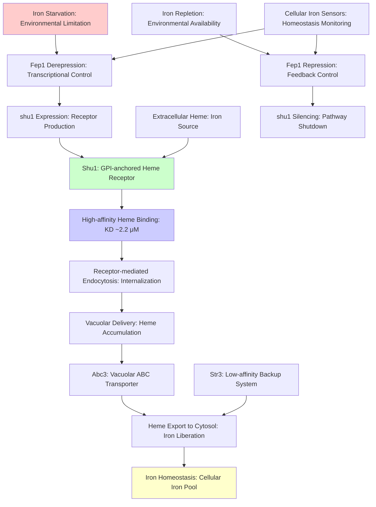

# Pathway Summary for Shu1

## Overview

Shu1 is a GPI-anchored cell surface heme receptor that enables high-affinity heme acquisition as an iron source during iron starvation in S. pombe. The protein binds hemin with micromolar affinity (KD ~2.2 μM) through a cysteine-rich partial CFEM-like motif and undergoes ligand-induced endocytosis to deliver heme to the vacuole for iron liberation [PMID:25733668, PMID:28193844]. This heme import pathway works in concert with the vacuolar ABC transporter Abc3 to complete a two-step heme assimilation process that provides an alternative iron source when cells cannot synthesize heme de novo or when environmental iron is limiting.

## High-Affinity Heme Acquisition Pathway

The primary pathway mediated by Shu1 involves the capture and internalization of extracellular heme sources. Under iron-limited conditions, Shu1 localizes to the plasma membrane where its extracellular domain, containing a partial CFEM-like motif (Cys72-Cys101), binds hemin with high affinity [PMID:25733668]. This binding event triggers receptor-mediated endocytosis, causing Shu1 to relocate from the plasma membrane to the vacuolar membrane. The heme-Shu1 complex is internalized through endocytic vesicles that ultimately deliver the heme cargo to the vacuole, where it becomes available for iron liberation.

## Two-Step Heme Assimilation System

Shu1 functions as the first component of a two-step heme assimilation system in S. pombe. Following Shu1-mediated heme uptake and delivery to the vacuole, the vacuolar ABC transporter Abc3 exports heme or iron from the vacuole to the cytosol, completing the heme utilization pathway [PMID:28193844]. This coordinated system ensures efficient heme iron utilization, with Shu1 handling the extracellular capture and internalization steps, while Abc3 manages the intracellular distribution. The two-step process allows for regulated heme iron homeostasis and prevents toxic heme accumulation.

## Iron-Regulated Expression Network

Shu1 expression is tightly integrated with cellular iron homeostasis pathways through the iron-responsive transcriptional network. Under iron starvation, shu1 expression is induced 18-30 fold through derepression by the GATA-type transcriptional repressor Fep1 [PMID:25733668]. Fep1 binds to three GATA elements in the shu1 promoter under iron-replete conditions, maintaining low expression. When iron becomes limiting, Fep1 releases from the promoter, allowing shu1 upregulation and enabling heme acquisition. This regulatory mechanism ensures that the energetically costly heme receptor system is only activated when needed.

## Dual Heme Transport System

Shu1 operates as the high-affinity component of a dual heme transport system, working alongside the low-affinity transporter Str3 [PMID:29549126]. This redundant system provides flexibility in heme acquisition, with Shu1 handling efficient capture under low heme conditions and Str3 providing backup transport capacity. The high-affinity Shu1 system is particularly important when extracellular heme concentrations are limiting, while Str3 can support growth when higher heme concentrations are available. This dual system architecture ensures robust heme acquisition across varied environmental conditions.

## Pathway Diagram

## Integration with Iron Homeostasis Pathways

The Shu1-mediated heme acquisition pathway is fully integrated with the broader iron homeostasis network in S. pombe. The pathway responds to the same iron-sensing mechanisms that control other iron acquisition systems, including siderophore uptake and iron transport. Shu1 provides an alternative iron source that becomes particularly important when de novo heme synthesis is impaired (such as in hem1Δ mutants) or when environmental iron availability is extremely limited. The pathway interfaces with cellular iron storage, utilization, and detoxification systems to maintain optimal iron levels.

## Cellular Significance and Stress Response

The heme acquisition pathway mediated by Shu1 represents a critical stress response mechanism that allows S. pombe to survive in iron-limited environments. This capability is particularly important in natural habitats where iron availability fluctuates and where the ability to scavenge iron from heme sources provides a competitive advantage. The high-affinity nature of Shu1-mediated heme binding allows cells to efficiently capture even trace amounts of extracellular heme, making it an effective survival strategy under iron stress conditions.

## Evolutionary and Ecological Context

The Shu1 heme acquisition system represents an evolutionary adaptation that allows S. pombe to exploit heme as an environmental iron source. This capability expands the ecological niche of the organism by enabling growth in environments where traditional iron sources are limiting but where heme-containing compounds may be available from other organisms or organic matter. The sophisticated regulation and high-affinity binding characteristics suggest that this pathway has been under strong selective pressure, highlighting its importance for survival in natural environments.