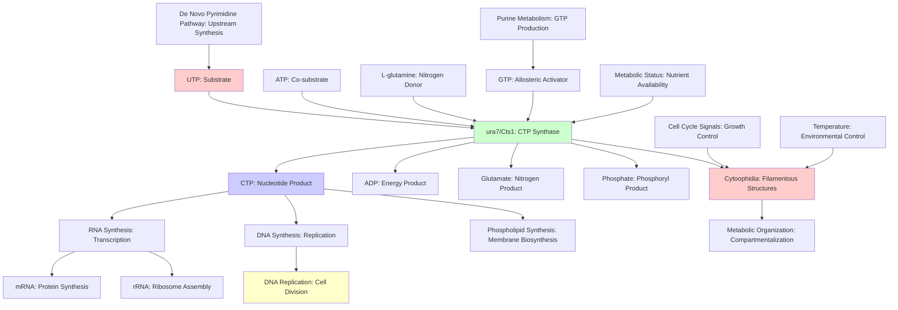

# Pathway Summary for ura7

## Overview

ura7 encodes CTP synthase (Cts1), an essential enzyme that catalyzes the ATP-dependent amination of UTP to CTP using glutamine as the nitrogen donor. This enzyme performs the final and rate-limiting step in de novo CTP biosynthesis, making it critical for nucleotide metabolism and cell viability [file:pombe/ura7/ura7-deep-research.md]. Beyond its metabolic function, CTP synthase exhibits remarkable structural dynamics, forming characteristic cytoophidium filamentous assemblies that are temperature-sensitive and cell cycle-regulated [PMID:31611173]. The enzyme integrates nucleotide biosynthesis with cellular organization through its unique ability to polymerize into dynamic subcellular structures.

## De Novo CTP Biosynthetic Pathway

The primary pathway mediated by ura7 is the terminal step of de novo CTP biosynthesis, where CTP synthase catalyzes the conversion of UTP to CTP through ATP-dependent amination using L-glutamine as the nitrogen donor. This reaction produces CTP, ADP, phosphate, and glutamate, representing the final step in pyrimidine ribonucleotide synthesis [file:pombe/ura7/ura7-deep-research.md]. As the sole CTP synthase in S. pombe, Cts1 is essential for cellular CTP production and cannot be complemented by other enzymes. The reaction is subject to allosteric regulation by GTP, which acts as an activator, providing metabolic control over CTP production based on cellular nucleotide status.

## Cytoophidium Formation and Dynamics

CTP synthase exhibits a unique property among metabolic enzymes: the ability to assemble into filamentous subcellular structures called cytoophidia. In S. pombe, Cts1 forms temperature-sensitive filaments that are highly abundant during exponential growth, present in more than 90% of cells [PMID:31611173]. Each cell typically contains two cytoophidia: a long, thick filament in the cytoplasm and a shorter, thinner filament associated with the nucleus. These structures are dynamic, showing cell cycle-dependent assembly and disassembly, and their formation appears to be regulated by metabolic status and environmental conditions.

## Nucleotide Pool Balance and Regulation

CTP synthase function is integrated with overall nucleotide metabolism and cellular growth control. The enzyme's activity directly influences the cellular CTP pool, which is essential for RNA synthesis, DNA replication, and phospholipid biosynthesis. The allosteric activation by GTP creates a regulatory mechanism that couples CTP production to overall purine nucleotide availability, ensuring balanced nucleotide pools. This regulation is critical for maintaining proper stoichiometry of nucleotides required for nucleic acid synthesis and preventing imbalances that could compromise cellular function.

## RNA and DNA Synthesis Pathways

The CTP produced by ura7 feeds directly into RNA and DNA synthesis pathways, making the enzyme essential for both transcription and replication processes. CTP is required for RNA polymerase II transcription, ribosomal RNA synthesis, and DNA replication as a substrate for DNA polymerases. The enzyme's essential nature reflects the absolute requirement for CTP in these fundamental cellular processes. Any disruption of CTP synthase activity immediately impacts cellular capacity for nucleic acid synthesis and cell proliferation.

## Pathway Diagram

## Integration with Cell Cycle Control

CTP synthase function and cytoophidium formation are integrated with cell cycle control mechanisms. The dynamic assembly and disassembly of cytoophidia during the cell cycle suggest that these structures may serve as metabolic organizing centers that coordinate nucleotide production with cellular growth and division requirements. The temperature sensitivity of cytoophidium formation may provide a mechanism for environmental regulation of nucleotide synthesis, allowing cells to adjust CTP production based on growth conditions.

## Metabolic Compartmentalization and Organization

The formation of cytoophidia represents a form of metabolic compartmentalization that may enhance the efficiency of CTP synthesis or provide spatial organization for nucleotide metabolism. These filamentous structures could serve as sites of concentrated enzymatic activity, facilitating substrate channeling and metabolic flux. The association of some cytoophidia with the nucleus suggests potential coupling between CTP production and nuclear processes such as DNA replication and RNA synthesis.

## Allosteric Regulation and Metabolic Sensing

The allosteric activation of CTP synthase by GTP provides an important regulatory mechanism that links CTP production to the overall nucleotide pool balance. This regulation ensures that CTP synthesis responds appropriately to cellular nucleotide demands and prevents overproduction when nucleotide pools are adequate. The enzyme may also be subject to additional regulatory mechanisms including post-translational modifications and protein-protein interactions that fine-tune its activity based on cellular conditions.

## Evolutionary Conservation and Structural Dynamics

CTP synthase is highly conserved across all domains of life, reflecting its essential role in nucleotide metabolism. However, the ability to form cytoophidia appears to be a specialized feature that has evolved in certain lineages, including S. pombe. This structural dynamic property may represent an evolutionary adaptation that provides additional regulatory control over nucleotide synthesis or metabolic organization. The conservation of cytoophidium formation across diverse organisms suggests it provides significant functional advantages.

## Clinical and Biotechnological Significance

Understanding CTP synthase function has important implications for both basic cell biology and potential therapeutic applications. The enzyme is a target for anticancer drugs that exploit the high nucleotide demands of rapidly proliferating cells. In S. pombe, the detailed characterization of CTP synthase function and regulation provides insights into nucleotide metabolism that could inform drug development and metabolic engineering approaches. The unique structural properties of cytoophidia also make CTP synthase an important model for studying metabolic enzyme organization and regulation.