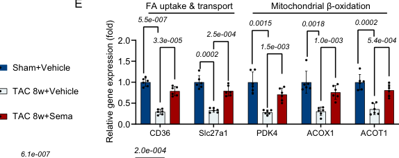

## Question

# Gene Research for Functional Annotation

## ⚠️ CRITICAL: Gene/Protein Identification Context

**BEFORE YOU BEGIN RESEARCH:** You MUST verify you are researching the CORRECT gene/protein. Gene symbols can be ambiguous, especially for less well-characterized genes from non-model organisms.

### Target Gene/Protein Identity (from UniProt):
- **UniProt Accession:** O88267
- **Protein Description:** RecName: Full=Acyl-coenzyme A thioesterase 1 {ECO:0000305|PubMed:7906114}; Short=Acyl-CoA thioesterase 1 {ECO:0000305|PubMed:7906114}; EC=3.1.2.- {ECO:0000269|PubMed:7906114}; AltName: Full=CTE-I; AltName: Full=Inducible cytosolic acyl-coenzyme A thioester hydrolase; AltName: Full=LACH2; Short=ACH2; AltName: Full=Long chain acyl-CoA thioester hydrolase; Short=Long chain acyl-CoA hydrolase; AltName: Full=Palmitoyl-coenzyme A thioesterase {ECO:0000305|PubMed:7906114}; EC=3.1.2.2 {ECO:0000269|PubMed:7906114};
- **Gene Information:** Name=Acot1; Synonyms=Cte1;
- **Organism (full):** Rattus norvegicus (Rat).
- **Protein Family:** Belongs to the C/M/P thioester hydrolase family.
- **Key Domains:** AB_hydrolase_fold. (IPR029058); Acyl-CoA_thioEstase_long-chain. (IPR016662); BAAT_C. (IPR014940); Thio_Ohase/aa_AcTrfase. (IPR006862); Thio_Ohase/BAAT_N. (IPR042490)

### MANDATORY VERIFICATION STEPS:

1. **Check if the gene symbol "Acot1" matches the protein description above**
2. **Verify the organism is correct:** Rattus norvegicus (Rat).
3. **Check if protein family/domains align with what you find in literature**
4. **If you find literature for a DIFFERENT gene with the same or similar symbol, STOP**

### If Gene Symbol is Ambiguous or You Cannot Find Relevant Literature:

**DO NOT PROCEED WITH RESEARCH ON A DIFFERENT GENE.** Instead:
- State clearly: "The gene symbol 'Acot1' is ambiguous or literature is limited for this specific protein"
- Explain what you found (e.g., "Found extensive literature on a different gene with the same symbol in a different organism")
- Describe the protein based ONLY on the UniProt information provided above
- Suggest that the protein function can be inferred from domain/family information

### Research Target:

Please provide a comprehensive research report on the gene **Acot1** (gene ID: Acot1, UniProt: O88267) in rat.

The research report should be a detailed narrative explaining the function, biological processes, and localization of the gene product. Citations should be given for all claims.

You should prioritize authoritative reviews and primary scientific literature when conducting research. You can supplement
this with annotations you find in gene/protein databases, but these can be outdated or inaccurate.

We are specifically interested in the primary function of the gene - for enzymes, what reaction is catalyzed, and what is the substrate specificity? For transporters, what is the substrate? For structural proteins or adapters, what is the broader structural role? For signaling molecules, what is the role in the pathway.

We are interested in where in or outside the cell the gene product carries out its function.

We are also interested in the signaling or biochemical pathways in which the gene functions. We are less interested in broad pleiotropic effects, except where these elucidate the precise role.

Include evidence where possible. We are interested in both experimental evidence as well as inference from structure, evolution, or bioinformatic analysis. Precise studies should be prioritized over high-throughput, where available.

## Output

Question: You are an expert researcher providing comprehensive, well-cited information.

Provide detailed information focusing on:
1. Key concepts and definitions with current understanding
2. Recent developments and latest research (prioritize 2023-2024 sources)
3. Current applications and real-world implementations
4. Expert opinions and analysis from authoritative sources
5. Relevant statistics and data from recent studies

Format as a comprehensive research report with proper citations. Include URLs and publication dates where available.
Always prioritize recent, authoritative sources and provide specific citations for all major claims.

# Gene Research for Functional Annotation

## ⚠️ CRITICAL: Gene/Protein Identification Context

**BEFORE YOU BEGIN RESEARCH:** You MUST verify you are researching the CORRECT gene/protein. Gene symbols can be ambiguous, especially for less well-characterized genes from non-model organisms.

### Target Gene/Protein Identity (from UniProt):
- **UniProt Accession:** O88267
- **Protein Description:** RecName: Full=Acyl-coenzyme A thioesterase 1 {ECO:0000305|PubMed:7906114}; Short=Acyl-CoA thioesterase 1 {ECO:0000305|PubMed:7906114}; EC=3.1.2.- {ECO:0000269|PubMed:7906114}; AltName: Full=CTE-I; AltName: Full=Inducible cytosolic acyl-coenzyme A thioester hydrolase; AltName: Full=LACH2; Short=ACH2; AltName: Full=Long chain acyl-CoA thioester hydrolase; Short=Long chain acyl-CoA hydrolase; AltName: Full=Palmitoyl-coenzyme A thioesterase {ECO:0000305|PubMed:7906114}; EC=3.1.2.2 {ECO:0000269|PubMed:7906114};
- **Gene Information:** Name=Acot1; Synonyms=Cte1;
- **Organism (full):** Rattus norvegicus (Rat).
- **Protein Family:** Belongs to the C/M/P thioester hydrolase family.
- **Key Domains:** AB_hydrolase_fold. (IPR029058); Acyl-CoA_thioEstase_long-chain. (IPR016662); BAAT_C. (IPR014940); Thio_Ohase/aa_AcTrfase. (IPR006862); Thio_Ohase/BAAT_N. (IPR042490)

### MANDATORY VERIFICATION STEPS:

1. **Check if the gene symbol "Acot1" matches the protein description above**
2. **Verify the organism is correct:** Rattus norvegicus (Rat).
3. **Check if protein family/domains align with what you find in literature**
4. **If you find literature for a DIFFERENT gene with the same or similar symbol, STOP**

### If Gene Symbol is Ambiguous or You Cannot Find Relevant Literature:

**DO NOT PROCEED WITH RESEARCH ON A DIFFERENT GENE.** Instead:
- State clearly: "The gene symbol 'Acot1' is ambiguous or literature is limited for this specific protein"
- Explain what you found (e.g., "Found extensive literature on a different gene with the same symbol in a different organism")
- Describe the protein based ONLY on the UniProt information provided above
- Suggest that the protein function can be inferred from domain/family information

### Research Target:

Please provide a comprehensive research report on the gene **Acot1** (gene ID: Acot1, UniProt: O88267) in rat.

The research report should be a detailed narrative explaining the function, biological processes, and localization of the gene product. Citations should be given for all claims.

You should prioritize authoritative reviews and primary scientific literature when conducting research. You can supplement
this with annotations you find in gene/protein databases, but these can be outdated or inaccurate.

We are specifically interested in the primary function of the gene - for enzymes, what reaction is catalyzed, and what is the substrate specificity? For transporters, what is the substrate? For structural proteins or adapters, what is the broader structural role? For signaling molecules, what is the role in the pathway.

We are interested in where in or outside the cell the gene product carries out its function.

We are also interested in the signaling or biochemical pathways in which the gene functions. We are less interested in broad pleiotropic effects, except where these elucidate the precise role.

Include evidence where possible. We are interested in both experimental evidence as well as inference from structure, evolution, or bioinformatic analysis. Precise studies should be prioritized over high-throughput, where available.

## Research report: Rat **Acot1** (UniProt **O88267**) — functional annotation and current understanding

### 0) Target verification (mandatory disambiguation)
The UniProt accession **O88267** corresponds to rat **Acot1** (historically **CTE-I**), a **type-I (α/β-hydrolase fold)** acyl-CoA thioesterase that is **cytosolic** and preferentially hydrolyzes **long-chain acyl-CoAs (C12–C20)**. This identity is consistent with revised mammalian ACOT nomenclature and with mechanistic studies describing Acot1 as a cytosolic, PPARα-inducible long-chain acyl-CoA thioesterase; importantly, it is distinct from **ACOT2** (mitochondrial) and the rodent peroxisomal cluster members (Acot3–6). (dongol2007theacylcoathioesterase pages 1-2, hunt2005arevisednomenclature pages 1-2, hunt2006analysisofthe pages 12-15, hunt2006analysisofthe pages 9-12)

| Evidence item (UniProt/alias/family/localization/substrate) | Key statement | Supporting sources (with citation IDs) | Notes on disambiguation from other ACOTs |
|---|---|---|---|
| UniProt / gene identity | The target is rat **Acot1** (UniProt **O88267**), the cytosolic acyl-CoA thioesterase historically referred to as **CTE-I**; later ACOT nomenclature standardizes this as **Acot1/ACOT1**. | (dongol2007theacylcoathioesterase pages 1-2, hunt2005arevisednomenclature pages 1-2) | Distinguish from other family members with similar names; the requested target is the rat cytosolic long-chain acyl-CoA thioesterase, not another ACOT paralog. |
| Aliases | Historical aliases linked to rat Acot1 include **CTE-I**, **LACH2**, and **ACH2**. | (hunt2005arevisednomenclature pages 1-2) | These aliases help avoid confusion with later ACOT numbering and with different species annotations. |
| Family / structural class | ACOT1 belongs to the **type I ACOTs**, which are **α/β-hydrolase-fold** acyl-CoA thioesterases that hydrolyze acyl-CoAs to free fatty acid plus CoA. | (tillander2017deactivatingfattyacids pages 1-3, bai2024progressofthe pages 2-3, bai2024progressofthe pages 1-2) | This separates Acot1 from **type II / hot-dog fold** ACOTs such as ACOT7/8/9/11/12/13. |
| Subcellular localization | ACOT1/Acot1 is **cytosolic**; it lacks the N-terminal mitochondrial targeting extension present in ACOT2. GFP/localization analyses and reviews consistently place ACOT1 in the cytosol. | (dongol2007theacylcoathioesterase pages 1-2, hunt2006analysisofthe pages 9-12, tillander2017deactivatingfattyacids pages 3-4, hunt2006analysisofthe pages 12-15) | This is the key distinction from **ACOT2**, which is **mitochondrial**, and from **ACOT3-6**, which are **peroxisomal** in mouse/rodent cluster analyses. |
| Enzymatic reaction | ACOT1 catalyzes **acyl-CoA + H2O → free fatty acid + CoA**. | (dongol2007theacylcoathioesterase pages 1-2, tillander2017deactivatingfattyacids pages 1-3, hunt2005arevisednomenclature pages 1-2, hunt2006analysisofthe pages 9-12) | This is the common ACOT-family reaction, but substrate range and localization distinguish Acot1 from other ACOTs. |
| Substrate specificity | ACOT1 is a **long-chain acyl-CoA thioesterase** with preference for **C12-C20** saturated and monounsaturated acyl-CoAs; no detectable activity is reported for acyl-CoAs of **C8 or shorter** in comparative ACOT1/2 studies. | (dongol2007theacylcoathioesterase pages 1-2, hunt2006analysisofthe pages 9-12, tillander2017deactivatingfattyacids pages 3-4, hunt2012theemergingrole pages 2-3) | This differentiates Acot1 from peroxisomal ACOTs with broader or different substrate profiles (for example ACOT4 acting on succinyl-CoA/glutaryl-CoA and some long-chain substrates). |
| Regulation by peroxisome proliferators / fibrates | Rat/rodent Acot1 activity or expression is strongly induced by **peroxisome proliferators** and **fibrates**, consistent with its historical description as an inducible liver thioesterase. | (dongol2007theacylcoathioesterase pages 1-2, tillander2017deactivatingfattyacids pages 1-3) | This inducibility is a hallmark feature of the target and supports matching to the rat liver CTE-I literature rather than unrelated ACOT paralogs. |
| Regulation by nuclear receptors | Acot1 is directly regulated by **PPARα** and **HNF4α** through a distal **DR1** promoter element; PPARα agonist **Wy-14,643** activates the promoter, and HNF4α also binds/controls expression. | (dongol2007theacylcoathioesterase pages 1-2, dongol2007theacylcoathioesterase pages 8-9) | This regulatory signature is specifically documented for Acot1 and helps distinguish it from paralogs with different organellar localization and control mechanisms. |
| Paralogs / family disambiguation | In rodent ACOT clusters, **Acot1** is the **cytosolic** member; **Acot2** is **mitochondrial**; **Acot3-6** are **peroxisomal**. | (franklin2017acylcoathioesterase1 pages 18-21, hunt2006analysisofthe pages 12-15, hunt2006analysisofthe pages 9-12) | Therefore, literature on mitochondrial ACOT2 or peroxisomal ACOT3-6 should not be substituted for rat Acot1 functional annotation. |

*Table: This table verifies that the requested target is rat Acot1/CTE-I (UniProt O88267) and summarizes the key identity features needed to avoid confusion with other ACOT paralogs. It is useful for confirming the correct localization, substrate class, regulatory context, and historical aliases before interpreting functional literature.*

### 1) Key concepts and definitions (current understanding)

#### 1.1 What ACOT enzymes do
Acyl-CoA thioesterases (ACOTs) catalyze hydrolysis of CoA thioesters (including fatty acyl-CoAs) to yield the corresponding **free acid (free fatty acid, FFA)** and **CoA-SH** (acyl-CoA + H2O → free acid + CoA). This reaction can regulate intracellular pools of fatty acyl-CoA, FFA, and CoA, thereby influencing lipid flux, signaling, and organellar metabolism. (tillander2017deactivatingfattyacids pages 1-3, hunt2005arevisednomenclature pages 1-2, bai2024progressofthe pages 1-2)

#### 1.2 ACOT family structure classes and why they matter
ACOTs are divided into **type I** and **type II** enzymes. The 2024 cancer-focused ACOT review reiterates that **type I** ACOTs are α/β-hydrolase fold proteins (including ACOT1) whereas **type II** ACOTs are hot-dog fold proteins; these two groups catalyze the same overall reaction but are structurally and evolutionarily distinct. (bai2024progressofthe pages 2-3, bai2024progressofthe pages 1-2)

### 2) Primary function of rat Acot1: reaction, substrates, kinetics, and localization

#### 2.1 Enzymatic reaction and substrate specificity
Acot1 (acyl-CoA thioesterase 1) is described as a **cytosolic enzyme that hydrolyzes long-chain acyl-CoA esters** to free fatty acid plus CoA, with chain-length preference **C12–C20**. (dongol2007theacylcoathioesterase pages 1-2, tillander2017deactivatingfattyacids pages 3-4)

Comparative mammalian cluster analyses further support that ACOT1/Acot1 functions as a **long-chain acyl-CoA thioesterase** with activity on long-chain saturated and monounsaturated acyl-CoAs (examples given include C16:1-CoA and C18:1-CoA), and with little/no activity reported on short-chain acyl-CoAs (≤C8) in those comparative biochemical characterizations. (hunt2006analysisofthe pages 9-12, hunt2012theemergingrole pages 2-3)

#### 2.2 Kinetic parameters (available evidence)
Direct rat kinetic constants for UniProt O88267 were not available in the retrieved full text; however, multiple authoritative analyses summarize type-I ACOTs (including ACOT1) as having **Km values mostly in the low micromolar range** for preferred substrates. (tillander2017deactivatingfattyacids pages 3-4, hunt2012theemergingrole pages 2-3, hunt2006analysisofthe pages 9-12)

#### 2.3 Subcellular localization
Acot1/ACOT1 is consistently described as **cytosolic** in comparative gene-cluster analyses and reviews. (hunt2006analysisofthe pages 9-12, tillander2017deactivatingfattyacids pages 3-4, hunt2006analysisofthe pages 12-15)

Mechanistic work in liver additionally supports a **dynamic subcellular distribution**: during fasting and **cAMP/PKA signaling**, a fraction of ACOT1 shows **partial nuclear localization**, consistent with a proposed role in local nuclear lipid-ligand supply for transcriptional regulation. (franklin2017acylcoathioesterase1 pages 1-6, franklin2017acylcoathioesterase1 pages 18-21, franklin2017acylcoathioesterase1 pages 10-14)

| Aspect | Evidence summary | Key model systems/conditions | Citations |
|---|---|---|---|
| Reaction | ACOT1/Acot1 is an acyl-CoA thioesterase that catalyzes hydrolysis of fatty acyl-CoA thioesters to the corresponding free fatty acid plus CoA (acyl-CoA + H2O → free fatty acid + CoA). | Family-level biochemical definition; rat/rodent Acot1 literature; ACOT nomenclature and comparative ACOT studies. | (dongol2007theacylcoathioesterase pages 1-2, tillander2017deactivatingfattyacids pages 1-3, hunt2005arevisednomenclature pages 1-2, hunt2006analysisofthe pages 9-12) |
| Substrates | ACOT1 is a long-chain acyl-CoA thioesterase with preference for C12-C20 saturated and monounsaturated acyl-CoAs; comparative studies reported no detectable activity toward acyl-CoAs of C8 or shorter. | Rat/rodent Acot1 descriptions; human/mouse ACOT1/2 comparative enzymology used to clarify orthologous substrate range. | (dongol2007theacylcoathioesterase pages 1-2, hunt2006analysisofthe pages 9-12, tillander2017deactivatingfattyacids pages 3-4, hunt2012theemergingrole pages 2-3) |
| Kinetics | Preferred long-chain acyl-CoA substrates are handled with Km values in the low micromolar range; reviews summarize type-I ACOTs as generally showing low-μM Km and low μmol/min/mg-range Vmax values. | Comparative ACOT1/2 enzymology and type-I ACOT reviews rather than rat-specific kinetic purification data. | (hunt2006analysisofthe pages 9-12, tillander2017deactivatingfattyacids pages 3-4, hunt2012theemergingrole pages 2-3) |
| Localization | ACOT1 is primarily cytosolic. During fasting and cAMP/PKA signaling, a fraction of ACOT1 shows partial nuclear localization, consistent with a role in locally regulating nuclear lipid-ligand supply. | Cytosolic localization from ACOT1/2 comparisons and GFP/localization work; fasting mouse liver and 8-Br-cAMP/PKA signaling experiments in hepatocytes. | (hunt2006analysisofthe pages 9-12, tillander2017deactivatingfattyacids pages 3-4, franklin2017acylcoathioesterase1 pages 1-6, franklin2017acylcoathioesterase1 pages 18-21, franklin2017acylcoathioesterase1 pages 10-14, hunt2006analysisofthe pages 12-15) |
| Regulation | Acot1 is strongly inducible by peroxisome proliferators, fibrates, and PPARα agonists. Dongol et al. identified a distal DR1 response element in the promoter bound by PPARα/RXRα and HNF4α; Wy-14,643 activates the promoter, and liver Acot1 mRNA increased markedly with PPARα activation. | Rodent liver; promoter mapping, ChIP, EMSA, reporter assays; Wy-14,643 treatment; HNF4α-null and PPARα-null models. | (dongol2007theacylcoathioesterase pages 1-2, tillander2017deactivatingfattyacids pages 1-3, tillander2017deactivatingfattyacids pages 3-4, dongol2007theacylcoathioesterase pages 8-9) |
| Physiological role in liver | ACOT1 restrains fatty-acid oxidative flux by hydrolyzing cytosolic acyl-CoAs, while also supporting oxidative capacity through PPARα ligand generation. Hepatic Acot1 knockdown reduced liver TG, increased TG hydrolase activity, increased FA oxidation and β-hydroxybutyrate, but lowered PPARα/PGC1α target-gene expression and promoted oxidative stress/inflammation; catalytically active ACOT1 overexpression had opposite effects. | Mouse fasting liver; adenoviral shRNA knockdown or overexpression; radiotracer TG turnover/FA oxidation assays; rescue with Wy-14643; cAMP/PKA stimulation. | (franklin2017acylcoathioesterase1 pages 21-24, franklin2017acylcoathioesterase1 pages 14-18, franklin2017acylcoathioesterase1 pages 1-6, franklin2017acylcoathioesterase1 pages 18-21, franklin2017acylcoathioesterase1 pages 10-14) |
| Physiological role in heart | Cardiac studies support a protective role for ACOT1 under metabolic/inflammatory stress. In diabetic heart, ACOT1 overexpression reduced oxidative stress and improved cardiac dysfunction via effects on PPARα/PGC1α signaling; in sepsis models, cardiomyocyte-specific ACOT1 attenuated dysfunction/mortality and modulated cardiac lipid metabolism and PPARα/PGC1α-associated programs. | db/db diabetic mouse heart and H9c2 cells; cardiomyocyte-specific transgenic mice challenged with LPS; cardiac functional, lipid, and signaling readouts. | (xia2015cardiomyocytespecificexpression pages 21-26, yang2012protectiveeffectsof pages 3-5, tillander2017deactivatingfattyacids pages 3-4) |
| Mechanistic interpretation | Current evidence supports ACOT1 as a metabolic “buffer” that couples cytosolic fatty-acyl-CoA hydrolysis to CoA recycling, control of long-chain acyl-CoA pools, and nuclear receptor signaling (especially PPARα, with HNF4α promoter input). This balances lipid flux against oxidative capacity during fasting or metabolic stress. | Integrative interpretation from mechanistic liver studies, promoter regulation studies, and domain/family reviews. | (dongol2007theacylcoathioesterase pages 1-2, tillander2017deactivatingfattyacids pages 3-4, franklin2017acylcoathioesterase1 pages 14-18, franklin2017acylcoathioesterase1 pages 1-6, dongol2007theacylcoathioesterase pages 8-9) |

*Table: This table summarizes the experimentally supported core functional annotation of Acot1/ACOT1, including its enzymatic reaction, substrate range, localization, regulation, and physiological roles in liver and heart. It is useful for distinguishing the rat cytosolic long-chain thioesterase from other ACOT paralogs and for grounding functional annotation in primary evidence.*

### 3) Pathways and regulation: PPARα/HNF4α axis and metabolic-state responsiveness

#### 3.1 Transcriptional regulation by PPARα and HNF4α
A key mechanistic study mapped a distal **DR1** response element in the Acot1 promoter that binds **PPARα/RXRα** and **HNF4α**, demonstrating direct transcriptional regulation by both nuclear receptors. (dongol2007theacylcoathioesterase pages 1-2, dongol2007theacylcoathioesterase pages 8-9)

Quantitatively, Acot1 mRNA was reported to increase ~**90-fold** in liver upon treatment with the PPARα agonist **Wy-14,643**, and ~**15-fold** in liver of **HNF4α knockout** animals in the same regulatory context, supporting strong nuclear-receptor control of expression. (dongol2007theacylcoathioesterase pages 1-2, dongol2007theacylcoathioesterase pages 8-9)

#### 3.2 Inducibility by peroxisome proliferators/fibrates
Acot1 is described as strongly upregulated in rodents by **fibrates** and other **peroxisome proliferators**, consistent with PPARα-dependent inducibility. (dongol2007theacylcoathioesterase pages 1-2, tillander2017deactivatingfattyacids pages 1-3)

### 4) Biological roles supported by experimental evidence

#### 4.1 Liver: coupling fatty-acid flux with oxidative capacity during fasting
A mechanistic liver study (mouse model) supports a specific functional model for ACOT1: ACOT1 hydrolyzes cytosolic long-chain acyl-CoAs (limiting oxidative flux) while also promoting **PPARα activity** by generating fatty-acid ligands—particularly under fasting/cAMP signaling, when ACOT1 can localize to the nucleus. (franklin2017acylcoathioesterase1 pages 14-18, franklin2017acylcoathioesterase1 pages 1-6, franklin2017acylcoathioesterase1 pages 10-14)

Experimentally, hepatic Acot1 knockdown (1 week; fasted) reduced Acot1 mRNA/protein by ~**60%**, reduced hepatic triglycerides, increased triglyceride hydrolysis and fatty-acid oxidation (including increased serum β-hydroxybutyrate), but reduced PPARα/PGC1α target gene expression and increased oxidative stress/inflammation; these effects were largely rescued by the synthetic PPARα ligand **Wy-14643**, supporting a PPARα-mediated mechanism. (franklin2017acylcoathioesterase1 pages 14-18, franklin2017acylcoathioesterase1 pages 1-6, franklin2017acylcoathioesterase1 pages 10-14)

#### 4.2 Heart: protective roles in metabolic and inflammatory stress (evidence across models)
In diabetic cardiomyopathy models, ACOT1 was identified as strongly induced in diabetic myocardium (~**11–12-fold** in db/db hearts by microarray, with confirmation reported), and gain-/loss-of-function experiments supported cardioprotective effects mediated through metabolic remodeling and PPARα/PGC1α signaling. (yang2012protectiveeffectsof pages 3-5)

In an LPS-induced sepsis model, cardiomyocyte-specific ACOT1 expression attenuated cardiac dysfunction and mortality, with measured changes in cardiac lipid metabolism and PPARα/PGC-1α signaling readouts (mouse and H9C2 cell experiments). (xia2015cardiomyocytespecificexpression pages 21-26)

### 5) Recent developments (prioritizing 2023–2024)

#### 5.1 2024: ACOT1 in cancer-related lipid metabolic reprogramming
A 2024 review on ACOTs in cancer highlights ACOT1 as frequently studied in gastric cancer and reports ACOT1 upregulation in gastric adenocarcinoma with association to adverse clinicopathologic parameters and poor prognosis, citing a **280-case tissue microarray** dataset. This positions ACOT1 as a candidate biomarker/target within tumor lipid-metabolism reprogramming frameworks, although the mechanism for ACOT1 in gastric cancer is explicitly noted as unclear in the review context. (bai2024progressofthe pages 4-5, bai2024progressofthe pages 2-3)

#### 5.2 2024: ACOT1 as part of cardiac metabolic phenotyping in vivo
A 2024 Nature Communications study of semaglutide in pressure-overload heart failure (TAC) included **Acot1 mRNA** in a targeted panel of fatty-acid uptake/oxidation genes (n=6), demonstrating its continued use as a readout in contemporary cardiac metabolism interventions. The relevant gene-expression panel is shown in Figure 4E. (ma2024semaglutideamelioratescardiac pages 8-9, ma2024semaglutideamelioratescardiac media 03af76ca)

#### 5.3 2023: ACOT1 in metabolic disease frameworks (review-level evidence)
A 2023 review on acyl-CoA oxidation notes that ACOT1 knockout partially protects mice from high-fat-diet–related phenotypes, supporting ongoing interest in ACOT1’s role in metabolic disease susceptibility and fatty-acid oxidation control. (tillander2017deactivatingfattyacids pages 3-4)

| Year | Study (first author, journal) | System | ACOT1-related finding | Type of evidence | Quantitative/statistical notes | URL (if available from citations) |
|---|---|---|---|---|---|---|
| 2024 | Bai, *Frontiers in Oncology* | Review of ACOT family in cancer; includes gastric adenocarcinoma data | ACOT1 is reported as upregulated in gastric adenocarcinoma and associated with adverse clinicopathologic parameters and poor prognosis; the review also places ACOT1 within the type-I ACOT, α/β-hydrolase family relevant to lipid-metabolic reprogramming in cancer (bai2024progressofthe pages 4-5, bai2024progressofthe pages 2-3, bai2024progressofthe pages 1-2) | Narrative review summarizing prior human tumor studies | Explicitly cites a **280-case** gastric adenocarcinoma tissue microarray association for ACOT1; mechanistic basis remains unclear in the cited review context (bai2024progressofthe pages 4-5) | https://doi.org/10.3389/fonc.2024.1374094 |
| 2023 | Szrok-Jurga, *International Journal of Molecular Sciences* | Review of acyl-CoA oxidation in physiology/pathology | The review notes that **ACOT1 knockout partially protects mice from high-fat-diet–related phenotypes**, supporting the idea that ACOT1 modulates fatty-acid oxidation/lipid handling and can influence metabolic disease outcomes (tillander2017deactivatingfattyacids pages 3-4) | Review/commentary citing prior mouse studies | No primary numeric effect size provided in the extracted evidence; presented as a qualitative review conclusion (tillander2017deactivatingfattyacids pages 3-4) | https://doi.org/10.3390/ijms241914857 |
| 2024 | Ma, *Nature Communications* | Mouse pressure-overload heart failure model (TAC 8w) with semaglutide treatment | ACOT1 was included in a myocardial fatty-acid metabolism gene-expression panel; Figure 4E shows **Acot1 mRNA** measured across Sham+Vehicle, TAC+Vehicle, and TAC+Semaglutide groups, indicating ACOT1 remains part of current cardiac metabolic phenotyping in vivo (ma2024semaglutideamelioratescardiac pages 8-9, ma2024semaglutideamelioratescardiac media 03af76ca) | Direct experimental mRNA expression measurement in a 2024 primary study | **n = 6** for the Figure 4E mRNA panel; one-way ANOVA/post hoc testing reported for group comparisons; extracted evidence does not provide the exact fold-change value for Acot1 (ma2024semaglutideamelioratescardiac pages 8-9, ma2024semaglutideamelioratescardiac media 03af76ca) | https://doi.org/10.1038/s41467-024-48970-2 |
| 2024 | Yuan, *Heliyon* | Hepatocyte/liver metabolism study focused on ACOT4, with ACOT family context | Although centered on ACOT4, the paper explicitly uses ACOT-family biology to frame ACOT1 as a **fasting-liver regulator that balances fatty-acid oxidation flux and oxidative capacity**, showing continued relevance of the ACOT1 fasting model in 2024 metabolic literature (yuan2024knockdownofacot4 pages 1-2) | Primary study with background synthesis referencing prior ACOT1 work | Provides contextual metabolic benchmarks: NAFLD defined as **>5% liver fat**; mice on **45% HFD**, **16-week** feeding, **48 h fasting**, age **6–8 weeks** in the ACOT4 study context (yuan2024knockdownofacot4 pages 1-2) | https://doi.org/10.1016/j.heliyon.2024.e27618 |
| 2023 | Wang, *eLife* | Hepatic energy-stress biology in mice/humans (diabetes/starvation context) | The study identifies ACOT8/12 as direct acetyl-CoA-to-acetate enzymes under energy stress, and reports that database analysis found **Acot1/2/8/12 expression changes**, placing Acot1 within a broader hepatic thioesterase response program during starvation/diabetes (yuan2024knockdownofacot4 pages 1-2) | Primary study with transcriptomic/database context | Extracted evidence does not provide a numeric Acot1 fold-change; emphasis is that Acot1 was among ACOT genes whose expression changed under energy stress (yuan2024knockdownofacot4 pages 1-2) | https://doi.org/10.7554/eLife.87419 |
| 2023 | Kikuchi, *Nature Communications* | Mouse unilateral nephrectomy multi-omics model of renal compensatory hypertrophy | Not an ACOT1 paper per se, but highly relevant for pathway interpretation: it identifies **PPARα as an important determinant of proximal-tubule cell size** and a mediator of renal hypertrophy, reinforcing the centrality of the PPARα axis through which ACOT1 is known to function/regulate lipid signaling (yuan2024knockdownofacot4 pages 1-2) | Primary multi-omics study; pathway context | No ACOT1-specific quantitative result in the extracted evidence; included as authoritative 2023 pathway context for interpreting ACOT1 biology (yuan2024knockdownofacot4 pages 1-2) | https://doi.org/10.1038/s41467-023-38958-9 |

*Table: This table summarizes 2023–2024 studies and reviews that directly measured ACOT1 or placed it in current disease and pathway contexts. It is useful for separating direct ACOT1 evidence from broader, but still relevant, PPARα- and ACOT-family findings.*

### 6) Current applications and real-world implementations

1. **Mechanism-guided pathway targeting (PPARα axis):** In mechanistic liver work, the PPARα agonist **Wy-14643** rescues oxidative stress and inflammatory phenotypes induced by Acot1 knockdown, illustrating a concrete example of how ACOT1 biology can inform pharmacologic interventions along the PPARα pathway (preclinical implementation). (franklin2017acylcoathioesterase1 pages 14-18, franklin2017acylcoathioesterase1 pages 1-6)

2. **Candidate prognostic biomarker in oncology:** The 2024 cancer review summarizes clinical-association evidence linking ACOT1 expression to gastric adenocarcinoma prognosis (280-case tissue microarray), indicating potential biomarker utility; however, this is at the association stage and not yet a validated clinical test in the provided evidence. (bai2024progressofthe pages 4-5)

3. **Preclinical metabolism readout in cardiovascular drug studies:** ACOT1/Acot1 appears in contemporary (2024) experimental gene panels used to quantify shifts in myocardial energy substrate utilization under therapeutics (semaglutide in TAC model). (ma2024semaglutideamelioratescardiac pages 8-9, ma2024semaglutideamelioratescardiac media 03af76ca)

### 7) Expert opinions / authoritative synthesis (interpretive analysis tied to sources)
A consistent expert-level synthesis across mechanistic and review literature is that ACOT1 acts as a regulator of lipid homeostasis by modulating the balance between activated fatty acyl-CoAs and free fatty acids, and by influencing nuclear receptor signaling (especially PPARα; and HNF4α at the promoter). This provides a mechanistic basis for how a “hydrolysis” enzyme can have systemic effects: ACOT1 can tune both **metabolic flux** (availability of acyl-CoA for β-oxidation and esterification) and **transcriptional capacity** (generation of lipid ligands for nuclear receptors), particularly during fasting and other lipid-mobilizing states. (franklin2017acylcoathioesterase1 pages 14-18, franklin2017acylcoathioesterase1 pages 1-6, dongol2007theacylcoathioesterase pages 8-9, tillander2017deactivatingfattyacids pages 3-4)

### 8) Key quantitative/statistical takeaways (from recent and foundational studies)

| Measurement | Value | Context/condition | Species/tissue | Source |
|---|---:|---|---|---|
| Acot1 mRNA induction by PPARα agonist Wy-14,643 | ~90-fold increase | Wy-14,643 treatment; direct promoter/regulatory study of Acot1 | Mouse liver | (dongol2007theacylcoathioesterase pages 1-2) |
| Acot1 mRNA change in HNF4α-null background | ~15-fold increase | HNF4α knockout; supports regulation through distal DR1 element also bound by HNF4α | Mouse liver | (dongol2007theacylcoathioesterase pages 8-9) |
| Acot1 knockdown efficiency | ~60% reduction in mRNA and protein | Adenovirus-mediated Acot1 knockdown, 16 h fasting | Mouse liver | (franklin2017acylcoathioesterase1 pages 10-14) |
| Cardiac ACOT1 induction in diabetes | ~11–12-fold upregulation | db/db diabetic model; microarray-confirmed increase in ACOT1 | Mouse heart/myocardium | (yang2012protectiveeffectsof pages 3-5) |
| ACOT1/ACOT2 substrate range | C12–C20 acyl-CoAs; no detectable activity for C8 or shorter | Comparative biochemical characterization of long-chain thioesterases | Human ACOT1/ACOT2; used as ortholog context for mammalian ACOT1 | (hunt2006analysisofthe pages 9-12) |
| ACOT1/ACOT2 kinetic range | Km in low μM range | Preferred long-chain acyl-CoA substrates | Human ACOT1/ACOT2; ortholog context | (hunt2006analysisofthe pages 9-12, hunt2012theemergingrole pages 2-3) |
| Type I ACOT kinetic range | Km mostly low μM; Vmax in low μmol/min/mg range | Review summary for type I ACOT family, including ACOT1 | Mammalian type I ACOTs | (tillander2017deactivatingfattyacids pages 3-4) |
| ACOT4 kinetic parameter (comparison within same cluster) | Km ~14 μM; Vmax ~581 nmol/min/mg | Succinyl-CoA substrate | Human ACOT4 | (hunt2006analysisofthe pages 9-12) |
| ACOT4 kinetic parameter (comparison within same cluster) | Km 147 μM; Vmax 132 nmol/min/mg | Glutaryl-CoA substrate | Human ACOT4 | (hunt2006analysisofthe pages 9-12) |
| ACOT4 kinetic parameter (comparison within same cluster) | Km 3.4 μM; Vmax 137 nmol/min/mg | C14-CoA substrate | Human ACOT4 | (hunt2006analysisofthe pages 9-12) |
| Semaglutide/TAC study sample size for Acot1 mRNA panel | n = 6 | Figure 4E measured ACOT1 mRNA with CD36, Slc27a1, PDK4, ACOX1 across Sham+Vehicle, TAC+Vehicle, TAC+Sema groups | Mouse heart | (ma2024semaglutideamelioratescardiac pages 8-9, ma2024semaglutideamelioratescardiac media 03af76ca) |
| Xia 2015 cellular assay sample size | n = 5 per group | H9C2 assays in LPS/sepsis context | Rat cardiomyocyte-like H9C2 cells | (xia2015cardiomyocytespecificexpression pages 21-26) |
| Xia 2015 mouse assay sample size | n = 6–8 per group | Mouse lipid/signaling and cardiac phenotype measurements in LPS model | Mouse heart/plasma | (xia2015cardiomyocytespecificexpression pages 21-26) |
| HNF4α ChIP amplicon size at Acot1 DR1 region | 157 bp | DR1-containing amplicon recovered in promoter-binding experiments | Mouse liver regulatory assay | (dongol2007theacylcoathioesterase pages 8-9) |
| Negative-control amplicon size in HNF4α ChIP study | 141 bp | Non-DR1 control region in promoter-binding experiments | Mouse liver regulatory assay | (dongol2007theacylcoathioesterase pages 8-9) |
| HNF4α EMSA protein input | 1 μg | In vitro translated HNF4α used for binding to Acot1 DR1 | In vitro DNA-binding assay | (dongol2007theacylcoathioesterase pages 8-9) |
| Cold-competitor excess in EMSA | 50-fold | Competition condition validating DR1-specific binding | In vitro DNA-binding assay | (dongol2007theacylcoathioesterase pages 8-9) |

*Table: This table compiles the main numeric findings relevant to Acot1/ACOT1 function, regulation, and experimental context, including fold-changes, kinetic values, and sample sizes. It is useful as a quick-reference summary of the strongest quantitative evidence supporting functional annotation.*

Selected highlights include: ~90-fold liver induction by Wy-14,643, ~15-fold increase in HNF4α-null liver, ~60% knockdown efficiency in hepatic shRNA experiments, and ~11–12-fold induction in db/db myocardium; and recent study-level statistics such as the **280-case** gastric adenocarcinoma tissue microarray association and **n=6** sample size for the 2024 TAC/semaglutide Acot1 mRNA panel. (dongol2007theacylcoathioesterase pages 1-2, dongol2007theacylcoathioesterase pages 8-9, yang2012protectiveeffectsof pages 3-5, franklin2017acylcoathioesterase1 pages 10-14, bai2024progressofthe pages 4-5, ma2024semaglutideamelioratescardiac pages 8-9, ma2024semaglutideamelioratescardiac media 03af76ca)

### 9) Limitations specific to rat (Rattus norvegicus) functional annotation
Although the target protein is rat Acot1 (UniProt O88267), much of the detailed mechanistic functional evidence in the retrieved full-text set comes from mouse genetic and hepatic physiology studies (fasting, adeno-shRNA). These are highly informative for mammalian Acot1 function but should be translated to rat with the usual orthology caveats; rat-specific inducibility and historical characterization are nonetheless supported by rodent literature describing rat cloning and peroxisome proliferator inducibility of the Acot1/CTE-I lineage. (dongol2007theacylcoathioesterase pages 1-2, tillander2017deactivatingfattyacids pages 1-3, hunt2005arevisednomenclature pages 1-2)

---

## Key source URLs and publication dates (where available in retrieved texts)
- Dongol et al., *Journal of Lipid Research* (Aug 2007): https://doi.org/10.1194/jlr.m700119-jlr200 (dongol2007theacylcoathioesterase pages 1-2)
- Franklin et al., *Diabetes* (Jun 2017): https://doi.org/10.2337/db16-1519 (franklin2017acylcoathioesterase1 pages 1-6)
- Bai et al., *Frontiers in Oncology* (Mar 2024): https://doi.org/10.3389/fonc.2024.1374094 (bai2024progressofthe pages 4-5)
- Ma et al., *Nature Communications* (Jun 2024): https://doi.org/10.1038/s41467-024-48970-2 (ma2024semaglutideamelioratescardiac pages 8-9)
- Szrok-Jurga et al., *International Journal of Molecular Sciences* (Oct 2023): https://doi.org/10.3390/ijms241914857 (tillander2017deactivatingfattyacids pages 3-4)
- Hunt et al., *Journal of Lipid Research* (Sep 2005): https://doi.org/10.1194/jlr.e500003-jlr200 (hunt2005arevisednomenclature pages 1-2)
- Hunt et al., *FASEB Journal* (Sep 2006): https://doi.org/10.1096/fj.06-6042com (hunt2006analysisofthe pages 9-12)
- Tillander et al., *Trends in Endocrinology & Metabolism* (Jul 2017): https://doi.org/10.1016/j.tem.2017.03.001 (tillander2017deactivatingfattyacids pages 3-4)
- Yang et al., *PLoS ONE* (Nov 2012): https://doi.org/10.1371/journal.pone.0050376 (yang2012protectiveeffectsof pages 3-5)
- Xia et al., *Biochemical and Biophysical Research Communications* (Dec 2015): https://doi.org/10.1016/j.bbrc.2015.10.078 (xia2015cardiomyocytespecificexpression pages 21-26)

References

1. (dongol2007theacylcoathioesterase pages 1-2): Bikesh Dongol, Yatrik Shah, Insook Kim, Frank J. Gonzalez, and Mary C. Hunt. The acyl-coa thioesterase i is regulated by pparα and hnf4α via a distal response element in the promoter published, jlr papers in press, may 7, 2007. Journal of Lipid Research, 48:1781-1791, Aug 2007. URL: https://doi.org/10.1194/jlr.m700119-jlr200, doi:10.1194/jlr.m700119-jlr200. This article has 100 citations and is from a peer-reviewed journal.

2. (hunt2005arevisednomenclature pages 1-2): Mary C. Hunt, Junji Yamada, Lois J. Maltais, Mathew W. Wright, Ernesto J. Podesta, and Stefan E.H. Alexson. A revised nomenclature for mammalian acyl-coa thioesterases/hydrolases published, jlr papers in press, july 1, 2005. doi 10.1194/jlr.e500003-jlr200. Journal of Lipid Research, 46:2029-2032, Sep 2005. URL: https://doi.org/10.1194/jlr.e500003-jlr200, doi:10.1194/jlr.e500003-jlr200. This article has 94 citations and is from a peer-reviewed journal.

3. (hunt2006analysisofthe pages 12-15): Mary C. Hunt, Anna Rautanen, Maria A. K. Westin, L. Thomas Svensson, and Stefan E. H. Alexson. Analysis of the mouse and human acyl‐coa thioesterase (acot) gene clusters shows that convergent, functional evolution results in a reduced number of human peroxisomal acots 1. The FASEB Journal, 20:1855-1864, Sep 2006. URL: https://doi.org/10.1096/fj.06-6042com, doi:10.1096/fj.06-6042com. This article has 128 citations.

4. (hunt2006analysisofthe pages 9-12): Mary C. Hunt, Anna Rautanen, Maria A. K. Westin, L. Thomas Svensson, and Stefan E. H. Alexson. Analysis of the mouse and human acyl‐coa thioesterase (acot) gene clusters shows that convergent, functional evolution results in a reduced number of human peroxisomal acots 1. The FASEB Journal, 20:1855-1864, Sep 2006. URL: https://doi.org/10.1096/fj.06-6042com, doi:10.1096/fj.06-6042com. This article has 128 citations.

5. (tillander2017deactivatingfattyacids pages 1-3): Veronika Tillander, Stefan E.H. Alexson, and David E. Cohen. Deactivating fatty acids: acyl-coa thioesterase-mediated control of lipid metabolism. Trends in Endocrinology & Metabolism, 28:473-484, Jul 2017. URL: https://doi.org/10.1016/j.tem.2017.03.001, doi:10.1016/j.tem.2017.03.001. This article has 205 citations and is from a domain leading peer-reviewed journal.

6. (bai2024progressofthe pages 2-3): Lu Bai, Pengjie Yang, Bater Han, and Linghui Kong. Progress of the acyl-coenzyme a thioester hydrolase family in cancer. Frontiers in Oncology, Mar 2024. URL: https://doi.org/10.3389/fonc.2024.1374094, doi:10.3389/fonc.2024.1374094. This article has 5 citations.

7. (bai2024progressofthe pages 1-2): Lu Bai, Pengjie Yang, Bater Han, and Linghui Kong. Progress of the acyl-coenzyme a thioester hydrolase family in cancer. Frontiers in Oncology, Mar 2024. URL: https://doi.org/10.3389/fonc.2024.1374094, doi:10.3389/fonc.2024.1374094. This article has 5 citations.

8. (tillander2017deactivatingfattyacids pages 3-4): Veronika Tillander, Stefan E.H. Alexson, and David E. Cohen. Deactivating fatty acids: acyl-coa thioesterase-mediated control of lipid metabolism. Trends in Endocrinology & Metabolism, 28:473-484, Jul 2017. URL: https://doi.org/10.1016/j.tem.2017.03.001, doi:10.1016/j.tem.2017.03.001. This article has 205 citations and is from a domain leading peer-reviewed journal.

9. (hunt2012theemergingrole pages 2-3): Mary C. Hunt, Marina I. Siponen, and Stefan E.H. Alexson. The emerging role of acyl-coa thioesterases and acyltransferases in regulating peroxisomal lipid metabolism. Biochimica et biophysica acta, 1822 9:1397-410, Sep 2012. URL: https://doi.org/10.1016/j.bbadis.2012.03.009, doi:10.1016/j.bbadis.2012.03.009. This article has 237 citations.

10. (dongol2007theacylcoathioesterase pages 8-9): Bikesh Dongol, Yatrik Shah, Insook Kim, Frank J. Gonzalez, and Mary C. Hunt. The acyl-coa thioesterase i is regulated by pparα and hnf4α via a distal response element in the promoter published, jlr papers in press, may 7, 2007. Journal of Lipid Research, 48:1781-1791, Aug 2007. URL: https://doi.org/10.1194/jlr.m700119-jlr200, doi:10.1194/jlr.m700119-jlr200. This article has 100 citations and is from a peer-reviewed journal.

11. (franklin2017acylcoathioesterase1 pages 18-21): Mallory P. Franklin, Aishwarya Sathyanarayan, and Douglas G. Mashek. Acyl-coa thioesterase 1 (acot1) regulates pparα to couple fatty acid flux with oxidative capacity during fasting. Jun 2017. URL: https://doi.org/10.2337/db16-1519, doi:10.2337/db16-1519. This article has 94 citations and is from a highest quality peer-reviewed journal.

12. (franklin2017acylcoathioesterase1 pages 1-6): Mallory P. Franklin, Aishwarya Sathyanarayan, and Douglas G. Mashek. Acyl-coa thioesterase 1 (acot1) regulates pparα to couple fatty acid flux with oxidative capacity during fasting. Jun 2017. URL: https://doi.org/10.2337/db16-1519, doi:10.2337/db16-1519. This article has 94 citations and is from a highest quality peer-reviewed journal.

13. (franklin2017acylcoathioesterase1 pages 10-14): Mallory P. Franklin, Aishwarya Sathyanarayan, and Douglas G. Mashek. Acyl-coa thioesterase 1 (acot1) regulates pparα to couple fatty acid flux with oxidative capacity during fasting. Jun 2017. URL: https://doi.org/10.2337/db16-1519, doi:10.2337/db16-1519. This article has 94 citations and is from a highest quality peer-reviewed journal.

14. (franklin2017acylcoathioesterase1 pages 21-24): Mallory P. Franklin, Aishwarya Sathyanarayan, and Douglas G. Mashek. Acyl-coa thioesterase 1 (acot1) regulates pparα to couple fatty acid flux with oxidative capacity during fasting. Jun 2017. URL: https://doi.org/10.2337/db16-1519, doi:10.2337/db16-1519. This article has 94 citations and is from a highest quality peer-reviewed journal.

15. (franklin2017acylcoathioesterase1 pages 14-18): Mallory P. Franklin, Aishwarya Sathyanarayan, and Douglas G. Mashek. Acyl-coa thioesterase 1 (acot1) regulates pparα to couple fatty acid flux with oxidative capacity during fasting. Jun 2017. URL: https://doi.org/10.2337/db16-1519, doi:10.2337/db16-1519. This article has 94 citations and is from a highest quality peer-reviewed journal.

16. (xia2015cardiomyocytespecificexpression pages 21-26): Congying Xia, Ruolan Dong, Chen Chen, Hong Wang, and Dao Wen Wang. Cardiomyocyte specific expression of acyl-coa thioesterase 1 attenuates sepsis induced cardiac dysfunction and mortality. Biochemical and biophysical research communications, 468 4:533-40, Dec 2015. URL: https://doi.org/10.1016/j.bbrc.2015.10.078, doi:10.1016/j.bbrc.2015.10.078. This article has 27 citations and is from a peer-reviewed journal.

17. (yang2012protectiveeffectsof pages 3-5): Shenglan Yang, Chen Chen, Hong Wang, Xiaoquan Rao, Feng Wang, Quanlu Duan, Fuqiong Chen, Guangwen Long, Wei Gong, Ming-Hui Zou, and Dao Wen Wang. Protective effects of acyl-coa thioesterase 1 on diabetic heart via pparα/pgc1α signaling. PLoS ONE, 7:e50376, Nov 2012. URL: https://doi.org/10.1371/journal.pone.0050376, doi:10.1371/journal.pone.0050376. This article has 60 citations and is from a peer-reviewed journal.

18. (bai2024progressofthe pages 4-5): Lu Bai, Pengjie Yang, Bater Han, and Linghui Kong. Progress of the acyl-coenzyme a thioester hydrolase family in cancer. Frontiers in Oncology, Mar 2024. URL: https://doi.org/10.3389/fonc.2024.1374094, doi:10.3389/fonc.2024.1374094. This article has 5 citations.

19. (ma2024semaglutideamelioratescardiac pages 8-9): Yu-Lan Ma, C. Kong, Zhen Guo, Ming-yu Wang, Pan Wang, Fang-Yuan Liu, Dan Yang, Zheng Yang, and Qi-zhu Tang. Semaglutide ameliorates cardiac remodeling in male mice by optimizing energy substrate utilization through the creb5/nr4a1 axis. Nature Communications, Jun 2024. URL: https://doi.org/10.1038/s41467-024-48970-2, doi:10.1038/s41467-024-48970-2. This article has 101 citations and is from a highest quality peer-reviewed journal.

20. (ma2024semaglutideamelioratescardiac media 03af76ca): Yu-Lan Ma, C. Kong, Zhen Guo, Ming-yu Wang, Pan Wang, Fang-Yuan Liu, Dan Yang, Zheng Yang, and Qi-zhu Tang. Semaglutide ameliorates cardiac remodeling in male mice by optimizing energy substrate utilization through the creb5/nr4a1 axis. Nature Communications, Jun 2024. URL: https://doi.org/10.1038/s41467-024-48970-2, doi:10.1038/s41467-024-48970-2. This article has 101 citations and is from a highest quality peer-reviewed journal.

21. (yuan2024knockdownofacot4 pages 1-2): Qianqian Yuan, Xiaomin Zhang, Xiaonan Yang, Qing Zhang, Xiang Wei, Zhimin Ding, Jiajie Chen, Hongting Hua, Dake Huang, Yongxia Xu, Xiuyun Wang, Chaobing Gao, Shengxiu Liu, and Huabing Zhang. Knockdown of acot4 alleviates gluconeogenesis and lipid accumulation in hepatocytes. Heliyon, 10:e27618, Mar 2024. URL: https://doi.org/10.1016/j.heliyon.2024.e27618, doi:10.1016/j.heliyon.2024.e27618. This article has 10 citations.

## Artifacts

- [Edison artifact artifact-00](Acot1-deep-research-falcon_artifacts/artifact-00.md)
- [Edison artifact artifact-01](Acot1-deep-research-falcon_artifacts/artifact-01.md)
- [Edison artifact artifact-02](Acot1-deep-research-falcon_artifacts/artifact-02.md)
- [Edison artifact artifact-03](Acot1-deep-research-falcon_artifacts/artifact-03.md)

## Citations

1. hunt2005arevisednomenclature pages 1-2
2. yang2012protectiveeffectsof pages 3-5
3. xia2015cardiomyocytespecificexpression pages 21-26
4. tillander2017deactivatingfattyacids pages 3-4
5. bai2024progressofthe pages 4-5
6. dongol2007theacylcoathioesterase pages 1-2
7. dongol2007theacylcoathioesterase pages 8-9
8. hunt2006analysisofthe pages 9-12
9. ma2024semaglutideamelioratescardiac pages 8-9
10. hunt2006analysisofthe pages 12-15
11. tillander2017deactivatingfattyacids pages 1-3
12. bai2024progressofthe pages 2-3
13. bai2024progressofthe pages 1-2
14. hunt2012theemergingrole pages 2-3
15. https://doi.org/10.3389/fonc.2024.1374094
16. https://doi.org/10.3390/ijms241914857
17. https://doi.org/10.1038/s41467-024-48970-2
18. https://doi.org/10.1016/j.heliyon.2024.e27618
19. https://doi.org/10.7554/eLife.87419
20. https://doi.org/10.1038/s41467-023-38958-9
21. https://doi.org/10.1194/jlr.m700119-jlr200
22. https://doi.org/10.2337/db16-1519
23. https://doi.org/10.1194/jlr.e500003-jlr200
24. https://doi.org/10.1096/fj.06-6042com
25. https://doi.org/10.1016/j.tem.2017.03.001
26. https://doi.org/10.1371/journal.pone.0050376
27. https://doi.org/10.1016/j.bbrc.2015.10.078
28. https://doi.org/10.1194/jlr.m700119-jlr200,
29. https://doi.org/10.1194/jlr.e500003-jlr200,
30. https://doi.org/10.1096/fj.06-6042com,
31. https://doi.org/10.1016/j.tem.2017.03.001,
32. https://doi.org/10.3389/fonc.2024.1374094,
33. https://doi.org/10.1016/j.bbadis.2012.03.009,
34. https://doi.org/10.2337/db16-1519,
35. https://doi.org/10.1016/j.bbrc.2015.10.078,
36. https://doi.org/10.1371/journal.pone.0050376,
37. https://doi.org/10.1038/s41467-024-48970-2,
38. https://doi.org/10.1016/j.heliyon.2024.e27618,