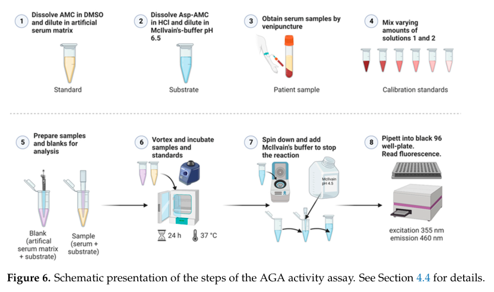

## Question

# Gene Research for Functional Annotation

## ⚠️ CRITICAL: Gene/Protein Identification Context

**BEFORE YOU BEGIN RESEARCH:** You MUST verify you are researching the CORRECT gene/protein. Gene symbols can be ambiguous, especially for less well-characterized genes from non-model organisms.

### Target Gene/Protein Identity (from UniProt):
- **UniProt Accession:** P30919
- **Protein Description:** RecName: Full=N(4)-(Beta-N-acetylglucosaminyl)-L-asparaginase; EC=3.5.1.26 {ECO:0000269|PubMed:1554372, ECO:0000269|PubMed:2775174}; AltName: Full=Aspartylglucosaminidase; Short=AGA; AltName: Full=Glycosylasparaginase; AltName: Full=N4-(N-acetyl-beta-glucosaminyl)-L-asparagine amidase; Contains: RecName: Full=Glycosylasparaginase alpha chain; Contains: RecName: Full=Glycosylasparaginase beta chain; Flags: Precursor;
- **Gene Information:** Name=Aga;
- **Organism (full):** Rattus norvegicus (Rat).
- **Protein Family:** Belongs to the Ntn-hydrolase family. .
- **Key Domains:** Ntn_hydrolases_N. (IPR029055); Peptidase_T2. (IPR000246); Asparaginase_2 (PF01112)

### MANDATORY VERIFICATION STEPS:

1. **Check if the gene symbol "Aga" matches the protein description above**
2. **Verify the organism is correct:** Rattus norvegicus (Rat).
3. **Check if protein family/domains align with what you find in literature**
4. **If you find literature for a DIFFERENT gene with the same or similar symbol, STOP**

### If Gene Symbol is Ambiguous or You Cannot Find Relevant Literature:

**DO NOT PROCEED WITH RESEARCH ON A DIFFERENT GENE.** Instead:
- State clearly: "The gene symbol 'Aga' is ambiguous or literature is limited for this specific protein"
- Explain what you found (e.g., "Found extensive literature on a different gene with the same symbol in a different organism")
- Describe the protein based ONLY on the UniProt information provided above
- Suggest that the protein function can be inferred from domain/family information

### Research Target:

Please provide a comprehensive research report on the gene **Aga** (gene ID: Aga, UniProt: P30919) in rat.

The research report should be a detailed narrative explaining the function, biological processes, and localization of the gene product. Citations should be given for all claims.

You should prioritize authoritative reviews and primary scientific literature when conducting research. You can supplement
this with annotations you find in gene/protein databases, but these can be outdated or inaccurate.

We are specifically interested in the primary function of the gene - for enzymes, what reaction is catalyzed, and what is the substrate specificity? For transporters, what is the substrate? For structural proteins or adapters, what is the broader structural role? For signaling molecules, what is the role in the pathway.

We are interested in where in or outside the cell the gene product carries out its function.

We are also interested in the signaling or biochemical pathways in which the gene functions. We are less interested in broad pleiotropic effects, except where these elucidate the precise role.

Include evidence where possible. We are interested in both experimental evidence as well as inference from structure, evolution, or bioinformatic analysis. Precise studies should be prioritized over high-throughput, where available.

## Output

Question: You are an expert researcher providing comprehensive, well-cited information.

Provide detailed information focusing on:
1. Key concepts and definitions with current understanding
2. Recent developments and latest research (prioritize 2023-2024 sources)
3. Current applications and real-world implementations
4. Expert opinions and analysis from authoritative sources
5. Relevant statistics and data from recent studies

Format as a comprehensive research report with proper citations. Include URLs and publication dates where available.
Always prioritize recent, authoritative sources and provide specific citations for all major claims.

# Gene Research for Functional Annotation

## ⚠️ CRITICAL: Gene/Protein Identification Context

**BEFORE YOU BEGIN RESEARCH:** You MUST verify you are researching the CORRECT gene/protein. Gene symbols can be ambiguous, especially for less well-characterized genes from non-model organisms.

### Target Gene/Protein Identity (from UniProt):
- **UniProt Accession:** P30919
- **Protein Description:** RecName: Full=N(4)-(Beta-N-acetylglucosaminyl)-L-asparaginase; EC=3.5.1.26 {ECO:0000269|PubMed:1554372, ECO:0000269|PubMed:2775174}; AltName: Full=Aspartylglucosaminidase; Short=AGA; AltName: Full=Glycosylasparaginase; AltName: Full=N4-(N-acetyl-beta-glucosaminyl)-L-asparagine amidase; Contains: RecName: Full=Glycosylasparaginase alpha chain; Contains: RecName: Full=Glycosylasparaginase beta chain; Flags: Precursor;
- **Gene Information:** Name=Aga;
- **Organism (full):** Rattus norvegicus (Rat).
- **Protein Family:** Belongs to the Ntn-hydrolase family. .
- **Key Domains:** Ntn_hydrolases_N. (IPR029055); Peptidase_T2. (IPR000246); Asparaginase_2 (PF01112)

### MANDATORY VERIFICATION STEPS:

1. **Check if the gene symbol "Aga" matches the protein description above**
2. **Verify the organism is correct:** Rattus norvegicus (Rat).
3. **Check if protein family/domains align with what you find in literature**
4. **If you find literature for a DIFFERENT gene with the same or similar symbol, STOP**

### If Gene Symbol is Ambiguous or You Cannot Find Relevant Literature:

**DO NOT PROCEED WITH RESEARCH ON A DIFFERENT GENE.** Instead:
- State clearly: "The gene symbol 'Aga' is ambiguous or literature is limited for this specific protein"
- Explain what you found (e.g., "Found extensive literature on a different gene with the same symbol in a different organism")
- Describe the protein based ONLY on the UniProt information provided above
- Suggest that the protein function can be inferred from domain/family information

### Research Target:

Please provide a comprehensive research report on the gene **Aga** (gene ID: Aga, UniProt: P30919) in rat.

The research report should be a detailed narrative explaining the function, biological processes, and localization of the gene product. Citations should be given for all claims.

You should prioritize authoritative reviews and primary scientific literature when conducting research. You can supplement
this with annotations you find in gene/protein databases, but these can be outdated or inaccurate.

We are specifically interested in the primary function of the gene - for enzymes, what reaction is catalyzed, and what is the substrate specificity? For transporters, what is the substrate? For structural proteins or adapters, what is the broader structural role? For signaling molecules, what is the role in the pathway.

We are interested in where in or outside the cell the gene product carries out its function.

We are also interested in the signaling or biochemical pathways in which the gene functions. We are less interested in broad pleiotropic effects, except where these elucidate the precise role.

Include evidence where possible. We are interested in both experimental evidence as well as inference from structure, evolution, or bioinformatic analysis. Precise studies should be prioritized over high-throughput, where available.

## Research report: Rat **Aga** (UniProt **P30919**) — Aspartylglucosaminidase / Glycosylasparaginase (EC 3.5.1.26)

### 0) Target verification (mandatory)
The UniProt accession **P30919** (rat *Aga*) corresponds to the lysosomal enzyme **N(4)-(β-N-acetylglucosaminyl)-L-asparaginase** (also called **aspartylglucosaminidase**, **glycosylasparaginase**, **AGA**) that participates in glycoprotein degradation and is activated by **autoproteolytic processing into α/β chains**, consistent with an **N-terminal nucleophile (Ntn) hydrolase** precursor. This matches rat biochemical literature describing purification from **rat liver** and the expected subunit processing and lysosomal role. (fisher1991characterizationofthe pages 1-2, saarela2004characterizationofaspartylglucosaminidase pages 18-22)

### 1) Key concepts and definitions (current understanding)

#### 1.1 Core biochemical function and reaction catalyzed
Aspartylglucosaminidase (AGA) is a lysosomal amidase (**EC 3.5.1.26**) required for catabolism of **N-linked glycoproteins**; it cleaves the **amide bond between N-acetylglucosamine (GlcNAc) in the glycan and the asparagine (Asn) side chain** (i.e., the Asn–GlcNAc linkage) in glycoasparagine degradation intermediates. (fisher1991characterizationofthe pages 1-2, saarela2004characterizationofaspartylglucosaminidase pages 15-18)

A frequently used small-molecule substrate proxy for activity assays is **aspartylglucosamine (GlcNAc-Asn)**; early rat-associated assays quantify released GlcNAc (Morgan–Elson reaction) after incubation with aspartylglucosamine substrate. (fisher1991characterizationofthe pages 2-3)

#### 1.2 Substrate specificity (physiologic vs ancillary activities)
Biochemical characterization indicates AGA’s physiological substrate class is **glycosylated L-asparagine (“glycoasparagines”)**, including **GlcNAc-Asn/aspartylglucosamine** and larger glycoasparagines. Specificity rules include a requirement for **free α-amino and α-carboxyl groups** on the L-asparagine moiety, and AGA does **not efficiently hydrolyze fucosylated complex-type N-glycans**, implying coordination with upstream lysosomal exoglycosidases (e.g., removal of fucose before AGA action). (dunder2010theapplicationof pages 33-37, saarela2004characterizationofaspartylglucosaminidase pages 15-18)

Beyond glycoasparagine hydrolysis, AGA has been reported to also hydrolyze **β-aspartyl peptides** and show **L-asparaginase activity** (with the important distinction that it lacks glutaminase activity typical of some bacterial asparaginases). These activities are generally considered secondary to its principal lysosomal glycoprotein-catabolic role. (kelo2013catalyticandtherapeutic pages 22-25, saarela2004characterizationofaspartylglucosaminidase pages 15-18)

#### 1.3 Enzyme class: N-terminal nucleophile (Ntn) hydrolase and self-activation
AGA is synthesized as an inactive single-chain precursor that must undergo **autoproteolytic activation**. Two precursor molecules dimerize and undergo autocatalytic cleavage yielding an N-terminal **α-subunit (~27 kDa)** and C-terminal **β-subunit (~17 kDa)**; this processing exposes the catalytic **N-terminal Thr206** (rat numbering referenced in mechanistic summaries), a hallmark of Ntn-hydrolases. (saarela2004characterizationofaspartylglucosaminidase pages 18-22, saarela2004characterizationofaspartylglucosaminidase pages 35-39)

Human disease mutations (e.g., **Cys163→Ser** in Finnish AGU) abolish both enzymatic activity and **conversion into subunits**, supporting that correct folding/processing is required for catalytic competence. (fisher1991characterizationofthe pages 1-2, fisher1991characterizationofthe pages 2-3)

#### 1.4 Subcellular localization and trafficking
AGA is a **soluble lysosomal hydrolase**. It is **N-glycosylated**, trafficked to lysosomes through the **mannose-6-phosphate (M6P) pathway**, and secreted AGA can be **recaptured by M6P receptor–mediated endocytosis**; in neuronal cultures, uptake is blocked by free M6P, supporting an M6P-receptor mechanism. (saarela2004characterizationofaspartylglucosaminidase pages 18-22, kyttala1998expressionandendocytosis pages 1-2)

### 2) Rat-specific evidence (Rattus norvegicus)

#### 2.1 Rat biochemical characterization
Rat liver glycosylasparaginase has been purified and characterized as an approximately **49 kDa heterodimer** with subunits around **24 kDa (α)** and **20 kDa (β)**, providing direct rat evidence of the expected α/β processing architecture. (fisher1991characterizationofthe pages 1-2)

Rat and mouse AGA have been reported to show pH optima in the **neutral-to-alkaline range (~pH 7–9)**, contrasting with more acidic optima reported for human AGA in some settings (noting methodological differences). (saarela2004characterizationofaspartylglucosaminidase pages 18-22)

A rat-specific stability estimate reported for rat liver AGA is a cellular **half-life of ~2 days**, relevant for turnover considerations in lysosomal enzyme biology and replacement strategies. (saarela2004characterizationofaspartylglucosaminidase pages 18-22)

#### 2.2 Rat cell models in mechanistic trafficking studies
While much neuronal localization work was performed in mouse primary neurons, uptake comparisons included rat-derived cell lines (e.g., PC12), which endocytosed recombinant AGA poorly compared with primary neurons, consistent with dependence on M6P receptor abundance for uptake efficiency. (kyttala1998expressionandendocytosis pages 1-2)

### 3) Biological pathway context
AGA functions in the **lysosomal N-linked glycoprotein degradation pathway**, acting at a terminal step in which glycoasparagine intermediates are converted into products that can be fully catabolized. When AGA activity is deficient, **glycoasparagines (notably aspartylglucosamine/GlcNAc-Asn)** accumulate, a central biochemical hallmark of **aspartylglucosaminuria (AGU)**. (fisher1991characterizationofthe pages 1-2, arvio2016aspartylglycosaminuriaareview pages 5-7)

### 4) Recent developments (prioritizing 2023–2024)

#### 4.1 2023: Validated serum AGA activity assay as a clinical biomarker
A key translational development is the validation of a **fluorometric serum AGA activity assay** suitable for diagnostics and clinical studies (Banning et al., **Mar 2023**, *Int. J. Mol. Sci.*). **URL:** https://doi.org/10.3390/ijms24065722. (banning2023validationofaspartylglucosaminidase pages 5-7, banning2023validationofaspartylglucosaminidase pages 10-12)

Quantitative performance and population separation (notable statistics):
- **LLOQ:** 4.8 pmol AMC, corresponding to **0.18 mU/L** AGA activity (with 1 mU = 1 nmol/min; activity computed using a 24 h = 1440 min incubation). (banning2023validationofaspartylglucosaminidase pages 2-5, banning2023validationofaspartylglucosaminidase pages 10-12)
- **AGU patient serum activity:** mean **0.11 mU/L** (range **0.0123–0.251 mU/L**). (banning2023validationofaspartylglucosaminidase pages 5-7)
- **Healthy donor serum activity:** mean **3.252 mU/L** (range **2.503–3.897 mU/L**). (banning2023validationofaspartylglucosaminidase pages 5-7)
- Methodological choices aimed at low-activity discrimination included **12.5 µM Asp-AMC substrate** and **24 h incubation** to reduce variability in the low-activity range. (banning2023validationofaspartylglucosaminidase pages 5-7)

This work is a concrete, real-world enabling step for therapy development because it provides a minimally invasive **pharmacodynamic biomarker** for future interventional studies. (banning2023validationofaspartylglucosaminidase pages 1-2, banning2023validationofaspartylglucosaminidase pages 10-12)

#### 4.2 2023: Glycoengineering (“Long-Acting-GlycoDesign”) platform includes AGA as a replacement-enzyme candidate
A 2023 study on glycoengineering of lysosomal enzymes (Chen et al., **Feb 2023**, *Frontiers in Bioengineering and Biotechnology*) reports that a Long-Acting-GlycoDesign (LAGD) approach can be implemented on a panel of lysosomal enzymes including **AGA**, converting M6P-containing N-glycans to complex sialylated N-glycans to improve circulatory stability; the paper states this approach extended plasma half-life for tested enzymes including **AGA** in wild-type mice. **URL:** https://doi.org/10.3389/fbioe.2023.1128371. (chen2023auniversalglycodesign pages 6-7)

While the numeric tissue activity data shown in the retrieved excerpt focus on another lysosomal enzyme (GLA), the inclusion of AGA in the engineered enzyme panel is directly relevant for next-generation enzyme-replacement design principles (circulation time, biodistribution). (chen2023auniversalglycodesign pages 6-7, chen2023auniversalglycodesign pages 7-9)

#### 4.3 2023–2024: Gene therapy context in lysosomal storage disorders
A 2023 review on gene therapy for lysosomal storage diseases highlights that conventional therapies often have limited CNS efficacy because of the blood–brain barrier, motivating CNS-targeted gene therapy approaches; AGU/AGA is included as a disease entity discussed among LSDs. (Kido et al., **Jan 2023**, *Frontiers in Genetics*; **URL:** https://doi.org/10.3389/fgene.2023.1064924.) (banning2023validationofaspartylglucosaminidase pages 1-2)

*Note on 2024 AGU-specific primary literature:* within the retrieved corpus here, the most direct AGU/AGA-specific actionable advances were in 2023 (validated biomarker assay; glycoengineering platform; gene therapy review). Additional 2024 items retrieved were more general/ancillary and did not add rat AGA-specific functional mechanisms beyond the established lysosomal role.

### 5) Current applications and real-world implementations

#### 5.1 Diagnostics and monitoring
The strongest current real-world implementation for AGA biology is in **diagnostics and biomarker monitoring**:
- **Serum AGA activity measurement** can unambiguously distinguish AGU patients from controls in a validated protocol (Mar 2023). (banning2023validationofaspartylglucosaminidase pages 5-7)
- Historically and currently, AGU diagnosis is also supported by **urinary oligosaccharide/glycoasparagine** analyses and **genetic testing**, with the serum assay adding a practical enzyme-activity biomarker for longitudinal follow-up and trial readiness. (banning2023validationofaspartylglucosaminidase pages 1-2, arvio2016aspartylglycosaminuriaareview pages 5-7)

#### 5.2 Therapeutic development pathways (translational)
Therapeutic strategies for lysosomal enzyme deficiencies that are directly relevant to AGA/AGU include **enzyme replacement therapy (ERT)**, **pharmacological chaperones**, and **gene therapy**, with a key barrier being effective CNS delivery for neurodegenerative LSD features; reviews emphasize gene therapy’s promise in this context. (banning2023validationofaspartylglucosaminidase pages 1-2)

### 6) Expert synthesis and analysis (authoritative interpretation)

1) **Mechanism-driven annotation is unusually strong for AGA** because its Ntn-hydrolase activation mechanism links molecular processing to function: loss of autocleavage/subunit maturation predictably eliminates enzyme activity, a relationship supported by classic mutation evidence. (fisher1991characterizationofthe pages 1-2, saarela2004characterizationofaspartylglucosaminidase pages 35-39)

2) **Lysosomal targeting biology creates both opportunities and constraints for therapy.** On one hand, M6P-dependent uptake enables cross-correction (secreted enzyme can be recaptured by neighboring cells). On the other, cell-type differences in M6P receptor expression can constrain uptake efficiency, implying that dosing and engineering strategies (including glycoengineering) may be needed to improve distribution. (kyttala1998expressionandendocytosis pages 1-2, chen2023auniversalglycodesign pages 6-7)

3) **A practical biomarker (serum AGA activity) is a pivotal enabler for clinical translation.** The validated assay defines a quantitative baseline gap (healthy ~3.252 mU/L vs AGU ~0.11 mU/L) and an LLOQ appropriate for detecting low-level increases, providing a tool for dose finding and treatment monitoring. (banning2023validationofaspartylglucosaminidase pages 5-7, banning2023validationofaspartylglucosaminidase pages 2-5)

### 7) Evidence synthesis table
The following table provides a compact evidence map linking rat Aga (P30919) functional annotation to specific sources and highlighting recent translational advances.

| Topic | Key points | Evidence/citations |
|---|---|---|
| Identity verification | Rat **Aga** corresponding to **UniProt P30919** is the lysosomal enzyme **aspartylglucosaminidase / glycosylasparaginase / N(4)-(β-N-acetylglucosaminyl)-L-asparaginase** in the **Ntn-hydrolase** family; literature on mammalian AGA aligns with this identity and should be distinguished from unrelated genes/proteins using similar symbols. | Mammalian AGA/glycosylasparaginase identity and lysosomal role are explicitly described, with rat liver enzyme used as a biochemical reference (fisher1991characterizationofthe pages 1-2, saarela2004characterizationofaspartylglucosaminidase pages 15-18) |
| Enzyme name and EC reaction | **EC 3.5.1.26**; AGA is a lysosomal amidase that hydrolyzes the **Asn-GlcNAc amide bond** in glycoasparagines during glycoprotein degradation. The reaction is commonly described as cleavage of **aspartylglucosamine (GlcNAc-Asn)** to release aspartate and amino-sugar products in the final steps of N-linked glycoprotein catabolism. | Direct EC assignment and bond specificity described for mammalian AGA; AGU results from failure of this reaction (fisher1991characterizationofthe pages 1-2, saarela2004characterizationofaspartylglucosaminidase pages 15-18, kyttala1998expressionandendocytosis pages 1-2) |
| Substrate specificity | Natural substrate specificity requires a **glycosylated L-asparagine** with free **α-amino** and **α-carboxyl** groups. AGA acts on **GlcNAc-Asn/aspartylglucosamine** and larger glycoasparagines, but does **not** hydrolyze **fucosylated complex-type N-glycans** efficiently. It also shows ancillary **L-asparaginase** and **β-aspartyl peptide** hydrolysis/synthesis activities, though glycoasparagine cleavage is its principal physiological role. | Substrate rules and exclusions summarized from biochemical characterization and dissertation review of AGA activation/function (kelo2013catalyticandtherapeutic pages 22-25, dunder2010theapplicationof pages 33-37, saarela2004characterizationofaspartylglucosaminidase pages 15-18, fisher1991characterizationofthe pages 2-3) |
| Activation and processing | AGA is synthesized as a **346-aa precursor** with an N-terminal **23-aa signal peptide** removed co-translationally. Precursor molecules dimerize and undergo **autocatalytic cleavage** between **Asp205-Thr206**, generating **α** and **β** subunits; cleavage exposes the catalytic **N-terminal Thr206** nucleophile required for activity. Proper conversion into subunits is essential, as AGU-causing mutations can abolish both processing and catalysis. | Processing pathway, signal peptide, autocleavage, and Thr nucleophile are directly described; disease mutations blocking subunit conversion support this mechanism (saarela2004characterizationofaspartylglucosaminidase pages 18-22, fisher1991characterizationofthe pages 1-2, dunder2010theapplicationof pages 33-37, saarela2004characterizationofaspartylglucosaminidase pages 35-39, fisher1991characterizationofthe pages 2-3) |
| Quaternary structure | Mature AGA assembles as an active **αβ heterodimer** or more commonly an **α2β2 / (αβ)2 tetramer**, depending on species and preparation. Rat liver AGA was classically characterized as a **49-kDa heterodimer**, whereas human enzyme is often described as an **αββα tetramer**. | Species-dependent oligomeric state and rat liver heterodimer evidence are summarized in biochemical sources (kelo2013catalyticandtherapeutic pages 22-25, fisher1991characterizationofthe pages 1-2) |
| Subcellular localization and trafficking | AGA is a **soluble lysosomal hydrolase**. It is **N-glycosylated**, trafficked to lysosomes through the **mannose-6-phosphate (M6P) pathway**, and extracellular enzyme can be **endocytosed via M6P receptors**. In neurons, AGA localizes to soma and processes but is not prominent in nerve terminals. | Lysosomal localization, glycosylation/M6P trafficking, and receptor-mediated uptake are directly reported (saarela2004characterizationofaspartylglucosaminidase pages 18-22, dunder2010theapplicationof pages 33-37, kyttala1998expressionandendocytosis pages 1-2, saarela2004characterizationofaspartylglucosaminidase pages 35-39) |
| Key rat-specific biochemical facts | Rat AGA was purified from **rat liver**; purified rat liver glycosylasparaginase is reported as a **49-kDa heterodimer** with subunits around **24 kDa (α)** and **20 kDa (β)**. Rat/mouse AGA show reported **pH optima ~7-9**, contrasting with the more acidic optimum reported for human AGA. Rat liver enzyme stability was estimated at about **2 days half-life** in cells. | Rat liver purification, subunit sizes, pH optimum, and half-life are specifically noted in rat-focused biochemical summaries (saarela2004characterizationofaspartylglucosaminidase pages 18-22, fisher1991characterizationofthe pages 1-2, saarela2004characterizationofaspartylglucosaminidase pages 15-18) |
| Biological pathway/function | AGA acts in the **lysosomal degradation pathway of N-linked glycoproteins**, catalyzing a terminal amide-bond hydrolysis step after upstream exoglycosidases/processing events. Its action prevents accumulation of glycoasparagine breakdown intermediates. | Role in glycoprotein catabolism and consequence of deficiency are consistently described across mechanistic and disease literature (fisher1991characterizationofthe pages 1-2, saarela2004characterizationofaspartylglucosaminidase pages 15-18, kyttala1998expressionandendocytosis pages 1-2) |
| Disease relevance | AGA deficiency causes **aspartylglucosaminuria (AGU)**, a lysosomal storage disorder characterized by accumulation of **uncleaved glycoasparagines/aspartylglucosamine** in tissues and body fluids. Mutations that impair folding, dimerization, autocleavage, or lysosomal maturation abolish enzyme activity. | AGU disease mechanism and mutation-processing relationship are directly documented (fisher1991characterizationofthe pages 1-2, kyttala1998expressionandendocytosis pages 1-2, saarela2004characterizationofaspartylglucosaminidase pages 35-39, arvio2016aspartylglycosaminuriaareview pages 5-7) |
| Quantitative therapeutic threshold | Foundational preclinical work indicates that increasing intracellular AGA activity to only about **3-4% of normal** can clear intracellular aspartylglucosamine in cultured AGU cells, suggesting a relatively low correction threshold for biochemical rescue. | Quantitative rescue threshold summarized in AGU review (arvio2016aspartylglycosaminuriaareview pages 5-7) |
| 2023 development: validated serum biomarker assay | A 2023 validated fluorometric serum assay established **AGA activity** as a practical biomarker for AGU diagnostics and clinical studies. Reported assay performance: **LLOQ 4.8 pmol AMC = 0.18 mU/L**; AGU patient serum averaged **0.11 mU/L** (range **0.0123-0.251**), versus healthy donors **3.252 mU/L** (range **2.503-3.897**). The assay used **12.5 µM Asp-AMC**, **24 h** incubation, and distinguished patients unambiguously from controls. **Publication date:** Mar 2023. **URL:** https://doi.org/10.3390/ijms24065722 | Quantitative validation data and assay formula from the 2023 study (banning2023validationofaspartylglucosaminidase pages 5-7, banning2023validationofaspartylglucosaminidase pages 2-5, banning2023validationofaspartylglucosaminidase pages 10-12) |
| 2023 development: glycoengineered lysosomal enzyme platform | A 2023 **Long-Acting-GlycoDesign (LAGD)** study included **AGA** among lysosomal enzymes successfully glycoengineered to convert **M6P-containing N-glycans** to **complex sialylated N-glycans**, with the goal of extending circulatory stability and improving biodistribution of replacement enzymes. The paper states that LAGD extended plasma half-life for tested enzymes including **AGA** in wild-type mice, though the detailed numeric tissue data shown in the excerpt were for GLA rather than AGA. **Publication date:** Feb 2023. **URL:** https://doi.org/10.3389/fbioe.2023.1128371 | AGA inclusion in the glycoengineering platform and extended half-life claim are described in the article metadata/abstract and surrounding methods/results text (chen2023auniversalglycodesign pages 6-7, chen2023auniversalglycodesign pages 7-9) |
| 2023 development: gene therapy outlook | A 2023 review of gene therapy for lysosomal storage diseases lists **AGU/AGA** among disorders of interest and emphasizes that CNS disease remains a major challenge for conventional therapies, increasing interest in **AAV-based** approaches. AGA/AGU is discussed in the context of preclinical progress and the broader movement toward clinical translation for neurological lysosomal diseases. **Publication date:** Jan 2023. **URL:** https://doi.org/10.3389/fgene.2023.1064924 | Review-level therapeutic context for AGA/AGU gene therapy (banning2023validationofaspartylglucosaminidase pages 1-2) |
| Real-world/implementation relevance | Current real-world utility is strongest for **diagnostics and biomarker monitoring** rather than approved disease-specific therapy: serum AGA activity assays, urinary oligosaccharide/GlcNAc-Asn analysis, and genetic testing are clinically relevant, while ERT/gene therapy remain largely preclinical or translational for AGU. | Diagnostic implementation and emerging therapy-monitoring rationale are summarized in recent assay paper and AGU review (banning2023validationofaspartylglucosaminidase pages 1-2, banning2023validationofaspartylglucosaminidase pages 10-12, arvio2016aspartylglycosaminuriaareview pages 5-7) |

*Table: This table summarizes the verified identity, enzymatic function, lysosomal trafficking, rat-specific biochemical properties, disease relevance, and recent translational developments for rat Aga/AGA (UniProt P30919). It is useful as a compact evidence map linking functional annotation to primary and recent literature.*

### 8) Visual evidence (figures)
Banning et al. (2023) provides a schematic workflow of the validated serum AGA activity assay (Figure 6) and a plot comparing activity ranges/precision for healthy donors vs AGU patients (Figure 4), supporting both implementability and diagnostic separation. (banning2023validationofaspartylglucosaminidase media 1f34ed3a, banning2023validationofaspartylglucosaminidase media e702f103)

### 9) Key recent sources (with dates and URLs)
- Banning A, Laine M, Tikkanen R. **“Validation of Aspartylglucosaminidase Activity Assay for Human Serum Samples…”** *Int. J. Mol. Sci.* **Mar 2023**. https://doi.org/10.3390/ijms24065722 (banning2023validationofaspartylglucosaminidase pages 5-7)
- Chen Y-H et al. **“A universal GlycoDesign for lysosomal replacement enzymes…”** *Frontiers in Bioengineering and Biotechnology* **Feb 2023**. https://doi.org/10.3389/fbioe.2023.1128371 (chen2023auniversalglycodesign pages 6-7)
- Kido J, Sugawara K, Nakamura K. **“Gene therapy for lysosomal storage diseases: Current clinical trial prospects”** *Frontiers in Genetics* **Jan 2023**. https://doi.org/10.3389/fgene.2023.1064924 (banning2023validationofaspartylglucosaminidase pages 1-2)

### 10) Limitations of this report (scope transparency)
- Rat **tissue expression maps** and **rat in vivo phenotypes** specific to *Rattus norvegicus* *Aga* were not directly available in the retrieved primary sources; therefore, localization and pathway assignment rely on rat biochemical characterization plus well-supported conserved mammalian lysosomal function. (saarela2004characterizationofaspartylglucosaminidase pages 18-22, fisher1991characterizationofthe pages 1-2)
- The 2023 glycoengineering paper includes AGA in its enzyme panel and asserts half-life extension, but the retrieved text excerpt does not include AGA-specific numeric PK values; thus, only the supported qualitative claim is reported. (chen2023auniversalglycodesign pages 6-7)

References

1. (fisher1991characterizationofthe pages 1-2): K.J. Fisher and N.N. Aronson. Characterization of the mutation responsible for aspartylglucosaminuria in three finnish patients. amino acid substitution cys163—-ser abolishes the activity of lysosomal glycosylasparaginase and its conversion into subunits. Jun 1991. URL: https://doi.org/10.1016/s0021-9258(18)99071-x, doi:10.1016/s0021-9258(18)99071-x. This article has 63 citations and is from a domain leading peer-reviewed journal.

2. (saarela2004characterizationofaspartylglucosaminidase pages 18-22): J Saarela. Characterization of aspartylglucosaminidase activation and aspartylglucosaminuria mutations. Unknown journal, 2004.

3. (saarela2004characterizationofaspartylglucosaminidase pages 15-18): J Saarela. Characterization of aspartylglucosaminidase activation and aspartylglucosaminuria mutations. Unknown journal, 2004.

4. (fisher1991characterizationofthe pages 2-3): K.J. Fisher and N.N. Aronson. Characterization of the mutation responsible for aspartylglucosaminuria in three finnish patients. amino acid substitution cys163—-ser abolishes the activity of lysosomal glycosylasparaginase and its conversion into subunits. Jun 1991. URL: https://doi.org/10.1016/s0021-9258(18)99071-x, doi:10.1016/s0021-9258(18)99071-x. This article has 63 citations and is from a domain leading peer-reviewed journal.

5. (dunder2010theapplicationof pages 33-37): U Dunder. The application of enzyme replacement therapy in vitro and in a mouse model in aspartylglycosaminuria. Unknown journal, 2010.

6. (kelo2013catalyticandtherapeutic pages 22-25): E Kelo. Catalytic and therapeutic characteristics of human recombinant glycosylasparaginase and bacterial l-asparaginases. Unknown journal, 2013.

7. (saarela2004characterizationofaspartylglucosaminidase pages 35-39): J Saarela. Characterization of aspartylglucosaminidase activation and aspartylglucosaminuria mutations. Unknown journal, 2004.

8. (kyttala1998expressionandendocytosis pages 1-2): Aija Kyttälä, Outi Heinonen, Leena Peltonen, and Anu Jalanko. Expression and endocytosis of lysosomal aspartylglucosaminidase in mouse primary neurons. The Journal of Neuroscience, 18:7750-7756, Oct 1998. URL: https://doi.org/10.1523/jneurosci.18-19-07750.1998, doi:10.1523/jneurosci.18-19-07750.1998. This article has 30 citations.

9. (arvio2016aspartylglycosaminuriaareview pages 5-7): Maria Arvio and Ilkka Mononen. Aspartylglycosaminuria: a review. Orphanet Journal of Rare Diseases, Dec 2016. URL: https://doi.org/10.1186/s13023-016-0544-6, doi:10.1186/s13023-016-0544-6. This article has 87 citations and is from a peer-reviewed journal.

10. (banning2023validationofaspartylglucosaminidase pages 5-7): Antje Banning, Minna Laine, and Ritva Tikkanen. Validation of aspartylglucosaminidase activity assay for human serum samples: establishment of a biomarker for diagnostics and clinical studies. International Journal of Molecular Sciences, Mar 2023. URL: https://doi.org/10.3390/ijms24065722, doi:10.3390/ijms24065722. This article has 7 citations.

11. (banning2023validationofaspartylglucosaminidase pages 10-12): Antje Banning, Minna Laine, and Ritva Tikkanen. Validation of aspartylglucosaminidase activity assay for human serum samples: establishment of a biomarker for diagnostics and clinical studies. International Journal of Molecular Sciences, Mar 2023. URL: https://doi.org/10.3390/ijms24065722, doi:10.3390/ijms24065722. This article has 7 citations.

12. (banning2023validationofaspartylglucosaminidase pages 2-5): Antje Banning, Minna Laine, and Ritva Tikkanen. Validation of aspartylglucosaminidase activity assay for human serum samples: establishment of a biomarker for diagnostics and clinical studies. International Journal of Molecular Sciences, Mar 2023. URL: https://doi.org/10.3390/ijms24065722, doi:10.3390/ijms24065722. This article has 7 citations.

13. (banning2023validationofaspartylglucosaminidase pages 1-2): Antje Banning, Minna Laine, and Ritva Tikkanen. Validation of aspartylglucosaminidase activity assay for human serum samples: establishment of a biomarker for diagnostics and clinical studies. International Journal of Molecular Sciences, Mar 2023. URL: https://doi.org/10.3390/ijms24065722, doi:10.3390/ijms24065722. This article has 7 citations.

14. (chen2023auniversalglycodesign pages 6-7): Yen-Hsi Chen, Weihua Tian, Makiko Yasuda, Zilu Ye, Ming Song, Ulla Mandel, Claus Kristensen, Lorenzo Povolo, André R. A. Marques, Tomislav Čaval, Albert J. R. Heck, Julio Lopes Sampaio, Ludger Johannes, Takahiro Tsukimura, Robert Desnick, Sergey Y. Vakhrushev, Zhang Yang, and Henrik Clausen. A universal glycodesign for lysosomal replacement enzymes to improve circulation time and biodistribution. Frontiers in Bioengineering and Biotechnology, Feb 2023. URL: https://doi.org/10.3389/fbioe.2023.1128371, doi:10.3389/fbioe.2023.1128371. This article has 9 citations.

15. (chen2023auniversalglycodesign pages 7-9): Yen-Hsi Chen, Weihua Tian, Makiko Yasuda, Zilu Ye, Ming Song, Ulla Mandel, Claus Kristensen, Lorenzo Povolo, André R. A. Marques, Tomislav Čaval, Albert J. R. Heck, Julio Lopes Sampaio, Ludger Johannes, Takahiro Tsukimura, Robert Desnick, Sergey Y. Vakhrushev, Zhang Yang, and Henrik Clausen. A universal glycodesign for lysosomal replacement enzymes to improve circulation time and biodistribution. Frontiers in Bioengineering and Biotechnology, Feb 2023. URL: https://doi.org/10.3389/fbioe.2023.1128371, doi:10.3389/fbioe.2023.1128371. This article has 9 citations.

16. (banning2023validationofaspartylglucosaminidase media 1f34ed3a): Antje Banning, Minna Laine, and Ritva Tikkanen. Validation of aspartylglucosaminidase activity assay for human serum samples: establishment of a biomarker for diagnostics and clinical studies. International Journal of Molecular Sciences, Mar 2023. URL: https://doi.org/10.3390/ijms24065722, doi:10.3390/ijms24065722. This article has 7 citations.

17. (banning2023validationofaspartylglucosaminidase media e702f103): Antje Banning, Minna Laine, and Ritva Tikkanen. Validation of aspartylglucosaminidase activity assay for human serum samples: establishment of a biomarker for diagnostics and clinical studies. International Journal of Molecular Sciences, Mar 2023. URL: https://doi.org/10.3390/ijms24065722, doi:10.3390/ijms24065722. This article has 7 citations.

## Artifacts

- [Edison artifact artifact-00](Aga-deep-research-falcon_artifacts/artifact-00.md)

## Citations

1. fisher1991characterizationofthe pages 2-3
2. fisher1991characterizationofthe pages 1-2
3. saarela2004characterizationofaspartylglucosaminidase pages 18-22
4. kyttala1998expressionandendocytosis pages 1-2
5. banning2023validationofaspartylglucosaminidase pages 5-7
6. chen2023auniversalglycodesign pages 6-7
7. banning2023validationofaspartylglucosaminidase pages 1-2
8. arvio2016aspartylglycosaminuriaareview pages 5-7
9. saarela2004characterizationofaspartylglucosaminidase pages 15-18
10. dunder2010theapplicationof pages 33-37
11. kelo2013catalyticandtherapeutic pages 22-25
12. saarela2004characterizationofaspartylglucosaminidase pages 35-39
13. banning2023validationofaspartylglucosaminidase pages 10-12
14. banning2023validationofaspartylglucosaminidase pages 2-5
15. chen2023auniversalglycodesign pages 7-9
16. https://doi.org/10.3390/ijms24065722.
17. https://doi.org/10.3389/fbioe.2023.1128371.
18. https://doi.org/10.3389/fgene.2023.1064924.
19. https://doi.org/10.3390/ijms24065722
20. https://doi.org/10.3389/fbioe.2023.1128371
21. https://doi.org/10.3389/fgene.2023.1064924
22. https://doi.org/10.1016/s0021-9258(18
23. https://doi.org/10.1523/jneurosci.18-19-07750.1998,
24. https://doi.org/10.1186/s13023-016-0544-6,
25. https://doi.org/10.3390/ijms24065722,
26. https://doi.org/10.3389/fbioe.2023.1128371,