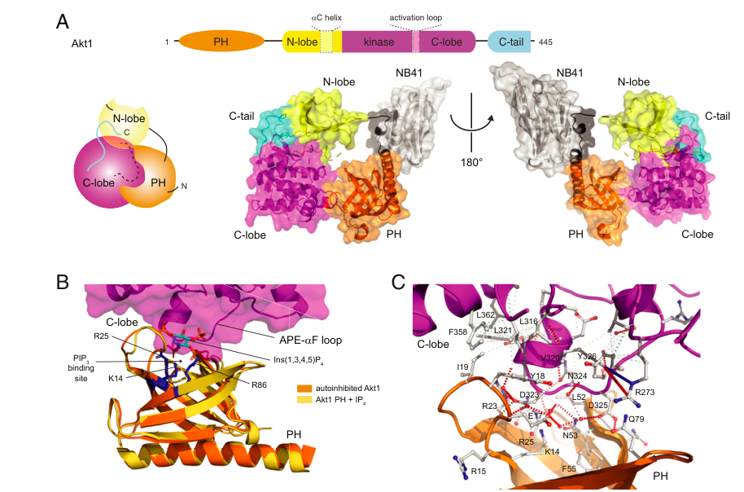

## Question

# Gene Research for Functional Annotation

## ⚠️ CRITICAL: Gene/Protein Identification Context

**BEFORE YOU BEGIN RESEARCH:** You MUST verify you are researching the CORRECT gene/protein. Gene symbols can be ambiguous, especially for less well-characterized genes from non-model organisms.

### Target Gene/Protein Identity (from UniProt):
- **UniProt Accession:** P47196
- **Protein Description:** RecName: Full=RAC-alpha serine/threonine-protein kinase; EC=2.7.11.1 {ECO:0000305|PubMed:9228007}; AltName: Full=Protein kinase B; Short=PKB; AltName: Full=Protein kinase B alpha; Short=PKB alpha; AltName: Full=RAC-PK-alpha;
- **Gene Information:** Name=Akt1;
- **Organism (full):** Rattus norvegicus (Rat).
- **Protein Family:** Belongs to the protein kinase superfamily. AGC Ser/Thr
- **Key Domains:** AGC-kinase_C. (IPR000961); Akt1. (IPR034676); Kinase-like_dom_sf. (IPR011009); PH-like_dom_sf. (IPR011993); PH_domain. (IPR001849)

### MANDATORY VERIFICATION STEPS:

1. **Check if the gene symbol "Akt1" matches the protein description above**
2. **Verify the organism is correct:** Rattus norvegicus (Rat).
3. **Check if protein family/domains align with what you find in literature**
4. **If you find literature for a DIFFERENT gene with the same or similar symbol, STOP**

### If Gene Symbol is Ambiguous or You Cannot Find Relevant Literature:

**DO NOT PROCEED WITH RESEARCH ON A DIFFERENT GENE.** Instead:
- State clearly: "The gene symbol 'Akt1' is ambiguous or literature is limited for this specific protein"
- Explain what you found (e.g., "Found extensive literature on a different gene with the same symbol in a different organism")
- Describe the protein based ONLY on the UniProt information provided above
- Suggest that the protein function can be inferred from domain/family information

### Research Target:

Please provide a comprehensive research report on the gene **Akt1** (gene ID: Akt1, UniProt: P47196) in rat.

The research report should be a detailed narrative explaining the function, biological processes, and localization of the gene product. Citations should be given for all claims.

You should prioritize authoritative reviews and primary scientific literature when conducting research. You can supplement
this with annotations you find in gene/protein databases, but these can be outdated or inaccurate.

We are specifically interested in the primary function of the gene - for enzymes, what reaction is catalyzed, and what is the substrate specificity? For transporters, what is the substrate? For structural proteins or adapters, what is the broader structural role? For signaling molecules, what is the role in the pathway.

We are interested in where in or outside the cell the gene product carries out its function.

We are also interested in the signaling or biochemical pathways in which the gene functions. We are less interested in broad pleiotropic effects, except where these elucidate the precise role.

Include evidence where possible. We are interested in both experimental evidence as well as inference from structure, evolution, or bioinformatic analysis. Precise studies should be prioritized over high-throughput, where available.

## Output

Question: You are an expert researcher providing comprehensive, well-cited information.

Provide detailed information focusing on:
1. Key concepts and definitions with current understanding
2. Recent developments and latest research (prioritize 2023-2024 sources)
3. Current applications and real-world implementations
4. Expert opinions and analysis from authoritative sources
5. Relevant statistics and data from recent studies

Format as a comprehensive research report with proper citations. Include URLs and publication dates where available.
Always prioritize recent, authoritative sources and provide specific citations for all major claims.

# Gene Research for Functional Annotation

## ⚠️ CRITICAL: Gene/Protein Identification Context

**BEFORE YOU BEGIN RESEARCH:** You MUST verify you are researching the CORRECT gene/protein. Gene symbols can be ambiguous, especially for less well-characterized genes from non-model organisms.

### Target Gene/Protein Identity (from UniProt):
- **UniProt Accession:** P47196
- **Protein Description:** RecName: Full=RAC-alpha serine/threonine-protein kinase; EC=2.7.11.1 {ECO:0000305|PubMed:9228007}; AltName: Full=Protein kinase B; Short=PKB; AltName: Full=Protein kinase B alpha; Short=PKB alpha; AltName: Full=RAC-PK-alpha;
- **Gene Information:** Name=Akt1;
- **Organism (full):** Rattus norvegicus (Rat).
- **Protein Family:** Belongs to the protein kinase superfamily. AGC Ser/Thr
- **Key Domains:** AGC-kinase_C. (IPR000961); Akt1. (IPR034676); Kinase-like_dom_sf. (IPR011009); PH-like_dom_sf. (IPR011993); PH_domain. (IPR001849)

### MANDATORY VERIFICATION STEPS:

1. **Check if the gene symbol "Akt1" matches the protein description above**
2. **Verify the organism is correct:** Rattus norvegicus (Rat).
3. **Check if protein family/domains align with what you find in literature**
4. **If you find literature for a DIFFERENT gene with the same or similar symbol, STOP**

### If Gene Symbol is Ambiguous or You Cannot Find Relevant Literature:

**DO NOT PROCEED WITH RESEARCH ON A DIFFERENT GENE.** Instead:
- State clearly: "The gene symbol 'Akt1' is ambiguous or literature is limited for this specific protein"
- Explain what you found (e.g., "Found extensive literature on a different gene with the same symbol in a different organism")
- Describe the protein based ONLY on the UniProt information provided above
- Suggest that the protein function can be inferred from domain/family information

### Research Target:

Please provide a comprehensive research report on the gene **Akt1** (gene ID: Akt1, UniProt: P47196) in rat.

The research report should be a detailed narrative explaining the function, biological processes, and localization of the gene product. Citations should be given for all claims.

You should prioritize authoritative reviews and primary scientific literature when conducting research. You can supplement
this with annotations you find in gene/protein databases, but these can be outdated or inaccurate.

We are specifically interested in the primary function of the gene - for enzymes, what reaction is catalyzed, and what is the substrate specificity? For transporters, what is the substrate? For structural proteins or adapters, what is the broader structural role? For signaling molecules, what is the role in the pathway.

We are interested in where in or outside the cell the gene product carries out its function.

We are also interested in the signaling or biochemical pathways in which the gene functions. We are less interested in broad pleiotropic effects, except where these elucidate the precise role.

Include evidence where possible. We are interested in both experimental evidence as well as inference from structure, evolution, or bioinformatic analysis. Precise studies should be prioritized over high-throughput, where available.

## Research report: Rat **Akt1** (UniProt **P47196**) — functional annotation and translational context

### 0) Target verification (mandatory)
The UniProt accession **P47196** corresponds to **RAC-alpha serine/threonine-protein kinase (Akt-1 / PKBα)** in **Rattus norvegicus (rat)**. A rat in vivo study explicitly states that the 3D structure of rat **Akt-1** was retrieved from UniProt as **“UniProt ID: P47196”**, which directly validates the accession→protein→organism mapping for this report. Publication: **Alwaili et al., 2024-12 (Frontiers in Molecular Biosciences)**, https://doi.org/10.3389/fmolb.2024.1507786 (alwaili2024avenanthramidecamelioratedoxorubicininduced pages 2-3).

### 1) Key concepts, definitions, and current understanding

#### 1.1 What AKT1 is (core definition)
AKT1 (Protein kinase B alpha; PKBα) is a **serine/threonine protein kinase** in the **AGC kinase family** that functions as a central signaling node downstream of growth factor/insulin pathways, regulating survival, growth, metabolism, and cytoskeletal programs by **phosphorylating protein substrates**. (hassan2024aktkinasesas pages 2-3).

#### 1.2 Domain architecture (functional parts)
Canonical AKT proteins (including AKT1) share:
- an N-terminal **pleckstrin homology (PH) domain** that binds phosphoinositides,
- a central **protein kinase catalytic domain**, and
- a C-terminal regulatory tail containing a **hydrophobic motif (HM)** with a key regulatory serine. (chu2018aktkinaseactivation pages 1-3, yudushkin2020controlofakt pages 1-2, hassan2024aktkinasesas pages 2-3).

#### 1.3 Catalytic activity and reaction class
AKT1 catalyzes **ATP-dependent phosphorylation of serine/threonine residues** in protein substrates (EC **2.7.11.1**, protein-serine/threonine kinase). Functional substrate examples frequently used for mechanistic assays include **GSK3** and **FOXO** transcription factors. (chu2018aktkinaseactivation pages 1-3, hassan2024aktkinasesas pages 2-3).

#### 1.4 Activation mechanism (lipid + phosphorylation as dual requirements)
A widely supported mechanistic model is that AKT1 activity is controlled by:
- **membrane recruitment** via the PH domain binding **PI(3,4,5)P3 (PIP3)** and/or **PI(3,4)P2**, generated downstream of PI3K, and
- **multisite phosphorylation**, especially:
  - **Thr308** in the activation loop phosphorylated by **PDK1**, and
  - **Ser473** in the hydrophobic motif phosphorylated largely by **mTORC2**.
This dual control produces strong spatiotemporal gating (activity restricted to appropriate lipid membranes) and high pathway specificity. (hassan2024aktkinasesas pages 2-3, chu2018aktkinaseactivation pages 1-3, shaw2025molecularinsighton pages 4-5).

#### 1.5 Autoinhibition (structural basis for “off” state)
A key concept for functional annotation is that AKT1 is **autoinhibited** in unstimulated conditions by an intramolecular **PH–kinase domain interface** that buries the PH domain lipid-binding site and masks the kinase domain in a way that is incompatible with full activation. Structural work shows that phosphorylation alone does not fully override this autoinhibition; productive activation requires membrane phosphoinositide engagement. (truebestein2021structureofautoinhibited pages 1-2, truebestein2021structureofautoinhibited pages 3-4).

**Figure evidence:** Cropped figures from the PNAS structural paper illustrate the **autoinhibited AKT1 structure** and an **activation schematic** linking lipid binding and phosphorylation events. (truebestein2021structureofautoinhibited media b1c9177b, truebestein2021structureofautoinhibited media 8a846e33).

### 2) Molecular function in pathways (rat AKT1 in conserved mammalian context)

#### 2.1 Upstream pathway context
AKT1 sits in the canonical **PI3K→AKT→mTOR** axis. PI3K generates PIP3 from PI(4,5)P2, recruiting AKT to membranes; PDK1 and mTORC2 then phosphorylate AKT at Thr308 and Ser473, respectively, to yield full catalytic competence. (hassan2024aktkinasesas pages 2-3, chu2026structuralandmechanistic pages 6-7).

#### 2.2 Downstream effects (more specific than pleiotropy)
At the biochemical level, activated AKT1 phosphorylates multiple substrates to bias cells toward anabolic/survival states; mechanistic studies specifically cite increased phosphorylation activity toward substrates such as **GSK3** and **FOXO1/3a** upon Thr308/Ser473 phosphorylation and membrane engagement. (chu2018aktkinaseactivation pages 1-3, chu2026structuralandmechanistic pages 3-4).

#### 2.3 Negative regulation and signal termination
AKT signaling is terminated by:
- **PTEN**, which removes the membrane recruitment signal by converting **PIP3 back to PI(4,5)P2**, preventing AKT membrane recruitment; and
- protein phosphatases such as **PP2A** and **PHLPP**, which dephosphorylate AKT regulatory sites. Because phosphorylation state is stabilized by membrane association, **AKT membrane dissociation** is tightly coupled to dephosphorylation and inactivation. (chu2026structuralandmechanistic pages 3-4, yudushkin2020controlofakt pages 5-7, chu2026structuralandmechanistic pages 4-5).

### 3) Subcellular localization and where AKT1 acts

#### 3.1 Basal vs activated localization
In quiescent cells, AKT is described as present in **cytosol and nucleus**, while growth factor stimulation triggers **PH-domain-dependent recruitment to membranes** enriched for PIP3/PI(3,4)P2. A key modern view is an “allosteric lipid switch” in which catalysis in cells is strongly constrained to phosphoinositide-containing membranes, even when phosphorylation is present. (yudushkin2020controlofakt pages 5-7, yudushkin2020controlofakt pages 2-4).

#### 3.2 Compartmentalized signaling logic
Compartmental signaling can be shaped by lipid identity and lifetime:
- PIP3 is associated with acute recruitment of Akt1/3 to plasma membrane,
- PI(3,4)P2 can support sustained signaling at plasma membrane and early endosomes in some models.
Additionally, phosphatase access and membrane dissociation kinetics govern how long AKT remains active. (yudushkin2020controlofakt pages 5-7).

### 4) Recent developments and latest research (prioritizing 2023–2024)

#### 4.1 2024 authoritative synthesis: therapeutic targeting and isoform-/allele-selectivity
A 2024 expert review emphasizes that AKT inhibitors fall into multiple mechanistic classes (ATP-competitive, allosteric/PH-domain, PIP3 analogues, covalent-allosteric concepts), and highlights increasing interest in **isoform-centric** and **allele-selective** strategies (e.g., AKT1 E17K and other activating variants) to improve therapeutic index compared with pan-AKT blockade. Publication: **Hassan et al., 2024-11**, https://doi.org/10.1186/s13046-024-03207-4 (hassan2024aktkinasesas pages 13-14, hassan2024aktkinasesas pages 14-16).

#### 4.2 2024: resistance/toxicity framing for clinical implementation
A 2024 resistance-focused review underscores that many AKT inhibitors faced limitations from **dose-limiting toxicity** and **adaptive resistance**, reinforcing biomarker selection and combination regimens as key design features in current practice. Publication: **Browne & Okines, 2024-06**, https://doi.org/10.3390/cancers16122259 (browne2024resistancetotargeted pages 4-6).

#### 4.3 2023: AKT1 isoform-specific biology can be non-intuitive
In a 2023 TNBC brain-metastasis model, CRISPR **AKT1 knockout** produced mixed phenotypes (reduced viability in one clone, but increased migration/clonogenic survival and decreased radiosensitivity in both KO clones), illustrating that AKT1’s role can be context-specific and that isoform-specific perturbation does not necessarily phenocopy pharmacologic pan-AKT inhibition. Publication: **Kempska et al., 2023-07**, https://doi.org/10.3389/fonc.2023.1129682 (kempska2023impactofakt1 pages 1-2).

### 5) Current applications and real-world implementations (with statistics)

#### 5.1 Approved/near-real-world oncology application: capivasertib + fulvestrant
Clinical translation of AKT inhibition is exemplified by **capivasertib** (ATP-competitive pan-AKT inhibitor) combined with endocrine therapy.

- In **CAPItello-291**, capivasertib + fulvestrant improved median **progression-free survival (PFS)** from **3.6 to 7.2 months overall** (HR **0.60**, 95% CI 0.51–0.71; p<0.001), with larger effect in patients with pathway alterations (PFS **3.1 to 7.3 months**, HR **0.50**). (browne2024resistancetotargeted pages 4-6).
- Supporting earlier trial evidence (FAKTION) reported **PFS 10.3 vs 4.8 months** and **OS 29.3 vs 23.4 months**, with larger biomarker-subgroup effects. (browne2024resistancetotargeted pages 4-6).

These outcomes are widely cited as pivotal for the clinical role of AKT inhibitors in biomarker-defined HR+/HER2− breast cancer. (browne2024resistancetotargeted pages 4-6, alves2023druggingthepi3kaktmtor pages 1-2).

#### 5.2 ClinicalTrials.gov “implementation details” (trial operations, enrollment, dosing)
**CAPItello-291 registry record:**
- Trial: **NCT04305496** (AstraZeneca), phase 3, randomized, double-blind capivasertib + fulvestrant vs placebo + fulvestrant; **enrollment 818**.
- Dosing in the registry: capivasertib **400 mg BID** on intermittent schedule (Days 1–4 weekly in 28-day cycle) + fulvestrant **500 mg IM** with loading then q28 days.
- Primary endpoint includes **PFS (RECIST 1.1)** in overall and “Altered Population”.
URL: https://clinicaltrials.gov/study/NCT04305496 (NCT04305496 chunk 1).

**Implementation-oriented phase III study using historical control:**
- Trial: **NCT07281833** (CAPIcorn, West German Study Group), phase 3, open-label; plans to **screen ~600** and enroll **250** enriched for **PIK3CA/AKT1/PTEN** alterations.
- Includes **patient-reported outcome (PRO)** adherence endpoints (digital monitoring) in addition to clinical outcomes.
URL: https://clinicaltrials.gov/study/NCT07281833 (NCT07281833 chunk 1).

#### 5.3 Disease-model application in rats (rat AKT1 structure used operationally)
A 2024 rat hepatotoxicity study used the **rat AKT1 (P47196)** structure as an explicit computational target for docking analyses in a therapeutic modulation context (doxorubicin hepatotoxicity; AKT/GSK-3β axis). While not definitive mechanistic biology for AKT1 function per se, it is a concrete example of **real-world use** of the specific rat protein identifier in applied research workflows. (alwaili2024avenanthramidecamelioratedoxorubicininduced pages 2-3).

### 6) Expert opinions and authoritative analysis (selected viewpoints)

1. **Lipid dependence as a mechanistic constraint:** Structural and cellular analyses emphasize that AKT1’s maximal activity in cells is constrained to membranes containing PIP3/PI(3,4)P2, because the autoinhibited cytosolic conformation sequesters the lipid-binding site and phosphorylation alone is insufficient to fully unlock activity. (truebestein2021structureofautoinhibited pages 1-2, yudushkin2020controlofakt pages 5-7).
2. **Biomarker-driven clinical strategy:** Reviews emphasize that pan-AKT toxicity and pathway feedback loops make **biomarker selection** and **combination therapies** central to clinical success of AKT inhibition. (browne2024resistancetotargeted pages 4-6, hassan2024aktkinasesas pages 13-14).

### 7) Evidence summary table
The following table provides a compact functional-annotation summary for rat AKT1 (P47196) with citations.

| Annotation topic | Summary for rat AKT1 (UniProt P47196) | Key evidence |
|---|---|---|
| Identity verification | The target matches **Rattus norvegicus Akt1**, encoding **RAC-alpha serine/threonine-protein kinase / PKBα**. A 2024 rat study explicitly states that the **Rattus norvegicus Akt-1 structure** used for docking was retrieved from UniProt as **P47196**, confirming the accession-gene-organism mapping. Core AKT1 architecture and regulation are consistent with canonical mammalian AKT1/PKBα literature. | (alwaili2024avenanthramidecamelioratedoxorubicininduced pages 2-3, hassan2024aktkinasesas pages 2-3) |
| Domains | AKT1 has the canonical AKT layout: **N-terminal PH domain**, **central bilobal kinase domain**, and **C-terminal hydrophobic/regulatory tail (hydrophobic motif)**. This organization underlies phosphoinositide sensing, catalytic phosphorylation, and C-tail-dependent regulation. | (chu2018aktkinaseactivation pages 1-3, yudushkin2020controlofakt pages 1-2, hassan2024aktkinasesas pages 2-3) |
| Catalytic activity (EC 2.7.11.1) | AKT1 is an **AGC-family serine/threonine protein kinase** that transfers phosphate from ATP to **Ser/Thr residues on protein substrates**. Its kinase activity is central to growth, survival, metabolism, and anabolic signaling. Representative downstream substrates include **GSK3** and **FOXO** proteins. | (hassan2024aktkinasesas pages 2-3, chu2018aktkinaseactivation pages 1-3, yudushkin2020controlofakt pages 2-4) |
| Activation mechanism | Activation is membrane- and phosphorylation-coupled. The PH domain binds **PI(3,4,5)P3 (PIP3)** and **PI(3,4)P2**, recruiting AKT1 to phosphoinositide-enriched membranes. **PDK1 phosphorylates Thr308** in the activation loop for partial activation; **mTORC2 phosphorylates Ser473** in the hydrophobic motif for full activation/substrate tuning. **Thr450** turn-motif phosphorylation contributes to folding/stability. | (hassan2024aktkinasesas pages 2-3, chu2026structuralandmechanistic pages 6-7, shaw2025molecularinsighton pages 4-5) |
| Autoinhibition | In unstimulated cells, AKT1 adopts a **PH-in autoinhibited conformation** in which a **PH–kinase domain interface** masks the active state and sequesters the lipid-binding site. Structural work showed that phosphorylation alone does not fully relieve this state; productive activation requires **both phosphoinositide binding and regulatory phosphorylation**. | (truebestein2021structureofautoinhibited pages 1-2, truebestein2021structureofautoinhibited pages 3-4, yudushkin2020controlofakt pages 1-2) |
| Localization / compartments | AKT1 is largely **cytosolic (and can be nuclear) in quiescent cells**, but active signaling is concentrated at **membrane-associated compartments**, especially the **plasma membrane** and, in some models, **endosomal membranes**. Lipid identity helps specify compartmental signaling, and dissociation from membranes promotes rapid inactivation. | (yudushkin2020controlofakt pages 5-7, chu2026structuralandmechanistic pages 4-5, truebestein2021structureofautoinhibited pages 1-2) |
| Termination / negative regulation | AKT signaling is terminated at two levels: **PTEN** removes the lipid signal by dephosphorylating **PIP3 to PI(4,5)P2**, preventing membrane recruitment; **PP2A** and **PHLPP** dephosphorylate AKT at key regulatory residues, especially after membrane dissociation. This couples localization, phosphorylation state, and signaling duration. | (chu2026structuralandmechanistic pages 3-4, yudushkin2020controlofakt pages 5-7, chu2026structuralandmechanistic pages 4-5) |
| Representative substrates / pathway effects | Activated AKT1 phosphorylates substrates including **GSK3** and **FOXO1/3a**, thereby promoting cell survival, proliferation, metabolism, and anabolic growth programs. Phosphorylation state, especially the **Thr308/Ser473 balance**, can influence substrate preference and signaling output. | (chu2018aktkinaseactivation pages 1-3, chu2026structuralandmechanistic pages 3-4, hassan2024aktkinasesas pages 2-3) |
| 2023–2024 clinical translation | A major recent milestone was **capivasertib** clinical translation. In **CAPItello-291**, capivasertib + fulvestrant improved **median PFS from 3.6 to 7.2 months overall (HR 0.60)** and from **3.1 to 7.3 months** in pathway-altered tumors; reviews note FDA approval in HR+/HER2− advanced breast cancer with **PIK3CA/AKT/PTEN** alterations. Earlier supportive phase II data (FAKTION) showed **PFS 10.3 vs 4.8 months** and **OS 29.3 vs 23.4 months**. | (browne2024resistancetotargeted pages 4-6, alves2023druggingthepi3kaktmtor pages 1-2) |
| Clinical trial registry implementation | **NCT04305496 (CAPItello-291)**: phase III, randomized, double-blind capivasertib + fulvestrant vs placebo + fulvestrant; **enrollment 818**; capivasertib **400 mg BID**, **4 days on/3 days off**; primary endpoint **PFS** in overall and altered populations. **NCT07281833 (CAPIcorn)**: phase III implementation-oriented study; plans to **screen ~600** and enroll **250**, enriching for **PIK3CA/AKT1/PTEN** alterations; evaluates treatment plus patient-reported-outcome adherence metrics. | (NCT04305496 chunk 1, NCT07281833 chunk 1, NCT04305496 chunk 6) |
| 2023 AKT1-specific experimental study | In a 2023 TNBC brain-metastasis model, **ipatasertib** reduced viability and radiosensitized MDA-MB-231BR cells, but **AKT1 knockout** showed mixed/complex isoform-specific biology: reduced viability in one clone yet **increased migration and clonogenic survival** in both KO clones with decreased radiosensitivity, highlighting that AKT1 loss is not functionally equivalent to pan-AKT inhibition. The paper notes PI3K/AKT pathway activation in **43–70% of breast cancers**. | (kempska2023impactofakt1 pages 1-2) |

*Table: This table summarizes verified identity, molecular function, regulation, localization, and recent translational evidence for rat AKT1/PKBα (UniProt P47196). It is designed as a compact functional-annotation reference with citations to the available evidence contexts.*

### Limitations of this report
- Much mechanistic AKT1 regulation literature is derived from human/mouse systems, but core activation/autoinhibition mechanisms are highly conserved and align with rat AKT1’s domain architecture and UniProt identity validation here. (hassan2024aktkinasesas pages 2-3, alwaili2024avenanthramidecamelioratedoxorubicininduced pages 2-3).
- Clinical outcomes (capivasertib) pertain to human oncology; they are included as “applications/implementations” relevant to AKT1 biology and translational targeting. (browne2024resistancetotargeted pages 4-6, NCT04305496 chunk 1).

References

1. (alwaili2024avenanthramidecamelioratedoxorubicininduced pages 2-3): Maha Abdullah Alwaili, Amal S. Abu-Almakarem, Salwa Aljohani, Sahar Abdulrahman Alkhodair, Maha M. Al-Bazi, Thamir M. Eid, Jehan Alamri, Maysa A. Mobasher, Norah K. Algarza, Arwa Ishaq A. Khayyat, Luluah Saleh Alshaygy, and Karim Samy El-Said. Avenanthramide-c ameliorate doxorubicin-induced hepatotoxicity via modulating akt/gsk-3β and wnt-4/β-catenin pathways in male rats. Frontiers in Molecular Biosciences, Dec 2024. URL: https://doi.org/10.3389/fmolb.2024.1507786, doi:10.3389/fmolb.2024.1507786. This article has 9 citations.

2. (hassan2024aktkinasesas pages 2-3): Dalal Hassan, Craig W. Menges, Joseph R Testa, and Alfonso Bellacosa. Akt kinases as therapeutic targets. Journal of Experimental & Clinical Cancer Research : CR, Nov 2024. URL: https://doi.org/10.1186/s13046-024-03207-4, doi:10.1186/s13046-024-03207-4. This article has 62 citations.

3. (chu2018aktkinaseactivation pages 1-3): Nam Chu, Nam Chu, Nam Chu, Antonieta L. Salguero, Antonieta L. Salguero, Antonieta L. Salguero, Albert Z. Liu, Zan Chen, Daniel R. Dempsey, Daniel R. Dempsey, Daniel R. Dempsey, S. Ficarro, William M. Alexander, J. Marto, J. Marto, Yana Li, L. Amzel, S. Gabelli, and P. Cole. Akt kinase activation mechanisms revealed using protein semisynthesis. Cell, 174:897-907.e14, Aug 2018. URL: https://doi.org/10.1016/j.cell.2018.07.003, doi:10.1016/j.cell.2018.07.003. This article has 173 citations and is from a highest quality peer-reviewed journal.

4. (yudushkin2020controlofakt pages 1-2): Ivan Yudushkin. Control of akt activity and substrate phosphorylation in cells. Iubmb Life, 72:1115-1125, Mar 2020. URL: https://doi.org/10.1002/iub.2264, doi:10.1002/iub.2264. This article has 64 citations and is from a peer-reviewed journal.

5. (shaw2025molecularinsighton pages 4-5): Alexandria L. Shaw and John E. Burke. Molecular insight on the role of the phosphoinositide pip3 in regulating the protein kinases akt, pdk1, and btk. Biochemical Society Transactions, Jul 2025. URL: https://doi.org/10.1042/bst20253059, doi:10.1042/bst20253059. This article has 17 citations and is from a peer-reviewed journal.

6. (truebestein2021structureofautoinhibited pages 1-2): Linda Truebestein, Harald Hornegger, Dorothea Anrather, Markus Hartl, Kaelin D. Fleming, Jordan T. B. Stariha, Els Pardon, Jan Steyaert, John E. Burke, and Thomas A. Leonard. Structure of autoinhibited akt1 reveals mechanism of pip3-mediated activation. Proceedings of the National Academy of Sciences of the United States of America, Aug 2021. URL: https://doi.org/10.1073/pnas.2101496118, doi:10.1073/pnas.2101496118. This article has 106 citations and is from a highest quality peer-reviewed journal.

7. (truebestein2021structureofautoinhibited pages 3-4): Linda Truebestein, Harald Hornegger, Dorothea Anrather, Markus Hartl, Kaelin D. Fleming, Jordan T. B. Stariha, Els Pardon, Jan Steyaert, John E. Burke, and Thomas A. Leonard. Structure of autoinhibited akt1 reveals mechanism of pip3-mediated activation. Proceedings of the National Academy of Sciences of the United States of America, Aug 2021. URL: https://doi.org/10.1073/pnas.2101496118, doi:10.1073/pnas.2101496118. This article has 106 citations and is from a highest quality peer-reviewed journal.

8. (truebestein2021structureofautoinhibited media b1c9177b): Linda Truebestein, Harald Hornegger, Dorothea Anrather, Markus Hartl, Kaelin D. Fleming, Jordan T. B. Stariha, Els Pardon, Jan Steyaert, John E. Burke, and Thomas A. Leonard. Structure of autoinhibited akt1 reveals mechanism of pip3-mediated activation. Proceedings of the National Academy of Sciences of the United States of America, Aug 2021. URL: https://doi.org/10.1073/pnas.2101496118, doi:10.1073/pnas.2101496118. This article has 106 citations and is from a highest quality peer-reviewed journal.

9. (truebestein2021structureofautoinhibited media 8a846e33): Linda Truebestein, Harald Hornegger, Dorothea Anrather, Markus Hartl, Kaelin D. Fleming, Jordan T. B. Stariha, Els Pardon, Jan Steyaert, John E. Burke, and Thomas A. Leonard. Structure of autoinhibited akt1 reveals mechanism of pip3-mediated activation. Proceedings of the National Academy of Sciences of the United States of America, Aug 2021. URL: https://doi.org/10.1073/pnas.2101496118, doi:10.1073/pnas.2101496118. This article has 106 citations and is from a highest quality peer-reviewed journal.

10. (chu2026structuralandmechanistic pages 6-7): Nam Chu, Nhat Le, Ouada Nebie, and Sammi Yang. Structural and mechanistic basis of mtorc2 activation of protein kinase akt/pkb. Biochemical Journal, 483:375-389, Mar 2026. URL: https://doi.org/10.1042/bcj20253108, doi:10.1042/bcj20253108. This article has 1 citations and is from a domain leading peer-reviewed journal.

11. (chu2026structuralandmechanistic pages 3-4): Nam Chu, Nhat Le, Ouada Nebie, and Sammi Yang. Structural and mechanistic basis of mtorc2 activation of protein kinase akt/pkb. Biochemical Journal, 483:375-389, Mar 2026. URL: https://doi.org/10.1042/bcj20253108, doi:10.1042/bcj20253108. This article has 1 citations and is from a domain leading peer-reviewed journal.

12. (yudushkin2020controlofakt pages 5-7): Ivan Yudushkin. Control of akt activity and substrate phosphorylation in cells. Iubmb Life, 72:1115-1125, Mar 2020. URL: https://doi.org/10.1002/iub.2264, doi:10.1002/iub.2264. This article has 64 citations and is from a peer-reviewed journal.

13. (chu2026structuralandmechanistic pages 4-5): Nam Chu, Nhat Le, Ouada Nebie, and Sammi Yang. Structural and mechanistic basis of mtorc2 activation of protein kinase akt/pkb. Biochemical Journal, 483:375-389, Mar 2026. URL: https://doi.org/10.1042/bcj20253108, doi:10.1042/bcj20253108. This article has 1 citations and is from a domain leading peer-reviewed journal.

14. (yudushkin2020controlofakt pages 2-4): Ivan Yudushkin. Control of akt activity and substrate phosphorylation in cells. Iubmb Life, 72:1115-1125, Mar 2020. URL: https://doi.org/10.1002/iub.2264, doi:10.1002/iub.2264. This article has 64 citations and is from a peer-reviewed journal.

15. (hassan2024aktkinasesas pages 13-14): Dalal Hassan, Craig W. Menges, Joseph R Testa, and Alfonso Bellacosa. Akt kinases as therapeutic targets. Journal of Experimental & Clinical Cancer Research : CR, Nov 2024. URL: https://doi.org/10.1186/s13046-024-03207-4, doi:10.1186/s13046-024-03207-4. This article has 62 citations.

16. (hassan2024aktkinasesas pages 14-16): Dalal Hassan, Craig W. Menges, Joseph R Testa, and Alfonso Bellacosa. Akt kinases as therapeutic targets. Journal of Experimental & Clinical Cancer Research : CR, Nov 2024. URL: https://doi.org/10.1186/s13046-024-03207-4, doi:10.1186/s13046-024-03207-4. This article has 62 citations.

17. (browne2024resistancetotargeted pages 4-6): Iseult M. Browne and Alicia F. C. Okines. Resistance to targeted inhibitors of the pi3k/akt/mtor pathway in advanced oestrogen-receptor-positive breast cancer. Cancers, 16:2259, Jun 2024. URL: https://doi.org/10.3390/cancers16122259, doi:10.3390/cancers16122259. This article has 44 citations.

18. (kempska2023impactofakt1 pages 1-2): Joanna Kempska, Leticia Oliveira-Ferrer, Astrid Grottke, Minyue Qi, Malik Alawi, Felix Meyer, Kerstin Borgmann, Fabienne Hamester, Kathrin Eylmann, Maila Rossberg, Daniel J. Smit, Manfred Jücker, Elena Laakmann, Isabell Witzel, Barbara Schmalfeldt, Volkmar Müller, and Karen Legler. Impact of akt1 on cell invasion and radiosensitivity in a triple negative breast cancer cell line developing brain metastasis. Frontiers in Oncology, Jul 2023. URL: https://doi.org/10.3389/fonc.2023.1129682, doi:10.3389/fonc.2023.1129682. This article has 13 citations.

19. (alves2023druggingthepi3kaktmtor pages 1-2): Carla L. Alves and Henrik J. Ditzel. Drugging the pi3k/akt/mtor pathway in er+ breast cancer. International Journal of Molecular Sciences, 24:4522, Feb 2023. URL: https://doi.org/10.3390/ijms24054522, doi:10.3390/ijms24054522. This article has 127 citations.

20. (NCT04305496 chunk 1):  Capivasertib+Fulvestrant vs Placebo+Fulvestrant as Treatment for Locally Advanced (Inoperable) or Metastatic HR+/HER2- Breast Cancer. AstraZeneca. 2020. ClinicalTrials.gov Identifier: NCT04305496

21. (NCT07281833 chunk 1):  Phase III Study to Evaluate the Safety, Efficacy, and Impact on Quality of Life of Capivasertib Alongside Standard-of-care Endocrine Treatment in Patients With HR+/HER2- Advanced Breast Cancer and Progression on Prior Endocrine-based Treatment. West German Study Group. 2025. ClinicalTrials.gov Identifier: NCT07281833

22. (NCT04305496 chunk 6):  Capivasertib+Fulvestrant vs Placebo+Fulvestrant as Treatment for Locally Advanced (Inoperable) or Metastatic HR+/HER2- Breast Cancer. AstraZeneca. 2020. ClinicalTrials.gov Identifier: NCT04305496

## Artifacts

- [Edison artifact artifact-00](Akt1-deep-research-falcon_artifacts/artifact-00.md)

## Citations

1. alwaili2024avenanthramidecamelioratedoxorubicininduced pages 2-3
2. hassan2024aktkinasesas pages 2-3
3. yudushkin2020controlofakt pages 5-7
4. browne2024resistancetotargeted pages 4-6
5. chu2018aktkinaseactivation pages 1-3
6. yudushkin2020controlofakt pages 1-2
7. shaw2025molecularinsighton pages 4-5
8. truebestein2021structureofautoinhibited pages 1-2
9. truebestein2021structureofautoinhibited pages 3-4
10. chu2026structuralandmechanistic pages 6-7
11. chu2026structuralandmechanistic pages 3-4
12. chu2026structuralandmechanistic pages 4-5
13. yudushkin2020controlofakt pages 2-4
14. hassan2024aktkinasesas pages 13-14
15. hassan2024aktkinasesas pages 14-16
16. https://doi.org/10.3389/fmolb.2024.1507786
17. https://doi.org/10.1186/s13046-024-03207-4
18. https://doi.org/10.3390/cancers16122259
19. https://doi.org/10.3389/fonc.2023.1129682
20. https://clinicaltrials.gov/study/NCT04305496
21. https://clinicaltrials.gov/study/NCT07281833
22. https://doi.org/10.3389/fmolb.2024.1507786,
23. https://doi.org/10.1186/s13046-024-03207-4,
24. https://doi.org/10.1016/j.cell.2018.07.003,
25. https://doi.org/10.1002/iub.2264,
26. https://doi.org/10.1042/bst20253059,
27. https://doi.org/10.1073/pnas.2101496118,
28. https://doi.org/10.1042/bcj20253108,
29. https://doi.org/10.3390/cancers16122259,
30. https://doi.org/10.3389/fonc.2023.1129682,
31. https://doi.org/10.3390/ijms24054522,