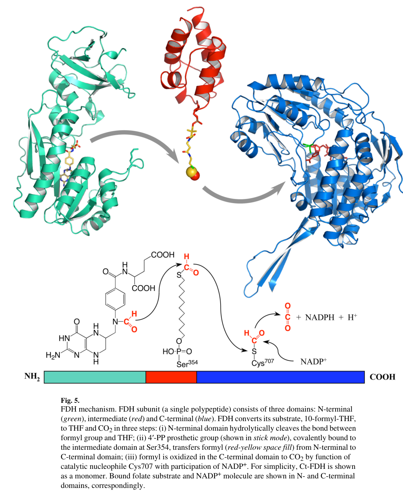

## Question

# Gene Research for Functional Annotation

## ⚠️ CRITICAL: Gene/Protein Identification Context

**BEFORE YOU BEGIN RESEARCH:** You MUST verify you are researching the CORRECT gene/protein. Gene symbols can be ambiguous, especially for less well-characterized genes from non-model organisms.

### Target Gene/Protein Identity (from UniProt):
- **UniProt Accession:** P28037
- **Protein Description:** RecName: Full=Cytosolic 10-formyltetrahydrofolate dehydrogenase {ECO:0000305|PubMed:1848231}; Short=10-FTHFDH {ECO:0000303|PubMed:7822273}; Short=FDH {ECO:0000303|PubMed:10585460}; EC=1.5.1.6 {ECO:0000269|PubMed:10585460, ECO:0000269|PubMed:17302434, ECO:0000269|PubMed:17884809, ECO:0000269|PubMed:1848231, ECO:0000269|PubMed:7822273}; AltName: Full=Aldehyde dehydrogenase family 1 member L1 {ECO:0000312|RGD:621294}; AltName: Full=FBP-CI;
- **Gene Information:** Name=Aldh1l1 {ECO:0000312|RGD:621294}; Synonyms=Fthfd;
- **Organism (full):** Rattus norvegicus (Rat).
- **Protein Family:** In the C-terminal section; belongs to the aldehyde
- **Key Domains:** 10_FTHF_DH. (IPR011407); ACP-like_sf. (IPR036736); Ald_DH/histidinol_DH. (IPR016161); Ald_DH_C. (IPR016163); Ald_DH_CS_CYS. (IPR016160)

### MANDATORY VERIFICATION STEPS:

1. **Check if the gene symbol "Aldh1l1" matches the protein description above**
2. **Verify the organism is correct:** Rattus norvegicus (Rat).
3. **Check if protein family/domains align with what you find in literature**
4. **If you find literature for a DIFFERENT gene with the same or similar symbol, STOP**

### If Gene Symbol is Ambiguous or You Cannot Find Relevant Literature:

**DO NOT PROCEED WITH RESEARCH ON A DIFFERENT GENE.** Instead:
- State clearly: "The gene symbol 'Aldh1l1' is ambiguous or literature is limited for this specific protein"
- Explain what you found (e.g., "Found extensive literature on a different gene with the same symbol in a different organism")
- Describe the protein based ONLY on the UniProt information provided above
- Suggest that the protein function can be inferred from domain/family information

### Research Target:

Please provide a comprehensive research report on the gene **Aldh1l1** (gene ID: Aldh1l1, UniProt: P28037) in rat.

The research report should be a detailed narrative explaining the function, biological processes, and localization of the gene product. Citations should be given for all claims.

You should prioritize authoritative reviews and primary scientific literature when conducting research. You can supplement
this with annotations you find in gene/protein databases, but these can be outdated or inaccurate.

We are specifically interested in the primary function of the gene - for enzymes, what reaction is catalyzed, and what is the substrate specificity? For transporters, what is the substrate? For structural proteins or adapters, what is the broader structural role? For signaling molecules, what is the role in the pathway.

We are interested in where in or outside the cell the gene product carries out its function.

We are also interested in the signaling or biochemical pathways in which the gene functions. We are less interested in broad pleiotropic effects, except where these elucidate the precise role.

Include evidence where possible. We are interested in both experimental evidence as well as inference from structure, evolution, or bioinformatic analysis. Precise studies should be prioritized over high-throughput, where available.

## Output

Question: You are an expert researcher providing comprehensive, well-cited information.

Provide detailed information focusing on:
1. Key concepts and definitions with current understanding
2. Recent developments and latest research (prioritize 2023-2024 sources)
3. Current applications and real-world implementations
4. Expert opinions and analysis from authoritative sources
5. Relevant statistics and data from recent studies

Format as a comprehensive research report with proper citations. Include URLs and publication dates where available.
Always prioritize recent, authoritative sources and provide specific citations for all major claims.

# Gene Research for Functional Annotation

## ⚠️ CRITICAL: Gene/Protein Identification Context

**BEFORE YOU BEGIN RESEARCH:** You MUST verify you are researching the CORRECT gene/protein. Gene symbols can be ambiguous, especially for less well-characterized genes from non-model organisms.

### Target Gene/Protein Identity (from UniProt):
- **UniProt Accession:** P28037
- **Protein Description:** RecName: Full=Cytosolic 10-formyltetrahydrofolate dehydrogenase {ECO:0000305|PubMed:1848231}; Short=10-FTHFDH {ECO:0000303|PubMed:7822273}; Short=FDH {ECO:0000303|PubMed:10585460}; EC=1.5.1.6 {ECO:0000269|PubMed:10585460, ECO:0000269|PubMed:17302434, ECO:0000269|PubMed:17884809, ECO:0000269|PubMed:1848231, ECO:0000269|PubMed:7822273}; AltName: Full=Aldehyde dehydrogenase family 1 member L1 {ECO:0000312|RGD:621294}; AltName: Full=FBP-CI;
- **Gene Information:** Name=Aldh1l1 {ECO:0000312|RGD:621294}; Synonyms=Fthfd;
- **Organism (full):** Rattus norvegicus (Rat).
- **Protein Family:** In the C-terminal section; belongs to the aldehyde
- **Key Domains:** 10_FTHF_DH. (IPR011407); ACP-like_sf. (IPR036736); Ald_DH/histidinol_DH. (IPR016161); Ald_DH_C. (IPR016163); Ald_DH_CS_CYS. (IPR016160)

### MANDATORY VERIFICATION STEPS:

1. **Check if the gene symbol "Aldh1l1" matches the protein description above**
2. **Verify the organism is correct:** Rattus norvegicus (Rat).
3. **Check if protein family/domains align with what you find in literature**
4. **If you find literature for a DIFFERENT gene with the same or similar symbol, STOP**

### If Gene Symbol is Ambiguous or You Cannot Find Relevant Literature:

**DO NOT PROCEED WITH RESEARCH ON A DIFFERENT GENE.** Instead:
- State clearly: "The gene symbol 'Aldh1l1' is ambiguous or literature is limited for this specific protein"
- Explain what you found (e.g., "Found extensive literature on a different gene with the same symbol in a different organism")
- Describe the protein based ONLY on the UniProt information provided above
- Suggest that the protein function can be inferred from domain/family information

### Research Target:

Please provide a comprehensive research report on the gene **Aldh1l1** (gene ID: Aldh1l1, UniProt: P28037) in rat.

The research report should be a detailed narrative explaining the function, biological processes, and localization of the gene product. Citations should be given for all claims.

You should prioritize authoritative reviews and primary scientific literature when conducting research. You can supplement
this with annotations you find in gene/protein databases, but these can be outdated or inaccurate.

We are specifically interested in the primary function of the gene - for enzymes, what reaction is catalyzed, and what is the substrate specificity? For transporters, what is the substrate? For structural proteins or adapters, what is the broader structural role? For signaling molecules, what is the role in the pathway.

We are interested in where in or outside the cell the gene product carries out its function.

We are also interested in the signaling or biochemical pathways in which the gene functions. We are less interested in broad pleiotropic effects, except where these elucidate the precise role.

Include evidence where possible. We are interested in both experimental evidence as well as inference from structure, evolution, or bioinformatic analysis. Precise studies should be prioritized over high-throughput, where available.

## Research Report: Rat **Aldh1l1** (UniProt **P28037**) — Cytosolic 10‑Formyltetrahydrofolate Dehydrogenase (ALDH1L1/FDH)

### Executive summary (identity-verified)
The UniProt accession **P28037** corresponds to **rat Aldh1l1**, encoding **cytosolic 10‑formyltetrahydrofolate dehydrogenase** (common synonyms: **ALDH1L1**, **FDH**, **10‑FTHFDH**; EC **1.5.1.6**). The literature consistently describes this protein as a **cytosolic**, **multidomain**, **tetrameric** enzyme in folate/one‑carbon metabolism, and explicitly distinguishes it from the related **mitochondrial paralog ALDH1L2** (which has a mitochondrial leader peptide and different compartmental role). This alignment of enzymatic function, localization, and architecture verifies that the report is focused on the intended gene/protein target rather than an ambiguous symbol. (krupenko2009fdhanaldehyde pages 2-4, strickland2011phylogenyandevolution pages 1-2, krupenko2018aldh1l1andaldh1l2 pages 7-9)

---

## 1) Key concepts and definitions (current understanding)

### 1.1 Folate-mediated one‑carbon metabolism and the role of ALDH1L1
Folate (tetrahydrofolate, **THF**) coenzymes carry one‑carbon units used for essential biosynthetic and regulatory processes (e.g., nucleotide synthesis and methylation). Within this network, **ALDH1L1 (FDH)** is typically framed as a **catabolic/regulatory folate enzyme** because it **removes** one‑carbon units from the reduced folate pool by oxidizing the **10‑formyl** group to **CO2**, while regenerating THF. This can limit the availability of one‑carbon units for anabolic pathways (such as de novo purine synthesis) while replenishing THF needed for other reactions (including glycine synthesis and histidine degradation). (krupenko2018aldh1l1andaldh1l2 pages 4-7, krupenko2009fdhanaldehyde pages 2-4, strickland2011phylogenyandevolution pages 4-5, rushing2022exploratorymetabolomicsunderscores pages 1-2)

### 1.2 Enzymatic reaction, substrates, cofactors, products
The canonical ALDH1L1 reaction is an **NADP+‑dependent dehydrogenase** reaction:

**10‑formyl‑THF + NADP+ + H2O → THF + CO2 + NADPH + H+** (krupenko2018aldh1l1andaldh1l2 pages 4-7, krupenko2009fdhanaldehyde pages 2-4)

ALDH1L1 also exhibits an **NADP+‑independent hydrolase** activity that releases **formate** from 10‑formyl‑THF, but this hydrolase reaction is part of a coupled mechanism in the intact enzyme; in recombinant enzyme work, the hydrolase activity was reported to proceed at **~21%** of the dehydrogenase rate. (krupenko2009fdhanaldehyde pages 2-4)

### 1.3 Protein architecture and mechanistic model
ALDH1L1 is described as a **~902 amino‑acid** multidomain fusion enzyme (subunit ~100 kDa) assembling as a **tetramer**. It contains (i) an **N‑terminal folate‑binding/hydrolase domain**, (ii) an **intermediate carrier/linker domain** homologous to acyl‑carrier modules that bears a **4′‑phosphopantetheine (4′‑PP)** prosthetic group, and (iii) a **C‑terminal aldehyde dehydrogenase (ALDH)‑like domain** that performs the NADP+‑dependent oxidation step. (krupenko2009fdhanaldehyde pages 2-4, krupenko2009fdhanaldehyde pages 1-2, strickland2011phylogenyandevolution pages 1-2)

Mechanistically, the reaction proceeds via: (1) hydrolytic removal of the formyl group from 10‑formyl‑THF, (2) **transfer via the 4′‑PP “swinging arm”** to the C‑terminal catalytic site, and (3) ALDH‑like oxidation to CO2 with reduction of NADP+ to NADPH. (krupenko2009fdhanaldehyde pages 6-8, strickland2011phylogenyandevolution pages 1-2)

A helpful visual summary of the three-domain architecture and transfer mechanism is provided in **Figure 5** of Krupenko 2009. (krupenko2009fdhanaldehyde media 1b39bd26)

### 1.4 Key catalytic residues (residue-level experimental evidence)
Site‑directed mutagenesis and structural interpretation identify:
- **Hydrolase center:** **His106** and **Asp142** (mutations abolish both hydrolase and dehydrogenase activities). (krupenko2009fdhanaldehyde pages 6-8)
- **Carrier prosthetic group site:** **Ser354** is the 4′‑PP attachment site. (krupenko2009fdhanaldehyde pages 6-8)
- **ALDH center:** **Glu673** and **Cys707** are key for dehydrogenase activity (mutations abolish dehydrogenase but leave hydrolase activity intact). (krupenko2009fdhanaldehyde pages 6-8)

---

## 2) Recent developments and latest research (prioritize 2023–2024)

### 2.1 2023 review context: SGOC metabolism as a cancer vulnerability
A 2023 review on **serine‑glycine‑one‑carbon (SGOC) metabolism** identifies ALDH1L1/ALDH1L2 among the “key metabolic enzymes” in folate‑mediated one‑carbon metabolism, emphasizing the compartmentalized nature of folate metabolism across cytosol and mitochondria and the increasing attention to SGOC metabolism in cancer. This positions ALDH1L1 in contemporary cancer-metabolism framing even when specific mechanistic advances are more frequently discussed for mitochondrial enzymes (e.g., SHMT2, MTHFD2). 
Publication: Sun et al., *Biomarker Research* (Open Access), **May 2023**. URL: https://doi.org/10.1186/s40364-023-00487-4 (sun2023targetingserineglycineonecarbonmetabolism pages 1-2)

### 2.2 2024 review context: mitochondrial folate cycle prominence and ALDH1L2 distinction
A 2024 *Nature Cancer* review focuses strongly on the **mitochondrial folate cycle** and notes that mitochondrial **10‑formyl‑THF** can be metabolized by **ALDH1L2**, which releases the one‑carbon unit as **CO2** while generating **NADPH**; it also notes that cytosolic enzymes can generate 10‑formyl‑THF but that, in most cells, flux is typically **mitochondria → cytosol** via **formate**. Although this review emphasizes ALDH1L2, it provides a modern authoritative compartmentalization context that is important to avoid conflating ALDH1L1 (cytosolic) with ALDH1L2 (mitochondrial).
Publication: Lee et al., *Nature Cancer*, **2 May 2024**. URL: https://doi.org/10.1038/s43018-024-00739-8 (lee2024cyclingbackto pages 2-4, lee2024cyclingbackto pages 1-2)

### 2.3 2024 review context: folate/1C metabolism in cancer and neurodegeneration
A 2024 review in *International Journal of Molecular Sciences* synthesizes folate-dependent one‑carbon metabolism in **cancer and neurodegeneration**, highlighting roles in nucleotide synthesis, methylation, and redox balance, and notes that studies have identified **ALDH1L1 as a potential tumor suppressor**. While the article is broader than ALDH1L1 specifically, it reflects the current translational emphasis on folate/1C metabolism and its links to disease.
Publication: Sobral et al., *Int. J. Mol. Sci.*, **28 Aug 2024**. URL: https://doi.org/10.3390/ijms25179339 (sobral2024unveilingthetherapeutic pages 1-2)

### 2.4 2023–2024 neuroscience implementation: Aldh1l1 as an astrocyte handle
A 2023 primary study used **Aldh1l1‑EGFP/Rpl10a** TRAP methodology in primary cortical astrocyte cultures to measure ethanol‑induced transcriptional and translational changes. While this does not establish ALDH1L1’s enzymatic function (which is biochemical), it demonstrates a major **real‑world implementation**: leveraging Aldh1l1 expression to isolate astrocyte translatomes.
Publication: Hashimoto et al., *Frontiers in Neuroscience*, **21 Jun 2023**. URL: https://doi.org/10.3389/fnins.2023.1193304 (hashimoto2023ethanolinducedtranscriptionaland pages 1-2)

A 2024 study on astrocytic NF‑κB notes marker coverage considerations (e.g., GFAP not labeling all astrocytes), consistent with ALDH1L1’s continued use as a broad astrocyte marker in contemporary neurobiology.
Publication: Huat et al., *Scientific Reports*, **Jun 2024**. URL: https://doi.org/10.1038/s41598-024-65248-1 (huat2024theimpactof pages 1-2)

---

## 3) Current applications and real‑world implementations

### 3.1 Functional annotation applications (metabolic biology)
Because ALDH1L1 irreversibly converts 10‑formyl‑THF to THF and CO2 while generating NADPH, it is used conceptually as:
- a **regulator of reduced folate pools** and one‑carbon flux into biosynthetic pathways;
- a potential contributor to **formate clearance** (via 10‑formyl‑THF as intermediate);
- a metabolic node linking folate chemistry to **glycine biosynthesis** and **histidine degradation** via THF availability. (krupenko2018aldh1l1andaldh1l2 pages 4-7, strickland2011phylogenyandevolution pages 4-5, rushing2022exploratorymetabolomicsunderscores pages 1-2)

### 3.2 Astrocyte profiling/manipulation (neuroscience tools)
Aldh1l1 promoter-driven systems (e.g., **Aldh1l1‑EGFP/Rpl10a TRAP**) are used to enrich astrocyte‑specific translating mRNAs and quantify response programs to insults such as ethanol exposure, an application that is now routine in glial biology. (hashimoto2023ethanolinducedtranscriptionaland pages 1-2)

### 3.3 Cancer research (biomarker and mechanism)
ALDH1L1 is widely described as being **downregulated/silenced** in cancers and is framed as a **candidate tumor suppressor** in authoritative sources. A prominent mechanistic hypothesis is that ALDH1L1 constrains one‑carbon availability for proliferation-associated biosynthesis; in many tumors this “metabolic brake” is removed. (krupenko2018aldh1l1andaldh1l2 pages 7-9)

---

## 4) Expert opinions and analysis (authoritative synthesis)

### 4.1 “Metabolic brake” model: ALDH1L1 as a regulator of anabolic one‑carbon use
The Krupenko reviews describe ALDH1L1 as an unusually abundant cytosolic enzyme (in liver) that can clear one‑carbon units as CO2 and thereby **restrict** one‑carbon flux into biosynthetic processes, while regenerating THF. This provides a coherent mechanistic rationale for why ALDH1L1 loss could benefit proliferating cancer cells (greater one‑carbon retention for purines/thymidylate/methylation), whereas ALDH1L1 expression may oppose proliferation. (krupenko2018aldh1l1andaldh1l2 pages 4-7, krupenko2009fdhanaldehyde pages 2-4, krupenko2018aldh1l1andaldh1l2 pages 7-9)

### 4.2 Compartmentalization and paralog distinction: ALDH1L1 vs ALDH1L2
A recurring expert emphasis is that mammalian folate/one‑carbon metabolism is **compartmentalized** and includes **cytosolic ALDH1L1** and **mitochondrial ALDH1L2**. ALDH1L2 is described as producing mitochondrial NADPH and releasing CO2 in mitochondria; modern cancer metabolism reviews often focus on mitochondrial one‑carbon flux and its systemic outputs (e.g., formate overflow), so careful compartment assignment is essential when interpreting “ALDH1L” mentions. (krupenko2018aldh1l1andaldh1l2 pages 7-9, lee2024cyclingbackto pages 2-4)

---

## 5) Relevant statistics and data (from recent and/or authoritative studies)

### 5.1 Enzyme abundance and activity partitioning
- **Rat liver abundance:** ALDH1L1 can constitute **~1.2% of total rat liver cytosolic protein**, indicating very high expression for a metabolic enzyme. (krupenko2018aldh1l1andaldh1l2 pages 4-7, krupenko2009fdhanaldehyde pages 2-4)
- **Hydrolase activity:** NADP+‑independent hydrolase activity proceeds at approximately **21%** of the dehydrogenase rate in recombinant enzyme analyses. (krupenko2009fdhanaldehyde pages 2-4)

### 5.2 Metabolic consequences of ALDH1L1 loss (functional evidence)
A mouse Aldh1l1 knockout study (used here as strong mammalian functional evidence consistent with rat biochemistry) reported:
- Liver **formiminoglutamate (FIGLU)** increased **>15‑fold** (FIGLU is a marker of functional folate deficiency in histidine catabolism). (krupenko2019cytosolic10formyltetrahydrofolatedehydrogenase pages 2-3)
- Total liver folate pool decreased modestly (~**1.2‑fold** in males, ~**1.4‑fold** in females), indicating that metabolic disruptions can occur even without massive folate depletion. (krupenko2019cytosolic10formyltetrahydrofolatedehydrogenase pages 2-3)

### 5.3 Cancer/epigenetic regulation statistics
A key quantitative observation about ALDH1L1 in cancer is CpG‑island methylation:
- In cancer cell lines, bisulfite sequencing indicated **76–95% CpG methylation** in the ALDH1L1 promoter CpG island (reported to contain **96 CpG pairs**), with tumor samples showing methylation patterns not seen in matched normal tissues; methylation correlated with reduced ALDH1L1 expression. (krupenko2018aldh1l1andaldh1l2 pages 4-7, krupenko2018aldh1l1andaldh1l2 pages 7-9)

### 5.4 Cell metabolism data (ALDH1L1 perturbation)
In RT4 bladder cancer cells, experimental ALDH1L1 loss (shRNA/CRISPR) caused:
- **~8‑fold decrease in glycine**, and decreases in metabolites linked to S‑adenosylmethionine‑utilizing pathways, with broader metabolome changes. (rushing2022exploratorymetabolomicsunderscores pages 1-2)

---

## Rat-focused functional annotation summary (recommended for database curation)

| Aspect | Summary | Evidence/notes |
|---|---|---|
| Verified identity | **Rat Aldh1l1 / ALDH1L1 / FDH / 10-FTHFDH / cytosolic 10-formyltetrahydrofolate dehydrogenase**, EC **1.5.1.6**; UniProt target **P28037** matches the literature description of a **cytosolic** folate enzyme distinct from mitochondrial **ALDH1L2**. | Reviews consistently describe ALDH1L1 as the mammalian **cytosolic** 10-formyl-THF dehydrogenase and distinguish ALDH1L2 as the mitochondrial paralog with a leader peptide; ALDH1L2 is ~72% identical to ALDH1L1 and should not be conflated with rat ALDH1L1 (krupenko2009fdhanaldehyde pages 2-4, strickland2011phylogenyandevolution pages 1-2, krupenko2018aldh1l1andaldh1l2 pages 7-9, krupenko2018aldh1l1andaldh1l2 pages 4-7). |
| Catalytic reaction | Overall reaction: **10-formyl-THF + NADP+ + H2O → THF + CO2 + NADPH + H+**. ALDH1L1 also has a **NADP+-independent hydrolase** activity releasing formate from 10-formyl-THF, but this is only part of the full coupled reaction. | The dehydrogenase reaction is the canonical, physiologically emphasized activity; the hydrolase activity proceeds at about **21%** of the dehydrogenase rate in recombinant enzyme studies. Functionally, the reaction **removes one-carbon units as CO2**, **replenishes THF**, and helps regulate **purine synthesis, histidine degradation, glycine synthesis, methylation flux, and formate clearance** (krupenko2018aldh1l1andaldh1l2 pages 4-7, krupenko2009fdhanaldehyde pages 2-4, krupenko2009fdhanaldehyde pages 1-2, strickland2011phylogenyandevolution pages 1-2, rushing2022exploratorymetabolomicsunderscores pages 1-2). |
| Domain architecture | ALDH1L1 is a **multidomain/tetrameric fusion enzyme** of ~**902 aa** with ~**100 kDa** subunits: **N-terminal folate-binding/hydrolase domain** (~residues 1–310), **intermediate acyl-carrier-like linker** (~311–399/419), and **C-terminal ALDH-like dehydrogenase domain** (~400/420–902). | The enzyme is a natural fusion of folate-hydrolase, carrier, and ALDH modules; the **intermediate domain couples** the two catalytic centers and is essential for full FDH activity (krupenko2009fdhanaldehyde pages 2-4, strickland2011phylogenyandevolution pages 4-5, krupenko2009fdhanaldehyde pages 1-2, strickland2011phylogenyandevolution pages 1-2, krupenko2009fdhanaldehyde media 1b39bd26). |
| Key catalytic residues | **His106** and **Asp142** define the hydrolase active center; **Ser354** carries the **4′-phosphopantetheine (4′-PP)** prosthetic group; **Glu673** and **Cys707** are key ALDH-domain catalytic residues for the oxidative step. | Mutagenesis data: His106/Asp142 mutations abolish hydrolase and dehydrogenase activities; Glu673/Cys707 mutations abolish dehydrogenase while leaving hydrolase intact; Ser354 is the 4′-PP attachment site in the carrier domain (krupenko2009fdhanaldehyde pages 6-8, krupenko2009fdhanaldehyde media 1b39bd26). |
| Mechanistic steps | **Step 1:** N-terminal domain hydrolytically removes the formyl group from 10-formyl-THF. **Step 2:** The formyl group is transferred onto the **4′-PP swinging arm** attached to **Ser354** in the intermediate domain. **Step 3:** The C-terminal ALDH domain oxidizes the transferred formyl group to **CO2**, reducing **NADP+ → NADPH**. | The 4′-PP arm extends ~**20 Å**; the ALDH catalytic center lies at the end of a ~**12 Å** tunnel, supporting the carrier-mediated channeling model. The hydrolase step must precede dehydrogenase catalysis (krupenko2009fdhanaldehyde pages 6-8, strickland2011phylogenyandevolution pages 1-2, krupenko2009fdhanaldehyde media 1b39bd26). |
| Subcellular localization | **Cytosolic/cytoplasmic** enzyme; part of the **cytosolic folate/one-carbon pathway**. Not the mitochondrial enzyme. | Cytosolic localization is a core identifier throughout the FDH/ALDH1L1 literature; mitochondrial one-carbon oxidation to CO2 is carried out by **ALDH1L2**, not ALDH1L1 (krupenko2018aldh1l1andaldh1l2 pages 4-7, krupenko2009fdhanaldehyde pages 2-4, strickland2011phylogenyandevolution pages 4-5, strickland2011phylogenyandevolution pages 1-2, lee2024cyclingbackto pages 2-4). |
| Tissue expression highlights | Highly expressed in **liver, kidney, pancreas**; in rat liver cytosol ALDH1L1 can comprise about **1.2% of total cytosolic protein**, indicating an unusually abundant metabolic enzyme. | Reviews report highest mRNA/protein abundance in liver/kidney/pancreas and absent/undetectable expression in several other tissues (e.g., placenta, spleen, thymus, small intestine, leukocytes, testis, ovary in cited surveys). Rat liver abundance (~1.2%) is repeatedly noted (krupenko2018aldh1l1andaldh1l2 pages 4-7, krupenko2009fdhanaldehyde pages 2-4). |
| Brain / astrocyte relevance | ALDH1L1 is widely used as a **pan-astrocyte marker/promoter** in neuroscience, although this reflects expression pattern rather than the primary enzymatic function. In developing brain, ALDH1L1 is associated with **quiescent** rather than proliferating cells. | Modern astrocyte studies use **Aldh1l1-EGFP/Rpl10a** and **Aldh1l1-Cre/ERT2** tools for cell-type-specific profiling/manipulation; reviews and experimental papers note ALDH1L1 as broader astrocyte coverage than GFAP in many CNS settings (krupenko2018aldh1l1andaldh1l2 pages 4-7, hashimoto2023ethanolinducedtranscriptionaland pages 1-2, huat2024theimpactof pages 1-2). |
| Quantitative functional phenotypes | Loss of ALDH1L1 perturbs folate-linked metabolism: in mouse liver **FIGLU increased >15-fold** and liver total folate decreased by ~**1.2-fold (males)** / ~**1.4-fold (females)**; in RT4 cancer cells ALDH1L1 loss caused an ~**8-fold decrease in glycine**. | These quantitative studies support ALDH1L1 as a regulator of **THF availability**, **glycine production**, **histidine degradation**, and **methylation-linked metabolism**, even when gross phenotypes are mild (krupenko2019cytosolic10formyltetrahydrofolatedehydrogenase pages 2-3, rushing2022exploratorymetabolomicsunderscores pages 1-2). |
| Pathway role | ALDH1L1 functions in **folate-mediated one-carbon metabolism**, especially catabolic removal of 1C units from **10-formyl-THF** and regeneration of **THF** for interconnected pathways. | Expert interpretation: ALDH1L1 can limit flux into folate-dependent biosynthesis while sustaining THF-dependent reactions; it is linked to **formate detoxification/clearance**, **purine biosynthesis control**, **glycine synthesis from serine**, and **cellular methylation status** (krupenko2018aldh1l1andaldh1l2 pages 4-7, strickland2011phylogenyandevolution pages 4-5, rushing2022exploratorymetabolomicsunderscores pages 1-2, lee2024cyclingbackto pages 1-2). |
| Disease relevance: cancer | ALDH1L1 is widely viewed as a **candidate tumor suppressor/metabolic brake** and is frequently **downregulated or silenced** in cancers, often via **promoter/CpG island methylation**. Re-expression in cancer cells is antiproliferative. | Quantitative methylation detail: reported **76–95% CpG methylation** in cancer cell lines; decreased expression is associated with more aggressive disease in several tumor contexts, while re-expression can induce **cell-cycle arrest/apoptosis** (krupenko2018aldh1l1andaldh1l2 pages 7-9, krupenko2018aldh1l1andaldh1l2 pages 4-7, sobral2024unveilingthetherapeutic pages 1-2). |
| Biomedical applications | **Functional annotation:** marker of cytosolic folate catabolism and THF regeneration. **Research tool:** Aldh1l1 promoter-driven reporter/TRAP/Cre lines for astrocyte profiling. **Translational interest:** epigenetic status and metabolic consequences of ALDH1L1 loss in cancer. | Useful both as a mechanistically defined folate enzyme and as a practical cell-type handle in neurobiology; however, astrocyte-tool use should not be mistaken for a change in the enzyme’s core biochemical identity (rushing2022exploratorymetabolomicsunderscores pages 1-2, hashimoto2023ethanolinducedtranscriptionaland pages 1-2, huat2024theimpactof pages 1-2). |

*Table: This table condenses the verified identity, enzymatic mechanism, localization, expression, and biomedical relevance of rat ALDH1L1 (UniProt P28037). It is designed as a quick reference for functional annotation and literature-grounded interpretation.*

**Subcellular site of action:** cytosol/cytoplasm. (krupenko2018aldh1l1andaldh1l2 pages 4-7, krupenko2009fdhanaldehyde pages 2-4)

**Primary molecular function:** NADP+‑dependent dehydrogenase acting on **10‑formyl‑THF**, producing **THF + CO2 + NADPH** (EC 1.5.1.6). (krupenko2018aldh1l1andaldh1l2 pages 4-7, krupenko2009fdhanaldehyde pages 2-4)

**Pathway placement:** folate‑mediated one‑carbon metabolism (catabolic one‑carbon disposal and THF regeneration), with downstream impact on glycine synthesis and methylation‑linked metabolism. (rushing2022exploratorymetabolomicsunderscores pages 1-2)

**Tissue/cell-type context:** high abundance in **rat liver cytosol** and high expression in **liver/kidney/pancreas**; widely leveraged as an astrocyte marker/promoter in CNS research. (krupenko2018aldh1l1andaldh1l2 pages 4-7, hashimoto2023ethanolinducedtranscriptionaland pages 1-2)

---

## Limitations of this synthesis
Rat-specific mechanistic enzymology (e.g., full kinetic constants, substrate specificity beyond 10‑formyl‑THF, and comprehensive rat tissue atlases) was not fully captured in the retrieved full texts here. Where mammalian functional evidence is not rat-specific (e.g., mouse KO phenotypes), it is used only to support conserved mechanistic roles and should be treated as supportive rather than strictly rat-validated. (krupenko2019cytosolic10formyltetrahydrofolatedehydrogenase pages 2-3)

References

1. (krupenko2009fdhanaldehyde pages 2-4): Sergey A. Krupenko. Fdh: an aldehyde dehydrogenase fusion enzyme in folate metabolism. Chemico-biological interactions, 178 1-3:84-93, Mar 2009. URL: https://doi.org/10.1016/j.cbi.2008.09.007, doi:10.1016/j.cbi.2008.09.007. This article has 122 citations and is from a peer-reviewed journal.

2. (strickland2011phylogenyandevolution pages 1-2): Kyle C. Strickland, Roger S. Holmes, Natalia V. Oleinik, Natalia I. Krupenko, and Sergey A. Krupenko. Phylogeny and evolution of aldehyde dehydrogenase-homologous folate enzymes. Chemico-biological interactions, 191 1-3:122-8, May 2011. URL: https://doi.org/10.1016/j.cbi.2010.12.025, doi:10.1016/j.cbi.2010.12.025. This article has 18 citations and is from a peer-reviewed journal.

3. (krupenko2018aldh1l1andaldh1l2 pages 7-9): Sergey A. Krupenko and Natalia I. Krupenko. Aldh1l1 and aldh1l2 folate regulatory enzymes in cancer. Advances in experimental medicine and biology, 1032:127-143, Jan 2018. URL: https://doi.org/10.1007/978-3-319-98788-0\_10, doi:10.1007/978-3-319-98788-0\_10. This article has 69 citations and is from a peer-reviewed journal.

4. (krupenko2018aldh1l1andaldh1l2 pages 4-7): Sergey A. Krupenko and Natalia I. Krupenko. Aldh1l1 and aldh1l2 folate regulatory enzymes in cancer. Advances in experimental medicine and biology, 1032:127-143, Jan 2018. URL: https://doi.org/10.1007/978-3-319-98788-0\_10, doi:10.1007/978-3-319-98788-0\_10. This article has 69 citations and is from a peer-reviewed journal.

5. (strickland2011phylogenyandevolution pages 4-5): Kyle C. Strickland, Roger S. Holmes, Natalia V. Oleinik, Natalia I. Krupenko, and Sergey A. Krupenko. Phylogeny and evolution of aldehyde dehydrogenase-homologous folate enzymes. Chemico-biological interactions, 191 1-3:122-8, May 2011. URL: https://doi.org/10.1016/j.cbi.2010.12.025, doi:10.1016/j.cbi.2010.12.025. This article has 18 citations and is from a peer-reviewed journal.

6. (rushing2022exploratorymetabolomicsunderscores pages 1-2): Blake R. Rushing, Halle M. Fogle, Jaspreet Sharma, Mikyoung You, Jonathan P. McCormac, Sabrina Molina, Susan Sumner, Natalia I. Krupenko, and Sergey A. Krupenko. Exploratory metabolomics underscores the folate enzyme aldh1l1 as a regulator of glycine and methylation reactions. Molecules, 27:8394, Dec 2022. URL: https://doi.org/10.3390/molecules27238394, doi:10.3390/molecules27238394. This article has 19 citations.

7. (krupenko2009fdhanaldehyde pages 1-2): Sergey A. Krupenko. Fdh: an aldehyde dehydrogenase fusion enzyme in folate metabolism. Chemico-biological interactions, 178 1-3:84-93, Mar 2009. URL: https://doi.org/10.1016/j.cbi.2008.09.007, doi:10.1016/j.cbi.2008.09.007. This article has 122 citations and is from a peer-reviewed journal.

8. (krupenko2009fdhanaldehyde pages 6-8): Sergey A. Krupenko. Fdh: an aldehyde dehydrogenase fusion enzyme in folate metabolism. Chemico-biological interactions, 178 1-3:84-93, Mar 2009. URL: https://doi.org/10.1016/j.cbi.2008.09.007, doi:10.1016/j.cbi.2008.09.007. This article has 122 citations and is from a peer-reviewed journal.

9. (krupenko2009fdhanaldehyde media 1b39bd26): Sergey A. Krupenko. Fdh: an aldehyde dehydrogenase fusion enzyme in folate metabolism. Chemico-biological interactions, 178 1-3:84-93, Mar 2009. URL: https://doi.org/10.1016/j.cbi.2008.09.007, doi:10.1016/j.cbi.2008.09.007. This article has 122 citations and is from a peer-reviewed journal.

10. (sun2023targetingserineglycineonecarbonmetabolism pages 1-2): Wei Sun, Ruochen Liu, Xinyue Gao, Zini Lin, Hongao Tang, Hongjuan Cui, and Erhu Zhao. Targeting serine-glycine-one-carbon metabolism as a vulnerability in cancers. Biomarker Research, May 2023. URL: https://doi.org/10.1186/s40364-023-00487-4, doi:10.1186/s40364-023-00487-4. This article has 60 citations and is from a peer-reviewed journal.

11. (lee2024cyclingbackto pages 2-4): Younghwan Lee, Karen H. Vousden, and Marc Hennequart. Cycling back to folate metabolism in cancer. Nature cancer, 5:701-715, May 2024. URL: https://doi.org/10.1038/s43018-024-00739-8, doi:10.1038/s43018-024-00739-8. This article has 55 citations and is from a highest quality peer-reviewed journal.

12. (lee2024cyclingbackto pages 1-2): Younghwan Lee, Karen H. Vousden, and Marc Hennequart. Cycling back to folate metabolism in cancer. Nature cancer, 5:701-715, May 2024. URL: https://doi.org/10.1038/s43018-024-00739-8, doi:10.1038/s43018-024-00739-8. This article has 55 citations and is from a highest quality peer-reviewed journal.

13. (sobral2024unveilingthetherapeutic pages 1-2): Ana Filipa Sobral, Andrea Cunha, Vera Silva, Eva Gil-Martins, Renata Silva, and Daniel José Barbosa. Unveiling the therapeutic potential of folate-dependent one-carbon metabolism in cancer and neurodegeneration. International Journal of Molecular Sciences, 25:9339, Aug 2024. URL: https://doi.org/10.3390/ijms25179339, doi:10.3390/ijms25179339. This article has 60 citations.

14. (hashimoto2023ethanolinducedtranscriptionaland pages 1-2): Joel G. Hashimoto, Xiaolu Zhang, and Marina Guizzetti. Ethanol-induced transcriptional and translational changes in aldh1l1-egfp/rpl10a cortical astrocyte cultures. Frontiers in Neuroscience, Jun 2023. URL: https://doi.org/10.3389/fnins.2023.1193304, doi:10.3389/fnins.2023.1193304. This article has 7 citations and is from a peer-reviewed journal.

15. (huat2024theimpactof pages 1-2): Tee Jong Huat, Judith Camats-Perna, Estella A. Newcombe, Tessa Onraet, Daniel Campbell, Josiah T. Sucic, Alessandra Martini, Stefânia Forner, Mehdi Mirzaei, Wayne Poon, Frank M. LaFerla, and Rodrigo Medeiros. The impact of astrocytic nf-κb on healthy and alzheimer’s disease brains. Scientific Reports, Jun 2024. URL: https://doi.org/10.1038/s41598-024-65248-1, doi:10.1038/s41598-024-65248-1. This article has 54 citations and is from a peer-reviewed journal.

16. (krupenko2019cytosolic10formyltetrahydrofolatedehydrogenase pages 2-3): Natalia I. Krupenko, Jaspreet Sharma, Peter Pediaditakis, Baharan Fekry, Kristi L. Helke, Xiuxia Du, Susan Sumner, and Sergey A. Krupenko. Cytosolic 10-formyltetrahydrofolate dehydrogenase regulates glycine metabolism in mouse liver. Scientific Reports, Oct 2019. URL: https://doi.org/10.1038/s41598-019-51397-1, doi:10.1038/s41598-019-51397-1. This article has 29 citations and is from a peer-reviewed journal.

## Artifacts

- [Edison artifact artifact-00](Aldh1l1-deep-research-falcon_artifacts/artifact-00.md)

## Citations

1. krupenko2009fdhanaldehyde pages 2-4
2. krupenko2009fdhanaldehyde pages 6-8
3. sun2023targetingserineglycineonecarbonmetabolism pages 1-2
4. sobral2024unveilingthetherapeutic pages 1-2
5. hashimoto2023ethanolinducedtranscriptionaland pages 1-2
6. huat2024theimpactof pages 1-2
7. rushing2022exploratorymetabolomicsunderscores pages 1-2
8. strickland2011phylogenyandevolution pages 1-2
9. strickland2011phylogenyandevolution pages 4-5
10. krupenko2009fdhanaldehyde pages 1-2
11. lee2024cyclingbackto pages 2-4
12. lee2024cyclingbackto pages 1-2
13. https://doi.org/10.1186/s40364-023-00487-4
14. https://doi.org/10.1038/s43018-024-00739-8
15. https://doi.org/10.3390/ijms25179339
16. https://doi.org/10.3389/fnins.2023.1193304
17. https://doi.org/10.1038/s41598-024-65248-1
18. https://doi.org/10.1016/j.cbi.2008.09.007,
19. https://doi.org/10.1016/j.cbi.2010.12.025,
20. https://doi.org/10.1007/978-3-319-98788-0\_10,
21. https://doi.org/10.3390/molecules27238394,
22. https://doi.org/10.1186/s40364-023-00487-4,
23. https://doi.org/10.1038/s43018-024-00739-8,
24. https://doi.org/10.3390/ijms25179339,
25. https://doi.org/10.3389/fnins.2023.1193304,
26. https://doi.org/10.1038/s41598-024-65248-1,
27. https://doi.org/10.1038/s41598-019-51397-1,